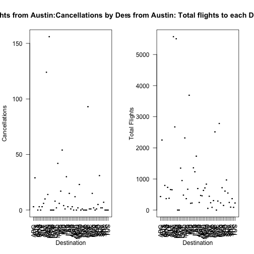
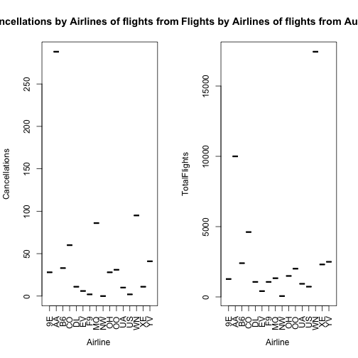

#Flights at ABIA

```
## The following object is masked _by_ .GlobalEnv:
## 
##     Cancelled
## 
## The following objects are masked from AirportInfo (pos = 4):
## 
##     ActualElapsedTime, AirTime, ArrDelay, ArrTime,
##     CancellationCode, Cancelled, CarrierDelay, CRSArrTime,
##     CRSDepTime, CRSElapsedTime, DayofMonth, DayOfWeek, DepDelay,
##     DepTime, Dest, Distance, Diverted, FlightNum,
##     LateAircraftDelay, Month, NASDelay, Origin, SecurityDelay,
##     TailNum, TaxiIn, TaxiOut, UniqueCarrier, WeatherDelay, Year
## 
## The following objects are masked from AirportInfo (pos = 14):
## 
##     ActualElapsedTime, AirTime, ArrDelay, ArrTime,
##     CancellationCode, Cancelled, CarrierDelay, CRSArrTime,
##     CRSDepTime, CRSElapsedTime, DayofMonth, DayOfWeek, DepDelay,
##     DepTime, Dest, Distance, Diverted, FlightNum,
##     LateAircraftDelay, Month, NASDelay, Origin, SecurityDelay,
##     TailNum, TaxiIn, TaxiOut, UniqueCarrier, WeatherDelay, Year
```

```
##  [1] "Year"              "Month"             "DayofMonth"       
##  [4] "DayOfWeek"         "DepTime"           "CRSDepTime"       
##  [7] "ArrTime"           "CRSArrTime"        "UniqueCarrier"    
## [10] "FlightNum"         "TailNum"           "ActualElapsedTime"
## [13] "CRSElapsedTime"    "AirTime"           "ArrDelay"         
## [16] "DepDelay"          "Origin"            "Dest"             
## [19] "Distance"          "TaxiIn"            "TaxiOut"          
## [22] "Cancelled"         "CancellationCode"  "Diverted"         
## [25] "CarrierDelay"      "WeatherDelay"      "NASDelay"         
## [28] "SecurityDelay"     "LateAircraftDelay"
```

```
##  [1] "Year"              "Month"             "DayofMonth"       
##  [4] "DayOfWeek"         "DepTime"           "CRSDepTime"       
##  [7] "ArrTime"           "CRSArrTime"        "UniqueCarrier"    
## [10] "FlightNum"         "TailNum"           "ActualElapsedTime"
## [13] "CRSElapsedTime"    "AirTime"           "ArrDelay"         
## [16] "DepDelay"          "Origin"            "Dest"             
## [19] "Distance"          "TaxiIn"            "TaxiOut"          
## [22] "Cancelled"         "CancellationCode"  "Diverted"         
## [25] "CarrierDelay"      "WeatherDelay"      "NASDelay"         
## [28] "SecurityDelay"     "LateAircraftDelay" "Austin"
```

```
## [1] "Month"     "Cancelled" "Austin"
```

```
## [1] "Month"     "Cancelled" "Austin"
```

 

- March had the most flights cancelled.


```
##  [1] "Year"              "Month"             "DayofMonth"       
##  [4] "DayOfWeek"         "DepTime"           "CRSDepTime"       
##  [7] "ArrTime"           "CRSArrTime"        "UniqueCarrier"    
## [10] "FlightNum"         "TailNum"           "ActualElapsedTime"
## [13] "CRSElapsedTime"    "AirTime"           "ArrDelay"         
## [16] "DepDelay"          "Origin"            "Dest"             
## [19] "Distance"          "TaxiIn"            "TaxiOut"          
## [22] "Cancelled"         "CancellationCode"  "Diverted"         
## [25] "CarrierDelay"      "WeatherDelay"      "NASDelay"         
## [28] "SecurityDelay"     "LateAircraftDelay" "Austin"
```

```
## [1] "Dest"      "Cancelled" "Austin"
```

```
##  [1]  435 2252  792  368  730  380  659  653 5573 2673 5506    1    1 1349
## [15]  949  481 2319  367  670 3691  218  226 1358 1231 1733  692  245  470
## [29]  459  632  712  834   55  444  236   88  305 2514    1  290 2783  231
## [43]  719  149  610  968  548  245   95  367   88  228
```

 

- This shows the number of cancellations of flights from Austin to various airports. Dallas has by far the most cancellations, however it also had the most flights.


 

- This shows the percent of flights to each destination that are cancelled.


```
## [1] "DayOfWeek" "Cancelled" "Austin"
```

 

- This shows the total cancellations by day of the week on flights from Austin. Tuesday had the most cancellations by roughly 70 cancellations over the course of the year.


```
##  [1] "Year"              "Month"             "DayofMonth"       
##  [4] "DayOfWeek"         "DepTime"           "CRSDepTime"       
##  [7] "ArrTime"           "CRSArrTime"        "UniqueCarrier"    
## [10] "FlightNum"         "TailNum"           "ActualElapsedTime"
## [13] "CRSElapsedTime"    "AirTime"           "ArrDelay"         
## [16] "DepDelay"          "Origin"            "Dest"             
## [19] "Distance"          "TaxiIn"            "TaxiOut"          
## [22] "Cancelled"         "CancellationCode"  "Diverted"         
## [25] "CarrierDelay"      "WeatherDelay"      "NASDelay"         
## [28] "SecurityDelay"     "LateAircraftDelay" "Austin"
```

 

- This shows cancellations on flights from Austin by airline next to the total number of flights from Austin by each airline in 2008.
 

- This shows the percent of flights cancelled by airline for flights from Austin. While American airlines cancelled the most flights in 2008, American Eagle cancelled the largest percentage of its flights.

#Author Attribution
- I used Naive Bayes and Random Forest to try to determine the authors of each article.

```r
library(tm)
```

```
## 
## Attaching package: 'tm'
## 
## The following object is masked from 'package:arules':
## 
##     inspect
```

```r
library(e1071)
library(rpart)
library(ggplot2)
library(caret)

#reader function
readerPlain = function(fname){
  readPlain(elem=list(content=readLines(fname)), id=fname, language='en') }
```

##Training Corpus

```r
author_dirs = Sys.glob('./ReutersC50/C50train/*')
file_list = NULL
train_labels = NULL
for(author in author_dirs) {
  author_name = substring(author, first=23)
  files_to_add = Sys.glob(paste0(author, '/*.txt'))
  file_list = append(file_list, files_to_add)
  train_labels = append(train_labels, rep(author_name, length(files_to_add)))
}

all_docs = lapply(file_list, readerPlain) 
names(all_docs) = file_list
names(all_docs) = sub('.txt', '', names(all_docs))


train_corpus = Corpus(VectorSource(all_docs))
names(train_corpus) = file_list


train_corpus = tm_map(train_corpus, content_transformer(tolower)) 
train_corpus = tm_map(train_corpus, content_transformer(removeNumbers)) 
train_corpus = tm_map(train_corpus, content_transformer(removePunctuation)) 
train_corpus = tm_map(train_corpus, content_transformer(stripWhitespace)) 
train_corpus = tm_map(train_corpus, content_transformer(removeWords), stopwords("SMART"))
```
- Here I'm putting the training articles into one corpus and cleaning/ tokenizing similarly to the example in class.

- Next comes making a data matrix and removing sparse terms.

```r
DTM_train = DocumentTermMatrix(train_corpus)
DTM_train = removeSparseTerms(DTM_train, 0.95)
```


##Testing Corpus

```r
author_dirs = Sys.glob('./ReutersC50/C50test/*')
file_list = NULL
test_labels = NULL
for(author in author_dirs) {
  author_name = substring(author, first=22)
  files_to_add = Sys.glob(paste0(author, '/*.txt'))
  file_list = append(file_list, files_to_add)
  test_labels = append(test_labels, rep(author_name, length(files_to_add)))
}


all_docs = lapply(file_list, readerPlain) 
names(all_docs) = file_list
names(all_docs) = sub('.txt', '', names(all_docs))


test_corpus = Corpus(VectorSource(all_docs))
names(test_corpus) = file_list

test_corpus = tm_map(test_corpus, content_transformer(tolower)) 
test_corpus = tm_map(test_corpus, content_transformer(removeNumbers)) 
test_corpus = tm_map(test_corpus, content_transformer(removePunctuation)) 
test_corpus = tm_map(test_corpus, content_transformer(stripWhitespace)) 
test_corpus = tm_map(test_corpus, content_transformer(removeWords), stopwords("SMART"))
```
- The process for creating the testing corpus is similar to the training corpus to this point.


```r
reuters_dict = dimnames(DTM_train)[[2]]


DTM_test = DocumentTermMatrix(test_corpus, list(dictionary=reuters_dict))
DTM_test = removeSparseTerms(DTM_test, 0.95)


DTM_train_df = as.data.frame(inspect(DTM_train))
```

```
## <<DocumentTermMatrix (documents: 2500, terms: 641)>>
## Non-/sparse entries: 180911/1421589
## Sparsity           : 89%
## Maximal term length: 18
## Weighting          : term frequency (tf)
## 
##                                                           Terms
## Docs                                                       access account
##   ./ReutersC50/C50train/AaronPressman/106247newsML.txt          1       0
##   ./ReutersC50/C50train/AaronPressman/120600newsML.txt          0       0
##   ./ReutersC50/C50train/AaronPressman/120683newsML.txt          2       0
##   ./ReutersC50/C50train/AaronPressman/136958newsML.txt          0       0
##   ./ReutersC50/C50train/AaronPressman/137498newsML.txt          0       0
##   ./ReutersC50/C50train/AaronPressman/14014newsML.txt           0       0
##   ./ReutersC50/C50train/AaronPressman/156814newsML.txt          0       0
##   ./ReutersC50/C50train/AaronPressman/182596newsML.txt          0       0
##   ./ReutersC50/C50train/AaronPressman/186392newsML.txt          0       0
##   ./ReutersC50/C50train/AaronPressman/193495newsML.txt          4       0
##   ./ReutersC50/C50train/AaronPressman/196805newsML.txt          1       0
##   ./ReutersC50/C50train/AaronPressman/197734newsML.txt          4       0
##   ./ReutersC50/C50train/AaronPressman/206838newsML.txt          0       0
##   ./ReutersC50/C50train/AaronPressman/231479newsML.txt          0       0
##   ./ReutersC50/C50train/AaronPressman/233150newsML.txt          0       0
##                                                           Terms
## Docs                                                       acquisition
##   ./ReutersC50/C50train/AaronPressman/106247newsML.txt               0
##   ./ReutersC50/C50train/AaronPressman/120600newsML.txt               0
##   ./ReutersC50/C50train/AaronPressman/120683newsML.txt               0
##   ./ReutersC50/C50train/AaronPressman/136958newsML.txt               0
##   ./ReutersC50/C50train/AaronPressman/137498newsML.txt               0
##   ./ReutersC50/C50train/AaronPressman/14014newsML.txt                0
##   ./ReutersC50/C50train/AaronPressman/156814newsML.txt               0
##   ./ReutersC50/C50train/AaronPressman/182596newsML.txt               0
##   ./ReutersC50/C50train/AaronPressman/186392newsML.txt               0
##   ./ReutersC50/C50train/AaronPressman/193495newsML.txt               0
##   ./ReutersC50/C50train/AaronPressman/196805newsML.txt               0
##   ./ReutersC50/C50train/AaronPressman/197734newsML.txt               0
##   ./ReutersC50/C50train/AaronPressman/206838newsML.txt               0
##   ./ReutersC50/C50train/AaronPressman/231479newsML.txt               0
##   ./ReutersC50/C50train/AaronPressman/233150newsML.txt               0
##                                                           Terms
## Docs                                                       acquisitions
##   ./ReutersC50/C50train/AaronPressman/106247newsML.txt                0
##   ./ReutersC50/C50train/AaronPressman/120600newsML.txt                0
##   ./ReutersC50/C50train/AaronPressman/120683newsML.txt                0
##   ./ReutersC50/C50train/AaronPressman/136958newsML.txt                0
##   ./ReutersC50/C50train/AaronPressman/137498newsML.txt                0
##   ./ReutersC50/C50train/AaronPressman/14014newsML.txt                 0
##   ./ReutersC50/C50train/AaronPressman/156814newsML.txt                0
##   ./ReutersC50/C50train/AaronPressman/182596newsML.txt                0
##   ./ReutersC50/C50train/AaronPressman/186392newsML.txt                0
##   ./ReutersC50/C50train/AaronPressman/193495newsML.txt                0
##   ./ReutersC50/C50train/AaronPressman/196805newsML.txt                0
##   ./ReutersC50/C50train/AaronPressman/197734newsML.txt                0
##   ./ReutersC50/C50train/AaronPressman/206838newsML.txt                0
##   ./ReutersC50/C50train/AaronPressman/231479newsML.txt                0
##   ./ReutersC50/C50train/AaronPressman/233150newsML.txt                0
##                                                           Terms
## Docs                                                       action active
##   ./ReutersC50/C50train/AaronPressman/106247newsML.txt          0      0
##   ./ReutersC50/C50train/AaronPressman/120600newsML.txt          0      0
##   ./ReutersC50/C50train/AaronPressman/120683newsML.txt          0      0
##   ./ReutersC50/C50train/AaronPressman/136958newsML.txt          0      0
##   ./ReutersC50/C50train/AaronPressman/137498newsML.txt          0      0
##   ./ReutersC50/C50train/AaronPressman/14014newsML.txt           0      0
##   ./ReutersC50/C50train/AaronPressman/156814newsML.txt          0      0
##   ./ReutersC50/C50train/AaronPressman/182596newsML.txt          1      0
##   ./ReutersC50/C50train/AaronPressman/186392newsML.txt          0      0
##   ./ReutersC50/C50train/AaronPressman/193495newsML.txt          0      0
##   ./ReutersC50/C50train/AaronPressman/196805newsML.txt          0      0
##   ./ReutersC50/C50train/AaronPressman/197734newsML.txt          0      0
##   ./ReutersC50/C50train/AaronPressman/206838newsML.txt          0      0
##   ./ReutersC50/C50train/AaronPressman/231479newsML.txt          0      0
##   ./ReutersC50/C50train/AaronPressman/233150newsML.txt          0      0
##                                                           Terms
## Docs                                                       added adding
##   ./ReutersC50/C50train/AaronPressman/106247newsML.txt         0      0
##   ./ReutersC50/C50train/AaronPressman/120600newsML.txt         0      0
##   ./ReutersC50/C50train/AaronPressman/120683newsML.txt         0      0
##   ./ReutersC50/C50train/AaronPressman/136958newsML.txt         0      0
##   ./ReutersC50/C50train/AaronPressman/137498newsML.txt         0      0
##   ./ReutersC50/C50train/AaronPressman/14014newsML.txt          0      0
##   ./ReutersC50/C50train/AaronPressman/156814newsML.txt         0      0
##   ./ReutersC50/C50train/AaronPressman/182596newsML.txt         0      0
##   ./ReutersC50/C50train/AaronPressman/186392newsML.txt         1      0
##   ./ReutersC50/C50train/AaronPressman/193495newsML.txt         0      0
##   ./ReutersC50/C50train/AaronPressman/196805newsML.txt         0      0
##   ./ReutersC50/C50train/AaronPressman/197734newsML.txt         0      0
##   ./ReutersC50/C50train/AaronPressman/206838newsML.txt         1      0
##   ./ReutersC50/C50train/AaronPressman/231479newsML.txt         1      0
##   ./ReutersC50/C50train/AaronPressman/233150newsML.txt         0      0
##                                                           Terms
## Docs                                                       agency ago
##   ./ReutersC50/C50train/AaronPressman/106247newsML.txt          0   0
##   ./ReutersC50/C50train/AaronPressman/120600newsML.txt          0   0
##   ./ReutersC50/C50train/AaronPressman/120683newsML.txt          0   0
##   ./ReutersC50/C50train/AaronPressman/136958newsML.txt          0   0
##   ./ReutersC50/C50train/AaronPressman/137498newsML.txt          0   0
##   ./ReutersC50/C50train/AaronPressman/14014newsML.txt           0   0
##   ./ReutersC50/C50train/AaronPressman/156814newsML.txt          0   0
##   ./ReutersC50/C50train/AaronPressman/182596newsML.txt          0   0
##   ./ReutersC50/C50train/AaronPressman/186392newsML.txt          0   0
##   ./ReutersC50/C50train/AaronPressman/193495newsML.txt          0   0
##   ./ReutersC50/C50train/AaronPressman/196805newsML.txt          0   0
##   ./ReutersC50/C50train/AaronPressman/197734newsML.txt          0   0
##   ./ReutersC50/C50train/AaronPressman/206838newsML.txt          0   0
##   ./ReutersC50/C50train/AaronPressman/231479newsML.txt          0   0
##   ./ReutersC50/C50train/AaronPressman/233150newsML.txt          6   0
##                                                           Terms
## Docs                                                       agreed
##   ./ReutersC50/C50train/AaronPressman/106247newsML.txt          0
##   ./ReutersC50/C50train/AaronPressman/120600newsML.txt          0
##   ./ReutersC50/C50train/AaronPressman/120683newsML.txt          0
##   ./ReutersC50/C50train/AaronPressman/136958newsML.txt          0
##   ./ReutersC50/C50train/AaronPressman/137498newsML.txt          0
##   ./ReutersC50/C50train/AaronPressman/14014newsML.txt           0
##   ./ReutersC50/C50train/AaronPressman/156814newsML.txt          0
##   ./ReutersC50/C50train/AaronPressman/182596newsML.txt          2
##   ./ReutersC50/C50train/AaronPressman/186392newsML.txt          0
##   ./ReutersC50/C50train/AaronPressman/193495newsML.txt          0
##   ./ReutersC50/C50train/AaronPressman/196805newsML.txt          0
##   ./ReutersC50/C50train/AaronPressman/197734newsML.txt          0
##   ./ReutersC50/C50train/AaronPressman/206838newsML.txt          0
##   ./ReutersC50/C50train/AaronPressman/231479newsML.txt          0
##   ./ReutersC50/C50train/AaronPressman/233150newsML.txt          0
##                                                           Terms
## Docs                                                       agreement ahead
##   ./ReutersC50/C50train/AaronPressman/106247newsML.txt             0     0
##   ./ReutersC50/C50train/AaronPressman/120600newsML.txt             0     0
##   ./ReutersC50/C50train/AaronPressman/120683newsML.txt             0     0
##   ./ReutersC50/C50train/AaronPressman/136958newsML.txt             0     1
##   ./ReutersC50/C50train/AaronPressman/137498newsML.txt             0     1
##   ./ReutersC50/C50train/AaronPressman/14014newsML.txt              0     0
##   ./ReutersC50/C50train/AaronPressman/156814newsML.txt             0     0
##   ./ReutersC50/C50train/AaronPressman/182596newsML.txt             0     0
##   ./ReutersC50/C50train/AaronPressman/186392newsML.txt             0     0
##   ./ReutersC50/C50train/AaronPressman/193495newsML.txt             0     0
##   ./ReutersC50/C50train/AaronPressman/196805newsML.txt             0     0
##   ./ReutersC50/C50train/AaronPressman/197734newsML.txt             0     0
##   ./ReutersC50/C50train/AaronPressman/206838newsML.txt             0     0
##   ./ReutersC50/C50train/AaronPressman/231479newsML.txt             0     0
##   ./ReutersC50/C50train/AaronPressman/233150newsML.txt             0     0
##                                                           Terms
## Docs                                                       aimed air
##   ./ReutersC50/C50train/AaronPressman/106247newsML.txt         0   0
##   ./ReutersC50/C50train/AaronPressman/120600newsML.txt         0   0
##   ./ReutersC50/C50train/AaronPressman/120683newsML.txt         0   0
##   ./ReutersC50/C50train/AaronPressman/136958newsML.txt         0   0
##   ./ReutersC50/C50train/AaronPressman/137498newsML.txt         0   0
##   ./ReutersC50/C50train/AaronPressman/14014newsML.txt          1   0
##   ./ReutersC50/C50train/AaronPressman/156814newsML.txt         0   0
##   ./ReutersC50/C50train/AaronPressman/182596newsML.txt         0   0
##   ./ReutersC50/C50train/AaronPressman/186392newsML.txt         0   0
##   ./ReutersC50/C50train/AaronPressman/193495newsML.txt         0   0
##   ./ReutersC50/C50train/AaronPressman/196805newsML.txt         0   0
##   ./ReutersC50/C50train/AaronPressman/197734newsML.txt         0   0
##   ./ReutersC50/C50train/AaronPressman/206838newsML.txt         0   0
##   ./ReutersC50/C50train/AaronPressman/231479newsML.txt         0   0
##   ./ReutersC50/C50train/AaronPressman/233150newsML.txt         0   0
##                                                           Terms
## Docs                                                       allowed america
##   ./ReutersC50/C50train/AaronPressman/106247newsML.txt           0       0
##   ./ReutersC50/C50train/AaronPressman/120600newsML.txt           0       0
##   ./ReutersC50/C50train/AaronPressman/120683newsML.txt           0       0
##   ./ReutersC50/C50train/AaronPressman/136958newsML.txt           0       0
##   ./ReutersC50/C50train/AaronPressman/137498newsML.txt           0       0
##   ./ReutersC50/C50train/AaronPressman/14014newsML.txt            0       0
##   ./ReutersC50/C50train/AaronPressman/156814newsML.txt           0       0
##   ./ReutersC50/C50train/AaronPressman/182596newsML.txt           0       0
##   ./ReutersC50/C50train/AaronPressman/186392newsML.txt           1       0
##   ./ReutersC50/C50train/AaronPressman/193495newsML.txt           0       1
##   ./ReutersC50/C50train/AaronPressman/196805newsML.txt           1       0
##   ./ReutersC50/C50train/AaronPressman/197734newsML.txt           0       1
##   ./ReutersC50/C50train/AaronPressman/206838newsML.txt           0       0
##   ./ReutersC50/C50train/AaronPressman/231479newsML.txt           0       0
##   ./ReutersC50/C50train/AaronPressman/233150newsML.txt           1       0
##                                                           Terms
## Docs                                                       american amount
##   ./ReutersC50/C50train/AaronPressman/106247newsML.txt            0      0
##   ./ReutersC50/C50train/AaronPressman/120600newsML.txt            0      0
##   ./ReutersC50/C50train/AaronPressman/120683newsML.txt            0      0
##   ./ReutersC50/C50train/AaronPressman/136958newsML.txt            0      0
##   ./ReutersC50/C50train/AaronPressman/137498newsML.txt            0      0
##   ./ReutersC50/C50train/AaronPressman/14014newsML.txt             0      0
##   ./ReutersC50/C50train/AaronPressman/156814newsML.txt            0      0
##   ./ReutersC50/C50train/AaronPressman/182596newsML.txt            0      0
##   ./ReutersC50/C50train/AaronPressman/186392newsML.txt            0      0
##   ./ReutersC50/C50train/AaronPressman/193495newsML.txt            0      0
##   ./ReutersC50/C50train/AaronPressman/196805newsML.txt            0      0
##   ./ReutersC50/C50train/AaronPressman/197734newsML.txt            0      0
##   ./ReutersC50/C50train/AaronPressman/206838newsML.txt            0      0
##   ./ReutersC50/C50train/AaronPressman/231479newsML.txt            0      0
##   ./ReutersC50/C50train/AaronPressman/233150newsML.txt            2      0
##                                                           Terms
## Docs                                                       amp analyst
##   ./ReutersC50/C50train/AaronPressman/106247newsML.txt       0       0
##   ./ReutersC50/C50train/AaronPressman/120600newsML.txt       0       0
##   ./ReutersC50/C50train/AaronPressman/120683newsML.txt       0       0
##   ./ReutersC50/C50train/AaronPressman/136958newsML.txt       0       0
##   ./ReutersC50/C50train/AaronPressman/137498newsML.txt       0       0
##   ./ReutersC50/C50train/AaronPressman/14014newsML.txt        0       0
##   ./ReutersC50/C50train/AaronPressman/156814newsML.txt       0       1
##   ./ReutersC50/C50train/AaronPressman/182596newsML.txt       0       0
##   ./ReutersC50/C50train/AaronPressman/186392newsML.txt       0       0
##   ./ReutersC50/C50train/AaronPressman/193495newsML.txt       0       0
##   ./ReutersC50/C50train/AaronPressman/196805newsML.txt       0       0
##   ./ReutersC50/C50train/AaronPressman/197734newsML.txt       0       0
##   ./ReutersC50/C50train/AaronPressman/206838newsML.txt       0       0
##   ./ReutersC50/C50train/AaronPressman/231479newsML.txt       0       0
##   ./ReutersC50/C50train/AaronPressman/233150newsML.txt       0       0
##                                                           Terms
## Docs                                                       analysts
##   ./ReutersC50/C50train/AaronPressman/106247newsML.txt            0
##   ./ReutersC50/C50train/AaronPressman/120600newsML.txt            0
##   ./ReutersC50/C50train/AaronPressman/120683newsML.txt            0
##   ./ReutersC50/C50train/AaronPressman/136958newsML.txt            0
##   ./ReutersC50/C50train/AaronPressman/137498newsML.txt            0
##   ./ReutersC50/C50train/AaronPressman/14014newsML.txt             0
##   ./ReutersC50/C50train/AaronPressman/156814newsML.txt            0
##   ./ReutersC50/C50train/AaronPressman/182596newsML.txt            0
##   ./ReutersC50/C50train/AaronPressman/186392newsML.txt            0
##   ./ReutersC50/C50train/AaronPressman/193495newsML.txt            0
##   ./ReutersC50/C50train/AaronPressman/196805newsML.txt            0
##   ./ReutersC50/C50train/AaronPressman/197734newsML.txt            0
##   ./ReutersC50/C50train/AaronPressman/206838newsML.txt            0
##   ./ReutersC50/C50train/AaronPressman/231479newsML.txt            0
##   ./ReutersC50/C50train/AaronPressman/233150newsML.txt            0
##                                                           Terms
## Docs                                                       announced
##   ./ReutersC50/C50train/AaronPressman/106247newsML.txt             1
##   ./ReutersC50/C50train/AaronPressman/120600newsML.txt             1
##   ./ReutersC50/C50train/AaronPressman/120683newsML.txt             0
##   ./ReutersC50/C50train/AaronPressman/136958newsML.txt             1
##   ./ReutersC50/C50train/AaronPressman/137498newsML.txt             1
##   ./ReutersC50/C50train/AaronPressman/14014newsML.txt              0
##   ./ReutersC50/C50train/AaronPressman/156814newsML.txt             0
##   ./ReutersC50/C50train/AaronPressman/182596newsML.txt             0
##   ./ReutersC50/C50train/AaronPressman/186392newsML.txt             0
##   ./ReutersC50/C50train/AaronPressman/193495newsML.txt             0
##   ./ReutersC50/C50train/AaronPressman/196805newsML.txt             0
##   ./ReutersC50/C50train/AaronPressman/197734newsML.txt             0
##   ./ReutersC50/C50train/AaronPressman/206838newsML.txt             0
##   ./ReutersC50/C50train/AaronPressman/231479newsML.txt             2
##   ./ReutersC50/C50train/AaronPressman/233150newsML.txt             0
##                                                           Terms
## Docs                                                       announcement
##   ./ReutersC50/C50train/AaronPressman/106247newsML.txt                0
##   ./ReutersC50/C50train/AaronPressman/120600newsML.txt                0
##   ./ReutersC50/C50train/AaronPressman/120683newsML.txt                0
##   ./ReutersC50/C50train/AaronPressman/136958newsML.txt                0
##   ./ReutersC50/C50train/AaronPressman/137498newsML.txt                0
##   ./ReutersC50/C50train/AaronPressman/14014newsML.txt                 0
##   ./ReutersC50/C50train/AaronPressman/156814newsML.txt                0
##   ./ReutersC50/C50train/AaronPressman/182596newsML.txt                0
##   ./ReutersC50/C50train/AaronPressman/186392newsML.txt                0
##   ./ReutersC50/C50train/AaronPressman/193495newsML.txt                0
##   ./ReutersC50/C50train/AaronPressman/196805newsML.txt                0
##   ./ReutersC50/C50train/AaronPressman/197734newsML.txt                0
##   ./ReutersC50/C50train/AaronPressman/206838newsML.txt                0
##   ./ReutersC50/C50train/AaronPressman/231479newsML.txt                1
##   ./ReutersC50/C50train/AaronPressman/233150newsML.txt                0
##                                                           Terms
## Docs                                                       annual approval
##   ./ReutersC50/C50train/AaronPressman/106247newsML.txt          0        0
##   ./ReutersC50/C50train/AaronPressman/120600newsML.txt          0        0
##   ./ReutersC50/C50train/AaronPressman/120683newsML.txt          0        0
##   ./ReutersC50/C50train/AaronPressman/136958newsML.txt          0        0
##   ./ReutersC50/C50train/AaronPressman/137498newsML.txt          0        0
##   ./ReutersC50/C50train/AaronPressman/14014newsML.txt           0        0
##   ./ReutersC50/C50train/AaronPressman/156814newsML.txt          0        0
##   ./ReutersC50/C50train/AaronPressman/182596newsML.txt          0        0
##   ./ReutersC50/C50train/AaronPressman/186392newsML.txt          0        0
##   ./ReutersC50/C50train/AaronPressman/193495newsML.txt          0        0
##   ./ReutersC50/C50train/AaronPressman/196805newsML.txt          0        0
##   ./ReutersC50/C50train/AaronPressman/197734newsML.txt          0        0
##   ./ReutersC50/C50train/AaronPressman/206838newsML.txt          0        0
##   ./ReutersC50/C50train/AaronPressman/231479newsML.txt          0        0
##   ./ReutersC50/C50train/AaronPressman/233150newsML.txt          0        0
##                                                           Terms
## Docs                                                       approved april
##   ./ReutersC50/C50train/AaronPressman/106247newsML.txt            0     0
##   ./ReutersC50/C50train/AaronPressman/120600newsML.txt            0     0
##   ./ReutersC50/C50train/AaronPressman/120683newsML.txt            0     0
##   ./ReutersC50/C50train/AaronPressman/136958newsML.txt            0     0
##   ./ReutersC50/C50train/AaronPressman/137498newsML.txt            0     0
##   ./ReutersC50/C50train/AaronPressman/14014newsML.txt             0     0
##   ./ReutersC50/C50train/AaronPressman/156814newsML.txt            0     0
##   ./ReutersC50/C50train/AaronPressman/182596newsML.txt            0     0
##   ./ReutersC50/C50train/AaronPressman/186392newsML.txt            0     0
##   ./ReutersC50/C50train/AaronPressman/193495newsML.txt            0     2
##   ./ReutersC50/C50train/AaronPressman/196805newsML.txt            0     0
##   ./ReutersC50/C50train/AaronPressman/197734newsML.txt            0     2
##   ./ReutersC50/C50train/AaronPressman/206838newsML.txt            0     0
##   ./ReutersC50/C50train/AaronPressman/231479newsML.txt            0     0
##   ./ReutersC50/C50train/AaronPressman/233150newsML.txt            1     0
##                                                           Terms
## Docs                                                       area areas asia
##   ./ReutersC50/C50train/AaronPressman/106247newsML.txt        0     0    0
##   ./ReutersC50/C50train/AaronPressman/120600newsML.txt        1     0    0
##   ./ReutersC50/C50train/AaronPressman/120683newsML.txt        0     0    0
##   ./ReutersC50/C50train/AaronPressman/136958newsML.txt        0     0    0
##   ./ReutersC50/C50train/AaronPressman/137498newsML.txt        0     0    0
##   ./ReutersC50/C50train/AaronPressman/14014newsML.txt         0     0    0
##   ./ReutersC50/C50train/AaronPressman/156814newsML.txt        1     1    0
##   ./ReutersC50/C50train/AaronPressman/182596newsML.txt        0     0    0
##   ./ReutersC50/C50train/AaronPressman/186392newsML.txt        0     0    0
##   ./ReutersC50/C50train/AaronPressman/193495newsML.txt        0     0    0
##   ./ReutersC50/C50train/AaronPressman/196805newsML.txt        0     0    0
##   ./ReutersC50/C50train/AaronPressman/197734newsML.txt        0     0    0
##   ./ReutersC50/C50train/AaronPressman/206838newsML.txt        1     1    0
##   ./ReutersC50/C50train/AaronPressman/231479newsML.txt        0     0    0
##   ./ReutersC50/C50train/AaronPressman/233150newsML.txt        0     0    0
##                                                           Terms
## Docs                                                       asian asked
##   ./ReutersC50/C50train/AaronPressman/106247newsML.txt         0     0
##   ./ReutersC50/C50train/AaronPressman/120600newsML.txt         0     0
##   ./ReutersC50/C50train/AaronPressman/120683newsML.txt         0     0
##   ./ReutersC50/C50train/AaronPressman/136958newsML.txt         0     0
##   ./ReutersC50/C50train/AaronPressman/137498newsML.txt         0     0
##   ./ReutersC50/C50train/AaronPressman/14014newsML.txt          0     0
##   ./ReutersC50/C50train/AaronPressman/156814newsML.txt         0     2
##   ./ReutersC50/C50train/AaronPressman/182596newsML.txt         0     0
##   ./ReutersC50/C50train/AaronPressman/186392newsML.txt         0     0
##   ./ReutersC50/C50train/AaronPressman/193495newsML.txt         0     0
##   ./ReutersC50/C50train/AaronPressman/196805newsML.txt         0     0
##   ./ReutersC50/C50train/AaronPressman/197734newsML.txt         0     0
##   ./ReutersC50/C50train/AaronPressman/206838newsML.txt         0     0
##   ./ReutersC50/C50train/AaronPressman/231479newsML.txt         0     0
##   ./ReutersC50/C50train/AaronPressman/233150newsML.txt         0     1
##                                                           Terms
## Docs                                                       asset assets
##   ./ReutersC50/C50train/AaronPressman/106247newsML.txt         0      0
##   ./ReutersC50/C50train/AaronPressman/120600newsML.txt         0      0
##   ./ReutersC50/C50train/AaronPressman/120683newsML.txt         0      0
##   ./ReutersC50/C50train/AaronPressman/136958newsML.txt         0      0
##   ./ReutersC50/C50train/AaronPressman/137498newsML.txt         0      0
##   ./ReutersC50/C50train/AaronPressman/14014newsML.txt          0      0
##   ./ReutersC50/C50train/AaronPressman/156814newsML.txt         0      0
##   ./ReutersC50/C50train/AaronPressman/182596newsML.txt         0      0
##   ./ReutersC50/C50train/AaronPressman/186392newsML.txt         0      0
##   ./ReutersC50/C50train/AaronPressman/193495newsML.txt         0      0
##   ./ReutersC50/C50train/AaronPressman/196805newsML.txt         0      0
##   ./ReutersC50/C50train/AaronPressman/197734newsML.txt         0      0
##   ./ReutersC50/C50train/AaronPressman/206838newsML.txt         0      0
##   ./ReutersC50/C50train/AaronPressman/231479newsML.txt         0      0
##   ./ReutersC50/C50train/AaronPressman/233150newsML.txt         0      0
##                                                           Terms
## Docs                                                       association
##   ./ReutersC50/C50train/AaronPressman/106247newsML.txt               0
##   ./ReutersC50/C50train/AaronPressman/120600newsML.txt               0
##   ./ReutersC50/C50train/AaronPressman/120683newsML.txt               1
##   ./ReutersC50/C50train/AaronPressman/136958newsML.txt               1
##   ./ReutersC50/C50train/AaronPressman/137498newsML.txt               1
##   ./ReutersC50/C50train/AaronPressman/14014newsML.txt                1
##   ./ReutersC50/C50train/AaronPressman/156814newsML.txt               0
##   ./ReutersC50/C50train/AaronPressman/182596newsML.txt               0
##   ./ReutersC50/C50train/AaronPressman/186392newsML.txt               0
##   ./ReutersC50/C50train/AaronPressman/193495newsML.txt               0
##   ./ReutersC50/C50train/AaronPressman/196805newsML.txt               0
##   ./ReutersC50/C50train/AaronPressman/197734newsML.txt               0
##   ./ReutersC50/C50train/AaronPressman/206838newsML.txt               0
##   ./ReutersC50/C50train/AaronPressman/231479newsML.txt               0
##   ./ReutersC50/C50train/AaronPressman/233150newsML.txt               4
##                                                           Terms
## Docs                                                       august
##   ./ReutersC50/C50train/AaronPressman/106247newsML.txt          0
##   ./ReutersC50/C50train/AaronPressman/120600newsML.txt          0
##   ./ReutersC50/C50train/AaronPressman/120683newsML.txt          0
##   ./ReutersC50/C50train/AaronPressman/136958newsML.txt          3
##   ./ReutersC50/C50train/AaronPressman/137498newsML.txt          2
##   ./ReutersC50/C50train/AaronPressman/14014newsML.txt           0
##   ./ReutersC50/C50train/AaronPressman/156814newsML.txt          0
##   ./ReutersC50/C50train/AaronPressman/182596newsML.txt          0
##   ./ReutersC50/C50train/AaronPressman/186392newsML.txt          0
##   ./ReutersC50/C50train/AaronPressman/193495newsML.txt          0
##   ./ReutersC50/C50train/AaronPressman/196805newsML.txt          0
##   ./ReutersC50/C50train/AaronPressman/197734newsML.txt          0
##   ./ReutersC50/C50train/AaronPressman/206838newsML.txt          0
##   ./ReutersC50/C50train/AaronPressman/231479newsML.txt          0
##   ./ReutersC50/C50train/AaronPressman/233150newsML.txt          0
##                                                           Terms
## Docs                                                       australian
##   ./ReutersC50/C50train/AaronPressman/106247newsML.txt              0
##   ./ReutersC50/C50train/AaronPressman/120600newsML.txt              0
##   ./ReutersC50/C50train/AaronPressman/120683newsML.txt              0
##   ./ReutersC50/C50train/AaronPressman/136958newsML.txt              0
##   ./ReutersC50/C50train/AaronPressman/137498newsML.txt              0
##   ./ReutersC50/C50train/AaronPressman/14014newsML.txt               0
##   ./ReutersC50/C50train/AaronPressman/156814newsML.txt              0
##   ./ReutersC50/C50train/AaronPressman/182596newsML.txt              0
##   ./ReutersC50/C50train/AaronPressman/186392newsML.txt              0
##   ./ReutersC50/C50train/AaronPressman/193495newsML.txt              0
##   ./ReutersC50/C50train/AaronPressman/196805newsML.txt              0
##   ./ReutersC50/C50train/AaronPressman/197734newsML.txt              0
##   ./ReutersC50/C50train/AaronPressman/206838newsML.txt              0
##   ./ReutersC50/C50train/AaronPressman/231479newsML.txt              0
##   ./ReutersC50/C50train/AaronPressman/233150newsML.txt              0
##                                                           Terms
## Docs                                                       authorities
##   ./ReutersC50/C50train/AaronPressman/106247newsML.txt               1
##   ./ReutersC50/C50train/AaronPressman/120600newsML.txt               0
##   ./ReutersC50/C50train/AaronPressman/120683newsML.txt               0
##   ./ReutersC50/C50train/AaronPressman/136958newsML.txt               0
##   ./ReutersC50/C50train/AaronPressman/137498newsML.txt               0
##   ./ReutersC50/C50train/AaronPressman/14014newsML.txt                0
##   ./ReutersC50/C50train/AaronPressman/156814newsML.txt               0
##   ./ReutersC50/C50train/AaronPressman/182596newsML.txt               0
##   ./ReutersC50/C50train/AaronPressman/186392newsML.txt               0
##   ./ReutersC50/C50train/AaronPressman/193495newsML.txt               0
##   ./ReutersC50/C50train/AaronPressman/196805newsML.txt               1
##   ./ReutersC50/C50train/AaronPressman/197734newsML.txt               0
##   ./ReutersC50/C50train/AaronPressman/206838newsML.txt               0
##   ./ReutersC50/C50train/AaronPressman/231479newsML.txt               0
##   ./ReutersC50/C50train/AaronPressman/233150newsML.txt               0
##                                                           Terms
## Docs                                                       average back
##   ./ReutersC50/C50train/AaronPressman/106247newsML.txt           0    0
##   ./ReutersC50/C50train/AaronPressman/120600newsML.txt           0    0
##   ./ReutersC50/C50train/AaronPressman/120683newsML.txt           0    0
##   ./ReutersC50/C50train/AaronPressman/136958newsML.txt           0    0
##   ./ReutersC50/C50train/AaronPressman/137498newsML.txt           0    0
##   ./ReutersC50/C50train/AaronPressman/14014newsML.txt            0    0
##   ./ReutersC50/C50train/AaronPressman/156814newsML.txt           0    0
##   ./ReutersC50/C50train/AaronPressman/182596newsML.txt           0    0
##   ./ReutersC50/C50train/AaronPressman/186392newsML.txt           0    0
##   ./ReutersC50/C50train/AaronPressman/193495newsML.txt           1    1
##   ./ReutersC50/C50train/AaronPressman/196805newsML.txt           0    0
##   ./ReutersC50/C50train/AaronPressman/197734newsML.txt           1    1
##   ./ReutersC50/C50train/AaronPressman/206838newsML.txt           0    0
##   ./ReutersC50/C50train/AaronPressman/231479newsML.txt           0    0
##   ./ReutersC50/C50train/AaronPressman/233150newsML.txt           0    0
##                                                           Terms
## Docs                                                       bad bank
##   ./ReutersC50/C50train/AaronPressman/106247newsML.txt       0    0
##   ./ReutersC50/C50train/AaronPressman/120600newsML.txt       0    0
##   ./ReutersC50/C50train/AaronPressman/120683newsML.txt       0    0
##   ./ReutersC50/C50train/AaronPressman/136958newsML.txt       0    0
##   ./ReutersC50/C50train/AaronPressman/137498newsML.txt       0    0
##   ./ReutersC50/C50train/AaronPressman/14014newsML.txt        0    0
##   ./ReutersC50/C50train/AaronPressman/156814newsML.txt       0    0
##   ./ReutersC50/C50train/AaronPressman/182596newsML.txt       0    0
##   ./ReutersC50/C50train/AaronPressman/186392newsML.txt       0    0
##   ./ReutersC50/C50train/AaronPressman/193495newsML.txt       0    0
##   ./ReutersC50/C50train/AaronPressman/196805newsML.txt       1    0
##   ./ReutersC50/C50train/AaronPressman/197734newsML.txt       0    0
##   ./ReutersC50/C50train/AaronPressman/206838newsML.txt       0    2
##   ./ReutersC50/C50train/AaronPressman/231479newsML.txt       0    0
##   ./ReutersC50/C50train/AaronPressman/233150newsML.txt       0    0
##                                                           Terms
## Docs                                                       banking banks
##   ./ReutersC50/C50train/AaronPressman/106247newsML.txt           0     0
##   ./ReutersC50/C50train/AaronPressman/120600newsML.txt           0     0
##   ./ReutersC50/C50train/AaronPressman/120683newsML.txt           0     0
##   ./ReutersC50/C50train/AaronPressman/136958newsML.txt           0     0
##   ./ReutersC50/C50train/AaronPressman/137498newsML.txt           0     0
##   ./ReutersC50/C50train/AaronPressman/14014newsML.txt            0     0
##   ./ReutersC50/C50train/AaronPressman/156814newsML.txt           2     1
##   ./ReutersC50/C50train/AaronPressman/182596newsML.txt           0     8
##   ./ReutersC50/C50train/AaronPressman/186392newsML.txt           0     2
##   ./ReutersC50/C50train/AaronPressman/193495newsML.txt           0     0
##   ./ReutersC50/C50train/AaronPressman/196805newsML.txt           0     0
##   ./ReutersC50/C50train/AaronPressman/197734newsML.txt           0     0
##   ./ReutersC50/C50train/AaronPressman/206838newsML.txt           0     0
##   ./ReutersC50/C50train/AaronPressman/231479newsML.txt           0     0
##   ./ReutersC50/C50train/AaronPressman/233150newsML.txt           0     5
##                                                           Terms
## Docs                                                       base based
##   ./ReutersC50/C50train/AaronPressman/106247newsML.txt        0     0
##   ./ReutersC50/C50train/AaronPressman/120600newsML.txt        0     0
##   ./ReutersC50/C50train/AaronPressman/120683newsML.txt        0     0
##   ./ReutersC50/C50train/AaronPressman/136958newsML.txt        0     0
##   ./ReutersC50/C50train/AaronPressman/137498newsML.txt        0     0
##   ./ReutersC50/C50train/AaronPressman/14014newsML.txt         0     0
##   ./ReutersC50/C50train/AaronPressman/156814newsML.txt        0     0
##   ./ReutersC50/C50train/AaronPressman/182596newsML.txt        0     0
##   ./ReutersC50/C50train/AaronPressman/186392newsML.txt        0     0
##   ./ReutersC50/C50train/AaronPressman/193495newsML.txt        0     1
##   ./ReutersC50/C50train/AaronPressman/196805newsML.txt        0     0
##   ./ReutersC50/C50train/AaronPressman/197734newsML.txt        0     1
##   ./ReutersC50/C50train/AaronPressman/206838newsML.txt        0     0
##   ./ReutersC50/C50train/AaronPressman/231479newsML.txt        0     0
##   ./ReutersC50/C50train/AaronPressman/233150newsML.txt        0     0
##                                                           Terms
## Docs                                                       basis began
##   ./ReutersC50/C50train/AaronPressman/106247newsML.txt         0     0
##   ./ReutersC50/C50train/AaronPressman/120600newsML.txt         0     0
##   ./ReutersC50/C50train/AaronPressman/120683newsML.txt         0     0
##   ./ReutersC50/C50train/AaronPressman/136958newsML.txt         0     0
##   ./ReutersC50/C50train/AaronPressman/137498newsML.txt         0     0
##   ./ReutersC50/C50train/AaronPressman/14014newsML.txt          0     0
##   ./ReutersC50/C50train/AaronPressman/156814newsML.txt         0     0
##   ./ReutersC50/C50train/AaronPressman/182596newsML.txt         0     1
##   ./ReutersC50/C50train/AaronPressman/186392newsML.txt         0     0
##   ./ReutersC50/C50train/AaronPressman/193495newsML.txt         0     0
##   ./ReutersC50/C50train/AaronPressman/196805newsML.txt         0     0
##   ./ReutersC50/C50train/AaronPressman/197734newsML.txt         0     0
##   ./ReutersC50/C50train/AaronPressman/206838newsML.txt         0     0
##   ./ReutersC50/C50train/AaronPressman/231479newsML.txt         0     0
##   ./ReutersC50/C50train/AaronPressman/233150newsML.txt         1     0
##                                                           Terms
## Docs                                                       begin beijing
##   ./ReutersC50/C50train/AaronPressman/106247newsML.txt         0       0
##   ./ReutersC50/C50train/AaronPressman/120600newsML.txt         0       0
##   ./ReutersC50/C50train/AaronPressman/120683newsML.txt         0       0
##   ./ReutersC50/C50train/AaronPressman/136958newsML.txt         0       0
##   ./ReutersC50/C50train/AaronPressman/137498newsML.txt         0       0
##   ./ReutersC50/C50train/AaronPressman/14014newsML.txt          0       0
##   ./ReutersC50/C50train/AaronPressman/156814newsML.txt         0       0
##   ./ReutersC50/C50train/AaronPressman/182596newsML.txt         0       0
##   ./ReutersC50/C50train/AaronPressman/186392newsML.txt         0       0
##   ./ReutersC50/C50train/AaronPressman/193495newsML.txt         0       0
##   ./ReutersC50/C50train/AaronPressman/196805newsML.txt         0       0
##   ./ReutersC50/C50train/AaronPressman/197734newsML.txt         0       0
##   ./ReutersC50/C50train/AaronPressman/206838newsML.txt         0       0
##   ./ReutersC50/C50train/AaronPressman/231479newsML.txt         0       0
##   ./ReutersC50/C50train/AaronPressman/233150newsML.txt         0       0
##                                                           Terms
## Docs                                                       beijings
##   ./ReutersC50/C50train/AaronPressman/106247newsML.txt            0
##   ./ReutersC50/C50train/AaronPressman/120600newsML.txt            0
##   ./ReutersC50/C50train/AaronPressman/120683newsML.txt            0
##   ./ReutersC50/C50train/AaronPressman/136958newsML.txt            0
##   ./ReutersC50/C50train/AaronPressman/137498newsML.txt            0
##   ./ReutersC50/C50train/AaronPressman/14014newsML.txt             0
##   ./ReutersC50/C50train/AaronPressman/156814newsML.txt            0
##   ./ReutersC50/C50train/AaronPressman/182596newsML.txt            0
##   ./ReutersC50/C50train/AaronPressman/186392newsML.txt            0
##   ./ReutersC50/C50train/AaronPressman/193495newsML.txt            0
##   ./ReutersC50/C50train/AaronPressman/196805newsML.txt            0
##   ./ReutersC50/C50train/AaronPressman/197734newsML.txt            0
##   ./ReutersC50/C50train/AaronPressman/206838newsML.txt            0
##   ./ReutersC50/C50train/AaronPressman/231479newsML.txt            0
##   ./ReutersC50/C50train/AaronPressman/233150newsML.txt            0
##                                                           Terms
## Docs                                                       benefit bid big
##   ./ReutersC50/C50train/AaronPressman/106247newsML.txt           0   0   0
##   ./ReutersC50/C50train/AaronPressman/120600newsML.txt           0   0   0
##   ./ReutersC50/C50train/AaronPressman/120683newsML.txt           0   0   0
##   ./ReutersC50/C50train/AaronPressman/136958newsML.txt           0   0   0
##   ./ReutersC50/C50train/AaronPressman/137498newsML.txt           0   0   0
##   ./ReutersC50/C50train/AaronPressman/14014newsML.txt            0   0   0
##   ./ReutersC50/C50train/AaronPressman/156814newsML.txt           0   0   0
##   ./ReutersC50/C50train/AaronPressman/182596newsML.txt           0   0   1
##   ./ReutersC50/C50train/AaronPressman/186392newsML.txt           0   0   2
##   ./ReutersC50/C50train/AaronPressman/193495newsML.txt           0   0   0
##   ./ReutersC50/C50train/AaronPressman/196805newsML.txt           0   0   0
##   ./ReutersC50/C50train/AaronPressman/197734newsML.txt           0   0   0
##   ./ReutersC50/C50train/AaronPressman/206838newsML.txt           0   0   0
##   ./ReutersC50/C50train/AaronPressman/231479newsML.txt           0   0   0
##   ./ReutersC50/C50train/AaronPressman/233150newsML.txt           0   0   0
##                                                           Terms
## Docs                                                       biggest bill
##   ./ReutersC50/C50train/AaronPressman/106247newsML.txt           0    0
##   ./ReutersC50/C50train/AaronPressman/120600newsML.txt           0    0
##   ./ReutersC50/C50train/AaronPressman/120683newsML.txt           0    0
##   ./ReutersC50/C50train/AaronPressman/136958newsML.txt           0    0
##   ./ReutersC50/C50train/AaronPressman/137498newsML.txt           0    0
##   ./ReutersC50/C50train/AaronPressman/14014newsML.txt            0    0
##   ./ReutersC50/C50train/AaronPressman/156814newsML.txt           0    0
##   ./ReutersC50/C50train/AaronPressman/182596newsML.txt           0    2
##   ./ReutersC50/C50train/AaronPressman/186392newsML.txt           0    0
##   ./ReutersC50/C50train/AaronPressman/193495newsML.txt           0    0
##   ./ReutersC50/C50train/AaronPressman/196805newsML.txt           0    0
##   ./ReutersC50/C50train/AaronPressman/197734newsML.txt           0    0
##   ./ReutersC50/C50train/AaronPressman/206838newsML.txt           0    0
##   ./ReutersC50/C50train/AaronPressman/231479newsML.txt           0    0
##   ./ReutersC50/C50train/AaronPressman/233150newsML.txt           0    0
##                                                           Terms
## Docs                                                       billion bit
##   ./ReutersC50/C50train/AaronPressman/106247newsML.txt           0   0
##   ./ReutersC50/C50train/AaronPressman/120600newsML.txt           0   0
##   ./ReutersC50/C50train/AaronPressman/120683newsML.txt           0   0
##   ./ReutersC50/C50train/AaronPressman/136958newsML.txt           0   0
##   ./ReutersC50/C50train/AaronPressman/137498newsML.txt           0   0
##   ./ReutersC50/C50train/AaronPressman/14014newsML.txt            0   0
##   ./ReutersC50/C50train/AaronPressman/156814newsML.txt           0   0
##   ./ReutersC50/C50train/AaronPressman/182596newsML.txt           1   0
##   ./ReutersC50/C50train/AaronPressman/186392newsML.txt           1   0
##   ./ReutersC50/C50train/AaronPressman/193495newsML.txt           0   0
##   ./ReutersC50/C50train/AaronPressman/196805newsML.txt           0   0
##   ./ReutersC50/C50train/AaronPressman/197734newsML.txt           0   0
##   ./ReutersC50/C50train/AaronPressman/206838newsML.txt           2   1
##   ./ReutersC50/C50train/AaronPressman/231479newsML.txt           0   0
##   ./ReutersC50/C50train/AaronPressman/233150newsML.txt           0   0
##                                                           Terms
## Docs                                                       board body
##   ./ReutersC50/C50train/AaronPressman/106247newsML.txt         0    0
##   ./ReutersC50/C50train/AaronPressman/120600newsML.txt         0    0
##   ./ReutersC50/C50train/AaronPressman/120683newsML.txt         0    0
##   ./ReutersC50/C50train/AaronPressman/136958newsML.txt         2    0
##   ./ReutersC50/C50train/AaronPressman/137498newsML.txt         2    0
##   ./ReutersC50/C50train/AaronPressman/14014newsML.txt          0    0
##   ./ReutersC50/C50train/AaronPressman/156814newsML.txt         0    0
##   ./ReutersC50/C50train/AaronPressman/182596newsML.txt         3    0
##   ./ReutersC50/C50train/AaronPressman/186392newsML.txt         0    0
##   ./ReutersC50/C50train/AaronPressman/193495newsML.txt         0    0
##   ./ReutersC50/C50train/AaronPressman/196805newsML.txt         0    0
##   ./ReutersC50/C50train/AaronPressman/197734newsML.txt         0    0
##   ./ReutersC50/C50train/AaronPressman/206838newsML.txt         0    0
##   ./ReutersC50/C50train/AaronPressman/231479newsML.txt         0    0
##   ./ReutersC50/C50train/AaronPressman/233150newsML.txt         0    0
##                                                           Terms
## Docs                                                       boost bought
##   ./ReutersC50/C50train/AaronPressman/106247newsML.txt         0      0
##   ./ReutersC50/C50train/AaronPressman/120600newsML.txt         1      0
##   ./ReutersC50/C50train/AaronPressman/120683newsML.txt         0      0
##   ./ReutersC50/C50train/AaronPressman/136958newsML.txt         0      0
##   ./ReutersC50/C50train/AaronPressman/137498newsML.txt         0      0
##   ./ReutersC50/C50train/AaronPressman/14014newsML.txt          0      0
##   ./ReutersC50/C50train/AaronPressman/156814newsML.txt         0      0
##   ./ReutersC50/C50train/AaronPressman/182596newsML.txt         0      0
##   ./ReutersC50/C50train/AaronPressman/186392newsML.txt         0      0
##   ./ReutersC50/C50train/AaronPressman/193495newsML.txt         0      0
##   ./ReutersC50/C50train/AaronPressman/196805newsML.txt         1      0
##   ./ReutersC50/C50train/AaronPressman/197734newsML.txt         0      0
##   ./ReutersC50/C50train/AaronPressman/206838newsML.txt         0      0
##   ./ReutersC50/C50train/AaronPressman/231479newsML.txt         0      0
##   ./ReutersC50/C50train/AaronPressman/233150newsML.txt         0      0
##                                                           Terms
## Docs                                                       bring britain
##   ./ReutersC50/C50train/AaronPressman/106247newsML.txt         0       0
##   ./ReutersC50/C50train/AaronPressman/120600newsML.txt         0       0
##   ./ReutersC50/C50train/AaronPressman/120683newsML.txt         0       0
##   ./ReutersC50/C50train/AaronPressman/136958newsML.txt         0       0
##   ./ReutersC50/C50train/AaronPressman/137498newsML.txt         0       0
##   ./ReutersC50/C50train/AaronPressman/14014newsML.txt          0       0
##   ./ReutersC50/C50train/AaronPressman/156814newsML.txt         0       0
##   ./ReutersC50/C50train/AaronPressman/182596newsML.txt         0       0
##   ./ReutersC50/C50train/AaronPressman/186392newsML.txt         0       0
##   ./ReutersC50/C50train/AaronPressman/193495newsML.txt         0       0
##   ./ReutersC50/C50train/AaronPressman/196805newsML.txt         0       0
##   ./ReutersC50/C50train/AaronPressman/197734newsML.txt         0       0
##   ./ReutersC50/C50train/AaronPressman/206838newsML.txt         0       0
##   ./ReutersC50/C50train/AaronPressman/231479newsML.txt         0       0
##   ./ReutersC50/C50train/AaronPressman/233150newsML.txt         0       0
##                                                           Terms
## Docs                                                       britains
##   ./ReutersC50/C50train/AaronPressman/106247newsML.txt            0
##   ./ReutersC50/C50train/AaronPressman/120600newsML.txt            0
##   ./ReutersC50/C50train/AaronPressman/120683newsML.txt            0
##   ./ReutersC50/C50train/AaronPressman/136958newsML.txt            0
##   ./ReutersC50/C50train/AaronPressman/137498newsML.txt            0
##   ./ReutersC50/C50train/AaronPressman/14014newsML.txt             0
##   ./ReutersC50/C50train/AaronPressman/156814newsML.txt            0
##   ./ReutersC50/C50train/AaronPressman/182596newsML.txt            0
##   ./ReutersC50/C50train/AaronPressman/186392newsML.txt            0
##   ./ReutersC50/C50train/AaronPressman/193495newsML.txt            0
##   ./ReutersC50/C50train/AaronPressman/196805newsML.txt            0
##   ./ReutersC50/C50train/AaronPressman/197734newsML.txt            0
##   ./ReutersC50/C50train/AaronPressman/206838newsML.txt            0
##   ./ReutersC50/C50train/AaronPressman/231479newsML.txt            0
##   ./ReutersC50/C50train/AaronPressman/233150newsML.txt            0
##                                                           Terms
## Docs                                                       british build
##   ./ReutersC50/C50train/AaronPressman/106247newsML.txt           0     0
##   ./ReutersC50/C50train/AaronPressman/120600newsML.txt           0     0
##   ./ReutersC50/C50train/AaronPressman/120683newsML.txt           0     0
##   ./ReutersC50/C50train/AaronPressman/136958newsML.txt           0     0
##   ./ReutersC50/C50train/AaronPressman/137498newsML.txt           0     0
##   ./ReutersC50/C50train/AaronPressman/14014newsML.txt            0     0
##   ./ReutersC50/C50train/AaronPressman/156814newsML.txt           0     0
##   ./ReutersC50/C50train/AaronPressman/182596newsML.txt           0     0
##   ./ReutersC50/C50train/AaronPressman/186392newsML.txt           0     0
##   ./ReutersC50/C50train/AaronPressman/193495newsML.txt           0     0
##   ./ReutersC50/C50train/AaronPressman/196805newsML.txt           0     0
##   ./ReutersC50/C50train/AaronPressman/197734newsML.txt           0     0
##   ./ReutersC50/C50train/AaronPressman/206838newsML.txt           0     0
##   ./ReutersC50/C50train/AaronPressman/231479newsML.txt           0     0
##   ./ReutersC50/C50train/AaronPressman/233150newsML.txt           0     0
##                                                           Terms
## Docs                                                       building
##   ./ReutersC50/C50train/AaronPressman/106247newsML.txt            0
##   ./ReutersC50/C50train/AaronPressman/120600newsML.txt            0
##   ./ReutersC50/C50train/AaronPressman/120683newsML.txt            0
##   ./ReutersC50/C50train/AaronPressman/136958newsML.txt            0
##   ./ReutersC50/C50train/AaronPressman/137498newsML.txt            0
##   ./ReutersC50/C50train/AaronPressman/14014newsML.txt             0
##   ./ReutersC50/C50train/AaronPressman/156814newsML.txt            0
##   ./ReutersC50/C50train/AaronPressman/182596newsML.txt            0
##   ./ReutersC50/C50train/AaronPressman/186392newsML.txt            0
##   ./ReutersC50/C50train/AaronPressman/193495newsML.txt            0
##   ./ReutersC50/C50train/AaronPressman/196805newsML.txt            0
##   ./ReutersC50/C50train/AaronPressman/197734newsML.txt            0
##   ./ReutersC50/C50train/AaronPressman/206838newsML.txt            0
##   ./ReutersC50/C50train/AaronPressman/231479newsML.txt            0
##   ./ReutersC50/C50train/AaronPressman/233150newsML.txt            0
##                                                           Terms
## Docs                                                       business
##   ./ReutersC50/C50train/AaronPressman/106247newsML.txt            2
##   ./ReutersC50/C50train/AaronPressman/120600newsML.txt            1
##   ./ReutersC50/C50train/AaronPressman/120683newsML.txt            0
##   ./ReutersC50/C50train/AaronPressman/136958newsML.txt            1
##   ./ReutersC50/C50train/AaronPressman/137498newsML.txt            1
##   ./ReutersC50/C50train/AaronPressman/14014newsML.txt             0
##   ./ReutersC50/C50train/AaronPressman/156814newsML.txt            0
##   ./ReutersC50/C50train/AaronPressman/182596newsML.txt            1
##   ./ReutersC50/C50train/AaronPressman/186392newsML.txt            1
##   ./ReutersC50/C50train/AaronPressman/193495newsML.txt            1
##   ./ReutersC50/C50train/AaronPressman/196805newsML.txt            1
##   ./ReutersC50/C50train/AaronPressman/197734newsML.txt            1
##   ./ReutersC50/C50train/AaronPressman/206838newsML.txt            2
##   ./ReutersC50/C50train/AaronPressman/231479newsML.txt            2
##   ./ReutersC50/C50train/AaronPressman/233150newsML.txt            0
##                                                           Terms
## Docs                                                       businesses buy
##   ./ReutersC50/C50train/AaronPressman/106247newsML.txt              0   0
##   ./ReutersC50/C50train/AaronPressman/120600newsML.txt              1   0
##   ./ReutersC50/C50train/AaronPressman/120683newsML.txt              0   0
##   ./ReutersC50/C50train/AaronPressman/136958newsML.txt              0   0
##   ./ReutersC50/C50train/AaronPressman/137498newsML.txt              0   0
##   ./ReutersC50/C50train/AaronPressman/14014newsML.txt               0   0
##   ./ReutersC50/C50train/AaronPressman/156814newsML.txt              0   1
##   ./ReutersC50/C50train/AaronPressman/182596newsML.txt              0   0
##   ./ReutersC50/C50train/AaronPressman/186392newsML.txt              0   0
##   ./ReutersC50/C50train/AaronPressman/193495newsML.txt              1   0
##   ./ReutersC50/C50train/AaronPressman/196805newsML.txt              2   0
##   ./ReutersC50/C50train/AaronPressman/197734newsML.txt              1   0
##   ./ReutersC50/C50train/AaronPressman/206838newsML.txt              2   0
##   ./ReutersC50/C50train/AaronPressman/231479newsML.txt              1   0
##   ./ReutersC50/C50train/AaronPressman/233150newsML.txt              0   0
##                                                           Terms
## Docs                                                       buying call
##   ./ReutersC50/C50train/AaronPressman/106247newsML.txt          0    0
##   ./ReutersC50/C50train/AaronPressman/120600newsML.txt          1    0
##   ./ReutersC50/C50train/AaronPressman/120683newsML.txt          0    0
##   ./ReutersC50/C50train/AaronPressman/136958newsML.txt          0    0
##   ./ReutersC50/C50train/AaronPressman/137498newsML.txt          0    0
##   ./ReutersC50/C50train/AaronPressman/14014newsML.txt           0    0
##   ./ReutersC50/C50train/AaronPressman/156814newsML.txt          0    0
##   ./ReutersC50/C50train/AaronPressman/182596newsML.txt          0    0
##   ./ReutersC50/C50train/AaronPressman/186392newsML.txt          0    0
##   ./ReutersC50/C50train/AaronPressman/193495newsML.txt          0    0
##   ./ReutersC50/C50train/AaronPressman/196805newsML.txt          0    0
##   ./ReutersC50/C50train/AaronPressman/197734newsML.txt          0    0
##   ./ReutersC50/C50train/AaronPressman/206838newsML.txt          0    0
##   ./ReutersC50/C50train/AaronPressman/231479newsML.txt          0    0
##   ./ReutersC50/C50train/AaronPressman/233150newsML.txt          0    0
##                                                           Terms
## Docs                                                       called calls
##   ./ReutersC50/C50train/AaronPressman/106247newsML.txt          1     0
##   ./ReutersC50/C50train/AaronPressman/120600newsML.txt          0     0
##   ./ReutersC50/C50train/AaronPressman/120683newsML.txt          0     0
##   ./ReutersC50/C50train/AaronPressman/136958newsML.txt          0     0
##   ./ReutersC50/C50train/AaronPressman/137498newsML.txt          0     0
##   ./ReutersC50/C50train/AaronPressman/14014newsML.txt           0     0
##   ./ReutersC50/C50train/AaronPressman/156814newsML.txt          1     0
##   ./ReutersC50/C50train/AaronPressman/182596newsML.txt          0     0
##   ./ReutersC50/C50train/AaronPressman/186392newsML.txt          0     0
##   ./ReutersC50/C50train/AaronPressman/193495newsML.txt          0     0
##   ./ReutersC50/C50train/AaronPressman/196805newsML.txt          1     0
##   ./ReutersC50/C50train/AaronPressman/197734newsML.txt          0     0
##   ./ReutersC50/C50train/AaronPressman/206838newsML.txt          0     0
##   ./ReutersC50/C50train/AaronPressman/231479newsML.txt          0     0
##   ./ReutersC50/C50train/AaronPressman/233150newsML.txt          0     0
##                                                           Terms
## Docs                                                       campaign canada
##   ./ReutersC50/C50train/AaronPressman/106247newsML.txt            0      0
##   ./ReutersC50/C50train/AaronPressman/120600newsML.txt            0      0
##   ./ReutersC50/C50train/AaronPressman/120683newsML.txt            0      0
##   ./ReutersC50/C50train/AaronPressman/136958newsML.txt            0      0
##   ./ReutersC50/C50train/AaronPressman/137498newsML.txt            0      0
##   ./ReutersC50/C50train/AaronPressman/14014newsML.txt             0      0
##   ./ReutersC50/C50train/AaronPressman/156814newsML.txt            0      1
##   ./ReutersC50/C50train/AaronPressman/182596newsML.txt            0      0
##   ./ReutersC50/C50train/AaronPressman/186392newsML.txt            0      0
##   ./ReutersC50/C50train/AaronPressman/193495newsML.txt            0      0
##   ./ReutersC50/C50train/AaronPressman/196805newsML.txt            0      0
##   ./ReutersC50/C50train/AaronPressman/197734newsML.txt            0      0
##   ./ReutersC50/C50train/AaronPressman/206838newsML.txt            0      0
##   ./ReutersC50/C50train/AaronPressman/231479newsML.txt            0      0
##   ./ReutersC50/C50train/AaronPressman/233150newsML.txt            0      0
##                                                           Terms
## Docs                                                       canadian
##   ./ReutersC50/C50train/AaronPressman/106247newsML.txt            0
##   ./ReutersC50/C50train/AaronPressman/120600newsML.txt            0
##   ./ReutersC50/C50train/AaronPressman/120683newsML.txt            0
##   ./ReutersC50/C50train/AaronPressman/136958newsML.txt            0
##   ./ReutersC50/C50train/AaronPressman/137498newsML.txt            0
##   ./ReutersC50/C50train/AaronPressman/14014newsML.txt             0
##   ./ReutersC50/C50train/AaronPressman/156814newsML.txt            0
##   ./ReutersC50/C50train/AaronPressman/182596newsML.txt            0
##   ./ReutersC50/C50train/AaronPressman/186392newsML.txt            0
##   ./ReutersC50/C50train/AaronPressman/193495newsML.txt            0
##   ./ReutersC50/C50train/AaronPressman/196805newsML.txt            0
##   ./ReutersC50/C50train/AaronPressman/197734newsML.txt            0
##   ./ReutersC50/C50train/AaronPressman/206838newsML.txt            0
##   ./ReutersC50/C50train/AaronPressman/231479newsML.txt            0
##   ./ReutersC50/C50train/AaronPressman/233150newsML.txt            0
##                                                           Terms
## Docs                                                       capacity
##   ./ReutersC50/C50train/AaronPressman/106247newsML.txt            0
##   ./ReutersC50/C50train/AaronPressman/120600newsML.txt            0
##   ./ReutersC50/C50train/AaronPressman/120683newsML.txt            0
##   ./ReutersC50/C50train/AaronPressman/136958newsML.txt            0
##   ./ReutersC50/C50train/AaronPressman/137498newsML.txt            0
##   ./ReutersC50/C50train/AaronPressman/14014newsML.txt             0
##   ./ReutersC50/C50train/AaronPressman/156814newsML.txt            0
##   ./ReutersC50/C50train/AaronPressman/182596newsML.txt            0
##   ./ReutersC50/C50train/AaronPressman/186392newsML.txt            0
##   ./ReutersC50/C50train/AaronPressman/193495newsML.txt            0
##   ./ReutersC50/C50train/AaronPressman/196805newsML.txt            0
##   ./ReutersC50/C50train/AaronPressman/197734newsML.txt            0
##   ./ReutersC50/C50train/AaronPressman/206838newsML.txt            0
##   ./ReutersC50/C50train/AaronPressman/231479newsML.txt            0
##   ./ReutersC50/C50train/AaronPressman/233150newsML.txt            0
##                                                           Terms
## Docs                                                       capital case
##   ./ReutersC50/C50train/AaronPressman/106247newsML.txt           0    0
##   ./ReutersC50/C50train/AaronPressman/120600newsML.txt           0    0
##   ./ReutersC50/C50train/AaronPressman/120683newsML.txt           0    0
##   ./ReutersC50/C50train/AaronPressman/136958newsML.txt           0    0
##   ./ReutersC50/C50train/AaronPressman/137498newsML.txt           0    0
##   ./ReutersC50/C50train/AaronPressman/14014newsML.txt            0    0
##   ./ReutersC50/C50train/AaronPressman/156814newsML.txt           0    0
##   ./ReutersC50/C50train/AaronPressman/182596newsML.txt           0    2
##   ./ReutersC50/C50train/AaronPressman/186392newsML.txt           0    4
##   ./ReutersC50/C50train/AaronPressman/193495newsML.txt           0    0
##   ./ReutersC50/C50train/AaronPressman/196805newsML.txt           0    0
##   ./ReutersC50/C50train/AaronPressman/197734newsML.txt           0    0
##   ./ReutersC50/C50train/AaronPressman/206838newsML.txt           0    0
##   ./ReutersC50/C50train/AaronPressman/231479newsML.txt           0    0
##   ./ReutersC50/C50train/AaronPressman/233150newsML.txt           0    2
##                                                           Terms
## Docs                                                       cash central
##   ./ReutersC50/C50train/AaronPressman/106247newsML.txt        0       0
##   ./ReutersC50/C50train/AaronPressman/120600newsML.txt        0       0
##   ./ReutersC50/C50train/AaronPressman/120683newsML.txt        0       0
##   ./ReutersC50/C50train/AaronPressman/136958newsML.txt        0       1
##   ./ReutersC50/C50train/AaronPressman/137498newsML.txt        0       1
##   ./ReutersC50/C50train/AaronPressman/14014newsML.txt         0       0
##   ./ReutersC50/C50train/AaronPressman/156814newsML.txt        0       0
##   ./ReutersC50/C50train/AaronPressman/182596newsML.txt        0       0
##   ./ReutersC50/C50train/AaronPressman/186392newsML.txt        0       0
##   ./ReutersC50/C50train/AaronPressman/193495newsML.txt        0       0
##   ./ReutersC50/C50train/AaronPressman/196805newsML.txt        0       0
##   ./ReutersC50/C50train/AaronPressman/197734newsML.txt        0       0
##   ./ReutersC50/C50train/AaronPressman/206838newsML.txt        0       0
##   ./ReutersC50/C50train/AaronPressman/231479newsML.txt        0       0
##   ./ReutersC50/C50train/AaronPressman/233150newsML.txt        0       0
##                                                           Terms
## Docs                                                       centre cents
##   ./ReutersC50/C50train/AaronPressman/106247newsML.txt          0     0
##   ./ReutersC50/C50train/AaronPressman/120600newsML.txt          0     0
##   ./ReutersC50/C50train/AaronPressman/120683newsML.txt          0     0
##   ./ReutersC50/C50train/AaronPressman/136958newsML.txt          0     0
##   ./ReutersC50/C50train/AaronPressman/137498newsML.txt          0     0
##   ./ReutersC50/C50train/AaronPressman/14014newsML.txt           0     0
##   ./ReutersC50/C50train/AaronPressman/156814newsML.txt          0     0
##   ./ReutersC50/C50train/AaronPressman/182596newsML.txt          0     0
##   ./ReutersC50/C50train/AaronPressman/186392newsML.txt          0     0
##   ./ReutersC50/C50train/AaronPressman/193495newsML.txt          0     0
##   ./ReutersC50/C50train/AaronPressman/196805newsML.txt          0     0
##   ./ReutersC50/C50train/AaronPressman/197734newsML.txt          0     0
##   ./ReutersC50/C50train/AaronPressman/206838newsML.txt          0     0
##   ./ReutersC50/C50train/AaronPressman/231479newsML.txt          0     0
##   ./ReutersC50/C50train/AaronPressman/233150newsML.txt          0     0
##                                                           Terms
## Docs                                                       chairman change
##   ./ReutersC50/C50train/AaronPressman/106247newsML.txt            0      0
##   ./ReutersC50/C50train/AaronPressman/120600newsML.txt            0      1
##   ./ReutersC50/C50train/AaronPressman/120683newsML.txt            0      0
##   ./ReutersC50/C50train/AaronPressman/136958newsML.txt            0      0
##   ./ReutersC50/C50train/AaronPressman/137498newsML.txt            0      0
##   ./ReutersC50/C50train/AaronPressman/14014newsML.txt             0      0
##   ./ReutersC50/C50train/AaronPressman/156814newsML.txt            0      0
##   ./ReutersC50/C50train/AaronPressman/182596newsML.txt            0      0
##   ./ReutersC50/C50train/AaronPressman/186392newsML.txt            0      1
##   ./ReutersC50/C50train/AaronPressman/193495newsML.txt            1      0
##   ./ReutersC50/C50train/AaronPressman/196805newsML.txt            0      0
##   ./ReutersC50/C50train/AaronPressman/197734newsML.txt            1      0
##   ./ReutersC50/C50train/AaronPressman/206838newsML.txt            0      0
##   ./ReutersC50/C50train/AaronPressman/231479newsML.txt            0      0
##   ./ReutersC50/C50train/AaronPressman/233150newsML.txt            0      0
##                                                           Terms
## Docs                                                       charge charges
##   ./ReutersC50/C50train/AaronPressman/106247newsML.txt          0       0
##   ./ReutersC50/C50train/AaronPressman/120600newsML.txt          0       1
##   ./ReutersC50/C50train/AaronPressman/120683newsML.txt          0       0
##   ./ReutersC50/C50train/AaronPressman/136958newsML.txt          0       0
##   ./ReutersC50/C50train/AaronPressman/137498newsML.txt          0       0
##   ./ReutersC50/C50train/AaronPressman/14014newsML.txt           0       0
##   ./ReutersC50/C50train/AaronPressman/156814newsML.txt          0       0
##   ./ReutersC50/C50train/AaronPressman/182596newsML.txt          0       0
##   ./ReutersC50/C50train/AaronPressman/186392newsML.txt          0       0
##   ./ReutersC50/C50train/AaronPressman/193495newsML.txt          0       0
##   ./ReutersC50/C50train/AaronPressman/196805newsML.txt          0       0
##   ./ReutersC50/C50train/AaronPressman/197734newsML.txt          0       0
##   ./ReutersC50/C50train/AaronPressman/206838newsML.txt          0       0
##   ./ReutersC50/C50train/AaronPressman/231479newsML.txt          0       0
##   ./ReutersC50/C50train/AaronPressman/233150newsML.txt          0       0
##                                                           Terms
## Docs                                                       chicago chief
##   ./ReutersC50/C50train/AaronPressman/106247newsML.txt           0     0
##   ./ReutersC50/C50train/AaronPressman/120600newsML.txt           0     0
##   ./ReutersC50/C50train/AaronPressman/120683newsML.txt           0     0
##   ./ReutersC50/C50train/AaronPressman/136958newsML.txt           0     0
##   ./ReutersC50/C50train/AaronPressman/137498newsML.txt           0     0
##   ./ReutersC50/C50train/AaronPressman/14014newsML.txt            0     0
##   ./ReutersC50/C50train/AaronPressman/156814newsML.txt           0     0
##   ./ReutersC50/C50train/AaronPressman/182596newsML.txt           2     0
##   ./ReutersC50/C50train/AaronPressman/186392newsML.txt           1     2
##   ./ReutersC50/C50train/AaronPressman/193495newsML.txt           0     0
##   ./ReutersC50/C50train/AaronPressman/196805newsML.txt           0     1
##   ./ReutersC50/C50train/AaronPressman/197734newsML.txt           0     0
##   ./ReutersC50/C50train/AaronPressman/206838newsML.txt           0     0
##   ./ReutersC50/C50train/AaronPressman/231479newsML.txt           0     1
##   ./ReutersC50/C50train/AaronPressman/233150newsML.txt           0     0
##                                                           Terms
## Docs                                                       china chinas
##   ./ReutersC50/C50train/AaronPressman/106247newsML.txt         0      0
##   ./ReutersC50/C50train/AaronPressman/120600newsML.txt         0      0
##   ./ReutersC50/C50train/AaronPressman/120683newsML.txt         0      0
##   ./ReutersC50/C50train/AaronPressman/136958newsML.txt         0      0
##   ./ReutersC50/C50train/AaronPressman/137498newsML.txt         0      0
##   ./ReutersC50/C50train/AaronPressman/14014newsML.txt          0      0
##   ./ReutersC50/C50train/AaronPressman/156814newsML.txt         0      0
##   ./ReutersC50/C50train/AaronPressman/182596newsML.txt         0      0
##   ./ReutersC50/C50train/AaronPressman/186392newsML.txt         0      0
##   ./ReutersC50/C50train/AaronPressman/193495newsML.txt         0      0
##   ./ReutersC50/C50train/AaronPressman/196805newsML.txt         0      0
##   ./ReutersC50/C50train/AaronPressman/197734newsML.txt         0      0
##   ./ReutersC50/C50train/AaronPressman/206838newsML.txt         0      0
##   ./ReutersC50/C50train/AaronPressman/231479newsML.txt         0      0
##   ./ReutersC50/C50train/AaronPressman/233150newsML.txt         0      0
##                                                           Terms
## Docs                                                       chinese city
##   ./ReutersC50/C50train/AaronPressman/106247newsML.txt           0    0
##   ./ReutersC50/C50train/AaronPressman/120600newsML.txt           0    0
##   ./ReutersC50/C50train/AaronPressman/120683newsML.txt           0    2
##   ./ReutersC50/C50train/AaronPressman/136958newsML.txt           0    0
##   ./ReutersC50/C50train/AaronPressman/137498newsML.txt           0    0
##   ./ReutersC50/C50train/AaronPressman/14014newsML.txt            0    0
##   ./ReutersC50/C50train/AaronPressman/156814newsML.txt           0    0
##   ./ReutersC50/C50train/AaronPressman/182596newsML.txt           0    0
##   ./ReutersC50/C50train/AaronPressman/186392newsML.txt           0    0
##   ./ReutersC50/C50train/AaronPressman/193495newsML.txt           0    0
##   ./ReutersC50/C50train/AaronPressman/196805newsML.txt           0    0
##   ./ReutersC50/C50train/AaronPressman/197734newsML.txt           0    0
##   ./ReutersC50/C50train/AaronPressman/206838newsML.txt           0    0
##   ./ReutersC50/C50train/AaronPressman/231479newsML.txt           0    0
##   ./ReutersC50/C50train/AaronPressman/233150newsML.txt           0    0
##                                                           Terms
## Docs                                                       clear close
##   ./ReutersC50/C50train/AaronPressman/106247newsML.txt         0     0
##   ./ReutersC50/C50train/AaronPressman/120600newsML.txt         0     0
##   ./ReutersC50/C50train/AaronPressman/120683newsML.txt         0     0
##   ./ReutersC50/C50train/AaronPressman/136958newsML.txt         0     0
##   ./ReutersC50/C50train/AaronPressman/137498newsML.txt         0     0
##   ./ReutersC50/C50train/AaronPressman/14014newsML.txt          0     0
##   ./ReutersC50/C50train/AaronPressman/156814newsML.txt         1     0
##   ./ReutersC50/C50train/AaronPressman/182596newsML.txt         0     0
##   ./ReutersC50/C50train/AaronPressman/186392newsML.txt         0     0
##   ./ReutersC50/C50train/AaronPressman/193495newsML.txt         0     0
##   ./ReutersC50/C50train/AaronPressman/196805newsML.txt         0     0
##   ./ReutersC50/C50train/AaronPressman/197734newsML.txt         0     0
##   ./ReutersC50/C50train/AaronPressman/206838newsML.txt         0     0
##   ./ReutersC50/C50train/AaronPressman/231479newsML.txt         0     0
##   ./ReutersC50/C50train/AaronPressman/233150newsML.txt         0     0
##                                                           Terms
## Docs                                                       closed combined
##   ./ReutersC50/C50train/AaronPressman/106247newsML.txt          0        0
##   ./ReutersC50/C50train/AaronPressman/120600newsML.txt          0        0
##   ./ReutersC50/C50train/AaronPressman/120683newsML.txt          0        0
##   ./ReutersC50/C50train/AaronPressman/136958newsML.txt          0        0
##   ./ReutersC50/C50train/AaronPressman/137498newsML.txt          0        0
##   ./ReutersC50/C50train/AaronPressman/14014newsML.txt           0        0
##   ./ReutersC50/C50train/AaronPressman/156814newsML.txt          0        0
##   ./ReutersC50/C50train/AaronPressman/182596newsML.txt          0        0
##   ./ReutersC50/C50train/AaronPressman/186392newsML.txt          0        0
##   ./ReutersC50/C50train/AaronPressman/193495newsML.txt          0        0
##   ./ReutersC50/C50train/AaronPressman/196805newsML.txt          0        0
##   ./ReutersC50/C50train/AaronPressman/197734newsML.txt          0        0
##   ./ReutersC50/C50train/AaronPressman/206838newsML.txt          0        0
##   ./ReutersC50/C50train/AaronPressman/231479newsML.txt          0        0
##   ./ReutersC50/C50train/AaronPressman/233150newsML.txt          0        0
##                                                           Terms
## Docs                                                       coming comment
##   ./ReutersC50/C50train/AaronPressman/106247newsML.txt          0       0
##   ./ReutersC50/C50train/AaronPressman/120600newsML.txt          0       0
##   ./ReutersC50/C50train/AaronPressman/120683newsML.txt          0       0
##   ./ReutersC50/C50train/AaronPressman/136958newsML.txt          0       0
##   ./ReutersC50/C50train/AaronPressman/137498newsML.txt          0       0
##   ./ReutersC50/C50train/AaronPressman/14014newsML.txt           0       0
##   ./ReutersC50/C50train/AaronPressman/156814newsML.txt          0       0
##   ./ReutersC50/C50train/AaronPressman/182596newsML.txt          0       0
##   ./ReutersC50/C50train/AaronPressman/186392newsML.txt          0       1
##   ./ReutersC50/C50train/AaronPressman/193495newsML.txt          0       0
##   ./ReutersC50/C50train/AaronPressman/196805newsML.txt          0       0
##   ./ReutersC50/C50train/AaronPressman/197734newsML.txt          0       0
##   ./ReutersC50/C50train/AaronPressman/206838newsML.txt          0       0
##   ./ReutersC50/C50train/AaronPressman/231479newsML.txt          0       0
##   ./ReutersC50/C50train/AaronPressman/233150newsML.txt          0       0
##                                                           Terms
## Docs                                                       commercial
##   ./ReutersC50/C50train/AaronPressman/106247newsML.txt              0
##   ./ReutersC50/C50train/AaronPressman/120600newsML.txt              0
##   ./ReutersC50/C50train/AaronPressman/120683newsML.txt              0
##   ./ReutersC50/C50train/AaronPressman/136958newsML.txt              0
##   ./ReutersC50/C50train/AaronPressman/137498newsML.txt              0
##   ./ReutersC50/C50train/AaronPressman/14014newsML.txt               0
##   ./ReutersC50/C50train/AaronPressman/156814newsML.txt              1
##   ./ReutersC50/C50train/AaronPressman/182596newsML.txt              0
##   ./ReutersC50/C50train/AaronPressman/186392newsML.txt              0
##   ./ReutersC50/C50train/AaronPressman/193495newsML.txt              0
##   ./ReutersC50/C50train/AaronPressman/196805newsML.txt              0
##   ./ReutersC50/C50train/AaronPressman/197734newsML.txt              0
##   ./ReutersC50/C50train/AaronPressman/206838newsML.txt              0
##   ./ReutersC50/C50train/AaronPressman/231479newsML.txt              2
##   ./ReutersC50/C50train/AaronPressman/233150newsML.txt              0
##                                                           Terms
## Docs                                                       commission
##   ./ReutersC50/C50train/AaronPressman/106247newsML.txt              2
##   ./ReutersC50/C50train/AaronPressman/120600newsML.txt              0
##   ./ReutersC50/C50train/AaronPressman/120683newsML.txt              0
##   ./ReutersC50/C50train/AaronPressman/136958newsML.txt              0
##   ./ReutersC50/C50train/AaronPressman/137498newsML.txt              0
##   ./ReutersC50/C50train/AaronPressman/14014newsML.txt               0
##   ./ReutersC50/C50train/AaronPressman/156814newsML.txt              5
##   ./ReutersC50/C50train/AaronPressman/182596newsML.txt              2
##   ./ReutersC50/C50train/AaronPressman/186392newsML.txt              2
##   ./ReutersC50/C50train/AaronPressman/193495newsML.txt              0
##   ./ReutersC50/C50train/AaronPressman/196805newsML.txt              0
##   ./ReutersC50/C50train/AaronPressman/197734newsML.txt              0
##   ./ReutersC50/C50train/AaronPressman/206838newsML.txt              0
##   ./ReutersC50/C50train/AaronPressman/231479newsML.txt              0
##   ./ReutersC50/C50train/AaronPressman/233150newsML.txt              0
##                                                           Terms
## Docs                                                       committee
##   ./ReutersC50/C50train/AaronPressman/106247newsML.txt             0
##   ./ReutersC50/C50train/AaronPressman/120600newsML.txt             0
##   ./ReutersC50/C50train/AaronPressman/120683newsML.txt             0
##   ./ReutersC50/C50train/AaronPressman/136958newsML.txt             6
##   ./ReutersC50/C50train/AaronPressman/137498newsML.txt             3
##   ./ReutersC50/C50train/AaronPressman/14014newsML.txt              1
##   ./ReutersC50/C50train/AaronPressman/156814newsML.txt             0
##   ./ReutersC50/C50train/AaronPressman/182596newsML.txt             0
##   ./ReutersC50/C50train/AaronPressman/186392newsML.txt             0
##   ./ReutersC50/C50train/AaronPressman/193495newsML.txt             0
##   ./ReutersC50/C50train/AaronPressman/196805newsML.txt             0
##   ./ReutersC50/C50train/AaronPressman/197734newsML.txt             0
##   ./ReutersC50/C50train/AaronPressman/206838newsML.txt             0
##   ./ReutersC50/C50train/AaronPressman/231479newsML.txt             0
##   ./ReutersC50/C50train/AaronPressman/233150newsML.txt             0
##                                                           Terms
## Docs                                                       communications
##   ./ReutersC50/C50train/AaronPressman/106247newsML.txt                  0
##   ./ReutersC50/C50train/AaronPressman/120600newsML.txt                  1
##   ./ReutersC50/C50train/AaronPressman/120683newsML.txt                  0
##   ./ReutersC50/C50train/AaronPressman/136958newsML.txt                  0
##   ./ReutersC50/C50train/AaronPressman/137498newsML.txt                  0
##   ./ReutersC50/C50train/AaronPressman/14014newsML.txt                   0
##   ./ReutersC50/C50train/AaronPressman/156814newsML.txt                  1
##   ./ReutersC50/C50train/AaronPressman/182596newsML.txt                  0
##   ./ReutersC50/C50train/AaronPressman/186392newsML.txt                  0
##   ./ReutersC50/C50train/AaronPressman/193495newsML.txt                  0
##   ./ReutersC50/C50train/AaronPressman/196805newsML.txt                  2
##   ./ReutersC50/C50train/AaronPressman/197734newsML.txt                  0
##   ./ReutersC50/C50train/AaronPressman/206838newsML.txt                  1
##   ./ReutersC50/C50train/AaronPressman/231479newsML.txt                  3
##   ./ReutersC50/C50train/AaronPressman/233150newsML.txt                  0
##                                                           Terms
## Docs                                                       communist
##   ./ReutersC50/C50train/AaronPressman/106247newsML.txt             0
##   ./ReutersC50/C50train/AaronPressman/120600newsML.txt             0
##   ./ReutersC50/C50train/AaronPressman/120683newsML.txt             0
##   ./ReutersC50/C50train/AaronPressman/136958newsML.txt             0
##   ./ReutersC50/C50train/AaronPressman/137498newsML.txt             0
##   ./ReutersC50/C50train/AaronPressman/14014newsML.txt              0
##   ./ReutersC50/C50train/AaronPressman/156814newsML.txt             0
##   ./ReutersC50/C50train/AaronPressman/182596newsML.txt             0
##   ./ReutersC50/C50train/AaronPressman/186392newsML.txt             0
##   ./ReutersC50/C50train/AaronPressman/193495newsML.txt             0
##   ./ReutersC50/C50train/AaronPressman/196805newsML.txt             0
##   ./ReutersC50/C50train/AaronPressman/197734newsML.txt             0
##   ./ReutersC50/C50train/AaronPressman/206838newsML.txt             0
##   ./ReutersC50/C50train/AaronPressman/231479newsML.txt             0
##   ./ReutersC50/C50train/AaronPressman/233150newsML.txt             0
##                                                           Terms
## Docs                                                       companies
##   ./ReutersC50/C50train/AaronPressman/106247newsML.txt             0
##   ./ReutersC50/C50train/AaronPressman/120600newsML.txt             0
##   ./ReutersC50/C50train/AaronPressman/120683newsML.txt             0
##   ./ReutersC50/C50train/AaronPressman/136958newsML.txt             1
##   ./ReutersC50/C50train/AaronPressman/137498newsML.txt             1
##   ./ReutersC50/C50train/AaronPressman/14014newsML.txt              0
##   ./ReutersC50/C50train/AaronPressman/156814newsML.txt             1
##   ./ReutersC50/C50train/AaronPressman/182596newsML.txt             0
##   ./ReutersC50/C50train/AaronPressman/186392newsML.txt             0
##   ./ReutersC50/C50train/AaronPressman/193495newsML.txt             1
##   ./ReutersC50/C50train/AaronPressman/196805newsML.txt             2
##   ./ReutersC50/C50train/AaronPressman/197734newsML.txt             1
##   ./ReutersC50/C50train/AaronPressman/206838newsML.txt             0
##   ./ReutersC50/C50train/AaronPressman/231479newsML.txt             4
##   ./ReutersC50/C50train/AaronPressman/233150newsML.txt             2
##                                                           Terms
## Docs                                                       company
##   ./ReutersC50/C50train/AaronPressman/106247newsML.txt           0
##   ./ReutersC50/C50train/AaronPressman/120600newsML.txt           0
##   ./ReutersC50/C50train/AaronPressman/120683newsML.txt           0
##   ./ReutersC50/C50train/AaronPressman/136958newsML.txt           0
##   ./ReutersC50/C50train/AaronPressman/137498newsML.txt           0
##   ./ReutersC50/C50train/AaronPressman/14014newsML.txt            0
##   ./ReutersC50/C50train/AaronPressman/156814newsML.txt           3
##   ./ReutersC50/C50train/AaronPressman/182596newsML.txt           0
##   ./ReutersC50/C50train/AaronPressman/186392newsML.txt           0
##   ./ReutersC50/C50train/AaronPressman/193495newsML.txt           0
##   ./ReutersC50/C50train/AaronPressman/196805newsML.txt           1
##   ./ReutersC50/C50train/AaronPressman/197734newsML.txt           0
##   ./ReutersC50/C50train/AaronPressman/206838newsML.txt           0
##   ./ReutersC50/C50train/AaronPressman/231479newsML.txt           0
##   ./ReutersC50/C50train/AaronPressman/233150newsML.txt           2
##                                                           Terms
## Docs                                                       companys
##   ./ReutersC50/C50train/AaronPressman/106247newsML.txt            0
##   ./ReutersC50/C50train/AaronPressman/120600newsML.txt            0
##   ./ReutersC50/C50train/AaronPressman/120683newsML.txt            0
##   ./ReutersC50/C50train/AaronPressman/136958newsML.txt            0
##   ./ReutersC50/C50train/AaronPressman/137498newsML.txt            0
##   ./ReutersC50/C50train/AaronPressman/14014newsML.txt             0
##   ./ReutersC50/C50train/AaronPressman/156814newsML.txt            0
##   ./ReutersC50/C50train/AaronPressman/182596newsML.txt            0
##   ./ReutersC50/C50train/AaronPressman/186392newsML.txt            0
##   ./ReutersC50/C50train/AaronPressman/193495newsML.txt            0
##   ./ReutersC50/C50train/AaronPressman/196805newsML.txt            0
##   ./ReutersC50/C50train/AaronPressman/197734newsML.txt            0
##   ./ReutersC50/C50train/AaronPressman/206838newsML.txt            0
##   ./ReutersC50/C50train/AaronPressman/231479newsML.txt            1
##   ./ReutersC50/C50train/AaronPressman/233150newsML.txt            0
##                                                           Terms
## Docs                                                       compared
##   ./ReutersC50/C50train/AaronPressman/106247newsML.txt            0
##   ./ReutersC50/C50train/AaronPressman/120600newsML.txt            1
##   ./ReutersC50/C50train/AaronPressman/120683newsML.txt            0
##   ./ReutersC50/C50train/AaronPressman/136958newsML.txt            0
##   ./ReutersC50/C50train/AaronPressman/137498newsML.txt            0
##   ./ReutersC50/C50train/AaronPressman/14014newsML.txt             0
##   ./ReutersC50/C50train/AaronPressman/156814newsML.txt            1
##   ./ReutersC50/C50train/AaronPressman/182596newsML.txt            0
##   ./ReutersC50/C50train/AaronPressman/186392newsML.txt            0
##   ./ReutersC50/C50train/AaronPressman/193495newsML.txt            0
##   ./ReutersC50/C50train/AaronPressman/196805newsML.txt            0
##   ./ReutersC50/C50train/AaronPressman/197734newsML.txt            0
##   ./ReutersC50/C50train/AaronPressman/206838newsML.txt            0
##   ./ReutersC50/C50train/AaronPressman/231479newsML.txt            0
##   ./ReutersC50/C50train/AaronPressman/233150newsML.txt            0
##                                                           Terms
## Docs                                                       competition
##   ./ReutersC50/C50train/AaronPressman/106247newsML.txt               0
##   ./ReutersC50/C50train/AaronPressman/120600newsML.txt               0
##   ./ReutersC50/C50train/AaronPressman/120683newsML.txt               0
##   ./ReutersC50/C50train/AaronPressman/136958newsML.txt               0
##   ./ReutersC50/C50train/AaronPressman/137498newsML.txt               0
##   ./ReutersC50/C50train/AaronPressman/14014newsML.txt                0
##   ./ReutersC50/C50train/AaronPressman/156814newsML.txt               0
##   ./ReutersC50/C50train/AaronPressman/182596newsML.txt               0
##   ./ReutersC50/C50train/AaronPressman/186392newsML.txt               0
##   ./ReutersC50/C50train/AaronPressman/193495newsML.txt               1
##   ./ReutersC50/C50train/AaronPressman/196805newsML.txt               0
##   ./ReutersC50/C50train/AaronPressman/197734newsML.txt               1
##   ./ReutersC50/C50train/AaronPressman/206838newsML.txt               0
##   ./ReutersC50/C50train/AaronPressman/231479newsML.txt               0
##   ./ReutersC50/C50train/AaronPressman/233150newsML.txt               0
##                                                           Terms
## Docs                                                       competitive
##   ./ReutersC50/C50train/AaronPressman/106247newsML.txt               0
##   ./ReutersC50/C50train/AaronPressman/120600newsML.txt               0
##   ./ReutersC50/C50train/AaronPressman/120683newsML.txt               0
##   ./ReutersC50/C50train/AaronPressman/136958newsML.txt               0
##   ./ReutersC50/C50train/AaronPressman/137498newsML.txt               0
##   ./ReutersC50/C50train/AaronPressman/14014newsML.txt                0
##   ./ReutersC50/C50train/AaronPressman/156814newsML.txt               0
##   ./ReutersC50/C50train/AaronPressman/182596newsML.txt               0
##   ./ReutersC50/C50train/AaronPressman/186392newsML.txt               0
##   ./ReutersC50/C50train/AaronPressman/193495newsML.txt               0
##   ./ReutersC50/C50train/AaronPressman/196805newsML.txt               0
##   ./ReutersC50/C50train/AaronPressman/197734newsML.txt               0
##   ./ReutersC50/C50train/AaronPressman/206838newsML.txt               0
##   ./ReutersC50/C50train/AaronPressman/231479newsML.txt               0
##   ./ReutersC50/C50train/AaronPressman/233150newsML.txt               1
##                                                           Terms
## Docs                                                       completed
##   ./ReutersC50/C50train/AaronPressman/106247newsML.txt             0
##   ./ReutersC50/C50train/AaronPressman/120600newsML.txt             0
##   ./ReutersC50/C50train/AaronPressman/120683newsML.txt             0
##   ./ReutersC50/C50train/AaronPressman/136958newsML.txt             0
##   ./ReutersC50/C50train/AaronPressman/137498newsML.txt             0
##   ./ReutersC50/C50train/AaronPressman/14014newsML.txt              1
##   ./ReutersC50/C50train/AaronPressman/156814newsML.txt             0
##   ./ReutersC50/C50train/AaronPressman/182596newsML.txt             0
##   ./ReutersC50/C50train/AaronPressman/186392newsML.txt             0
##   ./ReutersC50/C50train/AaronPressman/193495newsML.txt             0
##   ./ReutersC50/C50train/AaronPressman/196805newsML.txt             0
##   ./ReutersC50/C50train/AaronPressman/197734newsML.txt             0
##   ./ReutersC50/C50train/AaronPressman/206838newsML.txt             0
##   ./ReutersC50/C50train/AaronPressman/231479newsML.txt             0
##   ./ReutersC50/C50train/AaronPressman/233150newsML.txt             0
##                                                           Terms
## Docs                                                       computer
##   ./ReutersC50/C50train/AaronPressman/106247newsML.txt            1
##   ./ReutersC50/C50train/AaronPressman/120600newsML.txt            1
##   ./ReutersC50/C50train/AaronPressman/120683newsML.txt            0
##   ./ReutersC50/C50train/AaronPressman/136958newsML.txt            1
##   ./ReutersC50/C50train/AaronPressman/137498newsML.txt            1
##   ./ReutersC50/C50train/AaronPressman/14014newsML.txt             0
##   ./ReutersC50/C50train/AaronPressman/156814newsML.txt            1
##   ./ReutersC50/C50train/AaronPressman/182596newsML.txt            0
##   ./ReutersC50/C50train/AaronPressman/186392newsML.txt            0
##   ./ReutersC50/C50train/AaronPressman/193495newsML.txt            0
##   ./ReutersC50/C50train/AaronPressman/196805newsML.txt            3
##   ./ReutersC50/C50train/AaronPressman/197734newsML.txt            0
##   ./ReutersC50/C50train/AaronPressman/206838newsML.txt            1
##   ./ReutersC50/C50train/AaronPressman/231479newsML.txt            3
##   ./ReutersC50/C50train/AaronPressman/233150newsML.txt            0
##                                                           Terms
## Docs                                                       concern
##   ./ReutersC50/C50train/AaronPressman/106247newsML.txt           0
##   ./ReutersC50/C50train/AaronPressman/120600newsML.txt           0
##   ./ReutersC50/C50train/AaronPressman/120683newsML.txt           0
##   ./ReutersC50/C50train/AaronPressman/136958newsML.txt           0
##   ./ReutersC50/C50train/AaronPressman/137498newsML.txt           0
##   ./ReutersC50/C50train/AaronPressman/14014newsML.txt            0
##   ./ReutersC50/C50train/AaronPressman/156814newsML.txt           0
##   ./ReutersC50/C50train/AaronPressman/182596newsML.txt           0
##   ./ReutersC50/C50train/AaronPressman/186392newsML.txt           1
##   ./ReutersC50/C50train/AaronPressman/193495newsML.txt           0
##   ./ReutersC50/C50train/AaronPressman/196805newsML.txt           0
##   ./ReutersC50/C50train/AaronPressman/197734newsML.txt           0
##   ./ReutersC50/C50train/AaronPressman/206838newsML.txt           0
##   ./ReutersC50/C50train/AaronPressman/231479newsML.txt           0
##   ./ReutersC50/C50train/AaronPressman/233150newsML.txt           0
##                                                           Terms
## Docs                                                       concerns
##   ./ReutersC50/C50train/AaronPressman/106247newsML.txt            0
##   ./ReutersC50/C50train/AaronPressman/120600newsML.txt            0
##   ./ReutersC50/C50train/AaronPressman/120683newsML.txt            0
##   ./ReutersC50/C50train/AaronPressman/136958newsML.txt            1
##   ./ReutersC50/C50train/AaronPressman/137498newsML.txt            0
##   ./ReutersC50/C50train/AaronPressman/14014newsML.txt             0
##   ./ReutersC50/C50train/AaronPressman/156814newsML.txt            0
##   ./ReutersC50/C50train/AaronPressman/182596newsML.txt            0
##   ./ReutersC50/C50train/AaronPressman/186392newsML.txt            0
##   ./ReutersC50/C50train/AaronPressman/193495newsML.txt            0
##   ./ReutersC50/C50train/AaronPressman/196805newsML.txt            0
##   ./ReutersC50/C50train/AaronPressman/197734newsML.txt            0
##   ./ReutersC50/C50train/AaronPressman/206838newsML.txt            0
##   ./ReutersC50/C50train/AaronPressman/231479newsML.txt            0
##   ./ReutersC50/C50train/AaronPressman/233150newsML.txt            0
##                                                           Terms
## Docs                                                       conditions
##   ./ReutersC50/C50train/AaronPressman/106247newsML.txt              0
##   ./ReutersC50/C50train/AaronPressman/120600newsML.txt              0
##   ./ReutersC50/C50train/AaronPressman/120683newsML.txt              0
##   ./ReutersC50/C50train/AaronPressman/136958newsML.txt              0
##   ./ReutersC50/C50train/AaronPressman/137498newsML.txt              0
##   ./ReutersC50/C50train/AaronPressman/14014newsML.txt               0
##   ./ReutersC50/C50train/AaronPressman/156814newsML.txt              0
##   ./ReutersC50/C50train/AaronPressman/182596newsML.txt              0
##   ./ReutersC50/C50train/AaronPressman/186392newsML.txt              0
##   ./ReutersC50/C50train/AaronPressman/193495newsML.txt              0
##   ./ReutersC50/C50train/AaronPressman/196805newsML.txt              0
##   ./ReutersC50/C50train/AaronPressman/197734newsML.txt              0
##   ./ReutersC50/C50train/AaronPressman/206838newsML.txt              0
##   ./ReutersC50/C50train/AaronPressman/231479newsML.txt              0
##   ./ReutersC50/C50train/AaronPressman/233150newsML.txt              1
##                                                           Terms
## Docs                                                       conference
##   ./ReutersC50/C50train/AaronPressman/106247newsML.txt              0
##   ./ReutersC50/C50train/AaronPressman/120600newsML.txt              0
##   ./ReutersC50/C50train/AaronPressman/120683newsML.txt              0
##   ./ReutersC50/C50train/AaronPressman/136958newsML.txt              0
##   ./ReutersC50/C50train/AaronPressman/137498newsML.txt              0
##   ./ReutersC50/C50train/AaronPressman/14014newsML.txt               0
##   ./ReutersC50/C50train/AaronPressman/156814newsML.txt              0
##   ./ReutersC50/C50train/AaronPressman/182596newsML.txt              0
##   ./ReutersC50/C50train/AaronPressman/186392newsML.txt              0
##   ./ReutersC50/C50train/AaronPressman/193495newsML.txt              0
##   ./ReutersC50/C50train/AaronPressman/196805newsML.txt              1
##   ./ReutersC50/C50train/AaronPressman/197734newsML.txt              0
##   ./ReutersC50/C50train/AaronPressman/206838newsML.txt              0
##   ./ReutersC50/C50train/AaronPressman/231479newsML.txt              0
##   ./ReutersC50/C50train/AaronPressman/233150newsML.txt              0
##                                                           Terms
## Docs                                                       confirmed
##   ./ReutersC50/C50train/AaronPressman/106247newsML.txt             0
##   ./ReutersC50/C50train/AaronPressman/120600newsML.txt             0
##   ./ReutersC50/C50train/AaronPressman/120683newsML.txt             0
##   ./ReutersC50/C50train/AaronPressman/136958newsML.txt             0
##   ./ReutersC50/C50train/AaronPressman/137498newsML.txt             0
##   ./ReutersC50/C50train/AaronPressman/14014newsML.txt              0
##   ./ReutersC50/C50train/AaronPressman/156814newsML.txt             0
##   ./ReutersC50/C50train/AaronPressman/182596newsML.txt             0
##   ./ReutersC50/C50train/AaronPressman/186392newsML.txt             0
##   ./ReutersC50/C50train/AaronPressman/193495newsML.txt             0
##   ./ReutersC50/C50train/AaronPressman/196805newsML.txt             0
##   ./ReutersC50/C50train/AaronPressman/197734newsML.txt             0
##   ./ReutersC50/C50train/AaronPressman/206838newsML.txt             0
##   ./ReutersC50/C50train/AaronPressman/231479newsML.txt             0
##   ./ReutersC50/C50train/AaronPressman/233150newsML.txt             0
##                                                           Terms
## Docs                                                       considered
##   ./ReutersC50/C50train/AaronPressman/106247newsML.txt              0
##   ./ReutersC50/C50train/AaronPressman/120600newsML.txt              0
##   ./ReutersC50/C50train/AaronPressman/120683newsML.txt              0
##   ./ReutersC50/C50train/AaronPressman/136958newsML.txt              0
##   ./ReutersC50/C50train/AaronPressman/137498newsML.txt              0
##   ./ReutersC50/C50train/AaronPressman/14014newsML.txt               0
##   ./ReutersC50/C50train/AaronPressman/156814newsML.txt              0
##   ./ReutersC50/C50train/AaronPressman/182596newsML.txt              1
##   ./ReutersC50/C50train/AaronPressman/186392newsML.txt              0
##   ./ReutersC50/C50train/AaronPressman/193495newsML.txt              0
##   ./ReutersC50/C50train/AaronPressman/196805newsML.txt              1
##   ./ReutersC50/C50train/AaronPressman/197734newsML.txt              0
##   ./ReutersC50/C50train/AaronPressman/206838newsML.txt              0
##   ./ReutersC50/C50train/AaronPressman/231479newsML.txt              0
##   ./ReutersC50/C50train/AaronPressman/233150newsML.txt              0
##                                                           Terms
## Docs                                                       consumer
##   ./ReutersC50/C50train/AaronPressman/106247newsML.txt            2
##   ./ReutersC50/C50train/AaronPressman/120600newsML.txt            0
##   ./ReutersC50/C50train/AaronPressman/120683newsML.txt            0
##   ./ReutersC50/C50train/AaronPressman/136958newsML.txt            0
##   ./ReutersC50/C50train/AaronPressman/137498newsML.txt            0
##   ./ReutersC50/C50train/AaronPressman/14014newsML.txt             0
##   ./ReutersC50/C50train/AaronPressman/156814newsML.txt            2
##   ./ReutersC50/C50train/AaronPressman/182596newsML.txt            0
##   ./ReutersC50/C50train/AaronPressman/186392newsML.txt            0
##   ./ReutersC50/C50train/AaronPressman/193495newsML.txt            0
##   ./ReutersC50/C50train/AaronPressman/196805newsML.txt            0
##   ./ReutersC50/C50train/AaronPressman/197734newsML.txt            0
##   ./ReutersC50/C50train/AaronPressman/206838newsML.txt            1
##   ./ReutersC50/C50train/AaronPressman/231479newsML.txt            1
##   ./ReutersC50/C50train/AaronPressman/233150newsML.txt            1
##                                                           Terms
## Docs                                                       consumers
##   ./ReutersC50/C50train/AaronPressman/106247newsML.txt             4
##   ./ReutersC50/C50train/AaronPressman/120600newsML.txt             1
##   ./ReutersC50/C50train/AaronPressman/120683newsML.txt             0
##   ./ReutersC50/C50train/AaronPressman/136958newsML.txt             0
##   ./ReutersC50/C50train/AaronPressman/137498newsML.txt             0
##   ./ReutersC50/C50train/AaronPressman/14014newsML.txt              0
##   ./ReutersC50/C50train/AaronPressman/156814newsML.txt             1
##   ./ReutersC50/C50train/AaronPressman/182596newsML.txt             0
##   ./ReutersC50/C50train/AaronPressman/186392newsML.txt             0
##   ./ReutersC50/C50train/AaronPressman/193495newsML.txt             0
##   ./ReutersC50/C50train/AaronPressman/196805newsML.txt             1
##   ./ReutersC50/C50train/AaronPressman/197734newsML.txt             0
##   ./ReutersC50/C50train/AaronPressman/206838newsML.txt             0
##   ./ReutersC50/C50train/AaronPressman/231479newsML.txt             1
##   ./ReutersC50/C50train/AaronPressman/233150newsML.txt             0
##                                                           Terms
## Docs                                                       continue
##   ./ReutersC50/C50train/AaronPressman/106247newsML.txt            0
##   ./ReutersC50/C50train/AaronPressman/120600newsML.txt            0
##   ./ReutersC50/C50train/AaronPressman/120683newsML.txt            0
##   ./ReutersC50/C50train/AaronPressman/136958newsML.txt            0
##   ./ReutersC50/C50train/AaronPressman/137498newsML.txt            0
##   ./ReutersC50/C50train/AaronPressman/14014newsML.txt             0
##   ./ReutersC50/C50train/AaronPressman/156814newsML.txt            1
##   ./ReutersC50/C50train/AaronPressman/182596newsML.txt            1
##   ./ReutersC50/C50train/AaronPressman/186392newsML.txt            0
##   ./ReutersC50/C50train/AaronPressman/193495newsML.txt            0
##   ./ReutersC50/C50train/AaronPressman/196805newsML.txt            0
##   ./ReutersC50/C50train/AaronPressman/197734newsML.txt            0
##   ./ReutersC50/C50train/AaronPressman/206838newsML.txt            0
##   ./ReutersC50/C50train/AaronPressman/231479newsML.txt            0
##   ./ReutersC50/C50train/AaronPressman/233150newsML.txt            0
##                                                           Terms
## Docs                                                       continued
##   ./ReutersC50/C50train/AaronPressman/106247newsML.txt             0
##   ./ReutersC50/C50train/AaronPressman/120600newsML.txt             0
##   ./ReutersC50/C50train/AaronPressman/120683newsML.txt             0
##   ./ReutersC50/C50train/AaronPressman/136958newsML.txt             0
##   ./ReutersC50/C50train/AaronPressman/137498newsML.txt             1
##   ./ReutersC50/C50train/AaronPressman/14014newsML.txt              0
##   ./ReutersC50/C50train/AaronPressman/156814newsML.txt             0
##   ./ReutersC50/C50train/AaronPressman/182596newsML.txt             1
##   ./ReutersC50/C50train/AaronPressman/186392newsML.txt             0
##   ./ReutersC50/C50train/AaronPressman/193495newsML.txt             1
##   ./ReutersC50/C50train/AaronPressman/196805newsML.txt             0
##   ./ReutersC50/C50train/AaronPressman/197734newsML.txt             1
##   ./ReutersC50/C50train/AaronPressman/206838newsML.txt             0
##   ./ReutersC50/C50train/AaronPressman/231479newsML.txt             0
##   ./ReutersC50/C50train/AaronPressman/233150newsML.txt             0
##                                                           Terms
## Docs                                                       contract
##   ./ReutersC50/C50train/AaronPressman/106247newsML.txt            0
##   ./ReutersC50/C50train/AaronPressman/120600newsML.txt            0
##   ./ReutersC50/C50train/AaronPressman/120683newsML.txt            0
##   ./ReutersC50/C50train/AaronPressman/136958newsML.txt            0
##   ./ReutersC50/C50train/AaronPressman/137498newsML.txt            0
##   ./ReutersC50/C50train/AaronPressman/14014newsML.txt             0
##   ./ReutersC50/C50train/AaronPressman/156814newsML.txt            0
##   ./ReutersC50/C50train/AaronPressman/182596newsML.txt            0
##   ./ReutersC50/C50train/AaronPressman/186392newsML.txt            0
##   ./ReutersC50/C50train/AaronPressman/193495newsML.txt            0
##   ./ReutersC50/C50train/AaronPressman/196805newsML.txt            0
##   ./ReutersC50/C50train/AaronPressman/197734newsML.txt            0
##   ./ReutersC50/C50train/AaronPressman/206838newsML.txt            0
##   ./ReutersC50/C50train/AaronPressman/231479newsML.txt            0
##   ./ReutersC50/C50train/AaronPressman/233150newsML.txt            0
##                                                           Terms
## Docs                                                       control corp
##   ./ReutersC50/C50train/AaronPressman/106247newsML.txt           0    0
##   ./ReutersC50/C50train/AaronPressman/120600newsML.txt           0    1
##   ./ReutersC50/C50train/AaronPressman/120683newsML.txt           0    1
##   ./ReutersC50/C50train/AaronPressman/136958newsML.txt           1    0
##   ./ReutersC50/C50train/AaronPressman/137498newsML.txt           1    0
##   ./ReutersC50/C50train/AaronPressman/14014newsML.txt            0    0
##   ./ReutersC50/C50train/AaronPressman/156814newsML.txt           0    0
##   ./ReutersC50/C50train/AaronPressman/182596newsML.txt           0    0
##   ./ReutersC50/C50train/AaronPressman/186392newsML.txt           0    0
##   ./ReutersC50/C50train/AaronPressman/193495newsML.txt           0    2
##   ./ReutersC50/C50train/AaronPressman/196805newsML.txt           0    2
##   ./ReutersC50/C50train/AaronPressman/197734newsML.txt           0    2
##   ./ReutersC50/C50train/AaronPressman/206838newsML.txt           0    0
##   ./ReutersC50/C50train/AaronPressman/231479newsML.txt           0    1
##   ./ReutersC50/C50train/AaronPressman/233150newsML.txt           0    0
##                                                           Terms
## Docs                                                       corporate corps
##   ./ReutersC50/C50train/AaronPressman/106247newsML.txt             0     0
##   ./ReutersC50/C50train/AaronPressman/120600newsML.txt             0     0
##   ./ReutersC50/C50train/AaronPressman/120683newsML.txt             0     0
##   ./ReutersC50/C50train/AaronPressman/136958newsML.txt             0     0
##   ./ReutersC50/C50train/AaronPressman/137498newsML.txt             0     0
##   ./ReutersC50/C50train/AaronPressman/14014newsML.txt              0     0
##   ./ReutersC50/C50train/AaronPressman/156814newsML.txt             0     0
##   ./ReutersC50/C50train/AaronPressman/182596newsML.txt             0     0
##   ./ReutersC50/C50train/AaronPressman/186392newsML.txt             0     0
##   ./ReutersC50/C50train/AaronPressman/193495newsML.txt             0     0
##   ./ReutersC50/C50train/AaronPressman/196805newsML.txt             0     0
##   ./ReutersC50/C50train/AaronPressman/197734newsML.txt             0     0
##   ./ReutersC50/C50train/AaronPressman/206838newsML.txt             0     0
##   ./ReutersC50/C50train/AaronPressman/231479newsML.txt             0     1
##   ./ReutersC50/C50train/AaronPressman/233150newsML.txt             0     0
##                                                           Terms
## Docs                                                       cost costs
##   ./ReutersC50/C50train/AaronPressman/106247newsML.txt        0     0
##   ./ReutersC50/C50train/AaronPressman/120600newsML.txt        0     0
##   ./ReutersC50/C50train/AaronPressman/120683newsML.txt        0     0
##   ./ReutersC50/C50train/AaronPressman/136958newsML.txt        0     0
##   ./ReutersC50/C50train/AaronPressman/137498newsML.txt        0     0
##   ./ReutersC50/C50train/AaronPressman/14014newsML.txt         0     0
##   ./ReutersC50/C50train/AaronPressman/156814newsML.txt        0     0
##   ./ReutersC50/C50train/AaronPressman/182596newsML.txt        0     0
##   ./ReutersC50/C50train/AaronPressman/186392newsML.txt        0     0
##   ./ReutersC50/C50train/AaronPressman/193495newsML.txt        0     0
##   ./ReutersC50/C50train/AaronPressman/196805newsML.txt        0     0
##   ./ReutersC50/C50train/AaronPressman/197734newsML.txt        0     0
##   ./ReutersC50/C50train/AaronPressman/206838newsML.txt        0     0
##   ./ReutersC50/C50train/AaronPressman/231479newsML.txt        0     0
##   ./ReutersC50/C50train/AaronPressman/233150newsML.txt        0     0
##                                                           Terms
## Docs                                                       countries
##   ./ReutersC50/C50train/AaronPressman/106247newsML.txt             0
##   ./ReutersC50/C50train/AaronPressman/120600newsML.txt             0
##   ./ReutersC50/C50train/AaronPressman/120683newsML.txt             0
##   ./ReutersC50/C50train/AaronPressman/136958newsML.txt             0
##   ./ReutersC50/C50train/AaronPressman/137498newsML.txt             0
##   ./ReutersC50/C50train/AaronPressman/14014newsML.txt              0
##   ./ReutersC50/C50train/AaronPressman/156814newsML.txt             0
##   ./ReutersC50/C50train/AaronPressman/182596newsML.txt             0
##   ./ReutersC50/C50train/AaronPressman/186392newsML.txt             0
##   ./ReutersC50/C50train/AaronPressman/193495newsML.txt             0
##   ./ReutersC50/C50train/AaronPressman/196805newsML.txt             0
##   ./ReutersC50/C50train/AaronPressman/197734newsML.txt             0
##   ./ReutersC50/C50train/AaronPressman/206838newsML.txt             1
##   ./ReutersC50/C50train/AaronPressman/231479newsML.txt             0
##   ./ReutersC50/C50train/AaronPressman/233150newsML.txt             0
##                                                           Terms
## Docs                                                       country
##   ./ReutersC50/C50train/AaronPressman/106247newsML.txt           0
##   ./ReutersC50/C50train/AaronPressman/120600newsML.txt           0
##   ./ReutersC50/C50train/AaronPressman/120683newsML.txt           0
##   ./ReutersC50/C50train/AaronPressman/136958newsML.txt           0
##   ./ReutersC50/C50train/AaronPressman/137498newsML.txt           0
##   ./ReutersC50/C50train/AaronPressman/14014newsML.txt            0
##   ./ReutersC50/C50train/AaronPressman/156814newsML.txt           0
##   ./ReutersC50/C50train/AaronPressman/182596newsML.txt           0
##   ./ReutersC50/C50train/AaronPressman/186392newsML.txt           0
##   ./ReutersC50/C50train/AaronPressman/193495newsML.txt           0
##   ./ReutersC50/C50train/AaronPressman/196805newsML.txt           0
##   ./ReutersC50/C50train/AaronPressman/197734newsML.txt           0
##   ./ReutersC50/C50train/AaronPressman/206838newsML.txt           0
##   ./ReutersC50/C50train/AaronPressman/231479newsML.txt           0
##   ./ReutersC50/C50train/AaronPressman/233150newsML.txt           0
##                                                           Terms
## Docs                                                       countrys court
##   ./ReutersC50/C50train/AaronPressman/106247newsML.txt            0     0
##   ./ReutersC50/C50train/AaronPressman/120600newsML.txt            0     0
##   ./ReutersC50/C50train/AaronPressman/120683newsML.txt            0     0
##   ./ReutersC50/C50train/AaronPressman/136958newsML.txt            0     0
##   ./ReutersC50/C50train/AaronPressman/137498newsML.txt            0     0
##   ./ReutersC50/C50train/AaronPressman/14014newsML.txt             0     0
##   ./ReutersC50/C50train/AaronPressman/156814newsML.txt            0     0
##   ./ReutersC50/C50train/AaronPressman/182596newsML.txt            0     5
##   ./ReutersC50/C50train/AaronPressman/186392newsML.txt            0     6
##   ./ReutersC50/C50train/AaronPressman/193495newsML.txt            0     0
##   ./ReutersC50/C50train/AaronPressman/196805newsML.txt            0     1
##   ./ReutersC50/C50train/AaronPressman/197734newsML.txt            0     0
##   ./ReutersC50/C50train/AaronPressman/206838newsML.txt            0     0
##   ./ReutersC50/C50train/AaronPressman/231479newsML.txt            0     0
##   ./ReutersC50/C50train/AaronPressman/233150newsML.txt            0     7
##                                                           Terms
## Docs                                                       create credit
##   ./ReutersC50/C50train/AaronPressman/106247newsML.txt          0      0
##   ./ReutersC50/C50train/AaronPressman/120600newsML.txt          1      0
##   ./ReutersC50/C50train/AaronPressman/120683newsML.txt          0      0
##   ./ReutersC50/C50train/AaronPressman/136958newsML.txt          0      0
##   ./ReutersC50/C50train/AaronPressman/137498newsML.txt          0      0
##   ./ReutersC50/C50train/AaronPressman/14014newsML.txt           0      0
##   ./ReutersC50/C50train/AaronPressman/156814newsML.txt          0      2
##   ./ReutersC50/C50train/AaronPressman/182596newsML.txt          1      0
##   ./ReutersC50/C50train/AaronPressman/186392newsML.txt          0      0
##   ./ReutersC50/C50train/AaronPressman/193495newsML.txt          0      0
##   ./ReutersC50/C50train/AaronPressman/196805newsML.txt          0      2
##   ./ReutersC50/C50train/AaronPressman/197734newsML.txt          0      0
##   ./ReutersC50/C50train/AaronPressman/206838newsML.txt          0      0
##   ./ReutersC50/C50train/AaronPressman/231479newsML.txt          1      1
##   ./ReutersC50/C50train/AaronPressman/233150newsML.txt          0     19
##                                                           Terms
## Docs                                                       currency
##   ./ReutersC50/C50train/AaronPressman/106247newsML.txt            0
##   ./ReutersC50/C50train/AaronPressman/120600newsML.txt            0
##   ./ReutersC50/C50train/AaronPressman/120683newsML.txt            0
##   ./ReutersC50/C50train/AaronPressman/136958newsML.txt            0
##   ./ReutersC50/C50train/AaronPressman/137498newsML.txt            0
##   ./ReutersC50/C50train/AaronPressman/14014newsML.txt             0
##   ./ReutersC50/C50train/AaronPressman/156814newsML.txt            0
##   ./ReutersC50/C50train/AaronPressman/182596newsML.txt            6
##   ./ReutersC50/C50train/AaronPressman/186392newsML.txt            6
##   ./ReutersC50/C50train/AaronPressman/193495newsML.txt            0
##   ./ReutersC50/C50train/AaronPressman/196805newsML.txt            0
##   ./ReutersC50/C50train/AaronPressman/197734newsML.txt            0
##   ./ReutersC50/C50train/AaronPressman/206838newsML.txt            0
##   ./ReutersC50/C50train/AaronPressman/231479newsML.txt            0
##   ./ReutersC50/C50train/AaronPressman/233150newsML.txt            0
##                                                           Terms
## Docs                                                       current
##   ./ReutersC50/C50train/AaronPressman/106247newsML.txt           0
##   ./ReutersC50/C50train/AaronPressman/120600newsML.txt           0
##   ./ReutersC50/C50train/AaronPressman/120683newsML.txt           0
##   ./ReutersC50/C50train/AaronPressman/136958newsML.txt           0
##   ./ReutersC50/C50train/AaronPressman/137498newsML.txt           0
##   ./ReutersC50/C50train/AaronPressman/14014newsML.txt            0
##   ./ReutersC50/C50train/AaronPressman/156814newsML.txt           0
##   ./ReutersC50/C50train/AaronPressman/182596newsML.txt           0
##   ./ReutersC50/C50train/AaronPressman/186392newsML.txt           0
##   ./ReutersC50/C50train/AaronPressman/193495newsML.txt           0
##   ./ReutersC50/C50train/AaronPressman/196805newsML.txt           0
##   ./ReutersC50/C50train/AaronPressman/197734newsML.txt           0
##   ./ReutersC50/C50train/AaronPressman/206838newsML.txt           1
##   ./ReutersC50/C50train/AaronPressman/231479newsML.txt           1
##   ./ReutersC50/C50train/AaronPressman/233150newsML.txt           0
##                                                           Terms
## Docs                                                       customers cut
##   ./ReutersC50/C50train/AaronPressman/106247newsML.txt             0   0
##   ./ReutersC50/C50train/AaronPressman/120600newsML.txt             0   0
##   ./ReutersC50/C50train/AaronPressman/120683newsML.txt             0   0
##   ./ReutersC50/C50train/AaronPressman/136958newsML.txt             0   0
##   ./ReutersC50/C50train/AaronPressman/137498newsML.txt             0   0
##   ./ReutersC50/C50train/AaronPressman/14014newsML.txt              0   0
##   ./ReutersC50/C50train/AaronPressman/156814newsML.txt             0   0
##   ./ReutersC50/C50train/AaronPressman/182596newsML.txt             0   0
##   ./ReutersC50/C50train/AaronPressman/186392newsML.txt             0   0
##   ./ReutersC50/C50train/AaronPressman/193495newsML.txt             1   0
##   ./ReutersC50/C50train/AaronPressman/196805newsML.txt             0   0
##   ./ReutersC50/C50train/AaronPressman/197734newsML.txt             1   0
##   ./ReutersC50/C50train/AaronPressman/206838newsML.txt             0   0
##   ./ReutersC50/C50train/AaronPressman/231479newsML.txt             0   0
##   ./ReutersC50/C50train/AaronPressman/233150newsML.txt             1   0
##                                                           Terms
## Docs                                                       czech daily
##   ./ReutersC50/C50train/AaronPressman/106247newsML.txt         0     0
##   ./ReutersC50/C50train/AaronPressman/120600newsML.txt         0     0
##   ./ReutersC50/C50train/AaronPressman/120683newsML.txt         0     0
##   ./ReutersC50/C50train/AaronPressman/136958newsML.txt         0     0
##   ./ReutersC50/C50train/AaronPressman/137498newsML.txt         0     0
##   ./ReutersC50/C50train/AaronPressman/14014newsML.txt          0     0
##   ./ReutersC50/C50train/AaronPressman/156814newsML.txt         0     0
##   ./ReutersC50/C50train/AaronPressman/182596newsML.txt         0     0
##   ./ReutersC50/C50train/AaronPressman/186392newsML.txt         0     0
##   ./ReutersC50/C50train/AaronPressman/193495newsML.txt         0     0
##   ./ReutersC50/C50train/AaronPressman/196805newsML.txt         0     0
##   ./ReutersC50/C50train/AaronPressman/197734newsML.txt         0     0
##   ./ReutersC50/C50train/AaronPressman/206838newsML.txt         0     0
##   ./ReutersC50/C50train/AaronPressman/231479newsML.txt         0     0
##   ./ReutersC50/C50train/AaronPressman/233150newsML.txt         0     0
##                                                           Terms
## Docs                                                       data david day
##   ./ReutersC50/C50train/AaronPressman/106247newsML.txt        0     0   0
##   ./ReutersC50/C50train/AaronPressman/120600newsML.txt        0     0   1
##   ./ReutersC50/C50train/AaronPressman/120683newsML.txt        0     0   0
##   ./ReutersC50/C50train/AaronPressman/136958newsML.txt        0     0   0
##   ./ReutersC50/C50train/AaronPressman/137498newsML.txt        0     0   0
##   ./ReutersC50/C50train/AaronPressman/14014newsML.txt         0     1   0
##   ./ReutersC50/C50train/AaronPressman/156814newsML.txt        1     0   0
##   ./ReutersC50/C50train/AaronPressman/182596newsML.txt        0     0   2
##   ./ReutersC50/C50train/AaronPressman/186392newsML.txt        0     0   1
##   ./ReutersC50/C50train/AaronPressman/193495newsML.txt        0     0   0
##   ./ReutersC50/C50train/AaronPressman/196805newsML.txt        0     0   0
##   ./ReutersC50/C50train/AaronPressman/197734newsML.txt        0     0   0
##   ./ReutersC50/C50train/AaronPressman/206838newsML.txt        0     0   0
##   ./ReutersC50/C50train/AaronPressman/231479newsML.txt        1     0   0
##   ./ReutersC50/C50train/AaronPressman/233150newsML.txt        0     0   0
##                                                           Terms
## Docs                                                       days deal deals
##   ./ReutersC50/C50train/AaronPressman/106247newsML.txt        0    0     0
##   ./ReutersC50/C50train/AaronPressman/120600newsML.txt        0    0     0
##   ./ReutersC50/C50train/AaronPressman/120683newsML.txt        0    0     0
##   ./ReutersC50/C50train/AaronPressman/136958newsML.txt        0    0     0
##   ./ReutersC50/C50train/AaronPressman/137498newsML.txt        0    0     0
##   ./ReutersC50/C50train/AaronPressman/14014newsML.txt         0    0     0
##   ./ReutersC50/C50train/AaronPressman/156814newsML.txt        0    0     0
##   ./ReutersC50/C50train/AaronPressman/182596newsML.txt        0    0     0
##   ./ReutersC50/C50train/AaronPressman/186392newsML.txt        0    0     0
##   ./ReutersC50/C50train/AaronPressman/193495newsML.txt        0    0     0
##   ./ReutersC50/C50train/AaronPressman/196805newsML.txt        0    0     0
##   ./ReutersC50/C50train/AaronPressman/197734newsML.txt        0    0     0
##   ./ReutersC50/C50train/AaronPressman/206838newsML.txt        0    1     0
##   ./ReutersC50/C50train/AaronPressman/231479newsML.txt        0    0     0
##   ./ReutersC50/C50train/AaronPressman/233150newsML.txt        0    0     0
##                                                           Terms
## Docs                                                       debt december
##   ./ReutersC50/C50train/AaronPressman/106247newsML.txt        0        0
##   ./ReutersC50/C50train/AaronPressman/120600newsML.txt        0        0
##   ./ReutersC50/C50train/AaronPressman/120683newsML.txt        0        0
##   ./ReutersC50/C50train/AaronPressman/136958newsML.txt        0        0
##   ./ReutersC50/C50train/AaronPressman/137498newsML.txt        0        0
##   ./ReutersC50/C50train/AaronPressman/14014newsML.txt         0        0
##   ./ReutersC50/C50train/AaronPressman/156814newsML.txt        0        0
##   ./ReutersC50/C50train/AaronPressman/182596newsML.txt        0        0
##   ./ReutersC50/C50train/AaronPressman/186392newsML.txt        0        0
##   ./ReutersC50/C50train/AaronPressman/193495newsML.txt        0        0
##   ./ReutersC50/C50train/AaronPressman/196805newsML.txt        0        0
##   ./ReutersC50/C50train/AaronPressman/197734newsML.txt        0        0
##   ./ReutersC50/C50train/AaronPressman/206838newsML.txt        0        0
##   ./ReutersC50/C50train/AaronPressman/231479newsML.txt        0        0
##   ./ReutersC50/C50train/AaronPressman/233150newsML.txt        0        0
##                                                           Terms
## Docs                                                       decided
##   ./ReutersC50/C50train/AaronPressman/106247newsML.txt           0
##   ./ReutersC50/C50train/AaronPressman/120600newsML.txt           0
##   ./ReutersC50/C50train/AaronPressman/120683newsML.txt           0
##   ./ReutersC50/C50train/AaronPressman/136958newsML.txt           1
##   ./ReutersC50/C50train/AaronPressman/137498newsML.txt           1
##   ./ReutersC50/C50train/AaronPressman/14014newsML.txt            0
##   ./ReutersC50/C50train/AaronPressman/156814newsML.txt           0
##   ./ReutersC50/C50train/AaronPressman/182596newsML.txt           1
##   ./ReutersC50/C50train/AaronPressman/186392newsML.txt           1
##   ./ReutersC50/C50train/AaronPressman/193495newsML.txt           0
##   ./ReutersC50/C50train/AaronPressman/196805newsML.txt           0
##   ./ReutersC50/C50train/AaronPressman/197734newsML.txt           0
##   ./ReutersC50/C50train/AaronPressman/206838newsML.txt           0
##   ./ReutersC50/C50train/AaronPressman/231479newsML.txt           0
##   ./ReutersC50/C50train/AaronPressman/233150newsML.txt           0
##                                                           Terms
## Docs                                                       decision
##   ./ReutersC50/C50train/AaronPressman/106247newsML.txt            0
##   ./ReutersC50/C50train/AaronPressman/120600newsML.txt            0
##   ./ReutersC50/C50train/AaronPressman/120683newsML.txt            0
##   ./ReutersC50/C50train/AaronPressman/136958newsML.txt            0
##   ./ReutersC50/C50train/AaronPressman/137498newsML.txt            0
##   ./ReutersC50/C50train/AaronPressman/14014newsML.txt             0
##   ./ReutersC50/C50train/AaronPressman/156814newsML.txt            0
##   ./ReutersC50/C50train/AaronPressman/182596newsML.txt            3
##   ./ReutersC50/C50train/AaronPressman/186392newsML.txt            1
##   ./ReutersC50/C50train/AaronPressman/193495newsML.txt            0
##   ./ReutersC50/C50train/AaronPressman/196805newsML.txt            0
##   ./ReutersC50/C50train/AaronPressman/197734newsML.txt            0
##   ./ReutersC50/C50train/AaronPressman/206838newsML.txt            0
##   ./ReutersC50/C50train/AaronPressman/231479newsML.txt            1
##   ./ReutersC50/C50train/AaronPressman/233150newsML.txt            1
##                                                           Terms
## Docs                                                       declined demand
##   ./ReutersC50/C50train/AaronPressman/106247newsML.txt            0      0
##   ./ReutersC50/C50train/AaronPressman/120600newsML.txt            0      0
##   ./ReutersC50/C50train/AaronPressman/120683newsML.txt            0      0
##   ./ReutersC50/C50train/AaronPressman/136958newsML.txt            0      0
##   ./ReutersC50/C50train/AaronPressman/137498newsML.txt            0      0
##   ./ReutersC50/C50train/AaronPressman/14014newsML.txt             0      0
##   ./ReutersC50/C50train/AaronPressman/156814newsML.txt            0      0
##   ./ReutersC50/C50train/AaronPressman/182596newsML.txt            0      0
##   ./ReutersC50/C50train/AaronPressman/186392newsML.txt            1      0
##   ./ReutersC50/C50train/AaronPressman/193495newsML.txt            0      0
##   ./ReutersC50/C50train/AaronPressman/196805newsML.txt            0      0
##   ./ReutersC50/C50train/AaronPressman/197734newsML.txt            0      0
##   ./ReutersC50/C50train/AaronPressman/206838newsML.txt            0      0
##   ./ReutersC50/C50train/AaronPressman/231479newsML.txt            0      2
##   ./ReutersC50/C50train/AaronPressman/233150newsML.txt            0      0
##                                                           Terms
## Docs                                                       department
##   ./ReutersC50/C50train/AaronPressman/106247newsML.txt              0
##   ./ReutersC50/C50train/AaronPressman/120600newsML.txt              0
##   ./ReutersC50/C50train/AaronPressman/120683newsML.txt              0
##   ./ReutersC50/C50train/AaronPressman/136958newsML.txt              0
##   ./ReutersC50/C50train/AaronPressman/137498newsML.txt              0
##   ./ReutersC50/C50train/AaronPressman/14014newsML.txt               0
##   ./ReutersC50/C50train/AaronPressman/156814newsML.txt              1
##   ./ReutersC50/C50train/AaronPressman/182596newsML.txt              1
##   ./ReutersC50/C50train/AaronPressman/186392newsML.txt              1
##   ./ReutersC50/C50train/AaronPressman/193495newsML.txt              0
##   ./ReutersC50/C50train/AaronPressman/196805newsML.txt              0
##   ./ReutersC50/C50train/AaronPressman/197734newsML.txt              0
##   ./ReutersC50/C50train/AaronPressman/206838newsML.txt              4
##   ./ReutersC50/C50train/AaronPressman/231479newsML.txt              0
##   ./ReutersC50/C50train/AaronPressman/233150newsML.txt              1
##                                                           Terms
## Docs                                                       details develop
##   ./ReutersC50/C50train/AaronPressman/106247newsML.txt           0       0
##   ./ReutersC50/C50train/AaronPressman/120600newsML.txt           0       0
##   ./ReutersC50/C50train/AaronPressman/120683newsML.txt           0       0
##   ./ReutersC50/C50train/AaronPressman/136958newsML.txt           0       1
##   ./ReutersC50/C50train/AaronPressman/137498newsML.txt           0       1
##   ./ReutersC50/C50train/AaronPressman/14014newsML.txt            0       0
##   ./ReutersC50/C50train/AaronPressman/156814newsML.txt           0       0
##   ./ReutersC50/C50train/AaronPressman/182596newsML.txt           0       0
##   ./ReutersC50/C50train/AaronPressman/186392newsML.txt           0       0
##   ./ReutersC50/C50train/AaronPressman/193495newsML.txt           0       0
##   ./ReutersC50/C50train/AaronPressman/196805newsML.txt           0       0
##   ./ReutersC50/C50train/AaronPressman/197734newsML.txt           0       0
##   ./ReutersC50/C50train/AaronPressman/206838newsML.txt           0       0
##   ./ReutersC50/C50train/AaronPressman/231479newsML.txt           0       0
##   ./ReutersC50/C50train/AaronPressman/233150newsML.txt           0       0
##                                                           Terms
## Docs                                                       development
##   ./ReutersC50/C50train/AaronPressman/106247newsML.txt               0
##   ./ReutersC50/C50train/AaronPressman/120600newsML.txt               0
##   ./ReutersC50/C50train/AaronPressman/120683newsML.txt               0
##   ./ReutersC50/C50train/AaronPressman/136958newsML.txt               0
##   ./ReutersC50/C50train/AaronPressman/137498newsML.txt               0
##   ./ReutersC50/C50train/AaronPressman/14014newsML.txt                0
##   ./ReutersC50/C50train/AaronPressman/156814newsML.txt               0
##   ./ReutersC50/C50train/AaronPressman/182596newsML.txt               0
##   ./ReutersC50/C50train/AaronPressman/186392newsML.txt               0
##   ./ReutersC50/C50train/AaronPressman/193495newsML.txt               0
##   ./ReutersC50/C50train/AaronPressman/196805newsML.txt               1
##   ./ReutersC50/C50train/AaronPressman/197734newsML.txt               0
##   ./ReutersC50/C50train/AaronPressman/206838newsML.txt               0
##   ./ReutersC50/C50train/AaronPressman/231479newsML.txt               1
##   ./ReutersC50/C50train/AaronPressman/233150newsML.txt               1
##                                                           Terms
## Docs                                                       difficult
##   ./ReutersC50/C50train/AaronPressman/106247newsML.txt             0
##   ./ReutersC50/C50train/AaronPressman/120600newsML.txt             0
##   ./ReutersC50/C50train/AaronPressman/120683newsML.txt             0
##   ./ReutersC50/C50train/AaronPressman/136958newsML.txt             0
##   ./ReutersC50/C50train/AaronPressman/137498newsML.txt             0
##   ./ReutersC50/C50train/AaronPressman/14014newsML.txt              0
##   ./ReutersC50/C50train/AaronPressman/156814newsML.txt             0
##   ./ReutersC50/C50train/AaronPressman/182596newsML.txt             0
##   ./ReutersC50/C50train/AaronPressman/186392newsML.txt             0
##   ./ReutersC50/C50train/AaronPressman/193495newsML.txt             0
##   ./ReutersC50/C50train/AaronPressman/196805newsML.txt             0
##   ./ReutersC50/C50train/AaronPressman/197734newsML.txt             0
##   ./ReutersC50/C50train/AaronPressman/206838newsML.txt             0
##   ./ReutersC50/C50train/AaronPressman/231479newsML.txt             1
##   ./ReutersC50/C50train/AaronPressman/233150newsML.txt             0
##                                                           Terms
## Docs                                                       direct director
##   ./ReutersC50/C50train/AaronPressman/106247newsML.txt          0        1
##   ./ReutersC50/C50train/AaronPressman/120600newsML.txt          0        0
##   ./ReutersC50/C50train/AaronPressman/120683newsML.txt          0        1
##   ./ReutersC50/C50train/AaronPressman/136958newsML.txt          0        0
##   ./ReutersC50/C50train/AaronPressman/137498newsML.txt          0        0
##   ./ReutersC50/C50train/AaronPressman/14014newsML.txt           0        0
##   ./ReutersC50/C50train/AaronPressman/156814newsML.txt          0        0
##   ./ReutersC50/C50train/AaronPressman/182596newsML.txt          0        0
##   ./ReutersC50/C50train/AaronPressman/186392newsML.txt          1        0
##   ./ReutersC50/C50train/AaronPressman/193495newsML.txt          0        0
##   ./ReutersC50/C50train/AaronPressman/196805newsML.txt          0        0
##   ./ReutersC50/C50train/AaronPressman/197734newsML.txt          0        0
##   ./ReutersC50/C50train/AaronPressman/206838newsML.txt          0        0
##   ./ReutersC50/C50train/AaronPressman/231479newsML.txt          0        0
##   ./ReutersC50/C50train/AaronPressman/233150newsML.txt          0        0
##                                                           Terms
## Docs                                                       dividend
##   ./ReutersC50/C50train/AaronPressman/106247newsML.txt            0
##   ./ReutersC50/C50train/AaronPressman/120600newsML.txt            0
##   ./ReutersC50/C50train/AaronPressman/120683newsML.txt            0
##   ./ReutersC50/C50train/AaronPressman/136958newsML.txt            0
##   ./ReutersC50/C50train/AaronPressman/137498newsML.txt            0
##   ./ReutersC50/C50train/AaronPressman/14014newsML.txt             0
##   ./ReutersC50/C50train/AaronPressman/156814newsML.txt            0
##   ./ReutersC50/C50train/AaronPressman/182596newsML.txt            0
##   ./ReutersC50/C50train/AaronPressman/186392newsML.txt            0
##   ./ReutersC50/C50train/AaronPressman/193495newsML.txt            0
##   ./ReutersC50/C50train/AaronPressman/196805newsML.txt            0
##   ./ReutersC50/C50train/AaronPressman/197734newsML.txt            0
##   ./ReutersC50/C50train/AaronPressman/206838newsML.txt            0
##   ./ReutersC50/C50train/AaronPressman/231479newsML.txt            0
##   ./ReutersC50/C50train/AaronPressman/233150newsML.txt            0
##                                                           Terms
## Docs                                                       division dollar
##   ./ReutersC50/C50train/AaronPressman/106247newsML.txt            0      0
##   ./ReutersC50/C50train/AaronPressman/120600newsML.txt            0      0
##   ./ReutersC50/C50train/AaronPressman/120683newsML.txt            0      0
##   ./ReutersC50/C50train/AaronPressman/136958newsML.txt            0      0
##   ./ReutersC50/C50train/AaronPressman/137498newsML.txt            0      0
##   ./ReutersC50/C50train/AaronPressman/14014newsML.txt             0      0
##   ./ReutersC50/C50train/AaronPressman/156814newsML.txt            0      0
##   ./ReutersC50/C50train/AaronPressman/182596newsML.txt            0      1
##   ./ReutersC50/C50train/AaronPressman/186392newsML.txt            0      0
##   ./ReutersC50/C50train/AaronPressman/193495newsML.txt            0      0
##   ./ReutersC50/C50train/AaronPressman/196805newsML.txt            0      0
##   ./ReutersC50/C50train/AaronPressman/197734newsML.txt            0      0
##   ./ReutersC50/C50train/AaronPressman/206838newsML.txt            0      0
##   ./ReutersC50/C50train/AaronPressman/231479newsML.txt            0      0
##   ./ReutersC50/C50train/AaronPressman/233150newsML.txt            0      0
##                                                           Terms
## Docs                                                       dollars
##   ./ReutersC50/C50train/AaronPressman/106247newsML.txt           0
##   ./ReutersC50/C50train/AaronPressman/120600newsML.txt           0
##   ./ReutersC50/C50train/AaronPressman/120683newsML.txt           0
##   ./ReutersC50/C50train/AaronPressman/136958newsML.txt           0
##   ./ReutersC50/C50train/AaronPressman/137498newsML.txt           0
##   ./ReutersC50/C50train/AaronPressman/14014newsML.txt            0
##   ./ReutersC50/C50train/AaronPressman/156814newsML.txt           0
##   ./ReutersC50/C50train/AaronPressman/182596newsML.txt           0
##   ./ReutersC50/C50train/AaronPressman/186392newsML.txt           0
##   ./ReutersC50/C50train/AaronPressman/193495newsML.txt           0
##   ./ReutersC50/C50train/AaronPressman/196805newsML.txt           0
##   ./ReutersC50/C50train/AaronPressman/197734newsML.txt           0
##   ./ReutersC50/C50train/AaronPressman/206838newsML.txt           0
##   ./ReutersC50/C50train/AaronPressman/231479newsML.txt           0
##   ./ReutersC50/C50train/AaronPressman/233150newsML.txt           0
##                                                           Terms
## Docs                                                       domestic dont
##   ./ReutersC50/C50train/AaronPressman/106247newsML.txt            0    0
##   ./ReutersC50/C50train/AaronPressman/120600newsML.txt            0    0
##   ./ReutersC50/C50train/AaronPressman/120683newsML.txt            0    0
##   ./ReutersC50/C50train/AaronPressman/136958newsML.txt            0    0
##   ./ReutersC50/C50train/AaronPressman/137498newsML.txt            0    0
##   ./ReutersC50/C50train/AaronPressman/14014newsML.txt             0    0
##   ./ReutersC50/C50train/AaronPressman/156814newsML.txt            0    0
##   ./ReutersC50/C50train/AaronPressman/182596newsML.txt            0    0
##   ./ReutersC50/C50train/AaronPressman/186392newsML.txt            0    0
##   ./ReutersC50/C50train/AaronPressman/193495newsML.txt            0    0
##   ./ReutersC50/C50train/AaronPressman/196805newsML.txt            0    0
##   ./ReutersC50/C50train/AaronPressman/197734newsML.txt            0    0
##   ./ReutersC50/C50train/AaronPressman/206838newsML.txt            0    1
##   ./ReutersC50/C50train/AaronPressman/231479newsML.txt            1    0
##   ./ReutersC50/C50train/AaronPressman/233150newsML.txt            0    0
##                                                           Terms
## Docs                                                       drop due
##   ./ReutersC50/C50train/AaronPressman/106247newsML.txt        0   0
##   ./ReutersC50/C50train/AaronPressman/120600newsML.txt        0   0
##   ./ReutersC50/C50train/AaronPressman/120683newsML.txt        0   0
##   ./ReutersC50/C50train/AaronPressman/136958newsML.txt        0   0
##   ./ReutersC50/C50train/AaronPressman/137498newsML.txt        0   0
##   ./ReutersC50/C50train/AaronPressman/14014newsML.txt         0   0
##   ./ReutersC50/C50train/AaronPressman/156814newsML.txt        0   0
##   ./ReutersC50/C50train/AaronPressman/182596newsML.txt        0   0
##   ./ReutersC50/C50train/AaronPressman/186392newsML.txt        0   0
##   ./ReutersC50/C50train/AaronPressman/193495newsML.txt        0   0
##   ./ReutersC50/C50train/AaronPressman/196805newsML.txt        0   0
##   ./ReutersC50/C50train/AaronPressman/197734newsML.txt        0   0
##   ./ReutersC50/C50train/AaronPressman/206838newsML.txt        0   0
##   ./ReutersC50/C50train/AaronPressman/231479newsML.txt        0   0
##   ./ReutersC50/C50train/AaronPressman/233150newsML.txt        0   0
##                                                           Terms
## Docs                                                       earlier early
##   ./ReutersC50/C50train/AaronPressman/106247newsML.txt           0     1
##   ./ReutersC50/C50train/AaronPressman/120600newsML.txt           1     1
##   ./ReutersC50/C50train/AaronPressman/120683newsML.txt           0     0
##   ./ReutersC50/C50train/AaronPressman/136958newsML.txt           0     1
##   ./ReutersC50/C50train/AaronPressman/137498newsML.txt           0     0
##   ./ReutersC50/C50train/AaronPressman/14014newsML.txt            0     0
##   ./ReutersC50/C50train/AaronPressman/156814newsML.txt           1     0
##   ./ReutersC50/C50train/AaronPressman/182596newsML.txt           1     1
##   ./ReutersC50/C50train/AaronPressman/186392newsML.txt           0     1
##   ./ReutersC50/C50train/AaronPressman/193495newsML.txt           1     0
##   ./ReutersC50/C50train/AaronPressman/196805newsML.txt           0     0
##   ./ReutersC50/C50train/AaronPressman/197734newsML.txt           1     0
##   ./ReutersC50/C50train/AaronPressman/206838newsML.txt           0     0
##   ./ReutersC50/C50train/AaronPressman/231479newsML.txt           0     1
##   ./ReutersC50/C50train/AaronPressman/233150newsML.txt           2     0
##                                                           Terms
## Docs                                                       earnings east
##   ./ReutersC50/C50train/AaronPressman/106247newsML.txt            0    0
##   ./ReutersC50/C50train/AaronPressman/120600newsML.txt            0    0
##   ./ReutersC50/C50train/AaronPressman/120683newsML.txt            0    0
##   ./ReutersC50/C50train/AaronPressman/136958newsML.txt            0    0
##   ./ReutersC50/C50train/AaronPressman/137498newsML.txt            0    0
##   ./ReutersC50/C50train/AaronPressman/14014newsML.txt             0    0
##   ./ReutersC50/C50train/AaronPressman/156814newsML.txt            0    0
##   ./ReutersC50/C50train/AaronPressman/182596newsML.txt            0    0
##   ./ReutersC50/C50train/AaronPressman/186392newsML.txt            0    0
##   ./ReutersC50/C50train/AaronPressman/193495newsML.txt            0    0
##   ./ReutersC50/C50train/AaronPressman/196805newsML.txt            0    0
##   ./ReutersC50/C50train/AaronPressman/197734newsML.txt            0    0
##   ./ReutersC50/C50train/AaronPressman/206838newsML.txt            0    0
##   ./ReutersC50/C50train/AaronPressman/231479newsML.txt            0    0
##   ./ReutersC50/C50train/AaronPressman/233150newsML.txt            0    0
##                                                           Terms
## Docs                                                       economic
##   ./ReutersC50/C50train/AaronPressman/106247newsML.txt            0
##   ./ReutersC50/C50train/AaronPressman/120600newsML.txt            0
##   ./ReutersC50/C50train/AaronPressman/120683newsML.txt            0
##   ./ReutersC50/C50train/AaronPressman/136958newsML.txt            0
##   ./ReutersC50/C50train/AaronPressman/137498newsML.txt            0
##   ./ReutersC50/C50train/AaronPressman/14014newsML.txt             0
##   ./ReutersC50/C50train/AaronPressman/156814newsML.txt            0
##   ./ReutersC50/C50train/AaronPressman/182596newsML.txt            0
##   ./ReutersC50/C50train/AaronPressman/186392newsML.txt            0
##   ./ReutersC50/C50train/AaronPressman/193495newsML.txt            0
##   ./ReutersC50/C50train/AaronPressman/196805newsML.txt            0
##   ./ReutersC50/C50train/AaronPressman/197734newsML.txt            0
##   ./ReutersC50/C50train/AaronPressman/206838newsML.txt            1
##   ./ReutersC50/C50train/AaronPressman/231479newsML.txt            0
##   ./ReutersC50/C50train/AaronPressman/233150newsML.txt            0
##                                                           Terms
## Docs                                                       economy effect
##   ./ReutersC50/C50train/AaronPressman/106247newsML.txt           0      0
##   ./ReutersC50/C50train/AaronPressman/120600newsML.txt           0      0
##   ./ReutersC50/C50train/AaronPressman/120683newsML.txt           0      0
##   ./ReutersC50/C50train/AaronPressman/136958newsML.txt           0      0
##   ./ReutersC50/C50train/AaronPressman/137498newsML.txt           0      0
##   ./ReutersC50/C50train/AaronPressman/14014newsML.txt            0      0
##   ./ReutersC50/C50train/AaronPressman/156814newsML.txt           0      0
##   ./ReutersC50/C50train/AaronPressman/182596newsML.txt           0      0
##   ./ReutersC50/C50train/AaronPressman/186392newsML.txt           0      0
##   ./ReutersC50/C50train/AaronPressman/193495newsML.txt           0      0
##   ./ReutersC50/C50train/AaronPressman/196805newsML.txt           0      0
##   ./ReutersC50/C50train/AaronPressman/197734newsML.txt           0      0
##   ./ReutersC50/C50train/AaronPressman/206838newsML.txt           0      0
##   ./ReutersC50/C50train/AaronPressman/231479newsML.txt           0      0
##   ./ReutersC50/C50train/AaronPressman/233150newsML.txt           0      0
##                                                           Terms
## Docs                                                       employees end
##   ./ReutersC50/C50train/AaronPressman/106247newsML.txt             0   0
##   ./ReutersC50/C50train/AaronPressman/120600newsML.txt             0   0
##   ./ReutersC50/C50train/AaronPressman/120683newsML.txt             0   0
##   ./ReutersC50/C50train/AaronPressman/136958newsML.txt             1   1
##   ./ReutersC50/C50train/AaronPressman/137498newsML.txt             1   1
##   ./ReutersC50/C50train/AaronPressman/14014newsML.txt              0   0
##   ./ReutersC50/C50train/AaronPressman/156814newsML.txt             0   0
##   ./ReutersC50/C50train/AaronPressman/182596newsML.txt             0   1
##   ./ReutersC50/C50train/AaronPressman/186392newsML.txt             0   0
##   ./ReutersC50/C50train/AaronPressman/193495newsML.txt             0   1
##   ./ReutersC50/C50train/AaronPressman/196805newsML.txt             0   0
##   ./ReutersC50/C50train/AaronPressman/197734newsML.txt             0   1
##   ./ReutersC50/C50train/AaronPressman/206838newsML.txt             0   0
##   ./ReutersC50/C50train/AaronPressman/231479newsML.txt             0   0
##   ./ReutersC50/C50train/AaronPressman/233150newsML.txt             0   0
##                                                           Terms
## Docs                                                       ended equity
##   ./ReutersC50/C50train/AaronPressman/106247newsML.txt         0      0
##   ./ReutersC50/C50train/AaronPressman/120600newsML.txt         0      0
##   ./ReutersC50/C50train/AaronPressman/120683newsML.txt         0      0
##   ./ReutersC50/C50train/AaronPressman/136958newsML.txt         0      0
##   ./ReutersC50/C50train/AaronPressman/137498newsML.txt         0      0
##   ./ReutersC50/C50train/AaronPressman/14014newsML.txt          0      0
##   ./ReutersC50/C50train/AaronPressman/156814newsML.txt         0      0
##   ./ReutersC50/C50train/AaronPressman/182596newsML.txt         0      0
##   ./ReutersC50/C50train/AaronPressman/186392newsML.txt         0      0
##   ./ReutersC50/C50train/AaronPressman/193495newsML.txt         0      0
##   ./ReutersC50/C50train/AaronPressman/196805newsML.txt         0      0
##   ./ReutersC50/C50train/AaronPressman/197734newsML.txt         0      0
##   ./ReutersC50/C50train/AaronPressman/206838newsML.txt         0      0
##   ./ReutersC50/C50train/AaronPressman/231479newsML.txt         0      0
##   ./ReutersC50/C50train/AaronPressman/233150newsML.txt         0      0
##                                                           Terms
## Docs                                                       estimated
##   ./ReutersC50/C50train/AaronPressman/106247newsML.txt             0
##   ./ReutersC50/C50train/AaronPressman/120600newsML.txt             0
##   ./ReutersC50/C50train/AaronPressman/120683newsML.txt             0
##   ./ReutersC50/C50train/AaronPressman/136958newsML.txt             0
##   ./ReutersC50/C50train/AaronPressman/137498newsML.txt             0
##   ./ReutersC50/C50train/AaronPressman/14014newsML.txt              0
##   ./ReutersC50/C50train/AaronPressman/156814newsML.txt             0
##   ./ReutersC50/C50train/AaronPressman/182596newsML.txt             0
##   ./ReutersC50/C50train/AaronPressman/186392newsML.txt             0
##   ./ReutersC50/C50train/AaronPressman/193495newsML.txt             1
##   ./ReutersC50/C50train/AaronPressman/196805newsML.txt             0
##   ./ReutersC50/C50train/AaronPressman/197734newsML.txt             1
##   ./ReutersC50/C50train/AaronPressman/206838newsML.txt             0
##   ./ReutersC50/C50train/AaronPressman/231479newsML.txt             0
##   ./ReutersC50/C50train/AaronPressman/233150newsML.txt             0
##                                                           Terms
## Docs                                                       estimates
##   ./ReutersC50/C50train/AaronPressman/106247newsML.txt             0
##   ./ReutersC50/C50train/AaronPressman/120600newsML.txt             0
##   ./ReutersC50/C50train/AaronPressman/120683newsML.txt             0
##   ./ReutersC50/C50train/AaronPressman/136958newsML.txt             0
##   ./ReutersC50/C50train/AaronPressman/137498newsML.txt             0
##   ./ReutersC50/C50train/AaronPressman/14014newsML.txt              0
##   ./ReutersC50/C50train/AaronPressman/156814newsML.txt             0
##   ./ReutersC50/C50train/AaronPressman/182596newsML.txt             0
##   ./ReutersC50/C50train/AaronPressman/186392newsML.txt             0
##   ./ReutersC50/C50train/AaronPressman/193495newsML.txt             0
##   ./ReutersC50/C50train/AaronPressman/196805newsML.txt             0
##   ./ReutersC50/C50train/AaronPressman/197734newsML.txt             0
##   ./ReutersC50/C50train/AaronPressman/206838newsML.txt             0
##   ./ReutersC50/C50train/AaronPressman/231479newsML.txt             0
##   ./ReutersC50/C50train/AaronPressman/233150newsML.txt             0
##                                                           Terms
## Docs                                                       europe european
##   ./ReutersC50/C50train/AaronPressman/106247newsML.txt          0        0
##   ./ReutersC50/C50train/AaronPressman/120600newsML.txt          0        0
##   ./ReutersC50/C50train/AaronPressman/120683newsML.txt          0        0
##   ./ReutersC50/C50train/AaronPressman/136958newsML.txt          0        0
##   ./ReutersC50/C50train/AaronPressman/137498newsML.txt          0        0
##   ./ReutersC50/C50train/AaronPressman/14014newsML.txt           0        0
##   ./ReutersC50/C50train/AaronPressman/156814newsML.txt          0        0
##   ./ReutersC50/C50train/AaronPressman/182596newsML.txt          0        0
##   ./ReutersC50/C50train/AaronPressman/186392newsML.txt          0        0
##   ./ReutersC50/C50train/AaronPressman/193495newsML.txt          0        0
##   ./ReutersC50/C50train/AaronPressman/196805newsML.txt          0        0
##   ./ReutersC50/C50train/AaronPressman/197734newsML.txt          0        0
##   ./ReutersC50/C50train/AaronPressman/206838newsML.txt          0        0
##   ./ReutersC50/C50train/AaronPressman/231479newsML.txt          0        0
##   ./ReutersC50/C50train/AaronPressman/233150newsML.txt          0        0
##                                                           Terms
## Docs                                                       exchange
##   ./ReutersC50/C50train/AaronPressman/106247newsML.txt            0
##   ./ReutersC50/C50train/AaronPressman/120600newsML.txt            0
##   ./ReutersC50/C50train/AaronPressman/120683newsML.txt            0
##   ./ReutersC50/C50train/AaronPressman/136958newsML.txt            0
##   ./ReutersC50/C50train/AaronPressman/137498newsML.txt            0
##   ./ReutersC50/C50train/AaronPressman/14014newsML.txt             0
##   ./ReutersC50/C50train/AaronPressman/156814newsML.txt            1
##   ./ReutersC50/C50train/AaronPressman/182596newsML.txt            4
##   ./ReutersC50/C50train/AaronPressman/186392newsML.txt            4
##   ./ReutersC50/C50train/AaronPressman/193495newsML.txt            0
##   ./ReutersC50/C50train/AaronPressman/196805newsML.txt            0
##   ./ReutersC50/C50train/AaronPressman/197734newsML.txt            0
##   ./ReutersC50/C50train/AaronPressman/206838newsML.txt            0
##   ./ReutersC50/C50train/AaronPressman/231479newsML.txt            0
##   ./ReutersC50/C50train/AaronPressman/233150newsML.txt            0
##                                                           Terms
## Docs                                                       executive
##   ./ReutersC50/C50train/AaronPressman/106247newsML.txt             0
##   ./ReutersC50/C50train/AaronPressman/120600newsML.txt             0
##   ./ReutersC50/C50train/AaronPressman/120683newsML.txt             1
##   ./ReutersC50/C50train/AaronPressman/136958newsML.txt             0
##   ./ReutersC50/C50train/AaronPressman/137498newsML.txt             0
##   ./ReutersC50/C50train/AaronPressman/14014newsML.txt              0
##   ./ReutersC50/C50train/AaronPressman/156814newsML.txt             0
##   ./ReutersC50/C50train/AaronPressman/182596newsML.txt             0
##   ./ReutersC50/C50train/AaronPressman/186392newsML.txt             0
##   ./ReutersC50/C50train/AaronPressman/193495newsML.txt             0
##   ./ReutersC50/C50train/AaronPressman/196805newsML.txt             2
##   ./ReutersC50/C50train/AaronPressman/197734newsML.txt             0
##   ./ReutersC50/C50train/AaronPressman/206838newsML.txt             0
##   ./ReutersC50/C50train/AaronPressman/231479newsML.txt             1
##   ./ReutersC50/C50train/AaronPressman/233150newsML.txt             0
##                                                           Terms
## Docs                                                       executives
##   ./ReutersC50/C50train/AaronPressman/106247newsML.txt              0
##   ./ReutersC50/C50train/AaronPressman/120600newsML.txt              0
##   ./ReutersC50/C50train/AaronPressman/120683newsML.txt              0
##   ./ReutersC50/C50train/AaronPressman/136958newsML.txt              0
##   ./ReutersC50/C50train/AaronPressman/137498newsML.txt              0
##   ./ReutersC50/C50train/AaronPressman/14014newsML.txt               0
##   ./ReutersC50/C50train/AaronPressman/156814newsML.txt              0
##   ./ReutersC50/C50train/AaronPressman/182596newsML.txt              0
##   ./ReutersC50/C50train/AaronPressman/186392newsML.txt              0
##   ./ReutersC50/C50train/AaronPressman/193495newsML.txt              0
##   ./ReutersC50/C50train/AaronPressman/196805newsML.txt              0
##   ./ReutersC50/C50train/AaronPressman/197734newsML.txt              0
##   ./ReutersC50/C50train/AaronPressman/206838newsML.txt              0
##   ./ReutersC50/C50train/AaronPressman/231479newsML.txt              0
##   ./ReutersC50/C50train/AaronPressman/233150newsML.txt              0
##                                                           Terms
## Docs                                                       existing expand
##   ./ReutersC50/C50train/AaronPressman/106247newsML.txt            0      0
##   ./ReutersC50/C50train/AaronPressman/120600newsML.txt            0      1
##   ./ReutersC50/C50train/AaronPressman/120683newsML.txt            0      0
##   ./ReutersC50/C50train/AaronPressman/136958newsML.txt            0      1
##   ./ReutersC50/C50train/AaronPressman/137498newsML.txt            0      1
##   ./ReutersC50/C50train/AaronPressman/14014newsML.txt             0      0
##   ./ReutersC50/C50train/AaronPressman/156814newsML.txt            1      0
##   ./ReutersC50/C50train/AaronPressman/182596newsML.txt            0      0
##   ./ReutersC50/C50train/AaronPressman/186392newsML.txt            0      0
##   ./ReutersC50/C50train/AaronPressman/193495newsML.txt            0      0
##   ./ReutersC50/C50train/AaronPressman/196805newsML.txt            0      0
##   ./ReutersC50/C50train/AaronPressman/197734newsML.txt            0      0
##   ./ReutersC50/C50train/AaronPressman/206838newsML.txt            0      0
##   ./ReutersC50/C50train/AaronPressman/231479newsML.txt            0      0
##   ./ReutersC50/C50train/AaronPressman/233150newsML.txt            0      2
##                                                           Terms
## Docs                                                       expansion
##   ./ReutersC50/C50train/AaronPressman/106247newsML.txt             0
##   ./ReutersC50/C50train/AaronPressman/120600newsML.txt             0
##   ./ReutersC50/C50train/AaronPressman/120683newsML.txt             0
##   ./ReutersC50/C50train/AaronPressman/136958newsML.txt             1
##   ./ReutersC50/C50train/AaronPressman/137498newsML.txt             0
##   ./ReutersC50/C50train/AaronPressman/14014newsML.txt              0
##   ./ReutersC50/C50train/AaronPressman/156814newsML.txt             0
##   ./ReutersC50/C50train/AaronPressman/182596newsML.txt             0
##   ./ReutersC50/C50train/AaronPressman/186392newsML.txt             0
##   ./ReutersC50/C50train/AaronPressman/193495newsML.txt             0
##   ./ReutersC50/C50train/AaronPressman/196805newsML.txt             0
##   ./ReutersC50/C50train/AaronPressman/197734newsML.txt             0
##   ./ReutersC50/C50train/AaronPressman/206838newsML.txt             0
##   ./ReutersC50/C50train/AaronPressman/231479newsML.txt             0
##   ./ReutersC50/C50train/AaronPressman/233150newsML.txt             0
##                                                           Terms
## Docs                                                       expect
##   ./ReutersC50/C50train/AaronPressman/106247newsML.txt          0
##   ./ReutersC50/C50train/AaronPressman/120600newsML.txt          0
##   ./ReutersC50/C50train/AaronPressman/120683newsML.txt          0
##   ./ReutersC50/C50train/AaronPressman/136958newsML.txt          0
##   ./ReutersC50/C50train/AaronPressman/137498newsML.txt          0
##   ./ReutersC50/C50train/AaronPressman/14014newsML.txt           0
##   ./ReutersC50/C50train/AaronPressman/156814newsML.txt          0
##   ./ReutersC50/C50train/AaronPressman/182596newsML.txt          0
##   ./ReutersC50/C50train/AaronPressman/186392newsML.txt          0
##   ./ReutersC50/C50train/AaronPressman/193495newsML.txt          0
##   ./ReutersC50/C50train/AaronPressman/196805newsML.txt          0
##   ./ReutersC50/C50train/AaronPressman/197734newsML.txt          0
##   ./ReutersC50/C50train/AaronPressman/206838newsML.txt          0
##   ./ReutersC50/C50train/AaronPressman/231479newsML.txt          0
##   ./ReutersC50/C50train/AaronPressman/233150newsML.txt          0
##                                                           Terms
## Docs                                                       expectations
##   ./ReutersC50/C50train/AaronPressman/106247newsML.txt                0
##   ./ReutersC50/C50train/AaronPressman/120600newsML.txt                0
##   ./ReutersC50/C50train/AaronPressman/120683newsML.txt                0
##   ./ReutersC50/C50train/AaronPressman/136958newsML.txt                0
##   ./ReutersC50/C50train/AaronPressman/137498newsML.txt                0
##   ./ReutersC50/C50train/AaronPressman/14014newsML.txt                 0
##   ./ReutersC50/C50train/AaronPressman/156814newsML.txt                0
##   ./ReutersC50/C50train/AaronPressman/182596newsML.txt                0
##   ./ReutersC50/C50train/AaronPressman/186392newsML.txt                0
##   ./ReutersC50/C50train/AaronPressman/193495newsML.txt                0
##   ./ReutersC50/C50train/AaronPressman/196805newsML.txt                0
##   ./ReutersC50/C50train/AaronPressman/197734newsML.txt                0
##   ./ReutersC50/C50train/AaronPressman/206838newsML.txt                0
##   ./ReutersC50/C50train/AaronPressman/231479newsML.txt                0
##   ./ReutersC50/C50train/AaronPressman/233150newsML.txt                0
##                                                           Terms
## Docs                                                       expected
##   ./ReutersC50/C50train/AaronPressman/106247newsML.txt            0
##   ./ReutersC50/C50train/AaronPressman/120600newsML.txt            0
##   ./ReutersC50/C50train/AaronPressman/120683newsML.txt            0
##   ./ReutersC50/C50train/AaronPressman/136958newsML.txt            0
##   ./ReutersC50/C50train/AaronPressman/137498newsML.txt            0
##   ./ReutersC50/C50train/AaronPressman/14014newsML.txt             0
##   ./ReutersC50/C50train/AaronPressman/156814newsML.txt            0
##   ./ReutersC50/C50train/AaronPressman/182596newsML.txt            2
##   ./ReutersC50/C50train/AaronPressman/186392newsML.txt            1
##   ./ReutersC50/C50train/AaronPressman/193495newsML.txt            0
##   ./ReutersC50/C50train/AaronPressman/196805newsML.txt            0
##   ./ReutersC50/C50train/AaronPressman/197734newsML.txt            0
##   ./ReutersC50/C50train/AaronPressman/206838newsML.txt            0
##   ./ReutersC50/C50train/AaronPressman/231479newsML.txt            1
##   ./ReutersC50/C50train/AaronPressman/233150newsML.txt            0
##                                                           Terms
## Docs                                                       expects export
##   ./ReutersC50/C50train/AaronPressman/106247newsML.txt           0      0
##   ./ReutersC50/C50train/AaronPressman/120600newsML.txt           0      0
##   ./ReutersC50/C50train/AaronPressman/120683newsML.txt           0      0
##   ./ReutersC50/C50train/AaronPressman/136958newsML.txt           0      0
##   ./ReutersC50/C50train/AaronPressman/137498newsML.txt           0      0
##   ./ReutersC50/C50train/AaronPressman/14014newsML.txt            0      0
##   ./ReutersC50/C50train/AaronPressman/156814newsML.txt           0      0
##   ./ReutersC50/C50train/AaronPressman/182596newsML.txt           0      0
##   ./ReutersC50/C50train/AaronPressman/186392newsML.txt           0      0
##   ./ReutersC50/C50train/AaronPressman/193495newsML.txt           0      0
##   ./ReutersC50/C50train/AaronPressman/196805newsML.txt           0      3
##   ./ReutersC50/C50train/AaronPressman/197734newsML.txt           0      0
##   ./ReutersC50/C50train/AaronPressman/206838newsML.txt           0      0
##   ./ReutersC50/C50train/AaronPressman/231479newsML.txt           0      8
##   ./ReutersC50/C50train/AaronPressman/233150newsML.txt           0      0
##                                                           Terms
## Docs                                                       face fact
##   ./ReutersC50/C50train/AaronPressman/106247newsML.txt        0    0
##   ./ReutersC50/C50train/AaronPressman/120600newsML.txt        0    0
##   ./ReutersC50/C50train/AaronPressman/120683newsML.txt        0    0
##   ./ReutersC50/C50train/AaronPressman/136958newsML.txt        0    0
##   ./ReutersC50/C50train/AaronPressman/137498newsML.txt        0    0
##   ./ReutersC50/C50train/AaronPressman/14014newsML.txt         0    0
##   ./ReutersC50/C50train/AaronPressman/156814newsML.txt        0    0
##   ./ReutersC50/C50train/AaronPressman/182596newsML.txt        0    0
##   ./ReutersC50/C50train/AaronPressman/186392newsML.txt        0    0
##   ./ReutersC50/C50train/AaronPressman/193495newsML.txt        0    0
##   ./ReutersC50/C50train/AaronPressman/196805newsML.txt        0    0
##   ./ReutersC50/C50train/AaronPressman/197734newsML.txt        0    0
##   ./ReutersC50/C50train/AaronPressman/206838newsML.txt        0    0
##   ./ReutersC50/C50train/AaronPressman/231479newsML.txt        0    0
##   ./ReutersC50/C50train/AaronPressman/233150newsML.txt        0    0
##                                                           Terms
## Docs                                                       failed fall
##   ./ReutersC50/C50train/AaronPressman/106247newsML.txt          0    0
##   ./ReutersC50/C50train/AaronPressman/120600newsML.txt          0    0
##   ./ReutersC50/C50train/AaronPressman/120683newsML.txt          0    0
##   ./ReutersC50/C50train/AaronPressman/136958newsML.txt          0    0
##   ./ReutersC50/C50train/AaronPressman/137498newsML.txt          0    0
##   ./ReutersC50/C50train/AaronPressman/14014newsML.txt           0    0
##   ./ReutersC50/C50train/AaronPressman/156814newsML.txt          0    0
##   ./ReutersC50/C50train/AaronPressman/182596newsML.txt          0    0
##   ./ReutersC50/C50train/AaronPressman/186392newsML.txt          0    0
##   ./ReutersC50/C50train/AaronPressman/193495newsML.txt          0    0
##   ./ReutersC50/C50train/AaronPressman/196805newsML.txt          0    0
##   ./ReutersC50/C50train/AaronPressman/197734newsML.txt          0    0
##   ./ReutersC50/C50train/AaronPressman/206838newsML.txt          0    0
##   ./ReutersC50/C50train/AaronPressman/231479newsML.txt          0    0
##   ./ReutersC50/C50train/AaronPressman/233150newsML.txt          0    0
##                                                           Terms
## Docs                                                       family february
##   ./ReutersC50/C50train/AaronPressman/106247newsML.txt          0        1
##   ./ReutersC50/C50train/AaronPressman/120600newsML.txt          0        0
##   ./ReutersC50/C50train/AaronPressman/120683newsML.txt          0        0
##   ./ReutersC50/C50train/AaronPressman/136958newsML.txt          0        0
##   ./ReutersC50/C50train/AaronPressman/137498newsML.txt          0        0
##   ./ReutersC50/C50train/AaronPressman/14014newsML.txt           0        0
##   ./ReutersC50/C50train/AaronPressman/156814newsML.txt          0        0
##   ./ReutersC50/C50train/AaronPressman/182596newsML.txt          0        0
##   ./ReutersC50/C50train/AaronPressman/186392newsML.txt          0        0
##   ./ReutersC50/C50train/AaronPressman/193495newsML.txt          0        0
##   ./ReutersC50/C50train/AaronPressman/196805newsML.txt          0        0
##   ./ReutersC50/C50train/AaronPressman/197734newsML.txt          0        0
##   ./ReutersC50/C50train/AaronPressman/206838newsML.txt          0        0
##   ./ReutersC50/C50train/AaronPressman/231479newsML.txt          0        0
##   ./ReutersC50/C50train/AaronPressman/233150newsML.txt          1        0
##                                                           Terms
## Docs                                                       federal fell
##   ./ReutersC50/C50train/AaronPressman/106247newsML.txt           2    0
##   ./ReutersC50/C50train/AaronPressman/120600newsML.txt           0    0
##   ./ReutersC50/C50train/AaronPressman/120683newsML.txt           0    0
##   ./ReutersC50/C50train/AaronPressman/136958newsML.txt           1    0
##   ./ReutersC50/C50train/AaronPressman/137498newsML.txt           1    0
##   ./ReutersC50/C50train/AaronPressman/14014newsML.txt            0    0
##   ./ReutersC50/C50train/AaronPressman/156814newsML.txt           7    0
##   ./ReutersC50/C50train/AaronPressman/182596newsML.txt           1    0
##   ./ReutersC50/C50train/AaronPressman/186392newsML.txt           2    0
##   ./ReutersC50/C50train/AaronPressman/193495newsML.txt           0    0
##   ./ReutersC50/C50train/AaronPressman/196805newsML.txt           1    0
##   ./ReutersC50/C50train/AaronPressman/197734newsML.txt           0    0
##   ./ReutersC50/C50train/AaronPressman/206838newsML.txt           1    0
##   ./ReutersC50/C50train/AaronPressman/231479newsML.txt           0    0
##   ./ReutersC50/C50train/AaronPressman/233150newsML.txt           3    0
##                                                           Terms
## Docs                                                       figure figures
##   ./ReutersC50/C50train/AaronPressman/106247newsML.txt          0       0
##   ./ReutersC50/C50train/AaronPressman/120600newsML.txt          0       0
##   ./ReutersC50/C50train/AaronPressman/120683newsML.txt          0       0
##   ./ReutersC50/C50train/AaronPressman/136958newsML.txt          0       0
##   ./ReutersC50/C50train/AaronPressman/137498newsML.txt          0       0
##   ./ReutersC50/C50train/AaronPressman/14014newsML.txt           0       0
##   ./ReutersC50/C50train/AaronPressman/156814newsML.txt          0       0
##   ./ReutersC50/C50train/AaronPressman/182596newsML.txt          0       0
##   ./ReutersC50/C50train/AaronPressman/186392newsML.txt          0       0
##   ./ReutersC50/C50train/AaronPressman/193495newsML.txt          0       1
##   ./ReutersC50/C50train/AaronPressman/196805newsML.txt          0       0
##   ./ReutersC50/C50train/AaronPressman/197734newsML.txt          0       1
##   ./ReutersC50/C50train/AaronPressman/206838newsML.txt          0       0
##   ./ReutersC50/C50train/AaronPressman/231479newsML.txt          0       0
##   ./ReutersC50/C50train/AaronPressman/233150newsML.txt          0       0
##                                                           Terms
## Docs                                                       final finance
##   ./ReutersC50/C50train/AaronPressman/106247newsML.txt         0       0
##   ./ReutersC50/C50train/AaronPressman/120600newsML.txt         0       0
##   ./ReutersC50/C50train/AaronPressman/120683newsML.txt         0       0
##   ./ReutersC50/C50train/AaronPressman/136958newsML.txt         0       0
##   ./ReutersC50/C50train/AaronPressman/137498newsML.txt         0       0
##   ./ReutersC50/C50train/AaronPressman/14014newsML.txt          0       0
##   ./ReutersC50/C50train/AaronPressman/156814newsML.txt         0       0
##   ./ReutersC50/C50train/AaronPressman/182596newsML.txt         0       0
##   ./ReutersC50/C50train/AaronPressman/186392newsML.txt         0       0
##   ./ReutersC50/C50train/AaronPressman/193495newsML.txt         0       0
##   ./ReutersC50/C50train/AaronPressman/196805newsML.txt         0       0
##   ./ReutersC50/C50train/AaronPressman/197734newsML.txt         0       0
##   ./ReutersC50/C50train/AaronPressman/206838newsML.txt         0       0
##   ./ReutersC50/C50train/AaronPressman/231479newsML.txt         1       0
##   ./ReutersC50/C50train/AaronPressman/233150newsML.txt         0       0
##                                                           Terms
## Docs                                                       financial find
##   ./ReutersC50/C50train/AaronPressman/106247newsML.txt             0    0
##   ./ReutersC50/C50train/AaronPressman/120600newsML.txt             0    0
##   ./ReutersC50/C50train/AaronPressman/120683newsML.txt             0    0
##   ./ReutersC50/C50train/AaronPressman/136958newsML.txt             0    0
##   ./ReutersC50/C50train/AaronPressman/137498newsML.txt             0    0
##   ./ReutersC50/C50train/AaronPressman/14014newsML.txt              0    0
##   ./ReutersC50/C50train/AaronPressman/156814newsML.txt             1    0
##   ./ReutersC50/C50train/AaronPressman/182596newsML.txt             0    0
##   ./ReutersC50/C50train/AaronPressman/186392newsML.txt             1    0
##   ./ReutersC50/C50train/AaronPressman/193495newsML.txt             0    0
##   ./ReutersC50/C50train/AaronPressman/196805newsML.txt             0    0
##   ./ReutersC50/C50train/AaronPressman/197734newsML.txt             0    0
##   ./ReutersC50/C50train/AaronPressman/206838newsML.txt             0    0
##   ./ReutersC50/C50train/AaronPressman/231479newsML.txt             0    0
##   ./ReutersC50/C50train/AaronPressman/233150newsML.txt             0    0
##                                                           Terms
## Docs                                                       firm firms
##   ./ReutersC50/C50train/AaronPressman/106247newsML.txt        0     0
##   ./ReutersC50/C50train/AaronPressman/120600newsML.txt        0     0
##   ./ReutersC50/C50train/AaronPressman/120683newsML.txt        0     0
##   ./ReutersC50/C50train/AaronPressman/136958newsML.txt        0     0
##   ./ReutersC50/C50train/AaronPressman/137498newsML.txt        0     0
##   ./ReutersC50/C50train/AaronPressman/14014newsML.txt         0     0
##   ./ReutersC50/C50train/AaronPressman/156814newsML.txt        0     0
##   ./ReutersC50/C50train/AaronPressman/182596newsML.txt        0     1
##   ./ReutersC50/C50train/AaronPressman/186392newsML.txt        0     0
##   ./ReutersC50/C50train/AaronPressman/193495newsML.txt        0     0
##   ./ReutersC50/C50train/AaronPressman/196805newsML.txt        0     0
##   ./ReutersC50/C50train/AaronPressman/197734newsML.txt        0     0
##   ./ReutersC50/C50train/AaronPressman/206838newsML.txt        0     0
##   ./ReutersC50/C50train/AaronPressman/231479newsML.txt        0     0
##   ./ReutersC50/C50train/AaronPressman/233150newsML.txt        0     0
##                                                           Terms
## Docs                                                       fiscal focus
##   ./ReutersC50/C50train/AaronPressman/106247newsML.txt          0     0
##   ./ReutersC50/C50train/AaronPressman/120600newsML.txt          0     0
##   ./ReutersC50/C50train/AaronPressman/120683newsML.txt          0     0
##   ./ReutersC50/C50train/AaronPressman/136958newsML.txt          0     0
##   ./ReutersC50/C50train/AaronPressman/137498newsML.txt          0     0
##   ./ReutersC50/C50train/AaronPressman/14014newsML.txt           0     0
##   ./ReutersC50/C50train/AaronPressman/156814newsML.txt          0     0
##   ./ReutersC50/C50train/AaronPressman/182596newsML.txt          0     0
##   ./ReutersC50/C50train/AaronPressman/186392newsML.txt          0     0
##   ./ReutersC50/C50train/AaronPressman/193495newsML.txt          0     0
##   ./ReutersC50/C50train/AaronPressman/196805newsML.txt          0     0
##   ./ReutersC50/C50train/AaronPressman/197734newsML.txt          0     0
##   ./ReutersC50/C50train/AaronPressman/206838newsML.txt          0     0
##   ./ReutersC50/C50train/AaronPressman/231479newsML.txt          0     0
##   ./ReutersC50/C50train/AaronPressman/233150newsML.txt          0     0
##                                                           Terms
## Docs                                                       food force
##   ./ReutersC50/C50train/AaronPressman/106247newsML.txt        0     0
##   ./ReutersC50/C50train/AaronPressman/120600newsML.txt        0     0
##   ./ReutersC50/C50train/AaronPressman/120683newsML.txt        0     0
##   ./ReutersC50/C50train/AaronPressman/136958newsML.txt        0     0
##   ./ReutersC50/C50train/AaronPressman/137498newsML.txt        0     0
##   ./ReutersC50/C50train/AaronPressman/14014newsML.txt         0     0
##   ./ReutersC50/C50train/AaronPressman/156814newsML.txt        0     0
##   ./ReutersC50/C50train/AaronPressman/182596newsML.txt        0     1
##   ./ReutersC50/C50train/AaronPressman/186392newsML.txt        0     0
##   ./ReutersC50/C50train/AaronPressman/193495newsML.txt        0     0
##   ./ReutersC50/C50train/AaronPressman/196805newsML.txt        0     0
##   ./ReutersC50/C50train/AaronPressman/197734newsML.txt        0     0
##   ./ReutersC50/C50train/AaronPressman/206838newsML.txt        0     0
##   ./ReutersC50/C50train/AaronPressman/231479newsML.txt        0     0
##   ./ReutersC50/C50train/AaronPressman/233150newsML.txt        0     0
##                                                           Terms
## Docs                                                       forced forecast
##   ./ReutersC50/C50train/AaronPressman/106247newsML.txt          0        0
##   ./ReutersC50/C50train/AaronPressman/120600newsML.txt          0        0
##   ./ReutersC50/C50train/AaronPressman/120683newsML.txt          0        0
##   ./ReutersC50/C50train/AaronPressman/136958newsML.txt          0        0
##   ./ReutersC50/C50train/AaronPressman/137498newsML.txt          0        0
##   ./ReutersC50/C50train/AaronPressman/14014newsML.txt           0        0
##   ./ReutersC50/C50train/AaronPressman/156814newsML.txt          0        0
##   ./ReutersC50/C50train/AaronPressman/182596newsML.txt          0        0
##   ./ReutersC50/C50train/AaronPressman/186392newsML.txt          0        0
##   ./ReutersC50/C50train/AaronPressman/193495newsML.txt          0        0
##   ./ReutersC50/C50train/AaronPressman/196805newsML.txt          0        0
##   ./ReutersC50/C50train/AaronPressman/197734newsML.txt          0        0
##   ./ReutersC50/C50train/AaronPressman/206838newsML.txt          0        0
##   ./ReutersC50/C50train/AaronPressman/231479newsML.txt          0        0
##   ./ReutersC50/C50train/AaronPressman/233150newsML.txt          0        0
##                                                           Terms
## Docs                                                       forecasts
##   ./ReutersC50/C50train/AaronPressman/106247newsML.txt             0
##   ./ReutersC50/C50train/AaronPressman/120600newsML.txt             0
##   ./ReutersC50/C50train/AaronPressman/120683newsML.txt             0
##   ./ReutersC50/C50train/AaronPressman/136958newsML.txt             0
##   ./ReutersC50/C50train/AaronPressman/137498newsML.txt             0
##   ./ReutersC50/C50train/AaronPressman/14014newsML.txt              0
##   ./ReutersC50/C50train/AaronPressman/156814newsML.txt             0
##   ./ReutersC50/C50train/AaronPressman/182596newsML.txt             0
##   ./ReutersC50/C50train/AaronPressman/186392newsML.txt             0
##   ./ReutersC50/C50train/AaronPressman/193495newsML.txt             0
##   ./ReutersC50/C50train/AaronPressman/196805newsML.txt             0
##   ./ReutersC50/C50train/AaronPressman/197734newsML.txt             0
##   ./ReutersC50/C50train/AaronPressman/206838newsML.txt             0
##   ./ReutersC50/C50train/AaronPressman/231479newsML.txt             0
##   ./ReutersC50/C50train/AaronPressman/233150newsML.txt             0
##                                                           Terms
## Docs                                                       foreign form
##   ./ReutersC50/C50train/AaronPressman/106247newsML.txt           0    0
##   ./ReutersC50/C50train/AaronPressman/120600newsML.txt           0    0
##   ./ReutersC50/C50train/AaronPressman/120683newsML.txt           0    0
##   ./ReutersC50/C50train/AaronPressman/136958newsML.txt           0    1
##   ./ReutersC50/C50train/AaronPressman/137498newsML.txt           0    1
##   ./ReutersC50/C50train/AaronPressman/14014newsML.txt            0    0
##   ./ReutersC50/C50train/AaronPressman/156814newsML.txt           0    0
##   ./ReutersC50/C50train/AaronPressman/182596newsML.txt           7    0
##   ./ReutersC50/C50train/AaronPressman/186392newsML.txt           7    0
##   ./ReutersC50/C50train/AaronPressman/193495newsML.txt           0    0
##   ./ReutersC50/C50train/AaronPressman/196805newsML.txt           0    0
##   ./ReutersC50/C50train/AaronPressman/197734newsML.txt           0    0
##   ./ReutersC50/C50train/AaronPressman/206838newsML.txt           0    0
##   ./ReutersC50/C50train/AaronPressman/231479newsML.txt           1    0
##   ./ReutersC50/C50train/AaronPressman/233150newsML.txt           0    0
##                                                           Terms
## Docs                                                       forward found
##   ./ReutersC50/C50train/AaronPressman/106247newsML.txt           0     0
##   ./ReutersC50/C50train/AaronPressman/120600newsML.txt           0     0
##   ./ReutersC50/C50train/AaronPressman/120683newsML.txt           0     0
##   ./ReutersC50/C50train/AaronPressman/136958newsML.txt           1     0
##   ./ReutersC50/C50train/AaronPressman/137498newsML.txt           0     0
##   ./ReutersC50/C50train/AaronPressman/14014newsML.txt            0     0
##   ./ReutersC50/C50train/AaronPressman/156814newsML.txt           0     0
##   ./ReutersC50/C50train/AaronPressman/182596newsML.txt           0     0
##   ./ReutersC50/C50train/AaronPressman/186392newsML.txt           0     0
##   ./ReutersC50/C50train/AaronPressman/193495newsML.txt           0     4
##   ./ReutersC50/C50train/AaronPressman/196805newsML.txt           0     0
##   ./ReutersC50/C50train/AaronPressman/197734newsML.txt           0     4
##   ./ReutersC50/C50train/AaronPressman/206838newsML.txt           0     0
##   ./ReutersC50/C50train/AaronPressman/231479newsML.txt           0     0
##   ./ReutersC50/C50train/AaronPressman/233150newsML.txt           0     0
##                                                           Terms
## Docs                                                       fourth france
##   ./ReutersC50/C50train/AaronPressman/106247newsML.txt          0      0
##   ./ReutersC50/C50train/AaronPressman/120600newsML.txt          0      0
##   ./ReutersC50/C50train/AaronPressman/120683newsML.txt          0      0
##   ./ReutersC50/C50train/AaronPressman/136958newsML.txt          0      0
##   ./ReutersC50/C50train/AaronPressman/137498newsML.txt          0      0
##   ./ReutersC50/C50train/AaronPressman/14014newsML.txt           0      0
##   ./ReutersC50/C50train/AaronPressman/156814newsML.txt          0      0
##   ./ReutersC50/C50train/AaronPressman/182596newsML.txt          0      0
##   ./ReutersC50/C50train/AaronPressman/186392newsML.txt          0      0
##   ./ReutersC50/C50train/AaronPressman/193495newsML.txt          0      0
##   ./ReutersC50/C50train/AaronPressman/196805newsML.txt          0      0
##   ./ReutersC50/C50train/AaronPressman/197734newsML.txt          0      0
##   ./ReutersC50/C50train/AaronPressman/206838newsML.txt          0      0
##   ./ReutersC50/C50train/AaronPressman/231479newsML.txt          0      0
##   ./ReutersC50/C50train/AaronPressman/233150newsML.txt          0      0
##                                                           Terms
## Docs                                                       free french
##   ./ReutersC50/C50train/AaronPressman/106247newsML.txt        0      0
##   ./ReutersC50/C50train/AaronPressman/120600newsML.txt        0      0
##   ./ReutersC50/C50train/AaronPressman/120683newsML.txt        0      0
##   ./ReutersC50/C50train/AaronPressman/136958newsML.txt        0      0
##   ./ReutersC50/C50train/AaronPressman/137498newsML.txt        0      0
##   ./ReutersC50/C50train/AaronPressman/14014newsML.txt         0      0
##   ./ReutersC50/C50train/AaronPressman/156814newsML.txt        0      0
##   ./ReutersC50/C50train/AaronPressman/182596newsML.txt        0      0
##   ./ReutersC50/C50train/AaronPressman/186392newsML.txt        0      0
##   ./ReutersC50/C50train/AaronPressman/193495newsML.txt        0      0
##   ./ReutersC50/C50train/AaronPressman/196805newsML.txt        1      0
##   ./ReutersC50/C50train/AaronPressman/197734newsML.txt        0      0
##   ./ReutersC50/C50train/AaronPressman/206838newsML.txt        0      0
##   ./ReutersC50/C50train/AaronPressman/231479newsML.txt        0      0
##   ./ReutersC50/C50train/AaronPressman/233150newsML.txt        0      0
##                                                           Terms
## Docs                                                       friday full
##   ./ReutersC50/C50train/AaronPressman/106247newsML.txt          0    0
##   ./ReutersC50/C50train/AaronPressman/120600newsML.txt          0    0
##   ./ReutersC50/C50train/AaronPressman/120683newsML.txt          0    0
##   ./ReutersC50/C50train/AaronPressman/136958newsML.txt          0    0
##   ./ReutersC50/C50train/AaronPressman/137498newsML.txt          0    0
##   ./ReutersC50/C50train/AaronPressman/14014newsML.txt           0    0
##   ./ReutersC50/C50train/AaronPressman/156814newsML.txt          0    0
##   ./ReutersC50/C50train/AaronPressman/182596newsML.txt          0    0
##   ./ReutersC50/C50train/AaronPressman/186392newsML.txt          0    0
##   ./ReutersC50/C50train/AaronPressman/193495newsML.txt          1    0
##   ./ReutersC50/C50train/AaronPressman/196805newsML.txt          0    0
##   ./ReutersC50/C50train/AaronPressman/197734newsML.txt          0    0
##   ./ReutersC50/C50train/AaronPressman/206838newsML.txt          0    0
##   ./ReutersC50/C50train/AaronPressman/231479newsML.txt          0    0
##   ./ReutersC50/C50train/AaronPressman/233150newsML.txt          0    0
##                                                           Terms
## Docs                                                       fund funds
##   ./ReutersC50/C50train/AaronPressman/106247newsML.txt        1     0
##   ./ReutersC50/C50train/AaronPressman/120600newsML.txt        0     0
##   ./ReutersC50/C50train/AaronPressman/120683newsML.txt        0     0
##   ./ReutersC50/C50train/AaronPressman/136958newsML.txt        0     0
##   ./ReutersC50/C50train/AaronPressman/137498newsML.txt        0     0
##   ./ReutersC50/C50train/AaronPressman/14014newsML.txt         0     0
##   ./ReutersC50/C50train/AaronPressman/156814newsML.txt        0     0
##   ./ReutersC50/C50train/AaronPressman/182596newsML.txt        2     0
##   ./ReutersC50/C50train/AaronPressman/186392newsML.txt        0     0
##   ./ReutersC50/C50train/AaronPressman/193495newsML.txt        0     0
##   ./ReutersC50/C50train/AaronPressman/196805newsML.txt        0     0
##   ./ReutersC50/C50train/AaronPressman/197734newsML.txt        0     0
##   ./ReutersC50/C50train/AaronPressman/206838newsML.txt        0     0
##   ./ReutersC50/C50train/AaronPressman/231479newsML.txt        0     0
##   ./ReutersC50/C50train/AaronPressman/233150newsML.txt        0     0
##                                                           Terms
## Docs                                                       future gain
##   ./ReutersC50/C50train/AaronPressman/106247newsML.txt          0    0
##   ./ReutersC50/C50train/AaronPressman/120600newsML.txt          0    0
##   ./ReutersC50/C50train/AaronPressman/120683newsML.txt          0    0
##   ./ReutersC50/C50train/AaronPressman/136958newsML.txt          0    0
##   ./ReutersC50/C50train/AaronPressman/137498newsML.txt          0    0
##   ./ReutersC50/C50train/AaronPressman/14014newsML.txt           0    0
##   ./ReutersC50/C50train/AaronPressman/156814newsML.txt          0    0
##   ./ReutersC50/C50train/AaronPressman/182596newsML.txt          1    0
##   ./ReutersC50/C50train/AaronPressman/186392newsML.txt          0    0
##   ./ReutersC50/C50train/AaronPressman/193495newsML.txt          0    0
##   ./ReutersC50/C50train/AaronPressman/196805newsML.txt          0    0
##   ./ReutersC50/C50train/AaronPressman/197734newsML.txt          0    0
##   ./ReutersC50/C50train/AaronPressman/206838newsML.txt          0    0
##   ./ReutersC50/C50train/AaronPressman/231479newsML.txt          0    0
##   ./ReutersC50/C50train/AaronPressman/233150newsML.txt          0    0
##                                                           Terms
## Docs                                                       gains gave
##   ./ReutersC50/C50train/AaronPressman/106247newsML.txt         0    0
##   ./ReutersC50/C50train/AaronPressman/120600newsML.txt         0    0
##   ./ReutersC50/C50train/AaronPressman/120683newsML.txt         0    0
##   ./ReutersC50/C50train/AaronPressman/136958newsML.txt         0    0
##   ./ReutersC50/C50train/AaronPressman/137498newsML.txt         0    0
##   ./ReutersC50/C50train/AaronPressman/14014newsML.txt          0    0
##   ./ReutersC50/C50train/AaronPressman/156814newsML.txt         0    0
##   ./ReutersC50/C50train/AaronPressman/182596newsML.txt         0    0
##   ./ReutersC50/C50train/AaronPressman/186392newsML.txt         0    0
##   ./ReutersC50/C50train/AaronPressman/193495newsML.txt         0    0
##   ./ReutersC50/C50train/AaronPressman/196805newsML.txt         0    0
##   ./ReutersC50/C50train/AaronPressman/197734newsML.txt         0    0
##   ./ReutersC50/C50train/AaronPressman/206838newsML.txt         0    0
##   ./ReutersC50/C50train/AaronPressman/231479newsML.txt         0    0
##   ./ReutersC50/C50train/AaronPressman/233150newsML.txt         0    0
##                                                           Terms
## Docs                                                       general giant
##   ./ReutersC50/C50train/AaronPressman/106247newsML.txt           0     0
##   ./ReutersC50/C50train/AaronPressman/120600newsML.txt           0     0
##   ./ReutersC50/C50train/AaronPressman/120683newsML.txt           0     0
##   ./ReutersC50/C50train/AaronPressman/136958newsML.txt           0     0
##   ./ReutersC50/C50train/AaronPressman/137498newsML.txt           0     0
##   ./ReutersC50/C50train/AaronPressman/14014newsML.txt            0     0
##   ./ReutersC50/C50train/AaronPressman/156814newsML.txt           0     0
##   ./ReutersC50/C50train/AaronPressman/182596newsML.txt           1     0
##   ./ReutersC50/C50train/AaronPressman/186392newsML.txt           1     0
##   ./ReutersC50/C50train/AaronPressman/193495newsML.txt           0     0
##   ./ReutersC50/C50train/AaronPressman/196805newsML.txt           0     0
##   ./ReutersC50/C50train/AaronPressman/197734newsML.txt           0     0
##   ./ReutersC50/C50train/AaronPressman/206838newsML.txt           0     0
##   ./ReutersC50/C50train/AaronPressman/231479newsML.txt           0     0
##   ./ReutersC50/C50train/AaronPressman/233150newsML.txt           2     0
##                                                           Terms
## Docs                                                       give global
##   ./ReutersC50/C50train/AaronPressman/106247newsML.txt        0      0
##   ./ReutersC50/C50train/AaronPressman/120600newsML.txt        0      0
##   ./ReutersC50/C50train/AaronPressman/120683newsML.txt        0      0
##   ./ReutersC50/C50train/AaronPressman/136958newsML.txt        0      1
##   ./ReutersC50/C50train/AaronPressman/137498newsML.txt        0      1
##   ./ReutersC50/C50train/AaronPressman/14014newsML.txt         0      0
##   ./ReutersC50/C50train/AaronPressman/156814newsML.txt        0      0
##   ./ReutersC50/C50train/AaronPressman/182596newsML.txt        0      1
##   ./ReutersC50/C50train/AaronPressman/186392newsML.txt        0      0
##   ./ReutersC50/C50train/AaronPressman/193495newsML.txt        0      0
##   ./ReutersC50/C50train/AaronPressman/196805newsML.txt        0      1
##   ./ReutersC50/C50train/AaronPressman/197734newsML.txt        0      0
##   ./ReutersC50/C50train/AaronPressman/206838newsML.txt        0      0
##   ./ReutersC50/C50train/AaronPressman/231479newsML.txt        0      0
##   ./ReutersC50/C50train/AaronPressman/233150newsML.txt        0      0
##                                                           Terms
## Docs                                                       good government
##   ./ReutersC50/C50train/AaronPressman/106247newsML.txt        0          0
##   ./ReutersC50/C50train/AaronPressman/120600newsML.txt        0          0
##   ./ReutersC50/C50train/AaronPressman/120683newsML.txt        0          0
##   ./ReutersC50/C50train/AaronPressman/136958newsML.txt        1          1
##   ./ReutersC50/C50train/AaronPressman/137498newsML.txt        0          1
##   ./ReutersC50/C50train/AaronPressman/14014newsML.txt         0          0
##   ./ReutersC50/C50train/AaronPressman/156814newsML.txt        0          3
##   ./ReutersC50/C50train/AaronPressman/182596newsML.txt        0          2
##   ./ReutersC50/C50train/AaronPressman/186392newsML.txt        0          0
##   ./ReutersC50/C50train/AaronPressman/193495newsML.txt        0          0
##   ./ReutersC50/C50train/AaronPressman/196805newsML.txt        0          3
##   ./ReutersC50/C50train/AaronPressman/197734newsML.txt        0          0
##   ./ReutersC50/C50train/AaronPressman/206838newsML.txt        1          3
##   ./ReutersC50/C50train/AaronPressman/231479newsML.txt        0          5
##   ./ReutersC50/C50train/AaronPressman/233150newsML.txt        0          0
##                                                           Terms
## Docs                                                       governments
##   ./ReutersC50/C50train/AaronPressman/106247newsML.txt               0
##   ./ReutersC50/C50train/AaronPressman/120600newsML.txt               0
##   ./ReutersC50/C50train/AaronPressman/120683newsML.txt               0
##   ./ReutersC50/C50train/AaronPressman/136958newsML.txt               0
##   ./ReutersC50/C50train/AaronPressman/137498newsML.txt               0
##   ./ReutersC50/C50train/AaronPressman/14014newsML.txt                0
##   ./ReutersC50/C50train/AaronPressman/156814newsML.txt               0
##   ./ReutersC50/C50train/AaronPressman/182596newsML.txt               0
##   ./ReutersC50/C50train/AaronPressman/186392newsML.txt               1
##   ./ReutersC50/C50train/AaronPressman/193495newsML.txt               0
##   ./ReutersC50/C50train/AaronPressman/196805newsML.txt               0
##   ./ReutersC50/C50train/AaronPressman/197734newsML.txt               0
##   ./ReutersC50/C50train/AaronPressman/206838newsML.txt               2
##   ./ReutersC50/C50train/AaronPressman/231479newsML.txt               0
##   ./ReutersC50/C50train/AaronPressman/233150newsML.txt               0
##                                                           Terms
## Docs                                                       great group
##   ./ReutersC50/C50train/AaronPressman/106247newsML.txt         0     1
##   ./ReutersC50/C50train/AaronPressman/120600newsML.txt         0     0
##   ./ReutersC50/C50train/AaronPressman/120683newsML.txt         1     1
##   ./ReutersC50/C50train/AaronPressman/136958newsML.txt         0     0
##   ./ReutersC50/C50train/AaronPressman/137498newsML.txt         0     0
##   ./ReutersC50/C50train/AaronPressman/14014newsML.txt          0     1
##   ./ReutersC50/C50train/AaronPressman/156814newsML.txt         0     0
##   ./ReutersC50/C50train/AaronPressman/182596newsML.txt         0     0
##   ./ReutersC50/C50train/AaronPressman/186392newsML.txt         0     0
##   ./ReutersC50/C50train/AaronPressman/193495newsML.txt         0     0
##   ./ReutersC50/C50train/AaronPressman/196805newsML.txt         0     1
##   ./ReutersC50/C50train/AaronPressman/197734newsML.txt         0     0
##   ./ReutersC50/C50train/AaronPressman/206838newsML.txt         0     0
##   ./ReutersC50/C50train/AaronPressman/231479newsML.txt         0     3
##   ./ReutersC50/C50train/AaronPressman/233150newsML.txt         0     0
##                                                           Terms
## Docs                                                       groups grow
##   ./ReutersC50/C50train/AaronPressman/106247newsML.txt          0    0
##   ./ReutersC50/C50train/AaronPressman/120600newsML.txt          0    0
##   ./ReutersC50/C50train/AaronPressman/120683newsML.txt          0    0
##   ./ReutersC50/C50train/AaronPressman/136958newsML.txt          0    0
##   ./ReutersC50/C50train/AaronPressman/137498newsML.txt          0    0
##   ./ReutersC50/C50train/AaronPressman/14014newsML.txt           0    0
##   ./ReutersC50/C50train/AaronPressman/156814newsML.txt          1    1
##   ./ReutersC50/C50train/AaronPressman/182596newsML.txt          0    0
##   ./ReutersC50/C50train/AaronPressman/186392newsML.txt          1    0
##   ./ReutersC50/C50train/AaronPressman/193495newsML.txt          0    1
##   ./ReutersC50/C50train/AaronPressman/196805newsML.txt          0    0
##   ./ReutersC50/C50train/AaronPressman/197734newsML.txt          0    1
##   ./ReutersC50/C50train/AaronPressman/206838newsML.txt          0    0
##   ./ReutersC50/C50train/AaronPressman/231479newsML.txt          0    0
##   ./ReutersC50/C50train/AaronPressman/233150newsML.txt          1    0
##                                                           Terms
## Docs                                                       growing growth
##   ./ReutersC50/C50train/AaronPressman/106247newsML.txt           0      0
##   ./ReutersC50/C50train/AaronPressman/120600newsML.txt           0      0
##   ./ReutersC50/C50train/AaronPressman/120683newsML.txt           0      0
##   ./ReutersC50/C50train/AaronPressman/136958newsML.txt           1      0
##   ./ReutersC50/C50train/AaronPressman/137498newsML.txt           1      0
##   ./ReutersC50/C50train/AaronPressman/14014newsML.txt            0      0
##   ./ReutersC50/C50train/AaronPressman/156814newsML.txt           0      0
##   ./ReutersC50/C50train/AaronPressman/182596newsML.txt           0      0
##   ./ReutersC50/C50train/AaronPressman/186392newsML.txt           0      0
##   ./ReutersC50/C50train/AaronPressman/193495newsML.txt           1      0
##   ./ReutersC50/C50train/AaronPressman/196805newsML.txt           0      1
##   ./ReutersC50/C50train/AaronPressman/197734newsML.txt           1      0
##   ./ReutersC50/C50train/AaronPressman/206838newsML.txt           2      1
##   ./ReutersC50/C50train/AaronPressman/231479newsML.txt           0      1
##   ./ReutersC50/C50train/AaronPressman/233150newsML.txt           0      0
##                                                           Terms
## Docs                                                       half hard head
##   ./ReutersC50/C50train/AaronPressman/106247newsML.txt        0    0    0
##   ./ReutersC50/C50train/AaronPressman/120600newsML.txt        0    0    0
##   ./ReutersC50/C50train/AaronPressman/120683newsML.txt        0    0    0
##   ./ReutersC50/C50train/AaronPressman/136958newsML.txt        0    0    0
##   ./ReutersC50/C50train/AaronPressman/137498newsML.txt        0    0    0
##   ./ReutersC50/C50train/AaronPressman/14014newsML.txt         0    0    0
##   ./ReutersC50/C50train/AaronPressman/156814newsML.txt        0    0    0
##   ./ReutersC50/C50train/AaronPressman/182596newsML.txt        0    0    0
##   ./ReutersC50/C50train/AaronPressman/186392newsML.txt        0    0    0
##   ./ReutersC50/C50train/AaronPressman/193495newsML.txt        1    0    0
##   ./ReutersC50/C50train/AaronPressman/196805newsML.txt        0    0    0
##   ./ReutersC50/C50train/AaronPressman/197734newsML.txt        1    0    0
##   ./ReutersC50/C50train/AaronPressman/206838newsML.txt        0    0    1
##   ./ReutersC50/C50train/AaronPressman/231479newsML.txt        0    1    1
##   ./ReutersC50/C50train/AaronPressman/233150newsML.txt        0    0    0
##                                                           Terms
## Docs                                                       health heavy
##   ./ReutersC50/C50train/AaronPressman/106247newsML.txt          0     0
##   ./ReutersC50/C50train/AaronPressman/120600newsML.txt          0     0
##   ./ReutersC50/C50train/AaronPressman/120683newsML.txt          0     0
##   ./ReutersC50/C50train/AaronPressman/136958newsML.txt          0     0
##   ./ReutersC50/C50train/AaronPressman/137498newsML.txt          0     0
##   ./ReutersC50/C50train/AaronPressman/14014newsML.txt           0     0
##   ./ReutersC50/C50train/AaronPressman/156814newsML.txt          0     0
##   ./ReutersC50/C50train/AaronPressman/182596newsML.txt          0     0
##   ./ReutersC50/C50train/AaronPressman/186392newsML.txt          0     0
##   ./ReutersC50/C50train/AaronPressman/193495newsML.txt          0     0
##   ./ReutersC50/C50train/AaronPressman/196805newsML.txt          0     0
##   ./ReutersC50/C50train/AaronPressman/197734newsML.txt          0     0
##   ./ReutersC50/C50train/AaronPressman/206838newsML.txt          0     0
##   ./ReutersC50/C50train/AaronPressman/231479newsML.txt          0     0
##   ./ReutersC50/C50train/AaronPressman/233150newsML.txt          0     0
##                                                           Terms
## Docs                                                       held helped
##   ./ReutersC50/C50train/AaronPressman/106247newsML.txt        0      0
##   ./ReutersC50/C50train/AaronPressman/120600newsML.txt        0      0
##   ./ReutersC50/C50train/AaronPressman/120683newsML.txt        0      0
##   ./ReutersC50/C50train/AaronPressman/136958newsML.txt        0      0
##   ./ReutersC50/C50train/AaronPressman/137498newsML.txt        0      0
##   ./ReutersC50/C50train/AaronPressman/14014newsML.txt         0      0
##   ./ReutersC50/C50train/AaronPressman/156814newsML.txt        1      0
##   ./ReutersC50/C50train/AaronPressman/182596newsML.txt        0      0
##   ./ReutersC50/C50train/AaronPressman/186392newsML.txt        0      0
##   ./ReutersC50/C50train/AaronPressman/193495newsML.txt        0      0
##   ./ReutersC50/C50train/AaronPressman/196805newsML.txt        0      0
##   ./ReutersC50/C50train/AaronPressman/197734newsML.txt        0      0
##   ./ReutersC50/C50train/AaronPressman/206838newsML.txt        0      0
##   ./ReutersC50/C50train/AaronPressman/231479newsML.txt        0      0
##   ./ReutersC50/C50train/AaronPressman/233150newsML.txt        0      0
##                                                           Terms
## Docs                                                       high higher hit
##   ./ReutersC50/C50train/AaronPressman/106247newsML.txt        0      0   0
##   ./ReutersC50/C50train/AaronPressman/120600newsML.txt        0      0   0
##   ./ReutersC50/C50train/AaronPressman/120683newsML.txt        0      0   0
##   ./ReutersC50/C50train/AaronPressman/136958newsML.txt        0      0   0
##   ./ReutersC50/C50train/AaronPressman/137498newsML.txt        0      0   0
##   ./ReutersC50/C50train/AaronPressman/14014newsML.txt         0      0   0
##   ./ReutersC50/C50train/AaronPressman/156814newsML.txt        0      0   0
##   ./ReutersC50/C50train/AaronPressman/182596newsML.txt        0      0   0
##   ./ReutersC50/C50train/AaronPressman/186392newsML.txt        0      0   0
##   ./ReutersC50/C50train/AaronPressman/193495newsML.txt        1      0   0
##   ./ReutersC50/C50train/AaronPressman/196805newsML.txt        0      0   0
##   ./ReutersC50/C50train/AaronPressman/197734newsML.txt        1      0   0
##   ./ReutersC50/C50train/AaronPressman/206838newsML.txt        0      0   0
##   ./ReutersC50/C50train/AaronPressman/231479newsML.txt        0      0   0
##   ./ReutersC50/C50train/AaronPressman/233150newsML.txt        0      0   0
##                                                           Terms
## Docs                                                       hold holding
##   ./ReutersC50/C50train/AaronPressman/106247newsML.txt        0       0
##   ./ReutersC50/C50train/AaronPressman/120600newsML.txt        0       0
##   ./ReutersC50/C50train/AaronPressman/120683newsML.txt        0       0
##   ./ReutersC50/C50train/AaronPressman/136958newsML.txt        0       0
##   ./ReutersC50/C50train/AaronPressman/137498newsML.txt        0       0
##   ./ReutersC50/C50train/AaronPressman/14014newsML.txt         0       0
##   ./ReutersC50/C50train/AaronPressman/156814newsML.txt        0       0
##   ./ReutersC50/C50train/AaronPressman/182596newsML.txt        0       0
##   ./ReutersC50/C50train/AaronPressman/186392newsML.txt        0       0
##   ./ReutersC50/C50train/AaronPressman/193495newsML.txt        0       0
##   ./ReutersC50/C50train/AaronPressman/196805newsML.txt        0       0
##   ./ReutersC50/C50train/AaronPressman/197734newsML.txt        0       0
##   ./ReutersC50/C50train/AaronPressman/206838newsML.txt        0       0
##   ./ReutersC50/C50train/AaronPressman/231479newsML.txt        0       0
##   ./ReutersC50/C50train/AaronPressman/233150newsML.txt        0       0
##                                                           Terms
## Docs                                                       holdings home
##   ./ReutersC50/C50train/AaronPressman/106247newsML.txt            0    1
##   ./ReutersC50/C50train/AaronPressman/120600newsML.txt            0    0
##   ./ReutersC50/C50train/AaronPressman/120683newsML.txt            0    0
##   ./ReutersC50/C50train/AaronPressman/136958newsML.txt            0    0
##   ./ReutersC50/C50train/AaronPressman/137498newsML.txt            0    0
##   ./ReutersC50/C50train/AaronPressman/14014newsML.txt             0    0
##   ./ReutersC50/C50train/AaronPressman/156814newsML.txt            0    0
##   ./ReutersC50/C50train/AaronPressman/182596newsML.txt            0    0
##   ./ReutersC50/C50train/AaronPressman/186392newsML.txt            0    0
##   ./ReutersC50/C50train/AaronPressman/193495newsML.txt            0    1
##   ./ReutersC50/C50train/AaronPressman/196805newsML.txt            0    0
##   ./ReutersC50/C50train/AaronPressman/197734newsML.txt            0    1
##   ./ReutersC50/C50train/AaronPressman/206838newsML.txt            0    0
##   ./ReutersC50/C50train/AaronPressman/231479newsML.txt            0    0
##   ./ReutersC50/C50train/AaronPressman/233150newsML.txt            0    0
##                                                           Terms
## Docs                                                       hong hope house
##   ./ReutersC50/C50train/AaronPressman/106247newsML.txt        0    0     0
##   ./ReutersC50/C50train/AaronPressman/120600newsML.txt        0    0     0
##   ./ReutersC50/C50train/AaronPressman/120683newsML.txt        0    0     0
##   ./ReutersC50/C50train/AaronPressman/136958newsML.txt        0    0     0
##   ./ReutersC50/C50train/AaronPressman/137498newsML.txt        0    0     0
##   ./ReutersC50/C50train/AaronPressman/14014newsML.txt         0    0     0
##   ./ReutersC50/C50train/AaronPressman/156814newsML.txt        0    1     0
##   ./ReutersC50/C50train/AaronPressman/182596newsML.txt        0    0     0
##   ./ReutersC50/C50train/AaronPressman/186392newsML.txt        0    0     0
##   ./ReutersC50/C50train/AaronPressman/193495newsML.txt        0    0     0
##   ./ReutersC50/C50train/AaronPressman/196805newsML.txt        0    0     0
##   ./ReutersC50/C50train/AaronPressman/197734newsML.txt        0    0     0
##   ./ReutersC50/C50train/AaronPressman/206838newsML.txt        0    0     0
##   ./ReutersC50/C50train/AaronPressman/231479newsML.txt        0    0     0
##   ./ReutersC50/C50train/AaronPressman/233150newsML.txt        0    0     0
##                                                           Terms
## Docs                                                       huge human
##   ./ReutersC50/C50train/AaronPressman/106247newsML.txt        0     0
##   ./ReutersC50/C50train/AaronPressman/120600newsML.txt        0     0
##   ./ReutersC50/C50train/AaronPressman/120683newsML.txt        0     0
##   ./ReutersC50/C50train/AaronPressman/136958newsML.txt        0     0
##   ./ReutersC50/C50train/AaronPressman/137498newsML.txt        0     0
##   ./ReutersC50/C50train/AaronPressman/14014newsML.txt         0     0
##   ./ReutersC50/C50train/AaronPressman/156814newsML.txt        0     0
##   ./ReutersC50/C50train/AaronPressman/182596newsML.txt        0     0
##   ./ReutersC50/C50train/AaronPressman/186392newsML.txt        0     0
##   ./ReutersC50/C50train/AaronPressman/193495newsML.txt        0     0
##   ./ReutersC50/C50train/AaronPressman/196805newsML.txt        0     0
##   ./ReutersC50/C50train/AaronPressman/197734newsML.txt        0     0
##   ./ReutersC50/C50train/AaronPressman/206838newsML.txt        0     0
##   ./ReutersC50/C50train/AaronPressman/231479newsML.txt        0     0
##   ./ReutersC50/C50train/AaronPressman/233150newsML.txt        0     0
##                                                           Terms
## Docs                                                       impact
##   ./ReutersC50/C50train/AaronPressman/106247newsML.txt          0
##   ./ReutersC50/C50train/AaronPressman/120600newsML.txt          0
##   ./ReutersC50/C50train/AaronPressman/120683newsML.txt          0
##   ./ReutersC50/C50train/AaronPressman/136958newsML.txt          0
##   ./ReutersC50/C50train/AaronPressman/137498newsML.txt          0
##   ./ReutersC50/C50train/AaronPressman/14014newsML.txt           0
##   ./ReutersC50/C50train/AaronPressman/156814newsML.txt          0
##   ./ReutersC50/C50train/AaronPressman/182596newsML.txt          0
##   ./ReutersC50/C50train/AaronPressman/186392newsML.txt          0
##   ./ReutersC50/C50train/AaronPressman/193495newsML.txt          0
##   ./ReutersC50/C50train/AaronPressman/196805newsML.txt          0
##   ./ReutersC50/C50train/AaronPressman/197734newsML.txt          0
##   ./ReutersC50/C50train/AaronPressman/206838newsML.txt          0
##   ./ReutersC50/C50train/AaronPressman/231479newsML.txt          0
##   ./ReutersC50/C50train/AaronPressman/233150newsML.txt          0
##                                                           Terms
## Docs                                                       important
##   ./ReutersC50/C50train/AaronPressman/106247newsML.txt             0
##   ./ReutersC50/C50train/AaronPressman/120600newsML.txt             0
##   ./ReutersC50/C50train/AaronPressman/120683newsML.txt             0
##   ./ReutersC50/C50train/AaronPressman/136958newsML.txt             0
##   ./ReutersC50/C50train/AaronPressman/137498newsML.txt             0
##   ./ReutersC50/C50train/AaronPressman/14014newsML.txt              0
##   ./ReutersC50/C50train/AaronPressman/156814newsML.txt             0
##   ./ReutersC50/C50train/AaronPressman/182596newsML.txt             0
##   ./ReutersC50/C50train/AaronPressman/186392newsML.txt             0
##   ./ReutersC50/C50train/AaronPressman/193495newsML.txt             0
##   ./ReutersC50/C50train/AaronPressman/196805newsML.txt             0
##   ./ReutersC50/C50train/AaronPressman/197734newsML.txt             0
##   ./ReutersC50/C50train/AaronPressman/206838newsML.txt             0
##   ./ReutersC50/C50train/AaronPressman/231479newsML.txt             0
##   ./ReutersC50/C50train/AaronPressman/233150newsML.txt             0
##                                                           Terms
## Docs                                                       improve include
##   ./ReutersC50/C50train/AaronPressman/106247newsML.txt           0       0
##   ./ReutersC50/C50train/AaronPressman/120600newsML.txt           0       0
##   ./ReutersC50/C50train/AaronPressman/120683newsML.txt           0       0
##   ./ReutersC50/C50train/AaronPressman/136958newsML.txt           0       1
##   ./ReutersC50/C50train/AaronPressman/137498newsML.txt           0       1
##   ./ReutersC50/C50train/AaronPressman/14014newsML.txt            0       0
##   ./ReutersC50/C50train/AaronPressman/156814newsML.txt           0       0
##   ./ReutersC50/C50train/AaronPressman/182596newsML.txt           0       0
##   ./ReutersC50/C50train/AaronPressman/186392newsML.txt           0       0
##   ./ReutersC50/C50train/AaronPressman/193495newsML.txt           0       0
##   ./ReutersC50/C50train/AaronPressman/196805newsML.txt           0       0
##   ./ReutersC50/C50train/AaronPressman/197734newsML.txt           0       0
##   ./ReutersC50/C50train/AaronPressman/206838newsML.txt           0       0
##   ./ReutersC50/C50train/AaronPressman/231479newsML.txt           0       1
##   ./ReutersC50/C50train/AaronPressman/233150newsML.txt           0       1
##                                                           Terms
## Docs                                                       included
##   ./ReutersC50/C50train/AaronPressman/106247newsML.txt            0
##   ./ReutersC50/C50train/AaronPressman/120600newsML.txt            0
##   ./ReutersC50/C50train/AaronPressman/120683newsML.txt            0
##   ./ReutersC50/C50train/AaronPressman/136958newsML.txt            0
##   ./ReutersC50/C50train/AaronPressman/137498newsML.txt            0
##   ./ReutersC50/C50train/AaronPressman/14014newsML.txt             0
##   ./ReutersC50/C50train/AaronPressman/156814newsML.txt            0
##   ./ReutersC50/C50train/AaronPressman/182596newsML.txt            0
##   ./ReutersC50/C50train/AaronPressman/186392newsML.txt            0
##   ./ReutersC50/C50train/AaronPressman/193495newsML.txt            0
##   ./ReutersC50/C50train/AaronPressman/196805newsML.txt            0
##   ./ReutersC50/C50train/AaronPressman/197734newsML.txt            0
##   ./ReutersC50/C50train/AaronPressman/206838newsML.txt            0
##   ./ReutersC50/C50train/AaronPressman/231479newsML.txt            0
##   ./ReutersC50/C50train/AaronPressman/233150newsML.txt            0
##                                                           Terms
## Docs                                                       including
##   ./ReutersC50/C50train/AaronPressman/106247newsML.txt             0
##   ./ReutersC50/C50train/AaronPressman/120600newsML.txt             0
##   ./ReutersC50/C50train/AaronPressman/120683newsML.txt             0
##   ./ReutersC50/C50train/AaronPressman/136958newsML.txt             1
##   ./ReutersC50/C50train/AaronPressman/137498newsML.txt             1
##   ./ReutersC50/C50train/AaronPressman/14014newsML.txt              0
##   ./ReutersC50/C50train/AaronPressman/156814newsML.txt             0
##   ./ReutersC50/C50train/AaronPressman/182596newsML.txt             0
##   ./ReutersC50/C50train/AaronPressman/186392newsML.txt             0
##   ./ReutersC50/C50train/AaronPressman/193495newsML.txt             0
##   ./ReutersC50/C50train/AaronPressman/196805newsML.txt             1
##   ./ReutersC50/C50train/AaronPressman/197734newsML.txt             0
##   ./ReutersC50/C50train/AaronPressman/206838newsML.txt             1
##   ./ReutersC50/C50train/AaronPressman/231479newsML.txt             1
##   ./ReutersC50/C50train/AaronPressman/233150newsML.txt             0
##                                                           Terms
## Docs                                                       income increase
##   ./ReutersC50/C50train/AaronPressman/106247newsML.txt          0        0
##   ./ReutersC50/C50train/AaronPressman/120600newsML.txt          0        0
##   ./ReutersC50/C50train/AaronPressman/120683newsML.txt          0        0
##   ./ReutersC50/C50train/AaronPressman/136958newsML.txt          0        0
##   ./ReutersC50/C50train/AaronPressman/137498newsML.txt          0        0
##   ./ReutersC50/C50train/AaronPressman/14014newsML.txt           0        0
##   ./ReutersC50/C50train/AaronPressman/156814newsML.txt          0        0
##   ./ReutersC50/C50train/AaronPressman/182596newsML.txt          0        0
##   ./ReutersC50/C50train/AaronPressman/186392newsML.txt          0        0
##   ./ReutersC50/C50train/AaronPressman/193495newsML.txt          0        0
##   ./ReutersC50/C50train/AaronPressman/196805newsML.txt          0        0
##   ./ReutersC50/C50train/AaronPressman/197734newsML.txt          0        0
##   ./ReutersC50/C50train/AaronPressman/206838newsML.txt          2        0
##   ./ReutersC50/C50train/AaronPressman/231479newsML.txt          0        0
##   ./ReutersC50/C50train/AaronPressman/233150newsML.txt          0        0
##                                                           Terms
## Docs                                                       increased
##   ./ReutersC50/C50train/AaronPressman/106247newsML.txt             0
##   ./ReutersC50/C50train/AaronPressman/120600newsML.txt             0
##   ./ReutersC50/C50train/AaronPressman/120683newsML.txt             0
##   ./ReutersC50/C50train/AaronPressman/136958newsML.txt             0
##   ./ReutersC50/C50train/AaronPressman/137498newsML.txt             0
##   ./ReutersC50/C50train/AaronPressman/14014newsML.txt              0
##   ./ReutersC50/C50train/AaronPressman/156814newsML.txt             0
##   ./ReutersC50/C50train/AaronPressman/182596newsML.txt             0
##   ./ReutersC50/C50train/AaronPressman/186392newsML.txt             0
##   ./ReutersC50/C50train/AaronPressman/193495newsML.txt             0
##   ./ReutersC50/C50train/AaronPressman/196805newsML.txt             0
##   ./ReutersC50/C50train/AaronPressman/197734newsML.txt             0
##   ./ReutersC50/C50train/AaronPressman/206838newsML.txt             0
##   ./ReutersC50/C50train/AaronPressman/231479newsML.txt             0
##   ./ReutersC50/C50train/AaronPressman/233150newsML.txt             0
##                                                           Terms
## Docs                                                       increasing
##   ./ReutersC50/C50train/AaronPressman/106247newsML.txt              0
##   ./ReutersC50/C50train/AaronPressman/120600newsML.txt              0
##   ./ReutersC50/C50train/AaronPressman/120683newsML.txt              0
##   ./ReutersC50/C50train/AaronPressman/136958newsML.txt              1
##   ./ReutersC50/C50train/AaronPressman/137498newsML.txt              1
##   ./ReutersC50/C50train/AaronPressman/14014newsML.txt               0
##   ./ReutersC50/C50train/AaronPressman/156814newsML.txt              0
##   ./ReutersC50/C50train/AaronPressman/182596newsML.txt              0
##   ./ReutersC50/C50train/AaronPressman/186392newsML.txt              0
##   ./ReutersC50/C50train/AaronPressman/193495newsML.txt              0
##   ./ReutersC50/C50train/AaronPressman/196805newsML.txt              0
##   ./ReutersC50/C50train/AaronPressman/197734newsML.txt              0
##   ./ReutersC50/C50train/AaronPressman/206838newsML.txt              0
##   ./ReutersC50/C50train/AaronPressman/231479newsML.txt              0
##   ./ReutersC50/C50train/AaronPressman/233150newsML.txt              0
##                                                           Terms
## Docs                                                       independent
##   ./ReutersC50/C50train/AaronPressman/106247newsML.txt               0
##   ./ReutersC50/C50train/AaronPressman/120600newsML.txt               0
##   ./ReutersC50/C50train/AaronPressman/120683newsML.txt               0
##   ./ReutersC50/C50train/AaronPressman/136958newsML.txt               0
##   ./ReutersC50/C50train/AaronPressman/137498newsML.txt               0
##   ./ReutersC50/C50train/AaronPressman/14014newsML.txt                0
##   ./ReutersC50/C50train/AaronPressman/156814newsML.txt               0
##   ./ReutersC50/C50train/AaronPressman/182596newsML.txt               1
##   ./ReutersC50/C50train/AaronPressman/186392newsML.txt               0
##   ./ReutersC50/C50train/AaronPressman/193495newsML.txt               0
##   ./ReutersC50/C50train/AaronPressman/196805newsML.txt               0
##   ./ReutersC50/C50train/AaronPressman/197734newsML.txt               0
##   ./ReutersC50/C50train/AaronPressman/206838newsML.txt               0
##   ./ReutersC50/C50train/AaronPressman/231479newsML.txt               0
##   ./ReutersC50/C50train/AaronPressman/233150newsML.txt               0
##                                                           Terms
## Docs                                                       index
##   ./ReutersC50/C50train/AaronPressman/106247newsML.txt         0
##   ./ReutersC50/C50train/AaronPressman/120600newsML.txt         0
##   ./ReutersC50/C50train/AaronPressman/120683newsML.txt         0
##   ./ReutersC50/C50train/AaronPressman/136958newsML.txt         0
##   ./ReutersC50/C50train/AaronPressman/137498newsML.txt         0
##   ./ReutersC50/C50train/AaronPressman/14014newsML.txt          0
##   ./ReutersC50/C50train/AaronPressman/156814newsML.txt         0
##   ./ReutersC50/C50train/AaronPressman/182596newsML.txt         0
##   ./ReutersC50/C50train/AaronPressman/186392newsML.txt         0
##   ./ReutersC50/C50train/AaronPressman/193495newsML.txt         0
##   ./ReutersC50/C50train/AaronPressman/196805newsML.txt         0
##   ./ReutersC50/C50train/AaronPressman/197734newsML.txt         0
##   ./ReutersC50/C50train/AaronPressman/206838newsML.txt         0
##   ./ReutersC50/C50train/AaronPressman/231479newsML.txt         0
##   ./ReutersC50/C50train/AaronPressman/233150newsML.txt         0
##                                                           Terms
## Docs                                                       industrial
##   ./ReutersC50/C50train/AaronPressman/106247newsML.txt              0
##   ./ReutersC50/C50train/AaronPressman/120600newsML.txt              0
##   ./ReutersC50/C50train/AaronPressman/120683newsML.txt              0
##   ./ReutersC50/C50train/AaronPressman/136958newsML.txt              0
##   ./ReutersC50/C50train/AaronPressman/137498newsML.txt              0
##   ./ReutersC50/C50train/AaronPressman/14014newsML.txt               0
##   ./ReutersC50/C50train/AaronPressman/156814newsML.txt              0
##   ./ReutersC50/C50train/AaronPressman/182596newsML.txt              0
##   ./ReutersC50/C50train/AaronPressman/186392newsML.txt              0
##   ./ReutersC50/C50train/AaronPressman/193495newsML.txt              0
##   ./ReutersC50/C50train/AaronPressman/196805newsML.txt              0
##   ./ReutersC50/C50train/AaronPressman/197734newsML.txt              0
##   ./ReutersC50/C50train/AaronPressman/206838newsML.txt              0
##   ./ReutersC50/C50train/AaronPressman/231479newsML.txt              0
##   ./ReutersC50/C50train/AaronPressman/233150newsML.txt              0
##                                                           Terms
## Docs                                                       industries
##   ./ReutersC50/C50train/AaronPressman/106247newsML.txt              0
##   ./ReutersC50/C50train/AaronPressman/120600newsML.txt              0
##   ./ReutersC50/C50train/AaronPressman/120683newsML.txt              0
##   ./ReutersC50/C50train/AaronPressman/136958newsML.txt              0
##   ./ReutersC50/C50train/AaronPressman/137498newsML.txt              0
##   ./ReutersC50/C50train/AaronPressman/14014newsML.txt               0
##   ./ReutersC50/C50train/AaronPressman/156814newsML.txt              0
##   ./ReutersC50/C50train/AaronPressman/182596newsML.txt              0
##   ./ReutersC50/C50train/AaronPressman/186392newsML.txt              0
##   ./ReutersC50/C50train/AaronPressman/193495newsML.txt              0
##   ./ReutersC50/C50train/AaronPressman/196805newsML.txt              0
##   ./ReutersC50/C50train/AaronPressman/197734newsML.txt              0
##   ./ReutersC50/C50train/AaronPressman/206838newsML.txt              0
##   ./ReutersC50/C50train/AaronPressman/231479newsML.txt              0
##   ./ReutersC50/C50train/AaronPressman/233150newsML.txt              0
##                                                           Terms
## Docs                                                       industry
##   ./ReutersC50/C50train/AaronPressman/106247newsML.txt            0
##   ./ReutersC50/C50train/AaronPressman/120600newsML.txt            0
##   ./ReutersC50/C50train/AaronPressman/120683newsML.txt            0
##   ./ReutersC50/C50train/AaronPressman/136958newsML.txt            0
##   ./ReutersC50/C50train/AaronPressman/137498newsML.txt            0
##   ./ReutersC50/C50train/AaronPressman/14014newsML.txt             0
##   ./ReutersC50/C50train/AaronPressman/156814newsML.txt            0
##   ./ReutersC50/C50train/AaronPressman/182596newsML.txt            0
##   ./ReutersC50/C50train/AaronPressman/186392newsML.txt            0
##   ./ReutersC50/C50train/AaronPressman/193495newsML.txt            0
##   ./ReutersC50/C50train/AaronPressman/196805newsML.txt            0
##   ./ReutersC50/C50train/AaronPressman/197734newsML.txt            0
##   ./ReutersC50/C50train/AaronPressman/206838newsML.txt            0
##   ./ReutersC50/C50train/AaronPressman/231479newsML.txt            1
##   ./ReutersC50/C50train/AaronPressman/233150newsML.txt            4
##                                                           Terms
## Docs                                                       information
##   ./ReutersC50/C50train/AaronPressman/106247newsML.txt               1
##   ./ReutersC50/C50train/AaronPressman/120600newsML.txt               0
##   ./ReutersC50/C50train/AaronPressman/120683newsML.txt               0
##   ./ReutersC50/C50train/AaronPressman/136958newsML.txt               0
##   ./ReutersC50/C50train/AaronPressman/137498newsML.txt               0
##   ./ReutersC50/C50train/AaronPressman/14014newsML.txt                0
##   ./ReutersC50/C50train/AaronPressman/156814newsML.txt               5
##   ./ReutersC50/C50train/AaronPressman/182596newsML.txt               0
##   ./ReutersC50/C50train/AaronPressman/186392newsML.txt               0
##   ./ReutersC50/C50train/AaronPressman/193495newsML.txt               0
##   ./ReutersC50/C50train/AaronPressman/196805newsML.txt               3
##   ./ReutersC50/C50train/AaronPressman/197734newsML.txt               0
##   ./ReutersC50/C50train/AaronPressman/206838newsML.txt               0
##   ./ReutersC50/C50train/AaronPressman/231479newsML.txt               1
##   ./ReutersC50/C50train/AaronPressman/233150newsML.txt               0
##                                                           Terms
## Docs                                                       initial
##   ./ReutersC50/C50train/AaronPressman/106247newsML.txt           1
##   ./ReutersC50/C50train/AaronPressman/120600newsML.txt           0
##   ./ReutersC50/C50train/AaronPressman/120683newsML.txt           0
##   ./ReutersC50/C50train/AaronPressman/136958newsML.txt           0
##   ./ReutersC50/C50train/AaronPressman/137498newsML.txt           0
##   ./ReutersC50/C50train/AaronPressman/14014newsML.txt            0
##   ./ReutersC50/C50train/AaronPressman/156814newsML.txt           0
##   ./ReutersC50/C50train/AaronPressman/182596newsML.txt           0
##   ./ReutersC50/C50train/AaronPressman/186392newsML.txt           0
##   ./ReutersC50/C50train/AaronPressman/193495newsML.txt           0
##   ./ReutersC50/C50train/AaronPressman/196805newsML.txt           0
##   ./ReutersC50/C50train/AaronPressman/197734newsML.txt           0
##   ./ReutersC50/C50train/AaronPressman/206838newsML.txt           0
##   ./ReutersC50/C50train/AaronPressman/231479newsML.txt           0
##   ./ReutersC50/C50train/AaronPressman/233150newsML.txt           0
##                                                           Terms
## Docs                                                       insurance
##   ./ReutersC50/C50train/AaronPressman/106247newsML.txt             0
##   ./ReutersC50/C50train/AaronPressman/120600newsML.txt             0
##   ./ReutersC50/C50train/AaronPressman/120683newsML.txt             0
##   ./ReutersC50/C50train/AaronPressman/136958newsML.txt             0
##   ./ReutersC50/C50train/AaronPressman/137498newsML.txt             0
##   ./ReutersC50/C50train/AaronPressman/14014newsML.txt              0
##   ./ReutersC50/C50train/AaronPressman/156814newsML.txt             0
##   ./ReutersC50/C50train/AaronPressman/182596newsML.txt             0
##   ./ReutersC50/C50train/AaronPressman/186392newsML.txt             0
##   ./ReutersC50/C50train/AaronPressman/193495newsML.txt             0
##   ./ReutersC50/C50train/AaronPressman/196805newsML.txt             0
##   ./ReutersC50/C50train/AaronPressman/197734newsML.txt             0
##   ./ReutersC50/C50train/AaronPressman/206838newsML.txt             0
##   ./ReutersC50/C50train/AaronPressman/231479newsML.txt             0
##   ./ReutersC50/C50train/AaronPressman/233150newsML.txt             0
##                                                           Terms
## Docs                                                       interest
##   ./ReutersC50/C50train/AaronPressman/106247newsML.txt            0
##   ./ReutersC50/C50train/AaronPressman/120600newsML.txt            0
##   ./ReutersC50/C50train/AaronPressman/120683newsML.txt            0
##   ./ReutersC50/C50train/AaronPressman/136958newsML.txt            0
##   ./ReutersC50/C50train/AaronPressman/137498newsML.txt            1
##   ./ReutersC50/C50train/AaronPressman/14014newsML.txt             0
##   ./ReutersC50/C50train/AaronPressman/156814newsML.txt            0
##   ./ReutersC50/C50train/AaronPressman/182596newsML.txt            1
##   ./ReutersC50/C50train/AaronPressman/186392newsML.txt            0
##   ./ReutersC50/C50train/AaronPressman/193495newsML.txt            0
##   ./ReutersC50/C50train/AaronPressman/196805newsML.txt            0
##   ./ReutersC50/C50train/AaronPressman/197734newsML.txt            0
##   ./ReutersC50/C50train/AaronPressman/206838newsML.txt            0
##   ./ReutersC50/C50train/AaronPressman/231479newsML.txt            0
##   ./ReutersC50/C50train/AaronPressman/233150newsML.txt            0
##                                                           Terms
## Docs                                                       interests
##   ./ReutersC50/C50train/AaronPressman/106247newsML.txt             0
##   ./ReutersC50/C50train/AaronPressman/120600newsML.txt             0
##   ./ReutersC50/C50train/AaronPressman/120683newsML.txt             0
##   ./ReutersC50/C50train/AaronPressman/136958newsML.txt             0
##   ./ReutersC50/C50train/AaronPressman/137498newsML.txt             0
##   ./ReutersC50/C50train/AaronPressman/14014newsML.txt              0
##   ./ReutersC50/C50train/AaronPressman/156814newsML.txt             0
##   ./ReutersC50/C50train/AaronPressman/182596newsML.txt             0
##   ./ReutersC50/C50train/AaronPressman/186392newsML.txt             0
##   ./ReutersC50/C50train/AaronPressman/193495newsML.txt             0
##   ./ReutersC50/C50train/AaronPressman/196805newsML.txt             0
##   ./ReutersC50/C50train/AaronPressman/197734newsML.txt             0
##   ./ReutersC50/C50train/AaronPressman/206838newsML.txt             0
##   ./ReutersC50/C50train/AaronPressman/231479newsML.txt             0
##   ./ReutersC50/C50train/AaronPressman/233150newsML.txt             1
##                                                           Terms
## Docs                                                       international
##   ./ReutersC50/C50train/AaronPressman/106247newsML.txt                 0
##   ./ReutersC50/C50train/AaronPressman/120600newsML.txt                 0
##   ./ReutersC50/C50train/AaronPressman/120683newsML.txt                 0
##   ./ReutersC50/C50train/AaronPressman/136958newsML.txt                 2
##   ./ReutersC50/C50train/AaronPressman/137498newsML.txt                 3
##   ./ReutersC50/C50train/AaronPressman/14014newsML.txt                  1
##   ./ReutersC50/C50train/AaronPressman/156814newsML.txt                 1
##   ./ReutersC50/C50train/AaronPressman/182596newsML.txt                 0
##   ./ReutersC50/C50train/AaronPressman/186392newsML.txt                 0
##   ./ReutersC50/C50train/AaronPressman/193495newsML.txt                 0
##   ./ReutersC50/C50train/AaronPressman/196805newsML.txt                 0
##   ./ReutersC50/C50train/AaronPressman/197734newsML.txt                 0
##   ./ReutersC50/C50train/AaronPressman/206838newsML.txt                 0
##   ./ReutersC50/C50train/AaronPressman/231479newsML.txt                 1
##   ./ReutersC50/C50train/AaronPressman/233150newsML.txt                 0
##                                                           Terms
## Docs                                                       internet
##   ./ReutersC50/C50train/AaronPressman/106247newsML.txt            9
##   ./ReutersC50/C50train/AaronPressman/120600newsML.txt            5
##   ./ReutersC50/C50train/AaronPressman/120683newsML.txt            1
##   ./ReutersC50/C50train/AaronPressman/136958newsML.txt            7
##   ./ReutersC50/C50train/AaronPressman/137498newsML.txt            8
##   ./ReutersC50/C50train/AaronPressman/14014newsML.txt             2
##   ./ReutersC50/C50train/AaronPressman/156814newsML.txt            4
##   ./ReutersC50/C50train/AaronPressman/182596newsML.txt            0
##   ./ReutersC50/C50train/AaronPressman/186392newsML.txt            0
##   ./ReutersC50/C50train/AaronPressman/193495newsML.txt            6
##   ./ReutersC50/C50train/AaronPressman/196805newsML.txt            4
##   ./ReutersC50/C50train/AaronPressman/197734newsML.txt            6
##   ./ReutersC50/C50train/AaronPressman/206838newsML.txt            3
##   ./ReutersC50/C50train/AaronPressman/231479newsML.txt            2
##   ./ReutersC50/C50train/AaronPressman/233150newsML.txt            0
##                                                           Terms
## Docs                                                       interview
##   ./ReutersC50/C50train/AaronPressman/106247newsML.txt             0
##   ./ReutersC50/C50train/AaronPressman/120600newsML.txt             0
##   ./ReutersC50/C50train/AaronPressman/120683newsML.txt             0
##   ./ReutersC50/C50train/AaronPressman/136958newsML.txt             0
##   ./ReutersC50/C50train/AaronPressman/137498newsML.txt             0
##   ./ReutersC50/C50train/AaronPressman/14014newsML.txt              1
##   ./ReutersC50/C50train/AaronPressman/156814newsML.txt             0
##   ./ReutersC50/C50train/AaronPressman/182596newsML.txt             0
##   ./ReutersC50/C50train/AaronPressman/186392newsML.txt             0
##   ./ReutersC50/C50train/AaronPressman/193495newsML.txt             0
##   ./ReutersC50/C50train/AaronPressman/196805newsML.txt             0
##   ./ReutersC50/C50train/AaronPressman/197734newsML.txt             0
##   ./ReutersC50/C50train/AaronPressman/206838newsML.txt             0
##   ./ReutersC50/C50train/AaronPressman/231479newsML.txt             0
##   ./ReutersC50/C50train/AaronPressman/233150newsML.txt             0
##                                                           Terms
## Docs                                                       investment
##   ./ReutersC50/C50train/AaronPressman/106247newsML.txt              0
##   ./ReutersC50/C50train/AaronPressman/120600newsML.txt              0
##   ./ReutersC50/C50train/AaronPressman/120683newsML.txt              0
##   ./ReutersC50/C50train/AaronPressman/136958newsML.txt              0
##   ./ReutersC50/C50train/AaronPressman/137498newsML.txt              0
##   ./ReutersC50/C50train/AaronPressman/14014newsML.txt               0
##   ./ReutersC50/C50train/AaronPressman/156814newsML.txt              0
##   ./ReutersC50/C50train/AaronPressman/182596newsML.txt              1
##   ./ReutersC50/C50train/AaronPressman/186392newsML.txt              2
##   ./ReutersC50/C50train/AaronPressman/193495newsML.txt              0
##   ./ReutersC50/C50train/AaronPressman/196805newsML.txt              0
##   ./ReutersC50/C50train/AaronPressman/197734newsML.txt              0
##   ./ReutersC50/C50train/AaronPressman/206838newsML.txt              0
##   ./ReutersC50/C50train/AaronPressman/231479newsML.txt              0
##   ./ReutersC50/C50train/AaronPressman/233150newsML.txt              0
##                                                           Terms
## Docs                                                       investments
##   ./ReutersC50/C50train/AaronPressman/106247newsML.txt               0
##   ./ReutersC50/C50train/AaronPressman/120600newsML.txt               0
##   ./ReutersC50/C50train/AaronPressman/120683newsML.txt               0
##   ./ReutersC50/C50train/AaronPressman/136958newsML.txt               0
##   ./ReutersC50/C50train/AaronPressman/137498newsML.txt               0
##   ./ReutersC50/C50train/AaronPressman/14014newsML.txt                0
##   ./ReutersC50/C50train/AaronPressman/156814newsML.txt               0
##   ./ReutersC50/C50train/AaronPressman/182596newsML.txt               0
##   ./ReutersC50/C50train/AaronPressman/186392newsML.txt               3
##   ./ReutersC50/C50train/AaronPressman/193495newsML.txt               0
##   ./ReutersC50/C50train/AaronPressman/196805newsML.txt               0
##   ./ReutersC50/C50train/AaronPressman/197734newsML.txt               0
##   ./ReutersC50/C50train/AaronPressman/206838newsML.txt               0
##   ./ReutersC50/C50train/AaronPressman/231479newsML.txt               0
##   ./ReutersC50/C50train/AaronPressman/233150newsML.txt               0
##                                                           Terms
## Docs                                                       investors
##   ./ReutersC50/C50train/AaronPressman/106247newsML.txt             3
##   ./ReutersC50/C50train/AaronPressman/120600newsML.txt             0
##   ./ReutersC50/C50train/AaronPressman/120683newsML.txt             0
##   ./ReutersC50/C50train/AaronPressman/136958newsML.txt             0
##   ./ReutersC50/C50train/AaronPressman/137498newsML.txt             0
##   ./ReutersC50/C50train/AaronPressman/14014newsML.txt              0
##   ./ReutersC50/C50train/AaronPressman/156814newsML.txt             0
##   ./ReutersC50/C50train/AaronPressman/182596newsML.txt             2
##   ./ReutersC50/C50train/AaronPressman/186392newsML.txt             2
##   ./ReutersC50/C50train/AaronPressman/193495newsML.txt             0
##   ./ReutersC50/C50train/AaronPressman/196805newsML.txt             0
##   ./ReutersC50/C50train/AaronPressman/197734newsML.txt             0
##   ./ReutersC50/C50train/AaronPressman/206838newsML.txt             0
##   ./ReutersC50/C50train/AaronPressman/231479newsML.txt             0
##   ./ReutersC50/C50train/AaronPressman/233150newsML.txt             0
##                                                           Terms
## Docs                                                       involved issue
##   ./ReutersC50/C50train/AaronPressman/106247newsML.txt            0     0
##   ./ReutersC50/C50train/AaronPressman/120600newsML.txt            0     0
##   ./ReutersC50/C50train/AaronPressman/120683newsML.txt            0     0
##   ./ReutersC50/C50train/AaronPressman/136958newsML.txt            0     1
##   ./ReutersC50/C50train/AaronPressman/137498newsML.txt            0     1
##   ./ReutersC50/C50train/AaronPressman/14014newsML.txt             0     0
##   ./ReutersC50/C50train/AaronPressman/156814newsML.txt            0     0
##   ./ReutersC50/C50train/AaronPressman/182596newsML.txt            0     2
##   ./ReutersC50/C50train/AaronPressman/186392newsML.txt            0     0
##   ./ReutersC50/C50train/AaronPressman/193495newsML.txt            0     0
##   ./ReutersC50/C50train/AaronPressman/196805newsML.txt            0     0
##   ./ReutersC50/C50train/AaronPressman/197734newsML.txt            0     0
##   ./ReutersC50/C50train/AaronPressman/206838newsML.txt            0     0
##   ./ReutersC50/C50train/AaronPressman/231479newsML.txt            0     0
##   ./ReutersC50/C50train/AaronPressman/233150newsML.txt            0     0
##                                                           Terms
## Docs                                                       issued issues
##   ./ReutersC50/C50train/AaronPressman/106247newsML.txt          0      0
##   ./ReutersC50/C50train/AaronPressman/120600newsML.txt          0      0
##   ./ReutersC50/C50train/AaronPressman/120683newsML.txt          0      0
##   ./ReutersC50/C50train/AaronPressman/136958newsML.txt          0      1
##   ./ReutersC50/C50train/AaronPressman/137498newsML.txt          0      1
##   ./ReutersC50/C50train/AaronPressman/14014newsML.txt           0      1
##   ./ReutersC50/C50train/AaronPressman/156814newsML.txt          0      3
##   ./ReutersC50/C50train/AaronPressman/182596newsML.txt          0      0
##   ./ReutersC50/C50train/AaronPressman/186392newsML.txt          0      0
##   ./ReutersC50/C50train/AaronPressman/193495newsML.txt          0      0
##   ./ReutersC50/C50train/AaronPressman/196805newsML.txt          0      1
##   ./ReutersC50/C50train/AaronPressman/197734newsML.txt          0      0
##   ./ReutersC50/C50train/AaronPressman/206838newsML.txt          0      3
##   ./ReutersC50/C50train/AaronPressman/231479newsML.txt          0      0
##   ./ReutersC50/C50train/AaronPressman/233150newsML.txt          3      0
##                                                           Terms
## Docs                                                       january japan
##   ./ReutersC50/C50train/AaronPressman/106247newsML.txt           0     0
##   ./ReutersC50/C50train/AaronPressman/120600newsML.txt           0     0
##   ./ReutersC50/C50train/AaronPressman/120683newsML.txt           0     0
##   ./ReutersC50/C50train/AaronPressman/136958newsML.txt           0     0
##   ./ReutersC50/C50train/AaronPressman/137498newsML.txt           0     0
##   ./ReutersC50/C50train/AaronPressman/14014newsML.txt            0     0
##   ./ReutersC50/C50train/AaronPressman/156814newsML.txt           0     0
##   ./ReutersC50/C50train/AaronPressman/182596newsML.txt           0     0
##   ./ReutersC50/C50train/AaronPressman/186392newsML.txt           0     0
##   ./ReutersC50/C50train/AaronPressman/193495newsML.txt           1     0
##   ./ReutersC50/C50train/AaronPressman/196805newsML.txt           0     0
##   ./ReutersC50/C50train/AaronPressman/197734newsML.txt           1     0
##   ./ReutersC50/C50train/AaronPressman/206838newsML.txt           0     0
##   ./ReutersC50/C50train/AaronPressman/231479newsML.txt           1     0
##   ./ReutersC50/C50train/AaronPressman/233150newsML.txt           0     0
##                                                           Terms
## Docs                                                       job jobs john
##   ./ReutersC50/C50train/AaronPressman/106247newsML.txt       0    0    0
##   ./ReutersC50/C50train/AaronPressman/120600newsML.txt       1    0    0
##   ./ReutersC50/C50train/AaronPressman/120683newsML.txt       0    0    0
##   ./ReutersC50/C50train/AaronPressman/136958newsML.txt       0    0    0
##   ./ReutersC50/C50train/AaronPressman/137498newsML.txt       0    0    0
##   ./ReutersC50/C50train/AaronPressman/14014newsML.txt        0    0    0
##   ./ReutersC50/C50train/AaronPressman/156814newsML.txt       0    0    1
##   ./ReutersC50/C50train/AaronPressman/182596newsML.txt       0    0    0
##   ./ReutersC50/C50train/AaronPressman/186392newsML.txt       0    0    0
##   ./ReutersC50/C50train/AaronPressman/193495newsML.txt       0    0    0
##   ./ReutersC50/C50train/AaronPressman/196805newsML.txt       0    0    0
##   ./ReutersC50/C50train/AaronPressman/197734newsML.txt       0    0    0
##   ./ReutersC50/C50train/AaronPressman/206838newsML.txt       0    0    0
##   ./ReutersC50/C50train/AaronPressman/231479newsML.txt       0    1    1
##   ./ReutersC50/C50train/AaronPressman/233150newsML.txt       0    0    0
##                                                           Terms
## Docs                                                       joint july
##   ./ReutersC50/C50train/AaronPressman/106247newsML.txt         0    0
##   ./ReutersC50/C50train/AaronPressman/120600newsML.txt         0    0
##   ./ReutersC50/C50train/AaronPressman/120683newsML.txt         0    0
##   ./ReutersC50/C50train/AaronPressman/136958newsML.txt         0    0
##   ./ReutersC50/C50train/AaronPressman/137498newsML.txt         0    0
##   ./ReutersC50/C50train/AaronPressman/14014newsML.txt          0    0
##   ./ReutersC50/C50train/AaronPressman/156814newsML.txt         0    0
##   ./ReutersC50/C50train/AaronPressman/182596newsML.txt         0    0
##   ./ReutersC50/C50train/AaronPressman/186392newsML.txt         0    0
##   ./ReutersC50/C50train/AaronPressman/193495newsML.txt         0    0
##   ./ReutersC50/C50train/AaronPressman/196805newsML.txt         0    0
##   ./ReutersC50/C50train/AaronPressman/197734newsML.txt         0    0
##   ./ReutersC50/C50train/AaronPressman/206838newsML.txt         0    0
##   ./ReutersC50/C50train/AaronPressman/231479newsML.txt         0    0
##   ./ReutersC50/C50train/AaronPressman/233150newsML.txt         0    1
##                                                           Terms
## Docs                                                       jumped june key
##   ./ReutersC50/C50train/AaronPressman/106247newsML.txt          0    0   0
##   ./ReutersC50/C50train/AaronPressman/120600newsML.txt          0    0   0
##   ./ReutersC50/C50train/AaronPressman/120683newsML.txt          0    0   0
##   ./ReutersC50/C50train/AaronPressman/136958newsML.txt          0    1   0
##   ./ReutersC50/C50train/AaronPressman/137498newsML.txt          0    1   0
##   ./ReutersC50/C50train/AaronPressman/14014newsML.txt           0    0   0
##   ./ReutersC50/C50train/AaronPressman/156814newsML.txt          0    0   0
##   ./ReutersC50/C50train/AaronPressman/182596newsML.txt          0    0   0
##   ./ReutersC50/C50train/AaronPressman/186392newsML.txt          0    0   0
##   ./ReutersC50/C50train/AaronPressman/193495newsML.txt          0    0   0
##   ./ReutersC50/C50train/AaronPressman/196805newsML.txt          0    0   5
##   ./ReutersC50/C50train/AaronPressman/197734newsML.txt          0    0   0
##   ./ReutersC50/C50train/AaronPressman/206838newsML.txt          0    0   0
##   ./ReutersC50/C50train/AaronPressman/231479newsML.txt          0    0   6
##   ./ReutersC50/C50train/AaronPressman/233150newsML.txt          0    0   0
##                                                           Terms
## Docs                                                       kong kongs
##   ./ReutersC50/C50train/AaronPressman/106247newsML.txt        0     0
##   ./ReutersC50/C50train/AaronPressman/120600newsML.txt        0     0
##   ./ReutersC50/C50train/AaronPressman/120683newsML.txt        0     0
##   ./ReutersC50/C50train/AaronPressman/136958newsML.txt        0     0
##   ./ReutersC50/C50train/AaronPressman/137498newsML.txt        0     0
##   ./ReutersC50/C50train/AaronPressman/14014newsML.txt         0     0
##   ./ReutersC50/C50train/AaronPressman/156814newsML.txt        0     0
##   ./ReutersC50/C50train/AaronPressman/182596newsML.txt        0     0
##   ./ReutersC50/C50train/AaronPressman/186392newsML.txt        0     0
##   ./ReutersC50/C50train/AaronPressman/193495newsML.txt        0     0
##   ./ReutersC50/C50train/AaronPressman/196805newsML.txt        0     0
##   ./ReutersC50/C50train/AaronPressman/197734newsML.txt        0     0
##   ./ReutersC50/C50train/AaronPressman/206838newsML.txt        0     0
##   ./ReutersC50/C50train/AaronPressman/231479newsML.txt        0     0
##   ./ReutersC50/C50train/AaronPressman/233150newsML.txt        0     0
##                                                           Terms
## Docs                                                       large largest
##   ./ReutersC50/C50train/AaronPressman/106247newsML.txt         0       0
##   ./ReutersC50/C50train/AaronPressman/120600newsML.txt         0       0
##   ./ReutersC50/C50train/AaronPressman/120683newsML.txt         1       0
##   ./ReutersC50/C50train/AaronPressman/136958newsML.txt         0       0
##   ./ReutersC50/C50train/AaronPressman/137498newsML.txt         0       0
##   ./ReutersC50/C50train/AaronPressman/14014newsML.txt          0       0
##   ./ReutersC50/C50train/AaronPressman/156814newsML.txt         0       0
##   ./ReutersC50/C50train/AaronPressman/182596newsML.txt         0       0
##   ./ReutersC50/C50train/AaronPressman/186392newsML.txt         0       0
##   ./ReutersC50/C50train/AaronPressman/193495newsML.txt         0       0
##   ./ReutersC50/C50train/AaronPressman/196805newsML.txt         0       0
##   ./ReutersC50/C50train/AaronPressman/197734newsML.txt         0       0
##   ./ReutersC50/C50train/AaronPressman/206838newsML.txt         0       0
##   ./ReutersC50/C50train/AaronPressman/231479newsML.txt         0       0
##   ./ReutersC50/C50train/AaronPressman/233150newsML.txt         0       0
##                                                           Terms
## Docs                                                       late latest
##   ./ReutersC50/C50train/AaronPressman/106247newsML.txt        0      0
##   ./ReutersC50/C50train/AaronPressman/120600newsML.txt        0      0
##   ./ReutersC50/C50train/AaronPressman/120683newsML.txt        0      0
##   ./ReutersC50/C50train/AaronPressman/136958newsML.txt        0      0
##   ./ReutersC50/C50train/AaronPressman/137498newsML.txt        0      0
##   ./ReutersC50/C50train/AaronPressman/14014newsML.txt         0      0
##   ./ReutersC50/C50train/AaronPressman/156814newsML.txt        0      0
##   ./ReutersC50/C50train/AaronPressman/182596newsML.txt        0      0
##   ./ReutersC50/C50train/AaronPressman/186392newsML.txt        0      0
##   ./ReutersC50/C50train/AaronPressman/193495newsML.txt        1      0
##   ./ReutersC50/C50train/AaronPressman/196805newsML.txt        0      0
##   ./ReutersC50/C50train/AaronPressman/197734newsML.txt        1      0
##   ./ReutersC50/C50train/AaronPressman/206838newsML.txt        0      0
##   ./ReutersC50/C50train/AaronPressman/231479newsML.txt        0      0
##   ./ReutersC50/C50train/AaronPressman/233150newsML.txt        0      2
##                                                           Terms
## Docs                                                       launch launched
##   ./ReutersC50/C50train/AaronPressman/106247newsML.txt          0        0
##   ./ReutersC50/C50train/AaronPressman/120600newsML.txt          0        0
##   ./ReutersC50/C50train/AaronPressman/120683newsML.txt          0        0
##   ./ReutersC50/C50train/AaronPressman/136958newsML.txt          0        0
##   ./ReutersC50/C50train/AaronPressman/137498newsML.txt          0        0
##   ./ReutersC50/C50train/AaronPressman/14014newsML.txt           0        0
##   ./ReutersC50/C50train/AaronPressman/156814newsML.txt          0        0
##   ./ReutersC50/C50train/AaronPressman/182596newsML.txt          0        0
##   ./ReutersC50/C50train/AaronPressman/186392newsML.txt          0        0
##   ./ReutersC50/C50train/AaronPressman/193495newsML.txt          0        0
##   ./ReutersC50/C50train/AaronPressman/196805newsML.txt          0        0
##   ./ReutersC50/C50train/AaronPressman/197734newsML.txt          0        0
##   ./ReutersC50/C50train/AaronPressman/206838newsML.txt          0        0
##   ./ReutersC50/C50train/AaronPressman/231479newsML.txt          0        0
##   ./ReutersC50/C50train/AaronPressman/233150newsML.txt          0        0
##                                                           Terms
## Docs                                                       law lead leader
##   ./ReutersC50/C50train/AaronPressman/106247newsML.txt       1    0      0
##   ./ReutersC50/C50train/AaronPressman/120600newsML.txt       0    0      0
##   ./ReutersC50/C50train/AaronPressman/120683newsML.txt       0    0      0
##   ./ReutersC50/C50train/AaronPressman/136958newsML.txt       0    0      0
##   ./ReutersC50/C50train/AaronPressman/137498newsML.txt       0    0      0
##   ./ReutersC50/C50train/AaronPressman/14014newsML.txt        0    0      0
##   ./ReutersC50/C50train/AaronPressman/156814newsML.txt       3    0      0
##   ./ReutersC50/C50train/AaronPressman/182596newsML.txt       3    0      0
##   ./ReutersC50/C50train/AaronPressman/186392newsML.txt       1    0      0
##   ./ReutersC50/C50train/AaronPressman/193495newsML.txt       0    0      0
##   ./ReutersC50/C50train/AaronPressman/196805newsML.txt       1    0      0
##   ./ReutersC50/C50train/AaronPressman/197734newsML.txt       0    0      0
##   ./ReutersC50/C50train/AaronPressman/206838newsML.txt       1    0      0
##   ./ReutersC50/C50train/AaronPressman/231479newsML.txt       1    0      0
##   ./ReutersC50/C50train/AaronPressman/233150newsML.txt       0    0      0
##                                                           Terms
## Docs                                                       leaders leading
##   ./ReutersC50/C50train/AaronPressman/106247newsML.txt           0       0
##   ./ReutersC50/C50train/AaronPressman/120600newsML.txt           0       0
##   ./ReutersC50/C50train/AaronPressman/120683newsML.txt           0       0
##   ./ReutersC50/C50train/AaronPressman/136958newsML.txt           0       0
##   ./ReutersC50/C50train/AaronPressman/137498newsML.txt           0       0
##   ./ReutersC50/C50train/AaronPressman/14014newsML.txt            0       1
##   ./ReutersC50/C50train/AaronPressman/156814newsML.txt           0       1
##   ./ReutersC50/C50train/AaronPressman/182596newsML.txt           0       0
##   ./ReutersC50/C50train/AaronPressman/186392newsML.txt           0       0
##   ./ReutersC50/C50train/AaronPressman/193495newsML.txt           0       0
##   ./ReutersC50/C50train/AaronPressman/196805newsML.txt           0       0
##   ./ReutersC50/C50train/AaronPressman/197734newsML.txt           0       0
##   ./ReutersC50/C50train/AaronPressman/206838newsML.txt           0       0
##   ./ReutersC50/C50train/AaronPressman/231479newsML.txt           0       1
##   ./ReutersC50/C50train/AaronPressman/233150newsML.txt           0       0
##                                                           Terms
## Docs                                                       led left legal
##   ./ReutersC50/C50train/AaronPressman/106247newsML.txt       0    0     0
##   ./ReutersC50/C50train/AaronPressman/120600newsML.txt       0    0     0
##   ./ReutersC50/C50train/AaronPressman/120683newsML.txt       0    0     0
##   ./ReutersC50/C50train/AaronPressman/136958newsML.txt       0    0     0
##   ./ReutersC50/C50train/AaronPressman/137498newsML.txt       0    0     0
##   ./ReutersC50/C50train/AaronPressman/14014newsML.txt        0    0     0
##   ./ReutersC50/C50train/AaronPressman/156814newsML.txt       0    0     1
##   ./ReutersC50/C50train/AaronPressman/182596newsML.txt       0    0     0
##   ./ReutersC50/C50train/AaronPressman/186392newsML.txt       0    0     0
##   ./ReutersC50/C50train/AaronPressman/193495newsML.txt       0    0     0
##   ./ReutersC50/C50train/AaronPressman/196805newsML.txt       0    0     0
##   ./ReutersC50/C50train/AaronPressman/197734newsML.txt       0    0     0
##   ./ReutersC50/C50train/AaronPressman/206838newsML.txt       0    0     0
##   ./ReutersC50/C50train/AaronPressman/231479newsML.txt       0    0     0
##   ./ReutersC50/C50train/AaronPressman/233150newsML.txt       0    0     1
##                                                           Terms
## Docs                                                       level levels
##   ./ReutersC50/C50train/AaronPressman/106247newsML.txt         0      0
##   ./ReutersC50/C50train/AaronPressman/120600newsML.txt         0      0
##   ./ReutersC50/C50train/AaronPressman/120683newsML.txt         0      0
##   ./ReutersC50/C50train/AaronPressman/136958newsML.txt         1      0
##   ./ReutersC50/C50train/AaronPressman/137498newsML.txt         1      0
##   ./ReutersC50/C50train/AaronPressman/14014newsML.txt          0      0
##   ./ReutersC50/C50train/AaronPressman/156814newsML.txt         0      0
##   ./ReutersC50/C50train/AaronPressman/182596newsML.txt         0      0
##   ./ReutersC50/C50train/AaronPressman/186392newsML.txt         0      0
##   ./ReutersC50/C50train/AaronPressman/193495newsML.txt         1      0
##   ./ReutersC50/C50train/AaronPressman/196805newsML.txt         0      0
##   ./ReutersC50/C50train/AaronPressman/197734newsML.txt         1      0
##   ./ReutersC50/C50train/AaronPressman/206838newsML.txt         0      0
##   ./ReutersC50/C50train/AaronPressman/231479newsML.txt         0      0
##   ./ReutersC50/C50train/AaronPressman/233150newsML.txt         0      0
##                                                           Terms
## Docs                                                       life limited
##   ./ReutersC50/C50train/AaronPressman/106247newsML.txt        0       0
##   ./ReutersC50/C50train/AaronPressman/120600newsML.txt        0       0
##   ./ReutersC50/C50train/AaronPressman/120683newsML.txt        0       0
##   ./ReutersC50/C50train/AaronPressman/136958newsML.txt        1       0
##   ./ReutersC50/C50train/AaronPressman/137498newsML.txt        0       0
##   ./ReutersC50/C50train/AaronPressman/14014newsML.txt         0       0
##   ./ReutersC50/C50train/AaronPressman/156814newsML.txt        0       0
##   ./ReutersC50/C50train/AaronPressman/182596newsML.txt        0       0
##   ./ReutersC50/C50train/AaronPressman/186392newsML.txt        0       0
##   ./ReutersC50/C50train/AaronPressman/193495newsML.txt        0       0
##   ./ReutersC50/C50train/AaronPressman/196805newsML.txt        0       0
##   ./ReutersC50/C50train/AaronPressman/197734newsML.txt        0       0
##   ./ReutersC50/C50train/AaronPressman/206838newsML.txt        0       0
##   ./ReutersC50/C50train/AaronPressman/231479newsML.txt        0       0
##   ./ReutersC50/C50train/AaronPressman/233150newsML.txt        0       2
##                                                           Terms
## Docs                                                       line lines list
##   ./ReutersC50/C50train/AaronPressman/106247newsML.txt        0     0    0
##   ./ReutersC50/C50train/AaronPressman/120600newsML.txt        0     0    0
##   ./ReutersC50/C50train/AaronPressman/120683newsML.txt        0     0    0
##   ./ReutersC50/C50train/AaronPressman/136958newsML.txt        0     0    0
##   ./ReutersC50/C50train/AaronPressman/137498newsML.txt        0     0    0
##   ./ReutersC50/C50train/AaronPressman/14014newsML.txt         0     0    0
##   ./ReutersC50/C50train/AaronPressman/156814newsML.txt        0     0    0
##   ./ReutersC50/C50train/AaronPressman/182596newsML.txt        0     0    0
##   ./ReutersC50/C50train/AaronPressman/186392newsML.txt        0     0    0
##   ./ReutersC50/C50train/AaronPressman/193495newsML.txt        0     0    0
##   ./ReutersC50/C50train/AaronPressman/196805newsML.txt        0     0    0
##   ./ReutersC50/C50train/AaronPressman/197734newsML.txt        0     0    0
##   ./ReutersC50/C50train/AaronPressman/206838newsML.txt        0     0    0
##   ./ReutersC50/C50train/AaronPressman/231479newsML.txt        0     0    0
##   ./ReutersC50/C50train/AaronPressman/233150newsML.txt        0     0    0
##                                                           Terms
## Docs                                                       local london
##   ./ReutersC50/C50train/AaronPressman/106247newsML.txt         1      0
##   ./ReutersC50/C50train/AaronPressman/120600newsML.txt         1      0
##   ./ReutersC50/C50train/AaronPressman/120683newsML.txt         0      0
##   ./ReutersC50/C50train/AaronPressman/136958newsML.txt         0      0
##   ./ReutersC50/C50train/AaronPressman/137498newsML.txt         0      0
##   ./ReutersC50/C50train/AaronPressman/14014newsML.txt          0      0
##   ./ReutersC50/C50train/AaronPressman/156814newsML.txt         0      0
##   ./ReutersC50/C50train/AaronPressman/182596newsML.txt         0      0
##   ./ReutersC50/C50train/AaronPressman/186392newsML.txt         0      0
##   ./ReutersC50/C50train/AaronPressman/193495newsML.txt         0      0
##   ./ReutersC50/C50train/AaronPressman/196805newsML.txt         0      0
##   ./ReutersC50/C50train/AaronPressman/197734newsML.txt         0      0
##   ./ReutersC50/C50train/AaronPressman/206838newsML.txt         1      0
##   ./ReutersC50/C50train/AaronPressman/231479newsML.txt         0      0
##   ./ReutersC50/C50train/AaronPressman/233150newsML.txt         0      0
##                                                           Terms
## Docs                                                       long longer
##   ./ReutersC50/C50train/AaronPressman/106247newsML.txt        0      0
##   ./ReutersC50/C50train/AaronPressman/120600newsML.txt        0      0
##   ./ReutersC50/C50train/AaronPressman/120683newsML.txt        0      0
##   ./ReutersC50/C50train/AaronPressman/136958newsML.txt        0      0
##   ./ReutersC50/C50train/AaronPressman/137498newsML.txt        0      0
##   ./ReutersC50/C50train/AaronPressman/14014newsML.txt         0      0
##   ./ReutersC50/C50train/AaronPressman/156814newsML.txt        0      1
##   ./ReutersC50/C50train/AaronPressman/182596newsML.txt        0      0
##   ./ReutersC50/C50train/AaronPressman/186392newsML.txt        0      0
##   ./ReutersC50/C50train/AaronPressman/193495newsML.txt        0      0
##   ./ReutersC50/C50train/AaronPressman/196805newsML.txt        0      0
##   ./ReutersC50/C50train/AaronPressman/197734newsML.txt        0      0
##   ./ReutersC50/C50train/AaronPressman/206838newsML.txt        0      0
##   ./ReutersC50/C50train/AaronPressman/231479newsML.txt        0      0
##   ./ReutersC50/C50train/AaronPressman/233150newsML.txt        0      0
##                                                           Terms
## Docs                                                       longterm loss
##   ./ReutersC50/C50train/AaronPressman/106247newsML.txt            0    0
##   ./ReutersC50/C50train/AaronPressman/120600newsML.txt            0    0
##   ./ReutersC50/C50train/AaronPressman/120683newsML.txt            0    0
##   ./ReutersC50/C50train/AaronPressman/136958newsML.txt            0    0
##   ./ReutersC50/C50train/AaronPressman/137498newsML.txt            0    0
##   ./ReutersC50/C50train/AaronPressman/14014newsML.txt             0    0
##   ./ReutersC50/C50train/AaronPressman/156814newsML.txt            0    0
##   ./ReutersC50/C50train/AaronPressman/182596newsML.txt            0    0
##   ./ReutersC50/C50train/AaronPressman/186392newsML.txt            0    0
##   ./ReutersC50/C50train/AaronPressman/193495newsML.txt            0    0
##   ./ReutersC50/C50train/AaronPressman/196805newsML.txt            0    0
##   ./ReutersC50/C50train/AaronPressman/197734newsML.txt            0    0
##   ./ReutersC50/C50train/AaronPressman/206838newsML.txt            0    0
##   ./ReutersC50/C50train/AaronPressman/231479newsML.txt            0    0
##   ./ReutersC50/C50train/AaronPressman/233150newsML.txt            0    1
##                                                           Terms
## Docs                                                       losses lost lot
##   ./ReutersC50/C50train/AaronPressman/106247newsML.txt          0    0   0
##   ./ReutersC50/C50train/AaronPressman/120600newsML.txt          0    0   0
##   ./ReutersC50/C50train/AaronPressman/120683newsML.txt          0    0   0
##   ./ReutersC50/C50train/AaronPressman/136958newsML.txt          0    0   0
##   ./ReutersC50/C50train/AaronPressman/137498newsML.txt          0    0   0
##   ./ReutersC50/C50train/AaronPressman/14014newsML.txt           0    0   0
##   ./ReutersC50/C50train/AaronPressman/156814newsML.txt          0    0   1
##   ./ReutersC50/C50train/AaronPressman/182596newsML.txt          0    1   0
##   ./ReutersC50/C50train/AaronPressman/186392newsML.txt          0    0   0
##   ./ReutersC50/C50train/AaronPressman/193495newsML.txt          0    0   0
##   ./ReutersC50/C50train/AaronPressman/196805newsML.txt          0    0   0
##   ./ReutersC50/C50train/AaronPressman/197734newsML.txt          0    0   0
##   ./ReutersC50/C50train/AaronPressman/206838newsML.txt          0    0   0
##   ./ReutersC50/C50train/AaronPressman/231479newsML.txt          0    0   0
##   ./ReutersC50/C50train/AaronPressman/233150newsML.txt          0    0   0
##                                                           Terms
## Docs                                                       low lower made
##   ./ReutersC50/C50train/AaronPressman/106247newsML.txt       0     1    0
##   ./ReutersC50/C50train/AaronPressman/120600newsML.txt       0     0    0
##   ./ReutersC50/C50train/AaronPressman/120683newsML.txt       0     0    0
##   ./ReutersC50/C50train/AaronPressman/136958newsML.txt       0     0    0
##   ./ReutersC50/C50train/AaronPressman/137498newsML.txt       0     0    0
##   ./ReutersC50/C50train/AaronPressman/14014newsML.txt        0     0    0
##   ./ReutersC50/C50train/AaronPressman/156814newsML.txt       0     0    0
##   ./ReutersC50/C50train/AaronPressman/182596newsML.txt       0     3    0
##   ./ReutersC50/C50train/AaronPressman/186392newsML.txt       0     1    1
##   ./ReutersC50/C50train/AaronPressman/193495newsML.txt       0     0    0
##   ./ReutersC50/C50train/AaronPressman/196805newsML.txt       0     0    0
##   ./ReutersC50/C50train/AaronPressman/197734newsML.txt       0     0    0
##   ./ReutersC50/C50train/AaronPressman/206838newsML.txt       0     0    1
##   ./ReutersC50/C50train/AaronPressman/231479newsML.txt       0     0    0
##   ./ReutersC50/C50train/AaronPressman/233150newsML.txt       0     0    0
##                                                           Terms
## Docs                                                       main major make
##   ./ReutersC50/C50train/AaronPressman/106247newsML.txt        0     1    0
##   ./ReutersC50/C50train/AaronPressman/120600newsML.txt        0     0    0
##   ./ReutersC50/C50train/AaronPressman/120683newsML.txt        0     0    0
##   ./ReutersC50/C50train/AaronPressman/136958newsML.txt        0     0    0
##   ./ReutersC50/C50train/AaronPressman/137498newsML.txt        0     0    0
##   ./ReutersC50/C50train/AaronPressman/14014newsML.txt         0     0    0
##   ./ReutersC50/C50train/AaronPressman/156814newsML.txt        0     0    0
##   ./ReutersC50/C50train/AaronPressman/182596newsML.txt        0     1    0
##   ./ReutersC50/C50train/AaronPressman/186392newsML.txt        0     0    0
##   ./ReutersC50/C50train/AaronPressman/193495newsML.txt        0     0    0
##   ./ReutersC50/C50train/AaronPressman/196805newsML.txt        0     0    0
##   ./ReutersC50/C50train/AaronPressman/197734newsML.txt        0     0    0
##   ./ReutersC50/C50train/AaronPressman/206838newsML.txt        0     1    0
##   ./ReutersC50/C50train/AaronPressman/231479newsML.txt        0     0    1
##   ./ReutersC50/C50train/AaronPressman/233150newsML.txt        0     1    0
##                                                           Terms
## Docs                                                       maker makes
##   ./ReutersC50/C50train/AaronPressman/106247newsML.txt         0     0
##   ./ReutersC50/C50train/AaronPressman/120600newsML.txt         0     0
##   ./ReutersC50/C50train/AaronPressman/120683newsML.txt         0     0
##   ./ReutersC50/C50train/AaronPressman/136958newsML.txt         0     0
##   ./ReutersC50/C50train/AaronPressman/137498newsML.txt         0     0
##   ./ReutersC50/C50train/AaronPressman/14014newsML.txt          0     0
##   ./ReutersC50/C50train/AaronPressman/156814newsML.txt         0     0
##   ./ReutersC50/C50train/AaronPressman/182596newsML.txt         0     0
##   ./ReutersC50/C50train/AaronPressman/186392newsML.txt         0     0
##   ./ReutersC50/C50train/AaronPressman/193495newsML.txt         0     0
##   ./ReutersC50/C50train/AaronPressman/196805newsML.txt         0     0
##   ./ReutersC50/C50train/AaronPressman/197734newsML.txt         0     0
##   ./ReutersC50/C50train/AaronPressman/206838newsML.txt         0     0
##   ./ReutersC50/C50train/AaronPressman/231479newsML.txt         0     0
##   ./ReutersC50/C50train/AaronPressman/233150newsML.txt         0     0
##                                                           Terms
## Docs                                                       making
##   ./ReutersC50/C50train/AaronPressman/106247newsML.txt          0
##   ./ReutersC50/C50train/AaronPressman/120600newsML.txt          0
##   ./ReutersC50/C50train/AaronPressman/120683newsML.txt          0
##   ./ReutersC50/C50train/AaronPressman/136958newsML.txt          0
##   ./ReutersC50/C50train/AaronPressman/137498newsML.txt          0
##   ./ReutersC50/C50train/AaronPressman/14014newsML.txt           0
##   ./ReutersC50/C50train/AaronPressman/156814newsML.txt          0
##   ./ReutersC50/C50train/AaronPressman/182596newsML.txt          0
##   ./ReutersC50/C50train/AaronPressman/186392newsML.txt          0
##   ./ReutersC50/C50train/AaronPressman/193495newsML.txt          0
##   ./ReutersC50/C50train/AaronPressman/196805newsML.txt          1
##   ./ReutersC50/C50train/AaronPressman/197734newsML.txt          0
##   ./ReutersC50/C50train/AaronPressman/206838newsML.txt          0
##   ./ReutersC50/C50train/AaronPressman/231479newsML.txt          1
##   ./ReutersC50/C50train/AaronPressman/233150newsML.txt          0
##                                                           Terms
## Docs                                                       management
##   ./ReutersC50/C50train/AaronPressman/106247newsML.txt              0
##   ./ReutersC50/C50train/AaronPressman/120600newsML.txt              0
##   ./ReutersC50/C50train/AaronPressman/120683newsML.txt              0
##   ./ReutersC50/C50train/AaronPressman/136958newsML.txt              0
##   ./ReutersC50/C50train/AaronPressman/137498newsML.txt              0
##   ./ReutersC50/C50train/AaronPressman/14014newsML.txt               0
##   ./ReutersC50/C50train/AaronPressman/156814newsML.txt              0
##   ./ReutersC50/C50train/AaronPressman/182596newsML.txt              0
##   ./ReutersC50/C50train/AaronPressman/186392newsML.txt              0
##   ./ReutersC50/C50train/AaronPressman/193495newsML.txt              0
##   ./ReutersC50/C50train/AaronPressman/196805newsML.txt              0
##   ./ReutersC50/C50train/AaronPressman/197734newsML.txt              0
##   ./ReutersC50/C50train/AaronPressman/206838newsML.txt              0
##   ./ReutersC50/C50train/AaronPressman/231479newsML.txt              0
##   ./ReutersC50/C50train/AaronPressman/233150newsML.txt              0
##                                                           Terms
## Docs                                                       manager
##   ./ReutersC50/C50train/AaronPressman/106247newsML.txt           0
##   ./ReutersC50/C50train/AaronPressman/120600newsML.txt           0
##   ./ReutersC50/C50train/AaronPressman/120683newsML.txt           0
##   ./ReutersC50/C50train/AaronPressman/136958newsML.txt           0
##   ./ReutersC50/C50train/AaronPressman/137498newsML.txt           0
##   ./ReutersC50/C50train/AaronPressman/14014newsML.txt            0
##   ./ReutersC50/C50train/AaronPressman/156814newsML.txt           0
##   ./ReutersC50/C50train/AaronPressman/182596newsML.txt           1
##   ./ReutersC50/C50train/AaronPressman/186392newsML.txt           0
##   ./ReutersC50/C50train/AaronPressman/193495newsML.txt           0
##   ./ReutersC50/C50train/AaronPressman/196805newsML.txt           0
##   ./ReutersC50/C50train/AaronPressman/197734newsML.txt           0
##   ./ReutersC50/C50train/AaronPressman/206838newsML.txt           0
##   ./ReutersC50/C50train/AaronPressman/231479newsML.txt           0
##   ./ReutersC50/C50train/AaronPressman/233150newsML.txt           0
##                                                           Terms
## Docs                                                       managing march
##   ./ReutersC50/C50train/AaronPressman/106247newsML.txt            0     0
##   ./ReutersC50/C50train/AaronPressman/120600newsML.txt            0     0
##   ./ReutersC50/C50train/AaronPressman/120683newsML.txt            0     0
##   ./ReutersC50/C50train/AaronPressman/136958newsML.txt            0     0
##   ./ReutersC50/C50train/AaronPressman/137498newsML.txt            0     0
##   ./ReutersC50/C50train/AaronPressman/14014newsML.txt             0     0
##   ./ReutersC50/C50train/AaronPressman/156814newsML.txt            0     0
##   ./ReutersC50/C50train/AaronPressman/182596newsML.txt            0     0
##   ./ReutersC50/C50train/AaronPressman/186392newsML.txt            0     0
##   ./ReutersC50/C50train/AaronPressman/193495newsML.txt            0     0
##   ./ReutersC50/C50train/AaronPressman/196805newsML.txt            0     0
##   ./ReutersC50/C50train/AaronPressman/197734newsML.txt            0     0
##   ./ReutersC50/C50train/AaronPressman/206838newsML.txt            0     0
##   ./ReutersC50/C50train/AaronPressman/231479newsML.txt            0     0
##   ./ReutersC50/C50train/AaronPressman/233150newsML.txt            0     0
##                                                           Terms
## Docs                                                       margins mark
##   ./ReutersC50/C50train/AaronPressman/106247newsML.txt           0    0
##   ./ReutersC50/C50train/AaronPressman/120600newsML.txt           0    0
##   ./ReutersC50/C50train/AaronPressman/120683newsML.txt           0    0
##   ./ReutersC50/C50train/AaronPressman/136958newsML.txt           0    0
##   ./ReutersC50/C50train/AaronPressman/137498newsML.txt           0    0
##   ./ReutersC50/C50train/AaronPressman/14014newsML.txt            0    0
##   ./ReutersC50/C50train/AaronPressman/156814newsML.txt           0    0
##   ./ReutersC50/C50train/AaronPressman/182596newsML.txt           0    1
##   ./ReutersC50/C50train/AaronPressman/186392newsML.txt           0    0
##   ./ReutersC50/C50train/AaronPressman/193495newsML.txt           0    0
##   ./ReutersC50/C50train/AaronPressman/196805newsML.txt           0    0
##   ./ReutersC50/C50train/AaronPressman/197734newsML.txt           0    0
##   ./ReutersC50/C50train/AaronPressman/206838newsML.txt           0    0
##   ./ReutersC50/C50train/AaronPressman/231479newsML.txt           0    0
##   ./ReutersC50/C50train/AaronPressman/233150newsML.txt           0    0
##                                                           Terms
## Docs                                                       market
##   ./ReutersC50/C50train/AaronPressman/106247newsML.txt          0
##   ./ReutersC50/C50train/AaronPressman/120600newsML.txt          0
##   ./ReutersC50/C50train/AaronPressman/120683newsML.txt          0
##   ./ReutersC50/C50train/AaronPressman/136958newsML.txt          1
##   ./ReutersC50/C50train/AaronPressman/137498newsML.txt          1
##   ./ReutersC50/C50train/AaronPressman/14014newsML.txt           0
##   ./ReutersC50/C50train/AaronPressman/156814newsML.txt          1
##   ./ReutersC50/C50train/AaronPressman/182596newsML.txt          1
##   ./ReutersC50/C50train/AaronPressman/186392newsML.txt          2
##   ./ReutersC50/C50train/AaronPressman/193495newsML.txt          0
##   ./ReutersC50/C50train/AaronPressman/196805newsML.txt          0
##   ./ReutersC50/C50train/AaronPressman/197734newsML.txt          0
##   ./ReutersC50/C50train/AaronPressman/206838newsML.txt          1
##   ./ReutersC50/C50train/AaronPressman/231479newsML.txt          1
##   ./ReutersC50/C50train/AaronPressman/233150newsML.txt          0
##                                                           Terms
## Docs                                                       marketing
##   ./ReutersC50/C50train/AaronPressman/106247newsML.txt             0
##   ./ReutersC50/C50train/AaronPressman/120600newsML.txt             0
##   ./ReutersC50/C50train/AaronPressman/120683newsML.txt             0
##   ./ReutersC50/C50train/AaronPressman/136958newsML.txt             0
##   ./ReutersC50/C50train/AaronPressman/137498newsML.txt             0
##   ./ReutersC50/C50train/AaronPressman/14014newsML.txt              0
##   ./ReutersC50/C50train/AaronPressman/156814newsML.txt             0
##   ./ReutersC50/C50train/AaronPressman/182596newsML.txt             0
##   ./ReutersC50/C50train/AaronPressman/186392newsML.txt             0
##   ./ReutersC50/C50train/AaronPressman/193495newsML.txt             0
##   ./ReutersC50/C50train/AaronPressman/196805newsML.txt             0
##   ./ReutersC50/C50train/AaronPressman/197734newsML.txt             0
##   ./ReutersC50/C50train/AaronPressman/206838newsML.txt             0
##   ./ReutersC50/C50train/AaronPressman/231479newsML.txt             0
##   ./ReutersC50/C50train/AaronPressman/233150newsML.txt             0
##                                                           Terms
## Docs                                                       markets means
##   ./ReutersC50/C50train/AaronPressman/106247newsML.txt           0     0
##   ./ReutersC50/C50train/AaronPressman/120600newsML.txt           0     0
##   ./ReutersC50/C50train/AaronPressman/120683newsML.txt           0     0
##   ./ReutersC50/C50train/AaronPressman/136958newsML.txt           0     0
##   ./ReutersC50/C50train/AaronPressman/137498newsML.txt           0     0
##   ./ReutersC50/C50train/AaronPressman/14014newsML.txt            0     0
##   ./ReutersC50/C50train/AaronPressman/156814newsML.txt           0     0
##   ./ReutersC50/C50train/AaronPressman/182596newsML.txt           2     0
##   ./ReutersC50/C50train/AaronPressman/186392newsML.txt           2     0
##   ./ReutersC50/C50train/AaronPressman/193495newsML.txt           0     0
##   ./ReutersC50/C50train/AaronPressman/196805newsML.txt           0     0
##   ./ReutersC50/C50train/AaronPressman/197734newsML.txt           0     0
##   ./ReutersC50/C50train/AaronPressman/206838newsML.txt           0     0
##   ./ReutersC50/C50train/AaronPressman/231479newsML.txt           0     1
##   ./ReutersC50/C50train/AaronPressman/233150newsML.txt           0     0
##                                                           Terms
## Docs                                                       media meet
##   ./ReutersC50/C50train/AaronPressman/106247newsML.txt         0    0
##   ./ReutersC50/C50train/AaronPressman/120600newsML.txt         0    0
##   ./ReutersC50/C50train/AaronPressman/120683newsML.txt         0    0
##   ./ReutersC50/C50train/AaronPressman/136958newsML.txt         0    1
##   ./ReutersC50/C50train/AaronPressman/137498newsML.txt         0    0
##   ./ReutersC50/C50train/AaronPressman/14014newsML.txt          0    0
##   ./ReutersC50/C50train/AaronPressman/156814newsML.txt         0    0
##   ./ReutersC50/C50train/AaronPressman/182596newsML.txt         0    0
##   ./ReutersC50/C50train/AaronPressman/186392newsML.txt         0    0
##   ./ReutersC50/C50train/AaronPressman/193495newsML.txt         0    0
##   ./ReutersC50/C50train/AaronPressman/196805newsML.txt         0    0
##   ./ReutersC50/C50train/AaronPressman/197734newsML.txt         0    0
##   ./ReutersC50/C50train/AaronPressman/206838newsML.txt         0    0
##   ./ReutersC50/C50train/AaronPressman/231479newsML.txt         0    3
##   ./ReutersC50/C50train/AaronPressman/233150newsML.txt         0    0
##                                                           Terms
## Docs                                                       meeting member
##   ./ReutersC50/C50train/AaronPressman/106247newsML.txt           0      0
##   ./ReutersC50/C50train/AaronPressman/120600newsML.txt           0      0
##   ./ReutersC50/C50train/AaronPressman/120683newsML.txt           0      0
##   ./ReutersC50/C50train/AaronPressman/136958newsML.txt           0      1
##   ./ReutersC50/C50train/AaronPressman/137498newsML.txt           0      1
##   ./ReutersC50/C50train/AaronPressman/14014newsML.txt            0      0
##   ./ReutersC50/C50train/AaronPressman/156814newsML.txt           0      0
##   ./ReutersC50/C50train/AaronPressman/182596newsML.txt           0      0
##   ./ReutersC50/C50train/AaronPressman/186392newsML.txt           0      0
##   ./ReutersC50/C50train/AaronPressman/193495newsML.txt           0      0
##   ./ReutersC50/C50train/AaronPressman/196805newsML.txt           0      0
##   ./ReutersC50/C50train/AaronPressman/197734newsML.txt           0      0
##   ./ReutersC50/C50train/AaronPressman/206838newsML.txt           0      0
##   ./ReutersC50/C50train/AaronPressman/231479newsML.txt           0      0
##   ./ReutersC50/C50train/AaronPressman/233150newsML.txt           0      0
##                                                           Terms
## Docs                                                       members merger
##   ./ReutersC50/C50train/AaronPressman/106247newsML.txt           0      0
##   ./ReutersC50/C50train/AaronPressman/120600newsML.txt           0      0
##   ./ReutersC50/C50train/AaronPressman/120683newsML.txt           0      0
##   ./ReutersC50/C50train/AaronPressman/136958newsML.txt           1      0
##   ./ReutersC50/C50train/AaronPressman/137498newsML.txt           1      0
##   ./ReutersC50/C50train/AaronPressman/14014newsML.txt            0      0
##   ./ReutersC50/C50train/AaronPressman/156814newsML.txt           0      0
##   ./ReutersC50/C50train/AaronPressman/182596newsML.txt           0      0
##   ./ReutersC50/C50train/AaronPressman/186392newsML.txt           1      0
##   ./ReutersC50/C50train/AaronPressman/193495newsML.txt           0      0
##   ./ReutersC50/C50train/AaronPressman/196805newsML.txt           0      0
##   ./ReutersC50/C50train/AaronPressman/197734newsML.txt           0      0
##   ./ReutersC50/C50train/AaronPressman/206838newsML.txt           0      0
##   ./ReutersC50/C50train/AaronPressman/231479newsML.txt           1      0
##   ./ReutersC50/C50train/AaronPressman/233150newsML.txt           9      0
##                                                           Terms
## Docs                                                       michael million
##   ./ReutersC50/C50train/AaronPressman/106247newsML.txt           0       1
##   ./ReutersC50/C50train/AaronPressman/120600newsML.txt           0       0
##   ./ReutersC50/C50train/AaronPressman/120683newsML.txt           1       0
##   ./ReutersC50/C50train/AaronPressman/136958newsML.txt           0       0
##   ./ReutersC50/C50train/AaronPressman/137498newsML.txt           0       0
##   ./ReutersC50/C50train/AaronPressman/14014newsML.txt            0       0
##   ./ReutersC50/C50train/AaronPressman/156814newsML.txt           0       0
##   ./ReutersC50/C50train/AaronPressman/182596newsML.txt           0       2
##   ./ReutersC50/C50train/AaronPressman/186392newsML.txt           0       1
##   ./ReutersC50/C50train/AaronPressman/193495newsML.txt           0       3
##   ./ReutersC50/C50train/AaronPressman/196805newsML.txt           0       0
##   ./ReutersC50/C50train/AaronPressman/197734newsML.txt           0       3
##   ./ReutersC50/C50train/AaronPressman/206838newsML.txt           0       0
##   ./ReutersC50/C50train/AaronPressman/231479newsML.txt           0       0
##   ./ReutersC50/C50train/AaronPressman/233150newsML.txt           0       1
##                                                           Terms
## Docs                                                       minister
##   ./ReutersC50/C50train/AaronPressman/106247newsML.txt            0
##   ./ReutersC50/C50train/AaronPressman/120600newsML.txt            0
##   ./ReutersC50/C50train/AaronPressman/120683newsML.txt            0
##   ./ReutersC50/C50train/AaronPressman/136958newsML.txt            0
##   ./ReutersC50/C50train/AaronPressman/137498newsML.txt            0
##   ./ReutersC50/C50train/AaronPressman/14014newsML.txt             0
##   ./ReutersC50/C50train/AaronPressman/156814newsML.txt            0
##   ./ReutersC50/C50train/AaronPressman/182596newsML.txt            0
##   ./ReutersC50/C50train/AaronPressman/186392newsML.txt            0
##   ./ReutersC50/C50train/AaronPressman/193495newsML.txt            0
##   ./ReutersC50/C50train/AaronPressman/196805newsML.txt            0
##   ./ReutersC50/C50train/AaronPressman/197734newsML.txt            0
##   ./ReutersC50/C50train/AaronPressman/206838newsML.txt            0
##   ./ReutersC50/C50train/AaronPressman/231479newsML.txt            0
##   ./ReutersC50/C50train/AaronPressman/233150newsML.txt            0
##                                                           Terms
## Docs                                                       ministry monday
##   ./ReutersC50/C50train/AaronPressman/106247newsML.txt            0      0
##   ./ReutersC50/C50train/AaronPressman/120600newsML.txt            0      0
##   ./ReutersC50/C50train/AaronPressman/120683newsML.txt            0      0
##   ./ReutersC50/C50train/AaronPressman/136958newsML.txt            0      0
##   ./ReutersC50/C50train/AaronPressman/137498newsML.txt            0      0
##   ./ReutersC50/C50train/AaronPressman/14014newsML.txt             0      0
##   ./ReutersC50/C50train/AaronPressman/156814newsML.txt            0      0
##   ./ReutersC50/C50train/AaronPressman/182596newsML.txt            0      0
##   ./ReutersC50/C50train/AaronPressman/186392newsML.txt            0      0
##   ./ReutersC50/C50train/AaronPressman/193495newsML.txt            0      0
##   ./ReutersC50/C50train/AaronPressman/196805newsML.txt            0      1
##   ./ReutersC50/C50train/AaronPressman/197734newsML.txt            0      0
##   ./ReutersC50/C50train/AaronPressman/206838newsML.txt            0      0
##   ./ReutersC50/C50train/AaronPressman/231479newsML.txt            0      0
##   ./ReutersC50/C50train/AaronPressman/233150newsML.txt            0      0
##                                                           Terms
## Docs                                                       money month
##   ./ReutersC50/C50train/AaronPressman/106247newsML.txt         1     1
##   ./ReutersC50/C50train/AaronPressman/120600newsML.txt         0     0
##   ./ReutersC50/C50train/AaronPressman/120683newsML.txt         0     0
##   ./ReutersC50/C50train/AaronPressman/136958newsML.txt         0     0
##   ./ReutersC50/C50train/AaronPressman/137498newsML.txt         0     0
##   ./ReutersC50/C50train/AaronPressman/14014newsML.txt          0     0
##   ./ReutersC50/C50train/AaronPressman/156814newsML.txt         2     2
##   ./ReutersC50/C50train/AaronPressman/182596newsML.txt         0     0
##   ./ReutersC50/C50train/AaronPressman/186392newsML.txt         1     0
##   ./ReutersC50/C50train/AaronPressman/193495newsML.txt         0     0
##   ./ReutersC50/C50train/AaronPressman/196805newsML.txt         0     0
##   ./ReutersC50/C50train/AaronPressman/197734newsML.txt         0     0
##   ./ReutersC50/C50train/AaronPressman/206838newsML.txt         2     0
##   ./ReutersC50/C50train/AaronPressman/231479newsML.txt         0     1
##   ./ReutersC50/C50train/AaronPressman/233150newsML.txt         0     1
##                                                           Terms
## Docs                                                       months move
##   ./ReutersC50/C50train/AaronPressman/106247newsML.txt          0    0
##   ./ReutersC50/C50train/AaronPressman/120600newsML.txt          0    0
##   ./ReutersC50/C50train/AaronPressman/120683newsML.txt          0    0
##   ./ReutersC50/C50train/AaronPressman/136958newsML.txt          1    0
##   ./ReutersC50/C50train/AaronPressman/137498newsML.txt          0    0
##   ./ReutersC50/C50train/AaronPressman/14014newsML.txt           1    0
##   ./ReutersC50/C50train/AaronPressman/156814newsML.txt          0    0
##   ./ReutersC50/C50train/AaronPressman/182596newsML.txt          1    1
##   ./ReutersC50/C50train/AaronPressman/186392newsML.txt          1    0
##   ./ReutersC50/C50train/AaronPressman/193495newsML.txt          0    0
##   ./ReutersC50/C50train/AaronPressman/196805newsML.txt          0    0
##   ./ReutersC50/C50train/AaronPressman/197734newsML.txt          0    0
##   ./ReutersC50/C50train/AaronPressman/206838newsML.txt          0    0
##   ./ReutersC50/C50train/AaronPressman/231479newsML.txt          0    0
##   ./ReutersC50/C50train/AaronPressman/233150newsML.txt          0    0
##                                                           Terms
## Docs                                                       moving national
##   ./ReutersC50/C50train/AaronPressman/106247newsML.txt          0        1
##   ./ReutersC50/C50train/AaronPressman/120600newsML.txt          0        0
##   ./ReutersC50/C50train/AaronPressman/120683newsML.txt          0        0
##   ./ReutersC50/C50train/AaronPressman/136958newsML.txt          1        0
##   ./ReutersC50/C50train/AaronPressman/137498newsML.txt          1        0
##   ./ReutersC50/C50train/AaronPressman/14014newsML.txt           0        0
##   ./ReutersC50/C50train/AaronPressman/156814newsML.txt          0        3
##   ./ReutersC50/C50train/AaronPressman/182596newsML.txt          0        0
##   ./ReutersC50/C50train/AaronPressman/186392newsML.txt          0        0
##   ./ReutersC50/C50train/AaronPressman/193495newsML.txt          0        0
##   ./ReutersC50/C50train/AaronPressman/196805newsML.txt          0        0
##   ./ReutersC50/C50train/AaronPressman/197734newsML.txt          0        0
##   ./ReutersC50/C50train/AaronPressman/206838newsML.txt          0        0
##   ./ReutersC50/C50train/AaronPressman/231479newsML.txt          0        0
##   ./ReutersC50/C50train/AaronPressman/233150newsML.txt          0        2
##                                                           Terms
## Docs                                                       nations needed
##   ./ReutersC50/C50train/AaronPressman/106247newsML.txt           0      0
##   ./ReutersC50/C50train/AaronPressman/120600newsML.txt           0      0
##   ./ReutersC50/C50train/AaronPressman/120683newsML.txt           0      0
##   ./ReutersC50/C50train/AaronPressman/136958newsML.txt           0      1
##   ./ReutersC50/C50train/AaronPressman/137498newsML.txt           0      1
##   ./ReutersC50/C50train/AaronPressman/14014newsML.txt            0      0
##   ./ReutersC50/C50train/AaronPressman/156814newsML.txt           0      1
##   ./ReutersC50/C50train/AaronPressman/182596newsML.txt           0      0
##   ./ReutersC50/C50train/AaronPressman/186392newsML.txt           0      0
##   ./ReutersC50/C50train/AaronPressman/193495newsML.txt           0      0
##   ./ReutersC50/C50train/AaronPressman/196805newsML.txt           0      0
##   ./ReutersC50/C50train/AaronPressman/197734newsML.txt           0      0
##   ./ReutersC50/C50train/AaronPressman/206838newsML.txt           0      0
##   ./ReutersC50/C50train/AaronPressman/231479newsML.txt           0      0
##   ./ReutersC50/C50train/AaronPressman/233150newsML.txt           0      0
##                                                           Terms
## Docs                                                       negotiations
##   ./ReutersC50/C50train/AaronPressman/106247newsML.txt                0
##   ./ReutersC50/C50train/AaronPressman/120600newsML.txt                0
##   ./ReutersC50/C50train/AaronPressman/120683newsML.txt                0
##   ./ReutersC50/C50train/AaronPressman/136958newsML.txt                0
##   ./ReutersC50/C50train/AaronPressman/137498newsML.txt                0
##   ./ReutersC50/C50train/AaronPressman/14014newsML.txt                 0
##   ./ReutersC50/C50train/AaronPressman/156814newsML.txt                0
##   ./ReutersC50/C50train/AaronPressman/182596newsML.txt                0
##   ./ReutersC50/C50train/AaronPressman/186392newsML.txt                0
##   ./ReutersC50/C50train/AaronPressman/193495newsML.txt                0
##   ./ReutersC50/C50train/AaronPressman/196805newsML.txt                0
##   ./ReutersC50/C50train/AaronPressman/197734newsML.txt                0
##   ./ReutersC50/C50train/AaronPressman/206838newsML.txt                0
##   ./ReutersC50/C50train/AaronPressman/231479newsML.txt                0
##   ./ReutersC50/C50train/AaronPressman/233150newsML.txt                0
##                                                           Terms
## Docs                                                       net network
##   ./ReutersC50/C50train/AaronPressman/106247newsML.txt       1       0
##   ./ReutersC50/C50train/AaronPressman/120600newsML.txt       0       0
##   ./ReutersC50/C50train/AaronPressman/120683newsML.txt       0       0
##   ./ReutersC50/C50train/AaronPressman/136958newsML.txt       1       2
##   ./ReutersC50/C50train/AaronPressman/137498newsML.txt       1       2
##   ./ReutersC50/C50train/AaronPressman/14014newsML.txt        0       0
##   ./ReutersC50/C50train/AaronPressman/156814newsML.txt       0       0
##   ./ReutersC50/C50train/AaronPressman/182596newsML.txt       0       0
##   ./ReutersC50/C50train/AaronPressman/186392newsML.txt       0       0
##   ./ReutersC50/C50train/AaronPressman/193495newsML.txt       0       0
##   ./ReutersC50/C50train/AaronPressman/196805newsML.txt       0       0
##   ./ReutersC50/C50train/AaronPressman/197734newsML.txt       0       0
##   ./ReutersC50/C50train/AaronPressman/206838newsML.txt       0       1
##   ./ReutersC50/C50train/AaronPressman/231479newsML.txt       0       0
##   ./ReutersC50/C50train/AaronPressman/233150newsML.txt       0       0
##                                                           Terms
## Docs                                                       networks news
##   ./ReutersC50/C50train/AaronPressman/106247newsML.txt            0    0
##   ./ReutersC50/C50train/AaronPressman/120600newsML.txt            1    0
##   ./ReutersC50/C50train/AaronPressman/120683newsML.txt            0    0
##   ./ReutersC50/C50train/AaronPressman/136958newsML.txt            0    0
##   ./ReutersC50/C50train/AaronPressman/137498newsML.txt            0    0
##   ./ReutersC50/C50train/AaronPressman/14014newsML.txt             0    0
##   ./ReutersC50/C50train/AaronPressman/156814newsML.txt            0    0
##   ./ReutersC50/C50train/AaronPressman/182596newsML.txt            0    0
##   ./ReutersC50/C50train/AaronPressman/186392newsML.txt            0    0
##   ./ReutersC50/C50train/AaronPressman/193495newsML.txt            0    0
##   ./ReutersC50/C50train/AaronPressman/196805newsML.txt            0    2
##   ./ReutersC50/C50train/AaronPressman/197734newsML.txt            0    0
##   ./ReutersC50/C50train/AaronPressman/206838newsML.txt            0    0
##   ./ReutersC50/C50train/AaronPressman/231479newsML.txt            0    0
##   ./ReutersC50/C50train/AaronPressman/233150newsML.txt            0    0
##                                                           Terms
## Docs                                                       newspaper
##   ./ReutersC50/C50train/AaronPressman/106247newsML.txt             0
##   ./ReutersC50/C50train/AaronPressman/120600newsML.txt             0
##   ./ReutersC50/C50train/AaronPressman/120683newsML.txt             0
##   ./ReutersC50/C50train/AaronPressman/136958newsML.txt             0
##   ./ReutersC50/C50train/AaronPressman/137498newsML.txt             0
##   ./ReutersC50/C50train/AaronPressman/14014newsML.txt              0
##   ./ReutersC50/C50train/AaronPressman/156814newsML.txt             0
##   ./ReutersC50/C50train/AaronPressman/182596newsML.txt             0
##   ./ReutersC50/C50train/AaronPressman/186392newsML.txt             0
##   ./ReutersC50/C50train/AaronPressman/193495newsML.txt             0
##   ./ReutersC50/C50train/AaronPressman/196805newsML.txt             0
##   ./ReutersC50/C50train/AaronPressman/197734newsML.txt             0
##   ./ReutersC50/C50train/AaronPressman/206838newsML.txt             0
##   ./ReutersC50/C50train/AaronPressman/231479newsML.txt             0
##   ./ReutersC50/C50train/AaronPressman/233150newsML.txt             0
##                                                           Terms
## Docs                                                       newsroom north
##   ./ReutersC50/C50train/AaronPressman/106247newsML.txt            0     0
##   ./ReutersC50/C50train/AaronPressman/120600newsML.txt            0     0
##   ./ReutersC50/C50train/AaronPressman/120683newsML.txt            0     0
##   ./ReutersC50/C50train/AaronPressman/136958newsML.txt            0     0
##   ./ReutersC50/C50train/AaronPressman/137498newsML.txt            0     0
##   ./ReutersC50/C50train/AaronPressman/14014newsML.txt             0     0
##   ./ReutersC50/C50train/AaronPressman/156814newsML.txt            0     0
##   ./ReutersC50/C50train/AaronPressman/182596newsML.txt            0     0
##   ./ReutersC50/C50train/AaronPressman/186392newsML.txt            0     0
##   ./ReutersC50/C50train/AaronPressman/193495newsML.txt            0     0
##   ./ReutersC50/C50train/AaronPressman/196805newsML.txt            0     0
##   ./ReutersC50/C50train/AaronPressman/197734newsML.txt            0     0
##   ./ReutersC50/C50train/AaronPressman/206838newsML.txt            0     0
##   ./ReutersC50/C50train/AaronPressman/231479newsML.txt            0     0
##   ./ReutersC50/C50train/AaronPressman/233150newsML.txt            0     1
##                                                           Terms
## Docs                                                       noted november
##   ./ReutersC50/C50train/AaronPressman/106247newsML.txt         0        0
##   ./ReutersC50/C50train/AaronPressman/120600newsML.txt         0        0
##   ./ReutersC50/C50train/AaronPressman/120683newsML.txt         0        0
##   ./ReutersC50/C50train/AaronPressman/136958newsML.txt         0        0
##   ./ReutersC50/C50train/AaronPressman/137498newsML.txt         0        0
##   ./ReutersC50/C50train/AaronPressman/14014newsML.txt          0        0
##   ./ReutersC50/C50train/AaronPressman/156814newsML.txt         0        0
##   ./ReutersC50/C50train/AaronPressman/182596newsML.txt         0        1
##   ./ReutersC50/C50train/AaronPressman/186392newsML.txt         0        0
##   ./ReutersC50/C50train/AaronPressman/193495newsML.txt         0        0
##   ./ReutersC50/C50train/AaronPressman/196805newsML.txt         0        0
##   ./ReutersC50/C50train/AaronPressman/197734newsML.txt         0        0
##   ./ReutersC50/C50train/AaronPressman/206838newsML.txt         0        0
##   ./ReutersC50/C50train/AaronPressman/231479newsML.txt         0        0
##   ./ReutersC50/C50train/AaronPressman/233150newsML.txt         0        0
##                                                           Terms
## Docs                                                       number numbers
##   ./ReutersC50/C50train/AaronPressman/106247newsML.txt          0       0
##   ./ReutersC50/C50train/AaronPressman/120600newsML.txt          0       0
##   ./ReutersC50/C50train/AaronPressman/120683newsML.txt          0       0
##   ./ReutersC50/C50train/AaronPressman/136958newsML.txt          2       3
##   ./ReutersC50/C50train/AaronPressman/137498newsML.txt          2       3
##   ./ReutersC50/C50train/AaronPressman/14014newsML.txt           0       0
##   ./ReutersC50/C50train/AaronPressman/156814newsML.txt          0       3
##   ./ReutersC50/C50train/AaronPressman/182596newsML.txt          0       0
##   ./ReutersC50/C50train/AaronPressman/186392newsML.txt          0       0
##   ./ReutersC50/C50train/AaronPressman/193495newsML.txt          2       1
##   ./ReutersC50/C50train/AaronPressman/196805newsML.txt          1       1
##   ./ReutersC50/C50train/AaronPressman/197734newsML.txt          2       1
##   ./ReutersC50/C50train/AaronPressman/206838newsML.txt          0       0
##   ./ReutersC50/C50train/AaronPressman/231479newsML.txt          1       1
##   ./ReutersC50/C50train/AaronPressman/233150newsML.txt          0       0
##                                                           Terms
## Docs                                                       october offer
##   ./ReutersC50/C50train/AaronPressman/106247newsML.txt           0     1
##   ./ReutersC50/C50train/AaronPressman/120600newsML.txt           0     1
##   ./ReutersC50/C50train/AaronPressman/120683newsML.txt           0     0
##   ./ReutersC50/C50train/AaronPressman/136958newsML.txt           0     0
##   ./ReutersC50/C50train/AaronPressman/137498newsML.txt           0     0
##   ./ReutersC50/C50train/AaronPressman/14014newsML.txt            0     0
##   ./ReutersC50/C50train/AaronPressman/156814newsML.txt           0     0
##   ./ReutersC50/C50train/AaronPressman/182596newsML.txt           0     1
##   ./ReutersC50/C50train/AaronPressman/186392newsML.txt           0     0
##   ./ReutersC50/C50train/AaronPressman/193495newsML.txt           0     0
##   ./ReutersC50/C50train/AaronPressman/196805newsML.txt           0     0
##   ./ReutersC50/C50train/AaronPressman/197734newsML.txt           0     0
##   ./ReutersC50/C50train/AaronPressman/206838newsML.txt           0     0
##   ./ReutersC50/C50train/AaronPressman/231479newsML.txt           3     0
##   ./ReutersC50/C50train/AaronPressman/233150newsML.txt           1     0
##                                                           Terms
## Docs                                                       offered
##   ./ReutersC50/C50train/AaronPressman/106247newsML.txt           0
##   ./ReutersC50/C50train/AaronPressman/120600newsML.txt           0
##   ./ReutersC50/C50train/AaronPressman/120683newsML.txt           0
##   ./ReutersC50/C50train/AaronPressman/136958newsML.txt           0
##   ./ReutersC50/C50train/AaronPressman/137498newsML.txt           0
##   ./ReutersC50/C50train/AaronPressman/14014newsML.txt            0
##   ./ReutersC50/C50train/AaronPressman/156814newsML.txt           0
##   ./ReutersC50/C50train/AaronPressman/182596newsML.txt           0
##   ./ReutersC50/C50train/AaronPressman/186392newsML.txt           0
##   ./ReutersC50/C50train/AaronPressman/193495newsML.txt           0
##   ./ReutersC50/C50train/AaronPressman/196805newsML.txt           0
##   ./ReutersC50/C50train/AaronPressman/197734newsML.txt           0
##   ./ReutersC50/C50train/AaronPressman/206838newsML.txt           0
##   ./ReutersC50/C50train/AaronPressman/231479newsML.txt           0
##   ./ReutersC50/C50train/AaronPressman/233150newsML.txt           0
##                                                           Terms
## Docs                                                       offering offers
##   ./ReutersC50/C50train/AaronPressman/106247newsML.txt            0      0
##   ./ReutersC50/C50train/AaronPressman/120600newsML.txt            0      0
##   ./ReutersC50/C50train/AaronPressman/120683newsML.txt            0      0
##   ./ReutersC50/C50train/AaronPressman/136958newsML.txt            0      0
##   ./ReutersC50/C50train/AaronPressman/137498newsML.txt            0      0
##   ./ReutersC50/C50train/AaronPressman/14014newsML.txt             0      0
##   ./ReutersC50/C50train/AaronPressman/156814newsML.txt            0      0
##   ./ReutersC50/C50train/AaronPressman/182596newsML.txt            0      0
##   ./ReutersC50/C50train/AaronPressman/186392newsML.txt            0      0
##   ./ReutersC50/C50train/AaronPressman/193495newsML.txt            0      0
##   ./ReutersC50/C50train/AaronPressman/196805newsML.txt            0      0
##   ./ReutersC50/C50train/AaronPressman/197734newsML.txt            0      0
##   ./ReutersC50/C50train/AaronPressman/206838newsML.txt            0      0
##   ./ReutersC50/C50train/AaronPressman/231479newsML.txt            0      0
##   ./ReutersC50/C50train/AaronPressman/233150newsML.txt            0      0
##                                                           Terms
## Docs                                                       office officer
##   ./ReutersC50/C50train/AaronPressman/106247newsML.txt          0       0
##   ./ReutersC50/C50train/AaronPressman/120600newsML.txt          6       0
##   ./ReutersC50/C50train/AaronPressman/120683newsML.txt          0       0
##   ./ReutersC50/C50train/AaronPressman/136958newsML.txt          0       0
##   ./ReutersC50/C50train/AaronPressman/137498newsML.txt          0       0
##   ./ReutersC50/C50train/AaronPressman/14014newsML.txt           0       0
##   ./ReutersC50/C50train/AaronPressman/156814newsML.txt          0       0
##   ./ReutersC50/C50train/AaronPressman/182596newsML.txt          0       0
##   ./ReutersC50/C50train/AaronPressman/186392newsML.txt          0       0
##   ./ReutersC50/C50train/AaronPressman/193495newsML.txt          0       0
##   ./ReutersC50/C50train/AaronPressman/196805newsML.txt          0       1
##   ./ReutersC50/C50train/AaronPressman/197734newsML.txt          0       0
##   ./ReutersC50/C50train/AaronPressman/206838newsML.txt          0       0
##   ./ReutersC50/C50train/AaronPressman/231479newsML.txt          0       0
##   ./ReutersC50/C50train/AaronPressman/233150newsML.txt          0       0
##                                                           Terms
## Docs                                                       official
##   ./ReutersC50/C50train/AaronPressman/106247newsML.txt            0
##   ./ReutersC50/C50train/AaronPressman/120600newsML.txt            0
##   ./ReutersC50/C50train/AaronPressman/120683newsML.txt            0
##   ./ReutersC50/C50train/AaronPressman/136958newsML.txt            0
##   ./ReutersC50/C50train/AaronPressman/137498newsML.txt            0
##   ./ReutersC50/C50train/AaronPressman/14014newsML.txt             0
##   ./ReutersC50/C50train/AaronPressman/156814newsML.txt            0
##   ./ReutersC50/C50train/AaronPressman/182596newsML.txt            0
##   ./ReutersC50/C50train/AaronPressman/186392newsML.txt            0
##   ./ReutersC50/C50train/AaronPressman/193495newsML.txt            0
##   ./ReutersC50/C50train/AaronPressman/196805newsML.txt            0
##   ./ReutersC50/C50train/AaronPressman/197734newsML.txt            0
##   ./ReutersC50/C50train/AaronPressman/206838newsML.txt            0
##   ./ReutersC50/C50train/AaronPressman/231479newsML.txt            0
##   ./ReutersC50/C50train/AaronPressman/233150newsML.txt            0
##                                                           Terms
## Docs                                                       officials open
##   ./ReutersC50/C50train/AaronPressman/106247newsML.txt             0    0
##   ./ReutersC50/C50train/AaronPressman/120600newsML.txt             0    0
##   ./ReutersC50/C50train/AaronPressman/120683newsML.txt             0    0
##   ./ReutersC50/C50train/AaronPressman/136958newsML.txt             0    1
##   ./ReutersC50/C50train/AaronPressman/137498newsML.txt             0    0
##   ./ReutersC50/C50train/AaronPressman/14014newsML.txt              0    0
##   ./ReutersC50/C50train/AaronPressman/156814newsML.txt             1    0
##   ./ReutersC50/C50train/AaronPressman/182596newsML.txt             0    0
##   ./ReutersC50/C50train/AaronPressman/186392newsML.txt             0    0
##   ./ReutersC50/C50train/AaronPressman/193495newsML.txt             0    0
##   ./ReutersC50/C50train/AaronPressman/196805newsML.txt             0    0
##   ./ReutersC50/C50train/AaronPressman/197734newsML.txt             0    0
##   ./ReutersC50/C50train/AaronPressman/206838newsML.txt             1    0
##   ./ReutersC50/C50train/AaronPressman/231479newsML.txt             2    0
##   ./ReutersC50/C50train/AaronPressman/233150newsML.txt             0    0
##                                                           Terms
## Docs                                                       operating
##   ./ReutersC50/C50train/AaronPressman/106247newsML.txt             0
##   ./ReutersC50/C50train/AaronPressman/120600newsML.txt             0
##   ./ReutersC50/C50train/AaronPressman/120683newsML.txt             0
##   ./ReutersC50/C50train/AaronPressman/136958newsML.txt             1
##   ./ReutersC50/C50train/AaronPressman/137498newsML.txt             1
##   ./ReutersC50/C50train/AaronPressman/14014newsML.txt              0
##   ./ReutersC50/C50train/AaronPressman/156814newsML.txt             0
##   ./ReutersC50/C50train/AaronPressman/182596newsML.txt             0
##   ./ReutersC50/C50train/AaronPressman/186392newsML.txt             0
##   ./ReutersC50/C50train/AaronPressman/193495newsML.txt             0
##   ./ReutersC50/C50train/AaronPressman/196805newsML.txt             0
##   ./ReutersC50/C50train/AaronPressman/197734newsML.txt             0
##   ./ReutersC50/C50train/AaronPressman/206838newsML.txt             0
##   ./ReutersC50/C50train/AaronPressman/231479newsML.txt             0
##   ./ReutersC50/C50train/AaronPressman/233150newsML.txt             0
##                                                           Terms
## Docs                                                       operations
##   ./ReutersC50/C50train/AaronPressman/106247newsML.txt              0
##   ./ReutersC50/C50train/AaronPressman/120600newsML.txt              0
##   ./ReutersC50/C50train/AaronPressman/120683newsML.txt              0
##   ./ReutersC50/C50train/AaronPressman/136958newsML.txt              0
##   ./ReutersC50/C50train/AaronPressman/137498newsML.txt              0
##   ./ReutersC50/C50train/AaronPressman/14014newsML.txt               0
##   ./ReutersC50/C50train/AaronPressman/156814newsML.txt              0
##   ./ReutersC50/C50train/AaronPressman/182596newsML.txt              1
##   ./ReutersC50/C50train/AaronPressman/186392newsML.txt              0
##   ./ReutersC50/C50train/AaronPressman/193495newsML.txt              0
##   ./ReutersC50/C50train/AaronPressman/196805newsML.txt              0
##   ./ReutersC50/C50train/AaronPressman/197734newsML.txt              0
##   ./ReutersC50/C50train/AaronPressman/206838newsML.txt              0
##   ./ReutersC50/C50train/AaronPressman/231479newsML.txt              0
##   ./ReutersC50/C50train/AaronPressman/233150newsML.txt              0
##                                                           Terms
## Docs                                                       opportunity
##   ./ReutersC50/C50train/AaronPressman/106247newsML.txt               0
##   ./ReutersC50/C50train/AaronPressman/120600newsML.txt               0
##   ./ReutersC50/C50train/AaronPressman/120683newsML.txt               0
##   ./ReutersC50/C50train/AaronPressman/136958newsML.txt               0
##   ./ReutersC50/C50train/AaronPressman/137498newsML.txt               0
##   ./ReutersC50/C50train/AaronPressman/14014newsML.txt                0
##   ./ReutersC50/C50train/AaronPressman/156814newsML.txt               0
##   ./ReutersC50/C50train/AaronPressman/182596newsML.txt               0
##   ./ReutersC50/C50train/AaronPressman/186392newsML.txt               0
##   ./ReutersC50/C50train/AaronPressman/193495newsML.txt               0
##   ./ReutersC50/C50train/AaronPressman/196805newsML.txt               0
##   ./ReutersC50/C50train/AaronPressman/197734newsML.txt               0
##   ./ReutersC50/C50train/AaronPressman/206838newsML.txt               0
##   ./ReutersC50/C50train/AaronPressman/231479newsML.txt               0
##   ./ReutersC50/C50train/AaronPressman/233150newsML.txt               0
##                                                           Terms
## Docs                                                       opposition
##   ./ReutersC50/C50train/AaronPressman/106247newsML.txt              0
##   ./ReutersC50/C50train/AaronPressman/120600newsML.txt              0
##   ./ReutersC50/C50train/AaronPressman/120683newsML.txt              0
##   ./ReutersC50/C50train/AaronPressman/136958newsML.txt              0
##   ./ReutersC50/C50train/AaronPressman/137498newsML.txt              0
##   ./ReutersC50/C50train/AaronPressman/14014newsML.txt               0
##   ./ReutersC50/C50train/AaronPressman/156814newsML.txt              0
##   ./ReutersC50/C50train/AaronPressman/182596newsML.txt              0
##   ./ReutersC50/C50train/AaronPressman/186392newsML.txt              0
##   ./ReutersC50/C50train/AaronPressman/193495newsML.txt              0
##   ./ReutersC50/C50train/AaronPressman/196805newsML.txt              0
##   ./ReutersC50/C50train/AaronPressman/197734newsML.txt              0
##   ./ReutersC50/C50train/AaronPressman/206838newsML.txt              0
##   ./ReutersC50/C50train/AaronPressman/231479newsML.txt              0
##   ./ReutersC50/C50train/AaronPressman/233150newsML.txt              0
##                                                           Terms
## Docs                                                       order overseas
##   ./ReutersC50/C50train/AaronPressman/106247newsML.txt         0        0
##   ./ReutersC50/C50train/AaronPressman/120600newsML.txt         0        0
##   ./ReutersC50/C50train/AaronPressman/120683newsML.txt         0        0
##   ./ReutersC50/C50train/AaronPressman/136958newsML.txt         0        0
##   ./ReutersC50/C50train/AaronPressman/137498newsML.txt         0        0
##   ./ReutersC50/C50train/AaronPressman/14014newsML.txt          0        0
##   ./ReutersC50/C50train/AaronPressman/156814newsML.txt         0        0
##   ./ReutersC50/C50train/AaronPressman/182596newsML.txt         0        0
##   ./ReutersC50/C50train/AaronPressman/186392newsML.txt         0        1
##   ./ReutersC50/C50train/AaronPressman/193495newsML.txt         0        0
##   ./ReutersC50/C50train/AaronPressman/196805newsML.txt         3        0
##   ./ReutersC50/C50train/AaronPressman/197734newsML.txt         0        0
##   ./ReutersC50/C50train/AaronPressman/206838newsML.txt         0        0
##   ./ReutersC50/C50train/AaronPressman/231479newsML.txt         1        1
##   ./ReutersC50/C50train/AaronPressman/233150newsML.txt         0        0
##                                                           Terms
## Docs                                                       owned owns
##   ./ReutersC50/C50train/AaronPressman/106247newsML.txt         0    0
##   ./ReutersC50/C50train/AaronPressman/120600newsML.txt         0    0
##   ./ReutersC50/C50train/AaronPressman/120683newsML.txt         0    0
##   ./ReutersC50/C50train/AaronPressman/136958newsML.txt         0    0
##   ./ReutersC50/C50train/AaronPressman/137498newsML.txt         0    0
##   ./ReutersC50/C50train/AaronPressman/14014newsML.txt          0    0
##   ./ReutersC50/C50train/AaronPressman/156814newsML.txt         0    0
##   ./ReutersC50/C50train/AaronPressman/182596newsML.txt         0    0
##   ./ReutersC50/C50train/AaronPressman/186392newsML.txt         0    0
##   ./ReutersC50/C50train/AaronPressman/193495newsML.txt         0    0
##   ./ReutersC50/C50train/AaronPressman/196805newsML.txt         0    0
##   ./ReutersC50/C50train/AaronPressman/197734newsML.txt         0    0
##   ./ReutersC50/C50train/AaronPressman/206838newsML.txt         0    0
##   ./ReutersC50/C50train/AaronPressman/231479newsML.txt         0    0
##   ./ReutersC50/C50train/AaronPressman/233150newsML.txt         0    0
##                                                           Terms
## Docs                                                       pacific paid
##   ./ReutersC50/C50train/AaronPressman/106247newsML.txt           0    1
##   ./ReutersC50/C50train/AaronPressman/120600newsML.txt           0    0
##   ./ReutersC50/C50train/AaronPressman/120683newsML.txt           0    0
##   ./ReutersC50/C50train/AaronPressman/136958newsML.txt           0    0
##   ./ReutersC50/C50train/AaronPressman/137498newsML.txt           0    0
##   ./ReutersC50/C50train/AaronPressman/14014newsML.txt            0    0
##   ./ReutersC50/C50train/AaronPressman/156814newsML.txt           0    0
##   ./ReutersC50/C50train/AaronPressman/182596newsML.txt           0    0
##   ./ReutersC50/C50train/AaronPressman/186392newsML.txt           0    0
##   ./ReutersC50/C50train/AaronPressman/193495newsML.txt           0    0
##   ./ReutersC50/C50train/AaronPressman/196805newsML.txt           0    0
##   ./ReutersC50/C50train/AaronPressman/197734newsML.txt           0    0
##   ./ReutersC50/C50train/AaronPressman/206838newsML.txt           0    0
##   ./ReutersC50/C50train/AaronPressman/231479newsML.txt           0    0
##   ./ReutersC50/C50train/AaronPressman/233150newsML.txt           0    0
##                                                           Terms
## Docs                                                       part partner
##   ./ReutersC50/C50train/AaronPressman/106247newsML.txt        0       0
##   ./ReutersC50/C50train/AaronPressman/120600newsML.txt        0       0
##   ./ReutersC50/C50train/AaronPressman/120683newsML.txt        0       0
##   ./ReutersC50/C50train/AaronPressman/136958newsML.txt        0       0
##   ./ReutersC50/C50train/AaronPressman/137498newsML.txt        0       0
##   ./ReutersC50/C50train/AaronPressman/14014newsML.txt         0       0
##   ./ReutersC50/C50train/AaronPressman/156814newsML.txt        0       0
##   ./ReutersC50/C50train/AaronPressman/182596newsML.txt        1       0
##   ./ReutersC50/C50train/AaronPressman/186392newsML.txt        0       0
##   ./ReutersC50/C50train/AaronPressman/193495newsML.txt        0       0
##   ./ReutersC50/C50train/AaronPressman/196805newsML.txt        0       2
##   ./ReutersC50/C50train/AaronPressman/197734newsML.txt        0       0
##   ./ReutersC50/C50train/AaronPressman/206838newsML.txt        0       0
##   ./ReutersC50/C50train/AaronPressman/231479newsML.txt        1       0
##   ./ReutersC50/C50train/AaronPressman/233150newsML.txt        0       0
##                                                           Terms
## Docs                                                       partners parts
##   ./ReutersC50/C50train/AaronPressman/106247newsML.txt            0     0
##   ./ReutersC50/C50train/AaronPressman/120600newsML.txt            0     1
##   ./ReutersC50/C50train/AaronPressman/120683newsML.txt            0     0
##   ./ReutersC50/C50train/AaronPressman/136958newsML.txt            0     0
##   ./ReutersC50/C50train/AaronPressman/137498newsML.txt            0     0
##   ./ReutersC50/C50train/AaronPressman/14014newsML.txt             0     0
##   ./ReutersC50/C50train/AaronPressman/156814newsML.txt            0     0
##   ./ReutersC50/C50train/AaronPressman/182596newsML.txt            0     0
##   ./ReutersC50/C50train/AaronPressman/186392newsML.txt            0     0
##   ./ReutersC50/C50train/AaronPressman/193495newsML.txt            0     0
##   ./ReutersC50/C50train/AaronPressman/196805newsML.txt            0     0
##   ./ReutersC50/C50train/AaronPressman/197734newsML.txt            0     0
##   ./ReutersC50/C50train/AaronPressman/206838newsML.txt            0     0
##   ./ReutersC50/C50train/AaronPressman/231479newsML.txt            0     0
##   ./ReutersC50/C50train/AaronPressman/233150newsML.txt            0     0
##                                                           Terms
## Docs                                                       party past pay
##   ./ReutersC50/C50train/AaronPressman/106247newsML.txt         0    0   0
##   ./ReutersC50/C50train/AaronPressman/120600newsML.txt         0    0   0
##   ./ReutersC50/C50train/AaronPressman/120683newsML.txt         0    0   0
##   ./ReutersC50/C50train/AaronPressman/136958newsML.txt         0    0   0
##   ./ReutersC50/C50train/AaronPressman/137498newsML.txt         0    0   0
##   ./ReutersC50/C50train/AaronPressman/14014newsML.txt          0    0   0
##   ./ReutersC50/C50train/AaronPressman/156814newsML.txt         0    0   0
##   ./ReutersC50/C50train/AaronPressman/182596newsML.txt         0    0   0
##   ./ReutersC50/C50train/AaronPressman/186392newsML.txt         0    0   0
##   ./ReutersC50/C50train/AaronPressman/193495newsML.txt         0    0   0
##   ./ReutersC50/C50train/AaronPressman/196805newsML.txt         0    0   0
##   ./ReutersC50/C50train/AaronPressman/197734newsML.txt         0    0   0
##   ./ReutersC50/C50train/AaronPressman/206838newsML.txt         0    0   0
##   ./ReutersC50/C50train/AaronPressman/231479newsML.txt         0    0   0
##   ./ReutersC50/C50train/AaronPressman/233150newsML.txt         0    0   0
##                                                           Terms
## Docs                                                       pence people
##   ./ReutersC50/C50train/AaronPressman/106247newsML.txt         0      0
##   ./ReutersC50/C50train/AaronPressman/120600newsML.txt         0      1
##   ./ReutersC50/C50train/AaronPressman/120683newsML.txt         0      0
##   ./ReutersC50/C50train/AaronPressman/136958newsML.txt         0      2
##   ./ReutersC50/C50train/AaronPressman/137498newsML.txt         0      0
##   ./ReutersC50/C50train/AaronPressman/14014newsML.txt          0      0
##   ./ReutersC50/C50train/AaronPressman/156814newsML.txt         0      0
##   ./ReutersC50/C50train/AaronPressman/182596newsML.txt         0      0
##   ./ReutersC50/C50train/AaronPressman/186392newsML.txt         0      0
##   ./ReutersC50/C50train/AaronPressman/193495newsML.txt         0      5
##   ./ReutersC50/C50train/AaronPressman/196805newsML.txt         0      1
##   ./ReutersC50/C50train/AaronPressman/197734newsML.txt         0      5
##   ./ReutersC50/C50train/AaronPressman/206838newsML.txt         0      0
##   ./ReutersC50/C50train/AaronPressman/231479newsML.txt         0      0
##   ./ReutersC50/C50train/AaronPressman/233150newsML.txt         0      1
##                                                           Terms
## Docs                                                       percent
##   ./ReutersC50/C50train/AaronPressman/106247newsML.txt           0
##   ./ReutersC50/C50train/AaronPressman/120600newsML.txt           0
##   ./ReutersC50/C50train/AaronPressman/120683newsML.txt           0
##   ./ReutersC50/C50train/AaronPressman/136958newsML.txt           0
##   ./ReutersC50/C50train/AaronPressman/137498newsML.txt           0
##   ./ReutersC50/C50train/AaronPressman/14014newsML.txt            0
##   ./ReutersC50/C50train/AaronPressman/156814newsML.txt           0
##   ./ReutersC50/C50train/AaronPressman/182596newsML.txt           0
##   ./ReutersC50/C50train/AaronPressman/186392newsML.txt           0
##   ./ReutersC50/C50train/AaronPressman/193495newsML.txt           0
##   ./ReutersC50/C50train/AaronPressman/196805newsML.txt           0
##   ./ReutersC50/C50train/AaronPressman/197734newsML.txt           0
##   ./ReutersC50/C50train/AaronPressman/206838newsML.txt           0
##   ./ReutersC50/C50train/AaronPressman/231479newsML.txt           0
##   ./ReutersC50/C50train/AaronPressman/233150newsML.txt           0
##                                                           Terms
## Docs                                                       performance
##   ./ReutersC50/C50train/AaronPressman/106247newsML.txt               0
##   ./ReutersC50/C50train/AaronPressman/120600newsML.txt               0
##   ./ReutersC50/C50train/AaronPressman/120683newsML.txt               0
##   ./ReutersC50/C50train/AaronPressman/136958newsML.txt               0
##   ./ReutersC50/C50train/AaronPressman/137498newsML.txt               0
##   ./ReutersC50/C50train/AaronPressman/14014newsML.txt                0
##   ./ReutersC50/C50train/AaronPressman/156814newsML.txt               0
##   ./ReutersC50/C50train/AaronPressman/182596newsML.txt               0
##   ./ReutersC50/C50train/AaronPressman/186392newsML.txt               0
##   ./ReutersC50/C50train/AaronPressman/193495newsML.txt               0
##   ./ReutersC50/C50train/AaronPressman/196805newsML.txt               0
##   ./ReutersC50/C50train/AaronPressman/197734newsML.txt               0
##   ./ReutersC50/C50train/AaronPressman/206838newsML.txt               0
##   ./ReutersC50/C50train/AaronPressman/231479newsML.txt               0
##   ./ReutersC50/C50train/AaronPressman/233150newsML.txt               0
##                                                           Terms
## Docs                                                       period personal
##   ./ReutersC50/C50train/AaronPressman/106247newsML.txt          0        0
##   ./ReutersC50/C50train/AaronPressman/120600newsML.txt          0        0
##   ./ReutersC50/C50train/AaronPressman/120683newsML.txt          0        0
##   ./ReutersC50/C50train/AaronPressman/136958newsML.txt          0        0
##   ./ReutersC50/C50train/AaronPressman/137498newsML.txt          0        0
##   ./ReutersC50/C50train/AaronPressman/14014newsML.txt           0        0
##   ./ReutersC50/C50train/AaronPressman/156814newsML.txt          0        2
##   ./ReutersC50/C50train/AaronPressman/182596newsML.txt          0        0
##   ./ReutersC50/C50train/AaronPressman/186392newsML.txt          0        0
##   ./ReutersC50/C50train/AaronPressman/193495newsML.txt          0        0
##   ./ReutersC50/C50train/AaronPressman/196805newsML.txt          0        0
##   ./ReutersC50/C50train/AaronPressman/197734newsML.txt          0        0
##   ./ReutersC50/C50train/AaronPressman/206838newsML.txt          0        0
##   ./ReutersC50/C50train/AaronPressman/231479newsML.txt          0        0
##   ./ReutersC50/C50train/AaronPressman/233150newsML.txt          0        0
##                                                           Terms
## Docs                                                       peter place
##   ./ReutersC50/C50train/AaronPressman/106247newsML.txt         0     1
##   ./ReutersC50/C50train/AaronPressman/120600newsML.txt         0     0
##   ./ReutersC50/C50train/AaronPressman/120683newsML.txt         0     0
##   ./ReutersC50/C50train/AaronPressman/136958newsML.txt         0     0
##   ./ReutersC50/C50train/AaronPressman/137498newsML.txt         0     0
##   ./ReutersC50/C50train/AaronPressman/14014newsML.txt          0     0
##   ./ReutersC50/C50train/AaronPressman/156814newsML.txt         0     0
##   ./ReutersC50/C50train/AaronPressman/182596newsML.txt         0     0
##   ./ReutersC50/C50train/AaronPressman/186392newsML.txt         0     0
##   ./ReutersC50/C50train/AaronPressman/193495newsML.txt         0     0
##   ./ReutersC50/C50train/AaronPressman/196805newsML.txt         0     0
##   ./ReutersC50/C50train/AaronPressman/197734newsML.txt         0     0
##   ./ReutersC50/C50train/AaronPressman/206838newsML.txt         0     0
##   ./ReutersC50/C50train/AaronPressman/231479newsML.txt         0     0
##   ./ReutersC50/C50train/AaronPressman/233150newsML.txt         0     0
##                                                           Terms
## Docs                                                       plan planned
##   ./ReutersC50/C50train/AaronPressman/106247newsML.txt        0       0
##   ./ReutersC50/C50train/AaronPressman/120600newsML.txt        2       0
##   ./ReutersC50/C50train/AaronPressman/120683newsML.txt        0       0
##   ./ReutersC50/C50train/AaronPressman/136958newsML.txt        0       1
##   ./ReutersC50/C50train/AaronPressman/137498newsML.txt        0       0
##   ./ReutersC50/C50train/AaronPressman/14014newsML.txt         0       0
##   ./ReutersC50/C50train/AaronPressman/156814newsML.txt        0       0
##   ./ReutersC50/C50train/AaronPressman/182596newsML.txt        0       0
##   ./ReutersC50/C50train/AaronPressman/186392newsML.txt        0       0
##   ./ReutersC50/C50train/AaronPressman/193495newsML.txt        0       0
##   ./ReutersC50/C50train/AaronPressman/196805newsML.txt        3       0
##   ./ReutersC50/C50train/AaronPressman/197734newsML.txt        0       0
##   ./ReutersC50/C50train/AaronPressman/206838newsML.txt        0       0
##   ./ReutersC50/C50train/AaronPressman/231479newsML.txt        0       0
##   ./ReutersC50/C50train/AaronPressman/233150newsML.txt        0       0
##                                                           Terms
## Docs                                                       plans plant plc
##   ./ReutersC50/C50train/AaronPressman/106247newsML.txt         0     0   0
##   ./ReutersC50/C50train/AaronPressman/120600newsML.txt         2     0   0
##   ./ReutersC50/C50train/AaronPressman/120683newsML.txt         0     0   0
##   ./ReutersC50/C50train/AaronPressman/136958newsML.txt         0     0   0
##   ./ReutersC50/C50train/AaronPressman/137498newsML.txt         0     0   0
##   ./ReutersC50/C50train/AaronPressman/14014newsML.txt          1     0   0
##   ./ReutersC50/C50train/AaronPressman/156814newsML.txt         0     0   0
##   ./ReutersC50/C50train/AaronPressman/182596newsML.txt         0     0   0
##   ./ReutersC50/C50train/AaronPressman/186392newsML.txt         0     0   0
##   ./ReutersC50/C50train/AaronPressman/193495newsML.txt         0     0   0
##   ./ReutersC50/C50train/AaronPressman/196805newsML.txt         1     0   0
##   ./ReutersC50/C50train/AaronPressman/197734newsML.txt         0     0   0
##   ./ReutersC50/C50train/AaronPressman/206838newsML.txt         0     0   0
##   ./ReutersC50/C50train/AaronPressman/231479newsML.txt         0     0   0
##   ./ReutersC50/C50train/AaronPressman/233150newsML.txt         0     0   0
##                                                           Terms
## Docs                                                       point points
##   ./ReutersC50/C50train/AaronPressman/106247newsML.txt         0      0
##   ./ReutersC50/C50train/AaronPressman/120600newsML.txt         0      0
##   ./ReutersC50/C50train/AaronPressman/120683newsML.txt         0      0
##   ./ReutersC50/C50train/AaronPressman/136958newsML.txt         0      0
##   ./ReutersC50/C50train/AaronPressman/137498newsML.txt         0      0
##   ./ReutersC50/C50train/AaronPressman/14014newsML.txt          0      0
##   ./ReutersC50/C50train/AaronPressman/156814newsML.txt         0      0
##   ./ReutersC50/C50train/AaronPressman/182596newsML.txt         0      0
##   ./ReutersC50/C50train/AaronPressman/186392newsML.txt         0      0
##   ./ReutersC50/C50train/AaronPressman/193495newsML.txt         0      1
##   ./ReutersC50/C50train/AaronPressman/196805newsML.txt         0      0
##   ./ReutersC50/C50train/AaronPressman/197734newsML.txt         0      1
##   ./ReutersC50/C50train/AaronPressman/206838newsML.txt         1      0
##   ./ReutersC50/C50train/AaronPressman/231479newsML.txt         0      0
##   ./ReutersC50/C50train/AaronPressman/233150newsML.txt         0      0
##                                                           Terms
## Docs                                                       policy
##   ./ReutersC50/C50train/AaronPressman/106247newsML.txt          0
##   ./ReutersC50/C50train/AaronPressman/120600newsML.txt          0
##   ./ReutersC50/C50train/AaronPressman/120683newsML.txt          0
##   ./ReutersC50/C50train/AaronPressman/136958newsML.txt          0
##   ./ReutersC50/C50train/AaronPressman/137498newsML.txt          0
##   ./ReutersC50/C50train/AaronPressman/14014newsML.txt           0
##   ./ReutersC50/C50train/AaronPressman/156814newsML.txt          2
##   ./ReutersC50/C50train/AaronPressman/182596newsML.txt          0
##   ./ReutersC50/C50train/AaronPressman/186392newsML.txt          0
##   ./ReutersC50/C50train/AaronPressman/193495newsML.txt          0
##   ./ReutersC50/C50train/AaronPressman/196805newsML.txt          1
##   ./ReutersC50/C50train/AaronPressman/197734newsML.txt          0
##   ./ReutersC50/C50train/AaronPressman/206838newsML.txt          3
##   ./ReutersC50/C50train/AaronPressman/231479newsML.txt          9
##   ./ReutersC50/C50train/AaronPressman/233150newsML.txt          0
##                                                           Terms
## Docs                                                       political
##   ./ReutersC50/C50train/AaronPressman/106247newsML.txt             0
##   ./ReutersC50/C50train/AaronPressman/120600newsML.txt             0
##   ./ReutersC50/C50train/AaronPressman/120683newsML.txt             0
##   ./ReutersC50/C50train/AaronPressman/136958newsML.txt             0
##   ./ReutersC50/C50train/AaronPressman/137498newsML.txt             0
##   ./ReutersC50/C50train/AaronPressman/14014newsML.txt              0
##   ./ReutersC50/C50train/AaronPressman/156814newsML.txt             0
##   ./ReutersC50/C50train/AaronPressman/182596newsML.txt             0
##   ./ReutersC50/C50train/AaronPressman/186392newsML.txt             0
##   ./ReutersC50/C50train/AaronPressman/193495newsML.txt             0
##   ./ReutersC50/C50train/AaronPressman/196805newsML.txt             0
##   ./ReutersC50/C50train/AaronPressman/197734newsML.txt             0
##   ./ReutersC50/C50train/AaronPressman/206838newsML.txt             0
##   ./ReutersC50/C50train/AaronPressman/231479newsML.txt             0
##   ./ReutersC50/C50train/AaronPressman/233150newsML.txt             0
##                                                           Terms
## Docs                                                       position
##   ./ReutersC50/C50train/AaronPressman/106247newsML.txt            0
##   ./ReutersC50/C50train/AaronPressman/120600newsML.txt            0
##   ./ReutersC50/C50train/AaronPressman/120683newsML.txt            0
##   ./ReutersC50/C50train/AaronPressman/136958newsML.txt            0
##   ./ReutersC50/C50train/AaronPressman/137498newsML.txt            0
##   ./ReutersC50/C50train/AaronPressman/14014newsML.txt             0
##   ./ReutersC50/C50train/AaronPressman/156814newsML.txt            0
##   ./ReutersC50/C50train/AaronPressman/182596newsML.txt            0
##   ./ReutersC50/C50train/AaronPressman/186392newsML.txt            2
##   ./ReutersC50/C50train/AaronPressman/193495newsML.txt            0
##   ./ReutersC50/C50train/AaronPressman/196805newsML.txt            0
##   ./ReutersC50/C50train/AaronPressman/197734newsML.txt            0
##   ./ReutersC50/C50train/AaronPressman/206838newsML.txt            0
##   ./ReutersC50/C50train/AaronPressman/231479newsML.txt            0
##   ./ReutersC50/C50train/AaronPressman/233150newsML.txt            0
##                                                           Terms
## Docs                                                       positive post
##   ./ReutersC50/C50train/AaronPressman/106247newsML.txt            0    0
##   ./ReutersC50/C50train/AaronPressman/120600newsML.txt            0    7
##   ./ReutersC50/C50train/AaronPressman/120683newsML.txt            1    0
##   ./ReutersC50/C50train/AaronPressman/136958newsML.txt            0    0
##   ./ReutersC50/C50train/AaronPressman/137498newsML.txt            0    0
##   ./ReutersC50/C50train/AaronPressman/14014newsML.txt             0    0
##   ./ReutersC50/C50train/AaronPressman/156814newsML.txt            0    0
##   ./ReutersC50/C50train/AaronPressman/182596newsML.txt            0    0
##   ./ReutersC50/C50train/AaronPressman/186392newsML.txt            0    0
##   ./ReutersC50/C50train/AaronPressman/193495newsML.txt            0    0
##   ./ReutersC50/C50train/AaronPressman/196805newsML.txt            0    0
##   ./ReutersC50/C50train/AaronPressman/197734newsML.txt            0    0
##   ./ReutersC50/C50train/AaronPressman/206838newsML.txt            0    0
##   ./ReutersC50/C50train/AaronPressman/231479newsML.txt            0    0
##   ./ReutersC50/C50train/AaronPressman/233150newsML.txt            0    0
##                                                           Terms
## Docs                                                       posted
##   ./ReutersC50/C50train/AaronPressman/106247newsML.txt          0
##   ./ReutersC50/C50train/AaronPressman/120600newsML.txt          1
##   ./ReutersC50/C50train/AaronPressman/120683newsML.txt          0
##   ./ReutersC50/C50train/AaronPressman/136958newsML.txt          0
##   ./ReutersC50/C50train/AaronPressman/137498newsML.txt          0
##   ./ReutersC50/C50train/AaronPressman/14014newsML.txt           0
##   ./ReutersC50/C50train/AaronPressman/156814newsML.txt          0
##   ./ReutersC50/C50train/AaronPressman/182596newsML.txt          0
##   ./ReutersC50/C50train/AaronPressman/186392newsML.txt          0
##   ./ReutersC50/C50train/AaronPressman/193495newsML.txt          0
##   ./ReutersC50/C50train/AaronPressman/196805newsML.txt          0
##   ./ReutersC50/C50train/AaronPressman/197734newsML.txt          0
##   ./ReutersC50/C50train/AaronPressman/206838newsML.txt          0
##   ./ReutersC50/C50train/AaronPressman/231479newsML.txt          0
##   ./ReutersC50/C50train/AaronPressman/233150newsML.txt          0
##                                                           Terms
## Docs                                                       potential pound
##   ./ReutersC50/C50train/AaronPressman/106247newsML.txt             0     0
##   ./ReutersC50/C50train/AaronPressman/120600newsML.txt             0     0
##   ./ReutersC50/C50train/AaronPressman/120683newsML.txt             0     0
##   ./ReutersC50/C50train/AaronPressman/136958newsML.txt             0     0
##   ./ReutersC50/C50train/AaronPressman/137498newsML.txt             0     0
##   ./ReutersC50/C50train/AaronPressman/14014newsML.txt              0     0
##   ./ReutersC50/C50train/AaronPressman/156814newsML.txt             1     0
##   ./ReutersC50/C50train/AaronPressman/182596newsML.txt             0     0
##   ./ReutersC50/C50train/AaronPressman/186392newsML.txt             0     0
##   ./ReutersC50/C50train/AaronPressman/193495newsML.txt             1     0
##   ./ReutersC50/C50train/AaronPressman/196805newsML.txt             0     0
##   ./ReutersC50/C50train/AaronPressman/197734newsML.txt             1     0
##   ./ReutersC50/C50train/AaronPressman/206838newsML.txt             0     0
##   ./ReutersC50/C50train/AaronPressman/231479newsML.txt             0     0
##   ./ReutersC50/C50train/AaronPressman/233150newsML.txt             0     0
##                                                           Terms
## Docs                                                       pounds power
##   ./ReutersC50/C50train/AaronPressman/106247newsML.txt          0     0
##   ./ReutersC50/C50train/AaronPressman/120600newsML.txt          0     0
##   ./ReutersC50/C50train/AaronPressman/120683newsML.txt          0     0
##   ./ReutersC50/C50train/AaronPressman/136958newsML.txt          0     0
##   ./ReutersC50/C50train/AaronPressman/137498newsML.txt          0     0
##   ./ReutersC50/C50train/AaronPressman/14014newsML.txt           0     0
##   ./ReutersC50/C50train/AaronPressman/156814newsML.txt          0     0
##   ./ReutersC50/C50train/AaronPressman/182596newsML.txt          0     0
##   ./ReutersC50/C50train/AaronPressman/186392newsML.txt          0     0
##   ./ReutersC50/C50train/AaronPressman/193495newsML.txt          0     0
##   ./ReutersC50/C50train/AaronPressman/196805newsML.txt          0     0
##   ./ReutersC50/C50train/AaronPressman/197734newsML.txt          0     0
##   ./ReutersC50/C50train/AaronPressman/206838newsML.txt          0     0
##   ./ReutersC50/C50train/AaronPressman/231479newsML.txt          0     0
##   ./ReutersC50/C50train/AaronPressman/233150newsML.txt          0     0
##                                                           Terms
## Docs                                                       president
##   ./ReutersC50/C50train/AaronPressman/106247newsML.txt             0
##   ./ReutersC50/C50train/AaronPressman/120600newsML.txt             1
##   ./ReutersC50/C50train/AaronPressman/120683newsML.txt             0
##   ./ReutersC50/C50train/AaronPressman/136958newsML.txt             1
##   ./ReutersC50/C50train/AaronPressman/137498newsML.txt             1
##   ./ReutersC50/C50train/AaronPressman/14014newsML.txt              0
##   ./ReutersC50/C50train/AaronPressman/156814newsML.txt             1
##   ./ReutersC50/C50train/AaronPressman/182596newsML.txt             0
##   ./ReutersC50/C50train/AaronPressman/186392newsML.txt             0
##   ./ReutersC50/C50train/AaronPressman/193495newsML.txt             0
##   ./ReutersC50/C50train/AaronPressman/196805newsML.txt             2
##   ./ReutersC50/C50train/AaronPressman/197734newsML.txt             0
##   ./ReutersC50/C50train/AaronPressman/206838newsML.txt             0
##   ./ReutersC50/C50train/AaronPressman/231479newsML.txt             1
##   ./ReutersC50/C50train/AaronPressman/233150newsML.txt             1
##                                                           Terms
## Docs                                                       pressure pretax
##   ./ReutersC50/C50train/AaronPressman/106247newsML.txt            0      0
##   ./ReutersC50/C50train/AaronPressman/120600newsML.txt            0      0
##   ./ReutersC50/C50train/AaronPressman/120683newsML.txt            0      0
##   ./ReutersC50/C50train/AaronPressman/136958newsML.txt            0      0
##   ./ReutersC50/C50train/AaronPressman/137498newsML.txt            0      0
##   ./ReutersC50/C50train/AaronPressman/14014newsML.txt             0      0
##   ./ReutersC50/C50train/AaronPressman/156814newsML.txt            0      0
##   ./ReutersC50/C50train/AaronPressman/182596newsML.txt            0      0
##   ./ReutersC50/C50train/AaronPressman/186392newsML.txt            0      0
##   ./ReutersC50/C50train/AaronPressman/193495newsML.txt            0      0
##   ./ReutersC50/C50train/AaronPressman/196805newsML.txt            0      0
##   ./ReutersC50/C50train/AaronPressman/197734newsML.txt            0      0
##   ./ReutersC50/C50train/AaronPressman/206838newsML.txt            0      0
##   ./ReutersC50/C50train/AaronPressman/231479newsML.txt            0      0
##   ./ReutersC50/C50train/AaronPressman/233150newsML.txt            0      0
##                                                           Terms
## Docs                                                       previous
##   ./ReutersC50/C50train/AaronPressman/106247newsML.txt            0
##   ./ReutersC50/C50train/AaronPressman/120600newsML.txt            0
##   ./ReutersC50/C50train/AaronPressman/120683newsML.txt            0
##   ./ReutersC50/C50train/AaronPressman/136958newsML.txt            0
##   ./ReutersC50/C50train/AaronPressman/137498newsML.txt            0
##   ./ReutersC50/C50train/AaronPressman/14014newsML.txt             0
##   ./ReutersC50/C50train/AaronPressman/156814newsML.txt            0
##   ./ReutersC50/C50train/AaronPressman/182596newsML.txt            0
##   ./ReutersC50/C50train/AaronPressman/186392newsML.txt            0
##   ./ReutersC50/C50train/AaronPressman/193495newsML.txt            0
##   ./ReutersC50/C50train/AaronPressman/196805newsML.txt            0
##   ./ReutersC50/C50train/AaronPressman/197734newsML.txt            0
##   ./ReutersC50/C50train/AaronPressman/206838newsML.txt            0
##   ./ReutersC50/C50train/AaronPressman/231479newsML.txt            0
##   ./ReutersC50/C50train/AaronPressman/233150newsML.txt            0
##                                                           Terms
## Docs                                                       previously
##   ./ReutersC50/C50train/AaronPressman/106247newsML.txt              0
##   ./ReutersC50/C50train/AaronPressman/120600newsML.txt              0
##   ./ReutersC50/C50train/AaronPressman/120683newsML.txt              0
##   ./ReutersC50/C50train/AaronPressman/136958newsML.txt              0
##   ./ReutersC50/C50train/AaronPressman/137498newsML.txt              0
##   ./ReutersC50/C50train/AaronPressman/14014newsML.txt               0
##   ./ReutersC50/C50train/AaronPressman/156814newsML.txt              0
##   ./ReutersC50/C50train/AaronPressman/182596newsML.txt              0
##   ./ReutersC50/C50train/AaronPressman/186392newsML.txt              0
##   ./ReutersC50/C50train/AaronPressman/193495newsML.txt              0
##   ./ReutersC50/C50train/AaronPressman/196805newsML.txt              0
##   ./ReutersC50/C50train/AaronPressman/197734newsML.txt              0
##   ./ReutersC50/C50train/AaronPressman/206838newsML.txt              0
##   ./ReutersC50/C50train/AaronPressman/231479newsML.txt              0
##   ./ReutersC50/C50train/AaronPressman/233150newsML.txt              0
##                                                           Terms
## Docs                                                       price prices
##   ./ReutersC50/C50train/AaronPressman/106247newsML.txt         0      0
##   ./ReutersC50/C50train/AaronPressman/120600newsML.txt         0      0
##   ./ReutersC50/C50train/AaronPressman/120683newsML.txt         0      0
##   ./ReutersC50/C50train/AaronPressman/136958newsML.txt         0      0
##   ./ReutersC50/C50train/AaronPressman/137498newsML.txt         0      0
##   ./ReutersC50/C50train/AaronPressman/14014newsML.txt          0      0
##   ./ReutersC50/C50train/AaronPressman/156814newsML.txt         0      0
##   ./ReutersC50/C50train/AaronPressman/182596newsML.txt         0      0
##   ./ReutersC50/C50train/AaronPressman/186392newsML.txt         0      0
##   ./ReutersC50/C50train/AaronPressman/193495newsML.txt         0      0
##   ./ReutersC50/C50train/AaronPressman/196805newsML.txt         0      0
##   ./ReutersC50/C50train/AaronPressman/197734newsML.txt         0      0
##   ./ReutersC50/C50train/AaronPressman/206838newsML.txt         0      0
##   ./ReutersC50/C50train/AaronPressman/231479newsML.txt         0      0
##   ./ReutersC50/C50train/AaronPressman/233150newsML.txt         0      0
##                                                           Terms
## Docs                                                       prime private
##   ./ReutersC50/C50train/AaronPressman/106247newsML.txt         0       0
##   ./ReutersC50/C50train/AaronPressman/120600newsML.txt         0       2
##   ./ReutersC50/C50train/AaronPressman/120683newsML.txt         0       0
##   ./ReutersC50/C50train/AaronPressman/136958newsML.txt         0       2
##   ./ReutersC50/C50train/AaronPressman/137498newsML.txt         0       2
##   ./ReutersC50/C50train/AaronPressman/14014newsML.txt          0       0
##   ./ReutersC50/C50train/AaronPressman/156814newsML.txt         0       1
##   ./ReutersC50/C50train/AaronPressman/182596newsML.txt         0       0
##   ./ReutersC50/C50train/AaronPressman/186392newsML.txt         0       0
##   ./ReutersC50/C50train/AaronPressman/193495newsML.txt         0       1
##   ./ReutersC50/C50train/AaronPressman/196805newsML.txt         0       0
##   ./ReutersC50/C50train/AaronPressman/197734newsML.txt         0       1
##   ./ReutersC50/C50train/AaronPressman/206838newsML.txt         0       0
##   ./ReutersC50/C50train/AaronPressman/231479newsML.txt         0       1
##   ./ReutersC50/C50train/AaronPressman/233150newsML.txt         0       0
##                                                           Terms
## Docs                                                       problem
##   ./ReutersC50/C50train/AaronPressman/106247newsML.txt           0
##   ./ReutersC50/C50train/AaronPressman/120600newsML.txt           0
##   ./ReutersC50/C50train/AaronPressman/120683newsML.txt           0
##   ./ReutersC50/C50train/AaronPressman/136958newsML.txt           0
##   ./ReutersC50/C50train/AaronPressman/137498newsML.txt           0
##   ./ReutersC50/C50train/AaronPressman/14014newsML.txt            0
##   ./ReutersC50/C50train/AaronPressman/156814newsML.txt           0
##   ./ReutersC50/C50train/AaronPressman/182596newsML.txt           1
##   ./ReutersC50/C50train/AaronPressman/186392newsML.txt           0
##   ./ReutersC50/C50train/AaronPressman/193495newsML.txt           0
##   ./ReutersC50/C50train/AaronPressman/196805newsML.txt           0
##   ./ReutersC50/C50train/AaronPressman/197734newsML.txt           0
##   ./ReutersC50/C50train/AaronPressman/206838newsML.txt           0
##   ./ReutersC50/C50train/AaronPressman/231479newsML.txt           0
##   ./ReutersC50/C50train/AaronPressman/233150newsML.txt           0
##                                                           Terms
## Docs                                                       problems
##   ./ReutersC50/C50train/AaronPressman/106247newsML.txt            0
##   ./ReutersC50/C50train/AaronPressman/120600newsML.txt            0
##   ./ReutersC50/C50train/AaronPressman/120683newsML.txt            0
##   ./ReutersC50/C50train/AaronPressman/136958newsML.txt            0
##   ./ReutersC50/C50train/AaronPressman/137498newsML.txt            0
##   ./ReutersC50/C50train/AaronPressman/14014newsML.txt             0
##   ./ReutersC50/C50train/AaronPressman/156814newsML.txt            0
##   ./ReutersC50/C50train/AaronPressman/182596newsML.txt            0
##   ./ReutersC50/C50train/AaronPressman/186392newsML.txt            0
##   ./ReutersC50/C50train/AaronPressman/193495newsML.txt            0
##   ./ReutersC50/C50train/AaronPressman/196805newsML.txt            0
##   ./ReutersC50/C50train/AaronPressman/197734newsML.txt            0
##   ./ReutersC50/C50train/AaronPressman/206838newsML.txt            0
##   ./ReutersC50/C50train/AaronPressman/231479newsML.txt            0
##   ./ReutersC50/C50train/AaronPressman/233150newsML.txt            0
##                                                           Terms
## Docs                                                       process product
##   ./ReutersC50/C50train/AaronPressman/106247newsML.txt           0       0
##   ./ReutersC50/C50train/AaronPressman/120600newsML.txt           0       0
##   ./ReutersC50/C50train/AaronPressman/120683newsML.txt           0       0
##   ./ReutersC50/C50train/AaronPressman/136958newsML.txt           0       0
##   ./ReutersC50/C50train/AaronPressman/137498newsML.txt           0       0
##   ./ReutersC50/C50train/AaronPressman/14014newsML.txt            0       0
##   ./ReutersC50/C50train/AaronPressman/156814newsML.txt           0       1
##   ./ReutersC50/C50train/AaronPressman/182596newsML.txt           0       0
##   ./ReutersC50/C50train/AaronPressman/186392newsML.txt           0       0
##   ./ReutersC50/C50train/AaronPressman/193495newsML.txt           0       0
##   ./ReutersC50/C50train/AaronPressman/196805newsML.txt           0       1
##   ./ReutersC50/C50train/AaronPressman/197734newsML.txt           0       0
##   ./ReutersC50/C50train/AaronPressman/206838newsML.txt           0       0
##   ./ReutersC50/C50train/AaronPressman/231479newsML.txt           1       1
##   ./ReutersC50/C50train/AaronPressman/233150newsML.txt           0       0
##                                                           Terms
## Docs                                                       production
##   ./ReutersC50/C50train/AaronPressman/106247newsML.txt              0
##   ./ReutersC50/C50train/AaronPressman/120600newsML.txt              0
##   ./ReutersC50/C50train/AaronPressman/120683newsML.txt              0
##   ./ReutersC50/C50train/AaronPressman/136958newsML.txt              0
##   ./ReutersC50/C50train/AaronPressman/137498newsML.txt              0
##   ./ReutersC50/C50train/AaronPressman/14014newsML.txt               0
##   ./ReutersC50/C50train/AaronPressman/156814newsML.txt              0
##   ./ReutersC50/C50train/AaronPressman/182596newsML.txt              0
##   ./ReutersC50/C50train/AaronPressman/186392newsML.txt              0
##   ./ReutersC50/C50train/AaronPressman/193495newsML.txt              0
##   ./ReutersC50/C50train/AaronPressman/196805newsML.txt              0
##   ./ReutersC50/C50train/AaronPressman/197734newsML.txt              0
##   ./ReutersC50/C50train/AaronPressman/206838newsML.txt              0
##   ./ReutersC50/C50train/AaronPressman/231479newsML.txt              0
##   ./ReutersC50/C50train/AaronPressman/233150newsML.txt              0
##                                                           Terms
## Docs                                                       products profit
##   ./ReutersC50/C50train/AaronPressman/106247newsML.txt            0      0
##   ./ReutersC50/C50train/AaronPressman/120600newsML.txt            0      0
##   ./ReutersC50/C50train/AaronPressman/120683newsML.txt            0      0
##   ./ReutersC50/C50train/AaronPressman/136958newsML.txt            1      0
##   ./ReutersC50/C50train/AaronPressman/137498newsML.txt            1      0
##   ./ReutersC50/C50train/AaronPressman/14014newsML.txt             0      0
##   ./ReutersC50/C50train/AaronPressman/156814newsML.txt            1      0
##   ./ReutersC50/C50train/AaronPressman/182596newsML.txt            1      0
##   ./ReutersC50/C50train/AaronPressman/186392newsML.txt            0      0
##   ./ReutersC50/C50train/AaronPressman/193495newsML.txt            0      0
##   ./ReutersC50/C50train/AaronPressman/196805newsML.txt            4      0
##   ./ReutersC50/C50train/AaronPressman/197734newsML.txt            0      0
##   ./ReutersC50/C50train/AaronPressman/206838newsML.txt            0      0
##   ./ReutersC50/C50train/AaronPressman/231479newsML.txt            8      0
##   ./ReutersC50/C50train/AaronPressman/233150newsML.txt            0      0
##                                                           Terms
## Docs                                                       profitable
##   ./ReutersC50/C50train/AaronPressman/106247newsML.txt              0
##   ./ReutersC50/C50train/AaronPressman/120600newsML.txt              0
##   ./ReutersC50/C50train/AaronPressman/120683newsML.txt              0
##   ./ReutersC50/C50train/AaronPressman/136958newsML.txt              0
##   ./ReutersC50/C50train/AaronPressman/137498newsML.txt              0
##   ./ReutersC50/C50train/AaronPressman/14014newsML.txt               0
##   ./ReutersC50/C50train/AaronPressman/156814newsML.txt              0
##   ./ReutersC50/C50train/AaronPressman/182596newsML.txt              0
##   ./ReutersC50/C50train/AaronPressman/186392newsML.txt              0
##   ./ReutersC50/C50train/AaronPressman/193495newsML.txt              0
##   ./ReutersC50/C50train/AaronPressman/196805newsML.txt              0
##   ./ReutersC50/C50train/AaronPressman/197734newsML.txt              0
##   ./ReutersC50/C50train/AaronPressman/206838newsML.txt              0
##   ./ReutersC50/C50train/AaronPressman/231479newsML.txt              0
##   ./ReutersC50/C50train/AaronPressman/233150newsML.txt              0
##                                                           Terms
## Docs                                                       profits
##   ./ReutersC50/C50train/AaronPressman/106247newsML.txt           0
##   ./ReutersC50/C50train/AaronPressman/120600newsML.txt           0
##   ./ReutersC50/C50train/AaronPressman/120683newsML.txt           0
##   ./ReutersC50/C50train/AaronPressman/136958newsML.txt           0
##   ./ReutersC50/C50train/AaronPressman/137498newsML.txt           0
##   ./ReutersC50/C50train/AaronPressman/14014newsML.txt            0
##   ./ReutersC50/C50train/AaronPressman/156814newsML.txt           0
##   ./ReutersC50/C50train/AaronPressman/182596newsML.txt           0
##   ./ReutersC50/C50train/AaronPressman/186392newsML.txt           0
##   ./ReutersC50/C50train/AaronPressman/193495newsML.txt           0
##   ./ReutersC50/C50train/AaronPressman/196805newsML.txt           0
##   ./ReutersC50/C50train/AaronPressman/197734newsML.txt           0
##   ./ReutersC50/C50train/AaronPressman/206838newsML.txt           0
##   ./ReutersC50/C50train/AaronPressman/231479newsML.txt           0
##   ./ReutersC50/C50train/AaronPressman/233150newsML.txt           0
##                                                           Terms
## Docs                                                       programme
##   ./ReutersC50/C50train/AaronPressman/106247newsML.txt             0
##   ./ReutersC50/C50train/AaronPressman/120600newsML.txt             0
##   ./ReutersC50/C50train/AaronPressman/120683newsML.txt             0
##   ./ReutersC50/C50train/AaronPressman/136958newsML.txt             0
##   ./ReutersC50/C50train/AaronPressman/137498newsML.txt             0
##   ./ReutersC50/C50train/AaronPressman/14014newsML.txt              0
##   ./ReutersC50/C50train/AaronPressman/156814newsML.txt             0
##   ./ReutersC50/C50train/AaronPressman/182596newsML.txt             0
##   ./ReutersC50/C50train/AaronPressman/186392newsML.txt             0
##   ./ReutersC50/C50train/AaronPressman/193495newsML.txt             0
##   ./ReutersC50/C50train/AaronPressman/196805newsML.txt             0
##   ./ReutersC50/C50train/AaronPressman/197734newsML.txt             0
##   ./ReutersC50/C50train/AaronPressman/206838newsML.txt             0
##   ./ReutersC50/C50train/AaronPressman/231479newsML.txt             0
##   ./ReutersC50/C50train/AaronPressman/233150newsML.txt             0
##                                                           Terms
## Docs                                                       progress
##   ./ReutersC50/C50train/AaronPressman/106247newsML.txt            0
##   ./ReutersC50/C50train/AaronPressman/120600newsML.txt            0
##   ./ReutersC50/C50train/AaronPressman/120683newsML.txt            0
##   ./ReutersC50/C50train/AaronPressman/136958newsML.txt            0
##   ./ReutersC50/C50train/AaronPressman/137498newsML.txt            0
##   ./ReutersC50/C50train/AaronPressman/14014newsML.txt             0
##   ./ReutersC50/C50train/AaronPressman/156814newsML.txt            0
##   ./ReutersC50/C50train/AaronPressman/182596newsML.txt            0
##   ./ReutersC50/C50train/AaronPressman/186392newsML.txt            0
##   ./ReutersC50/C50train/AaronPressman/193495newsML.txt            0
##   ./ReutersC50/C50train/AaronPressman/196805newsML.txt            0
##   ./ReutersC50/C50train/AaronPressman/197734newsML.txt            0
##   ./ReutersC50/C50train/AaronPressman/206838newsML.txt            0
##   ./ReutersC50/C50train/AaronPressman/231479newsML.txt            0
##   ./ReutersC50/C50train/AaronPressman/233150newsML.txt            0
##                                                           Terms
## Docs                                                       proposal
##   ./ReutersC50/C50train/AaronPressman/106247newsML.txt            0
##   ./ReutersC50/C50train/AaronPressman/120600newsML.txt            0
##   ./ReutersC50/C50train/AaronPressman/120683newsML.txt            0
##   ./ReutersC50/C50train/AaronPressman/136958newsML.txt            7
##   ./ReutersC50/C50train/AaronPressman/137498newsML.txt            7
##   ./ReutersC50/C50train/AaronPressman/14014newsML.txt             0
##   ./ReutersC50/C50train/AaronPressman/156814newsML.txt            0
##   ./ReutersC50/C50train/AaronPressman/182596newsML.txt            0
##   ./ReutersC50/C50train/AaronPressman/186392newsML.txt            0
##   ./ReutersC50/C50train/AaronPressman/193495newsML.txt            0
##   ./ReutersC50/C50train/AaronPressman/196805newsML.txt            0
##   ./ReutersC50/C50train/AaronPressman/197734newsML.txt            0
##   ./ReutersC50/C50train/AaronPressman/206838newsML.txt            0
##   ./ReutersC50/C50train/AaronPressman/231479newsML.txt            0
##   ./ReutersC50/C50train/AaronPressman/233150newsML.txt            0
##                                                           Terms
## Docs                                                       proposed
##   ./ReutersC50/C50train/AaronPressman/106247newsML.txt            0
##   ./ReutersC50/C50train/AaronPressman/120600newsML.txt            0
##   ./ReutersC50/C50train/AaronPressman/120683newsML.txt            0
##   ./ReutersC50/C50train/AaronPressman/136958newsML.txt            0
##   ./ReutersC50/C50train/AaronPressman/137498newsML.txt            0
##   ./ReutersC50/C50train/AaronPressman/14014newsML.txt             0
##   ./ReutersC50/C50train/AaronPressman/156814newsML.txt            0
##   ./ReutersC50/C50train/AaronPressman/182596newsML.txt            0
##   ./ReutersC50/C50train/AaronPressman/186392newsML.txt            0
##   ./ReutersC50/C50train/AaronPressman/193495newsML.txt            0
##   ./ReutersC50/C50train/AaronPressman/196805newsML.txt            0
##   ./ReutersC50/C50train/AaronPressman/197734newsML.txt            0
##   ./ReutersC50/C50train/AaronPressman/206838newsML.txt            0
##   ./ReutersC50/C50train/AaronPressman/231479newsML.txt            0
##   ./ReutersC50/C50train/AaronPressman/233150newsML.txt            0
##                                                           Terms
## Docs                                                       provide public
##   ./ReutersC50/C50train/AaronPressman/106247newsML.txt           0      0
##   ./ReutersC50/C50train/AaronPressman/120600newsML.txt           0      1
##   ./ReutersC50/C50train/AaronPressman/120683newsML.txt           0      1
##   ./ReutersC50/C50train/AaronPressman/136958newsML.txt           0      0
##   ./ReutersC50/C50train/AaronPressman/137498newsML.txt           0      0
##   ./ReutersC50/C50train/AaronPressman/14014newsML.txt            0      0
##   ./ReutersC50/C50train/AaronPressman/156814newsML.txt           0      1
##   ./ReutersC50/C50train/AaronPressman/182596newsML.txt           0      0
##   ./ReutersC50/C50train/AaronPressman/186392newsML.txt           0      1
##   ./ReutersC50/C50train/AaronPressman/193495newsML.txt           2      0
##   ./ReutersC50/C50train/AaronPressman/196805newsML.txt           0      0
##   ./ReutersC50/C50train/AaronPressman/197734newsML.txt           2      0
##   ./ReutersC50/C50train/AaronPressman/206838newsML.txt           0      0
##   ./ReutersC50/C50train/AaronPressman/231479newsML.txt           0      0
##   ./ReutersC50/C50train/AaronPressman/233150newsML.txt           0      0
##                                                           Terms
## Docs                                                       push put
##   ./ReutersC50/C50train/AaronPressman/106247newsML.txt        0   0
##   ./ReutersC50/C50train/AaronPressman/120600newsML.txt        0   0
##   ./ReutersC50/C50train/AaronPressman/120683newsML.txt        0   0
##   ./ReutersC50/C50train/AaronPressman/136958newsML.txt        0   0
##   ./ReutersC50/C50train/AaronPressman/137498newsML.txt        0   0
##   ./ReutersC50/C50train/AaronPressman/14014newsML.txt         0   0
##   ./ReutersC50/C50train/AaronPressman/156814newsML.txt        0   0
##   ./ReutersC50/C50train/AaronPressman/182596newsML.txt        0   1
##   ./ReutersC50/C50train/AaronPressman/186392newsML.txt        0   1
##   ./ReutersC50/C50train/AaronPressman/193495newsML.txt        0   0
##   ./ReutersC50/C50train/AaronPressman/196805newsML.txt        0   0
##   ./ReutersC50/C50train/AaronPressman/197734newsML.txt        0   0
##   ./ReutersC50/C50train/AaronPressman/206838newsML.txt        0   0
##   ./ReutersC50/C50train/AaronPressman/231479newsML.txt        0   0
##   ./ReutersC50/C50train/AaronPressman/233150newsML.txt        0   0
##                                                           Terms
## Docs                                                       quality quarter
##   ./ReutersC50/C50train/AaronPressman/106247newsML.txt           1       0
##   ./ReutersC50/C50train/AaronPressman/120600newsML.txt           0       0
##   ./ReutersC50/C50train/AaronPressman/120683newsML.txt           0       0
##   ./ReutersC50/C50train/AaronPressman/136958newsML.txt           0       0
##   ./ReutersC50/C50train/AaronPressman/137498newsML.txt           0       0
##   ./ReutersC50/C50train/AaronPressman/14014newsML.txt            0       0
##   ./ReutersC50/C50train/AaronPressman/156814newsML.txt           0       0
##   ./ReutersC50/C50train/AaronPressman/182596newsML.txt           0       0
##   ./ReutersC50/C50train/AaronPressman/186392newsML.txt           0       0
##   ./ReutersC50/C50train/AaronPressman/193495newsML.txt           0       0
##   ./ReutersC50/C50train/AaronPressman/196805newsML.txt           0       0
##   ./ReutersC50/C50train/AaronPressman/197734newsML.txt           0       0
##   ./ReutersC50/C50train/AaronPressman/206838newsML.txt           0       0
##   ./ReutersC50/C50train/AaronPressman/231479newsML.txt           0       0
##   ./ReutersC50/C50train/AaronPressman/233150newsML.txt           0       0
##                                                           Terms
## Docs                                                       question
##   ./ReutersC50/C50train/AaronPressman/106247newsML.txt            0
##   ./ReutersC50/C50train/AaronPressman/120600newsML.txt            0
##   ./ReutersC50/C50train/AaronPressman/120683newsML.txt            0
##   ./ReutersC50/C50train/AaronPressman/136958newsML.txt            0
##   ./ReutersC50/C50train/AaronPressman/137498newsML.txt            0
##   ./ReutersC50/C50train/AaronPressman/14014newsML.txt             0
##   ./ReutersC50/C50train/AaronPressman/156814newsML.txt            0
##   ./ReutersC50/C50train/AaronPressman/182596newsML.txt            0
##   ./ReutersC50/C50train/AaronPressman/186392newsML.txt            0
##   ./ReutersC50/C50train/AaronPressman/193495newsML.txt            0
##   ./ReutersC50/C50train/AaronPressman/196805newsML.txt            0
##   ./ReutersC50/C50train/AaronPressman/197734newsML.txt            0
##   ./ReutersC50/C50train/AaronPressman/206838newsML.txt            0
##   ./ReutersC50/C50train/AaronPressman/231479newsML.txt            0
##   ./ReutersC50/C50train/AaronPressman/233150newsML.txt            0
##                                                           Terms
## Docs                                                       quickly quoted
##   ./ReutersC50/C50train/AaronPressman/106247newsML.txt           0      0
##   ./ReutersC50/C50train/AaronPressman/120600newsML.txt           0      0
##   ./ReutersC50/C50train/AaronPressman/120683newsML.txt           0      0
##   ./ReutersC50/C50train/AaronPressman/136958newsML.txt           0      0
##   ./ReutersC50/C50train/AaronPressman/137498newsML.txt           0      0
##   ./ReutersC50/C50train/AaronPressman/14014newsML.txt            0      0
##   ./ReutersC50/C50train/AaronPressman/156814newsML.txt           0      0
##   ./ReutersC50/C50train/AaronPressman/182596newsML.txt           0      0
##   ./ReutersC50/C50train/AaronPressman/186392newsML.txt           0      0
##   ./ReutersC50/C50train/AaronPressman/193495newsML.txt           0      0
##   ./ReutersC50/C50train/AaronPressman/196805newsML.txt           0      0
##   ./ReutersC50/C50train/AaronPressman/197734newsML.txt           0      0
##   ./ReutersC50/C50train/AaronPressman/206838newsML.txt           0      0
##   ./ReutersC50/C50train/AaronPressman/231479newsML.txt           0      0
##   ./ReutersC50/C50train/AaronPressman/233150newsML.txt           0      0
##                                                           Terms
## Docs                                                       raise raised
##   ./ReutersC50/C50train/AaronPressman/106247newsML.txt         0      0
##   ./ReutersC50/C50train/AaronPressman/120600newsML.txt         0      0
##   ./ReutersC50/C50train/AaronPressman/120683newsML.txt         0      0
##   ./ReutersC50/C50train/AaronPressman/136958newsML.txt         0      1
##   ./ReutersC50/C50train/AaronPressman/137498newsML.txt         0      0
##   ./ReutersC50/C50train/AaronPressman/14014newsML.txt          0      0
##   ./ReutersC50/C50train/AaronPressman/156814newsML.txt         0      0
##   ./ReutersC50/C50train/AaronPressman/182596newsML.txt         0      0
##   ./ReutersC50/C50train/AaronPressman/186392newsML.txt         0      0
##   ./ReutersC50/C50train/AaronPressman/193495newsML.txt         0      0
##   ./ReutersC50/C50train/AaronPressman/196805newsML.txt         0      0
##   ./ReutersC50/C50train/AaronPressman/197734newsML.txt         0      0
##   ./ReutersC50/C50train/AaronPressman/206838newsML.txt         0      0
##   ./ReutersC50/C50train/AaronPressman/231479newsML.txt         0      0
##   ./ReutersC50/C50train/AaronPressman/233150newsML.txt         0      1
##                                                           Terms
## Docs                                                       range rate
##   ./ReutersC50/C50train/AaronPressman/106247newsML.txt         0    0
##   ./ReutersC50/C50train/AaronPressman/120600newsML.txt         0    0
##   ./ReutersC50/C50train/AaronPressman/120683newsML.txt         0    0
##   ./ReutersC50/C50train/AaronPressman/136958newsML.txt         0    0
##   ./ReutersC50/C50train/AaronPressman/137498newsML.txt         0    0
##   ./ReutersC50/C50train/AaronPressman/14014newsML.txt          0    0
##   ./ReutersC50/C50train/AaronPressman/156814newsML.txt         0    0
##   ./ReutersC50/C50train/AaronPressman/182596newsML.txt         0    0
##   ./ReutersC50/C50train/AaronPressman/186392newsML.txt         0    0
##   ./ReutersC50/C50train/AaronPressman/193495newsML.txt         0    0
##   ./ReutersC50/C50train/AaronPressman/196805newsML.txt         0    0
##   ./ReutersC50/C50train/AaronPressman/197734newsML.txt         0    0
##   ./ReutersC50/C50train/AaronPressman/206838newsML.txt         0    0
##   ./ReutersC50/C50train/AaronPressman/231479newsML.txt         0    0
##   ./ReutersC50/C50train/AaronPressman/233150newsML.txt         0    0
##                                                           Terms
## Docs                                                       rates reach
##   ./ReutersC50/C50train/AaronPressman/106247newsML.txt         0     0
##   ./ReutersC50/C50train/AaronPressman/120600newsML.txt         1     0
##   ./ReutersC50/C50train/AaronPressman/120683newsML.txt         0     0
##   ./ReutersC50/C50train/AaronPressman/136958newsML.txt         0     1
##   ./ReutersC50/C50train/AaronPressman/137498newsML.txt         0     0
##   ./ReutersC50/C50train/AaronPressman/14014newsML.txt          0     0
##   ./ReutersC50/C50train/AaronPressman/156814newsML.txt         0     0
##   ./ReutersC50/C50train/AaronPressman/182596newsML.txt         1     0
##   ./ReutersC50/C50train/AaronPressman/186392newsML.txt         0     0
##   ./ReutersC50/C50train/AaronPressman/193495newsML.txt         0     0
##   ./ReutersC50/C50train/AaronPressman/196805newsML.txt         0     0
##   ./ReutersC50/C50train/AaronPressman/197734newsML.txt         0     0
##   ./ReutersC50/C50train/AaronPressman/206838newsML.txt         0     0
##   ./ReutersC50/C50train/AaronPressman/231479newsML.txt         0     0
##   ./ReutersC50/C50train/AaronPressman/233150newsML.txt         0     0
##                                                           Terms
## Docs                                                       reached real
##   ./ReutersC50/C50train/AaronPressman/106247newsML.txt           0    0
##   ./ReutersC50/C50train/AaronPressman/120600newsML.txt           0    0
##   ./ReutersC50/C50train/AaronPressman/120683newsML.txt           0    0
##   ./ReutersC50/C50train/AaronPressman/136958newsML.txt           0    0
##   ./ReutersC50/C50train/AaronPressman/137498newsML.txt           0    0
##   ./ReutersC50/C50train/AaronPressman/14014newsML.txt            0    0
##   ./ReutersC50/C50train/AaronPressman/156814newsML.txt           1    1
##   ./ReutersC50/C50train/AaronPressman/182596newsML.txt           1    0
##   ./ReutersC50/C50train/AaronPressman/186392newsML.txt           0    0
##   ./ReutersC50/C50train/AaronPressman/193495newsML.txt           0    0
##   ./ReutersC50/C50train/AaronPressman/196805newsML.txt           0    0
##   ./ReutersC50/C50train/AaronPressman/197734newsML.txt           0    0
##   ./ReutersC50/C50train/AaronPressman/206838newsML.txt           0    0
##   ./ReutersC50/C50train/AaronPressman/231479newsML.txt           0    0
##   ./ReutersC50/C50train/AaronPressman/233150newsML.txt           0    0
##                                                           Terms
## Docs                                                       received recent
##   ./ReutersC50/C50train/AaronPressman/106247newsML.txt            0      0
##   ./ReutersC50/C50train/AaronPressman/120600newsML.txt            0      0
##   ./ReutersC50/C50train/AaronPressman/120683newsML.txt            0      0
##   ./ReutersC50/C50train/AaronPressman/136958newsML.txt            0      0
##   ./ReutersC50/C50train/AaronPressman/137498newsML.txt            0      0
##   ./ReutersC50/C50train/AaronPressman/14014newsML.txt             0      0
##   ./ReutersC50/C50train/AaronPressman/156814newsML.txt            0      0
##   ./ReutersC50/C50train/AaronPressman/182596newsML.txt            0      0
##   ./ReutersC50/C50train/AaronPressman/186392newsML.txt            0      1
##   ./ReutersC50/C50train/AaronPressman/193495newsML.txt            0      0
##   ./ReutersC50/C50train/AaronPressman/196805newsML.txt            0      0
##   ./ReutersC50/C50train/AaronPressman/197734newsML.txt            0      0
##   ./ReutersC50/C50train/AaronPressman/206838newsML.txt            0      0
##   ./ReutersC50/C50train/AaronPressman/231479newsML.txt            0      0
##   ./ReutersC50/C50train/AaronPressman/233150newsML.txt            0      0
##                                                           Terms
## Docs                                                       recently record
##   ./ReutersC50/C50train/AaronPressman/106247newsML.txt            0      0
##   ./ReutersC50/C50train/AaronPressman/120600newsML.txt            0      0
##   ./ReutersC50/C50train/AaronPressman/120683newsML.txt            0      0
##   ./ReutersC50/C50train/AaronPressman/136958newsML.txt            0      0
##   ./ReutersC50/C50train/AaronPressman/137498newsML.txt            0      0
##   ./ReutersC50/C50train/AaronPressman/14014newsML.txt             0      0
##   ./ReutersC50/C50train/AaronPressman/156814newsML.txt            0      0
##   ./ReutersC50/C50train/AaronPressman/182596newsML.txt            0      0
##   ./ReutersC50/C50train/AaronPressman/186392newsML.txt            0      0
##   ./ReutersC50/C50train/AaronPressman/193495newsML.txt            0      0
##   ./ReutersC50/C50train/AaronPressman/196805newsML.txt            0      0
##   ./ReutersC50/C50train/AaronPressman/197734newsML.txt            0      0
##   ./ReutersC50/C50train/AaronPressman/206838newsML.txt            0      0
##   ./ReutersC50/C50train/AaronPressman/231479newsML.txt            0      0
##   ./ReutersC50/C50train/AaronPressman/233150newsML.txt            0      0
##                                                           Terms
## Docs                                                       region regional
##   ./ReutersC50/C50train/AaronPressman/106247newsML.txt          0        0
##   ./ReutersC50/C50train/AaronPressman/120600newsML.txt          0        0
##   ./ReutersC50/C50train/AaronPressman/120683newsML.txt          0        0
##   ./ReutersC50/C50train/AaronPressman/136958newsML.txt          0        0
##   ./ReutersC50/C50train/AaronPressman/137498newsML.txt          0        0
##   ./ReutersC50/C50train/AaronPressman/14014newsML.txt           0        0
##   ./ReutersC50/C50train/AaronPressman/156814newsML.txt          0        0
##   ./ReutersC50/C50train/AaronPressman/182596newsML.txt          0        0
##   ./ReutersC50/C50train/AaronPressman/186392newsML.txt          0        0
##   ./ReutersC50/C50train/AaronPressman/193495newsML.txt          0        0
##   ./ReutersC50/C50train/AaronPressman/196805newsML.txt          0        0
##   ./ReutersC50/C50train/AaronPressman/197734newsML.txt          0        0
##   ./ReutersC50/C50train/AaronPressman/206838newsML.txt          0        0
##   ./ReutersC50/C50train/AaronPressman/231479newsML.txt          0        0
##   ./ReutersC50/C50train/AaronPressman/233150newsML.txt          0        0
##                                                           Terms
## Docs                                                       regulatory
##   ./ReutersC50/C50train/AaronPressman/106247newsML.txt              0
##   ./ReutersC50/C50train/AaronPressman/120600newsML.txt              0
##   ./ReutersC50/C50train/AaronPressman/120683newsML.txt              0
##   ./ReutersC50/C50train/AaronPressman/136958newsML.txt              0
##   ./ReutersC50/C50train/AaronPressman/137498newsML.txt              0
##   ./ReutersC50/C50train/AaronPressman/14014newsML.txt               0
##   ./ReutersC50/C50train/AaronPressman/156814newsML.txt              0
##   ./ReutersC50/C50train/AaronPressman/182596newsML.txt              0
##   ./ReutersC50/C50train/AaronPressman/186392newsML.txt              0
##   ./ReutersC50/C50train/AaronPressman/193495newsML.txt              0
##   ./ReutersC50/C50train/AaronPressman/196805newsML.txt              0
##   ./ReutersC50/C50train/AaronPressman/197734newsML.txt              0
##   ./ReutersC50/C50train/AaronPressman/206838newsML.txt              0
##   ./ReutersC50/C50train/AaronPressman/231479newsML.txt              0
##   ./ReutersC50/C50train/AaronPressman/233150newsML.txt              0
##                                                           Terms
## Docs                                                       release
##   ./ReutersC50/C50train/AaronPressman/106247newsML.txt           0
##   ./ReutersC50/C50train/AaronPressman/120600newsML.txt           0
##   ./ReutersC50/C50train/AaronPressman/120683newsML.txt           0
##   ./ReutersC50/C50train/AaronPressman/136958newsML.txt           0
##   ./ReutersC50/C50train/AaronPressman/137498newsML.txt           0
##   ./ReutersC50/C50train/AaronPressman/14014newsML.txt            1
##   ./ReutersC50/C50train/AaronPressman/156814newsML.txt           0
##   ./ReutersC50/C50train/AaronPressman/182596newsML.txt           0
##   ./ReutersC50/C50train/AaronPressman/186392newsML.txt           0
##   ./ReutersC50/C50train/AaronPressman/193495newsML.txt           0
##   ./ReutersC50/C50train/AaronPressman/196805newsML.txt           0
##   ./ReutersC50/C50train/AaronPressman/197734newsML.txt           0
##   ./ReutersC50/C50train/AaronPressman/206838newsML.txt           0
##   ./ReutersC50/C50train/AaronPressman/231479newsML.txt           0
##   ./ReutersC50/C50train/AaronPressman/233150newsML.txt           0
##                                                           Terms
## Docs                                                       released remain
##   ./ReutersC50/C50train/AaronPressman/106247newsML.txt            0      0
##   ./ReutersC50/C50train/AaronPressman/120600newsML.txt            0      0
##   ./ReutersC50/C50train/AaronPressman/120683newsML.txt            0      0
##   ./ReutersC50/C50train/AaronPressman/136958newsML.txt            0      0
##   ./ReutersC50/C50train/AaronPressman/137498newsML.txt            0      0
##   ./ReutersC50/C50train/AaronPressman/14014newsML.txt             0      0
##   ./ReutersC50/C50train/AaronPressman/156814newsML.txt            0      0
##   ./ReutersC50/C50train/AaronPressman/182596newsML.txt            0      0
##   ./ReutersC50/C50train/AaronPressman/186392newsML.txt            0      0
##   ./ReutersC50/C50train/AaronPressman/193495newsML.txt            0      0
##   ./ReutersC50/C50train/AaronPressman/196805newsML.txt            0      0
##   ./ReutersC50/C50train/AaronPressman/197734newsML.txt            0      0
##   ./ReutersC50/C50train/AaronPressman/206838newsML.txt            1      0
##   ./ReutersC50/C50train/AaronPressman/231479newsML.txt            0      0
##   ./ReutersC50/C50train/AaronPressman/233150newsML.txt            0      0
##                                                           Terms
## Docs                                                       remained
##   ./ReutersC50/C50train/AaronPressman/106247newsML.txt            0
##   ./ReutersC50/C50train/AaronPressman/120600newsML.txt            0
##   ./ReutersC50/C50train/AaronPressman/120683newsML.txt            0
##   ./ReutersC50/C50train/AaronPressman/136958newsML.txt            0
##   ./ReutersC50/C50train/AaronPressman/137498newsML.txt            0
##   ./ReutersC50/C50train/AaronPressman/14014newsML.txt             0
##   ./ReutersC50/C50train/AaronPressman/156814newsML.txt            0
##   ./ReutersC50/C50train/AaronPressman/182596newsML.txt            0
##   ./ReutersC50/C50train/AaronPressman/186392newsML.txt            0
##   ./ReutersC50/C50train/AaronPressman/193495newsML.txt            0
##   ./ReutersC50/C50train/AaronPressman/196805newsML.txt            0
##   ./ReutersC50/C50train/AaronPressman/197734newsML.txt            0
##   ./ReutersC50/C50train/AaronPressman/206838newsML.txt            0
##   ./ReutersC50/C50train/AaronPressman/231479newsML.txt            0
##   ./ReutersC50/C50train/AaronPressman/233150newsML.txt            0
##                                                           Terms
## Docs                                                       remaining
##   ./ReutersC50/C50train/AaronPressman/106247newsML.txt             0
##   ./ReutersC50/C50train/AaronPressman/120600newsML.txt             0
##   ./ReutersC50/C50train/AaronPressman/120683newsML.txt             0
##   ./ReutersC50/C50train/AaronPressman/136958newsML.txt             0
##   ./ReutersC50/C50train/AaronPressman/137498newsML.txt             0
##   ./ReutersC50/C50train/AaronPressman/14014newsML.txt              0
##   ./ReutersC50/C50train/AaronPressman/156814newsML.txt             0
##   ./ReutersC50/C50train/AaronPressman/182596newsML.txt             0
##   ./ReutersC50/C50train/AaronPressman/186392newsML.txt             0
##   ./ReutersC50/C50train/AaronPressman/193495newsML.txt             0
##   ./ReutersC50/C50train/AaronPressman/196805newsML.txt             0
##   ./ReutersC50/C50train/AaronPressman/197734newsML.txt             0
##   ./ReutersC50/C50train/AaronPressman/206838newsML.txt             0
##   ./ReutersC50/C50train/AaronPressman/231479newsML.txt             0
##   ./ReutersC50/C50train/AaronPressman/233150newsML.txt             0
##                                                           Terms
## Docs                                                       remains report
##   ./ReutersC50/C50train/AaronPressman/106247newsML.txt           0      0
##   ./ReutersC50/C50train/AaronPressman/120600newsML.txt           0      0
##   ./ReutersC50/C50train/AaronPressman/120683newsML.txt           0      0
##   ./ReutersC50/C50train/AaronPressman/136958newsML.txt           0      0
##   ./ReutersC50/C50train/AaronPressman/137498newsML.txt           0      0
##   ./ReutersC50/C50train/AaronPressman/14014newsML.txt            0      0
##   ./ReutersC50/C50train/AaronPressman/156814newsML.txt           0      0
##   ./ReutersC50/C50train/AaronPressman/182596newsML.txt           0      0
##   ./ReutersC50/C50train/AaronPressman/186392newsML.txt           0      0
##   ./ReutersC50/C50train/AaronPressman/193495newsML.txt           0      0
##   ./ReutersC50/C50train/AaronPressman/196805newsML.txt           0      0
##   ./ReutersC50/C50train/AaronPressman/197734newsML.txt           0      0
##   ./ReutersC50/C50train/AaronPressman/206838newsML.txt           0      8
##   ./ReutersC50/C50train/AaronPressman/231479newsML.txt           0      0
##   ./ReutersC50/C50train/AaronPressman/233150newsML.txt           0      0
##                                                           Terms
## Docs                                                       reported
##   ./ReutersC50/C50train/AaronPressman/106247newsML.txt            0
##   ./ReutersC50/C50train/AaronPressman/120600newsML.txt            0
##   ./ReutersC50/C50train/AaronPressman/120683newsML.txt            0
##   ./ReutersC50/C50train/AaronPressman/136958newsML.txt            0
##   ./ReutersC50/C50train/AaronPressman/137498newsML.txt            0
##   ./ReutersC50/C50train/AaronPressman/14014newsML.txt             0
##   ./ReutersC50/C50train/AaronPressman/156814newsML.txt            0
##   ./ReutersC50/C50train/AaronPressman/182596newsML.txt            0
##   ./ReutersC50/C50train/AaronPressman/186392newsML.txt            0
##   ./ReutersC50/C50train/AaronPressman/193495newsML.txt            0
##   ./ReutersC50/C50train/AaronPressman/196805newsML.txt            0
##   ./ReutersC50/C50train/AaronPressman/197734newsML.txt            0
##   ./ReutersC50/C50train/AaronPressman/206838newsML.txt            0
##   ./ReutersC50/C50train/AaronPressman/231479newsML.txt            0
##   ./ReutersC50/C50train/AaronPressman/233150newsML.txt            0
##                                                           Terms
## Docs                                                       reporters
##   ./ReutersC50/C50train/AaronPressman/106247newsML.txt             0
##   ./ReutersC50/C50train/AaronPressman/120600newsML.txt             0
##   ./ReutersC50/C50train/AaronPressman/120683newsML.txt             0
##   ./ReutersC50/C50train/AaronPressman/136958newsML.txt             0
##   ./ReutersC50/C50train/AaronPressman/137498newsML.txt             0
##   ./ReutersC50/C50train/AaronPressman/14014newsML.txt              0
##   ./ReutersC50/C50train/AaronPressman/156814newsML.txt             0
##   ./ReutersC50/C50train/AaronPressman/182596newsML.txt             0
##   ./ReutersC50/C50train/AaronPressman/186392newsML.txt             0
##   ./ReutersC50/C50train/AaronPressman/193495newsML.txt             0
##   ./ReutersC50/C50train/AaronPressman/196805newsML.txt             0
##   ./ReutersC50/C50train/AaronPressman/197734newsML.txt             0
##   ./ReutersC50/C50train/AaronPressman/206838newsML.txt             0
##   ./ReutersC50/C50train/AaronPressman/231479newsML.txt             0
##   ./ReutersC50/C50train/AaronPressman/233150newsML.txt             0
##                                                           Terms
## Docs                                                       reports
##   ./ReutersC50/C50train/AaronPressman/106247newsML.txt           3
##   ./ReutersC50/C50train/AaronPressman/120600newsML.txt           0
##   ./ReutersC50/C50train/AaronPressman/120683newsML.txt           0
##   ./ReutersC50/C50train/AaronPressman/136958newsML.txt           0
##   ./ReutersC50/C50train/AaronPressman/137498newsML.txt           0
##   ./ReutersC50/C50train/AaronPressman/14014newsML.txt            0
##   ./ReutersC50/C50train/AaronPressman/156814newsML.txt           0
##   ./ReutersC50/C50train/AaronPressman/182596newsML.txt           0
##   ./ReutersC50/C50train/AaronPressman/186392newsML.txt           0
##   ./ReutersC50/C50train/AaronPressman/193495newsML.txt           0
##   ./ReutersC50/C50train/AaronPressman/196805newsML.txt           0
##   ./ReutersC50/C50train/AaronPressman/197734newsML.txt           0
##   ./ReutersC50/C50train/AaronPressman/206838newsML.txt           1
##   ./ReutersC50/C50train/AaronPressman/231479newsML.txt           0
##   ./ReutersC50/C50train/AaronPressman/233150newsML.txt           0
##                                                           Terms
## Docs                                                       research
##   ./ReutersC50/C50train/AaronPressman/106247newsML.txt            0
##   ./ReutersC50/C50train/AaronPressman/120600newsML.txt            0
##   ./ReutersC50/C50train/AaronPressman/120683newsML.txt            1
##   ./ReutersC50/C50train/AaronPressman/136958newsML.txt            0
##   ./ReutersC50/C50train/AaronPressman/137498newsML.txt            0
##   ./ReutersC50/C50train/AaronPressman/14014newsML.txt             0
##   ./ReutersC50/C50train/AaronPressman/156814newsML.txt            0
##   ./ReutersC50/C50train/AaronPressman/182596newsML.txt            0
##   ./ReutersC50/C50train/AaronPressman/186392newsML.txt            0
##   ./ReutersC50/C50train/AaronPressman/193495newsML.txt            0
##   ./ReutersC50/C50train/AaronPressman/196805newsML.txt            0
##   ./ReutersC50/C50train/AaronPressman/197734newsML.txt            0
##   ./ReutersC50/C50train/AaronPressman/206838newsML.txt            0
##   ./ReutersC50/C50train/AaronPressman/231479newsML.txt            0
##   ./ReutersC50/C50train/AaronPressman/233150newsML.txt            0
##                                                           Terms
## Docs                                                       resources rest
##   ./ReutersC50/C50train/AaronPressman/106247newsML.txt             0    0
##   ./ReutersC50/C50train/AaronPressman/120600newsML.txt             0    0
##   ./ReutersC50/C50train/AaronPressman/120683newsML.txt             0    0
##   ./ReutersC50/C50train/AaronPressman/136958newsML.txt             0    0
##   ./ReutersC50/C50train/AaronPressman/137498newsML.txt             0    0
##   ./ReutersC50/C50train/AaronPressman/14014newsML.txt              0    0
##   ./ReutersC50/C50train/AaronPressman/156814newsML.txt             0    0
##   ./ReutersC50/C50train/AaronPressman/182596newsML.txt             0    0
##   ./ReutersC50/C50train/AaronPressman/186392newsML.txt             0    0
##   ./ReutersC50/C50train/AaronPressman/193495newsML.txt             0    0
##   ./ReutersC50/C50train/AaronPressman/196805newsML.txt             0    0
##   ./ReutersC50/C50train/AaronPressman/197734newsML.txt             0    0
##   ./ReutersC50/C50train/AaronPressman/206838newsML.txt             0    0
##   ./ReutersC50/C50train/AaronPressman/231479newsML.txt             0    0
##   ./ReutersC50/C50train/AaronPressman/233150newsML.txt             0    0
##                                                           Terms
## Docs                                                       restructuring
##   ./ReutersC50/C50train/AaronPressman/106247newsML.txt                 0
##   ./ReutersC50/C50train/AaronPressman/120600newsML.txt                 0
##   ./ReutersC50/C50train/AaronPressman/120683newsML.txt                 0
##   ./ReutersC50/C50train/AaronPressman/136958newsML.txt                 0
##   ./ReutersC50/C50train/AaronPressman/137498newsML.txt                 0
##   ./ReutersC50/C50train/AaronPressman/14014newsML.txt                  0
##   ./ReutersC50/C50train/AaronPressman/156814newsML.txt                 0
##   ./ReutersC50/C50train/AaronPressman/182596newsML.txt                 0
##   ./ReutersC50/C50train/AaronPressman/186392newsML.txt                 0
##   ./ReutersC50/C50train/AaronPressman/193495newsML.txt                 0
##   ./ReutersC50/C50train/AaronPressman/196805newsML.txt                 0
##   ./ReutersC50/C50train/AaronPressman/197734newsML.txt                 0
##   ./ReutersC50/C50train/AaronPressman/206838newsML.txt                 0
##   ./ReutersC50/C50train/AaronPressman/231479newsML.txt                 0
##   ./ReutersC50/C50train/AaronPressman/233150newsML.txt                 0
##                                                           Terms
## Docs                                                       result results
##   ./ReutersC50/C50train/AaronPressman/106247newsML.txt          0       0
##   ./ReutersC50/C50train/AaronPressman/120600newsML.txt          0       0
##   ./ReutersC50/C50train/AaronPressman/120683newsML.txt          0       0
##   ./ReutersC50/C50train/AaronPressman/136958newsML.txt          0       0
##   ./ReutersC50/C50train/AaronPressman/137498newsML.txt          0       0
##   ./ReutersC50/C50train/AaronPressman/14014newsML.txt           0       0
##   ./ReutersC50/C50train/AaronPressman/156814newsML.txt          0       0
##   ./ReutersC50/C50train/AaronPressman/182596newsML.txt          0       0
##   ./ReutersC50/C50train/AaronPressman/186392newsML.txt          0       0
##   ./ReutersC50/C50train/AaronPressman/193495newsML.txt          0       1
##   ./ReutersC50/C50train/AaronPressman/196805newsML.txt          0       0
##   ./ReutersC50/C50train/AaronPressman/197734newsML.txt          0       1
##   ./ReutersC50/C50train/AaronPressman/206838newsML.txt          0       0
##   ./ReutersC50/C50train/AaronPressman/231479newsML.txt          0       0
##   ./ReutersC50/C50train/AaronPressman/233150newsML.txt          1       0
##                                                           Terms
## Docs                                                       retail return
##   ./ReutersC50/C50train/AaronPressman/106247newsML.txt          0      0
##   ./ReutersC50/C50train/AaronPressman/120600newsML.txt          0      0
##   ./ReutersC50/C50train/AaronPressman/120683newsML.txt          0      0
##   ./ReutersC50/C50train/AaronPressman/136958newsML.txt          0      0
##   ./ReutersC50/C50train/AaronPressman/137498newsML.txt          0      0
##   ./ReutersC50/C50train/AaronPressman/14014newsML.txt           0      0
##   ./ReutersC50/C50train/AaronPressman/156814newsML.txt          0      0
##   ./ReutersC50/C50train/AaronPressman/182596newsML.txt          0      0
##   ./ReutersC50/C50train/AaronPressman/186392newsML.txt          0      0
##   ./ReutersC50/C50train/AaronPressman/193495newsML.txt          0      0
##   ./ReutersC50/C50train/AaronPressman/196805newsML.txt          0      0
##   ./ReutersC50/C50train/AaronPressman/197734newsML.txt          0      0
##   ./ReutersC50/C50train/AaronPressman/206838newsML.txt          0      0
##   ./ReutersC50/C50train/AaronPressman/231479newsML.txt          0      0
##   ./ReutersC50/C50train/AaronPressman/233150newsML.txt          0      0
##                                                           Terms
## Docs                                                       reuters revenue
##   ./ReutersC50/C50train/AaronPressman/106247newsML.txt           0       0
##   ./ReutersC50/C50train/AaronPressman/120600newsML.txt           0       0
##   ./ReutersC50/C50train/AaronPressman/120683newsML.txt           0       0
##   ./ReutersC50/C50train/AaronPressman/136958newsML.txt           0       0
##   ./ReutersC50/C50train/AaronPressman/137498newsML.txt           0       0
##   ./ReutersC50/C50train/AaronPressman/14014newsML.txt            0       0
##   ./ReutersC50/C50train/AaronPressman/156814newsML.txt           0       0
##   ./ReutersC50/C50train/AaronPressman/182596newsML.txt           0       0
##   ./ReutersC50/C50train/AaronPressman/186392newsML.txt           0       0
##   ./ReutersC50/C50train/AaronPressman/193495newsML.txt           0       1
##   ./ReutersC50/C50train/AaronPressman/196805newsML.txt           0       0
##   ./ReutersC50/C50train/AaronPressman/197734newsML.txt           0       1
##   ./ReutersC50/C50train/AaronPressman/206838newsML.txt           0       0
##   ./ReutersC50/C50train/AaronPressman/231479newsML.txt           0       0
##   ./ReutersC50/C50train/AaronPressman/233150newsML.txt           0       0
##                                                           Terms
## Docs                                                       revenues rights
##   ./ReutersC50/C50train/AaronPressman/106247newsML.txt            0      0
##   ./ReutersC50/C50train/AaronPressman/120600newsML.txt            0      0
##   ./ReutersC50/C50train/AaronPressman/120683newsML.txt            0      0
##   ./ReutersC50/C50train/AaronPressman/136958newsML.txt            0      0
##   ./ReutersC50/C50train/AaronPressman/137498newsML.txt            0      0
##   ./ReutersC50/C50train/AaronPressman/14014newsML.txt             0      0
##   ./ReutersC50/C50train/AaronPressman/156814newsML.txt            0      0
##   ./ReutersC50/C50train/AaronPressman/182596newsML.txt            0      0
##   ./ReutersC50/C50train/AaronPressman/186392newsML.txt            0      0
##   ./ReutersC50/C50train/AaronPressman/193495newsML.txt            0      0
##   ./ReutersC50/C50train/AaronPressman/196805newsML.txt            0      0
##   ./ReutersC50/C50train/AaronPressman/197734newsML.txt            0      0
##   ./ReutersC50/C50train/AaronPressman/206838newsML.txt            0      0
##   ./ReutersC50/C50train/AaronPressman/231479newsML.txt            0      0
##   ./ReutersC50/C50train/AaronPressman/233150newsML.txt            0      0
##                                                           Terms
## Docs                                                       rise rising
##   ./ReutersC50/C50train/AaronPressman/106247newsML.txt        0      0
##   ./ReutersC50/C50train/AaronPressman/120600newsML.txt        0      0
##   ./ReutersC50/C50train/AaronPressman/120683newsML.txt        0      0
##   ./ReutersC50/C50train/AaronPressman/136958newsML.txt        0      0
##   ./ReutersC50/C50train/AaronPressman/137498newsML.txt        0      0
##   ./ReutersC50/C50train/AaronPressman/14014newsML.txt         0      0
##   ./ReutersC50/C50train/AaronPressman/156814newsML.txt        0      0
##   ./ReutersC50/C50train/AaronPressman/182596newsML.txt        0      0
##   ./ReutersC50/C50train/AaronPressman/186392newsML.txt        0      0
##   ./ReutersC50/C50train/AaronPressman/193495newsML.txt        0      0
##   ./ReutersC50/C50train/AaronPressman/196805newsML.txt        0      0
##   ./ReutersC50/C50train/AaronPressman/197734newsML.txt        0      0
##   ./ReutersC50/C50train/AaronPressman/206838newsML.txt        0      0
##   ./ReutersC50/C50train/AaronPressman/231479newsML.txt        0      0
##   ./ReutersC50/C50train/AaronPressman/233150newsML.txt        0      0
##                                                           Terms
## Docs                                                       rival rivals
##   ./ReutersC50/C50train/AaronPressman/106247newsML.txt         0      0
##   ./ReutersC50/C50train/AaronPressman/120600newsML.txt         0      0
##   ./ReutersC50/C50train/AaronPressman/120683newsML.txt         0      0
##   ./ReutersC50/C50train/AaronPressman/136958newsML.txt         0      0
##   ./ReutersC50/C50train/AaronPressman/137498newsML.txt         0      0
##   ./ReutersC50/C50train/AaronPressman/14014newsML.txt          0      0
##   ./ReutersC50/C50train/AaronPressman/156814newsML.txt         0      0
##   ./ReutersC50/C50train/AaronPressman/182596newsML.txt         0      0
##   ./ReutersC50/C50train/AaronPressman/186392newsML.txt         0      0
##   ./ReutersC50/C50train/AaronPressman/193495newsML.txt         0      0
##   ./ReutersC50/C50train/AaronPressman/196805newsML.txt         0      0
##   ./ReutersC50/C50train/AaronPressman/197734newsML.txt         0      0
##   ./ReutersC50/C50train/AaronPressman/206838newsML.txt         0      0
##   ./ReutersC50/C50train/AaronPressman/231479newsML.txt         0      0
##   ./ReutersC50/C50train/AaronPressman/233150newsML.txt         0      0
##                                                           Terms
## Docs                                                       robert role
##   ./ReutersC50/C50train/AaronPressman/106247newsML.txt          0    0
##   ./ReutersC50/C50train/AaronPressman/120600newsML.txt          1    0
##   ./ReutersC50/C50train/AaronPressman/120683newsML.txt          0    0
##   ./ReutersC50/C50train/AaronPressman/136958newsML.txt          0    0
##   ./ReutersC50/C50train/AaronPressman/137498newsML.txt          0    0
##   ./ReutersC50/C50train/AaronPressman/14014newsML.txt           0    0
##   ./ReutersC50/C50train/AaronPressman/156814newsML.txt          0    1
##   ./ReutersC50/C50train/AaronPressman/182596newsML.txt          0    0
##   ./ReutersC50/C50train/AaronPressman/186392newsML.txt          0    0
##   ./ReutersC50/C50train/AaronPressman/193495newsML.txt          0    0
##   ./ReutersC50/C50train/AaronPressman/196805newsML.txt          0    0
##   ./ReutersC50/C50train/AaronPressman/197734newsML.txt          0    0
##   ./ReutersC50/C50train/AaronPressman/206838newsML.txt          0    0
##   ./ReutersC50/C50train/AaronPressman/231479newsML.txt          0    0
##   ./ReutersC50/C50train/AaronPressman/233150newsML.txt          0    1
##                                                           Terms
## Docs                                                       rose rule rules
##   ./ReutersC50/C50train/AaronPressman/106247newsML.txt        0    0     0
##   ./ReutersC50/C50train/AaronPressman/120600newsML.txt        0    0     0
##   ./ReutersC50/C50train/AaronPressman/120683newsML.txt        0    0     0
##   ./ReutersC50/C50train/AaronPressman/136958newsML.txt        0    0     0
##   ./ReutersC50/C50train/AaronPressman/137498newsML.txt        0    0     0
##   ./ReutersC50/C50train/AaronPressman/14014newsML.txt         0    0     0
##   ./ReutersC50/C50train/AaronPressman/156814newsML.txt        0    0     1
##   ./ReutersC50/C50train/AaronPressman/182596newsML.txt        0    0     1
##   ./ReutersC50/C50train/AaronPressman/186392newsML.txt        0    0     1
##   ./ReutersC50/C50train/AaronPressman/193495newsML.txt        0    0     0
##   ./ReutersC50/C50train/AaronPressman/196805newsML.txt        0    0     1
##   ./ReutersC50/C50train/AaronPressman/197734newsML.txt        0    0     0
##   ./ReutersC50/C50train/AaronPressman/206838newsML.txt        0    0     0
##   ./ReutersC50/C50train/AaronPressman/231479newsML.txt        0    0     5
##   ./ReutersC50/C50train/AaronPressman/233150newsML.txt        0    0     9
##                                                           Terms
## Docs                                                       run running
##   ./ReutersC50/C50train/AaronPressman/106247newsML.txt       1       0
##   ./ReutersC50/C50train/AaronPressman/120600newsML.txt       0       0
##   ./ReutersC50/C50train/AaronPressman/120683newsML.txt       0       0
##   ./ReutersC50/C50train/AaronPressman/136958newsML.txt       1       0
##   ./ReutersC50/C50train/AaronPressman/137498newsML.txt       1       0
##   ./ReutersC50/C50train/AaronPressman/14014newsML.txt        0       0
##   ./ReutersC50/C50train/AaronPressman/156814newsML.txt       0       0
##   ./ReutersC50/C50train/AaronPressman/182596newsML.txt       0       0
##   ./ReutersC50/C50train/AaronPressman/186392newsML.txt       0       0
##   ./ReutersC50/C50train/AaronPressman/193495newsML.txt       0       0
##   ./ReutersC50/C50train/AaronPressman/196805newsML.txt       0       0
##   ./ReutersC50/C50train/AaronPressman/197734newsML.txt       0       0
##   ./ReutersC50/C50train/AaronPressman/206838newsML.txt       0       0
##   ./ReutersC50/C50train/AaronPressman/231479newsML.txt       0       0
##   ./ReutersC50/C50train/AaronPressman/233150newsML.txt       0       0
##                                                           Terms
## Docs                                                       sale sales
##   ./ReutersC50/C50train/AaronPressman/106247newsML.txt        1     0
##   ./ReutersC50/C50train/AaronPressman/120600newsML.txt        0     0
##   ./ReutersC50/C50train/AaronPressman/120683newsML.txt        0     0
##   ./ReutersC50/C50train/AaronPressman/136958newsML.txt        0     0
##   ./ReutersC50/C50train/AaronPressman/137498newsML.txt        0     0
##   ./ReutersC50/C50train/AaronPressman/14014newsML.txt         0     0
##   ./ReutersC50/C50train/AaronPressman/156814newsML.txt        0     2
##   ./ReutersC50/C50train/AaronPressman/182596newsML.txt        1     0
##   ./ReutersC50/C50train/AaronPressman/186392newsML.txt        0     0
##   ./ReutersC50/C50train/AaronPressman/193495newsML.txt        0     0
##   ./ReutersC50/C50train/AaronPressman/196805newsML.txt        2     3
##   ./ReutersC50/C50train/AaronPressman/197734newsML.txt        0     0
##   ./ReutersC50/C50train/AaronPressman/206838newsML.txt        0     1
##   ./ReutersC50/C50train/AaronPressman/231479newsML.txt        0     2
##   ./ReutersC50/C50train/AaronPressman/233150newsML.txt        0     0
##                                                           Terms
## Docs                                                       savings
##   ./ReutersC50/C50train/AaronPressman/106247newsML.txt           0
##   ./ReutersC50/C50train/AaronPressman/120600newsML.txt           0
##   ./ReutersC50/C50train/AaronPressman/120683newsML.txt           0
##   ./ReutersC50/C50train/AaronPressman/136958newsML.txt           0
##   ./ReutersC50/C50train/AaronPressman/137498newsML.txt           0
##   ./ReutersC50/C50train/AaronPressman/14014newsML.txt            0
##   ./ReutersC50/C50train/AaronPressman/156814newsML.txt           0
##   ./ReutersC50/C50train/AaronPressman/182596newsML.txt           0
##   ./ReutersC50/C50train/AaronPressman/186392newsML.txt           0
##   ./ReutersC50/C50train/AaronPressman/193495newsML.txt           0
##   ./ReutersC50/C50train/AaronPressman/196805newsML.txt           0
##   ./ReutersC50/C50train/AaronPressman/197734newsML.txt           0
##   ./ReutersC50/C50train/AaronPressman/206838newsML.txt           0
##   ./ReutersC50/C50train/AaronPressman/231479newsML.txt           0
##   ./ReutersC50/C50train/AaronPressman/233150newsML.txt           0
##                                                           Terms
## Docs                                                       scheduled
##   ./ReutersC50/C50train/AaronPressman/106247newsML.txt             0
##   ./ReutersC50/C50train/AaronPressman/120600newsML.txt             0
##   ./ReutersC50/C50train/AaronPressman/120683newsML.txt             0
##   ./ReutersC50/C50train/AaronPressman/136958newsML.txt             0
##   ./ReutersC50/C50train/AaronPressman/137498newsML.txt             0
##   ./ReutersC50/C50train/AaronPressman/14014newsML.txt              0
##   ./ReutersC50/C50train/AaronPressman/156814newsML.txt             0
##   ./ReutersC50/C50train/AaronPressman/182596newsML.txt             0
##   ./ReutersC50/C50train/AaronPressman/186392newsML.txt             0
##   ./ReutersC50/C50train/AaronPressman/193495newsML.txt             0
##   ./ReutersC50/C50train/AaronPressman/196805newsML.txt             0
##   ./ReutersC50/C50train/AaronPressman/197734newsML.txt             0
##   ./ReutersC50/C50train/AaronPressman/206838newsML.txt             0
##   ./ReutersC50/C50train/AaronPressman/231479newsML.txt             0
##   ./ReutersC50/C50train/AaronPressman/233150newsML.txt             0
##                                                           Terms
## Docs                                                       secretary
##   ./ReutersC50/C50train/AaronPressman/106247newsML.txt             0
##   ./ReutersC50/C50train/AaronPressman/120600newsML.txt             0
##   ./ReutersC50/C50train/AaronPressman/120683newsML.txt             0
##   ./ReutersC50/C50train/AaronPressman/136958newsML.txt             0
##   ./ReutersC50/C50train/AaronPressman/137498newsML.txt             0
##   ./ReutersC50/C50train/AaronPressman/14014newsML.txt              0
##   ./ReutersC50/C50train/AaronPressman/156814newsML.txt             0
##   ./ReutersC50/C50train/AaronPressman/182596newsML.txt             0
##   ./ReutersC50/C50train/AaronPressman/186392newsML.txt             0
##   ./ReutersC50/C50train/AaronPressman/193495newsML.txt             0
##   ./ReutersC50/C50train/AaronPressman/196805newsML.txt             0
##   ./ReutersC50/C50train/AaronPressman/197734newsML.txt             0
##   ./ReutersC50/C50train/AaronPressman/206838newsML.txt             0
##   ./ReutersC50/C50train/AaronPressman/231479newsML.txt             0
##   ./ReutersC50/C50train/AaronPressman/233150newsML.txt             0
##                                                           Terms
## Docs                                                       sector
##   ./ReutersC50/C50train/AaronPressman/106247newsML.txt          0
##   ./ReutersC50/C50train/AaronPressman/120600newsML.txt          1
##   ./ReutersC50/C50train/AaronPressman/120683newsML.txt          0
##   ./ReutersC50/C50train/AaronPressman/136958newsML.txt          1
##   ./ReutersC50/C50train/AaronPressman/137498newsML.txt          1
##   ./ReutersC50/C50train/AaronPressman/14014newsML.txt           0
##   ./ReutersC50/C50train/AaronPressman/156814newsML.txt          0
##   ./ReutersC50/C50train/AaronPressman/182596newsML.txt          0
##   ./ReutersC50/C50train/AaronPressman/186392newsML.txt          0
##   ./ReutersC50/C50train/AaronPressman/193495newsML.txt          0
##   ./ReutersC50/C50train/AaronPressman/196805newsML.txt          0
##   ./ReutersC50/C50train/AaronPressman/197734newsML.txt          0
##   ./ReutersC50/C50train/AaronPressman/206838newsML.txt          0
##   ./ReutersC50/C50train/AaronPressman/231479newsML.txt          1
##   ./ReutersC50/C50train/AaronPressman/233150newsML.txt          0
##                                                           Terms
## Docs                                                       securities
##   ./ReutersC50/C50train/AaronPressman/106247newsML.txt              0
##   ./ReutersC50/C50train/AaronPressman/120600newsML.txt              0
##   ./ReutersC50/C50train/AaronPressman/120683newsML.txt              0
##   ./ReutersC50/C50train/AaronPressman/136958newsML.txt              0
##   ./ReutersC50/C50train/AaronPressman/137498newsML.txt              0
##   ./ReutersC50/C50train/AaronPressman/14014newsML.txt               0
##   ./ReutersC50/C50train/AaronPressman/156814newsML.txt              1
##   ./ReutersC50/C50train/AaronPressman/182596newsML.txt              4
##   ./ReutersC50/C50train/AaronPressman/186392newsML.txt              1
##   ./ReutersC50/C50train/AaronPressman/193495newsML.txt              0
##   ./ReutersC50/C50train/AaronPressman/196805newsML.txt              0
##   ./ReutersC50/C50train/AaronPressman/197734newsML.txt              0
##   ./ReutersC50/C50train/AaronPressman/206838newsML.txt              0
##   ./ReutersC50/C50train/AaronPressman/231479newsML.txt              0
##   ./ReutersC50/C50train/AaronPressman/233150newsML.txt              0
##                                                           Terms
## Docs                                                       security
##   ./ReutersC50/C50train/AaronPressman/106247newsML.txt            0
##   ./ReutersC50/C50train/AaronPressman/120600newsML.txt            3
##   ./ReutersC50/C50train/AaronPressman/120683newsML.txt            0
##   ./ReutersC50/C50train/AaronPressman/136958newsML.txt            0
##   ./ReutersC50/C50train/AaronPressman/137498newsML.txt            0
##   ./ReutersC50/C50train/AaronPressman/14014newsML.txt             0
##   ./ReutersC50/C50train/AaronPressman/156814newsML.txt            3
##   ./ReutersC50/C50train/AaronPressman/182596newsML.txt            1
##   ./ReutersC50/C50train/AaronPressman/186392newsML.txt            0
##   ./ReutersC50/C50train/AaronPressman/193495newsML.txt            0
##   ./ReutersC50/C50train/AaronPressman/196805newsML.txt            0
##   ./ReutersC50/C50train/AaronPressman/197734newsML.txt            0
##   ./ReutersC50/C50train/AaronPressman/206838newsML.txt            0
##   ./ReutersC50/C50train/AaronPressman/231479newsML.txt            0
##   ./ReutersC50/C50train/AaronPressman/233150newsML.txt            0
##                                                           Terms
## Docs                                                       seeking sell
##   ./ReutersC50/C50train/AaronPressman/106247newsML.txt           0    1
##   ./ReutersC50/C50train/AaronPressman/120600newsML.txt           0    0
##   ./ReutersC50/C50train/AaronPressman/120683newsML.txt           0    0
##   ./ReutersC50/C50train/AaronPressman/136958newsML.txt           0    0
##   ./ReutersC50/C50train/AaronPressman/137498newsML.txt           0    0
##   ./ReutersC50/C50train/AaronPressman/14014newsML.txt            0    0
##   ./ReutersC50/C50train/AaronPressman/156814newsML.txt           0    0
##   ./ReutersC50/C50train/AaronPressman/182596newsML.txt           0    0
##   ./ReutersC50/C50train/AaronPressman/186392newsML.txt           0    0
##   ./ReutersC50/C50train/AaronPressman/193495newsML.txt           0    0
##   ./ReutersC50/C50train/AaronPressman/196805newsML.txt           0    1
##   ./ReutersC50/C50train/AaronPressman/197734newsML.txt           0    0
##   ./ReutersC50/C50train/AaronPressman/206838newsML.txt           0    0
##   ./ReutersC50/C50train/AaronPressman/231479newsML.txt           0    0
##   ./ReutersC50/C50train/AaronPressman/233150newsML.txt           0    0
##                                                           Terms
## Docs                                                       selling senior
##   ./ReutersC50/C50train/AaronPressman/106247newsML.txt           0      0
##   ./ReutersC50/C50train/AaronPressman/120600newsML.txt           1      0
##   ./ReutersC50/C50train/AaronPressman/120683newsML.txt           0      0
##   ./ReutersC50/C50train/AaronPressman/136958newsML.txt           0      0
##   ./ReutersC50/C50train/AaronPressman/137498newsML.txt           0      0
##   ./ReutersC50/C50train/AaronPressman/14014newsML.txt            0      0
##   ./ReutersC50/C50train/AaronPressman/156814newsML.txt           1      0
##   ./ReutersC50/C50train/AaronPressman/182596newsML.txt           0      0
##   ./ReutersC50/C50train/AaronPressman/186392newsML.txt           0      0
##   ./ReutersC50/C50train/AaronPressman/193495newsML.txt           0      0
##   ./ReutersC50/C50train/AaronPressman/196805newsML.txt           0      1
##   ./ReutersC50/C50train/AaronPressman/197734newsML.txt           0      0
##   ./ReutersC50/C50train/AaronPressman/206838newsML.txt           0      0
##   ./ReutersC50/C50train/AaronPressman/231479newsML.txt           0      0
##   ./ReutersC50/C50train/AaronPressman/233150newsML.txt           0      0
##                                                           Terms
## Docs                                                       september
##   ./ReutersC50/C50train/AaronPressman/106247newsML.txt             0
##   ./ReutersC50/C50train/AaronPressman/120600newsML.txt             0
##   ./ReutersC50/C50train/AaronPressman/120683newsML.txt             0
##   ./ReutersC50/C50train/AaronPressman/136958newsML.txt             0
##   ./ReutersC50/C50train/AaronPressman/137498newsML.txt             0
##   ./ReutersC50/C50train/AaronPressman/14014newsML.txt              0
##   ./ReutersC50/C50train/AaronPressman/156814newsML.txt             0
##   ./ReutersC50/C50train/AaronPressman/182596newsML.txt             0
##   ./ReutersC50/C50train/AaronPressman/186392newsML.txt             0
##   ./ReutersC50/C50train/AaronPressman/193495newsML.txt             2
##   ./ReutersC50/C50train/AaronPressman/196805newsML.txt             0
##   ./ReutersC50/C50train/AaronPressman/197734newsML.txt             2
##   ./ReutersC50/C50train/AaronPressman/206838newsML.txt             0
##   ./ReutersC50/C50train/AaronPressman/231479newsML.txt             0
##   ./ReutersC50/C50train/AaronPressman/233150newsML.txt             0
##                                                           Terms
## Docs                                                       series service
##   ./ReutersC50/C50train/AaronPressman/106247newsML.txt          0       0
##   ./ReutersC50/C50train/AaronPressman/120600newsML.txt          0       6
##   ./ReutersC50/C50train/AaronPressman/120683newsML.txt          0       0
##   ./ReutersC50/C50train/AaronPressman/136958newsML.txt          0       0
##   ./ReutersC50/C50train/AaronPressman/137498newsML.txt          0       0
##   ./ReutersC50/C50train/AaronPressman/14014newsML.txt           0       0
##   ./ReutersC50/C50train/AaronPressman/156814newsML.txt          0       0
##   ./ReutersC50/C50train/AaronPressman/182596newsML.txt          0       0
##   ./ReutersC50/C50train/AaronPressman/186392newsML.txt          0       0
##   ./ReutersC50/C50train/AaronPressman/193495newsML.txt          0       0
##   ./ReutersC50/C50train/AaronPressman/196805newsML.txt          0       0
##   ./ReutersC50/C50train/AaronPressman/197734newsML.txt          0       0
##   ./ReutersC50/C50train/AaronPressman/206838newsML.txt          0       0
##   ./ReutersC50/C50train/AaronPressman/231479newsML.txt          0       0
##   ./ReutersC50/C50train/AaronPressman/233150newsML.txt          0       0
##                                                           Terms
## Docs                                                       services set
##   ./ReutersC50/C50train/AaronPressman/106247newsML.txt            1   1
##   ./ReutersC50/C50train/AaronPressman/120600newsML.txt            3   0
##   ./ReutersC50/C50train/AaronPressman/120683newsML.txt            0   0
##   ./ReutersC50/C50train/AaronPressman/136958newsML.txt            0   0
##   ./ReutersC50/C50train/AaronPressman/137498newsML.txt            0   0
##   ./ReutersC50/C50train/AaronPressman/14014newsML.txt             0   0
##   ./ReutersC50/C50train/AaronPressman/156814newsML.txt            0   2
##   ./ReutersC50/C50train/AaronPressman/182596newsML.txt            0   0
##   ./ReutersC50/C50train/AaronPressman/186392newsML.txt            0   0
##   ./ReutersC50/C50train/AaronPressman/193495newsML.txt            3   0
##   ./ReutersC50/C50train/AaronPressman/196805newsML.txt            1   0
##   ./ReutersC50/C50train/AaronPressman/197734newsML.txt            3   0
##   ./ReutersC50/C50train/AaronPressman/206838newsML.txt            1   0
##   ./ReutersC50/C50train/AaronPressman/231479newsML.txt            0   0
##   ./ReutersC50/C50train/AaronPressman/233150newsML.txt            1   1
##                                                           Terms
## Docs                                                       share
##   ./ReutersC50/C50train/AaronPressman/106247newsML.txt         0
##   ./ReutersC50/C50train/AaronPressman/120600newsML.txt         0
##   ./ReutersC50/C50train/AaronPressman/120683newsML.txt         0
##   ./ReutersC50/C50train/AaronPressman/136958newsML.txt         0
##   ./ReutersC50/C50train/AaronPressman/137498newsML.txt         0
##   ./ReutersC50/C50train/AaronPressman/14014newsML.txt          0
##   ./ReutersC50/C50train/AaronPressman/156814newsML.txt         0
##   ./ReutersC50/C50train/AaronPressman/182596newsML.txt         0
##   ./ReutersC50/C50train/AaronPressman/186392newsML.txt         0
##   ./ReutersC50/C50train/AaronPressman/193495newsML.txt         0
##   ./ReutersC50/C50train/AaronPressman/196805newsML.txt         0
##   ./ReutersC50/C50train/AaronPressman/197734newsML.txt         0
##   ./ReutersC50/C50train/AaronPressman/206838newsML.txt         0
##   ./ReutersC50/C50train/AaronPressman/231479newsML.txt         0
##   ./ReutersC50/C50train/AaronPressman/233150newsML.txt         1
##                                                           Terms
## Docs                                                       shareholder
##   ./ReutersC50/C50train/AaronPressman/106247newsML.txt               0
##   ./ReutersC50/C50train/AaronPressman/120600newsML.txt               0
##   ./ReutersC50/C50train/AaronPressman/120683newsML.txt               0
##   ./ReutersC50/C50train/AaronPressman/136958newsML.txt               0
##   ./ReutersC50/C50train/AaronPressman/137498newsML.txt               0
##   ./ReutersC50/C50train/AaronPressman/14014newsML.txt                0
##   ./ReutersC50/C50train/AaronPressman/156814newsML.txt               0
##   ./ReutersC50/C50train/AaronPressman/182596newsML.txt               0
##   ./ReutersC50/C50train/AaronPressman/186392newsML.txt               0
##   ./ReutersC50/C50train/AaronPressman/193495newsML.txt               0
##   ./ReutersC50/C50train/AaronPressman/196805newsML.txt               0
##   ./ReutersC50/C50train/AaronPressman/197734newsML.txt               0
##   ./ReutersC50/C50train/AaronPressman/206838newsML.txt               0
##   ./ReutersC50/C50train/AaronPressman/231479newsML.txt               0
##   ./ReutersC50/C50train/AaronPressman/233150newsML.txt               0
##                                                           Terms
## Docs                                                       shareholders
##   ./ReutersC50/C50train/AaronPressman/106247newsML.txt                0
##   ./ReutersC50/C50train/AaronPressman/120600newsML.txt                0
##   ./ReutersC50/C50train/AaronPressman/120683newsML.txt                0
##   ./ReutersC50/C50train/AaronPressman/136958newsML.txt                0
##   ./ReutersC50/C50train/AaronPressman/137498newsML.txt                0
##   ./ReutersC50/C50train/AaronPressman/14014newsML.txt                 0
##   ./ReutersC50/C50train/AaronPressman/156814newsML.txt                0
##   ./ReutersC50/C50train/AaronPressman/182596newsML.txt                0
##   ./ReutersC50/C50train/AaronPressman/186392newsML.txt                0
##   ./ReutersC50/C50train/AaronPressman/193495newsML.txt                0
##   ./ReutersC50/C50train/AaronPressman/196805newsML.txt                0
##   ./ReutersC50/C50train/AaronPressman/197734newsML.txt                0
##   ./ReutersC50/C50train/AaronPressman/206838newsML.txt                0
##   ./ReutersC50/C50train/AaronPressman/231479newsML.txt                0
##   ./ReutersC50/C50train/AaronPressman/233150newsML.txt                0
##                                                           Terms
## Docs                                                       shares short
##   ./ReutersC50/C50train/AaronPressman/106247newsML.txt          1     0
##   ./ReutersC50/C50train/AaronPressman/120600newsML.txt          0     0
##   ./ReutersC50/C50train/AaronPressman/120683newsML.txt          0     0
##   ./ReutersC50/C50train/AaronPressman/136958newsML.txt          0     0
##   ./ReutersC50/C50train/AaronPressman/137498newsML.txt          0     0
##   ./ReutersC50/C50train/AaronPressman/14014newsML.txt           0     0
##   ./ReutersC50/C50train/AaronPressman/156814newsML.txt          0     0
##   ./ReutersC50/C50train/AaronPressman/182596newsML.txt          0     0
##   ./ReutersC50/C50train/AaronPressman/186392newsML.txt          0     0
##   ./ReutersC50/C50train/AaronPressman/193495newsML.txt          0     0
##   ./ReutersC50/C50train/AaronPressman/196805newsML.txt          0     0
##   ./ReutersC50/C50train/AaronPressman/197734newsML.txt          0     0
##   ./ReutersC50/C50train/AaronPressman/206838newsML.txt          0     0
##   ./ReutersC50/C50train/AaronPressman/231479newsML.txt          0     0
##   ./ReutersC50/C50train/AaronPressman/233150newsML.txt          0     0
##                                                           Terms
## Docs                                                       show showed
##   ./ReutersC50/C50train/AaronPressman/106247newsML.txt        0      0
##   ./ReutersC50/C50train/AaronPressman/120600newsML.txt        0      0
##   ./ReutersC50/C50train/AaronPressman/120683newsML.txt        0      0
##   ./ReutersC50/C50train/AaronPressman/136958newsML.txt        0      0
##   ./ReutersC50/C50train/AaronPressman/137498newsML.txt        0      0
##   ./ReutersC50/C50train/AaronPressman/14014newsML.txt         0      0
##   ./ReutersC50/C50train/AaronPressman/156814newsML.txt        0      0
##   ./ReutersC50/C50train/AaronPressman/182596newsML.txt        0      0
##   ./ReutersC50/C50train/AaronPressman/186392newsML.txt        0      0
##   ./ReutersC50/C50train/AaronPressman/193495newsML.txt        0      0
##   ./ReutersC50/C50train/AaronPressman/196805newsML.txt        0      0
##   ./ReutersC50/C50train/AaronPressman/197734newsML.txt        0      0
##   ./ReutersC50/C50train/AaronPressman/206838newsML.txt        0      0
##   ./ReutersC50/C50train/AaronPressman/231479newsML.txt        0      0
##   ./ReutersC50/C50train/AaronPressman/233150newsML.txt        0      0
##                                                           Terms
## Docs                                                       side sign
##   ./ReutersC50/C50train/AaronPressman/106247newsML.txt        0    0
##   ./ReutersC50/C50train/AaronPressman/120600newsML.txt        0    0
##   ./ReutersC50/C50train/AaronPressman/120683newsML.txt        0    0
##   ./ReutersC50/C50train/AaronPressman/136958newsML.txt        0    0
##   ./ReutersC50/C50train/AaronPressman/137498newsML.txt        0    0
##   ./ReutersC50/C50train/AaronPressman/14014newsML.txt         0    0
##   ./ReutersC50/C50train/AaronPressman/156814newsML.txt        0    0
##   ./ReutersC50/C50train/AaronPressman/182596newsML.txt        0    0
##   ./ReutersC50/C50train/AaronPressman/186392newsML.txt        1    0
##   ./ReutersC50/C50train/AaronPressman/193495newsML.txt        0    0
##   ./ReutersC50/C50train/AaronPressman/196805newsML.txt        0    0
##   ./ReutersC50/C50train/AaronPressman/197734newsML.txt        0    0
##   ./ReutersC50/C50train/AaronPressman/206838newsML.txt        0    0
##   ./ReutersC50/C50train/AaronPressman/231479newsML.txt        0    0
##   ./ReutersC50/C50train/AaronPressman/233150newsML.txt        0    0
##                                                           Terms
## Docs                                                       signed
##   ./ReutersC50/C50train/AaronPressman/106247newsML.txt          0
##   ./ReutersC50/C50train/AaronPressman/120600newsML.txt          0
##   ./ReutersC50/C50train/AaronPressman/120683newsML.txt          0
##   ./ReutersC50/C50train/AaronPressman/136958newsML.txt          0
##   ./ReutersC50/C50train/AaronPressman/137498newsML.txt          0
##   ./ReutersC50/C50train/AaronPressman/14014newsML.txt           0
##   ./ReutersC50/C50train/AaronPressman/156814newsML.txt          0
##   ./ReutersC50/C50train/AaronPressman/182596newsML.txt          0
##   ./ReutersC50/C50train/AaronPressman/186392newsML.txt          0
##   ./ReutersC50/C50train/AaronPressman/193495newsML.txt          0
##   ./ReutersC50/C50train/AaronPressman/196805newsML.txt          1
##   ./ReutersC50/C50train/AaronPressman/197734newsML.txt          0
##   ./ReutersC50/C50train/AaronPressman/206838newsML.txt          0
##   ./ReutersC50/C50train/AaronPressman/231479newsML.txt          0
##   ./ReutersC50/C50train/AaronPressman/233150newsML.txt          0
##                                                           Terms
## Docs                                                       significant
##   ./ReutersC50/C50train/AaronPressman/106247newsML.txt               0
##   ./ReutersC50/C50train/AaronPressman/120600newsML.txt               0
##   ./ReutersC50/C50train/AaronPressman/120683newsML.txt               0
##   ./ReutersC50/C50train/AaronPressman/136958newsML.txt               0
##   ./ReutersC50/C50train/AaronPressman/137498newsML.txt               0
##   ./ReutersC50/C50train/AaronPressman/14014newsML.txt                0
##   ./ReutersC50/C50train/AaronPressman/156814newsML.txt               0
##   ./ReutersC50/C50train/AaronPressman/182596newsML.txt               1
##   ./ReutersC50/C50train/AaronPressman/186392newsML.txt               0
##   ./ReutersC50/C50train/AaronPressman/193495newsML.txt               0
##   ./ReutersC50/C50train/AaronPressman/196805newsML.txt               1
##   ./ReutersC50/C50train/AaronPressman/197734newsML.txt               0
##   ./ReutersC50/C50train/AaronPressman/206838newsML.txt               0
##   ./ReutersC50/C50train/AaronPressman/231479newsML.txt               2
##   ./ReutersC50/C50train/AaronPressman/233150newsML.txt               0
##                                                           Terms
## Docs                                                       similar single
##   ./ReutersC50/C50train/AaronPressman/106247newsML.txt           0      0
##   ./ReutersC50/C50train/AaronPressman/120600newsML.txt           0      0
##   ./ReutersC50/C50train/AaronPressman/120683newsML.txt           0      0
##   ./ReutersC50/C50train/AaronPressman/136958newsML.txt           0      0
##   ./ReutersC50/C50train/AaronPressman/137498newsML.txt           0      0
##   ./ReutersC50/C50train/AaronPressman/14014newsML.txt            0      0
##   ./ReutersC50/C50train/AaronPressman/156814newsML.txt           0      0
##   ./ReutersC50/C50train/AaronPressman/182596newsML.txt           0      0
##   ./ReutersC50/C50train/AaronPressman/186392newsML.txt           0      0
##   ./ReutersC50/C50train/AaronPressman/193495newsML.txt           0      0
##   ./ReutersC50/C50train/AaronPressman/196805newsML.txt           0      0
##   ./ReutersC50/C50train/AaronPressman/197734newsML.txt           0      0
##   ./ReutersC50/C50train/AaronPressman/206838newsML.txt           0      0
##   ./ReutersC50/C50train/AaronPressman/231479newsML.txt           0      0
##   ./ReutersC50/C50train/AaronPressman/233150newsML.txt           0      6
##                                                           Terms
## Docs                                                       situation
##   ./ReutersC50/C50train/AaronPressman/106247newsML.txt             0
##   ./ReutersC50/C50train/AaronPressman/120600newsML.txt             0
##   ./ReutersC50/C50train/AaronPressman/120683newsML.txt             0
##   ./ReutersC50/C50train/AaronPressman/136958newsML.txt             0
##   ./ReutersC50/C50train/AaronPressman/137498newsML.txt             0
##   ./ReutersC50/C50train/AaronPressman/14014newsML.txt              0
##   ./ReutersC50/C50train/AaronPressman/156814newsML.txt             0
##   ./ReutersC50/C50train/AaronPressman/182596newsML.txt             0
##   ./ReutersC50/C50train/AaronPressman/186392newsML.txt             0
##   ./ReutersC50/C50train/AaronPressman/193495newsML.txt             0
##   ./ReutersC50/C50train/AaronPressman/196805newsML.txt             0
##   ./ReutersC50/C50train/AaronPressman/197734newsML.txt             0
##   ./ReutersC50/C50train/AaronPressman/206838newsML.txt             0
##   ./ReutersC50/C50train/AaronPressman/231479newsML.txt             0
##   ./ReutersC50/C50train/AaronPressman/233150newsML.txt             0
##                                                           Terms
## Docs                                                       slightly small
##   ./ReutersC50/C50train/AaronPressman/106247newsML.txt            0     0
##   ./ReutersC50/C50train/AaronPressman/120600newsML.txt            0     0
##   ./ReutersC50/C50train/AaronPressman/120683newsML.txt            0     0
##   ./ReutersC50/C50train/AaronPressman/136958newsML.txt            0     0
##   ./ReutersC50/C50train/AaronPressman/137498newsML.txt            0     0
##   ./ReutersC50/C50train/AaronPressman/14014newsML.txt             0     0
##   ./ReutersC50/C50train/AaronPressman/156814newsML.txt            0     0
##   ./ReutersC50/C50train/AaronPressman/182596newsML.txt            0     0
##   ./ReutersC50/C50train/AaronPressman/186392newsML.txt            0     0
##   ./ReutersC50/C50train/AaronPressman/193495newsML.txt            0     0
##   ./ReutersC50/C50train/AaronPressman/196805newsML.txt            0     0
##   ./ReutersC50/C50train/AaronPressman/197734newsML.txt            0     0
##   ./ReutersC50/C50train/AaronPressman/206838newsML.txt            0     0
##   ./ReutersC50/C50train/AaronPressman/231479newsML.txt            0     0
##   ./ReutersC50/C50train/AaronPressman/233150newsML.txt            0     0
##                                                           Terms
## Docs                                                       smaller
##   ./ReutersC50/C50train/AaronPressman/106247newsML.txt           0
##   ./ReutersC50/C50train/AaronPressman/120600newsML.txt           0
##   ./ReutersC50/C50train/AaronPressman/120683newsML.txt           0
##   ./ReutersC50/C50train/AaronPressman/136958newsML.txt           0
##   ./ReutersC50/C50train/AaronPressman/137498newsML.txt           0
##   ./ReutersC50/C50train/AaronPressman/14014newsML.txt            0
##   ./ReutersC50/C50train/AaronPressman/156814newsML.txt           0
##   ./ReutersC50/C50train/AaronPressman/182596newsML.txt           0
##   ./ReutersC50/C50train/AaronPressman/186392newsML.txt           0
##   ./ReutersC50/C50train/AaronPressman/193495newsML.txt           0
##   ./ReutersC50/C50train/AaronPressman/196805newsML.txt           0
##   ./ReutersC50/C50train/AaronPressman/197734newsML.txt           0
##   ./ReutersC50/C50train/AaronPressman/206838newsML.txt           0
##   ./ReutersC50/C50train/AaronPressman/231479newsML.txt           0
##   ./ReutersC50/C50train/AaronPressman/233150newsML.txt           0
##                                                           Terms
## Docs                                                       software sold
##   ./ReutersC50/C50train/AaronPressman/106247newsML.txt            0    0
##   ./ReutersC50/C50train/AaronPressman/120600newsML.txt            1    0
##   ./ReutersC50/C50train/AaronPressman/120683newsML.txt            0    0
##   ./ReutersC50/C50train/AaronPressman/136958newsML.txt            0    0
##   ./ReutersC50/C50train/AaronPressman/137498newsML.txt            0    0
##   ./ReutersC50/C50train/AaronPressman/14014newsML.txt             0    0
##   ./ReutersC50/C50train/AaronPressman/156814newsML.txt            0    0
##   ./ReutersC50/C50train/AaronPressman/182596newsML.txt            0    0
##   ./ReutersC50/C50train/AaronPressman/186392newsML.txt            0    0
##   ./ReutersC50/C50train/AaronPressman/193495newsML.txt            0    0
##   ./ReutersC50/C50train/AaronPressman/196805newsML.txt            3    1
##   ./ReutersC50/C50train/AaronPressman/197734newsML.txt            0    0
##   ./ReutersC50/C50train/AaronPressman/206838newsML.txt            0    1
##   ./ReutersC50/C50train/AaronPressman/231479newsML.txt            6    0
##   ./ReutersC50/C50train/AaronPressman/233150newsML.txt            0    0
##                                                           Terms
## Docs                                                       source sources
##   ./ReutersC50/C50train/AaronPressman/106247newsML.txt          0       0
##   ./ReutersC50/C50train/AaronPressman/120600newsML.txt          0       0
##   ./ReutersC50/C50train/AaronPressman/120683newsML.txt          0       0
##   ./ReutersC50/C50train/AaronPressman/136958newsML.txt          0       0
##   ./ReutersC50/C50train/AaronPressman/137498newsML.txt          0       0
##   ./ReutersC50/C50train/AaronPressman/14014newsML.txt           0       0
##   ./ReutersC50/C50train/AaronPressman/156814newsML.txt          0       0
##   ./ReutersC50/C50train/AaronPressman/182596newsML.txt          0       0
##   ./ReutersC50/C50train/AaronPressman/186392newsML.txt          0       0
##   ./ReutersC50/C50train/AaronPressman/193495newsML.txt          1       0
##   ./ReutersC50/C50train/AaronPressman/196805newsML.txt          0       0
##   ./ReutersC50/C50train/AaronPressman/197734newsML.txt          1       0
##   ./ReutersC50/C50train/AaronPressman/206838newsML.txt          1       1
##   ./ReutersC50/C50train/AaronPressman/231479newsML.txt          0       0
##   ./ReutersC50/C50train/AaronPressman/233150newsML.txt          0       0
##                                                           Terms
## Docs                                                       south southern
##   ./ReutersC50/C50train/AaronPressman/106247newsML.txt         0        0
##   ./ReutersC50/C50train/AaronPressman/120600newsML.txt         0        0
##   ./ReutersC50/C50train/AaronPressman/120683newsML.txt         0        0
##   ./ReutersC50/C50train/AaronPressman/136958newsML.txt         0        0
##   ./ReutersC50/C50train/AaronPressman/137498newsML.txt         0        0
##   ./ReutersC50/C50train/AaronPressman/14014newsML.txt          0        0
##   ./ReutersC50/C50train/AaronPressman/156814newsML.txt         0        0
##   ./ReutersC50/C50train/AaronPressman/182596newsML.txt         0        0
##   ./ReutersC50/C50train/AaronPressman/186392newsML.txt         0        0
##   ./ReutersC50/C50train/AaronPressman/193495newsML.txt         0        0
##   ./ReutersC50/C50train/AaronPressman/196805newsML.txt         0        0
##   ./ReutersC50/C50train/AaronPressman/197734newsML.txt         0        0
##   ./ReutersC50/C50train/AaronPressman/206838newsML.txt         0        0
##   ./ReutersC50/C50train/AaronPressman/231479newsML.txt         0        0
##   ./ReutersC50/C50train/AaronPressman/233150newsML.txt         0        0
##                                                           Terms
## Docs                                                       special
##   ./ReutersC50/C50train/AaronPressman/106247newsML.txt           0
##   ./ReutersC50/C50train/AaronPressman/120600newsML.txt           0
##   ./ReutersC50/C50train/AaronPressman/120683newsML.txt           0
##   ./ReutersC50/C50train/AaronPressman/136958newsML.txt           0
##   ./ReutersC50/C50train/AaronPressman/137498newsML.txt           0
##   ./ReutersC50/C50train/AaronPressman/14014newsML.txt            0
##   ./ReutersC50/C50train/AaronPressman/156814newsML.txt           1
##   ./ReutersC50/C50train/AaronPressman/182596newsML.txt           0
##   ./ReutersC50/C50train/AaronPressman/186392newsML.txt           0
##   ./ReutersC50/C50train/AaronPressman/193495newsML.txt           0
##   ./ReutersC50/C50train/AaronPressman/196805newsML.txt           0
##   ./ReutersC50/C50train/AaronPressman/197734newsML.txt           0
##   ./ReutersC50/C50train/AaronPressman/206838newsML.txt           1
##   ./ReutersC50/C50train/AaronPressman/231479newsML.txt           0
##   ./ReutersC50/C50train/AaronPressman/233150newsML.txt           0
##                                                           Terms
## Docs                                                       speculation
##   ./ReutersC50/C50train/AaronPressman/106247newsML.txt               0
##   ./ReutersC50/C50train/AaronPressman/120600newsML.txt               0
##   ./ReutersC50/C50train/AaronPressman/120683newsML.txt               0
##   ./ReutersC50/C50train/AaronPressman/136958newsML.txt               0
##   ./ReutersC50/C50train/AaronPressman/137498newsML.txt               0
##   ./ReutersC50/C50train/AaronPressman/14014newsML.txt                0
##   ./ReutersC50/C50train/AaronPressman/156814newsML.txt               0
##   ./ReutersC50/C50train/AaronPressman/182596newsML.txt               0
##   ./ReutersC50/C50train/AaronPressman/186392newsML.txt               0
##   ./ReutersC50/C50train/AaronPressman/193495newsML.txt               0
##   ./ReutersC50/C50train/AaronPressman/196805newsML.txt               0
##   ./ReutersC50/C50train/AaronPressman/197734newsML.txt               0
##   ./ReutersC50/C50train/AaronPressman/206838newsML.txt               0
##   ./ReutersC50/C50train/AaronPressman/231479newsML.txt               0
##   ./ReutersC50/C50train/AaronPressman/233150newsML.txt               0
##                                                           Terms
## Docs                                                       spokesman stake
##   ./ReutersC50/C50train/AaronPressman/106247newsML.txt             0     0
##   ./ReutersC50/C50train/AaronPressman/120600newsML.txt             0     0
##   ./ReutersC50/C50train/AaronPressman/120683newsML.txt             0     0
##   ./ReutersC50/C50train/AaronPressman/136958newsML.txt             0     0
##   ./ReutersC50/C50train/AaronPressman/137498newsML.txt             0     0
##   ./ReutersC50/C50train/AaronPressman/14014newsML.txt              0     0
##   ./ReutersC50/C50train/AaronPressman/156814newsML.txt             0     0
##   ./ReutersC50/C50train/AaronPressman/182596newsML.txt             0     0
##   ./ReutersC50/C50train/AaronPressman/186392newsML.txt             0     0
##   ./ReutersC50/C50train/AaronPressman/193495newsML.txt             0     0
##   ./ReutersC50/C50train/AaronPressman/196805newsML.txt             0     0
##   ./ReutersC50/C50train/AaronPressman/197734newsML.txt             0     0
##   ./ReutersC50/C50train/AaronPressman/206838newsML.txt             0     0
##   ./ReutersC50/C50train/AaronPressman/231479newsML.txt             0     0
##   ./ReutersC50/C50train/AaronPressman/233150newsML.txt             0     0
##                                                           Terms
## Docs                                                       start started
##   ./ReutersC50/C50train/AaronPressman/106247newsML.txt         0       0
##   ./ReutersC50/C50train/AaronPressman/120600newsML.txt         0       0
##   ./ReutersC50/C50train/AaronPressman/120683newsML.txt         0       0
##   ./ReutersC50/C50train/AaronPressman/136958newsML.txt         0       0
##   ./ReutersC50/C50train/AaronPressman/137498newsML.txt         0       0
##   ./ReutersC50/C50train/AaronPressman/14014newsML.txt          0       0
##   ./ReutersC50/C50train/AaronPressman/156814newsML.txt         0       0
##   ./ReutersC50/C50train/AaronPressman/182596newsML.txt         0       0
##   ./ReutersC50/C50train/AaronPressman/186392newsML.txt         0       0
##   ./ReutersC50/C50train/AaronPressman/193495newsML.txt         0       0
##   ./ReutersC50/C50train/AaronPressman/196805newsML.txt         0       0
##   ./ReutersC50/C50train/AaronPressman/197734newsML.txt         0       0
##   ./ReutersC50/C50train/AaronPressman/206838newsML.txt         0       0
##   ./ReutersC50/C50train/AaronPressman/231479newsML.txt         0       0
##   ./ReutersC50/C50train/AaronPressman/233150newsML.txt         0       0
##                                                           Terms
## Docs                                                       state statement
##   ./ReutersC50/C50train/AaronPressman/106247newsML.txt         1         0
##   ./ReutersC50/C50train/AaronPressman/120600newsML.txt         0         0
##   ./ReutersC50/C50train/AaronPressman/120683newsML.txt         0         0
##   ./ReutersC50/C50train/AaronPressman/136958newsML.txt         0         0
##   ./ReutersC50/C50train/AaronPressman/137498newsML.txt         0         1
##   ./ReutersC50/C50train/AaronPressman/14014newsML.txt          0         0
##   ./ReutersC50/C50train/AaronPressman/156814newsML.txt         3         0
##   ./ReutersC50/C50train/AaronPressman/182596newsML.txt         0         0
##   ./ReutersC50/C50train/AaronPressman/186392newsML.txt         0         0
##   ./ReutersC50/C50train/AaronPressman/193495newsML.txt         0         0
##   ./ReutersC50/C50train/AaronPressman/196805newsML.txt         0         0
##   ./ReutersC50/C50train/AaronPressman/197734newsML.txt         0         0
##   ./ReutersC50/C50train/AaronPressman/206838newsML.txt         2         0
##   ./ReutersC50/C50train/AaronPressman/231479newsML.txt         0         0
##   ./ReutersC50/C50train/AaronPressman/233150newsML.txt         0         0
##                                                           Terms
## Docs                                                       states step
##   ./ReutersC50/C50train/AaronPressman/106247newsML.txt          0    0
##   ./ReutersC50/C50train/AaronPressman/120600newsML.txt          0    0
##   ./ReutersC50/C50train/AaronPressman/120683newsML.txt          0    0
##   ./ReutersC50/C50train/AaronPressman/136958newsML.txt          0    0
##   ./ReutersC50/C50train/AaronPressman/137498newsML.txt          0    0
##   ./ReutersC50/C50train/AaronPressman/14014newsML.txt           0    0
##   ./ReutersC50/C50train/AaronPressman/156814newsML.txt          1    1
##   ./ReutersC50/C50train/AaronPressman/182596newsML.txt          1    0
##   ./ReutersC50/C50train/AaronPressman/186392newsML.txt          1    0
##   ./ReutersC50/C50train/AaronPressman/193495newsML.txt          1    0
##   ./ReutersC50/C50train/AaronPressman/196805newsML.txt          1    0
##   ./ReutersC50/C50train/AaronPressman/197734newsML.txt          1    0
##   ./ReutersC50/C50train/AaronPressman/206838newsML.txt          1    0
##   ./ReutersC50/C50train/AaronPressman/231479newsML.txt          0    1
##   ./ReutersC50/C50train/AaronPressman/233150newsML.txt          0    0
##                                                           Terms
## Docs                                                       stock stocks
##   ./ReutersC50/C50train/AaronPressman/106247newsML.txt         0      0
##   ./ReutersC50/C50train/AaronPressman/120600newsML.txt         0      0
##   ./ReutersC50/C50train/AaronPressman/120683newsML.txt         0      0
##   ./ReutersC50/C50train/AaronPressman/136958newsML.txt         0      0
##   ./ReutersC50/C50train/AaronPressman/137498newsML.txt         0      0
##   ./ReutersC50/C50train/AaronPressman/14014newsML.txt          0      0
##   ./ReutersC50/C50train/AaronPressman/156814newsML.txt         0      0
##   ./ReutersC50/C50train/AaronPressman/182596newsML.txt         0      0
##   ./ReutersC50/C50train/AaronPressman/186392newsML.txt         1      0
##   ./ReutersC50/C50train/AaronPressman/193495newsML.txt         0      0
##   ./ReutersC50/C50train/AaronPressman/196805newsML.txt         0      0
##   ./ReutersC50/C50train/AaronPressman/197734newsML.txt         0      0
##   ./ReutersC50/C50train/AaronPressman/206838newsML.txt         0      0
##   ./ReutersC50/C50train/AaronPressman/231479newsML.txt         0      0
##   ./ReutersC50/C50train/AaronPressman/233150newsML.txt         0      0
##                                                           Terms
## Docs                                                       strategic
##   ./ReutersC50/C50train/AaronPressman/106247newsML.txt             0
##   ./ReutersC50/C50train/AaronPressman/120600newsML.txt             0
##   ./ReutersC50/C50train/AaronPressman/120683newsML.txt             0
##   ./ReutersC50/C50train/AaronPressman/136958newsML.txt             0
##   ./ReutersC50/C50train/AaronPressman/137498newsML.txt             0
##   ./ReutersC50/C50train/AaronPressman/14014newsML.txt              0
##   ./ReutersC50/C50train/AaronPressman/156814newsML.txt             0
##   ./ReutersC50/C50train/AaronPressman/182596newsML.txt             0
##   ./ReutersC50/C50train/AaronPressman/186392newsML.txt             0
##   ./ReutersC50/C50train/AaronPressman/193495newsML.txt             0
##   ./ReutersC50/C50train/AaronPressman/196805newsML.txt             0
##   ./ReutersC50/C50train/AaronPressman/197734newsML.txt             0
##   ./ReutersC50/C50train/AaronPressman/206838newsML.txt             0
##   ./ReutersC50/C50train/AaronPressman/231479newsML.txt             0
##   ./ReutersC50/C50train/AaronPressman/233150newsML.txt             0
##                                                           Terms
## Docs                                                       strategy street
##   ./ReutersC50/C50train/AaronPressman/106247newsML.txt            0      0
##   ./ReutersC50/C50train/AaronPressman/120600newsML.txt            0      0
##   ./ReutersC50/C50train/AaronPressman/120683newsML.txt            0      0
##   ./ReutersC50/C50train/AaronPressman/136958newsML.txt            0      0
##   ./ReutersC50/C50train/AaronPressman/137498newsML.txt            0      0
##   ./ReutersC50/C50train/AaronPressman/14014newsML.txt             0      0
##   ./ReutersC50/C50train/AaronPressman/156814newsML.txt            0      0
##   ./ReutersC50/C50train/AaronPressman/182596newsML.txt            0      0
##   ./ReutersC50/C50train/AaronPressman/186392newsML.txt            0      1
##   ./ReutersC50/C50train/AaronPressman/193495newsML.txt            0      0
##   ./ReutersC50/C50train/AaronPressman/196805newsML.txt            0      0
##   ./ReutersC50/C50train/AaronPressman/197734newsML.txt            0      0
##   ./ReutersC50/C50train/AaronPressman/206838newsML.txt            0      0
##   ./ReutersC50/C50train/AaronPressman/231479newsML.txt            0      0
##   ./ReutersC50/C50train/AaronPressman/233150newsML.txt            0      0
##                                                           Terms
## Docs                                                       strong success
##   ./ReutersC50/C50train/AaronPressman/106247newsML.txt          0       0
##   ./ReutersC50/C50train/AaronPressman/120600newsML.txt          0       0
##   ./ReutersC50/C50train/AaronPressman/120683newsML.txt          0       0
##   ./ReutersC50/C50train/AaronPressman/136958newsML.txt          0       0
##   ./ReutersC50/C50train/AaronPressman/137498newsML.txt          0       0
##   ./ReutersC50/C50train/AaronPressman/14014newsML.txt           0       0
##   ./ReutersC50/C50train/AaronPressman/156814newsML.txt          0       0
##   ./ReutersC50/C50train/AaronPressman/182596newsML.txt          0       0
##   ./ReutersC50/C50train/AaronPressman/186392newsML.txt          0       0
##   ./ReutersC50/C50train/AaronPressman/193495newsML.txt          0       0
##   ./ReutersC50/C50train/AaronPressman/196805newsML.txt          3       0
##   ./ReutersC50/C50train/AaronPressman/197734newsML.txt          0       0
##   ./ReutersC50/C50train/AaronPressman/206838newsML.txt          0       0
##   ./ReutersC50/C50train/AaronPressman/231479newsML.txt          1       0
##   ./ReutersC50/C50train/AaronPressman/233150newsML.txt          0       0
##                                                           Terms
## Docs                                                       sunday supply
##   ./ReutersC50/C50train/AaronPressman/106247newsML.txt          0      0
##   ./ReutersC50/C50train/AaronPressman/120600newsML.txt          0      0
##   ./ReutersC50/C50train/AaronPressman/120683newsML.txt          0      0
##   ./ReutersC50/C50train/AaronPressman/136958newsML.txt          0      0
##   ./ReutersC50/C50train/AaronPressman/137498newsML.txt          0      0
##   ./ReutersC50/C50train/AaronPressman/14014newsML.txt           0      0
##   ./ReutersC50/C50train/AaronPressman/156814newsML.txt          0      0
##   ./ReutersC50/C50train/AaronPressman/182596newsML.txt          0      0
##   ./ReutersC50/C50train/AaronPressman/186392newsML.txt          0      0
##   ./ReutersC50/C50train/AaronPressman/193495newsML.txt          0      0
##   ./ReutersC50/C50train/AaronPressman/196805newsML.txt          0      0
##   ./ReutersC50/C50train/AaronPressman/197734newsML.txt          0      0
##   ./ReutersC50/C50train/AaronPressman/206838newsML.txt          0      0
##   ./ReutersC50/C50train/AaronPressman/231479newsML.txt          0      0
##   ./ReutersC50/C50train/AaronPressman/233150newsML.txt          0      0
##                                                           Terms
## Docs                                                       support system
##   ./ReutersC50/C50train/AaronPressman/106247newsML.txt           0      0
##   ./ReutersC50/C50train/AaronPressman/120600newsML.txt           0      3
##   ./ReutersC50/C50train/AaronPressman/120683newsML.txt           0      0
##   ./ReutersC50/C50train/AaronPressman/136958newsML.txt           0      0
##   ./ReutersC50/C50train/AaronPressman/137498newsML.txt           0      0
##   ./ReutersC50/C50train/AaronPressman/14014newsML.txt            0      0
##   ./ReutersC50/C50train/AaronPressman/156814newsML.txt           0      1
##   ./ReutersC50/C50train/AaronPressman/182596newsML.txt           0      0
##   ./ReutersC50/C50train/AaronPressman/186392newsML.txt           1      0
##   ./ReutersC50/C50train/AaronPressman/193495newsML.txt           0      0
##   ./ReutersC50/C50train/AaronPressman/196805newsML.txt           0      1
##   ./ReutersC50/C50train/AaronPressman/197734newsML.txt           0      0
##   ./ReutersC50/C50train/AaronPressman/206838newsML.txt           0      1
##   ./ReutersC50/C50train/AaronPressman/231479newsML.txt           1      0
##   ./ReutersC50/C50train/AaronPressman/233150newsML.txt           0      0
##                                                           Terms
## Docs                                                       systems
##   ./ReutersC50/C50train/AaronPressman/106247newsML.txt           0
##   ./ReutersC50/C50train/AaronPressman/120600newsML.txt           0
##   ./ReutersC50/C50train/AaronPressman/120683newsML.txt           0
##   ./ReutersC50/C50train/AaronPressman/136958newsML.txt           0
##   ./ReutersC50/C50train/AaronPressman/137498newsML.txt           0
##   ./ReutersC50/C50train/AaronPressman/14014newsML.txt            0
##   ./ReutersC50/C50train/AaronPressman/156814newsML.txt           0
##   ./ReutersC50/C50train/AaronPressman/182596newsML.txt           0
##   ./ReutersC50/C50train/AaronPressman/186392newsML.txt           0
##   ./ReutersC50/C50train/AaronPressman/193495newsML.txt           0
##   ./ReutersC50/C50train/AaronPressman/196805newsML.txt           0
##   ./ReutersC50/C50train/AaronPressman/197734newsML.txt           0
##   ./ReutersC50/C50train/AaronPressman/206838newsML.txt           0
##   ./ReutersC50/C50train/AaronPressman/231479newsML.txt           0
##   ./ReutersC50/C50train/AaronPressman/233150newsML.txt           0
##                                                           Terms
## Docs                                                       takeover taking
##   ./ReutersC50/C50train/AaronPressman/106247newsML.txt            0      0
##   ./ReutersC50/C50train/AaronPressman/120600newsML.txt            0      0
##   ./ReutersC50/C50train/AaronPressman/120683newsML.txt            0      0
##   ./ReutersC50/C50train/AaronPressman/136958newsML.txt            0      0
##   ./ReutersC50/C50train/AaronPressman/137498newsML.txt            0      0
##   ./ReutersC50/C50train/AaronPressman/14014newsML.txt             0      0
##   ./ReutersC50/C50train/AaronPressman/156814newsML.txt            0      0
##   ./ReutersC50/C50train/AaronPressman/182596newsML.txt            0      0
##   ./ReutersC50/C50train/AaronPressman/186392newsML.txt            0      0
##   ./ReutersC50/C50train/AaronPressman/193495newsML.txt            0      0
##   ./ReutersC50/C50train/AaronPressman/196805newsML.txt            0      0
##   ./ReutersC50/C50train/AaronPressman/197734newsML.txt            0      0
##   ./ReutersC50/C50train/AaronPressman/206838newsML.txt            0      0
##   ./ReutersC50/C50train/AaronPressman/231479newsML.txt            0      0
##   ./ReutersC50/C50train/AaronPressman/233150newsML.txt            0      0
##                                                           Terms
## Docs                                                       talks target
##   ./ReutersC50/C50train/AaronPressman/106247newsML.txt         0      0
##   ./ReutersC50/C50train/AaronPressman/120600newsML.txt         0      0
##   ./ReutersC50/C50train/AaronPressman/120683newsML.txt         0      0
##   ./ReutersC50/C50train/AaronPressman/136958newsML.txt         0      0
##   ./ReutersC50/C50train/AaronPressman/137498newsML.txt         0      0
##   ./ReutersC50/C50train/AaronPressman/14014newsML.txt          0      0
##   ./ReutersC50/C50train/AaronPressman/156814newsML.txt         0      0
##   ./ReutersC50/C50train/AaronPressman/182596newsML.txt         0      0
##   ./ReutersC50/C50train/AaronPressman/186392newsML.txt         0      0
##   ./ReutersC50/C50train/AaronPressman/193495newsML.txt         0      0
##   ./ReutersC50/C50train/AaronPressman/196805newsML.txt         0      0
##   ./ReutersC50/C50train/AaronPressman/197734newsML.txt         0      0
##   ./ReutersC50/C50train/AaronPressman/206838newsML.txt         0      0
##   ./ReutersC50/C50train/AaronPressman/231479newsML.txt         0      0
##   ./ReutersC50/C50train/AaronPressman/233150newsML.txt         0      0
##                                                           Terms
## Docs                                                       tax technology
##   ./ReutersC50/C50train/AaronPressman/106247newsML.txt       0          1
##   ./ReutersC50/C50train/AaronPressman/120600newsML.txt       0          0
##   ./ReutersC50/C50train/AaronPressman/120683newsML.txt       0          0
##   ./ReutersC50/C50train/AaronPressman/136958newsML.txt       0          0
##   ./ReutersC50/C50train/AaronPressman/137498newsML.txt       0          0
##   ./ReutersC50/C50train/AaronPressman/14014newsML.txt        0          0
##   ./ReutersC50/C50train/AaronPressman/156814newsML.txt       2          0
##   ./ReutersC50/C50train/AaronPressman/182596newsML.txt       0          0
##   ./ReutersC50/C50train/AaronPressman/186392newsML.txt       0          0
##   ./ReutersC50/C50train/AaronPressman/193495newsML.txt       0          0
##   ./ReutersC50/C50train/AaronPressman/196805newsML.txt       0          2
##   ./ReutersC50/C50train/AaronPressman/197734newsML.txt       0          0
##   ./ReutersC50/C50train/AaronPressman/206838newsML.txt      12          0
##   ./ReutersC50/C50train/AaronPressman/231479newsML.txt       0          1
##   ./ReutersC50/C50train/AaronPressman/233150newsML.txt       0          0
##                                                           Terms
## Docs                                                       telecommunications
##   ./ReutersC50/C50train/AaronPressman/106247newsML.txt                      0
##   ./ReutersC50/C50train/AaronPressman/120600newsML.txt                      0
##   ./ReutersC50/C50train/AaronPressman/120683newsML.txt                      0
##   ./ReutersC50/C50train/AaronPressman/136958newsML.txt                      0
##   ./ReutersC50/C50train/AaronPressman/137498newsML.txt                      0
##   ./ReutersC50/C50train/AaronPressman/14014newsML.txt                       0
##   ./ReutersC50/C50train/AaronPressman/156814newsML.txt                      0
##   ./ReutersC50/C50train/AaronPressman/182596newsML.txt                      0
##   ./ReutersC50/C50train/AaronPressman/186392newsML.txt                      0
##   ./ReutersC50/C50train/AaronPressman/193495newsML.txt                      0
##   ./ReutersC50/C50train/AaronPressman/196805newsML.txt                      0
##   ./ReutersC50/C50train/AaronPressman/197734newsML.txt                      0
##   ./ReutersC50/C50train/AaronPressman/206838newsML.txt                      0
##   ./ReutersC50/C50train/AaronPressman/231479newsML.txt                      0
##   ./ReutersC50/C50train/AaronPressman/233150newsML.txt                      0
##                                                           Terms
## Docs                                                       telephone
##   ./ReutersC50/C50train/AaronPressman/106247newsML.txt             0
##   ./ReutersC50/C50train/AaronPressman/120600newsML.txt             0
##   ./ReutersC50/C50train/AaronPressman/120683newsML.txt             0
##   ./ReutersC50/C50train/AaronPressman/136958newsML.txt             1
##   ./ReutersC50/C50train/AaronPressman/137498newsML.txt             0
##   ./ReutersC50/C50train/AaronPressman/14014newsML.txt              1
##   ./ReutersC50/C50train/AaronPressman/156814newsML.txt             0
##   ./ReutersC50/C50train/AaronPressman/182596newsML.txt             0
##   ./ReutersC50/C50train/AaronPressman/186392newsML.txt             0
##   ./ReutersC50/C50train/AaronPressman/193495newsML.txt             1
##   ./ReutersC50/C50train/AaronPressman/196805newsML.txt             1
##   ./ReutersC50/C50train/AaronPressman/197734newsML.txt             1
##   ./ReutersC50/C50train/AaronPressman/206838newsML.txt             0
##   ./ReutersC50/C50train/AaronPressman/231479newsML.txt             0
##   ./ReutersC50/C50train/AaronPressman/233150newsML.txt             0
##                                                           Terms
## Docs                                                       television term
##   ./ReutersC50/C50train/AaronPressman/106247newsML.txt              0    0
##   ./ReutersC50/C50train/AaronPressman/120600newsML.txt              0    0
##   ./ReutersC50/C50train/AaronPressman/120683newsML.txt              0    0
##   ./ReutersC50/C50train/AaronPressman/136958newsML.txt              0    0
##   ./ReutersC50/C50train/AaronPressman/137498newsML.txt              0    0
##   ./ReutersC50/C50train/AaronPressman/14014newsML.txt               0    0
##   ./ReutersC50/C50train/AaronPressman/156814newsML.txt              0    0
##   ./ReutersC50/C50train/AaronPressman/182596newsML.txt              0    0
##   ./ReutersC50/C50train/AaronPressman/186392newsML.txt              0    0
##   ./ReutersC50/C50train/AaronPressman/193495newsML.txt              0    0
##   ./ReutersC50/C50train/AaronPressman/196805newsML.txt              0    0
##   ./ReutersC50/C50train/AaronPressman/197734newsML.txt              0    0
##   ./ReutersC50/C50train/AaronPressman/206838newsML.txt              0    0
##   ./ReutersC50/C50train/AaronPressman/231479newsML.txt              0    0
##   ./ReutersC50/C50train/AaronPressman/233150newsML.txt              0    0
##                                                           Terms
## Docs                                                       terms theyre
##   ./ReutersC50/C50train/AaronPressman/106247newsML.txt         0      0
##   ./ReutersC50/C50train/AaronPressman/120600newsML.txt         0      0
##   ./ReutersC50/C50train/AaronPressman/120683newsML.txt         0      0
##   ./ReutersC50/C50train/AaronPressman/136958newsML.txt         0      0
##   ./ReutersC50/C50train/AaronPressman/137498newsML.txt         0      0
##   ./ReutersC50/C50train/AaronPressman/14014newsML.txt          0      0
##   ./ReutersC50/C50train/AaronPressman/156814newsML.txt         0      0
##   ./ReutersC50/C50train/AaronPressman/182596newsML.txt         0      0
##   ./ReutersC50/C50train/AaronPressman/186392newsML.txt         0      0
##   ./ReutersC50/C50train/AaronPressman/193495newsML.txt         0      0
##   ./ReutersC50/C50train/AaronPressman/196805newsML.txt         0      0
##   ./ReutersC50/C50train/AaronPressman/197734newsML.txt         0      0
##   ./ReutersC50/C50train/AaronPressman/206838newsML.txt         0      0
##   ./ReutersC50/C50train/AaronPressman/231479newsML.txt         0      0
##   ./ReutersC50/C50train/AaronPressman/233150newsML.txt         0      0
##                                                           Terms
## Docs                                                       thing things
##   ./ReutersC50/C50train/AaronPressman/106247newsML.txt         0      0
##   ./ReutersC50/C50train/AaronPressman/120600newsML.txt         0      0
##   ./ReutersC50/C50train/AaronPressman/120683newsML.txt         0      0
##   ./ReutersC50/C50train/AaronPressman/136958newsML.txt         0      0
##   ./ReutersC50/C50train/AaronPressman/137498newsML.txt         0      0
##   ./ReutersC50/C50train/AaronPressman/14014newsML.txt          0      0
##   ./ReutersC50/C50train/AaronPressman/156814newsML.txt         0      0
##   ./ReutersC50/C50train/AaronPressman/182596newsML.txt         0      0
##   ./ReutersC50/C50train/AaronPressman/186392newsML.txt         0      0
##   ./ReutersC50/C50train/AaronPressman/193495newsML.txt         0      0
##   ./ReutersC50/C50train/AaronPressman/196805newsML.txt         0      0
##   ./ReutersC50/C50train/AaronPressman/197734newsML.txt         0      0
##   ./ReutersC50/C50train/AaronPressman/206838newsML.txt         0      0
##   ./ReutersC50/C50train/AaronPressman/231479newsML.txt         0      0
##   ./ReutersC50/C50train/AaronPressman/233150newsML.txt         0      0
##                                                           Terms
## Docs                                                       thursday time
##   ./ReutersC50/C50train/AaronPressman/106247newsML.txt            0    0
##   ./ReutersC50/C50train/AaronPressman/120600newsML.txt            0    0
##   ./ReutersC50/C50train/AaronPressman/120683newsML.txt            0    0
##   ./ReutersC50/C50train/AaronPressman/136958newsML.txt            0    0
##   ./ReutersC50/C50train/AaronPressman/137498newsML.txt            0    0
##   ./ReutersC50/C50train/AaronPressman/14014newsML.txt             0    0
##   ./ReutersC50/C50train/AaronPressman/156814newsML.txt            0    0
##   ./ReutersC50/C50train/AaronPressman/182596newsML.txt            0    0
##   ./ReutersC50/C50train/AaronPressman/186392newsML.txt            0    0
##   ./ReutersC50/C50train/AaronPressman/193495newsML.txt            0    1
##   ./ReutersC50/C50train/AaronPressman/196805newsML.txt            0    0
##   ./ReutersC50/C50train/AaronPressman/197734newsML.txt            0    1
##   ./ReutersC50/C50train/AaronPressman/206838newsML.txt            1    0
##   ./ReutersC50/C50train/AaronPressman/231479newsML.txt            0    0
##   ./ReutersC50/C50train/AaronPressman/233150newsML.txt            0    0
##                                                           Terms
## Docs                                                       times today
##   ./ReutersC50/C50train/AaronPressman/106247newsML.txt         1     0
##   ./ReutersC50/C50train/AaronPressman/120600newsML.txt         0     2
##   ./ReutersC50/C50train/AaronPressman/120683newsML.txt         0     0
##   ./ReutersC50/C50train/AaronPressman/136958newsML.txt         0     0
##   ./ReutersC50/C50train/AaronPressman/137498newsML.txt         0     0
##   ./ReutersC50/C50train/AaronPressman/14014newsML.txt          0     0
##   ./ReutersC50/C50train/AaronPressman/156814newsML.txt         0     0
##   ./ReutersC50/C50train/AaronPressman/182596newsML.txt         0     0
##   ./ReutersC50/C50train/AaronPressman/186392newsML.txt         0     0
##   ./ReutersC50/C50train/AaronPressman/193495newsML.txt         1     0
##   ./ReutersC50/C50train/AaronPressman/196805newsML.txt         0     0
##   ./ReutersC50/C50train/AaronPressman/197734newsML.txt         1     0
##   ./ReutersC50/C50train/AaronPressman/206838newsML.txt         0     0
##   ./ReutersC50/C50train/AaronPressman/231479newsML.txt         0     0
##   ./ReutersC50/C50train/AaronPressman/233150newsML.txt         0     0
##                                                           Terms
## Docs                                                       told tonnes top
##   ./ReutersC50/C50train/AaronPressman/106247newsML.txt        0      0   1
##   ./ReutersC50/C50train/AaronPressman/120600newsML.txt        0      0   0
##   ./ReutersC50/C50train/AaronPressman/120683newsML.txt        0      0   0
##   ./ReutersC50/C50train/AaronPressman/136958newsML.txt        0      0   1
##   ./ReutersC50/C50train/AaronPressman/137498newsML.txt        0      0   1
##   ./ReutersC50/C50train/AaronPressman/14014newsML.txt         0      0   0
##   ./ReutersC50/C50train/AaronPressman/156814newsML.txt        0      0   2
##   ./ReutersC50/C50train/AaronPressman/182596newsML.txt        1      0   0
##   ./ReutersC50/C50train/AaronPressman/186392newsML.txt        0      0   0
##   ./ReutersC50/C50train/AaronPressman/193495newsML.txt        0      0   0
##   ./ReutersC50/C50train/AaronPressman/196805newsML.txt        1      0   0
##   ./ReutersC50/C50train/AaronPressman/197734newsML.txt        0      0   0
##   ./ReutersC50/C50train/AaronPressman/206838newsML.txt        0      0   0
##   ./ReutersC50/C50train/AaronPressman/231479newsML.txt        0      0   0
##   ./ReutersC50/C50train/AaronPressman/233150newsML.txt        0      0   0
##                                                           Terms
## Docs                                                       toronto total
##   ./ReutersC50/C50train/AaronPressman/106247newsML.txt           0     0
##   ./ReutersC50/C50train/AaronPressman/120600newsML.txt           0     0
##   ./ReutersC50/C50train/AaronPressman/120683newsML.txt           0     0
##   ./ReutersC50/C50train/AaronPressman/136958newsML.txt           0     0
##   ./ReutersC50/C50train/AaronPressman/137498newsML.txt           0     0
##   ./ReutersC50/C50train/AaronPressman/14014newsML.txt            0     0
##   ./ReutersC50/C50train/AaronPressman/156814newsML.txt           0     0
##   ./ReutersC50/C50train/AaronPressman/182596newsML.txt           0     0
##   ./ReutersC50/C50train/AaronPressman/186392newsML.txt           0     0
##   ./ReutersC50/C50train/AaronPressman/193495newsML.txt           0     0
##   ./ReutersC50/C50train/AaronPressman/196805newsML.txt           0     0
##   ./ReutersC50/C50train/AaronPressman/197734newsML.txt           0     0
##   ./ReutersC50/C50train/AaronPressman/206838newsML.txt           0     0
##   ./ReutersC50/C50train/AaronPressman/231479newsML.txt           0     0
##   ./ReutersC50/C50train/AaronPressman/233150newsML.txt           0     0
##                                                           Terms
## Docs                                                       tough trade
##   ./ReutersC50/C50train/AaronPressman/106247newsML.txt         0     1
##   ./ReutersC50/C50train/AaronPressman/120600newsML.txt         0     0
##   ./ReutersC50/C50train/AaronPressman/120683newsML.txt         0     0
##   ./ReutersC50/C50train/AaronPressman/136958newsML.txt         0     0
##   ./ReutersC50/C50train/AaronPressman/137498newsML.txt         0     0
##   ./ReutersC50/C50train/AaronPressman/14014newsML.txt          0     0
##   ./ReutersC50/C50train/AaronPressman/156814newsML.txt         0     3
##   ./ReutersC50/C50train/AaronPressman/182596newsML.txt         0     4
##   ./ReutersC50/C50train/AaronPressman/186392newsML.txt         0     2
##   ./ReutersC50/C50train/AaronPressman/193495newsML.txt         0     0
##   ./ReutersC50/C50train/AaronPressman/196805newsML.txt         0     0
##   ./ReutersC50/C50train/AaronPressman/197734newsML.txt         0     0
##   ./ReutersC50/C50train/AaronPressman/206838newsML.txt         0     0
##   ./ReutersC50/C50train/AaronPressman/231479newsML.txt         0     0
##   ./ReutersC50/C50train/AaronPressman/233150newsML.txt         0     3
##                                                           Terms
## Docs                                                       trading tuesday
##   ./ReutersC50/C50train/AaronPressman/106247newsML.txt           0       1
##   ./ReutersC50/C50train/AaronPressman/120600newsML.txt           1       0
##   ./ReutersC50/C50train/AaronPressman/120683newsML.txt           0       0
##   ./ReutersC50/C50train/AaronPressman/136958newsML.txt           0       0
##   ./ReutersC50/C50train/AaronPressman/137498newsML.txt           0       0
##   ./ReutersC50/C50train/AaronPressman/14014newsML.txt            0       0
##   ./ReutersC50/C50train/AaronPressman/156814newsML.txt           1       0
##   ./ReutersC50/C50train/AaronPressman/182596newsML.txt           5       0
##   ./ReutersC50/C50train/AaronPressman/186392newsML.txt           6       0
##   ./ReutersC50/C50train/AaronPressman/193495newsML.txt           0       0
##   ./ReutersC50/C50train/AaronPressman/196805newsML.txt           0       0
##   ./ReutersC50/C50train/AaronPressman/197734newsML.txt           0       0
##   ./ReutersC50/C50train/AaronPressman/206838newsML.txt           0       0
##   ./ReutersC50/C50train/AaronPressman/231479newsML.txt           0       0
##   ./ReutersC50/C50train/AaronPressman/233150newsML.txt           0       0
##                                                           Terms
## Docs                                                       turn union unit
##   ./ReutersC50/C50train/AaronPressman/106247newsML.txt        0     0    0
##   ./ReutersC50/C50train/AaronPressman/120600newsML.txt        0     0    0
##   ./ReutersC50/C50train/AaronPressman/120683newsML.txt        0     0    0
##   ./ReutersC50/C50train/AaronPressman/136958newsML.txt        0     1    0
##   ./ReutersC50/C50train/AaronPressman/137498newsML.txt        0     1    0
##   ./ReutersC50/C50train/AaronPressman/14014newsML.txt         0     0    0
##   ./ReutersC50/C50train/AaronPressman/156814newsML.txt        0     0    0
##   ./ReutersC50/C50train/AaronPressman/182596newsML.txt        0     0    0
##   ./ReutersC50/C50train/AaronPressman/186392newsML.txt        0     0    0
##   ./ReutersC50/C50train/AaronPressman/193495newsML.txt        0     0    0
##   ./ReutersC50/C50train/AaronPressman/196805newsML.txt        0     0    0
##   ./ReutersC50/C50train/AaronPressman/197734newsML.txt        0     0    0
##   ./ReutersC50/C50train/AaronPressman/206838newsML.txt        0     0    0
##   ./ReutersC50/C50train/AaronPressman/231479newsML.txt        0     0    0
##   ./ReutersC50/C50train/AaronPressman/233150newsML.txt        0    10    0
##                                                           Terms
## Docs                                                       united venture
##   ./ReutersC50/C50train/AaronPressman/106247newsML.txt          0       0
##   ./ReutersC50/C50train/AaronPressman/120600newsML.txt          0       0
##   ./ReutersC50/C50train/AaronPressman/120683newsML.txt          0       0
##   ./ReutersC50/C50train/AaronPressman/136958newsML.txt          0       0
##   ./ReutersC50/C50train/AaronPressman/137498newsML.txt          0       0
##   ./ReutersC50/C50train/AaronPressman/14014newsML.txt           0       0
##   ./ReutersC50/C50train/AaronPressman/156814newsML.txt          0       0
##   ./ReutersC50/C50train/AaronPressman/182596newsML.txt          1       0
##   ./ReutersC50/C50train/AaronPressman/186392newsML.txt          1       0
##   ./ReutersC50/C50train/AaronPressman/193495newsML.txt          1       0
##   ./ReutersC50/C50train/AaronPressman/196805newsML.txt          1       0
##   ./ReutersC50/C50train/AaronPressman/197734newsML.txt          1       0
##   ./ReutersC50/C50train/AaronPressman/206838newsML.txt          0       0
##   ./ReutersC50/C50train/AaronPressman/231479newsML.txt          0       0
##   ./ReutersC50/C50train/AaronPressman/233150newsML.txt          0       0
##                                                           Terms
## Docs                                                       vice view vote
##   ./ReutersC50/C50train/AaronPressman/106247newsML.txt        0    0    0
##   ./ReutersC50/C50train/AaronPressman/120600newsML.txt        1    0    0
##   ./ReutersC50/C50train/AaronPressman/120683newsML.txt        0    0    0
##   ./ReutersC50/C50train/AaronPressman/136958newsML.txt        0    0    0
##   ./ReutersC50/C50train/AaronPressman/137498newsML.txt        0    0    0
##   ./ReutersC50/C50train/AaronPressman/14014newsML.txt         0    0    0
##   ./ReutersC50/C50train/AaronPressman/156814newsML.txt        0    0    0
##   ./ReutersC50/C50train/AaronPressman/182596newsML.txt        0    0    0
##   ./ReutersC50/C50train/AaronPressman/186392newsML.txt        0    0    0
##   ./ReutersC50/C50train/AaronPressman/193495newsML.txt        0    0    0
##   ./ReutersC50/C50train/AaronPressman/196805newsML.txt        1    0    0
##   ./ReutersC50/C50train/AaronPressman/197734newsML.txt        0    0    0
##   ./ReutersC50/C50train/AaronPressman/206838newsML.txt        0    0    0
##   ./ReutersC50/C50train/AaronPressman/231479newsML.txt        2    0    0
##   ./ReutersC50/C50train/AaronPressman/233150newsML.txt        0    0    0
##                                                           Terms
## Docs                                                       wall wanted war
##   ./ReutersC50/C50train/AaronPressman/106247newsML.txt        0      0   0
##   ./ReutersC50/C50train/AaronPressman/120600newsML.txt        0      0   1
##   ./ReutersC50/C50train/AaronPressman/120683newsML.txt        0      0   0
##   ./ReutersC50/C50train/AaronPressman/136958newsML.txt        0      0   0
##   ./ReutersC50/C50train/AaronPressman/137498newsML.txt        0      0   0
##   ./ReutersC50/C50train/AaronPressman/14014newsML.txt         0      0   0
##   ./ReutersC50/C50train/AaronPressman/156814newsML.txt        0      0   0
##   ./ReutersC50/C50train/AaronPressman/182596newsML.txt        0      1   0
##   ./ReutersC50/C50train/AaronPressman/186392newsML.txt        1      0   0
##   ./ReutersC50/C50train/AaronPressman/193495newsML.txt        0      0   0
##   ./ReutersC50/C50train/AaronPressman/196805newsML.txt        0      0   0
##   ./ReutersC50/C50train/AaronPressman/197734newsML.txt        0      0   0
##   ./ReutersC50/C50train/AaronPressman/206838newsML.txt        0      0   0
##   ./ReutersC50/C50train/AaronPressman/231479newsML.txt        0      0   1
##   ./ReutersC50/C50train/AaronPressman/233150newsML.txt        0      0   0
##                                                           Terms
## Docs                                                       warned
##   ./ReutersC50/C50train/AaronPressman/106247newsML.txt          0
##   ./ReutersC50/C50train/AaronPressman/120600newsML.txt          0
##   ./ReutersC50/C50train/AaronPressman/120683newsML.txt          0
##   ./ReutersC50/C50train/AaronPressman/136958newsML.txt          0
##   ./ReutersC50/C50train/AaronPressman/137498newsML.txt          0
##   ./ReutersC50/C50train/AaronPressman/14014newsML.txt           0
##   ./ReutersC50/C50train/AaronPressman/156814newsML.txt          0
##   ./ReutersC50/C50train/AaronPressman/182596newsML.txt          1
##   ./ReutersC50/C50train/AaronPressman/186392newsML.txt          1
##   ./ReutersC50/C50train/AaronPressman/193495newsML.txt          0
##   ./ReutersC50/C50train/AaronPressman/196805newsML.txt          0
##   ./ReutersC50/C50train/AaronPressman/197734newsML.txt          0
##   ./ReutersC50/C50train/AaronPressman/206838newsML.txt          0
##   ./ReutersC50/C50train/AaronPressman/231479newsML.txt          1
##   ./ReutersC50/C50train/AaronPressman/233150newsML.txt          0
##                                                           Terms
## Docs                                                       washington weak
##   ./ReutersC50/C50train/AaronPressman/106247newsML.txt              0    0
##   ./ReutersC50/C50train/AaronPressman/120600newsML.txt              0    0
##   ./ReutersC50/C50train/AaronPressman/120683newsML.txt              0    0
##   ./ReutersC50/C50train/AaronPressman/136958newsML.txt              0    0
##   ./ReutersC50/C50train/AaronPressman/137498newsML.txt              0    0
##   ./ReutersC50/C50train/AaronPressman/14014newsML.txt               0    0
##   ./ReutersC50/C50train/AaronPressman/156814newsML.txt              0    0
##   ./ReutersC50/C50train/AaronPressman/182596newsML.txt              0    0
##   ./ReutersC50/C50train/AaronPressman/186392newsML.txt              0    0
##   ./ReutersC50/C50train/AaronPressman/193495newsML.txt              0    0
##   ./ReutersC50/C50train/AaronPressman/196805newsML.txt              1    0
##   ./ReutersC50/C50train/AaronPressman/197734newsML.txt              0    0
##   ./ReutersC50/C50train/AaronPressman/206838newsML.txt              0    0
##   ./ReutersC50/C50train/AaronPressman/231479newsML.txt              0    1
##   ./ReutersC50/C50train/AaronPressman/233150newsML.txt              0    0
##                                                           Terms
## Docs                                                       wednesday week
##   ./ReutersC50/C50train/AaronPressman/106247newsML.txt             1    0
##   ./ReutersC50/C50train/AaronPressman/120600newsML.txt             1    0
##   ./ReutersC50/C50train/AaronPressman/120683newsML.txt             0    0
##   ./ReutersC50/C50train/AaronPressman/136958newsML.txt             0    1
##   ./ReutersC50/C50train/AaronPressman/137498newsML.txt             0    1
##   ./ReutersC50/C50train/AaronPressman/14014newsML.txt              0    0
##   ./ReutersC50/C50train/AaronPressman/156814newsML.txt             0    0
##   ./ReutersC50/C50train/AaronPressman/182596newsML.txt             1    0
##   ./ReutersC50/C50train/AaronPressman/186392newsML.txt             2    0
##   ./ReutersC50/C50train/AaronPressman/193495newsML.txt             0    2
##   ./ReutersC50/C50train/AaronPressman/196805newsML.txt             0    1
##   ./ReutersC50/C50train/AaronPressman/197734newsML.txt             0    2
##   ./ReutersC50/C50train/AaronPressman/206838newsML.txt             0    0
##   ./ReutersC50/C50train/AaronPressman/231479newsML.txt             0    1
##   ./ReutersC50/C50train/AaronPressman/233150newsML.txt             3    0
##                                                           Terms
## Docs                                                       weeks western
##   ./ReutersC50/C50train/AaronPressman/106247newsML.txt         0       0
##   ./ReutersC50/C50train/AaronPressman/120600newsML.txt         0       0
##   ./ReutersC50/C50train/AaronPressman/120683newsML.txt         0       0
##   ./ReutersC50/C50train/AaronPressman/136958newsML.txt         0       0
##   ./ReutersC50/C50train/AaronPressman/137498newsML.txt         0       0
##   ./ReutersC50/C50train/AaronPressman/14014newsML.txt          0       0
##   ./ReutersC50/C50train/AaronPressman/156814newsML.txt         0       0
##   ./ReutersC50/C50train/AaronPressman/182596newsML.txt         0       0
##   ./ReutersC50/C50train/AaronPressman/186392newsML.txt         0       0
##   ./ReutersC50/C50train/AaronPressman/193495newsML.txt         0       0
##   ./ReutersC50/C50train/AaronPressman/196805newsML.txt         0       0
##   ./ReutersC50/C50train/AaronPressman/197734newsML.txt         0       0
##   ./ReutersC50/C50train/AaronPressman/206838newsML.txt         0       0
##   ./ReutersC50/C50train/AaronPressman/231479newsML.txt         0       0
##   ./ReutersC50/C50train/AaronPressman/233150newsML.txt         1       0
##                                                           Terms
## Docs                                                       weve win won
##   ./ReutersC50/C50train/AaronPressman/106247newsML.txt        0   0   0
##   ./ReutersC50/C50train/AaronPressman/120600newsML.txt        0   0   0
##   ./ReutersC50/C50train/AaronPressman/120683newsML.txt        0   0   0
##   ./ReutersC50/C50train/AaronPressman/136958newsML.txt        0   0   0
##   ./ReutersC50/C50train/AaronPressman/137498newsML.txt        0   0   0
##   ./ReutersC50/C50train/AaronPressman/14014newsML.txt         0   0   0
##   ./ReutersC50/C50train/AaronPressman/156814newsML.txt        0   0   0
##   ./ReutersC50/C50train/AaronPressman/182596newsML.txt        0   0   0
##   ./ReutersC50/C50train/AaronPressman/186392newsML.txt        0   0   0
##   ./ReutersC50/C50train/AaronPressman/193495newsML.txt        0   0   0
##   ./ReutersC50/C50train/AaronPressman/196805newsML.txt        0   0   0
##   ./ReutersC50/C50train/AaronPressman/197734newsML.txt        0   0   0
##   ./ReutersC50/C50train/AaronPressman/206838newsML.txt        0   0   0
##   ./ReutersC50/C50train/AaronPressman/231479newsML.txt        0   0   0
##   ./ReutersC50/C50train/AaronPressman/233150newsML.txt        0   0   0
##                                                           Terms
## Docs                                                       work workers
##   ./ReutersC50/C50train/AaronPressman/106247newsML.txt        0       0
##   ./ReutersC50/C50train/AaronPressman/120600newsML.txt        0       0
##   ./ReutersC50/C50train/AaronPressman/120683newsML.txt        0       0
##   ./ReutersC50/C50train/AaronPressman/136958newsML.txt        1       0
##   ./ReutersC50/C50train/AaronPressman/137498newsML.txt        0       0
##   ./ReutersC50/C50train/AaronPressman/14014newsML.txt         0       0
##   ./ReutersC50/C50train/AaronPressman/156814newsML.txt        0       0
##   ./ReutersC50/C50train/AaronPressman/182596newsML.txt        0       0
##   ./ReutersC50/C50train/AaronPressman/186392newsML.txt        0       0
##   ./ReutersC50/C50train/AaronPressman/193495newsML.txt        0       0
##   ./ReutersC50/C50train/AaronPressman/196805newsML.txt        0       0
##   ./ReutersC50/C50train/AaronPressman/197734newsML.txt        0       0
##   ./ReutersC50/C50train/AaronPressman/206838newsML.txt        0       0
##   ./ReutersC50/C50train/AaronPressman/231479newsML.txt        2       0
##   ./ReutersC50/C50train/AaronPressman/233150newsML.txt        0       1
##                                                           Terms
## Docs                                                       working world
##   ./ReutersC50/C50train/AaronPressman/106247newsML.txt           1     1
##   ./ReutersC50/C50train/AaronPressman/120600newsML.txt           0     1
##   ./ReutersC50/C50train/AaronPressman/120683newsML.txt           0     0
##   ./ReutersC50/C50train/AaronPressman/136958newsML.txt           0     2
##   ./ReutersC50/C50train/AaronPressman/137498newsML.txt           0     2
##   ./ReutersC50/C50train/AaronPressman/14014newsML.txt            1     0
##   ./ReutersC50/C50train/AaronPressman/156814newsML.txt           0     0
##   ./ReutersC50/C50train/AaronPressman/182596newsML.txt           0     0
##   ./ReutersC50/C50train/AaronPressman/186392newsML.txt           0     0
##   ./ReutersC50/C50train/AaronPressman/193495newsML.txt           0     0
##   ./ReutersC50/C50train/AaronPressman/196805newsML.txt           0     0
##   ./ReutersC50/C50train/AaronPressman/197734newsML.txt           0     0
##   ./ReutersC50/C50train/AaronPressman/206838newsML.txt           0     0
##   ./ReutersC50/C50train/AaronPressman/231479newsML.txt           1     0
##   ./ReutersC50/C50train/AaronPressman/233150newsML.txt           0     0
##                                                           Terms
## Docs                                                       worlds
##   ./ReutersC50/C50train/AaronPressman/106247newsML.txt          0
##   ./ReutersC50/C50train/AaronPressman/120600newsML.txt          0
##   ./ReutersC50/C50train/AaronPressman/120683newsML.txt          0
##   ./ReutersC50/C50train/AaronPressman/136958newsML.txt          0
##   ./ReutersC50/C50train/AaronPressman/137498newsML.txt          0
##   ./ReutersC50/C50train/AaronPressman/14014newsML.txt           0
##   ./ReutersC50/C50train/AaronPressman/156814newsML.txt          0
##   ./ReutersC50/C50train/AaronPressman/182596newsML.txt          0
##   ./ReutersC50/C50train/AaronPressman/186392newsML.txt          0
##   ./ReutersC50/C50train/AaronPressman/193495newsML.txt          0
##   ./ReutersC50/C50train/AaronPressman/196805newsML.txt          0
##   ./ReutersC50/C50train/AaronPressman/197734newsML.txt          0
##   ./ReutersC50/C50train/AaronPressman/206838newsML.txt          0
##   ./ReutersC50/C50train/AaronPressman/231479newsML.txt          0
##   ./ReutersC50/C50train/AaronPressman/233150newsML.txt          0
##                                                           Terms
## Docs                                                       worldwide worth
##   ./ReutersC50/C50train/AaronPressman/106247newsML.txt             0     0
##   ./ReutersC50/C50train/AaronPressman/120600newsML.txt             0     0
##   ./ReutersC50/C50train/AaronPressman/120683newsML.txt             0     0
##   ./ReutersC50/C50train/AaronPressman/136958newsML.txt             0     0
##   ./ReutersC50/C50train/AaronPressman/137498newsML.txt             0     0
##   ./ReutersC50/C50train/AaronPressman/14014newsML.txt              0     0
##   ./ReutersC50/C50train/AaronPressman/156814newsML.txt             0     0
##   ./ReutersC50/C50train/AaronPressman/182596newsML.txt             0     0
##   ./ReutersC50/C50train/AaronPressman/186392newsML.txt             0     0
##   ./ReutersC50/C50train/AaronPressman/193495newsML.txt             0     0
##   ./ReutersC50/C50train/AaronPressman/196805newsML.txt             1     0
##   ./ReutersC50/C50train/AaronPressman/197734newsML.txt             0     0
##   ./ReutersC50/C50train/AaronPressman/206838newsML.txt             1     0
##   ./ReutersC50/C50train/AaronPressman/231479newsML.txt             0     0
##   ./ReutersC50/C50train/AaronPressman/233150newsML.txt             0     0
##                                                           Terms
## Docs                                                       year years york
##   ./ReutersC50/C50train/AaronPressman/106247newsML.txt        0     0    0
##   ./ReutersC50/C50train/AaronPressman/120600newsML.txt        0     0    0
##   ./ReutersC50/C50train/AaronPressman/120683newsML.txt        0     0    0
##   ./ReutersC50/C50train/AaronPressman/136958newsML.txt        1     0    0
##   ./ReutersC50/C50train/AaronPressman/137498newsML.txt        0     0    0
##   ./ReutersC50/C50train/AaronPressman/14014newsML.txt         0     0    0
##   ./ReutersC50/C50train/AaronPressman/156814newsML.txt        0     0    0
##   ./ReutersC50/C50train/AaronPressman/182596newsML.txt        2     0    0
##   ./ReutersC50/C50train/AaronPressman/186392newsML.txt        2     1    0
##   ./ReutersC50/C50train/AaronPressman/193495newsML.txt        3     0    0
##   ./ReutersC50/C50train/AaronPressman/196805newsML.txt        0     0    0
##   ./ReutersC50/C50train/AaronPressman/197734newsML.txt        3     0    0
##   ./ReutersC50/C50train/AaronPressman/206838newsML.txt        2     0    0
##   ./ReutersC50/C50train/AaronPressman/231479newsML.txt        0     0    0
##   ./ReutersC50/C50train/AaronPressman/233150newsML.txt        0     0    0
##  [ reached getOption("max.print") -- omitted 2485 rows ]
```

```r
DTM_test_df = as.data.frame(inspect(DTM_test))
```

```
## <<DocumentTermMatrix (documents: 2500, terms: 590)>>
## Non-/sparse entries: 175648/1299352
## Sparsity           : 88%
## Maximal term length: 18
## Weighting          : term frequency (tf)
## 
##                                                          Terms
## Docs                                                      access account
##   ./ReutersC50/C50test/AaronPressman/421829newsML.txt          0       1
##   ./ReutersC50/C50test/AaronPressman/424074newsML.txt          0       0
##   ./ReutersC50/C50test/AaronPressman/42764newsML.txt           3       0
##   ./ReutersC50/C50test/AaronPressman/43033newsML.txt           0       0
##   ./ReutersC50/C50test/AaronPressman/433558newsML.txt          0       0
##   ./ReutersC50/C50test/AaronPressman/436774newsML.txt          0       0
##   ./ReutersC50/C50test/AaronPressman/439561newsML.txt          0       0
##   ./ReutersC50/C50test/AaronPressman/450383newsML.txt          4       0
##   ./ReutersC50/C50test/AaronPressman/450788newsML.txt          4       0
##   ./ReutersC50/C50test/AaronPressman/466275newsML.txt          0       0
##   ./ReutersC50/C50test/AaronPressman/469448newsML.txt          6       0
##   ./ReutersC50/C50test/AaronPressman/478157newsML.txt          0       0
##   ./ReutersC50/C50test/AaronPressman/479564newsML.txt          0       0
##   ./ReutersC50/C50test/AaronPressman/482034newsML.txt          0       0
##   ./ReutersC50/C50test/AaronPressman/486982newsML.txt          0       0
##   ./ReutersC50/C50test/AaronPressman/491060newsML.txt          0       0
##                                                          Terms
## Docs                                                      acquisition
##   ./ReutersC50/C50test/AaronPressman/421829newsML.txt               0
##   ./ReutersC50/C50test/AaronPressman/424074newsML.txt               0
##   ./ReutersC50/C50test/AaronPressman/42764newsML.txt                0
##   ./ReutersC50/C50test/AaronPressman/43033newsML.txt                0
##   ./ReutersC50/C50test/AaronPressman/433558newsML.txt               0
##   ./ReutersC50/C50test/AaronPressman/436774newsML.txt               0
##   ./ReutersC50/C50test/AaronPressman/439561newsML.txt               0
##   ./ReutersC50/C50test/AaronPressman/450383newsML.txt               0
##   ./ReutersC50/C50test/AaronPressman/450788newsML.txt               0
##   ./ReutersC50/C50test/AaronPressman/466275newsML.txt               0
##   ./ReutersC50/C50test/AaronPressman/469448newsML.txt               0
##   ./ReutersC50/C50test/AaronPressman/478157newsML.txt               0
##   ./ReutersC50/C50test/AaronPressman/479564newsML.txt               0
##   ./ReutersC50/C50test/AaronPressman/482034newsML.txt               0
##   ./ReutersC50/C50test/AaronPressman/486982newsML.txt               0
##   ./ReutersC50/C50test/AaronPressman/491060newsML.txt               1
##                                                          Terms
## Docs                                                      acquisitions
##   ./ReutersC50/C50test/AaronPressman/421829newsML.txt                0
##   ./ReutersC50/C50test/AaronPressman/424074newsML.txt                0
##   ./ReutersC50/C50test/AaronPressman/42764newsML.txt                 0
##   ./ReutersC50/C50test/AaronPressman/43033newsML.txt                 0
##   ./ReutersC50/C50test/AaronPressman/433558newsML.txt                0
##   ./ReutersC50/C50test/AaronPressman/436774newsML.txt                0
##   ./ReutersC50/C50test/AaronPressman/439561newsML.txt                0
##   ./ReutersC50/C50test/AaronPressman/450383newsML.txt                0
##   ./ReutersC50/C50test/AaronPressman/450788newsML.txt                0
##   ./ReutersC50/C50test/AaronPressman/466275newsML.txt                0
##   ./ReutersC50/C50test/AaronPressman/469448newsML.txt                0
##   ./ReutersC50/C50test/AaronPressman/478157newsML.txt                0
##   ./ReutersC50/C50test/AaronPressman/479564newsML.txt                0
##   ./ReutersC50/C50test/AaronPressman/482034newsML.txt                0
##   ./ReutersC50/C50test/AaronPressman/486982newsML.txt                0
##   ./ReutersC50/C50test/AaronPressman/491060newsML.txt                0
##                                                          Terms
## Docs                                                      action added
##   ./ReutersC50/C50test/AaronPressman/421829newsML.txt          0     3
##   ./ReutersC50/C50test/AaronPressman/424074newsML.txt          1     0
##   ./ReutersC50/C50test/AaronPressman/42764newsML.txt           0     0
##   ./ReutersC50/C50test/AaronPressman/43033newsML.txt           0     0
##   ./ReutersC50/C50test/AaronPressman/433558newsML.txt          0     1
##   ./ReutersC50/C50test/AaronPressman/436774newsML.txt          0     0
##   ./ReutersC50/C50test/AaronPressman/439561newsML.txt          1     0
##   ./ReutersC50/C50test/AaronPressman/450383newsML.txt          0     0
##   ./ReutersC50/C50test/AaronPressman/450788newsML.txt          0     0
##   ./ReutersC50/C50test/AaronPressman/466275newsML.txt          0     1
##   ./ReutersC50/C50test/AaronPressman/469448newsML.txt          0     1
##   ./ReutersC50/C50test/AaronPressman/478157newsML.txt          0     2
##   ./ReutersC50/C50test/AaronPressman/479564newsML.txt          0     2
##   ./ReutersC50/C50test/AaronPressman/482034newsML.txt          2     0
##   ./ReutersC50/C50test/AaronPressman/486982newsML.txt          0     0
##   ./ReutersC50/C50test/AaronPressman/491060newsML.txt          1     0
##                                                          Terms
## Docs                                                      adding agency
##   ./ReutersC50/C50test/AaronPressman/421829newsML.txt          0      1
##   ./ReutersC50/C50test/AaronPressman/424074newsML.txt          0      0
##   ./ReutersC50/C50test/AaronPressman/42764newsML.txt           2      0
##   ./ReutersC50/C50test/AaronPressman/43033newsML.txt           0      0
##   ./ReutersC50/C50test/AaronPressman/433558newsML.txt          0      0
##   ./ReutersC50/C50test/AaronPressman/436774newsML.txt          0      0
##   ./ReutersC50/C50test/AaronPressman/439561newsML.txt          0      0
##   ./ReutersC50/C50test/AaronPressman/450383newsML.txt          0      2
##   ./ReutersC50/C50test/AaronPressman/450788newsML.txt          0      1
##   ./ReutersC50/C50test/AaronPressman/466275newsML.txt          0      0
##   ./ReutersC50/C50test/AaronPressman/469448newsML.txt          0      1
##   ./ReutersC50/C50test/AaronPressman/478157newsML.txt          0      0
##   ./ReutersC50/C50test/AaronPressman/479564newsML.txt          0      0
##   ./ReutersC50/C50test/AaronPressman/482034newsML.txt          0      0
##   ./ReutersC50/C50test/AaronPressman/486982newsML.txt          0      1
##   ./ReutersC50/C50test/AaronPressman/491060newsML.txt          0      0
##                                                          Terms
## Docs                                                      ago agreed
##   ./ReutersC50/C50test/AaronPressman/421829newsML.txt       0      0
##   ./ReutersC50/C50test/AaronPressman/424074newsML.txt       0      0
##   ./ReutersC50/C50test/AaronPressman/42764newsML.txt        0      0
##   ./ReutersC50/C50test/AaronPressman/43033newsML.txt        0      0
##   ./ReutersC50/C50test/AaronPressman/433558newsML.txt       0      0
##   ./ReutersC50/C50test/AaronPressman/436774newsML.txt       0      0
##   ./ReutersC50/C50test/AaronPressman/439561newsML.txt       0      0
##   ./ReutersC50/C50test/AaronPressman/450383newsML.txt       0      0
##   ./ReutersC50/C50test/AaronPressman/450788newsML.txt       0      0
##   ./ReutersC50/C50test/AaronPressman/466275newsML.txt       0      0
##   ./ReutersC50/C50test/AaronPressman/469448newsML.txt       0      0
##   ./ReutersC50/C50test/AaronPressman/478157newsML.txt       1      0
##   ./ReutersC50/C50test/AaronPressman/479564newsML.txt       1      0
##   ./ReutersC50/C50test/AaronPressman/482034newsML.txt       0      1
##   ./ReutersC50/C50test/AaronPressman/486982newsML.txt       0      0
##   ./ReutersC50/C50test/AaronPressman/491060newsML.txt       0      0
##                                                          Terms
## Docs                                                      agreement ahead
##   ./ReutersC50/C50test/AaronPressman/421829newsML.txt             0     0
##   ./ReutersC50/C50test/AaronPressman/424074newsML.txt             0     0
##   ./ReutersC50/C50test/AaronPressman/42764newsML.txt              0     0
##   ./ReutersC50/C50test/AaronPressman/43033newsML.txt              0     0
##   ./ReutersC50/C50test/AaronPressman/433558newsML.txt             0     0
##   ./ReutersC50/C50test/AaronPressman/436774newsML.txt             0     0
##   ./ReutersC50/C50test/AaronPressman/439561newsML.txt             0     0
##   ./ReutersC50/C50test/AaronPressman/450383newsML.txt             0     0
##   ./ReutersC50/C50test/AaronPressman/450788newsML.txt             0     0
##   ./ReutersC50/C50test/AaronPressman/466275newsML.txt             0     0
##   ./ReutersC50/C50test/AaronPressman/469448newsML.txt             0     0
##   ./ReutersC50/C50test/AaronPressman/478157newsML.txt             0     0
##   ./ReutersC50/C50test/AaronPressman/479564newsML.txt             0     0
##   ./ReutersC50/C50test/AaronPressman/482034newsML.txt             0     0
##   ./ReutersC50/C50test/AaronPressman/486982newsML.txt             0     0
##   ./ReutersC50/C50test/AaronPressman/491060newsML.txt             0     0
##                                                          Terms
## Docs                                                      aimed air
##   ./ReutersC50/C50test/AaronPressman/421829newsML.txt         0   0
##   ./ReutersC50/C50test/AaronPressman/424074newsML.txt         0   0
##   ./ReutersC50/C50test/AaronPressman/42764newsML.txt          0   0
##   ./ReutersC50/C50test/AaronPressman/43033newsML.txt          0   0
##   ./ReutersC50/C50test/AaronPressman/433558newsML.txt         0   1
##   ./ReutersC50/C50test/AaronPressman/436774newsML.txt         0   0
##   ./ReutersC50/C50test/AaronPressman/439561newsML.txt         0   0
##   ./ReutersC50/C50test/AaronPressman/450383newsML.txt         0   0
##   ./ReutersC50/C50test/AaronPressman/450788newsML.txt         0   0
##   ./ReutersC50/C50test/AaronPressman/466275newsML.txt         0   0
##   ./ReutersC50/C50test/AaronPressman/469448newsML.txt         0   0
##   ./ReutersC50/C50test/AaronPressman/478157newsML.txt         0   0
##   ./ReutersC50/C50test/AaronPressman/479564newsML.txt         0   0
##   ./ReutersC50/C50test/AaronPressman/482034newsML.txt         0   0
##   ./ReutersC50/C50test/AaronPressman/486982newsML.txt         0   0
##   ./ReutersC50/C50test/AaronPressman/491060newsML.txt         0   0
##                                                          Terms
## Docs                                                      allowed america
##   ./ReutersC50/C50test/AaronPressman/421829newsML.txt           0       1
##   ./ReutersC50/C50test/AaronPressman/424074newsML.txt           0       0
##   ./ReutersC50/C50test/AaronPressman/42764newsML.txt            0       0
##   ./ReutersC50/C50test/AaronPressman/43033newsML.txt            0       0
##   ./ReutersC50/C50test/AaronPressman/433558newsML.txt           0       0
##   ./ReutersC50/C50test/AaronPressman/436774newsML.txt           0       0
##   ./ReutersC50/C50test/AaronPressman/439561newsML.txt           0       0
##   ./ReutersC50/C50test/AaronPressman/450383newsML.txt           1       0
##   ./ReutersC50/C50test/AaronPressman/450788newsML.txt           1       0
##   ./ReutersC50/C50test/AaronPressman/466275newsML.txt           0       0
##   ./ReutersC50/C50test/AaronPressman/469448newsML.txt           1       0
##   ./ReutersC50/C50test/AaronPressman/478157newsML.txt           0       0
##   ./ReutersC50/C50test/AaronPressman/479564newsML.txt           0       0
##   ./ReutersC50/C50test/AaronPressman/482034newsML.txt           0       0
##   ./ReutersC50/C50test/AaronPressman/486982newsML.txt           0       0
##   ./ReutersC50/C50test/AaronPressman/491060newsML.txt           2       0
##                                                          Terms
## Docs                                                      american amount
##   ./ReutersC50/C50test/AaronPressman/421829newsML.txt            0      0
##   ./ReutersC50/C50test/AaronPressman/424074newsML.txt            0      0
##   ./ReutersC50/C50test/AaronPressman/42764newsML.txt             0      1
##   ./ReutersC50/C50test/AaronPressman/43033newsML.txt             1      0
##   ./ReutersC50/C50test/AaronPressman/433558newsML.txt            0      0
##   ./ReutersC50/C50test/AaronPressman/436774newsML.txt            0      0
##   ./ReutersC50/C50test/AaronPressman/439561newsML.txt            2      0
##   ./ReutersC50/C50test/AaronPressman/450383newsML.txt            0      0
##   ./ReutersC50/C50test/AaronPressman/450788newsML.txt            0      0
##   ./ReutersC50/C50test/AaronPressman/466275newsML.txt            0      0
##   ./ReutersC50/C50test/AaronPressman/469448newsML.txt            0      0
##   ./ReutersC50/C50test/AaronPressman/478157newsML.txt            1      0
##   ./ReutersC50/C50test/AaronPressman/479564newsML.txt            1      0
##   ./ReutersC50/C50test/AaronPressman/482034newsML.txt            0      0
##   ./ReutersC50/C50test/AaronPressman/486982newsML.txt            0      1
##   ./ReutersC50/C50test/AaronPressman/491060newsML.txt            1      1
##                                                          Terms
## Docs                                                      amp analyst
##   ./ReutersC50/C50test/AaronPressman/421829newsML.txt       1       0
##   ./ReutersC50/C50test/AaronPressman/424074newsML.txt       0       0
##   ./ReutersC50/C50test/AaronPressman/42764newsML.txt        0       0
##   ./ReutersC50/C50test/AaronPressman/43033newsML.txt        0       0
##   ./ReutersC50/C50test/AaronPressman/433558newsML.txt       0       0
##   ./ReutersC50/C50test/AaronPressman/436774newsML.txt       0       0
##   ./ReutersC50/C50test/AaronPressman/439561newsML.txt       0       0
##   ./ReutersC50/C50test/AaronPressman/450383newsML.txt       0       0
##   ./ReutersC50/C50test/AaronPressman/450788newsML.txt       0       0
##   ./ReutersC50/C50test/AaronPressman/466275newsML.txt       0       0
##   ./ReutersC50/C50test/AaronPressman/469448newsML.txt       0       0
##   ./ReutersC50/C50test/AaronPressman/478157newsML.txt       0       0
##   ./ReutersC50/C50test/AaronPressman/479564newsML.txt       0       0
##   ./ReutersC50/C50test/AaronPressman/482034newsML.txt       1       1
##   ./ReutersC50/C50test/AaronPressman/486982newsML.txt       1       0
##   ./ReutersC50/C50test/AaronPressman/491060newsML.txt       0       0
##                                                          Terms
## Docs                                                      analysts
##   ./ReutersC50/C50test/AaronPressman/421829newsML.txt            0
##   ./ReutersC50/C50test/AaronPressman/424074newsML.txt            0
##   ./ReutersC50/C50test/AaronPressman/42764newsML.txt             0
##   ./ReutersC50/C50test/AaronPressman/43033newsML.txt             0
##   ./ReutersC50/C50test/AaronPressman/433558newsML.txt            0
##   ./ReutersC50/C50test/AaronPressman/436774newsML.txt            0
##   ./ReutersC50/C50test/AaronPressman/439561newsML.txt            0
##   ./ReutersC50/C50test/AaronPressman/450383newsML.txt            0
##   ./ReutersC50/C50test/AaronPressman/450788newsML.txt            0
##   ./ReutersC50/C50test/AaronPressman/466275newsML.txt            1
##   ./ReutersC50/C50test/AaronPressman/469448newsML.txt            0
##   ./ReutersC50/C50test/AaronPressman/478157newsML.txt            0
##   ./ReutersC50/C50test/AaronPressman/479564newsML.txt            0
##   ./ReutersC50/C50test/AaronPressman/482034newsML.txt            0
##   ./ReutersC50/C50test/AaronPressman/486982newsML.txt            0
##   ./ReutersC50/C50test/AaronPressman/491060newsML.txt            0
##                                                          Terms
## Docs                                                      announced
##   ./ReutersC50/C50test/AaronPressman/421829newsML.txt             0
##   ./ReutersC50/C50test/AaronPressman/424074newsML.txt             0
##   ./ReutersC50/C50test/AaronPressman/42764newsML.txt              1
##   ./ReutersC50/C50test/AaronPressman/43033newsML.txt              0
##   ./ReutersC50/C50test/AaronPressman/433558newsML.txt             0
##   ./ReutersC50/C50test/AaronPressman/436774newsML.txt             0
##   ./ReutersC50/C50test/AaronPressman/439561newsML.txt             0
##   ./ReutersC50/C50test/AaronPressman/450383newsML.txt             0
##   ./ReutersC50/C50test/AaronPressman/450788newsML.txt             0
##   ./ReutersC50/C50test/AaronPressman/466275newsML.txt             0
##   ./ReutersC50/C50test/AaronPressman/469448newsML.txt             0
##   ./ReutersC50/C50test/AaronPressman/478157newsML.txt             0
##   ./ReutersC50/C50test/AaronPressman/479564newsML.txt             0
##   ./ReutersC50/C50test/AaronPressman/482034newsML.txt             0
##   ./ReutersC50/C50test/AaronPressman/486982newsML.txt             0
##   ./ReutersC50/C50test/AaronPressman/491060newsML.txt             0
##                                                          Terms
## Docs                                                      announcement
##   ./ReutersC50/C50test/AaronPressman/421829newsML.txt                0
##   ./ReutersC50/C50test/AaronPressman/424074newsML.txt                0
##   ./ReutersC50/C50test/AaronPressman/42764newsML.txt                 0
##   ./ReutersC50/C50test/AaronPressman/43033newsML.txt                 0
##   ./ReutersC50/C50test/AaronPressman/433558newsML.txt                0
##   ./ReutersC50/C50test/AaronPressman/436774newsML.txt                0
##   ./ReutersC50/C50test/AaronPressman/439561newsML.txt                0
##   ./ReutersC50/C50test/AaronPressman/450383newsML.txt                0
##   ./ReutersC50/C50test/AaronPressman/450788newsML.txt                0
##   ./ReutersC50/C50test/AaronPressman/466275newsML.txt                0
##   ./ReutersC50/C50test/AaronPressman/469448newsML.txt                0
##   ./ReutersC50/C50test/AaronPressman/478157newsML.txt                0
##   ./ReutersC50/C50test/AaronPressman/479564newsML.txt                0
##   ./ReutersC50/C50test/AaronPressman/482034newsML.txt                0
##   ./ReutersC50/C50test/AaronPressman/486982newsML.txt                0
##   ./ReutersC50/C50test/AaronPressman/491060newsML.txt                0
##                                                          Terms
## Docs                                                      annual approval
##   ./ReutersC50/C50test/AaronPressman/421829newsML.txt          0        0
##   ./ReutersC50/C50test/AaronPressman/424074newsML.txt          0        0
##   ./ReutersC50/C50test/AaronPressman/42764newsML.txt           0        0
##   ./ReutersC50/C50test/AaronPressman/43033newsML.txt           0        0
##   ./ReutersC50/C50test/AaronPressman/433558newsML.txt          0        0
##   ./ReutersC50/C50test/AaronPressman/436774newsML.txt          0        0
##   ./ReutersC50/C50test/AaronPressman/439561newsML.txt          0        0
##   ./ReutersC50/C50test/AaronPressman/450383newsML.txt          0        0
##   ./ReutersC50/C50test/AaronPressman/450788newsML.txt          0        0
##   ./ReutersC50/C50test/AaronPressman/466275newsML.txt          0        0
##   ./ReutersC50/C50test/AaronPressman/469448newsML.txt          0        0
##   ./ReutersC50/C50test/AaronPressman/478157newsML.txt          0        0
##   ./ReutersC50/C50test/AaronPressman/479564newsML.txt          0        0
##   ./ReutersC50/C50test/AaronPressman/482034newsML.txt          0        0
##   ./ReutersC50/C50test/AaronPressman/486982newsML.txt          0        0
##   ./ReutersC50/C50test/AaronPressman/491060newsML.txt          0        0
##                                                          Terms
## Docs                                                      april area areas
##   ./ReutersC50/C50test/AaronPressman/421829newsML.txt         0    0     0
##   ./ReutersC50/C50test/AaronPressman/424074newsML.txt         0    0     0
##   ./ReutersC50/C50test/AaronPressman/42764newsML.txt          1    0     0
##   ./ReutersC50/C50test/AaronPressman/43033newsML.txt          0    0     0
##   ./ReutersC50/C50test/AaronPressman/433558newsML.txt         0    1     0
##   ./ReutersC50/C50test/AaronPressman/436774newsML.txt         0    0     0
##   ./ReutersC50/C50test/AaronPressman/439561newsML.txt         0    0     1
##   ./ReutersC50/C50test/AaronPressman/450383newsML.txt         0    0     0
##   ./ReutersC50/C50test/AaronPressman/450788newsML.txt         0    0     0
##   ./ReutersC50/C50test/AaronPressman/466275newsML.txt         0    0     0
##   ./ReutersC50/C50test/AaronPressman/469448newsML.txt         0    0     0
##   ./ReutersC50/C50test/AaronPressman/478157newsML.txt         0    0     0
##   ./ReutersC50/C50test/AaronPressman/479564newsML.txt         0    0     0
##   ./ReutersC50/C50test/AaronPressman/482034newsML.txt         1    0     0
##   ./ReutersC50/C50test/AaronPressman/486982newsML.txt         0    0     0
##   ./ReutersC50/C50test/AaronPressman/491060newsML.txt         0    0     0
##                                                          Terms
## Docs                                                      asia asked asset
##   ./ReutersC50/C50test/AaronPressman/421829newsML.txt        0     0     0
##   ./ReutersC50/C50test/AaronPressman/424074newsML.txt        0     2     0
##   ./ReutersC50/C50test/AaronPressman/42764newsML.txt         0     0     0
##   ./ReutersC50/C50test/AaronPressman/43033newsML.txt         0     0     0
##   ./ReutersC50/C50test/AaronPressman/433558newsML.txt        0     0     0
##   ./ReutersC50/C50test/AaronPressman/436774newsML.txt        0     0     1
##   ./ReutersC50/C50test/AaronPressman/439561newsML.txt        0     0     0
##   ./ReutersC50/C50test/AaronPressman/450383newsML.txt        0     0     0
##   ./ReutersC50/C50test/AaronPressman/450788newsML.txt        0     0     0
##   ./ReutersC50/C50test/AaronPressman/466275newsML.txt        0     0     0
##   ./ReutersC50/C50test/AaronPressman/469448newsML.txt        0     0     0
##   ./ReutersC50/C50test/AaronPressman/478157newsML.txt        0     0     0
##   ./ReutersC50/C50test/AaronPressman/479564newsML.txt        0     0     0
##   ./ReutersC50/C50test/AaronPressman/482034newsML.txt        0     0     0
##   ./ReutersC50/C50test/AaronPressman/486982newsML.txt        0     1     0
##   ./ReutersC50/C50test/AaronPressman/491060newsML.txt        0     0     0
##                                                          Terms
## Docs                                                      assets
##   ./ReutersC50/C50test/AaronPressman/421829newsML.txt          0
##   ./ReutersC50/C50test/AaronPressman/424074newsML.txt          0
##   ./ReutersC50/C50test/AaronPressman/42764newsML.txt           0
##   ./ReutersC50/C50test/AaronPressman/43033newsML.txt           0
##   ./ReutersC50/C50test/AaronPressman/433558newsML.txt          0
##   ./ReutersC50/C50test/AaronPressman/436774newsML.txt          0
##   ./ReutersC50/C50test/AaronPressman/439561newsML.txt          0
##   ./ReutersC50/C50test/AaronPressman/450383newsML.txt          0
##   ./ReutersC50/C50test/AaronPressman/450788newsML.txt          0
##   ./ReutersC50/C50test/AaronPressman/466275newsML.txt          0
##   ./ReutersC50/C50test/AaronPressman/469448newsML.txt          0
##   ./ReutersC50/C50test/AaronPressman/478157newsML.txt          0
##   ./ReutersC50/C50test/AaronPressman/479564newsML.txt          0
##   ./ReutersC50/C50test/AaronPressman/482034newsML.txt          0
##   ./ReutersC50/C50test/AaronPressman/486982newsML.txt          0
##   ./ReutersC50/C50test/AaronPressman/491060newsML.txt          0
##                                                          Terms
## Docs                                                      association
##   ./ReutersC50/C50test/AaronPressman/421829newsML.txt               0
##   ./ReutersC50/C50test/AaronPressman/424074newsML.txt               0
##   ./ReutersC50/C50test/AaronPressman/42764newsML.txt                0
##   ./ReutersC50/C50test/AaronPressman/43033newsML.txt                3
##   ./ReutersC50/C50test/AaronPressman/433558newsML.txt               0
##   ./ReutersC50/C50test/AaronPressman/436774newsML.txt               0
##   ./ReutersC50/C50test/AaronPressman/439561newsML.txt               4
##   ./ReutersC50/C50test/AaronPressman/450383newsML.txt               0
##   ./ReutersC50/C50test/AaronPressman/450788newsML.txt               0
##   ./ReutersC50/C50test/AaronPressman/466275newsML.txt               0
##   ./ReutersC50/C50test/AaronPressman/469448newsML.txt               0
##   ./ReutersC50/C50test/AaronPressman/478157newsML.txt               1
##   ./ReutersC50/C50test/AaronPressman/479564newsML.txt               1
##   ./ReutersC50/C50test/AaronPressman/482034newsML.txt               0
##   ./ReutersC50/C50test/AaronPressman/486982newsML.txt               0
##   ./ReutersC50/C50test/AaronPressman/491060newsML.txt               1
##                                                          Terms
## Docs                                                      australian
##   ./ReutersC50/C50test/AaronPressman/421829newsML.txt              0
##   ./ReutersC50/C50test/AaronPressman/424074newsML.txt              0
##   ./ReutersC50/C50test/AaronPressman/42764newsML.txt               0
##   ./ReutersC50/C50test/AaronPressman/43033newsML.txt               0
##   ./ReutersC50/C50test/AaronPressman/433558newsML.txt              0
##   ./ReutersC50/C50test/AaronPressman/436774newsML.txt              0
##   ./ReutersC50/C50test/AaronPressman/439561newsML.txt              0
##   ./ReutersC50/C50test/AaronPressman/450383newsML.txt              0
##   ./ReutersC50/C50test/AaronPressman/450788newsML.txt              0
##   ./ReutersC50/C50test/AaronPressman/466275newsML.txt              0
##   ./ReutersC50/C50test/AaronPressman/469448newsML.txt              0
##   ./ReutersC50/C50test/AaronPressman/478157newsML.txt              0
##   ./ReutersC50/C50test/AaronPressman/479564newsML.txt              0
##   ./ReutersC50/C50test/AaronPressman/482034newsML.txt              0
##   ./ReutersC50/C50test/AaronPressman/486982newsML.txt              0
##   ./ReutersC50/C50test/AaronPressman/491060newsML.txt              0
##                                                          Terms
## Docs                                                      authorities
##   ./ReutersC50/C50test/AaronPressman/421829newsML.txt               0
##   ./ReutersC50/C50test/AaronPressman/424074newsML.txt               0
##   ./ReutersC50/C50test/AaronPressman/42764newsML.txt                0
##   ./ReutersC50/C50test/AaronPressman/43033newsML.txt                0
##   ./ReutersC50/C50test/AaronPressman/433558newsML.txt               0
##   ./ReutersC50/C50test/AaronPressman/436774newsML.txt               0
##   ./ReutersC50/C50test/AaronPressman/439561newsML.txt               0
##   ./ReutersC50/C50test/AaronPressman/450383newsML.txt               0
##   ./ReutersC50/C50test/AaronPressman/450788newsML.txt               0
##   ./ReutersC50/C50test/AaronPressman/466275newsML.txt               0
##   ./ReutersC50/C50test/AaronPressman/469448newsML.txt               0
##   ./ReutersC50/C50test/AaronPressman/478157newsML.txt               0
##   ./ReutersC50/C50test/AaronPressman/479564newsML.txt               0
##   ./ReutersC50/C50test/AaronPressman/482034newsML.txt               0
##   ./ReutersC50/C50test/AaronPressman/486982newsML.txt               0
##   ./ReutersC50/C50test/AaronPressman/491060newsML.txt               0
##                                                          Terms
## Docs                                                      average back bad
##   ./ReutersC50/C50test/AaronPressman/421829newsML.txt           0    0   0
##   ./ReutersC50/C50test/AaronPressman/424074newsML.txt           0    0   0
##   ./ReutersC50/C50test/AaronPressman/42764newsML.txt            1    1   0
##   ./ReutersC50/C50test/AaronPressman/43033newsML.txt            0    0   0
##   ./ReutersC50/C50test/AaronPressman/433558newsML.txt           0    0   0
##   ./ReutersC50/C50test/AaronPressman/436774newsML.txt           0    1   0
##   ./ReutersC50/C50test/AaronPressman/439561newsML.txt           0    0   0
##   ./ReutersC50/C50test/AaronPressman/450383newsML.txt           0    0   0
##   ./ReutersC50/C50test/AaronPressman/450788newsML.txt           0    0   0
##   ./ReutersC50/C50test/AaronPressman/466275newsML.txt           0    0   0
##   ./ReutersC50/C50test/AaronPressman/469448newsML.txt           0    0   0
##   ./ReutersC50/C50test/AaronPressman/478157newsML.txt           1    0   0
##   ./ReutersC50/C50test/AaronPressman/479564newsML.txt           1    0   0
##   ./ReutersC50/C50test/AaronPressman/482034newsML.txt           0    0   0
##   ./ReutersC50/C50test/AaronPressman/486982newsML.txt           0    0   0
##   ./ReutersC50/C50test/AaronPressman/491060newsML.txt           0    0   0
##                                                          Terms
## Docs                                                      bank banking
##   ./ReutersC50/C50test/AaronPressman/421829newsML.txt        0       1
##   ./ReutersC50/C50test/AaronPressman/424074newsML.txt        4       2
##   ./ReutersC50/C50test/AaronPressman/42764newsML.txt         0       0
##   ./ReutersC50/C50test/AaronPressman/43033newsML.txt         0       0
##   ./ReutersC50/C50test/AaronPressman/433558newsML.txt        0       0
##   ./ReutersC50/C50test/AaronPressman/436774newsML.txt        1       4
##   ./ReutersC50/C50test/AaronPressman/439561newsML.txt        3       0
##   ./ReutersC50/C50test/AaronPressman/450383newsML.txt        0       0
##   ./ReutersC50/C50test/AaronPressman/450788newsML.txt        0       0
##   ./ReutersC50/C50test/AaronPressman/466275newsML.txt        2       2
##   ./ReutersC50/C50test/AaronPressman/469448newsML.txt        0       0
##   ./ReutersC50/C50test/AaronPressman/478157newsML.txt        2       0
##   ./ReutersC50/C50test/AaronPressman/479564newsML.txt        2       0
##   ./ReutersC50/C50test/AaronPressman/482034newsML.txt        1       1
##   ./ReutersC50/C50test/AaronPressman/486982newsML.txt        8       2
##   ./ReutersC50/C50test/AaronPressman/491060newsML.txt        6       5
##                                                          Terms
## Docs                                                      banks base based
##   ./ReutersC50/C50test/AaronPressman/421829newsML.txt         0    0     1
##   ./ReutersC50/C50test/AaronPressman/424074newsML.txt         0    0     0
##   ./ReutersC50/C50test/AaronPressman/42764newsML.txt          0    0     2
##   ./ReutersC50/C50test/AaronPressman/43033newsML.txt          0    0     0
##   ./ReutersC50/C50test/AaronPressman/433558newsML.txt         0    0     0
##   ./ReutersC50/C50test/AaronPressman/436774newsML.txt         3    0     3
##   ./ReutersC50/C50test/AaronPressman/439561newsML.txt         7    0     0
##   ./ReutersC50/C50test/AaronPressman/450383newsML.txt         0    0     0
##   ./ReutersC50/C50test/AaronPressman/450788newsML.txt         0    0     0
##   ./ReutersC50/C50test/AaronPressman/466275newsML.txt         5    0     0
##   ./ReutersC50/C50test/AaronPressman/469448newsML.txt         0    0     0
##   ./ReutersC50/C50test/AaronPressman/478157newsML.txt        13    0     0
##   ./ReutersC50/C50test/AaronPressman/479564newsML.txt        13    0     0
##   ./ReutersC50/C50test/AaronPressman/482034newsML.txt         2    0     0
##   ./ReutersC50/C50test/AaronPressman/486982newsML.txt         5    0     3
##   ./ReutersC50/C50test/AaronPressman/491060newsML.txt         3    0     0
##                                                          Terms
## Docs                                                      basis began
##   ./ReutersC50/C50test/AaronPressman/421829newsML.txt         0     0
##   ./ReutersC50/C50test/AaronPressman/424074newsML.txt         0     0
##   ./ReutersC50/C50test/AaronPressman/42764newsML.txt          0     0
##   ./ReutersC50/C50test/AaronPressman/43033newsML.txt          0     0
##   ./ReutersC50/C50test/AaronPressman/433558newsML.txt         0     0
##   ./ReutersC50/C50test/AaronPressman/436774newsML.txt         0     0
##   ./ReutersC50/C50test/AaronPressman/439561newsML.txt         0     1
##   ./ReutersC50/C50test/AaronPressman/450383newsML.txt         0     0
##   ./ReutersC50/C50test/AaronPressman/450788newsML.txt         0     0
##   ./ReutersC50/C50test/AaronPressman/466275newsML.txt         0     0
##   ./ReutersC50/C50test/AaronPressman/469448newsML.txt         0     0
##   ./ReutersC50/C50test/AaronPressman/478157newsML.txt         0     0
##   ./ReutersC50/C50test/AaronPressman/479564newsML.txt         0     0
##   ./ReutersC50/C50test/AaronPressman/482034newsML.txt         0     0
##   ./ReutersC50/C50test/AaronPressman/486982newsML.txt         0     0
##   ./ReutersC50/C50test/AaronPressman/491060newsML.txt         1     0
##                                                          Terms
## Docs                                                      begin beijing
##   ./ReutersC50/C50test/AaronPressman/421829newsML.txt         0       0
##   ./ReutersC50/C50test/AaronPressman/424074newsML.txt         0       0
##   ./ReutersC50/C50test/AaronPressman/42764newsML.txt          1       0
##   ./ReutersC50/C50test/AaronPressman/43033newsML.txt          0       0
##   ./ReutersC50/C50test/AaronPressman/433558newsML.txt         0       0
##   ./ReutersC50/C50test/AaronPressman/436774newsML.txt         0       0
##   ./ReutersC50/C50test/AaronPressman/439561newsML.txt         1       0
##   ./ReutersC50/C50test/AaronPressman/450383newsML.txt         0       0
##   ./ReutersC50/C50test/AaronPressman/450788newsML.txt         0       0
##   ./ReutersC50/C50test/AaronPressman/466275newsML.txt         0       0
##   ./ReutersC50/C50test/AaronPressman/469448newsML.txt         0       0
##   ./ReutersC50/C50test/AaronPressman/478157newsML.txt         0       0
##   ./ReutersC50/C50test/AaronPressman/479564newsML.txt         0       0
##   ./ReutersC50/C50test/AaronPressman/482034newsML.txt         0       0
##   ./ReutersC50/C50test/AaronPressman/486982newsML.txt         0       0
##   ./ReutersC50/C50test/AaronPressman/491060newsML.txt         0       0
##                                                          Terms
## Docs                                                      beijings benefit
##   ./ReutersC50/C50test/AaronPressman/421829newsML.txt            0       0
##   ./ReutersC50/C50test/AaronPressman/424074newsML.txt            0       0
##   ./ReutersC50/C50test/AaronPressman/42764newsML.txt             0       0
##   ./ReutersC50/C50test/AaronPressman/43033newsML.txt             0       0
##   ./ReutersC50/C50test/AaronPressman/433558newsML.txt            0       0
##   ./ReutersC50/C50test/AaronPressman/436774newsML.txt            0       0
##   ./ReutersC50/C50test/AaronPressman/439561newsML.txt            0       0
##   ./ReutersC50/C50test/AaronPressman/450383newsML.txt            0       0
##   ./ReutersC50/C50test/AaronPressman/450788newsML.txt            0       0
##   ./ReutersC50/C50test/AaronPressman/466275newsML.txt            0       0
##   ./ReutersC50/C50test/AaronPressman/469448newsML.txt            0       0
##   ./ReutersC50/C50test/AaronPressman/478157newsML.txt            0       0
##   ./ReutersC50/C50test/AaronPressman/479564newsML.txt            0       0
##   ./ReutersC50/C50test/AaronPressman/482034newsML.txt            0       0
##   ./ReutersC50/C50test/AaronPressman/486982newsML.txt            0       0
##   ./ReutersC50/C50test/AaronPressman/491060newsML.txt            0       0
##                                                          Terms
## Docs                                                      bid big biggest
##   ./ReutersC50/C50test/AaronPressman/421829newsML.txt       0   0       0
##   ./ReutersC50/C50test/AaronPressman/424074newsML.txt       0   0       0
##   ./ReutersC50/C50test/AaronPressman/42764newsML.txt        0   0       0
##   ./ReutersC50/C50test/AaronPressman/43033newsML.txt        0   0       0
##   ./ReutersC50/C50test/AaronPressman/433558newsML.txt       0   0       0
##   ./ReutersC50/C50test/AaronPressman/436774newsML.txt       0   0       0
##   ./ReutersC50/C50test/AaronPressman/439561newsML.txt       0   0       0
##   ./ReutersC50/C50test/AaronPressman/450383newsML.txt       0   0       0
##   ./ReutersC50/C50test/AaronPressman/450788newsML.txt       0   0       0
##   ./ReutersC50/C50test/AaronPressman/466275newsML.txt       0   0       0
##   ./ReutersC50/C50test/AaronPressman/469448newsML.txt       0   0       0
##   ./ReutersC50/C50test/AaronPressman/478157newsML.txt       0   2       0
##   ./ReutersC50/C50test/AaronPressman/479564newsML.txt       0   2       0
##   ./ReutersC50/C50test/AaronPressman/482034newsML.txt       0   0       0
##   ./ReutersC50/C50test/AaronPressman/486982newsML.txt       0   0       0
##   ./ReutersC50/C50test/AaronPressman/491060newsML.txt       0   0       1
##                                                          Terms
## Docs                                                      bill billion bit
##   ./ReutersC50/C50test/AaronPressman/421829newsML.txt        0       0   0
##   ./ReutersC50/C50test/AaronPressman/424074newsML.txt        0       0   0
##   ./ReutersC50/C50test/AaronPressman/42764newsML.txt         0       0   0
##   ./ReutersC50/C50test/AaronPressman/43033newsML.txt         5       0   0
##   ./ReutersC50/C50test/AaronPressman/433558newsML.txt        0       0   0
##   ./ReutersC50/C50test/AaronPressman/436774newsML.txt        3       0   0
##   ./ReutersC50/C50test/AaronPressman/439561newsML.txt        0       1   0
##   ./ReutersC50/C50test/AaronPressman/450383newsML.txt        1       0   0
##   ./ReutersC50/C50test/AaronPressman/450788newsML.txt        1       0   0
##   ./ReutersC50/C50test/AaronPressman/466275newsML.txt        0       1   0
##   ./ReutersC50/C50test/AaronPressman/469448newsML.txt        1       0   0
##   ./ReutersC50/C50test/AaronPressman/478157newsML.txt        0       0   0
##   ./ReutersC50/C50test/AaronPressman/479564newsML.txt        0       0   0
##   ./ReutersC50/C50test/AaronPressman/482034newsML.txt        0       2   0
##   ./ReutersC50/C50test/AaronPressman/486982newsML.txt        0       0   0
##   ./ReutersC50/C50test/AaronPressman/491060newsML.txt        0       1   0
##                                                          Terms
## Docs                                                      board boost
##   ./ReutersC50/C50test/AaronPressman/421829newsML.txt         3     0
##   ./ReutersC50/C50test/AaronPressman/424074newsML.txt         0     0
##   ./ReutersC50/C50test/AaronPressman/42764newsML.txt          0     0
##   ./ReutersC50/C50test/AaronPressman/43033newsML.txt          0     0
##   ./ReutersC50/C50test/AaronPressman/433558newsML.txt         0     0
##   ./ReutersC50/C50test/AaronPressman/436774newsML.txt         0     0
##   ./ReutersC50/C50test/AaronPressman/439561newsML.txt         0     0
##   ./ReutersC50/C50test/AaronPressman/450383newsML.txt         0     0
##   ./ReutersC50/C50test/AaronPressman/450788newsML.txt         0     0
##   ./ReutersC50/C50test/AaronPressman/466275newsML.txt         0     0
##   ./ReutersC50/C50test/AaronPressman/469448newsML.txt         0     0
##   ./ReutersC50/C50test/AaronPressman/478157newsML.txt         0     0
##   ./ReutersC50/C50test/AaronPressman/479564newsML.txt         0     0
##   ./ReutersC50/C50test/AaronPressman/482034newsML.txt         1     0
##   ./ReutersC50/C50test/AaronPressman/486982newsML.txt         0     0
##   ./ReutersC50/C50test/AaronPressman/491060newsML.txt         0     0
##                                                          Terms
## Docs                                                      bought bring
##   ./ReutersC50/C50test/AaronPressman/421829newsML.txt          0     0
##   ./ReutersC50/C50test/AaronPressman/424074newsML.txt          0     0
##   ./ReutersC50/C50test/AaronPressman/42764newsML.txt           0     0
##   ./ReutersC50/C50test/AaronPressman/43033newsML.txt           0     0
##   ./ReutersC50/C50test/AaronPressman/433558newsML.txt          0     0
##   ./ReutersC50/C50test/AaronPressman/436774newsML.txt          0     0
##   ./ReutersC50/C50test/AaronPressman/439561newsML.txt          0     0
##   ./ReutersC50/C50test/AaronPressman/450383newsML.txt          0     0
##   ./ReutersC50/C50test/AaronPressman/450788newsML.txt          0     0
##   ./ReutersC50/C50test/AaronPressman/466275newsML.txt          0     0
##   ./ReutersC50/C50test/AaronPressman/469448newsML.txt          0     0
##   ./ReutersC50/C50test/AaronPressman/478157newsML.txt          0     0
##   ./ReutersC50/C50test/AaronPressman/479564newsML.txt          0     0
##   ./ReutersC50/C50test/AaronPressman/482034newsML.txt          0     0
##   ./ReutersC50/C50test/AaronPressman/486982newsML.txt          0     0
##   ./ReutersC50/C50test/AaronPressman/491060newsML.txt          0     0
##                                                          Terms
## Docs                                                      britain britains
##   ./ReutersC50/C50test/AaronPressman/421829newsML.txt           0        0
##   ./ReutersC50/C50test/AaronPressman/424074newsML.txt           0        0
##   ./ReutersC50/C50test/AaronPressman/42764newsML.txt            0        0
##   ./ReutersC50/C50test/AaronPressman/43033newsML.txt            0        0
##   ./ReutersC50/C50test/AaronPressman/433558newsML.txt           0        0
##   ./ReutersC50/C50test/AaronPressman/436774newsML.txt           0        0
##   ./ReutersC50/C50test/AaronPressman/439561newsML.txt           0        0
##   ./ReutersC50/C50test/AaronPressman/450383newsML.txt           0        0
##   ./ReutersC50/C50test/AaronPressman/450788newsML.txt           0        0
##   ./ReutersC50/C50test/AaronPressman/466275newsML.txt           0        0
##   ./ReutersC50/C50test/AaronPressman/469448newsML.txt           0        0
##   ./ReutersC50/C50test/AaronPressman/478157newsML.txt           0        0
##   ./ReutersC50/C50test/AaronPressman/479564newsML.txt           0        0
##   ./ReutersC50/C50test/AaronPressman/482034newsML.txt           0        0
##   ./ReutersC50/C50test/AaronPressman/486982newsML.txt           0        0
##   ./ReutersC50/C50test/AaronPressman/491060newsML.txt           0        0
##                                                          Terms
## Docs                                                      british build
##   ./ReutersC50/C50test/AaronPressman/421829newsML.txt           0     0
##   ./ReutersC50/C50test/AaronPressman/424074newsML.txt           0     0
##   ./ReutersC50/C50test/AaronPressman/42764newsML.txt            0     0
##   ./ReutersC50/C50test/AaronPressman/43033newsML.txt            0     0
##   ./ReutersC50/C50test/AaronPressman/433558newsML.txt           0     0
##   ./ReutersC50/C50test/AaronPressman/436774newsML.txt           0     0
##   ./ReutersC50/C50test/AaronPressman/439561newsML.txt           0     0
##   ./ReutersC50/C50test/AaronPressman/450383newsML.txt           0     0
##   ./ReutersC50/C50test/AaronPressman/450788newsML.txt           0     0
##   ./ReutersC50/C50test/AaronPressman/466275newsML.txt           0     0
##   ./ReutersC50/C50test/AaronPressman/469448newsML.txt           0     0
##   ./ReutersC50/C50test/AaronPressman/478157newsML.txt           0     0
##   ./ReutersC50/C50test/AaronPressman/479564newsML.txt           0     0
##   ./ReutersC50/C50test/AaronPressman/482034newsML.txt           0     0
##   ./ReutersC50/C50test/AaronPressman/486982newsML.txt           0     0
##   ./ReutersC50/C50test/AaronPressman/491060newsML.txt           0     0
##                                                          Terms
## Docs                                                      building
##   ./ReutersC50/C50test/AaronPressman/421829newsML.txt            0
##   ./ReutersC50/C50test/AaronPressman/424074newsML.txt            0
##   ./ReutersC50/C50test/AaronPressman/42764newsML.txt             0
##   ./ReutersC50/C50test/AaronPressman/43033newsML.txt             0
##   ./ReutersC50/C50test/AaronPressman/433558newsML.txt            0
##   ./ReutersC50/C50test/AaronPressman/436774newsML.txt            0
##   ./ReutersC50/C50test/AaronPressman/439561newsML.txt            0
##   ./ReutersC50/C50test/AaronPressman/450383newsML.txt            0
##   ./ReutersC50/C50test/AaronPressman/450788newsML.txt            0
##   ./ReutersC50/C50test/AaronPressman/466275newsML.txt            0
##   ./ReutersC50/C50test/AaronPressman/469448newsML.txt            0
##   ./ReutersC50/C50test/AaronPressman/478157newsML.txt            0
##   ./ReutersC50/C50test/AaronPressman/479564newsML.txt            0
##   ./ReutersC50/C50test/AaronPressman/482034newsML.txt            0
##   ./ReutersC50/C50test/AaronPressman/486982newsML.txt            0
##   ./ReutersC50/C50test/AaronPressman/491060newsML.txt            0
##                                                          Terms
## Docs                                                      business
##   ./ReutersC50/C50test/AaronPressman/421829newsML.txt            1
##   ./ReutersC50/C50test/AaronPressman/424074newsML.txt            0
##   ./ReutersC50/C50test/AaronPressman/42764newsML.txt             1
##   ./ReutersC50/C50test/AaronPressman/43033newsML.txt             2
##   ./ReutersC50/C50test/AaronPressman/433558newsML.txt            0
##   ./ReutersC50/C50test/AaronPressman/436774newsML.txt            2
##   ./ReutersC50/C50test/AaronPressman/439561newsML.txt            0
##   ./ReutersC50/C50test/AaronPressman/450383newsML.txt            1
##   ./ReutersC50/C50test/AaronPressman/450788newsML.txt            1
##   ./ReutersC50/C50test/AaronPressman/466275newsML.txt            0
##   ./ReutersC50/C50test/AaronPressman/469448newsML.txt            1
##   ./ReutersC50/C50test/AaronPressman/478157newsML.txt            2
##   ./ReutersC50/C50test/AaronPressman/479564newsML.txt            2
##   ./ReutersC50/C50test/AaronPressman/482034newsML.txt            0
##   ./ReutersC50/C50test/AaronPressman/486982newsML.txt            0
##   ./ReutersC50/C50test/AaronPressman/491060newsML.txt            0
##                                                          Terms
## Docs                                                      businesses buy
##   ./ReutersC50/C50test/AaronPressman/421829newsML.txt              0   0
##   ./ReutersC50/C50test/AaronPressman/424074newsML.txt              0   0
##   ./ReutersC50/C50test/AaronPressman/42764newsML.txt               0   0
##   ./ReutersC50/C50test/AaronPressman/43033newsML.txt               0   0
##   ./ReutersC50/C50test/AaronPressman/433558newsML.txt              0   0
##   ./ReutersC50/C50test/AaronPressman/436774newsML.txt              1   0
##   ./ReutersC50/C50test/AaronPressman/439561newsML.txt              0   0
##   ./ReutersC50/C50test/AaronPressman/450383newsML.txt              0   0
##   ./ReutersC50/C50test/AaronPressman/450788newsML.txt              0   0
##   ./ReutersC50/C50test/AaronPressman/466275newsML.txt              0   0
##   ./ReutersC50/C50test/AaronPressman/469448newsML.txt              0   1
##   ./ReutersC50/C50test/AaronPressman/478157newsML.txt              0   0
##   ./ReutersC50/C50test/AaronPressman/479564newsML.txt              0   0
##   ./ReutersC50/C50test/AaronPressman/482034newsML.txt              0   0
##   ./ReutersC50/C50test/AaronPressman/486982newsML.txt              0   0
##   ./ReutersC50/C50test/AaronPressman/491060newsML.txt              0   1
##                                                          Terms
## Docs                                                      buying call
##   ./ReutersC50/C50test/AaronPressman/421829newsML.txt          0    0
##   ./ReutersC50/C50test/AaronPressman/424074newsML.txt          0    0
##   ./ReutersC50/C50test/AaronPressman/42764newsML.txt           0    0
##   ./ReutersC50/C50test/AaronPressman/43033newsML.txt           0    0
##   ./ReutersC50/C50test/AaronPressman/433558newsML.txt          0    0
##   ./ReutersC50/C50test/AaronPressman/436774newsML.txt          0    0
##   ./ReutersC50/C50test/AaronPressman/439561newsML.txt          0    0
##   ./ReutersC50/C50test/AaronPressman/450383newsML.txt          0    0
##   ./ReutersC50/C50test/AaronPressman/450788newsML.txt          0    0
##   ./ReutersC50/C50test/AaronPressman/466275newsML.txt          0    0
##   ./ReutersC50/C50test/AaronPressman/469448newsML.txt          0    0
##   ./ReutersC50/C50test/AaronPressman/478157newsML.txt          0    0
##   ./ReutersC50/C50test/AaronPressman/479564newsML.txt          0    0
##   ./ReutersC50/C50test/AaronPressman/482034newsML.txt          0    0
##   ./ReutersC50/C50test/AaronPressman/486982newsML.txt          0    1
##   ./ReutersC50/C50test/AaronPressman/491060newsML.txt          0    0
##                                                          Terms
## Docs                                                      called canada
##   ./ReutersC50/C50test/AaronPressman/421829newsML.txt          0      0
##   ./ReutersC50/C50test/AaronPressman/424074newsML.txt          1      0
##   ./ReutersC50/C50test/AaronPressman/42764newsML.txt           5      0
##   ./ReutersC50/C50test/AaronPressman/43033newsML.txt           0      0
##   ./ReutersC50/C50test/AaronPressman/433558newsML.txt          0      0
##   ./ReutersC50/C50test/AaronPressman/436774newsML.txt          0      0
##   ./ReutersC50/C50test/AaronPressman/439561newsML.txt          0      0
##   ./ReutersC50/C50test/AaronPressman/450383newsML.txt          0      0
##   ./ReutersC50/C50test/AaronPressman/450788newsML.txt          0      0
##   ./ReutersC50/C50test/AaronPressman/466275newsML.txt          0      0
##   ./ReutersC50/C50test/AaronPressman/469448newsML.txt          0      0
##   ./ReutersC50/C50test/AaronPressman/478157newsML.txt          0      0
##   ./ReutersC50/C50test/AaronPressman/479564newsML.txt          0      0
##   ./ReutersC50/C50test/AaronPressman/482034newsML.txt          0      0
##   ./ReutersC50/C50test/AaronPressman/486982newsML.txt          1      0
##   ./ReutersC50/C50test/AaronPressman/491060newsML.txt          0      0
##                                                          Terms
## Docs                                                      canadian
##   ./ReutersC50/C50test/AaronPressman/421829newsML.txt            0
##   ./ReutersC50/C50test/AaronPressman/424074newsML.txt            0
##   ./ReutersC50/C50test/AaronPressman/42764newsML.txt             0
##   ./ReutersC50/C50test/AaronPressman/43033newsML.txt             0
##   ./ReutersC50/C50test/AaronPressman/433558newsML.txt            0
##   ./ReutersC50/C50test/AaronPressman/436774newsML.txt            0
##   ./ReutersC50/C50test/AaronPressman/439561newsML.txt            0
##   ./ReutersC50/C50test/AaronPressman/450383newsML.txt            0
##   ./ReutersC50/C50test/AaronPressman/450788newsML.txt            0
##   ./ReutersC50/C50test/AaronPressman/466275newsML.txt            0
##   ./ReutersC50/C50test/AaronPressman/469448newsML.txt            0
##   ./ReutersC50/C50test/AaronPressman/478157newsML.txt            0
##   ./ReutersC50/C50test/AaronPressman/479564newsML.txt            0
##   ./ReutersC50/C50test/AaronPressman/482034newsML.txt            0
##   ./ReutersC50/C50test/AaronPressman/486982newsML.txt            0
##   ./ReutersC50/C50test/AaronPressman/491060newsML.txt            0
##                                                          Terms
## Docs                                                      capacity capital
##   ./ReutersC50/C50test/AaronPressman/421829newsML.txt            0       0
##   ./ReutersC50/C50test/AaronPressman/424074newsML.txt            0       0
##   ./ReutersC50/C50test/AaronPressman/42764newsML.txt             2       0
##   ./ReutersC50/C50test/AaronPressman/43033newsML.txt             0       0
##   ./ReutersC50/C50test/AaronPressman/433558newsML.txt            0       1
##   ./ReutersC50/C50test/AaronPressman/436774newsML.txt            0       4
##   ./ReutersC50/C50test/AaronPressman/439561newsML.txt            0       0
##   ./ReutersC50/C50test/AaronPressman/450383newsML.txt            0       0
##   ./ReutersC50/C50test/AaronPressman/450788newsML.txt            0       0
##   ./ReutersC50/C50test/AaronPressman/466275newsML.txt            0       0
##   ./ReutersC50/C50test/AaronPressman/469448newsML.txt            0       0
##   ./ReutersC50/C50test/AaronPressman/478157newsML.txt            0       0
##   ./ReutersC50/C50test/AaronPressman/479564newsML.txt            0       0
##   ./ReutersC50/C50test/AaronPressman/482034newsML.txt            0       0
##   ./ReutersC50/C50test/AaronPressman/486982newsML.txt            0       6
##   ./ReutersC50/C50test/AaronPressman/491060newsML.txt            0       0
##                                                          Terms
## Docs                                                      case cash
##   ./ReutersC50/C50test/AaronPressman/421829newsML.txt        1    0
##   ./ReutersC50/C50test/AaronPressman/424074newsML.txt        0    0
##   ./ReutersC50/C50test/AaronPressman/42764newsML.txt         0    0
##   ./ReutersC50/C50test/AaronPressman/43033newsML.txt         0    0
##   ./ReutersC50/C50test/AaronPressman/433558newsML.txt        0    0
##   ./ReutersC50/C50test/AaronPressman/436774newsML.txt        0    0
##   ./ReutersC50/C50test/AaronPressman/439561newsML.txt        0    0
##   ./ReutersC50/C50test/AaronPressman/450383newsML.txt        0    0
##   ./ReutersC50/C50test/AaronPressman/450788newsML.txt        0    0
##   ./ReutersC50/C50test/AaronPressman/466275newsML.txt        0    0
##   ./ReutersC50/C50test/AaronPressman/469448newsML.txt        0    0
##   ./ReutersC50/C50test/AaronPressman/478157newsML.txt        0    0
##   ./ReutersC50/C50test/AaronPressman/479564newsML.txt        0    0
##   ./ReutersC50/C50test/AaronPressman/482034newsML.txt        0    0
##   ./ReutersC50/C50test/AaronPressman/486982newsML.txt        0    0
##   ./ReutersC50/C50test/AaronPressman/491060newsML.txt        0    0
##                                                          Terms
## Docs                                                      central centre
##   ./ReutersC50/C50test/AaronPressman/421829newsML.txt           0      0
##   ./ReutersC50/C50test/AaronPressman/424074newsML.txt           2      0
##   ./ReutersC50/C50test/AaronPressman/42764newsML.txt            0      0
##   ./ReutersC50/C50test/AaronPressman/43033newsML.txt            0      0
##   ./ReutersC50/C50test/AaronPressman/433558newsML.txt           0      0
##   ./ReutersC50/C50test/AaronPressman/436774newsML.txt           0      0
##   ./ReutersC50/C50test/AaronPressman/439561newsML.txt           0      0
##   ./ReutersC50/C50test/AaronPressman/450383newsML.txt           1      0
##   ./ReutersC50/C50test/AaronPressman/450788newsML.txt           0      2
##   ./ReutersC50/C50test/AaronPressman/466275newsML.txt           0      0
##   ./ReutersC50/C50test/AaronPressman/469448newsML.txt           0      1
##   ./ReutersC50/C50test/AaronPressman/478157newsML.txt           0      0
##   ./ReutersC50/C50test/AaronPressman/479564newsML.txt           0      0
##   ./ReutersC50/C50test/AaronPressman/482034newsML.txt           0      0
##   ./ReutersC50/C50test/AaronPressman/486982newsML.txt           0      0
##   ./ReutersC50/C50test/AaronPressman/491060newsML.txt           0      0
##                                                          Terms
## Docs                                                      cents chairman
##   ./ReutersC50/C50test/AaronPressman/421829newsML.txt         0        0
##   ./ReutersC50/C50test/AaronPressman/424074newsML.txt         0        1
##   ./ReutersC50/C50test/AaronPressman/42764newsML.txt          0        0
##   ./ReutersC50/C50test/AaronPressman/43033newsML.txt          0        1
##   ./ReutersC50/C50test/AaronPressman/433558newsML.txt         0        0
##   ./ReutersC50/C50test/AaronPressman/436774newsML.txt         0        2
##   ./ReutersC50/C50test/AaronPressman/439561newsML.txt         0        0
##   ./ReutersC50/C50test/AaronPressman/450383newsML.txt         0        0
##   ./ReutersC50/C50test/AaronPressman/450788newsML.txt         0        0
##   ./ReutersC50/C50test/AaronPressman/466275newsML.txt         0        1
##   ./ReutersC50/C50test/AaronPressman/469448newsML.txt         0        1
##   ./ReutersC50/C50test/AaronPressman/478157newsML.txt         1        0
##   ./ReutersC50/C50test/AaronPressman/479564newsML.txt         1        0
##   ./ReutersC50/C50test/AaronPressman/482034newsML.txt         0        1
##   ./ReutersC50/C50test/AaronPressman/486982newsML.txt         1        1
##   ./ReutersC50/C50test/AaronPressman/491060newsML.txt         0        2
##                                                          Terms
## Docs                                                      change charge
##   ./ReutersC50/C50test/AaronPressman/421829newsML.txt          0      1
##   ./ReutersC50/C50test/AaronPressman/424074newsML.txt          0      0
##   ./ReutersC50/C50test/AaronPressman/42764newsML.txt           0      0
##   ./ReutersC50/C50test/AaronPressman/43033newsML.txt           0      0
##   ./ReutersC50/C50test/AaronPressman/433558newsML.txt          0      0
##   ./ReutersC50/C50test/AaronPressman/436774newsML.txt          0      0
##   ./ReutersC50/C50test/AaronPressman/439561newsML.txt          0      0
##   ./ReutersC50/C50test/AaronPressman/450383newsML.txt          0      0
##   ./ReutersC50/C50test/AaronPressman/450788newsML.txt          0      0
##   ./ReutersC50/C50test/AaronPressman/466275newsML.txt          0      0
##   ./ReutersC50/C50test/AaronPressman/469448newsML.txt          0      0
##   ./ReutersC50/C50test/AaronPressman/478157newsML.txt          0      0
##   ./ReutersC50/C50test/AaronPressman/479564newsML.txt          0      0
##   ./ReutersC50/C50test/AaronPressman/482034newsML.txt          1      0
##   ./ReutersC50/C50test/AaronPressman/486982newsML.txt          0      0
##   ./ReutersC50/C50test/AaronPressman/491060newsML.txt          0      0
##                                                          Terms
## Docs                                                      charges chicago
##   ./ReutersC50/C50test/AaronPressman/421829newsML.txt           0       0
##   ./ReutersC50/C50test/AaronPressman/424074newsML.txt           0       0
##   ./ReutersC50/C50test/AaronPressman/42764newsML.txt            0       0
##   ./ReutersC50/C50test/AaronPressman/43033newsML.txt            0       0
##   ./ReutersC50/C50test/AaronPressman/433558newsML.txt           0       0
##   ./ReutersC50/C50test/AaronPressman/436774newsML.txt           0       0
##   ./ReutersC50/C50test/AaronPressman/439561newsML.txt           0       0
##   ./ReutersC50/C50test/AaronPressman/450383newsML.txt           0       0
##   ./ReutersC50/C50test/AaronPressman/450788newsML.txt           0       0
##   ./ReutersC50/C50test/AaronPressman/466275newsML.txt           0       0
##   ./ReutersC50/C50test/AaronPressman/469448newsML.txt           0       0
##   ./ReutersC50/C50test/AaronPressman/478157newsML.txt           0       0
##   ./ReutersC50/C50test/AaronPressman/479564newsML.txt           0       0
##   ./ReutersC50/C50test/AaronPressman/482034newsML.txt           0       0
##   ./ReutersC50/C50test/AaronPressman/486982newsML.txt           0       0
##   ./ReutersC50/C50test/AaronPressman/491060newsML.txt           0       0
##                                                          Terms
## Docs                                                      chief china
##   ./ReutersC50/C50test/AaronPressman/421829newsML.txt         1     0
##   ./ReutersC50/C50test/AaronPressman/424074newsML.txt         0     0
##   ./ReutersC50/C50test/AaronPressman/42764newsML.txt          0     0
##   ./ReutersC50/C50test/AaronPressman/43033newsML.txt          0     0
##   ./ReutersC50/C50test/AaronPressman/433558newsML.txt         0     0
##   ./ReutersC50/C50test/AaronPressman/436774newsML.txt         0     0
##   ./ReutersC50/C50test/AaronPressman/439561newsML.txt         1     0
##   ./ReutersC50/C50test/AaronPressman/450383newsML.txt         1     0
##   ./ReutersC50/C50test/AaronPressman/450788newsML.txt         0     0
##   ./ReutersC50/C50test/AaronPressman/466275newsML.txt         0     0
##   ./ReutersC50/C50test/AaronPressman/469448newsML.txt         0     0
##   ./ReutersC50/C50test/AaronPressman/478157newsML.txt         0     0
##   ./ReutersC50/C50test/AaronPressman/479564newsML.txt         0     0
##   ./ReutersC50/C50test/AaronPressman/482034newsML.txt         0     0
##   ./ReutersC50/C50test/AaronPressman/486982newsML.txt         0     0
##   ./ReutersC50/C50test/AaronPressman/491060newsML.txt         1     0
##                                                          Terms
## Docs                                                      chinas chinese
##   ./ReutersC50/C50test/AaronPressman/421829newsML.txt          0       0
##   ./ReutersC50/C50test/AaronPressman/424074newsML.txt          0       0
##   ./ReutersC50/C50test/AaronPressman/42764newsML.txt           0       0
##   ./ReutersC50/C50test/AaronPressman/43033newsML.txt           0       0
##   ./ReutersC50/C50test/AaronPressman/433558newsML.txt          0       0
##   ./ReutersC50/C50test/AaronPressman/436774newsML.txt          0       0
##   ./ReutersC50/C50test/AaronPressman/439561newsML.txt          0       0
##   ./ReutersC50/C50test/AaronPressman/450383newsML.txt          0       0
##   ./ReutersC50/C50test/AaronPressman/450788newsML.txt          0       0
##   ./ReutersC50/C50test/AaronPressman/466275newsML.txt          0       0
##   ./ReutersC50/C50test/AaronPressman/469448newsML.txt          0       0
##   ./ReutersC50/C50test/AaronPressman/478157newsML.txt          0       0
##   ./ReutersC50/C50test/AaronPressman/479564newsML.txt          0       0
##   ./ReutersC50/C50test/AaronPressman/482034newsML.txt          0       0
##   ./ReutersC50/C50test/AaronPressman/486982newsML.txt          0       0
##   ./ReutersC50/C50test/AaronPressman/491060newsML.txt          0       0
##                                                          Terms
## Docs                                                      city clear close
##   ./ReutersC50/C50test/AaronPressman/421829newsML.txt        0     0     0
##   ./ReutersC50/C50test/AaronPressman/424074newsML.txt        0     1     0
##   ./ReutersC50/C50test/AaronPressman/42764newsML.txt         0     0     0
##   ./ReutersC50/C50test/AaronPressman/43033newsML.txt         0     0     0
##   ./ReutersC50/C50test/AaronPressman/433558newsML.txt        0     0     0
##   ./ReutersC50/C50test/AaronPressman/436774newsML.txt        0     0     0
##   ./ReutersC50/C50test/AaronPressman/439561newsML.txt        0     0     0
##   ./ReutersC50/C50test/AaronPressman/450383newsML.txt        0     0     0
##   ./ReutersC50/C50test/AaronPressman/450788newsML.txt        0     0     0
##   ./ReutersC50/C50test/AaronPressman/466275newsML.txt        0     0     0
##   ./ReutersC50/C50test/AaronPressman/469448newsML.txt        0     0     1
##   ./ReutersC50/C50test/AaronPressman/478157newsML.txt        0     0     0
##   ./ReutersC50/C50test/AaronPressman/479564newsML.txt        0     0     0
##   ./ReutersC50/C50test/AaronPressman/482034newsML.txt        0     0     0
##   ./ReutersC50/C50test/AaronPressman/486982newsML.txt        0     0     0
##   ./ReutersC50/C50test/AaronPressman/491060newsML.txt        0     1     0
##                                                          Terms
## Docs                                                      closed coming
##   ./ReutersC50/C50test/AaronPressman/421829newsML.txt          0      1
##   ./ReutersC50/C50test/AaronPressman/424074newsML.txt          0      0
##   ./ReutersC50/C50test/AaronPressman/42764newsML.txt           0      0
##   ./ReutersC50/C50test/AaronPressman/43033newsML.txt           0      0
##   ./ReutersC50/C50test/AaronPressman/433558newsML.txt          0      0
##   ./ReutersC50/C50test/AaronPressman/436774newsML.txt          0      0
##   ./ReutersC50/C50test/AaronPressman/439561newsML.txt          0      0
##   ./ReutersC50/C50test/AaronPressman/450383newsML.txt          0      0
##   ./ReutersC50/C50test/AaronPressman/450788newsML.txt          0      0
##   ./ReutersC50/C50test/AaronPressman/466275newsML.txt          0      0
##   ./ReutersC50/C50test/AaronPressman/469448newsML.txt          0      0
##   ./ReutersC50/C50test/AaronPressman/478157newsML.txt          0      0
##   ./ReutersC50/C50test/AaronPressman/479564newsML.txt          0      0
##   ./ReutersC50/C50test/AaronPressman/482034newsML.txt          0      0
##   ./ReutersC50/C50test/AaronPressman/486982newsML.txt          0      0
##   ./ReutersC50/C50test/AaronPressman/491060newsML.txt          0      0
##                                                          Terms
## Docs                                                      comment
##   ./ReutersC50/C50test/AaronPressman/421829newsML.txt           0
##   ./ReutersC50/C50test/AaronPressman/424074newsML.txt           1
##   ./ReutersC50/C50test/AaronPressman/42764newsML.txt            0
##   ./ReutersC50/C50test/AaronPressman/43033newsML.txt            0
##   ./ReutersC50/C50test/AaronPressman/433558newsML.txt           0
##   ./ReutersC50/C50test/AaronPressman/436774newsML.txt           0
##   ./ReutersC50/C50test/AaronPressman/439561newsML.txt           0
##   ./ReutersC50/C50test/AaronPressman/450383newsML.txt           1
##   ./ReutersC50/C50test/AaronPressman/450788newsML.txt           0
##   ./ReutersC50/C50test/AaronPressman/466275newsML.txt           1
##   ./ReutersC50/C50test/AaronPressman/469448newsML.txt           1
##   ./ReutersC50/C50test/AaronPressman/478157newsML.txt           0
##   ./ReutersC50/C50test/AaronPressman/479564newsML.txt           0
##   ./ReutersC50/C50test/AaronPressman/482034newsML.txt           0
##   ./ReutersC50/C50test/AaronPressman/486982newsML.txt           0
##   ./ReutersC50/C50test/AaronPressman/491060newsML.txt           1
##                                                          Terms
## Docs                                                      commercial
##   ./ReutersC50/C50test/AaronPressman/421829newsML.txt              0
##   ./ReutersC50/C50test/AaronPressman/424074newsML.txt              0
##   ./ReutersC50/C50test/AaronPressman/42764newsML.txt               0
##   ./ReutersC50/C50test/AaronPressman/43033newsML.txt               0
##   ./ReutersC50/C50test/AaronPressman/433558newsML.txt              0
##   ./ReutersC50/C50test/AaronPressman/436774newsML.txt              2
##   ./ReutersC50/C50test/AaronPressman/439561newsML.txt              0
##   ./ReutersC50/C50test/AaronPressman/450383newsML.txt              0
##   ./ReutersC50/C50test/AaronPressman/450788newsML.txt              0
##   ./ReutersC50/C50test/AaronPressman/466275newsML.txt              0
##   ./ReutersC50/C50test/AaronPressman/469448newsML.txt              0
##   ./ReutersC50/C50test/AaronPressman/478157newsML.txt              0
##   ./ReutersC50/C50test/AaronPressman/479564newsML.txt              0
##   ./ReutersC50/C50test/AaronPressman/482034newsML.txt              0
##   ./ReutersC50/C50test/AaronPressman/486982newsML.txt              0
##   ./ReutersC50/C50test/AaronPressman/491060newsML.txt              1
##                                                          Terms
## Docs                                                      commission
##   ./ReutersC50/C50test/AaronPressman/421829newsML.txt              1
##   ./ReutersC50/C50test/AaronPressman/424074newsML.txt              0
##   ./ReutersC50/C50test/AaronPressman/42764newsML.txt               0
##   ./ReutersC50/C50test/AaronPressman/43033newsML.txt               0
##   ./ReutersC50/C50test/AaronPressman/433558newsML.txt              0
##   ./ReutersC50/C50test/AaronPressman/436774newsML.txt              0
##   ./ReutersC50/C50test/AaronPressman/439561newsML.txt              0
##   ./ReutersC50/C50test/AaronPressman/450383newsML.txt              0
##   ./ReutersC50/C50test/AaronPressman/450788newsML.txt              0
##   ./ReutersC50/C50test/AaronPressman/466275newsML.txt              0
##   ./ReutersC50/C50test/AaronPressman/469448newsML.txt              0
##   ./ReutersC50/C50test/AaronPressman/478157newsML.txt              0
##   ./ReutersC50/C50test/AaronPressman/479564newsML.txt              0
##   ./ReutersC50/C50test/AaronPressman/482034newsML.txt              0
##   ./ReutersC50/C50test/AaronPressman/486982newsML.txt              0
##   ./ReutersC50/C50test/AaronPressman/491060newsML.txt              0
##                                                          Terms
## Docs                                                      committee
##   ./ReutersC50/C50test/AaronPressman/421829newsML.txt             0
##   ./ReutersC50/C50test/AaronPressman/424074newsML.txt             0
##   ./ReutersC50/C50test/AaronPressman/42764newsML.txt              0
##   ./ReutersC50/C50test/AaronPressman/43033newsML.txt              4
##   ./ReutersC50/C50test/AaronPressman/433558newsML.txt             0
##   ./ReutersC50/C50test/AaronPressman/436774newsML.txt             1
##   ./ReutersC50/C50test/AaronPressman/439561newsML.txt             0
##   ./ReutersC50/C50test/AaronPressman/450383newsML.txt             1
##   ./ReutersC50/C50test/AaronPressman/450788newsML.txt             1
##   ./ReutersC50/C50test/AaronPressman/466275newsML.txt             2
##   ./ReutersC50/C50test/AaronPressman/469448newsML.txt             2
##   ./ReutersC50/C50test/AaronPressman/478157newsML.txt             0
##   ./ReutersC50/C50test/AaronPressman/479564newsML.txt             0
##   ./ReutersC50/C50test/AaronPressman/482034newsML.txt             0
##   ./ReutersC50/C50test/AaronPressman/486982newsML.txt             0
##   ./ReutersC50/C50test/AaronPressman/491060newsML.txt             2
##                                                          Terms
## Docs                                                      communications
##   ./ReutersC50/C50test/AaronPressman/421829newsML.txt                  0
##   ./ReutersC50/C50test/AaronPressman/424074newsML.txt                  0
##   ./ReutersC50/C50test/AaronPressman/42764newsML.txt                   2
##   ./ReutersC50/C50test/AaronPressman/43033newsML.txt                   1
##   ./ReutersC50/C50test/AaronPressman/433558newsML.txt                  0
##   ./ReutersC50/C50test/AaronPressman/436774newsML.txt                  0
##   ./ReutersC50/C50test/AaronPressman/439561newsML.txt                  0
##   ./ReutersC50/C50test/AaronPressman/450383newsML.txt                  2
##   ./ReutersC50/C50test/AaronPressman/450788newsML.txt                  2
##   ./ReutersC50/C50test/AaronPressman/466275newsML.txt                  0
##   ./ReutersC50/C50test/AaronPressman/469448newsML.txt                  8
##   ./ReutersC50/C50test/AaronPressman/478157newsML.txt                  0
##   ./ReutersC50/C50test/AaronPressman/479564newsML.txt                  0
##   ./ReutersC50/C50test/AaronPressman/482034newsML.txt                  0
##   ./ReutersC50/C50test/AaronPressman/486982newsML.txt                  0
##   ./ReutersC50/C50test/AaronPressman/491060newsML.txt                  0
##                                                          Terms
## Docs                                                      communist
##   ./ReutersC50/C50test/AaronPressman/421829newsML.txt             0
##   ./ReutersC50/C50test/AaronPressman/424074newsML.txt             0
##   ./ReutersC50/C50test/AaronPressman/42764newsML.txt              0
##   ./ReutersC50/C50test/AaronPressman/43033newsML.txt              0
##   ./ReutersC50/C50test/AaronPressman/433558newsML.txt             0
##   ./ReutersC50/C50test/AaronPressman/436774newsML.txt             0
##   ./ReutersC50/C50test/AaronPressman/439561newsML.txt             0
##   ./ReutersC50/C50test/AaronPressman/450383newsML.txt             0
##   ./ReutersC50/C50test/AaronPressman/450788newsML.txt             0
##   ./ReutersC50/C50test/AaronPressman/466275newsML.txt             0
##   ./ReutersC50/C50test/AaronPressman/469448newsML.txt             0
##   ./ReutersC50/C50test/AaronPressman/478157newsML.txt             0
##   ./ReutersC50/C50test/AaronPressman/479564newsML.txt             0
##   ./ReutersC50/C50test/AaronPressman/482034newsML.txt             0
##   ./ReutersC50/C50test/AaronPressman/486982newsML.txt             0
##   ./ReutersC50/C50test/AaronPressman/491060newsML.txt             0
##                                                          Terms
## Docs                                                      companies
##   ./ReutersC50/C50test/AaronPressman/421829newsML.txt             6
##   ./ReutersC50/C50test/AaronPressman/424074newsML.txt             0
##   ./ReutersC50/C50test/AaronPressman/42764newsML.txt              1
##   ./ReutersC50/C50test/AaronPressman/43033newsML.txt              4
##   ./ReutersC50/C50test/AaronPressman/433558newsML.txt             0
##   ./ReutersC50/C50test/AaronPressman/436774newsML.txt             5
##   ./ReutersC50/C50test/AaronPressman/439561newsML.txt             0
##   ./ReutersC50/C50test/AaronPressman/450383newsML.txt             3
##   ./ReutersC50/C50test/AaronPressman/450788newsML.txt             3
##   ./ReutersC50/C50test/AaronPressman/466275newsML.txt             0
##   ./ReutersC50/C50test/AaronPressman/469448newsML.txt             4
##   ./ReutersC50/C50test/AaronPressman/478157newsML.txt             0
##   ./ReutersC50/C50test/AaronPressman/479564newsML.txt             0
##   ./ReutersC50/C50test/AaronPressman/482034newsML.txt             1
##   ./ReutersC50/C50test/AaronPressman/486982newsML.txt             0
##   ./ReutersC50/C50test/AaronPressman/491060newsML.txt             0
##                                                          Terms
## Docs                                                      company companys
##   ./ReutersC50/C50test/AaronPressman/421829newsML.txt           0        0
##   ./ReutersC50/C50test/AaronPressman/424074newsML.txt           0        0
##   ./ReutersC50/C50test/AaronPressman/42764newsML.txt            1        0
##   ./ReutersC50/C50test/AaronPressman/43033newsML.txt            0        0
##   ./ReutersC50/C50test/AaronPressman/433558newsML.txt           0        0
##   ./ReutersC50/C50test/AaronPressman/436774newsML.txt           1        0
##   ./ReutersC50/C50test/AaronPressman/439561newsML.txt           0        0
##   ./ReutersC50/C50test/AaronPressman/450383newsML.txt           0        0
##   ./ReutersC50/C50test/AaronPressman/450788newsML.txt           0        0
##   ./ReutersC50/C50test/AaronPressman/466275newsML.txt           0        0
##   ./ReutersC50/C50test/AaronPressman/469448newsML.txt           2        0
##   ./ReutersC50/C50test/AaronPressman/478157newsML.txt           0        0
##   ./ReutersC50/C50test/AaronPressman/479564newsML.txt           0        0
##   ./ReutersC50/C50test/AaronPressman/482034newsML.txt           0        0
##   ./ReutersC50/C50test/AaronPressman/486982newsML.txt           0        0
##   ./ReutersC50/C50test/AaronPressman/491060newsML.txt           0        0
##                                                          Terms
## Docs                                                      compared
##   ./ReutersC50/C50test/AaronPressman/421829newsML.txt            0
##   ./ReutersC50/C50test/AaronPressman/424074newsML.txt            0
##   ./ReutersC50/C50test/AaronPressman/42764newsML.txt             0
##   ./ReutersC50/C50test/AaronPressman/43033newsML.txt             0
##   ./ReutersC50/C50test/AaronPressman/433558newsML.txt            0
##   ./ReutersC50/C50test/AaronPressman/436774newsML.txt            0
##   ./ReutersC50/C50test/AaronPressman/439561newsML.txt            2
##   ./ReutersC50/C50test/AaronPressman/450383newsML.txt            0
##   ./ReutersC50/C50test/AaronPressman/450788newsML.txt            0
##   ./ReutersC50/C50test/AaronPressman/466275newsML.txt            0
##   ./ReutersC50/C50test/AaronPressman/469448newsML.txt            0
##   ./ReutersC50/C50test/AaronPressman/478157newsML.txt            0
##   ./ReutersC50/C50test/AaronPressman/479564newsML.txt            0
##   ./ReutersC50/C50test/AaronPressman/482034newsML.txt            0
##   ./ReutersC50/C50test/AaronPressman/486982newsML.txt            0
##   ./ReutersC50/C50test/AaronPressman/491060newsML.txt            0
##                                                          Terms
## Docs                                                      competition
##   ./ReutersC50/C50test/AaronPressman/421829newsML.txt               0
##   ./ReutersC50/C50test/AaronPressman/424074newsML.txt               0
##   ./ReutersC50/C50test/AaronPressman/42764newsML.txt                0
##   ./ReutersC50/C50test/AaronPressman/43033newsML.txt                0
##   ./ReutersC50/C50test/AaronPressman/433558newsML.txt               0
##   ./ReutersC50/C50test/AaronPressman/436774newsML.txt               0
##   ./ReutersC50/C50test/AaronPressman/439561newsML.txt               0
##   ./ReutersC50/C50test/AaronPressman/450383newsML.txt               0
##   ./ReutersC50/C50test/AaronPressman/450788newsML.txt               0
##   ./ReutersC50/C50test/AaronPressman/466275newsML.txt               0
##   ./ReutersC50/C50test/AaronPressman/469448newsML.txt               0
##   ./ReutersC50/C50test/AaronPressman/478157newsML.txt               1
##   ./ReutersC50/C50test/AaronPressman/479564newsML.txt               1
##   ./ReutersC50/C50test/AaronPressman/482034newsML.txt               0
##   ./ReutersC50/C50test/AaronPressman/486982newsML.txt               0
##   ./ReutersC50/C50test/AaronPressman/491060newsML.txt               0
##                                                          Terms
## Docs                                                      competitive
##   ./ReutersC50/C50test/AaronPressman/421829newsML.txt               0
##   ./ReutersC50/C50test/AaronPressman/424074newsML.txt               0
##   ./ReutersC50/C50test/AaronPressman/42764newsML.txt                0
##   ./ReutersC50/C50test/AaronPressman/43033newsML.txt                1
##   ./ReutersC50/C50test/AaronPressman/433558newsML.txt               0
##   ./ReutersC50/C50test/AaronPressman/436774newsML.txt               0
##   ./ReutersC50/C50test/AaronPressman/439561newsML.txt               0
##   ./ReutersC50/C50test/AaronPressman/450383newsML.txt               0
##   ./ReutersC50/C50test/AaronPressman/450788newsML.txt               0
##   ./ReutersC50/C50test/AaronPressman/466275newsML.txt               0
##   ./ReutersC50/C50test/AaronPressman/469448newsML.txt               0
##   ./ReutersC50/C50test/AaronPressman/478157newsML.txt               0
##   ./ReutersC50/C50test/AaronPressman/479564newsML.txt               0
##   ./ReutersC50/C50test/AaronPressman/482034newsML.txt               0
##   ./ReutersC50/C50test/AaronPressman/486982newsML.txt               0
##   ./ReutersC50/C50test/AaronPressman/491060newsML.txt               0
##                                                          Terms
## Docs                                                      computer concern
##   ./ReutersC50/C50test/AaronPressman/421829newsML.txt            0       1
##   ./ReutersC50/C50test/AaronPressman/424074newsML.txt            0       0
##   ./ReutersC50/C50test/AaronPressman/42764newsML.txt             4       0
##   ./ReutersC50/C50test/AaronPressman/43033newsML.txt             1       0
##   ./ReutersC50/C50test/AaronPressman/433558newsML.txt            0       0
##   ./ReutersC50/C50test/AaronPressman/436774newsML.txt            0       0
##   ./ReutersC50/C50test/AaronPressman/439561newsML.txt            0       0
##   ./ReutersC50/C50test/AaronPressman/450383newsML.txt            0       0
##   ./ReutersC50/C50test/AaronPressman/450788newsML.txt            0       0
##   ./ReutersC50/C50test/AaronPressman/466275newsML.txt            2       0
##   ./ReutersC50/C50test/AaronPressman/469448newsML.txt            5       0
##   ./ReutersC50/C50test/AaronPressman/478157newsML.txt            0       0
##   ./ReutersC50/C50test/AaronPressman/479564newsML.txt            0       0
##   ./ReutersC50/C50test/AaronPressman/482034newsML.txt            0       0
##   ./ReutersC50/C50test/AaronPressman/486982newsML.txt            0       0
##   ./ReutersC50/C50test/AaronPressman/491060newsML.txt            0       0
##                                                          Terms
## Docs                                                      concerns
##   ./ReutersC50/C50test/AaronPressman/421829newsML.txt            1
##   ./ReutersC50/C50test/AaronPressman/424074newsML.txt            0
##   ./ReutersC50/C50test/AaronPressman/42764newsML.txt             0
##   ./ReutersC50/C50test/AaronPressman/43033newsML.txt             0
##   ./ReutersC50/C50test/AaronPressman/433558newsML.txt            0
##   ./ReutersC50/C50test/AaronPressman/436774newsML.txt            0
##   ./ReutersC50/C50test/AaronPressman/439561newsML.txt            1
##   ./ReutersC50/C50test/AaronPressman/450383newsML.txt            0
##   ./ReutersC50/C50test/AaronPressman/450788newsML.txt            0
##   ./ReutersC50/C50test/AaronPressman/466275newsML.txt            0
##   ./ReutersC50/C50test/AaronPressman/469448newsML.txt            0
##   ./ReutersC50/C50test/AaronPressman/478157newsML.txt            0
##   ./ReutersC50/C50test/AaronPressman/479564newsML.txt            0
##   ./ReutersC50/C50test/AaronPressman/482034newsML.txt            0
##   ./ReutersC50/C50test/AaronPressman/486982newsML.txt            0
##   ./ReutersC50/C50test/AaronPressman/491060newsML.txt            1
##                                                          Terms
## Docs                                                      conditions
##   ./ReutersC50/C50test/AaronPressman/421829newsML.txt              0
##   ./ReutersC50/C50test/AaronPressman/424074newsML.txt              0
##   ./ReutersC50/C50test/AaronPressman/42764newsML.txt               0
##   ./ReutersC50/C50test/AaronPressman/43033newsML.txt               0
##   ./ReutersC50/C50test/AaronPressman/433558newsML.txt              0
##   ./ReutersC50/C50test/AaronPressman/436774newsML.txt              0
##   ./ReutersC50/C50test/AaronPressman/439561newsML.txt              0
##   ./ReutersC50/C50test/AaronPressman/450383newsML.txt              0
##   ./ReutersC50/C50test/AaronPressman/450788newsML.txt              0
##   ./ReutersC50/C50test/AaronPressman/466275newsML.txt              0
##   ./ReutersC50/C50test/AaronPressman/469448newsML.txt              0
##   ./ReutersC50/C50test/AaronPressman/478157newsML.txt              0
##   ./ReutersC50/C50test/AaronPressman/479564newsML.txt              0
##   ./ReutersC50/C50test/AaronPressman/482034newsML.txt              0
##   ./ReutersC50/C50test/AaronPressman/486982newsML.txt              0
##   ./ReutersC50/C50test/AaronPressman/491060newsML.txt              0
##                                                          Terms
## Docs                                                      conference
##   ./ReutersC50/C50test/AaronPressman/421829newsML.txt              0
##   ./ReutersC50/C50test/AaronPressman/424074newsML.txt              0
##   ./ReutersC50/C50test/AaronPressman/42764newsML.txt               0
##   ./ReutersC50/C50test/AaronPressman/43033newsML.txt               0
##   ./ReutersC50/C50test/AaronPressman/433558newsML.txt              0
##   ./ReutersC50/C50test/AaronPressman/436774newsML.txt              0
##   ./ReutersC50/C50test/AaronPressman/439561newsML.txt              0
##   ./ReutersC50/C50test/AaronPressman/450383newsML.txt              0
##   ./ReutersC50/C50test/AaronPressman/450788newsML.txt              0
##   ./ReutersC50/C50test/AaronPressman/466275newsML.txt              0
##   ./ReutersC50/C50test/AaronPressman/469448newsML.txt              0
##   ./ReutersC50/C50test/AaronPressman/478157newsML.txt              1
##   ./ReutersC50/C50test/AaronPressman/479564newsML.txt              1
##   ./ReutersC50/C50test/AaronPressman/482034newsML.txt              0
##   ./ReutersC50/C50test/AaronPressman/486982newsML.txt              0
##   ./ReutersC50/C50test/AaronPressman/491060newsML.txt              0
##                                                          Terms
## Docs                                                      confirmed
##   ./ReutersC50/C50test/AaronPressman/421829newsML.txt             0
##   ./ReutersC50/C50test/AaronPressman/424074newsML.txt             0
##   ./ReutersC50/C50test/AaronPressman/42764newsML.txt              0
##   ./ReutersC50/C50test/AaronPressman/43033newsML.txt              0
##   ./ReutersC50/C50test/AaronPressman/433558newsML.txt             0
##   ./ReutersC50/C50test/AaronPressman/436774newsML.txt             0
##   ./ReutersC50/C50test/AaronPressman/439561newsML.txt             0
##   ./ReutersC50/C50test/AaronPressman/450383newsML.txt             0
##   ./ReutersC50/C50test/AaronPressman/450788newsML.txt             0
##   ./ReutersC50/C50test/AaronPressman/466275newsML.txt             0
##   ./ReutersC50/C50test/AaronPressman/469448newsML.txt             0
##   ./ReutersC50/C50test/AaronPressman/478157newsML.txt             0
##   ./ReutersC50/C50test/AaronPressman/479564newsML.txt             0
##   ./ReutersC50/C50test/AaronPressman/482034newsML.txt             0
##   ./ReutersC50/C50test/AaronPressman/486982newsML.txt             0
##   ./ReutersC50/C50test/AaronPressman/491060newsML.txt             0
##                                                          Terms
## Docs                                                      considered
##   ./ReutersC50/C50test/AaronPressman/421829newsML.txt              0
##   ./ReutersC50/C50test/AaronPressman/424074newsML.txt              0
##   ./ReutersC50/C50test/AaronPressman/42764newsML.txt               0
##   ./ReutersC50/C50test/AaronPressman/43033newsML.txt               0
##   ./ReutersC50/C50test/AaronPressman/433558newsML.txt              0
##   ./ReutersC50/C50test/AaronPressman/436774newsML.txt              0
##   ./ReutersC50/C50test/AaronPressman/439561newsML.txt              0
##   ./ReutersC50/C50test/AaronPressman/450383newsML.txt              0
##   ./ReutersC50/C50test/AaronPressman/450788newsML.txt              0
##   ./ReutersC50/C50test/AaronPressman/466275newsML.txt              0
##   ./ReutersC50/C50test/AaronPressman/469448newsML.txt              0
##   ./ReutersC50/C50test/AaronPressman/478157newsML.txt              0
##   ./ReutersC50/C50test/AaronPressman/479564newsML.txt              0
##   ./ReutersC50/C50test/AaronPressman/482034newsML.txt              1
##   ./ReutersC50/C50test/AaronPressman/486982newsML.txt              0
##   ./ReutersC50/C50test/AaronPressman/491060newsML.txt              0
##                                                          Terms
## Docs                                                      consumer
##   ./ReutersC50/C50test/AaronPressman/421829newsML.txt            0
##   ./ReutersC50/C50test/AaronPressman/424074newsML.txt            0
##   ./ReutersC50/C50test/AaronPressman/42764newsML.txt             0
##   ./ReutersC50/C50test/AaronPressman/43033newsML.txt             0
##   ./ReutersC50/C50test/AaronPressman/433558newsML.txt            0
##   ./ReutersC50/C50test/AaronPressman/436774newsML.txt            1
##   ./ReutersC50/C50test/AaronPressman/439561newsML.txt            0
##   ./ReutersC50/C50test/AaronPressman/450383newsML.txt            0
##   ./ReutersC50/C50test/AaronPressman/450788newsML.txt            0
##   ./ReutersC50/C50test/AaronPressman/466275newsML.txt            0
##   ./ReutersC50/C50test/AaronPressman/469448newsML.txt            0
##   ./ReutersC50/C50test/AaronPressman/478157newsML.txt            3
##   ./ReutersC50/C50test/AaronPressman/479564newsML.txt            3
##   ./ReutersC50/C50test/AaronPressman/482034newsML.txt            0
##   ./ReutersC50/C50test/AaronPressman/486982newsML.txt            0
##   ./ReutersC50/C50test/AaronPressman/491060newsML.txt            0
##                                                          Terms
## Docs                                                      consumers
##   ./ReutersC50/C50test/AaronPressman/421829newsML.txt             0
##   ./ReutersC50/C50test/AaronPressman/424074newsML.txt             0
##   ./ReutersC50/C50test/AaronPressman/42764newsML.txt              0
##   ./ReutersC50/C50test/AaronPressman/43033newsML.txt              0
##   ./ReutersC50/C50test/AaronPressman/433558newsML.txt             0
##   ./ReutersC50/C50test/AaronPressman/436774newsML.txt             0
##   ./ReutersC50/C50test/AaronPressman/439561newsML.txt             2
##   ./ReutersC50/C50test/AaronPressman/450383newsML.txt             0
##   ./ReutersC50/C50test/AaronPressman/450788newsML.txt             0
##   ./ReutersC50/C50test/AaronPressman/466275newsML.txt             0
##   ./ReutersC50/C50test/AaronPressman/469448newsML.txt             0
##   ./ReutersC50/C50test/AaronPressman/478157newsML.txt             4
##   ./ReutersC50/C50test/AaronPressman/479564newsML.txt             4
##   ./ReutersC50/C50test/AaronPressman/482034newsML.txt             3
##   ./ReutersC50/C50test/AaronPressman/486982newsML.txt             0
##   ./ReutersC50/C50test/AaronPressman/491060newsML.txt             0
##                                                          Terms
## Docs                                                      continue
##   ./ReutersC50/C50test/AaronPressman/421829newsML.txt            0
##   ./ReutersC50/C50test/AaronPressman/424074newsML.txt            0
##   ./ReutersC50/C50test/AaronPressman/42764newsML.txt             0
##   ./ReutersC50/C50test/AaronPressman/43033newsML.txt             0
##   ./ReutersC50/C50test/AaronPressman/433558newsML.txt            0
##   ./ReutersC50/C50test/AaronPressman/436774newsML.txt            0
##   ./ReutersC50/C50test/AaronPressman/439561newsML.txt            0
##   ./ReutersC50/C50test/AaronPressman/450383newsML.txt            0
##   ./ReutersC50/C50test/AaronPressman/450788newsML.txt            0
##   ./ReutersC50/C50test/AaronPressman/466275newsML.txt            0
##   ./ReutersC50/C50test/AaronPressman/469448newsML.txt            0
##   ./ReutersC50/C50test/AaronPressman/478157newsML.txt            0
##   ./ReutersC50/C50test/AaronPressman/479564newsML.txt            0
##   ./ReutersC50/C50test/AaronPressman/482034newsML.txt            0
##   ./ReutersC50/C50test/AaronPressman/486982newsML.txt            0
##   ./ReutersC50/C50test/AaronPressman/491060newsML.txt            1
##                                                          Terms
## Docs                                                      continued
##   ./ReutersC50/C50test/AaronPressman/421829newsML.txt             0
##   ./ReutersC50/C50test/AaronPressman/424074newsML.txt             0
##   ./ReutersC50/C50test/AaronPressman/42764newsML.txt              0
##   ./ReutersC50/C50test/AaronPressman/43033newsML.txt              0
##   ./ReutersC50/C50test/AaronPressman/433558newsML.txt             0
##   ./ReutersC50/C50test/AaronPressman/436774newsML.txt             2
##   ./ReutersC50/C50test/AaronPressman/439561newsML.txt             1
##   ./ReutersC50/C50test/AaronPressman/450383newsML.txt             0
##   ./ReutersC50/C50test/AaronPressman/450788newsML.txt             0
##   ./ReutersC50/C50test/AaronPressman/466275newsML.txt             0
##   ./ReutersC50/C50test/AaronPressman/469448newsML.txt             1
##   ./ReutersC50/C50test/AaronPressman/478157newsML.txt             0
##   ./ReutersC50/C50test/AaronPressman/479564newsML.txt             0
##   ./ReutersC50/C50test/AaronPressman/482034newsML.txt             0
##   ./ReutersC50/C50test/AaronPressman/486982newsML.txt             0
##   ./ReutersC50/C50test/AaronPressman/491060newsML.txt             0
##                                                          Terms
## Docs                                                      contract control
##   ./ReutersC50/C50test/AaronPressman/421829newsML.txt            0       0
##   ./ReutersC50/C50test/AaronPressman/424074newsML.txt            0       0
##   ./ReutersC50/C50test/AaronPressman/42764newsML.txt             0       0
##   ./ReutersC50/C50test/AaronPressman/43033newsML.txt             0       0
##   ./ReutersC50/C50test/AaronPressman/433558newsML.txt            0       0
##   ./ReutersC50/C50test/AaronPressman/436774newsML.txt            0       0
##   ./ReutersC50/C50test/AaronPressman/439561newsML.txt            0       1
##   ./ReutersC50/C50test/AaronPressman/450383newsML.txt            0       0
##   ./ReutersC50/C50test/AaronPressman/450788newsML.txt            0       0
##   ./ReutersC50/C50test/AaronPressman/466275newsML.txt            0       0
##   ./ReutersC50/C50test/AaronPressman/469448newsML.txt            0       0
##   ./ReutersC50/C50test/AaronPressman/478157newsML.txt            0       0
##   ./ReutersC50/C50test/AaronPressman/479564newsML.txt            0       0
##   ./ReutersC50/C50test/AaronPressman/482034newsML.txt            0       0
##   ./ReutersC50/C50test/AaronPressman/486982newsML.txt            0       0
##   ./ReutersC50/C50test/AaronPressman/491060newsML.txt            0       0
##                                                          Terms
## Docs                                                      corp corporate
##   ./ReutersC50/C50test/AaronPressman/421829newsML.txt        0         1
##   ./ReutersC50/C50test/AaronPressman/424074newsML.txt        0         0
##   ./ReutersC50/C50test/AaronPressman/42764newsML.txt         0         0
##   ./ReutersC50/C50test/AaronPressman/43033newsML.txt         1         0
##   ./ReutersC50/C50test/AaronPressman/433558newsML.txt        0         0
##   ./ReutersC50/C50test/AaronPressman/436774newsML.txt        1         0
##   ./ReutersC50/C50test/AaronPressman/439561newsML.txt        0         0
##   ./ReutersC50/C50test/AaronPressman/450383newsML.txt        2         0
##   ./ReutersC50/C50test/AaronPressman/450788newsML.txt        2         0
##   ./ReutersC50/C50test/AaronPressman/466275newsML.txt        2         0
##   ./ReutersC50/C50test/AaronPressman/469448newsML.txt        1         0
##   ./ReutersC50/C50test/AaronPressman/478157newsML.txt        0         0
##   ./ReutersC50/C50test/AaronPressman/479564newsML.txt        0         0
##   ./ReutersC50/C50test/AaronPressman/482034newsML.txt        0         0
##   ./ReutersC50/C50test/AaronPressman/486982newsML.txt        1         0
##   ./ReutersC50/C50test/AaronPressman/491060newsML.txt        1         0
##                                                          Terms
## Docs                                                      cost costs
##   ./ReutersC50/C50test/AaronPressman/421829newsML.txt        0     0
##   ./ReutersC50/C50test/AaronPressman/424074newsML.txt        0     0
##   ./ReutersC50/C50test/AaronPressman/42764newsML.txt         0     0
##   ./ReutersC50/C50test/AaronPressman/43033newsML.txt         0     0
##   ./ReutersC50/C50test/AaronPressman/433558newsML.txt        0     0
##   ./ReutersC50/C50test/AaronPressman/436774newsML.txt        0     0
##   ./ReutersC50/C50test/AaronPressman/439561newsML.txt        0     0
##   ./ReutersC50/C50test/AaronPressman/450383newsML.txt        0     0
##   ./ReutersC50/C50test/AaronPressman/450788newsML.txt        0     0
##   ./ReutersC50/C50test/AaronPressman/466275newsML.txt        0     1
##   ./ReutersC50/C50test/AaronPressman/469448newsML.txt        0     0
##   ./ReutersC50/C50test/AaronPressman/478157newsML.txt        0     0
##   ./ReutersC50/C50test/AaronPressman/479564newsML.txt        0     0
##   ./ReutersC50/C50test/AaronPressman/482034newsML.txt        2     2
##   ./ReutersC50/C50test/AaronPressman/486982newsML.txt        0     0
##   ./ReutersC50/C50test/AaronPressman/491060newsML.txt        0     1
##                                                          Terms
## Docs                                                      countries
##   ./ReutersC50/C50test/AaronPressman/421829newsML.txt             0
##   ./ReutersC50/C50test/AaronPressman/424074newsML.txt             0
##   ./ReutersC50/C50test/AaronPressman/42764newsML.txt              0
##   ./ReutersC50/C50test/AaronPressman/43033newsML.txt              0
##   ./ReutersC50/C50test/AaronPressman/433558newsML.txt             0
##   ./ReutersC50/C50test/AaronPressman/436774newsML.txt             0
##   ./ReutersC50/C50test/AaronPressman/439561newsML.txt             0
##   ./ReutersC50/C50test/AaronPressman/450383newsML.txt             0
##   ./ReutersC50/C50test/AaronPressman/450788newsML.txt             0
##   ./ReutersC50/C50test/AaronPressman/466275newsML.txt             0
##   ./ReutersC50/C50test/AaronPressman/469448newsML.txt             0
##   ./ReutersC50/C50test/AaronPressman/478157newsML.txt             0
##   ./ReutersC50/C50test/AaronPressman/479564newsML.txt             0
##   ./ReutersC50/C50test/AaronPressman/482034newsML.txt             0
##   ./ReutersC50/C50test/AaronPressman/486982newsML.txt             0
##   ./ReutersC50/C50test/AaronPressman/491060newsML.txt             0
##                                                          Terms
## Docs                                                      country court
##   ./ReutersC50/C50test/AaronPressman/421829newsML.txt           0     0
##   ./ReutersC50/C50test/AaronPressman/424074newsML.txt           0     1
##   ./ReutersC50/C50test/AaronPressman/42764newsML.txt            0     0
##   ./ReutersC50/C50test/AaronPressman/43033newsML.txt            0     0
##   ./ReutersC50/C50test/AaronPressman/433558newsML.txt           0     0
##   ./ReutersC50/C50test/AaronPressman/436774newsML.txt           2     0
##   ./ReutersC50/C50test/AaronPressman/439561newsML.txt           0     0
##   ./ReutersC50/C50test/AaronPressman/450383newsML.txt           0     0
##   ./ReutersC50/C50test/AaronPressman/450788newsML.txt           0     0
##   ./ReutersC50/C50test/AaronPressman/466275newsML.txt           0     0
##   ./ReutersC50/C50test/AaronPressman/469448newsML.txt           0     0
##   ./ReutersC50/C50test/AaronPressman/478157newsML.txt           0     0
##   ./ReutersC50/C50test/AaronPressman/479564newsML.txt           0     0
##   ./ReutersC50/C50test/AaronPressman/482034newsML.txt           0     0
##   ./ReutersC50/C50test/AaronPressman/486982newsML.txt           0     0
##   ./ReutersC50/C50test/AaronPressman/491060newsML.txt           0     0
##                                                          Terms
## Docs                                                      create credit
##   ./ReutersC50/C50test/AaronPressman/421829newsML.txt          0      0
##   ./ReutersC50/C50test/AaronPressman/424074newsML.txt          0      0
##   ./ReutersC50/C50test/AaronPressman/42764newsML.txt           1      0
##   ./ReutersC50/C50test/AaronPressman/43033newsML.txt           0      0
##   ./ReutersC50/C50test/AaronPressman/433558newsML.txt          0      0
##   ./ReutersC50/C50test/AaronPressman/436774newsML.txt          0      0
##   ./ReutersC50/C50test/AaronPressman/439561newsML.txt          0     13
##   ./ReutersC50/C50test/AaronPressman/450383newsML.txt          0      0
##   ./ReutersC50/C50test/AaronPressman/450788newsML.txt          0      0
##   ./ReutersC50/C50test/AaronPressman/466275newsML.txt          0      0
##   ./ReutersC50/C50test/AaronPressman/469448newsML.txt          0      0
##   ./ReutersC50/C50test/AaronPressman/478157newsML.txt          0      2
##   ./ReutersC50/C50test/AaronPressman/479564newsML.txt          0      2
##   ./ReutersC50/C50test/AaronPressman/482034newsML.txt          0      1
##   ./ReutersC50/C50test/AaronPressman/486982newsML.txt          0     22
##   ./ReutersC50/C50test/AaronPressman/491060newsML.txt          0      0
##                                                          Terms
## Docs                                                      current
##   ./ReutersC50/C50test/AaronPressman/421829newsML.txt           0
##   ./ReutersC50/C50test/AaronPressman/424074newsML.txt           1
##   ./ReutersC50/C50test/AaronPressman/42764newsML.txt            1
##   ./ReutersC50/C50test/AaronPressman/43033newsML.txt            1
##   ./ReutersC50/C50test/AaronPressman/433558newsML.txt           0
##   ./ReutersC50/C50test/AaronPressman/436774newsML.txt           0
##   ./ReutersC50/C50test/AaronPressman/439561newsML.txt           2
##   ./ReutersC50/C50test/AaronPressman/450383newsML.txt           1
##   ./ReutersC50/C50test/AaronPressman/450788newsML.txt           1
##   ./ReutersC50/C50test/AaronPressman/466275newsML.txt           1
##   ./ReutersC50/C50test/AaronPressman/469448newsML.txt           2
##   ./ReutersC50/C50test/AaronPressman/478157newsML.txt           0
##   ./ReutersC50/C50test/AaronPressman/479564newsML.txt           0
##   ./ReutersC50/C50test/AaronPressman/482034newsML.txt           1
##   ./ReutersC50/C50test/AaronPressman/486982newsML.txt           0
##   ./ReutersC50/C50test/AaronPressman/491060newsML.txt           0
##                                                          Terms
## Docs                                                      customers cut
##   ./ReutersC50/C50test/AaronPressman/421829newsML.txt             0   0
##   ./ReutersC50/C50test/AaronPressman/424074newsML.txt             0   0
##   ./ReutersC50/C50test/AaronPressman/42764newsML.txt              0   0
##   ./ReutersC50/C50test/AaronPressman/43033newsML.txt              0   0
##   ./ReutersC50/C50test/AaronPressman/433558newsML.txt             0   0
##   ./ReutersC50/C50test/AaronPressman/436774newsML.txt             0   0
##   ./ReutersC50/C50test/AaronPressman/439561newsML.txt             0   0
##   ./ReutersC50/C50test/AaronPressman/450383newsML.txt             0   0
##   ./ReutersC50/C50test/AaronPressman/450788newsML.txt             0   0
##   ./ReutersC50/C50test/AaronPressman/466275newsML.txt             1   0
##   ./ReutersC50/C50test/AaronPressman/469448newsML.txt             1   0
##   ./ReutersC50/C50test/AaronPressman/478157newsML.txt             1   0
##   ./ReutersC50/C50test/AaronPressman/479564newsML.txt             1   0
##   ./ReutersC50/C50test/AaronPressman/482034newsML.txt             0   0
##   ./ReutersC50/C50test/AaronPressman/486982newsML.txt             0   0
##   ./ReutersC50/C50test/AaronPressman/491060newsML.txt             0   1
##                                                          Terms
## Docs                                                      czech daily data
##   ./ReutersC50/C50test/AaronPressman/421829newsML.txt         0     0    0
##   ./ReutersC50/C50test/AaronPressman/424074newsML.txt         0     0    0
##   ./ReutersC50/C50test/AaronPressman/42764newsML.txt          0     0   10
##   ./ReutersC50/C50test/AaronPressman/43033newsML.txt          0     0    0
##   ./ReutersC50/C50test/AaronPressman/433558newsML.txt         0     0    0
##   ./ReutersC50/C50test/AaronPressman/436774newsML.txt         0     0    1
##   ./ReutersC50/C50test/AaronPressman/439561newsML.txt         0     0    0
##   ./ReutersC50/C50test/AaronPressman/450383newsML.txt         0     0    1
##   ./ReutersC50/C50test/AaronPressman/450788newsML.txt         0     0    1
##   ./ReutersC50/C50test/AaronPressman/466275newsML.txt         0     0    0
##   ./ReutersC50/C50test/AaronPressman/469448newsML.txt         0     0    3
##   ./ReutersC50/C50test/AaronPressman/478157newsML.txt         0     0    0
##   ./ReutersC50/C50test/AaronPressman/479564newsML.txt         0     0    0
##   ./ReutersC50/C50test/AaronPressman/482034newsML.txt         0     0    0
##   ./ReutersC50/C50test/AaronPressman/486982newsML.txt         0     0    0
##   ./ReutersC50/C50test/AaronPressman/491060newsML.txt         0     0    0
##                                                          Terms
## Docs                                                      david day days
##   ./ReutersC50/C50test/AaronPressman/421829newsML.txt         0   0    0
##   ./ReutersC50/C50test/AaronPressman/424074newsML.txt         0   0    0
##   ./ReutersC50/C50test/AaronPressman/42764newsML.txt          0   1    0
##   ./ReutersC50/C50test/AaronPressman/43033newsML.txt          0   0    0
##   ./ReutersC50/C50test/AaronPressman/433558newsML.txt         0   0    0
##   ./ReutersC50/C50test/AaronPressman/436774newsML.txt         0   0    0
##   ./ReutersC50/C50test/AaronPressman/439561newsML.txt         0   0    1
##   ./ReutersC50/C50test/AaronPressman/450383newsML.txt         1   0    0
##   ./ReutersC50/C50test/AaronPressman/450788newsML.txt         1   0    0
##   ./ReutersC50/C50test/AaronPressman/466275newsML.txt         0   0    0
##   ./ReutersC50/C50test/AaronPressman/469448newsML.txt         0   0    0
##   ./ReutersC50/C50test/AaronPressman/478157newsML.txt         0   0    0
##   ./ReutersC50/C50test/AaronPressman/479564newsML.txt         0   0    0
##   ./ReutersC50/C50test/AaronPressman/482034newsML.txt         1   1    0
##   ./ReutersC50/C50test/AaronPressman/486982newsML.txt         0   0    0
##   ./ReutersC50/C50test/AaronPressman/491060newsML.txt         0   0    0
##                                                          Terms
## Docs                                                      deal deals debt
##   ./ReutersC50/C50test/AaronPressman/421829newsML.txt        0     0    0
##   ./ReutersC50/C50test/AaronPressman/424074newsML.txt        0     0    0
##   ./ReutersC50/C50test/AaronPressman/42764newsML.txt         0     0    0
##   ./ReutersC50/C50test/AaronPressman/43033newsML.txt         0     0    0
##   ./ReutersC50/C50test/AaronPressman/433558newsML.txt        0     0    0
##   ./ReutersC50/C50test/AaronPressman/436774newsML.txt        0     0    0
##   ./ReutersC50/C50test/AaronPressman/439561newsML.txt        0     0    1
##   ./ReutersC50/C50test/AaronPressman/450383newsML.txt        0     0    0
##   ./ReutersC50/C50test/AaronPressman/450788newsML.txt        0     0    0
##   ./ReutersC50/C50test/AaronPressman/466275newsML.txt        0     0    0
##   ./ReutersC50/C50test/AaronPressman/469448newsML.txt        0     0    0
##   ./ReutersC50/C50test/AaronPressman/478157newsML.txt        0     0    0
##   ./ReutersC50/C50test/AaronPressman/479564newsML.txt        0     0    0
##   ./ReutersC50/C50test/AaronPressman/482034newsML.txt        0     0    0
##   ./ReutersC50/C50test/AaronPressman/486982newsML.txt        0     1    0
##   ./ReutersC50/C50test/AaronPressman/491060newsML.txt        2     1    0
##                                                          Terms
## Docs                                                      december decided
##   ./ReutersC50/C50test/AaronPressman/421829newsML.txt            0       1
##   ./ReutersC50/C50test/AaronPressman/424074newsML.txt            0       0
##   ./ReutersC50/C50test/AaronPressman/42764newsML.txt             0       0
##   ./ReutersC50/C50test/AaronPressman/43033newsML.txt             0       0
##   ./ReutersC50/C50test/AaronPressman/433558newsML.txt            0       0
##   ./ReutersC50/C50test/AaronPressman/436774newsML.txt            0       0
##   ./ReutersC50/C50test/AaronPressman/439561newsML.txt            0       0
##   ./ReutersC50/C50test/AaronPressman/450383newsML.txt            0       0
##   ./ReutersC50/C50test/AaronPressman/450788newsML.txt            0       0
##   ./ReutersC50/C50test/AaronPressman/466275newsML.txt            1       0
##   ./ReutersC50/C50test/AaronPressman/469448newsML.txt            0       0
##   ./ReutersC50/C50test/AaronPressman/478157newsML.txt            0       0
##   ./ReutersC50/C50test/AaronPressman/479564newsML.txt            0       0
##   ./ReutersC50/C50test/AaronPressman/482034newsML.txt            0       0
##   ./ReutersC50/C50test/AaronPressman/486982newsML.txt            0       0
##   ./ReutersC50/C50test/AaronPressman/491060newsML.txt            1       0
##                                                          Terms
## Docs                                                      decision
##   ./ReutersC50/C50test/AaronPressman/421829newsML.txt            1
##   ./ReutersC50/C50test/AaronPressman/424074newsML.txt            0
##   ./ReutersC50/C50test/AaronPressman/42764newsML.txt             0
##   ./ReutersC50/C50test/AaronPressman/43033newsML.txt             0
##   ./ReutersC50/C50test/AaronPressman/433558newsML.txt            0
##   ./ReutersC50/C50test/AaronPressman/436774newsML.txt            0
##   ./ReutersC50/C50test/AaronPressman/439561newsML.txt            0
##   ./ReutersC50/C50test/AaronPressman/450383newsML.txt            0
##   ./ReutersC50/C50test/AaronPressman/450788newsML.txt            0
##   ./ReutersC50/C50test/AaronPressman/466275newsML.txt            0
##   ./ReutersC50/C50test/AaronPressman/469448newsML.txt            0
##   ./ReutersC50/C50test/AaronPressman/478157newsML.txt            1
##   ./ReutersC50/C50test/AaronPressman/479564newsML.txt            1
##   ./ReutersC50/C50test/AaronPressman/482034newsML.txt            0
##   ./ReutersC50/C50test/AaronPressman/486982newsML.txt            0
##   ./ReutersC50/C50test/AaronPressman/491060newsML.txt            0
##                                                          Terms
## Docs                                                      declined demand
##   ./ReutersC50/C50test/AaronPressman/421829newsML.txt            0      0
##   ./ReutersC50/C50test/AaronPressman/424074newsML.txt            1      0
##   ./ReutersC50/C50test/AaronPressman/42764newsML.txt             1      1
##   ./ReutersC50/C50test/AaronPressman/43033newsML.txt             0      0
##   ./ReutersC50/C50test/AaronPressman/433558newsML.txt            0      0
##   ./ReutersC50/C50test/AaronPressman/436774newsML.txt            0      1
##   ./ReutersC50/C50test/AaronPressman/439561newsML.txt            0      0
##   ./ReutersC50/C50test/AaronPressman/450383newsML.txt            0      0
##   ./ReutersC50/C50test/AaronPressman/450788newsML.txt            0      0
##   ./ReutersC50/C50test/AaronPressman/466275newsML.txt            0      0
##   ./ReutersC50/C50test/AaronPressman/469448newsML.txt            1      1
##   ./ReutersC50/C50test/AaronPressman/478157newsML.txt            0      0
##   ./ReutersC50/C50test/AaronPressman/479564newsML.txt            0      0
##   ./ReutersC50/C50test/AaronPressman/482034newsML.txt            0      0
##   ./ReutersC50/C50test/AaronPressman/486982newsML.txt            0      0
##   ./ReutersC50/C50test/AaronPressman/491060newsML.txt            1      0
##                                                          Terms
## Docs                                                      department
##   ./ReutersC50/C50test/AaronPressman/421829newsML.txt              0
##   ./ReutersC50/C50test/AaronPressman/424074newsML.txt              0
##   ./ReutersC50/C50test/AaronPressman/42764newsML.txt               0
##   ./ReutersC50/C50test/AaronPressman/43033newsML.txt               0
##   ./ReutersC50/C50test/AaronPressman/433558newsML.txt              0
##   ./ReutersC50/C50test/AaronPressman/436774newsML.txt              0
##   ./ReutersC50/C50test/AaronPressman/439561newsML.txt              0
##   ./ReutersC50/C50test/AaronPressman/450383newsML.txt              1
##   ./ReutersC50/C50test/AaronPressman/450788newsML.txt              1
##   ./ReutersC50/C50test/AaronPressman/466275newsML.txt              0
##   ./ReutersC50/C50test/AaronPressman/469448newsML.txt              2
##   ./ReutersC50/C50test/AaronPressman/478157newsML.txt              0
##   ./ReutersC50/C50test/AaronPressman/479564newsML.txt              0
##   ./ReutersC50/C50test/AaronPressman/482034newsML.txt              0
##   ./ReutersC50/C50test/AaronPressman/486982newsML.txt              0
##   ./ReutersC50/C50test/AaronPressman/491060newsML.txt              0
##                                                          Terms
## Docs                                                      details develop
##   ./ReutersC50/C50test/AaronPressman/421829newsML.txt           0       0
##   ./ReutersC50/C50test/AaronPressman/424074newsML.txt           0       0
##   ./ReutersC50/C50test/AaronPressman/42764newsML.txt            0       0
##   ./ReutersC50/C50test/AaronPressman/43033newsML.txt            0       0
##   ./ReutersC50/C50test/AaronPressman/433558newsML.txt           0       0
##   ./ReutersC50/C50test/AaronPressman/436774newsML.txt           0       0
##   ./ReutersC50/C50test/AaronPressman/439561newsML.txt           0       0
##   ./ReutersC50/C50test/AaronPressman/450383newsML.txt           0       0
##   ./ReutersC50/C50test/AaronPressman/450788newsML.txt           0       0
##   ./ReutersC50/C50test/AaronPressman/466275newsML.txt           0       0
##   ./ReutersC50/C50test/AaronPressman/469448newsML.txt           0       0
##   ./ReutersC50/C50test/AaronPressman/478157newsML.txt           0       0
##   ./ReutersC50/C50test/AaronPressman/479564newsML.txt           0       0
##   ./ReutersC50/C50test/AaronPressman/482034newsML.txt           0       1
##   ./ReutersC50/C50test/AaronPressman/486982newsML.txt           0       0
##   ./ReutersC50/C50test/AaronPressman/491060newsML.txt           0       0
##                                                          Terms
## Docs                                                      development
##   ./ReutersC50/C50test/AaronPressman/421829newsML.txt               0
##   ./ReutersC50/C50test/AaronPressman/424074newsML.txt               0
##   ./ReutersC50/C50test/AaronPressman/42764newsML.txt                1
##   ./ReutersC50/C50test/AaronPressman/43033newsML.txt                0
##   ./ReutersC50/C50test/AaronPressman/433558newsML.txt               0
##   ./ReutersC50/C50test/AaronPressman/436774newsML.txt               0
##   ./ReutersC50/C50test/AaronPressman/439561newsML.txt               0
##   ./ReutersC50/C50test/AaronPressman/450383newsML.txt               0
##   ./ReutersC50/C50test/AaronPressman/450788newsML.txt               0
##   ./ReutersC50/C50test/AaronPressman/466275newsML.txt               0
##   ./ReutersC50/C50test/AaronPressman/469448newsML.txt               0
##   ./ReutersC50/C50test/AaronPressman/478157newsML.txt               0
##   ./ReutersC50/C50test/AaronPressman/479564newsML.txt               0
##   ./ReutersC50/C50test/AaronPressman/482034newsML.txt               1
##   ./ReutersC50/C50test/AaronPressman/486982newsML.txt               0
##   ./ReutersC50/C50test/AaronPressman/491060newsML.txt               0
##                                                          Terms
## Docs                                                      difficult direct
##   ./ReutersC50/C50test/AaronPressman/421829newsML.txt             0      0
##   ./ReutersC50/C50test/AaronPressman/424074newsML.txt             0      0
##   ./ReutersC50/C50test/AaronPressman/42764newsML.txt              0      0
##   ./ReutersC50/C50test/AaronPressman/43033newsML.txt              0      0
##   ./ReutersC50/C50test/AaronPressman/433558newsML.txt             1      0
##   ./ReutersC50/C50test/AaronPressman/436774newsML.txt             1      0
##   ./ReutersC50/C50test/AaronPressman/439561newsML.txt             0      0
##   ./ReutersC50/C50test/AaronPressman/450383newsML.txt             0      0
##   ./ReutersC50/C50test/AaronPressman/450788newsML.txt             0      0
##   ./ReutersC50/C50test/AaronPressman/466275newsML.txt             0      0
##   ./ReutersC50/C50test/AaronPressman/469448newsML.txt             0      0
##   ./ReutersC50/C50test/AaronPressman/478157newsML.txt             0      0
##   ./ReutersC50/C50test/AaronPressman/479564newsML.txt             0      0
##   ./ReutersC50/C50test/AaronPressman/482034newsML.txt             1      0
##   ./ReutersC50/C50test/AaronPressman/486982newsML.txt             0      0
##   ./ReutersC50/C50test/AaronPressman/491060newsML.txt             0      0
##                                                          Terms
## Docs                                                      director
##   ./ReutersC50/C50test/AaronPressman/421829newsML.txt            0
##   ./ReutersC50/C50test/AaronPressman/424074newsML.txt            0
##   ./ReutersC50/C50test/AaronPressman/42764newsML.txt             2
##   ./ReutersC50/C50test/AaronPressman/43033newsML.txt             1
##   ./ReutersC50/C50test/AaronPressman/433558newsML.txt            1
##   ./ReutersC50/C50test/AaronPressman/436774newsML.txt            0
##   ./ReutersC50/C50test/AaronPressman/439561newsML.txt            0
##   ./ReutersC50/C50test/AaronPressman/450383newsML.txt            4
##   ./ReutersC50/C50test/AaronPressman/450788newsML.txt            4
##   ./ReutersC50/C50test/AaronPressman/466275newsML.txt            2
##   ./ReutersC50/C50test/AaronPressman/469448newsML.txt            2
##   ./ReutersC50/C50test/AaronPressman/478157newsML.txt            1
##   ./ReutersC50/C50test/AaronPressman/479564newsML.txt            1
##   ./ReutersC50/C50test/AaronPressman/482034newsML.txt            0
##   ./ReutersC50/C50test/AaronPressman/486982newsML.txt            0
##   ./ReutersC50/C50test/AaronPressman/491060newsML.txt            2
##                                                          Terms
## Docs                                                      dividend
##   ./ReutersC50/C50test/AaronPressman/421829newsML.txt            0
##   ./ReutersC50/C50test/AaronPressman/424074newsML.txt            0
##   ./ReutersC50/C50test/AaronPressman/42764newsML.txt             0
##   ./ReutersC50/C50test/AaronPressman/43033newsML.txt             0
##   ./ReutersC50/C50test/AaronPressman/433558newsML.txt            0
##   ./ReutersC50/C50test/AaronPressman/436774newsML.txt            0
##   ./ReutersC50/C50test/AaronPressman/439561newsML.txt            0
##   ./ReutersC50/C50test/AaronPressman/450383newsML.txt            0
##   ./ReutersC50/C50test/AaronPressman/450788newsML.txt            0
##   ./ReutersC50/C50test/AaronPressman/466275newsML.txt            0
##   ./ReutersC50/C50test/AaronPressman/469448newsML.txt            0
##   ./ReutersC50/C50test/AaronPressman/478157newsML.txt            0
##   ./ReutersC50/C50test/AaronPressman/479564newsML.txt            0
##   ./ReutersC50/C50test/AaronPressman/482034newsML.txt            0
##   ./ReutersC50/C50test/AaronPressman/486982newsML.txt            0
##   ./ReutersC50/C50test/AaronPressman/491060newsML.txt            0
##                                                          Terms
## Docs                                                      division
##   ./ReutersC50/C50test/AaronPressman/421829newsML.txt            0
##   ./ReutersC50/C50test/AaronPressman/424074newsML.txt            0
##   ./ReutersC50/C50test/AaronPressman/42764newsML.txt             0
##   ./ReutersC50/C50test/AaronPressman/43033newsML.txt             0
##   ./ReutersC50/C50test/AaronPressman/433558newsML.txt            0
##   ./ReutersC50/C50test/AaronPressman/436774newsML.txt            0
##   ./ReutersC50/C50test/AaronPressman/439561newsML.txt            0
##   ./ReutersC50/C50test/AaronPressman/450383newsML.txt            1
##   ./ReutersC50/C50test/AaronPressman/450788newsML.txt            1
##   ./ReutersC50/C50test/AaronPressman/466275newsML.txt            0
##   ./ReutersC50/C50test/AaronPressman/469448newsML.txt            0
##   ./ReutersC50/C50test/AaronPressman/478157newsML.txt            0
##   ./ReutersC50/C50test/AaronPressman/479564newsML.txt            0
##   ./ReutersC50/C50test/AaronPressman/482034newsML.txt            0
##   ./ReutersC50/C50test/AaronPressman/486982newsML.txt            0
##   ./ReutersC50/C50test/AaronPressman/491060newsML.txt            0
##                                                          Terms
## Docs                                                      domestic dont
##   ./ReutersC50/C50test/AaronPressman/421829newsML.txt            0    1
##   ./ReutersC50/C50test/AaronPressman/424074newsML.txt            0    0
##   ./ReutersC50/C50test/AaronPressman/42764newsML.txt             0    0
##   ./ReutersC50/C50test/AaronPressman/43033newsML.txt             1    0
##   ./ReutersC50/C50test/AaronPressman/433558newsML.txt            0    0
##   ./ReutersC50/C50test/AaronPressman/436774newsML.txt            0    0
##   ./ReutersC50/C50test/AaronPressman/439561newsML.txt            0    0
##   ./ReutersC50/C50test/AaronPressman/450383newsML.txt            0    0
##   ./ReutersC50/C50test/AaronPressman/450788newsML.txt            0    0
##   ./ReutersC50/C50test/AaronPressman/466275newsML.txt            0    0
##   ./ReutersC50/C50test/AaronPressman/469448newsML.txt            1    0
##   ./ReutersC50/C50test/AaronPressman/478157newsML.txt            0    0
##   ./ReutersC50/C50test/AaronPressman/479564newsML.txt            0    0
##   ./ReutersC50/C50test/AaronPressman/482034newsML.txt            0    1
##   ./ReutersC50/C50test/AaronPressman/486982newsML.txt            0    0
##   ./ReutersC50/C50test/AaronPressman/491060newsML.txt            0    0
##                                                          Terms
## Docs                                                      drop due earlier
##   ./ReutersC50/C50test/AaronPressman/421829newsML.txt        0   0       2
##   ./ReutersC50/C50test/AaronPressman/424074newsML.txt        0   0       0
##   ./ReutersC50/C50test/AaronPressman/42764newsML.txt         0   1       0
##   ./ReutersC50/C50test/AaronPressman/43033newsML.txt         0   0       1
##   ./ReutersC50/C50test/AaronPressman/433558newsML.txt        0   0       0
##   ./ReutersC50/C50test/AaronPressman/436774newsML.txt        0   0       0
##   ./ReutersC50/C50test/AaronPressman/439561newsML.txt        1   0       4
##   ./ReutersC50/C50test/AaronPressman/450383newsML.txt        0   0       0
##   ./ReutersC50/C50test/AaronPressman/450788newsML.txt        0   0       0
##   ./ReutersC50/C50test/AaronPressman/466275newsML.txt        0   0       1
##   ./ReutersC50/C50test/AaronPressman/469448newsML.txt        0   0       1
##   ./ReutersC50/C50test/AaronPressman/478157newsML.txt        0   0       0
##   ./ReutersC50/C50test/AaronPressman/479564newsML.txt        0   0       0
##   ./ReutersC50/C50test/AaronPressman/482034newsML.txt        0   0       0
##   ./ReutersC50/C50test/AaronPressman/486982newsML.txt        0   0       0
##   ./ReutersC50/C50test/AaronPressman/491060newsML.txt        0   0       0
##                                                          Terms
## Docs                                                      early earnings
##   ./ReutersC50/C50test/AaronPressman/421829newsML.txt         0        1
##   ./ReutersC50/C50test/AaronPressman/424074newsML.txt         0        0
##   ./ReutersC50/C50test/AaronPressman/42764newsML.txt          0        0
##   ./ReutersC50/C50test/AaronPressman/43033newsML.txt          0        0
##   ./ReutersC50/C50test/AaronPressman/433558newsML.txt         0        0
##   ./ReutersC50/C50test/AaronPressman/436774newsML.txt         0        0
##   ./ReutersC50/C50test/AaronPressman/439561newsML.txt         0        0
##   ./ReutersC50/C50test/AaronPressman/450383newsML.txt         0        0
##   ./ReutersC50/C50test/AaronPressman/450788newsML.txt         0        0
##   ./ReutersC50/C50test/AaronPressman/466275newsML.txt         0        1
##   ./ReutersC50/C50test/AaronPressman/469448newsML.txt         0        0
##   ./ReutersC50/C50test/AaronPressman/478157newsML.txt         0        0
##   ./ReutersC50/C50test/AaronPressman/479564newsML.txt         0        0
##   ./ReutersC50/C50test/AaronPressman/482034newsML.txt         2        0
##   ./ReutersC50/C50test/AaronPressman/486982newsML.txt         0        0
##   ./ReutersC50/C50test/AaronPressman/491060newsML.txt         0        0
##                                                          Terms
## Docs                                                      east economic
##   ./ReutersC50/C50test/AaronPressman/421829newsML.txt        0        0
##   ./ReutersC50/C50test/AaronPressman/424074newsML.txt        0        0
##   ./ReutersC50/C50test/AaronPressman/42764newsML.txt         3        0
##   ./ReutersC50/C50test/AaronPressman/43033newsML.txt         0        0
##   ./ReutersC50/C50test/AaronPressman/433558newsML.txt        0        0
##   ./ReutersC50/C50test/AaronPressman/436774newsML.txt        0        0
##   ./ReutersC50/C50test/AaronPressman/439561newsML.txt        0        0
##   ./ReutersC50/C50test/AaronPressman/450383newsML.txt        0        0
##   ./ReutersC50/C50test/AaronPressman/450788newsML.txt        0        0
##   ./ReutersC50/C50test/AaronPressman/466275newsML.txt        0        0
##   ./ReutersC50/C50test/AaronPressman/469448newsML.txt        0        0
##   ./ReutersC50/C50test/AaronPressman/478157newsML.txt        0        0
##   ./ReutersC50/C50test/AaronPressman/479564newsML.txt        0        0
##   ./ReutersC50/C50test/AaronPressman/482034newsML.txt        0        0
##   ./ReutersC50/C50test/AaronPressman/486982newsML.txt        0        1
##   ./ReutersC50/C50test/AaronPressman/491060newsML.txt        0        0
##                                                          Terms
## Docs                                                      economy effect
##   ./ReutersC50/C50test/AaronPressman/421829newsML.txt           0      0
##   ./ReutersC50/C50test/AaronPressman/424074newsML.txt           0      0
##   ./ReutersC50/C50test/AaronPressman/42764newsML.txt            1      0
##   ./ReutersC50/C50test/AaronPressman/43033newsML.txt            0      0
##   ./ReutersC50/C50test/AaronPressman/433558newsML.txt           0      0
##   ./ReutersC50/C50test/AaronPressman/436774newsML.txt           0      0
##   ./ReutersC50/C50test/AaronPressman/439561newsML.txt           1      0
##   ./ReutersC50/C50test/AaronPressman/450383newsML.txt           0      1
##   ./ReutersC50/C50test/AaronPressman/450788newsML.txt           0      1
##   ./ReutersC50/C50test/AaronPressman/466275newsML.txt           0      0
##   ./ReutersC50/C50test/AaronPressman/469448newsML.txt           0      1
##   ./ReutersC50/C50test/AaronPressman/478157newsML.txt           0      0
##   ./ReutersC50/C50test/AaronPressman/479564newsML.txt           0      0
##   ./ReutersC50/C50test/AaronPressman/482034newsML.txt           0      0
##   ./ReutersC50/C50test/AaronPressman/486982newsML.txt           0      0
##   ./ReutersC50/C50test/AaronPressman/491060newsML.txt           0      0
##                                                          Terms
## Docs                                                      employees end
##   ./ReutersC50/C50test/AaronPressman/421829newsML.txt             0   0
##   ./ReutersC50/C50test/AaronPressman/424074newsML.txt             2   0
##   ./ReutersC50/C50test/AaronPressman/42764newsML.txt              0   1
##   ./ReutersC50/C50test/AaronPressman/43033newsML.txt              0   0
##   ./ReutersC50/C50test/AaronPressman/433558newsML.txt             0   0
##   ./ReutersC50/C50test/AaronPressman/436774newsML.txt             0   0
##   ./ReutersC50/C50test/AaronPressman/439561newsML.txt             0   1
##   ./ReutersC50/C50test/AaronPressman/450383newsML.txt             0   0
##   ./ReutersC50/C50test/AaronPressman/450788newsML.txt             0   0
##   ./ReutersC50/C50test/AaronPressman/466275newsML.txt             0   1
##   ./ReutersC50/C50test/AaronPressman/469448newsML.txt             0   0
##   ./ReutersC50/C50test/AaronPressman/478157newsML.txt             0   0
##   ./ReutersC50/C50test/AaronPressman/479564newsML.txt             0   0
##   ./ReutersC50/C50test/AaronPressman/482034newsML.txt             0   0
##   ./ReutersC50/C50test/AaronPressman/486982newsML.txt             0   0
##   ./ReutersC50/C50test/AaronPressman/491060newsML.txt             0   0
##                                                          Terms
## Docs                                                      ended equity
##   ./ReutersC50/C50test/AaronPressman/421829newsML.txt         0      0
##   ./ReutersC50/C50test/AaronPressman/424074newsML.txt         0      0
##   ./ReutersC50/C50test/AaronPressman/42764newsML.txt          0      0
##   ./ReutersC50/C50test/AaronPressman/43033newsML.txt          0      0
##   ./ReutersC50/C50test/AaronPressman/433558newsML.txt         0      0
##   ./ReutersC50/C50test/AaronPressman/436774newsML.txt         0      1
##   ./ReutersC50/C50test/AaronPressman/439561newsML.txt         0      1
##   ./ReutersC50/C50test/AaronPressman/450383newsML.txt         0      0
##   ./ReutersC50/C50test/AaronPressman/450788newsML.txt         0      0
##   ./ReutersC50/C50test/AaronPressman/466275newsML.txt         0      0
##   ./ReutersC50/C50test/AaronPressman/469448newsML.txt         0      0
##   ./ReutersC50/C50test/AaronPressman/478157newsML.txt         0      0
##   ./ReutersC50/C50test/AaronPressman/479564newsML.txt         0      0
##   ./ReutersC50/C50test/AaronPressman/482034newsML.txt         0      0
##   ./ReutersC50/C50test/AaronPressman/486982newsML.txt         0      0
##   ./ReutersC50/C50test/AaronPressman/491060newsML.txt         0      0
##                                                          Terms
## Docs                                                      estimated
##   ./ReutersC50/C50test/AaronPressman/421829newsML.txt             0
##   ./ReutersC50/C50test/AaronPressman/424074newsML.txt             0
##   ./ReutersC50/C50test/AaronPressman/42764newsML.txt              0
##   ./ReutersC50/C50test/AaronPressman/43033newsML.txt              0
##   ./ReutersC50/C50test/AaronPressman/433558newsML.txt             0
##   ./ReutersC50/C50test/AaronPressman/436774newsML.txt             0
##   ./ReutersC50/C50test/AaronPressman/439561newsML.txt             0
##   ./ReutersC50/C50test/AaronPressman/450383newsML.txt             0
##   ./ReutersC50/C50test/AaronPressman/450788newsML.txt             0
##   ./ReutersC50/C50test/AaronPressman/466275newsML.txt             0
##   ./ReutersC50/C50test/AaronPressman/469448newsML.txt             0
##   ./ReutersC50/C50test/AaronPressman/478157newsML.txt             0
##   ./ReutersC50/C50test/AaronPressman/479564newsML.txt             0
##   ./ReutersC50/C50test/AaronPressman/482034newsML.txt             0
##   ./ReutersC50/C50test/AaronPressman/486982newsML.txt             0
##   ./ReutersC50/C50test/AaronPressman/491060newsML.txt             1
##                                                          Terms
## Docs                                                      estimates europe
##   ./ReutersC50/C50test/AaronPressman/421829newsML.txt             0      0
##   ./ReutersC50/C50test/AaronPressman/424074newsML.txt             0      0
##   ./ReutersC50/C50test/AaronPressman/42764newsML.txt              0      0
##   ./ReutersC50/C50test/AaronPressman/43033newsML.txt              0      0
##   ./ReutersC50/C50test/AaronPressman/433558newsML.txt             0      0
##   ./ReutersC50/C50test/AaronPressman/436774newsML.txt             0      0
##   ./ReutersC50/C50test/AaronPressman/439561newsML.txt             0      0
##   ./ReutersC50/C50test/AaronPressman/450383newsML.txt             0      0
##   ./ReutersC50/C50test/AaronPressman/450788newsML.txt             0      0
##   ./ReutersC50/C50test/AaronPressman/466275newsML.txt             0      0
##   ./ReutersC50/C50test/AaronPressman/469448newsML.txt             0      0
##   ./ReutersC50/C50test/AaronPressman/478157newsML.txt             0      0
##   ./ReutersC50/C50test/AaronPressman/479564newsML.txt             0      0
##   ./ReutersC50/C50test/AaronPressman/482034newsML.txt             0      0
##   ./ReutersC50/C50test/AaronPressman/486982newsML.txt             0      0
##   ./ReutersC50/C50test/AaronPressman/491060newsML.txt             0      0
##                                                          Terms
## Docs                                                      european
##   ./ReutersC50/C50test/AaronPressman/421829newsML.txt            0
##   ./ReutersC50/C50test/AaronPressman/424074newsML.txt            0
##   ./ReutersC50/C50test/AaronPressman/42764newsML.txt             0
##   ./ReutersC50/C50test/AaronPressman/43033newsML.txt             0
##   ./ReutersC50/C50test/AaronPressman/433558newsML.txt            0
##   ./ReutersC50/C50test/AaronPressman/436774newsML.txt            0
##   ./ReutersC50/C50test/AaronPressman/439561newsML.txt            0
##   ./ReutersC50/C50test/AaronPressman/450383newsML.txt            0
##   ./ReutersC50/C50test/AaronPressman/450788newsML.txt            0
##   ./ReutersC50/C50test/AaronPressman/466275newsML.txt            0
##   ./ReutersC50/C50test/AaronPressman/469448newsML.txt            0
##   ./ReutersC50/C50test/AaronPressman/478157newsML.txt            0
##   ./ReutersC50/C50test/AaronPressman/479564newsML.txt            0
##   ./ReutersC50/C50test/AaronPressman/482034newsML.txt            0
##   ./ReutersC50/C50test/AaronPressman/486982newsML.txt            0
##   ./ReutersC50/C50test/AaronPressman/491060newsML.txt            0
##                                                          Terms
## Docs                                                      exchange
##   ./ReutersC50/C50test/AaronPressman/421829newsML.txt            1
##   ./ReutersC50/C50test/AaronPressman/424074newsML.txt            0
##   ./ReutersC50/C50test/AaronPressman/42764newsML.txt             4
##   ./ReutersC50/C50test/AaronPressman/43033newsML.txt             0
##   ./ReutersC50/C50test/AaronPressman/433558newsML.txt            0
##   ./ReutersC50/C50test/AaronPressman/436774newsML.txt            0
##   ./ReutersC50/C50test/AaronPressman/439561newsML.txt            0
##   ./ReutersC50/C50test/AaronPressman/450383newsML.txt            0
##   ./ReutersC50/C50test/AaronPressman/450788newsML.txt            0
##   ./ReutersC50/C50test/AaronPressman/466275newsML.txt            0
##   ./ReutersC50/C50test/AaronPressman/469448newsML.txt            0
##   ./ReutersC50/C50test/AaronPressman/478157newsML.txt            0
##   ./ReutersC50/C50test/AaronPressman/479564newsML.txt            0
##   ./ReutersC50/C50test/AaronPressman/482034newsML.txt            0
##   ./ReutersC50/C50test/AaronPressman/486982newsML.txt            0
##   ./ReutersC50/C50test/AaronPressman/491060newsML.txt            0
##                                                          Terms
## Docs                                                      executive
##   ./ReutersC50/C50test/AaronPressman/421829newsML.txt             1
##   ./ReutersC50/C50test/AaronPressman/424074newsML.txt             0
##   ./ReutersC50/C50test/AaronPressman/42764newsML.txt              0
##   ./ReutersC50/C50test/AaronPressman/43033newsML.txt              0
##   ./ReutersC50/C50test/AaronPressman/433558newsML.txt             0
##   ./ReutersC50/C50test/AaronPressman/436774newsML.txt             0
##   ./ReutersC50/C50test/AaronPressman/439561newsML.txt             0
##   ./ReutersC50/C50test/AaronPressman/450383newsML.txt             2
##   ./ReutersC50/C50test/AaronPressman/450788newsML.txt             2
##   ./ReutersC50/C50test/AaronPressman/466275newsML.txt             0
##   ./ReutersC50/C50test/AaronPressman/469448newsML.txt             2
##   ./ReutersC50/C50test/AaronPressman/478157newsML.txt             0
##   ./ReutersC50/C50test/AaronPressman/479564newsML.txt             0
##   ./ReutersC50/C50test/AaronPressman/482034newsML.txt             0
##   ./ReutersC50/C50test/AaronPressman/486982newsML.txt             0
##   ./ReutersC50/C50test/AaronPressman/491060newsML.txt             1
##                                                          Terms
## Docs                                                      executives
##   ./ReutersC50/C50test/AaronPressman/421829newsML.txt              1
##   ./ReutersC50/C50test/AaronPressman/424074newsML.txt              0
##   ./ReutersC50/C50test/AaronPressman/42764newsML.txt               0
##   ./ReutersC50/C50test/AaronPressman/43033newsML.txt               0
##   ./ReutersC50/C50test/AaronPressman/433558newsML.txt              0
##   ./ReutersC50/C50test/AaronPressman/436774newsML.txt              0
##   ./ReutersC50/C50test/AaronPressman/439561newsML.txt              0
##   ./ReutersC50/C50test/AaronPressman/450383newsML.txt              0
##   ./ReutersC50/C50test/AaronPressman/450788newsML.txt              0
##   ./ReutersC50/C50test/AaronPressman/466275newsML.txt              0
##   ./ReutersC50/C50test/AaronPressman/469448newsML.txt              0
##   ./ReutersC50/C50test/AaronPressman/478157newsML.txt              0
##   ./ReutersC50/C50test/AaronPressman/479564newsML.txt              0
##   ./ReutersC50/C50test/AaronPressman/482034newsML.txt              0
##   ./ReutersC50/C50test/AaronPressman/486982newsML.txt              0
##   ./ReutersC50/C50test/AaronPressman/491060newsML.txt              0
##                                                          Terms
## Docs                                                      existing expand
##   ./ReutersC50/C50test/AaronPressman/421829newsML.txt            0      0
##   ./ReutersC50/C50test/AaronPressman/424074newsML.txt            0      0
##   ./ReutersC50/C50test/AaronPressman/42764newsML.txt             0      0
##   ./ReutersC50/C50test/AaronPressman/43033newsML.txt             0      0
##   ./ReutersC50/C50test/AaronPressman/433558newsML.txt            0      0
##   ./ReutersC50/C50test/AaronPressman/436774newsML.txt            0      0
##   ./ReutersC50/C50test/AaronPressman/439561newsML.txt            0      0
##   ./ReutersC50/C50test/AaronPressman/450383newsML.txt            0      0
##   ./ReutersC50/C50test/AaronPressman/450788newsML.txt            0      0
##   ./ReutersC50/C50test/AaronPressman/466275newsML.txt            0      0
##   ./ReutersC50/C50test/AaronPressman/469448newsML.txt            0      0
##   ./ReutersC50/C50test/AaronPressman/478157newsML.txt            0      0
##   ./ReutersC50/C50test/AaronPressman/479564newsML.txt            0      0
##   ./ReutersC50/C50test/AaronPressman/482034newsML.txt            0      0
##   ./ReutersC50/C50test/AaronPressman/486982newsML.txt            0      0
##   ./ReutersC50/C50test/AaronPressman/491060newsML.txt            0      0
##                                                          Terms
## Docs                                                      expansion expect
##   ./ReutersC50/C50test/AaronPressman/421829newsML.txt             0      0
##   ./ReutersC50/C50test/AaronPressman/424074newsML.txt             0      0
##   ./ReutersC50/C50test/AaronPressman/42764newsML.txt              0      0
##   ./ReutersC50/C50test/AaronPressman/43033newsML.txt              0      0
##   ./ReutersC50/C50test/AaronPressman/433558newsML.txt             0      1
##   ./ReutersC50/C50test/AaronPressman/436774newsML.txt             0      0
##   ./ReutersC50/C50test/AaronPressman/439561newsML.txt             0      1
##   ./ReutersC50/C50test/AaronPressman/450383newsML.txt             0      0
##   ./ReutersC50/C50test/AaronPressman/450788newsML.txt             0      0
##   ./ReutersC50/C50test/AaronPressman/466275newsML.txt             0      0
##   ./ReutersC50/C50test/AaronPressman/469448newsML.txt             0      0
##   ./ReutersC50/C50test/AaronPressman/478157newsML.txt             0      0
##   ./ReutersC50/C50test/AaronPressman/479564newsML.txt             0      0
##   ./ReutersC50/C50test/AaronPressman/482034newsML.txt             0      1
##   ./ReutersC50/C50test/AaronPressman/486982newsML.txt             0      0
##   ./ReutersC50/C50test/AaronPressman/491060newsML.txt             0      0
##                                                          Terms
## Docs                                                      expectations
##   ./ReutersC50/C50test/AaronPressman/421829newsML.txt                0
##   ./ReutersC50/C50test/AaronPressman/424074newsML.txt                0
##   ./ReutersC50/C50test/AaronPressman/42764newsML.txt                 0
##   ./ReutersC50/C50test/AaronPressman/43033newsML.txt                 0
##   ./ReutersC50/C50test/AaronPressman/433558newsML.txt                0
##   ./ReutersC50/C50test/AaronPressman/436774newsML.txt                0
##   ./ReutersC50/C50test/AaronPressman/439561newsML.txt                0
##   ./ReutersC50/C50test/AaronPressman/450383newsML.txt                0
##   ./ReutersC50/C50test/AaronPressman/450788newsML.txt                0
##   ./ReutersC50/C50test/AaronPressman/466275newsML.txt                0
##   ./ReutersC50/C50test/AaronPressman/469448newsML.txt                0
##   ./ReutersC50/C50test/AaronPressman/478157newsML.txt                0
##   ./ReutersC50/C50test/AaronPressman/479564newsML.txt                0
##   ./ReutersC50/C50test/AaronPressman/482034newsML.txt                0
##   ./ReutersC50/C50test/AaronPressman/486982newsML.txt                0
##   ./ReutersC50/C50test/AaronPressman/491060newsML.txt                0
##                                                          Terms
## Docs                                                      expected expects
##   ./ReutersC50/C50test/AaronPressman/421829newsML.txt            0       0
##   ./ReutersC50/C50test/AaronPressman/424074newsML.txt            0       0
##   ./ReutersC50/C50test/AaronPressman/42764newsML.txt             0       0
##   ./ReutersC50/C50test/AaronPressman/43033newsML.txt             0       0
##   ./ReutersC50/C50test/AaronPressman/433558newsML.txt            0       0
##   ./ReutersC50/C50test/AaronPressman/436774newsML.txt            0       0
##   ./ReutersC50/C50test/AaronPressman/439561newsML.txt            1       0
##   ./ReutersC50/C50test/AaronPressman/450383newsML.txt            0       0
##   ./ReutersC50/C50test/AaronPressman/450788newsML.txt            0       0
##   ./ReutersC50/C50test/AaronPressman/466275newsML.txt            0       0
##   ./ReutersC50/C50test/AaronPressman/469448newsML.txt            1       0
##   ./ReutersC50/C50test/AaronPressman/478157newsML.txt            0       0
##   ./ReutersC50/C50test/AaronPressman/479564newsML.txt            0       0
##   ./ReutersC50/C50test/AaronPressman/482034newsML.txt            1       0
##   ./ReutersC50/C50test/AaronPressman/486982newsML.txt            0       0
##   ./ReutersC50/C50test/AaronPressman/491060newsML.txt            0       0
##                                                          Terms
## Docs                                                      export face fact
##   ./ReutersC50/C50test/AaronPressman/421829newsML.txt          0    0    1
##   ./ReutersC50/C50test/AaronPressman/424074newsML.txt          0    0    0
##   ./ReutersC50/C50test/AaronPressman/42764newsML.txt           0    0    0
##   ./ReutersC50/C50test/AaronPressman/43033newsML.txt           4    0    0
##   ./ReutersC50/C50test/AaronPressman/433558newsML.txt          0    0    0
##   ./ReutersC50/C50test/AaronPressman/436774newsML.txt          0    0    0
##   ./ReutersC50/C50test/AaronPressman/439561newsML.txt          0    0    0
##   ./ReutersC50/C50test/AaronPressman/450383newsML.txt          7    0    0
##   ./ReutersC50/C50test/AaronPressman/450788newsML.txt          7    0    0
##   ./ReutersC50/C50test/AaronPressman/466275newsML.txt          0    0    0
##   ./ReutersC50/C50test/AaronPressman/469448newsML.txt          8    0    0
##   ./ReutersC50/C50test/AaronPressman/478157newsML.txt          0    0    0
##   ./ReutersC50/C50test/AaronPressman/479564newsML.txt          0    0    0
##   ./ReutersC50/C50test/AaronPressman/482034newsML.txt          0    0    0
##   ./ReutersC50/C50test/AaronPressman/486982newsML.txt          0    0    0
##   ./ReutersC50/C50test/AaronPressman/491060newsML.txt          0    0    0
##                                                          Terms
## Docs                                                      failed fall
##   ./ReutersC50/C50test/AaronPressman/421829newsML.txt          0    0
##   ./ReutersC50/C50test/AaronPressman/424074newsML.txt          0    0
##   ./ReutersC50/C50test/AaronPressman/42764newsML.txt           0    0
##   ./ReutersC50/C50test/AaronPressman/43033newsML.txt           0    0
##   ./ReutersC50/C50test/AaronPressman/433558newsML.txt          0    0
##   ./ReutersC50/C50test/AaronPressman/436774newsML.txt          0    0
##   ./ReutersC50/C50test/AaronPressman/439561newsML.txt          0    0
##   ./ReutersC50/C50test/AaronPressman/450383newsML.txt          0    0
##   ./ReutersC50/C50test/AaronPressman/450788newsML.txt          0    0
##   ./ReutersC50/C50test/AaronPressman/466275newsML.txt          0    0
##   ./ReutersC50/C50test/AaronPressman/469448newsML.txt          0    0
##   ./ReutersC50/C50test/AaronPressman/478157newsML.txt          0    0
##   ./ReutersC50/C50test/AaronPressman/479564newsML.txt          0    0
##   ./ReutersC50/C50test/AaronPressman/482034newsML.txt          0    0
##   ./ReutersC50/C50test/AaronPressman/486982newsML.txt          0    0
##   ./ReutersC50/C50test/AaronPressman/491060newsML.txt          0    0
##                                                          Terms
## Docs                                                      february federal
##   ./ReutersC50/C50test/AaronPressman/421829newsML.txt            0       0
##   ./ReutersC50/C50test/AaronPressman/424074newsML.txt            0       3
##   ./ReutersC50/C50test/AaronPressman/42764newsML.txt             0       0
##   ./ReutersC50/C50test/AaronPressman/43033newsML.txt             0       0
##   ./ReutersC50/C50test/AaronPressman/433558newsML.txt            0       0
##   ./ReutersC50/C50test/AaronPressman/436774newsML.txt            0       1
##   ./ReutersC50/C50test/AaronPressman/439561newsML.txt            0       1
##   ./ReutersC50/C50test/AaronPressman/450383newsML.txt            0       0
##   ./ReutersC50/C50test/AaronPressman/450788newsML.txt            0       0
##   ./ReutersC50/C50test/AaronPressman/466275newsML.txt            0       3
##   ./ReutersC50/C50test/AaronPressman/469448newsML.txt            0       1
##   ./ReutersC50/C50test/AaronPressman/478157newsML.txt            0       1
##   ./ReutersC50/C50test/AaronPressman/479564newsML.txt            0       1
##   ./ReutersC50/C50test/AaronPressman/482034newsML.txt            0       2
##   ./ReutersC50/C50test/AaronPressman/486982newsML.txt            0       2
##   ./ReutersC50/C50test/AaronPressman/491060newsML.txt            0       2
##                                                          Terms
## Docs                                                      fell figure
##   ./ReutersC50/C50test/AaronPressman/421829newsML.txt        0      1
##   ./ReutersC50/C50test/AaronPressman/424074newsML.txt        0      0
##   ./ReutersC50/C50test/AaronPressman/42764newsML.txt         0      0
##   ./ReutersC50/C50test/AaronPressman/43033newsML.txt         0      0
##   ./ReutersC50/C50test/AaronPressman/433558newsML.txt        0      0
##   ./ReutersC50/C50test/AaronPressman/436774newsML.txt        0      0
##   ./ReutersC50/C50test/AaronPressman/439561newsML.txt        0      0
##   ./ReutersC50/C50test/AaronPressman/450383newsML.txt        0      0
##   ./ReutersC50/C50test/AaronPressman/450788newsML.txt        0      0
##   ./ReutersC50/C50test/AaronPressman/466275newsML.txt        0      0
##   ./ReutersC50/C50test/AaronPressman/469448newsML.txt        0      0
##   ./ReutersC50/C50test/AaronPressman/478157newsML.txt        0      0
##   ./ReutersC50/C50test/AaronPressman/479564newsML.txt        0      0
##   ./ReutersC50/C50test/AaronPressman/482034newsML.txt        0      0
##   ./ReutersC50/C50test/AaronPressman/486982newsML.txt        0      0
##   ./ReutersC50/C50test/AaronPressman/491060newsML.txt        0      0
##                                                          Terms
## Docs                                                      figures final
##   ./ReutersC50/C50test/AaronPressman/421829newsML.txt           0     0
##   ./ReutersC50/C50test/AaronPressman/424074newsML.txt           0     0
##   ./ReutersC50/C50test/AaronPressman/42764newsML.txt            0     0
##   ./ReutersC50/C50test/AaronPressman/43033newsML.txt            0     0
##   ./ReutersC50/C50test/AaronPressman/433558newsML.txt           0     0
##   ./ReutersC50/C50test/AaronPressman/436774newsML.txt           0     0
##   ./ReutersC50/C50test/AaronPressman/439561newsML.txt           0     0
##   ./ReutersC50/C50test/AaronPressman/450383newsML.txt           0     0
##   ./ReutersC50/C50test/AaronPressman/450788newsML.txt           0     0
##   ./ReutersC50/C50test/AaronPressman/466275newsML.txt           0     0
##   ./ReutersC50/C50test/AaronPressman/469448newsML.txt           0     0
##   ./ReutersC50/C50test/AaronPressman/478157newsML.txt           0     0
##   ./ReutersC50/C50test/AaronPressman/479564newsML.txt           0     0
##   ./ReutersC50/C50test/AaronPressman/482034newsML.txt           0     0
##   ./ReutersC50/C50test/AaronPressman/486982newsML.txt           0     0
##   ./ReutersC50/C50test/AaronPressman/491060newsML.txt           0     0
##                                                          Terms
## Docs                                                      finance
##   ./ReutersC50/C50test/AaronPressman/421829newsML.txt           0
##   ./ReutersC50/C50test/AaronPressman/424074newsML.txt           0
##   ./ReutersC50/C50test/AaronPressman/42764newsML.txt            0
##   ./ReutersC50/C50test/AaronPressman/43033newsML.txt            0
##   ./ReutersC50/C50test/AaronPressman/433558newsML.txt           0
##   ./ReutersC50/C50test/AaronPressman/436774newsML.txt           0
##   ./ReutersC50/C50test/AaronPressman/439561newsML.txt           0
##   ./ReutersC50/C50test/AaronPressman/450383newsML.txt           0
##   ./ReutersC50/C50test/AaronPressman/450788newsML.txt           0
##   ./ReutersC50/C50test/AaronPressman/466275newsML.txt           0
##   ./ReutersC50/C50test/AaronPressman/469448newsML.txt           0
##   ./ReutersC50/C50test/AaronPressman/478157newsML.txt           0
##   ./ReutersC50/C50test/AaronPressman/479564newsML.txt           0
##   ./ReutersC50/C50test/AaronPressman/482034newsML.txt           0
##   ./ReutersC50/C50test/AaronPressman/486982newsML.txt           0
##   ./ReutersC50/C50test/AaronPressman/491060newsML.txt           0
##                                                          Terms
## Docs                                                      financial find
##   ./ReutersC50/C50test/AaronPressman/421829newsML.txt             2    0
##   ./ReutersC50/C50test/AaronPressman/424074newsML.txt             0    0
##   ./ReutersC50/C50test/AaronPressman/42764newsML.txt              0    0
##   ./ReutersC50/C50test/AaronPressman/43033newsML.txt              0    0
##   ./ReutersC50/C50test/AaronPressman/433558newsML.txt             0    1
##   ./ReutersC50/C50test/AaronPressman/436774newsML.txt             5    0
##   ./ReutersC50/C50test/AaronPressman/439561newsML.txt             0    0
##   ./ReutersC50/C50test/AaronPressman/450383newsML.txt             0    0
##   ./ReutersC50/C50test/AaronPressman/450788newsML.txt             0    0
##   ./ReutersC50/C50test/AaronPressman/466275newsML.txt             2    0
##   ./ReutersC50/C50test/AaronPressman/469448newsML.txt             0    0
##   ./ReutersC50/C50test/AaronPressman/478157newsML.txt             0    0
##   ./ReutersC50/C50test/AaronPressman/479564newsML.txt             0    0
##   ./ReutersC50/C50test/AaronPressman/482034newsML.txt             2    0
##   ./ReutersC50/C50test/AaronPressman/486982newsML.txt             2    0
##   ./ReutersC50/C50test/AaronPressman/491060newsML.txt             2    0
##                                                          Terms
## Docs                                                      firm firms
##   ./ReutersC50/C50test/AaronPressman/421829newsML.txt        0     0
##   ./ReutersC50/C50test/AaronPressman/424074newsML.txt        0     0
##   ./ReutersC50/C50test/AaronPressman/42764newsML.txt         1     0
##   ./ReutersC50/C50test/AaronPressman/43033newsML.txt         0     0
##   ./ReutersC50/C50test/AaronPressman/433558newsML.txt        0     0
##   ./ReutersC50/C50test/AaronPressman/436774newsML.txt        1     2
##   ./ReutersC50/C50test/AaronPressman/439561newsML.txt        0     0
##   ./ReutersC50/C50test/AaronPressman/450383newsML.txt        0     0
##   ./ReutersC50/C50test/AaronPressman/450788newsML.txt        0     0
##   ./ReutersC50/C50test/AaronPressman/466275newsML.txt        0     0
##   ./ReutersC50/C50test/AaronPressman/469448newsML.txt        0     0
##   ./ReutersC50/C50test/AaronPressman/478157newsML.txt        0     0
##   ./ReutersC50/C50test/AaronPressman/479564newsML.txt        0     0
##   ./ReutersC50/C50test/AaronPressman/482034newsML.txt        1     0
##   ./ReutersC50/C50test/AaronPressman/486982newsML.txt        0     0
##   ./ReutersC50/C50test/AaronPressman/491060newsML.txt        2     1
##                                                          Terms
## Docs                                                      fiscal focus
##   ./ReutersC50/C50test/AaronPressman/421829newsML.txt          0     1
##   ./ReutersC50/C50test/AaronPressman/424074newsML.txt          0     0
##   ./ReutersC50/C50test/AaronPressman/42764newsML.txt           0     0
##   ./ReutersC50/C50test/AaronPressman/43033newsML.txt           0     0
##   ./ReutersC50/C50test/AaronPressman/433558newsML.txt          0     0
##   ./ReutersC50/C50test/AaronPressman/436774newsML.txt          0     0
##   ./ReutersC50/C50test/AaronPressman/439561newsML.txt          0     0
##   ./ReutersC50/C50test/AaronPressman/450383newsML.txt          0     0
##   ./ReutersC50/C50test/AaronPressman/450788newsML.txt          0     0
##   ./ReutersC50/C50test/AaronPressman/466275newsML.txt          0     0
##   ./ReutersC50/C50test/AaronPressman/469448newsML.txt          0     0
##   ./ReutersC50/C50test/AaronPressman/478157newsML.txt          0     0
##   ./ReutersC50/C50test/AaronPressman/479564newsML.txt          0     0
##   ./ReutersC50/C50test/AaronPressman/482034newsML.txt          0     0
##   ./ReutersC50/C50test/AaronPressman/486982newsML.txt          0     0
##   ./ReutersC50/C50test/AaronPressman/491060newsML.txt          0     0
##                                                          Terms
## Docs                                                      food force
##   ./ReutersC50/C50test/AaronPressman/421829newsML.txt        0     0
##   ./ReutersC50/C50test/AaronPressman/424074newsML.txt        0     0
##   ./ReutersC50/C50test/AaronPressman/42764newsML.txt         0     1
##   ./ReutersC50/C50test/AaronPressman/43033newsML.txt         0     0
##   ./ReutersC50/C50test/AaronPressman/433558newsML.txt        0     0
##   ./ReutersC50/C50test/AaronPressman/436774newsML.txt        0     0
##   ./ReutersC50/C50test/AaronPressman/439561newsML.txt        0     0
##   ./ReutersC50/C50test/AaronPressman/450383newsML.txt        0     0
##   ./ReutersC50/C50test/AaronPressman/450788newsML.txt        0     0
##   ./ReutersC50/C50test/AaronPressman/466275newsML.txt        0     0
##   ./ReutersC50/C50test/AaronPressman/469448newsML.txt        0     0
##   ./ReutersC50/C50test/AaronPressman/478157newsML.txt        0     0
##   ./ReutersC50/C50test/AaronPressman/479564newsML.txt        0     0
##   ./ReutersC50/C50test/AaronPressman/482034newsML.txt        0     0
##   ./ReutersC50/C50test/AaronPressman/486982newsML.txt        0     0
##   ./ReutersC50/C50test/AaronPressman/491060newsML.txt        0     0
##                                                          Terms
## Docs                                                      forced forecast
##   ./ReutersC50/C50test/AaronPressman/421829newsML.txt          0        0
##   ./ReutersC50/C50test/AaronPressman/424074newsML.txt          0        0
##   ./ReutersC50/C50test/AaronPressman/42764newsML.txt           0        0
##   ./ReutersC50/C50test/AaronPressman/43033newsML.txt           0        0
##   ./ReutersC50/C50test/AaronPressman/433558newsML.txt          0        0
##   ./ReutersC50/C50test/AaronPressman/436774newsML.txt          0        0
##   ./ReutersC50/C50test/AaronPressman/439561newsML.txt          0        0
##   ./ReutersC50/C50test/AaronPressman/450383newsML.txt          0        0
##   ./ReutersC50/C50test/AaronPressman/450788newsML.txt          0        0
##   ./ReutersC50/C50test/AaronPressman/466275newsML.txt          0        0
##   ./ReutersC50/C50test/AaronPressman/469448newsML.txt          0        0
##   ./ReutersC50/C50test/AaronPressman/478157newsML.txt          0        0
##   ./ReutersC50/C50test/AaronPressman/479564newsML.txt          0        0
##   ./ReutersC50/C50test/AaronPressman/482034newsML.txt          0        0
##   ./ReutersC50/C50test/AaronPressman/486982newsML.txt          0        0
##   ./ReutersC50/C50test/AaronPressman/491060newsML.txt          0        0
##                                                          Terms
## Docs                                                      forecasts
##   ./ReutersC50/C50test/AaronPressman/421829newsML.txt             0
##   ./ReutersC50/C50test/AaronPressman/424074newsML.txt             0
##   ./ReutersC50/C50test/AaronPressman/42764newsML.txt              0
##   ./ReutersC50/C50test/AaronPressman/43033newsML.txt              0
##   ./ReutersC50/C50test/AaronPressman/433558newsML.txt             0
##   ./ReutersC50/C50test/AaronPressman/436774newsML.txt             0
##   ./ReutersC50/C50test/AaronPressman/439561newsML.txt             0
##   ./ReutersC50/C50test/AaronPressman/450383newsML.txt             0
##   ./ReutersC50/C50test/AaronPressman/450788newsML.txt             0
##   ./ReutersC50/C50test/AaronPressman/466275newsML.txt             0
##   ./ReutersC50/C50test/AaronPressman/469448newsML.txt             0
##   ./ReutersC50/C50test/AaronPressman/478157newsML.txt             0
##   ./ReutersC50/C50test/AaronPressman/479564newsML.txt             0
##   ./ReutersC50/C50test/AaronPressman/482034newsML.txt             0
##   ./ReutersC50/C50test/AaronPressman/486982newsML.txt             0
##   ./ReutersC50/C50test/AaronPressman/491060newsML.txt             0
##                                                          Terms
## Docs                                                      foreign forward
##   ./ReutersC50/C50test/AaronPressman/421829newsML.txt           0       0
##   ./ReutersC50/C50test/AaronPressman/424074newsML.txt           0       0
##   ./ReutersC50/C50test/AaronPressman/42764newsML.txt            1       0
##   ./ReutersC50/C50test/AaronPressman/43033newsML.txt            2       0
##   ./ReutersC50/C50test/AaronPressman/433558newsML.txt           0       0
##   ./ReutersC50/C50test/AaronPressman/436774newsML.txt           0       0
##   ./ReutersC50/C50test/AaronPressman/439561newsML.txt           0       0
##   ./ReutersC50/C50test/AaronPressman/450383newsML.txt           0       1
##   ./ReutersC50/C50test/AaronPressman/450788newsML.txt           0       0
##   ./ReutersC50/C50test/AaronPressman/466275newsML.txt           0       0
##   ./ReutersC50/C50test/AaronPressman/469448newsML.txt           0       0
##   ./ReutersC50/C50test/AaronPressman/478157newsML.txt           0       0
##   ./ReutersC50/C50test/AaronPressman/479564newsML.txt           0       0
##   ./ReutersC50/C50test/AaronPressman/482034newsML.txt           0       0
##   ./ReutersC50/C50test/AaronPressman/486982newsML.txt           0       1
##   ./ReutersC50/C50test/AaronPressman/491060newsML.txt           0       0
##                                                          Terms
## Docs                                                      found fourth
##   ./ReutersC50/C50test/AaronPressman/421829newsML.txt         0      0
##   ./ReutersC50/C50test/AaronPressman/424074newsML.txt         0      0
##   ./ReutersC50/C50test/AaronPressman/42764newsML.txt          0      0
##   ./ReutersC50/C50test/AaronPressman/43033newsML.txt          0      0
##   ./ReutersC50/C50test/AaronPressman/433558newsML.txt         0      0
##   ./ReutersC50/C50test/AaronPressman/436774newsML.txt         1      1
##   ./ReutersC50/C50test/AaronPressman/439561newsML.txt         0      4
##   ./ReutersC50/C50test/AaronPressman/450383newsML.txt         1      0
##   ./ReutersC50/C50test/AaronPressman/450788newsML.txt         1      0
##   ./ReutersC50/C50test/AaronPressman/466275newsML.txt         0      0
##   ./ReutersC50/C50test/AaronPressman/469448newsML.txt         0      0
##   ./ReutersC50/C50test/AaronPressman/478157newsML.txt         1      0
##   ./ReutersC50/C50test/AaronPressman/479564newsML.txt         1      0
##   ./ReutersC50/C50test/AaronPressman/482034newsML.txt         0      0
##   ./ReutersC50/C50test/AaronPressman/486982newsML.txt         0      0
##   ./ReutersC50/C50test/AaronPressman/491060newsML.txt         0      0
##                                                          Terms
## Docs                                                      free french
##   ./ReutersC50/C50test/AaronPressman/421829newsML.txt        0      0
##   ./ReutersC50/C50test/AaronPressman/424074newsML.txt        0      0
##   ./ReutersC50/C50test/AaronPressman/42764newsML.txt         1      0
##   ./ReutersC50/C50test/AaronPressman/43033newsML.txt         0      0
##   ./ReutersC50/C50test/AaronPressman/433558newsML.txt        0      0
##   ./ReutersC50/C50test/AaronPressman/436774newsML.txt        0      0
##   ./ReutersC50/C50test/AaronPressman/439561newsML.txt        0      0
##   ./ReutersC50/C50test/AaronPressman/450383newsML.txt        0      0
##   ./ReutersC50/C50test/AaronPressman/450788newsML.txt        0      0
##   ./ReutersC50/C50test/AaronPressman/466275newsML.txt        0      0
##   ./ReutersC50/C50test/AaronPressman/469448newsML.txt        0      0
##   ./ReutersC50/C50test/AaronPressman/478157newsML.txt        0      0
##   ./ReutersC50/C50test/AaronPressman/479564newsML.txt        0      0
##   ./ReutersC50/C50test/AaronPressman/482034newsML.txt        0      0
##   ./ReutersC50/C50test/AaronPressman/486982newsML.txt        0      0
##   ./ReutersC50/C50test/AaronPressman/491060newsML.txt        0      0
##                                                          Terms
## Docs                                                      friday full fund
##   ./ReutersC50/C50test/AaronPressman/421829newsML.txt          0    0    0
##   ./ReutersC50/C50test/AaronPressman/424074newsML.txt          0    0    0
##   ./ReutersC50/C50test/AaronPressman/42764newsML.txt           0    0    0
##   ./ReutersC50/C50test/AaronPressman/43033newsML.txt           0    0    0
##   ./ReutersC50/C50test/AaronPressman/433558newsML.txt          0    0    0
##   ./ReutersC50/C50test/AaronPressman/436774newsML.txt          0    0    0
##   ./ReutersC50/C50test/AaronPressman/439561newsML.txt          0    0    0
##   ./ReutersC50/C50test/AaronPressman/450383newsML.txt          0    1    0
##   ./ReutersC50/C50test/AaronPressman/450788newsML.txt          0    1    0
##   ./ReutersC50/C50test/AaronPressman/466275newsML.txt          0    0    0
##   ./ReutersC50/C50test/AaronPressman/469448newsML.txt          0    0    0
##   ./ReutersC50/C50test/AaronPressman/478157newsML.txt          0    0    0
##   ./ReutersC50/C50test/AaronPressman/479564newsML.txt          0    0    0
##   ./ReutersC50/C50test/AaronPressman/482034newsML.txt          0    0    1
##   ./ReutersC50/C50test/AaronPressman/486982newsML.txt          1    0    0
##   ./ReutersC50/C50test/AaronPressman/491060newsML.txt          0    0    0
##                                                          Terms
## Docs                                                      funds future
##   ./ReutersC50/C50test/AaronPressman/421829newsML.txt         0      0
##   ./ReutersC50/C50test/AaronPressman/424074newsML.txt         0      0
##   ./ReutersC50/C50test/AaronPressman/42764newsML.txt          0      0
##   ./ReutersC50/C50test/AaronPressman/43033newsML.txt          0      0
##   ./ReutersC50/C50test/AaronPressman/433558newsML.txt         0      0
##   ./ReutersC50/C50test/AaronPressman/436774newsML.txt         0      0
##   ./ReutersC50/C50test/AaronPressman/439561newsML.txt         0      0
##   ./ReutersC50/C50test/AaronPressman/450383newsML.txt         0      0
##   ./ReutersC50/C50test/AaronPressman/450788newsML.txt         0      0
##   ./ReutersC50/C50test/AaronPressman/466275newsML.txt         0      0
##   ./ReutersC50/C50test/AaronPressman/469448newsML.txt         0      0
##   ./ReutersC50/C50test/AaronPressman/478157newsML.txt         0      1
##   ./ReutersC50/C50test/AaronPressman/479564newsML.txt         0      1
##   ./ReutersC50/C50test/AaronPressman/482034newsML.txt         2      1
##   ./ReutersC50/C50test/AaronPressman/486982newsML.txt         0      0
##   ./ReutersC50/C50test/AaronPressman/491060newsML.txt         0      0
##                                                          Terms
## Docs                                                      gain gave
##   ./ReutersC50/C50test/AaronPressman/421829newsML.txt        0    0
##   ./ReutersC50/C50test/AaronPressman/424074newsML.txt        0    0
##   ./ReutersC50/C50test/AaronPressman/42764newsML.txt         1    0
##   ./ReutersC50/C50test/AaronPressman/43033newsML.txt         0    0
##   ./ReutersC50/C50test/AaronPressman/433558newsML.txt        0    0
##   ./ReutersC50/C50test/AaronPressman/436774newsML.txt        0    0
##   ./ReutersC50/C50test/AaronPressman/439561newsML.txt        0    0
##   ./ReutersC50/C50test/AaronPressman/450383newsML.txt        0    0
##   ./ReutersC50/C50test/AaronPressman/450788newsML.txt        0    0
##   ./ReutersC50/C50test/AaronPressman/466275newsML.txt        0    0
##   ./ReutersC50/C50test/AaronPressman/469448newsML.txt        0    0
##   ./ReutersC50/C50test/AaronPressman/478157newsML.txt        0    0
##   ./ReutersC50/C50test/AaronPressman/479564newsML.txt        0    0
##   ./ReutersC50/C50test/AaronPressman/482034newsML.txt        0    0
##   ./ReutersC50/C50test/AaronPressman/486982newsML.txt        0    0
##   ./ReutersC50/C50test/AaronPressman/491060newsML.txt        0    0
##                                                          Terms
## Docs                                                      general giant
##   ./ReutersC50/C50test/AaronPressman/421829newsML.txt           0     0
##   ./ReutersC50/C50test/AaronPressman/424074newsML.txt           0     0
##   ./ReutersC50/C50test/AaronPressman/42764newsML.txt            0     0
##   ./ReutersC50/C50test/AaronPressman/43033newsML.txt            0     0
##   ./ReutersC50/C50test/AaronPressman/433558newsML.txt           0     0
##   ./ReutersC50/C50test/AaronPressman/436774newsML.txt           0     0
##   ./ReutersC50/C50test/AaronPressman/439561newsML.txt           0     0
##   ./ReutersC50/C50test/AaronPressman/450383newsML.txt           0     0
##   ./ReutersC50/C50test/AaronPressman/450788newsML.txt           0     0
##   ./ReutersC50/C50test/AaronPressman/466275newsML.txt           0     0
##   ./ReutersC50/C50test/AaronPressman/469448newsML.txt           0     0
##   ./ReutersC50/C50test/AaronPressman/478157newsML.txt           0     0
##   ./ReutersC50/C50test/AaronPressman/479564newsML.txt           0     0
##   ./ReutersC50/C50test/AaronPressman/482034newsML.txt           0     0
##   ./ReutersC50/C50test/AaronPressman/486982newsML.txt           1     0
##   ./ReutersC50/C50test/AaronPressman/491060newsML.txt           0     0
##                                                          Terms
## Docs                                                      give global good
##   ./ReutersC50/C50test/AaronPressman/421829newsML.txt        0      0    0
##   ./ReutersC50/C50test/AaronPressman/424074newsML.txt        0      0    0
##   ./ReutersC50/C50test/AaronPressman/42764newsML.txt         0      1    0
##   ./ReutersC50/C50test/AaronPressman/43033newsML.txt         0      1    0
##   ./ReutersC50/C50test/AaronPressman/433558newsML.txt        1      0    0
##   ./ReutersC50/C50test/AaronPressman/436774newsML.txt        0      0    0
##   ./ReutersC50/C50test/AaronPressman/439561newsML.txt        0      0    0
##   ./ReutersC50/C50test/AaronPressman/450383newsML.txt        0      1    0
##   ./ReutersC50/C50test/AaronPressman/450788newsML.txt        0      1    0
##   ./ReutersC50/C50test/AaronPressman/466275newsML.txt        0      0    0
##   ./ReutersC50/C50test/AaronPressman/469448newsML.txt        0      1    0
##   ./ReutersC50/C50test/AaronPressman/478157newsML.txt        0      0    0
##   ./ReutersC50/C50test/AaronPressman/479564newsML.txt        0      0    0
##   ./ReutersC50/C50test/AaronPressman/482034newsML.txt        0      0    0
##   ./ReutersC50/C50test/AaronPressman/486982newsML.txt        0      1    1
##   ./ReutersC50/C50test/AaronPressman/491060newsML.txt        0      0    0
##                                                          Terms
## Docs                                                      government
##   ./ReutersC50/C50test/AaronPressman/421829newsML.txt              1
##   ./ReutersC50/C50test/AaronPressman/424074newsML.txt              1
##   ./ReutersC50/C50test/AaronPressman/42764newsML.txt               0
##   ./ReutersC50/C50test/AaronPressman/43033newsML.txt               0
##   ./ReutersC50/C50test/AaronPressman/433558newsML.txt              0
##   ./ReutersC50/C50test/AaronPressman/436774newsML.txt              0
##   ./ReutersC50/C50test/AaronPressman/439561newsML.txt              0
##   ./ReutersC50/C50test/AaronPressman/450383newsML.txt              5
##   ./ReutersC50/C50test/AaronPressman/450788newsML.txt              5
##   ./ReutersC50/C50test/AaronPressman/466275newsML.txt              0
##   ./ReutersC50/C50test/AaronPressman/469448newsML.txt              4
##   ./ReutersC50/C50test/AaronPressman/478157newsML.txt              2
##   ./ReutersC50/C50test/AaronPressman/479564newsML.txt              2
##   ./ReutersC50/C50test/AaronPressman/482034newsML.txt              2
##   ./ReutersC50/C50test/AaronPressman/486982newsML.txt              0
##   ./ReutersC50/C50test/AaronPressman/491060newsML.txt              0
##                                                          Terms
## Docs                                                      governments
##   ./ReutersC50/C50test/AaronPressman/421829newsML.txt               0
##   ./ReutersC50/C50test/AaronPressman/424074newsML.txt               0
##   ./ReutersC50/C50test/AaronPressman/42764newsML.txt                0
##   ./ReutersC50/C50test/AaronPressman/43033newsML.txt                0
##   ./ReutersC50/C50test/AaronPressman/433558newsML.txt               0
##   ./ReutersC50/C50test/AaronPressman/436774newsML.txt               0
##   ./ReutersC50/C50test/AaronPressman/439561newsML.txt               0
##   ./ReutersC50/C50test/AaronPressman/450383newsML.txt               0
##   ./ReutersC50/C50test/AaronPressman/450788newsML.txt               0
##   ./ReutersC50/C50test/AaronPressman/466275newsML.txt               1
##   ./ReutersC50/C50test/AaronPressman/469448newsML.txt               1
##   ./ReutersC50/C50test/AaronPressman/478157newsML.txt               0
##   ./ReutersC50/C50test/AaronPressman/479564newsML.txt               0
##   ./ReutersC50/C50test/AaronPressman/482034newsML.txt               0
##   ./ReutersC50/C50test/AaronPressman/486982newsML.txt               0
##   ./ReutersC50/C50test/AaronPressman/491060newsML.txt               0
##                                                          Terms
## Docs                                                      great group
##   ./ReutersC50/C50test/AaronPressman/421829newsML.txt         0     0
##   ./ReutersC50/C50test/AaronPressman/424074newsML.txt         0     0
##   ./ReutersC50/C50test/AaronPressman/42764newsML.txt          1     0
##   ./ReutersC50/C50test/AaronPressman/43033newsML.txt          0     0
##   ./ReutersC50/C50test/AaronPressman/433558newsML.txt         1     1
##   ./ReutersC50/C50test/AaronPressman/436774newsML.txt         0     0
##   ./ReutersC50/C50test/AaronPressman/439561newsML.txt         0     3
##   ./ReutersC50/C50test/AaronPressman/450383newsML.txt         0     0
##   ./ReutersC50/C50test/AaronPressman/450788newsML.txt         0     0
##   ./ReutersC50/C50test/AaronPressman/466275newsML.txt         0     1
##   ./ReutersC50/C50test/AaronPressman/469448newsML.txt         0     1
##   ./ReutersC50/C50test/AaronPressman/478157newsML.txt         0     6
##   ./ReutersC50/C50test/AaronPressman/479564newsML.txt         0     6
##   ./ReutersC50/C50test/AaronPressman/482034newsML.txt         0     0
##   ./ReutersC50/C50test/AaronPressman/486982newsML.txt         1     1
##   ./ReutersC50/C50test/AaronPressman/491060newsML.txt         0     0
##                                                          Terms
## Docs                                                      groups grow
##   ./ReutersC50/C50test/AaronPressman/421829newsML.txt          0    0
##   ./ReutersC50/C50test/AaronPressman/424074newsML.txt          0    0
##   ./ReutersC50/C50test/AaronPressman/42764newsML.txt           0    0
##   ./ReutersC50/C50test/AaronPressman/43033newsML.txt           0    0
##   ./ReutersC50/C50test/AaronPressman/433558newsML.txt          1    0
##   ./ReutersC50/C50test/AaronPressman/436774newsML.txt          0    0
##   ./ReutersC50/C50test/AaronPressman/439561newsML.txt          0    1
##   ./ReutersC50/C50test/AaronPressman/450383newsML.txt          0    0
##   ./ReutersC50/C50test/AaronPressman/450788newsML.txt          0    0
##   ./ReutersC50/C50test/AaronPressman/466275newsML.txt          0    0
##   ./ReutersC50/C50test/AaronPressman/469448newsML.txt          0    0
##   ./ReutersC50/C50test/AaronPressman/478157newsML.txt          0    0
##   ./ReutersC50/C50test/AaronPressman/479564newsML.txt          0    0
##   ./ReutersC50/C50test/AaronPressman/482034newsML.txt          0    2
##   ./ReutersC50/C50test/AaronPressman/486982newsML.txt          0    1
##   ./ReutersC50/C50test/AaronPressman/491060newsML.txt          0    0
##                                                          Terms
## Docs                                                      growing growth
##   ./ReutersC50/C50test/AaronPressman/421829newsML.txt           0      0
##   ./ReutersC50/C50test/AaronPressman/424074newsML.txt           0      0
##   ./ReutersC50/C50test/AaronPressman/42764newsML.txt            0      0
##   ./ReutersC50/C50test/AaronPressman/43033newsML.txt            0      0
##   ./ReutersC50/C50test/AaronPressman/433558newsML.txt           0      0
##   ./ReutersC50/C50test/AaronPressman/436774newsML.txt           0      0
##   ./ReutersC50/C50test/AaronPressman/439561newsML.txt           1      1
##   ./ReutersC50/C50test/AaronPressman/450383newsML.txt           0      0
##   ./ReutersC50/C50test/AaronPressman/450788newsML.txt           0      0
##   ./ReutersC50/C50test/AaronPressman/466275newsML.txt           0      0
##   ./ReutersC50/C50test/AaronPressman/469448newsML.txt           0      0
##   ./ReutersC50/C50test/AaronPressman/478157newsML.txt           0      2
##   ./ReutersC50/C50test/AaronPressman/479564newsML.txt           0      2
##   ./ReutersC50/C50test/AaronPressman/482034newsML.txt           0      1
##   ./ReutersC50/C50test/AaronPressman/486982newsML.txt           0      0
##   ./ReutersC50/C50test/AaronPressman/491060newsML.txt           0      0
##                                                          Terms
## Docs                                                      half hard head
##   ./ReutersC50/C50test/AaronPressman/421829newsML.txt        0    0    0
##   ./ReutersC50/C50test/AaronPressman/424074newsML.txt        0    0    0
##   ./ReutersC50/C50test/AaronPressman/42764newsML.txt         0    0    1
##   ./ReutersC50/C50test/AaronPressman/43033newsML.txt         0    0    0
##   ./ReutersC50/C50test/AaronPressman/433558newsML.txt        0    0    0
##   ./ReutersC50/C50test/AaronPressman/436774newsML.txt        0    0    0
##   ./ReutersC50/C50test/AaronPressman/439561newsML.txt        0    0    0
##   ./ReutersC50/C50test/AaronPressman/450383newsML.txt        0    0    1
##   ./ReutersC50/C50test/AaronPressman/450788newsML.txt        0    0    0
##   ./ReutersC50/C50test/AaronPressman/466275newsML.txt        0    0    0
##   ./ReutersC50/C50test/AaronPressman/469448newsML.txt        0    1    0
##   ./ReutersC50/C50test/AaronPressman/478157newsML.txt        0    0    0
##   ./ReutersC50/C50test/AaronPressman/479564newsML.txt        0    0    0
##   ./ReutersC50/C50test/AaronPressman/482034newsML.txt        0    0    0
##   ./ReutersC50/C50test/AaronPressman/486982newsML.txt        0    0    1
##   ./ReutersC50/C50test/AaronPressman/491060newsML.txt        0    0    0
##                                                          Terms
## Docs                                                      heavy held
##   ./ReutersC50/C50test/AaronPressman/421829newsML.txt         0    0
##   ./ReutersC50/C50test/AaronPressman/424074newsML.txt         0    0
##   ./ReutersC50/C50test/AaronPressman/42764newsML.txt          0    0
##   ./ReutersC50/C50test/AaronPressman/43033newsML.txt          0    0
##   ./ReutersC50/C50test/AaronPressman/433558newsML.txt         0    0
##   ./ReutersC50/C50test/AaronPressman/436774newsML.txt         0    0
##   ./ReutersC50/C50test/AaronPressman/439561newsML.txt         0    0
##   ./ReutersC50/C50test/AaronPressman/450383newsML.txt         0    0
##   ./ReutersC50/C50test/AaronPressman/450788newsML.txt         0    0
##   ./ReutersC50/C50test/AaronPressman/466275newsML.txt         0    0
##   ./ReutersC50/C50test/AaronPressman/469448newsML.txt         0    0
##   ./ReutersC50/C50test/AaronPressman/478157newsML.txt         0    0
##   ./ReutersC50/C50test/AaronPressman/479564newsML.txt         0    0
##   ./ReutersC50/C50test/AaronPressman/482034newsML.txt         0    0
##   ./ReutersC50/C50test/AaronPressman/486982newsML.txt         0    0
##   ./ReutersC50/C50test/AaronPressman/491060newsML.txt         0    1
##                                                          Terms
## Docs                                                      helped high
##   ./ReutersC50/C50test/AaronPressman/421829newsML.txt          0    0
##   ./ReutersC50/C50test/AaronPressman/424074newsML.txt          0    0
##   ./ReutersC50/C50test/AaronPressman/42764newsML.txt           0    5
##   ./ReutersC50/C50test/AaronPressman/43033newsML.txt           0    0
##   ./ReutersC50/C50test/AaronPressman/433558newsML.txt          2    0
##   ./ReutersC50/C50test/AaronPressman/436774newsML.txt          0    0
##   ./ReutersC50/C50test/AaronPressman/439561newsML.txt          0    0
##   ./ReutersC50/C50test/AaronPressman/450383newsML.txt          0    0
##   ./ReutersC50/C50test/AaronPressman/450788newsML.txt          0    0
##   ./ReutersC50/C50test/AaronPressman/466275newsML.txt          0    0
##   ./ReutersC50/C50test/AaronPressman/469448newsML.txt          0    0
##   ./ReutersC50/C50test/AaronPressman/478157newsML.txt          1    0
##   ./ReutersC50/C50test/AaronPressman/479564newsML.txt          1    0
##   ./ReutersC50/C50test/AaronPressman/482034newsML.txt          0    0
##   ./ReutersC50/C50test/AaronPressman/486982newsML.txt          0    0
##   ./ReutersC50/C50test/AaronPressman/491060newsML.txt          0    0
##                                                          Terms
## Docs                                                      higher hit hold
##   ./ReutersC50/C50test/AaronPressman/421829newsML.txt          0   0    0
##   ./ReutersC50/C50test/AaronPressman/424074newsML.txt          0   0    0
##   ./ReutersC50/C50test/AaronPressman/42764newsML.txt           0   0    1
##   ./ReutersC50/C50test/AaronPressman/43033newsML.txt           0   0    1
##   ./ReutersC50/C50test/AaronPressman/433558newsML.txt          0   0    0
##   ./ReutersC50/C50test/AaronPressman/436774newsML.txt          0   0    0
##   ./ReutersC50/C50test/AaronPressman/439561newsML.txt          0   0    0
##   ./ReutersC50/C50test/AaronPressman/450383newsML.txt          0   0    0
##   ./ReutersC50/C50test/AaronPressman/450788newsML.txt          0   0    0
##   ./ReutersC50/C50test/AaronPressman/466275newsML.txt          0   0    0
##   ./ReutersC50/C50test/AaronPressman/469448newsML.txt          0   0    0
##   ./ReutersC50/C50test/AaronPressman/478157newsML.txt          0   0    0
##   ./ReutersC50/C50test/AaronPressman/479564newsML.txt          0   0    0
##   ./ReutersC50/C50test/AaronPressman/482034newsML.txt          1   0    0
##   ./ReutersC50/C50test/AaronPressman/486982newsML.txt          0   0    0
##   ./ReutersC50/C50test/AaronPressman/491060newsML.txt          0   0    0
##                                                          Terms
## Docs                                                      holding holdings
##   ./ReutersC50/C50test/AaronPressman/421829newsML.txt           0        0
##   ./ReutersC50/C50test/AaronPressman/424074newsML.txt           0        0
##   ./ReutersC50/C50test/AaronPressman/42764newsML.txt            1        0
##   ./ReutersC50/C50test/AaronPressman/43033newsML.txt            0        0
##   ./ReutersC50/C50test/AaronPressman/433558newsML.txt           0        0
##   ./ReutersC50/C50test/AaronPressman/436774newsML.txt           0        0
##   ./ReutersC50/C50test/AaronPressman/439561newsML.txt           0        0
##   ./ReutersC50/C50test/AaronPressman/450383newsML.txt           0        0
##   ./ReutersC50/C50test/AaronPressman/450788newsML.txt           0        0
##   ./ReutersC50/C50test/AaronPressman/466275newsML.txt           0        0
##   ./ReutersC50/C50test/AaronPressman/469448newsML.txt           0        0
##   ./ReutersC50/C50test/AaronPressman/478157newsML.txt           0        0
##   ./ReutersC50/C50test/AaronPressman/479564newsML.txt           0        0
##   ./ReutersC50/C50test/AaronPressman/482034newsML.txt           0        0
##   ./ReutersC50/C50test/AaronPressman/486982newsML.txt           0        0
##   ./ReutersC50/C50test/AaronPressman/491060newsML.txt           0        0
##                                                          Terms
## Docs                                                      home hong hope
##   ./ReutersC50/C50test/AaronPressman/421829newsML.txt        0    0    0
##   ./ReutersC50/C50test/AaronPressman/424074newsML.txt        0    0    0
##   ./ReutersC50/C50test/AaronPressman/42764newsML.txt         0    0    0
##   ./ReutersC50/C50test/AaronPressman/43033newsML.txt         0    0    0
##   ./ReutersC50/C50test/AaronPressman/433558newsML.txt        2    0    0
##   ./ReutersC50/C50test/AaronPressman/436774newsML.txt        0    0    0
##   ./ReutersC50/C50test/AaronPressman/439561newsML.txt        1    0    0
##   ./ReutersC50/C50test/AaronPressman/450383newsML.txt        1    0    0
##   ./ReutersC50/C50test/AaronPressman/450788newsML.txt        1    0    0
##   ./ReutersC50/C50test/AaronPressman/466275newsML.txt        0    0    0
##   ./ReutersC50/C50test/AaronPressman/469448newsML.txt        0    0    0
##   ./ReutersC50/C50test/AaronPressman/478157newsML.txt        0    0    0
##   ./ReutersC50/C50test/AaronPressman/479564newsML.txt        0    0    0
##   ./ReutersC50/C50test/AaronPressman/482034newsML.txt        0    0    0
##   ./ReutersC50/C50test/AaronPressman/486982newsML.txt        0    0    0
##   ./ReutersC50/C50test/AaronPressman/491060newsML.txt        0    0    1
##                                                          Terms
## Docs                                                      house huge
##   ./ReutersC50/C50test/AaronPressman/421829newsML.txt         0    0
##   ./ReutersC50/C50test/AaronPressman/424074newsML.txt         0    0
##   ./ReutersC50/C50test/AaronPressman/42764newsML.txt          0    1
##   ./ReutersC50/C50test/AaronPressman/43033newsML.txt          1    0
##   ./ReutersC50/C50test/AaronPressman/433558newsML.txt         0    0
##   ./ReutersC50/C50test/AaronPressman/436774newsML.txt         1    0
##   ./ReutersC50/C50test/AaronPressman/439561newsML.txt         0    0
##   ./ReutersC50/C50test/AaronPressman/450383newsML.txt         3    0
##   ./ReutersC50/C50test/AaronPressman/450788newsML.txt         3    0
##   ./ReutersC50/C50test/AaronPressman/466275newsML.txt         0    0
##   ./ReutersC50/C50test/AaronPressman/469448newsML.txt         1    1
##   ./ReutersC50/C50test/AaronPressman/478157newsML.txt         0    0
##   ./ReutersC50/C50test/AaronPressman/479564newsML.txt         0    0
##   ./ReutersC50/C50test/AaronPressman/482034newsML.txt         0    0
##   ./ReutersC50/C50test/AaronPressman/486982newsML.txt         0    0
##   ./ReutersC50/C50test/AaronPressman/491060newsML.txt         1    0
##                                                          Terms
## Docs                                                      impact important
##   ./ReutersC50/C50test/AaronPressman/421829newsML.txt          1         0
##   ./ReutersC50/C50test/AaronPressman/424074newsML.txt          0         1
##   ./ReutersC50/C50test/AaronPressman/42764newsML.txt           0         0
##   ./ReutersC50/C50test/AaronPressman/43033newsML.txt           0         0
##   ./ReutersC50/C50test/AaronPressman/433558newsML.txt          0         0
##   ./ReutersC50/C50test/AaronPressman/436774newsML.txt          0         0
##   ./ReutersC50/C50test/AaronPressman/439561newsML.txt          1         0
##   ./ReutersC50/C50test/AaronPressman/450383newsML.txt          0         0
##   ./ReutersC50/C50test/AaronPressman/450788newsML.txt          0         0
##   ./ReutersC50/C50test/AaronPressman/466275newsML.txt          0         0
##   ./ReutersC50/C50test/AaronPressman/469448newsML.txt          0         1
##   ./ReutersC50/C50test/AaronPressman/478157newsML.txt          0         0
##   ./ReutersC50/C50test/AaronPressman/479564newsML.txt          0         0
##   ./ReutersC50/C50test/AaronPressman/482034newsML.txt          0         0
##   ./ReutersC50/C50test/AaronPressman/486982newsML.txt          0         1
##   ./ReutersC50/C50test/AaronPressman/491060newsML.txt          0         0
##                                                          Terms
## Docs                                                      improve include
##   ./ReutersC50/C50test/AaronPressman/421829newsML.txt           0       0
##   ./ReutersC50/C50test/AaronPressman/424074newsML.txt           0       0
##   ./ReutersC50/C50test/AaronPressman/42764newsML.txt            0       0
##   ./ReutersC50/C50test/AaronPressman/43033newsML.txt            0       0
##   ./ReutersC50/C50test/AaronPressman/433558newsML.txt           0       0
##   ./ReutersC50/C50test/AaronPressman/436774newsML.txt           0       2
##   ./ReutersC50/C50test/AaronPressman/439561newsML.txt           1       0
##   ./ReutersC50/C50test/AaronPressman/450383newsML.txt           0       1
##   ./ReutersC50/C50test/AaronPressman/450788newsML.txt           0       1
##   ./ReutersC50/C50test/AaronPressman/466275newsML.txt           0       0
##   ./ReutersC50/C50test/AaronPressman/469448newsML.txt           0       0
##   ./ReutersC50/C50test/AaronPressman/478157newsML.txt           0       0
##   ./ReutersC50/C50test/AaronPressman/479564newsML.txt           0       0
##   ./ReutersC50/C50test/AaronPressman/482034newsML.txt           0       0
##   ./ReutersC50/C50test/AaronPressman/486982newsML.txt           0       0
##   ./ReutersC50/C50test/AaronPressman/491060newsML.txt           0       0
##                                                          Terms
## Docs                                                      included
##   ./ReutersC50/C50test/AaronPressman/421829newsML.txt            0
##   ./ReutersC50/C50test/AaronPressman/424074newsML.txt            0
##   ./ReutersC50/C50test/AaronPressman/42764newsML.txt             0
##   ./ReutersC50/C50test/AaronPressman/43033newsML.txt             0
##   ./ReutersC50/C50test/AaronPressman/433558newsML.txt            0
##   ./ReutersC50/C50test/AaronPressman/436774newsML.txt            0
##   ./ReutersC50/C50test/AaronPressman/439561newsML.txt            0
##   ./ReutersC50/C50test/AaronPressman/450383newsML.txt            0
##   ./ReutersC50/C50test/AaronPressman/450788newsML.txt            0
##   ./ReutersC50/C50test/AaronPressman/466275newsML.txt            0
##   ./ReutersC50/C50test/AaronPressman/469448newsML.txt            0
##   ./ReutersC50/C50test/AaronPressman/478157newsML.txt            0
##   ./ReutersC50/C50test/AaronPressman/479564newsML.txt            0
##   ./ReutersC50/C50test/AaronPressman/482034newsML.txt            0
##   ./ReutersC50/C50test/AaronPressman/486982newsML.txt            0
##   ./ReutersC50/C50test/AaronPressman/491060newsML.txt            0
##                                                          Terms
## Docs                                                      including income
##   ./ReutersC50/C50test/AaronPressman/421829newsML.txt             0      0
##   ./ReutersC50/C50test/AaronPressman/424074newsML.txt             0      0
##   ./ReutersC50/C50test/AaronPressman/42764newsML.txt              0      0
##   ./ReutersC50/C50test/AaronPressman/43033newsML.txt              1      0
##   ./ReutersC50/C50test/AaronPressman/433558newsML.txt             1      0
##   ./ReutersC50/C50test/AaronPressman/436774newsML.txt             0      0
##   ./ReutersC50/C50test/AaronPressman/439561newsML.txt             0      0
##   ./ReutersC50/C50test/AaronPressman/450383newsML.txt             3      0
##   ./ReutersC50/C50test/AaronPressman/450788newsML.txt             2      0
##   ./ReutersC50/C50test/AaronPressman/466275newsML.txt             1      0
##   ./ReutersC50/C50test/AaronPressman/469448newsML.txt             1      0
##   ./ReutersC50/C50test/AaronPressman/478157newsML.txt             0      0
##   ./ReutersC50/C50test/AaronPressman/479564newsML.txt             0      0
##   ./ReutersC50/C50test/AaronPressman/482034newsML.txt             2      0
##   ./ReutersC50/C50test/AaronPressman/486982newsML.txt             2      0
##   ./ReutersC50/C50test/AaronPressman/491060newsML.txt             0      0
##                                                          Terms
## Docs                                                      increase
##   ./ReutersC50/C50test/AaronPressman/421829newsML.txt            0
##   ./ReutersC50/C50test/AaronPressman/424074newsML.txt            0
##   ./ReutersC50/C50test/AaronPressman/42764newsML.txt             2
##   ./ReutersC50/C50test/AaronPressman/43033newsML.txt             0
##   ./ReutersC50/C50test/AaronPressman/433558newsML.txt            0
##   ./ReutersC50/C50test/AaronPressman/436774newsML.txt            0
##   ./ReutersC50/C50test/AaronPressman/439561newsML.txt            1
##   ./ReutersC50/C50test/AaronPressman/450383newsML.txt            0
##   ./ReutersC50/C50test/AaronPressman/450788newsML.txt            0
##   ./ReutersC50/C50test/AaronPressman/466275newsML.txt            0
##   ./ReutersC50/C50test/AaronPressman/469448newsML.txt            0
##   ./ReutersC50/C50test/AaronPressman/478157newsML.txt            1
##   ./ReutersC50/C50test/AaronPressman/479564newsML.txt            1
##   ./ReutersC50/C50test/AaronPressman/482034newsML.txt            0
##   ./ReutersC50/C50test/AaronPressman/486982newsML.txt            0
##   ./ReutersC50/C50test/AaronPressman/491060newsML.txt            0
##                                                          Terms
## Docs                                                      increased
##   ./ReutersC50/C50test/AaronPressman/421829newsML.txt             0
##   ./ReutersC50/C50test/AaronPressman/424074newsML.txt             0
##   ./ReutersC50/C50test/AaronPressman/42764newsML.txt              1
##   ./ReutersC50/C50test/AaronPressman/43033newsML.txt              0
##   ./ReutersC50/C50test/AaronPressman/433558newsML.txt             0
##   ./ReutersC50/C50test/AaronPressman/436774newsML.txt             0
##   ./ReutersC50/C50test/AaronPressman/439561newsML.txt             1
##   ./ReutersC50/C50test/AaronPressman/450383newsML.txt             0
##   ./ReutersC50/C50test/AaronPressman/450788newsML.txt             0
##   ./ReutersC50/C50test/AaronPressman/466275newsML.txt             0
##   ./ReutersC50/C50test/AaronPressman/469448newsML.txt             0
##   ./ReutersC50/C50test/AaronPressman/478157newsML.txt             0
##   ./ReutersC50/C50test/AaronPressman/479564newsML.txt             0
##   ./ReutersC50/C50test/AaronPressman/482034newsML.txt             0
##   ./ReutersC50/C50test/AaronPressman/486982newsML.txt             0
##   ./ReutersC50/C50test/AaronPressman/491060newsML.txt             0
##                                                          Terms
## Docs                                                      increasing
##   ./ReutersC50/C50test/AaronPressman/421829newsML.txt              0
##   ./ReutersC50/C50test/AaronPressman/424074newsML.txt              1
##   ./ReutersC50/C50test/AaronPressman/42764newsML.txt               0
##   ./ReutersC50/C50test/AaronPressman/43033newsML.txt               0
##   ./ReutersC50/C50test/AaronPressman/433558newsML.txt              0
##   ./ReutersC50/C50test/AaronPressman/436774newsML.txt              0
##   ./ReutersC50/C50test/AaronPressman/439561newsML.txt              0
##   ./ReutersC50/C50test/AaronPressman/450383newsML.txt              0
##   ./ReutersC50/C50test/AaronPressman/450788newsML.txt              0
##   ./ReutersC50/C50test/AaronPressman/466275newsML.txt              0
##   ./ReutersC50/C50test/AaronPressman/469448newsML.txt              0
##   ./ReutersC50/C50test/AaronPressman/478157newsML.txt              0
##   ./ReutersC50/C50test/AaronPressman/479564newsML.txt              0
##   ./ReutersC50/C50test/AaronPressman/482034newsML.txt              0
##   ./ReutersC50/C50test/AaronPressman/486982newsML.txt              0
##   ./ReutersC50/C50test/AaronPressman/491060newsML.txt              0
##                                                          Terms
## Docs                                                      independent
##   ./ReutersC50/C50test/AaronPressman/421829newsML.txt               0
##   ./ReutersC50/C50test/AaronPressman/424074newsML.txt               0
##   ./ReutersC50/C50test/AaronPressman/42764newsML.txt                0
##   ./ReutersC50/C50test/AaronPressman/43033newsML.txt                0
##   ./ReutersC50/C50test/AaronPressman/433558newsML.txt               0
##   ./ReutersC50/C50test/AaronPressman/436774newsML.txt               0
##   ./ReutersC50/C50test/AaronPressman/439561newsML.txt               0
##   ./ReutersC50/C50test/AaronPressman/450383newsML.txt               0
##   ./ReutersC50/C50test/AaronPressman/450788newsML.txt               0
##   ./ReutersC50/C50test/AaronPressman/466275newsML.txt               0
##   ./ReutersC50/C50test/AaronPressman/469448newsML.txt               0
##   ./ReutersC50/C50test/AaronPressman/478157newsML.txt               0
##   ./ReutersC50/C50test/AaronPressman/479564newsML.txt               0
##   ./ReutersC50/C50test/AaronPressman/482034newsML.txt               0
##   ./ReutersC50/C50test/AaronPressman/486982newsML.txt               0
##   ./ReutersC50/C50test/AaronPressman/491060newsML.txt               0
##                                                          Terms
## Docs                                                      industrial
##   ./ReutersC50/C50test/AaronPressman/421829newsML.txt              0
##   ./ReutersC50/C50test/AaronPressman/424074newsML.txt              0
##   ./ReutersC50/C50test/AaronPressman/42764newsML.txt               0
##   ./ReutersC50/C50test/AaronPressman/43033newsML.txt               0
##   ./ReutersC50/C50test/AaronPressman/433558newsML.txt              0
##   ./ReutersC50/C50test/AaronPressman/436774newsML.txt              0
##   ./ReutersC50/C50test/AaronPressman/439561newsML.txt              0
##   ./ReutersC50/C50test/AaronPressman/450383newsML.txt              0
##   ./ReutersC50/C50test/AaronPressman/450788newsML.txt              0
##   ./ReutersC50/C50test/AaronPressman/466275newsML.txt              0
##   ./ReutersC50/C50test/AaronPressman/469448newsML.txt              0
##   ./ReutersC50/C50test/AaronPressman/478157newsML.txt              0
##   ./ReutersC50/C50test/AaronPressman/479564newsML.txt              0
##   ./ReutersC50/C50test/AaronPressman/482034newsML.txt              0
##   ./ReutersC50/C50test/AaronPressman/486982newsML.txt              0
##   ./ReutersC50/C50test/AaronPressman/491060newsML.txt              0
##                                                          Terms
## Docs                                                      industries
##   ./ReutersC50/C50test/AaronPressman/421829newsML.txt              0
##   ./ReutersC50/C50test/AaronPressman/424074newsML.txt              0
##   ./ReutersC50/C50test/AaronPressman/42764newsML.txt               0
##   ./ReutersC50/C50test/AaronPressman/43033newsML.txt               1
##   ./ReutersC50/C50test/AaronPressman/433558newsML.txt              0
##   ./ReutersC50/C50test/AaronPressman/436774newsML.txt              0
##   ./ReutersC50/C50test/AaronPressman/439561newsML.txt              0
##   ./ReutersC50/C50test/AaronPressman/450383newsML.txt              0
##   ./ReutersC50/C50test/AaronPressman/450788newsML.txt              0
##   ./ReutersC50/C50test/AaronPressman/466275newsML.txt              0
##   ./ReutersC50/C50test/AaronPressman/469448newsML.txt              0
##   ./ReutersC50/C50test/AaronPressman/478157newsML.txt              0
##   ./ReutersC50/C50test/AaronPressman/479564newsML.txt              0
##   ./ReutersC50/C50test/AaronPressman/482034newsML.txt              0
##   ./ReutersC50/C50test/AaronPressman/486982newsML.txt              0
##   ./ReutersC50/C50test/AaronPressman/491060newsML.txt              0
##                                                          Terms
## Docs                                                      industry
##   ./ReutersC50/C50test/AaronPressman/421829newsML.txt            2
##   ./ReutersC50/C50test/AaronPressman/424074newsML.txt            0
##   ./ReutersC50/C50test/AaronPressman/42764newsML.txt             0
##   ./ReutersC50/C50test/AaronPressman/43033newsML.txt             1
##   ./ReutersC50/C50test/AaronPressman/433558newsML.txt            0
##   ./ReutersC50/C50test/AaronPressman/436774newsML.txt            1
##   ./ReutersC50/C50test/AaronPressman/439561newsML.txt            1
##   ./ReutersC50/C50test/AaronPressman/450383newsML.txt            1
##   ./ReutersC50/C50test/AaronPressman/450788newsML.txt            1
##   ./ReutersC50/C50test/AaronPressman/466275newsML.txt            1
##   ./ReutersC50/C50test/AaronPressman/469448newsML.txt            1
##   ./ReutersC50/C50test/AaronPressman/478157newsML.txt            0
##   ./ReutersC50/C50test/AaronPressman/479564newsML.txt            0
##   ./ReutersC50/C50test/AaronPressman/482034newsML.txt            1
##   ./ReutersC50/C50test/AaronPressman/486982newsML.txt            1
##   ./ReutersC50/C50test/AaronPressman/491060newsML.txt            2
##                                                          Terms
## Docs                                                      information
##   ./ReutersC50/C50test/AaronPressman/421829newsML.txt               0
##   ./ReutersC50/C50test/AaronPressman/424074newsML.txt               0
##   ./ReutersC50/C50test/AaronPressman/42764newsML.txt                2
##   ./ReutersC50/C50test/AaronPressman/43033newsML.txt                1
##   ./ReutersC50/C50test/AaronPressman/433558newsML.txt               4
##   ./ReutersC50/C50test/AaronPressman/436774newsML.txt               0
##   ./ReutersC50/C50test/AaronPressman/439561newsML.txt               0
##   ./ReutersC50/C50test/AaronPressman/450383newsML.txt               2
##   ./ReutersC50/C50test/AaronPressman/450788newsML.txt               2
##   ./ReutersC50/C50test/AaronPressman/466275newsML.txt               0
##   ./ReutersC50/C50test/AaronPressman/469448newsML.txt               4
##   ./ReutersC50/C50test/AaronPressman/478157newsML.txt               0
##   ./ReutersC50/C50test/AaronPressman/479564newsML.txt               0
##   ./ReutersC50/C50test/AaronPressman/482034newsML.txt               0
##   ./ReutersC50/C50test/AaronPressman/486982newsML.txt               0
##   ./ReutersC50/C50test/AaronPressman/491060newsML.txt               0
##                                                          Terms
## Docs                                                      initial
##   ./ReutersC50/C50test/AaronPressman/421829newsML.txt           0
##   ./ReutersC50/C50test/AaronPressman/424074newsML.txt           0
##   ./ReutersC50/C50test/AaronPressman/42764newsML.txt            0
##   ./ReutersC50/C50test/AaronPressman/43033newsML.txt            0
##   ./ReutersC50/C50test/AaronPressman/433558newsML.txt           0
##   ./ReutersC50/C50test/AaronPressman/436774newsML.txt           0
##   ./ReutersC50/C50test/AaronPressman/439561newsML.txt           0
##   ./ReutersC50/C50test/AaronPressman/450383newsML.txt           0
##   ./ReutersC50/C50test/AaronPressman/450788newsML.txt           0
##   ./ReutersC50/C50test/AaronPressman/466275newsML.txt           0
##   ./ReutersC50/C50test/AaronPressman/469448newsML.txt           0
##   ./ReutersC50/C50test/AaronPressman/478157newsML.txt           0
##   ./ReutersC50/C50test/AaronPressman/479564newsML.txt           0
##   ./ReutersC50/C50test/AaronPressman/482034newsML.txt           1
##   ./ReutersC50/C50test/AaronPressman/486982newsML.txt           0
##   ./ReutersC50/C50test/AaronPressman/491060newsML.txt           0
##                                                          Terms
## Docs                                                      insurance
##   ./ReutersC50/C50test/AaronPressman/421829newsML.txt             0
##   ./ReutersC50/C50test/AaronPressman/424074newsML.txt             0
##   ./ReutersC50/C50test/AaronPressman/42764newsML.txt              0
##   ./ReutersC50/C50test/AaronPressman/43033newsML.txt              0
##   ./ReutersC50/C50test/AaronPressman/433558newsML.txt             0
##   ./ReutersC50/C50test/AaronPressman/436774newsML.txt             0
##   ./ReutersC50/C50test/AaronPressman/439561newsML.txt             0
##   ./ReutersC50/C50test/AaronPressman/450383newsML.txt             0
##   ./ReutersC50/C50test/AaronPressman/450788newsML.txt             0
##   ./ReutersC50/C50test/AaronPressman/466275newsML.txt             2
##   ./ReutersC50/C50test/AaronPressman/469448newsML.txt             0
##   ./ReutersC50/C50test/AaronPressman/478157newsML.txt             0
##   ./ReutersC50/C50test/AaronPressman/479564newsML.txt             0
##   ./ReutersC50/C50test/AaronPressman/482034newsML.txt             0
##   ./ReutersC50/C50test/AaronPressman/486982newsML.txt             1
##   ./ReutersC50/C50test/AaronPressman/491060newsML.txt             1
##                                                          Terms
## Docs                                                      interest
##   ./ReutersC50/C50test/AaronPressman/421829newsML.txt            0
##   ./ReutersC50/C50test/AaronPressman/424074newsML.txt            0
##   ./ReutersC50/C50test/AaronPressman/42764newsML.txt             0
##   ./ReutersC50/C50test/AaronPressman/43033newsML.txt             0
##   ./ReutersC50/C50test/AaronPressman/433558newsML.txt            0
##   ./ReutersC50/C50test/AaronPressman/436774newsML.txt            0
##   ./ReutersC50/C50test/AaronPressman/439561newsML.txt            0
##   ./ReutersC50/C50test/AaronPressman/450383newsML.txt            0
##   ./ReutersC50/C50test/AaronPressman/450788newsML.txt            0
##   ./ReutersC50/C50test/AaronPressman/466275newsML.txt            1
##   ./ReutersC50/C50test/AaronPressman/469448newsML.txt            1
##   ./ReutersC50/C50test/AaronPressman/478157newsML.txt            1
##   ./ReutersC50/C50test/AaronPressman/479564newsML.txt            1
##   ./ReutersC50/C50test/AaronPressman/482034newsML.txt            0
##   ./ReutersC50/C50test/AaronPressman/486982newsML.txt            2
##   ./ReutersC50/C50test/AaronPressman/491060newsML.txt            0
##                                                          Terms
## Docs                                                      interests
##   ./ReutersC50/C50test/AaronPressman/421829newsML.txt             0
##   ./ReutersC50/C50test/AaronPressman/424074newsML.txt             0
##   ./ReutersC50/C50test/AaronPressman/42764newsML.txt              0
##   ./ReutersC50/C50test/AaronPressman/43033newsML.txt              0
##   ./ReutersC50/C50test/AaronPressman/433558newsML.txt             0
##   ./ReutersC50/C50test/AaronPressman/436774newsML.txt             0
##   ./ReutersC50/C50test/AaronPressman/439561newsML.txt             0
##   ./ReutersC50/C50test/AaronPressman/450383newsML.txt             0
##   ./ReutersC50/C50test/AaronPressman/450788newsML.txt             0
##   ./ReutersC50/C50test/AaronPressman/466275newsML.txt             0
##   ./ReutersC50/C50test/AaronPressman/469448newsML.txt             0
##   ./ReutersC50/C50test/AaronPressman/478157newsML.txt             0
##   ./ReutersC50/C50test/AaronPressman/479564newsML.txt             0
##   ./ReutersC50/C50test/AaronPressman/482034newsML.txt             0
##   ./ReutersC50/C50test/AaronPressman/486982newsML.txt             0
##   ./ReutersC50/C50test/AaronPressman/491060newsML.txt             1
##                                                          Terms
## Docs                                                      international
##   ./ReutersC50/C50test/AaronPressman/421829newsML.txt                 0
##   ./ReutersC50/C50test/AaronPressman/424074newsML.txt                 0
##   ./ReutersC50/C50test/AaronPressman/42764newsML.txt                  1
##   ./ReutersC50/C50test/AaronPressman/43033newsML.txt                  1
##   ./ReutersC50/C50test/AaronPressman/433558newsML.txt                 0
##   ./ReutersC50/C50test/AaronPressman/436774newsML.txt                 0
##   ./ReutersC50/C50test/AaronPressman/439561newsML.txt                 0
##   ./ReutersC50/C50test/AaronPressman/450383newsML.txt                 1
##   ./ReutersC50/C50test/AaronPressman/450788newsML.txt                 1
##   ./ReutersC50/C50test/AaronPressman/466275newsML.txt                 0
##   ./ReutersC50/C50test/AaronPressman/469448newsML.txt                 1
##   ./ReutersC50/C50test/AaronPressman/478157newsML.txt                 0
##   ./ReutersC50/C50test/AaronPressman/479564newsML.txt                 0
##   ./ReutersC50/C50test/AaronPressman/482034newsML.txt                 0
##   ./ReutersC50/C50test/AaronPressman/486982newsML.txt                 0
##   ./ReutersC50/C50test/AaronPressman/491060newsML.txt                 0
##                                                          Terms
## Docs                                                      internet
##   ./ReutersC50/C50test/AaronPressman/421829newsML.txt            0
##   ./ReutersC50/C50test/AaronPressman/424074newsML.txt            0
##   ./ReutersC50/C50test/AaronPressman/42764newsML.txt            24
##   ./ReutersC50/C50test/AaronPressman/43033newsML.txt             0
##   ./ReutersC50/C50test/AaronPressman/433558newsML.txt           12
##   ./ReutersC50/C50test/AaronPressman/436774newsML.txt            0
##   ./ReutersC50/C50test/AaronPressman/439561newsML.txt            0
##   ./ReutersC50/C50test/AaronPressman/450383newsML.txt            2
##   ./ReutersC50/C50test/AaronPressman/450788newsML.txt            1
##   ./ReutersC50/C50test/AaronPressman/466275newsML.txt            0
##   ./ReutersC50/C50test/AaronPressman/469448newsML.txt            3
##   ./ReutersC50/C50test/AaronPressman/478157newsML.txt            0
##   ./ReutersC50/C50test/AaronPressman/479564newsML.txt            0
##   ./ReutersC50/C50test/AaronPressman/482034newsML.txt            1
##   ./ReutersC50/C50test/AaronPressman/486982newsML.txt            0
##   ./ReutersC50/C50test/AaronPressman/491060newsML.txt            0
##                                                          Terms
## Docs                                                      interview
##   ./ReutersC50/C50test/AaronPressman/421829newsML.txt             0
##   ./ReutersC50/C50test/AaronPressman/424074newsML.txt             0
##   ./ReutersC50/C50test/AaronPressman/42764newsML.txt              0
##   ./ReutersC50/C50test/AaronPressman/43033newsML.txt              0
##   ./ReutersC50/C50test/AaronPressman/433558newsML.txt             0
##   ./ReutersC50/C50test/AaronPressman/436774newsML.txt             0
##   ./ReutersC50/C50test/AaronPressman/439561newsML.txt             0
##   ./ReutersC50/C50test/AaronPressman/450383newsML.txt             0
##   ./ReutersC50/C50test/AaronPressman/450788newsML.txt             0
##   ./ReutersC50/C50test/AaronPressman/466275newsML.txt             0
##   ./ReutersC50/C50test/AaronPressman/469448newsML.txt             0
##   ./ReutersC50/C50test/AaronPressman/478157newsML.txt             0
##   ./ReutersC50/C50test/AaronPressman/479564newsML.txt             0
##   ./ReutersC50/C50test/AaronPressman/482034newsML.txt             0
##   ./ReutersC50/C50test/AaronPressman/486982newsML.txt             0
##   ./ReutersC50/C50test/AaronPressman/491060newsML.txt             0
##                                                          Terms
## Docs                                                      investment
##   ./ReutersC50/C50test/AaronPressman/421829newsML.txt              0
##   ./ReutersC50/C50test/AaronPressman/424074newsML.txt              0
##   ./ReutersC50/C50test/AaronPressman/42764newsML.txt               0
##   ./ReutersC50/C50test/AaronPressman/43033newsML.txt               0
##   ./ReutersC50/C50test/AaronPressman/433558newsML.txt              0
##   ./ReutersC50/C50test/AaronPressman/436774newsML.txt              1
##   ./ReutersC50/C50test/AaronPressman/439561newsML.txt              0
##   ./ReutersC50/C50test/AaronPressman/450383newsML.txt              0
##   ./ReutersC50/C50test/AaronPressman/450788newsML.txt              0
##   ./ReutersC50/C50test/AaronPressman/466275newsML.txt              0
##   ./ReutersC50/C50test/AaronPressman/469448newsML.txt              0
##   ./ReutersC50/C50test/AaronPressman/478157newsML.txt              0
##   ./ReutersC50/C50test/AaronPressman/479564newsML.txt              0
##   ./ReutersC50/C50test/AaronPressman/482034newsML.txt              0
##   ./ReutersC50/C50test/AaronPressman/486982newsML.txt              0
##   ./ReutersC50/C50test/AaronPressman/491060newsML.txt              0
##                                                          Terms
## Docs                                                      investments
##   ./ReutersC50/C50test/AaronPressman/421829newsML.txt               2
##   ./ReutersC50/C50test/AaronPressman/424074newsML.txt               0
##   ./ReutersC50/C50test/AaronPressman/42764newsML.txt                0
##   ./ReutersC50/C50test/AaronPressman/43033newsML.txt                0
##   ./ReutersC50/C50test/AaronPressman/433558newsML.txt               0
##   ./ReutersC50/C50test/AaronPressman/436774newsML.txt               0
##   ./ReutersC50/C50test/AaronPressman/439561newsML.txt               0
##   ./ReutersC50/C50test/AaronPressman/450383newsML.txt               0
##   ./ReutersC50/C50test/AaronPressman/450788newsML.txt               0
##   ./ReutersC50/C50test/AaronPressman/466275newsML.txt               0
##   ./ReutersC50/C50test/AaronPressman/469448newsML.txt               0
##   ./ReutersC50/C50test/AaronPressman/478157newsML.txt               0
##   ./ReutersC50/C50test/AaronPressman/479564newsML.txt               0
##   ./ReutersC50/C50test/AaronPressman/482034newsML.txt               0
##   ./ReutersC50/C50test/AaronPressman/486982newsML.txt               0
##   ./ReutersC50/C50test/AaronPressman/491060newsML.txt               1
##                                                          Terms
## Docs                                                      investors
##   ./ReutersC50/C50test/AaronPressman/421829newsML.txt             1
##   ./ReutersC50/C50test/AaronPressman/424074newsML.txt             0
##   ./ReutersC50/C50test/AaronPressman/42764newsML.txt              0
##   ./ReutersC50/C50test/AaronPressman/43033newsML.txt              0
##   ./ReutersC50/C50test/AaronPressman/433558newsML.txt             0
##   ./ReutersC50/C50test/AaronPressman/436774newsML.txt             0
##   ./ReutersC50/C50test/AaronPressman/439561newsML.txt             0
##   ./ReutersC50/C50test/AaronPressman/450383newsML.txt             0
##   ./ReutersC50/C50test/AaronPressman/450788newsML.txt             0
##   ./ReutersC50/C50test/AaronPressman/466275newsML.txt             0
##   ./ReutersC50/C50test/AaronPressman/469448newsML.txt             0
##   ./ReutersC50/C50test/AaronPressman/478157newsML.txt             0
##   ./ReutersC50/C50test/AaronPressman/479564newsML.txt             0
##   ./ReutersC50/C50test/AaronPressman/482034newsML.txt             0
##   ./ReutersC50/C50test/AaronPressman/486982newsML.txt             0
##   ./ReutersC50/C50test/AaronPressman/491060newsML.txt             0
##                                                          Terms
## Docs                                                      involved issue
##   ./ReutersC50/C50test/AaronPressman/421829newsML.txt            1     0
##   ./ReutersC50/C50test/AaronPressman/424074newsML.txt            0     0
##   ./ReutersC50/C50test/AaronPressman/42764newsML.txt             0     0
##   ./ReutersC50/C50test/AaronPressman/43033newsML.txt             0     0
##   ./ReutersC50/C50test/AaronPressman/433558newsML.txt            0     1
##   ./ReutersC50/C50test/AaronPressman/436774newsML.txt            0     1
##   ./ReutersC50/C50test/AaronPressman/439561newsML.txt            0     0
##   ./ReutersC50/C50test/AaronPressman/450383newsML.txt            0     3
##   ./ReutersC50/C50test/AaronPressman/450788newsML.txt            0     1
##   ./ReutersC50/C50test/AaronPressman/466275newsML.txt            0     1
##   ./ReutersC50/C50test/AaronPressman/469448newsML.txt            0     0
##   ./ReutersC50/C50test/AaronPressman/478157newsML.txt            0     0
##   ./ReutersC50/C50test/AaronPressman/479564newsML.txt            0     0
##   ./ReutersC50/C50test/AaronPressman/482034newsML.txt            0     0
##   ./ReutersC50/C50test/AaronPressman/486982newsML.txt            1     3
##   ./ReutersC50/C50test/AaronPressman/491060newsML.txt            1     0
##                                                          Terms
## Docs                                                      issued issues
##   ./ReutersC50/C50test/AaronPressman/421829newsML.txt          1      0
##   ./ReutersC50/C50test/AaronPressman/424074newsML.txt          0      0
##   ./ReutersC50/C50test/AaronPressman/42764newsML.txt           0      0
##   ./ReutersC50/C50test/AaronPressman/43033newsML.txt           0      0
##   ./ReutersC50/C50test/AaronPressman/433558newsML.txt          0      1
##   ./ReutersC50/C50test/AaronPressman/436774newsML.txt          0      1
##   ./ReutersC50/C50test/AaronPressman/439561newsML.txt          1      0
##   ./ReutersC50/C50test/AaronPressman/450383newsML.txt          0      0
##   ./ReutersC50/C50test/AaronPressman/450788newsML.txt          0      0
##   ./ReutersC50/C50test/AaronPressman/466275newsML.txt          1      0
##   ./ReutersC50/C50test/AaronPressman/469448newsML.txt          0      0
##   ./ReutersC50/C50test/AaronPressman/478157newsML.txt          0      0
##   ./ReutersC50/C50test/AaronPressman/479564newsML.txt          0      0
##   ./ReutersC50/C50test/AaronPressman/482034newsML.txt          1      0
##   ./ReutersC50/C50test/AaronPressman/486982newsML.txt          1      1
##   ./ReutersC50/C50test/AaronPressman/491060newsML.txt          0      1
##                                                          Terms
## Docs                                                      january japan
##   ./ReutersC50/C50test/AaronPressman/421829newsML.txt           0     0
##   ./ReutersC50/C50test/AaronPressman/424074newsML.txt           1     0
##   ./ReutersC50/C50test/AaronPressman/42764newsML.txt            2     2
##   ./ReutersC50/C50test/AaronPressman/43033newsML.txt            0     0
##   ./ReutersC50/C50test/AaronPressman/433558newsML.txt           0     0
##   ./ReutersC50/C50test/AaronPressman/436774newsML.txt           0     0
##   ./ReutersC50/C50test/AaronPressman/439561newsML.txt           1     0
##   ./ReutersC50/C50test/AaronPressman/450383newsML.txt           1     0
##   ./ReutersC50/C50test/AaronPressman/450788newsML.txt           1     0
##   ./ReutersC50/C50test/AaronPressman/466275newsML.txt           0     0
##   ./ReutersC50/C50test/AaronPressman/469448newsML.txt           0     0
##   ./ReutersC50/C50test/AaronPressman/478157newsML.txt           0     0
##   ./ReutersC50/C50test/AaronPressman/479564newsML.txt           0     0
##   ./ReutersC50/C50test/AaronPressman/482034newsML.txt           0     0
##   ./ReutersC50/C50test/AaronPressman/486982newsML.txt           0     0
##   ./ReutersC50/C50test/AaronPressman/491060newsML.txt           1     0
##                                                          Terms
## Docs                                                      job jobs john
##   ./ReutersC50/C50test/AaronPressman/421829newsML.txt       0    0    0
##   ./ReutersC50/C50test/AaronPressman/424074newsML.txt       0    0    0
##   ./ReutersC50/C50test/AaronPressman/42764newsML.txt        0    0    0
##   ./ReutersC50/C50test/AaronPressman/43033newsML.txt        0    0    0
##   ./ReutersC50/C50test/AaronPressman/433558newsML.txt       0    0    0
##   ./ReutersC50/C50test/AaronPressman/436774newsML.txt       0    0    0
##   ./ReutersC50/C50test/AaronPressman/439561newsML.txt       0    0    0
##   ./ReutersC50/C50test/AaronPressman/450383newsML.txt       0    0    2
##   ./ReutersC50/C50test/AaronPressman/450788newsML.txt       0    0    0
##   ./ReutersC50/C50test/AaronPressman/466275newsML.txt       0    0    0
##   ./ReutersC50/C50test/AaronPressman/469448newsML.txt       0    0    0
##   ./ReutersC50/C50test/AaronPressman/478157newsML.txt       0    0    0
##   ./ReutersC50/C50test/AaronPressman/479564newsML.txt       0    0    0
##   ./ReutersC50/C50test/AaronPressman/482034newsML.txt       0    0    0
##   ./ReutersC50/C50test/AaronPressman/486982newsML.txt       0    0    0
##   ./ReutersC50/C50test/AaronPressman/491060newsML.txt       0    0    0
##                                                          Terms
## Docs                                                      joint july
##   ./ReutersC50/C50test/AaronPressman/421829newsML.txt         0    0
##   ./ReutersC50/C50test/AaronPressman/424074newsML.txt         0    0
##   ./ReutersC50/C50test/AaronPressman/42764newsML.txt          0    0
##   ./ReutersC50/C50test/AaronPressman/43033newsML.txt          0    0
##   ./ReutersC50/C50test/AaronPressman/433558newsML.txt         0    0
##   ./ReutersC50/C50test/AaronPressman/436774newsML.txt         0    0
##   ./ReutersC50/C50test/AaronPressman/439561newsML.txt         0    0
##   ./ReutersC50/C50test/AaronPressman/450383newsML.txt         0    0
##   ./ReutersC50/C50test/AaronPressman/450788newsML.txt         0    0
##   ./ReutersC50/C50test/AaronPressman/466275newsML.txt         0    0
##   ./ReutersC50/C50test/AaronPressman/469448newsML.txt         0    0
##   ./ReutersC50/C50test/AaronPressman/478157newsML.txt         0    0
##   ./ReutersC50/C50test/AaronPressman/479564newsML.txt         0    0
##   ./ReutersC50/C50test/AaronPressman/482034newsML.txt         0    0
##   ./ReutersC50/C50test/AaronPressman/486982newsML.txt         0    0
##   ./ReutersC50/C50test/AaronPressman/491060newsML.txt         0    0
##                                                          Terms
## Docs                                                      jumped june key
##   ./ReutersC50/C50test/AaronPressman/421829newsML.txt          0    0   0
##   ./ReutersC50/C50test/AaronPressman/424074newsML.txt          0    0   0
##   ./ReutersC50/C50test/AaronPressman/42764newsML.txt           0    0   0
##   ./ReutersC50/C50test/AaronPressman/43033newsML.txt           0    0   1
##   ./ReutersC50/C50test/AaronPressman/433558newsML.txt          0    0   1
##   ./ReutersC50/C50test/AaronPressman/436774newsML.txt          0    0   0
##   ./ReutersC50/C50test/AaronPressman/439561newsML.txt          2    0   1
##   ./ReutersC50/C50test/AaronPressman/450383newsML.txt          0    0   2
##   ./ReutersC50/C50test/AaronPressman/450788newsML.txt          0    0   2
##   ./ReutersC50/C50test/AaronPressman/466275newsML.txt          0    0   0
##   ./ReutersC50/C50test/AaronPressman/469448newsML.txt          0    0  10
##   ./ReutersC50/C50test/AaronPressman/478157newsML.txt          0    0   0
##   ./ReutersC50/C50test/AaronPressman/479564newsML.txt          0    0   0
##   ./ReutersC50/C50test/AaronPressman/482034newsML.txt          0    0   0
##   ./ReutersC50/C50test/AaronPressman/486982newsML.txt          0    0   0
##   ./ReutersC50/C50test/AaronPressman/491060newsML.txt          0    0   0
##                                                          Terms
## Docs                                                      kong kongs large
##   ./ReutersC50/C50test/AaronPressman/421829newsML.txt        0     0     0
##   ./ReutersC50/C50test/AaronPressman/424074newsML.txt        0     0     0
##   ./ReutersC50/C50test/AaronPressman/42764newsML.txt         0     0     0
##   ./ReutersC50/C50test/AaronPressman/43033newsML.txt         0     0     0
##   ./ReutersC50/C50test/AaronPressman/433558newsML.txt        0     0     0
##   ./ReutersC50/C50test/AaronPressman/436774newsML.txt        0     0     3
##   ./ReutersC50/C50test/AaronPressman/439561newsML.txt        0     0     0
##   ./ReutersC50/C50test/AaronPressman/450383newsML.txt        0     0     0
##   ./ReutersC50/C50test/AaronPressman/450788newsML.txt        0     0     0
##   ./ReutersC50/C50test/AaronPressman/466275newsML.txt        0     0     0
##   ./ReutersC50/C50test/AaronPressman/469448newsML.txt        0     0     0
##   ./ReutersC50/C50test/AaronPressman/478157newsML.txt        0     0     1
##   ./ReutersC50/C50test/AaronPressman/479564newsML.txt        0     0     1
##   ./ReutersC50/C50test/AaronPressman/482034newsML.txt        0     0     0
##   ./ReutersC50/C50test/AaronPressman/486982newsML.txt        0     0     0
##   ./ReutersC50/C50test/AaronPressman/491060newsML.txt        0     0     0
##                                                          Terms
## Docs                                                      largest late
##   ./ReutersC50/C50test/AaronPressman/421829newsML.txt           0    0
##   ./ReutersC50/C50test/AaronPressman/424074newsML.txt           0    0
##   ./ReutersC50/C50test/AaronPressman/42764newsML.txt            0    1
##   ./ReutersC50/C50test/AaronPressman/43033newsML.txt            0    0
##   ./ReutersC50/C50test/AaronPressman/433558newsML.txt           0    0
##   ./ReutersC50/C50test/AaronPressman/436774newsML.txt           3    0
##   ./ReutersC50/C50test/AaronPressman/439561newsML.txt           0    2
##   ./ReutersC50/C50test/AaronPressman/450383newsML.txt           0    0
##   ./ReutersC50/C50test/AaronPressman/450788newsML.txt           0    0
##   ./ReutersC50/C50test/AaronPressman/466275newsML.txt           0    0
##   ./ReutersC50/C50test/AaronPressman/469448newsML.txt           0    0
##   ./ReutersC50/C50test/AaronPressman/478157newsML.txt           2    0
##   ./ReutersC50/C50test/AaronPressman/479564newsML.txt           2    0
##   ./ReutersC50/C50test/AaronPressman/482034newsML.txt           0    0
##   ./ReutersC50/C50test/AaronPressman/486982newsML.txt           0    0
##   ./ReutersC50/C50test/AaronPressman/491060newsML.txt           0    0
##                                                          Terms
## Docs                                                      latest launch
##   ./ReutersC50/C50test/AaronPressman/421829newsML.txt          0      0
##   ./ReutersC50/C50test/AaronPressman/424074newsML.txt          0      0
##   ./ReutersC50/C50test/AaronPressman/42764newsML.txt           0      0
##   ./ReutersC50/C50test/AaronPressman/43033newsML.txt           0      0
##   ./ReutersC50/C50test/AaronPressman/433558newsML.txt          0      0
##   ./ReutersC50/C50test/AaronPressman/436774newsML.txt          0      0
##   ./ReutersC50/C50test/AaronPressman/439561newsML.txt          1      0
##   ./ReutersC50/C50test/AaronPressman/450383newsML.txt          0      0
##   ./ReutersC50/C50test/AaronPressman/450788newsML.txt          0      0
##   ./ReutersC50/C50test/AaronPressman/466275newsML.txt          0      0
##   ./ReutersC50/C50test/AaronPressman/469448newsML.txt          2      0
##   ./ReutersC50/C50test/AaronPressman/478157newsML.txt          0      0
##   ./ReutersC50/C50test/AaronPressman/479564newsML.txt          0      0
##   ./ReutersC50/C50test/AaronPressman/482034newsML.txt          0      0
##   ./ReutersC50/C50test/AaronPressman/486982newsML.txt          0      0
##   ./ReutersC50/C50test/AaronPressman/491060newsML.txt          0      0
##                                                          Terms
## Docs                                                      launched law
##   ./ReutersC50/C50test/AaronPressman/421829newsML.txt            0   1
##   ./ReutersC50/C50test/AaronPressman/424074newsML.txt            0   0
##   ./ReutersC50/C50test/AaronPressman/42764newsML.txt             0   0
##   ./ReutersC50/C50test/AaronPressman/43033newsML.txt             0   1
##   ./ReutersC50/C50test/AaronPressman/433558newsML.txt            0   0
##   ./ReutersC50/C50test/AaronPressman/436774newsML.txt            0   0
##   ./ReutersC50/C50test/AaronPressman/439561newsML.txt            0   0
##   ./ReutersC50/C50test/AaronPressman/450383newsML.txt            0   0
##   ./ReutersC50/C50test/AaronPressman/450788newsML.txt            0   0
##   ./ReutersC50/C50test/AaronPressman/466275newsML.txt            0   0
##   ./ReutersC50/C50test/AaronPressman/469448newsML.txt            0   0
##   ./ReutersC50/C50test/AaronPressman/478157newsML.txt            0   1
##   ./ReutersC50/C50test/AaronPressman/479564newsML.txt            0   1
##   ./ReutersC50/C50test/AaronPressman/482034newsML.txt            0   0
##   ./ReutersC50/C50test/AaronPressman/486982newsML.txt            0   0
##   ./ReutersC50/C50test/AaronPressman/491060newsML.txt            0   0
##                                                          Terms
## Docs                                                      lead leader
##   ./ReutersC50/C50test/AaronPressman/421829newsML.txt        0      0
##   ./ReutersC50/C50test/AaronPressman/424074newsML.txt        0      1
##   ./ReutersC50/C50test/AaronPressman/42764newsML.txt         0      0
##   ./ReutersC50/C50test/AaronPressman/43033newsML.txt         0      0
##   ./ReutersC50/C50test/AaronPressman/433558newsML.txt        0      0
##   ./ReutersC50/C50test/AaronPressman/436774newsML.txt        0      0
##   ./ReutersC50/C50test/AaronPressman/439561newsML.txt        0      0
##   ./ReutersC50/C50test/AaronPressman/450383newsML.txt        0      0
##   ./ReutersC50/C50test/AaronPressman/450788newsML.txt        0      0
##   ./ReutersC50/C50test/AaronPressman/466275newsML.txt        0      0
##   ./ReutersC50/C50test/AaronPressman/469448newsML.txt        0      0
##   ./ReutersC50/C50test/AaronPressman/478157newsML.txt        0      0
##   ./ReutersC50/C50test/AaronPressman/479564newsML.txt        0      0
##   ./ReutersC50/C50test/AaronPressman/482034newsML.txt        0      0
##   ./ReutersC50/C50test/AaronPressman/486982newsML.txt        0      0
##   ./ReutersC50/C50test/AaronPressman/491060newsML.txt        0      0
##                                                          Terms
## Docs                                                      leaders leading
##   ./ReutersC50/C50test/AaronPressman/421829newsML.txt           0       0
##   ./ReutersC50/C50test/AaronPressman/424074newsML.txt           0       0
##   ./ReutersC50/C50test/AaronPressman/42764newsML.txt            0       0
##   ./ReutersC50/C50test/AaronPressman/43033newsML.txt            0       0
##   ./ReutersC50/C50test/AaronPressman/433558newsML.txt           0       0
##   ./ReutersC50/C50test/AaronPressman/436774newsML.txt           0       0
##   ./ReutersC50/C50test/AaronPressman/439561newsML.txt           0       0
##   ./ReutersC50/C50test/AaronPressman/450383newsML.txt           0       0
##   ./ReutersC50/C50test/AaronPressman/450788newsML.txt           0       0
##   ./ReutersC50/C50test/AaronPressman/466275newsML.txt           0       0
##   ./ReutersC50/C50test/AaronPressman/469448newsML.txt           0       0
##   ./ReutersC50/C50test/AaronPressman/478157newsML.txt           0       0
##   ./ReutersC50/C50test/AaronPressman/479564newsML.txt           0       0
##   ./ReutersC50/C50test/AaronPressman/482034newsML.txt           0       0
##   ./ReutersC50/C50test/AaronPressman/486982newsML.txt           0       0
##   ./ReutersC50/C50test/AaronPressman/491060newsML.txt           0       0
##                                                          Terms
## Docs                                                      led left legal
##   ./ReutersC50/C50test/AaronPressman/421829newsML.txt       0    0     0
##   ./ReutersC50/C50test/AaronPressman/424074newsML.txt       0    0     0
##   ./ReutersC50/C50test/AaronPressman/42764newsML.txt        0    0     0
##   ./ReutersC50/C50test/AaronPressman/43033newsML.txt        0    0     0
##   ./ReutersC50/C50test/AaronPressman/433558newsML.txt       0    0     0
##   ./ReutersC50/C50test/AaronPressman/436774newsML.txt       0    0     0
##   ./ReutersC50/C50test/AaronPressman/439561newsML.txt       0    0     0
##   ./ReutersC50/C50test/AaronPressman/450383newsML.txt       0    0     0
##   ./ReutersC50/C50test/AaronPressman/450788newsML.txt       0    0     0
##   ./ReutersC50/C50test/AaronPressman/466275newsML.txt       0    0     0
##   ./ReutersC50/C50test/AaronPressman/469448newsML.txt       0    0     1
##   ./ReutersC50/C50test/AaronPressman/478157newsML.txt       0    0     0
##   ./ReutersC50/C50test/AaronPressman/479564newsML.txt       0    0     0
##   ./ReutersC50/C50test/AaronPressman/482034newsML.txt       0    0     0
##   ./ReutersC50/C50test/AaronPressman/486982newsML.txt       0    0     0
##   ./ReutersC50/C50test/AaronPressman/491060newsML.txt       0    0     0
##                                                          Terms
## Docs                                                      level levels
##   ./ReutersC50/C50test/AaronPressman/421829newsML.txt         0      0
##   ./ReutersC50/C50test/AaronPressman/424074newsML.txt         0      0
##   ./ReutersC50/C50test/AaronPressman/42764newsML.txt          0      0
##   ./ReutersC50/C50test/AaronPressman/43033newsML.txt          0      0
##   ./ReutersC50/C50test/AaronPressman/433558newsML.txt         0      0
##   ./ReutersC50/C50test/AaronPressman/436774newsML.txt         0      0
##   ./ReutersC50/C50test/AaronPressman/439561newsML.txt         1      1
##   ./ReutersC50/C50test/AaronPressman/450383newsML.txt         0      0
##   ./ReutersC50/C50test/AaronPressman/450788newsML.txt         0      0
##   ./ReutersC50/C50test/AaronPressman/466275newsML.txt         0      0
##   ./ReutersC50/C50test/AaronPressman/469448newsML.txt         0      0
##   ./ReutersC50/C50test/AaronPressman/478157newsML.txt         0      0
##   ./ReutersC50/C50test/AaronPressman/479564newsML.txt         0      0
##   ./ReutersC50/C50test/AaronPressman/482034newsML.txt         0      0
##   ./ReutersC50/C50test/AaronPressman/486982newsML.txt         0      0
##   ./ReutersC50/C50test/AaronPressman/491060newsML.txt         0      0
##                                                          Terms
## Docs                                                      life line lines
##   ./ReutersC50/C50test/AaronPressman/421829newsML.txt        0    0     0
##   ./ReutersC50/C50test/AaronPressman/424074newsML.txt        0    0     0
##   ./ReutersC50/C50test/AaronPressman/42764newsML.txt         1    0     1
##   ./ReutersC50/C50test/AaronPressman/43033newsML.txt         0    0     0
##   ./ReutersC50/C50test/AaronPressman/433558newsML.txt        0    0     0
##   ./ReutersC50/C50test/AaronPressman/436774newsML.txt        0    0     0
##   ./ReutersC50/C50test/AaronPressman/439561newsML.txt        0    0     0
##   ./ReutersC50/C50test/AaronPressman/450383newsML.txt        0    0     0
##   ./ReutersC50/C50test/AaronPressman/450788newsML.txt        0    0     0
##   ./ReutersC50/C50test/AaronPressman/466275newsML.txt        0    0     0
##   ./ReutersC50/C50test/AaronPressman/469448newsML.txt        0    0     0
##   ./ReutersC50/C50test/AaronPressman/478157newsML.txt        0    0     0
##   ./ReutersC50/C50test/AaronPressman/479564newsML.txt        0    0     0
##   ./ReutersC50/C50test/AaronPressman/482034newsML.txt        0    0     0
##   ./ReutersC50/C50test/AaronPressman/486982newsML.txt        0    0     0
##   ./ReutersC50/C50test/AaronPressman/491060newsML.txt        0    0     0
##                                                          Terms
## Docs                                                      local london
##   ./ReutersC50/C50test/AaronPressman/421829newsML.txt         0      0
##   ./ReutersC50/C50test/AaronPressman/424074newsML.txt         0      0
##   ./ReutersC50/C50test/AaronPressman/42764newsML.txt          0      0
##   ./ReutersC50/C50test/AaronPressman/43033newsML.txt          0      0
##   ./ReutersC50/C50test/AaronPressman/433558newsML.txt         0      0
##   ./ReutersC50/C50test/AaronPressman/436774newsML.txt         0      0
##   ./ReutersC50/C50test/AaronPressman/439561newsML.txt         0      0
##   ./ReutersC50/C50test/AaronPressman/450383newsML.txt         0      0
##   ./ReutersC50/C50test/AaronPressman/450788newsML.txt         0      0
##   ./ReutersC50/C50test/AaronPressman/466275newsML.txt         0      0
##   ./ReutersC50/C50test/AaronPressman/469448newsML.txt         0      0
##   ./ReutersC50/C50test/AaronPressman/478157newsML.txt         0      0
##   ./ReutersC50/C50test/AaronPressman/479564newsML.txt         0      0
##   ./ReutersC50/C50test/AaronPressman/482034newsML.txt         0      0
##   ./ReutersC50/C50test/AaronPressman/486982newsML.txt         0      0
##   ./ReutersC50/C50test/AaronPressman/491060newsML.txt         0      0
##                                                          Terms
## Docs                                                      long longer
##   ./ReutersC50/C50test/AaronPressman/421829newsML.txt        0      0
##   ./ReutersC50/C50test/AaronPressman/424074newsML.txt        0      0
##   ./ReutersC50/C50test/AaronPressman/42764newsML.txt         2      0
##   ./ReutersC50/C50test/AaronPressman/43033newsML.txt         0      0
##   ./ReutersC50/C50test/AaronPressman/433558newsML.txt        0      0
##   ./ReutersC50/C50test/AaronPressman/436774newsML.txt        0      0
##   ./ReutersC50/C50test/AaronPressman/439561newsML.txt        0      0
##   ./ReutersC50/C50test/AaronPressman/450383newsML.txt        0      0
##   ./ReutersC50/C50test/AaronPressman/450788newsML.txt        0      0
##   ./ReutersC50/C50test/AaronPressman/466275newsML.txt        0      0
##   ./ReutersC50/C50test/AaronPressman/469448newsML.txt        0      0
##   ./ReutersC50/C50test/AaronPressman/478157newsML.txt        0      0
##   ./ReutersC50/C50test/AaronPressman/479564newsML.txt        0      0
##   ./ReutersC50/C50test/AaronPressman/482034newsML.txt        0      0
##   ./ReutersC50/C50test/AaronPressman/486982newsML.txt        0      0
##   ./ReutersC50/C50test/AaronPressman/491060newsML.txt        0      1
##                                                          Terms
## Docs                                                      longterm loss
##   ./ReutersC50/C50test/AaronPressman/421829newsML.txt            0    0
##   ./ReutersC50/C50test/AaronPressman/424074newsML.txt            0    0
##   ./ReutersC50/C50test/AaronPressman/42764newsML.txt             0    0
##   ./ReutersC50/C50test/AaronPressman/43033newsML.txt             0    0
##   ./ReutersC50/C50test/AaronPressman/433558newsML.txt            0    0
##   ./ReutersC50/C50test/AaronPressman/436774newsML.txt            0    0
##   ./ReutersC50/C50test/AaronPressman/439561newsML.txt            0    0
##   ./ReutersC50/C50test/AaronPressman/450383newsML.txt            0    0
##   ./ReutersC50/C50test/AaronPressman/450788newsML.txt            0    0
##   ./ReutersC50/C50test/AaronPressman/466275newsML.txt            0    0
##   ./ReutersC50/C50test/AaronPressman/469448newsML.txt            0    0
##   ./ReutersC50/C50test/AaronPressman/478157newsML.txt            0    0
##   ./ReutersC50/C50test/AaronPressman/479564newsML.txt            0    0
##   ./ReutersC50/C50test/AaronPressman/482034newsML.txt            0    0
##   ./ReutersC50/C50test/AaronPressman/486982newsML.txt            0    0
##   ./ReutersC50/C50test/AaronPressman/491060newsML.txt            0    0
##                                                          Terms
## Docs                                                      losses lost lot
##   ./ReutersC50/C50test/AaronPressman/421829newsML.txt          2    0   0
##   ./ReutersC50/C50test/AaronPressman/424074newsML.txt          0    0   0
##   ./ReutersC50/C50test/AaronPressman/42764newsML.txt           0    0   1
##   ./ReutersC50/C50test/AaronPressman/43033newsML.txt           0    0   0
##   ./ReutersC50/C50test/AaronPressman/433558newsML.txt          0    0   0
##   ./ReutersC50/C50test/AaronPressman/436774newsML.txt          0    0   0
##   ./ReutersC50/C50test/AaronPressman/439561newsML.txt          6    0   0
##   ./ReutersC50/C50test/AaronPressman/450383newsML.txt          0    0   0
##   ./ReutersC50/C50test/AaronPressman/450788newsML.txt          0    0   0
##   ./ReutersC50/C50test/AaronPressman/466275newsML.txt          0    0   0
##   ./ReutersC50/C50test/AaronPressman/469448newsML.txt          0    0   0
##   ./ReutersC50/C50test/AaronPressman/478157newsML.txt          0    0   0
##   ./ReutersC50/C50test/AaronPressman/479564newsML.txt          0    0   0
##   ./ReutersC50/C50test/AaronPressman/482034newsML.txt          0    0   0
##   ./ReutersC50/C50test/AaronPressman/486982newsML.txt          0    0   0
##   ./ReutersC50/C50test/AaronPressman/491060newsML.txt          0    0   0
##                                                          Terms
## Docs                                                      low lower made
##   ./ReutersC50/C50test/AaronPressman/421829newsML.txt       0     0    2
##   ./ReutersC50/C50test/AaronPressman/424074newsML.txt       1     0    0
##   ./ReutersC50/C50test/AaronPressman/42764newsML.txt        0     0    0
##   ./ReutersC50/C50test/AaronPressman/43033newsML.txt        0     0    0
##   ./ReutersC50/C50test/AaronPressman/433558newsML.txt       0     0    0
##   ./ReutersC50/C50test/AaronPressman/436774newsML.txt       0     0    0
##   ./ReutersC50/C50test/AaronPressman/439561newsML.txt       0     0    0
##   ./ReutersC50/C50test/AaronPressman/450383newsML.txt       0     0    1
##   ./ReutersC50/C50test/AaronPressman/450788newsML.txt       0     0    0
##   ./ReutersC50/C50test/AaronPressman/466275newsML.txt       0     0    0
##   ./ReutersC50/C50test/AaronPressman/469448newsML.txt       0     0    0
##   ./ReutersC50/C50test/AaronPressman/478157newsML.txt       0     0    0
##   ./ReutersC50/C50test/AaronPressman/479564newsML.txt       0     0    0
##   ./ReutersC50/C50test/AaronPressman/482034newsML.txt       0     0    0
##   ./ReutersC50/C50test/AaronPressman/486982newsML.txt       0     0    0
##   ./ReutersC50/C50test/AaronPressman/491060newsML.txt       0     0    1
##                                                          Terms
## Docs                                                      main major make
##   ./ReutersC50/C50test/AaronPressman/421829newsML.txt        0     0    2
##   ./ReutersC50/C50test/AaronPressman/424074newsML.txt        0     0    0
##   ./ReutersC50/C50test/AaronPressman/42764newsML.txt         1     2    1
##   ./ReutersC50/C50test/AaronPressman/43033newsML.txt         0     0    0
##   ./ReutersC50/C50test/AaronPressman/433558newsML.txt        0     0    1
##   ./ReutersC50/C50test/AaronPressman/436774newsML.txt        0     0    0
##   ./ReutersC50/C50test/AaronPressman/439561newsML.txt        0     0    0
##   ./ReutersC50/C50test/AaronPressman/450383newsML.txt        0     0    1
##   ./ReutersC50/C50test/AaronPressman/450788newsML.txt        0     0    0
##   ./ReutersC50/C50test/AaronPressman/466275newsML.txt        0     1    0
##   ./ReutersC50/C50test/AaronPressman/469448newsML.txt        0     0    0
##   ./ReutersC50/C50test/AaronPressman/478157newsML.txt        0     0    0
##   ./ReutersC50/C50test/AaronPressman/479564newsML.txt        0     0    0
##   ./ReutersC50/C50test/AaronPressman/482034newsML.txt        0     0    0
##   ./ReutersC50/C50test/AaronPressman/486982newsML.txt        0     0    2
##   ./ReutersC50/C50test/AaronPressman/491060newsML.txt        0     0    0
##                                                          Terms
## Docs                                                      maker makes
##   ./ReutersC50/C50test/AaronPressman/421829newsML.txt         0     1
##   ./ReutersC50/C50test/AaronPressman/424074newsML.txt         0     0
##   ./ReutersC50/C50test/AaronPressman/42764newsML.txt          0     0
##   ./ReutersC50/C50test/AaronPressman/43033newsML.txt          0     0
##   ./ReutersC50/C50test/AaronPressman/433558newsML.txt         0     0
##   ./ReutersC50/C50test/AaronPressman/436774newsML.txt         0     0
##   ./ReutersC50/C50test/AaronPressman/439561newsML.txt         0     0
##   ./ReutersC50/C50test/AaronPressman/450383newsML.txt         0     0
##   ./ReutersC50/C50test/AaronPressman/450788newsML.txt         0     0
##   ./ReutersC50/C50test/AaronPressman/466275newsML.txt         0     0
##   ./ReutersC50/C50test/AaronPressman/469448newsML.txt         0     0
##   ./ReutersC50/C50test/AaronPressman/478157newsML.txt         0     0
##   ./ReutersC50/C50test/AaronPressman/479564newsML.txt         0     0
##   ./ReutersC50/C50test/AaronPressman/482034newsML.txt         0     0
##   ./ReutersC50/C50test/AaronPressman/486982newsML.txt         0     0
##   ./ReutersC50/C50test/AaronPressman/491060newsML.txt         0     0
##                                                          Terms
## Docs                                                      making
##   ./ReutersC50/C50test/AaronPressman/421829newsML.txt          0
##   ./ReutersC50/C50test/AaronPressman/424074newsML.txt          1
##   ./ReutersC50/C50test/AaronPressman/42764newsML.txt           0
##   ./ReutersC50/C50test/AaronPressman/43033newsML.txt           0
##   ./ReutersC50/C50test/AaronPressman/433558newsML.txt          0
##   ./ReutersC50/C50test/AaronPressman/436774newsML.txt          0
##   ./ReutersC50/C50test/AaronPressman/439561newsML.txt          1
##   ./ReutersC50/C50test/AaronPressman/450383newsML.txt          0
##   ./ReutersC50/C50test/AaronPressman/450788newsML.txt          0
##   ./ReutersC50/C50test/AaronPressman/466275newsML.txt          1
##   ./ReutersC50/C50test/AaronPressman/469448newsML.txt          0
##   ./ReutersC50/C50test/AaronPressman/478157newsML.txt          0
##   ./ReutersC50/C50test/AaronPressman/479564newsML.txt          0
##   ./ReutersC50/C50test/AaronPressman/482034newsML.txt          0
##   ./ReutersC50/C50test/AaronPressman/486982newsML.txt          0
##   ./ReutersC50/C50test/AaronPressman/491060newsML.txt          0
##                                                          Terms
## Docs                                                      management
##   ./ReutersC50/C50test/AaronPressman/421829newsML.txt              2
##   ./ReutersC50/C50test/AaronPressman/424074newsML.txt              0
##   ./ReutersC50/C50test/AaronPressman/42764newsML.txt               1
##   ./ReutersC50/C50test/AaronPressman/43033newsML.txt               0
##   ./ReutersC50/C50test/AaronPressman/433558newsML.txt              0
##   ./ReutersC50/C50test/AaronPressman/436774newsML.txt              0
##   ./ReutersC50/C50test/AaronPressman/439561newsML.txt              2
##   ./ReutersC50/C50test/AaronPressman/450383newsML.txt              0
##   ./ReutersC50/C50test/AaronPressman/450788newsML.txt              0
##   ./ReutersC50/C50test/AaronPressman/466275newsML.txt              0
##   ./ReutersC50/C50test/AaronPressman/469448newsML.txt              0
##   ./ReutersC50/C50test/AaronPressman/478157newsML.txt              0
##   ./ReutersC50/C50test/AaronPressman/479564newsML.txt              0
##   ./ReutersC50/C50test/AaronPressman/482034newsML.txt              0
##   ./ReutersC50/C50test/AaronPressman/486982newsML.txt              1
##   ./ReutersC50/C50test/AaronPressman/491060newsML.txt              0
##                                                          Terms
## Docs                                                      manager managing
##   ./ReutersC50/C50test/AaronPressman/421829newsML.txt           0        0
##   ./ReutersC50/C50test/AaronPressman/424074newsML.txt           0        0
##   ./ReutersC50/C50test/AaronPressman/42764newsML.txt            0        0
##   ./ReutersC50/C50test/AaronPressman/43033newsML.txt            0        0
##   ./ReutersC50/C50test/AaronPressman/433558newsML.txt           0        0
##   ./ReutersC50/C50test/AaronPressman/436774newsML.txt           0        0
##   ./ReutersC50/C50test/AaronPressman/439561newsML.txt           0        0
##   ./ReutersC50/C50test/AaronPressman/450383newsML.txt           0        0
##   ./ReutersC50/C50test/AaronPressman/450788newsML.txt           0        0
##   ./ReutersC50/C50test/AaronPressman/466275newsML.txt           0        0
##   ./ReutersC50/C50test/AaronPressman/469448newsML.txt           0        0
##   ./ReutersC50/C50test/AaronPressman/478157newsML.txt           0        0
##   ./ReutersC50/C50test/AaronPressman/479564newsML.txt           0        0
##   ./ReutersC50/C50test/AaronPressman/482034newsML.txt           0        0
##   ./ReutersC50/C50test/AaronPressman/486982newsML.txt           0        0
##   ./ReutersC50/C50test/AaronPressman/491060newsML.txt           0        1
##                                                          Terms
## Docs                                                      march margins
##   ./ReutersC50/C50test/AaronPressman/421829newsML.txt         0       0
##   ./ReutersC50/C50test/AaronPressman/424074newsML.txt         0       0
##   ./ReutersC50/C50test/AaronPressman/42764newsML.txt          1       0
##   ./ReutersC50/C50test/AaronPressman/43033newsML.txt          0       0
##   ./ReutersC50/C50test/AaronPressman/433558newsML.txt         0       0
##   ./ReutersC50/C50test/AaronPressman/436774newsML.txt         0       0
##   ./ReutersC50/C50test/AaronPressman/439561newsML.txt         0       0
##   ./ReutersC50/C50test/AaronPressman/450383newsML.txt         1       0
##   ./ReutersC50/C50test/AaronPressman/450788newsML.txt         0       0
##   ./ReutersC50/C50test/AaronPressman/466275newsML.txt         1       0
##   ./ReutersC50/C50test/AaronPressman/469448newsML.txt         0       0
##   ./ReutersC50/C50test/AaronPressman/478157newsML.txt         0       0
##   ./ReutersC50/C50test/AaronPressman/479564newsML.txt         0       0
##   ./ReutersC50/C50test/AaronPressman/482034newsML.txt         0       0
##   ./ReutersC50/C50test/AaronPressman/486982newsML.txt         0       0
##   ./ReutersC50/C50test/AaronPressman/491060newsML.txt         0       0
##                                                          Terms
## Docs                                                      mark market
##   ./ReutersC50/C50test/AaronPressman/421829newsML.txt        0      0
##   ./ReutersC50/C50test/AaronPressman/424074newsML.txt        0      0
##   ./ReutersC50/C50test/AaronPressman/42764newsML.txt         1      0
##   ./ReutersC50/C50test/AaronPressman/43033newsML.txt         0      0
##   ./ReutersC50/C50test/AaronPressman/433558newsML.txt        0      0
##   ./ReutersC50/C50test/AaronPressman/436774newsML.txt        0      2
##   ./ReutersC50/C50test/AaronPressman/439561newsML.txt        0      0
##   ./ReutersC50/C50test/AaronPressman/450383newsML.txt        0      0
##   ./ReutersC50/C50test/AaronPressman/450788newsML.txt        0      0
##   ./ReutersC50/C50test/AaronPressman/466275newsML.txt        0      0
##   ./ReutersC50/C50test/AaronPressman/469448newsML.txt        0      0
##   ./ReutersC50/C50test/AaronPressman/478157newsML.txt        0      0
##   ./ReutersC50/C50test/AaronPressman/479564newsML.txt        0      0
##   ./ReutersC50/C50test/AaronPressman/482034newsML.txt        0      3
##   ./ReutersC50/C50test/AaronPressman/486982newsML.txt        0      3
##   ./ReutersC50/C50test/AaronPressman/491060newsML.txt        0      5
##                                                          Terms
## Docs                                                      marketing
##   ./ReutersC50/C50test/AaronPressman/421829newsML.txt             0
##   ./ReutersC50/C50test/AaronPressman/424074newsML.txt             0
##   ./ReutersC50/C50test/AaronPressman/42764newsML.txt              0
##   ./ReutersC50/C50test/AaronPressman/43033newsML.txt              0
##   ./ReutersC50/C50test/AaronPressman/433558newsML.txt             0
##   ./ReutersC50/C50test/AaronPressman/436774newsML.txt             0
##   ./ReutersC50/C50test/AaronPressman/439561newsML.txt             0
##   ./ReutersC50/C50test/AaronPressman/450383newsML.txt             0
##   ./ReutersC50/C50test/AaronPressman/450788newsML.txt             0
##   ./ReutersC50/C50test/AaronPressman/466275newsML.txt             0
##   ./ReutersC50/C50test/AaronPressman/469448newsML.txt             0
##   ./ReutersC50/C50test/AaronPressman/478157newsML.txt             0
##   ./ReutersC50/C50test/AaronPressman/479564newsML.txt             0
##   ./ReutersC50/C50test/AaronPressman/482034newsML.txt             0
##   ./ReutersC50/C50test/AaronPressman/486982newsML.txt             0
##   ./ReutersC50/C50test/AaronPressman/491060newsML.txt             0
##                                                          Terms
## Docs                                                      markets means
##   ./ReutersC50/C50test/AaronPressman/421829newsML.txt           0     0
##   ./ReutersC50/C50test/AaronPressman/424074newsML.txt           0     0
##   ./ReutersC50/C50test/AaronPressman/42764newsML.txt            0     0
##   ./ReutersC50/C50test/AaronPressman/43033newsML.txt            0     0
##   ./ReutersC50/C50test/AaronPressman/433558newsML.txt           0     0
##   ./ReutersC50/C50test/AaronPressman/436774newsML.txt           1     0
##   ./ReutersC50/C50test/AaronPressman/439561newsML.txt           0     0
##   ./ReutersC50/C50test/AaronPressman/450383newsML.txt           0     0
##   ./ReutersC50/C50test/AaronPressman/450788newsML.txt           0     0
##   ./ReutersC50/C50test/AaronPressman/466275newsML.txt           0     0
##   ./ReutersC50/C50test/AaronPressman/469448newsML.txt           0     0
##   ./ReutersC50/C50test/AaronPressman/478157newsML.txt           0     0
##   ./ReutersC50/C50test/AaronPressman/479564newsML.txt           0     0
##   ./ReutersC50/C50test/AaronPressman/482034newsML.txt           0     0
##   ./ReutersC50/C50test/AaronPressman/486982newsML.txt           1     0
##   ./ReutersC50/C50test/AaronPressman/491060newsML.txt           1     0
##                                                          Terms
## Docs                                                      media meet
##   ./ReutersC50/C50test/AaronPressman/421829newsML.txt         0    0
##   ./ReutersC50/C50test/AaronPressman/424074newsML.txt         0    0
##   ./ReutersC50/C50test/AaronPressman/42764newsML.txt          0    0
##   ./ReutersC50/C50test/AaronPressman/43033newsML.txt          0    0
##   ./ReutersC50/C50test/AaronPressman/433558newsML.txt         3    0
##   ./ReutersC50/C50test/AaronPressman/436774newsML.txt         0    0
##   ./ReutersC50/C50test/AaronPressman/439561newsML.txt         0    0
##   ./ReutersC50/C50test/AaronPressman/450383newsML.txt         0    0
##   ./ReutersC50/C50test/AaronPressman/450788newsML.txt         0    0
##   ./ReutersC50/C50test/AaronPressman/466275newsML.txt         0    0
##   ./ReutersC50/C50test/AaronPressman/469448newsML.txt         0    0
##   ./ReutersC50/C50test/AaronPressman/478157newsML.txt         0    0
##   ./ReutersC50/C50test/AaronPressman/479564newsML.txt         0    0
##   ./ReutersC50/C50test/AaronPressman/482034newsML.txt         0    0
##   ./ReutersC50/C50test/AaronPressman/486982newsML.txt         0    0
##   ./ReutersC50/C50test/AaronPressman/491060newsML.txt         0    0
##                                                          Terms
## Docs                                                      meeting member
##   ./ReutersC50/C50test/AaronPressman/421829newsML.txt           0      0
##   ./ReutersC50/C50test/AaronPressman/424074newsML.txt           0      0
##   ./ReutersC50/C50test/AaronPressman/42764newsML.txt            0      0
##   ./ReutersC50/C50test/AaronPressman/43033newsML.txt            0      0
##   ./ReutersC50/C50test/AaronPressman/433558newsML.txt           0      0
##   ./ReutersC50/C50test/AaronPressman/436774newsML.txt           0      0
##   ./ReutersC50/C50test/AaronPressman/439561newsML.txt           1      0
##   ./ReutersC50/C50test/AaronPressman/450383newsML.txt           0      1
##   ./ReutersC50/C50test/AaronPressman/450788newsML.txt           0      1
##   ./ReutersC50/C50test/AaronPressman/466275newsML.txt           0      0
##   ./ReutersC50/C50test/AaronPressman/469448newsML.txt           0      0
##   ./ReutersC50/C50test/AaronPressman/478157newsML.txt           0      0
##   ./ReutersC50/C50test/AaronPressman/479564newsML.txt           0      0
##   ./ReutersC50/C50test/AaronPressman/482034newsML.txt           0      0
##   ./ReutersC50/C50test/AaronPressman/486982newsML.txt           0      0
##   ./ReutersC50/C50test/AaronPressman/491060newsML.txt           0      0
##                                                          Terms
## Docs                                                      members merger
##   ./ReutersC50/C50test/AaronPressman/421829newsML.txt           0      0
##   ./ReutersC50/C50test/AaronPressman/424074newsML.txt           1      0
##   ./ReutersC50/C50test/AaronPressman/42764newsML.txt            0      0
##   ./ReutersC50/C50test/AaronPressman/43033newsML.txt            0      0
##   ./ReutersC50/C50test/AaronPressman/433558newsML.txt           1      0
##   ./ReutersC50/C50test/AaronPressman/436774newsML.txt           0      0
##   ./ReutersC50/C50test/AaronPressman/439561newsML.txt           0      0
##   ./ReutersC50/C50test/AaronPressman/450383newsML.txt           1      0
##   ./ReutersC50/C50test/AaronPressman/450788newsML.txt           1      0
##   ./ReutersC50/C50test/AaronPressman/466275newsML.txt           0      0
##   ./ReutersC50/C50test/AaronPressman/469448newsML.txt           0      0
##   ./ReutersC50/C50test/AaronPressman/478157newsML.txt           0      0
##   ./ReutersC50/C50test/AaronPressman/479564newsML.txt           0      0
##   ./ReutersC50/C50test/AaronPressman/482034newsML.txt           0      0
##   ./ReutersC50/C50test/AaronPressman/486982newsML.txt           0      0
##   ./ReutersC50/C50test/AaronPressman/491060newsML.txt           0      4
##                                                          Terms
## Docs                                                      michael million
##   ./ReutersC50/C50test/AaronPressman/421829newsML.txt           0       1
##   ./ReutersC50/C50test/AaronPressman/424074newsML.txt           0       0
##   ./ReutersC50/C50test/AaronPressman/42764newsML.txt            0       1
##   ./ReutersC50/C50test/AaronPressman/43033newsML.txt            0       0
##   ./ReutersC50/C50test/AaronPressman/433558newsML.txt           0       0
##   ./ReutersC50/C50test/AaronPressman/436774newsML.txt           0       0
##   ./ReutersC50/C50test/AaronPressman/439561newsML.txt           0       0
##   ./ReutersC50/C50test/AaronPressman/450383newsML.txt           0       0
##   ./ReutersC50/C50test/AaronPressman/450788newsML.txt           0       0
##   ./ReutersC50/C50test/AaronPressman/466275newsML.txt           0       0
##   ./ReutersC50/C50test/AaronPressman/469448newsML.txt           0       0
##   ./ReutersC50/C50test/AaronPressman/478157newsML.txt           0       0
##   ./ReutersC50/C50test/AaronPressman/479564newsML.txt           0       0
##   ./ReutersC50/C50test/AaronPressman/482034newsML.txt           0       0
##   ./ReutersC50/C50test/AaronPressman/486982newsML.txt           0       0
##   ./ReutersC50/C50test/AaronPressman/491060newsML.txt           0       0
##                                                          Terms
## Docs                                                      minister
##   ./ReutersC50/C50test/AaronPressman/421829newsML.txt            0
##   ./ReutersC50/C50test/AaronPressman/424074newsML.txt            0
##   ./ReutersC50/C50test/AaronPressman/42764newsML.txt             0
##   ./ReutersC50/C50test/AaronPressman/43033newsML.txt             0
##   ./ReutersC50/C50test/AaronPressman/433558newsML.txt            0
##   ./ReutersC50/C50test/AaronPressman/436774newsML.txt            0
##   ./ReutersC50/C50test/AaronPressman/439561newsML.txt            0
##   ./ReutersC50/C50test/AaronPressman/450383newsML.txt            0
##   ./ReutersC50/C50test/AaronPressman/450788newsML.txt            0
##   ./ReutersC50/C50test/AaronPressman/466275newsML.txt            0
##   ./ReutersC50/C50test/AaronPressman/469448newsML.txt            0
##   ./ReutersC50/C50test/AaronPressman/478157newsML.txt            0
##   ./ReutersC50/C50test/AaronPressman/479564newsML.txt            0
##   ./ReutersC50/C50test/AaronPressman/482034newsML.txt            0
##   ./ReutersC50/C50test/AaronPressman/486982newsML.txt            0
##   ./ReutersC50/C50test/AaronPressman/491060newsML.txt            0
##                                                          Terms
## Docs                                                      ministry monday
##   ./ReutersC50/C50test/AaronPressman/421829newsML.txt            0      0
##   ./ReutersC50/C50test/AaronPressman/424074newsML.txt            0      0
##   ./ReutersC50/C50test/AaronPressman/42764newsML.txt             0      0
##   ./ReutersC50/C50test/AaronPressman/43033newsML.txt             0      0
##   ./ReutersC50/C50test/AaronPressman/433558newsML.txt            0      0
##   ./ReutersC50/C50test/AaronPressman/436774newsML.txt            0      0
##   ./ReutersC50/C50test/AaronPressman/439561newsML.txt            0      0
##   ./ReutersC50/C50test/AaronPressman/450383newsML.txt            0      1
##   ./ReutersC50/C50test/AaronPressman/450788newsML.txt            0      0
##   ./ReutersC50/C50test/AaronPressman/466275newsML.txt            0      0
##   ./ReutersC50/C50test/AaronPressman/469448newsML.txt            0      0
##   ./ReutersC50/C50test/AaronPressman/478157newsML.txt            0      0
##   ./ReutersC50/C50test/AaronPressman/479564newsML.txt            0      0
##   ./ReutersC50/C50test/AaronPressman/482034newsML.txt            0      0
##   ./ReutersC50/C50test/AaronPressman/486982newsML.txt            0      0
##   ./ReutersC50/C50test/AaronPressman/491060newsML.txt            0      1
##                                                          Terms
## Docs                                                      money month
##   ./ReutersC50/C50test/AaronPressman/421829newsML.txt         0     1
##   ./ReutersC50/C50test/AaronPressman/424074newsML.txt         0     0
##   ./ReutersC50/C50test/AaronPressman/42764newsML.txt          0     1
##   ./ReutersC50/C50test/AaronPressman/43033newsML.txt          0     0
##   ./ReutersC50/C50test/AaronPressman/433558newsML.txt         0     0
##   ./ReutersC50/C50test/AaronPressman/436774newsML.txt         0     0
##   ./ReutersC50/C50test/AaronPressman/439561newsML.txt         0     0
##   ./ReutersC50/C50test/AaronPressman/450383newsML.txt         0     0
##   ./ReutersC50/C50test/AaronPressman/450788newsML.txt         0     0
##   ./ReutersC50/C50test/AaronPressman/466275newsML.txt         0     1
##   ./ReutersC50/C50test/AaronPressman/469448newsML.txt         0     1
##   ./ReutersC50/C50test/AaronPressman/478157newsML.txt         1     0
##   ./ReutersC50/C50test/AaronPressman/479564newsML.txt         1     0
##   ./ReutersC50/C50test/AaronPressman/482034newsML.txt         0     0
##   ./ReutersC50/C50test/AaronPressman/486982newsML.txt         0     0
##   ./ReutersC50/C50test/AaronPressman/491060newsML.txt         1     0
##                                                          Terms
## Docs                                                      months move
##   ./ReutersC50/C50test/AaronPressman/421829newsML.txt          1    0
##   ./ReutersC50/C50test/AaronPressman/424074newsML.txt          0    0
##   ./ReutersC50/C50test/AaronPressman/42764newsML.txt           1    0
##   ./ReutersC50/C50test/AaronPressman/43033newsML.txt           0    0
##   ./ReutersC50/C50test/AaronPressman/433558newsML.txt          0    1
##   ./ReutersC50/C50test/AaronPressman/436774newsML.txt          0    0
##   ./ReutersC50/C50test/AaronPressman/439561newsML.txt          0    0
##   ./ReutersC50/C50test/AaronPressman/450383newsML.txt          0    0
##   ./ReutersC50/C50test/AaronPressman/450788newsML.txt          0    0
##   ./ReutersC50/C50test/AaronPressman/466275newsML.txt          0    0
##   ./ReutersC50/C50test/AaronPressman/469448newsML.txt          0    0
##   ./ReutersC50/C50test/AaronPressman/478157newsML.txt          1    0
##   ./ReutersC50/C50test/AaronPressman/479564newsML.txt          1    0
##   ./ReutersC50/C50test/AaronPressman/482034newsML.txt          0    1
##   ./ReutersC50/C50test/AaronPressman/486982newsML.txt          0    1
##   ./ReutersC50/C50test/AaronPressman/491060newsML.txt          0    3
##                                                          Terms
## Docs                                                      moving national
##   ./ReutersC50/C50test/AaronPressman/421829newsML.txt          0        0
##   ./ReutersC50/C50test/AaronPressman/424074newsML.txt          0        0
##   ./ReutersC50/C50test/AaronPressman/42764newsML.txt           1        3
##   ./ReutersC50/C50test/AaronPressman/43033newsML.txt           0        0
##   ./ReutersC50/C50test/AaronPressman/433558newsML.txt          0        0
##   ./ReutersC50/C50test/AaronPressman/436774newsML.txt          0        0
##   ./ReutersC50/C50test/AaronPressman/439561newsML.txt          0        1
##   ./ReutersC50/C50test/AaronPressman/450383newsML.txt          0        1
##   ./ReutersC50/C50test/AaronPressman/450788newsML.txt          0        1
##   ./ReutersC50/C50test/AaronPressman/466275newsML.txt          0        1
##   ./ReutersC50/C50test/AaronPressman/469448newsML.txt          0        1
##   ./ReutersC50/C50test/AaronPressman/478157newsML.txt          0        0
##   ./ReutersC50/C50test/AaronPressman/479564newsML.txt          0        0
##   ./ReutersC50/C50test/AaronPressman/482034newsML.txt          0        0
##   ./ReutersC50/C50test/AaronPressman/486982newsML.txt          0        0
##   ./ReutersC50/C50test/AaronPressman/491060newsML.txt          0        0
##                                                          Terms
## Docs                                                      nations needed
##   ./ReutersC50/C50test/AaronPressman/421829newsML.txt           0      0
##   ./ReutersC50/C50test/AaronPressman/424074newsML.txt           2      0
##   ./ReutersC50/C50test/AaronPressman/42764newsML.txt            0      0
##   ./ReutersC50/C50test/AaronPressman/43033newsML.txt            0      0
##   ./ReutersC50/C50test/AaronPressman/433558newsML.txt           0      0
##   ./ReutersC50/C50test/AaronPressman/436774newsML.txt           0      0
##   ./ReutersC50/C50test/AaronPressman/439561newsML.txt           0      0
##   ./ReutersC50/C50test/AaronPressman/450383newsML.txt           0      0
##   ./ReutersC50/C50test/AaronPressman/450788newsML.txt           0      0
##   ./ReutersC50/C50test/AaronPressman/466275newsML.txt           0      0
##   ./ReutersC50/C50test/AaronPressman/469448newsML.txt           0      0
##   ./ReutersC50/C50test/AaronPressman/478157newsML.txt           0      0
##   ./ReutersC50/C50test/AaronPressman/479564newsML.txt           0      0
##   ./ReutersC50/C50test/AaronPressman/482034newsML.txt           0      0
##   ./ReutersC50/C50test/AaronPressman/486982newsML.txt           0      0
##   ./ReutersC50/C50test/AaronPressman/491060newsML.txt           1      0
##                                                          Terms
## Docs                                                      negotiations net
##   ./ReutersC50/C50test/AaronPressman/421829newsML.txt                0   0
##   ./ReutersC50/C50test/AaronPressman/424074newsML.txt                0   0
##   ./ReutersC50/C50test/AaronPressman/42764newsML.txt                 0   2
##   ./ReutersC50/C50test/AaronPressman/43033newsML.txt                 0   0
##   ./ReutersC50/C50test/AaronPressman/433558newsML.txt                0   6
##   ./ReutersC50/C50test/AaronPressman/436774newsML.txt                0   0
##   ./ReutersC50/C50test/AaronPressman/439561newsML.txt                0   0
##   ./ReutersC50/C50test/AaronPressman/450383newsML.txt                1   0
##   ./ReutersC50/C50test/AaronPressman/450788newsML.txt                0   0
##   ./ReutersC50/C50test/AaronPressman/466275newsML.txt                0   0
##   ./ReutersC50/C50test/AaronPressman/469448newsML.txt                0   0
##   ./ReutersC50/C50test/AaronPressman/478157newsML.txt                0   0
##   ./ReutersC50/C50test/AaronPressman/479564newsML.txt                0   0
##   ./ReutersC50/C50test/AaronPressman/482034newsML.txt                0   0
##   ./ReutersC50/C50test/AaronPressman/486982newsML.txt                0   0
##   ./ReutersC50/C50test/AaronPressman/491060newsML.txt                0   0
##                                                          Terms
## Docs                                                      network networks
##   ./ReutersC50/C50test/AaronPressman/421829newsML.txt           0        0
##   ./ReutersC50/C50test/AaronPressman/424074newsML.txt           0        0
##   ./ReutersC50/C50test/AaronPressman/42764newsML.txt            5        2
##   ./ReutersC50/C50test/AaronPressman/43033newsML.txt            0        0
##   ./ReutersC50/C50test/AaronPressman/433558newsML.txt           0        0
##   ./ReutersC50/C50test/AaronPressman/436774newsML.txt           0        0
##   ./ReutersC50/C50test/AaronPressman/439561newsML.txt           0        0
##   ./ReutersC50/C50test/AaronPressman/450383newsML.txt           0        0
##   ./ReutersC50/C50test/AaronPressman/450788newsML.txt           0        0
##   ./ReutersC50/C50test/AaronPressman/466275newsML.txt           0        0
##   ./ReutersC50/C50test/AaronPressman/469448newsML.txt           3        0
##   ./ReutersC50/C50test/AaronPressman/478157newsML.txt           1        1
##   ./ReutersC50/C50test/AaronPressman/479564newsML.txt           1        1
##   ./ReutersC50/C50test/AaronPressman/482034newsML.txt           0        1
##   ./ReutersC50/C50test/AaronPressman/486982newsML.txt           0        0
##   ./ReutersC50/C50test/AaronPressman/491060newsML.txt           0        0
##                                                          Terms
## Docs                                                      news newspaper
##   ./ReutersC50/C50test/AaronPressman/421829newsML.txt        0         0
##   ./ReutersC50/C50test/AaronPressman/424074newsML.txt        0         0
##   ./ReutersC50/C50test/AaronPressman/42764newsML.txt         0         0
##   ./ReutersC50/C50test/AaronPressman/43033newsML.txt         0         0
##   ./ReutersC50/C50test/AaronPressman/433558newsML.txt        0         0
##   ./ReutersC50/C50test/AaronPressman/436774newsML.txt        0         0
##   ./ReutersC50/C50test/AaronPressman/439561newsML.txt        0         0
##   ./ReutersC50/C50test/AaronPressman/450383newsML.txt        0         0
##   ./ReutersC50/C50test/AaronPressman/450788newsML.txt        0         0
##   ./ReutersC50/C50test/AaronPressman/466275newsML.txt        0         0
##   ./ReutersC50/C50test/AaronPressman/469448newsML.txt        0         0
##   ./ReutersC50/C50test/AaronPressman/478157newsML.txt        1         0
##   ./ReutersC50/C50test/AaronPressman/479564newsML.txt        1         0
##   ./ReutersC50/C50test/AaronPressman/482034newsML.txt        0         0
##   ./ReutersC50/C50test/AaronPressman/486982newsML.txt        0         0
##   ./ReutersC50/C50test/AaronPressman/491060newsML.txt        0         0
##                                                          Terms
## Docs                                                      newsroom north
##   ./ReutersC50/C50test/AaronPressman/421829newsML.txt            0     1
##   ./ReutersC50/C50test/AaronPressman/424074newsML.txt            0     0
##   ./ReutersC50/C50test/AaronPressman/42764newsML.txt             0     0
##   ./ReutersC50/C50test/AaronPressman/43033newsML.txt             0     0
##   ./ReutersC50/C50test/AaronPressman/433558newsML.txt            0     0
##   ./ReutersC50/C50test/AaronPressman/436774newsML.txt            0     0
##   ./ReutersC50/C50test/AaronPressman/439561newsML.txt            0     0
##   ./ReutersC50/C50test/AaronPressman/450383newsML.txt            0     0
##   ./ReutersC50/C50test/AaronPressman/450788newsML.txt            0     0
##   ./ReutersC50/C50test/AaronPressman/466275newsML.txt            0     0
##   ./ReutersC50/C50test/AaronPressman/469448newsML.txt            0     0
##   ./ReutersC50/C50test/AaronPressman/478157newsML.txt            0     1
##   ./ReutersC50/C50test/AaronPressman/479564newsML.txt            0     1
##   ./ReutersC50/C50test/AaronPressman/482034newsML.txt            0     0
##   ./ReutersC50/C50test/AaronPressman/486982newsML.txt            0     0
##   ./ReutersC50/C50test/AaronPressman/491060newsML.txt            0     1
##                                                          Terms
## Docs                                                      noted november
##   ./ReutersC50/C50test/AaronPressman/421829newsML.txt         0        0
##   ./ReutersC50/C50test/AaronPressman/424074newsML.txt         1        0
##   ./ReutersC50/C50test/AaronPressman/42764newsML.txt          0        0
##   ./ReutersC50/C50test/AaronPressman/43033newsML.txt          0        0
##   ./ReutersC50/C50test/AaronPressman/433558newsML.txt         0        0
##   ./ReutersC50/C50test/AaronPressman/436774newsML.txt         0        0
##   ./ReutersC50/C50test/AaronPressman/439561newsML.txt         1        0
##   ./ReutersC50/C50test/AaronPressman/450383newsML.txt         0        1
##   ./ReutersC50/C50test/AaronPressman/450788newsML.txt         0        1
##   ./ReutersC50/C50test/AaronPressman/466275newsML.txt         0        0
##   ./ReutersC50/C50test/AaronPressman/469448newsML.txt         0        0
##   ./ReutersC50/C50test/AaronPressman/478157newsML.txt         0        0
##   ./ReutersC50/C50test/AaronPressman/479564newsML.txt         0        0
##   ./ReutersC50/C50test/AaronPressman/482034newsML.txt         1        0
##   ./ReutersC50/C50test/AaronPressman/486982newsML.txt         0        0
##   ./ReutersC50/C50test/AaronPressman/491060newsML.txt         0        0
##                                                          Terms
## Docs                                                      number october
##   ./ReutersC50/C50test/AaronPressman/421829newsML.txt          0       0
##   ./ReutersC50/C50test/AaronPressman/424074newsML.txt          1       0
##   ./ReutersC50/C50test/AaronPressman/42764newsML.txt           0       0
##   ./ReutersC50/C50test/AaronPressman/43033newsML.txt           0       0
##   ./ReutersC50/C50test/AaronPressman/433558newsML.txt          0       0
##   ./ReutersC50/C50test/AaronPressman/436774newsML.txt          0       0
##   ./ReutersC50/C50test/AaronPressman/439561newsML.txt          0       0
##   ./ReutersC50/C50test/AaronPressman/450383newsML.txt          0       0
##   ./ReutersC50/C50test/AaronPressman/450788newsML.txt          0       0
##   ./ReutersC50/C50test/AaronPressman/466275newsML.txt          0       0
##   ./ReutersC50/C50test/AaronPressman/469448newsML.txt          0       0
##   ./ReutersC50/C50test/AaronPressman/478157newsML.txt          1       1
##   ./ReutersC50/C50test/AaronPressman/479564newsML.txt          1       1
##   ./ReutersC50/C50test/AaronPressman/482034newsML.txt          0       0
##   ./ReutersC50/C50test/AaronPressman/486982newsML.txt          0       0
##   ./ReutersC50/C50test/AaronPressman/491060newsML.txt          0       0
##                                                          Terms
## Docs                                                      offer offered
##   ./ReutersC50/C50test/AaronPressman/421829newsML.txt         0       0
##   ./ReutersC50/C50test/AaronPressman/424074newsML.txt         0       0
##   ./ReutersC50/C50test/AaronPressman/42764newsML.txt          1       0
##   ./ReutersC50/C50test/AaronPressman/43033newsML.txt          1       0
##   ./ReutersC50/C50test/AaronPressman/433558newsML.txt         0       0
##   ./ReutersC50/C50test/AaronPressman/436774newsML.txt         1       1
##   ./ReutersC50/C50test/AaronPressman/439561newsML.txt         0       0
##   ./ReutersC50/C50test/AaronPressman/450383newsML.txt         0       0
##   ./ReutersC50/C50test/AaronPressman/450788newsML.txt         0       0
##   ./ReutersC50/C50test/AaronPressman/466275newsML.txt         0       0
##   ./ReutersC50/C50test/AaronPressman/469448newsML.txt         0       0
##   ./ReutersC50/C50test/AaronPressman/478157newsML.txt         0       0
##   ./ReutersC50/C50test/AaronPressman/479564newsML.txt         0       0
##   ./ReutersC50/C50test/AaronPressman/482034newsML.txt         0       0
##   ./ReutersC50/C50test/AaronPressman/486982newsML.txt         0       0
##   ./ReutersC50/C50test/AaronPressman/491060newsML.txt         0       0
##                                                          Terms
## Docs                                                      offering office
##   ./ReutersC50/C50test/AaronPressman/421829newsML.txt            0      0
##   ./ReutersC50/C50test/AaronPressman/424074newsML.txt            0      0
##   ./ReutersC50/C50test/AaronPressman/42764newsML.txt             0      0
##   ./ReutersC50/C50test/AaronPressman/43033newsML.txt             0      0
##   ./ReutersC50/C50test/AaronPressman/433558newsML.txt            0      3
##   ./ReutersC50/C50test/AaronPressman/436774newsML.txt            0      0
##   ./ReutersC50/C50test/AaronPressman/439561newsML.txt            0      2
##   ./ReutersC50/C50test/AaronPressman/450383newsML.txt            0      1
##   ./ReutersC50/C50test/AaronPressman/450788newsML.txt            0      0
##   ./ReutersC50/C50test/AaronPressman/466275newsML.txt            0      3
##   ./ReutersC50/C50test/AaronPressman/469448newsML.txt            0      0
##   ./ReutersC50/C50test/AaronPressman/478157newsML.txt            0      0
##   ./ReutersC50/C50test/AaronPressman/479564newsML.txt            0      0
##   ./ReutersC50/C50test/AaronPressman/482034newsML.txt            0      0
##   ./ReutersC50/C50test/AaronPressman/486982newsML.txt            0      0
##   ./ReutersC50/C50test/AaronPressman/491060newsML.txt            1      0
##                                                          Terms
## Docs                                                      officer official
##   ./ReutersC50/C50test/AaronPressman/421829newsML.txt           0        0
##   ./ReutersC50/C50test/AaronPressman/424074newsML.txt           0        0
##   ./ReutersC50/C50test/AaronPressman/42764newsML.txt            0        0
##   ./ReutersC50/C50test/AaronPressman/43033newsML.txt            0        0
##   ./ReutersC50/C50test/AaronPressman/433558newsML.txt           0        0
##   ./ReutersC50/C50test/AaronPressman/436774newsML.txt           0        0
##   ./ReutersC50/C50test/AaronPressman/439561newsML.txt           0        0
##   ./ReutersC50/C50test/AaronPressman/450383newsML.txt           0        0
##   ./ReutersC50/C50test/AaronPressman/450788newsML.txt           0        0
##   ./ReutersC50/C50test/AaronPressman/466275newsML.txt           0        0
##   ./ReutersC50/C50test/AaronPressman/469448newsML.txt           0        0
##   ./ReutersC50/C50test/AaronPressman/478157newsML.txt           0        0
##   ./ReutersC50/C50test/AaronPressman/479564newsML.txt           0        0
##   ./ReutersC50/C50test/AaronPressman/482034newsML.txt           0        0
##   ./ReutersC50/C50test/AaronPressman/486982newsML.txt           0        0
##   ./ReutersC50/C50test/AaronPressman/491060newsML.txt           1        0
##                                                          Terms
## Docs                                                      officials open
##   ./ReutersC50/C50test/AaronPressman/421829newsML.txt             0    0
##   ./ReutersC50/C50test/AaronPressman/424074newsML.txt             0    0
##   ./ReutersC50/C50test/AaronPressman/42764newsML.txt              0    1
##   ./ReutersC50/C50test/AaronPressman/43033newsML.txt              0    0
##   ./ReutersC50/C50test/AaronPressman/433558newsML.txt             0    0
##   ./ReutersC50/C50test/AaronPressman/436774newsML.txt             0    0
##   ./ReutersC50/C50test/AaronPressman/439561newsML.txt             0    0
##   ./ReutersC50/C50test/AaronPressman/450383newsML.txt             1    0
##   ./ReutersC50/C50test/AaronPressman/450788newsML.txt             1    0
##   ./ReutersC50/C50test/AaronPressman/466275newsML.txt             0    0
##   ./ReutersC50/C50test/AaronPressman/469448newsML.txt             2    0
##   ./ReutersC50/C50test/AaronPressman/478157newsML.txt             0    0
##   ./ReutersC50/C50test/AaronPressman/479564newsML.txt             0    0
##   ./ReutersC50/C50test/AaronPressman/482034newsML.txt             0    0
##   ./ReutersC50/C50test/AaronPressman/486982newsML.txt             0    0
##   ./ReutersC50/C50test/AaronPressman/491060newsML.txt             1    0
##                                                          Terms
## Docs                                                      operating
##   ./ReutersC50/C50test/AaronPressman/421829newsML.txt             0
##   ./ReutersC50/C50test/AaronPressman/424074newsML.txt             0
##   ./ReutersC50/C50test/AaronPressman/42764newsML.txt              0
##   ./ReutersC50/C50test/AaronPressman/43033newsML.txt              0
##   ./ReutersC50/C50test/AaronPressman/433558newsML.txt             0
##   ./ReutersC50/C50test/AaronPressman/436774newsML.txt             0
##   ./ReutersC50/C50test/AaronPressman/439561newsML.txt             0
##   ./ReutersC50/C50test/AaronPressman/450383newsML.txt             0
##   ./ReutersC50/C50test/AaronPressman/450788newsML.txt             0
##   ./ReutersC50/C50test/AaronPressman/466275newsML.txt             0
##   ./ReutersC50/C50test/AaronPressman/469448newsML.txt             0
##   ./ReutersC50/C50test/AaronPressman/478157newsML.txt             0
##   ./ReutersC50/C50test/AaronPressman/479564newsML.txt             0
##   ./ReutersC50/C50test/AaronPressman/482034newsML.txt             0
##   ./ReutersC50/C50test/AaronPressman/486982newsML.txt             0
##   ./ReutersC50/C50test/AaronPressman/491060newsML.txt             0
##                                                          Terms
## Docs                                                      operations
##   ./ReutersC50/C50test/AaronPressman/421829newsML.txt              0
##   ./ReutersC50/C50test/AaronPressman/424074newsML.txt              0
##   ./ReutersC50/C50test/AaronPressman/42764newsML.txt               0
##   ./ReutersC50/C50test/AaronPressman/43033newsML.txt               0
##   ./ReutersC50/C50test/AaronPressman/433558newsML.txt              1
##   ./ReutersC50/C50test/AaronPressman/436774newsML.txt              0
##   ./ReutersC50/C50test/AaronPressman/439561newsML.txt              0
##   ./ReutersC50/C50test/AaronPressman/450383newsML.txt              0
##   ./ReutersC50/C50test/AaronPressman/450788newsML.txt              0
##   ./ReutersC50/C50test/AaronPressman/466275newsML.txt              0
##   ./ReutersC50/C50test/AaronPressman/469448newsML.txt              0
##   ./ReutersC50/C50test/AaronPressman/478157newsML.txt              0
##   ./ReutersC50/C50test/AaronPressman/479564newsML.txt              0
##   ./ReutersC50/C50test/AaronPressman/482034newsML.txt              0
##   ./ReutersC50/C50test/AaronPressman/486982newsML.txt              0
##   ./ReutersC50/C50test/AaronPressman/491060newsML.txt              0
##                                                          Terms
## Docs                                                      opportunity
##   ./ReutersC50/C50test/AaronPressman/421829newsML.txt               0
##   ./ReutersC50/C50test/AaronPressman/424074newsML.txt               0
##   ./ReutersC50/C50test/AaronPressman/42764newsML.txt                0
##   ./ReutersC50/C50test/AaronPressman/43033newsML.txt                0
##   ./ReutersC50/C50test/AaronPressman/433558newsML.txt               0
##   ./ReutersC50/C50test/AaronPressman/436774newsML.txt               0
##   ./ReutersC50/C50test/AaronPressman/439561newsML.txt               0
##   ./ReutersC50/C50test/AaronPressman/450383newsML.txt               0
##   ./ReutersC50/C50test/AaronPressman/450788newsML.txt               0
##   ./ReutersC50/C50test/AaronPressman/466275newsML.txt               0
##   ./ReutersC50/C50test/AaronPressman/469448newsML.txt               0
##   ./ReutersC50/C50test/AaronPressman/478157newsML.txt               0
##   ./ReutersC50/C50test/AaronPressman/479564newsML.txt               0
##   ./ReutersC50/C50test/AaronPressman/482034newsML.txt               0
##   ./ReutersC50/C50test/AaronPressman/486982newsML.txt               0
##   ./ReutersC50/C50test/AaronPressman/491060newsML.txt               0
##                                                          Terms
## Docs                                                      order owned paid
##   ./ReutersC50/C50test/AaronPressman/421829newsML.txt         0     0    0
##   ./ReutersC50/C50test/AaronPressman/424074newsML.txt         0     0    2
##   ./ReutersC50/C50test/AaronPressman/42764newsML.txt          0     0    0
##   ./ReutersC50/C50test/AaronPressman/43033newsML.txt          0     0    0
##   ./ReutersC50/C50test/AaronPressman/433558newsML.txt         0     0    0
##   ./ReutersC50/C50test/AaronPressman/436774newsML.txt         0     0    0
##   ./ReutersC50/C50test/AaronPressman/439561newsML.txt         0     0    0
##   ./ReutersC50/C50test/AaronPressman/450383newsML.txt         1     0    0
##   ./ReutersC50/C50test/AaronPressman/450788newsML.txt         1     0    0
##   ./ReutersC50/C50test/AaronPressman/466275newsML.txt         0     0    0
##   ./ReutersC50/C50test/AaronPressman/469448newsML.txt         1     0    0
##   ./ReutersC50/C50test/AaronPressman/478157newsML.txt         0     0    0
##   ./ReutersC50/C50test/AaronPressman/479564newsML.txt         0     0    0
##   ./ReutersC50/C50test/AaronPressman/482034newsML.txt         0     0    0
##   ./ReutersC50/C50test/AaronPressman/486982newsML.txt         0     0    0
##   ./ReutersC50/C50test/AaronPressman/491060newsML.txt         0     0    0
##                                                          Terms
## Docs                                                      part partner
##   ./ReutersC50/C50test/AaronPressman/421829newsML.txt        0       0
##   ./ReutersC50/C50test/AaronPressman/424074newsML.txt        0       0
##   ./ReutersC50/C50test/AaronPressman/42764newsML.txt         0       0
##   ./ReutersC50/C50test/AaronPressman/43033newsML.txt         0       0
##   ./ReutersC50/C50test/AaronPressman/433558newsML.txt        1       0
##   ./ReutersC50/C50test/AaronPressman/436774newsML.txt        0       0
##   ./ReutersC50/C50test/AaronPressman/439561newsML.txt        0       0
##   ./ReutersC50/C50test/AaronPressman/450383newsML.txt        0       0
##   ./ReutersC50/C50test/AaronPressman/450788newsML.txt        0       0
##   ./ReutersC50/C50test/AaronPressman/466275newsML.txt        0       0
##   ./ReutersC50/C50test/AaronPressman/469448newsML.txt        0       0
##   ./ReutersC50/C50test/AaronPressman/478157newsML.txt        0       0
##   ./ReutersC50/C50test/AaronPressman/479564newsML.txt        0       0
##   ./ReutersC50/C50test/AaronPressman/482034newsML.txt        0       0
##   ./ReutersC50/C50test/AaronPressman/486982newsML.txt        0       0
##   ./ReutersC50/C50test/AaronPressman/491060newsML.txt        0       0
##                                                          Terms
## Docs                                                      partners parts
##   ./ReutersC50/C50test/AaronPressman/421829newsML.txt            0     0
##   ./ReutersC50/C50test/AaronPressman/424074newsML.txt            0     0
##   ./ReutersC50/C50test/AaronPressman/42764newsML.txt             0     0
##   ./ReutersC50/C50test/AaronPressman/43033newsML.txt             0     0
##   ./ReutersC50/C50test/AaronPressman/433558newsML.txt            0     0
##   ./ReutersC50/C50test/AaronPressman/436774newsML.txt            0     0
##   ./ReutersC50/C50test/AaronPressman/439561newsML.txt            0     0
##   ./ReutersC50/C50test/AaronPressman/450383newsML.txt            0     0
##   ./ReutersC50/C50test/AaronPressman/450788newsML.txt            0     0
##   ./ReutersC50/C50test/AaronPressman/466275newsML.txt            0     0
##   ./ReutersC50/C50test/AaronPressman/469448newsML.txt            0     0
##   ./ReutersC50/C50test/AaronPressman/478157newsML.txt            0     0
##   ./ReutersC50/C50test/AaronPressman/479564newsML.txt            0     0
##   ./ReutersC50/C50test/AaronPressman/482034newsML.txt            0     1
##   ./ReutersC50/C50test/AaronPressman/486982newsML.txt            0     0
##   ./ReutersC50/C50test/AaronPressman/491060newsML.txt            0     0
##                                                          Terms
## Docs                                                      party past pay
##   ./ReutersC50/C50test/AaronPressman/421829newsML.txt         0    0   0
##   ./ReutersC50/C50test/AaronPressman/424074newsML.txt         0    1   0
##   ./ReutersC50/C50test/AaronPressman/42764newsML.txt          0    0   3
##   ./ReutersC50/C50test/AaronPressman/43033newsML.txt          0    0   0
##   ./ReutersC50/C50test/AaronPressman/433558newsML.txt         1    0   0
##   ./ReutersC50/C50test/AaronPressman/436774newsML.txt         0    0   0
##   ./ReutersC50/C50test/AaronPressman/439561newsML.txt         0    1   0
##   ./ReutersC50/C50test/AaronPressman/450383newsML.txt         0    0   0
##   ./ReutersC50/C50test/AaronPressman/450788newsML.txt         0    0   0
##   ./ReutersC50/C50test/AaronPressman/466275newsML.txt         0    0   0
##   ./ReutersC50/C50test/AaronPressman/469448newsML.txt         0    0   0
##   ./ReutersC50/C50test/AaronPressman/478157newsML.txt         0    1   3
##   ./ReutersC50/C50test/AaronPressman/479564newsML.txt         0    1   3
##   ./ReutersC50/C50test/AaronPressman/482034newsML.txt         0    0   1
##   ./ReutersC50/C50test/AaronPressman/486982newsML.txt         0    0   0
##   ./ReutersC50/C50test/AaronPressman/491060newsML.txt         0    0   0
##                                                          Terms
## Docs                                                      pence people
##   ./ReutersC50/C50test/AaronPressman/421829newsML.txt         0      1
##   ./ReutersC50/C50test/AaronPressman/424074newsML.txt         0      1
##   ./ReutersC50/C50test/AaronPressman/42764newsML.txt          0      1
##   ./ReutersC50/C50test/AaronPressman/43033newsML.txt          0      0
##   ./ReutersC50/C50test/AaronPressman/433558newsML.txt         0      0
##   ./ReutersC50/C50test/AaronPressman/436774newsML.txt         0      0
##   ./ReutersC50/C50test/AaronPressman/439561newsML.txt         0      0
##   ./ReutersC50/C50test/AaronPressman/450383newsML.txt         0      0
##   ./ReutersC50/C50test/AaronPressman/450788newsML.txt         0      0
##   ./ReutersC50/C50test/AaronPressman/466275newsML.txt         0      0
##   ./ReutersC50/C50test/AaronPressman/469448newsML.txt         0      1
##   ./ReutersC50/C50test/AaronPressman/478157newsML.txt         0      1
##   ./ReutersC50/C50test/AaronPressman/479564newsML.txt         0      1
##   ./ReutersC50/C50test/AaronPressman/482034newsML.txt         0      0
##   ./ReutersC50/C50test/AaronPressman/486982newsML.txt         0      0
##   ./ReutersC50/C50test/AaronPressman/491060newsML.txt         0      1
##                                                          Terms
## Docs                                                      percent
##   ./ReutersC50/C50test/AaronPressman/421829newsML.txt           0
##   ./ReutersC50/C50test/AaronPressman/424074newsML.txt           0
##   ./ReutersC50/C50test/AaronPressman/42764newsML.txt            2
##   ./ReutersC50/C50test/AaronPressman/43033newsML.txt            0
##   ./ReutersC50/C50test/AaronPressman/433558newsML.txt           1
##   ./ReutersC50/C50test/AaronPressman/436774newsML.txt           5
##   ./ReutersC50/C50test/AaronPressman/439561newsML.txt          14
##   ./ReutersC50/C50test/AaronPressman/450383newsML.txt           0
##   ./ReutersC50/C50test/AaronPressman/450788newsML.txt           0
##   ./ReutersC50/C50test/AaronPressman/466275newsML.txt           0
##   ./ReutersC50/C50test/AaronPressman/469448newsML.txt           0
##   ./ReutersC50/C50test/AaronPressman/478157newsML.txt          10
##   ./ReutersC50/C50test/AaronPressman/479564newsML.txt          10
##   ./ReutersC50/C50test/AaronPressman/482034newsML.txt           1
##   ./ReutersC50/C50test/AaronPressman/486982newsML.txt           0
##   ./ReutersC50/C50test/AaronPressman/491060newsML.txt           3
##                                                          Terms
## Docs                                                      performance
##   ./ReutersC50/C50test/AaronPressman/421829newsML.txt               0
##   ./ReutersC50/C50test/AaronPressman/424074newsML.txt               0
##   ./ReutersC50/C50test/AaronPressman/42764newsML.txt                1
##   ./ReutersC50/C50test/AaronPressman/43033newsML.txt                0
##   ./ReutersC50/C50test/AaronPressman/433558newsML.txt               0
##   ./ReutersC50/C50test/AaronPressman/436774newsML.txt               0
##   ./ReutersC50/C50test/AaronPressman/439561newsML.txt               0
##   ./ReutersC50/C50test/AaronPressman/450383newsML.txt               0
##   ./ReutersC50/C50test/AaronPressman/450788newsML.txt               0
##   ./ReutersC50/C50test/AaronPressman/466275newsML.txt               0
##   ./ReutersC50/C50test/AaronPressman/469448newsML.txt               0
##   ./ReutersC50/C50test/AaronPressman/478157newsML.txt               0
##   ./ReutersC50/C50test/AaronPressman/479564newsML.txt               0
##   ./ReutersC50/C50test/AaronPressman/482034newsML.txt               0
##   ./ReutersC50/C50test/AaronPressman/486982newsML.txt               0
##   ./ReutersC50/C50test/AaronPressman/491060newsML.txt               0
##                                                          Terms
## Docs                                                      period personal
##   ./ReutersC50/C50test/AaronPressman/421829newsML.txt          0        0
##   ./ReutersC50/C50test/AaronPressman/424074newsML.txt          0        0
##   ./ReutersC50/C50test/AaronPressman/42764newsML.txt           0        0
##   ./ReutersC50/C50test/AaronPressman/43033newsML.txt           0        0
##   ./ReutersC50/C50test/AaronPressman/433558newsML.txt          0        1
##   ./ReutersC50/C50test/AaronPressman/436774newsML.txt          0        0
##   ./ReutersC50/C50test/AaronPressman/439561newsML.txt          1        1
##   ./ReutersC50/C50test/AaronPressman/450383newsML.txt          0        0
##   ./ReutersC50/C50test/AaronPressman/450788newsML.txt          0        0
##   ./ReutersC50/C50test/AaronPressman/466275newsML.txt          0        0
##   ./ReutersC50/C50test/AaronPressman/469448newsML.txt          0        0
##   ./ReutersC50/C50test/AaronPressman/478157newsML.txt          0        0
##   ./ReutersC50/C50test/AaronPressman/479564newsML.txt          0        0
##   ./ReutersC50/C50test/AaronPressman/482034newsML.txt          0        0
##   ./ReutersC50/C50test/AaronPressman/486982newsML.txt          0        0
##   ./ReutersC50/C50test/AaronPressman/491060newsML.txt          0        0
##                                                          Terms
## Docs                                                      peter place plan
##   ./ReutersC50/C50test/AaronPressman/421829newsML.txt         0     0    1
##   ./ReutersC50/C50test/AaronPressman/424074newsML.txt         0     0    0
##   ./ReutersC50/C50test/AaronPressman/42764newsML.txt          0     0    0
##   ./ReutersC50/C50test/AaronPressman/43033newsML.txt          0     0    0
##   ./ReutersC50/C50test/AaronPressman/433558newsML.txt         0     1    0
##   ./ReutersC50/C50test/AaronPressman/436774newsML.txt         0     0    0
##   ./ReutersC50/C50test/AaronPressman/439561newsML.txt         0     1    0
##   ./ReutersC50/C50test/AaronPressman/450383newsML.txt         0     1    0
##   ./ReutersC50/C50test/AaronPressman/450788newsML.txt         0     1    0
##   ./ReutersC50/C50test/AaronPressman/466275newsML.txt         0     0    0
##   ./ReutersC50/C50test/AaronPressman/469448newsML.txt         0     1    0
##   ./ReutersC50/C50test/AaronPressman/478157newsML.txt         0     0    0
##   ./ReutersC50/C50test/AaronPressman/479564newsML.txt         0     0    0
##   ./ReutersC50/C50test/AaronPressman/482034newsML.txt         0     0    1
##   ./ReutersC50/C50test/AaronPressman/486982newsML.txt         0     1    0
##   ./ReutersC50/C50test/AaronPressman/491060newsML.txt         0     0    0
##                                                          Terms
## Docs                                                      planned plans
##   ./ReutersC50/C50test/AaronPressman/421829newsML.txt           0     0
##   ./ReutersC50/C50test/AaronPressman/424074newsML.txt           0     0
##   ./ReutersC50/C50test/AaronPressman/42764newsML.txt            0     0
##   ./ReutersC50/C50test/AaronPressman/43033newsML.txt            0     0
##   ./ReutersC50/C50test/AaronPressman/433558newsML.txt           0     0
##   ./ReutersC50/C50test/AaronPressman/436774newsML.txt           0     0
##   ./ReutersC50/C50test/AaronPressman/439561newsML.txt           0     0
##   ./ReutersC50/C50test/AaronPressman/450383newsML.txt           0     1
##   ./ReutersC50/C50test/AaronPressman/450788newsML.txt           0     0
##   ./ReutersC50/C50test/AaronPressman/466275newsML.txt           0     0
##   ./ReutersC50/C50test/AaronPressman/469448newsML.txt           0     0
##   ./ReutersC50/C50test/AaronPressman/478157newsML.txt           0     0
##   ./ReutersC50/C50test/AaronPressman/479564newsML.txt           0     0
##   ./ReutersC50/C50test/AaronPressman/482034newsML.txt           0     0
##   ./ReutersC50/C50test/AaronPressman/486982newsML.txt           0     0
##   ./ReutersC50/C50test/AaronPressman/491060newsML.txt           0     0
##                                                          Terms
## Docs                                                      plc point points
##   ./ReutersC50/C50test/AaronPressman/421829newsML.txt       0     0      0
##   ./ReutersC50/C50test/AaronPressman/424074newsML.txt       0     0      0
##   ./ReutersC50/C50test/AaronPressman/42764newsML.txt        0     2      1
##   ./ReutersC50/C50test/AaronPressman/43033newsML.txt        0     0      0
##   ./ReutersC50/C50test/AaronPressman/433558newsML.txt       0     0      0
##   ./ReutersC50/C50test/AaronPressman/436774newsML.txt       0     0      0
##   ./ReutersC50/C50test/AaronPressman/439561newsML.txt       0     0      0
##   ./ReutersC50/C50test/AaronPressman/450383newsML.txt       0     0      0
##   ./ReutersC50/C50test/AaronPressman/450788newsML.txt       0     0      0
##   ./ReutersC50/C50test/AaronPressman/466275newsML.txt       0     1      0
##   ./ReutersC50/C50test/AaronPressman/469448newsML.txt       0     0      0
##   ./ReutersC50/C50test/AaronPressman/478157newsML.txt       0     0      0
##   ./ReutersC50/C50test/AaronPressman/479564newsML.txt       0     0      0
##   ./ReutersC50/C50test/AaronPressman/482034newsML.txt       0     0      0
##   ./ReutersC50/C50test/AaronPressman/486982newsML.txt       0     0      0
##   ./ReutersC50/C50test/AaronPressman/491060newsML.txt       0     0      0
##                                                          Terms
## Docs                                                      policy political
##   ./ReutersC50/C50test/AaronPressman/421829newsML.txt          0         0
##   ./ReutersC50/C50test/AaronPressman/424074newsML.txt          0         0
##   ./ReutersC50/C50test/AaronPressman/42764newsML.txt           0         0
##   ./ReutersC50/C50test/AaronPressman/43033newsML.txt           0         0
##   ./ReutersC50/C50test/AaronPressman/433558newsML.txt          0         0
##   ./ReutersC50/C50test/AaronPressman/436774newsML.txt          0         0
##   ./ReutersC50/C50test/AaronPressman/439561newsML.txt          0         0
##   ./ReutersC50/C50test/AaronPressman/450383newsML.txt          8         0
##   ./ReutersC50/C50test/AaronPressman/450788newsML.txt          6         0
##   ./ReutersC50/C50test/AaronPressman/466275newsML.txt          0         0
##   ./ReutersC50/C50test/AaronPressman/469448newsML.txt          3         0
##   ./ReutersC50/C50test/AaronPressman/478157newsML.txt          0         0
##   ./ReutersC50/C50test/AaronPressman/479564newsML.txt          0         0
##   ./ReutersC50/C50test/AaronPressman/482034newsML.txt          0         0
##   ./ReutersC50/C50test/AaronPressman/486982newsML.txt          0         0
##   ./ReutersC50/C50test/AaronPressman/491060newsML.txt          0         0
##                                                          Terms
## Docs                                                      position
##   ./ReutersC50/C50test/AaronPressman/421829newsML.txt            0
##   ./ReutersC50/C50test/AaronPressman/424074newsML.txt            0
##   ./ReutersC50/C50test/AaronPressman/42764newsML.txt             0
##   ./ReutersC50/C50test/AaronPressman/43033newsML.txt             0
##   ./ReutersC50/C50test/AaronPressman/433558newsML.txt            0
##   ./ReutersC50/C50test/AaronPressman/436774newsML.txt            0
##   ./ReutersC50/C50test/AaronPressman/439561newsML.txt            0
##   ./ReutersC50/C50test/AaronPressman/450383newsML.txt            1
##   ./ReutersC50/C50test/AaronPressman/450788newsML.txt            0
##   ./ReutersC50/C50test/AaronPressman/466275newsML.txt            0
##   ./ReutersC50/C50test/AaronPressman/469448newsML.txt            0
##   ./ReutersC50/C50test/AaronPressman/478157newsML.txt            0
##   ./ReutersC50/C50test/AaronPressman/479564newsML.txt            0
##   ./ReutersC50/C50test/AaronPressman/482034newsML.txt            0
##   ./ReutersC50/C50test/AaronPressman/486982newsML.txt            0
##   ./ReutersC50/C50test/AaronPressman/491060newsML.txt            0
##                                                          Terms
## Docs                                                      positive post
##   ./ReutersC50/C50test/AaronPressman/421829newsML.txt            0    0
##   ./ReutersC50/C50test/AaronPressman/424074newsML.txt            0    0
##   ./ReutersC50/C50test/AaronPressman/42764newsML.txt             0    0
##   ./ReutersC50/C50test/AaronPressman/43033newsML.txt             0    0
##   ./ReutersC50/C50test/AaronPressman/433558newsML.txt            0    1
##   ./ReutersC50/C50test/AaronPressman/436774newsML.txt            0    0
##   ./ReutersC50/C50test/AaronPressman/439561newsML.txt            1    0
##   ./ReutersC50/C50test/AaronPressman/450383newsML.txt            0    0
##   ./ReutersC50/C50test/AaronPressman/450788newsML.txt            0    0
##   ./ReutersC50/C50test/AaronPressman/466275newsML.txt            0    0
##   ./ReutersC50/C50test/AaronPressman/469448newsML.txt            0    0
##   ./ReutersC50/C50test/AaronPressman/478157newsML.txt            0    0
##   ./ReutersC50/C50test/AaronPressman/479564newsML.txt            0    0
##   ./ReutersC50/C50test/AaronPressman/482034newsML.txt            0    0
##   ./ReutersC50/C50test/AaronPressman/486982newsML.txt            0    0
##   ./ReutersC50/C50test/AaronPressman/491060newsML.txt            0    0
##                                                          Terms
## Docs                                                      posted potential
##   ./ReutersC50/C50test/AaronPressman/421829newsML.txt          0         1
##   ./ReutersC50/C50test/AaronPressman/424074newsML.txt          0         0
##   ./ReutersC50/C50test/AaronPressman/42764newsML.txt           0         0
##   ./ReutersC50/C50test/AaronPressman/43033newsML.txt           0         0
##   ./ReutersC50/C50test/AaronPressman/433558newsML.txt          2         1
##   ./ReutersC50/C50test/AaronPressman/436774newsML.txt          0         0
##   ./ReutersC50/C50test/AaronPressman/439561newsML.txt          0         1
##   ./ReutersC50/C50test/AaronPressman/450383newsML.txt          0         0
##   ./ReutersC50/C50test/AaronPressman/450788newsML.txt          0         0
##   ./ReutersC50/C50test/AaronPressman/466275newsML.txt          0         0
##   ./ReutersC50/C50test/AaronPressman/469448newsML.txt          0         0
##   ./ReutersC50/C50test/AaronPressman/478157newsML.txt          0         0
##   ./ReutersC50/C50test/AaronPressman/479564newsML.txt          0         0
##   ./ReutersC50/C50test/AaronPressman/482034newsML.txt          0         2
##   ./ReutersC50/C50test/AaronPressman/486982newsML.txt          0         1
##   ./ReutersC50/C50test/AaronPressman/491060newsML.txt          0         0
##                                                          Terms
## Docs                                                      pound pounds
##   ./ReutersC50/C50test/AaronPressman/421829newsML.txt         0      0
##   ./ReutersC50/C50test/AaronPressman/424074newsML.txt         0      0
##   ./ReutersC50/C50test/AaronPressman/42764newsML.txt          0      0
##   ./ReutersC50/C50test/AaronPressman/43033newsML.txt          0      0
##   ./ReutersC50/C50test/AaronPressman/433558newsML.txt         0      0
##   ./ReutersC50/C50test/AaronPressman/436774newsML.txt         0      0
##   ./ReutersC50/C50test/AaronPressman/439561newsML.txt         0      0
##   ./ReutersC50/C50test/AaronPressman/450383newsML.txt         0      0
##   ./ReutersC50/C50test/AaronPressman/450788newsML.txt         0      0
##   ./ReutersC50/C50test/AaronPressman/466275newsML.txt         0      0
##   ./ReutersC50/C50test/AaronPressman/469448newsML.txt         0      0
##   ./ReutersC50/C50test/AaronPressman/478157newsML.txt         0      0
##   ./ReutersC50/C50test/AaronPressman/479564newsML.txt         0      0
##   ./ReutersC50/C50test/AaronPressman/482034newsML.txt         0      0
##   ./ReutersC50/C50test/AaronPressman/486982newsML.txt         0      0
##   ./ReutersC50/C50test/AaronPressman/491060newsML.txt         0      0
##                                                          Terms
## Docs                                                      power president
##   ./ReutersC50/C50test/AaronPressman/421829newsML.txt         1         0
##   ./ReutersC50/C50test/AaronPressman/424074newsML.txt         0         0
##   ./ReutersC50/C50test/AaronPressman/42764newsML.txt          0         0
##   ./ReutersC50/C50test/AaronPressman/43033newsML.txt          0         1
##   ./ReutersC50/C50test/AaronPressman/433558newsML.txt         0         0
##   ./ReutersC50/C50test/AaronPressman/436774newsML.txt         0         0
##   ./ReutersC50/C50test/AaronPressman/439561newsML.txt         0         0
##   ./ReutersC50/C50test/AaronPressman/450383newsML.txt         1         0
##   ./ReutersC50/C50test/AaronPressman/450788newsML.txt         1         0
##   ./ReutersC50/C50test/AaronPressman/466275newsML.txt         0         0
##   ./ReutersC50/C50test/AaronPressman/469448newsML.txt         0         0
##   ./ReutersC50/C50test/AaronPressman/478157newsML.txt         0         0
##   ./ReutersC50/C50test/AaronPressman/479564newsML.txt         0         0
##   ./ReutersC50/C50test/AaronPressman/482034newsML.txt         0         0
##   ./ReutersC50/C50test/AaronPressman/486982newsML.txt         0         1
##   ./ReutersC50/C50test/AaronPressman/491060newsML.txt         0         1
##                                                          Terms
## Docs                                                      pressure pretax
##   ./ReutersC50/C50test/AaronPressman/421829newsML.txt            0      0
##   ./ReutersC50/C50test/AaronPressman/424074newsML.txt            0      0
##   ./ReutersC50/C50test/AaronPressman/42764newsML.txt             0      0
##   ./ReutersC50/C50test/AaronPressman/43033newsML.txt             0      0
##   ./ReutersC50/C50test/AaronPressman/433558newsML.txt            0      0
##   ./ReutersC50/C50test/AaronPressman/436774newsML.txt            0      0
##   ./ReutersC50/C50test/AaronPressman/439561newsML.txt            0      0
##   ./ReutersC50/C50test/AaronPressman/450383newsML.txt            0      0
##   ./ReutersC50/C50test/AaronPressman/450788newsML.txt            0      0
##   ./ReutersC50/C50test/AaronPressman/466275newsML.txt            0      0
##   ./ReutersC50/C50test/AaronPressman/469448newsML.txt            0      0
##   ./ReutersC50/C50test/AaronPressman/478157newsML.txt            0      0
##   ./ReutersC50/C50test/AaronPressman/479564newsML.txt            0      0
##   ./ReutersC50/C50test/AaronPressman/482034newsML.txt            0      0
##   ./ReutersC50/C50test/AaronPressman/486982newsML.txt            0      0
##   ./ReutersC50/C50test/AaronPressman/491060newsML.txt            0      0
##                                                          Terms
## Docs                                                      previous
##   ./ReutersC50/C50test/AaronPressman/421829newsML.txt            1
##   ./ReutersC50/C50test/AaronPressman/424074newsML.txt            0
##   ./ReutersC50/C50test/AaronPressman/42764newsML.txt             0
##   ./ReutersC50/C50test/AaronPressman/43033newsML.txt             0
##   ./ReutersC50/C50test/AaronPressman/433558newsML.txt            0
##   ./ReutersC50/C50test/AaronPressman/436774newsML.txt            1
##   ./ReutersC50/C50test/AaronPressman/439561newsML.txt            3
##   ./ReutersC50/C50test/AaronPressman/450383newsML.txt            0
##   ./ReutersC50/C50test/AaronPressman/450788newsML.txt            0
##   ./ReutersC50/C50test/AaronPressman/466275newsML.txt            0
##   ./ReutersC50/C50test/AaronPressman/469448newsML.txt            0
##   ./ReutersC50/C50test/AaronPressman/478157newsML.txt            0
##   ./ReutersC50/C50test/AaronPressman/479564newsML.txt            0
##   ./ReutersC50/C50test/AaronPressman/482034newsML.txt            0
##   ./ReutersC50/C50test/AaronPressman/486982newsML.txt            0
##   ./ReutersC50/C50test/AaronPressman/491060newsML.txt            1
##                                                          Terms
## Docs                                                      previously price
##   ./ReutersC50/C50test/AaronPressman/421829newsML.txt              0     1
##   ./ReutersC50/C50test/AaronPressman/424074newsML.txt              0     0
##   ./ReutersC50/C50test/AaronPressman/42764newsML.txt               0     1
##   ./ReutersC50/C50test/AaronPressman/43033newsML.txt               0     0
##   ./ReutersC50/C50test/AaronPressman/433558newsML.txt              0     0
##   ./ReutersC50/C50test/AaronPressman/436774newsML.txt              1     0
##   ./ReutersC50/C50test/AaronPressman/439561newsML.txt              0     0
##   ./ReutersC50/C50test/AaronPressman/450383newsML.txt              1     0
##   ./ReutersC50/C50test/AaronPressman/450788newsML.txt              1     0
##   ./ReutersC50/C50test/AaronPressman/466275newsML.txt              0     0
##   ./ReutersC50/C50test/AaronPressman/469448newsML.txt              1     0
##   ./ReutersC50/C50test/AaronPressman/478157newsML.txt              0     1
##   ./ReutersC50/C50test/AaronPressman/479564newsML.txt              0     1
##   ./ReutersC50/C50test/AaronPressman/482034newsML.txt              0     0
##   ./ReutersC50/C50test/AaronPressman/486982newsML.txt              0     0
##   ./ReutersC50/C50test/AaronPressman/491060newsML.txt              1     0
##                                                          Terms
## Docs                                                      prices prime
##   ./ReutersC50/C50test/AaronPressman/421829newsML.txt          0     0
##   ./ReutersC50/C50test/AaronPressman/424074newsML.txt          0     0
##   ./ReutersC50/C50test/AaronPressman/42764newsML.txt           0     0
##   ./ReutersC50/C50test/AaronPressman/43033newsML.txt           0     0
##   ./ReutersC50/C50test/AaronPressman/433558newsML.txt          0     0
##   ./ReutersC50/C50test/AaronPressman/436774newsML.txt          0     0
##   ./ReutersC50/C50test/AaronPressman/439561newsML.txt          0     0
##   ./ReutersC50/C50test/AaronPressman/450383newsML.txt          0     0
##   ./ReutersC50/C50test/AaronPressman/450788newsML.txt          0     0
##   ./ReutersC50/C50test/AaronPressman/466275newsML.txt          0     0
##   ./ReutersC50/C50test/AaronPressman/469448newsML.txt          0     0
##   ./ReutersC50/C50test/AaronPressman/478157newsML.txt          1     0
##   ./ReutersC50/C50test/AaronPressman/479564newsML.txt          1     0
##   ./ReutersC50/C50test/AaronPressman/482034newsML.txt          0     0
##   ./ReutersC50/C50test/AaronPressman/486982newsML.txt          0     0
##   ./ReutersC50/C50test/AaronPressman/491060newsML.txt          0     0
##                                                          Terms
## Docs                                                      private problem
##   ./ReutersC50/C50test/AaronPressman/421829newsML.txt           1       1
##   ./ReutersC50/C50test/AaronPressman/424074newsML.txt           0       0
##   ./ReutersC50/C50test/AaronPressman/42764newsML.txt            1       0
##   ./ReutersC50/C50test/AaronPressman/43033newsML.txt            0       0
##   ./ReutersC50/C50test/AaronPressman/433558newsML.txt           1       1
##   ./ReutersC50/C50test/AaronPressman/436774newsML.txt           0       0
##   ./ReutersC50/C50test/AaronPressman/439561newsML.txt           0       1
##   ./ReutersC50/C50test/AaronPressman/450383newsML.txt           0       0
##   ./ReutersC50/C50test/AaronPressman/450788newsML.txt           0       0
##   ./ReutersC50/C50test/AaronPressman/466275newsML.txt           0       1
##   ./ReutersC50/C50test/AaronPressman/469448newsML.txt           2       0
##   ./ReutersC50/C50test/AaronPressman/478157newsML.txt           0       0
##   ./ReutersC50/C50test/AaronPressman/479564newsML.txt           0       0
##   ./ReutersC50/C50test/AaronPressman/482034newsML.txt           0       0
##   ./ReutersC50/C50test/AaronPressman/486982newsML.txt           0       0
##   ./ReutersC50/C50test/AaronPressman/491060newsML.txt           0       0
##                                                          Terms
## Docs                                                      problems process
##   ./ReutersC50/C50test/AaronPressman/421829newsML.txt            1       0
##   ./ReutersC50/C50test/AaronPressman/424074newsML.txt            1       0
##   ./ReutersC50/C50test/AaronPressman/42764newsML.txt             1       0
##   ./ReutersC50/C50test/AaronPressman/43033newsML.txt             0       0
##   ./ReutersC50/C50test/AaronPressman/433558newsML.txt            0       0
##   ./ReutersC50/C50test/AaronPressman/436774newsML.txt            0       0
##   ./ReutersC50/C50test/AaronPressman/439561newsML.txt            3       1
##   ./ReutersC50/C50test/AaronPressman/450383newsML.txt            0       0
##   ./ReutersC50/C50test/AaronPressman/450788newsML.txt            0       0
##   ./ReutersC50/C50test/AaronPressman/466275newsML.txt            2       1
##   ./ReutersC50/C50test/AaronPressman/469448newsML.txt            0       0
##   ./ReutersC50/C50test/AaronPressman/478157newsML.txt            0       0
##   ./ReutersC50/C50test/AaronPressman/479564newsML.txt            0       0
##   ./ReutersC50/C50test/AaronPressman/482034newsML.txt            0       0
##   ./ReutersC50/C50test/AaronPressman/486982newsML.txt            0       0
##   ./ReutersC50/C50test/AaronPressman/491060newsML.txt            0       0
##                                                          Terms
## Docs                                                      product
##   ./ReutersC50/C50test/AaronPressman/421829newsML.txt           0
##   ./ReutersC50/C50test/AaronPressman/424074newsML.txt           0
##   ./ReutersC50/C50test/AaronPressman/42764newsML.txt            0
##   ./ReutersC50/C50test/AaronPressman/43033newsML.txt            0
##   ./ReutersC50/C50test/AaronPressman/433558newsML.txt           0
##   ./ReutersC50/C50test/AaronPressman/436774newsML.txt           0
##   ./ReutersC50/C50test/AaronPressman/439561newsML.txt           0
##   ./ReutersC50/C50test/AaronPressman/450383newsML.txt           0
##   ./ReutersC50/C50test/AaronPressman/450788newsML.txt           0
##   ./ReutersC50/C50test/AaronPressman/466275newsML.txt           0
##   ./ReutersC50/C50test/AaronPressman/469448newsML.txt           2
##   ./ReutersC50/C50test/AaronPressman/478157newsML.txt           0
##   ./ReutersC50/C50test/AaronPressman/479564newsML.txt           0
##   ./ReutersC50/C50test/AaronPressman/482034newsML.txt           1
##   ./ReutersC50/C50test/AaronPressman/486982newsML.txt           1
##   ./ReutersC50/C50test/AaronPressman/491060newsML.txt           0
##                                                          Terms
## Docs                                                      production
##   ./ReutersC50/C50test/AaronPressman/421829newsML.txt              0
##   ./ReutersC50/C50test/AaronPressman/424074newsML.txt              0
##   ./ReutersC50/C50test/AaronPressman/42764newsML.txt               0
##   ./ReutersC50/C50test/AaronPressman/43033newsML.txt               0
##   ./ReutersC50/C50test/AaronPressman/433558newsML.txt              0
##   ./ReutersC50/C50test/AaronPressman/436774newsML.txt              0
##   ./ReutersC50/C50test/AaronPressman/439561newsML.txt              0
##   ./ReutersC50/C50test/AaronPressman/450383newsML.txt              0
##   ./ReutersC50/C50test/AaronPressman/450788newsML.txt              0
##   ./ReutersC50/C50test/AaronPressman/466275newsML.txt              0
##   ./ReutersC50/C50test/AaronPressman/469448newsML.txt              0
##   ./ReutersC50/C50test/AaronPressman/478157newsML.txt              0
##   ./ReutersC50/C50test/AaronPressman/479564newsML.txt              0
##   ./ReutersC50/C50test/AaronPressman/482034newsML.txt              0
##   ./ReutersC50/C50test/AaronPressman/486982newsML.txt              0
##   ./ReutersC50/C50test/AaronPressman/491060newsML.txt              0
##                                                          Terms
## Docs                                                      products profit
##   ./ReutersC50/C50test/AaronPressman/421829newsML.txt            0      0
##   ./ReutersC50/C50test/AaronPressman/424074newsML.txt            0      0
##   ./ReutersC50/C50test/AaronPressman/42764newsML.txt             0      0
##   ./ReutersC50/C50test/AaronPressman/43033newsML.txt             0      0
##   ./ReutersC50/C50test/AaronPressman/433558newsML.txt            1      0
##   ./ReutersC50/C50test/AaronPressman/436774newsML.txt            0      0
##   ./ReutersC50/C50test/AaronPressman/439561newsML.txt            0      0
##   ./ReutersC50/C50test/AaronPressman/450383newsML.txt            1      0
##   ./ReutersC50/C50test/AaronPressman/450788newsML.txt            1      0
##   ./ReutersC50/C50test/AaronPressman/466275newsML.txt            0      0
##   ./ReutersC50/C50test/AaronPressman/469448newsML.txt            3      0
##   ./ReutersC50/C50test/AaronPressman/478157newsML.txt            0      0
##   ./ReutersC50/C50test/AaronPressman/479564newsML.txt            0      0
##   ./ReutersC50/C50test/AaronPressman/482034newsML.txt            3      0
##   ./ReutersC50/C50test/AaronPressman/486982newsML.txt            1      0
##   ./ReutersC50/C50test/AaronPressman/491060newsML.txt            0      0
##                                                          Terms
## Docs                                                      profits
##   ./ReutersC50/C50test/AaronPressman/421829newsML.txt           0
##   ./ReutersC50/C50test/AaronPressman/424074newsML.txt           0
##   ./ReutersC50/C50test/AaronPressman/42764newsML.txt            0
##   ./ReutersC50/C50test/AaronPressman/43033newsML.txt            0
##   ./ReutersC50/C50test/AaronPressman/433558newsML.txt           0
##   ./ReutersC50/C50test/AaronPressman/436774newsML.txt           0
##   ./ReutersC50/C50test/AaronPressman/439561newsML.txt           0
##   ./ReutersC50/C50test/AaronPressman/450383newsML.txt           0
##   ./ReutersC50/C50test/AaronPressman/450788newsML.txt           0
##   ./ReutersC50/C50test/AaronPressman/466275newsML.txt           0
##   ./ReutersC50/C50test/AaronPressman/469448newsML.txt           0
##   ./ReutersC50/C50test/AaronPressman/478157newsML.txt           0
##   ./ReutersC50/C50test/AaronPressman/479564newsML.txt           0
##   ./ReutersC50/C50test/AaronPressman/482034newsML.txt           0
##   ./ReutersC50/C50test/AaronPressman/486982newsML.txt           0
##   ./ReutersC50/C50test/AaronPressman/491060newsML.txt           0
##                                                          Terms
## Docs                                                      programme
##   ./ReutersC50/C50test/AaronPressman/421829newsML.txt             0
##   ./ReutersC50/C50test/AaronPressman/424074newsML.txt             0
##   ./ReutersC50/C50test/AaronPressman/42764newsML.txt              1
##   ./ReutersC50/C50test/AaronPressman/43033newsML.txt              0
##   ./ReutersC50/C50test/AaronPressman/433558newsML.txt             0
##   ./ReutersC50/C50test/AaronPressman/436774newsML.txt             0
##   ./ReutersC50/C50test/AaronPressman/439561newsML.txt             0
##   ./ReutersC50/C50test/AaronPressman/450383newsML.txt             0
##   ./ReutersC50/C50test/AaronPressman/450788newsML.txt             0
##   ./ReutersC50/C50test/AaronPressman/466275newsML.txt             0
##   ./ReutersC50/C50test/AaronPressman/469448newsML.txt             1
##   ./ReutersC50/C50test/AaronPressman/478157newsML.txt             0
##   ./ReutersC50/C50test/AaronPressman/479564newsML.txt             1
##   ./ReutersC50/C50test/AaronPressman/482034newsML.txt             0
##   ./ReutersC50/C50test/AaronPressman/486982newsML.txt             0
##   ./ReutersC50/C50test/AaronPressman/491060newsML.txt             0
##                                                          Terms
## Docs                                                      progress
##   ./ReutersC50/C50test/AaronPressman/421829newsML.txt            0
##   ./ReutersC50/C50test/AaronPressman/424074newsML.txt            0
##   ./ReutersC50/C50test/AaronPressman/42764newsML.txt             0
##   ./ReutersC50/C50test/AaronPressman/43033newsML.txt             0
##   ./ReutersC50/C50test/AaronPressman/433558newsML.txt            0
##   ./ReutersC50/C50test/AaronPressman/436774newsML.txt            0
##   ./ReutersC50/C50test/AaronPressman/439561newsML.txt            0
##   ./ReutersC50/C50test/AaronPressman/450383newsML.txt            0
##   ./ReutersC50/C50test/AaronPressman/450788newsML.txt            0
##   ./ReutersC50/C50test/AaronPressman/466275newsML.txt            0
##   ./ReutersC50/C50test/AaronPressman/469448newsML.txt            0
##   ./ReutersC50/C50test/AaronPressman/478157newsML.txt            0
##   ./ReutersC50/C50test/AaronPressman/479564newsML.txt            0
##   ./ReutersC50/C50test/AaronPressman/482034newsML.txt            0
##   ./ReutersC50/C50test/AaronPressman/486982newsML.txt            0
##   ./ReutersC50/C50test/AaronPressman/491060newsML.txt            1
##                                                          Terms
## Docs                                                      proposed provide
##   ./ReutersC50/C50test/AaronPressman/421829newsML.txt            1       0
##   ./ReutersC50/C50test/AaronPressman/424074newsML.txt            0       0
##   ./ReutersC50/C50test/AaronPressman/42764newsML.txt             0       2
##   ./ReutersC50/C50test/AaronPressman/43033newsML.txt             0       0
##   ./ReutersC50/C50test/AaronPressman/433558newsML.txt            0       0
##   ./ReutersC50/C50test/AaronPressman/436774newsML.txt            0       0
##   ./ReutersC50/C50test/AaronPressman/439561newsML.txt            0       0
##   ./ReutersC50/C50test/AaronPressman/450383newsML.txt            1       0
##   ./ReutersC50/C50test/AaronPressman/450788newsML.txt            0       0
##   ./ReutersC50/C50test/AaronPressman/466275newsML.txt            0       0
##   ./ReutersC50/C50test/AaronPressman/469448newsML.txt            1       1
##   ./ReutersC50/C50test/AaronPressman/478157newsML.txt            0       0
##   ./ReutersC50/C50test/AaronPressman/479564newsML.txt            0       0
##   ./ReutersC50/C50test/AaronPressman/482034newsML.txt            1       0
##   ./ReutersC50/C50test/AaronPressman/486982newsML.txt            0       0
##   ./ReutersC50/C50test/AaronPressman/491060newsML.txt            3       0
##                                                          Terms
## Docs                                                      public put
##   ./ReutersC50/C50test/AaronPressman/421829newsML.txt          1   0
##   ./ReutersC50/C50test/AaronPressman/424074newsML.txt          0   0
##   ./ReutersC50/C50test/AaronPressman/42764newsML.txt           2   1
##   ./ReutersC50/C50test/AaronPressman/43033newsML.txt           0   0
##   ./ReutersC50/C50test/AaronPressman/433558newsML.txt          0   0
##   ./ReutersC50/C50test/AaronPressman/436774newsML.txt          0   0
##   ./ReutersC50/C50test/AaronPressman/439561newsML.txt          0   1
##   ./ReutersC50/C50test/AaronPressman/450383newsML.txt          0   0
##   ./ReutersC50/C50test/AaronPressman/450788newsML.txt          0   0
##   ./ReutersC50/C50test/AaronPressman/466275newsML.txt          0   0
##   ./ReutersC50/C50test/AaronPressman/469448newsML.txt          2   0
##   ./ReutersC50/C50test/AaronPressman/478157newsML.txt          1   1
##   ./ReutersC50/C50test/AaronPressman/479564newsML.txt          1   1
##   ./ReutersC50/C50test/AaronPressman/482034newsML.txt          1   0
##   ./ReutersC50/C50test/AaronPressman/486982newsML.txt          0   0
##   ./ReutersC50/C50test/AaronPressman/491060newsML.txt          0   0
##                                                          Terms
## Docs                                                      quality quarter
##   ./ReutersC50/C50test/AaronPressman/421829newsML.txt           0       0
##   ./ReutersC50/C50test/AaronPressman/424074newsML.txt           0       0
##   ./ReutersC50/C50test/AaronPressman/42764newsML.txt            1       0
##   ./ReutersC50/C50test/AaronPressman/43033newsML.txt            0       0
##   ./ReutersC50/C50test/AaronPressman/433558newsML.txt           0       0
##   ./ReutersC50/C50test/AaronPressman/436774newsML.txt           0       0
##   ./ReutersC50/C50test/AaronPressman/439561newsML.txt           0       6
##   ./ReutersC50/C50test/AaronPressman/450383newsML.txt           0       0
##   ./ReutersC50/C50test/AaronPressman/450788newsML.txt           0       0
##   ./ReutersC50/C50test/AaronPressman/466275newsML.txt           0       0
##   ./ReutersC50/C50test/AaronPressman/469448newsML.txt           0       0
##   ./ReutersC50/C50test/AaronPressman/478157newsML.txt           0       0
##   ./ReutersC50/C50test/AaronPressman/479564newsML.txt           0       0
##   ./ReutersC50/C50test/AaronPressman/482034newsML.txt           0       0
##   ./ReutersC50/C50test/AaronPressman/486982newsML.txt           0       0
##   ./ReutersC50/C50test/AaronPressman/491060newsML.txt           0       0
##                                                          Terms
## Docs                                                      question quickly
##   ./ReutersC50/C50test/AaronPressman/421829newsML.txt            0       0
##   ./ReutersC50/C50test/AaronPressman/424074newsML.txt            0       0
##   ./ReutersC50/C50test/AaronPressman/42764newsML.txt             0       0
##   ./ReutersC50/C50test/AaronPressman/43033newsML.txt             0       0
##   ./ReutersC50/C50test/AaronPressman/433558newsML.txt            1       0
##   ./ReutersC50/C50test/AaronPressman/436774newsML.txt            0       0
##   ./ReutersC50/C50test/AaronPressman/439561newsML.txt            0       0
##   ./ReutersC50/C50test/AaronPressman/450383newsML.txt            0       0
##   ./ReutersC50/C50test/AaronPressman/450788newsML.txt            0       0
##   ./ReutersC50/C50test/AaronPressman/466275newsML.txt            1       0
##   ./ReutersC50/C50test/AaronPressman/469448newsML.txt            0       1
##   ./ReutersC50/C50test/AaronPressman/478157newsML.txt            0       0
##   ./ReutersC50/C50test/AaronPressman/479564newsML.txt            0       0
##   ./ReutersC50/C50test/AaronPressman/482034newsML.txt            0       0
##   ./ReutersC50/C50test/AaronPressman/486982newsML.txt            0       0
##   ./ReutersC50/C50test/AaronPressman/491060newsML.txt            0       0
##                                                          Terms
## Docs                                                      raise raised
##   ./ReutersC50/C50test/AaronPressman/421829newsML.txt         0      0
##   ./ReutersC50/C50test/AaronPressman/424074newsML.txt         0      0
##   ./ReutersC50/C50test/AaronPressman/42764newsML.txt          0      0
##   ./ReutersC50/C50test/AaronPressman/43033newsML.txt          0      0
##   ./ReutersC50/C50test/AaronPressman/433558newsML.txt         0      0
##   ./ReutersC50/C50test/AaronPressman/436774newsML.txt         0      0
##   ./ReutersC50/C50test/AaronPressman/439561newsML.txt         1      0
##   ./ReutersC50/C50test/AaronPressman/450383newsML.txt         0      1
##   ./ReutersC50/C50test/AaronPressman/450788newsML.txt         0      0
##   ./ReutersC50/C50test/AaronPressman/466275newsML.txt         0      0
##   ./ReutersC50/C50test/AaronPressman/469448newsML.txt         0      0
##   ./ReutersC50/C50test/AaronPressman/478157newsML.txt         1      0
##   ./ReutersC50/C50test/AaronPressman/479564newsML.txt         1      0
##   ./ReutersC50/C50test/AaronPressman/482034newsML.txt         0      0
##   ./ReutersC50/C50test/AaronPressman/486982newsML.txt         0      0
##   ./ReutersC50/C50test/AaronPressman/491060newsML.txt         0      0
##                                                          Terms
## Docs                                                      range rate rates
##   ./ReutersC50/C50test/AaronPressman/421829newsML.txt         0    0     0
##   ./ReutersC50/C50test/AaronPressman/424074newsML.txt         0    0     0
##   ./ReutersC50/C50test/AaronPressman/42764newsML.txt          0    1     0
##   ./ReutersC50/C50test/AaronPressman/43033newsML.txt          0    0     0
##   ./ReutersC50/C50test/AaronPressman/433558newsML.txt         0    0     0
##   ./ReutersC50/C50test/AaronPressman/436774newsML.txt         0    0     0
##   ./ReutersC50/C50test/AaronPressman/439561newsML.txt         0    3     1
##   ./ReutersC50/C50test/AaronPressman/450383newsML.txt         0    0     0
##   ./ReutersC50/C50test/AaronPressman/450788newsML.txt         0    0     0
##   ./ReutersC50/C50test/AaronPressman/466275newsML.txt         0    0     1
##   ./ReutersC50/C50test/AaronPressman/469448newsML.txt         0    0     0
##   ./ReutersC50/C50test/AaronPressman/478157newsML.txt         0    0     1
##   ./ReutersC50/C50test/AaronPressman/479564newsML.txt         0    0     1
##   ./ReutersC50/C50test/AaronPressman/482034newsML.txt         0    0     0
##   ./ReutersC50/C50test/AaronPressman/486982newsML.txt         0    1     1
##   ./ReutersC50/C50test/AaronPressman/491060newsML.txt         0    0     0
##                                                          Terms
## Docs                                                      reach reached
##   ./ReutersC50/C50test/AaronPressman/421829newsML.txt         0       0
##   ./ReutersC50/C50test/AaronPressman/424074newsML.txt         0       0
##   ./ReutersC50/C50test/AaronPressman/42764newsML.txt          0       0
##   ./ReutersC50/C50test/AaronPressman/43033newsML.txt          0       0
##   ./ReutersC50/C50test/AaronPressman/433558newsML.txt         0       0
##   ./ReutersC50/C50test/AaronPressman/436774newsML.txt         0       0
##   ./ReutersC50/C50test/AaronPressman/439561newsML.txt         0       0
##   ./ReutersC50/C50test/AaronPressman/450383newsML.txt         0       0
##   ./ReutersC50/C50test/AaronPressman/450788newsML.txt         0       0
##   ./ReutersC50/C50test/AaronPressman/466275newsML.txt         0       0
##   ./ReutersC50/C50test/AaronPressman/469448newsML.txt         0       0
##   ./ReutersC50/C50test/AaronPressman/478157newsML.txt         0       0
##   ./ReutersC50/C50test/AaronPressman/479564newsML.txt         0       0
##   ./ReutersC50/C50test/AaronPressman/482034newsML.txt         0       0
##   ./ReutersC50/C50test/AaronPressman/486982newsML.txt         0       0
##   ./ReutersC50/C50test/AaronPressman/491060newsML.txt         1       0
##                                                          Terms
## Docs                                                      real received
##   ./ReutersC50/C50test/AaronPressman/421829newsML.txt        0        0
##   ./ReutersC50/C50test/AaronPressman/424074newsML.txt        0        0
##   ./ReutersC50/C50test/AaronPressman/42764newsML.txt         2        0
##   ./ReutersC50/C50test/AaronPressman/43033newsML.txt         0        0
##   ./ReutersC50/C50test/AaronPressman/433558newsML.txt        1        0
##   ./ReutersC50/C50test/AaronPressman/436774newsML.txt        0        0
##   ./ReutersC50/C50test/AaronPressman/439561newsML.txt        1        0
##   ./ReutersC50/C50test/AaronPressman/450383newsML.txt        0        0
##   ./ReutersC50/C50test/AaronPressman/450788newsML.txt        0        0
##   ./ReutersC50/C50test/AaronPressman/466275newsML.txt        0        0
##   ./ReutersC50/C50test/AaronPressman/469448newsML.txt        0        1
##   ./ReutersC50/C50test/AaronPressman/478157newsML.txt        0        0
##   ./ReutersC50/C50test/AaronPressman/479564newsML.txt        0        0
##   ./ReutersC50/C50test/AaronPressman/482034newsML.txt        0        0
##   ./ReutersC50/C50test/AaronPressman/486982newsML.txt        1        0
##   ./ReutersC50/C50test/AaronPressman/491060newsML.txt        0        1
##                                                          Terms
## Docs                                                      recent recently
##   ./ReutersC50/C50test/AaronPressman/421829newsML.txt          1        0
##   ./ReutersC50/C50test/AaronPressman/424074newsML.txt          0        0
##   ./ReutersC50/C50test/AaronPressman/42764newsML.txt           0        1
##   ./ReutersC50/C50test/AaronPressman/43033newsML.txt           0        0
##   ./ReutersC50/C50test/AaronPressman/433558newsML.txt          0        0
##   ./ReutersC50/C50test/AaronPressman/436774newsML.txt          0        0
##   ./ReutersC50/C50test/AaronPressman/439561newsML.txt          1        0
##   ./ReutersC50/C50test/AaronPressman/450383newsML.txt          0        0
##   ./ReutersC50/C50test/AaronPressman/450788newsML.txt          0        0
##   ./ReutersC50/C50test/AaronPressman/466275newsML.txt          1        0
##   ./ReutersC50/C50test/AaronPressman/469448newsML.txt          0        0
##   ./ReutersC50/C50test/AaronPressman/478157newsML.txt          0        0
##   ./ReutersC50/C50test/AaronPressman/479564newsML.txt          0        0
##   ./ReutersC50/C50test/AaronPressman/482034newsML.txt          0        0
##   ./ReutersC50/C50test/AaronPressman/486982newsML.txt          0        0
##   ./ReutersC50/C50test/AaronPressman/491060newsML.txt          0        0
##                                                          Terms
## Docs                                                      record region
##   ./ReutersC50/C50test/AaronPressman/421829newsML.txt          0      0
##   ./ReutersC50/C50test/AaronPressman/424074newsML.txt          2      0
##   ./ReutersC50/C50test/AaronPressman/42764newsML.txt           0      0
##   ./ReutersC50/C50test/AaronPressman/43033newsML.txt           0      0
##   ./ReutersC50/C50test/AaronPressman/433558newsML.txt          0      0
##   ./ReutersC50/C50test/AaronPressman/436774newsML.txt          0      0
##   ./ReutersC50/C50test/AaronPressman/439561newsML.txt          2      0
##   ./ReutersC50/C50test/AaronPressman/450383newsML.txt          0      0
##   ./ReutersC50/C50test/AaronPressman/450788newsML.txt          0      0
##   ./ReutersC50/C50test/AaronPressman/466275newsML.txt          1      0
##   ./ReutersC50/C50test/AaronPressman/469448newsML.txt          0      0
##   ./ReutersC50/C50test/AaronPressman/478157newsML.txt          0      0
##   ./ReutersC50/C50test/AaronPressman/479564newsML.txt          0      0
##   ./ReutersC50/C50test/AaronPressman/482034newsML.txt          0      0
##   ./ReutersC50/C50test/AaronPressman/486982newsML.txt          0      0
##   ./ReutersC50/C50test/AaronPressman/491060newsML.txt          0      0
##                                                          Terms
## Docs                                                      regional
##   ./ReutersC50/C50test/AaronPressman/421829newsML.txt            0
##   ./ReutersC50/C50test/AaronPressman/424074newsML.txt            0
##   ./ReutersC50/C50test/AaronPressman/42764newsML.txt             0
##   ./ReutersC50/C50test/AaronPressman/43033newsML.txt             0
##   ./ReutersC50/C50test/AaronPressman/433558newsML.txt            0
##   ./ReutersC50/C50test/AaronPressman/436774newsML.txt            0
##   ./ReutersC50/C50test/AaronPressman/439561newsML.txt            0
##   ./ReutersC50/C50test/AaronPressman/450383newsML.txt            0
##   ./ReutersC50/C50test/AaronPressman/450788newsML.txt            0
##   ./ReutersC50/C50test/AaronPressman/466275newsML.txt            1
##   ./ReutersC50/C50test/AaronPressman/469448newsML.txt            0
##   ./ReutersC50/C50test/AaronPressman/478157newsML.txt            0
##   ./ReutersC50/C50test/AaronPressman/479564newsML.txt            0
##   ./ReutersC50/C50test/AaronPressman/482034newsML.txt            0
##   ./ReutersC50/C50test/AaronPressman/486982newsML.txt            0
##   ./ReutersC50/C50test/AaronPressman/491060newsML.txt            0
##                                                          Terms
## Docs                                                      released remain
##   ./ReutersC50/C50test/AaronPressman/421829newsML.txt            0      0
##   ./ReutersC50/C50test/AaronPressman/424074newsML.txt            0      0
##   ./ReutersC50/C50test/AaronPressman/42764newsML.txt             0      1
##   ./ReutersC50/C50test/AaronPressman/43033newsML.txt             0      0
##   ./ReutersC50/C50test/AaronPressman/433558newsML.txt            0      0
##   ./ReutersC50/C50test/AaronPressman/436774newsML.txt            0      0
##   ./ReutersC50/C50test/AaronPressman/439561newsML.txt            0      0
##   ./ReutersC50/C50test/AaronPressman/450383newsML.txt            0      1
##   ./ReutersC50/C50test/AaronPressman/450788newsML.txt            0      1
##   ./ReutersC50/C50test/AaronPressman/466275newsML.txt            0      0
##   ./ReutersC50/C50test/AaronPressman/469448newsML.txt            0      0
##   ./ReutersC50/C50test/AaronPressman/478157newsML.txt            0      0
##   ./ReutersC50/C50test/AaronPressman/479564newsML.txt            0      0
##   ./ReutersC50/C50test/AaronPressman/482034newsML.txt            0      0
##   ./ReutersC50/C50test/AaronPressman/486982newsML.txt            0      0
##   ./ReutersC50/C50test/AaronPressman/491060newsML.txt            0      0
##                                                          Terms
## Docs                                                      remained remains
##   ./ReutersC50/C50test/AaronPressman/421829newsML.txt            0       0
##   ./ReutersC50/C50test/AaronPressman/424074newsML.txt            0       1
##   ./ReutersC50/C50test/AaronPressman/42764newsML.txt             0       0
##   ./ReutersC50/C50test/AaronPressman/43033newsML.txt             0       0
##   ./ReutersC50/C50test/AaronPressman/433558newsML.txt            0       1
##   ./ReutersC50/C50test/AaronPressman/436774newsML.txt            0       0
##   ./ReutersC50/C50test/AaronPressman/439561newsML.txt            0       0
##   ./ReutersC50/C50test/AaronPressman/450383newsML.txt            0       0
##   ./ReutersC50/C50test/AaronPressman/450788newsML.txt            0       0
##   ./ReutersC50/C50test/AaronPressman/466275newsML.txt            0       0
##   ./ReutersC50/C50test/AaronPressman/469448newsML.txt            0       0
##   ./ReutersC50/C50test/AaronPressman/478157newsML.txt            0       0
##   ./ReutersC50/C50test/AaronPressman/479564newsML.txt            0       0
##   ./ReutersC50/C50test/AaronPressman/482034newsML.txt            0       0
##   ./ReutersC50/C50test/AaronPressman/486982newsML.txt            0       0
##   ./ReutersC50/C50test/AaronPressman/491060newsML.txt            0       0
##                                                          Terms
## Docs                                                      report reported
##   ./ReutersC50/C50test/AaronPressman/421829newsML.txt          0        0
##   ./ReutersC50/C50test/AaronPressman/424074newsML.txt          1        0
##   ./ReutersC50/C50test/AaronPressman/42764newsML.txt           3        0
##   ./ReutersC50/C50test/AaronPressman/43033newsML.txt           0        0
##   ./ReutersC50/C50test/AaronPressman/433558newsML.txt          0        0
##   ./ReutersC50/C50test/AaronPressman/436774newsML.txt          0        0
##   ./ReutersC50/C50test/AaronPressman/439561newsML.txt          0        3
##   ./ReutersC50/C50test/AaronPressman/450383newsML.txt          0        0
##   ./ReutersC50/C50test/AaronPressman/450788newsML.txt          0        0
##   ./ReutersC50/C50test/AaronPressman/466275newsML.txt          0        0
##   ./ReutersC50/C50test/AaronPressman/469448newsML.txt          0        0
##   ./ReutersC50/C50test/AaronPressman/478157newsML.txt          0        0
##   ./ReutersC50/C50test/AaronPressman/479564newsML.txt          0        0
##   ./ReutersC50/C50test/AaronPressman/482034newsML.txt          6        0
##   ./ReutersC50/C50test/AaronPressman/486982newsML.txt          0        0
##   ./ReutersC50/C50test/AaronPressman/491060newsML.txt          0        0
##                                                          Terms
## Docs                                                      reporters
##   ./ReutersC50/C50test/AaronPressman/421829newsML.txt             0
##   ./ReutersC50/C50test/AaronPressman/424074newsML.txt             0
##   ./ReutersC50/C50test/AaronPressman/42764newsML.txt              0
##   ./ReutersC50/C50test/AaronPressman/43033newsML.txt              0
##   ./ReutersC50/C50test/AaronPressman/433558newsML.txt             0
##   ./ReutersC50/C50test/AaronPressman/436774newsML.txt             0
##   ./ReutersC50/C50test/AaronPressman/439561newsML.txt             0
##   ./ReutersC50/C50test/AaronPressman/450383newsML.txt             0
##   ./ReutersC50/C50test/AaronPressman/450788newsML.txt             0
##   ./ReutersC50/C50test/AaronPressman/466275newsML.txt             0
##   ./ReutersC50/C50test/AaronPressman/469448newsML.txt             0
##   ./ReutersC50/C50test/AaronPressman/478157newsML.txt             0
##   ./ReutersC50/C50test/AaronPressman/479564newsML.txt             0
##   ./ReutersC50/C50test/AaronPressman/482034newsML.txt             0
##   ./ReutersC50/C50test/AaronPressman/486982newsML.txt             0
##   ./ReutersC50/C50test/AaronPressman/491060newsML.txt             1
##                                                          Terms
## Docs                                                      reports research
##   ./ReutersC50/C50test/AaronPressman/421829newsML.txt           0        0
##   ./ReutersC50/C50test/AaronPressman/424074newsML.txt           0        0
##   ./ReutersC50/C50test/AaronPressman/42764newsML.txt            1        1
##   ./ReutersC50/C50test/AaronPressman/43033newsML.txt            0        0
##   ./ReutersC50/C50test/AaronPressman/433558newsML.txt           0        0
##   ./ReutersC50/C50test/AaronPressman/436774newsML.txt           0        0
##   ./ReutersC50/C50test/AaronPressman/439561newsML.txt           1        0
##   ./ReutersC50/C50test/AaronPressman/450383newsML.txt           0        0
##   ./ReutersC50/C50test/AaronPressman/450788newsML.txt           0        0
##   ./ReutersC50/C50test/AaronPressman/466275newsML.txt           0        0
##   ./ReutersC50/C50test/AaronPressman/469448newsML.txt           0        0
##   ./ReutersC50/C50test/AaronPressman/478157newsML.txt           0        1
##   ./ReutersC50/C50test/AaronPressman/479564newsML.txt           0        1
##   ./ReutersC50/C50test/AaronPressman/482034newsML.txt           0        1
##   ./ReutersC50/C50test/AaronPressman/486982newsML.txt           1        0
##   ./ReutersC50/C50test/AaronPressman/491060newsML.txt           0        0
##                                                          Terms
## Docs                                                      rest
##   ./ReutersC50/C50test/AaronPressman/421829newsML.txt        0
##   ./ReutersC50/C50test/AaronPressman/424074newsML.txt        0
##   ./ReutersC50/C50test/AaronPressman/42764newsML.txt         0
##   ./ReutersC50/C50test/AaronPressman/43033newsML.txt         0
##   ./ReutersC50/C50test/AaronPressman/433558newsML.txt        0
##   ./ReutersC50/C50test/AaronPressman/436774newsML.txt        0
##   ./ReutersC50/C50test/AaronPressman/439561newsML.txt        0
##   ./ReutersC50/C50test/AaronPressman/450383newsML.txt        0
##   ./ReutersC50/C50test/AaronPressman/450788newsML.txt        0
##   ./ReutersC50/C50test/AaronPressman/466275newsML.txt        0
##   ./ReutersC50/C50test/AaronPressman/469448newsML.txt        0
##   ./ReutersC50/C50test/AaronPressman/478157newsML.txt        0
##   ./ReutersC50/C50test/AaronPressman/479564newsML.txt        0
##   ./ReutersC50/C50test/AaronPressman/482034newsML.txt        0
##   ./ReutersC50/C50test/AaronPressman/486982newsML.txt        0
##   ./ReutersC50/C50test/AaronPressman/491060newsML.txt        0
##                                                          Terms
## Docs                                                      restructuring
##   ./ReutersC50/C50test/AaronPressman/421829newsML.txt                 0
##   ./ReutersC50/C50test/AaronPressman/424074newsML.txt                 0
##   ./ReutersC50/C50test/AaronPressman/42764newsML.txt                  0
##   ./ReutersC50/C50test/AaronPressman/43033newsML.txt                  0
##   ./ReutersC50/C50test/AaronPressman/433558newsML.txt                 0
##   ./ReutersC50/C50test/AaronPressman/436774newsML.txt                 0
##   ./ReutersC50/C50test/AaronPressman/439561newsML.txt                 0
##   ./ReutersC50/C50test/AaronPressman/450383newsML.txt                 0
##   ./ReutersC50/C50test/AaronPressman/450788newsML.txt                 0
##   ./ReutersC50/C50test/AaronPressman/466275newsML.txt                 0
##   ./ReutersC50/C50test/AaronPressman/469448newsML.txt                 0
##   ./ReutersC50/C50test/AaronPressman/478157newsML.txt                 0
##   ./ReutersC50/C50test/AaronPressman/479564newsML.txt                 0
##   ./ReutersC50/C50test/AaronPressman/482034newsML.txt                 0
##   ./ReutersC50/C50test/AaronPressman/486982newsML.txt                 0
##   ./ReutersC50/C50test/AaronPressman/491060newsML.txt                 1
##                                                          Terms
## Docs                                                      result results
##   ./ReutersC50/C50test/AaronPressman/421829newsML.txt          0       0
##   ./ReutersC50/C50test/AaronPressman/424074newsML.txt          0       0
##   ./ReutersC50/C50test/AaronPressman/42764newsML.txt           0       0
##   ./ReutersC50/C50test/AaronPressman/43033newsML.txt           0       0
##   ./ReutersC50/C50test/AaronPressman/433558newsML.txt          0       0
##   ./ReutersC50/C50test/AaronPressman/436774newsML.txt          0       0
##   ./ReutersC50/C50test/AaronPressman/439561newsML.txt          1       0
##   ./ReutersC50/C50test/AaronPressman/450383newsML.txt          0       0
##   ./ReutersC50/C50test/AaronPressman/450788newsML.txt          0       0
##   ./ReutersC50/C50test/AaronPressman/466275newsML.txt          0       0
##   ./ReutersC50/C50test/AaronPressman/469448newsML.txt          0       0
##   ./ReutersC50/C50test/AaronPressman/478157newsML.txt          0       0
##   ./ReutersC50/C50test/AaronPressman/479564newsML.txt          0       0
##   ./ReutersC50/C50test/AaronPressman/482034newsML.txt          0       0
##   ./ReutersC50/C50test/AaronPressman/486982newsML.txt          0       0
##   ./ReutersC50/C50test/AaronPressman/491060newsML.txt          0       0
##                                                          Terms
## Docs                                                      retail return
##   ./ReutersC50/C50test/AaronPressman/421829newsML.txt          0      0
##   ./ReutersC50/C50test/AaronPressman/424074newsML.txt          0      0
##   ./ReutersC50/C50test/AaronPressman/42764newsML.txt           0      0
##   ./ReutersC50/C50test/AaronPressman/43033newsML.txt           0      0
##   ./ReutersC50/C50test/AaronPressman/433558newsML.txt          0      0
##   ./ReutersC50/C50test/AaronPressman/436774newsML.txt          0      0
##   ./ReutersC50/C50test/AaronPressman/439561newsML.txt          0      0
##   ./ReutersC50/C50test/AaronPressman/450383newsML.txt          0      1
##   ./ReutersC50/C50test/AaronPressman/450788newsML.txt          0      0
##   ./ReutersC50/C50test/AaronPressman/466275newsML.txt          0      0
##   ./ReutersC50/C50test/AaronPressman/469448newsML.txt          0      0
##   ./ReutersC50/C50test/AaronPressman/478157newsML.txt          0      0
##   ./ReutersC50/C50test/AaronPressman/479564newsML.txt          0      0
##   ./ReutersC50/C50test/AaronPressman/482034newsML.txt          0      0
##   ./ReutersC50/C50test/AaronPressman/486982newsML.txt          0      0
##   ./ReutersC50/C50test/AaronPressman/491060newsML.txt          0      0
##                                                          Terms
## Docs                                                      reuters revenue
##   ./ReutersC50/C50test/AaronPressman/421829newsML.txt           0       0
##   ./ReutersC50/C50test/AaronPressman/424074newsML.txt           0       0
##   ./ReutersC50/C50test/AaronPressman/42764newsML.txt            0       0
##   ./ReutersC50/C50test/AaronPressman/43033newsML.txt            0       0
##   ./ReutersC50/C50test/AaronPressman/433558newsML.txt           0       0
##   ./ReutersC50/C50test/AaronPressman/436774newsML.txt           0       0
##   ./ReutersC50/C50test/AaronPressman/439561newsML.txt           0       0
##   ./ReutersC50/C50test/AaronPressman/450383newsML.txt           0       0
##   ./ReutersC50/C50test/AaronPressman/450788newsML.txt           0       0
##   ./ReutersC50/C50test/AaronPressman/466275newsML.txt           0       0
##   ./ReutersC50/C50test/AaronPressman/469448newsML.txt           0       0
##   ./ReutersC50/C50test/AaronPressman/478157newsML.txt           0       0
##   ./ReutersC50/C50test/AaronPressman/479564newsML.txt           0       0
##   ./ReutersC50/C50test/AaronPressman/482034newsML.txt           0       0
##   ./ReutersC50/C50test/AaronPressman/486982newsML.txt           0       0
##   ./ReutersC50/C50test/AaronPressman/491060newsML.txt           0       1
##                                                          Terms
## Docs                                                      revenues rights
##   ./ReutersC50/C50test/AaronPressman/421829newsML.txt            0      0
##   ./ReutersC50/C50test/AaronPressman/424074newsML.txt            0      1
##   ./ReutersC50/C50test/AaronPressman/42764newsML.txt             0      0
##   ./ReutersC50/C50test/AaronPressman/43033newsML.txt             0      0
##   ./ReutersC50/C50test/AaronPressman/433558newsML.txt            0      0
##   ./ReutersC50/C50test/AaronPressman/436774newsML.txt            0      0
##   ./ReutersC50/C50test/AaronPressman/439561newsML.txt            0      0
##   ./ReutersC50/C50test/AaronPressman/450383newsML.txt            0      0
##   ./ReutersC50/C50test/AaronPressman/450788newsML.txt            0      0
##   ./ReutersC50/C50test/AaronPressman/466275newsML.txt            0      0
##   ./ReutersC50/C50test/AaronPressman/469448newsML.txt            0      1
##   ./ReutersC50/C50test/AaronPressman/478157newsML.txt            0      0
##   ./ReutersC50/C50test/AaronPressman/479564newsML.txt            0      0
##   ./ReutersC50/C50test/AaronPressman/482034newsML.txt            0      0
##   ./ReutersC50/C50test/AaronPressman/486982newsML.txt            0      0
##   ./ReutersC50/C50test/AaronPressman/491060newsML.txt            1      0
##                                                          Terms
## Docs                                                      rise rising
##   ./ReutersC50/C50test/AaronPressman/421829newsML.txt        0      0
##   ./ReutersC50/C50test/AaronPressman/424074newsML.txt        0      0
##   ./ReutersC50/C50test/AaronPressman/42764newsML.txt         0      1
##   ./ReutersC50/C50test/AaronPressman/43033newsML.txt         0      0
##   ./ReutersC50/C50test/AaronPressman/433558newsML.txt        0      0
##   ./ReutersC50/C50test/AaronPressman/436774newsML.txt        0      0
##   ./ReutersC50/C50test/AaronPressman/439561newsML.txt        0      0
##   ./ReutersC50/C50test/AaronPressman/450383newsML.txt        0      0
##   ./ReutersC50/C50test/AaronPressman/450788newsML.txt        0      0
##   ./ReutersC50/C50test/AaronPressman/466275newsML.txt        0      0
##   ./ReutersC50/C50test/AaronPressman/469448newsML.txt        0      0
##   ./ReutersC50/C50test/AaronPressman/478157newsML.txt        1      0
##   ./ReutersC50/C50test/AaronPressman/479564newsML.txt        1      0
##   ./ReutersC50/C50test/AaronPressman/482034newsML.txt        0      0
##   ./ReutersC50/C50test/AaronPressman/486982newsML.txt        0      0
##   ./ReutersC50/C50test/AaronPressman/491060newsML.txt        0      0
##                                                          Terms
## Docs                                                      rival rivals
##   ./ReutersC50/C50test/AaronPressman/421829newsML.txt         0      0
##   ./ReutersC50/C50test/AaronPressman/424074newsML.txt         0      0
##   ./ReutersC50/C50test/AaronPressman/42764newsML.txt          0      0
##   ./ReutersC50/C50test/AaronPressman/43033newsML.txt          0      0
##   ./ReutersC50/C50test/AaronPressman/433558newsML.txt         0      0
##   ./ReutersC50/C50test/AaronPressman/436774newsML.txt         0      0
##   ./ReutersC50/C50test/AaronPressman/439561newsML.txt         0      0
##   ./ReutersC50/C50test/AaronPressman/450383newsML.txt         0      0
##   ./ReutersC50/C50test/AaronPressman/450788newsML.txt         0      0
##   ./ReutersC50/C50test/AaronPressman/466275newsML.txt         0      0
##   ./ReutersC50/C50test/AaronPressman/469448newsML.txt         0      0
##   ./ReutersC50/C50test/AaronPressman/478157newsML.txt         0      0
##   ./ReutersC50/C50test/AaronPressman/479564newsML.txt         0      0
##   ./ReutersC50/C50test/AaronPressman/482034newsML.txt         0      0
##   ./ReutersC50/C50test/AaronPressman/486982newsML.txt         0      0
##   ./ReutersC50/C50test/AaronPressman/491060newsML.txt         0      0
##                                                          Terms
## Docs                                                      role rose rule
##   ./ReutersC50/C50test/AaronPressman/421829newsML.txt        0    0    4
##   ./ReutersC50/C50test/AaronPressman/424074newsML.txt        0    0    0
##   ./ReutersC50/C50test/AaronPressman/42764newsML.txt         0    0    0
##   ./ReutersC50/C50test/AaronPressman/43033newsML.txt         0    0    0
##   ./ReutersC50/C50test/AaronPressman/433558newsML.txt        0    0    0
##   ./ReutersC50/C50test/AaronPressman/436774newsML.txt        0    0    0
##   ./ReutersC50/C50test/AaronPressman/439561newsML.txt        1    0    0
##   ./ReutersC50/C50test/AaronPressman/450383newsML.txt        0    0    0
##   ./ReutersC50/C50test/AaronPressman/450788newsML.txt        0    0    0
##   ./ReutersC50/C50test/AaronPressman/466275newsML.txt        0    0    0
##   ./ReutersC50/C50test/AaronPressman/469448newsML.txt        0    0    0
##   ./ReutersC50/C50test/AaronPressman/478157newsML.txt        0    0    0
##   ./ReutersC50/C50test/AaronPressman/479564newsML.txt        0    0    0
##   ./ReutersC50/C50test/AaronPressman/482034newsML.txt        0    0    0
##   ./ReutersC50/C50test/AaronPressman/486982newsML.txt        0    0    0
##   ./ReutersC50/C50test/AaronPressman/491060newsML.txt        0    0    0
##                                                          Terms
## Docs                                                      rules run
##   ./ReutersC50/C50test/AaronPressman/421829newsML.txt        10   0
##   ./ReutersC50/C50test/AaronPressman/424074newsML.txt         0   0
##   ./ReutersC50/C50test/AaronPressman/42764newsML.txt          0   2
##   ./ReutersC50/C50test/AaronPressman/43033newsML.txt          0   0
##   ./ReutersC50/C50test/AaronPressman/433558newsML.txt         0   0
##   ./ReutersC50/C50test/AaronPressman/436774newsML.txt         0   0
##   ./ReutersC50/C50test/AaronPressman/439561newsML.txt         0   0
##   ./ReutersC50/C50test/AaronPressman/450383newsML.txt         0   0
##   ./ReutersC50/C50test/AaronPressman/450788newsML.txt         0   0
##   ./ReutersC50/C50test/AaronPressman/466275newsML.txt         0   0
##   ./ReutersC50/C50test/AaronPressman/469448newsML.txt         1   0
##   ./ReutersC50/C50test/AaronPressman/478157newsML.txt         0   0
##   ./ReutersC50/C50test/AaronPressman/479564newsML.txt         0   0
##   ./ReutersC50/C50test/AaronPressman/482034newsML.txt         2   0
##   ./ReutersC50/C50test/AaronPressman/486982newsML.txt         0   0
##   ./ReutersC50/C50test/AaronPressman/491060newsML.txt         0   0
##                                                          Terms
## Docs                                                      running sale
##   ./ReutersC50/C50test/AaronPressman/421829newsML.txt           0    0
##   ./ReutersC50/C50test/AaronPressman/424074newsML.txt           0    0
##   ./ReutersC50/C50test/AaronPressman/42764newsML.txt            0    0
##   ./ReutersC50/C50test/AaronPressman/43033newsML.txt            0    0
##   ./ReutersC50/C50test/AaronPressman/433558newsML.txt           0    0
##   ./ReutersC50/C50test/AaronPressman/436774newsML.txt           0    0
##   ./ReutersC50/C50test/AaronPressman/439561newsML.txt           0    0
##   ./ReutersC50/C50test/AaronPressman/450383newsML.txt           1    0
##   ./ReutersC50/C50test/AaronPressman/450788newsML.txt           0    0
##   ./ReutersC50/C50test/AaronPressman/466275newsML.txt           1    0
##   ./ReutersC50/C50test/AaronPressman/469448newsML.txt           0    0
##   ./ReutersC50/C50test/AaronPressman/478157newsML.txt           0    0
##   ./ReutersC50/C50test/AaronPressman/479564newsML.txt           0    0
##   ./ReutersC50/C50test/AaronPressman/482034newsML.txt           0    0
##   ./ReutersC50/C50test/AaronPressman/486982newsML.txt           0    0
##   ./ReutersC50/C50test/AaronPressman/491060newsML.txt           1    0
##                                                          Terms
## Docs                                                      sales scheduled
##   ./ReutersC50/C50test/AaronPressman/421829newsML.txt         0         0
##   ./ReutersC50/C50test/AaronPressman/424074newsML.txt         0         0
##   ./ReutersC50/C50test/AaronPressman/42764newsML.txt          0         0
##   ./ReutersC50/C50test/AaronPressman/43033newsML.txt          0         0
##   ./ReutersC50/C50test/AaronPressman/433558newsML.txt         0         0
##   ./ReutersC50/C50test/AaronPressman/436774newsML.txt         0         0
##   ./ReutersC50/C50test/AaronPressman/439561newsML.txt         0         0
##   ./ReutersC50/C50test/AaronPressman/450383newsML.txt         0         0
##   ./ReutersC50/C50test/AaronPressman/450788newsML.txt         0         0
##   ./ReutersC50/C50test/AaronPressman/466275newsML.txt         0         0
##   ./ReutersC50/C50test/AaronPressman/469448newsML.txt         0         0
##   ./ReutersC50/C50test/AaronPressman/478157newsML.txt         0         0
##   ./ReutersC50/C50test/AaronPressman/479564newsML.txt         0         0
##   ./ReutersC50/C50test/AaronPressman/482034newsML.txt         0         0
##   ./ReutersC50/C50test/AaronPressman/486982newsML.txt         0         0
##   ./ReutersC50/C50test/AaronPressman/491060newsML.txt         0         0
##                                                          Terms
## Docs                                                      sector
##   ./ReutersC50/C50test/AaronPressman/421829newsML.txt          0
##   ./ReutersC50/C50test/AaronPressman/424074newsML.txt          0
##   ./ReutersC50/C50test/AaronPressman/42764newsML.txt           0
##   ./ReutersC50/C50test/AaronPressman/43033newsML.txt           0
##   ./ReutersC50/C50test/AaronPressman/433558newsML.txt          0
##   ./ReutersC50/C50test/AaronPressman/436774newsML.txt          1
##   ./ReutersC50/C50test/AaronPressman/439561newsML.txt          0
##   ./ReutersC50/C50test/AaronPressman/450383newsML.txt          0
##   ./ReutersC50/C50test/AaronPressman/450788newsML.txt          0
##   ./ReutersC50/C50test/AaronPressman/466275newsML.txt          0
##   ./ReutersC50/C50test/AaronPressman/469448newsML.txt          1
##   ./ReutersC50/C50test/AaronPressman/478157newsML.txt          0
##   ./ReutersC50/C50test/AaronPressman/479564newsML.txt          0
##   ./ReutersC50/C50test/AaronPressman/482034newsML.txt          0
##   ./ReutersC50/C50test/AaronPressman/486982newsML.txt          0
##   ./ReutersC50/C50test/AaronPressman/491060newsML.txt          0
##                                                          Terms
## Docs                                                      securities
##   ./ReutersC50/C50test/AaronPressman/421829newsML.txt              2
##   ./ReutersC50/C50test/AaronPressman/424074newsML.txt              0
##   ./ReutersC50/C50test/AaronPressman/42764newsML.txt               0
##   ./ReutersC50/C50test/AaronPressman/43033newsML.txt               0
##   ./ReutersC50/C50test/AaronPressman/433558newsML.txt              0
##   ./ReutersC50/C50test/AaronPressman/436774newsML.txt              1
##   ./ReutersC50/C50test/AaronPressman/439561newsML.txt              0
##   ./ReutersC50/C50test/AaronPressman/450383newsML.txt              0
##   ./ReutersC50/C50test/AaronPressman/450788newsML.txt              0
##   ./ReutersC50/C50test/AaronPressman/466275newsML.txt              0
##   ./ReutersC50/C50test/AaronPressman/469448newsML.txt              0
##   ./ReutersC50/C50test/AaronPressman/478157newsML.txt              0
##   ./ReutersC50/C50test/AaronPressman/479564newsML.txt              0
##   ./ReutersC50/C50test/AaronPressman/482034newsML.txt              0
##   ./ReutersC50/C50test/AaronPressman/486982newsML.txt              0
##   ./ReutersC50/C50test/AaronPressman/491060newsML.txt              7
##                                                          Terms
## Docs                                                      security seeking
##   ./ReutersC50/C50test/AaronPressman/421829newsML.txt            0       0
##   ./ReutersC50/C50test/AaronPressman/424074newsML.txt            0       0
##   ./ReutersC50/C50test/AaronPressman/42764newsML.txt             0       0
##   ./ReutersC50/C50test/AaronPressman/43033newsML.txt             0       0
##   ./ReutersC50/C50test/AaronPressman/433558newsML.txt            0       0
##   ./ReutersC50/C50test/AaronPressman/436774newsML.txt            0       0
##   ./ReutersC50/C50test/AaronPressman/439561newsML.txt            0       0
##   ./ReutersC50/C50test/AaronPressman/450383newsML.txt            1       1
##   ./ReutersC50/C50test/AaronPressman/450788newsML.txt            1       0
##   ./ReutersC50/C50test/AaronPressman/466275newsML.txt            0       0
##   ./ReutersC50/C50test/AaronPressman/469448newsML.txt            4       0
##   ./ReutersC50/C50test/AaronPressman/478157newsML.txt            0       0
##   ./ReutersC50/C50test/AaronPressman/479564newsML.txt            0       0
##   ./ReutersC50/C50test/AaronPressman/482034newsML.txt            0       0
##   ./ReutersC50/C50test/AaronPressman/486982newsML.txt            0       0
##   ./ReutersC50/C50test/AaronPressman/491060newsML.txt            0       0
##                                                          Terms
## Docs                                                      sell selling
##   ./ReutersC50/C50test/AaronPressman/421829newsML.txt        0       0
##   ./ReutersC50/C50test/AaronPressman/424074newsML.txt        0       0
##   ./ReutersC50/C50test/AaronPressman/42764newsML.txt         0       0
##   ./ReutersC50/C50test/AaronPressman/43033newsML.txt         0       0
##   ./ReutersC50/C50test/AaronPressman/433558newsML.txt        0       0
##   ./ReutersC50/C50test/AaronPressman/436774newsML.txt        0       0
##   ./ReutersC50/C50test/AaronPressman/439561newsML.txt        0       0
##   ./ReutersC50/C50test/AaronPressman/450383newsML.txt        0       0
##   ./ReutersC50/C50test/AaronPressman/450788newsML.txt        0       0
##   ./ReutersC50/C50test/AaronPressman/466275newsML.txt        0       0
##   ./ReutersC50/C50test/AaronPressman/469448newsML.txt        1       0
##   ./ReutersC50/C50test/AaronPressman/478157newsML.txt        0       0
##   ./ReutersC50/C50test/AaronPressman/479564newsML.txt        0       0
##   ./ReutersC50/C50test/AaronPressman/482034newsML.txt        0       0
##   ./ReutersC50/C50test/AaronPressman/486982newsML.txt        0       0
##   ./ReutersC50/C50test/AaronPressman/491060newsML.txt        0       0
##                                                          Terms
## Docs                                                      senior september
##   ./ReutersC50/C50test/AaronPressman/421829newsML.txt          0         0
##   ./ReutersC50/C50test/AaronPressman/424074newsML.txt          0         0
##   ./ReutersC50/C50test/AaronPressman/42764newsML.txt           0         0
##   ./ReutersC50/C50test/AaronPressman/43033newsML.txt           0         1
##   ./ReutersC50/C50test/AaronPressman/433558newsML.txt          0         0
##   ./ReutersC50/C50test/AaronPressman/436774newsML.txt          0         0
##   ./ReutersC50/C50test/AaronPressman/439561newsML.txt          0         0
##   ./ReutersC50/C50test/AaronPressman/450383newsML.txt          0         0
##   ./ReutersC50/C50test/AaronPressman/450788newsML.txt          0         0
##   ./ReutersC50/C50test/AaronPressman/466275newsML.txt          0         0
##   ./ReutersC50/C50test/AaronPressman/469448newsML.txt          0         0
##   ./ReutersC50/C50test/AaronPressman/478157newsML.txt          0         0
##   ./ReutersC50/C50test/AaronPressman/479564newsML.txt          0         0
##   ./ReutersC50/C50test/AaronPressman/482034newsML.txt          1         0
##   ./ReutersC50/C50test/AaronPressman/486982newsML.txt          1         0
##   ./ReutersC50/C50test/AaronPressman/491060newsML.txt          0         0
##                                                          Terms
## Docs                                                      service services
##   ./ReutersC50/C50test/AaronPressman/421829newsML.txt           0        0
##   ./ReutersC50/C50test/AaronPressman/424074newsML.txt           0        0
##   ./ReutersC50/C50test/AaronPressman/42764newsML.txt            4        1
##   ./ReutersC50/C50test/AaronPressman/43033newsML.txt            0        0
##   ./ReutersC50/C50test/AaronPressman/433558newsML.txt           0        0
##   ./ReutersC50/C50test/AaronPressman/436774newsML.txt           0        1
##   ./ReutersC50/C50test/AaronPressman/439561newsML.txt           0        0
##   ./ReutersC50/C50test/AaronPressman/450383newsML.txt           0        0
##   ./ReutersC50/C50test/AaronPressman/450788newsML.txt           0        0
##   ./ReutersC50/C50test/AaronPressman/466275newsML.txt           0        1
##   ./ReutersC50/C50test/AaronPressman/469448newsML.txt           0        0
##   ./ReutersC50/C50test/AaronPressman/478157newsML.txt           0        0
##   ./ReutersC50/C50test/AaronPressman/479564newsML.txt           0        0
##   ./ReutersC50/C50test/AaronPressman/482034newsML.txt           0        1
##   ./ReutersC50/C50test/AaronPressman/486982newsML.txt           0        0
##   ./ReutersC50/C50test/AaronPressman/491060newsML.txt           0        1
##                                                          Terms
## Docs                                                      set share
##   ./ReutersC50/C50test/AaronPressman/421829newsML.txt       0     0
##   ./ReutersC50/C50test/AaronPressman/424074newsML.txt       0     0
##   ./ReutersC50/C50test/AaronPressman/42764newsML.txt        1     0
##   ./ReutersC50/C50test/AaronPressman/43033newsML.txt        0     0
##   ./ReutersC50/C50test/AaronPressman/433558newsML.txt       3     0
##   ./ReutersC50/C50test/AaronPressman/436774newsML.txt       0     0
##   ./ReutersC50/C50test/AaronPressman/439561newsML.txt       0     0
##   ./ReutersC50/C50test/AaronPressman/450383newsML.txt       0     0
##   ./ReutersC50/C50test/AaronPressman/450788newsML.txt       0     0
##   ./ReutersC50/C50test/AaronPressman/466275newsML.txt       0     0
##   ./ReutersC50/C50test/AaronPressman/469448newsML.txt       0     0
##   ./ReutersC50/C50test/AaronPressman/478157newsML.txt       0     0
##   ./ReutersC50/C50test/AaronPressman/479564newsML.txt       0     0
##   ./ReutersC50/C50test/AaronPressman/482034newsML.txt       0     0
##   ./ReutersC50/C50test/AaronPressman/486982newsML.txt       2     0
##   ./ReutersC50/C50test/AaronPressman/491060newsML.txt       0     0
##                                                          Terms
## Docs                                                      shareholder
##   ./ReutersC50/C50test/AaronPressman/421829newsML.txt               0
##   ./ReutersC50/C50test/AaronPressman/424074newsML.txt               0
##   ./ReutersC50/C50test/AaronPressman/42764newsML.txt                0
##   ./ReutersC50/C50test/AaronPressman/43033newsML.txt                0
##   ./ReutersC50/C50test/AaronPressman/433558newsML.txt               0
##   ./ReutersC50/C50test/AaronPressman/436774newsML.txt               0
##   ./ReutersC50/C50test/AaronPressman/439561newsML.txt               0
##   ./ReutersC50/C50test/AaronPressman/450383newsML.txt               0
##   ./ReutersC50/C50test/AaronPressman/450788newsML.txt               0
##   ./ReutersC50/C50test/AaronPressman/466275newsML.txt               0
##   ./ReutersC50/C50test/AaronPressman/469448newsML.txt               0
##   ./ReutersC50/C50test/AaronPressman/478157newsML.txt               0
##   ./ReutersC50/C50test/AaronPressman/479564newsML.txt               0
##   ./ReutersC50/C50test/AaronPressman/482034newsML.txt               0
##   ./ReutersC50/C50test/AaronPressman/486982newsML.txt               0
##   ./ReutersC50/C50test/AaronPressman/491060newsML.txt               0
##                                                          Terms
## Docs                                                      shareholders
##   ./ReutersC50/C50test/AaronPressman/421829newsML.txt                0
##   ./ReutersC50/C50test/AaronPressman/424074newsML.txt                0
##   ./ReutersC50/C50test/AaronPressman/42764newsML.txt                 0
##   ./ReutersC50/C50test/AaronPressman/43033newsML.txt                 0
##   ./ReutersC50/C50test/AaronPressman/433558newsML.txt                0
##   ./ReutersC50/C50test/AaronPressman/436774newsML.txt                0
##   ./ReutersC50/C50test/AaronPressman/439561newsML.txt                0
##   ./ReutersC50/C50test/AaronPressman/450383newsML.txt                0
##   ./ReutersC50/C50test/AaronPressman/450788newsML.txt                0
##   ./ReutersC50/C50test/AaronPressman/466275newsML.txt                0
##   ./ReutersC50/C50test/AaronPressman/469448newsML.txt                0
##   ./ReutersC50/C50test/AaronPressman/478157newsML.txt                0
##   ./ReutersC50/C50test/AaronPressman/479564newsML.txt                0
##   ./ReutersC50/C50test/AaronPressman/482034newsML.txt                0
##   ./ReutersC50/C50test/AaronPressman/486982newsML.txt                0
##   ./ReutersC50/C50test/AaronPressman/491060newsML.txt                0
##                                                          Terms
## Docs                                                      shares short
##   ./ReutersC50/C50test/AaronPressman/421829newsML.txt          0     0
##   ./ReutersC50/C50test/AaronPressman/424074newsML.txt          0     0
##   ./ReutersC50/C50test/AaronPressman/42764newsML.txt           0     0
##   ./ReutersC50/C50test/AaronPressman/43033newsML.txt           0     0
##   ./ReutersC50/C50test/AaronPressman/433558newsML.txt          0     0
##   ./ReutersC50/C50test/AaronPressman/436774newsML.txt          0     0
##   ./ReutersC50/C50test/AaronPressman/439561newsML.txt          0     0
##   ./ReutersC50/C50test/AaronPressman/450383newsML.txt          0     0
##   ./ReutersC50/C50test/AaronPressman/450788newsML.txt          0     0
##   ./ReutersC50/C50test/AaronPressman/466275newsML.txt          0     0
##   ./ReutersC50/C50test/AaronPressman/469448newsML.txt          0     0
##   ./ReutersC50/C50test/AaronPressman/478157newsML.txt          0     0
##   ./ReutersC50/C50test/AaronPressman/479564newsML.txt          0     0
##   ./ReutersC50/C50test/AaronPressman/482034newsML.txt          0     0
##   ./ReutersC50/C50test/AaronPressman/486982newsML.txt          0     0
##   ./ReutersC50/C50test/AaronPressman/491060newsML.txt          0     0
##                                                          Terms
## Docs                                                      show showed side
##   ./ReutersC50/C50test/AaronPressman/421829newsML.txt        0      0    0
##   ./ReutersC50/C50test/AaronPressman/424074newsML.txt        1      0    0
##   ./ReutersC50/C50test/AaronPressman/42764newsML.txt         1      0    0
##   ./ReutersC50/C50test/AaronPressman/43033newsML.txt         0      0    0
##   ./ReutersC50/C50test/AaronPressman/433558newsML.txt        0      1    0
##   ./ReutersC50/C50test/AaronPressman/436774newsML.txt        0      0    1
##   ./ReutersC50/C50test/AaronPressman/439561newsML.txt        0      0    0
##   ./ReutersC50/C50test/AaronPressman/450383newsML.txt        0      0    2
##   ./ReutersC50/C50test/AaronPressman/450788newsML.txt        0      0    0
##   ./ReutersC50/C50test/AaronPressman/466275newsML.txt        0      0    0
##   ./ReutersC50/C50test/AaronPressman/469448newsML.txt        0      0    0
##   ./ReutersC50/C50test/AaronPressman/478157newsML.txt        0      0    0
##   ./ReutersC50/C50test/AaronPressman/479564newsML.txt        0      0    0
##   ./ReutersC50/C50test/AaronPressman/482034newsML.txt        0      0    0
##   ./ReutersC50/C50test/AaronPressman/486982newsML.txt        0      0    0
##   ./ReutersC50/C50test/AaronPressman/491060newsML.txt        0      0    0
##                                                          Terms
## Docs                                                      sign significant
##   ./ReutersC50/C50test/AaronPressman/421829newsML.txt        0           0
##   ./ReutersC50/C50test/AaronPressman/424074newsML.txt        0           0
##   ./ReutersC50/C50test/AaronPressman/42764newsML.txt         0           0
##   ./ReutersC50/C50test/AaronPressman/43033newsML.txt         0           0
##   ./ReutersC50/C50test/AaronPressman/433558newsML.txt        0           0
##   ./ReutersC50/C50test/AaronPressman/436774newsML.txt        0           0
##   ./ReutersC50/C50test/AaronPressman/439561newsML.txt        1           0
##   ./ReutersC50/C50test/AaronPressman/450383newsML.txt        0           0
##   ./ReutersC50/C50test/AaronPressman/450788newsML.txt        0           0
##   ./ReutersC50/C50test/AaronPressman/466275newsML.txt        0           0
##   ./ReutersC50/C50test/AaronPressman/469448newsML.txt        0           0
##   ./ReutersC50/C50test/AaronPressman/478157newsML.txt        0           0
##   ./ReutersC50/C50test/AaronPressman/479564newsML.txt        0           0
##   ./ReutersC50/C50test/AaronPressman/482034newsML.txt        0           0
##   ./ReutersC50/C50test/AaronPressman/486982newsML.txt        0           0
##   ./ReutersC50/C50test/AaronPressman/491060newsML.txt        0           0
##                                                          Terms
## Docs                                                      similar
##   ./ReutersC50/C50test/AaronPressman/421829newsML.txt           0
##   ./ReutersC50/C50test/AaronPressman/424074newsML.txt           0
##   ./ReutersC50/C50test/AaronPressman/42764newsML.txt            0
##   ./ReutersC50/C50test/AaronPressman/43033newsML.txt            0
##   ./ReutersC50/C50test/AaronPressman/433558newsML.txt           0
##   ./ReutersC50/C50test/AaronPressman/436774newsML.txt           0
##   ./ReutersC50/C50test/AaronPressman/439561newsML.txt           0
##   ./ReutersC50/C50test/AaronPressman/450383newsML.txt           0
##   ./ReutersC50/C50test/AaronPressman/450788newsML.txt           0
##   ./ReutersC50/C50test/AaronPressman/466275newsML.txt           0
##   ./ReutersC50/C50test/AaronPressman/469448newsML.txt           0
##   ./ReutersC50/C50test/AaronPressman/478157newsML.txt           1
##   ./ReutersC50/C50test/AaronPressman/479564newsML.txt           1
##   ./ReutersC50/C50test/AaronPressman/482034newsML.txt           0
##   ./ReutersC50/C50test/AaronPressman/486982newsML.txt           0
##   ./ReutersC50/C50test/AaronPressman/491060newsML.txt           0
##                                                          Terms
## Docs                                                      situation
##   ./ReutersC50/C50test/AaronPressman/421829newsML.txt             0
##   ./ReutersC50/C50test/AaronPressman/424074newsML.txt             0
##   ./ReutersC50/C50test/AaronPressman/42764newsML.txt              0
##   ./ReutersC50/C50test/AaronPressman/43033newsML.txt              1
##   ./ReutersC50/C50test/AaronPressman/433558newsML.txt             0
##   ./ReutersC50/C50test/AaronPressman/436774newsML.txt             0
##   ./ReutersC50/C50test/AaronPressman/439561newsML.txt             0
##   ./ReutersC50/C50test/AaronPressman/450383newsML.txt             0
##   ./ReutersC50/C50test/AaronPressman/450788newsML.txt             0
##   ./ReutersC50/C50test/AaronPressman/466275newsML.txt             0
##   ./ReutersC50/C50test/AaronPressman/469448newsML.txt             0
##   ./ReutersC50/C50test/AaronPressman/478157newsML.txt             0
##   ./ReutersC50/C50test/AaronPressman/479564newsML.txt             0
##   ./ReutersC50/C50test/AaronPressman/482034newsML.txt             0
##   ./ReutersC50/C50test/AaronPressman/486982newsML.txt             0
##   ./ReutersC50/C50test/AaronPressman/491060newsML.txt             0
##                                                          Terms
## Docs                                                      slightly small
##   ./ReutersC50/C50test/AaronPressman/421829newsML.txt            0     0
##   ./ReutersC50/C50test/AaronPressman/424074newsML.txt            0     0
##   ./ReutersC50/C50test/AaronPressman/42764newsML.txt             0     1
##   ./ReutersC50/C50test/AaronPressman/43033newsML.txt             0     0
##   ./ReutersC50/C50test/AaronPressman/433558newsML.txt            0     0
##   ./ReutersC50/C50test/AaronPressman/436774newsML.txt            0     0
##   ./ReutersC50/C50test/AaronPressman/439561newsML.txt            0     0
##   ./ReutersC50/C50test/AaronPressman/450383newsML.txt            0     0
##   ./ReutersC50/C50test/AaronPressman/450788newsML.txt            0     0
##   ./ReutersC50/C50test/AaronPressman/466275newsML.txt            0     0
##   ./ReutersC50/C50test/AaronPressman/469448newsML.txt            0     0
##   ./ReutersC50/C50test/AaronPressman/478157newsML.txt            0     2
##   ./ReutersC50/C50test/AaronPressman/479564newsML.txt            0     2
##   ./ReutersC50/C50test/AaronPressman/482034newsML.txt            0     0
##   ./ReutersC50/C50test/AaronPressman/486982newsML.txt            0     0
##   ./ReutersC50/C50test/AaronPressman/491060newsML.txt            0     0
##                                                          Terms
## Docs                                                      smaller software
##   ./ReutersC50/C50test/AaronPressman/421829newsML.txt           0        0
##   ./ReutersC50/C50test/AaronPressman/424074newsML.txt           0        0
##   ./ReutersC50/C50test/AaronPressman/42764newsML.txt            1        1
##   ./ReutersC50/C50test/AaronPressman/43033newsML.txt            0        1
##   ./ReutersC50/C50test/AaronPressman/433558newsML.txt           0        0
##   ./ReutersC50/C50test/AaronPressman/436774newsML.txt           0        0
##   ./ReutersC50/C50test/AaronPressman/439561newsML.txt           0        0
##   ./ReutersC50/C50test/AaronPressman/450383newsML.txt           0        2
##   ./ReutersC50/C50test/AaronPressman/450788newsML.txt           0        2
##   ./ReutersC50/C50test/AaronPressman/466275newsML.txt           0        3
##   ./ReutersC50/C50test/AaronPressman/469448newsML.txt           0        5
##   ./ReutersC50/C50test/AaronPressman/478157newsML.txt           3        0
##   ./ReutersC50/C50test/AaronPressman/479564newsML.txt           3        0
##   ./ReutersC50/C50test/AaronPressman/482034newsML.txt           0        0
##   ./ReutersC50/C50test/AaronPressman/486982newsML.txt           0        0
##   ./ReutersC50/C50test/AaronPressman/491060newsML.txt           0        0
##                                                          Terms
## Docs                                                      sold source
##   ./ReutersC50/C50test/AaronPressman/421829newsML.txt        0      0
##   ./ReutersC50/C50test/AaronPressman/424074newsML.txt        0      0
##   ./ReutersC50/C50test/AaronPressman/42764newsML.txt         0      0
##   ./ReutersC50/C50test/AaronPressman/43033newsML.txt         1      0
##   ./ReutersC50/C50test/AaronPressman/433558newsML.txt        0      0
##   ./ReutersC50/C50test/AaronPressman/436774newsML.txt        0      0
##   ./ReutersC50/C50test/AaronPressman/439561newsML.txt        0      0
##   ./ReutersC50/C50test/AaronPressman/450383newsML.txt        0      0
##   ./ReutersC50/C50test/AaronPressman/450788newsML.txt        0      0
##   ./ReutersC50/C50test/AaronPressman/466275newsML.txt        0      0
##   ./ReutersC50/C50test/AaronPressman/469448newsML.txt        0      0
##   ./ReutersC50/C50test/AaronPressman/478157newsML.txt        0      0
##   ./ReutersC50/C50test/AaronPressman/479564newsML.txt        0      0
##   ./ReutersC50/C50test/AaronPressman/482034newsML.txt        0      0
##   ./ReutersC50/C50test/AaronPressman/486982newsML.txt        0      0
##   ./ReutersC50/C50test/AaronPressman/491060newsML.txt        0      0
##                                                          Terms
## Docs                                                      sources south
##   ./ReutersC50/C50test/AaronPressman/421829newsML.txt           0     0
##   ./ReutersC50/C50test/AaronPressman/424074newsML.txt           0     0
##   ./ReutersC50/C50test/AaronPressman/42764newsML.txt            0     0
##   ./ReutersC50/C50test/AaronPressman/43033newsML.txt            0     0
##   ./ReutersC50/C50test/AaronPressman/433558newsML.txt           1     0
##   ./ReutersC50/C50test/AaronPressman/436774newsML.txt           0     0
##   ./ReutersC50/C50test/AaronPressman/439561newsML.txt           0     0
##   ./ReutersC50/C50test/AaronPressman/450383newsML.txt           0     0
##   ./ReutersC50/C50test/AaronPressman/450788newsML.txt           0     0
##   ./ReutersC50/C50test/AaronPressman/466275newsML.txt           0     0
##   ./ReutersC50/C50test/AaronPressman/469448newsML.txt           0     0
##   ./ReutersC50/C50test/AaronPressman/478157newsML.txt           0     1
##   ./ReutersC50/C50test/AaronPressman/479564newsML.txt           0     1
##   ./ReutersC50/C50test/AaronPressman/482034newsML.txt           0     0
##   ./ReutersC50/C50test/AaronPressman/486982newsML.txt           0     0
##   ./ReutersC50/C50test/AaronPressman/491060newsML.txt           0     0
##                                                          Terms
## Docs                                                      special
##   ./ReutersC50/C50test/AaronPressman/421829newsML.txt           0
##   ./ReutersC50/C50test/AaronPressman/424074newsML.txt           0
##   ./ReutersC50/C50test/AaronPressman/42764newsML.txt            0
##   ./ReutersC50/C50test/AaronPressman/43033newsML.txt            0
##   ./ReutersC50/C50test/AaronPressman/433558newsML.txt           1
##   ./ReutersC50/C50test/AaronPressman/436774newsML.txt           0
##   ./ReutersC50/C50test/AaronPressman/439561newsML.txt           0
##   ./ReutersC50/C50test/AaronPressman/450383newsML.txt           1
##   ./ReutersC50/C50test/AaronPressman/450788newsML.txt           1
##   ./ReutersC50/C50test/AaronPressman/466275newsML.txt           0
##   ./ReutersC50/C50test/AaronPressman/469448newsML.txt           0
##   ./ReutersC50/C50test/AaronPressman/478157newsML.txt           0
##   ./ReutersC50/C50test/AaronPressman/479564newsML.txt           0
##   ./ReutersC50/C50test/AaronPressman/482034newsML.txt           0
##   ./ReutersC50/C50test/AaronPressman/486982newsML.txt           0
##   ./ReutersC50/C50test/AaronPressman/491060newsML.txt           0
##                                                          Terms
## Docs                                                      speculation
##   ./ReutersC50/C50test/AaronPressman/421829newsML.txt               0
##   ./ReutersC50/C50test/AaronPressman/424074newsML.txt               0
##   ./ReutersC50/C50test/AaronPressman/42764newsML.txt                0
##   ./ReutersC50/C50test/AaronPressman/43033newsML.txt                0
##   ./ReutersC50/C50test/AaronPressman/433558newsML.txt               0
##   ./ReutersC50/C50test/AaronPressman/436774newsML.txt               0
##   ./ReutersC50/C50test/AaronPressman/439561newsML.txt               0
##   ./ReutersC50/C50test/AaronPressman/450383newsML.txt               0
##   ./ReutersC50/C50test/AaronPressman/450788newsML.txt               0
##   ./ReutersC50/C50test/AaronPressman/466275newsML.txt               0
##   ./ReutersC50/C50test/AaronPressman/469448newsML.txt               0
##   ./ReutersC50/C50test/AaronPressman/478157newsML.txt               0
##   ./ReutersC50/C50test/AaronPressman/479564newsML.txt               0
##   ./ReutersC50/C50test/AaronPressman/482034newsML.txt               0
##   ./ReutersC50/C50test/AaronPressman/486982newsML.txt               0
##   ./ReutersC50/C50test/AaronPressman/491060newsML.txt               0
##                                                          Terms
## Docs                                                      spokesman stake
##   ./ReutersC50/C50test/AaronPressman/421829newsML.txt             0     0
##   ./ReutersC50/C50test/AaronPressman/424074newsML.txt             1     0
##   ./ReutersC50/C50test/AaronPressman/42764newsML.txt              0     0
##   ./ReutersC50/C50test/AaronPressman/43033newsML.txt              0     0
##   ./ReutersC50/C50test/AaronPressman/433558newsML.txt             0     0
##   ./ReutersC50/C50test/AaronPressman/436774newsML.txt             0     0
##   ./ReutersC50/C50test/AaronPressman/439561newsML.txt             0     0
##   ./ReutersC50/C50test/AaronPressman/450383newsML.txt             0     0
##   ./ReutersC50/C50test/AaronPressman/450788newsML.txt             0     0
##   ./ReutersC50/C50test/AaronPressman/466275newsML.txt             1     0
##   ./ReutersC50/C50test/AaronPressman/469448newsML.txt             0     0
##   ./ReutersC50/C50test/AaronPressman/478157newsML.txt             0     0
##   ./ReutersC50/C50test/AaronPressman/479564newsML.txt             0     0
##   ./ReutersC50/C50test/AaronPressman/482034newsML.txt             0     0
##   ./ReutersC50/C50test/AaronPressman/486982newsML.txt             0     0
##   ./ReutersC50/C50test/AaronPressman/491060newsML.txt             0     0
##                                                          Terms
## Docs                                                      start started
##   ./ReutersC50/C50test/AaronPressman/421829newsML.txt         0       0
##   ./ReutersC50/C50test/AaronPressman/424074newsML.txt         0       0
##   ./ReutersC50/C50test/AaronPressman/42764newsML.txt          0       0
##   ./ReutersC50/C50test/AaronPressman/43033newsML.txt          0       0
##   ./ReutersC50/C50test/AaronPressman/433558newsML.txt         1       0
##   ./ReutersC50/C50test/AaronPressman/436774newsML.txt         0       0
##   ./ReutersC50/C50test/AaronPressman/439561newsML.txt         0       1
##   ./ReutersC50/C50test/AaronPressman/450383newsML.txt         0       0
##   ./ReutersC50/C50test/AaronPressman/450788newsML.txt         0       0
##   ./ReutersC50/C50test/AaronPressman/466275newsML.txt         0       0
##   ./ReutersC50/C50test/AaronPressman/469448newsML.txt         0       0
##   ./ReutersC50/C50test/AaronPressman/478157newsML.txt         0       0
##   ./ReutersC50/C50test/AaronPressman/479564newsML.txt         0       0
##   ./ReutersC50/C50test/AaronPressman/482034newsML.txt         0       0
##   ./ReutersC50/C50test/AaronPressman/486982newsML.txt         0       0
##   ./ReutersC50/C50test/AaronPressman/491060newsML.txt         0       0
##                                                          Terms
## Docs                                                      state statement
##   ./ReutersC50/C50test/AaronPressman/421829newsML.txt         0         0
##   ./ReutersC50/C50test/AaronPressman/424074newsML.txt         0         0
##   ./ReutersC50/C50test/AaronPressman/42764newsML.txt          0         0
##   ./ReutersC50/C50test/AaronPressman/43033newsML.txt          0         0
##   ./ReutersC50/C50test/AaronPressman/433558newsML.txt         2         0
##   ./ReutersC50/C50test/AaronPressman/436774newsML.txt         0         0
##   ./ReutersC50/C50test/AaronPressman/439561newsML.txt         1         0
##   ./ReutersC50/C50test/AaronPressman/450383newsML.txt         0         2
##   ./ReutersC50/C50test/AaronPressman/450788newsML.txt         0         0
##   ./ReutersC50/C50test/AaronPressman/466275newsML.txt         0         0
##   ./ReutersC50/C50test/AaronPressman/469448newsML.txt         0         0
##   ./ReutersC50/C50test/AaronPressman/478157newsML.txt         0         1
##   ./ReutersC50/C50test/AaronPressman/479564newsML.txt         0         1
##   ./ReutersC50/C50test/AaronPressman/482034newsML.txt         0         0
##   ./ReutersC50/C50test/AaronPressman/486982newsML.txt         0         0
##   ./ReutersC50/C50test/AaronPressman/491060newsML.txt         0         0
##                                                          Terms
## Docs                                                      states step
##   ./ReutersC50/C50test/AaronPressman/421829newsML.txt          0    0
##   ./ReutersC50/C50test/AaronPressman/424074newsML.txt          0    1
##   ./ReutersC50/C50test/AaronPressman/42764newsML.txt           0    0
##   ./ReutersC50/C50test/AaronPressman/43033newsML.txt           1    0
##   ./ReutersC50/C50test/AaronPressman/433558newsML.txt          0    0
##   ./ReutersC50/C50test/AaronPressman/436774newsML.txt          1    0
##   ./ReutersC50/C50test/AaronPressman/439561newsML.txt          0    0
##   ./ReutersC50/C50test/AaronPressman/450383newsML.txt          0    0
##   ./ReutersC50/C50test/AaronPressman/450788newsML.txt          0    0
##   ./ReutersC50/C50test/AaronPressman/466275newsML.txt          0    0
##   ./ReutersC50/C50test/AaronPressman/469448newsML.txt          0    0
##   ./ReutersC50/C50test/AaronPressman/478157newsML.txt          3    0
##   ./ReutersC50/C50test/AaronPressman/479564newsML.txt          3    0
##   ./ReutersC50/C50test/AaronPressman/482034newsML.txt          0    0
##   ./ReutersC50/C50test/AaronPressman/486982newsML.txt          0    0
##   ./ReutersC50/C50test/AaronPressman/491060newsML.txt          0    0
##                                                          Terms
## Docs                                                      stock stocks
##   ./ReutersC50/C50test/AaronPressman/421829newsML.txt         3      0
##   ./ReutersC50/C50test/AaronPressman/424074newsML.txt         0      0
##   ./ReutersC50/C50test/AaronPressman/42764newsML.txt          0      0
##   ./ReutersC50/C50test/AaronPressman/43033newsML.txt          0      0
##   ./ReutersC50/C50test/AaronPressman/433558newsML.txt         0      0
##   ./ReutersC50/C50test/AaronPressman/436774newsML.txt         0      0
##   ./ReutersC50/C50test/AaronPressman/439561newsML.txt         0      0
##   ./ReutersC50/C50test/AaronPressman/450383newsML.txt         0      0
##   ./ReutersC50/C50test/AaronPressman/450788newsML.txt         0      0
##   ./ReutersC50/C50test/AaronPressman/466275newsML.txt         0      0
##   ./ReutersC50/C50test/AaronPressman/469448newsML.txt         0      0
##   ./ReutersC50/C50test/AaronPressman/478157newsML.txt         0      0
##   ./ReutersC50/C50test/AaronPressman/479564newsML.txt         0      0
##   ./ReutersC50/C50test/AaronPressman/482034newsML.txt         0      0
##   ./ReutersC50/C50test/AaronPressman/486982newsML.txt         0      0
##   ./ReutersC50/C50test/AaronPressman/491060newsML.txt         2      0
##                                                          Terms
## Docs                                                      strategy street
##   ./ReutersC50/C50test/AaronPressman/421829newsML.txt            0      0
##   ./ReutersC50/C50test/AaronPressman/424074newsML.txt            0      0
##   ./ReutersC50/C50test/AaronPressman/42764newsML.txt             0      0
##   ./ReutersC50/C50test/AaronPressman/43033newsML.txt             0      0
##   ./ReutersC50/C50test/AaronPressman/433558newsML.txt            1      0
##   ./ReutersC50/C50test/AaronPressman/436774newsML.txt            0      0
##   ./ReutersC50/C50test/AaronPressman/439561newsML.txt            0      0
##   ./ReutersC50/C50test/AaronPressman/450383newsML.txt            0      0
##   ./ReutersC50/C50test/AaronPressman/450788newsML.txt            0      0
##   ./ReutersC50/C50test/AaronPressman/466275newsML.txt            0      0
##   ./ReutersC50/C50test/AaronPressman/469448newsML.txt            0      0
##   ./ReutersC50/C50test/AaronPressman/478157newsML.txt            1      0
##   ./ReutersC50/C50test/AaronPressman/479564newsML.txt            1      0
##   ./ReutersC50/C50test/AaronPressman/482034newsML.txt            0      0
##   ./ReutersC50/C50test/AaronPressman/486982newsML.txt            0      0
##   ./ReutersC50/C50test/AaronPressman/491060newsML.txt            0      0
##                                                          Terms
## Docs                                                      strong success
##   ./ReutersC50/C50test/AaronPressman/421829newsML.txt          0       0
##   ./ReutersC50/C50test/AaronPressman/424074newsML.txt          0       0
##   ./ReutersC50/C50test/AaronPressman/42764newsML.txt           0       0
##   ./ReutersC50/C50test/AaronPressman/43033newsML.txt           0       0
##   ./ReutersC50/C50test/AaronPressman/433558newsML.txt          0       0
##   ./ReutersC50/C50test/AaronPressman/436774newsML.txt          0       0
##   ./ReutersC50/C50test/AaronPressman/439561newsML.txt          0       0
##   ./ReutersC50/C50test/AaronPressman/450383newsML.txt          2       0
##   ./ReutersC50/C50test/AaronPressman/450788newsML.txt          2       0
##   ./ReutersC50/C50test/AaronPressman/466275newsML.txt          0       0
##   ./ReutersC50/C50test/AaronPressman/469448newsML.txt          1       0
##   ./ReutersC50/C50test/AaronPressman/478157newsML.txt          0       0
##   ./ReutersC50/C50test/AaronPressman/479564newsML.txt          0       0
##   ./ReutersC50/C50test/AaronPressman/482034newsML.txt          0       0
##   ./ReutersC50/C50test/AaronPressman/486982newsML.txt          0       0
##   ./ReutersC50/C50test/AaronPressman/491060newsML.txt          0       0
##                                                          Terms
## Docs                                                      sunday supply
##   ./ReutersC50/C50test/AaronPressman/421829newsML.txt          0      0
##   ./ReutersC50/C50test/AaronPressman/424074newsML.txt          0      0
##   ./ReutersC50/C50test/AaronPressman/42764newsML.txt           0      1
##   ./ReutersC50/C50test/AaronPressman/43033newsML.txt           0      0
##   ./ReutersC50/C50test/AaronPressman/433558newsML.txt          0      0
##   ./ReutersC50/C50test/AaronPressman/436774newsML.txt          0      0
##   ./ReutersC50/C50test/AaronPressman/439561newsML.txt          0      0
##   ./ReutersC50/C50test/AaronPressman/450383newsML.txt          0      0
##   ./ReutersC50/C50test/AaronPressman/450788newsML.txt          0      0
##   ./ReutersC50/C50test/AaronPressman/466275newsML.txt          0      0
##   ./ReutersC50/C50test/AaronPressman/469448newsML.txt          0      0
##   ./ReutersC50/C50test/AaronPressman/478157newsML.txt          0      0
##   ./ReutersC50/C50test/AaronPressman/479564newsML.txt          0      0
##   ./ReutersC50/C50test/AaronPressman/482034newsML.txt          0      0
##   ./ReutersC50/C50test/AaronPressman/486982newsML.txt          0      0
##   ./ReutersC50/C50test/AaronPressman/491060newsML.txt          1      0
##                                                          Terms
## Docs                                                      support system
##   ./ReutersC50/C50test/AaronPressman/421829newsML.txt           0      0
##   ./ReutersC50/C50test/AaronPressman/424074newsML.txt           0      1
##   ./ReutersC50/C50test/AaronPressman/42764newsML.txt            0      5
##   ./ReutersC50/C50test/AaronPressman/43033newsML.txt            2      0
##   ./ReutersC50/C50test/AaronPressman/433558newsML.txt           0      0
##   ./ReutersC50/C50test/AaronPressman/436774newsML.txt           0      0
##   ./ReutersC50/C50test/AaronPressman/439561newsML.txt           0      0
##   ./ReutersC50/C50test/AaronPressman/450383newsML.txt           0      0
##   ./ReutersC50/C50test/AaronPressman/450788newsML.txt           0      0
##   ./ReutersC50/C50test/AaronPressman/466275newsML.txt           0      0
##   ./ReutersC50/C50test/AaronPressman/469448newsML.txt           1      1
##   ./ReutersC50/C50test/AaronPressman/478157newsML.txt           0      0
##   ./ReutersC50/C50test/AaronPressman/479564newsML.txt           0      0
##   ./ReutersC50/C50test/AaronPressman/482034newsML.txt           0      2
##   ./ReutersC50/C50test/AaronPressman/486982newsML.txt           0      0
##   ./ReutersC50/C50test/AaronPressman/491060newsML.txt           0      1
##                                                          Terms
## Docs                                                      systems takeover
##   ./ReutersC50/C50test/AaronPressman/421829newsML.txt           0        0
##   ./ReutersC50/C50test/AaronPressman/424074newsML.txt           0        0
##   ./ReutersC50/C50test/AaronPressman/42764newsML.txt            1        0
##   ./ReutersC50/C50test/AaronPressman/43033newsML.txt            0        0
##   ./ReutersC50/C50test/AaronPressman/433558newsML.txt           0        0
##   ./ReutersC50/C50test/AaronPressman/436774newsML.txt           0        0
##   ./ReutersC50/C50test/AaronPressman/439561newsML.txt           0        0
##   ./ReutersC50/C50test/AaronPressman/450383newsML.txt           0        0
##   ./ReutersC50/C50test/AaronPressman/450788newsML.txt           0        0
##   ./ReutersC50/C50test/AaronPressman/466275newsML.txt           1        0
##   ./ReutersC50/C50test/AaronPressman/469448newsML.txt           0        0
##   ./ReutersC50/C50test/AaronPressman/478157newsML.txt           0        0
##   ./ReutersC50/C50test/AaronPressman/479564newsML.txt           0        0
##   ./ReutersC50/C50test/AaronPressman/482034newsML.txt           0        0
##   ./ReutersC50/C50test/AaronPressman/486982newsML.txt           0        0
##   ./ReutersC50/C50test/AaronPressman/491060newsML.txt           1        0
##                                                          Terms
## Docs                                                      taking talks
##   ./ReutersC50/C50test/AaronPressman/421829newsML.txt          0     0
##   ./ReutersC50/C50test/AaronPressman/424074newsML.txt          0     0
##   ./ReutersC50/C50test/AaronPressman/42764newsML.txt           0     0
##   ./ReutersC50/C50test/AaronPressman/43033newsML.txt           0     0
##   ./ReutersC50/C50test/AaronPressman/433558newsML.txt          0     0
##   ./ReutersC50/C50test/AaronPressman/436774newsML.txt          0     0
##   ./ReutersC50/C50test/AaronPressman/439561newsML.txt          0     0
##   ./ReutersC50/C50test/AaronPressman/450383newsML.txt          0     0
##   ./ReutersC50/C50test/AaronPressman/450788newsML.txt          0     0
##   ./ReutersC50/C50test/AaronPressman/466275newsML.txt          0     0
##   ./ReutersC50/C50test/AaronPressman/469448newsML.txt          0     0
##   ./ReutersC50/C50test/AaronPressman/478157newsML.txt          0     0
##   ./ReutersC50/C50test/AaronPressman/479564newsML.txt          0     0
##   ./ReutersC50/C50test/AaronPressman/482034newsML.txt          0     0
##   ./ReutersC50/C50test/AaronPressman/486982newsML.txt          0     0
##   ./ReutersC50/C50test/AaronPressman/491060newsML.txt          1     0
##                                                          Terms
## Docs                                                      target tax
##   ./ReutersC50/C50test/AaronPressman/421829newsML.txt          0   0
##   ./ReutersC50/C50test/AaronPressman/424074newsML.txt          0   0
##   ./ReutersC50/C50test/AaronPressman/42764newsML.txt           0   0
##   ./ReutersC50/C50test/AaronPressman/43033newsML.txt           0   0
##   ./ReutersC50/C50test/AaronPressman/433558newsML.txt          0   0
##   ./ReutersC50/C50test/AaronPressman/436774newsML.txt          0   0
##   ./ReutersC50/C50test/AaronPressman/439561newsML.txt          0   0
##   ./ReutersC50/C50test/AaronPressman/450383newsML.txt          0   0
##   ./ReutersC50/C50test/AaronPressman/450788newsML.txt          0   0
##   ./ReutersC50/C50test/AaronPressman/466275newsML.txt          0   0
##   ./ReutersC50/C50test/AaronPressman/469448newsML.txt          0   0
##   ./ReutersC50/C50test/AaronPressman/478157newsML.txt          0   0
##   ./ReutersC50/C50test/AaronPressman/479564newsML.txt          0   0
##   ./ReutersC50/C50test/AaronPressman/482034newsML.txt          0   0
##   ./ReutersC50/C50test/AaronPressman/486982newsML.txt          0   0
##   ./ReutersC50/C50test/AaronPressman/491060newsML.txt          0   0
##                                                          Terms
## Docs                                                      technology
##   ./ReutersC50/C50test/AaronPressman/421829newsML.txt              0
##   ./ReutersC50/C50test/AaronPressman/424074newsML.txt              0
##   ./ReutersC50/C50test/AaronPressman/42764newsML.txt               1
##   ./ReutersC50/C50test/AaronPressman/43033newsML.txt               3
##   ./ReutersC50/C50test/AaronPressman/433558newsML.txt              1
##   ./ReutersC50/C50test/AaronPressman/436774newsML.txt              0
##   ./ReutersC50/C50test/AaronPressman/439561newsML.txt              0
##   ./ReutersC50/C50test/AaronPressman/450383newsML.txt              1
##   ./ReutersC50/C50test/AaronPressman/450788newsML.txt              1
##   ./ReutersC50/C50test/AaronPressman/466275newsML.txt              0
##   ./ReutersC50/C50test/AaronPressman/469448newsML.txt              1
##   ./ReutersC50/C50test/AaronPressman/478157newsML.txt              0
##   ./ReutersC50/C50test/AaronPressman/479564newsML.txt              0
##   ./ReutersC50/C50test/AaronPressman/482034newsML.txt              1
##   ./ReutersC50/C50test/AaronPressman/486982newsML.txt              0
##   ./ReutersC50/C50test/AaronPressman/491060newsML.txt              0
##                                                          Terms
## Docs                                                      telecommunications
##   ./ReutersC50/C50test/AaronPressman/421829newsML.txt                      0
##   ./ReutersC50/C50test/AaronPressman/424074newsML.txt                      0
##   ./ReutersC50/C50test/AaronPressman/42764newsML.txt                       1
##   ./ReutersC50/C50test/AaronPressman/43033newsML.txt                       0
##   ./ReutersC50/C50test/AaronPressman/433558newsML.txt                      0
##   ./ReutersC50/C50test/AaronPressman/436774newsML.txt                      0
##   ./ReutersC50/C50test/AaronPressman/439561newsML.txt                      0
##   ./ReutersC50/C50test/AaronPressman/450383newsML.txt                      0
##   ./ReutersC50/C50test/AaronPressman/450788newsML.txt                      0
##   ./ReutersC50/C50test/AaronPressman/466275newsML.txt                      0
##   ./ReutersC50/C50test/AaronPressman/469448newsML.txt                      0
##   ./ReutersC50/C50test/AaronPressman/478157newsML.txt                      0
##   ./ReutersC50/C50test/AaronPressman/479564newsML.txt                      0
##   ./ReutersC50/C50test/AaronPressman/482034newsML.txt                      0
##   ./ReutersC50/C50test/AaronPressman/486982newsML.txt                      0
##   ./ReutersC50/C50test/AaronPressman/491060newsML.txt                      0
##                                                          Terms
## Docs                                                      telephone
##   ./ReutersC50/C50test/AaronPressman/421829newsML.txt             0
##   ./ReutersC50/C50test/AaronPressman/424074newsML.txt             0
##   ./ReutersC50/C50test/AaronPressman/42764newsML.txt              0
##   ./ReutersC50/C50test/AaronPressman/43033newsML.txt              0
##   ./ReutersC50/C50test/AaronPressman/433558newsML.txt             0
##   ./ReutersC50/C50test/AaronPressman/436774newsML.txt             0
##   ./ReutersC50/C50test/AaronPressman/439561newsML.txt             0
##   ./ReutersC50/C50test/AaronPressman/450383newsML.txt             0
##   ./ReutersC50/C50test/AaronPressman/450788newsML.txt             0
##   ./ReutersC50/C50test/AaronPressman/466275newsML.txt             0
##   ./ReutersC50/C50test/AaronPressman/469448newsML.txt             1
##   ./ReutersC50/C50test/AaronPressman/478157newsML.txt             0
##   ./ReutersC50/C50test/AaronPressman/479564newsML.txt             0
##   ./ReutersC50/C50test/AaronPressman/482034newsML.txt             0
##   ./ReutersC50/C50test/AaronPressman/486982newsML.txt             0
##   ./ReutersC50/C50test/AaronPressman/491060newsML.txt             0
##                                                          Terms
## Docs                                                      television term
##   ./ReutersC50/C50test/AaronPressman/421829newsML.txt              0    0
##   ./ReutersC50/C50test/AaronPressman/424074newsML.txt              0    1
##   ./ReutersC50/C50test/AaronPressman/42764newsML.txt               0    0
##   ./ReutersC50/C50test/AaronPressman/43033newsML.txt               0    0
##   ./ReutersC50/C50test/AaronPressman/433558newsML.txt              0    0
##   ./ReutersC50/C50test/AaronPressman/436774newsML.txt              0    0
##   ./ReutersC50/C50test/AaronPressman/439561newsML.txt              0    0
##   ./ReutersC50/C50test/AaronPressman/450383newsML.txt              0    0
##   ./ReutersC50/C50test/AaronPressman/450788newsML.txt              0    0
##   ./ReutersC50/C50test/AaronPressman/466275newsML.txt              0    0
##   ./ReutersC50/C50test/AaronPressman/469448newsML.txt              0    0
##   ./ReutersC50/C50test/AaronPressman/478157newsML.txt              0    0
##   ./ReutersC50/C50test/AaronPressman/479564newsML.txt              0    0
##   ./ReutersC50/C50test/AaronPressman/482034newsML.txt              0    0
##   ./ReutersC50/C50test/AaronPressman/486982newsML.txt              0    0
##   ./ReutersC50/C50test/AaronPressman/491060newsML.txt              0    0
##                                                          Terms
## Docs                                                      terms thing
##   ./ReutersC50/C50test/AaronPressman/421829newsML.txt         0     0
##   ./ReutersC50/C50test/AaronPressman/424074newsML.txt         0     0
##   ./ReutersC50/C50test/AaronPressman/42764newsML.txt          0     0
##   ./ReutersC50/C50test/AaronPressman/43033newsML.txt          0     0
##   ./ReutersC50/C50test/AaronPressman/433558newsML.txt         0     0
##   ./ReutersC50/C50test/AaronPressman/436774newsML.txt         0     0
##   ./ReutersC50/C50test/AaronPressman/439561newsML.txt         0     0
##   ./ReutersC50/C50test/AaronPressman/450383newsML.txt         0     0
##   ./ReutersC50/C50test/AaronPressman/450788newsML.txt         0     0
##   ./ReutersC50/C50test/AaronPressman/466275newsML.txt         0     0
##   ./ReutersC50/C50test/AaronPressman/469448newsML.txt         0     0
##   ./ReutersC50/C50test/AaronPressman/478157newsML.txt         0     0
##   ./ReutersC50/C50test/AaronPressman/479564newsML.txt         0     0
##   ./ReutersC50/C50test/AaronPressman/482034newsML.txt         0     0
##   ./ReutersC50/C50test/AaronPressman/486982newsML.txt         0     0
##   ./ReutersC50/C50test/AaronPressman/491060newsML.txt         0     1
##                                                          Terms
## Docs                                                      things thursday
##   ./ReutersC50/C50test/AaronPressman/421829newsML.txt          0        0
##   ./ReutersC50/C50test/AaronPressman/424074newsML.txt          0        1
##   ./ReutersC50/C50test/AaronPressman/42764newsML.txt           0        0
##   ./ReutersC50/C50test/AaronPressman/43033newsML.txt           0        1
##   ./ReutersC50/C50test/AaronPressman/433558newsML.txt          0        0
##   ./ReutersC50/C50test/AaronPressman/436774newsML.txt          0        0
##   ./ReutersC50/C50test/AaronPressman/439561newsML.txt          0        2
##   ./ReutersC50/C50test/AaronPressman/450383newsML.txt          0        1
##   ./ReutersC50/C50test/AaronPressman/450788newsML.txt          0        1
##   ./ReutersC50/C50test/AaronPressman/466275newsML.txt          0        0
##   ./ReutersC50/C50test/AaronPressman/469448newsML.txt          0        0
##   ./ReutersC50/C50test/AaronPressman/478157newsML.txt          0        0
##   ./ReutersC50/C50test/AaronPressman/479564newsML.txt          0        0
##   ./ReutersC50/C50test/AaronPressman/482034newsML.txt          0        0
##   ./ReutersC50/C50test/AaronPressman/486982newsML.txt          0        1
##   ./ReutersC50/C50test/AaronPressman/491060newsML.txt          0        0
##                                                          Terms
## Docs                                                      time times today
##   ./ReutersC50/C50test/AaronPressman/421829newsML.txt        1     0     0
##   ./ReutersC50/C50test/AaronPressman/424074newsML.txt        0     0     0
##   ./ReutersC50/C50test/AaronPressman/42764newsML.txt         2     1     0
##   ./ReutersC50/C50test/AaronPressman/43033newsML.txt         0     0     0
##   ./ReutersC50/C50test/AaronPressman/433558newsML.txt        3     0     0
##   ./ReutersC50/C50test/AaronPressman/436774newsML.txt        0     0     0
##   ./ReutersC50/C50test/AaronPressman/439561newsML.txt        0     0     0
##   ./ReutersC50/C50test/AaronPressman/450383newsML.txt        2     0     0
##   ./ReutersC50/C50test/AaronPressman/450788newsML.txt        1     0     0
##   ./ReutersC50/C50test/AaronPressman/466275newsML.txt        1     0     0
##   ./ReutersC50/C50test/AaronPressman/469448newsML.txt        1     0     0
##   ./ReutersC50/C50test/AaronPressman/478157newsML.txt        0     0     0
##   ./ReutersC50/C50test/AaronPressman/479564newsML.txt        0     0     0
##   ./ReutersC50/C50test/AaronPressman/482034newsML.txt        1     0     0
##   ./ReutersC50/C50test/AaronPressman/486982newsML.txt        0     0     0
##   ./ReutersC50/C50test/AaronPressman/491060newsML.txt        1     0     1
##                                                          Terms
## Docs                                                      told tonnes top
##   ./ReutersC50/C50test/AaronPressman/421829newsML.txt        0      0   0
##   ./ReutersC50/C50test/AaronPressman/424074newsML.txt        0      0   2
##   ./ReutersC50/C50test/AaronPressman/42764newsML.txt         0      0   0
##   ./ReutersC50/C50test/AaronPressman/43033newsML.txt         0      0   0
##   ./ReutersC50/C50test/AaronPressman/433558newsML.txt        2      0   0
##   ./ReutersC50/C50test/AaronPressman/436774newsML.txt        0      0   0
##   ./ReutersC50/C50test/AaronPressman/439561newsML.txt        1      0   1
##   ./ReutersC50/C50test/AaronPressman/450383newsML.txt        0      0   0
##   ./ReutersC50/C50test/AaronPressman/450788newsML.txt        0      0   0
##   ./ReutersC50/C50test/AaronPressman/466275newsML.txt        0      0   0
##   ./ReutersC50/C50test/AaronPressman/469448newsML.txt        0      0   0
##   ./ReutersC50/C50test/AaronPressman/478157newsML.txt        1      0   1
##   ./ReutersC50/C50test/AaronPressman/479564newsML.txt        1      0   1
##   ./ReutersC50/C50test/AaronPressman/482034newsML.txt        0      0   1
##   ./ReutersC50/C50test/AaronPressman/486982newsML.txt        0      0   0
##   ./ReutersC50/C50test/AaronPressman/491060newsML.txt        1      0   0
##                                                          Terms
## Docs                                                      total tough
##   ./ReutersC50/C50test/AaronPressman/421829newsML.txt         0     0
##   ./ReutersC50/C50test/AaronPressman/424074newsML.txt         0     0
##   ./ReutersC50/C50test/AaronPressman/42764newsML.txt          0     0
##   ./ReutersC50/C50test/AaronPressman/43033newsML.txt          0     1
##   ./ReutersC50/C50test/AaronPressman/433558newsML.txt         0     0
##   ./ReutersC50/C50test/AaronPressman/436774newsML.txt         2     0
##   ./ReutersC50/C50test/AaronPressman/439561newsML.txt         0     0
##   ./ReutersC50/C50test/AaronPressman/450383newsML.txt         0     0
##   ./ReutersC50/C50test/AaronPressman/450788newsML.txt         0     0
##   ./ReutersC50/C50test/AaronPressman/466275newsML.txt         0     0
##   ./ReutersC50/C50test/AaronPressman/469448newsML.txt         0     0
##   ./ReutersC50/C50test/AaronPressman/478157newsML.txt         0     0
##   ./ReutersC50/C50test/AaronPressman/479564newsML.txt         0     0
##   ./ReutersC50/C50test/AaronPressman/482034newsML.txt         0     0
##   ./ReutersC50/C50test/AaronPressman/486982newsML.txt         0     0
##   ./ReutersC50/C50test/AaronPressman/491060newsML.txt         0     0
##                                                          Terms
## Docs                                                      trade trading
##   ./ReutersC50/C50test/AaronPressman/421829newsML.txt         0       0
##   ./ReutersC50/C50test/AaronPressman/424074newsML.txt         0       0
##   ./ReutersC50/C50test/AaronPressman/42764newsML.txt          0       0
##   ./ReutersC50/C50test/AaronPressman/43033newsML.txt          1       0
##   ./ReutersC50/C50test/AaronPressman/433558newsML.txt         0       0
##   ./ReutersC50/C50test/AaronPressman/436774newsML.txt         0       0
##   ./ReutersC50/C50test/AaronPressman/439561newsML.txt         0       0
##   ./ReutersC50/C50test/AaronPressman/450383newsML.txt         0       0
##   ./ReutersC50/C50test/AaronPressman/450788newsML.txt         0       0
##   ./ReutersC50/C50test/AaronPressman/466275newsML.txt         0       0
##   ./ReutersC50/C50test/AaronPressman/469448newsML.txt         0       0
##   ./ReutersC50/C50test/AaronPressman/478157newsML.txt         0       0
##   ./ReutersC50/C50test/AaronPressman/479564newsML.txt         0       0
##   ./ReutersC50/C50test/AaronPressman/482034newsML.txt         0       0
##   ./ReutersC50/C50test/AaronPressman/486982newsML.txt         0       0
##   ./ReutersC50/C50test/AaronPressman/491060newsML.txt         0       0
##                                                          Terms
## Docs                                                      tuesday turn
##   ./ReutersC50/C50test/AaronPressman/421829newsML.txt           2    0
##   ./ReutersC50/C50test/AaronPressman/424074newsML.txt           0    0
##   ./ReutersC50/C50test/AaronPressman/42764newsML.txt            0    0
##   ./ReutersC50/C50test/AaronPressman/43033newsML.txt            1    0
##   ./ReutersC50/C50test/AaronPressman/433558newsML.txt           0    0
##   ./ReutersC50/C50test/AaronPressman/436774newsML.txt           0    0
##   ./ReutersC50/C50test/AaronPressman/439561newsML.txt           0    0
##   ./ReutersC50/C50test/AaronPressman/450383newsML.txt           0    0
##   ./ReutersC50/C50test/AaronPressman/450788newsML.txt           0    0
##   ./ReutersC50/C50test/AaronPressman/466275newsML.txt           0    0
##   ./ReutersC50/C50test/AaronPressman/469448newsML.txt           0    0
##   ./ReutersC50/C50test/AaronPressman/478157newsML.txt           1    0
##   ./ReutersC50/C50test/AaronPressman/479564newsML.txt           1    0
##   ./ReutersC50/C50test/AaronPressman/482034newsML.txt           0    0
##   ./ReutersC50/C50test/AaronPressman/486982newsML.txt           0    0
##   ./ReutersC50/C50test/AaronPressman/491060newsML.txt           0    0
##                                                          Terms
## Docs                                                      union unit
##   ./ReutersC50/C50test/AaronPressman/421829newsML.txt         0    0
##   ./ReutersC50/C50test/AaronPressman/424074newsML.txt         0    0
##   ./ReutersC50/C50test/AaronPressman/42764newsML.txt          0    0
##   ./ReutersC50/C50test/AaronPressman/43033newsML.txt          0    0
##   ./ReutersC50/C50test/AaronPressman/433558newsML.txt         0    0
##   ./ReutersC50/C50test/AaronPressman/436774newsML.txt         0    0
##   ./ReutersC50/C50test/AaronPressman/439561newsML.txt         0    0
##   ./ReutersC50/C50test/AaronPressman/450383newsML.txt         0    0
##   ./ReutersC50/C50test/AaronPressman/450788newsML.txt         0    0
##   ./ReutersC50/C50test/AaronPressman/466275newsML.txt         0    0
##   ./ReutersC50/C50test/AaronPressman/469448newsML.txt         0    0
##   ./ReutersC50/C50test/AaronPressman/478157newsML.txt         1    0
##   ./ReutersC50/C50test/AaronPressman/479564newsML.txt         1    0
##   ./ReutersC50/C50test/AaronPressman/482034newsML.txt         0    0
##   ./ReutersC50/C50test/AaronPressman/486982newsML.txt         0    0
##   ./ReutersC50/C50test/AaronPressman/491060newsML.txt         0    0
##                                                          Terms
## Docs                                                      united venture
##   ./ReutersC50/C50test/AaronPressman/421829newsML.txt          0       0
##   ./ReutersC50/C50test/AaronPressman/424074newsML.txt          0       0
##   ./ReutersC50/C50test/AaronPressman/42764newsML.txt           0       0
##   ./ReutersC50/C50test/AaronPressman/43033newsML.txt           1       0
##   ./ReutersC50/C50test/AaronPressman/433558newsML.txt          0       0
##   ./ReutersC50/C50test/AaronPressman/436774newsML.txt          1       0
##   ./ReutersC50/C50test/AaronPressman/439561newsML.txt          0       0
##   ./ReutersC50/C50test/AaronPressman/450383newsML.txt          0       0
##   ./ReutersC50/C50test/AaronPressman/450788newsML.txt          0       0
##   ./ReutersC50/C50test/AaronPressman/466275newsML.txt          0       0
##   ./ReutersC50/C50test/AaronPressman/469448newsML.txt          0       0
##   ./ReutersC50/C50test/AaronPressman/478157newsML.txt          0       0
##   ./ReutersC50/C50test/AaronPressman/479564newsML.txt          0       0
##   ./ReutersC50/C50test/AaronPressman/482034newsML.txt          0       0
##   ./ReutersC50/C50test/AaronPressman/486982newsML.txt          0       0
##   ./ReutersC50/C50test/AaronPressman/491060newsML.txt          0       0
##                                                          Terms
## Docs                                                      vice view wall
##   ./ReutersC50/C50test/AaronPressman/421829newsML.txt        0    0    0
##   ./ReutersC50/C50test/AaronPressman/424074newsML.txt        0    0    0
##   ./ReutersC50/C50test/AaronPressman/42764newsML.txt         0    0    0
##   ./ReutersC50/C50test/AaronPressman/43033newsML.txt         0    0    0
##   ./ReutersC50/C50test/AaronPressman/433558newsML.txt        0    0    0
##   ./ReutersC50/C50test/AaronPressman/436774newsML.txt        0    0    0
##   ./ReutersC50/C50test/AaronPressman/439561newsML.txt        0    0    0
##   ./ReutersC50/C50test/AaronPressman/450383newsML.txt        0    0    0
##   ./ReutersC50/C50test/AaronPressman/450788newsML.txt        0    0    0
##   ./ReutersC50/C50test/AaronPressman/466275newsML.txt        0    0    0
##   ./ReutersC50/C50test/AaronPressman/469448newsML.txt        0    0    0
##   ./ReutersC50/C50test/AaronPressman/478157newsML.txt        0    0    0
##   ./ReutersC50/C50test/AaronPressman/479564newsML.txt        0    0    0
##   ./ReutersC50/C50test/AaronPressman/482034newsML.txt        0    0    0
##   ./ReutersC50/C50test/AaronPressman/486982newsML.txt        1    0    0
##   ./ReutersC50/C50test/AaronPressman/491060newsML.txt        0    0    0
##                                                          Terms
## Docs                                                      wanted war
##   ./ReutersC50/C50test/AaronPressman/421829newsML.txt          0   0
##   ./ReutersC50/C50test/AaronPressman/424074newsML.txt          0   0
##   ./ReutersC50/C50test/AaronPressman/42764newsML.txt           0   0
##   ./ReutersC50/C50test/AaronPressman/43033newsML.txt           0   0
##   ./ReutersC50/C50test/AaronPressman/433558newsML.txt          0   0
##   ./ReutersC50/C50test/AaronPressman/436774newsML.txt          0   0
##   ./ReutersC50/C50test/AaronPressman/439561newsML.txt          0   0
##   ./ReutersC50/C50test/AaronPressman/450383newsML.txt          0   0
##   ./ReutersC50/C50test/AaronPressman/450788newsML.txt          0   0
##   ./ReutersC50/C50test/AaronPressman/466275newsML.txt          0   0
##   ./ReutersC50/C50test/AaronPressman/469448newsML.txt          0   0
##   ./ReutersC50/C50test/AaronPressman/478157newsML.txt          0   0
##   ./ReutersC50/C50test/AaronPressman/479564newsML.txt          0   0
##   ./ReutersC50/C50test/AaronPressman/482034newsML.txt          0   0
##   ./ReutersC50/C50test/AaronPressman/486982newsML.txt          0   0
##   ./ReutersC50/C50test/AaronPressman/491060newsML.txt          0   0
##                                                          Terms
## Docs                                                      warned
##   ./ReutersC50/C50test/AaronPressman/421829newsML.txt          0
##   ./ReutersC50/C50test/AaronPressman/424074newsML.txt          0
##   ./ReutersC50/C50test/AaronPressman/42764newsML.txt           0
##   ./ReutersC50/C50test/AaronPressman/43033newsML.txt           0
##   ./ReutersC50/C50test/AaronPressman/433558newsML.txt          0
##   ./ReutersC50/C50test/AaronPressman/436774newsML.txt          0
##   ./ReutersC50/C50test/AaronPressman/439561newsML.txt          0
##   ./ReutersC50/C50test/AaronPressman/450383newsML.txt          0
##   ./ReutersC50/C50test/AaronPressman/450788newsML.txt          0
##   ./ReutersC50/C50test/AaronPressman/466275newsML.txt          1
##   ./ReutersC50/C50test/AaronPressman/469448newsML.txt          1
##   ./ReutersC50/C50test/AaronPressman/478157newsML.txt          0
##   ./ReutersC50/C50test/AaronPressman/479564newsML.txt          0
##   ./ReutersC50/C50test/AaronPressman/482034newsML.txt          0
##   ./ReutersC50/C50test/AaronPressman/486982newsML.txt          0
##   ./ReutersC50/C50test/AaronPressman/491060newsML.txt          0
##                                                          Terms
## Docs                                                      washington
##   ./ReutersC50/C50test/AaronPressman/421829newsML.txt              0
##   ./ReutersC50/C50test/AaronPressman/424074newsML.txt              0
##   ./ReutersC50/C50test/AaronPressman/42764newsML.txt               0
##   ./ReutersC50/C50test/AaronPressman/43033newsML.txt               0
##   ./ReutersC50/C50test/AaronPressman/433558newsML.txt              2
##   ./ReutersC50/C50test/AaronPressman/436774newsML.txt              0
##   ./ReutersC50/C50test/AaronPressman/439561newsML.txt              1
##   ./ReutersC50/C50test/AaronPressman/450383newsML.txt              0
##   ./ReutersC50/C50test/AaronPressman/450788newsML.txt              0
##   ./ReutersC50/C50test/AaronPressman/466275newsML.txt              0
##   ./ReutersC50/C50test/AaronPressman/469448newsML.txt              1
##   ./ReutersC50/C50test/AaronPressman/478157newsML.txt              0
##   ./ReutersC50/C50test/AaronPressman/479564newsML.txt              0
##   ./ReutersC50/C50test/AaronPressman/482034newsML.txt              0
##   ./ReutersC50/C50test/AaronPressman/486982newsML.txt              0
##   ./ReutersC50/C50test/AaronPressman/491060newsML.txt              0
##                                                          Terms
## Docs                                                      wednesday week
##   ./ReutersC50/C50test/AaronPressman/421829newsML.txt             0    0
##   ./ReutersC50/C50test/AaronPressman/424074newsML.txt             0    0
##   ./ReutersC50/C50test/AaronPressman/42764newsML.txt              0    0
##   ./ReutersC50/C50test/AaronPressman/43033newsML.txt              0    1
##   ./ReutersC50/C50test/AaronPressman/433558newsML.txt             0    1
##   ./ReutersC50/C50test/AaronPressman/436774newsML.txt             2    0
##   ./ReutersC50/C50test/AaronPressman/439561newsML.txt             0    0
##   ./ReutersC50/C50test/AaronPressman/450383newsML.txt             2    3
##   ./ReutersC50/C50test/AaronPressman/450788newsML.txt             1    2
##   ./ReutersC50/C50test/AaronPressman/466275newsML.txt             0    0
##   ./ReutersC50/C50test/AaronPressman/469448newsML.txt             1    2
##   ./ReutersC50/C50test/AaronPressman/478157newsML.txt             0    0
##   ./ReutersC50/C50test/AaronPressman/479564newsML.txt             0    0
##   ./ReutersC50/C50test/AaronPressman/482034newsML.txt             1    0
##   ./ReutersC50/C50test/AaronPressman/486982newsML.txt             0    0
##   ./ReutersC50/C50test/AaronPressman/491060newsML.txt             0    0
##                                                          Terms
## Docs                                                      weeks western
##   ./ReutersC50/C50test/AaronPressman/421829newsML.txt         0       0
##   ./ReutersC50/C50test/AaronPressman/424074newsML.txt         0       0
##   ./ReutersC50/C50test/AaronPressman/42764newsML.txt          0       0
##   ./ReutersC50/C50test/AaronPressman/43033newsML.txt          0       0
##   ./ReutersC50/C50test/AaronPressman/433558newsML.txt         0       0
##   ./ReutersC50/C50test/AaronPressman/436774newsML.txt         0       0
##   ./ReutersC50/C50test/AaronPressman/439561newsML.txt         0       0
##   ./ReutersC50/C50test/AaronPressman/450383newsML.txt         0       0
##   ./ReutersC50/C50test/AaronPressman/450788newsML.txt         0       0
##   ./ReutersC50/C50test/AaronPressman/466275newsML.txt         0       0
##   ./ReutersC50/C50test/AaronPressman/469448newsML.txt         0       0
##   ./ReutersC50/C50test/AaronPressman/478157newsML.txt         0       0
##   ./ReutersC50/C50test/AaronPressman/479564newsML.txt         0       0
##   ./ReutersC50/C50test/AaronPressman/482034newsML.txt         0       0
##   ./ReutersC50/C50test/AaronPressman/486982newsML.txt         0       0
##   ./ReutersC50/C50test/AaronPressman/491060newsML.txt         0       0
##                                                          Terms
## Docs                                                      weve won work
##   ./ReutersC50/C50test/AaronPressman/421829newsML.txt        0   0    0
##   ./ReutersC50/C50test/AaronPressman/424074newsML.txt        0   1    0
##   ./ReutersC50/C50test/AaronPressman/42764newsML.txt         0   0    1
##   ./ReutersC50/C50test/AaronPressman/43033newsML.txt         0   0    0
##   ./ReutersC50/C50test/AaronPressman/433558newsML.txt        0   0    1
##   ./ReutersC50/C50test/AaronPressman/436774newsML.txt        0   0    0
##   ./ReutersC50/C50test/AaronPressman/439561newsML.txt        0   0    0
##   ./ReutersC50/C50test/AaronPressman/450383newsML.txt        0   0    1
##   ./ReutersC50/C50test/AaronPressman/450788newsML.txt        0   0    0
##   ./ReutersC50/C50test/AaronPressman/466275newsML.txt        0   0    0
##   ./ReutersC50/C50test/AaronPressman/469448newsML.txt        0   0    0
##   ./ReutersC50/C50test/AaronPressman/478157newsML.txt        0   0    0
##   ./ReutersC50/C50test/AaronPressman/479564newsML.txt        0   0    0
##   ./ReutersC50/C50test/AaronPressman/482034newsML.txt        0   0    0
##   ./ReutersC50/C50test/AaronPressman/486982newsML.txt        0   0    0
##   ./ReutersC50/C50test/AaronPressman/491060newsML.txt        0   0    0
##                                                          Terms
## Docs                                                      workers working
##   ./ReutersC50/C50test/AaronPressman/421829newsML.txt           0       1
##   ./ReutersC50/C50test/AaronPressman/424074newsML.txt           0       0
##   ./ReutersC50/C50test/AaronPressman/42764newsML.txt            0       0
##   ./ReutersC50/C50test/AaronPressman/43033newsML.txt            0       0
##   ./ReutersC50/C50test/AaronPressman/433558newsML.txt           0       0
##   ./ReutersC50/C50test/AaronPressman/436774newsML.txt           0       0
##   ./ReutersC50/C50test/AaronPressman/439561newsML.txt           0       0
##   ./ReutersC50/C50test/AaronPressman/450383newsML.txt           0       1
##   ./ReutersC50/C50test/AaronPressman/450788newsML.txt           0       0
##   ./ReutersC50/C50test/AaronPressman/466275newsML.txt           0       1
##   ./ReutersC50/C50test/AaronPressman/469448newsML.txt           0       0
##   ./ReutersC50/C50test/AaronPressman/478157newsML.txt           0       0
##   ./ReutersC50/C50test/AaronPressman/479564newsML.txt           0       0
##   ./ReutersC50/C50test/AaronPressman/482034newsML.txt           0       0
##   ./ReutersC50/C50test/AaronPressman/486982newsML.txt           0       0
##   ./ReutersC50/C50test/AaronPressman/491060newsML.txt           0       0
##                                                          Terms
## Docs                                                      world worlds
##   ./ReutersC50/C50test/AaronPressman/421829newsML.txt         0      0
##   ./ReutersC50/C50test/AaronPressman/424074newsML.txt         0      0
##   ./ReutersC50/C50test/AaronPressman/42764newsML.txt          5      0
##   ./ReutersC50/C50test/AaronPressman/43033newsML.txt          0      0
##   ./ReutersC50/C50test/AaronPressman/433558newsML.txt         1      0
##   ./ReutersC50/C50test/AaronPressman/436774newsML.txt         0      0
##   ./ReutersC50/C50test/AaronPressman/439561newsML.txt         0      0
##   ./ReutersC50/C50test/AaronPressman/450383newsML.txt         0      0
##   ./ReutersC50/C50test/AaronPressman/450788newsML.txt         0      0
##   ./ReutersC50/C50test/AaronPressman/466275newsML.txt         0      0
##   ./ReutersC50/C50test/AaronPressman/469448newsML.txt         0      0
##   ./ReutersC50/C50test/AaronPressman/478157newsML.txt         0      0
##   ./ReutersC50/C50test/AaronPressman/479564newsML.txt         0      0
##   ./ReutersC50/C50test/AaronPressman/482034newsML.txt         0      0
##   ./ReutersC50/C50test/AaronPressman/486982newsML.txt         0      0
##   ./ReutersC50/C50test/AaronPressman/491060newsML.txt         0      0
##                                                          Terms
## Docs                                                      worldwide worth
##   ./ReutersC50/C50test/AaronPressman/421829newsML.txt             0     0
##   ./ReutersC50/C50test/AaronPressman/424074newsML.txt             0     0
##   ./ReutersC50/C50test/AaronPressman/42764newsML.txt              0     0
##   ./ReutersC50/C50test/AaronPressman/43033newsML.txt              0     0
##   ./ReutersC50/C50test/AaronPressman/433558newsML.txt             0     0
##   ./ReutersC50/C50test/AaronPressman/436774newsML.txt             0     0
##   ./ReutersC50/C50test/AaronPressman/439561newsML.txt             0     0
##   ./ReutersC50/C50test/AaronPressman/450383newsML.txt             0     0
##   ./ReutersC50/C50test/AaronPressman/450788newsML.txt             0     0
##   ./ReutersC50/C50test/AaronPressman/466275newsML.txt             1     0
##   ./ReutersC50/C50test/AaronPressman/469448newsML.txt             0     0
##   ./ReutersC50/C50test/AaronPressman/478157newsML.txt             0     0
##   ./ReutersC50/C50test/AaronPressman/479564newsML.txt             0     0
##   ./ReutersC50/C50test/AaronPressman/482034newsML.txt             1     0
##   ./ReutersC50/C50test/AaronPressman/486982newsML.txt             0     0
##   ./ReutersC50/C50test/AaronPressman/491060newsML.txt             0     0
##                                                          Terms
## Docs                                                      year years york
##   ./ReutersC50/C50test/AaronPressman/421829newsML.txt        0     0    0
##   ./ReutersC50/C50test/AaronPressman/424074newsML.txt        0     1    0
##   ./ReutersC50/C50test/AaronPressman/42764newsML.txt         0     1    1
##   ./ReutersC50/C50test/AaronPressman/43033newsML.txt         0     0    0
##   ./ReutersC50/C50test/AaronPressman/433558newsML.txt        0     1    0
##   ./ReutersC50/C50test/AaronPressman/436774newsML.txt        0     0    0
##   ./ReutersC50/C50test/AaronPressman/439561newsML.txt        6     2    1
##   ./ReutersC50/C50test/AaronPressman/450383newsML.txt        2     2    0
##   ./ReutersC50/C50test/AaronPressman/450788newsML.txt        2     2    0
##   ./ReutersC50/C50test/AaronPressman/466275newsML.txt       10     0    0
##   ./ReutersC50/C50test/AaronPressman/469448newsML.txt        0     1    0
##   ./ReutersC50/C50test/AaronPressman/478157newsML.txt        2     0    0
##   ./ReutersC50/C50test/AaronPressman/479564newsML.txt        2     0    0
##   ./ReutersC50/C50test/AaronPressman/482034newsML.txt        2     1    0
##   ./ReutersC50/C50test/AaronPressman/486982newsML.txt        0     0    1
##   ./ReutersC50/C50test/AaronPressman/491060newsML.txt        1     0    1
##  [ reached getOption("max.print") -- omitted 2484 rows ]
```
- This helps deal with words that were not seen in data set by just focusing on the 641 words that made it from the training data and sparsity. 

### Naive Bayes

```r
model_NB = naiveBayes(x=DTM_train_df, y=as.factor(train_labels), laplace=2)

pred_NB = predict(model_NB, DTM_test_df)


table_NB = as.data.frame(table(pred_NB,test_labels))


conf_NB = confusionMatrix(table(pred_NB,test_labels))

conf_NB_df = as.data.frame(conf_NB$byClass)
conf_NB_df[order(-conf_NB_df$Sensitivity),c(1,2,8)]
```

```
##                          Sensitivity Specificity Balanced Accuracy
## Class: PeterHumphrey            0.94   0.8506122         0.8953061
## Class: RogerFillion             0.86   0.9081633         0.8840816
## Class: KouroshKarimkhany        0.76   0.9583673         0.8591837
## Class: LydiaZajc                0.74   0.9706122         0.8553061
## Class: JimGilchrist             0.68   0.9967347         0.8383673
## Class: AlanCrosby               0.66   0.9167347         0.7883673
## Class: LynneO'Donnell           0.66   0.9926531         0.8263265
## Class: RobinSidel               0.66   0.9832653         0.8216327
## Class: MatthewBunce             0.62   0.9963265         0.8081633
## Class: AaronPressman            0.60   0.9640816         0.7820408
## Class: JoWinterbottom           0.48   0.9906122         0.7353061
## Class: BenjaminKangLim          0.44   0.9579592         0.6989796
## Class: TimFarrand               0.44   0.9832653         0.7116327
## Class: FumikoFujisaki           0.42   0.9983673         0.7091837
## Class: TheresePoletti           0.36   0.9800000         0.6700000
## Class: DavidLawder              0.34   0.9012245         0.6206122
## Class: SimonCowell              0.32   0.9914286         0.6557143
## Class: PierreTran               0.30   0.9991837         0.6495918
## Class: BernardHickey            0.28   0.9975510         0.6387755
## Class: KevinMorrison            0.26   0.9991837         0.6295918
## Class: LynnleyBrowning          0.26   0.9995918         0.6297959
## Class: JohnMastrini             0.24   0.9926531         0.6163265
## Class: JonathanBirt             0.24   0.9934694         0.6167347
## Class: KarlPenhaul              0.24   0.9987755         0.6193878
## Class: EricAuchard              0.22   0.9979592         0.6089796
## Class: GrahamEarnshaw           0.22   0.9983673         0.6091837
## Class: KeithWeir                0.20   0.9967347         0.5983673
## Class: MarcelMichelson          0.20   0.9975510         0.5987755
## Class: NickLouth                0.18   0.9967347         0.5883673
## Class: JanLopatka               0.12   0.9840816         0.5520408
## Class: MartinWolk               0.12   0.9971429         0.5585714
## Class: AlexanderSmith           0.10   0.9991837         0.5495918
## Class: HeatherScoffield         0.10   0.9893878         0.5446939
## Class: KirstinRidley            0.10   1.0000000         0.5500000
## Class: BradDorfman              0.08   0.9975510         0.5387755
## Class: JoeOrtiz                 0.08   0.9975510         0.5387755
## Class: KevinDrawbaugh           0.08   1.0000000         0.5400000
## Class: ToddNissen               0.08   0.9983673         0.5391837
## Class: MichaelConnor            0.06   0.9991837         0.5295918
## Class: SarahDavison             0.06   0.9991837         0.5295918
## Class: EdnaFernandes            0.04   1.0000000         0.5200000
## Class: PatriciaCommins          0.04   0.9991837         0.5195918
## Class: SamuelPerry              0.04   0.9991837         0.5195918
## Class: ScottHillis              0.04   0.9995918         0.5197959
## Class: MarkBendeich             0.02   1.0000000         0.5100000
## Class: DarrenSchuettler         0.00   0.9995918         0.4997959
## Class: JaneMacartney            0.00   0.9995918         0.4997959
## Class: MureDickie               0.00   0.9983673         0.4991837
## Class: TanEeLyn                 0.00   0.9995918         0.4997959
## Class: WilliamKazer             0.00   1.0000000         0.5000000
```
- This creates runs the Naive Bayes' model and creates a confusion matrix of results. This model has an accuracy score of 27.96%. Authors such as Peter Humphrey and Roger Fillion were predicted fairly accurately while the model failed to predict Schuettler, Macartney,Dicke,Eelyn and Kazer.

### Random Forest
- This method makes sense since it allows for many simulations of different combinations of words to try to predict the author. 

```r
set.seed(1)
DTM_test = as.matrix(DTM_test)
DTM_train = as.matrix(DTM_train)

xx <- data.frame(DTM_test[,intersect(colnames(DTM_test), colnames(DTM_train))])
yy <- read.table(textConnection(""), col.names = colnames(DTM_train), colClasses = "integer")
```
- This makes sure that both the test set has all of the same words as the training set.


```r
library(plyr)
DTM_test_clean = rbind.fill(xx, yy)

DTM_test_df = as.data.frame(DTM_test_clean)

library(randomForest)
model_RF = randomForest(x=DTM_train_df, y=as.factor(train_labels), mtry=4, ntree=350)
pred_RF = predict(model_RF, data=DTM_test_clean)

table_RF = as.data.frame(table(pred_RF,test_labels))


conf_RF = confusionMatrix(table(pred_RF,test_labels))

conf_RF$overall
```

```
##       Accuracy          Kappa  AccuracyLower  AccuracyUpper   AccuracyNull 
##      0.7404000      0.7351020      0.7227392      0.7574959      0.0200000 
## AccuracyPValue  McnemarPValue 
##      0.0000000            NaN
```

```r
conf_RF_df = as.data.frame(conf_RF$byClass)
conf_RF_df[order(-conf_RF_df$Sensitivity),c(1,2,8)]
```

```
##                          Sensitivity Specificity Balanced Accuracy
## Class: JimGilchrist             1.00   0.9897959         0.9948980
## Class: LynneO'Donnell           0.98   0.9959184         0.9879592
## Class: RogerFillion             0.96   0.9959184         0.9779592
## Class: DarrenSchuettler         0.94   0.9987755         0.9693878
## Class: FumikoFujisaki           0.94   0.9983673         0.9691837
## Class: AaronPressman            0.92   0.9922449         0.9561224
## Class: JanLopatka               0.92   0.9942857         0.9571429
## Class: MatthewBunce             0.92   0.9959184         0.9579592
## Class: JoWinterbottom           0.90   0.9946939         0.9473469
## Class: KarlPenhaul              0.90   0.9893878         0.9446939
## Class: LydiaZajc                0.90   0.9967347         0.9483673
## Class: PeterHumphrey            0.90   0.9897959         0.9448980
## Class: DavidLawder              0.88   0.9946939         0.9373469
## Class: MarcelMichelson          0.88   0.9951020         0.9375510
## Class: MarkBendeich             0.88   0.9946939         0.9373469
## Class: KouroshKarimkhany        0.86   0.9906122         0.9253061
## Class: NickLouth                0.86   0.9959184         0.9279592
## Class: AlanCrosby               0.84   0.9959184         0.9179592
## Class: HeatherScoffield         0.84   0.9983673         0.9191837
## Class: LynnleyBrowning          0.82   0.9975510         0.9087755
## Class: RobinSidel               0.80   0.9959184         0.8979592
## Class: GrahamEarnshaw           0.78   0.9914286         0.8857143
## Class: KeithWeir                0.78   0.9963265         0.8881633
## Class: BenjaminKangLim          0.76   0.9828571         0.8714286
## Class: MartinWolk               0.74   0.9971429         0.8685714
## Class: SimonCowell              0.74   0.9971429         0.8685714
## Class: TimFarrand               0.74   0.9942857         0.8671429
## Class: PierreTran               0.72   0.9979592         0.8589796
## Class: JohnMastrini             0.70   0.9983673         0.8491837
## Class: JonathanBirt             0.70   0.9926531         0.8463265
## Class: KevinDrawbaugh           0.70   0.9893878         0.8446939
## Class: ToddNissen               0.70   0.9967347         0.8483673
## Class: BernardHickey            0.68   0.9955102         0.8377551
## Class: JoeOrtiz                 0.68   0.9938776         0.8369388
## Class: KirstinRidley            0.68   0.9979592         0.8389796
## Class: AlexanderSmith           0.66   0.9979592         0.8289796
## Class: MichaelConnor            0.64   0.9967347         0.8183673
## Class: PatriciaCommins          0.64   0.9955102         0.8177551
## Class: EdnaFernandes            0.62   0.9930612         0.8065306
## Class: EricAuchard              0.62   0.9967347         0.8083673
## Class: KevinMorrison            0.62   0.9991837         0.8095918
## Class: TheresePoletti           0.62   0.9918367         0.8059184
## Class: BradDorfman              0.60   0.9951020         0.7975510
## Class: SamuelPerry              0.60   0.9951020         0.7975510
## Class: SarahDavison             0.60   0.9983673         0.7991837
## Class: TanEeLyn                 0.50   0.9922449         0.7461224
## Class: JaneMacartney            0.42   0.9951020         0.7075510
## Class: WilliamKazer             0.38   0.9922449         0.6861224
## Class: MureDickie               0.32   0.9922449         0.6561224
## Class: ScottHillis              0.24   0.9914286         0.6157143
```
- I ran a randomForest model of  four words on 350 trees. The model had an accuracy score of 74%, which is much better than Naive Bayes. 12 authors had a sensitivity score of .9 or better which is much better than Naive Bayes.


#Association Rule Mining

```r
detach(package:tm,unload=TRUE)
library(arules)

# Read in transactions
Transactions<- read.transactions("./groceries.txt",format = c("basket"),sep=",")
Carts <- apriori(Transactions, parameter=list(support=.01, confidence=.4, maxlen=5))
```

```
## 
## Parameter specification:
##  confidence minval smax arem  aval originalSupport support minlen maxlen
##         0.4    0.1    1 none FALSE            TRUE    0.01      1      5
##  target   ext
##   rules FALSE
## 
## Algorithmic control:
##  filter tree heap memopt load sort verbose
##     0.1 TRUE TRUE  FALSE TRUE    2    TRUE
## 
## apriori - find association rules with the apriori algorithm
## version 4.21 (2004.05.09)        (c) 1996-2004   Christian Borgelt
## set item appearances ...[0 item(s)] done [0.00s].
## set transactions ...[169 item(s), 9835 transaction(s)] done [0.00s].
## sorting and recoding items ... [88 item(s)] done [0.00s].
## creating transaction tree ... done [0.00s].
## checking subsets of size 1 2 3 4 done [0.00s].
## writing ... [62 rule(s)] done [0.00s].
## creating S4 object  ... done [0.00s].
```

```r
inspect(Carts)
```

```
##    lhs                        rhs                   support confidence     lift
## 1  {hard cheese}           => {whole milk}       0.01006609  0.4107884 1.607682
## 2  {butter milk}           => {whole milk}       0.01159126  0.4145455 1.622385
## 3  {ham}                   => {whole milk}       0.01148958  0.4414062 1.727509
## 4  {sliced cheese}         => {whole milk}       0.01077783  0.4398340 1.721356
## 5  {oil}                   => {whole milk}       0.01128622  0.4021739 1.573968
## 6  {onions}                => {other vegetables} 0.01423488  0.4590164 2.372268
## 7  {hamburger meat}        => {other vegetables} 0.01382816  0.4159021 2.149447
## 8  {hamburger meat}        => {whole milk}       0.01474326  0.4434251 1.735410
## 9  {sugar}                 => {whole milk}       0.01504830  0.4444444 1.739400
## 10 {cream cheese }         => {whole milk}       0.01647178  0.4153846 1.625670
## 11 {chicken}               => {other vegetables} 0.01789527  0.4170616 2.155439
## 12 {chicken}               => {whole milk}       0.01759024  0.4099526 1.604411
## 13 {white bread}           => {whole milk}       0.01708185  0.4057971 1.588147
## 14 {frozen vegetables}     => {whole milk}       0.02043721  0.4249471 1.663094
## 15 {beef}                  => {whole milk}       0.02125064  0.4050388 1.585180
## 16 {curd}                  => {whole milk}       0.02613116  0.4904580 1.919481
## 17 {margarine}             => {whole milk}       0.02419929  0.4131944 1.617098
## 18 {butter}                => {whole milk}       0.02755465  0.4972477 1.946053
## 19 {domestic eggs}         => {whole milk}       0.02999492  0.4727564 1.850203
## 20 {whipped/sour cream}    => {other vegetables} 0.02887646  0.4028369 2.081924
## 21 {whipped/sour cream}    => {whole milk}       0.03223183  0.4496454 1.759754
## 22 {tropical fruit}        => {whole milk}       0.04229792  0.4031008 1.577595
## 23 {root vegetables}       => {other vegetables} 0.04738180  0.4347015 2.246605
## 24 {root vegetables}       => {whole milk}       0.04890696  0.4486940 1.756031
## 25 {yogurt}                => {whole milk}       0.05602440  0.4016035 1.571735
## 26 {curd,                                                                      
##     yogurt}                => {whole milk}       0.01006609  0.5823529 2.279125
## 27 {other vegetables,                                                          
##     pork}                  => {whole milk}       0.01016777  0.4694836 1.837394
## 28 {pork,                                                                      
##     whole milk}            => {other vegetables} 0.01016777  0.4587156 2.370714
## 29 {butter,                                                                    
##     other vegetables}      => {whole milk}       0.01148958  0.5736041 2.244885
## 30 {butter,                                                                    
##     whole milk}            => {other vegetables} 0.01148958  0.4169742 2.154987
## 31 {domestic eggs,                                                             
##     other vegetables}      => {whole milk}       0.01230300  0.5525114 2.162336
## 32 {domestic eggs,                                                             
##     whole milk}            => {other vegetables} 0.01230300  0.4101695 2.119820
## 33 {fruit/vegetable juice,                                                     
##     other vegetables}      => {whole milk}       0.01047280  0.4975845 1.947371
## 34 {whipped/sour cream,                                                        
##     yogurt}                => {other vegetables} 0.01016777  0.4901961 2.533410
## 35 {whipped/sour cream,                                                        
##     yogurt}                => {whole milk}       0.01087951  0.5245098 2.052747
## 36 {other vegetables,                                                          
##     whipped/sour cream}    => {whole milk}       0.01464159  0.5070423 1.984385
## 37 {whipped/sour cream,                                                        
##     whole milk}            => {other vegetables} 0.01464159  0.4542587 2.347679
## 38 {other vegetables,                                                          
##     pip fruit}             => {whole milk}       0.01352313  0.5175097 2.025351
## 39 {pip fruit,                                                                 
##     whole milk}            => {other vegetables} 0.01352313  0.4493243 2.322178
## 40 {other vegetables,                                                          
##     pastry}                => {whole milk}       0.01057448  0.4684685 1.833421
## 41 {citrus fruit,                                                              
##     root vegetables}       => {other vegetables} 0.01037112  0.5862069 3.029608
## 42 {citrus fruit,                                                              
##     yogurt}                => {whole milk}       0.01026945  0.4741784 1.855768
## 43 {citrus fruit,                                                              
##     other vegetables}      => {whole milk}       0.01301474  0.4507042 1.763898
## 44 {citrus fruit,                                                              
##     whole milk}            => {other vegetables} 0.01301474  0.4266667 2.205080
## 45 {bottled water,                                                             
##     other vegetables}      => {whole milk}       0.01077783  0.4344262 1.700192
## 46 {root vegetables,                                                           
##     tropical fruit}        => {other vegetables} 0.01230300  0.5845411 3.020999
## 47 {root vegetables,                                                           
##     tropical fruit}        => {whole milk}       0.01199797  0.5700483 2.230969
## 48 {tropical fruit,                                                            
##     yogurt}                => {other vegetables} 0.01230300  0.4201389 2.171343
## 49 {tropical fruit,                                                            
##     yogurt}                => {whole milk}       0.01514997  0.5173611 2.024770
## 50 {rolls/buns,                                                                
##     tropical fruit}        => {whole milk}       0.01098119  0.4462810 1.746587
## 51 {other vegetables,                                                          
##     tropical fruit}        => {whole milk}       0.01708185  0.4759207 1.862587
## 52 {tropical fruit,                                                            
##     whole milk}            => {other vegetables} 0.01708185  0.4038462 2.087140
## 53 {root vegetables,                                                           
##     yogurt}                => {other vegetables} 0.01291307  0.5000000 2.584078
## 54 {root vegetables,                                                           
##     yogurt}                => {whole milk}       0.01453991  0.5629921 2.203354
## 55 {rolls/buns,                                                                
##     root vegetables}       => {other vegetables} 0.01220132  0.5020921 2.594890
## 56 {rolls/buns,                                                                
##     root vegetables}       => {whole milk}       0.01270971  0.5230126 2.046888
## 57 {other vegetables,                                                          
##     root vegetables}       => {whole milk}       0.02318251  0.4892704 1.914833
## 58 {root vegetables,                                                           
##     whole milk}            => {other vegetables} 0.02318251  0.4740125 2.449770
## 59 {other vegetables,                                                          
##     soda}                  => {whole milk}       0.01392984  0.4254658 1.665124
## 60 {rolls/buns,                                                                
##     yogurt}                => {whole milk}       0.01555669  0.4526627 1.771563
## 61 {other vegetables,                                                          
##     yogurt}                => {whole milk}       0.02226741  0.5128806 2.007235
## 62 {other vegetables,                                                          
##     rolls/buns}            => {whole milk}       0.01789527  0.4200477 1.643919
```

- A support of .01 works here since there are so many possible items for a cart, if a set of items appear in 1% of the carts it's a pretty high number. Confidence of .4 gives a larger list than a higher confidence number, but I will subset a bit to try to see if I can get rules with higher confidence.


```r
inspect(subset(Carts, subset=confidence >.5 & lift > 2.5))
```

```
##   lhs                  rhs                   support confidence     lift
## 1 {citrus fruit,                                                        
##    root vegetables} => {other vegetables} 0.01037112  0.5862069 3.029608
## 2 {root vegetables,                                                     
##    tropical fruit}  => {other vegetables} 0.01230300  0.5845411 3.020999
## 3 {rolls/buns,                                                          
##    root vegetables} => {other vegetables} 0.01220132  0.5020921 2.594890
```

- If a cart contains root vegetables and fruit, it'll  contain some more vegetables. This makes sense to me as those who buy fruits and vegetables should be more likely to buy more fruits and vegetables. What's interesting is when we add rolls/buns with root vegetables buys other vegetables. But that could be for sandwiches or burgers and the vegetables could be placed on top.


```r
inspect(subset(Carts, subset=confidence > 0.5 & support > .015))
```

```
##   lhs                   rhs             support confidence     lift
## 1 {tropical fruit,                                                 
##    yogurt}           => {whole milk} 0.01514997  0.5173611 2.024770
## 2 {other vegetables,                                               
##    yogurt}           => {whole milk} 0.02226741  0.5128806 2.007235
```
- If a cart containts tropical fruti/vegetables and yogurt it will contain whole milk. This makes sense as carts containing a dairy product should intuitively contain more dairy products. 


```r
Carts <- apriori(Transactions, parameter=list(support=.001, confidence=.4, maxlen=5))
```

```
## 
## Parameter specification:
##  confidence minval smax arem  aval originalSupport support minlen maxlen
##         0.4    0.1    1 none FALSE            TRUE   0.001      1      5
##  target   ext
##   rules FALSE
## 
## Algorithmic control:
##  filter tree heap memopt load sort verbose
##     0.1 TRUE TRUE  FALSE TRUE    2    TRUE
## 
## apriori - find association rules with the apriori algorithm
## version 4.21 (2004.05.09)        (c) 1996-2004   Christian Borgelt
## set item appearances ...[0 item(s)] done [0.00s].
## set transactions ...[169 item(s), 9835 transaction(s)] done [0.00s].
## sorting and recoding items ... [157 item(s)] done [0.00s].
## creating transaction tree ... done [0.00s].
## checking subsets of size 1 2 3 4 5 done [0.01s].
## writing ... [8901 rule(s)] done [0.00s].
## creating S4 object  ... done [0.01s].
```

```r
carts.sorted <- sort(Carts, by="lift")
inspect(carts.sorted)
```

```
##      lhs                            rhs                         support confidence      lift
## 1    {bottled beer,                                                                         
##       liquor}                    => {red/blush wine}        0.001931876  0.4130435 21.493559
## 2    {Instant food products,                                                                
##       soda}                      => {hamburger meat}        0.001220132  0.6315789 18.995654
## 3    {processed cheese,                                                                     
##       white bread}               => {ham}                   0.001931876  0.4634146 17.803449
## 4    {popcorn,                                                                              
##       soda}                      => {salty snack}           0.001220132  0.6315789 16.697793
## 5    {baking powder,                                                                        
##       flour}                     => {sugar}                 0.001016777  0.5555556 16.408075
## 6    {ham,                                                                                  
##       processed cheese}          => {white bread}           0.001931876  0.6333333 15.045491
## 7    {Instant food products,                                                                
##       whole milk}                => {hamburger meat}        0.001525165  0.5000000 15.038226
## 8    {curd,                                                                                 
##       other vegetables,                                                                     
##       whipped/sour cream,                                                                   
##       yogurt}                    => {cream cheese }         0.001016777  0.5882353 14.834087
## 9    {Instant food products,                                                                
##       rolls/buns}                => {hamburger meat}        0.001016777  0.4347826 13.076719
## 10   {flour,                                                                                
##       margarine}                 => {sugar}                 0.001626843  0.4324324 12.771691
## 11   {domestic eggs,                                                                        
##       processed cheese}          => {white bread}           0.001118454  0.5238095 12.443639
## 12   {other vegetables,                                                                     
##       tropical fruit,                                                                       
##       white bread,                                                                          
##       yogurt}                    => {butter}                0.001016777  0.6666667 12.030581
## 13   {hamburger meat,                                                                       
##       whipped/sour cream,                                                                   
##       yogurt}                    => {butter}                0.001016777  0.6250000 11.278670
## 14   {liquor,                                                                               
##       red/blush wine}            => {bottled beer}          0.001931876  0.9047619 11.235269
## 15   {cream cheese ,                                                                        
##       other vegetables,                                                                     
##       whipped/sour cream,                                                                   
##       yogurt}                    => {curd}                  0.001016777  0.5882353 11.040638
## 16   {hard cheese,                                                                          
##       whipped/sour cream,                                                                   
##       yogurt}                    => {butter}                0.001016777  0.5882353 10.615219
## 17   {curd,                                                                                 
##       other vegetables,                                                                     
##       root vegetables,                                                                      
##       yogurt}                    => {cream cheese }         0.001016777  0.4166667 10.507479
## 18   {pip fruit,                                                                            
##       processed cheese}          => {white bread}           0.001016777  0.4347826 10.328712
## 19   {curd,                                                                                 
##       whipped/sour cream,                                                                   
##       whole milk,                                                                           
##       yogurt}                    => {cream cheese }         0.001118454  0.4074074 10.273979
## 20   {sliced cheese,                                                                        
##       tropical fruit,                                                                       
##       whole milk,                                                                           
##       yogurt}                    => {butter}                0.001016777  0.5555556 10.025484
## 21   {fruit/vegetable juice,                                                                
##       ham}                       => {white bread}           0.001626843  0.4210526 10.002543
## 22   {butter,                                                                               
##       other vegetables,                                                                     
##       sugar}                     => {whipped/sour cream}    0.001016777  0.7142857  9.964539
## 23   {fruit/vegetable juice,                                                                
##       processed cheese}          => {white bread}           0.001220132  0.4137931  9.830085
## 24   {hard cheese,                                                                          
##       whipped/sour cream,                                                                   
##       whole milk}                => {butter}                0.001423488  0.5384615  9.717008
## 25   {citrus fruit,                                                                         
##       domestic eggs,                                                                        
##       root vegetables}           => {chicken}               0.001016777  0.4166667  9.710703
## 26   {processed cheese,                                                                     
##       soda,                                                                                 
##       whole milk}                => {white bread}           0.001016777  0.4000000  9.502415
## 27   {domestic eggs,                                                                        
##       hard cheese,                                                                          
##       other vegetables}          => {butter}                0.001016777  0.5263158  9.497827
## 28   {fruit/vegetable juice,                                                                
##       other vegetables,                                                                     
##       tropical fruit,                                                                       
##       whipped/sour cream}        => {butter}                0.001016777  0.5263158  9.497827
## 29   {onions,                                                                               
##       tropical fruit,                                                                       
##       yogurt}                    => {butter}                0.001118454  0.5238095  9.452599
## 30   {domestic eggs,                                                                        
##       other vegetables,                                                                     
##       tropical fruit,                                                                       
##       yogurt}                    => {butter}                0.001118454  0.5238095  9.452599
## 31   {butter,                                                                               
##       pastry,                                                                               
##       yogurt}                    => {curd}                  0.001016777  0.5000000  9.384542
## 32   {butter,                                                                               
##       hard cheese,                                                                          
##       whole milk}                => {whipped/sour cream}    0.001423488  0.6666667  9.300236
## 33   {butter,                                                                               
##       fruit/vegetable juice,                                                                
##       other vegetables,                                                                     
##       tropical fruit}            => {whipped/sour cream}    0.001016777  0.6666667  9.300236
## 34   {citrus fruit,                                                                         
##       cream cheese ,                                                                        
##       other vegetables,                                                                     
##       whole milk}                => {domestic eggs}         0.001118454  0.5789474  9.124916
## 35   {butter,                                                                               
##       rolls/buns,                                                                           
##       root vegetables,                                                                      
##       whole milk}                => {beef}                  0.001118454  0.4782609  9.115689
## 36   {cream cheese ,                                                                        
##       curd,                                                                                 
##       whole milk,                                                                           
##       yogurt}                    => {whipped/sour cream}    0.001118454  0.6470588  9.026700
## 37   {hard cheese,                                                                          
##       other vegetables,                                                                     
##       tropical fruit}            => {butter}                0.001016777  0.5000000  9.022936
## 38   {napkins,                                                                              
##       other vegetables,                                                                     
##       whipped/sour cream,                                                                   
##       whole milk}                => {butter}                0.001016777  0.5000000  9.022936
## 39   {citrus fruit,                                                                         
##       cream cheese ,                                                                        
##       whole milk}                => {domestic eggs}         0.001626843  0.5714286  9.006410
## 40   {cream cheese ,                                                                        
##       whipped/sour cream,                                                                   
##       whole milk,                                                                           
##       yogurt}                    => {curd}                  0.001118454  0.4782609  8.976518
## 41   {sugar,                                                                                
##       whipped/sour cream,                                                                   
##       yogurt}                    => {curd}                  0.001016777  0.4761905  8.937659
## 42   {cream cheese ,                                                                        
##       other vegetables,                                                                     
##       root vegetables,                                                                      
##       yogurt}                    => {curd}                  0.001016777  0.4761905  8.937659
## 43   {frozen fish,                                                                          
##       other vegetables,                                                                     
##       tropical fruit}            => {pip fruit}             0.001016777  0.6666667  8.812724
## 44   {butter,                                                                               
##       hard cheese,                                                                          
##       yogurt}                    => {whipped/sour cream}    0.001016777  0.6250000  8.718972
## 45   {curd,                                                                                 
##       sugar,                                                                                
##       yogurt}                    => {whipped/sour cream}    0.001016777  0.6250000  8.718972
## 46   {butter,                                                                               
##       other vegetables,                                                                     
##       soda,                                                                                 
##       whole milk}                => {whipped/sour cream}    0.001016777  0.6250000  8.718972
## 47   {cream cheese ,                                                                        
##       sugar,                                                                                
##       whole milk}                => {domestic eggs}         0.001118454  0.5500000  8.668670
## 48   {butter,                                                                               
##       root vegetables,                                                                      
##       sausage}                   => {beef}                  0.001016777  0.4545455  8.663672
## 49   {frozen vegetables,                                                                    
##       specialty chocolate}       => {fruit/vegetable juice} 0.001016777  0.6250000  8.645394
## 50   {domestic eggs,                                                                        
##       soft cheese,                                                                          
##       whole milk}                => {butter}                0.001016777  0.4761905  8.593272
## 51   {fruit/vegetable juice,                                                                
##       tropical fruit,                                                                       
##       whipped/sour cream}        => {butter}                0.001016777  0.4761905  8.593272
## 52   {other vegetables,                                                                     
##       white bread,                                                                          
##       whole milk,                                                                           
##       yogurt}                    => {butter}                0.001016777  0.4761905  8.593272
## 53   {shopping bags,                                                                        
##       tropical fruit,                                                                       
##       whipped/sour cream}        => {pip fruit}             0.001118454  0.6470588  8.553526
## 54   {citrus fruit,                                                                         
##       grapes,                                                                               
##       tropical fruit}            => {fruit/vegetable juice} 0.001118454  0.6111111  8.453274
## 55   {long life bakery product,                                                             
##       pip fruit,                                                                            
##       whole milk}                => {chocolate}             0.001016777  0.4166667  8.397370
## 56   {butter,                                                                               
##       hard cheese,                                                                          
##       other vegetables}          => {whipped/sour cream}    0.001220132  0.6000000  8.370213
## 57   {butter,                                                                               
##       sliced cheese,                                                                        
##       whole milk}                => {whipped/sour cream}    0.001220132  0.6000000  8.370213
## 58   {citrus fruit,                                                                         
##       fruit/vegetable juice,                                                                
##       other vegetables,                                                                     
##       soda}                      => {root vegetables}       0.001016777  0.9090909  8.340400
## 59   {hamburger meat,                                                                       
##       whipped/sour cream,                                                                   
##       whole milk}                => {butter}                0.001220132  0.4615385  8.328864
## 60   {citrus fruit,                                                                         
##       fruit/vegetable juice,                                                                
##       other vegetables,                                                                     
##       whole milk}                => {frozen vegetables}     0.001016777  0.4000000  8.317125
## 61   {fruit/vegetable juice,                                                                
##       grapes,                                                                               
##       tropical fruit}            => {citrus fruit}          0.001118454  0.6875000  8.306588
## 62   {domestic eggs,                                                                        
##       frankfurter,                                                                          
##       tropical fruit}            => {pip fruit}             0.001016777  0.6250000  8.261929
## 63   {frozen meals,                                                                         
##       tropical fruit,                                                                       
##       whole milk,                                                                           
##       yogurt}                    => {pip fruit}             0.001016777  0.6250000  8.261929
## 64   {cream cheese ,                                                                        
##       curd,                                                                                 
##       other vegetables,                                                                     
##       yogurt}                    => {whipped/sour cream}    0.001016777  0.5882353  8.206091
## 65   {hard cheese,                                                                          
##       whipped/sour cream}        => {butter}                0.002033554  0.4545455  8.202669
## 66   {flour,                                                                                
##       root vegetables,                                                                      
##       whole milk}                => {whipped/sour cream}    0.001728521  0.5862069  8.177794
## 67   {citrus fruit,                                                                         
##       sugar,                                                                                
##       whole milk}                => {domestic eggs}         0.001423488  0.5185185  8.172483
## 68   {misc. beverages,                                                                      
##       other vegetables,                                                                     
##       tropical fruit}            => {fruit/vegetable juice} 0.001016777  0.5882353  8.136841
## 69   {ham,                                                                                  
##       other vegetables,                                                                     
##       tropical fruit}            => {pip fruit}             0.001626843  0.6153846  8.134822
## 70   {citrus fruit,                                                                         
##       cream cheese ,                                                                        
##       other vegetables,                                                                     
##       whole milk}                => {whipped/sour cream}    0.001118454  0.5789474  8.076521
## 71   {citrus fruit,                                                                         
##       fruit/vegetable juice,                                                                
##       grapes}                    => {tropical fruit}        0.001118454  0.8461538  8.063879
## 72   {candy,                                                                                
##       rolls/buns,                                                                           
##       soda}                      => {chocolate}             0.001220132  0.4000000  8.061475
## 73   {pastry,                                                                               
##       rolls/buns,                                                                           
##       whipped/sour cream,                                                                   
##       whole milk}                => {citrus fruit}          0.001016777  0.6666667  8.054873
## 74   {hard cheese,                                                                          
##       other vegetables,                                                                     
##       whipped/sour cream}        => {butter}                0.001220132  0.4444444  8.020387
## 75   {sliced cheese,                                                                        
##       whipped/sour cream,                                                                   
##       whole milk}                => {butter}                0.001220132  0.4444444  8.020387
## 76   {long life bakery product,                                                             
##       other vegetables,                                                                     
##       whipped/sour cream}        => {butter}                0.001220132  0.4444444  8.020387
## 77   {other vegetables,                                                                     
##       soft cheese,                                                                          
##       tropical fruit}            => {whipped/sour cream}    0.001220132  0.5714286  7.971631
## 78   {other vegetables,                                                                     
##       rice,                                                                                 
##       whole milk,                                                                           
##       yogurt}                    => {root vegetables}       0.001321810  0.8666667  7.951182
## 79   {oil,                                                                                  
##       other vegetables,                                                                     
##       tropical fruit,                                                                       
##       whole milk}                => {root vegetables}       0.001321810  0.8666667  7.951182
## 80   {ham,                                                                                  
##       other vegetables,                                                                     
##       pip fruit,                                                                            
##       yogurt}                    => {tropical fruit}        0.001016777  0.8333333  7.941699
## 81   {domestic eggs,                                                                        
##       root vegetables,                                                                      
##       whole milk,                                                                           
##       yogurt}                    => {butter}                0.001118454  0.4400000  7.940183
## 82   {butter,                                                                               
##       soft cheese,                                                                          
##       whole milk}                => {domestic eggs}         0.001016777  0.5000000  7.880609
## 83   {butter,                                                                               
##       hard cheese,                                                                          
##       other vegetables}          => {domestic eggs}         0.001016777  0.5000000  7.880609
## 84   {rice,                                                                                 
##       yogurt}                    => {butter}                0.001016777  0.4347826  7.846031
## 85   {hard cheese,                                                                          
##       tropical fruit,                                                                       
##       whole milk}                => {butter}                0.001016777  0.4347826  7.846031
## 86   {bottled water,                                                                        
##       onions,                                                                               
##       whole milk}                => {butter}                0.001016777  0.4347826  7.846031
## 87   {other vegetables,                                                                     
##       root vegetables,                                                                      
##       white bread,                                                                          
##       whole milk}                => {butter}                0.001016777  0.4347826  7.846031
## 88   {domestic eggs,                                                                        
##       other vegetables,                                                                     
##       tropical fruit,                                                                       
##       whole milk}                => {butter}                0.001321810  0.4333333  7.819878
## 89   {citrus fruit,                                                                         
##       hygiene articles,                                                                     
##       tropical fruit}            => {pip fruit}             0.001016777  0.5882353  7.775933
## 90   {ham,                                                                                  
##       other vegetables,                                                                     
##       tropical fruit,                                                                       
##       yogurt}                    => {pip fruit}             0.001016777  0.5882353  7.775933
## 91   {brown bread,                                                                          
##       other vegetables,                                                                     
##       tropical fruit,                                                                       
##       yogurt}                    => {pip fruit}             0.001016777  0.5882353  7.775933
## 92   {bottled water,                                                                        
##       domestic eggs,                                                                        
##       tropical fruit}            => {margarine}             0.001016777  0.4545455  7.761206
## 93   {butter,                                                                               
##       hamburger meat,                                                                       
##       yogurt}                    => {whipped/sour cream}    0.001016777  0.5555556  7.750197
## 94   {butter,                                                                               
##       napkins,                                                                              
##       other vegetables,                                                                     
##       whole milk}                => {whipped/sour cream}    0.001016777  0.5555556  7.750197
## 95   {onions,                                                                               
##       tropical fruit,                                                                       
##       whole milk}                => {butter}                0.001220132  0.4285714  7.733945
## 96   {chocolate,                                                                            
##       root vegetables,                                                                      
##       whole milk}                => {butter}                0.001525165  0.4285714  7.733945
## 97   {ham,                                                                                  
##       other vegetables,                                                                     
##       tropical fruit,                                                                       
##       whole milk}                => {pip fruit}             0.001118454  0.5789474  7.653155
## 98   {beef,                                                                                 
##       citrus fruit,                                                                         
##       other vegetables,                                                                     
##       tropical fruit}            => {root vegetables}       0.001016777  0.8333333  7.645367
## 99   {root vegetables,                                                                      
##       sliced cheese,                                                                        
##       yogurt}                    => {whipped/sour cream}    0.001220132  0.5454545  7.609284
## 100  {cream cheese ,                                                                        
##       curd,                                                                                 
##       yogurt}                    => {whipped/sour cream}    0.001321810  0.5416667  7.556442
## 101  {herbs,                                                                                
##       other vegetables,                                                                     
##       tropical fruit}            => {citrus fruit}          0.001016777  0.6250000  7.551443
## 102  {cream cheese ,                                                                        
##       napkins,                                                                              
##       whole milk}                => {domestic eggs}         0.001118454  0.4782609  7.537974
## 103  {rice,                                                                                 
##       root vegetables,                                                                      
##       whole milk}                => {butter}                0.001016777  0.4166667  7.519113
## 104  {berries,                                                                              
##       sausage,                                                                              
##       whole milk}                => {butter}                0.001016777  0.4166667  7.519113
## 105  {hamburger meat,                                                                       
##       other vegetables,                                                                     
##       whipped/sour cream}        => {butter}                0.001016777  0.4166667  7.519113
## 106  {other vegetables,                                                                     
##       pork,                                                                                 
##       whipped/sour cream,                                                                   
##       whole milk}                => {butter}                0.001016777  0.4166667  7.519113
## 107  {fruit/vegetable juice,                                                                
##       grapes,                                                                               
##       other vegetables}          => {tropical fruit}        0.001118454  0.7857143  7.487888
## 108  {flour,                                                                                
##       tropical fruit}            => {margarine}             0.001423488  0.4375000  7.470161
## 109  {long life bakery product,                                                             
##       root vegetables,                                                                      
##       whole milk}                => {butter}                0.001220132  0.4137931  7.467257
## 110  {domestic eggs,                                                                        
##       tropical fruit,                                                                       
##       whole milk,                                                                           
##       yogurt}                    => {butter}                0.001220132  0.4137931  7.467257
## 111  {cream cheese ,                                                                        
##       domestic eggs,                                                                        
##       other vegetables,                                                                     
##       whole milk}                => {citrus fruit}          0.001118454  0.6111111  7.383634
## 112  {frozen meals,                                                                         
##       other vegetables,                                                                     
##       tropical fruit}            => {frankfurter}           0.001016777  0.4347826  7.372564
## 113  {domestic eggs,                                                                        
##       pip fruit,                                                                            
##       tropical fruit}            => {frankfurter}           0.001016777  0.4347826  7.372564
## 114  {sliced cheese,                                                                        
##       tropical fruit,                                                                       
##       yogurt}                    => {butter}                0.001118454  0.4074074  7.352022
## 115  {domestic eggs,                                                                        
##       onions,                                                                               
##       whole milk}                => {butter}                0.001118454  0.4074074  7.352022
## 116  {root vegetables,                                                                      
##       white bread,                                                                          
##       whole milk,                                                                           
##       yogurt}                    => {pip fruit}             0.001016777  0.5555556  7.343937
## 117  {instant coffee,                                                                       
##       other vegetables}          => {whipped/sour cream}    0.001016777  0.5263158  7.342292
## 118  {cream cheese ,                                                                        
##       margarine,                                                                            
##       yogurt}                    => {whipped/sour cream}    0.001016777  0.5263158  7.342292
## 119  {frozen vegetables,                                                                    
##       other vegetables,                                                                     
##       root vegetables,                                                                      
##       yogurt}                    => {whipped/sour cream}    0.001016777  0.5263158  7.342292
## 120  {margarine,                                                                            
##       tropical fruit,                                                                       
##       whole milk,                                                                           
##       yogurt}                    => {whipped/sour cream}    0.001016777  0.5263158  7.342292
## 121  {onions,                                                                               
##       other vegetables,                                                                     
##       root vegetables,                                                                      
##       whole milk}                => {butter}                0.001321810  0.4062500  7.331135
## 122  {root vegetables,                                                                      
##       soft cheese,                                                                          
##       whole milk}                => {whipped/sour cream}    0.001220132  0.5217391  7.278446
## 123  {citrus fruit,                                                                         
##       other vegetables,                                                                     
##       sausage,                                                                              
##       whole milk}                => {whipped/sour cream}    0.001220132  0.5217391  7.278446
## 124  {frozen meals,                                                                         
##       tropical fruit,                                                                       
##       yogurt}                    => {pip fruit}             0.001118454  0.5500000  7.270497
## 125  {frozen vegetables,                                                                    
##       root vegetables,                                                                      
##       yogurt}                    => {whipped/sour cream}    0.001321810  0.5200000  7.254184
## 126  {citrus fruit,                                                                         
##       hygiene articles,                                                                     
##       whole milk}                => {butter}                0.001016777  0.4000000  7.218349
## 127  {bottled water,                                                                        
##       hygiene articles,                                                                     
##       whole milk}                => {butter}                0.001220132  0.4000000  7.218349
## 128  {hygiene articles,                                                                     
##       root vegetables,                                                                      
##       whole milk}                => {butter}                0.001423488  0.4000000  7.218349
## 129  {napkins,                                                                              
##       root vegetables,                                                                      
##       whipped/sour cream}        => {butter}                0.001016777  0.4000000  7.218349
## 130  {curd,                                                                                 
##       other vegetables,                                                                     
##       whipped/sour cream,                                                                   
##       whole milk}                => {butter}                0.001016777  0.4000000  7.218349
## 131  {curd,                                                                                 
##       other vegetables,                                                                     
##       tropical fruit,                                                                       
##       yogurt}                    => {butter}                0.001016777  0.4000000  7.218349
## 132  {oil,                                                                                  
##       tropical fruit,                                                                       
##       whole milk,                                                                           
##       yogurt}                    => {root vegetables}       0.001118454  0.7857143  7.208489
## 133  {hygiene articles,                                                                     
##       sausage,                                                                              
##       whole milk}                => {pip fruit}             0.001321810  0.5416667  7.160338
## 134  {butter,                                                                               
##       hard cheese}               => {whipped/sour cream}    0.002033554  0.5128205  7.154028
## 135  {rice,                                                                                 
##       whole milk,                                                                           
##       yogurt}                    => {root vegetables}       0.001423488  0.7777778  7.135676
## 136  {bottled water,                                                                        
##       herbs,                                                                                
##       whole milk}                => {citrus fruit}          0.001016777  0.5882353  7.107241
## 137  {liquor,                                                                               
##       soda}                      => {bottled beer}          0.001220132  0.5714286  7.095960
## 138  {citrus fruit,                                                                         
##       cream cheese ,                                                                        
##       other vegetables}          => {domestic eggs}         0.001321810  0.4482759  7.065374
## 139  {citrus fruit,                                                                         
##       fruit/vegetable juice,                                                                
##       oil}                       => {root vegetables}       0.001016777  0.7692308  7.057262
## 140  {chicken,                                                                              
##       citrus fruit,                                                                         
##       sausage}                   => {root vegetables}       0.001016777  0.7692308  7.057262
## 141  {beef,                                                                                 
##       citrus fruit,                                                                         
##       whipped/sour cream}        => {root vegetables}       0.001016777  0.7692308  7.057262
## 142  {herbs,                                                                                
##       other vegetables,                                                                     
##       tropical fruit,                                                                       
##       whole milk}                => {root vegetables}       0.001016777  0.7692308  7.057262
## 143  {herbs,                                                                                
##       other vegetables,                                                                     
##       rolls/buns,                                                                           
##       whole milk}                => {root vegetables}       0.001016777  0.7692308  7.057262
## 144  {beef,                                                                                 
##       other vegetables,                                                                     
##       rolls/buns,                                                                           
##       tropical fruit}            => {root vegetables}       0.001321810  0.7647059  7.015748
## 145  {ham,                                                                                  
##       other vegetables,                                                                     
##       pip fruit,                                                                            
##       whole milk}                => {tropical fruit}        0.001118454  0.7333333  6.988695
## 146  {oil,                                                                                  
##       root vegetables,                                                                      
##       whole milk,                                                                           
##       yogurt}                    => {tropical fruit}        0.001118454  0.7333333  6.988695
## 147  {hard cheese,                                                                          
##       other vegetables,                                                                     
##       tropical fruit}            => {whipped/sour cream}    0.001016777  0.5000000  6.975177
## 148  {butter,                                                                               
##       long life bakery product,                                                             
##       other vegetables}          => {whipped/sour cream}    0.001220132  0.5000000  6.975177
## 149  {curd,                                                                                 
##       frozen vegetables,                                                                    
##       other vegetables}          => {whipped/sour cream}    0.001016777  0.5000000  6.975177
## 150  {butter,                                                                               
##       napkins,                                                                              
##       root vegetables}           => {whipped/sour cream}    0.001016777  0.5000000  6.975177
## 151  {butter,                                                                               
##       fruit/vegetable juice,                                                                
##       root vegetables}           => {whipped/sour cream}    0.001016777  0.5000000  6.975177
## 152  {citrus fruit,                                                                         
##       pastry,                                                                               
##       rolls/buns,                                                                           
##       whole milk}                => {whipped/sour cream}    0.001016777  0.5000000  6.975177
## 153  {brown bread,                                                                          
##       tropical fruit,                                                                       
##       whole milk,                                                                           
##       yogurt}                    => {pip fruit}             0.001118454  0.5238095  6.924283
## 154  {citrus fruit,                                                                         
##       frozen vegetables,                                                                    
##       other vegetables,                                                                     
##       whole milk}                => {fruit/vegetable juice} 0.001016777  0.5000000  6.916315
## 155  {other vegetables,                                                                     
##       tropical fruit,                                                                       
##       turkey}                    => {root vegetables}       0.001220132  0.7500000  6.880830
## 156  {root vegetables,                                                                      
##       soft cheese,                                                                          
##       whole milk}                => {domestic eggs}         0.001016777  0.4347826  6.852703
## 157  {curd,                                                                                 
##       sugar,                                                                                
##       whole milk}                => {domestic eggs}         0.001016777  0.4347826  6.852703
## 158  {frankfurter,                                                                          
##       pip fruit,                                                                            
##       tropical fruit}            => {domestic eggs}         0.001016777  0.4347826  6.852703
## 159  {bottled water,                                                                        
##       margarine,                                                                            
##       tropical fruit}            => {domestic eggs}         0.001016777  0.4347826  6.852703
## 160  {flour,                                                                                
##       whole milk,                                                                           
##       yogurt}                    => {margarine}             0.001016777  0.4000000  6.829861
## 161  {frozen fish,                                                                          
##       other vegetables,                                                                     
##       pip fruit}                 => {tropical fruit}        0.001016777  0.7142857  6.807171
## 162  {fruit/vegetable juice,                                                                
##       ham,                                                                                  
##       other vegetables}          => {tropical fruit}        0.001016777  0.7142857  6.807171
## 163  {frozen meals,                                                                         
##       pip fruit,                                                                            
##       whole milk,                                                                           
##       yogurt}                    => {tropical fruit}        0.001016777  0.7142857  6.807171
## 164  {butter,                                                                               
##       sliced cheese,                                                                        
##       whole milk,                                                                           
##       yogurt}                    => {tropical fruit}        0.001016777  0.7142857  6.807171
## 165  {oil,                                                                                  
##       other vegetables,                                                                     
##       root vegetables,                                                                      
##       yogurt}                    => {tropical fruit}        0.001016777  0.7142857  6.807171
## 166  {butter,                                                                               
##       other vegetables,                                                                     
##       white bread,                                                                          
##       yogurt}                    => {tropical fruit}        0.001016777  0.7142857  6.807171
## 167  {butter,                                                                               
##       fruit/vegetable juice,                                                                
##       other vegetables,                                                                     
##       whipped/sour cream}        => {tropical fruit}        0.001016777  0.7142857  6.807171
## 168  {butter,                                                                               
##       other vegetables,                                                                     
##       tropical fruit,                                                                       
##       whole milk}                => {whipped/sour cream}    0.001626843  0.4848485  6.763808
## 169  {other vegetables,                                                                     
##       rice,                                                                                 
##       yogurt}                    => {root vegetables}       0.001423488  0.7368421  6.760114
## 170  {citrus fruit,                                                                         
##       grapes,                                                                               
##       other vegetables}          => {tropical fruit}        0.001220132  0.7058824  6.727086
## 171  {butter,                                                                               
##       other vegetables,                                                                     
##       pip fruit,                                                                            
##       whole milk}                => {whipped/sour cream}    0.001321810  0.4814815  6.716837
## 172  {fruit/vegetable juice,                                                                
##       oil,                                                                                  
##       root vegetables}           => {citrus fruit}          0.001016777  0.5555556  6.712394
## 173  {fruit/vegetable juice,                                                                
##       root vegetables,                                                                      
##       tropical fruit,                                                                       
##       whole milk}                => {citrus fruit}          0.001016777  0.5555556  6.712394
## 174  {curd,                                                                                 
##       sugar,                                                                                
##       whole milk}                => {whipped/sour cream}    0.001118454  0.4782609  6.671909
## 175  {cream cheese ,                                                                        
##       root vegetables,                                                                      
##       whole milk,                                                                           
##       yogurt}                    => {whipped/sour cream}    0.001118454  0.4782609  6.671909
## 176  {other vegetables,                                                                     
##       root vegetables,                                                                      
##       white bread,                                                                          
##       whole milk}                => {whipped/sour cream}    0.001118454  0.4782609  6.671909
## 177  {butter,                                                                               
##       other vegetables,                                                                     
##       sausage,                                                                              
##       whole milk}                => {whipped/sour cream}    0.001118454  0.4782609  6.671909
## 178  {butter,                                                                               
##       other vegetables,                                                                     
##       root vegetables,                                                                      
##       tropical fruit}            => {whipped/sour cream}    0.001118454  0.4782609  6.671909
## 179  {bottled water,                                                                        
##       other vegetables,                                                                     
##       root vegetables,                                                                      
##       yogurt}                    => {tropical fruit}        0.001423488  0.7000000  6.671027
## 180  {other vegetables,                                                                     
##       salty snack,                                                                          
##       yogurt}                    => {fruit/vegetable juice} 0.001321810  0.4814815  6.660155
## 181  {butter,                                                                               
##       sugar,                                                                                
##       whole milk}                => {whipped/sour cream}    0.001016777  0.4761905  6.643026
## 182  {beef,                                                                                 
##       cream cheese ,                                                                        
##       whole milk}                => {whipped/sour cream}    0.001016777  0.4761905  6.643026
## 183  {butter,                                                                               
##       cream cheese ,                                                                        
##       yogurt}                    => {whipped/sour cream}    0.001016777  0.4761905  6.643026
## 184  {cream cheese ,                                                                        
##       sausage,                                                                              
##       yogurt}                    => {whipped/sour cream}    0.001016777  0.4761905  6.643026
## 185  {hard cheese,                                                                          
##       other vegetables,                                                                     
##       root vegetables,                                                                      
##       whole milk}                => {whipped/sour cream}    0.001016777  0.4761905  6.643026
## 186  {other vegetables,                                                                     
##       white bread,                                                                          
##       whole milk,                                                                           
##       yogurt}                    => {whipped/sour cream}    0.001016777  0.4761905  6.643026
## 187  {oil,                                                                                  
##       other vegetables,                                                                     
##       tropical fruit}            => {fruit/vegetable juice} 0.001220132  0.4800000  6.639662
## 188  {butter,                                                                               
##       onions,                                                                               
##       other vegetables,                                                                     
##       whole milk}                => {root vegetables}       0.001321810  0.7222222  6.625985
## 189  {butter,                                                                               
##       chocolate,                                                                            
##       other vegetables}          => {fruit/vegetable juice} 0.001118454  0.4782609  6.615606
## 190  {butter milk,                                                                          
##       dessert}                   => {pip fruit}             0.001423488  0.5000000  6.609543
## 191  {sausage,                                                                              
##       sliced cheese,                                                                        
##       yogurt}                    => {pip fruit}             0.001220132  0.5000000  6.609543
## 192  {chocolate,                                                                            
##       citrus fruit,                                                                         
##       tropical fruit}            => {pip fruit}             0.001016777  0.5000000  6.609543
## 193  {brown bread,                                                                          
##       other vegetables,                                                                     
##       tropical fruit,                                                                       
##       whole milk}                => {pip fruit}             0.001321810  0.5000000  6.609543
## 194  {root vegetables,                                                                      
##       soda,                                                                                 
##       whole milk,                                                                           
##       yogurt}                    => {pip fruit}             0.001220132  0.5000000  6.609543
## 195  {citrus fruit,                                                                         
##       oil,                                                                                  
##       root vegetables}           => {fruit/vegetable juice} 0.001016777  0.4761905  6.586967
## 196  {bottled water,                                                                        
##       long life bakery product,                                                             
##       whole milk}                => {fruit/vegetable juice} 0.001016777  0.4761905  6.586967
## 197  {citrus fruit,                                                                         
##       other vegetables,                                                                     
##       root vegetables,                                                                      
##       soda}                      => {fruit/vegetable juice} 0.001016777  0.4761905  6.586967
## 198  {onions,                                                                               
##       white bread}               => {domestic eggs}         0.001016777  0.4166667  6.567174
## 199  {other vegetables,                                                                     
##       root vegetables,                                                                      
##       soft cheese}               => {domestic eggs}         0.001016777  0.4166667  6.567174
## 200  {citrus fruit,                                                                         
##       other vegetables,                                                                     
##       sugar}                     => {domestic eggs}         0.001016777  0.4166667  6.567174
## 201  {bottled water,                                                                        
##       herbs,                                                                                
##       other vegetables}          => {root vegetables}       0.001016777  0.7142857  6.553172
## 202  {beef,                                                                                 
##       butter,                                                                               
##       sausage}                   => {root vegetables}       0.001016777  0.7142857  6.553172
## 203  {citrus fruit,                                                                         
##       herbs,                                                                                
##       other vegetables,                                                                     
##       whole milk}                => {root vegetables}       0.001016777  0.7142857  6.553172
## 204  {onions,                                                                               
##       other vegetables,                                                                     
##       rolls/buns,                                                                           
##       whole milk}                => {root vegetables}       0.001016777  0.7142857  6.553172
## 205  {butter,                                                                               
##       onions,                                                                               
##       yogurt}                    => {tropical fruit}        0.001118454  0.6875000  6.551902
## 206  {other vegetables,                                                                     
##       soft cheese,                                                                          
##       whole milk,                                                                           
##       yogurt}                    => {tropical fruit}        0.001118454  0.6875000  6.551902
## 207  {brown bread,                                                                          
##       pip fruit,                                                                            
##       whole milk,                                                                           
##       yogurt}                    => {tropical fruit}        0.001118454  0.6875000  6.551902
## 208  {bottled water,                                                                        
##       whipped/sour cream,                                                                   
##       whole milk,                                                                           
##       yogurt}                    => {tropical fruit}        0.001118454  0.6875000  6.551902
## 209  {chicken,                                                                              
##       other vegetables,                                                                     
##       root vegetables,                                                                      
##       whole milk}                => {domestic eggs}         0.001220132  0.4137931  6.521883
## 210  {butter,                                                                               
##       cream cheese ,                                                                        
##       root vegetables}           => {yogurt}                0.001016777  0.9090909  6.516698
## 211  {butter,                                                                               
##       sliced cheese,                                                                        
##       tropical fruit,                                                                       
##       whole milk}                => {yogurt}                0.001016777  0.9090909  6.516698
## 212  {cream cheese ,                                                                        
##       curd,                                                                                 
##       other vegetables,                                                                     
##       whipped/sour cream}        => {yogurt}                0.001016777  0.9090909  6.516698
## 213  {butter,                                                                               
##       other vegetables,                                                                     
##       tropical fruit,                                                                       
##       white bread}               => {yogurt}                0.001016777  0.9090909  6.516698
## 214  {butter,                                                                               
##       curd,                                                                                 
##       other vegetables}          => {whipped/sour cream}    0.001423488  0.4666667  6.510165
## 215  {frozen meals,                                                                         
##       pip fruit,                                                                            
##       whole milk}                => {tropical fruit}        0.001525165  0.6818182  6.497754
## 216  {cream cheese ,                                                                        
##       curd,                                                                                 
##       whole milk}                => {whipped/sour cream}    0.001321810  0.4642857  6.476950
## 217  {citrus fruit,                                                                         
##       root vegetables,                                                                      
##       soda}                      => {fruit/vegetable juice} 0.001423488  0.4666667  6.455227
## 218  {long life bakery product,                                                             
##       other vegetables,                                                                     
##       whole milk,                                                                           
##       yogurt}                    => {whipped/sour cream}    0.001220132  0.4615385  6.438625
## 219  {domestic eggs,                                                                        
##       other vegetables,                                                                     
##       pip fruit,                                                                            
##       whole milk}                => {whipped/sour cream}    0.001220132  0.4615385  6.438625
## 220  {citrus fruit,                                                                         
##       frozen vegetables,                                                                    
##       other vegetables,                                                                     
##       whole milk}                => {root vegetables}       0.001423488  0.7000000  6.422108
## 221  {cream cheese ,                                                                        
##       sugar}                     => {domestic eggs}         0.001118454  0.4074074  6.421237
## 222  {butter,                                                                               
##       cream cheese ,                                                                        
##       whole milk}                => {domestic eggs}         0.001118454  0.4074074  6.421237
## 223  {butter,                                                                               
##       napkins,                                                                              
##       other vegetables}          => {whipped/sour cream}    0.001118454  0.4583333  6.393913
## 224  {pip fruit,                                                                            
##       sliced cheese,                                                                        
##       yogurt}                    => {sausage}               0.001220132  0.6000000  6.386364
## 225  {rice,                                                                                 
##       yogurt}                    => {root vegetables}       0.001626843  0.6956522  6.382219
## 226  {cream cheese ,                                                                        
##       fruit/vegetable juice,                                                                
##       whole milk}                => {pip fruit}             0.001423488  0.4827586  6.381628
## 227  {fruit/vegetable juice,                                                                
##       other vegetables,                                                                     
##       root vegetables,                                                                      
##       soda}                      => {citrus fruit}          0.001016777  0.5263158  6.359110
## 228  {fruit/vegetable juice,                                                                
##       misc. beverages,                                                                      
##       other vegetables}          => {tropical fruit}        0.001016777  0.6666667  6.353359
## 229  {frankfurter,                                                                          
##       frozen meals,                                                                         
##       other vegetables}          => {tropical fruit}        0.001016777  0.6666667  6.353359
## 230  {citrus fruit,                                                                         
##       hygiene articles,                                                                     
##       pip fruit}                 => {tropical fruit}        0.001016777  0.6666667  6.353359
## 231  {root vegetables,                                                                      
##       sliced cheese,                                                                        
##       whole milk,                                                                           
##       yogurt}                    => {tropical fruit}        0.001016777  0.6666667  6.353359
## 232  {butter,                                                                               
##       curd,                                                                                 
##       other vegetables,                                                                     
##       yogurt}                    => {tropical fruit}        0.001016777  0.6666667  6.353359
## 233  {other vegetables,                                                                     
##       rice,                                                                                 
##       whole milk}                => {root vegetables}       0.001830198  0.6923077  6.351536
## 234  {frozen fish,                                                                          
##       tropical fruit}            => {pip fruit}             0.001220132  0.4800000  6.345161
## 235  {curd,                                                                                 
##       soft cheese}               => {whipped/sour cream}    0.001016777  0.4545455  6.341070
## 236  {butter,                                                                               
##       curd,                                                                                 
##       other vegetables,                                                                     
##       whole milk}                => {whipped/sour cream}    0.001016777  0.4545455  6.341070
## 237  {curd,                                                                                 
##       other vegetables,                                                                     
##       pip fruit,                                                                            
##       whole milk}                => {whipped/sour cream}    0.001016777  0.4545455  6.341070
## 238  {butter,                                                                               
##       other vegetables,                                                                     
##       pork,                                                                                 
##       whole milk}                => {whipped/sour cream}    0.001016777  0.4545455  6.341070
## 239  {margarine,                                                                            
##       other vegetables,                                                                     
##       tropical fruit,                                                                       
##       yogurt}                    => {whipped/sour cream}    0.001016777  0.4545455  6.341070
## 240  {fruit/vegetable juice,                                                                
##       oil,                                                                                  
##       other vegetables}          => {citrus fruit}          0.001118454  0.5238095  6.328829
## 241  {citrus fruit,                                                                         
##       frozen vegetables,                                                                    
##       whole milk}                => {fruit/vegetable juice} 0.001626843  0.4571429  6.323488
## 242  {frozen meals,                                                                         
##       other vegetables,                                                                     
##       tropical fruit}            => {pip fruit}             0.001118454  0.4782609  6.322172
## 243  {herbs,                                                                                
##       other vegetables,                                                                     
##       tropical fruit}            => {root vegetables}       0.001118454  0.6875000  6.307428
## 244  {cat food,                                                                             
##       citrus fruit,                                                                         
##       other vegetables}          => {root vegetables}       0.001118454  0.6875000  6.307428
## 245  {citrus fruit,                                                                         
##       frozen vegetables,                                                                    
##       tropical fruit}            => {root vegetables}       0.001118454  0.6875000  6.307428
## 246  {chicken,                                                                              
##       sausage,                                                                              
##       whole milk}                => {domestic eggs}         0.001220132  0.4000000  6.304487
## 247  {cream cheese ,                                                                        
##       other vegetables,                                                                     
##       tropical fruit}            => {whipped/sour cream}    0.001423488  0.4516129  6.300160
## 248  {butter,                                                                               
##       napkins,                                                                              
##       whole milk}                => {whipped/sour cream}    0.001423488  0.4516129  6.300160
## 249  {butter milk,                                                                          
##       frozen vegetables}         => {pip fruit}             0.001016777  0.4761905  6.294803
## 250  {frozen vegetables,                                                                    
##       soft cheese}               => {fruit/vegetable juice} 0.001016777  0.4545455  6.287559
## 251  {sliced cheese,                                                                        
##       white bread}               => {fruit/vegetable juice} 0.001016777  0.4545455  6.287559
## 252  {citrus fruit,                                                                         
##       herbs,                                                                                
##       whole milk}                => {root vegetables}       0.001321810  0.6842105  6.277249
## 253  {beef,                                                                                 
##       sausage,                                                                              
##       yogurt}                    => {root vegetables}       0.001321810  0.6842105  6.277249
## 254  {citrus fruit,                                                                         
##       hard cheese,                                                                          
##       other vegetables}          => {sausage}               0.001016777  0.5882353  6.261141
## 255  {citrus fruit,                                                                         
##       cream cheese ,                                                                        
##       other vegetables}          => {whipped/sour cream}    0.001321810  0.4482759  6.253607
## 256  {frankfurter,                                                                          
##       tropical fruit,                                                                       
##       yogurt}                    => {whipped/sour cream}    0.001321810  0.4482759  6.253607
## 257  {flour,                                                                                
##       whipped/sour cream,                                                                   
##       whole milk}                => {root vegetables}       0.001728521  0.6800000  6.238619
## 258  {oil,                                                                                  
##       other vegetables,                                                                     
##       tropical fruit}            => {root vegetables}       0.001728521  0.6800000  6.238619
## 259  {bottled water,                                                                        
##       root vegetables,                                                                      
##       whole milk,                                                                           
##       yogurt}                    => {tropical fruit}        0.001525165  0.6521739  6.215243
## 260  {curd,                                                                                 
##       domestic eggs,                                                                        
##       yogurt}                    => {whipped/sour cream}    0.001220132  0.4444444  6.200158
## 261  {domestic eggs,                                                                        
##       root vegetables,                                                                      
##       yogurt}                    => {whipped/sour cream}    0.001626843  0.4444444  6.200158
## 262  {candy,                                                                                
##       rolls/buns,                                                                           
##       yogurt}                    => {tropical fruit}        0.001118454  0.6470588  6.166496
## 263  {butter,                                                                               
##       domestic eggs,                                                                        
##       other vegetables,                                                                     
##       yogurt}                    => {tropical fruit}        0.001118454  0.6470588  6.166496
## 264  {butter,                                                                               
##       sausage,                                                                              
##       yogurt}                    => {brown bread}           0.001016777  0.4000000  6.166144
## 265  {pastry,                                                                               
##       whipped/sour cream,                                                                   
##       yogurt}                    => {fruit/vegetable juice} 0.001220132  0.4444444  6.147836
## 266  {pip fruit,                                                                            
##       sausage,                                                                              
##       sliced cheese}             => {yogurt}                0.001220132  0.8571429  6.144315
## 267  {butter,                                                                               
##       curd,                                                                                 
##       tropical fruit,                                                                       
##       whole milk}                => {yogurt}                0.001220132  0.8571429  6.144315
## 268  {flour,                                                                                
##       whole milk,                                                                           
##       yogurt}                    => {whipped/sour cream}    0.001118454  0.4400000  6.138156
## 269  {chicken,                                                                              
##       pip fruit,                                                                            
##       whole milk}                => {whipped/sour cream}    0.001118454  0.4400000  6.138156
## 270  {domestic eggs,                                                                        
##       root vegetables,                                                                      
##       whole milk,                                                                           
##       yogurt}                    => {whipped/sour cream}    0.001118454  0.4400000  6.138156
## 271  {dessert,                                                                              
##       other vegetables,                                                                     
##       tropical fruit}            => {pip fruit}             0.001321810  0.4642857  6.137433
## 272  {brown bread,                                                                          
##       other vegetables,                                                                     
##       tropical fruit}            => {pip fruit}             0.001931876  0.4634146  6.125918
## 273  {pip fruit,                                                                            
##       salt}                      => {root vegetables}       0.001016777  0.6666667  6.116294
## 274  {herbs,                                                                                
##       sausage}                   => {root vegetables}       0.001016777  0.6666667  6.116294
## 275  {butter,                                                                               
##       rice,                                                                                 
##       whole milk}                => {root vegetables}       0.001016777  0.6666667  6.116294
## 276  {curd,                                                                                 
##       herbs,                                                                                
##       whole milk}                => {root vegetables}       0.001220132  0.6666667  6.116294
## 277  {herbs,                                                                                
##       pip fruit,                                                                            
##       whole milk}                => {root vegetables}       0.001016777  0.6666667  6.116294
## 278  {herbs,                                                                                
##       other vegetables,                                                                     
##       rolls/buns}                => {root vegetables}       0.001220132  0.6666667  6.116294
## 279  {citrus fruit,                                                                         
##       other vegetables,                                                                     
##       soft cheese}               => {root vegetables}       0.001016777  0.6666667  6.116294
## 280  {butter,                                                                               
##       oil,                                                                                  
##       whole milk}                => {root vegetables}       0.001220132  0.6666667  6.116294
## 281  {oil,                                                                                  
##       shopping bags,                                                                        
##       whole milk}                => {root vegetables}       0.001016777  0.6666667  6.116294
## 282  {other vegetables,                                                                     
##       sliced cheese,                                                                        
##       whipped/sour cream,                                                                   
##       whole milk}                => {root vegetables}       0.001016777  0.6666667  6.116294
## 283  {oil,                                                                                  
##       other vegetables,                                                                     
##       tropical fruit,                                                                       
##       yogurt}                    => {root vegetables}       0.001016777  0.6666667  6.116294
## 284  {pip fruit,                                                                            
##       white bread,                                                                          
##       whole milk,                                                                           
##       yogurt}                    => {root vegetables}       0.001016777  0.6666667  6.116294
## 285  {bottled water,                                                                        
##       frozen vegetables,                                                                    
##       other vegetables,                                                                     
##       whole milk}                => {root vegetables}       0.001016777  0.6666667  6.116294
## 286  {beef,                                                                                 
##       citrus fruit,                                                                         
##       other vegetables,                                                                     
##       whole milk}                => {root vegetables}       0.001423488  0.6666667  6.116294
## 287  {beef,                                                                                 
##       rolls/buns,                                                                           
##       tropical fruit,                                                                       
##       whole milk}                => {root vegetables}       0.001423488  0.6666667  6.116294
## 288  {dessert,                                                                              
##       whipped/sour cream,                                                                   
##       whole milk}                => {pip fruit}             0.001220132  0.4615385  6.101117
## 289  {citrus fruit,                                                                         
##       oil,                                                                                  
##       other vegetables}          => {fruit/vegetable juice} 0.001118454  0.4400000  6.086357
## 290  {salty snack,                                                                          
##       whole milk,                                                                           
##       yogurt}                    => {fruit/vegetable juice} 0.001118454  0.4400000  6.086357
## 291  {butter,                                                                               
##       tropical fruit,                                                                       
##       white bread}               => {yogurt}                0.001118454  0.8461538  6.065542
## 292  {butter,                                                                               
##       margarine,                                                                            
##       tropical fruit}            => {yogurt}                0.001118454  0.8461538  6.065542
## 293  {cream cheese ,                                                                        
##       curd,                                                                                 
##       whipped/sour cream,                                                                   
##       whole milk}                => {yogurt}                0.001118454  0.8461538  6.065542
## 294  {hamburger meat,                                                                       
##       other vegetables,                                                                     
##       tropical fruit}            => {whipped/sour cream}    0.001016777  0.4347826  6.065372
## 295  {butter,                                                                               
##       other vegetables,                                                                     
##       white bread}               => {whipped/sour cream}    0.001016777  0.4347826  6.065372
## 296  {frozen vegetables,                                                                    
##       margarine,                                                                            
##       other vegetables}          => {whipped/sour cream}    0.001016777  0.4347826  6.065372
## 297  {butter,                                                                               
##       rolls/buns,                                                                           
##       root vegetables,                                                                      
##       whole milk}                => {whipped/sour cream}    0.001016777  0.4347826  6.065372
## 298  {curd,                                                                                 
##       salty snack}               => {whipped/sour cream}    0.001321810  0.4333333  6.045154
## 299  {chicken,                                                                              
##       domestic eggs,                                                                        
##       yogurt}                    => {citrus fruit}          0.001016777  0.5000000  6.041155
## 300  {fruit/vegetable juice,                                                                
##       root vegetables,                                                                      
##       tropical fruit}            => {citrus fruit}          0.001626843  0.5000000  6.041155
## 301  {other vegetables,                                                                     
##       root vegetables,                                                                      
##       turkey}                    => {tropical fruit}        0.001220132  0.6315789  6.018972
## 302  {hard cheese,                                                                          
##       tropical fruit,                                                                       
##       whole milk}                => {fruit/vegetable juice} 0.001016777  0.4347826  6.014187
## 303  {butter,                                                                               
##       other vegetables,                                                                     
##       tropical fruit,                                                                       
##       whipped/sour cream}        => {fruit/vegetable juice} 0.001016777  0.4347826  6.014187
## 304  {beef,                                                                                 
##       other vegetables,                                                                     
##       tropical fruit,                                                                       
##       whole milk}                => {root vegetables}       0.001931876  0.6551724  6.010840
## 305  {frankfurter,                                                                          
##       other vegetables,                                                                     
##       root vegetables,                                                                      
##       whole milk}                => {pip fruit}             0.001016777  0.4545455  6.008675
## 306  {herbs,                                                                                
##       tropical fruit,                                                                       
##       whole milk}                => {root vegetables}       0.001525165  0.6521739  5.983331
## 307  {butter,                                                                               
##       onions,                                                                               
##       other vegetables}          => {root vegetables}       0.001525165  0.6521739  5.983331
## 308  {other vegetables,                                                                     
##       salty snack,                                                                          
##       tropical fruit}            => {whipped/sour cream}    0.001220132  0.4285714  5.978723
## 309  {other vegetables,                                                                     
##       sugar,                                                                                
##       yogurt}                    => {whipped/sour cream}    0.001220132  0.4285714  5.978723
## 310  {dessert,                                                                              
##       pip fruit,                                                                            
##       whole milk}                => {whipped/sour cream}    0.001220132  0.4285714  5.978723
## 311  {citrus fruit,                                                                         
##       cream cheese ,                                                                        
##       whole milk}                => {whipped/sour cream}    0.001220132  0.4285714  5.978723
## 312  {frozen vegetables,                                                                    
##       other vegetables,                                                                     
##       whole milk,                                                                           
##       yogurt}                    => {whipped/sour cream}    0.001525165  0.4285714  5.978723
## 313  {butter,                                                                               
##       other vegetables,                                                                     
##       rolls/buns,                                                                           
##       whole milk}                => {whipped/sour cream}    0.001220132  0.4285714  5.978723
## 314  {citrus fruit,                                                                         
##       domestic eggs,                                                                        
##       other vegetables,                                                                     
##       whole milk}                => {whipped/sour cream}    0.001220132  0.4285714  5.978723
## 315  {citrus fruit,                                                                         
##       other vegetables,                                                                     
##       root vegetables,                                                                      
##       yogurt}                    => {whipped/sour cream}    0.001220132  0.4285714  5.978723
## 316  {cream cheese ,                                                                        
##       margarine,                                                                            
##       whipped/sour cream}        => {yogurt}                0.001016777  0.8333333  5.973639
## 317  {beef,                                                                                 
##       butter,                                                                               
##       tropical fruit}            => {yogurt}                0.001016777  0.8333333  5.973639
## 318  {fruit/vegetable juice,                                                                
##       pork,                                                                                 
##       tropical fruit}            => {yogurt}                0.001016777  0.8333333  5.973639
## 319  {butter,                                                                               
##       curd,                                                                                 
##       other vegetables,                                                                     
##       tropical fruit}            => {yogurt}                0.001016777  0.8333333  5.973639
## 320  {margarine,                                                                            
##       root vegetables,                                                                      
##       tropical fruit,                                                                       
##       whole milk}                => {yogurt}                0.001016777  0.8333333  5.973639
## 321  {herbs,                                                                                
##       other vegetables,                                                                     
##       yogurt}                    => {root vegetables}       0.001321810  0.6500000  5.963386
## 322  {frozen meals,                                                                         
##       other vegetables,                                                                     
##       yogurt}                    => {root vegetables}       0.001321810  0.6500000  5.963386
## 323  {butter,                                                                               
##       frozen meals,                                                                         
##       whole milk}                => {tropical fruit}        0.001016777  0.6250000  5.956274
## 324  {chocolate,                                                                            
##       citrus fruit,                                                                         
##       pip fruit}                 => {tropical fruit}        0.001016777  0.6250000  5.956274
## 325  {domestic eggs,                                                                        
##       frankfurter,                                                                          
##       pip fruit}                 => {tropical fruit}        0.001016777  0.6250000  5.956274
## 326  {frankfurter,                                                                          
##       fruit/vegetable juice,                                                                
##       other vegetables}          => {tropical fruit}        0.001016777  0.6250000  5.956274
## 327  {brown bread,                                                                          
##       citrus fruit,                                                                         
##       fruit/vegetable juice}     => {tropical fruit}        0.001016777  0.6250000  5.956274
## 328  {fruit/vegetable juice,                                                                
##       pip fruit,                                                                            
##       rolls/buns}                => {tropical fruit}        0.001016777  0.6250000  5.956274
## 329  {brown bread,                                                                          
##       other vegetables,                                                                     
##       pip fruit,                                                                            
##       yogurt}                    => {tropical fruit}        0.001016777  0.6250000  5.956274
## 330  {citrus fruit,                                                                         
##       pip fruit,                                                                            
##       whole milk,                                                                           
##       yogurt}                    => {tropical fruit}        0.001016777  0.6250000  5.956274
## 331  {butter,                                                                               
##       other vegetables,                                                                     
##       tropical fruit}            => {whipped/sour cream}    0.002338587  0.4259259  5.941818
## 332  {beef,                                                                                 
##       other vegetables,                                                                     
##       sugar}                     => {root vegetables}       0.001118454  0.6470588  5.936403
## 333  {other vegetables,                                                                     
##       whipped/sour cream,                                                                   
##       white bread,                                                                          
##       whole milk}                => {root vegetables}       0.001118454  0.6470588  5.936403
## 334  {beef,                                                                                 
##       butter,                                                                               
##       rolls/buns,                                                                           
##       whole milk}                => {root vegetables}       0.001118454  0.6470588  5.936403
## 335  {butter,                                                                               
##       fruit/vegetable juice,                                                                
##       other vegetables}          => {whipped/sour cream}    0.001423488  0.4242424  5.918332
## 336  {brown bread,                                                                          
##       butter,                                                                               
##       yogurt}                    => {sausage}               0.001016777  0.5555556  5.913300
## 337  {pork,                                                                                 
##       sugar,                                                                                
##       whole milk}                => {whipped/sour cream}    0.001118454  0.4230769  5.902073
## 338  {citrus fruit,                                                                         
##       frozen vegetables,                                                                    
##       root vegetables}           => {whipped/sour cream}    0.001118454  0.4230769  5.902073
## 339  {frozen vegetables,                                                                    
##       other vegetables,                                                                     
##       yogurt}                    => {whipped/sour cream}    0.002236909  0.4230769  5.902073
## 340  {misc. beverages,                                                                      
##       pip fruit}                 => {tropical fruit}        0.001321810  0.6190476  5.899548
## 341  {brown bread,                                                                          
##       other vegetables,                                                                     
##       pip fruit,                                                                            
##       whole milk}                => {tropical fruit}        0.001321810  0.6190476  5.899548
## 342  {butter,                                                                               
##       other vegetables,                                                                     
##       root vegetables,                                                                      
##       yogurt}                    => {tropical fruit}        0.001321810  0.6190476  5.899548
## 343  {root vegetables,                                                                      
##       white bread,                                                                          
##       yogurt}                    => {pip fruit}             0.001220132  0.4444444  5.875149
## 344  {butter,                                                                               
##       other vegetables,                                                                     
##       sausage}                   => {whipped/sour cream}    0.001626843  0.4210526  5.873834
## 345  {citrus fruit,                                                                         
##       oil,                                                                                  
##       other vegetables}          => {root vegetables}       0.001626843  0.6400000  5.871642
## 346  {ham,                                                                                  
##       other vegetables,                                                                     
##       pip fruit}                 => {tropical fruit}        0.001626843  0.6153846  5.864639
## 347  {brown bread,                                                                          
##       root vegetables,                                                                      
##       tropical fruit}            => {fruit/vegetable juice} 0.001118454  0.4230769  5.852267
## 348  {curd,                                                                                 
##       flour}                     => {whipped/sour cream}    0.001321810  0.4193548  5.850149
## 349  {root vegetables,                                                                      
##       sliced cheese,                                                                        
##       whole milk}                => {whipped/sour cream}    0.001321810  0.4193548  5.850149
## 350  {frozen vegetables,                                                                    
##       fruit/vegetable juice,                                                                
##       yogurt}                    => {whipped/sour cream}    0.001321810  0.4193548  5.850149
## 351  {hard cheese,                                                                          
##       other vegetables,                                                                     
##       whole milk}                => {whipped/sour cream}    0.001830198  0.4186047  5.839683
## 352  {beef,                                                                                 
##       butter,                                                                               
##       rolls/buns}                => {root vegetables}       0.001423488  0.6363636  5.838280
## 353  {beef,                                                                                 
##       citrus fruit,                                                                         
##       other vegetables}          => {root vegetables}       0.002135231  0.6363636  5.838280
## 354  {oil,                                                                                  
##       other vegetables,                                                                     
##       whole milk,                                                                           
##       yogurt}                    => {root vegetables}       0.001423488  0.6363636  5.838280
## 355  {butter,                                                                               
##       sliced cheese,                                                                        
##       yogurt}                    => {tropical fruit}        0.001118454  0.6111111  5.823913
## 356  {butter,                                                                               
##       other vegetables,                                                                     
##       sliced cheese}             => {tropical fruit}        0.001118454  0.6111111  5.823913
## 357  {pip fruit,                                                                            
##       shopping bags,                                                                        
##       whipped/sour cream}        => {tropical fruit}        0.001118454  0.6111111  5.823913
## 358  {citrus fruit,                                                                         
##       fruit/vegetable juice,                                                                
##       other vegetables,                                                                     
##       yogurt}                    => {tropical fruit}        0.001118454  0.6111111  5.823913
## 359  {rolls/buns,                                                                           
##       root vegetables,                                                                      
##       whipped/sour cream,                                                                   
##       yogurt}                    => {tropical fruit}        0.001118454  0.6111111  5.823913
## 360  {salty snack,                                                                          
##       whole milk,                                                                           
##       yogurt}                    => {pip fruit}             0.001118454  0.4400000  5.816398
## 361  {fruit/vegetable juice,                                                                
##       root vegetables,                                                                      
##       whole milk,                                                                           
##       yogurt}                    => {pip fruit}             0.001118454  0.4400000  5.816398
## 362  {other vegetables,                                                                     
##       root vegetables,                                                                      
##       soft cheese}               => {whipped/sour cream}    0.001016777  0.4166667  5.812648
## 363  {berries,                                                                              
##       butter,                                                                               
##       whole milk}                => {whipped/sour cream}    0.001016777  0.4166667  5.812648
## 364  {butter,                                                                               
##       hamburger meat,                                                                       
##       other vegetables}          => {whipped/sour cream}    0.001016777  0.4166667  5.812648
## 365  {sugar,                                                                                
##       whole milk,                                                                           
##       yogurt}                    => {whipped/sour cream}    0.001525165  0.4166667  5.812648
## 366  {butter,                                                                               
##       margarine,                                                                            
##       yogurt}                    => {whipped/sour cream}    0.001016777  0.4166667  5.812648
## 367  {domestic eggs,                                                                        
##       sausage,                                                                              
##       yogurt}                    => {whipped/sour cream}    0.001016777  0.4166667  5.812648
## 368  {other vegetables,                                                                     
##       root vegetables,                                                                      
##       sliced cheese,                                                                        
##       whole milk}                => {whipped/sour cream}    0.001016777  0.4166667  5.812648
## 369  {butter,                                                                               
##       root vegetables,                                                                      
##       tropical fruit,                                                                       
##       whole milk}                => {whipped/sour cream}    0.001016777  0.4166667  5.812648
## 370  {citrus fruit,                                                                         
##       other vegetables,                                                                     
##       tropical fruit,                                                                       
##       whole milk}                => {root vegetables}       0.003152008  0.6326531  5.804238
## 371  {citrus fruit,                                                                         
##       hard cheese}               => {fruit/vegetable juice} 0.001321810  0.4193548  5.800780
## 372  {bottled water,                                                                        
##       pastry,                                                                               
##       yogurt}                    => {fruit/vegetable juice} 0.001321810  0.4193548  5.800780
## 373  {fruit/vegetable juice,                                                                
##       other vegetables,                                                                     
##       root vegetables,                                                                      
##       tropical fruit}            => {citrus fruit}          0.001220132  0.4800000  5.799509
## 374  {domestic eggs,                                                                        
##       hard cheese,                                                                          
##       other vegetables}          => {root vegetables}       0.001220132  0.6315789  5.794383
## 375  {sliced cheese,                                                                        
##       whipped/sour cream,                                                                   
##       yogurt}                    => {root vegetables}       0.001220132  0.6315789  5.794383
## 376  {fruit/vegetable juice,                                                                
##       oil,                                                                                  
##       whole milk}                => {root vegetables}       0.001220132  0.6315789  5.794383
## 377  {beef,                                                                                 
##       rolls/buns,                                                                           
##       sausage}                   => {root vegetables}       0.001220132  0.6315789  5.794383
## 378  {brown bread,                                                                          
##       citrus fruit,                                                                         
##       other vegetables,                                                                     
##       whole milk}                => {root vegetables}       0.001220132  0.6315789  5.794383
## 379  {other vegetables,                                                                     
##       rolls/buns,                                                                           
##       tropical fruit,                                                                       
##       whipped/sour cream}        => {root vegetables}       0.001220132  0.6315789  5.794383
## 380  {citrus fruit,                                                                         
##       other vegetables,                                                                     
##       root vegetables,                                                                      
##       yogurt}                    => {tropical fruit}        0.001728521  0.6071429  5.786095
## 381  {other vegetables,                                                                     
##       tropical fruit,                                                                       
##       white bread}               => {whipped/sour cream}    0.001728521  0.4146341  5.784293
## 382  {herbs,                                                                                
##       tropical fruit,                                                                       
##       whole milk}                => {citrus fruit}          0.001118454  0.4782609  5.778496
## 383  {cream cheese ,                                                                        
##       other vegetables,                                                                     
##       whipped/sour cream,                                                                   
##       whole milk}                => {citrus fruit}          0.001118454  0.4782609  5.778496
## 384  {cream cheese ,                                                                        
##       curd,                                                                                 
##       other vegetables}          => {root vegetables}       0.001728521  0.6296296  5.776499
## 385  {beef,                                                                                 
##       rolls/buns,                                                                           
##       tropical fruit}            => {root vegetables}       0.001728521  0.6296296  5.776499
## 386  {butter,                                                                               
##       salty snack}               => {whipped/sour cream}    0.001220132  0.4137931  5.772561
## 387  {butter,                                                                               
##       curd,                                                                                 
##       yogurt}                    => {whipped/sour cream}    0.001220132  0.4137931  5.772561
## 388  {other vegetables,                                                                     
##       pip fruit,                                                                            
##       shopping bags}             => {whipped/sour cream}    0.001220132  0.4137931  5.772561
## 389  {chocolate,                                                                            
##       pip fruit,                                                                            
##       tropical fruit}            => {citrus fruit}          0.001016777  0.4761905  5.753481
## 390  {frozen vegetables,                                                                    
##       pip fruit,                                                                            
##       root vegetables}           => {citrus fruit}          0.001016777  0.4761905  5.753481
## 391  {bottled water,                                                                        
##       napkins,                                                                              
##       root vegetables}           => {citrus fruit}          0.001016777  0.4761905  5.753481
## 392  {butter milk,                                                                          
##       fruit/vegetable juice,                                                                
##       other vegetables}          => {pip fruit}             0.001016777  0.4347826  5.747429
## 393  {root vegetables,                                                                      
##       shopping bags,                                                                        
##       tropical fruit}            => {pip fruit}             0.001016777  0.4347826  5.747429
## 394  {curd,                                                                                 
##       sugar}                     => {whipped/sour cream}    0.001423488  0.4117647  5.744264
## 395  {curd,                                                                                 
##       rolls/buns,                                                                           
##       yogurt}                    => {whipped/sour cream}    0.001423488  0.4117647  5.744264
## 396  {butter milk,                                                                          
##       other vegetables,                                                                     
##       pastry}                    => {yogurt}                0.001220132  0.8000000  5.734694
## 397  {fruit/vegetable juice,                                                                
##       pastry,                                                                               
##       whipped/sour cream}        => {yogurt}                0.001220132  0.8000000  5.734694
## 398  {berries,                                                                              
##       bottled beer}              => {root vegetables}       0.001016777  0.6250000  5.734025
## 399  {mayonnaise,                                                                           
##       other vegetables,                                                                     
##       yogurt}                    => {root vegetables}       0.001016777  0.6250000  5.734025
## 400  {butter,                                                                               
##       herbs,                                                                                
##       whole milk}                => {root vegetables}       0.001016777  0.6250000  5.734025
## 401  {herbs,                                                                                
##       rolls/buns,                                                                           
##       whole milk}                => {root vegetables}       0.001525165  0.6250000  5.734025
## 402  {frankfurter,                                                                          
##       sliced cheese,                                                                        
##       whole milk}                => {root vegetables}       0.001016777  0.6250000  5.734025
## 403  {citrus fruit,                                                                         
##       frozen vegetables,                                                                    
##       pip fruit}                 => {root vegetables}       0.001016777  0.6250000  5.734025
## 404  {citrus fruit,                                                                         
##       frozen vegetables,                                                                    
##       other vegetables}          => {root vegetables}       0.002033554  0.6250000  5.734025
## 405  {beef,                                                                                 
##       sausage,                                                                              
##       tropical fruit}            => {root vegetables}       0.001016777  0.6250000  5.734025
## 406  {other vegetables,                                                                     
##       sliced cheese,                                                                        
##       tropical fruit,                                                                       
##       whole milk}                => {root vegetables}       0.001016777  0.6250000  5.734025
## 407  {citrus fruit,                                                                         
##       oil,                                                                                  
##       other vegetables,                                                                     
##       whole milk}                => {root vegetables}       0.001016777  0.6250000  5.734025
## 408  {other vegetables,                                                                     
##       waffles,                                                                              
##       whole milk,                                                                           
##       yogurt}                    => {root vegetables}       0.001016777  0.6250000  5.734025
## 409  {chicken,                                                                              
##       other vegetables,                                                                     
##       tropical fruit,                                                                       
##       whole milk}                => {root vegetables}       0.001016777  0.6250000  5.734025
## 410  {beef,                                                                                 
##       other vegetables,                                                                     
##       rolls/buns,                                                                           
##       yogurt}                    => {root vegetables}       0.001016777  0.6250000  5.734025
## 411  {butter,                                                                               
##       rolls/buns,                                                                           
##       whipped/sour cream,                                                                   
##       whole milk}                => {root vegetables}       0.001016777  0.6250000  5.734025
## 412  {citrus fruit,                                                                         
##       fruit/vegetable juice,                                                                
##       tropical fruit,                                                                       
##       whole milk}                => {root vegetables}       0.001016777  0.6250000  5.734025
## 413  {frozen vegetables,                                                                    
##       sausage,                                                                              
##       whole milk}                => {fruit/vegetable juice} 0.001220132  0.4137931  5.723847
## 414  {other vegetables,                                                                     
##       white bread,                                                                          
##       yogurt}                    => {whipped/sour cream}    0.001626843  0.4102564  5.723222
## 415  {root vegetables,                                                                      
##       turkey}                    => {tropical fruit}        0.001525165  0.6000000  5.718023
## 416  {ham,                                                                                  
##       other vegetables,                                                                     
##       whole milk,                                                                           
##       yogurt}                    => {tropical fruit}        0.001220132  0.6000000  5.718023
## 417  {domestic eggs,                                                                        
##       root vegetables,                                                                      
##       whole milk,                                                                           
##       yogurt}                    => {tropical fruit}        0.001525165  0.6000000  5.718023
## 418  {bottled beer,                                                                         
##       herbs}                     => {bottled water}         0.001220132  0.6315789  5.714424
## 419  {butter,                                                                               
##       pip fruit,                                                                            
##       whole milk}                => {whipped/sour cream}    0.001830198  0.4090909  5.706963
## 420  {cream cheese ,                                                                        
##       domestic eggs,                                                                        
##       whole milk}                => {citrus fruit}          0.001626843  0.4705882  5.685793
## 421  {citrus fruit,                                                                         
##       sugar,                                                                                
##       whole milk}                => {whipped/sour cream}    0.001118454  0.4074074  5.683478
## 422  {dessert,                                                                              
##       other vegetables,                                                                     
##       pip fruit}                 => {whipped/sour cream}    0.001118454  0.4074074  5.683478
## 423  {cream cheese ,                                                                        
##       curd,                                                                                 
##       other vegetables}          => {whipped/sour cream}    0.001118454  0.4074074  5.683478
## 424  {butter,                                                                               
##       cream cheese ,                                                                        
##       whole milk}                => {whipped/sour cream}    0.001118454  0.4074074  5.683478
## 425  {rolls/buns,                                                                           
##       root vegetables,                                                                      
##       tropical fruit,                                                                       
##       yogurt}                    => {whipped/sour cream}    0.001118454  0.4074074  5.683478
## 426  {citrus fruit,                                                                         
##       herbs,                                                                                
##       other vegetables}          => {root vegetables}       0.001321810  0.6190476  5.679415
## 427  {other vegetables,                                                                     
##       sliced cheese,                                                                        
##       whipped/sour cream}        => {root vegetables}       0.001321810  0.6190476  5.679415
## 428  {frozen vegetables,                                                                    
##       onions,                                                                               
##       other vegetables}          => {root vegetables}       0.001321810  0.6190476  5.679415
## 429  {beef,                                                                                 
##       curd,                                                                                 
##       other vegetables}          => {root vegetables}       0.001321810  0.6190476  5.679415
## 430  {other vegetables,                                                                     
##       white bread,                                                                          
##       whole milk,                                                                           
##       yogurt}                    => {root vegetables}       0.001321810  0.6190476  5.679415
## 431  {baking powder,                                                                        
##       sugar}                     => {whipped/sour cream}    0.001321810  0.4062500  5.667332
## 432  {soft cheese,                                                                          
##       tropical fruit}            => {whipped/sour cream}    0.001321810  0.4062500  5.667332
## 433  {frozen meals,                                                                         
##       tropical fruit,                                                                       
##       whole milk}                => {pip fruit}             0.001525165  0.4285714  5.665323
## 434  {butter milk,                                                                          
##       other vegetables,                                                                     
##       root vegetables}           => {pip fruit}             0.001220132  0.4285714  5.665323
## 435  {butter,                                                                               
##       curd,                                                                                 
##       tropical fruit}            => {yogurt}                0.001525165  0.7894737  5.659237
## 436  {pastry,                                                                               
##       rolls/buns,                                                                           
##       tropical fruit,                                                                       
##       whole milk}                => {yogurt}                0.001525165  0.7894737  5.659237
## 437  {cream cheese ,                                                                        
##       root vegetables,                                                                      
##       yogurt}                    => {whipped/sour cream}    0.001525165  0.4054054  5.655549
## 438  {frozen vegetables,                                                                    
##       fruit/vegetable juice,                                                                
##       other vegetables}          => {whipped/sour cream}    0.001525165  0.4054054  5.655549
## 439  {fruit/vegetable juice,                                                                
##       red/blush wine}            => {shopping bags}         0.001016777  0.5555556  5.638688
## 440  {butter,                                                                               
##       frozen meals}              => {fruit/vegetable juice} 0.001118454  0.4074074  5.635516
## 441  {curd,                                                                                 
##       soft cheese,                                                                          
##       whole milk}                => {yogurt}                0.001118454  0.7857143  5.632289
## 442  {butter,                                                                               
##       sliced cheese,                                                                        
##       tropical fruit}            => {yogurt}                0.001118454  0.7857143  5.632289
## 443  {butter,                                                                               
##       onions,                                                                               
##       tropical fruit}            => {yogurt}                0.001118454  0.7857143  5.632289
## 444  {other vegetables,                                                                     
##       soft cheese,                                                                          
##       tropical fruit,                                                                       
##       whole milk}                => {yogurt}                0.001118454  0.7857143  5.632289
## 445  {cream cheese ,                                                                        
##       root vegetables,                                                                      
##       whipped/sour cream,                                                                   
##       whole milk}                => {yogurt}                0.001118454  0.7857143  5.632289
## 446  {other vegetables,                                                                     
##       semi-finished bread,                                                                  
##       yogurt}                    => {tropical fruit}        0.001321810  0.5909091  5.631387
## 447  {beef,                                                                                 
##       rolls/buns,                                                                           
##       whole milk,                                                                           
##       yogurt}                    => {tropical fruit}        0.001321810  0.5909091  5.631387
## 448  {other vegetables,                                                                     
##       pip fruit,                                                                            
##       whipped/sour cream,                                                                   
##       yogurt}                    => {tropical fruit}        0.001321810  0.5909091  5.631387
## 449  {beef,                                                                                 
##       other vegetables,                                                                     
##       tropical fruit}            => {root vegetables}       0.002745297  0.6136364  5.629770
## 450  {citrus fruit,                                                                         
##       rolls/buns,                                                                           
##       whipped/sour cream,                                                                   
##       whole milk}                => {pastry}                0.001016777  0.5000000  5.620000
## 451  {bottled water,                                                                        
##       frozen vegetables,                                                                    
##       whole milk}                => {fruit/vegetable juice} 0.001321810  0.4062500  5.619506
## 452  {cream cheese ,                                                                        
##       domestic eggs,                                                                        
##       other vegetables}          => {citrus fruit}          0.001321810  0.4642857  5.609644
## 453  {frozen meals,                                                                         
##       whole milk,                                                                           
##       yogurt}                    => {pip fruit}             0.001423488  0.4242424  5.608097
## 454  {beef,                                                                                 
##       cream cheese ,                                                                        
##       yogurt}                    => {root vegetables}       0.001118454  0.6111111  5.606602
## 455  {citrus fruit,                                                                         
##       frozen vegetables,                                                                    
##       whipped/sour cream}        => {root vegetables}       0.001118454  0.6111111  5.606602
## 456  {beef,                                                                                 
##       napkins,                                                                              
##       other vegetables}          => {root vegetables}       0.001118454  0.6111111  5.606602
## 457  {citrus fruit,                                                                         
##       other vegetables,                                                                     
##       rolls/buns,                                                                           
##       tropical fruit}            => {root vegetables}       0.001118454  0.6111111  5.606602
## 458  {domestic eggs,                                                                        
##       semi-finished bread}       => {tropical fruit}        0.001016777  0.5882353  5.605905
## 459  {hygiene articles,                                                                     
##       UHT-milk}                  => {tropical fruit}        0.001016777  0.5882353  5.605905
## 460  {ham,                                                                                  
##       pip fruit,                                                                            
##       yogurt}                    => {tropical fruit}        0.001016777  0.5882353  5.605905
## 461  {beef,                                                                                 
##       onions,                                                                               
##       other vegetables}          => {tropical fruit}        0.001016777  0.5882353  5.605905
## 462  {long life bakery product,                                                             
##       newspapers,                                                                           
##       whole milk}                => {tropical fruit}        0.001016777  0.5882353  5.605905
## 463  {citrus fruit,                                                                         
##       pip fruit,                                                                            
##       rolls/buns}                => {tropical fruit}        0.001016777  0.5882353  5.605905
## 464  {grapes,                                                                               
##       other vegetables,                                                                     
##       whole milk,                                                                           
##       yogurt}                    => {tropical fruit}        0.001016777  0.5882353  5.605905
## 465  {curd,                                                                                 
##       other vegetables,                                                                     
##       whipped/sour cream,                                                                   
##       yogurt}                    => {tropical fruit}        0.001016777  0.5882353  5.605905
## 466  {curd,                                                                                 
##       other vegetables,                                                                     
##       pip fruit,                                                                            
##       yogurt}                    => {tropical fruit}        0.001016777  0.5882353  5.605905
## 467  {margarine,                                                                            
##       other vegetables,                                                                     
##       whipped/sour cream,                                                                   
##       yogurt}                    => {tropical fruit}        0.001016777  0.5882353  5.605905
## 468  {citrus fruit,                                                                         
##       fruit/vegetable juice,                                                                
##       root vegetables,                                                                      
##       whole milk}                => {tropical fruit}        0.001016777  0.5882353  5.605905
## 469  {chicken,                                                                              
##       white bread}               => {whipped/sour cream}    0.001016777  0.4000000  5.580142
## 470  {frozen meals,                                                                         
##       other vegetables,                                                                     
##       root vegetables}           => {whipped/sour cream}    0.001016777  0.4000000  5.580142
## 471  {butter,                                                                               
##       hamburger meat,                                                                       
##       whole milk}                => {whipped/sour cream}    0.001220132  0.4000000  5.580142
## 472  {butter,                                                                               
##       long life bakery product,                                                             
##       whole milk}                => {whipped/sour cream}    0.001016777  0.4000000  5.580142
## 473  {cream cheese ,                                                                        
##       pip fruit,                                                                            
##       yogurt}                    => {whipped/sour cream}    0.001016777  0.4000000  5.580142
## 474  {chicken,                                                                              
##       sausage,                                                                              
##       whole milk}                => {whipped/sour cream}    0.001220132  0.4000000  5.580142
## 475  {curd,                                                                                 
##       pork,                                                                                 
##       whole milk}                => {whipped/sour cream}    0.001016777  0.4000000  5.580142
## 476  {butter,                                                                               
##       fruit/vegetable juice,                                                                
##       tropical fruit}            => {whipped/sour cream}    0.001016777  0.4000000  5.580142
## 477  {curd,                                                                                 
##       other vegetables,                                                                     
##       tropical fruit,                                                                       
##       yogurt}                    => {whipped/sour cream}    0.001016777  0.4000000  5.580142
## 478  {curd,                                                                                 
##       rolls/buns,                                                                           
##       whole milk,                                                                           
##       yogurt}                    => {whipped/sour cream}    0.001016777  0.4000000  5.580142
## 479  {butter,                                                                               
##       domestic eggs,                                                                        
##       other vegetables,                                                                     
##       whole milk}                => {whipped/sour cream}    0.001220132  0.4000000  5.580142
## 480  {butter,                                                                               
##       other vegetables,                                                                     
##       tropical fruit,                                                                       
##       yogurt}                    => {whipped/sour cream}    0.001220132  0.4000000  5.580142
## 481  {fruit/vegetable juice,                                                                
##       root vegetables,                                                                      
##       whole milk,                                                                           
##       yogurt}                    => {whipped/sour cream}    0.001016777  0.4000000  5.580142
## 482  {cream cheese ,                                                                        
##       margarine,                                                                            
##       whole milk}                => {yogurt}                0.001423488  0.7777778  5.575397
## 483  {herbs,                                                                                
##       tropical fruit}            => {root vegetables}       0.001728521  0.6071429  5.570196
## 484  {cat food,                                                                             
##       pip fruit}                 => {tropical fruit}        0.001423488  0.5833333  5.559189
## 485  {salty snack,                                                                          
##       white bread}               => {fruit/vegetable juice} 0.001016777  0.4000000  5.533052
## 486  {cream cheese ,                                                                        
##       pip fruit,                                                                            
##       yogurt}                    => {fruit/vegetable juice} 0.001016777  0.4000000  5.533052
## 487  {brown bread,                                                                          
##       citrus fruit,                                                                         
##       tropical fruit}            => {fruit/vegetable juice} 0.001016777  0.4000000  5.533052
## 488  {frozen vegetables,                                                                    
##       other vegetables,                                                                     
##       whole milk,                                                                           
##       yogurt}                    => {fruit/vegetable juice} 0.001423488  0.4000000  5.533052
## 489  {citrus fruit,                                                                         
##       herbs,                                                                                
##       whole milk}                => {tropical fruit}        0.001118454  0.5789474  5.517391
## 490  {frozen meals,                                                                         
##       other vegetables,                                                                     
##       pip fruit}                 => {tropical fruit}        0.001118454  0.5789474  5.517391
## 491  {ham,                                                                                  
##       pip fruit,                                                                            
##       whole milk}                => {tropical fruit}        0.001118454  0.5789474  5.517391
## 492  {oil,                                                                                  
##       root vegetables,                                                                      
##       yogurt}                    => {tropical fruit}        0.001118454  0.5789474  5.517391
## 493  {butter,                                                                               
##       white bread,                                                                          
##       yogurt}                    => {tropical fruit}        0.001118454  0.5789474  5.517391
## 494  {bottled water,                                                                        
##       root vegetables,                                                                      
##       yogurt}                    => {tropical fruit}        0.002236909  0.5789474  5.517391
## 495  {other vegetables,                                                                     
##       sliced cheese,                                                                        
##       whole milk,                                                                           
##       yogurt}                    => {tropical fruit}        0.001118454  0.5789474  5.517391
## 496  {domestic eggs,                                                                        
##       other vegetables,                                                                     
##       root vegetables,                                                                      
##       yogurt}                    => {tropical fruit}        0.001118454  0.5789474  5.517391
## 497  {candy,                                                                                
##       tropical fruit,                                                                       
##       whole milk}                => {yogurt}                0.001016777  0.7692308  5.514129
## 498  {butter,                                                                               
##       cream cheese ,                                                                        
##       whipped/sour cream}        => {yogurt}                0.001016777  0.7692308  5.514129
## 499  {cream cheese ,                                                                        
##       sausage,                                                                              
##       whipped/sour cream}        => {yogurt}                0.001016777  0.7692308  5.514129
## 500  {curd,                                                                                 
##       margarine,                                                                            
##       whipped/sour cream}        => {yogurt}                0.001016777  0.7692308  5.514129
## 501  {pip fruit,                                                                            
##       root vegetables,                                                                      
##       white bread,                                                                          
##       whole milk}                => {yogurt}                0.001016777  0.7692308  5.514129
## 502  {margarine,                                                                            
##       other vegetables,                                                                     
##       tropical fruit,                                                                       
##       whipped/sour cream}        => {yogurt}                0.001016777  0.7692308  5.514129
## 503  {margarine,                                                                            
##       other vegetables,                                                                     
##       root vegetables,                                                                      
##       tropical fruit}            => {yogurt}                0.001016777  0.7692308  5.514129
## 504  {bottled water,                                                                        
##       rolls/buns,                                                                           
##       soda,                                                                                 
##       tropical fruit}            => {yogurt}                0.001016777  0.7692308  5.514129
## 505  {ham,                                                                                  
##       tropical fruit,                                                                       
##       yogurt}                    => {pip fruit}             0.001016777  0.4166667  5.507953
## 506  {cream cheese ,                                                                        
##       fruit/vegetable juice,                                                                
##       yogurt}                    => {pip fruit}             0.001016777  0.4166667  5.507953
## 507  {cream cheese ,                                                                        
##       other vegetables,                                                                     
##       root vegetables,                                                                      
##       whole milk}                => {pip fruit}             0.001016777  0.4166667  5.507953
## 508  {herbs,                                                                                
##       rolls/buns}                => {root vegetables}       0.001830198  0.6000000  5.504664
## 509  {herbs,                                                                                
##       other vegetables,                                                                     
##       whole milk}                => {root vegetables}       0.002440264  0.6000000  5.504664
## 510  {other vegetables,                                                                     
##       processed cheese,                                                                     
##       whole milk}                => {root vegetables}       0.001525165  0.6000000  5.504664
## 511  {soft cheese,                                                                          
##       whipped/sour cream,                                                                   
##       whole milk}                => {root vegetables}       0.001220132  0.6000000  5.504664
## 512  {oil,                                                                                  
##       tropical fruit,                                                                       
##       whole milk}                => {root vegetables}       0.001525165  0.6000000  5.504664
## 513  {beef,                                                                                 
##       citrus fruit,                                                                         
##       tropical fruit}            => {root vegetables}       0.001220132  0.6000000  5.504664
## 514  {fruit/vegetable juice,                                                                
##       other vegetables,                                                                     
##       pork}                      => {root vegetables}       0.001525165  0.6000000  5.504664
## 515  {hard cheese,                                                                          
##       other vegetables,                                                                     
##       whole milk,                                                                           
##       yogurt}                    => {root vegetables}       0.001220132  0.6000000  5.504664
## 516  {pip fruit,                                                                            
##       soda,                                                                                 
##       whole milk,                                                                           
##       yogurt}                    => {root vegetables}       0.001220132  0.6000000  5.504664
## 517  {hygiene articles,                                                                     
##       pip fruit,                                                                            
##       tropical fruit}            => {citrus fruit}          0.001016777  0.4545455  5.491959
## 518  {chicken,                                                                              
##       root vegetables,                                                                      
##       sausage}                   => {citrus fruit}          0.001016777  0.4545455  5.491959
## 519  {frozen vegetables,                                                                    
##       fruit/vegetable juice,                                                                
##       other vegetables,                                                                     
##       whole milk}                => {citrus fruit}          0.001016777  0.4545455  5.491959
## 520  {cream cheese ,                                                                        
##       curd,                                                                                 
##       whipped/sour cream}        => {yogurt}                0.001321810  0.7647059  5.481693
## 521  {bottled water,                                                                        
##       fruit/vegetable juice,                                                                
##       pastry}                    => {yogurt}                0.001321810  0.7647059  5.481693
## 522  {frankfurter,                                                                          
##       frozen meals}              => {pip fruit}             0.001220132  0.4137931  5.469967
## 523  {frankfurter,                                                                          
##       tropical fruit,                                                                       
##       yogurt}                    => {pip fruit}             0.001220132  0.4137931  5.469967
## 524  {pastry,                                                                               
##       sausage,                                                                              
##       tropical fruit}            => {pip fruit}             0.001220132  0.4137931  5.469967
## 525  {frozen fish,                                                                          
##       pip fruit}                 => {tropical fruit}        0.001220132  0.5714286  5.445736
## 526  {fruit/vegetable juice,                                                                
##       oil,                                                                                  
##       other vegetables}          => {tropical fruit}        0.001220132  0.5714286  5.445736
## 527  {butter,                                                                               
##       other vegetables,                                                                     
##       whipped/sour cream,                                                                   
##       yogurt}                    => {tropical fruit}        0.001220132  0.5714286  5.445736
## 528  {other vegetables,                                                                     
##       root vegetables,                                                                      
##       tropical fruit,                                                                       
##       whole milk}                => {citrus fruit}          0.003152008  0.4492754  5.428284
## 529  {dessert,                                                                              
##       domestic eggs}             => {pip fruit}             0.001626843  0.4102564  5.423215
## 530  {frozen vegetables,                                                                    
##       sliced cheese}             => {root vegetables}       0.001321810  0.5909091  5.421260
## 531  {grapes,                                                                               
##       pip fruit}                 => {tropical fruit}        0.002135231  0.5675676  5.408941
## 532  {ham,                                                                                  
##       other vegetables,                                                                     
##       yogurt}                    => {tropical fruit}        0.001728521  0.5666667  5.400355
## 533  {other vegetables,                                                                     
##       sliced cheese,                                                                        
##       yogurt}                    => {tropical fruit}        0.001728521  0.5666667  5.400355
## 534  {butter,                                                                               
##       root vegetables,                                                                      
##       whole milk,                                                                           
##       yogurt}                    => {tropical fruit}        0.001728521  0.5666667  5.400355
## 535  {beef,                                                                                 
##       pasta}                     => {root vegetables}       0.001016777  0.5882353  5.396730
## 536  {bottled water,                                                                        
##       herbs,                                                                                
##       whole milk}                => {root vegetables}       0.001016777  0.5882353  5.396730
## 537  {beef,                                                                                 
##       onions,                                                                               
##       other vegetables}          => {root vegetables}       0.001016777  0.5882353  5.396730
## 538  {chicken,                                                                              
##       frankfurter,                                                                          
##       whole milk}                => {root vegetables}       0.001016777  0.5882353  5.396730
## 539  {chicken,                                                                              
##       sausage,                                                                              
##       yogurt}                    => {root vegetables}       0.001016777  0.5882353  5.396730
## 540  {butter,                                                                               
##       napkins,                                                                              
##       whipped/sour cream}        => {root vegetables}       0.001016777  0.5882353  5.396730
## 541  {other vegetables,                                                                     
##       sugar,                                                                                
##       whole milk,                                                                           
##       yogurt}                    => {root vegetables}       0.001016777  0.5882353  5.396730
## 542  {cream cheese ,                                                                        
##       curd,                                                                                 
##       other vegetables,                                                                     
##       yogurt}                    => {root vegetables}       0.001016777  0.5882353  5.396730
## 543  {cream cheese ,                                                                        
##       other vegetables,                                                                     
##       pip fruit,                                                                            
##       whole milk}                => {root vegetables}       0.001016777  0.5882353  5.396730
## 544  {butter,                                                                               
##       other vegetables,                                                                     
##       white bread,                                                                          
##       whole milk}                => {root vegetables}       0.001016777  0.5882353  5.396730
## 545  {citrus fruit,                                                                         
##       other vegetables,                                                                     
##       pork,                                                                                 
##       whole milk}                => {root vegetables}       0.001016777  0.5882353  5.396730
## 546  {frankfurter,                                                                          
##       whipped/sour cream,                                                                   
##       yogurt}                    => {tropical fruit}        0.001321810  0.5652174  5.386544
## 547  {frozen fish,                                                                          
##       other vegetables,                                                                     
##       whole milk}                => {pip fruit}             0.001118454  0.4074074  5.385554
## 548  {ham,                                                                                  
##       tropical fruit,                                                                       
##       whole milk}                => {pip fruit}             0.001118454  0.4074074  5.385554
## 549  {pastry,                                                                               
##       root vegetables,                                                                      
##       sausage,                                                                              
##       whole milk}                => {yogurt}                0.001220132  0.7500000  5.376276
## 550  {chocolate,                                                                            
##       hygiene articles}          => {citrus fruit}          0.001220132  0.4444444  5.369915
## 551  {chicken,                                                                              
##       rolls/buns,                                                                           
##       yogurt}                    => {citrus fruit}          0.001220132  0.4444444  5.369915
## 552  {curd,                                                                                 
##       herbs}                     => {root vegetables}       0.001423488  0.5833333  5.351757
## 553  {herbs,                                                                                
##       pip fruit}                 => {root vegetables}       0.001423488  0.5833333  5.351757
## 554  {chocolate,                                                                            
##       domestic eggs,                                                                        
##       whole milk}                => {sausage}               0.001016777  0.5000000  5.321970
## 555  {fruit/vegetable juice,                                                                
##       rice}                      => {root vegetables}       0.001118454  0.5789474  5.311518
## 556  {bottled beer,                                                                         
##       herbs}                     => {root vegetables}       0.001118454  0.5789474  5.311518
## 557  {herbs,                                                                                
##       other vegetables,                                                                     
##       shopping bags}             => {root vegetables}       0.001118454  0.5789474  5.311518
## 558  {oil,                                                                                  
##       tropical fruit,                                                                       
##       yogurt}                    => {root vegetables}       0.001118454  0.5789474  5.311518
## 559  {other vegetables,                                                                     
##       sliced cheese,                                                                        
##       whole milk,                                                                           
##       yogurt}                    => {root vegetables}       0.001118454  0.5789474  5.311518
## 560  {citrus fruit,                                                                         
##       curd,                                                                                 
##       other vegetables,                                                                     
##       whole milk}                => {root vegetables}       0.001118454  0.5789474  5.311518
## 561  {pork,                                                                                 
##       semi-finished bread}       => {tropical fruit}        0.001016777  0.5555556  5.294466
## 562  {frankfurter,                                                                          
##       frozen meals,                                                                         
##       whole milk}                => {tropical fruit}        0.001016777  0.5555556  5.294466
## 563  {long life bakery product,                                                             
##       sausage,                                                                              
##       yogurt}                    => {tropical fruit}        0.001016777  0.5555556  5.294466
## 564  {bottled beer,                                                                         
##       white bread,                                                                          
##       whole milk}                => {tropical fruit}        0.001016777  0.5555556  5.294466
## 565  {frozen vegetables,                                                                    
##       pork,                                                                                 
##       yogurt}                    => {tropical fruit}        0.001016777  0.5555556  5.294466
## 566  {fruit/vegetable juice,                                                                
##       pork,                                                                                 
##       yogurt}                    => {tropical fruit}        0.001016777  0.5555556  5.294466
## 567  {bottled water,                                                                        
##       other vegetables,                                                                     
##       whipped/sour cream,                                                                   
##       yogurt}                    => {tropical fruit}        0.001016777  0.5555556  5.294466
## 568  {pip fruit,                                                                            
##       rolls/buns,                                                                           
##       root vegetables,                                                                      
##       whole milk}                => {tropical fruit}        0.001016777  0.5555556  5.294466
## 569  {tropical fruit,                                                                       
##       turkey}                    => {root vegetables}       0.001525165  0.5769231  5.292946
## 570  {ham,                                                                                  
##       other vegetables,                                                                     
##       yogurt}                    => {pip fruit}             0.001220132  0.4000000  5.287634
## 571  {hygiene articles,                                                                     
##       tropical fruit,                                                                       
##       yogurt}                    => {pip fruit}             0.001016777  0.4000000  5.287634
## 572  {hygiene articles,                                                                     
##       tropical fruit,                                                                       
##       whole milk}                => {pip fruit}             0.001626843  0.4000000  5.287634
## 573  {soda,                                                                                 
##       white bread,                                                                          
##       yogurt}                    => {pip fruit}             0.001016777  0.4000000  5.287634
## 574  {curd,                                                                                 
##       other vegetables,                                                                     
##       whipped/sour cream,                                                                   
##       whole milk}                => {pip fruit}             0.001016777  0.4000000  5.287634
## 575  {curd,                                                                                 
##       other vegetables,                                                                     
##       tropical fruit,                                                                       
##       yogurt}                    => {pip fruit}             0.001016777  0.4000000  5.287634
## 576  {frankfurter,                                                                          
##       other vegetables,                                                                     
##       tropical fruit,                                                                       
##       whole milk}                => {pip fruit}             0.001016777  0.4000000  5.287634
## 577  {butter milk,                                                                          
##       pastry,                                                                               
##       whole milk}                => {yogurt}                0.001423488  0.7368421  5.281955
## 578  {canned beer,                                                                          
##       rolls/buns,                                                                           
##       sausage}                   => {shopping bags}         0.001423488  0.5185185  5.262776
## 579  {oil,                                                                                  
##       root vegetables,                                                                      
##       tropical fruit,                                                                       
##       whole milk}                => {yogurt}                0.001118454  0.7333333  5.256803
## 580  {oil,                                                                                  
##       other vegetables,                                                                     
##       tropical fruit,                                                                       
##       whole milk}                => {yogurt}                0.001118454  0.7333333  5.256803
## 581  {frankfurter,                                                                          
##       rolls/buns,                                                                           
##       root vegetables,                                                                      
##       whole milk}                => {yogurt}                0.001118454  0.7333333  5.256803
## 582  {bottled water,                                                                        
##       tropical fruit,                                                                       
##       whipped/sour cream,                                                                   
##       whole milk}                => {yogurt}                0.001118454  0.7333333  5.256803
## 583  {rolls/buns,                                                                           
##       root vegetables,                                                                      
##       tropical fruit,                                                                       
##       whipped/sour cream}        => {yogurt}                0.001118454  0.7333333  5.256803
## 584  {domestic eggs,                                                                        
##       other vegetables,                                                                     
##       sugar}                     => {citrus fruit}          0.001016777  0.4347826  5.253178
## 585  {chocolate,                                                                            
##       soda,                                                                                 
##       tropical fruit}            => {citrus fruit}          0.001016777  0.4347826  5.253178
## 586  {herbs,                                                                                
##       yogurt}                    => {root vegetables}       0.002033554  0.5714286  5.242537
## 587  {other vegetables,                                                                     
##       turkey,                                                                               
##       whole milk}                => {root vegetables}       0.001220132  0.5714286  5.242537
## 588  {other vegetables,                                                                     
##       pasta,                                                                                
##       whole milk}                => {root vegetables}       0.001220132  0.5714286  5.242537
## 589  {herbs,                                                                                
##       whole milk,                                                                           
##       yogurt}                    => {root vegetables}       0.001220132  0.5714286  5.242537
## 590  {domestic eggs,                                                                        
##       hard cheese,                                                                          
##       whole milk}                => {root vegetables}       0.001220132  0.5714286  5.242537
## 591  {fruit/vegetable juice,                                                                
##       oil,                                                                                  
##       other vegetables}          => {root vegetables}       0.001220132  0.5714286  5.242537
## 592  {beef,                                                                                 
##       cream cheese ,                                                                        
##       whole milk}                => {root vegetables}       0.001220132  0.5714286  5.242537
## 593  {bottled water,                                                                        
##       frozen vegetables,                                                                    
##       other vegetables}          => {root vegetables}       0.001220132  0.5714286  5.242537
## 594  {beef,                                                                                 
##       other vegetables,                                                                     
##       sausage}                   => {root vegetables}       0.001626843  0.5714286  5.242537
## 595  {beef,                                                                                 
##       other vegetables,                                                                     
##       soda}                      => {root vegetables}       0.002033554  0.5714286  5.242537
## 596  {frankfurter,                                                                          
##       tropical fruit,                                                                       
##       whole milk,                                                                           
##       yogurt}                    => {root vegetables}       0.001220132  0.5714286  5.242537
## 597  {brown bread,                                                                          
##       other vegetables,                                                                     
##       pip fruit,                                                                            
##       whole milk}                => {root vegetables}       0.001220132  0.5714286  5.242537
## 598  {citrus fruit,                                                                         
##       other vegetables,                                                                     
##       tropical fruit,                                                                       
##       whipped/sour cream}        => {root vegetables}       0.001220132  0.5714286  5.242537
## 599  {citrus fruit,                                                                         
##       other vegetables,                                                                     
##       pip fruit,                                                                            
##       whole milk}                => {root vegetables}       0.001626843  0.5714286  5.242537
## 600  {citrus fruit,                                                                         
##       other vegetables,                                                                     
##       soda,                                                                                 
##       whole milk}                => {root vegetables}       0.001220132  0.5714286  5.242537
## 601  {frozen meals,                                                                         
##       pip fruit,                                                                            
##       yogurt}                    => {tropical fruit}        0.001118454  0.5500000  5.241521
## 602  {butter,                                                                               
##       sliced cheese,                                                                        
##       whole milk}                => {tropical fruit}        0.001118454  0.5500000  5.241521
## 603  {curd,                                                                                 
##       domestic eggs,                                                                        
##       whole milk,                                                                           
##       yogurt}                    => {tropical fruit}        0.001118454  0.5500000  5.241521
## 604  {liquor}                    => {bottled beer}          0.004677173  0.4220183  5.240594
## 605  {bottled water,                                                                        
##       herbs}                     => {citrus fruit}          0.001321810  0.4333333  5.235667
## 606  {butter,                                                                               
##       onions,                                                                               
##       whole milk}                => {root vegetables}       0.001728521  0.5666667  5.198850
## 607  {beef,                                                                                 
##       sausage,                                                                              
##       whole milk}                => {root vegetables}       0.001728521  0.5666667  5.198850
## 608  {frozen vegetables,                                                                    
##       semi-finished bread}       => {tropical fruit}        0.001220132  0.5454545  5.198203
## 609  {other vegetables,                                                                     
##       soft cheese,                                                                          
##       whipped/sour cream}        => {tropical fruit}        0.001220132  0.5454545  5.198203
## 610  {root vegetables,                                                                      
##       sliced cheese,                                                                        
##       yogurt}                    => {tropical fruit}        0.001220132  0.5454545  5.198203
## 611  {butter,                                                                               
##       domestic eggs,                                                                        
##       whole milk,                                                                           
##       yogurt}                    => {tropical fruit}        0.001220132  0.5454545  5.198203
## 612  {soda,                                                                                 
##       waffles,                                                                              
##       whole milk}                => {pastry}                0.001220132  0.4615385  5.187692
## 613  {herbs,                                                                                
##       shopping bags}             => {root vegetables}       0.001321810  0.5652174  5.185553
## 614  {citrus fruit,                                                                         
##       other vegetables,                                                                     
##       root vegetables,                                                                      
##       whole milk}                => {tropical fruit}        0.003152008  0.5438596  5.183004
## 615  {herbs,                                                                                
##       tropical fruit}            => {citrus fruit}          0.001220132  0.4285714  5.178133
## 616  {chicken,                                                                              
##       tropical fruit,                                                                       
##       whole milk}                => {citrus fruit}          0.001220132  0.4285714  5.178133
## 617  {curd,                                                                                 
##       pip fruit,                                                                            
##       sausage}                   => {yogurt}                0.001321810  0.7222222  5.177154
## 618  {other vegetables,                                                                     
##       rice,                                                                                 
##       root vegetables,                                                                      
##       whole milk}                => {yogurt}                0.001321810  0.7222222  5.177154
## 619  {other vegetables,                                                                     
##       rice}                      => {root vegetables}       0.002236909  0.5641026  5.175325
## 620  {beef,                                                                                 
##       citrus fruit,                                                                         
##       whole milk}                => {root vegetables}       0.002236909  0.5641026  5.175325
## 621  {citrus fruit,                                                                         
##       root vegetables,                                                                      
##       soft cheese}               => {other vegetables}      0.001016777  1.0000000  5.168156
## 622  {brown bread,                                                                          
##       pip fruit,                                                                            
##       whipped/sour cream}        => {other vegetables}      0.001118454  1.0000000  5.168156
## 623  {grapes,                                                                               
##       tropical fruit,                                                                       
##       whole milk,                                                                           
##       yogurt}                    => {other vegetables}      0.001016777  1.0000000  5.168156
## 624  {ham,                                                                                  
##       pip fruit,                                                                            
##       tropical fruit,                                                                       
##       yogurt}                    => {other vegetables}      0.001016777  1.0000000  5.168156
## 625  {ham,                                                                                  
##       pip fruit,                                                                            
##       tropical fruit,                                                                       
##       whole milk}                => {other vegetables}      0.001118454  1.0000000  5.168156
## 626  {butter,                                                                               
##       fruit/vegetable juice,                                                                
##       tropical fruit,                                                                       
##       whipped/sour cream}        => {other vegetables}      0.001016777  1.0000000  5.168156
## 627  {newspapers,                                                                           
##       rolls/buns,                                                                           
##       soda,                                                                                 
##       whole milk}                => {other vegetables}      0.001016777  1.0000000  5.168156
## 628  {citrus fruit,                                                                         
##       root vegetables,                                                                      
##       tropical fruit,                                                                       
##       whipped/sour cream}        => {other vegetables}      0.001220132  1.0000000  5.168156
## 629  {other vegetables,                                                                     
##       rolls/buns,                                                                           
##       whipped/sour cream,                                                                   
##       yogurt}                    => {tropical fruit}        0.001321810  0.5416667  5.162104
## 630  {frozen vegetables,                                                                    
##       herbs}                     => {root vegetables}       0.001423488  0.5600000  5.137687
## 631  {bottled water,                                                                        
##       curd,                                                                                 
##       yogurt}                    => {tropical fruit}        0.001423488  0.5384615  5.131559
## 632  {fruit/vegetable juice,                                                                
##       root vegetables,                                                                      
##       soda}                      => {citrus fruit}          0.001423488  0.4242424  5.125828
## 633  {flour,                                                                                
##       margarine,                                                                            
##       other vegetables}          => {yogurt}                0.001016777  0.7142857  5.120262
## 634  {soft cheese,                                                                          
##       tropical fruit,                                                                       
##       whole milk}                => {yogurt}                0.001525165  0.7142857  5.120262
## 635  {curd,                                                                                 
##       sliced cheese,                                                                        
##       whole milk}                => {yogurt}                0.001016777  0.7142857  5.120262
## 636  {sliced cheese,                                                                        
##       tropical fruit,                                                                       
##       whipped/sour cream}        => {yogurt}                0.001016777  0.7142857  5.120262
## 637  {curd,                                                                                 
##       sugar,                                                                                
##       whipped/sour cream}        => {yogurt}                0.001016777  0.7142857  5.120262
## 638  {cream cheese ,                                                                        
##       pip fruit,                                                                            
##       whipped/sour cream}        => {yogurt}                0.001016777  0.7142857  5.120262
## 639  {cream cheese ,                                                                        
##       root vegetables,                                                                      
##       whipped/sour cream}        => {yogurt}                0.001525165  0.7142857  5.120262
## 640  {cream cheese ,                                                                        
##       rolls/buns,                                                                           
##       root vegetables}           => {yogurt}                0.001016777  0.7142857  5.120262
## 641  {margarine,                                                                            
##       tropical fruit,                                                                       
##       whipped/sour cream}        => {yogurt}                0.001525165  0.7142857  5.120262
## 642  {root vegetables,                                                                      
##       sausage,                                                                              
##       whipped/sour cream}        => {yogurt}                0.001525165  0.7142857  5.120262
## 643  {root vegetables,                                                                      
##       sliced cheese,                                                                        
##       tropical fruit,                                                                       
##       whole milk}                => {yogurt}                0.001016777  0.7142857  5.120262
## 644  {margarine,                                                                            
##       tropical fruit,                                                                       
##       whipped/sour cream,                                                                   
##       whole milk}                => {yogurt}                0.001016777  0.7142857  5.120262
## 645  {rolls/buns,                                                                           
##       tropical fruit,                                                                       
##       whipped/sour cream,                                                                   
##       whole milk}                => {yogurt}                0.001525165  0.7142857  5.120262
## 646  {frozen vegetables,                                                                    
##       napkins,                                                                              
##       whole milk}                => {citrus fruit}          0.001118454  0.4230769  5.111746
## 647  {napkins,                                                                              
##       root vegetables,                                                                      
##       tropical fruit}            => {citrus fruit}          0.001118454  0.4230769  5.111746
## 648  {brown bread,                                                                          
##       root vegetables,                                                                      
##       tropical fruit}            => {citrus fruit}          0.001118454  0.4230769  5.111746
## 649  {pastry,                                                                               
##       root vegetables,                                                                      
##       whole milk,                                                                           
##       yogurt}                    => {sausage}               0.001220132  0.4800000  5.109091
## 650  {butter,                                                                               
##       other vegetables,                                                                     
##       whole milk,                                                                           
##       yogurt}                    => {tropical fruit}        0.002338587  0.5348837  5.097463
## 651  {jam,                                                                                  
##       other vegetables}          => {root vegetables}       0.001016777  0.5555556  5.096911
## 652  {butter,                                                                               
##       rice}                      => {root vegetables}       0.001016777  0.5555556  5.096911
## 653  {citrus fruit,                                                                         
##       rice}                      => {root vegetables}       0.001016777  0.5555556  5.096911
## 654  {cream cheese ,                                                                        
##       oil}                       => {root vegetables}       0.001016777  0.5555556  5.096911
## 655  {domestic eggs,                                                                        
##       oil,                                                                                  
##       whole milk}                => {root vegetables}       0.001016777  0.5555556  5.096911
## 656  {napkins,                                                                              
##       onions,                                                                               
##       other vegetables}          => {root vegetables}       0.001016777  0.5555556  5.096911
## 657  {beef,                                                                                 
##       frankfurter,                                                                          
##       rolls/buns}                => {root vegetables}       0.001016777  0.5555556  5.096911
## 658  {beef,                                                                                 
##       butter,                                                                               
##       yogurt}                    => {root vegetables}       0.001525165  0.5555556  5.096911
## 659  {beef,                                                                                 
##       butter,                                                                               
##       whole milk}                => {root vegetables}       0.002033554  0.5555556  5.096911
## 660  {beef,                                                                                 
##       tropical fruit,                                                                       
##       whole milk}                => {root vegetables}       0.002541942  0.5555556  5.096911
## 661  {bottled water,                                                                        
##       citrus fruit,                                                                         
##       napkins}                   => {root vegetables}       0.001016777  0.5555556  5.096911
## 662  {hard cheese,                                                                          
##       other vegetables,                                                                     
##       whipped/sour cream,                                                                   
##       whole milk}                => {root vegetables}       0.001016777  0.5555556  5.096911
## 663  {sliced cheese,                                                                        
##       tropical fruit,                                                                       
##       whole milk,                                                                           
##       yogurt}                    => {root vegetables}       0.001016777  0.5555556  5.096911
## 664  {beef,                                                                                 
##       butter,                                                                               
##       other vegetables,                                                                     
##       whole milk}                => {root vegetables}       0.001016777  0.5555556  5.096911
## 665  {rolls/buns,                                                                           
##       sliced cheese,                                                                        
##       soda}                      => {sausage}               0.001118454  0.4782609  5.090580
## 666  {brown bread,                                                                          
##       butter,                                                                               
##       other vegetables}          => {sausage}               0.001118454  0.4782609  5.090580
## 667  {oil,                                                                                  
##       other vegetables,                                                                     
##       root vegetables}           => {citrus fruit}          0.001626843  0.4210526  5.087288
## 668  {hygiene articles,                                                                     
##       pip fruit,                                                                            
##       whole milk}                => {tropical fruit}        0.001626843  0.5333333  5.082687
## 669  {bottled water,                                                                        
##       whipped/sour cream,                                                                   
##       yogurt}                    => {tropical fruit}        0.001626843  0.5333333  5.082687
## 670  {butter,                                                                               
##       root vegetables,                                                                      
##       tropical fruit,                                                                       
##       whole milk}                => {yogurt}                0.001728521  0.7083333  5.077594
## 671  {canned beer,                                                                          
##       rolls/buns,                                                                           
##       soda}                      => {shopping bags}         0.001525165  0.5000000  5.074819
## 672  {citrus fruit,                                                                         
##       herbs}                     => {root vegetables}       0.001626843  0.5517241  5.061760
## 673  {citrus fruit,                                                                         
##       pork,                                                                                 
##       whole milk}                => {root vegetables}       0.001626843  0.5517241  5.061760
## 674  {fruit/vegetable juice,                                                                
##       soft cheese,                                                                          
##       whole milk}                => {yogurt}                0.001220132  0.7058824  5.060024
## 675  {pip fruit,                                                                            
##       root vegetables,                                                                      
##       white bread}               => {yogurt}                0.001220132  0.7058824  5.060024
## 676  {long life bakery product,                                                             
##       other vegetables,                                                                     
##       whipped/sour cream,                                                                   
##       whole milk}                => {yogurt}                0.001220132  0.7058824  5.060024
## 677  {cream cheese ,                                                                        
##       curd,                                                                                 
##       other vegetables,                                                                     
##       whole milk}                => {yogurt}                0.001220132  0.7058824  5.060024
## 678  {curd,                                                                                 
##       other vegetables,                                                                     
##       pastry,                                                                               
##       whole milk}                => {yogurt}                0.001220132  0.7058824  5.060024
## 679  {cream cheese ,                                                                        
##       soft cheese}               => {root vegetables}       0.001118454  0.5500000  5.045942
## 680  {butter,                                                                               
##       sliced cheese,                                                                        
##       whole milk}                => {root vegetables}       0.001118454  0.5500000  5.045942
## 681  {onions,                                                                               
##       other vegetables,                                                                     
##       pork}                      => {root vegetables}       0.001118454  0.5500000  5.045942
## 682  {fruit/vegetable juice,                                                                
##       other vegetables,                                                                     
##       sugar}                     => {root vegetables}       0.001118454  0.5500000  5.045942
## 683  {citrus fruit,                                                                         
##       pip fruit,                                                                            
##       tropical fruit,                                                                       
##       whole milk}                => {root vegetables}       0.001118454  0.5500000  5.045942
## 684  {bottled water,                                                                        
##       other vegetables,                                                                     
##       pip fruit,                                                                            
##       whole milk}                => {root vegetables}       0.001118454  0.5500000  5.045942
## 685  {other vegetables,                                                                     
##       shopping bags,                                                                        
##       whole milk,                                                                           
##       yogurt}                    => {root vegetables}       0.001118454  0.5500000  5.045942
## 686  {coffee,                                                                               
##       tropical fruit,                                                                       
##       whole milk}                => {yogurt}                0.001931876  0.7037037  5.044407
## 687  {other vegetables,                                                                     
##       root vegetables,                                                                      
##       soft cheese}               => {citrus fruit}          0.001016777  0.4166667  5.034296
## 688  {chicken,                                                                              
##       domestic eggs,                                                                        
##       root vegetables}           => {citrus fruit}          0.001016777  0.4166667  5.034296
## 689  {chicken,                                                                              
##       whipped/sour cream,                                                                   
##       yogurt}                    => {citrus fruit}          0.001016777  0.4166667  5.034296
## 690  {pastry,                                                                               
##       rolls/buns,                                                                           
##       whipped/sour cream}        => {citrus fruit}          0.001016777  0.4166667  5.034296
## 691  {herbs,                                                                                
##       other vegetables,                                                                     
##       root vegetables,                                                                      
##       whole milk}                => {citrus fruit}          0.001016777  0.4166667  5.034296
## 692  {citrus fruit,                                                                         
##       other vegetables,                                                                     
##       tropical fruit,                                                                       
##       yogurt}                    => {root vegetables}       0.001728521  0.5483871  5.031145
## 693  {newspapers,                                                                           
##       rolls/buns,                                                                           
##       soda,                                                                                 
##       yogurt}                    => {bottled water}         0.001016777  0.5555556  5.026577
## 694  {butter,                                                                               
##       sliced cheese,                                                                        
##       whole milk}                => {yogurt}                0.001423488  0.7000000  5.017857
## 695  {dog food,                                                                             
##       yogurt}                    => {tropical fruit}        0.001016777  0.5263158  5.015810
## 696  {grapes,                                                                               
##       other vegetables,                                                                     
##       pip fruit}                 => {tropical fruit}        0.001016777  0.5263158  5.015810
## 697  {grapes,                                                                               
##       other vegetables,                                                                     
##       whole milk}                => {tropical fruit}        0.002033554  0.5263158  5.015810
## 698  {sliced cheese,                                                                        
##       whipped/sour cream,                                                                   
##       yogurt}                    => {tropical fruit}        0.001016777  0.5263158  5.015810
## 699  {hygiene articles,                                                                     
##       pip fruit,                                                                            
##       yogurt}                    => {tropical fruit}        0.001016777  0.5263158  5.015810
## 700  {coffee,                                                                               
##       fruit/vegetable juice,                                                                
##       yogurt}                    => {tropical fruit}        0.001016777  0.5263158  5.015810
## 701  {bottled water,                                                                        
##       frozen vegetables,                                                                    
##       root vegetables}           => {tropical fruit}        0.001016777  0.5263158  5.015810
## 702  {bottled beer,                                                                         
##       other vegetables,                                                                     
##       pip fruit}                 => {tropical fruit}        0.001016777  0.5263158  5.015810
## 703  {citrus fruit,                                                                         
##       curd,                                                                                 
##       other vegetables,                                                                     
##       whole milk}                => {tropical fruit}        0.001016777  0.5263158  5.015810
## 704  {margarine,                                                                            
##       whipped/sour cream,                                                                   
##       whole milk,                                                                           
##       yogurt}                    => {tropical fruit}        0.001016777  0.5263158  5.015810
## 705  {margarine,                                                                            
##       other vegetables,                                                                     
##       root vegetables,                                                                      
##       yogurt}                    => {tropical fruit}        0.001016777  0.5263158  5.015810
## 706  {newspapers,                                                                           
##       other vegetables,                                                                     
##       rolls/buns,                                                                           
##       yogurt}                    => {tropical fruit}        0.001016777  0.5263158  5.015810
## 707  {bottled water,                                                                        
##       other vegetables,                                                                     
##       whipped/sour cream,                                                                   
##       whole milk}                => {tropical fruit}        0.001016777  0.5263158  5.015810
## 708  {frozen fish,                                                                          
##       whole milk,                                                                           
##       yogurt}                    => {root vegetables}       0.001220132  0.5454545  5.004240
## 709  {domestic eggs,                                                                        
##       other vegetables,                                                                     
##       white bread}               => {root vegetables}       0.001220132  0.5454545  5.004240
## 710  {fruit/vegetable juice,                                                                
##       napkins,                                                                              
##       other vegetables}          => {root vegetables}       0.001220132  0.5454545  5.004240
## 711  {frozen vegetables,                                                                    
##       fruit/vegetable juice,                                                                
##       other vegetables,                                                                     
##       whole milk}                => {root vegetables}       0.001220132  0.5454545  5.004240
## 712  {beef,                                                                                 
##       rolls/buns,                                                                           
##       whole milk,                                                                           
##       yogurt}                    => {root vegetables}       0.001220132  0.5454545  5.004240
## 713  {other vegetables,                                                                     
##       sausage,                                                                              
##       whipped/sour cream,                                                                   
##       whole milk}                => {citrus fruit}          0.001220132  0.4137931  4.999576
## 714  {butter,                                                                               
##       other vegetables,                                                                     
##       tropical fruit,                                                                       
##       whole milk}                => {yogurt}                0.002338587  0.6969697  4.996135
## 715  {frozen meals,                                                                         
##       soda,                                                                                 
##       whole milk}                => {tropical fruit}        0.001118454  0.5238095  4.991925
## 716  {candy,                                                                                
##       soda,                                                                                 
##       yogurt}                    => {tropical fruit}        0.001118454  0.5238095  4.991925
## 717  {other vegetables,                                                                     
##       pip fruit,                                                                            
##       sliced cheese}             => {tropical fruit}        0.001118454  0.5238095  4.991925
## 718  {whipped/sour cream,                                                                   
##       white bread,                                                                          
##       yogurt}                    => {tropical fruit}        0.001118454  0.5238095  4.991925
## 719  {bottled water,                                                                        
##       frozen vegetables,                                                                    
##       other vegetables}          => {tropical fruit}        0.001118454  0.5238095  4.991925
## 720  {bottled water,                                                                        
##       curd,                                                                                 
##       other vegetables}          => {tropical fruit}        0.001118454  0.5238095  4.991925
## 721  {other vegetables,                                                                     
##       white bread,                                                                          
##       whole milk,                                                                           
##       yogurt}                    => {tropical fruit}        0.001118454  0.5238095  4.991925
## 722  {beef,                                                                                 
##       other vegetables,                                                                     
##       whipped/sour cream,                                                                   
##       whole milk}                => {tropical fruit}        0.001118454  0.5238095  4.991925
## 723  {butter,                                                                               
##       other vegetables,                                                                     
##       root vegetables,                                                                      
##       whipped/sour cream}        => {tropical fruit}        0.001118454  0.5238095  4.991925
## 724  {bottled water,                                                                        
##       margarine,                                                                            
##       tropical fruit}            => {yogurt}                0.001626843  0.6956522  4.986690
## 725  {margarine,                                                                            
##       root vegetables,                                                                      
##       tropical fruit}            => {yogurt}                0.001626843  0.6956522  4.986690
## 726  {pastry,                                                                               
##       root vegetables,                                                                      
##       sausage}                   => {yogurt}                0.001626843  0.6956522  4.986690
## 727  {turkey,                                                                               
##       yogurt}                    => {tropical fruit}        0.001220132  0.5217391  4.972194
## 728  {pip fruit,                                                                            
##       processed cheese}          => {tropical fruit}        0.001220132  0.5217391  4.972194
## 729  {napkins,                                                                              
##       white bread,                                                                          
##       whole milk}                => {tropical fruit}        0.001220132  0.5217391  4.972194
## 730  {bottled water,                                                                        
##       frozen vegetables,                                                                    
##       yogurt}                    => {tropical fruit}        0.001220132  0.5217391  4.972194
## 731  {curd,                                                                                 
##       fruit/vegetable juice,                                                                
##       other vegetables}          => {tropical fruit}        0.001220132  0.5217391  4.972194
## 732  {butter,                                                                               
##       curd,                                                                                 
##       whole milk,                                                                           
##       yogurt}                    => {tropical fruit}        0.001220132  0.5217391  4.972194
## 733  {frankfurter,                                                                          
##       root vegetables,                                                                      
##       whole milk,                                                                           
##       yogurt}                    => {tropical fruit}        0.001220132  0.5217391  4.972194
## 734  {citrus fruit,                                                                         
##       fruit/vegetable juice,                                                                
##       other vegetables,                                                                     
##       root vegetables}           => {tropical fruit}        0.001220132  0.5217391  4.972194
## 735  {citrus fruit,                                                                         
##       other vegetables,                                                                     
##       root vegetables,                                                                      
##       whipped/sour cream}        => {tropical fruit}        0.001220132  0.5217391  4.972194
## 736  {butter,                                                                               
##       long life bakery product,                                                             
##       other vegetables}          => {root vegetables}       0.001321810  0.5416667  4.969488
## 737  {cream cheese ,                                                                        
##       curd,                                                                                 
##       yogurt}                    => {root vegetables}       0.001321810  0.5416667  4.969488
## 738  {curd,                                                                                 
##       fruit/vegetable juice,                                                                
##       whole milk}                => {root vegetables}       0.001321810  0.5416667  4.969488
## 739  {frankfurter,                                                                          
##       sausage,                                                                              
##       yogurt}                    => {root vegetables}       0.001321810  0.5416667  4.969488
## 740  {frozen vegetables,                                                                    
##       other vegetables,                                                                     
##       whipped/sour cream,                                                                   
##       whole milk}                => {root vegetables}       0.001321810  0.5416667  4.969488
## 741  {frozen vegetables,                                                                    
##       other vegetables,                                                                     
##       tropical fruit,                                                                       
##       whole milk}                => {root vegetables}       0.001321810  0.5416667  4.969488
## 742  {fruit/vegetable juice,                                                                
##       other vegetables,                                                                     
##       pip fruit,                                                                            
##       whole milk}                => {root vegetables}       0.001321810  0.5416667  4.969488
## 743  {bottled water,                                                                        
##       herbs}                     => {bottled beer}          0.001220132  0.4000000  4.967172
## 744  {bottled water,                                                                        
##       other vegetables,                                                                     
##       shopping bags}             => {sausage}               0.001423488  0.4666667  4.967172
## 745  {citrus fruit,                                                                         
##       fruit/vegetable juice,                                                                
##       other vegetables,                                                                     
##       whole milk}                => {tropical fruit}        0.001321810  0.5200000  4.955620
## 746  {herbs,                                                                                
##       whole milk}                => {root vegetables}       0.004168785  0.5394737  4.949369
## 747  {brown bread,                                                                          
##       sliced cheese}             => {sausage}               0.001321810  0.4642857  4.941829
## 748  {coffee,                                                                               
##       pip fruit,                                                                            
##       whole milk}                => {root vegetables}       0.001423488  0.5384615  4.940083
## 749  {frozen vegetables,                                                                    
##       napkins,                                                                              
##       whole milk}                => {root vegetables}       0.001423488  0.5384615  4.940083
## 750  {beef,                                                                                 
##       butter,                                                                               
##       other vegetables}          => {root vegetables}       0.001423488  0.5384615  4.940083
## 751  {bottled water,                                                                        
##       butter,                                                                               
##       other vegetables,                                                                     
##       whole milk}                => {root vegetables}       0.001423488  0.5384615  4.940083
## 752  {butter,                                                                               
##       curd,                                                                                 
##       yogurt}                    => {tropical fruit}        0.001525165  0.5172414  4.929330
## 753  {other vegetables,                                                                     
##       pip fruit,                                                                            
##       root vegetables,                                                                      
##       yogurt}                    => {tropical fruit}        0.001525165  0.5172414  4.929330
## 754  {coffee,                                                                               
##       specialty bar}             => {yogurt}                0.001118454  0.6875000  4.928253
## 755  {curd,                                                                                 
##       frozen meals,                                                                         
##       whole milk}                => {yogurt}                0.001118454  0.6875000  4.928253
## 756  {butter,                                                                               
##       frozen meals,                                                                         
##       whole milk}                => {yogurt}                0.001118454  0.6875000  4.928253
## 757  {beef,                                                                                 
##       cream cheese ,                                                                        
##       root vegetables}           => {yogurt}                0.001118454  0.6875000  4.928253
## 758  {other vegetables,                                                                     
##       sliced cheese,                                                                        
##       tropical fruit,                                                                       
##       whole milk}                => {yogurt}                0.001118454  0.6875000  4.928253
## 759  {butter,                                                                               
##       herbs}                     => {citrus fruit}          0.001118454  0.4074074  4.922422
## 760  {frozen vegetables,                                                                    
##       root vegetables,                                                                      
##       whipped/sour cream}        => {citrus fruit}          0.001118454  0.4074074  4.922422
## 761  {beef,                                                                                 
##       herbs}                     => {root vegetables}       0.001525165  0.5357143  4.914879
## 762  {chicken,                                                                              
##       tropical fruit,                                                                       
##       whole milk}                => {root vegetables}       0.001525165  0.5357143  4.914879
## 763  {butter,                                                                               
##       other vegetables,                                                                     
##       rolls/buns,                                                                           
##       whole milk}                => {root vegetables}       0.001525165  0.5357143  4.914879
## 764  {other vegetables,                                                                     
##       whipped/sour cream,                                                                   
##       white bread}               => {tropical fruit}        0.001728521  0.5151515  4.909414
## 765  {newspapers,                                                                           
##       root vegetables,                                                                      
##       yogurt}                    => {tropical fruit}        0.001728521  0.5151515  4.909414
## 766  {fruit/vegetable juice,                                                                
##       grapes}                    => {citrus fruit}          0.001321810  0.4062500  4.908438
## 767  {fruit/vegetable juice,                                                                
##       other vegetables,                                                                     
##       tropical fruit,                                                                       
##       whole milk}                => {citrus fruit}          0.001321810  0.4062500  4.908438
## 768  {other vegetables,                                                                     
##       rolls/buns,                                                                           
##       tropical fruit,                                                                       
##       whipped/sour cream}        => {yogurt}                0.001321810  0.6842105  4.904672
## 769  {pip fruit,                                                                            
##       root vegetables,                                                                      
##       whole milk,                                                                           
##       yogurt}                    => {tropical fruit}        0.001830198  0.5142857  4.901163
## 770  {brown bread,                                                                          
##       other vegetables,                                                                     
##       pip fruit}                 => {tropical fruit}        0.001931876  0.5135135  4.893804
## 771  {bottled water,                                                                        
##       herbs}                     => {root vegetables}       0.001626843  0.5333333  4.893035
## 772  {beef,                                                                                 
##       waffles}                   => {root vegetables}       0.001626843  0.5333333  4.893035
## 773  {other vegetables,                                                                     
##       sliced cheese,                                                                        
##       whole milk}                => {root vegetables}       0.002440264  0.5333333  4.893035
## 774  {napkins,                                                                              
##       other vegetables,                                                                     
##       soda}                      => {root vegetables}       0.001626843  0.5333333  4.893035
## 775  {curd,                                                                                 
##       soft cheese}               => {yogurt}                0.001525165  0.6818182  4.887523
## 776  {curd,                                                                                 
##       pip fruit,                                                                            
##       root vegetables}           => {yogurt}                0.001525165  0.6818182  4.887523
## 777  {bottled water,                                                                        
##       other vegetables,                                                                     
##       whole milk,                                                                           
##       yogurt}                    => {tropical fruit}        0.002033554  0.5128205  4.887199
## 778  {citrus fruit,                                                                         
##       other vegetables,                                                                     
##       whole milk,                                                                           
##       yogurt}                    => {tropical fruit}        0.002440264  0.5106383  4.866403
## 779  {other vegetables,                                                                     
##       soft cheese,                                                                          
##       whole milk}                => {root vegetables}       0.001830198  0.5294118  4.857057
## 780  {frankfurter,                                                                          
##       hard cheese}               => {sausage}               0.001016777  0.4545455  4.838154
## 781  {pip fruit,                                                                            
##       sliced cheese,                                                                        
##       whole milk}                => {sausage}               0.001016777  0.4545455  4.838154
## 782  {beef,                                                                                 
##       sausage}                   => {root vegetables}       0.002948653  0.5272727  4.837432
## 783  {oil,                                                                                  
##       other vegetables,                                                                     
##       tropical fruit}            => {citrus fruit}          0.001016777  0.4000000  4.832924
## 784  {domestic eggs,                                                                        
##       sugar,                                                                                
##       whole milk}                => {citrus fruit}          0.001423488  0.4000000  4.832924
## 785  {frozen vegetables,                                                                    
##       root vegetables,                                                                      
##       yogurt}                    => {citrus fruit}          0.001016777  0.4000000  4.832924
## 786  {brown bread,                                                                          
##       fruit/vegetable juice,                                                                
##       tropical fruit}            => {citrus fruit}          0.001016777  0.4000000  4.832924
## 787  {rice,                                                                                 
##       tropical fruit}            => {root vegetables}       0.001016777  0.5263158  4.828653
## 788  {flour,                                                                                
##       other vegetables,                                                                     
##       rolls/buns}                => {root vegetables}       0.001016777  0.5263158  4.828653
## 789  {frozen meals,                                                                         
##       other vegetables,                                                                     
##       whipped/sour cream}        => {root vegetables}       0.001016777  0.5263158  4.828653
## 790  {beef,                                                                                 
##       waffles,                                                                              
##       whole milk}                => {root vegetables}       0.001016777  0.5263158  4.828653
## 791  {chicken,                                                                              
##       frankfurter,                                                                          
##       other vegetables}          => {root vegetables}       0.001016777  0.5263158  4.828653
## 792  {chicken,                                                                              
##       fruit/vegetable juice,                                                                
##       other vegetables}          => {root vegetables}       0.001016777  0.5263158  4.828653
## 793  {domestic eggs,                                                                        
##       white bread,                                                                          
##       yogurt}                    => {root vegetables}       0.001016777  0.5263158  4.828653
## 794  {citrus fruit,                                                                         
##       frozen vegetables,                                                                    
##       fruit/vegetable juice}     => {root vegetables}       0.001016777  0.5263158  4.828653
## 795  {domestic eggs,                                                                        
##       pip fruit,                                                                            
##       whipped/sour cream}        => {root vegetables}       0.001016777  0.5263158  4.828653
## 796  {onions,                                                                               
##       other vegetables,                                                                     
##       tropical fruit,                                                                       
##       whole milk}                => {root vegetables}       0.001016777  0.5263158  4.828653
## 797  {beef,                                                                                 
##       tropical fruit,                                                                       
##       whole milk,                                                                           
##       yogurt}                    => {root vegetables}       0.001016777  0.5263158  4.828653
## 798  {margarine,                                                                            
##       tropical fruit,                                                                       
##       whole milk,                                                                           
##       yogurt}                    => {root vegetables}       0.001016777  0.5263158  4.828653
## 799  {fruit/vegetable juice,                                                                
##       whipped/sour cream,                                                                   
##       whole milk,                                                                           
##       yogurt}                    => {root vegetables}       0.001016777  0.5263158  4.828653
## 800  {pip fruit,                                                                            
##       rolls/buns,                                                                           
##       tropical fruit,                                                                       
##       whole milk}                => {root vegetables}       0.001016777  0.5263158  4.828653
## 801  {oil,                                                                                  
##       root vegetables,                                                                      
##       whole milk,                                                                           
##       yogurt}                    => {other vegetables}      0.001423488  0.9333333  4.823612
## 802  {citrus fruit,                                                                         
##       hard cheese}               => {sausage}               0.001423488  0.4516129  4.806940
## 803  {domestic eggs,                                                                        
##       herbs}                     => {root vegetables}       0.001118454  0.5238095  4.805659
## 804  {curd,                                                                                 
##       hard cheese}               => {root vegetables}       0.001118454  0.5238095  4.805659
## 805  {beef,                                                                                 
##       sliced cheese}             => {root vegetables}       0.001118454  0.5238095  4.805659
## 806  {onions,                                                                               
##       other vegetables,                                                                     
##       whipped/sour cream,                                                                   
##       whole milk}                => {root vegetables}       0.001118454  0.5238095  4.805659
## 807  {margarine,                                                                            
##       other vegetables,                                                                     
##       whipped/sour cream,                                                                   
##       whole milk}                => {root vegetables}       0.001118454  0.5238095  4.805659
## 808  {domestic eggs,                                                                        
##       fruit/vegetable juice,                                                                
##       other vegetables,                                                                     
##       whole milk}                => {root vegetables}       0.001118454  0.5238095  4.805659
## 809  {domestic eggs,                                                                        
##       other vegetables,                                                                     
##       tropical fruit,                                                                       
##       yogurt}                    => {root vegetables}       0.001118454  0.5238095  4.805659
## 810  {rolls/buns,                                                                           
##       tropical fruit,                                                                       
##       whipped/sour cream,                                                                   
##       yogurt}                    => {root vegetables}       0.001118454  0.5238095  4.805659
## 811  {rolls/buns,                                                                           
##       tropical fruit,                                                                       
##       whipped/sour cream,                                                                   
##       whole milk}                => {root vegetables}       0.001118454  0.5238095  4.805659
## 812  {butter,                                                                               
##       soda,                                                                                 
##       whipped/sour cream}        => {other vegetables}      0.001321810  0.9285714  4.799002
## 813  {butter,                                                                               
##       pastry,                                                                               
##       pip fruit}                 => {other vegetables}      0.001321810  0.9285714  4.799002
## 814  {rice,                                                                                 
##       root vegetables,                                                                      
##       whole milk,                                                                           
##       yogurt}                    => {other vegetables}      0.001321810  0.9285714  4.799002
## 815  {rice,                                                                                 
##       whole milk}                => {root vegetables}       0.002440264  0.5217391  4.786665
## 816  {beef,                                                                                 
##       other vegetables,                                                                     
##       pip fruit}                 => {root vegetables}       0.001220132  0.5217391  4.786665
## 817  {citrus fruit,                                                                         
##       fruit/vegetable juice,                                                                
##       other vegetables,                                                                     
##       tropical fruit}            => {root vegetables}       0.001220132  0.5217391  4.786665
## 818  {citrus fruit,                                                                         
##       other vegetables,                                                                     
##       whipped/sour cream,                                                                   
##       yogurt}                    => {root vegetables}       0.001220132  0.5217391  4.786665
## 819  {pastry,                                                                               
##       sausage,                                                                              
##       whole milk,                                                                           
##       yogurt}                    => {root vegetables}       0.001220132  0.5217391  4.786665
## 820  {fruit/vegetable juice,                                                                
##       soft cheese}               => {yogurt}                0.001830198  0.6666667  4.778912
## 821  {frozen fish,                                                                          
##       root vegetables,                                                                      
##       whole milk}                => {yogurt}                0.001220132  0.6666667  4.778912
## 822  {other vegetables,                                                                     
##       soft cheese,                                                                          
##       tropical fruit}            => {yogurt}                0.001423488  0.6666667  4.778912
## 823  {root vegetables,                                                                      
##       sliced cheese,                                                                        
##       whipped/sour cream}        => {yogurt}                0.001220132  0.6666667  4.778912
## 824  {butter,                                                                               
##       hamburger meat,                                                                       
##       whipped/sour cream}        => {yogurt}                0.001016777  0.6666667  4.778912
## 825  {fruit/vegetable juice,                                                                
##       hamburger meat,                                                                       
##       other vegetables}          => {yogurt}                0.001016777  0.6666667  4.778912
## 826  {long life bakery product,                                                             
##       sausage,                                                                              
##       tropical fruit}            => {yogurt}                0.001016777  0.6666667  4.778912
## 827  {chicken,                                                                              
##       citrus fruit,                                                                         
##       whipped/sour cream}        => {yogurt}                0.001016777  0.6666667  4.778912
## 828  {curd,                                                                                 
##       frozen vegetables,                                                                    
##       tropical fruit}            => {yogurt}                0.001016777  0.6666667  4.778912
## 829  {curd,                                                                                 
##       margarine,                                                                            
##       root vegetables}           => {yogurt}                0.001220132  0.6666667  4.778912
## 830  {curd,                                                                                 
##       domestic eggs,                                                                        
##       whipped/sour cream}        => {yogurt}                0.001220132  0.6666667  4.778912
## 831  {curd,                                                                                 
##       pastry,                                                                               
##       pip fruit}                 => {yogurt}                0.001016777  0.6666667  4.778912
## 832  {curd,                                                                                 
##       root vegetables,                                                                      
##       sausage}                   => {yogurt}                0.001423488  0.6666667  4.778912
## 833  {bottled water,                                                                        
##       curd,                                                                                 
##       tropical fruit}            => {yogurt}                0.001423488  0.6666667  4.778912
## 834  {butter,                                                                               
##       margarine,                                                                            
##       whipped/sour cream}        => {yogurt}                0.001016777  0.6666667  4.778912
## 835  {frozen meals,                                                                         
##       pip fruit,                                                                            
##       tropical fruit,                                                                       
##       whole milk}                => {yogurt}                0.001016777  0.6666667  4.778912
## 836  {cream cheese ,                                                                        
##       other vegetables,                                                                     
##       tropical fruit,                                                                       
##       whole milk}                => {yogurt}                0.001220132  0.6666667  4.778912
## 837  {butter,                                                                               
##       domestic eggs,                                                                        
##       tropical fruit,                                                                       
##       whole milk}                => {yogurt}                0.001220132  0.6666667  4.778912
## 838  {bottled water,                                                                        
##       newspapers,                                                                           
##       rolls/buns,                                                                           
##       soda}                      => {yogurt}                0.001016777  0.6666667  4.778912
## 839  {bottled water,                                                                        
##       other vegetables,                                                                     
##       tropical fruit,                                                                       
##       whipped/sour cream}        => {yogurt}                0.001016777  0.6666667  4.778912
## 840  {pip fruit,                                                                            
##       root vegetables,                                                                      
##       soda,                                                                                 
##       whole milk}                => {yogurt}                0.001220132  0.6666667  4.778912
## 841  {bottled water,                                                                        
##       soda,                                                                                 
##       tropical fruit,                                                                       
##       whole milk}                => {yogurt}                0.001016777  0.6666667  4.778912
## 842  {bottled water,                                                                        
##       other vegetables,                                                                     
##       rolls/buns,                                                                           
##       tropical fruit}            => {yogurt}                0.001016777  0.6666667  4.778912
## 843  {citrus fruit,                                                                         
##       oil,                                                                                  
##       whole milk}                => {root vegetables}       0.001321810  0.5200000  4.770709
## 844  {oil,                                                                                  
##       other vegetables,                                                                     
##       whole milk}                => {root vegetables}       0.002643620  0.5200000  4.770709
## 845  {onions,                                                                               
##       other vegetables,                                                                     
##       soda}                      => {root vegetables}       0.001321810  0.5200000  4.770709
## 846  {butter,                                                                               
##       frozen vegetables,                                                                    
##       other vegetables}          => {root vegetables}       0.001321810  0.5200000  4.770709
## 847  {beef,                                                                                 
##       newspapers,                                                                           
##       whole milk}                => {root vegetables}       0.001321810  0.5200000  4.770709
## 848  {citrus fruit,                                                                         
##       fruit/vegetable juice,                                                                
##       other vegetables,                                                                     
##       whole milk}                => {root vegetables}       0.001321810  0.5200000  4.770709
## 849  {other vegetables,                                                                     
##       pip fruit,                                                                            
##       soda,                                                                                 
##       whole milk}                => {root vegetables}       0.001321810  0.5200000  4.770709
## 850  {soft cheese,                                                                          
##       tropical fruit,                                                                       
##       whipped/sour cream}        => {other vegetables}      0.001220132  0.9230769  4.770605
## 851  {citrus fruit,                                                                         
##       cream cheese ,                                                                        
##       root vegetables}           => {other vegetables}      0.001220132  0.9230769  4.770605
## 852  {citrus fruit,                                                                         
##       domestic eggs,                                                                        
##       whipped/sour cream,                                                                   
##       whole milk}                => {other vegetables}      0.001220132  0.9230769  4.770605
## 853  {processed cheese,                                                                     
##       yogurt}                    => {tropical fruit}        0.001321810  0.5000000  4.765019
## 854  {margarine,                                                                            
##       semi-finished bread}       => {tropical fruit}        0.001016777  0.5000000  4.765019
## 855  {ice cream,                                                                            
##       pip fruit}                 => {tropical fruit}        0.001220132  0.5000000  4.765019
## 856  {citrus fruit,                                                                         
##       misc. beverages}           => {tropical fruit}        0.001118454  0.5000000  4.765019
## 857  {fruit/vegetable juice,                                                                
##       grapes}                    => {tropical fruit}        0.001626843  0.5000000  4.765019
## 858  {frozen dessert,                                                                       
##       other vegetables,                                                                     
##       whole milk}                => {tropical fruit}        0.001016777  0.5000000  4.765019
## 859  {semi-finished bread,                                                                  
##       whole milk,                                                                           
##       yogurt}                    => {tropical fruit}        0.001016777  0.5000000  4.765019
## 860  {other vegetables,                                                                     
##       soft cheese,                                                                          
##       yogurt}                    => {tropical fruit}        0.001423488  0.5000000  4.765019
## 861  {grapes,                                                                               
##       other vegetables,                                                                     
##       pastry}                    => {tropical fruit}        0.001016777  0.5000000  4.765019
## 862  {grapes,                                                                               
##       other vegetables,                                                                     
##       yogurt}                    => {tropical fruit}        0.001423488  0.5000000  4.765019
## 863  {butter,                                                                               
##       hard cheese,                                                                          
##       other vegetables}          => {tropical fruit}        0.001016777  0.5000000  4.765019
## 864  {bottled water,                                                                        
##       hygiene articles,                                                                     
##       whole milk}                => {tropical fruit}        0.001525165  0.5000000  4.765019
## 865  {root vegetables,                                                                      
##       waffles,                                                                              
##       yogurt}                    => {tropical fruit}        0.001016777  0.5000000  4.765019
## 866  {curd,                                                                                 
##       dessert,                                                                              
##       other vegetables}          => {tropical fruit}        0.001016777  0.5000000  4.765019
## 867  {chicken,                                                                              
##       other vegetables,                                                                     
##       pip fruit}                 => {tropical fruit}        0.001423488  0.5000000  4.765019
## 868  {chocolate,                                                                            
##       citrus fruit,                                                                         
##       soda}                      => {tropical fruit}        0.001016777  0.5000000  4.765019
## 869  {coffee,                                                                               
##       pastry,                                                                               
##       yogurt}                    => {tropical fruit}        0.001118454  0.5000000  4.765019
## 870  {napkins,                                                                              
##       pip fruit,                                                                            
##       yogurt}                    => {tropical fruit}        0.001016777  0.5000000  4.765019
## 871  {citrus fruit,                                                                         
##       napkins,                                                                              
##       other vegetables}          => {tropical fruit}        0.001321810  0.5000000  4.765019
## 872  {brown bread,                                                                          
##       fruit/vegetable juice,                                                                
##       root vegetables}           => {tropical fruit}        0.001118454  0.5000000  4.765019
## 873  {brown bread,                                                                          
##       pip fruit,                                                                            
##       yogurt}                    => {tropical fruit}        0.001321810  0.5000000  4.765019
## 874  {domestic eggs,                                                                        
##       margarine,                                                                            
##       yogurt}                    => {tropical fruit}        0.001118454  0.5000000  4.765019
## 875  {butter,                                                                               
##       root vegetables,                                                                      
##       yogurt}                    => {tropical fruit}        0.001931876  0.5000000  4.765019
## 876  {newspapers,                                                                           
##       sausage,                                                                              
##       whole milk}                => {tropical fruit}        0.001525165  0.5000000  4.765019
## 877  {domestic eggs,                                                                        
##       root vegetables,                                                                      
##       yogurt}                    => {tropical fruit}        0.001830198  0.5000000  4.765019
## 878  {citrus fruit,                                                                         
##       pip fruit,                                                                            
##       yogurt}                    => {tropical fruit}        0.001626843  0.5000000  4.765019
## 879  {pip fruit,                                                                            
##       rolls/buns,                                                                           
##       root vegetables}           => {tropical fruit}        0.001626843  0.5000000  4.765019
## 880  {oil,                                                                                  
##       other vegetables,                                                                     
##       root vegetables,                                                                      
##       whole milk}                => {tropical fruit}        0.001321810  0.5000000  4.765019
## 881  {oil,                                                                                  
##       other vegetables,                                                                     
##       whole milk,                                                                           
##       yogurt}                    => {tropical fruit}        0.001118454  0.5000000  4.765019
## 882  {beef,                                                                                 
##       rolls/buns,                                                                           
##       root vegetables,                                                                      
##       whole milk}                => {tropical fruit}        0.001423488  0.5000000  4.765019
## 883  {frankfurter,                                                                          
##       other vegetables,                                                                     
##       whole milk,                                                                           
##       yogurt}                    => {tropical fruit}        0.001423488  0.5000000  4.765019
## 884  {domestic eggs,                                                                        
##       whipped/sour cream,                                                                   
##       whole milk,                                                                           
##       yogurt}                    => {tropical fruit}        0.001118454  0.5000000  4.765019
## 885  {other vegetables,                                                                     
##       pip fruit,                                                                            
##       root vegetables,                                                                      
##       whipped/sour cream}        => {tropical fruit}        0.001016777  0.5000000  4.765019
## 886  {other vegetables,                                                                     
##       root vegetables,                                                                      
##       whipped/sour cream,                                                                   
##       yogurt}                    => {tropical fruit}        0.001728521  0.5000000  4.765019
## 887  {rolls/buns,                                                                           
##       whipped/sour cream,                                                                   
##       whole milk,                                                                           
##       yogurt}                    => {tropical fruit}        0.001525165  0.5000000  4.765019
## 888  {citrus fruit,                                                                         
##       other vegetables,                                                                     
##       pip fruit,                                                                            
##       root vegetables}           => {tropical fruit}        0.001321810  0.5000000  4.765019
## 889  {pastry,                                                                               
##       rolls/buns,                                                                           
##       whole milk,                                                                           
##       yogurt}                    => {tropical fruit}        0.001525165  0.5000000  4.765019
## 890  {citrus fruit,                                                                         
##       other vegetables,                                                                     
##       rolls/buns,                                                                           
##       root vegetables}           => {tropical fruit}        0.001118454  0.5000000  4.765019
## 891  {citrus fruit,                                                                         
##       herbs,                                                                                
##       whole milk}                => {bottled water}         0.001016777  0.5263158  4.762020
## 892  {onions,                                                                               
##       whipped/sour cream,                                                                   
##       whole milk}                => {root vegetables}       0.001423488  0.5185185  4.757117
## 893  {beef,                                                                                 
##       pip fruit,                                                                            
##       whole milk}                => {root vegetables}       0.001525165  0.5172414  4.745400
## 894  {domestic eggs,                                                                        
##       tropical fruit,                                                                       
##       whole milk,                                                                           
##       yogurt}                    => {root vegetables}       0.001525165  0.5172414  4.745400
## 895  {grapes,                                                                               
##       onions}                    => {other vegetables}      0.001118454  0.9166667  4.737476
## 896  {hard cheese,                                                                          
##       oil}                       => {other vegetables}      0.001118454  0.9166667  4.737476
## 897  {dessert,                                                                              
##       tropical fruit,                                                                       
##       whipped/sour cream}        => {other vegetables}      0.001118454  0.9166667  4.737476
## 898  {citrus fruit,                                                                         
##       cream cheese ,                                                                        
##       whipped/sour cream,                                                                   
##       whole milk}                => {other vegetables}      0.001118454  0.9166667  4.737476
## 899  {fruit/vegetable juice,                                                                
##       tropical fruit,                                                                       
##       whipped/sour cream,                                                                   
##       yogurt}                    => {other vegetables}      0.001118454  0.9166667  4.737476
## 900  {citrus fruit,                                                                         
##       other vegetables,                                                                     
##       pork}                      => {root vegetables}       0.001728521  0.5151515  4.726227
## 901  {beef,                                                                                 
##       other vegetables,                                                                     
##       rolls/buns,                                                                           
##       whole milk}                => {root vegetables}       0.001728521  0.5151515  4.726227
## 902  {butter,                                                                               
##       tropical fruit,                                                                       
##       whole milk,                                                                           
##       yogurt}                    => {root vegetables}       0.001728521  0.5151515  4.726227
## 903  {butter,                                                                               
##       oil}                       => {root vegetables}       0.001830198  0.5142857  4.718284
## 904  {chicken,                                                                              
##       citrus fruit,                                                                         
##       other vegetables}          => {root vegetables}       0.001830198  0.5142857  4.718284
## 905  {citrus fruit,                                                                         
##       frozen vegetables,                                                                    
##       whole milk}                => {root vegetables}       0.001830198  0.5142857  4.718284
## 906  {citrus fruit,                                                                         
##       other vegetables,                                                                     
##       soda}                      => {root vegetables}       0.002135231  0.5121951  4.699104
## 907  {fruit/vegetable juice,                                                                
##       herbs,                                                                                
##       whole milk}                => {other vegetables}      0.001016777  0.9090909  4.698323
## 908  {frankfurter,                                                                          
##       frozen meals,                                                                         
##       tropical fruit}            => {other vegetables}      0.001016777  0.9090909  4.698323
## 909  {hard cheese,                                                                          
##       tropical fruit,                                                                       
##       whipped/sour cream}        => {other vegetables}      0.001016777  0.9090909  4.698323
## 910  {butter milk,                                                                          
##       pork,                                                                                 
##       whole milk}                => {other vegetables}      0.001016777  0.9090909  4.698323
## 911  {butter milk,                                                                          
##       fruit/vegetable juice,                                                                
##       pip fruit}                 => {other vegetables}      0.001016777  0.9090909  4.698323
## 912  {coffee,                                                                               
##       oil,                                                                                  
##       yogurt}                    => {other vegetables}      0.001016777  0.9090909  4.698323
## 913  {napkins,                                                                              
##       onions,                                                                               
##       root vegetables}           => {other vegetables}      0.001016777  0.9090909  4.698323
## 914  {hamburger meat,                                                                       
##       tropical fruit,                                                                       
##       whipped/sour cream}        => {other vegetables}      0.001016777  0.9090909  4.698323
## 915  {oil,                                                                                  
##       root vegetables,                                                                      
##       tropical fruit,                                                                       
##       yogurt}                    => {other vegetables}      0.001016777  0.9090909  4.698323
## 916  {butter,                                                                               
##       tropical fruit,                                                                       
##       white bread,                                                                          
##       yogurt}                    => {other vegetables}      0.001016777  0.9090909  4.698323
## 917  {butter,                                                                               
##       root vegetables,                                                                      
##       white bread,                                                                          
##       whole milk}                => {other vegetables}      0.001016777  0.9090909  4.698323
## 918  {butter,                                                                               
##       soda,                                                                                 
##       whipped/sour cream,                                                                   
##       whole milk}                => {other vegetables}      0.001016777  0.9090909  4.698323
## 919  {fruit/vegetable juice,                                                                
##       tropical fruit,                                                                       
##       whipped/sour cream,                                                                   
##       whole milk}                => {other vegetables}      0.001016777  0.9090909  4.698323
## 920  {ham,                                                                                  
##       other vegetables,                                                                     
##       tropical fruit}            => {yogurt}                0.001728521  0.6538462  4.687009
## 921  {other vegetables,                                                                     
##       pip fruit,                                                                            
##       tropical fruit,                                                                       
##       whole milk}                => {root vegetables}       0.002440264  0.5106383  4.684821
## 922  {grapes,                                                                               
##       shopping bags}             => {pastry}                0.001016777  0.4166667  4.683333
## 923  {other vegetables,                                                                     
##       pip fruit,                                                                            
##       whipped/sour cream}        => {tropical fruit}        0.002745297  0.4909091  4.678383
## 924  {fruit/vegetable juice,                                                                
##       tropical fruit,                                                                       
##       whipped/sour cream}        => {other vegetables}      0.001931876  0.9047619  4.675950
## 925  {beef,                                                                                 
##       butter}                    => {root vegetables}       0.002948653  0.5087719  4.667698
## 926  {citrus fruit,                                                                         
##       fruit/vegetable juice,                                                                
##       other vegetables}          => {tropical fruit}        0.002338587  0.4893617  4.663636
## 927  {berries,                                                                              
##       butter milk}               => {yogurt}                0.001321810  0.6500000  4.659439
## 928  {berries,                                                                              
##       cream cheese }             => {yogurt}                0.001321810  0.6500000  4.659439
## 929  {butter milk,                                                                          
##       dessert,                                                                              
##       whole milk}                => {yogurt}                0.001321810  0.6500000  4.659439
## 930  {cream cheese ,                                                                        
##       curd,                                                                                 
##       root vegetables}           => {yogurt}                0.001321810  0.6500000  4.659439
## 931  {cream cheese ,                                                                        
##       root vegetables,                                                                      
##       tropical fruit}            => {yogurt}                0.001321810  0.6500000  4.659439
## 932  {curd,                                                                                 
##       tropical fruit,                                                                       
##       whipped/sour cream,                                                                   
##       whole milk}                => {yogurt}                0.001321810  0.6500000  4.659439
## 933  {curd,                                                                                 
##       root vegetables,                                                                      
##       tropical fruit,                                                                       
##       whole milk}                => {yogurt}                0.001321810  0.6500000  4.659439
## 934  {canned beer,                                                                          
##       rolls/buns,                                                                           
##       shopping bags}             => {sausage}               0.001423488  0.4375000  4.656723
## 935  {beef,                                                                                 
##       other vegetables,                                                                     
##       root vegetables,                                                                      
##       whole milk}                => {tropical fruit}        0.001931876  0.4871795  4.642839
## 936  {candy,                                                                                
##       soda,                                                                                 
##       tropical fruit}            => {yogurt}                0.001118454  0.6470588  4.638355
## 937  {curd,                                                                                 
##       pastry,                                                                               
##       tropical fruit}            => {yogurt}                0.001118454  0.6470588  4.638355
## 938  {cream cheese ,                                                                        
##       other vegetables,                                                                     
##       pip fruit,                                                                            
##       whole milk}                => {yogurt}                0.001118454  0.6470588  4.638355
## 939  {curd,                                                                                 
##       domestic eggs,                                                                        
##       tropical fruit,                                                                       
##       whole milk}                => {yogurt}                0.001118454  0.6470588  4.638355
## 940  {curd,                                                                                 
##       pip fruit,                                                                            
##       tropical fruit,                                                                       
##       whole milk}                => {yogurt}                0.001118454  0.6470588  4.638355
## 941  {bottled beer,                                                                         
##       other vegetables,                                                                     
##       tropical fruit,                                                                       
##       whole milk}                => {yogurt}                0.001118454  0.6470588  4.638355
## 942  {brown bread,                                                                          
##       pip fruit,                                                                            
##       tropical fruit,                                                                       
##       whole milk}                => {yogurt}                0.001118454  0.6470588  4.638355
## 943  {butter,                                                                               
##       domestic eggs,                                                                        
##       other vegetables,                                                                     
##       tropical fruit}            => {yogurt}                0.001118454  0.6470588  4.638355
## 944  {newspapers,                                                                           
##       rolls/buns,                                                                           
##       tropical fruit,                                                                       
##       whole milk}                => {yogurt}                0.001118454  0.6470588  4.638355
## 945  {brown bread,                                                                          
##       waffles}                   => {sausage}               0.001016777  0.4347826  4.627800
## 946  {meat,                                                                                 
##       rolls/buns,                                                                           
##       soda}                      => {sausage}               0.001016777  0.4347826  4.627800
## 947  {frozen meals,                                                                         
##       whole milk,                                                                           
##       yogurt}                    => {tropical fruit}        0.001626843  0.4848485  4.620625
## 948  {curd,                                                                                 
##       other vegetables,                                                                     
##       pip fruit}                 => {tropical fruit}        0.001626843  0.4848485  4.620625
## 949  {domestic eggs,                                                                        
##       other vegetables,                                                                     
##       whole milk,                                                                           
##       yogurt}                    => {tropical fruit}        0.001626843  0.4848485  4.620625
## 950  {rolls/buns,                                                                           
##       sliced cheese,                                                                        
##       whole milk}                => {sausage}               0.001321810  0.4333333  4.612374
## 951  {hygiene articles,                                                                     
##       pip fruit,                                                                            
##       whole milk}                => {sausage}               0.001321810  0.4333333  4.612374
## 952  {other vegetables,                                                                     
##       waffles,                                                                              
##       yogurt}                    => {tropical fruit}        0.001525165  0.4838710  4.611309
## 953  {citrus fruit,                                                                         
##       curd,                                                                                 
##       other vegetables}          => {tropical fruit}        0.001525165  0.4838710  4.611309
## 954  {margarine,                                                                            
##       whipped/sour cream,                                                                   
##       yogurt}                    => {tropical fruit}        0.001525165  0.4838710  4.611309
## 955  {citrus fruit,                                                                         
##       root vegetables,                                                                      
##       whole milk,                                                                           
##       yogurt}                    => {tropical fruit}        0.001525165  0.4838710  4.611309
## 956  {sliced cheese,                                                                        
##       tropical fruit,                                                                       
##       whole milk}                => {yogurt}                0.001830198  0.6428571  4.608236
## 957  {pastry,                                                                               
##       root vegetables,                                                                      
##       yogurt}                    => {sausage}               0.001626843  0.4324324  4.602785
## 958  {citrus fruit,                                                                         
##       other vegetables,                                                                     
##       pip fruit}                 => {tropical fruit}        0.002846975  0.4827586  4.600708
## 959  {ham,                                                                                  
##       pip fruit,                                                                            
##       tropical fruit}            => {other vegetables}      0.001626843  0.8888889  4.593916
## 960  {onions,                                                                               
##       root vegetables,                                                                      
##       tropical fruit}            => {other vegetables}      0.001626843  0.8888889  4.593916
## 961  {other vegetables,                                                                     
##       salty snack,                                                                          
##       yogurt}                    => {tropical fruit}        0.001321810  0.4814815  4.588537
## 962  {dessert,                                                                              
##       other vegetables,                                                                     
##       pip fruit}                 => {tropical fruit}        0.001321810  0.4814815  4.588537
## 963  {pastry,                                                                               
##       pip fruit,                                                                            
##       rolls/buns}                => {tropical fruit}        0.001321810  0.4814815  4.588537
## 964  {curd,                                                                                 
##       whipped/sour cream,                                                                   
##       whole milk,                                                                           
##       yogurt}                    => {tropical fruit}        0.001321810  0.4814815  4.588537
## 965  {bottled water,                                                                        
##       rolls/buns,                                                                           
##       whole milk,                                                                           
##       yogurt}                    => {tropical fruit}        0.001321810  0.4814815  4.588537
## 966  {roll products ,                                                                       
##       tropical fruit}            => {root vegetables}       0.001016777  0.5000000  4.587220
## 967  {mustard,                                                                              
##       shopping bags}             => {root vegetables}       0.001016777  0.5000000  4.587220
## 968  {herbs,                                                                                
##       other vegetables}          => {root vegetables}       0.003863752  0.5000000  4.587220
## 969  {cat food,                                                                             
##       pork}                      => {root vegetables}       0.001220132  0.5000000  4.587220
## 970  {hard cheese,                                                                          
##       onions}                    => {root vegetables}       0.001016777  0.5000000  4.587220
## 971  {butter,                                                                               
##       onions}                    => {root vegetables}       0.002033554  0.5000000  4.587220
## 972  {beef,                                                                                 
##       dessert}                   => {root vegetables}       0.001321810  0.5000000  4.587220
## 973  {chicken,                                                                              
##       frankfurter}               => {root vegetables}       0.001830198  0.5000000  4.587220
## 974  {frozen dessert,                                                                       
##       other vegetables,                                                                     
##       whole milk}                => {root vegetables}       0.001016777  0.5000000  4.587220
## 975  {canned vegetables,                                                                    
##       other vegetables,                                                                     
##       whole milk}                => {root vegetables}       0.001016777  0.5000000  4.587220
## 976  {domestic eggs,                                                                        
##       other vegetables,                                                                     
##       soft cheese}               => {root vegetables}       0.001016777  0.5000000  4.587220
## 977  {frozen meals,                                                                         
##       other vegetables,                                                                     
##       whole milk}                => {root vegetables}       0.001830198  0.5000000  4.587220
## 978  {butter,                                                                               
##       hard cheese,                                                                          
##       other vegetables}          => {root vegetables}       0.001016777  0.5000000  4.587220
## 979  {candy,                                                                                
##       whole milk,                                                                           
##       yogurt}                    => {root vegetables}       0.001321810  0.5000000  4.587220
## 980  {other vegetables,                                                                     
##       sliced cheese,                                                                        
##       tropical fruit}            => {root vegetables}       0.001525165  0.5000000  4.587220
## 981  {sliced cheese,                                                                        
##       tropical fruit,                                                                       
##       whole milk}                => {root vegetables}       0.001423488  0.5000000  4.587220
## 982  {other vegetables,                                                                     
##       sliced cheese,                                                                        
##       yogurt}                    => {root vegetables}       0.001525165  0.5000000  4.587220
## 983  {oil,                                                                                  
##       other vegetables,                                                                     
##       rolls/buns}                => {root vegetables}       0.001016777  0.5000000  4.587220
## 984  {beef,                                                                                 
##       hamburger meat,                                                                       
##       whole milk}                => {root vegetables}       0.001118454  0.5000000  4.587220
## 985  {other vegetables,                                                                     
##       sugar,                                                                                
##       yogurt}                    => {root vegetables}       0.001423488  0.5000000  4.587220
## 986  {chicken,                                                                              
##       citrus fruit,                                                                         
##       domestic eggs}             => {root vegetables}       0.001016777  0.5000000  4.587220
## 987  {chicken,                                                                              
##       other vegetables,                                                                     
##       tropical fruit}            => {root vegetables}       0.001830198  0.5000000  4.587220
## 988  {beef,                                                                                 
##       newspapers,                                                                           
##       other vegetables}          => {root vegetables}       0.001626843  0.5000000  4.587220
## 989  {beef,                                                                                 
##       whipped/sour cream,                                                                   
##       whole milk}                => {root vegetables}       0.001728521  0.5000000  4.587220
## 990  {beef,                                                                                 
##       pastry,                                                                               
##       rolls/buns}                => {root vegetables}       0.001118454  0.5000000  4.587220
## 991  {beef,                                                                                 
##       other vegetables,                                                                     
##       shopping bags}             => {root vegetables}       0.001220132  0.5000000  4.587220
## 992  {frankfurter,                                                                          
##       sausage,                                                                              
##       tropical fruit}            => {root vegetables}       0.001016777  0.5000000  4.587220
## 993  {bottled water,                                                                        
##       butter,                                                                               
##       other vegetables}          => {root vegetables}       0.001830198  0.5000000  4.587220
## 994  {domestic eggs,                                                                        
##       fruit/vegetable juice,                                                                
##       other vegetables}          => {root vegetables}       0.001728521  0.5000000  4.587220
## 995  {domestic eggs,                                                                        
##       tropical fruit,                                                                       
##       whipped/sour cream}        => {root vegetables}       0.001016777  0.5000000  4.587220
## 996  {chicken,                                                                              
##       domestic eggs,                                                                        
##       other vegetables,                                                                     
##       whole milk}                => {root vegetables}       0.001220132  0.5000000  4.587220
## 997  {other vegetables,                                                                     
##       tropical fruit,                                                                       
##       white bread,                                                                          
##       whole milk}                => {root vegetables}       0.001016777  0.5000000  4.587220
## 998  {beef,                                                                                 
##       other vegetables,                                                                     
##       soda,                                                                                 
##       whole milk}                => {root vegetables}       0.001016777  0.5000000  4.587220
## 999  {domestic eggs,                                                                        
##       other vegetables,                                                                     
##       pork,                                                                                 
##       whole milk}                => {root vegetables}       0.001016777  0.5000000  4.587220
## 1000 {butter,                                                                               
##       domestic eggs,                                                                        
##       whole milk,                                                                           
##       yogurt}                    => {root vegetables}       0.001118454  0.5000000  4.587220
## 1001 {citrus fruit,                                                                         
##       newspapers,                                                                           
##       other vegetables,                                                                     
##       whole milk}                => {root vegetables}       0.001016777  0.5000000  4.587220
## 1002 {domestic eggs,                                                                        
##       whipped/sour cream,                                                                   
##       whole milk,                                                                           
##       yogurt}                    => {root vegetables}       0.001118454  0.5000000  4.587220
## 1003 {domestic eggs,                                                                        
##       other vegetables,                                                                     
##       tropical fruit,                                                                       
##       whole milk}                => {root vegetables}       0.001525165  0.5000000  4.587220
## 1004 {fruit/vegetable juice,                                                                
##       other vegetables,                                                                     
##       whipped/sour cream,                                                                   
##       whole milk}                => {root vegetables}       0.001118454  0.5000000  4.587220
## 1005 {bottled water,                                                                        
##       fruit/vegetable juice,                                                                
##       other vegetables,                                                                     
##       whole milk}                => {root vegetables}       0.001118454  0.5000000  4.587220
## 1006 {other vegetables,                                                                     
##       rolls/buns,                                                                           
##       tropical fruit,                                                                       
##       whole milk}                => {root vegetables}       0.002033554  0.5000000  4.587220
## 1007 {butter,                                                                               
##       dessert}                   => {pastry}                0.001118454  0.4074074  4.579259
## 1008 {citrus fruit,                                                                         
##       root vegetables,                                                                      
##       tropical fruit,                                                                       
##       whole milk}                => {other vegetables}      0.003152008  0.8857143  4.577509
## 1009 {frankfurter,                                                                          
##       pip fruit,                                                                            
##       yogurt}                    => {tropical fruit}        0.001220132  0.4800000  4.574419
## 1010 {butter,                                                                               
##       sausage,                                                                              
##       yogurt}                    => {tropical fruit}        0.001220132  0.4800000  4.574419
## 1011 {pastry,                                                                               
##       pip fruit,                                                                            
##       sausage}                   => {tropical fruit}        0.001220132  0.4800000  4.574419
## 1012 {other vegetables,                                                                     
##       rolls/buns,                                                                           
##       root vegetables,                                                                      
##       whipped/sour cream}        => {tropical fruit}        0.001220132  0.4800000  4.574419
## 1013 {pork,                                                                                 
##       sliced cheese}             => {sausage}               0.001220132  0.4285714  4.561688
## 1014 {other vegetables,                                                                     
##       rice,                                                                                 
##       root vegetables}           => {yogurt}                0.001423488  0.6363636  4.561688
## 1015 {frozen meals,                                                                         
##       pip fruit,                                                                            
##       whole milk}                => {yogurt}                0.001423488  0.6363636  4.561688
## 1016 {pip fruit,                                                                            
##       sliced cheese,                                                                        
##       whole milk}                => {yogurt}                0.001423488  0.6363636  4.561688
## 1017 {frozen vegetables,                                                                    
##       fruit/vegetable juice,                                                                
##       other vegetables,                                                                     
##       whole milk}                => {yogurt}                0.001423488  0.6363636  4.561688
## 1018 {fruit/vegetable juice,                                                                
##       other vegetables,                                                                     
##       whipped/sour cream,                                                                   
##       whole milk}                => {yogurt}                0.001423488  0.6363636  4.561688
## 1019 {citrus fruit,                                                                         
##       pastry,                                                                               
##       root vegetables}           => {other vegetables}      0.001525165  0.8823529  4.560137
## 1020 {frozen vegetables,                                                                    
##       whipped/sour cream,                                                                   
##       whole milk,                                                                           
##       yogurt}                    => {other vegetables}      0.001525165  0.8823529  4.560137
## 1021 {frozen vegetables,                                                                    
##       root vegetables,                                                                      
##       whole milk,                                                                           
##       yogurt}                    => {other vegetables}      0.001525165  0.8823529  4.560137
## 1022 {butter,                                                                               
##       other vegetables,                                                                     
##       white bread}               => {tropical fruit}        0.001118454  0.4782609  4.557845
## 1023 {chocolate,                                                                            
##       other vegetables,                                                                     
##       pastry}                    => {tropical fruit}        0.001118454  0.4782609  4.557845
## 1024 {beef,                                                                                 
##       other vegetables,                                                                     
##       pip fruit}                 => {tropical fruit}        0.001118454  0.4782609  4.557845
## 1025 {citrus fruit,                                                                         
##       napkins,                                                                              
##       root vegetables}           => {tropical fruit}        0.001118454  0.4782609  4.557845
## 1026 {citrus fruit,                                                                         
##       fruit/vegetable juice,                                                                
##       pip fruit}                 => {tropical fruit}        0.001118454  0.4782609  4.557845
## 1027 {fruit/vegetable juice,                                                                
##       other vegetables,                                                                     
##       whipped/sour cream,                                                                   
##       yogurt}                    => {tropical fruit}        0.001118454  0.4782609  4.557845
## 1028 {citrus fruit,                                                                         
##       pip fruit,                                                                            
##       root vegetables,                                                                      
##       whole milk}                => {tropical fruit}        0.001118454  0.4782609  4.557845
## 1029 {bottled water,                                                                        
##       rolls/buns,                                                                           
##       root vegetables,                                                                      
##       whole milk}                => {tropical fruit}        0.001118454  0.4782609  4.557845
## 1030 {rolls/buns,                                                                           
##       root vegetables,                                                                      
##       whole milk,                                                                           
##       yogurt}                    => {tropical fruit}        0.002236909  0.4782609  4.557845
## 1031 {curd cheese,                                                                          
##       other vegetables}          => {tropical fruit}        0.001016777  0.4761905  4.538114
## 1032 {citrus fruit,                                                                         
##       herbs,                                                                                
##       other vegetables}          => {tropical fruit}        0.001016777  0.4761905  4.538114
## 1033 {herbs,                                                                                
##       whole milk,                                                                           
##       yogurt}                    => {tropical fruit}        0.001016777  0.4761905  4.538114
## 1034 {butter,                                                                               
##       hard cheese,                                                                          
##       whole milk}                => {tropical fruit}        0.001016777  0.4761905  4.538114
## 1035 {fruit/vegetable juice,                                                                
##       hard cheese,                                                                          
##       whole milk}                => {tropical fruit}        0.001016777  0.4761905  4.538114
## 1036 {coffee,                                                                               
##       root vegetables,                                                                      
##       yogurt}                    => {tropical fruit}        0.001016777  0.4761905  4.538114
## 1037 {curd,                                                                                 
##       frozen vegetables,                                                                    
##       yogurt}                    => {tropical fruit}        0.001016777  0.4761905  4.538114
## 1038 {citrus fruit,                                                                         
##       curd,                                                                                 
##       root vegetables}           => {tropical fruit}        0.001016777  0.4761905  4.538114
## 1039 {bottled water,                                                                        
##       domestic eggs,                                                                        
##       margarine}                 => {tropical fruit}        0.001016777  0.4761905  4.538114
## 1040 {butter,                                                                               
##       fruit/vegetable juice,                                                                
##       whipped/sour cream}        => {tropical fruit}        0.001016777  0.4761905  4.538114
## 1041 {butter,                                                                               
##       other vegetables,                                                                     
##       yogurt}                    => {tropical fruit}        0.003050330  0.4761905  4.538114
## 1042 {beef,                                                                                 
##       citrus fruit,                                                                         
##       other vegetables,                                                                     
##       root vegetables}           => {tropical fruit}        0.001016777  0.4761905  4.538114
## 1043 {citrus fruit,                                                                         
##       curd,                                                                                 
##       whole milk,                                                                           
##       yogurt}                    => {tropical fruit}        0.001016777  0.4761905  4.538114
## 1044 {margarine,                                                                            
##       root vegetables,                                                                      
##       whole milk,                                                                           
##       yogurt}                    => {tropical fruit}        0.001016777  0.4761905  4.538114
## 1045 {citrus fruit,                                                                         
##       other vegetables,                                                                     
##       tropical fruit}            => {root vegetables}       0.004473818  0.4943820  4.535678
## 1046 {curd,                                                                                 
##       hygiene articles,                                                                     
##       whole milk}                => {yogurt}                0.001220132  0.6315789  4.527390
## 1047 {curd,                                                                                 
##       sausage,                                                                              
##       whipped/sour cream}        => {yogurt}                0.001220132  0.6315789  4.527390
## 1048 {margarine,                                                                            
##       pastry,                                                                               
##       rolls/buns}                => {yogurt}                0.001220132  0.6315789  4.527390
## 1049 {ham,                                                                                  
##       other vegetables,                                                                     
##       tropical fruit,                                                                       
##       whole milk}                => {yogurt}                0.001220132  0.6315789  4.527390
## 1050 {citrus fruit,                                                                         
##       curd,                                                                                 
##       other vegetables,                                                                     
##       whole milk}                => {yogurt}                0.001220132  0.6315789  4.527390
## 1051 {beef,                                                                                 
##       tropical fruit}            => {root vegetables}       0.003762074  0.4933333  4.526057
## 1052 {other vegetables,                                                                     
##       soda,                                                                                 
##       UHT-milk}                  => {bottled water}         0.001016777  0.5000000  4.523919
## 1053 {bottled beer,                                                                         
##       sausage,                                                                              
##       soda}                      => {bottled water}         0.001118454  0.5000000  4.523919
## 1054 {rice,                                                                                 
##       root vegetables,                                                                      
##       yogurt}                    => {other vegetables}      0.001423488  0.8750000  4.522136
## 1055 {cream cheese ,                                                                        
##       tropical fruit,                                                                       
##       whipped/sour cream}        => {other vegetables}      0.001423488  0.8750000  4.522136
## 1056 {root vegetables,                                                                      
##       whipped/sour cream,                                                                   
##       white bread}               => {other vegetables}      0.001423488  0.8750000  4.522136
## 1057 {beef,                                                                                 
##       tropical fruit,                                                                       
##       whipped/sour cream}        => {other vegetables}      0.001423488  0.8750000  4.522136
## 1058 {onions,                                                                               
##       other vegetables,                                                                     
##       whole milk}                => {root vegetables}       0.003253686  0.4923077  4.516648
## 1059 {citrus fruit,                                                                         
##       grapes}                    => {tropical fruit}        0.001830198  0.4736842  4.514229
## 1060 {cream cheese ,                                                                        
##       curd,                                                                                 
##       other vegetables}          => {yogurt}                0.001728521  0.6296296  4.513416
## 1061 {beef,                                                                                 
##       other vegetables,                                                                     
##       rolls/buns}                => {root vegetables}       0.002846975  0.4912281  4.506743
## 1062 {frozen meals,                                                                         
##       other vegetables,                                                                     
##       whole milk}                => {tropical fruit}        0.001728521  0.4722222  4.500296
## 1063 {brown bread,                                                                          
##       pip fruit,                                                                            
##       whole milk}                => {tropical fruit}        0.001728521  0.4722222  4.500296
## 1064 {brown bread,                                                                          
##       citrus fruit,                                                                         
##       whole milk}                => {tropical fruit}        0.001728521  0.4722222  4.500296
## 1065 {pip fruit,                                                                            
##       whipped/sour cream,                                                                   
##       yogurt}                    => {tropical fruit}        0.001728521  0.4722222  4.500296
## 1066 {curd,                                                                                 
##       other vegetables,                                                                     
##       whole milk,                                                                           
##       yogurt}                    => {tropical fruit}        0.001728521  0.4722222  4.500296
## 1067 {waffles,                                                                              
##       white bread}               => {pastry}                0.001423488  0.4000000  4.496000
## 1068 {pip fruit,                                                                            
##       sausage,                                                                              
##       tropical fruit}            => {pastry}                0.001220132  0.4000000  4.496000
## 1069 {citrus fruit,                                                                         
##       fruit/vegetable juice,                                                                
##       other vegetables}          => {root vegetables}       0.002338587  0.4893617  4.489620
## 1070 {citrus fruit,                                                                         
##       other vegetables,                                                                     
##       whole milk,                                                                           
##       yogurt}                    => {root vegetables}       0.002338587  0.4893617  4.489620
## 1071 {napkins,                                                                              
##       white bread}               => {tropical fruit}        0.001626843  0.4705882  4.484724
## 1072 {margarine,                                                                            
##       root vegetables,                                                                      
##       yogurt}                    => {tropical fruit}        0.001626843  0.4705882  4.484724
## 1073 {citrus fruit,                                                                         
##       fruit/vegetable juice,                                                                
##       root vegetables}           => {tropical fruit}        0.001626843  0.4705882  4.484724
## 1074 {hard cheese,                                                                          
##       other vegetables,                                                                     
##       whole milk}                => {root vegetables}       0.002135231  0.4883721  4.480541
## 1075 {dog food,                                                                             
##       tropical fruit}            => {yogurt}                0.001016777  0.6250000  4.480230
## 1076 {butter milk,                                                                          
##       waffles}                   => {yogurt}                0.001016777  0.6250000  4.480230
## 1077 {mayonnaise,                                                                           
##       other vegetables,                                                                     
##       root vegetables}           => {yogurt}                0.001016777  0.6250000  4.480230
## 1078 {cat food,                                                                             
##       citrus fruit,                                                                         
##       whole milk}                => {yogurt}                0.001016777  0.6250000  4.480230
## 1079 {frankfurter,                                                                          
##       sliced cheese,                                                                        
##       whole milk}                => {yogurt}                0.001016777  0.6250000  4.480230
## 1080 {cream cheese ,                                                                        
##       tropical fruit,                                                                       
##       whipped/sour cream}        => {yogurt}                0.001016777  0.6250000  4.480230
## 1081 {frozen vegetables,                                                                    
##       soda,                                                                                 
##       whipped/sour cream}        => {yogurt}                0.001016777  0.6250000  4.480230
## 1082 {butter,                                                                               
##       curd,                                                                                 
##       pastry}                    => {yogurt}                0.001016777  0.6250000  4.480230
## 1083 {napkins,                                                                              
##       tropical fruit,                                                                       
##       whipped/sour cream}        => {yogurt}                0.001016777  0.6250000  4.480230
## 1084 {citrus fruit,                                                                         
##       soda,                                                                                 
##       whipped/sour cream}        => {yogurt}                0.001016777  0.6250000  4.480230
## 1085 {ham,                                                                                  
##       other vegetables,                                                                     
##       pip fruit,                                                                            
##       tropical fruit}            => {yogurt}                0.001016777  0.6250000  4.480230
## 1086 {frozen vegetables,                                                                    
##       other vegetables,                                                                     
##       root vegetables,                                                                      
##       whipped/sour cream}        => {yogurt}                0.001016777  0.6250000  4.480230
## 1087 {frozen vegetables,                                                                    
##       other vegetables,                                                                     
##       whipped/sour cream,                                                                   
##       whole milk}                => {yogurt}                0.001525165  0.6250000  4.480230
## 1088 {curd,                                                                                 
##       other vegetables,                                                                     
##       pip fruit,                                                                            
##       tropical fruit}            => {yogurt}                0.001016777  0.6250000  4.480230
## 1089 {citrus fruit,                                                                         
##       curd,                                                                                 
##       tropical fruit,                                                                       
##       whole milk}                => {yogurt}                0.001016777  0.6250000  4.480230
## 1090 {margarine,                                                                            
##       other vegetables,                                                                     
##       tropical fruit,                                                                       
##       whole milk}                => {yogurt}                0.001016777  0.6250000  4.480230
## 1091 {newspapers,                                                                           
##       other vegetables,                                                                     
##       rolls/buns,                                                                           
##       tropical fruit}            => {yogurt}                0.001016777  0.6250000  4.480230
## 1092 {fruit/vegetable juice,                                                                
##       other vegetables,                                                                     
##       pip fruit,                                                                            
##       whole milk}                => {yogurt}                0.001525165  0.6250000  4.480230
## 1093 {fruit/vegetable juice,                                                                
##       other vegetables,                                                                     
##       pastry,                                                                               
##       whole milk}                => {yogurt}                0.001016777  0.6250000  4.480230
## 1094 {pastry,                                                                               
##       root vegetables,                                                                      
##       tropical fruit,                                                                       
##       whole milk}                => {yogurt}                0.001016777  0.6250000  4.480230
## 1095 {other vegetables,                                                                     
##       rolls/buns,                                                                           
##       tropical fruit,                                                                       
##       whole milk}                => {yogurt}                0.002541942  0.6250000  4.480230
## 1096 {frozen vegetables,                                                                    
##       onions,                                                                               
##       root vegetables}           => {other vegetables}      0.001321810  0.8666667  4.479068
## 1097 {oil,                                                                                  
##       root vegetables,                                                                      
##       tropical fruit,                                                                       
##       whole milk}                => {other vegetables}      0.001321810  0.8666667  4.479068
## 1098 {beef,                                                                                 
##       soda}                      => {root vegetables}       0.003965430  0.4875000  4.472540
## 1099 {other vegetables,                                                                     
##       turkey}                    => {root vegetables}       0.001931876  0.4871795  4.469599
## 1100 {oil,                                                                                  
##       other vegetables,                                                                     
##       yogurt}                    => {tropical fruit}        0.001525165  0.4687500  4.467206
## 1101 {napkins,                                                                              
##       pip fruit,                                                                            
##       whole milk}                => {tropical fruit}        0.001525165  0.4687500  4.467206
## 1102 {root vegetables,                                                                      
##       sausage,                                                                              
##       whole milk,                                                                           
##       yogurt}                    => {tropical fruit}        0.001525165  0.4687500  4.467206
## 1103 {newspapers,                                                                           
##       sliced cheese}             => {sausage}               0.001321810  0.4193548  4.463587
## 1104 {fruit/vegetable juice,                                                                
##       oil}                       => {root vegetables}       0.001830198  0.4864865  4.463241
## 1105 {pip fruit,                                                                            
##       tropical fruit,                                                                       
##       whole milk,                                                                           
##       yogurt}                    => {root vegetables}       0.001830198  0.4864865  4.463241
## 1106 {other vegetables,                                                                     
##       rolls/buns,                                                                           
##       tropical fruit,                                                                       
##       yogurt}                    => {root vegetables}       0.001830198  0.4864865  4.463241
## 1107 {hygiene articles,                                                                     
##       pip fruit}                 => {tropical fruit}        0.002236909  0.4680851  4.460869
## 1108 {other vegetables,                                                                     
##       tropical fruit,                                                                       
##       whipped/sour cream,                                                                   
##       yogurt}                    => {root vegetables}       0.001728521  0.4857143  4.456157
## 1109 {bottled water,                                                                        
##       other vegetables,                                                                     
##       tropical fruit,                                                                       
##       whole milk}                => {root vegetables}       0.001728521  0.4857143  4.456157
## 1110 {beef,                                                                                 
##       domestic eggs,                                                                        
##       other vegetables}          => {root vegetables}       0.001626843  0.4848485  4.448213
## 1111 {frozen meals,                                                                         
##       pip fruit}                 => {tropical fruit}        0.002135231  0.4666667  4.447351
## 1112 {frankfurter,                                                                          
##       other vegetables,                                                                     
##       whipped/sour cream}        => {tropical fruit}        0.001423488  0.4666667  4.447351
## 1113 {frankfurter,                                                                          
##       whipped/sour cream,                                                                   
##       whole milk}                => {tropical fruit}        0.001423488  0.4666667  4.447351
## 1114 {bottled water,                                                                        
##       pip fruit,                                                                            
##       yogurt}                    => {tropical fruit}        0.001423488  0.4666667  4.447351
## 1115 {beef,                                                                                 
##       oil}                       => {root vegetables}       0.001525165  0.4838710  4.439245
## 1116 {frozen vegetables,                                                                    
##       onions}                    => {root vegetables}       0.001525165  0.4838710  4.439245
## 1117 {beef,                                                                                 
##       onions}                    => {root vegetables}       0.001525165  0.4838710  4.439245
## 1118 {oil,                                                                                  
##       whole milk,                                                                           
##       yogurt}                    => {root vegetables}       0.001525165  0.4838710  4.439245
## 1119 {onions,                                                                               
##       rolls/buns,                                                                           
##       whole milk}                => {root vegetables}       0.001525165  0.4838710  4.439245
## 1120 {citrus fruit,                                                                         
##       curd,                                                                                 
##       other vegetables}          => {root vegetables}       0.001525165  0.4838710  4.439245
## 1121 {butter,                                                                               
##       napkins,                                                                              
##       whole milk}                => {root vegetables}       0.001525165  0.4838710  4.439245
## 1122 {sausage,                                                                              
##       tropical fruit,                                                                       
##       whole milk,                                                                           
##       yogurt}                    => {root vegetables}       0.001525165  0.4838710  4.439245
## 1123 {bottled water,                                                                        
##       soft cheese}               => {yogurt}                0.001321810  0.6190476  4.437561
## 1124 {butter,                                                                               
##       hard cheese,                                                                          
##       whole milk}                => {yogurt}                0.001321810  0.6190476  4.437561
## 1125 {butter milk,                                                                          
##       fruit/vegetable juice,                                                                
##       whole milk}                => {yogurt}                0.001321810  0.6190476  4.437561
## 1126 {frozen vegetables,                                                                    
##       fruit/vegetable juice,                                                                
##       whipped/sour cream}        => {yogurt}                0.001321810  0.6190476  4.437561
## 1127 {butter,                                                                               
##       fruit/vegetable juice,                                                                
##       whipped/sour cream}        => {yogurt}                0.001321810  0.6190476  4.437561
## 1128 {beef,                                                                                 
##       rolls/buns,                                                                           
##       tropical fruit,                                                                       
##       whole milk}                => {yogurt}                0.001321810  0.6190476  4.437561
## 1129 {cream cheese ,                                                                        
##       sliced cheese}             => {sausage}               0.001016777  0.4166667  4.434975
## 1130 {berries,                                                                              
##       butter,                                                                               
##       whole milk}                => {sausage}               0.001016777  0.4166667  4.434975
## 1131 {long life bakery product,                                                             
##       tropical fruit,                                                                       
##       yogurt}                    => {sausage}               0.001016777  0.4166667  4.434975
## 1132 {butter milk,                                                                          
##       pork}                      => {other vegetables}      0.001830198  0.8571429  4.429848
## 1133 {meat,                                                                                 
##       root vegetables,                                                                      
##       yogurt}                    => {other vegetables}      0.001220132  0.8571429  4.429848
## 1134 {butter milk,                                                                          
##       pip fruit,                                                                            
##       root vegetables}           => {other vegetables}      0.001220132  0.8571429  4.429848
## 1135 {fruit/vegetable juice,                                                                
##       oil,                                                                                  
##       tropical fruit}            => {other vegetables}      0.001220132  0.8571429  4.429848
## 1136 {root vegetables,                                                                      
##       salty snack,                                                                          
##       yogurt}                    => {other vegetables}      0.001220132  0.8571429  4.429848
## 1137 {domestic eggs,                                                                        
##       pastry,                                                                               
##       whipped/sour cream}        => {other vegetables}      0.001220132  0.8571429  4.429848
## 1138 {domestic eggs,                                                                        
##       pastry,                                                                               
##       root vegetables}           => {other vegetables}      0.001220132  0.8571429  4.429848
## 1139 {brown bread,                                                                          
##       pip fruit,                                                                            
##       root vegetables,                                                                      
##       whole milk}                => {other vegetables}      0.001220132  0.8571429  4.429848
## 1140 {citrus fruit,                                                                         
##       domestic eggs,                                                                        
##       root vegetables,                                                                      
##       whole milk}                => {other vegetables}      0.001220132  0.8571429  4.429848
## 1141 {other vegetables,                                                                     
##       pip fruit,                                                                            
##       shopping bags}             => {root vegetables}       0.001423488  0.4827586  4.429040
## 1142 {rolls/buns,                                                                           
##       tropical fruit,                                                                       
##       whipped/sour cream}        => {yogurt}                0.002135231  0.6176471  4.427521
## 1143 {fruit/vegetable juice,                                                                
##       other vegetables,                                                                     
##       white bread}               => {tropical fruit}        0.001321810  0.4642857  4.424661
## 1144 {fruit/vegetable juice,                                                                
##       other vegetables,                                                                     
##       pastry}                    => {tropical fruit}        0.001321810  0.4642857  4.424661
## 1145 {beef,                                                                                 
##       other vegetables,                                                                     
##       rolls/buns,                                                                           
##       root vegetables}           => {tropical fruit}        0.001321810  0.4642857  4.424661
## 1146 {newspapers,                                                                           
##       other vegetables,                                                                     
##       whole milk,                                                                           
##       yogurt}                    => {tropical fruit}        0.001321810  0.4642857  4.424661
## 1147 {citrus fruit,                                                                         
##       other vegetables,                                                                     
##       pip fruit,                                                                            
##       whole milk}                => {tropical fruit}        0.001321810  0.4642857  4.424661
## 1148 {mayonnaise,                                                                           
##       yogurt}                    => {root vegetables}       0.001321810  0.4814815  4.417323
## 1149 {butter,                                                                               
##       herbs}                     => {root vegetables}       0.001321810  0.4814815  4.417323
## 1150 {hard cheese,                                                                          
##       other vegetables,                                                                     
##       whipped/sour cream}        => {root vegetables}       0.001321810  0.4814815  4.417323
## 1151 {sliced cheese,                                                                        
##       whipped/sour cream,                                                                   
##       whole milk}                => {root vegetables}       0.001321810  0.4814815  4.417323
## 1152 {butter,                                                                               
##       rolls/buns,                                                                           
##       whipped/sour cream}        => {root vegetables}       0.001321810  0.4814815  4.417323
## 1153 {fruit/vegetable juice,                                                                
##       other vegetables,                                                                     
##       soda,                                                                                 
##       whole milk}                => {root vegetables}       0.001321810  0.4814815  4.417323
## 1154 {coffee,                                                                               
##       misc. beverages}           => {soda}                  0.001016777  0.7692308  4.411303
## 1155 {bottled water,                                                                        
##       newspapers,                                                                           
##       rolls/buns,                                                                           
##       yogurt}                    => {soda}                  0.001016777  0.7692308  4.411303
## 1156 {bottled water,                                                                        
##       tropical fruit,                                                                       
##       whipped/sour cream}        => {yogurt}                0.001626843  0.6153846  4.411303
## 1157 {hard cheese,                                                                          
##       other vegetables,                                                                     
##       rolls/buns}                => {sausage}               0.001220132  0.4137931  4.404389
## 1158 {citrus fruit,                                                                         
##       hygiene articles,                                                                     
##       whole milk}                => {root vegetables}       0.001220132  0.4800000  4.403731
## 1159 {butter,                                                                               
##       long life bakery product,                                                             
##       whole milk}                => {root vegetables}       0.001220132  0.4800000  4.403731
## 1160 {pip fruit,                                                                            
##       white bread,                                                                          
##       yogurt}                    => {root vegetables}       0.001220132  0.4800000  4.403731
## 1161 {beef,                                                                                 
##       fruit/vegetable juice,                                                                
##       other vegetables}          => {root vegetables}       0.001220132  0.4800000  4.403731
## 1162 {beef,                                                                                 
##       whipped/sour cream,                                                                   
##       yogurt}                    => {root vegetables}       0.001220132  0.4800000  4.403731
## 1163 {citrus fruit,                                                                         
##       margarine,                                                                            
##       other vegetables}          => {root vegetables}       0.001220132  0.4800000  4.403731
## 1164 {chicken,                                                                              
##       other vegetables,                                                                     
##       whole milk,                                                                           
##       yogurt}                    => {root vegetables}       0.001220132  0.4800000  4.403731
## 1165 {beef,                                                                                 
##       domestic eggs,                                                                        
##       other vegetables,                                                                     
##       whole milk}                => {root vegetables}       0.001220132  0.4800000  4.403731
## 1166 {ham,                                                                                  
##       pip fruit}                 => {tropical fruit}        0.001830198  0.4615385  4.398479
## 1167 {other vegetables,                                                                     
##       semi-finished bread,                                                                  
##       whole milk}                => {tropical fruit}        0.001220132  0.4615385  4.398479
## 1168 {hygiene articles,                                                                     
##       whole milk,                                                                           
##       yogurt}                    => {tropical fruit}        0.001830198  0.4615385  4.398479
## 1169 {long life bakery product,                                                             
##       napkins,                                                                              
##       whole milk}                => {tropical fruit}        0.001220132  0.4615385  4.398479
## 1170 {other vegetables,                                                                     
##       pip fruit,                                                                            
##       white bread}               => {tropical fruit}        0.001220132  0.4615385  4.398479
## 1171 {margarine,                                                                            
##       pip fruit,                                                                            
##       yogurt}                    => {tropical fruit}        0.001220132  0.4615385  4.398479
## 1172 {pip fruit,                                                                            
##       root vegetables,                                                                      
##       yogurt}                    => {tropical fruit}        0.002440264  0.4615385  4.398479
## 1173 {butter,                                                                               
##       whipped/sour cream,                                                                   
##       whole milk,                                                                           
##       yogurt}                    => {tropical fruit}        0.001220132  0.4615385  4.398479
## 1174 {beef,                                                                                 
##       pip fruit}                 => {root vegetables}       0.002338587  0.4791667  4.396086
## 1175 {margarine,                                                                            
##       meat}                      => {other vegetables}      0.001728521  0.8500000  4.392932
## 1176 {oil,                                                                                  
##       root vegetables,                                                                      
##       tropical fruit}            => {other vegetables}      0.001728521  0.8500000  4.392932
## 1177 {cream cheese ,                                                                        
##       curd,                                                                                 
##       root vegetables}           => {other vegetables}      0.001728521  0.8500000  4.392932
## 1178 {tropical fruit,                                                                       
##       whipped/sour cream,                                                                   
##       white bread}               => {other vegetables}      0.001728521  0.8500000  4.392932
## 1179 {curd,                                                                                 
##       frozen meals}              => {root vegetables}       0.001118454  0.4782609  4.387776
## 1180 {frankfurter,                                                                          
##       sliced cheese}             => {root vegetables}       0.001118454  0.4782609  4.387776
## 1181 {hard cheese,                                                                          
##       tropical fruit,                                                                       
##       whole milk}                => {root vegetables}       0.001118454  0.4782609  4.387776
## 1182 {butter,                                                                               
##       white bread,                                                                          
##       whole milk}                => {root vegetables}       0.001118454  0.4782609  4.387776
## 1183 {frozen vegetables,                                                                    
##       margarine,                                                                            
##       other vegetables}          => {root vegetables}       0.001118454  0.4782609  4.387776
## 1184 {frozen vegetables,                                                                    
##       tropical fruit,                                                                       
##       whipped/sour cream}        => {root vegetables}       0.001118454  0.4782609  4.387776
## 1185 {bottled water,                                                                        
##       margarine,                                                                            
##       tropical fruit}            => {root vegetables}       0.001118454  0.4782609  4.387776
## 1186 {cream cheese ,                                                                        
##       whipped/sour cream,                                                                   
##       whole milk,                                                                           
##       yogurt}                    => {root vegetables}       0.001118454  0.4782609  4.387776
## 1187 {other vegetables,                                                                     
##       pork,                                                                                 
##       whole milk,                                                                           
##       yogurt}                    => {root vegetables}       0.001118454  0.4782609  4.387776
## 1188 {frankfurter,                                                                          
##       rolls/buns,                                                                           
##       whole milk,                                                                           
##       yogurt}                    => {root vegetables}       0.001118454  0.4782609  4.387776
## 1189 {butter,                                                                               
##       other vegetables,                                                                     
##       tropical fruit,                                                                       
##       whipped/sour cream}        => {root vegetables}       0.001118454  0.4782609  4.387776
## 1190 {fruit/vegetable juice,                                                                
##       pip fruit,                                                                            
##       whole milk,                                                                           
##       yogurt}                    => {root vegetables}       0.001118454  0.4782609  4.387776
## 1191 {other vegetables,                                                                     
##       pip fruit,                                                                            
##       whole milk,                                                                           
##       yogurt}                    => {tropical fruit}        0.002338587  0.4600000  4.383818
## 1192 {frankfurter,                                                                          
##       rolls/buns,                                                                           
##       root vegetables}           => {sausage}               0.001423488  0.4117647  4.382799
## 1193 {butter milk,                                                                          
##       cream cheese ,                                                                        
##       whole milk}                => {yogurt}                0.001118454  0.6111111  4.380669
## 1194 {curd,                                                                                 
##       ham,                                                                                  
##       whole milk}                => {yogurt}                0.001118454  0.6111111  4.380669
## 1195 {fruit/vegetable juice,                                                                
##       sliced cheese,                                                                        
##       whole milk}                => {yogurt}                0.001118454  0.6111111  4.380669
## 1196 {curd,                                                                                 
##       onions,                                                                               
##       whole milk}                => {yogurt}                0.001118454  0.6111111  4.380669
## 1197 {cream cheese ,                                                                        
##       pip fruit,                                                                            
##       root vegetables}           => {yogurt}                0.001118454  0.6111111  4.380669
## 1198 {curd,                                                                                 
##       margarine,                                                                            
##       tropical fruit}            => {yogurt}                0.001118454  0.6111111  4.380669
## 1199 {newspapers,                                                                           
##       root vegetables,                                                                      
##       whipped/sour cream}        => {yogurt}                0.001118454  0.6111111  4.380669
## 1200 {fruit/vegetable juice,                                                                
##       pip fruit,                                                                            
##       whipped/sour cream}        => {yogurt}                0.001118454  0.6111111  4.380669
## 1201 {pastry,                                                                               
##       tropical fruit,                                                                       
##       whipped/sour cream}        => {yogurt}                0.001118454  0.6111111  4.380669
## 1202 {domestic eggs,                                                                        
##       tropical fruit,                                                                       
##       whipped/sour cream,                                                                   
##       whole milk}                => {yogurt}                0.001118454  0.6111111  4.380669
## 1203 {frozen fish,                                                                          
##       pip fruit,                                                                            
##       whole milk}                => {other vegetables}      0.001118454  0.8461538  4.373055
## 1204 {herbs,                                                                                
##       root vegetables,                                                                      
##       shopping bags}             => {other vegetables}      0.001118454  0.8461538  4.373055
## 1205 {citrus fruit,                                                                         
##       fruit/vegetable juice,                                                                
##       oil}                       => {other vegetables}      0.001118454  0.8461538  4.373055
## 1206 {beef,                                                                                 
##       root vegetables,                                                                      
##       sugar}                     => {other vegetables}      0.001118454  0.8461538  4.373055
## 1207 {long life bakery product,                                                             
##       root vegetables,                                                                      
##       tropical fruit}            => {other vegetables}      0.001118454  0.8461538  4.373055
## 1208 {butter,                                                                               
##       tropical fruit,                                                                       
##       white bread}               => {other vegetables}      0.001118454  0.8461538  4.373055
## 1209 {pip fruit,                                                                            
##       pork,                                                                                 
##       soda}                      => {other vegetables}      0.001118454  0.8461538  4.373055
## 1210 {pastry,                                                                               
##       root vegetables,                                                                      
##       shopping bags}             => {other vegetables}      0.001118454  0.8461538  4.373055
## 1211 {root vegetables,                                                                      
##       whipped/sour cream,                                                                   
##       white bread,                                                                          
##       whole milk}                => {other vegetables}      0.001118454  0.8461538  4.373055
## 1212 {beef,                                                                                 
##       tropical fruit,                                                                       
##       whipped/sour cream,                                                                   
##       whole milk}                => {other vegetables}      0.001118454  0.8461538  4.373055
## 1213 {citrus fruit,                                                                         
##       curd,                                                                                 
##       root vegetables,                                                                      
##       whole milk}                => {other vegetables}      0.001118454  0.8461538  4.373055
## 1214 {butter,                                                                               
##       domestic eggs,                                                                        
##       tropical fruit,                                                                       
##       yogurt}                    => {other vegetables}      0.001118454  0.8461538  4.373055
## 1215 {butter,                                                                               
##       root vegetables,                                                                      
##       tropical fruit,                                                                       
##       whipped/sour cream}        => {other vegetables}      0.001118454  0.8461538  4.373055
## 1216 {newspapers,                                                                           
##       soda,                                                                                 
##       tropical fruit,                                                                       
##       whole milk}                => {other vegetables}      0.001118454  0.8461538  4.373055
## 1217 {fruit/vegetable juice,                                                                
##       root vegetables,                                                                      
##       tropical fruit,                                                                       
##       yogurt}                    => {other vegetables}      0.001118454  0.8461538  4.373055
## 1218 {citrus fruit,                                                                         
##       rolls/buns,                                                                           
##       root vegetables,                                                                      
##       tropical fruit}            => {other vegetables}      0.001118454  0.8461538  4.373055
## 1219 {salt,                                                                                 
##       whipped/sour cream}        => {root vegetables}       0.001016777  0.4761905  4.368781
## 1220 {beef,                                                                                 
##       canned beer}               => {root vegetables}       0.001016777  0.4761905  4.368781
## 1221 {domestic eggs,                                                                        
##       soft cheese,                                                                          
##       whole milk}                => {root vegetables}       0.001016777  0.4761905  4.368781
## 1222 {butter,                                                                               
##       hard cheese,                                                                          
##       whole milk}                => {root vegetables}       0.001016777  0.4761905  4.368781
## 1223 {beef,                                                                                 
##       berries,                                                                              
##       whole milk}                => {root vegetables}       0.001016777  0.4761905  4.368781
## 1224 {margarine,                                                                            
##       other vegetables,                                                                     
##       sugar}                     => {root vegetables}       0.001016777  0.4761905  4.368781
## 1225 {butter,                                                                               
##       cream cheese ,                                                                        
##       yogurt}                    => {root vegetables}       0.001016777  0.4761905  4.368781
## 1226 {chicken,                                                                              
##       tropical fruit,                                                                       
##       yogurt}                    => {root vegetables}       0.001016777  0.4761905  4.368781
## 1227 {beef,                                                                                 
##       bottled beer,                                                                         
##       other vegetables}          => {root vegetables}       0.001016777  0.4761905  4.368781
## 1228 {beef,                                                                                 
##       bottled beer,                                                                         
##       whole milk}                => {root vegetables}       0.001016777  0.4761905  4.368781
## 1229 {beef,                                                                                 
##       rolls/buns,                                                                           
##       soda}                      => {root vegetables}       0.001016777  0.4761905  4.368781
## 1230 {butter,                                                                               
##       fruit/vegetable juice,                                                                
##       whipped/sour cream}        => {root vegetables}       0.001016777  0.4761905  4.368781
## 1231 {beef,                                                                                 
##       other vegetables,                                                                     
##       whipped/sour cream,                                                                   
##       whole milk}                => {root vegetables}       0.001016777  0.4761905  4.368781
## 1232 {butter,                                                                               
##       tropical fruit,                                                                       
##       whipped/sour cream,                                                                   
##       whole milk}                => {root vegetables}       0.001016777  0.4761905  4.368781
## 1233 {curd,                                                                                 
##       tropical fruit,                                                                       
##       whole milk}                => {yogurt}                0.003965430  0.6093750  4.368224
## 1234 {semi-finished bread,                                                                  
##       whipped/sour cream}        => {tropical fruit}        0.001118454  0.4583333  4.367934
## 1235 {fruit/vegetable juice,                                                                
##       white bread,                                                                          
##       yogurt}                    => {tropical fruit}        0.001118454  0.4583333  4.367934
## 1236 {butter,                                                                               
##       margarine,                                                                            
##       yogurt}                    => {tropical fruit}        0.001118454  0.4583333  4.367934
## 1237 {onions,                                                                               
##       other vegetables,                                                                     
##       whole milk,                                                                           
##       yogurt}                    => {tropical fruit}        0.001118454  0.4583333  4.367934
## 1238 {fruit/vegetable juice,                                                                
##       other vegetables,                                                                     
##       root vegetables,                                                                      
##       yogurt}                    => {tropical fruit}        0.001118454  0.4583333  4.367934
## 1239 {pip fruit,                                                                            
##       whipped/sour cream,                                                                   
##       whole milk,                                                                           
##       yogurt}                    => {tropical fruit}        0.001118454  0.4583333  4.367934
## 1240 {hard cheese,                                                                          
##       tropical fruit,                                                                       
##       whole milk}                => {yogurt}                0.001423488  0.6086957  4.363354
## 1241 {butter,                                                                               
##       other vegetables,                                                                     
##       white bread}               => {yogurt}                0.001423488  0.6086957  4.363354
## 1242 {semi-finished bread,                                                                  
##       yogurt}                    => {tropical fruit}        0.001626843  0.4571429  4.356589
## 1243 {bottled water,                                                                        
##       margarine,                                                                            
##       yogurt}                    => {tropical fruit}        0.001626843  0.4571429  4.356589
## 1244 {cream cheese ,                                                                        
##       curd,                                                                                 
##       whole milk}                => {yogurt}                0.001728521  0.6071429  4.352223
## 1245 {curd,                                                                                 
##       tropical fruit,                                                                       
##       whipped/sour cream}        => {yogurt}                0.001728521  0.6071429  4.352223
## 1246 {citrus fruit,                                                                         
##       newspapers,                                                                           
##       root vegetables}           => {other vegetables}      0.001626843  0.8421053  4.352131
## 1247 {sliced cheese,                                                                        
##       whipped/sour cream}        => {root vegetables}       0.001830198  0.4736842  4.345788
## 1248 {mayonnaise,                                                                           
##       rolls/buns}                => {sausage}               0.001118454  0.4074074  4.336420
## 1249 {other vegetables,                                                                     
##       pip fruit,                                                                            
##       whipped/sour cream,                                                                   
##       whole milk}                => {root vegetables}       0.001728521  0.4722222  4.332375
## 1250 {baking powder,                                                                        
##       fruit/vegetable juice}     => {tropical fruit}        0.001016777  0.4545455  4.331836
## 1251 {brown bread,                                                                          
##       grapes}                    => {tropical fruit}        0.001016777  0.4545455  4.331836
## 1252 {candy,                                                                                
##       other vegetables,                                                                     
##       yogurt}                    => {tropical fruit}        0.001016777  0.4545455  4.331836
## 1253 {hygiene articles,                                                                     
##       margarine,                                                                            
##       whole milk}                => {tropical fruit}        0.001016777  0.4545455  4.331836
## 1254 {domestic eggs,                                                                        
##       other vegetables,                                                                     
##       white bread}               => {tropical fruit}        0.001016777  0.4545455  4.331836
## 1255 {curd,                                                                                 
##       other vegetables,                                                                     
##       sausage}                   => {tropical fruit}        0.001525165  0.4545455  4.331836
## 1256 {fruit/vegetable juice,                                                                
##       napkins,                                                                              
##       other vegetables}          => {tropical fruit}        0.001016777  0.4545455  4.331836
## 1257 {butter,                                                                               
##       fruit/vegetable juice,                                                                
##       other vegetables}          => {tropical fruit}        0.001525165  0.4545455  4.331836
## 1258 {bottled water,                                                                        
##       domestic eggs,                                                                        
##       root vegetables}           => {tropical fruit}        0.001016777  0.4545455  4.331836
## 1259 {beef,                                                                                 
##       other vegetables,                                                                     
##       rolls/buns,                                                                           
##       whole milk}                => {tropical fruit}        0.001525165  0.4545455  4.331836
## 1260 {curd,                                                                                 
##       other vegetables,                                                                     
##       pip fruit,                                                                            
##       whole milk}                => {tropical fruit}        0.001016777  0.4545455  4.331836
## 1261 {frankfurter,                                                                          
##       other vegetables,                                                                     
##       root vegetables,                                                                      
##       whole milk}                => {tropical fruit}        0.001016777  0.4545455  4.331836
## 1262 {fruit/vegetable juice,                                                                
##       other vegetables,                                                                     
##       whipped/sour cream,                                                                   
##       whole milk}                => {tropical fruit}        0.001016777  0.4545455  4.331836
## 1263 {fruit/vegetable juice,                                                                
##       other vegetables,                                                                     
##       pip fruit,                                                                            
##       yogurt}                    => {tropical fruit}        0.001016777  0.4545455  4.331836
## 1264 {other vegetables,                                                                     
##       root vegetables,                                                                      
##       whole milk,                                                                           
##       yogurt}                    => {tropical fruit}        0.003558719  0.4545455  4.331836
## 1265 {margarine,                                                                            
##       root vegetables,                                                                      
##       tropical fruit}            => {bottled water}         0.001118454  0.4782609  4.327227
## 1266 {frankfurter,                                                                          
##       root vegetables,                                                                      
##       yogurt}                    => {sausage}               0.001321810  0.4062500  4.324100
## 1267 {beef,                                                                                 
##       soda,                                                                                 
##       whole milk}                => {root vegetables}       0.001626843  0.4705882  4.317384
## 1268 {fruit/vegetable juice,                                                                
##       other vegetables,                                                                     
##       whipped/sour cream}        => {tropical fruit}        0.001931876  0.4523810  4.311208
## 1269 {rice,                                                                                 
##       whole milk,                                                                           
##       yogurt}                    => {other vegetables}      0.001525165  0.8333333  4.306796
## 1270 {frozen fish,                                                                          
##       pip fruit,                                                                            
##       tropical fruit}            => {other vegetables}      0.001016777  0.8333333  4.306796
## 1271 {citrus fruit,                                                                         
##       herbs,                                                                                
##       tropical fruit}            => {other vegetables}      0.001016777  0.8333333  4.306796
## 1272 {flour,                                                                                
##       rolls/buns,                                                                           
##       root vegetables}           => {other vegetables}      0.001016777  0.8333333  4.306796
## 1273 {domestic eggs,                                                                        
##       root vegetables,                                                                      
##       soft cheese}               => {other vegetables}      0.001016777  0.8333333  4.306796
## 1274 {grapes,                                                                               
##       pork,                                                                                 
##       whole milk}                => {other vegetables}      0.001016777  0.8333333  4.306796
## 1275 {meat,                                                                                 
##       tropical fruit,                                                                       
##       whole milk}                => {other vegetables}      0.001016777  0.8333333  4.306796
## 1276 {candy,                                                                                
##       rolls/buns,                                                                           
##       root vegetables}           => {other vegetables}      0.001016777  0.8333333  4.306796
## 1277 {frozen vegetables,                                                                    
##       ham,                                                                                  
##       whole milk}                => {other vegetables}      0.001016777  0.8333333  4.306796
## 1278 {butter,                                                                               
##       sugar,                                                                                
##       whipped/sour cream}        => {other vegetables}      0.001016777  0.8333333  4.306796
## 1279 {dessert,                                                                              
##       sausage,                                                                              
##       whipped/sour cream}        => {other vegetables}      0.001016777  0.8333333  4.306796
## 1280 {chicken,                                                                              
##       pastry,                                                                               
##       root vegetables}           => {other vegetables}      0.001016777  0.8333333  4.306796
## 1281 {butter,                                                                               
##       root vegetables,                                                                      
##       white bread}               => {other vegetables}      0.001016777  0.8333333  4.306796
## 1282 {butter,                                                                               
##       curd,                                                                                 
##       domestic eggs}             => {other vegetables}      0.001016777  0.8333333  4.306796
## 1283 {brown bread,                                                                          
##       sausage,                                                                              
##       whipped/sour cream}        => {other vegetables}      0.001016777  0.8333333  4.306796
## 1284 {hard cheese,                                                                          
##       root vegetables,                                                                      
##       whipped/sour cream,                                                                   
##       whole milk}                => {other vegetables}      0.001016777  0.8333333  4.306796
## 1285 {onions,                                                                               
##       root vegetables,                                                                      
##       tropical fruit,                                                                       
##       whole milk}                => {other vegetables}      0.001016777  0.8333333  4.306796
## 1286 {butter,                                                                               
##       white bread,                                                                          
##       whole milk,                                                                           
##       yogurt}                    => {other vegetables}      0.001016777  0.8333333  4.306796
## 1287 {bottled water,                                                                        
##       frozen vegetables,                                                                    
##       root vegetables,                                                                      
##       whole milk}                => {other vegetables}      0.001016777  0.8333333  4.306796
## 1288 {beef,                                                                                 
##       citrus fruit,                                                                         
##       root vegetables,                                                                      
##       tropical fruit}            => {other vegetables}      0.001016777  0.8333333  4.306796
## 1289 {frankfurter,                                                                          
##       pip fruit,                                                                            
##       root vegetables,                                                                      
##       whole milk}                => {other vegetables}      0.001016777  0.8333333  4.306796
## 1290 {citrus fruit,                                                                         
##       newspapers,                                                                           
##       root vegetables,                                                                      
##       whole milk}                => {other vegetables}      0.001016777  0.8333333  4.306796
## 1291 {frozen vegetables,                                                                    
##       tropical fruit,                                                                       
##       whole milk}                => {root vegetables}       0.002338587  0.4693878  4.306370
## 1292 {root vegetables,                                                                      
##       sliced cheese,                                                                        
##       whole milk}                => {tropical fruit}        0.001423488  0.4516129  4.303888
## 1293 {oil,                                                                                  
##       whole milk,                                                                           
##       yogurt}                    => {tropical fruit}        0.001423488  0.4516129  4.303888
## 1294 {butter,                                                                               
##       soft cheese,                                                                          
##       whole milk}                => {yogurt}                0.001220132  0.6000000  4.301020
## 1295 {root vegetables,                                                                      
##       sliced cheese,                                                                        
##       tropical fruit}            => {yogurt}                0.001220132  0.6000000  4.301020
## 1296 {oil,                                                                                  
##       other vegetables,                                                                     
##       tropical fruit}            => {yogurt}                0.001525165  0.6000000  4.301020
## 1297 {other vegetables,                                                                     
##       tropical fruit,                                                                       
##       waffles}                   => {yogurt}                0.001525165  0.6000000  4.301020
## 1298 {curd,                                                                                 
##       dessert,                                                                              
##       other vegetables}          => {yogurt}                0.001220132  0.6000000  4.301020
## 1299 {cream cheese ,                                                                        
##       rolls/buns,                                                                           
##       soda}                      => {yogurt}                0.001220132  0.6000000  4.301020
## 1300 {chicken,                                                                              
##       citrus fruit,                                                                         
##       rolls/buns}                => {yogurt}                0.001220132  0.6000000  4.301020
## 1301 {domestic eggs,                                                                        
##       tropical fruit,                                                                       
##       whipped/sour cream}        => {yogurt}                0.001220132  0.6000000  4.301020
## 1302 {frankfurter,                                                                          
##       root vegetables,                                                                      
##       tropical fruit,                                                                       
##       whole milk}                => {yogurt}                0.001220132  0.6000000  4.301020
## 1303 {bottled water,                                                                        
##       root vegetables,                                                                      
##       tropical fruit,                                                                       
##       whole milk}                => {yogurt}                0.001525165  0.6000000  4.301020
## 1304 {mustard,                                                                              
##       other vegetables}          => {root vegetables}       0.001525165  0.4687500  4.300519
## 1305 {butter,                                                                               
##       chicken,                                                                              
##       whole milk}                => {root vegetables}       0.001525165  0.4687500  4.300519
## 1306 {citrus fruit,                                                                         
##       other vegetables,                                                                     
##       pastry}                    => {root vegetables}       0.001525165  0.4687500  4.300519
## 1307 {oil,                                                                                  
##       rolls/buns,                                                                           
##       whole milk}                => {root vegetables}       0.001423488  0.4666667  4.281405
## 1308 {butter,                                                                               
##       hygiene articles,                                                                     
##       whole milk}                => {root vegetables}       0.001423488  0.4666667  4.281405
## 1309 {butter,                                                                               
##       domestic eggs,                                                                        
##       other vegetables,                                                                     
##       whole milk}                => {root vegetables}       0.001423488  0.4666667  4.281405
## 1310 {bottled water,                                                                        
##       other vegetables,                                                                     
##       tropical fruit,                                                                       
##       yogurt}                    => {root vegetables}       0.001423488  0.4666667  4.281405
## 1311 {other vegetables,                                                                     
##       tropical fruit,                                                                       
##       whole milk,                                                                           
##       yogurt}                    => {root vegetables}       0.003558719  0.4666667  4.281405
## 1312 {butter,                                                                               
##       domestic eggs,                                                                        
##       yogurt}                    => {tropical fruit}        0.001321810  0.4482759  4.272086
## 1313 {curd,                                                                                 
##       root vegetables,                                                                      
##       whole milk,                                                                           
##       yogurt}                    => {tropical fruit}        0.001321810  0.4482759  4.272086
## 1314 {bottled water,                                                                        
##       citrus fruit,                                                                         
##       other vegetables,                                                                     
##       whole milk}                => {tropical fruit}        0.001321810  0.4482759  4.272086
## 1315 {rice,                                                                                 
##       yogurt}                    => {other vegetables}      0.001931876  0.8260870  4.269346
## 1316 {herbs,                                                                                
##       shopping bags}             => {other vegetables}      0.001931876  0.8260870  4.269346
## 1317 {oil,                                                                                  
##       other vegetables,                                                                     
##       root vegetables}           => {tropical fruit}        0.001728521  0.4473684  4.263438
## 1318 {citrus fruit,                                                                         
##       pip fruit,                                                                            
##       root vegetables}           => {tropical fruit}        0.001728521  0.4473684  4.263438
## 1319 {rolls/buns,                                                                           
##       root vegetables,                                                                      
##       tropical fruit,                                                                       
##       whole milk}                => {yogurt}                0.002236909  0.5945946  4.262272
## 1320 {beef,                                                                                 
##       flour}                     => {root vegetables}       0.001321810  0.4642857  4.259562
## 1321 {frozen meals,                                                                         
##       whipped/sour cream}        => {root vegetables}       0.001321810  0.4642857  4.259562
## 1322 {pork,                                                                                 
##       sliced cheese}             => {root vegetables}       0.001321810  0.4642857  4.259562
## 1323 {chicken,                                                                              
##       onions}                    => {root vegetables}       0.001321810  0.4642857  4.259562
## 1324 {hard cheese,                                                                          
##       other vegetables,                                                                     
##       yogurt}                    => {root vegetables}       0.001321810  0.4642857  4.259562
## 1325 {berries,                                                                              
##       other vegetables,                                                                     
##       tropical fruit}            => {root vegetables}       0.001321810  0.4642857  4.259562
## 1326 {cream cheese ,                                                                        
##       tropical fruit,                                                                       
##       yogurt}                    => {root vegetables}       0.001321810  0.4642857  4.259562
## 1327 {frankfurter,                                                                          
##       pork,                                                                                 
##       whole milk}                => {root vegetables}       0.001321810  0.4642857  4.259562
## 1328 {citrus fruit,                                                                         
##       other vegetables,                                                                     
##       pip fruit,                                                                            
##       tropical fruit}            => {root vegetables}       0.001321810  0.4642857  4.259562
## 1329 {rolls/buns,                                                                           
##       whipped/sour cream,                                                                   
##       yogurt}                    => {tropical fruit}        0.002135231  0.4468085  4.258102
## 1330 {bottled beer,                                                                         
##       citrus fruit,                                                                         
##       whole milk}                => {bottled water}         0.001626843  0.4705882  4.257806
## 1331 {bottled water,                                                                        
##       meat}                      => {sausage}               0.001220132  0.4000000  4.257576
## 1332 {hard cheese,                                                                          
##       pip fruit}                 => {sausage}               0.001220132  0.4000000  4.257576
## 1333 {frankfurter,                                                                          
##       oil}                       => {sausage}               0.001016777  0.4000000  4.257576
## 1334 {butter,                                                                               
##       long life bakery product,                                                             
##       whole milk}                => {sausage}               0.001016777  0.4000000  4.257576
## 1335 {soda,                                                                                 
##       white bread,                                                                          
##       yogurt}                    => {sausage}               0.001016777  0.4000000  4.257576
## 1336 {canned beer,                                                                          
##       sausage}                   => {shopping bags}         0.002643620  0.4193548  4.256300
## 1337 {soft cheese,                                                                          
##       tropical fruit}            => {yogurt}                0.001931876  0.5937500  4.256218
## 1338 {grapes,                                                                               
##       tropical fruit,                                                                       
##       yogurt}                    => {other vegetables}      0.001423488  0.8235294  4.256128
## 1339 {citrus fruit,                                                                         
##       onions,                                                                               
##       root vegetables}           => {other vegetables}      0.001423488  0.8235294  4.256128
## 1340 {citrus fruit,                                                                         
##       fruit/vegetable juice,                                                                
##       whole milk,                                                                           
##       yogurt}                    => {other vegetables}      0.001423488  0.8235294  4.256128
## 1341 {ham,                                                                                  
##       tropical fruit,                                                                       
##       whole milk}                => {yogurt}                0.001626843  0.5925926  4.247921
## 1342 {butter,                                                                               
##       cream cheese ,                                                                        
##       whole milk}                => {yogurt}                0.001626843  0.5925926  4.247921
## 1343 {curd,                                                                                 
##       pip fruit,                                                                            
##       tropical fruit}            => {yogurt}                0.001626843  0.5925926  4.247921
## 1344 {root vegetables,                                                                      
##       tropical fruit,                                                                       
##       whipped/sour cream,                                                                   
##       whole milk}                => {yogurt}                0.001626843  0.5925926  4.247921
## 1345 {fruit/vegetable juice,                                                                
##       grapes}                    => {bottled water}         0.001525165  0.4687500  4.241174
## 1346 {other vegetables,                                                                     
##       specialty cheese,                                                                     
##       whole milk}                => {yogurt}                0.001321810  0.5909091  4.235853
## 1347 {other vegetables,                                                                     
##       semi-finished bread,                                                                  
##       tropical fruit}            => {yogurt}                0.001321810  0.5909091  4.235853
## 1348 {fruit/vegetable juice,                                                                
##       other vegetables,                                                                     
##       salty snack}               => {yogurt}                0.001321810  0.5909091  4.235853
## 1349 {chocolate,                                                                            
##       other vegetables,                                                                     
##       whipped/sour cream}        => {yogurt}                0.001321810  0.5909091  4.235853
## 1350 {bottled beer,                                                                         
##       frozen vegetables,                                                                    
##       whole milk}                => {yogurt}                0.001321810  0.5909091  4.235853
## 1351 {frankfurter,                                                                          
##       tropical fruit,                                                                       
##       whipped/sour cream}        => {yogurt}                0.001321810  0.5909091  4.235853
## 1352 {grapes,                                                                               
##       other vegetables,                                                                     
##       root vegetables}           => {tropical fruit}        0.001220132  0.4444444  4.235573
## 1353 {domestic eggs,                                                                        
##       hygiene articles,                                                                     
##       whole milk}                => {tropical fruit}        0.001220132  0.4444444  4.235573
## 1354 {other vegetables,                                                                     
##       salty snack,                                                                          
##       whipped/sour cream}        => {tropical fruit}        0.001220132  0.4444444  4.235573
## 1355 {rolls/buns,                                                                           
##       waffles,                                                                              
##       yogurt}                    => {tropical fruit}        0.001220132  0.4444444  4.235573
## 1356 {curd,                                                                                 
##       domestic eggs,                                                                        
##       yogurt}                    => {tropical fruit}        0.001220132  0.4444444  4.235573
## 1357 {citrus fruit,                                                                         
##       curd,                                                                                 
##       whole milk}                => {tropical fruit}        0.001626843  0.4444444  4.235573
## 1358 {other vegetables,                                                                     
##       pip fruit,                                                                            
##       whipped/sour cream,                                                                   
##       whole milk}                => {tropical fruit}        0.001626843  0.4444444  4.235573
## 1359 {citrus fruit,                                                                         
##       whipped/sour cream,                                                                   
##       whole milk,                                                                           
##       yogurt}                    => {tropical fruit}        0.001220132  0.4444444  4.235573
## 1360 {citrus fruit,                                                                         
##       other vegetables,                                                                     
##       whipped/sour cream,                                                                   
##       whole milk}                => {tropical fruit}        0.001626843  0.4444444  4.235573
## 1361 {root vegetables,                                                                      
##       whipped/sour cream,                                                                   
##       whole milk,                                                                           
##       yogurt}                    => {tropical fruit}        0.001626843  0.4444444  4.235573
## 1362 {other vegetables,                                                                     
##       pip fruit,                                                                            
##       root vegetables,                                                                      
##       whole milk}                => {tropical fruit}        0.002440264  0.4444444  4.235573
## 1363 {curd,                                                                                 
##       oil}                       => {root vegetables}       0.001220132  0.4615385  4.234357
## 1364 {hard cheese,                                                                          
##       whipped/sour cream,                                                                   
##       whole milk}                => {root vegetables}       0.001220132  0.4615385  4.234357
## 1365 {tropical fruit,                                                                       
##       waffles,                                                                              
##       whole milk}                => {root vegetables}       0.001220132  0.4615385  4.234357
## 1366 {dessert,                                                                              
##       fruit/vegetable juice,                                                                
##       other vegetables}          => {root vegetables}       0.001220132  0.4615385  4.234357
## 1367 {chicken,                                                                              
##       domestic eggs,                                                                        
##       whole milk}                => {root vegetables}       0.001830198  0.4615385  4.234357
## 1368 {chicken,                                                                              
##       whole milk,                                                                           
##       yogurt}                    => {root vegetables}       0.001830198  0.4615385  4.234357
## 1369 {citrus fruit,                                                                         
##       napkins,                                                                              
##       other vegetables}          => {root vegetables}       0.001220132  0.4615385  4.234357
## 1370 {newspapers,                                                                           
##       other vegetables,                                                                     
##       pork}                      => {root vegetables}       0.001220132  0.4615385  4.234357
## 1371 {fruit/vegetable juice,                                                                
##       pork,                                                                                 
##       whole milk}                => {root vegetables}       0.001220132  0.4615385  4.234357
## 1372 {other vegetables,                                                                     
##       pork,                                                                                 
##       shopping bags}             => {root vegetables}       0.001220132  0.4615385  4.234357
## 1373 {brown bread,                                                                          
##       other vegetables,                                                                     
##       tropical fruit,                                                                       
##       whole milk}                => {root vegetables}       0.001220132  0.4615385  4.234357
## 1374 {domestic eggs,                                                                        
##       other vegetables,                                                                     
##       pip fruit,                                                                            
##       whole milk}                => {root vegetables}       0.001220132  0.4615385  4.234357
## 1375 {bottled water,                                                                        
##       other vegetables,                                                                     
##       rolls/buns,                                                                           
##       whole milk}                => {root vegetables}       0.001220132  0.4615385  4.234357
## 1376 {brown bread,                                                                          
##       salty snack}               => {shopping bags}         0.001016777  0.4166667  4.229016
## 1377 {canned beer,                                                                          
##       sausage,                                                                              
##       soda}                      => {shopping bags}         0.001016777  0.4166667  4.229016
## 1378 {cream cheese ,                                                                        
##       whipped/sour cream,                                                                   
##       whole milk}                => {yogurt}                0.002338587  0.5897436  4.227499
## 1379 {cream cheese ,                                                                        
##       root vegetables,                                                                      
##       whole milk}                => {yogurt}                0.002338587  0.5897436  4.227499
## 1380 {onions,                                                                               
##       whipped/sour cream}        => {root vegetables}       0.002338587  0.4600000  4.220243
## 1381 {other vegetables,                                                                     
##       pip fruit,                                                                            
##       whole milk,                                                                           
##       yogurt}                    => {root vegetables}       0.002338587  0.4600000  4.220243
## 1382 {butter,                                                                               
##       cream cheese ,                                                                        
##       other vegetables}          => {yogurt}                0.001016777  0.5882353  4.216687
## 1383 {coffee,                                                                               
##       other vegetables,                                                                     
##       pastry}                    => {yogurt}                0.001016777  0.5882353  4.216687
## 1384 {margarine,                                                                            
##       pastry,                                                                               
##       tropical fruit}            => {yogurt}                0.001016777  0.5882353  4.216687
## 1385 {citrus fruit,                                                                         
##       margarine,                                                                            
##       tropical fruit}            => {yogurt}                0.001016777  0.5882353  4.216687
## 1386 {oil,                                                                                  
##       other vegetables,                                                                     
##       root vegetables,                                                                      
##       tropical fruit}            => {yogurt}                0.001016777  0.5882353  4.216687
## 1387 {cream cheese ,                                                                        
##       curd,                                                                                 
##       other vegetables,                                                                     
##       root vegetables}           => {yogurt}                0.001016777  0.5882353  4.216687
## 1388 {butter,                                                                               
##       other vegetables,                                                                     
##       white bread,                                                                          
##       whole milk}                => {yogurt}                0.001016777  0.5882353  4.216687
## 1389 {other vegetables,                                                                     
##       whipped/sour cream,                                                                   
##       white bread,                                                                          
##       whole milk}                => {yogurt}                0.001016777  0.5882353  4.216687
## 1390 {curd,                                                                                 
##       other vegetables,                                                                     
##       tropical fruit,                                                                       
##       whipped/sour cream}        => {yogurt}                0.001016777  0.5882353  4.216687
## 1391 {curd,                                                                                 
##       rolls/buns,                                                                           
##       whipped/sour cream,                                                                   
##       whole milk}                => {yogurt}                0.001016777  0.5882353  4.216687
## 1392 {beef,                                                                                 
##       rolls/buns,                                                                           
##       yogurt}                    => {root vegetables}       0.001728521  0.4594595  4.215283
## 1393 {bottled beer,                                                                         
##       bottled water,                                                                        
##       sausage}                   => {soda}                  0.001118454  0.7333333  4.205442
## 1394 {baking powder,                                                                        
##       frozen vegetables}         => {root vegetables}       0.001118454  0.4583333  4.204952
## 1395 {cat food,                                                                             
##       pip fruit}                 => {root vegetables}       0.001118454  0.4583333  4.204952
## 1396 {other vegetables,                                                                     
##       sausage,                                                                              
##       sliced cheese}             => {root vegetables}       0.001118454  0.4583333  4.204952
## 1397 {cream cheese ,                                                                        
##       other vegetables,                                                                     
##       pip fruit}                 => {root vegetables}       0.001118454  0.4583333  4.204952
## 1398 {bottled beer,                                                                         
##       pip fruit,                                                                            
##       whole milk}                => {root vegetables}       0.001118454  0.4583333  4.204952
## 1399 {domestic eggs,                                                                        
##       margarine,                                                                            
##       other vegetables,                                                                     
##       whole milk}                => {root vegetables}       0.001118454  0.4583333  4.204952
## 1400 {newspapers,                                                                           
##       other vegetables,                                                                     
##       tropical fruit,                                                                       
##       whole milk}                => {root vegetables}       0.001118454  0.4583333  4.204952
## 1401 {pip fruit,                                                                            
##       whipped/sour cream,                                                                   
##       whole milk,                                                                           
##       yogurt}                    => {root vegetables}       0.001118454  0.4583333  4.204952
## 1402 {other vegetables,                                                                     
##       rolls/buns,                                                                           
##       whipped/sour cream,                                                                   
##       yogurt}                    => {root vegetables}       0.001118454  0.4583333  4.204952
## 1403 {rolls/buns,                                                                           
##       tropical fruit,                                                                       
##       whole milk,                                                                           
##       yogurt}                    => {root vegetables}       0.002236909  0.4583333  4.204952
## 1404 {soft cheese,                                                                          
##       whole milk,                                                                           
##       yogurt}                    => {tropical fruit}        0.001525165  0.4411765  4.204429
## 1405 {brown bread,                                                                          
##       fruit/vegetable juice,                                                                
##       other vegetables}          => {tropical fruit}        0.001525165  0.4411765  4.204429
## 1406 {frankfurter,                                                                          
##       soda,                                                                                 
##       yogurt}                    => {bottled water}         0.001321810  0.4642857  4.200782
## 1407 {beef,                                                                                 
##       citrus fruit}              => {root vegetables}       0.003863752  0.4578313  4.200346
## 1408 {butter milk,                                                                          
##       onions}                    => {other vegetables}      0.001321810  0.8125000  4.199126
## 1409 {citrus fruit,                                                                         
##       herbs,                                                                                
##       root vegetables}           => {other vegetables}      0.001321810  0.8125000  4.199126
## 1410 {semi-finished bread,                                                                  
##       tropical fruit,                                                                       
##       yogurt}                    => {other vegetables}      0.001321810  0.8125000  4.199126
## 1411 {hard cheese,                                                                          
##       root vegetables,                                                                      
##       whipped/sour cream}        => {other vegetables}      0.001321810  0.8125000  4.199126
## 1412 {salty snack,                                                                          
##       tropical fruit,                                                                       
##       yogurt}                    => {other vegetables}      0.001321810  0.8125000  4.199126
## 1413 {citrus fruit,                                                                         
##       cream cheese ,                                                                        
##       whipped/sour cream}        => {other vegetables}      0.001321810  0.8125000  4.199126
## 1414 {brown bread,                                                                          
##       pip fruit,                                                                            
##       root vegetables}           => {other vegetables}      0.001321810  0.8125000  4.199126
## 1415 {bottled water,                                                                        
##       sausage,                                                                              
##       whipped/sour cream}        => {other vegetables}      0.001321810  0.8125000  4.199126
## 1416 {citrus fruit,                                                                         
##       fruit/vegetable juice,                                                                
##       tropical fruit,                                                                       
##       whole milk}                => {other vegetables}      0.001321810  0.8125000  4.199126
## 1417 {mayonnaise,                                                                           
##       other vegetables}          => {root vegetables}       0.001626843  0.4571429  4.194030
## 1418 {domestic eggs,                                                                        
##       whipped/sour cream,                                                                   
##       yogurt}                    => {root vegetables}       0.001626843  0.4571429  4.194030
## 1419 {detergent,                                                                            
##       pip fruit}                 => {tropical fruit}        0.001118454  0.4400000  4.193217
## 1420 {frozen meals,                                                                         
##       newspapers}                => {tropical fruit}        0.001118454  0.4400000  4.193217
## 1421 {frozen vegetables,                                                                    
##       root vegetables,                                                                      
##       yogurt}                    => {tropical fruit}        0.001118454  0.4400000  4.193217
## 1422 {brown bread,                                                                          
##       citrus fruit,                                                                         
##       root vegetables}           => {tropical fruit}        0.001118454  0.4400000  4.193217
## 1423 {curd,                                                                                 
##       other vegetables,                                                                     
##       whipped/sour cream,                                                                   
##       whole milk}                => {tropical fruit}        0.001118454  0.4400000  4.193217
## 1424 {curd,                                                                                 
##       pip fruit,                                                                            
##       whole milk,                                                                           
##       yogurt}                    => {tropical fruit}        0.001118454  0.4400000  4.193217
## 1425 {newspapers,                                                                           
##       other vegetables,                                                                     
##       soda,                                                                                 
##       whole milk}                => {tropical fruit}        0.001118454  0.4400000  4.193217
## 1426 {beef,                                                                                 
##       curd}                      => {root vegetables}       0.002135231  0.4565217  4.188331
## 1427 {other vegetables,                                                                     
##       rolls/buns,                                                                           
##       root vegetables,                                                                      
##       yogurt}                    => {tropical fruit}        0.001830198  0.4390244  4.183919
## 1428 {citrus fruit,                                                                         
##       root vegetables,                                                                      
##       tropical fruit,                                                                       
##       yogurt}                    => {other vegetables}      0.001728521  0.8095238  4.183745
## 1429 {curd,                                                                                 
##       ham}                       => {yogurt}                0.001423488  0.5833333  4.181548
## 1430 {rice,                                                                                 
##       root vegetables,                                                                      
##       whole milk}                => {yogurt}                0.001423488  0.5833333  4.181548
## 1431 {butter milk,                                                                          
##       other vegetables,                                                                     
##       tropical fruit}            => {yogurt}                0.001423488  0.5833333  4.181548
## 1432 {cream cheese ,                                                                        
##       pastry,                                                                               
##       whole milk}                => {yogurt}                0.001423488  0.5833333  4.181548
## 1433 {curd,                                                                                 
##       rolls/buns,                                                                           
##       whipped/sour cream}        => {yogurt}                0.001423488  0.5833333  4.181548
## 1434 {citrus fruit,                                                                         
##       curd,                                                                                 
##       whole milk}                => {yogurt}                0.002135231  0.5833333  4.181548
## 1435 {bottled beer,                                                                         
##       domestic eggs,                                                                        
##       other vegetables}          => {bottled water}         0.001220132  0.4615385  4.175925
## 1436 {other vegetables,                                                                     
##       specialty cheese,                                                                     
##       whole milk}                => {root vegetables}       0.001016777  0.4545455  4.170200
## 1437 {other vegetables,                                                                     
##       soft cheese,                                                                          
##       whipped/sour cream}        => {root vegetables}       0.001016777  0.4545455  4.170200
## 1438 {onions,                                                                               
##       pip fruit,                                                                            
##       whole milk}                => {root vegetables}       0.001016777  0.4545455  4.170200
## 1439 {onions,                                                                               
##       other vegetables,                                                                     
##       rolls/buns}                => {root vegetables}       0.001525165  0.4545455  4.170200
## 1440 {fruit/vegetable juice,                                                                
##       sugar,                                                                                
##       whole milk}                => {root vegetables}       0.001016777  0.4545455  4.170200
## 1441 {cream cheese ,                                                                        
##       whipped/sour cream,                                                                   
##       yogurt}                    => {root vegetables}       0.001525165  0.4545455  4.170200
## 1442 {chicken,                                                                              
##       napkins,                                                                              
##       whole milk}                => {root vegetables}       0.001016777  0.4545455  4.170200
## 1443 {chicken,                                                                              
##       domestic eggs,                                                                        
##       other vegetables}          => {root vegetables}       0.001525165  0.4545455  4.170200
## 1444 {chicken,                                                                              
##       other vegetables,                                                                     
##       shopping bags}             => {root vegetables}       0.001016777  0.4545455  4.170200
## 1445 {butter,                                                                               
##       chocolate,                                                                            
##       whole milk}                => {root vegetables}       0.001525165  0.4545455  4.170200
## 1446 {bottled water,                                                                        
##       domestic eggs,                                                                        
##       tropical fruit}            => {root vegetables}       0.001016777  0.4545455  4.170200
## 1447 {other vegetables,                                                                     
##       rolls/buns,                                                                           
##       tropical fruit}            => {root vegetables}       0.003558719  0.4545455  4.170200
## 1448 {butter milk,                                                                          
##       other vegetables,                                                                     
##       whole milk,                                                                           
##       yogurt}                    => {root vegetables}       0.001016777  0.4545455  4.170200
## 1449 {frozen vegetables,                                                                    
##       other vegetables,                                                                     
##       whipped/sour cream,                                                                   
##       yogurt}                    => {root vegetables}       0.001016777  0.4545455  4.170200
## 1450 {butter,                                                                               
##       other vegetables,                                                                     
##       pork,                                                                                 
##       whole milk}                => {root vegetables}       0.001016777  0.4545455  4.170200
## 1451 {margarine,                                                                            
##       other vegetables,                                                                     
##       tropical fruit,                                                                       
##       yogurt}                    => {root vegetables}       0.001016777  0.4545455  4.170200
## 1452 {butter,                                                                               
##       other vegetables,                                                                     
##       tropical fruit,                                                                       
##       whole milk}                => {root vegetables}       0.001525165  0.4545455  4.170200
## 1453 {pip fruit,                                                                            
##       sausage,                                                                              
##       whole milk,                                                                           
##       yogurt}                    => {root vegetables}       0.001016777  0.4545455  4.170200
## 1454 {rolls/buns,                                                                           
##       sausage,                                                                              
##       tropical fruit,                                                                       
##       whole milk}                => {root vegetables}       0.001016777  0.4545455  4.170200
## 1455 {bottled water,                                                                        
##       frozen vegetables,                                                                    
##       whole milk}                => {tropical fruit}        0.001423488  0.4375000  4.169392
## 1456 {other vegetables,                                                                     
##       pip fruit,                                                                            
##       yogurt}                    => {tropical fruit}        0.003558719  0.4375000  4.169392
## 1457 {citrus fruit,                                                                         
##       root vegetables,                                                                      
##       yogurt}                    => {tropical fruit}        0.002135231  0.4375000  4.169392
## 1458 {curd,                                                                                 
##       root vegetables,                                                                      
##       tropical fruit}            => {yogurt}                0.001830198  0.5806452  4.162278
## 1459 {pip fruit,                                                                            
##       root vegetables,                                                                      
##       tropical fruit,                                                                       
##       whole milk}                => {yogurt}                0.001830198  0.5806452  4.162278
## 1460 {other vegetables,                                                                     
##       whipped/sour cream,                                                                   
##       whole milk,                                                                           
##       yogurt}                    => {tropical fruit}        0.002440264  0.4363636  4.158562
## 1461 {bottled water,                                                                        
##       butter,                                                                               
##       whole milk}                => {root vegetables}       0.002440264  0.4528302  4.154464
## 1462 {bottled water,                                                                        
##       other vegetables,                                                                     
##       root vegetables,                                                                      
##       whole milk}                => {tropical fruit}        0.001728521  0.4358974  4.154119
## 1463 {frozen meals,                                                                         
##       sliced cheese}             => {yogurt}                0.001118454  0.5789474  4.150107
## 1464 {butter milk,                                                                          
##       sausage,                                                                              
##       whole milk}                => {yogurt}                0.001118454  0.5789474  4.150107
## 1465 {coffee,                                                                               
##       pastry,                                                                               
##       tropical fruit}            => {yogurt}                0.001118454  0.5789474  4.150107
## 1466 {citrus fruit,                                                                         
##       curd,                                                                                 
##       whipped/sour cream}        => {yogurt}                0.001118454  0.5789474  4.150107
## 1467 {newspapers,                                                                           
##       sausage,                                                                              
##       tropical fruit}            => {yogurt}                0.001118454  0.5789474  4.150107
## 1468 {bottled water,                                                                        
##       pastry,                                                                               
##       tropical fruit}            => {yogurt}                0.001118454  0.5789474  4.150107
## 1469 {onions,                                                                               
##       other vegetables,                                                                     
##       tropical fruit,                                                                       
##       whole milk}                => {yogurt}                0.001118454  0.5789474  4.150107
## 1470 {domestic eggs,                                                                        
##       other vegetables,                                                                     
##       root vegetables,                                                                      
##       tropical fruit}            => {yogurt}                0.001118454  0.5789474  4.150107
## 1471 {fruit/vegetable juice,                                                                
##       other vegetables,                                                                     
##       tropical fruit,                                                                       
##       whipped/sour cream}        => {yogurt}                0.001118454  0.5789474  4.150107
## 1472 {fruit/vegetable juice,                                                                
##       pip fruit,                                                                            
##       root vegetables,                                                                      
##       whole milk}                => {yogurt}                0.001118454  0.5789474  4.150107
## 1473 {bottled beer,                                                                         
##       UHT-milk}                  => {bottled water}         0.001118454  0.4583333  4.146926
## 1474 {domestic eggs,                                                                        
##       margarine,                                                                            
##       rolls/buns}                => {bottled water}         0.001118454  0.4583333  4.146926
## 1475 {beverages,                                                                            
##       whipped/sour cream}        => {tropical fruit}        0.001016777  0.4347826  4.143495
## 1476 {beef,                                                                                 
##       pickled vegetables}        => {tropical fruit}        0.001016777  0.4347826  4.143495
## 1477 {curd,                                                                                 
##       frozen meals}              => {tropical fruit}        0.001016777  0.4347826  4.143495
## 1478 {candy,                                                                                
##       pip fruit}                 => {tropical fruit}        0.001016777  0.4347826  4.143495
## 1479 {grapes,                                                                               
##       whole milk,                                                                           
##       yogurt}                    => {tropical fruit}        0.001016777  0.4347826  4.143495
## 1480 {citrus fruit,                                                                         
##       hygiene articles,                                                                     
##       other vegetables}          => {tropical fruit}        0.001016777  0.4347826  4.143495
## 1481 {chocolate,                                                                            
##       long life bakery product,                                                             
##       other vegetables}          => {tropical fruit}        0.001016777  0.4347826  4.143495
## 1482 {beef,                                                                                 
##       bottled water,                                                                        
##       other vegetables}          => {tropical fruit}        0.001016777  0.4347826  4.143495
## 1483 {bottled water,                                                                        
##       root vegetables,                                                                      
##       whipped/sour cream}        => {tropical fruit}        0.001016777  0.4347826  4.143495
## 1484 {other vegetables,                                                                     
##       root vegetables,                                                                      
##       white bread,                                                                          
##       whole milk}                => {tropical fruit}        0.001016777  0.4347826  4.143495
## 1485 {frankfurter,                                                                          
##       other vegetables,                                                                     
##       pip fruit,                                                                            
##       whole milk}                => {tropical fruit}        0.001016777  0.4347826  4.143495
## 1486 {citrus fruit,                                                                         
##       other vegetables,                                                                     
##       whipped/sour cream,                                                                   
##       yogurt}                    => {tropical fruit}        0.001016777  0.4347826  4.143495
## 1487 {pip fruit,                                                                            
##       rolls/buns,                                                                           
##       whole milk,                                                                           
##       yogurt}                    => {tropical fruit}        0.001016777  0.4347826  4.143495
## 1488 {onions,                                                                               
##       other vegetables,                                                                     
##       whipped/sour cream}        => {root vegetables}       0.001423488  0.4516129  4.143296
## 1489 {cream cheese ,                                                                        
##       other vegetables,                                                                     
##       tropical fruit}            => {root vegetables}       0.001423488  0.4516129  4.143296
## 1490 {chicken,                                                                              
##       citrus fruit,                                                                         
##       whole milk}                => {root vegetables}       0.001423488  0.4516129  4.143296
## 1491 {beef,                                                                                 
##       other vegetables,                                                                     
##       yogurt}                    => {root vegetables}       0.002338587  0.4509804  4.137493
## 1492 {citrus fruit,                                                                         
##       pip fruit,                                                                            
##       whole milk}                => {root vegetables}       0.002338587  0.4509804  4.137493
## 1493 {other vegetables,                                                                     
##       rice,                                                                                 
##       whole milk}                => {yogurt}                0.001525165  0.5769231  4.135597
## 1494 {dessert,                                                                              
##       whipped/sour cream,                                                                   
##       whole milk}                => {yogurt}                0.001525165  0.5769231  4.135597
## 1495 {curd,                                                                                 
##       turkey}                    => {other vegetables}      0.001220132  0.8000000  4.134524
## 1496 {fruit/vegetable juice,                                                                
##       herbs}                     => {other vegetables}      0.001220132  0.8000000  4.134524
## 1497 {onions,                                                                               
##       waffles}                   => {other vegetables}      0.001220132  0.8000000  4.134524
## 1498 {root vegetables,                                                                      
##       tropical fruit,                                                                       
##       turkey}                    => {other vegetables}      0.001220132  0.8000000  4.134524
## 1499 {root vegetables,                                                                      
##       turkey,                                                                               
##       whole milk}                => {other vegetables}      0.001220132  0.8000000  4.134524
## 1500 {grapes,                                                                               
##       root vegetables,                                                                      
##       tropical fruit}            => {other vegetables}      0.001220132  0.8000000  4.134524
## 1501 {grapes,                                                                               
##       tropical fruit,                                                                       
##       whole milk}                => {other vegetables}      0.002033554  0.8000000  4.134524
## 1502 {napkins,                                                                              
##       onions,                                                                               
##       whole milk}                => {other vegetables}      0.001220132  0.8000000  4.134524
## 1503 {salty snack,                                                                          
##       tropical fruit,                                                                       
##       whipped/sour cream}        => {other vegetables}      0.001220132  0.8000000  4.134524
## 1504 {butter,                                                                               
##       long life bakery product,                                                             
##       whipped/sour cream}        => {other vegetables}      0.001220132  0.8000000  4.134524
## 1505 {cream cheese ,                                                                        
##       tropical fruit,                                                                       
##       whole milk,                                                                           
##       yogurt}                    => {other vegetables}      0.001220132  0.8000000  4.134524
## 1506 {butter,                                                                               
##       tropical fruit,                                                                       
##       whipped/sour cream,                                                                   
##       yogurt}                    => {other vegetables}      0.001220132  0.8000000  4.134524
## 1507 {domestic eggs,                                                                        
##       pip fruit,                                                                            
##       whipped/sour cream,                                                                   
##       whole milk}                => {other vegetables}      0.001220132  0.8000000  4.134524
## 1508 {fruit/vegetable juice,                                                                
##       root vegetables,                                                                      
##       whole milk,                                                                           
##       yogurt}                    => {other vegetables}      0.002033554  0.8000000  4.134524
## 1509 {pip fruit,                                                                            
##       tropical fruit,                                                                       
##       whipped/sour cream,                                                                   
##       whole milk}                => {other vegetables}      0.001626843  0.8000000  4.134524
## 1510 {citrus fruit,                                                                         
##       sausage,                                                                              
##       whipped/sour cream,                                                                   
##       whole milk}                => {other vegetables}      0.001220132  0.8000000  4.134524
## 1511 {rolls/buns,                                                                           
##       root vegetables,                                                                      
##       tropical fruit,                                                                       
##       whipped/sour cream}        => {other vegetables}      0.001220132  0.8000000  4.134524
## 1512 {soft cheese,                                                                          
##       whipped/sour cream}        => {tropical fruit}        0.001321810  0.4333333  4.129683
## 1513 {napkins,                                                                              
##       sliced cheese}             => {tropical fruit}        0.001321810  0.4333333  4.129683
## 1514 {berries,                                                                              
##       other vegetables,                                                                     
##       root vegetables}           => {tropical fruit}        0.001321810  0.4333333  4.129683
## 1515 {pip fruit,                                                                            
##       root vegetables,                                                                      
##       whipped/sour cream}        => {tropical fruit}        0.001321810  0.4333333  4.129683
## 1516 {beef,                                                                                 
##       other vegetables,                                                                     
##       whole milk,                                                                           
##       yogurt}                    => {tropical fruit}        0.001321810  0.4333333  4.129683
## 1517 {butter,                                                                               
##       domestic eggs,                                                                        
##       other vegetables,                                                                     
##       whole milk}                => {tropical fruit}        0.001321810  0.4333333  4.129683
## 1518 {beef,                                                                                 
##       napkins}                   => {root vegetables}       0.001830198  0.4500000  4.128498
## 1519 {beef,                                                                                 
##       bottled beer}              => {root vegetables}       0.001830198  0.4500000  4.128498
## 1520 {butter milk,                                                                          
##       pastry}                    => {yogurt}                0.001931876  0.5757576  4.127242
## 1521 {jam,                                                                                  
##       whole milk}                => {root vegetables}       0.001321810  0.4482759  4.112680
## 1522 {beef,                                                                                 
##       sugar}                     => {root vegetables}       0.001321810  0.4482759  4.112680
## 1523 {beef,                                                                                 
##       tropical fruit,                                                                       
##       yogurt}                    => {root vegetables}       0.001321810  0.4482759  4.112680
## 1524 {frankfurter,                                                                          
##       tropical fruit,                                                                       
##       yogurt}                    => {root vegetables}       0.001321810  0.4482759  4.112680
## 1525 {citrus fruit,                                                                         
##       other vegetables,                                                                     
##       pip fruit}                 => {root vegetables}       0.002643620  0.4482759  4.112680
## 1526 {bottled water,                                                                        
##       citrus fruit,                                                                         
##       other vegetables,                                                                     
##       whole milk}                => {root vegetables}       0.001321810  0.4482759  4.112680
## 1527 {bottled beer,                                                                         
##       misc. beverages}           => {bottled water}         0.001016777  0.4545455  4.112654
## 1528 {bottled beer,                                                                         
##       waffles}                   => {bottled water}         0.001016777  0.4545455  4.112654
## 1529 {domestic eggs,                                                                        
##       margarine,                                                                            
##       tropical fruit}            => {bottled water}         0.001016777  0.4545455  4.112654
## 1530 {other vegetables,                                                                     
##       semi-finished bread}       => {tropical fruit}        0.002236909  0.4313725  4.110997
## 1531 {citrus fruit,                                                                         
##       other vegetables,                                                                     
##       root vegetables}           => {tropical fruit}        0.004473818  0.4313725  4.110997
## 1532 {frozen vegetables,                                                                    
##       whipped/sour cream,                                                                   
##       whole milk}                => {root vegetables}       0.001728521  0.4473684  4.104355
## 1533 {butter milk,                                                                          
##       dessert}                   => {yogurt}                0.001626843  0.5714286  4.096210
## 1534 {curd,                                                                                 
##       sliced cheese}             => {yogurt}                0.001626843  0.5714286  4.096210
## 1535 {domestic eggs,                                                                        
##       soft cheese,                                                                          
##       whole milk}                => {yogurt}                0.001220132  0.5714286  4.096210
## 1536 {domestic eggs,                                                                        
##       hard cheese,                                                                          
##       whole milk}                => {yogurt}                0.001220132  0.5714286  4.096210
## 1537 {rolls/buns,                                                                           
##       tropical fruit,                                                                       
##       waffles}                   => {yogurt}                0.001220132  0.5714286  4.096210
## 1538 {beef,                                                                                 
##       cream cheese ,                                                                        
##       whole milk}                => {yogurt}                0.001220132  0.5714286  4.096210
## 1539 {bottled water,                                                                        
##       frozen vegetables,                                                                    
##       other vegetables}          => {yogurt}                0.001220132  0.5714286  4.096210
## 1540 {beef,                                                                                 
##       curd,                                                                                 
##       other vegetables}          => {yogurt}                0.001220132  0.5714286  4.096210
## 1541 {butter,                                                                               
##       curd,                                                                                 
##       whipped/sour cream}        => {yogurt}                0.001220132  0.5714286  4.096210
## 1542 {curd,                                                                                 
##       sausage,                                                                              
##       tropical fruit}            => {yogurt}                0.001220132  0.5714286  4.096210
## 1543 {newspapers,                                                                           
##       sausage,                                                                              
##       soda}                      => {yogurt}                0.001220132  0.5714286  4.096210
## 1544 {fruit/vegetable juice,                                                                
##       tropical fruit,                                                                       
##       whipped/sour cream}        => {yogurt}                0.001220132  0.5714286  4.096210
## 1545 {fruit/vegetable juice,                                                                
##       other vegetables,                                                                     
##       pastry}                    => {yogurt}                0.001626843  0.5714286  4.096210
## 1546 {hard cheese,                                                                          
##       other vegetables,                                                                     
##       root vegetables,                                                                      
##       whole milk}                => {yogurt}                0.001220132  0.5714286  4.096210
## 1547 {butter,                                                                               
##       tropical fruit,                                                                       
##       whipped/sour cream,                                                                   
##       whole milk}                => {yogurt}                0.001220132  0.5714286  4.096210
## 1548 {bottled water,                                                                        
##       other vegetables,                                                                     
##       tropical fruit,                                                                       
##       whole milk}                => {yogurt}                0.002033554  0.5714286  4.096210
## 1549 {brown bread,                                                                          
##       pip fruit,                                                                            
##       tropical fruit}            => {other vegetables}      0.001931876  0.7916667  4.091456
## 1550 {citrus fruit,                                                                         
##       other vegetables,                                                                     
##       whole milk}                => {root vegetables}       0.005795628  0.4453125  4.085493
## 1551 {beverages,                                                                            
##       pip fruit}                 => {tropical fruit}        0.001220132  0.4285714  4.084302
## 1552 {citrus fruit,                                                                         
##       ham}                       => {tropical fruit}        0.001220132  0.4285714  4.084302
## 1553 {hygiene articles,                                                                     
##       napkins,                                                                              
##       whole milk}                => {tropical fruit}        0.001220132  0.4285714  4.084302
## 1554 {shopping bags,                                                                        
##       white bread,                                                                          
##       whole milk}                => {tropical fruit}        0.001220132  0.4285714  4.084302
## 1555 {bottled water,                                                                        
##       domestic eggs,                                                                        
##       yogurt}                    => {tropical fruit}        0.001220132  0.4285714  4.084302
## 1556 {brown bread,                                                                          
##       other vegetables,                                                                     
##       whole milk,                                                                           
##       yogurt}                    => {tropical fruit}        0.001220132  0.4285714  4.084302
## 1557 {onions,                                                                               
##       sliced cheese}             => {other vegetables}      0.001525165  0.7894737  4.080123
## 1558 {ham,                                                                                  
##       pip fruit,                                                                            
##       whole milk}                => {other vegetables}      0.001525165  0.7894737  4.080123
## 1559 {oil,                                                                                  
##       tropical fruit,                                                                       
##       yogurt}                    => {other vegetables}      0.001525165  0.7894737  4.080123
## 1560 {newspapers,                                                                           
##       spread cheese}             => {rolls/buns}            0.001220132  0.7500000  4.077529
## 1561 {frozen dessert,                                                                       
##       other vegetables}          => {root vegetables}       0.001626843  0.4444444  4.077529
## 1562 {sliced cheese,                                                                        
##       tropical fruit,                                                                       
##       yogurt}                    => {root vegetables}       0.001220132  0.4444444  4.077529
## 1563 {onions,                                                                               
##       other vegetables,                                                                     
##       tropical fruit}            => {root vegetables}       0.001626843  0.4444444  4.077529
## 1564 {other vegetables,                                                                     
##       salty snack,                                                                          
##       yogurt}                    => {root vegetables}       0.001220132  0.4444444  4.077529
## 1565 {coffee,                                                                               
##       tropical fruit,                                                                       
##       whole milk}                => {root vegetables}       0.001220132  0.4444444  4.077529
## 1566 {curd,                                                                                 
##       margarine,                                                                            
##       yogurt}                    => {root vegetables}       0.001220132  0.4444444  4.077529
## 1567 {curd,                                                                                 
##       margarine,                                                                            
##       other vegetables}          => {root vegetables}       0.001220132  0.4444444  4.077529
## 1568 {bottled water,                                                                        
##       napkins,                                                                              
##       other vegetables}          => {root vegetables}       0.001220132  0.4444444  4.077529
## 1569 {brown bread,                                                                          
##       citrus fruit,                                                                         
##       whole milk}                => {root vegetables}       0.001626843  0.4444444  4.077529
## 1570 {rolls/buns,                                                                           
##       sausage,                                                                              
##       whole milk,                                                                           
##       yogurt}                    => {root vegetables}       0.001220132  0.4444444  4.077529
## 1571 {other vegetables,                                                                     
##       sliced cheese,                                                                        
##       tropical fruit}            => {yogurt}                0.001728521  0.5666667  4.062075
## 1572 {frozen vegetables,                                                                    
##       rice}                      => {other vegetables}      0.001118454  0.7857143  4.060694
## 1573 {ham,                                                                                  
##       root vegetables,                                                                      
##       yogurt}                    => {other vegetables}      0.001118454  0.7857143  4.060694
## 1574 {butter,                                                                               
##       sliced cheese,                                                                        
##       tropical fruit}            => {other vegetables}      0.001118454  0.7857143  4.060694
## 1575 {frozen vegetables,                                                                    
##       salty snack,                                                                          
##       whole milk}                => {other vegetables}      0.001118454  0.7857143  4.060694
## 1576 {fruit/vegetable juice,                                                                
##       root vegetables,                                                                      
##       sugar}                     => {other vegetables}      0.001118454  0.7857143  4.060694
## 1577 {frozen vegetables,                                                                    
##       margarine,                                                                            
##       root vegetables}           => {other vegetables}      0.001118454  0.7857143  4.060694
## 1578 {fruit/vegetable juice,                                                                
##       pastry,                                                                               
##       root vegetables}           => {other vegetables}      0.001118454  0.7857143  4.060694
## 1579 {citrus fruit,                                                                         
##       pip fruit,                                                                            
##       whipped/sour cream}        => {other vegetables}      0.001118454  0.7857143  4.060694
## 1580 {citrus fruit,                                                                         
##       root vegetables,                                                                      
##       tropical fruit}            => {other vegetables}      0.004473818  0.7857143  4.060694
## 1581 {oil,                                                                                  
##       tropical fruit,                                                                       
##       whole milk,                                                                           
##       yogurt}                    => {other vegetables}      0.001118454  0.7857143  4.060694
## 1582 {onions,                                                                               
##       root vegetables,                                                                      
##       whipped/sour cream,                                                                   
##       whole milk}                => {other vegetables}      0.001118454  0.7857143  4.060694
## 1583 {citrus fruit,                                                                         
##       fruit/vegetable juice,                                                                
##       tropical fruit,                                                                       
##       yogurt}                    => {other vegetables}      0.001118454  0.7857143  4.060694
## 1584 {canned beer,                                                                          
##       domestic eggs}             => {shopping bags}         0.001423488  0.4000000  4.059856
## 1585 {sausage,                                                                              
##       soda,                                                                                 
##       white bread}               => {shopping bags}         0.001016777  0.4000000  4.059856
## 1586 {candy,                                                                                
##       yogurt}                    => {tropical fruit}        0.002338587  0.4259259  4.059091
## 1587 {citrus fruit,                                                                         
##       herbs}                     => {bottled water}         0.001321810  0.4482759  4.055927
## 1588 {curd,                                                                                 
##       frozen meals}              => {yogurt}                0.001321810  0.5652174  4.051686
## 1589 {butter milk,                                                                          
##       fruit/vegetable juice,                                                                
##       other vegetables}          => {yogurt}                0.001321810  0.5652174  4.051686
## 1590 {cream cheese ,                                                                        
##       soda,                                                                                 
##       whole milk}                => {yogurt}                0.001321810  0.5652174  4.051686
## 1591 {bottled water,                                                                        
##       frankfurter,                                                                          
##       soda}                      => {yogurt}                0.001321810  0.5652174  4.051686
## 1592 {butter,                                                                               
##       domestic eggs,                                                                        
##       tropical fruit}            => {yogurt}                0.001321810  0.5652174  4.051686
## 1593 {citrus fruit,                                                                         
##       sausage,                                                                              
##       whipped/sour cream}        => {yogurt}                0.001321810  0.5652174  4.051686
## 1594 {other vegetables,                                                                     
##       root vegetables,                                                                      
##       white bread,                                                                          
##       whole milk}                => {yogurt}                0.001321810  0.5652174  4.051686
## 1595 {butter,                                                                               
##       other vegetables,                                                                     
##       root vegetables,                                                                      
##       tropical fruit}            => {yogurt}                0.001321810  0.5652174  4.051686
## 1596 {brown bread,                                                                          
##       other vegetables,                                                                     
##       root vegetables}           => {tropical fruit}        0.001728521  0.4250000  4.050266
## 1597 {chicken,                                                                              
##       citrus fruit}              => {root vegetables}       0.003050330  0.4411765  4.047547
## 1598 {margarine,                                                                            
##       other vegetables,                                                                     
##       whipped/sour cream}        => {root vegetables}       0.001525165  0.4411765  4.047547
## 1599 {rolls/buns,                                                                           
##       tropical fruit,                                                                       
##       whipped/sour cream}        => {root vegetables}       0.001525165  0.4411765  4.047547
## 1600 {root vegetables,                                                                      
##       soft cheese,                                                                          
##       whole milk}                => {other vegetables}      0.001830198  0.7826087  4.044643
## 1601 {citrus fruit,                                                                         
##       onions,                                                                               
##       whole milk}                => {other vegetables}      0.001830198  0.7826087  4.044643
## 1602 {chicken,                                                                              
##       root vegetables,                                                                      
##       tropical fruit}            => {other vegetables}      0.001830198  0.7826087  4.044643
## 1603 {frozen vegetables,                                                                    
##       other vegetables,                                                                     
##       whipped/sour cream}        => {yogurt}                0.002236909  0.5641026  4.043694
## 1604 {margarine,                                                                            
##       other vegetables,                                                                     
##       tropical fruit}            => {yogurt}                0.002236909  0.5641026  4.043694
## 1605 {cream cheese ,                                                                        
##       other vegetables,                                                                     
##       whipped/sour cream}        => {tropical fruit}        0.001423488  0.4242424  4.043047
## 1606 {frankfurter,                                                                          
##       pip fruit,                                                                            
##       whole milk}                => {tropical fruit}        0.001423488  0.4242424  4.043047
## 1607 {citrus fruit,                                                                         
##       fruit/vegetable juice,                                                                
##       yogurt}                    => {tropical fruit}        0.001423488  0.4242424  4.043047
## 1608 {other vegetables,                                                                     
##       rolls/buns,                                                                           
##       whole milk,                                                                           
##       yogurt}                    => {tropical fruit}        0.002541942  0.4237288  4.038152
## 1609 {fruit/vegetable juice,                                                                
##       root vegetables,                                                                      
##       tropical fruit}            => {other vegetables}      0.002541942  0.7812500  4.037622
## 1610 {curd,                                                                                 
##       onions}                    => {root vegetables}       0.001118454  0.4400000  4.036754
## 1611 {beef,                                                                                 
##       fruit/vegetable juice}     => {root vegetables}       0.002236909  0.4400000  4.036754
## 1612 {domestic eggs,                                                                        
##       onions,                                                                               
##       other vegetables}          => {root vegetables}       0.001118454  0.4400000  4.036754
## 1613 {cream cheese ,                                                                        
##       pip fruit,                                                                            
##       yogurt}                    => {root vegetables}       0.001118454  0.4400000  4.036754
## 1614 {chicken,                                                                              
##       pip fruit,                                                                            
##       whole milk}                => {root vegetables}       0.001118454  0.4400000  4.036754
## 1615 {frankfurter,                                                                          
##       frozen vegetables,                                                                    
##       whole milk}                => {root vegetables}       0.001118454  0.4400000  4.036754
## 1616 {bottled beer,                                                                         
##       citrus fruit,                                                                         
##       other vegetables}          => {root vegetables}       0.001118454  0.4400000  4.036754
## 1617 {brown bread,                                                                          
##       fruit/vegetable juice,                                                                
##       tropical fruit}            => {root vegetables}       0.001118454  0.4400000  4.036754
## 1618 {brown bread,                                                                          
##       citrus fruit,                                                                         
##       tropical fruit}            => {root vegetables}       0.001118454  0.4400000  4.036754
## 1619 {butter,                                                                               
##       rolls/buns,                                                                           
##       tropical fruit}            => {root vegetables}       0.001118454  0.4400000  4.036754
## 1620 {fruit/vegetable juice,                                                                
##       other vegetables,                                                                     
##       tropical fruit,                                                                       
##       whole milk}                => {yogurt}                0.001830198  0.5625000  4.032207
## 1621 {frozen meals,                                                                         
##       root vegetables,                                                                      
##       whole milk}                => {tropical fruit}        0.001118454  0.4230769  4.031939
## 1622 {chocolate,                                                                            
##       citrus fruit,                                                                         
##       whole milk}                => {tropical fruit}        0.001118454  0.4230769  4.031939
## 1623 {citrus fruit,                                                                         
##       frozen vegetables,                                                                    
##       root vegetables}           => {tropical fruit}        0.001118454  0.4230769  4.031939
## 1624 {napkins,                                                                              
##       other vegetables,                                                                     
##       pip fruit}                 => {tropical fruit}        0.001118454  0.4230769  4.031939
## 1625 {domestic eggs,                                                                        
##       pip fruit,                                                                            
##       yogurt}                    => {tropical fruit}        0.001118454  0.4230769  4.031939
## 1626 {bottled beer,                                                                         
##       other vegetables,                                                                     
##       whole milk,                                                                           
##       yogurt}                    => {tropical fruit}        0.001118454  0.4230769  4.031939
## 1627 {newspapers,                                                                           
##       rolls/buns,                                                                           
##       whole milk,                                                                           
##       yogurt}                    => {tropical fruit}        0.001118454  0.4230769  4.031939
## 1628 {beef,                                                                                 
##       other vegetables,                                                                     
##       pork}                      => {root vegetables}       0.001830198  0.4390244  4.027803
## 1629 {pork,                                                                                 
##       semi-finished bread}       => {other vegetables}      0.001423488  0.7777778  4.019677
## 1630 {onions,                                                                               
##       whipped/sour cream,                                                                   
##       whole milk}                => {other vegetables}      0.002135231  0.7777778  4.019677
## 1631 {butter,                                                                               
##       waffles,                                                                              
##       whole milk}                => {other vegetables}      0.001423488  0.7777778  4.019677
## 1632 {dessert,                                                                              
##       sausage,                                                                              
##       yogurt}                    => {other vegetables}      0.001423488  0.7777778  4.019677
## 1633 {chicken,                                                                              
##       pip fruit,                                                                            
##       tropical fruit}            => {other vegetables}      0.001423488  0.7777778  4.019677
## 1634 {citrus fruit,                                                                         
##       domestic eggs,                                                                        
##       whipped/sour cream}        => {other vegetables}      0.001423488  0.7777778  4.019677
## 1635 {citrus fruit,                                                                         
##       frozen vegetables,                                                                    
##       root vegetables,                                                                      
##       whole milk}                => {other vegetables}      0.001423488  0.7777778  4.019677
## 1636 {fruit/vegetable juice,                                                                
##       root vegetables,                                                                      
##       tropical fruit,                                                                       
##       whole milk}                => {other vegetables}      0.001423488  0.7777778  4.019677
## 1637 {oil,                                                                                  
##       tropical fruit,                                                                       
##       whole milk}                => {yogurt}                0.001423488  0.5600000  4.014286
## 1638 {butter,                                                                               
##       fruit/vegetable juice,                                                                
##       tropical fruit}            => {yogurt}                0.001423488  0.5600000  4.014286
## 1639 {frankfurter,                                                                          
##       other vegetables,                                                                     
##       tropical fruit,                                                                       
##       whole milk}                => {yogurt}                0.001423488  0.5600000  4.014286
## 1640 {citrus fruit,                                                                         
##       fruit/vegetable juice,                                                                
##       other vegetables,                                                                     
##       whole milk}                => {yogurt}                0.001423488  0.5600000  4.014286
## 1641 {frozen fish,                                                                          
##       yogurt}                    => {root vegetables}       0.001423488  0.4375000  4.013818
## 1642 {cat food,                                                                             
##       other vegetables}          => {root vegetables}       0.002846975  0.4375000  4.013818
## 1643 {oil,                                                                                  
##       other vegetables,                                                                     
##       yogurt}                    => {root vegetables}       0.001423488  0.4375000  4.013818
## 1644 {fruit/vegetable juice,                                                                
##       other vegetables,                                                                     
##       tropical fruit,                                                                       
##       whole milk}                => {root vegetables}       0.001423488  0.4375000  4.013818
## 1645 {curd,                                                                                 
##       pip fruit,                                                                            
##       yogurt}                    => {tropical fruit}        0.001626843  0.4210526  4.012648
## 1646 {root vegetables,                                                                      
##       sliced cheese,                                                                        
##       whole milk}                => {other vegetables}      0.002440264  0.7741935  4.001153
## 1647 {pip fruit,                                                                            
##       root vegetables,                                                                      
##       tropical fruit,                                                                       
##       whole milk}                => {other vegetables}      0.002440264  0.7741935  4.001153
## 1648 {other vegetables,                                                                     
##       white bread,                                                                          
##       yogurt}                    => {root vegetables}       0.001728521  0.4358974  3.999115
## 1649 {beef,                                                                                 
##       onions}                    => {tropical fruit}        0.001321810  0.4193548  3.996468
## 1650 {chocolate,                                                                            
##       newspapers,                                                                           
##       whole milk}                => {tropical fruit}        0.001321810  0.4193548  3.996468
## 1651 {fruit/vegetable juice,                                                                
##       other vegetables,                                                                     
##       pip fruit}                 => {tropical fruit}        0.001830198  0.4186047  3.989319
## 1652 {candles,                                                                              
##       other vegetables}          => {root vegetables}       0.001016777  0.4347826  3.988887
## 1653 {turkey,                                                                               
##       yogurt}                    => {root vegetables}       0.001016777  0.4347826  3.988887
## 1654 {mustard,                                                                              
##       sausage}                   => {root vegetables}       0.001016777  0.4347826  3.988887
## 1655 {pasta,                                                                                
##       whipped/sour cream}        => {root vegetables}       0.001016777  0.4347826  3.988887
## 1656 {oil,                                                                                  
##       tropical fruit}            => {root vegetables}       0.002033554  0.4347826  3.988887
## 1657 {frozen meals,                                                                         
##       other vegetables,                                                                     
##       tropical fruit}            => {root vegetables}       0.001016777  0.4347826  3.988887
## 1658 {citrus fruit,                                                                         
##       onions,                                                                               
##       whole milk}                => {root vegetables}       0.001016777  0.4347826  3.988887
## 1659 {bottled water,                                                                        
##       onions,                                                                               
##       whole milk}                => {root vegetables}       0.001016777  0.4347826  3.988887
## 1660 {onions,                                                                               
##       rolls/buns,                                                                           
##       yogurt}                    => {root vegetables}       0.001016777  0.4347826  3.988887
## 1661 {other vegetables,                                                                     
##       waffles,                                                                              
##       whole milk}                => {root vegetables}       0.002033554  0.4347826  3.988887
## 1662 {butter,                                                                               
##       other vegetables,                                                                     
##       white bread}               => {root vegetables}       0.001016777  0.4347826  3.988887
## 1663 {bottled water,                                                                        
##       frozen vegetables,                                                                    
##       tropical fruit}            => {root vegetables}       0.001016777  0.4347826  3.988887
## 1664 {curd,                                                                                 
##       fruit/vegetable juice,                                                                
##       other vegetables}          => {root vegetables}       0.001016777  0.4347826  3.988887
## 1665 {citrus fruit,                                                                         
##       curd,                                                                                 
##       tropical fruit}            => {root vegetables}       0.001016777  0.4347826  3.988887
## 1666 {butter,                                                                               
##       domestic eggs,                                                                        
##       tropical fruit}            => {root vegetables}       0.001016777  0.4347826  3.988887
## 1667 {butter,                                                                               
##       rolls/buns,                                                                           
##       sausage}                   => {root vegetables}       0.001016777  0.4347826  3.988887
## 1668 {domestic eggs,                                                                        
##       pip fruit,                                                                            
##       tropical fruit}            => {root vegetables}       0.001016777  0.4347826  3.988887
## 1669 {frankfurter,                                                                          
##       other vegetables,                                                                     
##       pip fruit,                                                                            
##       whole milk}                => {root vegetables}       0.001016777  0.4347826  3.988887
## 1670 {brown bread,                                                                          
##       other vegetables,                                                                     
##       rolls/buns,                                                                           
##       whole milk}                => {root vegetables}       0.001016777  0.4347826  3.988887
## 1671 {citrus fruit,                                                                         
##       other vegetables,                                                                     
##       sausage,                                                                              
##       whole milk}                => {root vegetables}       0.001016777  0.4347826  3.988887
## 1672 {other vegetables,                                                                     
##       shopping bags,                                                                        
##       soda,                                                                                 
##       whole milk}                => {root vegetables}       0.001016777  0.4347826  3.988887
## 1673 {butter,                                                                               
##       rice}                      => {yogurt}                0.001016777  0.5555556  3.982426
## 1674 {butter,                                                                               
##       soft cheese}               => {yogurt}                0.001525165  0.5555556  3.982426
## 1675 {misc. beverages,                                                                      
##       whipped/sour cream}        => {yogurt}                0.001016777  0.5555556  3.982426
## 1676 {butter,                                                                               
##       frozen meals}              => {yogurt}                0.001525165  0.5555556  3.982426
## 1677 {beef,                                                                                 
##       butter milk}               => {yogurt}                0.001016777  0.5555556  3.982426
## 1678 {candy,                                                                                
##       other vegetables,                                                                     
##       tropical fruit}            => {yogurt}                0.001016777  0.5555556  3.982426
## 1679 {butter,                                                                               
##       ham,                                                                                  
##       whole milk}                => {yogurt}                0.001016777  0.5555556  3.982426
## 1680 {ham,                                                                                  
##       pip fruit,                                                                            
##       tropical fruit}            => {yogurt}                0.001016777  0.5555556  3.982426
## 1681 {butter,                                                                               
##       other vegetables,                                                                     
##       sliced cheese}             => {yogurt}                0.001016777  0.5555556  3.982426
## 1682 {fruit/vegetable juice,                                                                
##       onions,                                                                               
##       other vegetables}          => {yogurt}                0.001016777  0.5555556  3.982426
## 1683 {root vegetables,                                                                      
##       tropical fruit,                                                                       
##       waffles}                   => {yogurt}                0.001016777  0.5555556  3.982426
## 1684 {dessert,                                                                              
##       long life bakery product,                                                             
##       whole milk}                => {yogurt}                0.001016777  0.5555556  3.982426
## 1685 {dessert,                                                                              
##       other vegetables,                                                                     
##       pip fruit}                 => {yogurt}                0.001525165  0.5555556  3.982426
## 1686 {cream cheese ,                                                                        
##       pork,                                                                                 
##       whole milk}                => {yogurt}                0.001016777  0.5555556  3.982426
## 1687 {cream cheese ,                                                                        
##       fruit/vegetable juice,                                                                
##       pip fruit}                 => {yogurt}                0.001016777  0.5555556  3.982426
## 1688 {cream cheese ,                                                                        
##       fruit/vegetable juice,                                                                
##       other vegetables}          => {yogurt}                0.001016777  0.5555556  3.982426
## 1689 {domestic eggs,                                                                        
##       root vegetables,                                                                      
##       white bread}               => {yogurt}                0.001016777  0.5555556  3.982426
## 1690 {chocolate,                                                                            
##       whipped/sour cream,                                                                   
##       whole milk}                => {yogurt}                0.001016777  0.5555556  3.982426
## 1691 {coffee,                                                                               
##       root vegetables,                                                                      
##       tropical fruit}            => {yogurt}                0.001016777  0.5555556  3.982426
## 1692 {frozen vegetables,                                                                    
##       pork,                                                                                 
##       tropical fruit}            => {yogurt}                0.001016777  0.5555556  3.982426
## 1693 {beef,                                                                                 
##       frankfurter,                                                                          
##       rolls/buns}                => {yogurt}                0.001016777  0.5555556  3.982426
## 1694 {curd,                                                                                 
##       margarine,                                                                            
##       pip fruit}                 => {yogurt}                0.001016777  0.5555556  3.982426
## 1695 {brown bread,                                                                          
##       frankfurter,                                                                          
##       whole milk}                => {yogurt}                0.001525165  0.5555556  3.982426
## 1696 {brown bread,                                                                          
##       fruit/vegetable juice,                                                                
##       sausage}                   => {yogurt}                0.001016777  0.5555556  3.982426
## 1697 {butter,                                                                               
##       other vegetables,                                                                     
##       tropical fruit}            => {yogurt}                0.003050330  0.5555556  3.982426
## 1698 {pastry,                                                                               
##       sausage,                                                                              
##       whipped/sour cream}        => {yogurt}                0.001016777  0.5555556  3.982426
## 1699 {curd,                                                                                 
##       other vegetables,                                                                     
##       sausage,                                                                              
##       whole milk}                => {yogurt}                0.001016777  0.5555556  3.982426
## 1700 {domestic eggs,                                                                        
##       root vegetables,                                                                      
##       tropical fruit,                                                                       
##       whole milk}                => {yogurt}                0.001525165  0.5555556  3.982426
## 1701 {fruit/vegetable juice,                                                                
##       root vegetables,                                                                      
##       whipped/sour cream,                                                                   
##       whole milk}                => {yogurt}                0.001016777  0.5555556  3.982426
## 1702 {fruit/vegetable juice,                                                                
##       other vegetables,                                                                     
##       pip fruit,                                                                            
##       tropical fruit}            => {yogurt}                0.001016777  0.5555556  3.982426
## 1703 {fruit/vegetable juice,                                                                
##       root vegetables,                                                                      
##       tropical fruit,                                                                       
##       whole milk}                => {yogurt}                0.001016777  0.5555556  3.982426
## 1704 {root vegetables,                                                                      
##       sausage,                                                                              
##       tropical fruit,                                                                       
##       whole milk}                => {yogurt}                0.001525165  0.5555556  3.982426
## 1705 {domestic eggs,                                                                        
##       rolls/buns,                                                                           
##       tropical fruit}            => {bottled water}         0.001118454  0.4400000  3.981049
## 1706 {soft cheese,                                                                          
##       whipped/sour cream}        => {root vegetables}       0.001321810  0.4333333  3.975591
## 1707 {cat food,                                                                             
##       other vegetables,                                                                     
##       whole milk}                => {root vegetables}       0.001321810  0.4333333  3.975591
## 1708 {butter,                                                                               
##       chicken,                                                                              
##       other vegetables}          => {root vegetables}       0.001321810  0.4333333  3.975591
## 1709 {chicken,                                                                              
##       sausage,                                                                              
##       whole milk}                => {root vegetables}       0.001321810  0.4333333  3.975591
## 1710 {whipped/sour cream,                                                                   
##       white bread,                                                                          
##       whole milk}                => {root vegetables}       0.001321810  0.4333333  3.975591
## 1711 {domestic eggs,                                                                        
##       other vegetables,                                                                     
##       pork}                      => {root vegetables}       0.001321810  0.4333333  3.975591
## 1712 {butter,                                                                               
##       tropical fruit,                                                                       
##       whipped/sour cream}        => {root vegetables}       0.001321810  0.4333333  3.975591
## 1713 {beef,                                                                                 
##       other vegetables,                                                                     
##       whole milk,                                                                           
##       yogurt}                    => {root vegetables}       0.001321810  0.4333333  3.975591
## 1714 {butter,                                                                               
##       other vegetables,                                                                     
##       tropical fruit,                                                                       
##       yogurt}                    => {root vegetables}       0.001321810  0.4333333  3.975591
## 1715 {citrus fruit,                                                                         
##       other vegetables,                                                                     
##       rolls/buns,                                                                           
##       whole milk}                => {root vegetables}       0.001321810  0.4333333  3.975591
## 1716 {instant coffee,                                                                       
##       whipped/sour cream}        => {other vegetables}      0.001016777  0.7692308  3.975504
## 1717 {turkey,                                                                               
##       whipped/sour cream}        => {other vegetables}      0.001016777  0.7692308  3.975504
## 1718 {frozen meals,                                                                         
##       grapes}                    => {other vegetables}      0.001016777  0.7692308  3.975504
## 1719 {root vegetables,                                                                      
##       specialty cheese,                                                                     
##       whole milk}                => {other vegetables}      0.001016777  0.7692308  3.975504
## 1720 {mayonnaise,                                                                           
##       root vegetables,                                                                      
##       yogurt}                    => {other vegetables}      0.001016777  0.7692308  3.975504
## 1721 {frozen dessert,                                                                       
##       root vegetables,                                                                      
##       whole milk}                => {other vegetables}      0.001016777  0.7692308  3.975504
## 1722 {canned vegetables,                                                                    
##       root vegetables,                                                                      
##       whole milk}                => {other vegetables}      0.001016777  0.7692308  3.975504
## 1723 {root vegetables,                                                                      
##       soft cheese,                                                                          
##       whipped/sour cream}        => {other vegetables}      0.001016777  0.7692308  3.975504
## 1724 {frozen meals,                                                                         
##       root vegetables,                                                                      
##       whipped/sour cream}        => {other vegetables}      0.001016777  0.7692308  3.975504
## 1725 {frozen meals,                                                                         
##       root vegetables,                                                                      
##       tropical fruit}            => {other vegetables}      0.001016777  0.7692308  3.975504
## 1726 {butter,                                                                               
##       hard cheese,                                                                          
##       tropical fruit}            => {other vegetables}      0.001016777  0.7692308  3.975504
## 1727 {hard cheese,                                                                          
##       rolls/buns,                                                                           
##       root vegetables}           => {other vegetables}      0.001016777  0.7692308  3.975504
## 1728 {citrus fruit,                                                                         
##       oil,                                                                                  
##       tropical fruit}            => {other vegetables}      0.001016777  0.7692308  3.975504
## 1729 {beef,                                                                                 
##       onions,                                                                               
##       tropical fruit}            => {other vegetables}      0.001016777  0.7692308  3.975504
## 1730 {fruit/vegetable juice,                                                                
##       long life bakery product,                                                             
##       root vegetables}           => {other vegetables}      0.001016777  0.7692308  3.975504
## 1731 {butter,                                                                               
##       chicken,                                                                              
##       rolls/buns}                => {other vegetables}      0.001016777  0.7692308  3.975504
## 1732 {chicken,                                                                              
##       fruit/vegetable juice,                                                                
##       root vegetables}           => {other vegetables}      0.001016777  0.7692308  3.975504
## 1733 {butter,                                                                               
##       whipped/sour cream,                                                                   
##       white bread}               => {other vegetables}      0.001016777  0.7692308  3.975504
## 1734 {citrus fruit,                                                                         
##       frozen vegetables,                                                                    
##       root vegetables}           => {other vegetables}      0.002033554  0.7692308  3.975504
## 1735 {beef,                                                                                 
##       domestic eggs,                                                                        
##       soda}                      => {other vegetables}      0.001016777  0.7692308  3.975504
## 1736 {pip fruit,                                                                            
##       pork,                                                                                 
##       whipped/sour cream}        => {other vegetables}      0.001016777  0.7692308  3.975504
## 1737 {bottled beer,                                                                         
##       domestic eggs,                                                                        
##       yogurt}                    => {other vegetables}      0.001016777  0.7692308  3.975504
## 1738 {butter,                                                                               
##       margarine,                                                                            
##       tropical fruit}            => {other vegetables}      0.001016777  0.7692308  3.975504
## 1739 {bottled water,                                                                        
##       domestic eggs,                                                                        
##       sausage}                   => {other vegetables}      0.001016777  0.7692308  3.975504
## 1740 {citrus fruit,                                                                         
##       herbs,                                                                                
##       root vegetables,                                                                      
##       whole milk}                => {other vegetables}      0.001016777  0.7692308  3.975504
## 1741 {root vegetables,                                                                      
##       sliced cheese,                                                                        
##       whipped/sour cream,                                                                   
##       whole milk}                => {other vegetables}      0.001016777  0.7692308  3.975504
## 1742 {citrus fruit,                                                                         
##       oil,                                                                                  
##       root vegetables,                                                                      
##       whole milk}                => {other vegetables}      0.001016777  0.7692308  3.975504
## 1743 {cream cheese ,                                                                        
##       curd,                                                                                 
##       whipped/sour cream,                                                                   
##       yogurt}                    => {other vegetables}      0.001016777  0.7692308  3.975504
## 1744 {cream cheese ,                                                                        
##       curd,                                                                                 
##       root vegetables,                                                                      
##       yogurt}                    => {other vegetables}      0.001016777  0.7692308  3.975504
## 1745 {chicken,                                                                              
##       domestic eggs,                                                                        
##       rolls/buns,                                                                           
##       whole milk}                => {other vegetables}      0.001016777  0.7692308  3.975504
## 1746 {whipped/sour cream,                                                                   
##       white bread,                                                                          
##       whole milk,                                                                           
##       yogurt}                    => {other vegetables}      0.001016777  0.7692308  3.975504
## 1747 {frozen vegetables,                                                                    
##       root vegetables,                                                                      
##       whipped/sour cream,                                                                   
##       yogurt}                    => {other vegetables}      0.001016777  0.7692308  3.975504
## 1748 {domestic eggs,                                                                        
##       pork,                                                                                 
##       root vegetables,                                                                      
##       whole milk}                => {other vegetables}      0.001016777  0.7692308  3.975504
## 1749 {brown bread,                                                                          
##       pip fruit,                                                                            
##       tropical fruit,                                                                       
##       yogurt}                    => {other vegetables}      0.001016777  0.7692308  3.975504
## 1750 {domestic eggs,                                                                        
##       pastry,                                                                               
##       whole milk,                                                                           
##       yogurt}                    => {other vegetables}      0.001016777  0.7692308  3.975504
## 1751 {fruit/vegetable juice,                                                                
##       pip fruit,                                                                            
##       tropical fruit,                                                                       
##       yogurt}                    => {other vegetables}      0.001016777  0.7692308  3.975504
## 1752 {pip fruit,                                                                            
##       root vegetables,                                                                      
##       tropical fruit,                                                                       
##       whipped/sour cream}        => {other vegetables}      0.001016777  0.7692308  3.975504
## 1753 {rolls/buns,                                                                           
##       root vegetables,                                                                      
##       soda,                                                                                 
##       yogurt}                    => {other vegetables}      0.001016777  0.7692308  3.975504
## 1754 {fruit/vegetable juice,                                                                
##       semi-finished bread}       => {tropical fruit}        0.001016777  0.4166667  3.970849
## 1755 {grapes,                                                                               
##       shopping bags}             => {tropical fruit}        0.001016777  0.4166667  3.970849
## 1756 {other vegetables,                                                                     
##       pot plants,                                                                           
##       whole milk}                => {tropical fruit}        0.001016777  0.4166667  3.970849
## 1757 {misc. beverages,                                                                      
##       other vegetables,                                                                     
##       whole milk}                => {tropical fruit}        0.001016777  0.4166667  3.970849
## 1758 {berries,                                                                              
##       butter,                                                                               
##       whole milk}                => {tropical fruit}        0.001016777  0.4166667  3.970849
## 1759 {hamburger meat,                                                                       
##       other vegetables,                                                                     
##       whipped/sour cream}        => {tropical fruit}        0.001016777  0.4166667  3.970849
## 1760 {hygiene articles,                                                                     
##       whipped/sour cream,                                                                   
##       whole milk}                => {tropical fruit}        0.001016777  0.4166667  3.970849
## 1761 {hygiene articles,                                                                     
##       sausage,                                                                              
##       whole milk}                => {tropical fruit}        0.001016777  0.4166667  3.970849
## 1762 {long life bakery product,                                                             
##       white bread,                                                                          
##       whole milk}                => {tropical fruit}        0.001016777  0.4166667  3.970849
## 1763 {white bread,                                                                          
##       whole milk,                                                                           
##       yogurt}                    => {tropical fruit}        0.002033554  0.4166667  3.970849
## 1764 {chocolate,                                                                            
##       other vegetables,                                                                     
##       pip fruit}                 => {tropical fruit}        0.001016777  0.4166667  3.970849
## 1765 {coffee,                                                                               
##       fruit/vegetable juice,                                                                
##       other vegetables}          => {tropical fruit}        0.001016777  0.4166667  3.970849
## 1766 {curd,                                                                                 
##       other vegetables,                                                                     
##       yogurt}                    => {tropical fruit}        0.002541942  0.4166667  3.970849
## 1767 {bottled water,                                                                        
##       butter,                                                                               
##       yogurt}                    => {tropical fruit}        0.001016777  0.4166667  3.970849
## 1768 {herbs,                                                                                
##       other vegetables,                                                                     
##       root vegetables,                                                                      
##       whole milk}                => {tropical fruit}        0.001016777  0.4166667  3.970849
## 1769 {other vegetables,                                                                     
##       root vegetables,                                                                      
##       sliced cheese,                                                                        
##       whole milk}                => {tropical fruit}        0.001016777  0.4166667  3.970849
## 1770 {curd,                                                                                 
##       other vegetables,                                                                     
##       root vegetables,                                                                      
##       yogurt}                    => {tropical fruit}        0.001016777  0.4166667  3.970849
## 1771 {fruit/vegetable juice,                                                                
##       other vegetables,                                                                     
##       pip fruit,                                                                            
##       whole milk}                => {tropical fruit}        0.001016777  0.4166667  3.970849
## 1772 {beef,                                                                                 
##       cream cheese }             => {root vegetables}       0.001626843  0.4324324  3.967326
## 1773 {beef,                                                                                 
##       domestic eggs,                                                                        
##       whole milk}                => {root vegetables}       0.001626843  0.4324324  3.967326
## 1774 {citrus fruit,                                                                         
##       newspapers,                                                                           
##       other vegetables}          => {root vegetables}       0.001626843  0.4324324  3.967326
## 1775 {other vegetables,                                                                     
##       rolls/buns,                                                                           
##       whipped/sour cream,                                                                   
##       whole milk}                => {root vegetables}       0.001626843  0.4324324  3.967326
## 1776 {other vegetables,                                                                     
##       sausage,                                                                              
##       whole milk,                                                                           
##       yogurt}                    => {root vegetables}       0.001626843  0.4324324  3.967326
## 1777 {butter,                                                                               
##       tropical fruit,                                                                       
##       whipped/sour cream}        => {other vegetables}      0.002338587  0.7666667  3.962253
## 1778 {fruit/vegetable juice,                                                                
##       other vegetables,                                                                     
##       soda}                      => {root vegetables}       0.001931876  0.4318182  3.961690
## 1779 {other vegetables,                                                                     
##       tropical fruit,                                                                       
##       whipped/sour cream,                                                                   
##       whole milk}                => {root vegetables}       0.001931876  0.4318182  3.961690
## 1780 {herbs}                     => {root vegetables}       0.007015760  0.4312500  3.956477
## 1781 {cream cheese ,                                                                        
##       fruit/vegetable juice,                                                                
##       whole milk}                => {yogurt}                0.001626843  0.5517241  3.954961
## 1782 {onions,                                                                               
##       soft cheese}               => {other vegetables}      0.001321810  0.7647059  3.952119
## 1783 {beef,                                                                                 
##       hamburger meat,                                                                       
##       rolls/buns}                => {other vegetables}      0.001321810  0.7647059  3.952119
## 1784 {pork,                                                                                 
##       waffles,                                                                              
##       whole milk}                => {other vegetables}      0.001321810  0.7647059  3.952119
## 1785 {dessert,                                                                              
##       pip fruit,                                                                            
##       tropical fruit}            => {other vegetables}      0.001321810  0.7647059  3.952119
## 1786 {butter,                                                                               
##       frozen vegetables,                                                                    
##       root vegetables}           => {other vegetables}      0.001321810  0.7647059  3.952119
## 1787 {frozen vegetables,                                                                    
##       fruit/vegetable juice,                                                                
##       tropical fruit}            => {other vegetables}      0.001321810  0.7647059  3.952119
## 1788 {butter,                                                                               
##       onions,                                                                               
##       root vegetables,                                                                      
##       whole milk}                => {other vegetables}      0.001321810  0.7647059  3.952119
## 1789 {frozen vegetables,                                                                    
##       root vegetables,                                                                      
##       whipped/sour cream,                                                                   
##       whole milk}                => {other vegetables}      0.001321810  0.7647059  3.952119
## 1790 {beef,                                                                                 
##       rolls/buns,                                                                           
##       root vegetables,                                                                      
##       tropical fruit}            => {other vegetables}      0.001321810  0.7647059  3.952119
## 1791 {brown bread,                                                                          
##       pip fruit,                                                                            
##       tropical fruit,                                                                       
##       whole milk}                => {other vegetables}      0.001321810  0.7647059  3.952119
## 1792 {citrus fruit,                                                                         
##       fruit/vegetable juice,                                                                
##       root vegetables,                                                                      
##       whole milk}                => {other vegetables}      0.001321810  0.7647059  3.952119
## 1793 {pip fruit,                                                                            
##       tropical fruit,                                                                       
##       whipped/sour cream,                                                                   
##       yogurt}                    => {other vegetables}      0.001321810  0.7647059  3.952119
## 1794 {citrus fruit,                                                                         
##       pip fruit,                                                                            
##       root vegetables,                                                                      
##       tropical fruit}            => {other vegetables}      0.001321810  0.7647059  3.952119
## 1795 {tropical fruit,                                                                       
##       whipped/sour cream,                                                                   
##       whole milk}                => {yogurt}                0.004372140  0.5512821  3.951792
## 1796 {citrus fruit,                                                                         
##       herbs}                     => {tropical fruit}        0.001220132  0.4137931  3.943464
## 1797 {other vegetables,                                                                     
##       pip fruit,                                                                            
##       shopping bags}             => {tropical fruit}        0.001220132  0.4137931  3.943464
## 1798 {hard cheese,                                                                          
##       white bread}               => {yogurt}                0.001118454  0.5500000  3.942602
## 1799 {butter milk,                                                                          
##       white bread}               => {yogurt}                0.001118454  0.5500000  3.942602
## 1800 {baking powder,                                                                        
##       tropical fruit,                                                                       
##       whole milk}                => {yogurt}                0.001118454  0.5500000  3.942602
## 1801 {domestic eggs,                                                                        
##       other vegetables,                                                                     
##       soft cheese}               => {yogurt}                0.001118454  0.5500000  3.942602
## 1802 {soft cheese,                                                                          
##       whipped/sour cream,                                                                   
##       whole milk}                => {yogurt}                0.001118454  0.5500000  3.942602
## 1803 {citrus fruit,                                                                         
##       sliced cheese,                                                                        
##       whole milk}                => {yogurt}                0.001118454  0.5500000  3.942602
## 1804 {oil,                                                                                  
##       root vegetables,                                                                      
##       tropical fruit}            => {yogurt}                0.001118454  0.5500000  3.942602
## 1805 {bottled water,                                                                        
##       cream cheese ,                                                                        
##       soda}                      => {yogurt}                0.001118454  0.5500000  3.942602
## 1806 {tropical fruit,                                                                       
##       whipped/sour cream,                                                                   
##       white bread}               => {yogurt}                0.001118454  0.5500000  3.942602
## 1807 {curd,                                                                                 
##       frozen vegetables,                                                                    
##       other vegetables}          => {yogurt}                0.001118454  0.5500000  3.942602
## 1808 {butter,                                                                               
##       citrus fruit,                                                                         
##       tropical fruit}            => {yogurt}                0.001118454  0.5500000  3.942602
## 1809 {other vegetables,                                                                     
##       tropical fruit,                                                                       
##       white bread,                                                                          
##       whole milk}                => {yogurt}                0.001118454  0.5500000  3.942602
## 1810 {margarine,                                                                            
##       rolls/buns,                                                                           
##       root vegetables,                                                                      
##       whole milk}                => {yogurt}                0.001118454  0.5500000  3.942602
## 1811 {domestic eggs,                                                                        
##       root vegetables,                                                                      
##       whipped/sour cream,                                                                   
##       whole milk}                => {yogurt}                0.001118454  0.5500000  3.942602
## 1812 {pip fruit,                                                                            
##       tropical fruit,                                                                       
##       whipped/sour cream,                                                                   
##       whole milk}                => {yogurt}                0.001118454  0.5500000  3.942602
## 1813 {citrus fruit,                                                                         
##       root vegetables,                                                                      
##       whipped/sour cream,                                                                   
##       whole milk}                => {yogurt}                0.001118454  0.5500000  3.942602
## 1814 {citrus fruit,                                                                         
##       other vegetables,                                                                     
##       yogurt}                    => {tropical fruit}        0.003152008  0.4133333  3.939083
## 1815 {citrus fruit,                                                                         
##       oil,                                                                                  
##       root vegetables}           => {other vegetables}      0.001626843  0.7619048  3.937642
## 1816 {whipped/sour cream,                                                                   
##       white bread,                                                                          
##       yogurt}                    => {other vegetables}      0.001626843  0.7619048  3.937642
## 1817 {butter,                                                                               
##       tropical fruit,                                                                       
##       whipped/sour cream,                                                                   
##       whole milk}                => {other vegetables}      0.001626843  0.7619048  3.937642
## 1818 {citrus fruit,                                                                         
##       napkins,                                                                              
##       root vegetables}           => {bottled water}         0.001016777  0.4347826  3.933843
## 1819 {butter,                                                                               
##       soda,                                                                                 
##       yogurt}                    => {bottled water}         0.001016777  0.4347826  3.933843
## 1820 {rolls/buns,                                                                           
##       soda,                                                                                 
##       tropical fruit,                                                                       
##       yogurt}                    => {bottled water}         0.001016777  0.4347826  3.933843
## 1821 {other vegetables,                                                                     
##       pasta}                     => {root vegetables}       0.001830198  0.4285714  3.931903
## 1822 {citrus fruit,                                                                         
##       oil}                       => {root vegetables}       0.002135231  0.4285714  3.931903
## 1823 {berries,                                                                              
##       napkins}                   => {root vegetables}       0.001220132  0.4285714  3.931903
## 1824 {beef,                                                                                 
##       newspapers}                => {root vegetables}       0.002745297  0.4285714  3.931903
## 1825 {meat,                                                                                 
##       other vegetables,                                                                     
##       yogurt}                    => {root vegetables}       0.001220132  0.4285714  3.931903
## 1826 {onions,                                                                               
##       tropical fruit,                                                                       
##       whole milk}                => {root vegetables}       0.001220132  0.4285714  3.931903
## 1827 {other vegetables,                                                                     
##       soda,                                                                                 
##       sugar}                     => {root vegetables}       0.001220132  0.4285714  3.931903
## 1828 {waffles,                                                                              
##       whole milk,                                                                           
##       yogurt}                    => {root vegetables}       0.001525165  0.4285714  3.931903
## 1829 {cream cheese ,                                                                        
##       curd,                                                                                 
##       whole milk}                => {root vegetables}       0.001220132  0.4285714  3.931903
## 1830 {cream cheese ,                                                                        
##       domestic eggs,                                                                        
##       other vegetables}          => {root vegetables}       0.001220132  0.4285714  3.931903
## 1831 {chocolate,                                                                            
##       napkins,                                                                              
##       whole milk}                => {root vegetables}       0.001220132  0.4285714  3.931903
## 1832 {curd,                                                                                 
##       frozen vegetables,                                                                    
##       whole milk}                => {root vegetables}       0.001220132  0.4285714  3.931903
## 1833 {frozen vegetables,                                                                    
##       fruit/vegetable juice,                                                                
##       whole milk}                => {root vegetables}       0.001830198  0.4285714  3.931903
## 1834 {beef,                                                                                 
##       other vegetables,                                                                     
##       whole milk}                => {root vegetables}       0.003965430  0.4285714  3.931903
## 1835 {margarine,                                                                            
##       other vegetables,                                                                     
##       pip fruit}                 => {root vegetables}       0.001525165  0.4285714  3.931903
## 1836 {butter,                                                                               
##       other vegetables,                                                                     
##       rolls/buns}                => {root vegetables}       0.002440264  0.4285714  3.931903
## 1837 {newspapers,                                                                           
##       other vegetables,                                                                     
##       tropical fruit}            => {root vegetables}       0.001830198  0.4285714  3.931903
## 1838 {domestic eggs,                                                                        
##       tropical fruit,                                                                       
##       yogurt}                    => {root vegetables}       0.001830198  0.4285714  3.931903
## 1839 {sausage,                                                                              
##       whipped/sour cream,                                                                   
##       yogurt}                    => {root vegetables}       0.001525165  0.4285714  3.931903
## 1840 {other vegetables,                                                                     
##       tropical fruit,                                                                       
##       whipped/sour cream}        => {root vegetables}       0.003355363  0.4285714  3.931903
## 1841 {frozen vegetables,                                                                    
##       other vegetables,                                                                     
##       whole milk,                                                                           
##       yogurt}                    => {root vegetables}       0.001525165  0.4285714  3.931903
## 1842 {curd,                                                                                 
##       domestic eggs,                                                                        
##       other vegetables,                                                                     
##       whole milk}                => {root vegetables}       0.001220132  0.4285714  3.931903
## 1843 {frankfurter,                                                                          
##       other vegetables,                                                                     
##       whole milk,                                                                           
##       yogurt}                    => {root vegetables}       0.001220132  0.4285714  3.931903
## 1844 {citrus fruit,                                                                         
##       domestic eggs,                                                                        
##       other vegetables,                                                                     
##       whole milk}                => {root vegetables}       0.001220132  0.4285714  3.931903
## 1845 {other vegetables,                                                                     
##       pip fruit,                                                                            
##       tropical fruit,                                                                       
##       yogurt}                    => {root vegetables}       0.001525165  0.4285714  3.931903
## 1846 {other vegetables,                                                                     
##       pip fruit,                                                                            
##       root vegetables}           => {tropical fruit}        0.003355363  0.4125000  3.931141
## 1847 {domestic eggs,                                                                        
##       soft cheese}               => {yogurt}                0.001728521  0.5483871  3.931040
## 1848 {cream cheese ,                                                                        
##       other vegetables,                                                                     
##       tropical fruit}            => {yogurt}                0.001728521  0.5483871  3.931040
## 1849 {curd,                                                                                 
##       other vegetables,                                                                     
##       tropical fruit,                                                                       
##       whole milk}                => {yogurt}                0.001728521  0.5483871  3.931040
## 1850 {root vegetables,                                                                      
##       turkey}                    => {other vegetables}      0.001931876  0.7600000  3.927798
## 1851 {frozen vegetables,                                                                    
##       root vegetables,                                                                      
##       yogurt}                    => {other vegetables}      0.001931876  0.7600000  3.927798
## 1852 {beef,                                                                                 
##       root vegetables,                                                                      
##       tropical fruit,                                                                       
##       whole milk}                => {other vegetables}      0.001931876  0.7600000  3.927798
## 1853 {fruit/vegetable juice,                                                                
##       other vegetables,                                                                     
##       whipped/sour cream}        => {yogurt}                0.002338587  0.5476190  3.925534
## 1854 {other vegetables,                                                                     
##       soft cheese,                                                                          
##       whole milk}                => {tropical fruit}        0.001423488  0.4117647  3.924134
## 1855 {pip fruit,                                                                            
##       white bread,                                                                          
##       whole milk}                => {tropical fruit}        0.001423488  0.4117647  3.924134
## 1856 {sausage,                                                                              
##       white bread,                                                                          
##       whole milk}                => {tropical fruit}        0.001423488  0.4117647  3.924134
## 1857 {rice,                                                                                 
##       sugar}                     => {whole milk}            0.001220132  1.0000000  3.913649
## 1858 {canned fish,                                                                          
##       hygiene articles}          => {whole milk}            0.001118454  1.0000000  3.913649
## 1859 {butter,                                                                               
##       rice,                                                                                 
##       root vegetables}           => {whole milk}            0.001016777  1.0000000  3.913649
## 1860 {flour,                                                                                
##       root vegetables,                                                                      
##       whipped/sour cream}        => {whole milk}            0.001728521  1.0000000  3.913649
## 1861 {butter,                                                                               
##       domestic eggs,                                                                        
##       soft cheese}               => {whole milk}            0.001016777  1.0000000  3.913649
## 1862 {butter,                                                                               
##       hygiene articles,                                                                     
##       pip fruit}                 => {whole milk}            0.001016777  1.0000000  3.913649
## 1863 {hygiene articles,                                                                     
##       root vegetables,                                                                      
##       whipped/sour cream}        => {whole milk}            0.001016777  1.0000000  3.913649
## 1864 {hygiene articles,                                                                     
##       pip fruit,                                                                            
##       root vegetables}           => {whole milk}            0.001016777  1.0000000  3.913649
## 1865 {cream cheese ,                                                                        
##       domestic eggs,                                                                        
##       sugar}                     => {whole milk}            0.001118454  1.0000000  3.913649
## 1866 {curd,                                                                                 
##       domestic eggs,                                                                        
##       sugar}                     => {whole milk}            0.001016777  1.0000000  3.913649
## 1867 {cream cheese ,                                                                        
##       domestic eggs,                                                                        
##       napkins}                   => {whole milk}            0.001118454  1.0000000  3.913649
## 1868 {oil,                                                                                  
##       root vegetables,                                                                      
##       tropical fruit,                                                                       
##       yogurt}                    => {whole milk}            0.001118454  1.0000000  3.913649
## 1869 {oil,                                                                                  
##       other vegetables,                                                                     
##       root vegetables,                                                                      
##       yogurt}                    => {whole milk}            0.001423488  1.0000000  3.913649
## 1870 {butter,                                                                               
##       other vegetables,                                                                     
##       root vegetables,                                                                      
##       white bread}               => {whole milk}            0.001016777  1.0000000  3.913649
## 1871 {butter,                                                                               
##       other vegetables,                                                                     
##       pork,                                                                                 
##       whipped/sour cream}        => {whole milk}            0.001016777  1.0000000  3.913649
## 1872 {butter,                                                                               
##       domestic eggs,                                                                        
##       other vegetables,                                                                     
##       whipped/sour cream}        => {whole milk}            0.001220132  1.0000000  3.913649
## 1873 {citrus fruit,                                                                         
##       pastry,                                                                               
##       rolls/buns,                                                                           
##       whipped/sour cream}        => {whole milk}            0.001016777  1.0000000  3.913649
## 1874 {bottled water,                                                                        
##       other vegetables,                                                                     
##       pip fruit,                                                                            
##       root vegetables}           => {whole milk}            0.001118454  1.0000000  3.913649
## 1875 {rolls/buns,                                                                           
##       root vegetables,                                                                      
##       sausage,                                                                              
##       tropical fruit}            => {whole milk}            0.001016777  1.0000000  3.913649
## 1876 {bottled water,                                                                        
##       other vegetables,                                                                     
##       tropical fruit}            => {root vegetables}       0.002643620  0.4262295  3.910417
## 1877 {brown bread,                                                                          
##       candy}                     => {yogurt}                0.001220132  0.5454545  3.910019
## 1878 {cream cheese ,                                                                        
##       hygiene articles}          => {yogurt}                0.001220132  0.5454545  3.910019
## 1879 {curd,                                                                                 
##       domestic eggs,                                                                        
##       tropical fruit}            => {yogurt}                0.001220132  0.5454545  3.910019
## 1880 {curd,                                                                                 
##       pip fruit,                                                                            
##       whipped/sour cream}        => {yogurt}                0.001220132  0.5454545  3.910019
## 1881 {curd,                                                                                 
##       other vegetables,                                                                     
##       sausage}                   => {yogurt}                0.001830198  0.5454545  3.910019
## 1882 {margarine,                                                                            
##       root vegetables,                                                                      
##       whipped/sour cream}        => {yogurt}                0.001220132  0.5454545  3.910019
## 1883 {bottled water,                                                                        
##       domestic eggs,                                                                        
##       tropical fruit}            => {yogurt}                0.001220132  0.5454545  3.910019
## 1884 {frankfurter,                                                                          
##       other vegetables,                                                                     
##       root vegetables,                                                                      
##       whole milk}                => {yogurt}                0.001220132  0.5454545  3.910019
## 1885 {other vegetables,                                                                     
##       tropical fruit,                                                                       
##       whipped/sour cream,                                                                   
##       whole milk}                => {yogurt}                0.002440264  0.5454545  3.910019
## 1886 {other vegetables,                                                                     
##       rolls/buns,                                                                           
##       soda,                                                                                 
##       tropical fruit}            => {yogurt}                0.001220132  0.5454545  3.910019
## 1887 {other vegetables,                                                                     
##       turkey}                    => {tropical fruit}        0.001626843  0.4102564  3.909759
## 1888 {ham,                                                                                  
##       whole milk,                                                                           
##       yogurt}                    => {tropical fruit}        0.001626843  0.4102564  3.909759
## 1889 {rolls/buns,                                                                           
##       shopping bags,                                                                        
##       yogurt}                    => {tropical fruit}        0.001626843  0.4102564  3.909759
## 1890 {butter,                                                                               
##       other vegetables,                                                                     
##       whipped/sour cream,                                                                   
##       whole milk}                => {tropical fruit}        0.001626843  0.4102564  3.909759
## 1891 {butter,                                                                               
##       other vegetables,                                                                     
##       tropical fruit}            => {root vegetables}       0.002338587  0.4259259  3.907632
## 1892 {flour,                                                                                
##       whipped/sour cream}        => {root vegetables}       0.001728521  0.4250000  3.899137
## 1893 {napkins,                                                                              
##       pip fruit}                 => {tropical fruit}        0.002745297  0.4090909  3.898652
## 1894 {beef,                                                                                 
##       chocolate}                 => {root vegetables}       0.001423488  0.4242424  3.892187
## 1895 {other vegetables,                                                                     
##       whipped/sour cream,                                                                   
##       white bread}               => {root vegetables}       0.001423488  0.4242424  3.892187
## 1896 {citrus fruit,                                                                         
##       fruit/vegetable juice,                                                                
##       soda}                      => {root vegetables}       0.001423488  0.4242424  3.892187
## 1897 {domestic eggs,                                                                        
##       other vegetables,                                                                     
##       whole milk,                                                                           
##       yogurt}                    => {root vegetables}       0.001423488  0.4242424  3.892187
## 1898 {butter,                                                                               
##       root vegetables,                                                                      
##       tropical fruit}            => {yogurt}                0.001931876  0.5428571  3.891399
## 1899 {flour,                                                                                
##       fruit/vegetable juice}     => {yogurt}                0.001321810  0.5416667  3.882866
## 1900 {butter milk,                                                                          
##       sliced cheese}             => {yogurt}                0.001321810  0.5416667  3.882866
## 1901 {margarine,                                                                            
##       onions}                    => {yogurt}                0.001321810  0.5416667  3.882866
## 1902 {candy,                                                                                
##       root vegetables,                                                                      
##       whole milk}                => {yogurt}                0.001321810  0.5416667  3.882866
## 1903 {long life bakery product,                                                             
##       pip fruit,                                                                            
##       whole milk}                => {yogurt}                0.001321810  0.5416667  3.882866
## 1904 {dessert,                                                                              
##       root vegetables,                                                                      
##       whole milk}                => {yogurt}                0.001321810  0.5416667  3.882866
## 1905 {brown bread,                                                                          
##       pip fruit,                                                                            
##       tropical fruit}            => {yogurt}                0.001321810  0.5416667  3.882866
## 1906 {cream cheese ,                                                                        
##       other vegetables,                                                                     
##       root vegetables,                                                                      
##       whole milk}                => {yogurt}                0.001321810  0.5416667  3.882866
## 1907 {newspapers,                                                                           
##       other vegetables,                                                                     
##       tropical fruit,                                                                       
##       whole milk}                => {yogurt}                0.001321810  0.5416667  3.882866
## 1908 {butter,                                                                               
##       frozen meals}              => {tropical fruit}        0.001118454  0.4074074  3.882608
## 1909 {frozen fish,                                                                          
##       other vegetables,                                                                     
##       whole milk}                => {tropical fruit}        0.001118454  0.4074074  3.882608
## 1910 {sliced cheese,                                                                        
##       whipped/sour cream,                                                                   
##       whole milk}                => {tropical fruit}        0.001118454  0.4074074  3.882608
## 1911 {onions,                                                                               
##       whipped/sour cream,                                                                   
##       whole milk}                => {tropical fruit}        0.001118454  0.4074074  3.882608
## 1912 {long life bakery product,                                                             
##       sausage,                                                                              
##       whole milk}                => {tropical fruit}        0.001118454  0.4074074  3.882608
## 1913 {chocolate,                                                                            
##       citrus fruit,                                                                         
##       other vegetables}          => {tropical fruit}        0.001118454  0.4074074  3.882608
## 1914 {frozen vegetables,                                                                    
##       root vegetables,                                                                      
##       whipped/sour cream}        => {tropical fruit}        0.001118454  0.4074074  3.882608
## 1915 {curd,                                                                                 
##       margarine,                                                                            
##       yogurt}                    => {tropical fruit}        0.001118454  0.4074074  3.882608
## 1916 {curd,                                                                                 
##       margarine,                                                                            
##       other vegetables}          => {tropical fruit}        0.001118454  0.4074074  3.882608
## 1917 {pastry,                                                                               
##       whipped/sour cream,                                                                   
##       yogurt}                    => {tropical fruit}        0.001118454  0.4074074  3.882608
## 1918 {rolls/buns,                                                                           
##       sausage,                                                                              
##       whole milk,                                                                           
##       yogurt}                    => {tropical fruit}        0.001118454  0.4074074  3.882608
## 1919 {chicken,                                                                              
##       sausage}                   => {root vegetables}       0.002236909  0.4230769  3.881494
## 1920 {long life bakery product,                                                             
##       other vegetables,                                                                     
##       tropical fruit}            => {root vegetables}       0.001118454  0.4230769  3.881494
## 1921 {chocolate,                                                                            
##       citrus fruit,                                                                         
##       whole milk}                => {root vegetables}       0.001118454  0.4230769  3.881494
## 1922 {coffee,                                                                               
##       other vegetables,                                                                     
##       tropical fruit}            => {root vegetables}       0.001118454  0.4230769  3.881494
## 1923 {beef,                                                                                 
##       citrus fruit,                                                                         
##       rolls/buns}                => {root vegetables}       0.001118454  0.4230769  3.881494
## 1924 {butter,                                                                               
##       other vegetables,                                                                     
##       pork}                      => {root vegetables}       0.001118454  0.4230769  3.881494
## 1925 {shopping bags,                                                                        
##       whipped/sour cream,                                                                   
##       whole milk}                => {root vegetables}       0.001118454  0.4230769  3.881494
## 1926 {margarine,                                                                            
##       rolls/buns,                                                                           
##       whole milk,                                                                           
##       yogurt}                    => {root vegetables}       0.001118454  0.4230769  3.881494
## 1927 {butter,                                                                               
##       whipped/sour cream,                                                                   
##       whole milk,                                                                           
##       yogurt}                    => {root vegetables}       0.001118454  0.4230769  3.881494
## 1928 {butter,                                                                               
##       tropical fruit,                                                                       
##       whole milk}                => {yogurt}                0.003355363  0.5409836  3.877969
## 1929 {rice,                                                                                 
##       root vegetables,                                                                      
##       whole milk}                => {other vegetables}      0.001830198  0.7500000  3.876117
## 1930 {processed cheese,                                                                     
##       root vegetables,                                                                      
##       whole milk}                => {other vegetables}      0.001525165  0.7500000  3.876117
## 1931 {citrus fruit,                                                                         
##       flour,                                                                                
##       whole milk}                => {other vegetables}      0.001220132  0.7500000  3.876117
## 1932 {frozen meals,                                                                         
##       whipped/sour cream,                                                                   
##       whole milk}                => {other vegetables}      0.001220132  0.7500000  3.876117
## 1933 {domestic eggs,                                                                        
##       hard cheese,                                                                          
##       root vegetables}           => {other vegetables}      0.001220132  0.7500000  3.876117
## 1934 {root vegetables,                                                                      
##       sliced cheese,                                                                        
##       tropical fruit}            => {other vegetables}      0.001525165  0.7500000  3.876117
## 1935 {butter,                                                                               
##       onions,                                                                               
##       root vegetables}           => {other vegetables}      0.001525165  0.7500000  3.876117
## 1936 {citrus fruit,                                                                         
##       onions,                                                                               
##       tropical fruit}            => {other vegetables}      0.001220132  0.7500000  3.876117
## 1937 {cream cheese ,                                                                        
##       sugar,                                                                                
##       whole milk}                => {other vegetables}      0.001525165  0.7500000  3.876117
## 1938 {cream cheese ,                                                                        
##       domestic eggs,                                                                        
##       root vegetables}           => {other vegetables}      0.001220132  0.7500000  3.876117
## 1939 {curd,                                                                                 
##       fruit/vegetable juice,                                                                
##       tropical fruit}            => {other vegetables}      0.001220132  0.7500000  3.876117
## 1940 {fruit/vegetable juice,                                                                
##       pork,                                                                                 
##       root vegetables}           => {other vegetables}      0.001525165  0.7500000  3.876117
## 1941 {frankfurter,                                                                          
##       pip fruit,                                                                            
##       root vegetables}           => {other vegetables}      0.001220132  0.7500000  3.876117
## 1942 {butter,                                                                               
##       pip fruit,                                                                            
##       whipped/sour cream}        => {other vegetables}      0.001525165  0.7500000  3.876117
## 1943 {citrus fruit,                                                                         
##       domestic eggs,                                                                        
##       root vegetables}           => {other vegetables}      0.001830198  0.7500000  3.876117
## 1944 {ham,                                                                                  
##       tropical fruit,                                                                       
##       whole milk,                                                                           
##       yogurt}                    => {other vegetables}      0.001220132  0.7500000  3.876117
## 1945 {beef,                                                                                 
##       domestic eggs,                                                                        
##       root vegetables,                                                                      
##       whole milk}                => {other vegetables}      0.001220132  0.7500000  3.876117
## 1946 {brown bread,                                                                          
##       citrus fruit,                                                                         
##       root vegetables,                                                                      
##       whole milk}                => {other vegetables}      0.001220132  0.7500000  3.876117
## 1947 {butter,                                                                               
##       domestic eggs,                                                                        
##       whipped/sour cream,                                                                   
##       whole milk}                => {other vegetables}      0.001220132  0.7500000  3.876117
## 1948 {butter,                                                                               
##       rolls/buns,                                                                           
##       whipped/sour cream,                                                                   
##       whole milk}                => {other vegetables}      0.001220132  0.7500000  3.876117
## 1949 {citrus fruit,                                                                         
##       fruit/vegetable juice,                                                                
##       root vegetables,                                                                      
##       tropical fruit}            => {other vegetables}      0.001220132  0.7500000  3.876117
## 1950 {citrus fruit,                                                                         
##       root vegetables,                                                                      
##       whipped/sour cream,                                                                   
##       whole milk}                => {other vegetables}      0.001525165  0.7500000  3.876117
## 1951 {citrus fruit,                                                                         
##       pip fruit,                                                                            
##       whole milk,                                                                           
##       yogurt}                    => {other vegetables}      0.001220132  0.7500000  3.876117
## 1952 {citrus fruit,                                                                         
##       root vegetables,                                                                      
##       soda,                                                                                 
##       whole milk}                => {other vegetables}      0.001220132  0.7500000  3.876117
## 1953 {pip fruit,                                                                            
##       whipped/sour cream}        => {tropical fruit}        0.003762074  0.4065934  3.874851
## 1954 {specialty cheese,                                                                     
##       whole milk}                => {yogurt}                0.002033554  0.5405405  3.874793
## 1955 {butter,                                                                               
##       domestic eggs,                                                                        
##       other vegetables}          => {root vegetables}       0.001931876  0.4222222  3.873653
## 1956 {butter,                                                                               
##       tropical fruit,                                                                       
##       yogurt}                    => {root vegetables}       0.001931876  0.4222222  3.873653
## 1957 {frankfurter,                                                                          
##       root vegetables,                                                                      
##       yogurt}                    => {tropical fruit}        0.001321810  0.4062500  3.871578
## 1958 {citrus fruit,                                                                         
##       other vegetables,                                                                     
##       pastry}                    => {tropical fruit}        0.001321810  0.4062500  3.871578
## 1959 {other vegetables,                                                                     
##       root vegetables,                                                                      
##       sliced cheese}             => {tropical fruit}        0.001525165  0.4054054  3.863529
## 1960 {domestic eggs,                                                                        
##       hard cheese}               => {root vegetables}       0.001626843  0.4210526  3.862922
## 1961 {frozen fish,                                                                          
##       root vegetables}           => {yogurt}                0.001423488  0.5384615  3.859890
## 1962 {coffee,                                                                               
##       other vegetables,                                                                     
##       tropical fruit}            => {yogurt}                0.001423488  0.5384615  3.859890
## 1963 {beef,                                                                                 
##       butter,                                                                               
##       other vegetables}          => {yogurt}                0.001423488  0.5384615  3.859890
## 1964 {oil,                                                                                  
##       other vegetables,                                                                     
##       root vegetables,                                                                      
##       whole milk}                => {yogurt}                0.001423488  0.5384615  3.859890
## 1965 {bottled water,                                                                        
##       other vegetables,                                                                     
##       root vegetables,                                                                      
##       tropical fruit}            => {yogurt}                0.001423488  0.5384615  3.859890
## 1966 {grapes,                                                                               
##       other vegetables}          => {tropical fruit}        0.003660397  0.4044944  3.854847
## 1967 {citrus fruit,                                                                         
##       pip fruit}                 => {tropical fruit}        0.005592272  0.4044118  3.854060
## 1968 {ham,                                                                                  
##       other vegetables,                                                                     
##       whole milk}                => {tropical fruit}        0.001931876  0.4042553  3.852569
## 1969 {herbs,                                                                                
##       whipped/sour cream}        => {root vegetables}       0.001321810  0.4193548  3.847346
## 1970 {pip fruit,                                                                            
##       pork,                                                                                 
##       whole milk}                => {root vegetables}       0.001321810  0.4193548  3.847346
## 1971 {margarine,                                                                            
##       other vegetables,                                                                     
##       whole milk,                                                                           
##       yogurt}                    => {root vegetables}       0.001321810  0.4193548  3.847346
## 1972 {butter,                                                                               
##       other vegetables,                                                                     
##       whipped/sour cream}        => {tropical fruit}        0.002338587  0.4035088  3.845454
## 1973 {butter,                                                                               
##       long life bakery product}  => {root vegetables}       0.001830198  0.4186047  3.840463
## 1974 {onions,                                                                               
##       tropical fruit,                                                                       
##       whole milk}                => {yogurt}                0.001525165  0.5357143  3.840197
## 1975 {other vegetables,                                                                     
##       whipped/sour cream,                                                                   
##       whole milk,                                                                           
##       yogurt}                    => {root vegetables}       0.002338587  0.4181818  3.836584
## 1976 {pip fruit,                                                                            
##       pork,                                                                                 
##       whole milk}                => {other vegetables}      0.002338587  0.7419355  3.834438
## 1977 {citrus fruit,                                                                         
##       root vegetables,                                                                      
##       whole milk,                                                                           
##       yogurt}                    => {other vegetables}      0.002338587  0.7419355  3.834438
## 1978 {beef,                                                                                 
##       rolls/buns,                                                                           
##       whole milk}                => {root vegetables}       0.002846975  0.4179104  3.834094
## 1979 {whipped/sour cream,                                                                   
##       whole milk,                                                                           
##       yogurt}                    => {tropical fruit}        0.004372140  0.4018692  3.829829
## 1980 {sausage,                                                                              
##       shopping bags,                                                                        
##       white bread}               => {soda}                  0.001016777  0.6666667  3.823129
## 1981 {newspapers,                                                                           
##       rolls/buns,                                                                           
##       sausage}                   => {yogurt}                0.001626843  0.5333333  3.823129
## 1982 {domestic eggs,                                                                        
##       other vegetables,                                                                     
##       tropical fruit,                                                                       
##       whole milk}                => {yogurt}                0.001626843  0.5333333  3.823129
## 1983 {other vegetables,                                                                     
##       pastry,                                                                               
##       root vegetables,                                                                      
##       whole milk}                => {yogurt}                0.001626843  0.5333333  3.823129
## 1984 {turkey,                                                                               
##       whole milk}                => {root vegetables}       0.001525165  0.4166667  3.822683
## 1985 {butter,                                                                               
##       pasta}                     => {root vegetables}       0.001016777  0.4166667  3.822683
## 1986 {domestic eggs,                                                                        
##       pickled vegetables}        => {root vegetables}       0.001016777  0.4166667  3.822683
## 1987 {cat food,                                                                             
##       citrus fruit}              => {root vegetables}       0.001525165  0.4166667  3.822683
## 1988 {chicken,                                                                              
##       oil}                       => {root vegetables}       0.001016777  0.4166667  3.822683
## 1989 {onions,                                                                               
##       white bread}               => {root vegetables}       0.001016777  0.4166667  3.822683
## 1990 {onions,                                                                               
##       sausage}                   => {root vegetables}       0.001525165  0.4166667  3.822683
## 1991 {fruit/vegetable juice,                                                                
##       pork}                      => {root vegetables}       0.002033554  0.4166667  3.822683
## 1992 {meat,                                                                                 
##       whole milk,                                                                           
##       yogurt}                    => {root vegetables}       0.001016777  0.4166667  3.822683
## 1993 {berries,                                                                              
##       butter,                                                                               
##       whole milk}                => {root vegetables}       0.001016777  0.4166667  3.822683
## 1994 {hygiene articles,                                                                     
##       whipped/sour cream,                                                                   
##       whole milk}                => {root vegetables}       0.001016777  0.4166667  3.822683
## 1995 {canned beer,                                                                          
##       other vegetables,                                                                     
##       rolls/buns}                => {root vegetables}       0.001016777  0.4166667  3.822683
## 1996 {chicken,                                                                              
##       whipped/sour cream,                                                                   
##       yogurt}                    => {root vegetables}       0.001016777  0.4166667  3.822683
## 1997 {domestic eggs,                                                                        
##       frozen vegetables,                                                                    
##       whole milk}                => {root vegetables}       0.001016777  0.4166667  3.822683
## 1998 {beef,                                                                                 
##       whole milk,                                                                           
##       yogurt}                    => {root vegetables}       0.002541942  0.4166667  3.822683
## 1999 {butter,                                                                               
##       napkins,                                                                              
##       other vegetables}          => {root vegetables}       0.001016777  0.4166667  3.822683
## 2000 {other vegetables,                                                                     
##       pork,                                                                                 
##       tropical fruit}            => {root vegetables}       0.001525165  0.4166667  3.822683
## 2001 {onions,                                                                               
##       other vegetables,                                                                     
##       whole milk,                                                                           
##       yogurt}                    => {root vegetables}       0.001016777  0.4166667  3.822683
## 2002 {curd,                                                                                 
##       other vegetables,                                                                     
##       whole milk,                                                                           
##       yogurt}                    => {root vegetables}       0.001525165  0.4166667  3.822683
## 2003 {citrus fruit,                                                                         
##       other vegetables,                                                                     
##       whipped/sour cream,                                                                   
##       whole milk}                => {root vegetables}       0.001525165  0.4166667  3.822683
## 2004 {bottled water,                                                                        
##       tropical fruit,                                                                       
##       whole milk,                                                                           
##       yogurt}                    => {root vegetables}       0.001525165  0.4166667  3.822683
## 2005 {grapes,                                                                               
##       whole milk,                                                                           
##       yogurt}                    => {other vegetables}      0.001728521  0.7391304  3.819941
## 2006 {butter,                                                                               
##       white bread,                                                                          
##       whole milk}                => {other vegetables}      0.001728521  0.7391304  3.819941
## 2007 {butter,                                                                               
##       domestic eggs,                                                                        
##       tropical fruit}            => {other vegetables}      0.001728521  0.7391304  3.819941
## 2008 {pip fruit,                                                                            
##       root vegetables,                                                                      
##       whipped/sour cream,                                                                   
##       whole milk}                => {other vegetables}      0.001728521  0.7391304  3.819941
## 2009 {root vegetables,                                                                      
##       tropical fruit,                                                                       
##       whipped/sour cream,                                                                   
##       yogurt}                    => {other vegetables}      0.001728521  0.7391304  3.819941
## 2010 {other vegetables,                                                                     
##       sliced cheese}             => {root vegetables}       0.003762074  0.4157303  3.814093
## 2011 {frozen vegetables,                                                                    
##       white bread}               => {tropical fruit}        0.001423488  0.4000000  3.812016
## 2012 {other vegetables,                                                                     
##       processed cheese,                                                                     
##       whole milk}                => {tropical fruit}        0.001016777  0.4000000  3.812016
## 2013 {frozen meals,                                                                         
##       other vegetables,                                                                     
##       root vegetables}           => {tropical fruit}        0.001016777  0.4000000  3.812016
## 2014 {sliced cheese,                                                                        
##       whole milk,                                                                           
##       yogurt}                    => {tropical fruit}        0.001830198  0.4000000  3.812016
## 2015 {citrus fruit,                                                                         
##       oil,                                                                                  
##       other vegetables}          => {tropical fruit}        0.001016777  0.4000000  3.812016
## 2016 {butter,                                                                               
##       onions,                                                                               
##       whole milk}                => {tropical fruit}        0.001220132  0.4000000  3.812016
## 2017 {butter,                                                                               
##       hygiene articles,                                                                     
##       whole milk}                => {tropical fruit}        0.001220132  0.4000000  3.812016
## 2018 {hygiene articles,                                                                     
##       pastry,                                                                               
##       whole milk}                => {tropical fruit}        0.001016777  0.4000000  3.812016
## 2019 {hygiene articles,                                                                     
##       other vegetables,                                                                     
##       root vegetables}           => {tropical fruit}        0.001016777  0.4000000  3.812016
## 2020 {hygiene articles,                                                                     
##       rolls/buns,                                                                           
##       whole milk}                => {tropical fruit}        0.001220132  0.4000000  3.812016
## 2021 {chocolate,                                                                            
##       long life bakery product,                                                             
##       whole milk}                => {tropical fruit}        0.001220132  0.4000000  3.812016
## 2022 {bottled water,                                                                        
##       cream cheese ,                                                                        
##       whole milk}                => {tropical fruit}        0.001016777  0.4000000  3.812016
## 2023 {coffee,                                                                               
##       other vegetables,                                                                     
##       pip fruit}                 => {tropical fruit}        0.001016777  0.4000000  3.812016
## 2024 {coffee,                                                                               
##       other vegetables,                                                                     
##       yogurt}                    => {tropical fruit}        0.001423488  0.4000000  3.812016
## 2025 {beef,                                                                                 
##       sausage,                                                                              
##       whole milk}                => {tropical fruit}        0.001220132  0.4000000  3.812016
## 2026 {butter,                                                                               
##       curd,                                                                                 
##       other vegetables}          => {tropical fruit}        0.001220132  0.4000000  3.812016
## 2027 {curd,                                                                                 
##       root vegetables,                                                                      
##       whipped/sour cream}        => {tropical fruit}        0.001016777  0.4000000  3.812016
## 2028 {napkins,                                                                              
##       whipped/sour cream,                                                                   
##       yogurt}                    => {tropical fruit}        0.001016777  0.4000000  3.812016
## 2029 {napkins,                                                                              
##       other vegetables,                                                                     
##       soda}                      => {tropical fruit}        0.001220132  0.4000000  3.812016
## 2030 {frankfurter,                                                                          
##       root vegetables,                                                                      
##       sausage}                   => {tropical fruit}        0.001016777  0.4000000  3.812016
## 2031 {frankfurter,                                                                          
##       sausage,                                                                              
##       whole milk}                => {tropical fruit}        0.001423488  0.4000000  3.812016
## 2032 {frankfurter,                                                                          
##       root vegetables,                                                                      
##       whole milk}                => {tropical fruit}        0.002033554  0.4000000  3.812016
## 2033 {margarine,                                                                            
##       pastry,                                                                               
##       yogurt}                    => {tropical fruit}        0.001016777  0.4000000  3.812016
## 2034 {butter,                                                                               
##       fruit/vegetable juice,                                                                
##       yogurt}                    => {tropical fruit}        0.001423488  0.4000000  3.812016
## 2035 {domestic eggs,                                                                        
##       soda,                                                                                 
##       yogurt}                    => {tropical fruit}        0.001016777  0.4000000  3.812016
## 2036 {pip fruit,                                                                            
##       root vegetables,                                                                      
##       shopping bags}             => {tropical fruit}        0.001016777  0.4000000  3.812016
## 2037 {bottled water,                                                                        
##       citrus fruit,                                                                         
##       yogurt}                    => {tropical fruit}        0.001626843  0.4000000  3.812016
## 2038 {beef,                                                                                 
##       root vegetables,                                                                      
##       whole milk,                                                                           
##       yogurt}                    => {tropical fruit}        0.001016777  0.4000000  3.812016
## 2039 {fruit/vegetable juice,                                                                
##       root vegetables,                                                                      
##       whole milk,                                                                           
##       yogurt}                    => {tropical fruit}        0.001016777  0.4000000  3.812016
## 2040 {pastry,                                                                               
##       root vegetables,                                                                      
##       whole milk,                                                                           
##       yogurt}                    => {tropical fruit}        0.001016777  0.4000000  3.812016
## 2041 {citrus fruit,                                                                         
##       other vegetables,                                                                     
##       rolls/buns,                                                                           
##       whole milk}                => {tropical fruit}        0.001220132  0.4000000  3.812016
## 2042 {rolls/buns,                                                                           
##       root vegetables,                                                                      
##       sausage,                                                                              
##       whole milk}                => {tropical fruit}        0.001016777  0.4000000  3.812016
## 2043 {bottled water,                                                                        
##       other vegetables,                                                                     
##       rolls/buns,                                                                           
##       yogurt}                    => {tropical fruit}        0.001016777  0.4000000  3.812016
## 2044 {hard cheese,                                                                          
##       root vegetables,                                                                      
##       whole milk}                => {yogurt}                0.001728521  0.5312500  3.808195
## 2045 {long life bakery product,                                                             
##       whipped/sour cream,                                                                   
##       whole milk}                => {yogurt}                0.001728521  0.5312500  3.808195
## 2046 {long life bakery product,                                                             
##       tropical fruit,                                                                       
##       whole milk}                => {yogurt}                0.001728521  0.5312500  3.808195
## 2047 {fruit/vegetable juice,                                                                
##       napkins,                                                                              
##       whole milk}                => {yogurt}                0.001728521  0.5312500  3.808195
## 2048 {newspapers,                                                                           
##       root vegetables,                                                                      
##       tropical fruit}            => {yogurt}                0.001728521  0.5312500  3.808195
## 2049 {processed cheese,                                                                     
##       whipped/sour cream}        => {other vegetables}      0.001423488  0.7368421  3.808115
## 2050 {citrus fruit,                                                                         
##       herbs,                                                                                
##       whole milk}                => {other vegetables}      0.001423488  0.7368421  3.808115
## 2051 {soft cheese,                                                                          
##       tropical fruit,                                                                       
##       yogurt}                    => {other vegetables}      0.001423488  0.7368421  3.808115
## 2052 {oil,                                                                                  
##       root vegetables,                                                                      
##       yogurt}                    => {other vegetables}      0.001423488  0.7368421  3.808115
## 2053 {butter,                                                                               
##       chicken,                                                                              
##       yogurt}                    => {other vegetables}      0.001423488  0.7368421  3.808115
## 2054 {butter,                                                                               
##       white bread,                                                                          
##       yogurt}                    => {other vegetables}      0.001423488  0.7368421  3.808115
## 2055 {fruit/vegetable juice,                                                                
##       whipped/sour cream,                                                                   
##       whole milk,                                                                           
##       yogurt}                    => {other vegetables}      0.001423488  0.7368421  3.808115
## 2056 {hard cheese,                                                                          
##       whole milk,                                                                           
##       yogurt}                    => {root vegetables}       0.001728521  0.4146341  3.804036
## 2057 {frozen vegetables,                                                                    
##       other vegetables,                                                                     
##       tropical fruit}            => {root vegetables}       0.001728521  0.4146341  3.804036
## 2058 {brown bread,                                                                          
##       other vegetables,                                                                     
##       tropical fruit}            => {root vegetables}       0.001728521  0.4146341  3.804036
## 2059 {cream cheese ,                                                                        
##       pork}                      => {root vegetables}       0.001220132  0.4137931  3.796320
## 2060 {candy,                                                                                
##       other vegetables,                                                                     
##       whole milk}                => {root vegetables}       0.001220132  0.4137931  3.796320
## 2061 {bottled water,                                                                        
##       onions,                                                                               
##       other vegetables}          => {root vegetables}       0.001220132  0.4137931  3.796320
## 2062 {citrus fruit,                                                                         
##       cream cheese ,                                                                        
##       other vegetables}          => {root vegetables}       0.001220132  0.4137931  3.796320
## 2063 {beef,                                                                                 
##       other vegetables,                                                                     
##       pastry}                    => {root vegetables}       0.001220132  0.4137931  3.796320
## 2064 {citrus fruit,                                                                         
##       frankfurter,                                                                          
##       other vegetables}          => {root vegetables}       0.001220132  0.4137931  3.796320
## 2065 {butter,                                                                               
##       domestic eggs,                                                                        
##       yogurt}                    => {root vegetables}       0.001220132  0.4137931  3.796320
## 2066 {citrus fruit,                                                                         
##       other vegetables,                                                                     
##       shopping bags}             => {root vegetables}       0.001220132  0.4137931  3.796320
## 2067 {butter,                                                                               
##       citrus fruit,                                                                         
##       other vegetables,                                                                     
##       whole milk}                => {root vegetables}       0.001220132  0.4137931  3.796320
## 2068 {curd,                                                                                 
##       sausage,                                                                              
##       whole milk}                => {yogurt}                0.001830198  0.5294118  3.795018
## 2069 {rice}                      => {root vegetables}       0.003152008  0.4133333  3.792102
## 2070 {canned fish,                                                                          
##       frozen vegetables}         => {other vegetables}      0.001118454  0.7333333  3.789981
## 2071 {brown bread,                                                                          
##       herbs}                     => {other vegetables}      0.001118454  0.7333333  3.789981
## 2072 {baking powder,                                                                        
##       beef}                      => {other vegetables}      0.001118454  0.7333333  3.789981
## 2073 {soft cheese,                                                                          
##       whipped/sour cream}        => {other vegetables}      0.002236909  0.7333333  3.789981
## 2074 {domestic eggs,                                                                        
##       specialty bar}             => {other vegetables}      0.001118454  0.7333333  3.789981
## 2075 {meat,                                                                                 
##       sliced cheese}             => {other vegetables}      0.001118454  0.7333333  3.789981
## 2076 {turkey,                                                                               
##       whole milk,                                                                           
##       yogurt}                    => {other vegetables}      0.001118454  0.7333333  3.789981
## 2077 {frozen fish,                                                                          
##       tropical fruit,                                                                       
##       whole milk}                => {other vegetables}      0.001118454  0.7333333  3.789981
## 2078 {herbs,                                                                                
##       pip fruit,                                                                            
##       whole milk}                => {other vegetables}      0.001118454  0.7333333  3.789981
## 2079 {cat food,                                                                             
##       whipped/sour cream,                                                                   
##       whole milk}                => {other vegetables}      0.001118454  0.7333333  3.789981
## 2080 {cat food,                                                                             
##       citrus fruit,                                                                         
##       root vegetables}           => {other vegetables}      0.001118454  0.7333333  3.789981
## 2081 {pip fruit,                                                                            
##       sliced cheese,                                                                        
##       tropical fruit}            => {other vegetables}      0.001118454  0.7333333  3.789981
## 2082 {frozen vegetables,                                                                    
##       onions,                                                                               
##       whole milk}                => {other vegetables}      0.001118454  0.7333333  3.789981
## 2083 {onions,                                                                               
##       pork,                                                                                 
##       root vegetables}           => {other vegetables}      0.001118454  0.7333333  3.789981
## 2084 {onions,                                                                               
##       tropical fruit,                                                                       
##       whipped/sour cream}        => {other vegetables}      0.001118454  0.7333333  3.789981
## 2085 {root vegetables,                                                                      
##       salty snack,                                                                          
##       tropical fruit}            => {other vegetables}      0.001118454  0.7333333  3.789981
## 2086 {chicken,                                                                              
##       frozen vegetables,                                                                    
##       root vegetables}           => {other vegetables}      0.001118454  0.7333333  3.789981
## 2087 {chicken,                                                                              
##       pastry,                                                                               
##       yogurt}                    => {other vegetables}      0.001118454  0.7333333  3.789981
## 2088 {chicken,                                                                              
##       rolls/buns,                                                                           
##       tropical fruit}            => {other vegetables}      0.001118454  0.7333333  3.789981
## 2089 {chocolate,                                                                            
##       root vegetables,                                                                      
##       tropical fruit}            => {other vegetables}      0.001118454  0.7333333  3.789981
## 2090 {beef,                                                                                 
##       pip fruit,                                                                            
##       tropical fruit}            => {other vegetables}      0.001118454  0.7333333  3.789981
## 2091 {domestic eggs,                                                                        
##       pork,                                                                                 
##       rolls/buns}                => {other vegetables}      0.001118454  0.7333333  3.789981
## 2092 {butter,                                                                               
##       margarine,                                                                            
##       whipped/sour cream}        => {other vegetables}      0.001118454  0.7333333  3.789981
## 2093 {root vegetables,                                                                      
##       tropical fruit,                                                                       
##       whipped/sour cream}        => {other vegetables}      0.003355363  0.7333333  3.789981
## 2094 {soft cheese,                                                                          
##       tropical fruit,                                                                       
##       whole milk,                                                                           
##       yogurt}                    => {other vegetables}      0.001118454  0.7333333  3.789981
## 2095 {root vegetables,                                                                      
##       sliced cheese,                                                                        
##       whole milk,                                                                           
##       yogurt}                    => {other vegetables}      0.001118454  0.7333333  3.789981
## 2096 {onions,                                                                               
##       tropical fruit,                                                                       
##       whole milk,                                                                           
##       yogurt}                    => {other vegetables}      0.001118454  0.7333333  3.789981
## 2097 {frankfurter,                                                                          
##       pip fruit,                                                                            
##       whole milk,                                                                           
##       yogurt}                    => {other vegetables}      0.001118454  0.7333333  3.789981
## 2098 {bottled beer,                                                                         
##       tropical fruit,                                                                       
##       whole milk,                                                                           
##       yogurt}                    => {other vegetables}      0.001118454  0.7333333  3.789981
## 2099 {domestic eggs,                                                                        
##       margarine,                                                                            
##       root vegetables,                                                                      
##       whole milk}                => {other vegetables}      0.001118454  0.7333333  3.789981
## 2100 {margarine,                                                                            
##       root vegetables,                                                                      
##       whipped/sour cream,                                                                   
##       whole milk}                => {other vegetables}      0.001118454  0.7333333  3.789981
## 2101 {root vegetables,                                                                      
##       shopping bags,                                                                        
##       whole milk,                                                                           
##       yogurt}                    => {other vegetables}      0.001118454  0.7333333  3.789981
## 2102 {frozen vegetables,                                                                    
##       napkins}                   => {root vegetables}       0.001931876  0.4130435  3.789443
## 2103 {butter milk,                                                                          
##       other vegetables,                                                                     
##       whole milk}                => {root vegetables}       0.001931876  0.4130435  3.789443
## 2104 {cream cheese ,                                                                        
##       rolls/buns,                                                                           
##       whole milk}                => {yogurt}                0.001931876  0.5277778  3.783305
## 2105 {curd,                                                                                 
##       domestic eggs,                                                                        
##       other vegetables}          => {root vegetables}       0.001423488  0.4117647  3.777711
## 2106 {brown bread,                                                                          
##       citrus fruit,                                                                         
##       other vegetables}          => {root vegetables}       0.001423488  0.4117647  3.777711
## 2107 {flour,                                                                                
##       margarine,                                                                            
##       whole milk}                => {yogurt}                0.001016777  0.5263158  3.772825
## 2108 {frozen meals,                                                                         
##       fruit/vegetable juice,                                                                
##       whole milk}                => {yogurt}                0.001016777  0.5263158  3.772825
## 2109 {butter milk,                                                                          
##       soda,                                                                                 
##       whole milk}                => {yogurt}                0.001016777  0.5263158  3.772825
## 2110 {ham,                                                                                  
##       pip fruit,                                                                            
##       whole milk}                => {yogurt}                0.001016777  0.5263158  3.772825
## 2111 {berries,                                                                              
##       rolls/buns,                                                                           
##       soda}                      => {yogurt}                0.001016777  0.5263158  3.772825
## 2112 {hamburger meat,                                                                       
##       tropical fruit,                                                                       
##       whole milk}                => {yogurt}                0.001016777  0.5263158  3.772825
## 2113 {dessert,                                                                              
##       other vegetables,                                                                     
##       pastry}                    => {yogurt}                0.001016777  0.5263158  3.772825
## 2114 {chicken,                                                                              
##       fruit/vegetable juice,                                                                
##       other vegetables}          => {yogurt}                0.001016777  0.5263158  3.772825
## 2115 {coffee,                                                                               
##       fruit/vegetable juice,                                                                
##       tropical fruit}            => {yogurt}                0.001016777  0.5263158  3.772825
## 2116 {bottled beer,                                                                         
##       frozen vegetables,                                                                    
##       other vegetables}          => {yogurt}                0.001016777  0.5263158  3.772825
## 2117 {beef,                                                                                 
##       rolls/buns,                                                                           
##       sausage}                   => {yogurt}                0.001016777  0.5263158  3.772825
## 2118 {brown bread,                                                                          
##       butter,                                                                               
##       sausage}                   => {yogurt}                0.001016777  0.5263158  3.772825
## 2119 {brown bread,                                                                          
##       sausage,                                                                              
##       tropical fruit}            => {yogurt}                0.001016777  0.5263158  3.772825
## 2120 {butter,                                                                               
##       domestic eggs,                                                                        
##       whipped/sour cream}        => {yogurt}                0.001016777  0.5263158  3.772825
## 2121 {butter,                                                                               
##       citrus fruit,                                                                         
##       rolls/buns}                => {yogurt}                0.001016777  0.5263158  3.772825
## 2122 {newspapers,                                                                           
##       rolls/buns,                                                                           
##       whipped/sour cream}        => {yogurt}                0.001016777  0.5263158  3.772825
## 2123 {domestic eggs,                                                                        
##       pip fruit,                                                                            
##       whipped/sour cream}        => {yogurt}                0.001016777  0.5263158  3.772825
## 2124 {domestic eggs,                                                                        
##       sausage,                                                                              
##       whipped/sour cream}        => {yogurt}                0.001016777  0.5263158  3.772825
## 2125 {butter milk,                                                                          
##       other vegetables,                                                                     
##       root vegetables,                                                                      
##       whole milk}                => {yogurt}                0.001016777  0.5263158  3.772825
## 2126 {brown bread,                                                                          
##       other vegetables,                                                                     
##       pip fruit,                                                                            
##       tropical fruit}            => {yogurt}                0.001016777  0.5263158  3.772825
## 2127 {brown bread,                                                                          
##       other vegetables,                                                                     
##       sausage,                                                                              
##       whole milk}                => {yogurt}                0.001016777  0.5263158  3.772825
## 2128 {butter,                                                                               
##       fruit/vegetable juice,                                                                
##       other vegetables,                                                                     
##       whole milk}                => {yogurt}                0.001016777  0.5263158  3.772825
## 2129 {pip fruit,                                                                            
##       root vegetables,                                                                      
##       sausage,                                                                              
##       whole milk}                => {yogurt}                0.001016777  0.5263158  3.772825
## 2130 {pip fruit,                                                                            
##       rolls/buns,                                                                           
##       tropical fruit,                                                                       
##       whole milk}                => {yogurt}                0.001016777  0.5263158  3.772825
## 2131 {other vegetables,                                                                     
##       pastry,                                                                               
##       sausage,                                                                              
##       whole milk}                => {yogurt}                0.001016777  0.5263158  3.772825
## 2132 {beef,                                                                                 
##       root vegetables,                                                                      
##       tropical fruit}            => {other vegetables}      0.002745297  0.7297297  3.771357
## 2133 {pip fruit,                                                                            
##       tropical fruit,                                                                       
##       whipped/sour cream}        => {other vegetables}      0.002745297  0.7297297  3.771357
## 2134 {butter,                                                                               
##       grapes}                    => {bottled water}         0.001016777  0.4166667  3.769933
## 2135 {fruit/vegetable juice,                                                                
##       newspapers,                                                                           
##       soda}                      => {bottled water}         0.001016777  0.4166667  3.769933
## 2136 {citrus fruit,                                                                         
##       other vegetables,                                                                     
##       whipped/sour cream}        => {root vegetables}       0.002338587  0.4107143  3.768074
## 2137 {other vegetables,                                                                     
##       tropical fruit,                                                                       
##       whole milk}                => {root vegetables}       0.007015760  0.4107143  3.768074
## 2138 {frozen vegetables,                                                                    
##       other vegetables,                                                                     
##       whipped/sour cream}        => {root vegetables}       0.001626843  0.4102564  3.763873
## 2139 {napkins,                                                                              
##       whipped/sour cream,                                                                   
##       whole milk}                => {root vegetables}       0.001626843  0.4102564  3.763873
## 2140 {napkins,                                                                              
##       other vegetables,                                                                     
##       tropical fruit}            => {root vegetables}       0.001626843  0.4102564  3.763873
## 2141 {citrus fruit,                                                                         
##       fruit/vegetable juice,                                                                
##       tropical fruit}            => {root vegetables}       0.001626843  0.4102564  3.763873
## 2142 {butter,                                                                               
##       other vegetables,                                                                     
##       whipped/sour cream,                                                                   
##       whole milk}                => {root vegetables}       0.001626843  0.4102564  3.763873
## 2143 {butter,                                                                               
##       cream cheese }             => {yogurt}                0.002135231  0.5250000  3.763393
## 2144 {pastry,                                                                               
##       rolls/buns,                                                                           
##       tropical fruit}            => {yogurt}                0.002135231  0.5250000  3.763393
## 2145 {frozen vegetables,                                                                    
##       soft cheese}               => {other vegetables}      0.001626843  0.7272727  3.758659
## 2146 {root vegetables,                                                                      
##       soft cheese}               => {other vegetables}      0.002440264  0.7272727  3.758659
## 2147 {grapes,                                                                               
##       pork}                      => {other vegetables}      0.001626843  0.7272727  3.758659
## 2148 {bottled water,                                                                        
##       domestic eggs,                                                                        
##       root vegetables}           => {other vegetables}      0.001626843  0.7272727  3.758659
## 2149 {root vegetables,                                                                      
##       specialty cheese}          => {yogurt}                0.001118454  0.5238095  3.754859
## 2150 {cream cheese ,                                                                        
##       whipped/sour cream}        => {yogurt}                0.003355363  0.5238095  3.754859
## 2151 {other vegetables,                                                                     
##       turkey,                                                                               
##       whole milk}                => {yogurt}                0.001118454  0.5238095  3.754859
## 2152 {other vegetables,                                                                     
##       rolls/buns,                                                                           
##       soft cheese}               => {yogurt}                0.001118454  0.5238095  3.754859
## 2153 {frozen meals,                                                                         
##       pip fruit,                                                                            
##       tropical fruit}            => {yogurt}                0.001118454  0.5238095  3.754859
## 2154 {fruit/vegetable juice,                                                                
##       hard cheese,                                                                          
##       whole milk}                => {yogurt}                0.001118454  0.5238095  3.754859
## 2155 {candy,                                                                                
##       rolls/buns,                                                                           
##       tropical fruit}            => {yogurt}                0.001118454  0.5238095  3.754859
## 2156 {ham,                                                                                  
##       other vegetables,                                                                     
##       root vegetables}           => {yogurt}                0.001118454  0.5238095  3.754859
## 2157 {ham,                                                                                  
##       root vegetables,                                                                      
##       whole milk}                => {yogurt}                0.001118454  0.5238095  3.754859
## 2158 {pip fruit,                                                                            
##       salty snack,                                                                          
##       whole milk}                => {yogurt}                0.001118454  0.5238095  3.754859
## 2159 {curd,                                                                                 
##       white bread,                                                                          
##       whole milk}                => {yogurt}                0.001118454  0.5238095  3.754859
## 2160 {citrus fruit,                                                                         
##       curd,                                                                                 
##       root vegetables}           => {yogurt}                0.001118454  0.5238095  3.754859
## 2161 {bottled water,                                                                        
##       curd,                                                                                 
##       other vegetables}          => {yogurt}                0.001118454  0.5238095  3.754859
## 2162 {bottled beer,                                                                         
##       other vegetables,                                                                     
##       whipped/sour cream}        => {yogurt}                0.001118454  0.5238095  3.754859
## 2163 {margarine,                                                                            
##       other vegetables,                                                                     
##       whipped/sour cream,                                                                   
##       whole milk}                => {yogurt}                0.001118454  0.5238095  3.754859
## 2164 {fruit/vegetable juice,                                                                
##       other vegetables,                                                                     
##       rolls/buns,                                                                           
##       whole milk}                => {yogurt}                0.001118454  0.5238095  3.754859
## 2165 {oil,                                                                                  
##       whipped/sour cream}        => {root vegetables}       0.001830198  0.4090909  3.753180
## 2166 {beef,                                                                                 
##       brown bread}               => {root vegetables}       0.001830198  0.4090909  3.753180
## 2167 {beef,                                                                                 
##       whipped/sour cream}        => {root vegetables}       0.002745297  0.4090909  3.753180
## 2168 {citrus fruit,                                                                         
##       domestic eggs,                                                                        
##       other vegetables}          => {root vegetables}       0.001830198  0.4090909  3.753180
## 2169 {fruit/vegetable juice,                                                                
##       whipped/sour cream,                                                                   
##       whole milk}                => {root vegetables}       0.001830198  0.4090909  3.753180
## 2170 {curd,                                                                                 
##       pastry,                                                                               
##       whole milk}                => {yogurt}                0.002338587  0.5227273  3.747101
## 2171 {butter,                                                                               
##       napkins}                   => {root vegetables}       0.002033554  0.4081633  3.744670
## 2172 {citrus fruit,                                                                         
##       herbs}                     => {other vegetables}      0.002135231  0.7241379  3.742457
## 2173 {root vegetables,                                                                      
##       shopping bags,                                                                        
##       yogurt}                    => {other vegetables}      0.002135231  0.7241379  3.742457
## 2174 {cat food,                                                                             
##       fruit/vegetable juice}     => {yogurt}                0.001220132  0.5217391  3.740018
## 2175 {frankfurter,                                                                          
##       sliced cheese}             => {yogurt}                0.001220132  0.5217391  3.740018
## 2176 {butter milk,                                                                          
##       other vegetables,                                                                     
##       whipped/sour cream}        => {yogurt}                0.001220132  0.5217391  3.740018
## 2177 {chocolate,                                                                            
##       long life bakery product,                                                             
##       other vegetables}          => {yogurt}                0.001220132  0.5217391  3.740018
## 2178 {butter,                                                                               
##       white bread,                                                                          
##       whole milk}                => {yogurt}                0.001220132  0.5217391  3.740018
## 2179 {bottled water,                                                                        
##       frozen vegetables,                                                                    
##       tropical fruit}            => {yogurt}                0.001220132  0.5217391  3.740018
## 2180 {frozen vegetables,                                                                    
##       rolls/buns,                                                                           
##       tropical fruit}            => {yogurt}                0.001220132  0.5217391  3.740018
## 2181 {frankfurter,                                                                          
##       pip fruit,                                                                            
##       tropical fruit}            => {yogurt}                0.001220132  0.5217391  3.740018
## 2182 {margarine,                                                                            
##       pip fruit,                                                                            
##       tropical fruit}            => {yogurt}                0.001220132  0.5217391  3.740018
## 2183 {butter,                                                                               
##       sausage,                                                                              
##       tropical fruit}            => {yogurt}                0.001220132  0.5217391  3.740018
## 2184 {cream cheese ,                                                                        
##       other vegetables,                                                                     
##       whipped/sour cream,                                                                   
##       whole milk}                => {yogurt}                0.001220132  0.5217391  3.740018
## 2185 {butter,                                                                               
##       other vegetables,                                                                     
##       tropical fruit,                                                                       
##       whipped/sour cream}        => {yogurt}                0.001220132  0.5217391  3.740018
## 2186 {citrus fruit,                                                                         
##       tropical fruit,                                                                       
##       whipped/sour cream,                                                                   
##       whole milk}                => {yogurt}                0.001220132  0.5217391  3.740018
## 2187 {citrus fruit,                                                                         
##       other vegetables,                                                                     
##       root vegetables,                                                                      
##       whipped/sour cream}        => {yogurt}                0.001220132  0.5217391  3.740018
## 2188 {hamburger meat,                                                                       
##       newspapers}                => {root vegetables}       0.001118454  0.4074074  3.737735
## 2189 {chicken,                                                                              
##       cream cheese }             => {root vegetables}       0.001118454  0.4074074  3.737735
## 2190 {domestic eggs,                                                                        
##       onions,                                                                               
##       whole milk}                => {root vegetables}       0.001118454  0.4074074  3.737735
## 2191 {berries,                                                                              
##       other vegetables,                                                                     
##       rolls/buns}                => {root vegetables}       0.001118454  0.4074074  3.737735
## 2192 {beef,                                                                                 
##       chicken,                                                                              
##       whole milk}                => {root vegetables}       0.001118454  0.4074074  3.737735
## 2193 {chocolate,                                                                            
##       citrus fruit,                                                                         
##       other vegetables}          => {root vegetables}       0.001118454  0.4074074  3.737735
## 2194 {newspapers,                                                                           
##       whipped/sour cream,                                                                   
##       yogurt}                    => {root vegetables}       0.001118454  0.4074074  3.737735
## 2195 {citrus fruit,                                                                         
##       whipped/sour cream,                                                                   
##       whole milk,                                                                           
##       yogurt}                    => {root vegetables}       0.001118454  0.4074074  3.737735
## 2196 {other vegetables,                                                                     
##       pastry,                                                                               
##       rolls/buns,                                                                           
##       whole milk}                => {root vegetables}       0.001118454  0.4074074  3.737735
## 2197 {curd,                                                                                 
##       pip fruit,                                                                            
##       whole milk}                => {yogurt}                0.002541942  0.5208333  3.733525
## 2198 {frozen meals,                                                                         
##       root vegetables,                                                                      
##       yogurt}                    => {other vegetables}      0.001321810  0.7222222  3.732557
## 2199 {butter milk,                                                                          
##       fruit/vegetable juice,                                                                
##       yogurt}                    => {other vegetables}      0.001321810  0.7222222  3.732557
## 2200 {root vegetables,                                                                      
##       sliced cheese,                                                                        
##       whipped/sour cream}        => {other vegetables}      0.001321810  0.7222222  3.732557
## 2201 {frozen vegetables,                                                                    
##       sugar,                                                                                
##       whole milk}                => {other vegetables}      0.001321810  0.7222222  3.732557
## 2202 {butter,                                                                               
##       long life bakery product,                                                             
##       root vegetables}           => {other vegetables}      0.001321810  0.7222222  3.732557
## 2203 {citrus fruit,                                                                         
##       cream cheese ,                                                                        
##       domestic eggs}             => {other vegetables}      0.001321810  0.7222222  3.732557
## 2204 {chocolate,                                                                            
##       sausage,                                                                              
##       yogurt}                    => {other vegetables}      0.001321810  0.7222222  3.732557
## 2205 {beef,                                                                                 
##       pork,                                                                                 
##       yogurt}                    => {other vegetables}      0.001321810  0.7222222  3.732557
## 2206 {pastry,                                                                               
##       tropical fruit,                                                                       
##       whipped/sour cream}        => {other vegetables}      0.001321810  0.7222222  3.732557
## 2207 {root vegetables,                                                                      
##       white bread,                                                                          
##       whole milk,                                                                           
##       yogurt}                    => {other vegetables}      0.001321810  0.7222222  3.732557
## 2208 {butter,                                                                               
##       domestic eggs,                                                                        
##       tropical fruit,                                                                       
##       whole milk}                => {other vegetables}      0.001321810  0.7222222  3.732557
## 2209 {butter,                                                                               
##       pip fruit,                                                                            
##       whipped/sour cream,                                                                   
##       whole milk}                => {other vegetables}      0.001321810  0.7222222  3.732557
## 2210 {pip fruit,                                                                            
##       root vegetables,                                                                      
##       soda,                                                                                 
##       whole milk}                => {other vegetables}      0.001321810  0.7222222  3.732557
## 2211 {butter,                                                                               
##       domestic eggs,                                                                        
##       whole milk}                => {root vegetables}       0.002440264  0.4067797  3.731976
## 2212 {other vegetables,                                                                     
##       rolls/buns,                                                                           
##       whole milk,                                                                           
##       yogurt}                    => {root vegetables}       0.002440264  0.4067797  3.731976
## 2213 {mayonnaise,                                                                           
##       root vegetables}           => {yogurt}                0.001321810  0.5200000  3.727551
## 2214 {curd,                                                                                 
##       onions}                    => {yogurt}                0.001321810  0.5200000  3.727551
## 2215 {frozen meals,                                                                         
##       other vegetables,                                                                     
##       root vegetables}           => {yogurt}                0.001321810  0.5200000  3.727551
## 2216 {bottled water,                                                                        
##       chocolate,                                                                            
##       rolls/buns}                => {soda}                  0.001321810  0.6500000  3.727551
## 2217 {frankfurter,                                                                          
##       root vegetables,                                                                      
##       sausage}                   => {yogurt}                0.001321810  0.5200000  3.727551
## 2218 {newspapers,                                                                           
##       soda,                                                                                 
##       tropical fruit}            => {yogurt}                0.001321810  0.5200000  3.727551
## 2219 {pip fruit,                                                                            
##       root vegetables,                                                                      
##       sausage}                   => {yogurt}                0.001321810  0.5200000  3.727551
## 2220 {beef,                                                                                 
##       hygiene articles}          => {root vegetables}       0.001321810  0.4062500  3.727116
## 2221 {frozen vegetables,                                                                    
##       other vegetables,                                                                     
##       soda}                      => {root vegetables}       0.001321810  0.4062500  3.727116
## 2222 {fruit/vegetable juice,                                                                
##       napkins,                                                                              
##       whole milk}                => {root vegetables}       0.001321810  0.4062500  3.727116
## 2223 {bottled beer,                                                                         
##       other vegetables,                                                                     
##       tropical fruit}            => {root vegetables}       0.001321810  0.4062500  3.727116
## 2224 {other vegetables,                                                                     
##       pip fruit,                                                                            
##       whole milk}                => {root vegetables}       0.005490595  0.4060150  3.724961
## 2225 {sliced cheese,                                                                        
##       tropical fruit}            => {yogurt}                0.002745297  0.5192308  3.722037
## 2226 {beef,                                                                                 
##       tropical fruit,                                                                       
##       whole milk,                                                                           
##       yogurt}                    => {rolls/buns}            0.001321810  0.6842105  3.719851
## 2227 {berries,                                                                              
##       butter}                    => {root vegetables}       0.001525165  0.4054054  3.719368
## 2228 {beef,                                                                                 
##       hamburger meat}            => {root vegetables}       0.001525165  0.4054054  3.719368
## 2229 {flour,                                                                                
##       other vegetables,                                                                     
##       whole milk}                => {root vegetables}       0.001525165  0.4054054  3.719368
## 2230 {beef,                                                                                 
##       other vegetables,                                                                     
##       whipped/sour cream}        => {root vegetables}       0.001525165  0.4054054  3.719368
## 2231 {long life bakery product,                                                             
##       other vegetables,                                                                     
##       whipped/sour cream}        => {yogurt}                0.001423488  0.5185185  3.716931
## 2232 {frozen vegetables,                                                                    
##       margarine,                                                                            
##       whole milk}                => {yogurt}                0.001423488  0.5185185  3.716931
## 2233 {beef,                                                                                 
##       rolls/buns,                                                                           
##       tropical fruit}            => {yogurt}                0.001423488  0.5185185  3.716931
## 2234 {curd,                                                                                 
##       margarine,                                                                            
##       other vegetables}          => {yogurt}                0.001423488  0.5185185  3.716931
## 2235 {soda,                                                                                 
##       tropical fruit,                                                                       
##       whipped/sour cream}        => {yogurt}                0.001423488  0.5185185  3.716931
## 2236 {other vegetables,                                                                     
##       tropical fruit,                                                                       
##       yogurt}                    => {root vegetables}       0.004982206  0.4049587  3.715269
## 2237 {newspapers,                                                                           
##       tropical fruit,                                                                       
##       yogurt}                    => {root vegetables}       0.001728521  0.4047619  3.713464
## 2238 {citrus fruit,                                                                         
##       fruit/vegetable juice,                                                                
##       whole milk}                => {root vegetables}       0.001728521  0.4047619  3.713464
## 2239 {domestic eggs,                                                                        
##       other vegetables,                                                                     
##       tropical fruit}            => {root vegetables}       0.001931876  0.4042553  3.708816
## 2240 {fruit/vegetable juice,                                                                
##       pip fruit,                                                                            
##       whole milk}                => {root vegetables}       0.001931876  0.4042553  3.708816
## 2241 {dessert,                                                                              
##       long life bakery product}  => {yogurt}                0.001525165  0.5172414  3.707776
## 2242 {beef,                                                                                 
##       butter,                                                                               
##       root vegetables}           => {yogurt}                0.001525165  0.5172414  3.707776
## 2243 {margarine,                                                                            
##       rolls/buns,                                                                           
##       tropical fruit}            => {yogurt}                0.001525165  0.5172414  3.707776
## 2244 {onions,                                                                               
##       soda}                      => {root vegetables}       0.002135231  0.4038462  3.705062
## 2245 {cream cheese ,                                                                        
##       other vegetables,                                                                     
##       yogurt}                    => {root vegetables}       0.002135231  0.4038462  3.705062
## 2246 {rice,                                                                                 
##       root vegetables}           => {yogurt}                0.001626843  0.5161290  3.699803
## 2247 {cream cheese ,                                                                        
##       other vegetables,                                                                     
##       whipped/sour cream}        => {yogurt}                0.001728521  0.5151515  3.692795
## 2248 {cream cheese ,                                                                        
##       other vegetables,                                                                     
##       whole milk}                => {yogurt}                0.003457041  0.5151515  3.692795
## 2249 {curd,                                                                                 
##       other vegetables,                                                                     
##       pip fruit}                 => {yogurt}                0.001728521  0.5151515  3.692795
## 2250 {citrus fruit,                                                                         
##       root vegetables,                                                                      
##       whipped/sour cream}        => {yogurt}                0.001728521  0.5151515  3.692795
## 2251 {other vegetables,                                                                     
##       root vegetables,                                                                      
##       tropical fruit,                                                                       
##       whipped/sour cream}        => {yogurt}                0.001728521  0.5151515  3.692795
## 2252 {pip fruit,                                                                            
##       soups}                     => {other vegetables}      0.001016777  0.7142857  3.691540
## 2253 {specialty cheese,                                                                     
##       whipped/sour cream}        => {other vegetables}      0.001016777  0.7142857  3.691540
## 2254 {beverages,                                                                            
##       chicken}                   => {other vegetables}      0.001016777  0.7142857  3.691540
## 2255 {baking powder,                                                                        
##       root vegetables}           => {other vegetables}      0.002541942  0.7142857  3.691540
## 2256 {butter milk,                                                                          
##       hamburger meat}            => {other vegetables}      0.001016777  0.7142857  3.691540
## 2257 {ham,                                                                                  
##       oil}                       => {other vegetables}      0.001016777  0.7142857  3.691540
## 2258 {frozen vegetables,                                                                    
##       ham}                       => {other vegetables}      0.001525165  0.7142857  3.691540
## 2259 {oil,                                                                                  
##       sliced cheese}             => {other vegetables}      0.001016777  0.7142857  3.691540
## 2260 {chicken,                                                                              
##       sliced cheese}             => {other vegetables}      0.001016777  0.7142857  3.691540
## 2261 {beef,                                                                                 
##       UHT-milk}                  => {other vegetables}      0.001016777  0.7142857  3.691540
## 2262 {long life bakery product,                                                             
##       onions}                    => {other vegetables}      0.001016777  0.7142857  3.691540
## 2263 {frozen dessert,                                                                       
##       tropical fruit,                                                                       
##       whole milk}                => {other vegetables}      0.001016777  0.7142857  3.691540
## 2264 {margarine,                                                                            
##       soft cheese,                                                                          
##       whole milk}                => {other vegetables}      0.001016777  0.7142857  3.691540
## 2265 {fruit/vegetable juice,                                                                
##       misc. beverages,                                                                      
##       tropical fruit}            => {other vegetables}      0.001016777  0.7142857  3.691540
## 2266 {grapes,                                                                               
##       pastry,                                                                               
##       tropical fruit}            => {other vegetables}      0.001016777  0.7142857  3.691540
## 2267 {butter,                                                                               
##       domestic eggs,                                                                        
##       hard cheese}               => {other vegetables}      0.001016777  0.7142857  3.691540
## 2268 {citrus fruit,                                                                         
##       hard cheese,                                                                          
##       sausage}                   => {other vegetables}      0.001016777  0.7142857  3.691540
## 2269 {citrus fruit,                                                                         
##       hard cheese,                                                                          
##       whole milk}                => {other vegetables}      0.001016777  0.7142857  3.691540
## 2270 {bottled water,                                                                        
##       citrus fruit,                                                                         
##       onions}                    => {other vegetables}      0.001016777  0.7142857  3.691540
## 2271 {onions,                                                                               
##       tropical fruit,                                                                       
##       yogurt}                    => {other vegetables}      0.001525165  0.7142857  3.691540
## 2272 {hamburger meat,                                                                       
##       pork,                                                                                 
##       whole milk}                => {other vegetables}      0.001525165  0.7142857  3.691540
## 2273 {root vegetables,                                                                      
##       salty snack,                                                                          
##       soda}                      => {other vegetables}      0.001016777  0.7142857  3.691540
## 2274 {long life bakery product,                                                             
##       root vegetables,                                                                      
##       whipped/sour cream}        => {other vegetables}      0.001016777  0.7142857  3.691540
## 2275 {dessert,                                                                              
##       root vegetables,                                                                      
##       whipped/sour cream}        => {other vegetables}      0.001016777  0.7142857  3.691540
## 2276 {dessert,                                                                              
##       pip fruit,                                                                            
##       yogurt}                    => {other vegetables}      0.001525165  0.7142857  3.691540
## 2277 {dessert,                                                                              
##       root vegetables,                                                                      
##       tropical fruit}            => {other vegetables}      0.001016777  0.7142857  3.691540
## 2278 {dessert,                                                                              
##       root vegetables,                                                                      
##       soda}                      => {other vegetables}      0.001016777  0.7142857  3.691540
## 2279 {cream cheese ,                                                                        
##       domestic eggs,                                                                        
##       whipped/sour cream}        => {other vegetables}      0.001016777  0.7142857  3.691540
## 2280 {chicken,                                                                              
##       fruit/vegetable juice,                                                                
##       yogurt}                    => {other vegetables}      0.001016777  0.7142857  3.691540
## 2281 {chicken,                                                                              
##       pip fruit,                                                                            
##       yogurt}                    => {other vegetables}      0.001016777  0.7142857  3.691540
## 2282 {chicken,                                                                              
##       tropical fruit,                                                                       
##       yogurt}                    => {other vegetables}      0.001525165  0.7142857  3.691540
## 2283 {frozen vegetables,                                                                    
##       margarine,                                                                            
##       whipped/sour cream}        => {other vegetables}      0.001016777  0.7142857  3.691540
## 2284 {frozen vegetables,                                                                    
##       fruit/vegetable juice,                                                                
##       whipped/sour cream}        => {other vegetables}      0.001525165  0.7142857  3.691540
## 2285 {curd,                                                                                 
##       pastry,                                                                               
##       sausage}                   => {other vegetables}      0.001016777  0.7142857  3.691540
## 2286 {citrus fruit,                                                                         
##       curd,                                                                                 
##       root vegetables}           => {other vegetables}      0.001525165  0.7142857  3.691540
## 2287 {curd,                                                                                 
##       sausage,                                                                              
##       tropical fruit}            => {other vegetables}      0.001525165  0.7142857  3.691540
## 2288 {domestic eggs,                                                                        
##       pork,                                                                                 
##       whipped/sour cream}        => {other vegetables}      0.001016777  0.7142857  3.691540
## 2289 {pastry,                                                                               
##       pork,                                                                                 
##       root vegetables}           => {other vegetables}      0.001016777  0.7142857  3.691540
## 2290 {butter,                                                                               
##       margarine,                                                                            
##       pip fruit}                 => {other vegetables}      0.001016777  0.7142857  3.691540
## 2291 {citrus fruit,                                                                         
##       newspapers,                                                                           
##       whipped/sour cream}        => {other vegetables}      0.001016777  0.7142857  3.691540
## 2292 {root vegetables,                                                                      
##       sliced cheese,                                                                        
##       tropical fruit,                                                                       
##       whole milk}                => {other vegetables}      0.001016777  0.7142857  3.691540
## 2293 {onions,                                                                               
##       root vegetables,                                                                      
##       whole milk,                                                                           
##       yogurt}                    => {other vegetables}      0.001016777  0.7142857  3.691540
## 2294 {root vegetables,                                                                      
##       sugar,                                                                                
##       whole milk,                                                                           
##       yogurt}                    => {other vegetables}      0.001016777  0.7142857  3.691540
## 2295 {cream cheese ,                                                                        
##       pip fruit,                                                                            
##       root vegetables,                                                                      
##       whole milk}                => {other vegetables}      0.001016777  0.7142857  3.691540
## 2296 {chocolate,                                                                            
##       rolls/buns,                                                                           
##       soda,                                                                                 
##       whole milk}                => {other vegetables}      0.001016777  0.7142857  3.691540
## 2297 {beef,                                                                                 
##       rolls/buns,                                                                           
##       tropical fruit,                                                                       
##       whole milk}                => {other vegetables}      0.001525165  0.7142857  3.691540
## 2298 {butter,                                                                               
##       napkins,                                                                              
##       whipped/sour cream,                                                                   
##       whole milk}                => {other vegetables}      0.001016777  0.7142857  3.691540
## 2299 {butter,                                                                               
##       pork,                                                                                 
##       whipped/sour cream,                                                                   
##       whole milk}                => {other vegetables}      0.001016777  0.7142857  3.691540
## 2300 {butter,                                                                               
##       pork,                                                                                 
##       root vegetables,                                                                      
##       whole milk}                => {other vegetables}      0.001016777  0.7142857  3.691540
## 2301 {frankfurter,                                                                          
##       pip fruit,                                                                            
##       tropical fruit,                                                                       
##       whole milk}                => {other vegetables}      0.001016777  0.7142857  3.691540
## 2302 {brown bread,                                                                          
##       rolls/buns,                                                                           
##       root vegetables,                                                                      
##       whole milk}                => {other vegetables}      0.001016777  0.7142857  3.691540
## 2303 {bottled water,                                                                        
##       butter,                                                                               
##       citrus fruit,                                                                         
##       whole milk}                => {other vegetables}      0.001016777  0.7142857  3.691540
## 2304 {citrus fruit,                                                                         
##       fruit/vegetable juice,                                                                
##       root vegetables,                                                                      
##       soda}                      => {other vegetables}      0.001016777  0.7142857  3.691540
## 2305 {root vegetables,                                                                      
##       shopping bags,                                                                        
##       soda,                                                                                 
##       whole milk}                => {other vegetables}      0.001016777  0.7142857  3.691540
## 2306 {curd,                                                                                 
##       tropical fruit}            => {yogurt}                0.005287239  0.5148515  3.690645
## 2307 {beef,                                                                                 
##       other vegetables}          => {root vegetables}       0.007930859  0.4020619  3.688692
## 2308 {domestic eggs,                                                                        
##       root vegetables,                                                                      
##       tropical fruit}            => {yogurt}                0.001830198  0.5142857  3.686589
## 2309 {other vegetables,                                                                     
##       rolls/buns,                                                                           
##       root vegetables,                                                                      
##       tropical fruit}            => {yogurt}                0.001830198  0.5142857  3.686589
## 2310 {cream cheese ,                                                                        
##       soda,                                                                                 
##       yogurt}                    => {bottled water}         0.001118454  0.4074074  3.686156
## 2311 {bottled beer,                                                                         
##       fruit/vegetable juice,                                                                
##       soda}                      => {bottled water}         0.001118454  0.4074074  3.686156
## 2312 {bottled beer,                                                                         
##       soda,                                                                                 
##       tropical fruit}            => {bottled water}         0.001118454  0.4074074  3.686156
## 2313 {fruit/vegetable juice,                                                                
##       other vegetables,                                                                     
##       root vegetables,                                                                      
##       whole milk}                => {yogurt}                0.002033554  0.5128205  3.676086
## 2314 {bottled beer,                                                                         
##       butter,                                                                               
##       whole milk}                => {bottled water}         0.001321810  0.4062500  3.675684
## 2315 {fruit/vegetable juice,                                                                
##       pastry,                                                                               
##       yogurt}                    => {bottled water}         0.001321810  0.4062500  3.675684
## 2316 {butter,                                                                               
##       fruit/vegetable juice,                                                                
##       whole milk}                => {yogurt}                0.002135231  0.5121951  3.671603
## 2317 {packaged fruit/vegetables,                                                            
##       yogurt}                    => {root vegetables}       0.001016777  0.4000000  3.669776
## 2318 {beef,                                                                                 
##       grapes}                    => {root vegetables}       0.001016777  0.4000000  3.669776
## 2319 {meat,                                                                                 
##       whipped/sour cream}        => {root vegetables}       0.001423488  0.4000000  3.669776
## 2320 {frozen meals,                                                                         
##       white bread}               => {root vegetables}       0.001016777  0.4000000  3.669776
## 2321 {oil,                                                                                  
##       shopping bags}             => {root vegetables}       0.001220132  0.4000000  3.669776
## 2322 {onions,                                                                               
##       other vegetables}          => {root vegetables}       0.005693950  0.4000000  3.669776
## 2323 {cream cheese ,                                                                        
##       waffles}                   => {root vegetables}       0.001220132  0.4000000  3.669776
## 2324 {cream cheese ,                                                                        
##       curd}                      => {root vegetables}       0.002033554  0.4000000  3.669776
## 2325 {citrus fruit,                                                                         
##       frozen vegetables}         => {root vegetables}       0.002643620  0.4000000  3.669776
## 2326 {flour,                                                                                
##       whole milk,                                                                           
##       yogurt}                    => {root vegetables}       0.001016777  0.4000000  3.669776
## 2327 {citrus fruit,                                                                         
##       onions,                                                                               
##       other vegetables}          => {root vegetables}       0.001423488  0.4000000  3.669776
## 2328 {other vegetables,                                                                     
##       tropical fruit,                                                                       
##       waffles}                   => {root vegetables}       0.001016777  0.4000000  3.669776
## 2329 {fruit/vegetable juice,                                                                
##       long life bakery product,                                                             
##       other vegetables}          => {root vegetables}       0.001016777  0.4000000  3.669776
## 2330 {citrus fruit,                                                                         
##       frozen vegetables,                                                                    
##       yogurt}                    => {root vegetables}       0.001016777  0.4000000  3.669776
## 2331 {frozen vegetables,                                                                    
##       other vegetables,                                                                     
##       whole milk}                => {root vegetables}       0.003863752  0.4000000  3.669776
## 2332 {curd,                                                                                 
##       sausage,                                                                              
##       yogurt}                    => {root vegetables}       0.001423488  0.4000000  3.669776
## 2333 {curd,                                                                                 
##       other vegetables,                                                                     
##       yogurt}                    => {root vegetables}       0.002440264  0.4000000  3.669776
## 2334 {frankfurter,                                                                          
##       sausage,                                                                              
##       whole milk}                => {root vegetables}       0.001423488  0.4000000  3.669776
## 2335 {margarine,                                                                            
##       tropical fruit,                                                                       
##       yogurt}                    => {root vegetables}       0.001626843  0.4000000  3.669776
## 2336 {butter,                                                                               
##       citrus fruit,                                                                         
##       other vegetables}          => {root vegetables}       0.001830198  0.4000000  3.669776
## 2337 {butter,                                                                               
##       soda,                                                                                 
##       whole milk}                => {root vegetables}       0.001220132  0.4000000  3.669776
## 2338 {bottled water,                                                                        
##       domestic eggs,                                                                        
##       other vegetables}          => {root vegetables}       0.001626843  0.4000000  3.669776
## 2339 {bottled water,                                                                        
##       fruit/vegetable juice,                                                                
##       other vegetables}          => {root vegetables}       0.001626843  0.4000000  3.669776
## 2340 {curd,                                                                                 
##       other vegetables,                                                                     
##       tropical fruit,                                                                       
##       yogurt}                    => {root vegetables}       0.001016777  0.4000000  3.669776
## 2341 {frankfurter,                                                                          
##       other vegetables,                                                                     
##       tropical fruit,                                                                       
##       whole milk}                => {root vegetables}       0.001016777  0.4000000  3.669776
## 2342 {domestic eggs,                                                                        
##       other vegetables,                                                                     
##       soda,                                                                                 
##       whole milk}                => {root vegetables}       0.001016777  0.4000000  3.669776
## 2343 {fruit/vegetable juice,                                                                
##       other vegetables,                                                                     
##       whole milk,                                                                           
##       yogurt}                    => {root vegetables}       0.002033554  0.4000000  3.669776
## 2344 {rolls/buns,                                                                           
##       whipped/sour cream,                                                                   
##       whole milk,                                                                           
##       yogurt}                    => {root vegetables}       0.001220132  0.4000000  3.669776
## 2345 {other vegetables,                                                                     
##       pastry,                                                                               
##       whole milk,                                                                           
##       yogurt}                    => {root vegetables}       0.001626843  0.4000000  3.669776
## 2346 {other vegetables,                                                                     
##       sausage,                                                                              
##       tropical fruit,                                                                       
##       whole milk}                => {root vegetables}       0.001220132  0.4000000  3.669776
## 2347 {cream cheese ,                                                                        
##       other vegetables,                                                                     
##       sugar}                     => {whole milk}            0.001525165  0.9375000  3.669046
## 2348 {root vegetables,                                                                      
##       sausage,                                                                              
##       tropical fruit,                                                                       
##       yogurt}                    => {whole milk}            0.001525165  0.9375000  3.669046
## 2349 {rice,                                                                                 
##       root vegetables}           => {other vegetables}      0.002236909  0.7096774  3.667723
## 2350 {oil,                                                                                  
##       whole milk,                                                                           
##       yogurt}                    => {other vegetables}      0.002236909  0.7096774  3.667723
## 2351 {fruit/vegetable juice,                                                                
##       other vegetables,                                                                     
##       pip fruit}                 => {yogurt}                0.002236909  0.5116279  3.667537
## 2352 {root vegetables,                                                                      
##       tropical fruit,                                                                       
##       whipped/sour cream}        => {yogurt}                0.002338587  0.5111111  3.663832
## 2353 {herbs,                                                                                
##       pip fruit}                 => {other vegetables}      0.001728521  0.7083333  3.660777
## 2354 {onions,                                                                               
##       white bread}               => {other vegetables}      0.001728521  0.7083333  3.660777
## 2355 {ham,                                                                                  
##       tropical fruit,                                                                       
##       yogurt}                    => {other vegetables}      0.001728521  0.7083333  3.660777
## 2356 {cream cheese ,                                                                        
##       curd,                                                                                 
##       yogurt}                    => {other vegetables}      0.001728521  0.7083333  3.660777
## 2357 {dessert,                                                                              
##       other vegetables,                                                                     
##       whole milk}                => {yogurt}                0.002541942  0.5102041  3.657330
## 2358 {citrus fruit,                                                                         
##       domestic eggs,                                                                        
##       sugar}                     => {whole milk}            0.001423488  0.9333333  3.652739
## 2359 {domestic eggs,                                                                        
##       sugar,                                                                                
##       yogurt}                    => {whole milk}            0.001423488  0.9333333  3.652739
## 2360 {root vegetables,                                                                      
##       soups}                     => {other vegetables}      0.001220132  0.7058824  3.648110
## 2361 {canned vegetables,                                                                    
##       pip fruit}                 => {other vegetables}      0.001220132  0.7058824  3.648110
## 2362 {dishes,                                                                               
##       pastry}                    => {other vegetables}      0.001220132  0.7058824  3.648110
## 2363 {grapes,                                                                               
##       pip fruit,                                                                            
##       whole milk}                => {other vegetables}      0.001220132  0.7058824  3.648110
## 2364 {butter milk,                                                                          
##       whipped/sour cream,                                                                   
##       yogurt}                    => {other vegetables}      0.001220132  0.7058824  3.648110
## 2365 {butter milk,                                                                          
##       root vegetables,                                                                      
##       yogurt}                    => {other vegetables}      0.001220132  0.7058824  3.648110
## 2366 {ham,                                                                                  
##       pip fruit,                                                                            
##       yogurt}                    => {other vegetables}      0.001220132  0.7058824  3.648110
## 2367 {coffee,                                                                               
##       oil,                                                                                  
##       whole milk}                => {other vegetables}      0.001220132  0.7058824  3.648110
## 2368 {chocolate,                                                                            
##       long life bakery product,                                                             
##       yogurt}                    => {other vegetables}      0.001220132  0.7058824  3.648110
## 2369 {dessert,                                                                              
##       fruit/vegetable juice,                                                                
##       root vegetables}           => {other vegetables}      0.001220132  0.7058824  3.648110
## 2370 {chicken,                                                                              
##       sausage,                                                                              
##       yogurt}                    => {other vegetables}      0.001220132  0.7058824  3.648110
## 2371 {citrus fruit,                                                                         
##       frankfurter,                                                                          
##       root vegetables}           => {other vegetables}      0.001220132  0.7058824  3.648110
## 2372 {butter,                                                                               
##       pip fruit,                                                                            
##       tropical fruit}            => {other vegetables}      0.001220132  0.7058824  3.648110
## 2373 {fruit/vegetable juice,                                                                
##       root vegetables,                                                                      
##       yogurt}                    => {other vegetables}      0.002440264  0.7058824  3.648110
## 2374 {shopping bags,                                                                        
##       tropical fruit,                                                                       
##       whipped/sour cream}        => {other vegetables}      0.001220132  0.7058824  3.648110
## 2375 {hard cheese,                                                                          
##       root vegetables,                                                                      
##       whole milk,                                                                           
##       yogurt}                    => {other vegetables}      0.001220132  0.7058824  3.648110
## 2376 {long life bakery product,                                                             
##       whipped/sour cream,                                                                   
##       whole milk,                                                                           
##       yogurt}                    => {other vegetables}      0.001220132  0.7058824  3.648110
## 2377 {cream cheese ,                                                                        
##       curd,                                                                                 
##       whole milk,                                                                           
##       yogurt}                    => {other vegetables}      0.001220132  0.7058824  3.648110
## 2378 {brown bread,                                                                          
##       root vegetables,                                                                      
##       tropical fruit,                                                                       
##       whole milk}                => {other vegetables}      0.001220132  0.7058824  3.648110
## 2379 {citrus fruit,                                                                         
##       root vegetables,                                                                      
##       whipped/sour cream,                                                                   
##       yogurt}                    => {other vegetables}      0.001220132  0.7058824  3.648110
## 2380 {ham,                                                                                  
##       tropical fruit,                                                                       
##       whole milk}                => {other vegetables}      0.001931876  0.7037037  3.636850
## 2381 {root vegetables,                                                                      
##       tropical fruit,                                                                       
##       whipped/sour cream,                                                                   
##       whole milk}                => {other vegetables}      0.001931876  0.7037037  3.636850
## 2382 {other vegetables,                                                                     
##       root vegetables,                                                                      
##       tropical fruit,                                                                       
##       whole milk}                => {yogurt}                0.003558719  0.5072464  3.636128
## 2383 {cream cheese ,                                                                        
##       pip fruit,                                                                            
##       whipped/sour cream}        => {whole milk}            0.001321810  0.9285714  3.634103
## 2384 {other vegetables,                                                                     
##       rice,                                                                                 
##       root vegetables,                                                                      
##       yogurt}                    => {whole milk}            0.001321810  0.9285714  3.634103
## 2385 {beef,                                                                                 
##       rolls/buns,                                                                           
##       tropical fruit,                                                                       
##       yogurt}                    => {whole milk}            0.001321810  0.9285714  3.634103
## 2386 {citrus fruit,                                                                         
##       pastry,                                                                               
##       whipped/sour cream,                                                                   
##       whole milk}                => {rolls/buns}            0.001016777  0.6666667  3.624470
## 2387 {misc. beverages,                                                                      
##       pastry}                    => {soda}                  0.001220132  0.6315789  3.621912
## 2388 {candy,                                                                                
##       chocolate,                                                                            
##       rolls/buns}                => {soda}                  0.001220132  0.6315789  3.621912
## 2389 {butter,                                                                               
##       hygiene articles,                                                                     
##       whole milk}                => {bottled water}         0.001220132  0.4000000  3.619135
## 2390 {canned beer,                                                                          
##       soda,                                                                                 
##       whole milk}                => {bottled water}         0.001220132  0.4000000  3.619135
## 2391 {bottled beer,                                                                         
##       citrus fruit,                                                                         
##       other vegetables}          => {bottled water}         0.001016777  0.4000000  3.619135
## 2392 {margarine,                                                                            
##       tropical fruit,                                                                       
##       yogurt}                    => {bottled water}         0.001626843  0.4000000  3.619135
## 2393 {newspapers,                                                                           
##       rolls/buns,                                                                           
##       sausage}                   => {bottled water}         0.001220132  0.4000000  3.619135
## 2394 {curd,                                                                                 
##       grapes}                    => {other vegetables}      0.001423488  0.7000000  3.617709
## 2395 {butter milk,                                                                          
##       pip fruit,                                                                            
##       yogurt}                    => {other vegetables}      0.001423488  0.7000000  3.617709
## 2396 {butter milk,                                                                          
##       tropical fruit,                                                                       
##       yogurt}                    => {other vegetables}      0.001423488  0.7000000  3.617709
## 2397 {butter,                                                                               
##       sliced cheese,                                                                        
##       whole milk}                => {other vegetables}      0.001423488  0.7000000  3.617709
## 2398 {cream cheese ,                                                                        
##       root vegetables,                                                                      
##       tropical fruit}            => {other vegetables}      0.001423488  0.7000000  3.617709
## 2399 {chicken,                                                                              
##       domestic eggs,                                                                        
##       rolls/buns}                => {other vegetables}      0.001423488  0.7000000  3.617709
## 2400 {frozen vegetables,                                                                    
##       sausage,                                                                              
##       yogurt}                    => {other vegetables}      0.001423488  0.7000000  3.617709
## 2401 {butter,                                                                               
##       citrus fruit,                                                                         
##       tropical fruit}            => {other vegetables}      0.001423488  0.7000000  3.617709
## 2402 {citrus fruit,                                                                         
##       root vegetables,                                                                      
##       soda}                      => {other vegetables}      0.002135231  0.7000000  3.617709
## 2403 {house keeping products,                                                               
##       whipped/sour cream}        => {whole milk}            0.001220132  0.9230769  3.612599
## 2404 {bottled water,                                                                        
##       rice}                      => {whole milk}            0.001220132  0.9230769  3.612599
## 2405 {root vegetables,                                                                      
##       soft cheese,                                                                          
##       whipped/sour cream}        => {whole milk}            0.001220132  0.9230769  3.612599
## 2406 {butter,                                                                               
##       sliced cheese,                                                                        
##       whipped/sour cream}        => {whole milk}            0.001220132  0.9230769  3.612599
## 2407 {butter,                                                                               
##       hygiene articles,                                                                     
##       tropical fruit}            => {whole milk}            0.001220132  0.9230769  3.612599
## 2408 {domestic eggs,                                                                        
##       hygiene articles,                                                                     
##       tropical fruit}            => {whole milk}            0.001220132  0.9230769  3.612599
## 2409 {root vegetables,                                                                      
##       sugar,                                                                                
##       whipped/sour cream}        => {whole milk}            0.001220132  0.9230769  3.612599
## 2410 {long life bakery product,                                                             
##       napkins,                                                                              
##       tropical fruit}            => {whole milk}            0.001220132  0.9230769  3.612599
## 2411 {butter,                                                                               
##       coffee,                                                                               
##       whipped/sour cream}        => {whole milk}            0.001220132  0.9230769  3.612599
## 2412 {hard cheese,                                                                          
##       other vegetables,                                                                     
##       root vegetables,                                                                      
##       yogurt}                    => {whole milk}            0.001220132  0.9230769  3.612599
## 2413 {frankfurter,                                                                          
##       root vegetables,                                                                      
##       tropical fruit,                                                                       
##       yogurt}                    => {whole milk}            0.001220132  0.9230769  3.612599
## 2414 {brown bread,                                                                          
##       other vegetables,                                                                     
##       pip fruit,                                                                            
##       root vegetables}           => {whole milk}            0.001220132  0.9230769  3.612599
## 2415 {butter,                                                                               
##       domestic eggs,                                                                        
##       tropical fruit,                                                                       
##       yogurt}                    => {whole milk}            0.001220132  0.9230769  3.612599
## 2416 {domestic eggs,                                                                        
##       other vegetables,                                                                     
##       pip fruit,                                                                            
##       whipped/sour cream}        => {whole milk}            0.001220132  0.9230769  3.612599
## 2417 {frankfurter,                                                                          
##       pip fruit,                                                                            
##       whole milk}                => {other vegetables}      0.002338587  0.6969697  3.602048
## 2418 {citrus fruit,                                                                         
##       root vegetables,                                                                      
##       whipped/sour cream}        => {other vegetables}      0.002338587  0.6969697  3.602048
## 2419 {butter,                                                                               
##       tropical fruit,                                                                       
##       whole milk,                                                                           
##       yogurt}                    => {other vegetables}      0.002338587  0.6969697  3.602048
## 2420 {baking powder,                                                                        
##       root vegetables,                                                                      
##       whole milk}                => {other vegetables}      0.001626843  0.6956522  3.595239
## 2421 {beef,                                                                                 
##       domestic eggs,                                                                        
##       root vegetables}           => {other vegetables}      0.001626843  0.6956522  3.595239
## 2422 {citrus fruit,                                                                         
##       tropical fruit,                                                                       
##       whipped/sour cream,                                                                   
##       whole milk}                => {other vegetables}      0.001626843  0.6956522  3.595239
## 2423 {citrus fruit,                                                                         
##       pip fruit,                                                                            
##       root vegetables,                                                                      
##       whole milk}                => {other vegetables}      0.001626843  0.6956522  3.595239
## 2424 {bottled beer,                                                                         
##       soups}                     => {whole milk}            0.001118454  0.9166667  3.587512
## 2425 {citrus fruit,                                                                         
##       herbs,                                                                                
##       tropical fruit}            => {whole milk}            0.001118454  0.9166667  3.587512
## 2426 {domestic eggs,                                                                        
##       sugar,                                                                                
##       tropical fruit}            => {whole milk}            0.001118454  0.9166667  3.587512
## 2427 {butter,                                                                               
##       root vegetables,                                                                      
##       white bread}               => {whole milk}            0.001118454  0.9166667  3.587512
## 2428 {butter,                                                                               
##       curd,                                                                                 
##       domestic eggs}             => {whole milk}            0.001118454  0.9166667  3.587512
## 2429 {butter,                                                                               
##       citrus fruit,                                                                         
##       curd}                      => {whole milk}            0.001118454  0.9166667  3.587512
## 2430 {domestic eggs,                                                                        
##       fruit/vegetable juice,                                                                
##       margarine}                 => {whole milk}            0.001118454  0.9166667  3.587512
## 2431 {cream cheese ,                                                                        
##       other vegetables,                                                                     
##       pip fruit,                                                                            
##       yogurt}                    => {whole milk}            0.001118454  0.9166667  3.587512
## 2432 {curd,                                                                                 
##       domestic eggs,                                                                        
##       tropical fruit,                                                                       
##       yogurt}                    => {whole milk}            0.001118454  0.9166667  3.587512
## 2433 {butter,                                                                               
##       domestic eggs,                                                                        
##       root vegetables,                                                                      
##       yogurt}                    => {whole milk}            0.001118454  0.9166667  3.587512
## 2434 {domestic eggs,                                                                        
##       tropical fruit,                                                                       
##       whipped/sour cream,                                                                   
##       yogurt}                    => {whole milk}            0.001118454  0.9166667  3.587512
## 2435 {domestic eggs,                                                                        
##       other vegetables,                                                                     
##       tropical fruit,                                                                       
##       whipped/sour cream}        => {whole milk}            0.001118454  0.9166667  3.587512
## 2436 {fruit/vegetable juice,                                                                
##       pip fruit,                                                                            
##       root vegetables,                                                                      
##       yogurt}                    => {whole milk}            0.001118454  0.9166667  3.587512
## 2437 {bottled water,                                                                        
##       rolls/buns,                                                                           
##       root vegetables,                                                                      
##       tropical fruit}            => {whole milk}            0.001118454  0.9166667  3.587512
## 2438 {beverages,                                                                            
##       fruit/vegetable juice}     => {yogurt}                0.001423488  0.5000000  3.584184
## 2439 {baking powder,                                                                        
##       fruit/vegetable juice}     => {yogurt}                0.001118454  0.5000000  3.584184
## 2440 {cream cheese ,                                                                        
##       soft cheese}               => {yogurt}                0.001016777  0.5000000  3.584184
## 2441 {margarine,                                                                            
##       soft cheese}               => {yogurt}                0.001118454  0.5000000  3.584184
## 2442 {soft cheese,                                                                          
##       whipped/sour cream}        => {yogurt}                0.001525165  0.5000000  3.584184
## 2443 {curd,                                                                                 
##       grapes}                    => {yogurt}                0.001016777  0.5000000  3.584184
## 2444 {hard cheese,                                                                          
##       sliced cheese}             => {yogurt}                0.001016777  0.5000000  3.584184
## 2445 {frozen vegetables,                                                                    
##       sliced cheese}             => {yogurt}                0.001118454  0.5000000  3.584184
## 2446 {sliced cheese,                                                                        
##       whipped/sour cream}        => {yogurt}                0.001931876  0.5000000  3.584184
## 2447 {citrus fruit,                                                                         
##       sliced cheese}             => {yogurt}                0.001728521  0.5000000  3.584184
## 2448 {frozen vegetables,                                                                    
##       waffles}                   => {yogurt}                0.001016777  0.5000000  3.584184
## 2449 {cream cheese ,                                                                        
##       root vegetables}           => {yogurt}                0.003762074  0.5000000  3.584184
## 2450 {curd,                                                                                 
##       white bread}               => {yogurt}                0.001728521  0.5000000  3.584184
## 2451 {other vegetables,                                                                     
##       semi-finished bread,                                                                  
##       whole milk}                => {yogurt}                0.001321810  0.5000000  3.584184
## 2452 {butter,                                                                               
##       hard cheese,                                                                          
##       whipped/sour cream}        => {yogurt}                0.001016777  0.5000000  3.584184
## 2453 {butter milk,                                                                          
##       pip fruit,                                                                            
##       whole milk}                => {yogurt}                0.001321810  0.5000000  3.584184
## 2454 {coffee,                                                                               
##       oil,                                                                                  
##       other vegetables}          => {yogurt}                0.001016777  0.5000000  3.584184
## 2455 {berries,                                                                              
##       other vegetables,                                                                     
##       soda}                      => {yogurt}                0.001016777  0.5000000  3.584184
## 2456 {citrus fruit,                                                                         
##       hamburger meat,                                                                       
##       whole milk}                => {yogurt}                0.001118454  0.5000000  3.584184
## 2457 {hygiene articles,                                                                     
##       whipped/sour cream,                                                                   
##       whole milk}                => {yogurt}                0.001220132  0.5000000  3.584184
## 2458 {fruit/vegetable juice,                                                                
##       other vegetables,                                                                     
##       sugar}                     => {yogurt}                0.001016777  0.5000000  3.584184
## 2459 {other vegetables,                                                                     
##       pip fruit,                                                                            
##       waffles}                   => {yogurt}                0.001016777  0.5000000  3.584184
## 2460 {tropical fruit,                                                                       
##       waffles,                                                                              
##       whole milk}                => {yogurt}                0.001321810  0.5000000  3.584184
## 2461 {dessert,                                                                              
##       fruit/vegetable juice,                                                                
##       other vegetables}          => {yogurt}                0.001321810  0.5000000  3.584184
## 2462 {dessert,                                                                              
##       other vegetables,                                                                     
##       whipped/sour cream}        => {yogurt}                0.001423488  0.5000000  3.584184
## 2463 {dessert,                                                                              
##       other vegetables,                                                                     
##       rolls/buns}                => {yogurt}                0.001118454  0.5000000  3.584184
## 2464 {cream cheese ,                                                                        
##       other vegetables,                                                                     
##       pip fruit}                 => {yogurt}                0.001220132  0.5000000  3.584184
## 2465 {cream cheese ,                                                                        
##       other vegetables,                                                                     
##       sausage}                   => {yogurt}                0.001321810  0.5000000  3.584184
## 2466 {chicken,                                                                              
##       citrus fruit,                                                                         
##       domestic eggs}             => {yogurt}                0.001016777  0.5000000  3.584184
## 2467 {chocolate,                                                                            
##       other vegetables,                                                                     
##       white bread}               => {yogurt}                0.001016777  0.5000000  3.584184
## 2468 {pip fruit,                                                                            
##       soda,                                                                                 
##       white bread}               => {yogurt}                0.001016777  0.5000000  3.584184
## 2469 {chocolate,                                                                            
##       fruit/vegetable juice,                                                                
##       soda}                      => {yogurt}                0.001118454  0.5000000  3.584184
## 2470 {frozen vegetables,                                                                    
##       fruit/vegetable juice,                                                                
##       whole milk}                => {yogurt}                0.002135231  0.5000000  3.584184
## 2471 {frozen vegetables,                                                                    
##       other vegetables,                                                                     
##       sausage}                   => {yogurt}                0.001423488  0.5000000  3.584184
## 2472 {beef,                                                                                 
##       curd,                                                                                 
##       whole milk}                => {yogurt}                0.001321810  0.5000000  3.584184
## 2473 {beef,                                                                                 
##       butter,                                                                               
##       rolls/buns}                => {yogurt}                0.001118454  0.5000000  3.584184
## 2474 {butter,                                                                               
##       curd,                                                                                 
##       root vegetables}           => {yogurt}                0.001016777  0.5000000  3.584184
## 2475 {butter,                                                                               
##       curd,                                                                                 
##       other vegetables}          => {yogurt}                0.001525165  0.5000000  3.584184
## 2476 {curd,                                                                                 
##       other vegetables,                                                                     
##       pastry}                    => {yogurt}                0.001626843  0.5000000  3.584184
## 2477 {curd,                                                                                 
##       rolls/buns,                                                                           
##       tropical fruit}            => {yogurt}                0.001118454  0.5000000  3.584184
## 2478 {brown bread,                                                                          
##       frankfurter,                                                                          
##       other vegetables}          => {yogurt}                0.001016777  0.5000000  3.584184
## 2479 {brown bread,                                                                          
##       pip fruit,                                                                            
##       sausage}                   => {yogurt}                0.001016777  0.5000000  3.584184
## 2480 {butter,                                                                               
##       margarine,                                                                            
##       whole milk}                => {yogurt}                0.001525165  0.5000000  3.584184
## 2481 {domestic eggs,                                                                        
##       margarine,                                                                            
##       tropical fruit}            => {yogurt}                0.001118454  0.5000000  3.584184
## 2482 {margarine,                                                                            
##       other vegetables,                                                                     
##       whipped/sour cream}        => {yogurt}                0.001728521  0.5000000  3.584184
## 2483 {margarine,                                                                            
##       other vegetables,                                                                     
##       pastry}                    => {yogurt}                0.001220132  0.5000000  3.584184
## 2484 {margarine,                                                                            
##       soda,                                                                                 
##       tropical fruit}            => {yogurt}                0.001016777  0.5000000  3.584184
## 2485 {butter,                                                                               
##       tropical fruit,                                                                       
##       whipped/sour cream}        => {yogurt}                0.001525165  0.5000000  3.584184
## 2486 {newspapers,                                                                           
##       other vegetables,                                                                     
##       tropical fruit}            => {yogurt}                0.002135231  0.5000000  3.584184
## 2487 {bottled water,                                                                        
##       pip fruit,                                                                            
##       sausage}                   => {yogurt}                0.001118454  0.5000000  3.584184
## 2488 {other vegetables,                                                                     
##       pip fruit,                                                                            
##       sausage}                   => {yogurt}                0.001830198  0.5000000  3.584184
## 2489 {bottled water,                                                                        
##       pip fruit,                                                                            
##       tropical fruit}            => {yogurt}                0.001423488  0.5000000  3.584184
## 2490 {pip fruit,                                                                            
##       root vegetables,                                                                      
##       soda}                      => {yogurt}                0.001423488  0.5000000  3.584184
## 2491 {bottled water,                                                                        
##       sausage,                                                                              
##       soda}                      => {yogurt}                0.002033554  0.5000000  3.584184
## 2492 {grapes,                                                                               
##       other vegetables,                                                                     
##       tropical fruit,                                                                       
##       whole milk}                => {yogurt}                0.001016777  0.5000000  3.584184
## 2493 {other vegetables,                                                                     
##       root vegetables,                                                                      
##       sugar,                                                                                
##       whole milk}                => {yogurt}                0.001016777  0.5000000  3.584184
## 2494 {other vegetables,                                                                     
##       root vegetables,                                                                      
##       waffles,                                                                              
##       whole milk}                => {yogurt}                0.001016777  0.5000000  3.584184
## 2495 {citrus fruit,                                                                         
##       frozen vegetables,                                                                    
##       other vegetables,                                                                     
##       whole milk}                => {yogurt}                0.001016777  0.5000000  3.584184
## 2496 {frozen vegetables,                                                                    
##       other vegetables,                                                                     
##       tropical fruit,                                                                       
##       whole milk}                => {yogurt}                0.001220132  0.5000000  3.584184
## 2497 {butter,                                                                               
##       curd,                                                                                 
##       other vegetables,                                                                     
##       whole milk}                => {yogurt}                0.001118454  0.5000000  3.584184
## 2498 {curd,                                                                                 
##       other vegetables,                                                                     
##       root vegetables,                                                                      
##       tropical fruit}            => {yogurt}                0.001016777  0.5000000  3.584184
## 2499 {butter,                                                                               
##       margarine,                                                                            
##       other vegetables,                                                                     
##       whole milk}                => {yogurt}                0.001016777  0.5000000  3.584184
## 2500 {citrus fruit,                                                                         
##       pip fruit,                                                                            
##       tropical fruit,                                                                       
##       whole milk}                => {yogurt}                0.001016777  0.5000000  3.584184
## 2501 {other vegetables,                                                                     
##       pip fruit,                                                                            
##       sausage,                                                                              
##       whole milk}                => {yogurt}                0.001016777  0.5000000  3.584184
## 2502 {rolls/buns,                                                                           
##       sausage,                                                                              
##       tropical fruit,                                                                       
##       whole milk}                => {yogurt}                0.001118454  0.5000000  3.584184
## 2503 {canned vegetables,                                                                    
##       root vegetables}           => {other vegetables}      0.001830198  0.6923077  3.577954
## 2504 {frozen meals,                                                                         
##       root vegetables,                                                                      
##       whole milk}                => {other vegetables}      0.001830198  0.6923077  3.577954
## 2505 {hard cheese,                                                                          
##       whipped/sour cream,                                                                   
##       whole milk}                => {other vegetables}      0.001830198  0.6923077  3.577954
## 2506 {butter,                                                                               
##       citrus fruit,                                                                         
##       root vegetables}           => {other vegetables}      0.001830198  0.6923077  3.577954
## 2507 {bottled beer,                                                                         
##       domestic eggs,                                                                        
##       whole milk}                => {other vegetables}      0.002033554  0.6896552  3.564245
## 2508 {cereals,                                                                              
##       curd}                      => {whole milk}            0.001016777  0.9090909  3.557863
## 2509 {pastry,                                                                               
##       sweet spreads}             => {whole milk}            0.001016777  0.9090909  3.557863
## 2510 {frankfurter,                                                                          
##       frozen meals,                                                                         
##       tropical fruit}            => {whole milk}            0.001016777  0.9090909  3.557863
## 2511 {butter,                                                                               
##       frozen meals,                                                                         
##       tropical fruit}            => {whole milk}            0.001016777  0.9090909  3.557863
## 2512 {frankfurter,                                                                          
##       root vegetables,                                                                      
##       sliced cheese}             => {whole milk}            0.001016777  0.9090909  3.557863
## 2513 {berries,                                                                              
##       butter,                                                                               
##       sausage}                   => {whole milk}            0.001016777  0.9090909  3.557863
## 2514 {butter,                                                                               
##       hygiene articles,                                                                     
##       napkins}                   => {whole milk}            0.001016777  0.9090909  3.557863
## 2515 {pork,                                                                                 
##       rolls/buns,                                                                           
##       waffles}                   => {whole milk}            0.001016777  0.9090909  3.557863
## 2516 {long life bakery product,                                                             
##       napkins,                                                                              
##       whipped/sour cream}        => {whole milk}            0.001016777  0.9090909  3.557863
## 2517 {butter,                                                                               
##       long life bakery product,                                                             
##       sausage}                   => {whole milk}            0.001016777  0.9090909  3.557863
## 2518 {butter,                                                                               
##       cream cheese ,                                                                        
##       root vegetables}           => {whole milk}            0.001016777  0.9090909  3.557863
## 2519 {cream cheese ,                                                                        
##       pip fruit,                                                                            
##       sausage}                   => {whole milk}            0.001016777  0.9090909  3.557863
## 2520 {coffee,                                                                               
##       domestic eggs,                                                                        
##       root vegetables}           => {whole milk}            0.001016777  0.9090909  3.557863
## 2521 {bottled beer,                                                                         
##       domestic eggs,                                                                        
##       margarine}                 => {whole milk}            0.001016777  0.9090909  3.557863
## 2522 {herbs,                                                                                
##       other vegetables,                                                                     
##       root vegetables,                                                                      
##       tropical fruit}            => {whole milk}            0.001016777  0.9090909  3.557863
## 2523 {frozen meals,                                                                         
##       pip fruit,                                                                            
##       tropical fruit,                                                                       
##       yogurt}                    => {whole milk}            0.001016777  0.9090909  3.557863
## 2524 {butter,                                                                               
##       sliced cheese,                                                                        
##       tropical fruit,                                                                       
##       yogurt}                    => {whole milk}            0.001016777  0.9090909  3.557863
## 2525 {other vegetables,                                                                     
##       root vegetables,                                                                      
##       waffles,                                                                              
##       yogurt}                    => {whole milk}            0.001016777  0.9090909  3.557863
## 2526 {cream cheese ,                                                                        
##       other vegetables,                                                                     
##       pip fruit,                                                                            
##       root vegetables}           => {whole milk}            0.001016777  0.9090909  3.557863
## 2527 {citrus fruit,                                                                         
##       frozen vegetables,                                                                    
##       other vegetables,                                                                     
##       yogurt}                    => {whole milk}            0.001016777  0.9090909  3.557863
## 2528 {citrus fruit,                                                                         
##       curd,                                                                                 
##       tropical fruit,                                                                       
##       yogurt}                    => {whole milk}            0.001016777  0.9090909  3.557863
## 2529 {butter,                                                                               
##       napkins,                                                                              
##       other vegetables,                                                                     
##       whipped/sour cream}        => {whole milk}            0.001016777  0.9090909  3.557863
## 2530 {butter,                                                                               
##       other vegetables,                                                                     
##       pork,                                                                                 
##       root vegetables}           => {whole milk}            0.001016777  0.9090909  3.557863
## 2531 {brown bread,                                                                          
##       other vegetables,                                                                     
##       rolls/buns,                                                                           
##       root vegetables}           => {whole milk}            0.001016777  0.9090909  3.557863
## 2532 {bottled water,                                                                        
##       butter,                                                                               
##       citrus fruit,                                                                         
##       other vegetables}          => {whole milk}            0.001016777  0.9090909  3.557863
## 2533 {citrus fruit,                                                                         
##       domestic eggs,                                                                        
##       other vegetables,                                                                     
##       tropical fruit}            => {whole milk}            0.001016777  0.9090909  3.557863
## 2534 {pastry,                                                                               
##       root vegetables,                                                                      
##       tropical fruit,                                                                       
##       yogurt}                    => {whole milk}            0.001016777  0.9090909  3.557863
## 2535 {chocolate,                                                                            
##       mayonnaise}                => {other vegetables}      0.001118454  0.6875000  3.553107
## 2536 {chicken,                                                                              
##       pasta}                     => {other vegetables}      0.001118454  0.6875000  3.553107
## 2537 {baking powder,                                                                        
##       pastry}                    => {other vegetables}      0.001118454  0.6875000  3.553107
## 2538 {hard cheese,                                                                          
##       soft cheese}               => {other vegetables}      0.001118454  0.6875000  3.553107
## 2539 {butter milk,                                                                          
##       waffles}                   => {other vegetables}      0.001118454  0.6875000  3.553107
## 2540 {root vegetables,                                                                      
##       soft cheese,                                                                          
##       yogurt}                    => {other vegetables}      0.001118454  0.6875000  3.553107
## 2541 {fruit/vegetable juice,                                                                
##       grapes,                                                                               
##       tropical fruit}            => {other vegetables}      0.001118454  0.6875000  3.553107
## 2542 {butter,                                                                               
##       onions,                                                                               
##       yogurt}                    => {other vegetables}      0.001118454  0.6875000  3.553107
## 2543 {domestic eggs,                                                                        
##       onions,                                                                               
##       root vegetables}           => {other vegetables}      0.001118454  0.6875000  3.553107
## 2544 {hamburger meat,                                                                       
##       tropical fruit,                                                                       
##       yogurt}                    => {other vegetables}      0.001118454  0.6875000  3.553107
## 2545 {curd,                                                                                 
##       salty snack,                                                                          
##       whole milk}                => {other vegetables}      0.001118454  0.6875000  3.553107
## 2546 {dessert,                                                                              
##       pip fruit,                                                                            
##       whipped/sour cream}        => {other vegetables}      0.001118454  0.6875000  3.553107
## 2547 {chicken,                                                                              
##       sausage,                                                                              
##       whipped/sour cream}        => {other vegetables}      0.001118454  0.6875000  3.553107
## 2548 {chicken,                                                                              
##       pip fruit,                                                                            
##       root vegetables}           => {other vegetables}      0.001118454  0.6875000  3.553107
## 2549 {chicken,                                                                              
##       citrus fruit,                                                                         
##       tropical fruit}            => {other vegetables}      0.001118454  0.6875000  3.553107
## 2550 {chicken,                                                                              
##       rolls/buns,                                                                           
##       sausage}                   => {other vegetables}      0.001118454  0.6875000  3.553107
## 2551 {citrus fruit,                                                                         
##       frozen vegetables,                                                                    
##       pip fruit}                 => {other vegetables}      0.001118454  0.6875000  3.553107
## 2552 {beef,                                                                                 
##       sausage,                                                                              
##       tropical fruit}            => {other vegetables}      0.001118454  0.6875000  3.553107
## 2553 {butter,                                                                               
##       curd,                                                                                 
##       pastry}                    => {other vegetables}      0.001118454  0.6875000  3.553107
## 2554 {frankfurter,                                                                          
##       pork,                                                                                 
##       rolls/buns}                => {other vegetables}      0.001118454  0.6875000  3.553107
## 2555 {bottled beer,                                                                         
##       whipped/sour cream,                                                                   
##       yogurt}                    => {other vegetables}      0.001118454  0.6875000  3.553107
## 2556 {bottled water,                                                                        
##       newspapers,                                                                           
##       root vegetables}           => {other vegetables}      0.001118454  0.6875000  3.553107
## 2557 {citrus fruit,                                                                         
##       cream cheese ,                                                                        
##       domestic eggs,                                                                        
##       whole milk}                => {other vegetables}      0.001118454  0.6875000  3.553107
## 2558 {chicken,                                                                              
##       rolls/buns,                                                                           
##       whipped/sour cream,                                                                   
##       whole milk}                => {other vegetables}      0.001118454  0.6875000  3.553107
## 2559 {bottled water,                                                                        
##       fruit/vegetable juice,                                                                
##       root vegetables,                                                                      
##       whole milk}                => {other vegetables}      0.001118454  0.6875000  3.553107
## 2560 {pastry,                                                                               
##       whipped/sour cream,                                                                   
##       whole milk,                                                                           
##       yogurt}                    => {other vegetables}      0.001118454  0.6875000  3.553107
## 2561 {bottled water,                                                                        
##       pip fruit,                                                                            
##       root vegetables,                                                                      
##       whole milk}                => {other vegetables}      0.001118454  0.6875000  3.553107
## 2562 {pastry,                                                                               
##       root vegetables,                                                                      
##       soda,                                                                                 
##       whole milk}                => {other vegetables}      0.001118454  0.6875000  3.553107
## 2563 {root vegetables,                                                                      
##       soda,                                                                                 
##       tropical fruit,                                                                       
##       whole milk}                => {other vegetables}      0.001118454  0.6875000  3.553107
## 2564 {curd,                                                                                 
##       pip fruit}                 => {yogurt}                0.003863752  0.4935065  3.537636
## 2565 {fruit/vegetable juice,                                                                
##       rice}                      => {other vegetables}      0.001321810  0.6842105  3.536106
## 2566 {frozen vegetables,                                                                    
##       grapes}                    => {other vegetables}      0.001321810  0.6842105  3.536106
## 2567 {herbs,                                                                                
##       whipped/sour cream,                                                                   
##       whole milk}                => {other vegetables}      0.001321810  0.6842105  3.536106
## 2568 {berries,                                                                              
##       root vegetables,                                                                      
##       tropical fruit}            => {other vegetables}      0.001321810  0.6842105  3.536106
## 2569 {long life bakery product,                                                             
##       root vegetables,                                                                      
##       yogurt}                    => {other vegetables}      0.001321810  0.6842105  3.536106
## 2570 {frozen vegetables,                                                                    
##       root vegetables,                                                                      
##       soda}                      => {other vegetables}      0.001321810  0.6842105  3.536106
## 2571 {domestic eggs,                                                                        
##       pork,                                                                                 
##       root vegetables}           => {other vegetables}      0.001321810  0.6842105  3.536106
## 2572 {brown bread,                                                                          
##       whipped/sour cream,                                                                   
##       yogurt}                    => {other vegetables}      0.001321810  0.6842105  3.536106
## 2573 {citrus fruit,                                                                         
##       newspapers,                                                                           
##       tropical fruit}            => {other vegetables}      0.001321810  0.6842105  3.536106
## 2574 {domestic eggs,                                                                        
##       pip fruit,                                                                            
##       whipped/sour cream}        => {other vegetables}      0.001321810  0.6842105  3.536106
## 2575 {fruit/vegetable juice,                                                                
##       pastry,                                                                               
##       tropical fruit}            => {other vegetables}      0.001321810  0.6842105  3.536106
## 2576 {citrus fruit,                                                                         
##       pip fruit,                                                                            
##       root vegetables}           => {other vegetables}      0.002643620  0.6842105  3.536106
## 2577 {beef,                                                                                 
##       tropical fruit,                                                                       
##       whole milk,                                                                           
##       yogurt}                    => {other vegetables}      0.001321810  0.6842105  3.536106
## 2578 {butter,                                                                               
##       root vegetables,                                                                      
##       tropical fruit,                                                                       
##       yogurt}                    => {other vegetables}      0.001321810  0.6842105  3.536106
## 2579 {fruit/vegetable juice,                                                                
##       pip fruit,                                                                            
##       root vegetables,                                                                      
##       whole milk}                => {other vegetables}      0.001321810  0.6842105  3.536106
## 2580 {fruit/vegetable juice,                                                                
##       root vegetables,                                                                      
##       soda,                                                                                 
##       whole milk}                => {other vegetables}      0.001321810  0.6842105  3.536106
## 2581 {citrus fruit,                                                                         
##       rolls/buns,                                                                           
##       root vegetables,                                                                      
##       whole milk}                => {other vegetables}      0.001321810  0.6842105  3.536106
## 2582 {bottled water,                                                                        
##       other vegetables,                                                                     
##       tropical fruit}            => {yogurt}                0.003050330  0.4918033  3.525427
## 2583 {margarine,                                                                            
##       soft cheese}               => {other vegetables}      0.001525165  0.6818182  3.523742
## 2584 {root vegetables,                                                                      
##       sliced cheese,                                                                        
##       yogurt}                    => {other vegetables}      0.001525165  0.6818182  3.523742
## 2585 {onions,                                                                               
##       pip fruit,                                                                            
##       whole milk}                => {other vegetables}      0.001525165  0.6818182  3.523742
## 2586 {margarine,                                                                            
##       root vegetables,                                                                      
##       whipped/sour cream}        => {other vegetables}      0.001525165  0.6818182  3.523742
## 2587 {butter,                                                                               
##       pip fruit,                                                                            
##       whipped/sour cream}        => {whole milk}            0.001830198  0.9000000  3.522284
## 2588 {domestic eggs,                                                                        
##       tropical fruit,                                                                       
##       whipped/sour cream}        => {whole milk}            0.001830198  0.9000000  3.522284
## 2589 {onions,                                                                               
##       root vegetables,                                                                      
##       whole milk}                => {other vegetables}      0.003253686  0.6808511  3.518744
## 2590 {domestic eggs,                                                                        
##       hamburger meat,                                                                       
##       whole milk}                => {other vegetables}      0.001728521  0.6800000  3.514346
## 2591 {chicken,                                                                              
##       rolls/buns,                                                                           
##       root vegetables}           => {other vegetables}      0.001728521  0.6800000  3.514346
## 2592 {citrus fruit,                                                                         
##       pork,                                                                                 
##       root vegetables}           => {other vegetables}      0.001728521  0.6800000  3.514346
## 2593 {domestic eggs,                                                                        
##       fruit/vegetable juice,                                                                
##       root vegetables}           => {other vegetables}      0.001728521  0.6800000  3.514346
## 2594 {fruit/vegetable juice,                                                                
##       rolls/buns,                                                                           
##       root vegetables}           => {other vegetables}      0.001728521  0.6800000  3.514346
## 2595 {bottled water,                                                                        
##       root vegetables,                                                                      
##       tropical fruit,                                                                       
##       whole milk}                => {other vegetables}      0.001728521  0.6800000  3.514346
## 2596 {citrus fruit,                                                                         
##       other vegetables,                                                                     
##       tropical fruit,                                                                       
##       whole milk}                => {yogurt}                0.002440264  0.4897959  3.511037
## 2597 {fruit/vegetable juice,                                                                
##       pip fruit,                                                                            
##       whole milk}                => {yogurt}                0.002338587  0.4893617  3.507924
## 2598 {other vegetables,                                                                     
##       pip fruit,                                                                            
##       tropical fruit,                                                                       
##       whole milk}                => {yogurt}                0.002338587  0.4893617  3.507924
## 2599 {cat food,                                                                             
##       whipped/sour cream}        => {other vegetables}      0.001931876  0.6785714  3.506963
## 2600 {frozen meals,                                                                         
##       whipped/sour cream}        => {other vegetables}      0.001931876  0.6785714  3.506963
## 2601 {onions,                                                                               
##       tropical fruit,                                                                       
##       whole milk}                => {other vegetables}      0.001931876  0.6785714  3.506963
## 2602 {citrus fruit,                                                                         
##       cream cheese ,                                                                        
##       whole milk}                => {other vegetables}      0.001931876  0.6785714  3.506963
## 2603 {bottled water,                                                                        
##       root vegetables,                                                                      
##       tropical fruit}            => {yogurt}                0.002236909  0.4888889  3.504535
## 2604 {butter,                                                                               
##       root vegetables,                                                                      
##       tropical fruit,                                                                       
##       yogurt}                    => {whole milk}            0.001728521  0.8947368  3.501686
## 2605 {processed cheese,                                                                     
##       root vegetables}           => {other vegetables}      0.002135231  0.6774194  3.501009
## 2606 {frozen vegetables,                                                                    
##       onions}                    => {other vegetables}      0.002135231  0.6774194  3.501009
## 2607 {citrus fruit,                                                                         
##       tropical fruit,                                                                       
##       whipped/sour cream}        => {other vegetables}      0.002135231  0.6774194  3.501009
## 2608 {pip fruit,                                                                            
##       sliced cheese}             => {yogurt}                0.002033554  0.4878049  3.496765
## 2609 {frozen vegetables,                                                                    
##       other vegetables,                                                                     
##       tropical fruit}            => {yogurt}                0.002033554  0.4878049  3.496765
## 2610 {citrus fruit,                                                                         
##       fruit/vegetable juice,                                                                
##       root vegetables}           => {other vegetables}      0.002338587  0.6764706  3.496105
## 2611 {other vegetables,                                                                     
##       rice}                      => {yogurt}                0.001931876  0.4871795  3.492282
## 2612 {cream cheese ,                                                                        
##       pip fruit,                                                                            
##       whole milk}                => {yogurt}                0.001931876  0.4871795  3.492282
## 2613 {beef,                                                                                 
##       domestic eggs,                                                                        
##       whole milk}                => {other vegetables}      0.002541942  0.6756757  3.491997
## 2614 {butter,                                                                               
##       sliced cheese}             => {yogurt}                0.001830198  0.4864865  3.487314
## 2615 {beef,                                                                                 
##       cream cheese }             => {yogurt}                0.001830198  0.4864865  3.487314
## 2616 {frozen vegetables,                                                                    
##       fruit/vegetable juice,                                                                
##       other vegetables}          => {yogurt}                0.001830198  0.4864865  3.487314
## 2617 {fruit/vegetable juice,                                                                
##       other vegetables,                                                                     
##       whole milk}                => {yogurt}                0.005083884  0.4854369  3.479790
## 2618 {citrus fruit,                                                                         
##       cream cheese ,                                                                        
##       domestic eggs}             => {whole milk}            0.001626843  0.8888889  3.478799
## 2619 {margarine,                                                                            
##       rolls/buns,                                                                           
##       whipped/sour cream}        => {whole milk}            0.001626843  0.8888889  3.478799
## 2620 {root vegetables,                                                                      
##       sliced cheese}             => {other vegetables}      0.003762074  0.6727273  3.476759
## 2621 {root vegetables,                                                                      
##       soft cheese}               => {yogurt}                0.001626843  0.4848485  3.475572
## 2622 {other vegetables,                                                                     
##       whipped/sour cream,                                                                   
##       white bread}               => {yogurt}                0.001626843  0.4848485  3.475572
## 2623 {butter,                                                                               
##       fruit/vegetable juice,                                                                
##       other vegetables}          => {yogurt}                0.001626843  0.4848485  3.475572
## 2624 {domestic eggs,                                                                        
##       root vegetables,                                                                      
##       whipped/sour cream}        => {yogurt}                0.001626843  0.4848485  3.475572
## 2625 {rolls/buns,                                                                           
##       shopping bags,                                                                        
##       tropical fruit}            => {yogurt}                0.001626843  0.4848485  3.475572
## 2626 {dessert,                                                                              
##       frozen vegetables}         => {yogurt}                0.001525165  0.4838710  3.468565
## 2627 {butter milk,                                                                          
##       root vegetables,                                                                      
##       whole milk}                => {yogurt}                0.001525165  0.4838710  3.468565
## 2628 {sausage,                                                                              
##       sliced cheese,                                                                        
##       whole milk}                => {yogurt}                0.001525165  0.4838710  3.468565
## 2629 {root vegetables,                                                                      
##       sliced cheese,                                                                        
##       whole milk}                => {yogurt}                0.001525165  0.4838710  3.468565
## 2630 {sugar,                                                                                
##       whipped/sour cream,                                                                   
##       whole milk}                => {yogurt}                0.001525165  0.4838710  3.468565
## 2631 {butter,                                                                               
##       frozen vegetables,                                                                    
##       whole milk}                => {yogurt}                0.001525165  0.4838710  3.468565
## 2632 {bottled beer,                                                                         
##       tropical fruit,                                                                       
##       whole milk}                => {yogurt}                0.001525165  0.4838710  3.468565
## 2633 {citrus fruit,                                                                         
##       tropical fruit,                                                                       
##       whipped/sour cream}        => {yogurt}                0.001525165  0.4838710  3.468565
## 2634 {curd,                                                                                 
##       other vegetables,                                                                     
##       root vegetables,                                                                      
##       whole milk}                => {yogurt}                0.001525165  0.4838710  3.468565
## 2635 {candy,                                                                                
##       other vegetables,                                                                     
##       whole milk}                => {yogurt}                0.001423488  0.4827586  3.460591
## 2636 {citrus fruit,                                                                         
##       margarine,                                                                            
##       whole milk}                => {yogurt}                0.001423488  0.4827586  3.460591
## 2637 {herbs,                                                                                
##       root vegetables,                                                                      
##       tropical fruit}            => {whole milk}            0.001525165  0.8823529  3.453220
## 2638 {butter milk,                                                                          
##       root vegetables,                                                                      
##       yogurt}                    => {whole milk}            0.001525165  0.8823529  3.453220
## 2639 {citrus fruit,                                                                         
##       pastry,                                                                               
##       whipped/sour cream}        => {whole milk}            0.001525165  0.8823529  3.453220
## 2640 {beef,                                                                                 
##       other vegetables,                                                                     
##       rolls/buns,                                                                           
##       tropical fruit}            => {whole milk}            0.001525165  0.8823529  3.453220
## 2641 {frozen vegetables,                                                                    
##       root vegetables,                                                                      
##       whipped/sour cream}        => {yogurt}                0.001321810  0.4814815  3.451436
## 2642 {butter,                                                                               
##       frankfurter,                                                                          
##       whole milk}                => {yogurt}                0.001321810  0.4814815  3.451436
## 2643 {frankfurter,                                                                          
##       root vegetables,                                                                      
##       tropical fruit}            => {yogurt}                0.001321810  0.4814815  3.451436
## 2644 {bottled water,                                                                        
##       sausage,                                                                              
##       tropical fruit}            => {yogurt}                0.001321810  0.4814815  3.451436
## 2645 {fruit/vegetable juice,                                                                
##       other vegetables,                                                                     
##       soda,                                                                                 
##       whole milk}                => {yogurt}                0.001321810  0.4814815  3.451436
## 2646 {other vegetables,                                                                     
##       pip fruit,                                                                            
##       tropical fruit,                                                                       
##       whipped/sour cream}        => {yogurt}                0.001321810  0.4814815  3.451436
## 2647 {curd,                                                                                 
##       other vegetables,                                                                     
##       tropical fruit}            => {yogurt}                0.002541942  0.4807692  3.446330
## 2648 {curd cheese,                                                                          
##       tropical fruit}            => {other vegetables}      0.001016777  0.6666667  3.445437
## 2649 {soups,                                                                                
##       whipped/sour cream}        => {other vegetables}      0.001016777  0.6666667  3.445437
## 2650 {root vegetables,                                                                      
##       specialty cheese}          => {other vegetables}      0.001423488  0.6666667  3.445437
## 2651 {butter,                                                                               
##       rice}                      => {other vegetables}      0.001220132  0.6666667  3.445437
## 2652 {fruit/vegetable juice,                                                                
##       salt}                      => {other vegetables}      0.001016777  0.6666667  3.445437
## 2653 {mayonnaise,                                                                           
##       whipped/sour cream}        => {other vegetables}      0.001016777  0.6666667  3.445437
## 2654 {frozen dessert,                                                                       
##       root vegetables}           => {other vegetables}      0.001626843  0.6666667  3.445437
## 2655 {citrus fruit,                                                                         
##       roll products }            => {other vegetables}      0.001016777  0.6666667  3.445437
## 2656 {frozen fish,                                                                          
##       pip fruit}                 => {other vegetables}      0.001423488  0.6666667  3.445437
## 2657 {hamburger meat,                                                                       
##       herbs}                     => {other vegetables}      0.001016777  0.6666667  3.445437
## 2658 {berries,                                                                              
##       detergent}                 => {other vegetables}      0.001016777  0.6666667  3.445437
## 2659 {pork,                                                                                 
##       specialty bar}             => {other vegetables}      0.001220132  0.6666667  3.445437
## 2660 {frozen meals,                                                                         
##       meat}                      => {other vegetables}      0.001016777  0.6666667  3.445437
## 2661 {beef,                                                                                 
##       butter milk}               => {other vegetables}      0.001220132  0.6666667  3.445437
## 2662 {ham,                                                                                  
##       pip fruit}                 => {other vegetables}      0.002643620  0.6666667  3.445437
## 2663 {bottled beer,                                                                         
##       cream cheese }             => {other vegetables}      0.001220132  0.6666667  3.445437
## 2664 {rice,                                                                                 
##       tropical fruit,                                                                       
##       whole milk}                => {other vegetables}      0.001016777  0.6666667  3.445437
## 2665 {domestic eggs,                                                                        
##       herbs,                                                                                
##       whole milk}                => {other vegetables}      0.001016777  0.6666667  3.445437
## 2666 {herbs,                                                                                
##       rolls/buns,                                                                           
##       root vegetables}           => {other vegetables}      0.001220132  0.6666667  3.445437
## 2667 {detergent,                                                                            
##       whipped/sour cream,                                                                   
##       whole milk}                => {other vegetables}      0.001016777  0.6666667  3.445437
## 2668 {frozen vegetables,                                                                    
##       soft cheese,                                                                          
##       whole milk}                => {other vegetables}      0.001016777  0.6666667  3.445437
## 2669 {soft cheese,                                                                          
##       whipped/sour cream,                                                                   
##       yogurt}                    => {other vegetables}      0.001016777  0.6666667  3.445437
## 2670 {soft cheese,                                                                          
##       tropical fruit,                                                                       
##       whole milk}                => {other vegetables}      0.001423488  0.6666667  3.445437
## 2671 {citrus fruit,                                                                         
##       grapes,                                                                               
##       tropical fruit}            => {other vegetables}      0.001220132  0.6666667  3.445437
## 2672 {meat,                                                                                 
##       rolls/buns,                                                                           
##       yogurt}                    => {other vegetables}      0.001220132  0.6666667  3.445437
## 2673 {frankfurter,                                                                          
##       frozen meals,                                                                         
##       whole milk}                => {other vegetables}      0.001220132  0.6666667  3.445437
## 2674 {butter,                                                                               
##       hard cheese,                                                                          
##       root vegetables}           => {other vegetables}      0.001016777  0.6666667  3.445437
## 2675 {hard cheese,                                                                          
##       rolls/buns,                                                                           
##       sausage}                   => {other vegetables}      0.001220132  0.6666667  3.445437
## 2676 {fruit/vegetable juice,                                                                
##       ham,                                                                                  
##       tropical fruit}            => {other vegetables}      0.001016777  0.6666667  3.445437
## 2677 {ham,                                                                                  
##       root vegetables,                                                                      
##       whole milk}                => {other vegetables}      0.001423488  0.6666667  3.445437
## 2678 {butter,                                                                               
##       oil,                                                                                  
##       whole milk}                => {other vegetables}      0.001220132  0.6666667  3.445437
## 2679 {fruit/vegetable juice,                                                                
##       oil,                                                                                  
##       root vegetables}           => {other vegetables}      0.001220132  0.6666667  3.445437
## 2680 {beef,                                                                                 
##       onions,                                                                               
##       root vegetables}           => {other vegetables}      0.001016777  0.6666667  3.445437
## 2681 {bottled beer,                                                                         
##       onions,                                                                               
##       whole milk}                => {other vegetables}      0.001016777  0.6666667  3.445437
## 2682 {newspapers,                                                                           
##       onions,                                                                               
##       whole milk}                => {other vegetables}      0.001016777  0.6666667  3.445437
## 2683 {fruit/vegetable juice,                                                                
##       onions,                                                                               
##       whole milk}                => {other vegetables}      0.001016777  0.6666667  3.445437
## 2684 {onions,                                                                               
##       whipped/sour cream,                                                                   
##       yogurt}                    => {other vegetables}      0.001220132  0.6666667  3.445437
## 2685 {butter,                                                                               
##       hamburger meat,                                                                       
##       whipped/sour cream}        => {other vegetables}      0.001016777  0.6666667  3.445437
## 2686 {fruit/vegetable juice,                                                                
##       hamburger meat,                                                                       
##       yogurt}                    => {other vegetables}      0.001016777  0.6666667  3.445437
## 2687 {salty snack,                                                                          
##       whipped/sour cream,                                                                   
##       whole milk}                => {other vegetables}      0.001830198  0.6666667  3.445437
## 2688 {margarine,                                                                            
##       root vegetables,                                                                      
##       sugar}                     => {other vegetables}      0.001016777  0.6666667  3.445437
## 2689 {citrus fruit,                                                                         
##       domestic eggs,                                                                        
##       sugar}                     => {other vegetables}      0.001016777  0.6666667  3.445437
## 2690 {root vegetables,                                                                      
##       soda,                                                                                 
##       sugar}                     => {other vegetables}      0.001220132  0.6666667  3.445437
## 2691 {root vegetables,                                                                      
##       sugar,                                                                                
##       yogurt}                    => {other vegetables}      0.001423488  0.6666667  3.445437
## 2692 {long life bakery product,                                                             
##       whipped/sour cream,                                                                   
##       yogurt}                    => {other vegetables}      0.001423488  0.6666667  3.445437
## 2693 {dessert,                                                                              
##       whipped/sour cream,                                                                   
##       yogurt}                    => {other vegetables}      0.001423488  0.6666667  3.445437
## 2694 {dessert,                                                                              
##       pip fruit,                                                                            
##       root vegetables}           => {other vegetables}      0.001016777  0.6666667  3.445437
## 2695 {cream cheese ,                                                                        
##       pork,                                                                                 
##       whole milk}                => {other vegetables}      0.001220132  0.6666667  3.445437
## 2696 {chicken,                                                                              
##       frozen vegetables,                                                                    
##       yogurt}                    => {other vegetables}      0.001220132  0.6666667  3.445437
## 2697 {butter,                                                                               
##       chicken,                                                                              
##       whipped/sour cream}        => {other vegetables}      0.001016777  0.6666667  3.445437
## 2698 {chicken,                                                                              
##       rolls/buns,                                                                           
##       whipped/sour cream}        => {other vegetables}      0.001423488  0.6666667  3.445437
## 2699 {chicken,                                                                              
##       pip fruit,                                                                            
##       rolls/buns}                => {other vegetables}      0.001016777  0.6666667  3.445437
## 2700 {chicken,                                                                              
##       pastry,                                                                               
##       tropical fruit}            => {other vegetables}      0.001016777  0.6666667  3.445437
## 2701 {chicken,                                                                              
##       root vegetables,                                                                      
##       shopping bags}             => {other vegetables}      0.001016777  0.6666667  3.445437
## 2702 {chicken,                                                                              
##       sausage,                                                                              
##       soda}                      => {other vegetables}      0.001016777  0.6666667  3.445437
## 2703 {chocolate,                                                                            
##       white bread,                                                                          
##       yogurt}                    => {other vegetables}      0.001016777  0.6666667  3.445437
## 2704 {domestic eggs,                                                                        
##       root vegetables,                                                                      
##       white bread}               => {other vegetables}      0.001220132  0.6666667  3.445437
## 2705 {chocolate,                                                                            
##       fruit/vegetable juice,                                                                
##       root vegetables}           => {other vegetables}      0.001016777  0.6666667  3.445437
## 2706 {chocolate,                                                                            
##       citrus fruit,                                                                         
##       sausage}                   => {other vegetables}      0.001016777  0.6666667  3.445437
## 2707 {citrus fruit,                                                                         
##       frozen vegetables,                                                                    
##       whipped/sour cream}        => {other vegetables}      0.001220132  0.6666667  3.445437
## 2708 {frozen vegetables,                                                                    
##       whipped/sour cream,                                                                   
##       yogurt}                    => {other vegetables}      0.002236909  0.6666667  3.445437
## 2709 {frozen vegetables,                                                                    
##       pastry,                                                                               
##       yogurt}                    => {other vegetables}      0.001016777  0.6666667  3.445437
## 2710 {beef,                                                                                 
##       pork,                                                                                 
##       root vegetables}           => {other vegetables}      0.001830198  0.6666667  3.445437
## 2711 {beef,                                                                                 
##       soda,                                                                                 
##       tropical fruit}            => {other vegetables}      0.001016777  0.6666667  3.445437
## 2712 {curd,                                                                                 
##       margarine,                                                                            
##       root vegetables}           => {other vegetables}      0.001220132  0.6666667  3.445437
## 2713 {butter,                                                                               
##       curd,                                                                                 
##       whipped/sour cream}        => {other vegetables}      0.001423488  0.6666667  3.445437
## 2714 {curd,                                                                                 
##       pastry,                                                                               
##       whipped/sour cream}        => {other vegetables}      0.001016777  0.6666667  3.445437
## 2715 {pip fruit,                                                                            
##       pork,                                                                                 
##       root vegetables}           => {other vegetables}      0.001220132  0.6666667  3.445437
## 2716 {citrus fruit,                                                                         
##       frankfurter,                                                                          
##       whipped/sour cream}        => {other vegetables}      0.001016777  0.6666667  3.445437
## 2717 {bottled beer,                                                                         
##       bottled water,                                                                        
##       domestic eggs}             => {other vegetables}      0.001220132  0.6666667  3.445437
## 2718 {butter,                                                                               
##       margarine,                                                                            
##       whole milk}                => {other vegetables}      0.002033554  0.6666667  3.445437
## 2719 {butter,                                                                               
##       fruit/vegetable juice,                                                                
##       whipped/sour cream}        => {other vegetables}      0.001423488  0.6666667  3.445437
## 2720 {butter,                                                                               
##       pastry,                                                                               
##       whipped/sour cream}        => {other vegetables}      0.001220132  0.6666667  3.445437
## 2721 {butter,                                                                               
##       tropical fruit,                                                                       
##       yogurt}                    => {other vegetables}      0.003050330  0.6666667  3.445437
## 2722 {domestic eggs,                                                                        
##       root vegetables,                                                                      
##       soda}                      => {other vegetables}      0.001830198  0.6666667  3.445437
## 2723 {fruit/vegetable juice,                                                                
##       pip fruit,                                                                            
##       whipped/sour cream}        => {other vegetables}      0.001220132  0.6666667  3.445437
## 2724 {pip fruit,                                                                            
##       shopping bags,                                                                        
##       whipped/sour cream}        => {other vegetables}      0.001220132  0.6666667  3.445437
## 2725 {pip fruit,                                                                            
##       root vegetables,                                                                      
##       whipped/sour cream}        => {other vegetables}      0.002033554  0.6666667  3.445437
## 2726 {pastry,                                                                               
##       sausage,                                                                              
##       whipped/sour cream}        => {other vegetables}      0.001220132  0.6666667  3.445437
## 2727 {pastry,                                                                               
##       whipped/sour cream,                                                                   
##       yogurt}                    => {other vegetables}      0.001830198  0.6666667  3.445437
## 2728 {sausage,                                                                              
##       soda,                                                                                 
##       whipped/sour cream}        => {other vegetables}      0.001423488  0.6666667  3.445437
## 2729 {citrus fruit,                                                                         
##       root vegetables,                                                                      
##       shopping bags}             => {other vegetables}      0.001220132  0.6666667  3.445437
## 2730 {herbs,                                                                                
##       root vegetables,                                                                      
##       tropical fruit,                                                                       
##       whole milk}                => {other vegetables}      0.001016777  0.6666667  3.445437
## 2731 {herbs,                                                                                
##       rolls/buns,                                                                           
##       root vegetables,                                                                      
##       whole milk}                => {other vegetables}      0.001016777  0.6666667  3.445437
## 2732 {butter milk,                                                                          
##       root vegetables,                                                                      
##       whole milk,                                                                           
##       yogurt}                    => {other vegetables}      0.001016777  0.6666667  3.445437
## 2733 {onions,                                                                               
##       rolls/buns,                                                                           
##       root vegetables,                                                                      
##       whole milk}                => {other vegetables}      0.001016777  0.6666667  3.445437
## 2734 {root vegetables,                                                                      
##       waffles,                                                                              
##       whole milk,                                                                           
##       yogurt}                    => {other vegetables}      0.001016777  0.6666667  3.445437
## 2735 {chicken,                                                                              
##       domestic eggs,                                                                        
##       root vegetables,                                                                      
##       whole milk}                => {other vegetables}      0.001220132  0.6666667  3.445437
## 2736 {chicken,                                                                              
##       root vegetables,                                                                      
##       tropical fruit,                                                                       
##       whole milk}                => {other vegetables}      0.001016777  0.6666667  3.445437
## 2737 {chicken,                                                                              
##       root vegetables,                                                                      
##       whole milk,                                                                           
##       yogurt}                    => {other vegetables}      0.001220132  0.6666667  3.445437
## 2738 {root vegetables,                                                                      
##       tropical fruit,                                                                       
##       white bread,                                                                          
##       whole milk}                => {other vegetables}      0.001016777  0.6666667  3.445437
## 2739 {frozen vegetables,                                                                    
##       fruit/vegetable juice,                                                                
##       root vegetables,                                                                      
##       whole milk}                => {other vegetables}      0.001220132  0.6666667  3.445437
## 2740 {frozen vegetables,                                                                    
##       fruit/vegetable juice,                                                                
##       whole milk,                                                                           
##       yogurt}                    => {other vegetables}      0.001423488  0.6666667  3.445437
## 2741 {frozen vegetables,                                                                    
##       tropical fruit,                                                                       
##       whole milk,                                                                           
##       yogurt}                    => {other vegetables}      0.001220132  0.6666667  3.445437
## 2742 {beef,                                                                                 
##       whipped/sour cream,                                                                   
##       whole milk,                                                                           
##       yogurt}                    => {other vegetables}      0.001016777  0.6666667  3.445437
## 2743 {butter,                                                                               
##       curd,                                                                                 
##       whipped/sour cream,                                                                   
##       whole milk}                => {other vegetables}      0.001016777  0.6666667  3.445437
## 2744 {butter,                                                                               
##       curd,                                                                                 
##       tropical fruit,                                                                       
##       yogurt}                    => {other vegetables}      0.001016777  0.6666667  3.445437
## 2745 {curd,                                                                                 
##       domestic eggs,                                                                        
##       root vegetables,                                                                      
##       whole milk}                => {other vegetables}      0.001220132  0.6666667  3.445437
## 2746 {frankfurter,                                                                          
##       tropical fruit,                                                                       
##       whole milk,                                                                           
##       yogurt}                    => {other vegetables}      0.001423488  0.6666667  3.445437
## 2747 {butter,                                                                               
##       margarine,                                                                            
##       whole milk,                                                                           
##       yogurt}                    => {other vegetables}      0.001016777  0.6666667  3.445437
## 2748 {margarine,                                                                            
##       tropical fruit,                                                                       
##       whipped/sour cream,                                                                   
##       yogurt}                    => {other vegetables}      0.001016777  0.6666667  3.445437
## 2749 {butter,                                                                               
##       citrus fruit,                                                                         
##       root vegetables,                                                                      
##       whole milk}                => {other vegetables}      0.001220132  0.6666667  3.445437
## 2750 {domestic eggs,                                                                        
##       pip fruit,                                                                            
##       root vegetables,                                                                      
##       whole milk}                => {other vegetables}      0.001220132  0.6666667  3.445437
## 2751 {domestic eggs,                                                                        
##       root vegetables,                                                                      
##       soda,                                                                                 
##       whole milk}                => {other vegetables}      0.001016777  0.6666667  3.445437
## 2752 {fruit/vegetable juice,                                                                
##       pip fruit,                                                                            
##       tropical fruit,                                                                       
##       whole milk}                => {other vegetables}      0.001016777  0.6666667  3.445437
## 2753 {fruit/vegetable juice,                                                                
##       tropical fruit,                                                                       
##       whole milk,                                                                           
##       yogurt}                    => {other vegetables}      0.001830198  0.6666667  3.445437
## 2754 {citrus fruit,                                                                         
##       tropical fruit,                                                                       
##       whipped/sour cream,                                                                   
##       yogurt}                    => {other vegetables}      0.001016777  0.6666667  3.445437
## 2755 {bottled water,                                                                        
##       tropical fruit,                                                                       
##       whipped/sour cream,                                                                   
##       whole milk}                => {other vegetables}      0.001016777  0.6666667  3.445437
## 2756 {rolls/buns,                                                                           
##       root vegetables,                                                                      
##       tropical fruit,                                                                       
##       yogurt}                    => {other vegetables}      0.001830198  0.6666667  3.445437
## 2757 {other vegetables,                                                                     
##       rolls/buns,                                                                           
##       tropical fruit}            => {yogurt}                0.003762074  0.4805195  3.444540
## 2758 {soda,                                                                                 
##       sweet spreads}             => {yogurt}                0.001220132  0.4800000  3.440816
## 2759 {coffee,                                                                               
##       sliced cheese}             => {yogurt}                0.001220132  0.4800000  3.440816
## 2760 {cream cheese ,                                                                        
##       curd}                      => {yogurt}                0.002440264  0.4800000  3.440816
## 2761 {butter,                                                                               
##       frozen vegetables,                                                                    
##       other vegetables}          => {yogurt}                0.001220132  0.4800000  3.440816
## 2762 {curd,                                                                                 
##       root vegetables,                                                                      
##       whipped/sour cream}        => {yogurt}                0.001220132  0.4800000  3.440816
## 2763 {pastry,                                                                               
##       pip fruit,                                                                            
##       sausage}                   => {yogurt}                0.001220132  0.4800000  3.440816
## 2764 {other vegetables,                                                                     
##       pip fruit,                                                                            
##       soda,                                                                                 
##       whole milk}                => {yogurt}                0.001220132  0.4800000  3.440816
## 2765 {rolls/buns,                                                                           
##       root vegetables,                                                                      
##       sausage,                                                                              
##       whole milk}                => {yogurt}                0.001220132  0.4800000  3.440816
## 2766 {brown bread,                                                                          
##       curd}                      => {yogurt}                0.002338587  0.4791667  3.434843
## 2767 {butter,                                                                               
##       curd,                                                                                 
##       whole milk}                => {yogurt}                0.002338587  0.4791667  3.434843
## 2768 {candy,                                                                                
##       chocolate,                                                                            
##       soda}                      => {rolls/buns}            0.001220132  0.6315789  3.433709
## 2769 {pasta,                                                                                
##       whipped/sour cream}        => {yogurt}                0.001118454  0.4782609  3.428350
## 2770 {root vegetables,                                                                      
##       soft cheese,                                                                          
##       whole milk}                => {yogurt}                0.001118454  0.4782609  3.428350
## 2771 {butter milk,                                                                          
##       other vegetables,                                                                     
##       whole milk}                => {yogurt}                0.002236909  0.4782609  3.428350
## 2772 {butter,                                                                               
##       onions,                                                                               
##       other vegetables}          => {yogurt}                0.001118454  0.4782609  3.428350
## 2773 {berries,                                                                              
##       pastry,                                                                               
##       whole milk}                => {yogurt}                0.001118454  0.4782609  3.428350
## 2774 {hamburger meat,                                                                       
##       other vegetables,                                                                     
##       tropical fruit}            => {yogurt}                0.001118454  0.4782609  3.428350
## 2775 {curd,                                                                                 
##       sugar,                                                                                
##       whole milk}                => {yogurt}                0.001118454  0.4782609  3.428350
## 2776 {coffee,                                                                               
##       frozen vegetables,                                                                    
##       whole milk}                => {yogurt}                0.001118454  0.4782609  3.428350
## 2777 {brown bread,                                                                          
##       curd,                                                                                 
##       other vegetables}          => {yogurt}                0.001118454  0.4782609  3.428350
## 2778 {brown bread,                                                                          
##       curd,                                                                                 
##       whole milk}                => {yogurt}                0.001118454  0.4782609  3.428350
## 2779 {curd,                                                                                 
##       fruit/vegetable juice,                                                                
##       other vegetables}          => {yogurt}                0.001118454  0.4782609  3.428350
## 2780 {citrus fruit,                                                                         
##       curd,                                                                                 
##       tropical fruit}            => {yogurt}                0.001118454  0.4782609  3.428350
## 2781 {citrus fruit,                                                                         
##       newspapers,                                                                           
##       rolls/buns}                => {yogurt}                0.001118454  0.4782609  3.428350
## 2782 {domestic eggs,                                                                        
##       pip fruit,                                                                            
##       tropical fruit}            => {yogurt}                0.001118454  0.4782609  3.428350
## 2783 {citrus fruit,                                                                         
##       domestic eggs,                                                                        
##       tropical fruit}            => {yogurt}                0.001118454  0.4782609  3.428350
## 2784 {pastry,                                                                               
##       root vegetables,                                                                      
##       tropical fruit}            => {yogurt}                0.001118454  0.4782609  3.428350
## 2785 {frankfurter,                                                                          
##       other vegetables,                                                                     
##       pip fruit,                                                                            
##       whole milk}                => {yogurt}                0.001118454  0.4782609  3.428350
## 2786 {citrus fruit,                                                                         
##       fruit/vegetable juice,                                                                
##       other vegetables,                                                                     
##       tropical fruit}            => {yogurt}                0.001118454  0.4782609  3.428350
## 2787 {pip fruit,                                                                            
##       root vegetables,                                                                      
##       whipped/sour cream,                                                                   
##       whole milk}                => {yogurt}                0.001118454  0.4782609  3.428350
## 2788 {rice,                                                                                 
##       root vegetables,                                                                      
##       yogurt}                    => {whole milk}            0.001423488  0.8750000  3.424443
## 2789 {butter,                                                                               
##       pork,                                                                                 
##       whipped/sour cream}        => {whole milk}            0.001423488  0.8750000  3.424443
## 2790 {brown bread,                                                                          
##       pip fruit,                                                                            
##       root vegetables}           => {whole milk}            0.001423488  0.8750000  3.424443
## 2791 {cream cheese ,                                                                        
##       pastry}                    => {yogurt}                0.002135231  0.4772727  3.421266
## 2792 {curd,                                                                                 
##       frozen vegetables}         => {yogurt}                0.002135231  0.4772727  3.421266
## 2793 {cream cheese ,                                                                        
##       other vegetables,                                                                     
##       root vegetables}           => {yogurt}                0.002135231  0.4772727  3.421266
## 2794 {liver loaf,                                                                           
##       whole milk}                => {yogurt}                0.001016777  0.4761905  3.413508
## 2795 {canned vegetables,                                                                    
##       citrus fruit}              => {yogurt}                0.001016777  0.4761905  3.413508
## 2796 {frozen fish,                                                                          
##       pip fruit}                 => {yogurt}                0.001016777  0.4761905  3.413508
## 2797 {coffee,                                                                               
##       soft cheese}               => {yogurt}                0.001016777  0.4761905  3.413508
## 2798 {curd,                                                                                 
##       hard cheese}               => {yogurt}                0.001016777  0.4761905  3.413508
## 2799 {butter milk,                                                                          
##       chocolate}                 => {yogurt}                0.001016777  0.4761905  3.413508
## 2800 {butter,                                                                               
##       butter milk}               => {yogurt}                0.001016777  0.4761905  3.413508
## 2801 {beef,                                                                                 
##       ham}                       => {yogurt}                0.001016777  0.4761905  3.413508
## 2802 {beef,                                                                                 
##       sliced cheese}             => {yogurt}                0.001016777  0.4761905  3.413508
## 2803 {semi-finished bread,                                                                  
##       tropical fruit,                                                                       
##       whole milk}                => {yogurt}                0.001016777  0.4761905  3.413508
## 2804 {other vegetables,                                                                     
##       sliced cheese,                                                                        
##       whipped/sour cream}        => {yogurt}                0.001016777  0.4761905  3.413508
## 2805 {rolls/buns,                                                                           
##       waffles,                                                                              
##       whipped/sour cream}        => {yogurt}                0.001016777  0.4761905  3.413508
## 2806 {bottled water,                                                                        
##       long life bakery product,                                                             
##       whole milk}                => {yogurt}                0.001016777  0.4761905  3.413508
## 2807 {cream cheese ,                                                                        
##       frankfurter,                                                                          
##       whole milk}                => {yogurt}                0.001016777  0.4761905  3.413508
## 2808 {chicken,                                                                              
##       root vegetables,                                                                      
##       whipped/sour cream}        => {yogurt}                0.001016777  0.4761905  3.413508
## 2809 {brown bread,                                                                          
##       chocolate,                                                                            
##       whole milk}                => {yogurt}                0.001016777  0.4761905  3.413508
## 2810 {bottled water,                                                                        
##       butter,                                                                               
##       tropical fruit}            => {yogurt}                0.001016777  0.4761905  3.413508
## 2811 {bottled water,                                                                        
##       butter,                                                                               
##       soda}                      => {yogurt}                0.001016777  0.4761905  3.413508
## 2812 {newspapers,                                                                           
##       pip fruit,                                                                            
##       rolls/buns}                => {yogurt}                0.001016777  0.4761905  3.413508
## 2813 {citrus fruit,                                                                         
##       newspapers,                                                                           
##       soda}                      => {yogurt}                0.001016777  0.4761905  3.413508
## 2814 {sausage,                                                                              
##       tropical fruit,                                                                       
##       whipped/sour cream}        => {yogurt}                0.001016777  0.4761905  3.413508
## 2815 {beef,                                                                                 
##       other vegetables,                                                                     
##       whipped/sour cream,                                                                   
##       whole milk}                => {yogurt}                0.001016777  0.4761905  3.413508
## 2816 {brown bread,                                                                          
##       other vegetables,                                                                     
##       pip fruit,                                                                            
##       whole milk}                => {yogurt}                0.001016777  0.4761905  3.413508
## 2817 {citrus fruit,                                                                         
##       other vegetables,                                                                     
##       tropical fruit,                                                                       
##       whipped/sour cream}        => {yogurt}                0.001016777  0.4761905  3.413508
## 2818 {bottled water,                                                                        
##       other vegetables,                                                                     
##       soda,                                                                                 
##       whole milk}                => {yogurt}                0.001016777  0.4761905  3.413508
## 2819 {rolls/buns,                                                                           
##       soda,                                                                                 
##       tropical fruit,                                                                       
##       whole milk}                => {yogurt}                0.001016777  0.4761905  3.413508
## 2820 {curd,                                                                                 
##       root vegetables,                                                                      
##       whole milk}                => {yogurt}                0.002948653  0.4754098  3.407912
## 2821 {hamburger meat,                                                                       
##       pip fruit}                 => {other vegetables}      0.002948653  0.6590909  3.406284
## 2822 {margarine,                                                                            
##       whipped/sour cream,                                                                   
##       whole milk}                => {yogurt}                0.001931876  0.4750000  3.404974
## 2823 {root vegetables,                                                                      
##       tropical fruit,                                                                       
##       whole milk}                => {yogurt}                0.005693950  0.4745763  3.401937
## 2824 {frozen meals,                                                                         
##       root vegetables}           => {other vegetables}      0.002541942  0.6578947  3.400102
## 2825 {chocolate,                                                                            
##       napkins,                                                                              
##       other vegetables}          => {rolls/buns}            0.001016777  0.6250000  3.397941
## 2826 {beef,                                                                                 
##       frankfurter,                                                                          
##       root vegetables}           => {rolls/buns}            0.001016777  0.6250000  3.397941
## 2827 {bottled water,                                                                        
##       newspapers,                                                                           
##       soda,                                                                                 
##       yogurt}                    => {rolls/buns}            0.001016777  0.6250000  3.397941
## 2828 {butter,                                                                               
##       root vegetables,                                                                      
##       tropical fruit}            => {other vegetables}      0.002338587  0.6571429  3.396217
## 2829 {pip fruit,                                                                            
##       root vegetables,                                                                      
##       whole milk,                                                                           
##       yogurt}                    => {other vegetables}      0.002338587  0.6571429  3.396217
## 2830 {frozen meals,                                                                         
##       root vegetables}           => {yogurt}                0.001830198  0.4736842  3.395542
## 2831 {beef,                                                                                 
##       butter}                    => {yogurt}                0.002745297  0.4736842  3.395542
## 2832 {brown bread,                                                                          
##       fruit/vegetable juice,                                                                
##       whole milk}                => {yogurt}                0.001830198  0.4736842  3.395542
## 2833 {bottled water,                                                                        
##       other vegetables,                                                                     
##       whipped/sour cream}        => {yogurt}                0.001830198  0.4736842  3.395542
## 2834 {pastry,                                                                               
##       rolls/buns,                                                                           
##       sausage}                   => {yogurt}                0.001830198  0.4736842  3.395542
## 2835 {frozen vegetables,                                                                    
##       margarine,                                                                            
##       rolls/buns}                => {whole milk}            0.001321810  0.8666667  3.391829
## 2836 {butter,                                                                               
##       onions,                                                                               
##       other vegetables,                                                                     
##       root vegetables}           => {whole milk}            0.001321810  0.8666667  3.391829
## 2837 {butter,                                                                               
##       other vegetables,                                                                     
##       pip fruit,                                                                            
##       whipped/sour cream}        => {whole milk}            0.001321810  0.8666667  3.391829
## 2838 {fruit/vegetable juice,                                                                
##       other vegetables,                                                                     
##       pip fruit,                                                                            
##       root vegetables}           => {whole milk}            0.001321810  0.8666667  3.391829
## 2839 {bottled water,                                                                        
##       citrus fruit,                                                                         
##       other vegetables,                                                                     
##       tropical fruit}            => {whole milk}            0.001321810  0.8666667  3.391829
## 2840 {soft cheese,                                                                          
##       tropical fruit}            => {other vegetables}      0.002135231  0.6562500  3.391602
## 2841 {hard cheese,                                                                          
##       root vegetables,                                                                      
##       whole milk}                => {other vegetables}      0.002135231  0.6562500  3.391602
## 2842 {bottled water,                                                                        
##       frankfurter,                                                                          
##       yogurt}                    => {soda}                  0.001321810  0.5909091  3.388683
## 2843 {cereals,                                                                              
##       whole milk}                => {yogurt}                0.001728521  0.4722222  3.385062
## 2844 {cat food,                                                                             
##       citrus fruit}              => {yogurt}                0.001728521  0.4722222  3.385062
## 2845 {beef,                                                                                 
##       butter,                                                                               
##       whole milk}                => {yogurt}                0.001728521  0.4722222  3.385062
## 2846 {citrus fruit,                                                                         
##       other vegetables,                                                                     
##       whipped/sour cream,                                                                   
##       whole milk}                => {yogurt}                0.001728521  0.4722222  3.385062
## 2847 {ham,                                                                                  
##       margarine}                 => {other vegetables}      0.001728521  0.6538462  3.379179
## 2848 {hamburger meat,                                                                       
##       whipped/sour cream,                                                                   
##       whole milk}                => {other vegetables}      0.001728521  0.6538462  3.379179
## 2849 {brown bread,                                                                          
##       root vegetables,                                                                      
##       tropical fruit}            => {other vegetables}      0.001728521  0.6538462  3.379179
## 2850 {margarine,                                                                            
##       root vegetables,                                                                      
##       whole milk}                => {other vegetables}      0.003253686  0.6530612  3.375122
## 2851 {canned beer,                                                                          
##       rolls/buns,                                                                           
##       yogurt}                    => {soda}                  0.001016777  0.5882353  3.373349
## 2852 {chocolate,                                                                            
##       other vegetables,                                                                     
##       rolls/buns,                                                                           
##       whole milk}                => {soda}                  0.001016777  0.5882353  3.373349
## 2853 {curd,                                                                                 
##       sugar}                     => {yogurt}                0.001626843  0.4705882  3.373349
## 2854 {other vegetables,                                                                     
##       soft cheese,                                                                          
##       whole milk}                => {yogurt}                0.001626843  0.4705882  3.373349
## 2855 {butter milk,                                                                          
##       rolls/buns,                                                                           
##       whole milk}                => {yogurt}                0.001626843  0.4705882  3.373349
## 2856 {curd,                                                                                 
##       margarine,                                                                            
##       whole milk}                => {yogurt}                0.001626843  0.4705882  3.373349
## 2857 {bottled water,                                                                        
##       soda,                                                                                 
##       tropical fruit}            => {yogurt}                0.002440264  0.4705882  3.373349
## 2858 {other vegetables,                                                                     
##       root vegetables,                                                                      
##       sausage,                                                                              
##       whole milk}                => {yogurt}                0.001626843  0.4705882  3.373349
## 2859 {chicken,                                                                              
##       dessert}                   => {other vegetables}      0.001525165  0.6521739  3.370536
## 2860 {brown bread,                                                                          
##       whipped/sour cream}        => {other vegetables}      0.003050330  0.6521739  3.370536
## 2861 {hamburger meat,                                                                       
##       rolls/buns,                                                                           
##       yogurt}                    => {other vegetables}      0.001525165  0.6521739  3.370536
## 2862 {citrus fruit,                                                                         
##       curd,                                                                                 
##       tropical fruit}            => {other vegetables}      0.001525165  0.6521739  3.370536
## 2863 {brown bread,                                                                          
##       whipped/sour cream,                                                                   
##       whole milk}                => {other vegetables}      0.001525165  0.6521739  3.370536
## 2864 {butter,                                                                               
##       sausage,                                                                              
##       tropical fruit}            => {other vegetables}      0.001525165  0.6521739  3.370536
## 2865 {citrus fruit,                                                                         
##       sausage,                                                                              
##       whipped/sour cream}        => {other vegetables}      0.001525165  0.6521739  3.370536
## 2866 {butter,                                                                               
##       rolls/buns,                                                                           
##       root vegetables,                                                                      
##       whole milk}                => {other vegetables}      0.001525165  0.6521739  3.370536
## 2867 {fruit/vegetable juice,                                                                
##       pip fruit,                                                                            
##       whole milk,                                                                           
##       yogurt}                    => {other vegetables}      0.001525165  0.6521739  3.370536
## 2868 {beef,                                                                                 
##       hamburger meat,                                                                       
##       other vegetables}          => {rolls/buns}            0.001321810  0.6190476  3.365580
## 2869 {butter milk,                                                                          
##       cream cheese }             => {yogurt}                0.001525165  0.4687500  3.360172
## 2870 {butter milk,                                                                          
##       curd}                      => {yogurt}                0.001525165  0.4687500  3.360172
## 2871 {newspapers,                                                                           
##       other vegetables,                                                                     
##       whipped/sour cream}        => {yogurt}                0.001525165  0.4687500  3.360172
## 2872 {frozen vegetables,                                                                    
##       oil}                       => {other vegetables}      0.001321810  0.6500000  3.359301
## 2873 {specialty cheese,                                                                     
##       whole milk,                                                                           
##       yogurt}                    => {other vegetables}      0.001321810  0.6500000  3.359301
## 2874 {herbs,                                                                                
##       root vegetables,                                                                      
##       yogurt}                    => {other vegetables}      0.001321810  0.6500000  3.359301
## 2875 {semi-finished bread,                                                                  
##       whole milk,                                                                           
##       yogurt}                    => {other vegetables}      0.001321810  0.6500000  3.359301
## 2876 {soft cheese,                                                                          
##       whipped/sour cream,                                                                   
##       whole milk}                => {other vegetables}      0.001321810  0.6500000  3.359301
## 2877 {chicken,                                                                              
##       domestic eggs,                                                                        
##       yogurt}                    => {other vegetables}      0.001321810  0.6500000  3.359301
## 2878 {root vegetables,                                                                      
##       tropical fruit,                                                                       
##       white bread}               => {other vegetables}      0.001321810  0.6500000  3.359301
## 2879 {chocolate,                                                                            
##       whipped/sour cream,                                                                   
##       yogurt}                    => {other vegetables}      0.001321810  0.6500000  3.359301
## 2880 {bottled beer,                                                                         
##       root vegetables,                                                                      
##       tropical fruit}            => {other vegetables}      0.001321810  0.6500000  3.359301
## 2881 {butter,                                                                               
##       margarine,                                                                            
##       rolls/buns}                => {other vegetables}      0.001321810  0.6500000  3.359301
## 2882 {butter,                                                                               
##       fruit/vegetable juice,                                                                
##       root vegetables}           => {other vegetables}      0.001321810  0.6500000  3.359301
## 2883 {butter,                                                                               
##       pastry,                                                                               
##       yogurt}                    => {other vegetables}      0.001321810  0.6500000  3.359301
## 2884 {pastry,                                                                               
##       root vegetables,                                                                      
##       whipped/sour cream}        => {other vegetables}      0.001321810  0.6500000  3.359301
## 2885 {domestic eggs,                                                                        
##       root vegetables,                                                                      
##       whipped/sour cream,                                                                   
##       whole milk}                => {other vegetables}      0.001321810  0.6500000  3.359301
## 2886 {citrus fruit,                                                                         
##       pip fruit,                                                                            
##       tropical fruit,                                                                       
##       whole milk}                => {other vegetables}      0.001321810  0.6500000  3.359301
## 2887 {bottled water,                                                                        
##       citrus fruit,                                                                         
##       root vegetables,                                                                      
##       whole milk}                => {other vegetables}      0.001321810  0.6500000  3.359301
## 2888 {mustard,                                                                              
##       oil}                       => {whole milk}            0.001220132  0.8571429  3.354556
## 2889 {chocolate,                                                                            
##       pickled vegetables}        => {whole milk}            0.001220132  0.8571429  3.354556
## 2890 {frozen fish,                                                                          
##       root vegetables,                                                                      
##       yogurt}                    => {whole milk}            0.001220132  0.8571429  3.354556
## 2891 {frozen fish,                                                                          
##       other vegetables,                                                                     
##       yogurt}                    => {whole milk}            0.001220132  0.8571429  3.354556
## 2892 {curd,                                                                                 
##       herbs,                                                                                
##       root vegetables}           => {whole milk}            0.001220132  0.8571429  3.354556
## 2893 {flour,                                                                                
##       other vegetables,                                                                     
##       sugar}                     => {whole milk}            0.001220132  0.8571429  3.354556
## 2894 {butter,                                                                               
##       onions,                                                                               
##       tropical fruit}            => {whole milk}            0.001220132  0.8571429  3.354556
## 2895 {bottled water,                                                                        
##       butter,                                                                               
##       hygiene articles}          => {whole milk}            0.001220132  0.8571429  3.354556
## 2896 {citrus fruit,                                                                         
##       hygiene articles,                                                                     
##       root vegetables}           => {whole milk}            0.001220132  0.8571429  3.354556
## 2897 {hygiene articles,                                                                     
##       root vegetables,                                                                      
##       yogurt}                    => {whole milk}            0.001220132  0.8571429  3.354556
## 2898 {long life bakery product,                                                             
##       napkins,                                                                              
##       other vegetables}          => {whole milk}            0.001220132  0.8571429  3.354556
## 2899 {cream cheese ,                                                                        
##       domestic eggs,                                                                        
##       whipped/sour cream}        => {whole milk}            0.001220132  0.8571429  3.354556
## 2900 {chicken,                                                                              
##       domestic eggs,                                                                        
##       sausage}                   => {whole milk}            0.001220132  0.8571429  3.354556
## 2901 {butter,                                                                               
##       domestic eggs,                                                                        
##       pip fruit}                 => {whole milk}            0.001220132  0.8571429  3.354556
## 2902 {bottled water,                                                                        
##       butter,                                                                               
##       whipped/sour cream}        => {whole milk}            0.001220132  0.8571429  3.354556
## 2903 {long life bakery product,                                                             
##       other vegetables,                                                                     
##       whipped/sour cream,                                                                   
##       yogurt}                    => {whole milk}            0.001220132  0.8571429  3.354556
## 2904 {frozen vegetables,                                                                    
##       fruit/vegetable juice,                                                                
##       other vegetables,                                                                     
##       root vegetables}           => {whole milk}            0.001220132  0.8571429  3.354556
## 2905 {curd,                                                                                 
##       domestic eggs,                                                                        
##       other vegetables,                                                                     
##       root vegetables}           => {whole milk}            0.001220132  0.8571429  3.354556
## 2906 {citrus fruit,                                                                         
##       curd,                                                                                 
##       other vegetables,                                                                     
##       yogurt}                    => {whole milk}            0.001220132  0.8571429  3.354556
## 2907 {brown bread,                                                                          
##       citrus fruit,                                                                         
##       other vegetables,                                                                     
##       root vegetables}           => {whole milk}            0.001220132  0.8571429  3.354556
## 2908 {citrus fruit,                                                                         
##       domestic eggs,                                                                        
##       other vegetables,                                                                     
##       whipped/sour cream}        => {whole milk}            0.001220132  0.8571429  3.354556
## 2909 {domestic eggs,                                                                        
##       other vegetables,                                                                     
##       pip fruit,                                                                            
##       root vegetables}           => {whole milk}            0.001220132  0.8571429  3.354556
## 2910 {pip fruit,                                                                            
##       root vegetables,                                                                      
##       soda,                                                                                 
##       yogurt}                    => {whole milk}            0.001220132  0.8571429  3.354556
## 2911 {chicken,                                                                              
##       hamburger meat}            => {other vegetables}      0.002440264  0.6486486  3.352317
## 2912 {other vegetables,                                                                     
##       spread cheese}             => {yogurt}                0.001423488  0.4666667  3.345238
## 2913 {curd,                                                                                 
##       sausage}                   => {yogurt}                0.003558719  0.4666667  3.345238
## 2914 {hygiene articles,                                                                     
##       pip fruit,                                                                            
##       whole milk}                => {yogurt}                0.001423488  0.4666667  3.345238
## 2915 {butter,                                                                               
##       chicken,                                                                              
##       other vegetables}          => {yogurt}                0.001423488  0.4666667  3.345238
## 2916 {frankfurter,                                                                          
##       other vegetables,                                                                     
##       whipped/sour cream}        => {yogurt}                0.001423488  0.4666667  3.345238
## 2917 {pip fruit,                                                                            
##       root vegetables,                                                                      
##       whipped/sour cream}        => {yogurt}                0.001423488  0.4666667  3.345238
## 2918 {other vegetables,                                                                     
##       sausage,                                                                              
##       tropical fruit,                                                                       
##       whole milk}                => {yogurt}                0.001423488  0.4666667  3.345238
## 2919 {dishes,                                                                               
##       domestic eggs}             => {other vegetables}      0.001118454  0.6470588  3.344101
## 2920 {chewing gum,                                                                          
##       root vegetables}           => {other vegetables}      0.001118454  0.6470588  3.344101
## 2921 {herbs,                                                                                
##       margarine}                 => {other vegetables}      0.001118454  0.6470588  3.344101
## 2922 {baking powder,                                                                        
##       pork}                      => {other vegetables}      0.001118454  0.6470588  3.344101
## 2923 {ham,                                                                                  
##       soft cheese}               => {other vegetables}      0.001118454  0.6470588  3.344101
## 2924 {butter milk,                                                                          
##       chicken}                   => {other vegetables}      0.001118454  0.6470588  3.344101
## 2925 {chocolate,                                                                            
##       sliced cheese}             => {other vegetables}      0.001118454  0.6470588  3.344101
## 2926 {herbs,                                                                                
##       root vegetables,                                                                      
##       tropical fruit}            => {other vegetables}      0.001118454  0.6470588  3.344101
## 2927 {domestic eggs,                                                                        
##       soft cheese,                                                                          
##       yogurt}                    => {other vegetables}      0.001118454  0.6470588  3.344101
## 2928 {hard cheese,                                                                          
##       whipped/sour cream,                                                                   
##       yogurt}                    => {other vegetables}      0.001118454  0.6470588  3.344101
## 2929 {berries,                                                                              
##       rolls/buns,                                                                           
##       root vegetables}           => {other vegetables}      0.001118454  0.6470588  3.344101
## 2930 {pip fruit,                                                                            
##       sugar,                                                                                
##       yogurt}                    => {other vegetables}      0.001118454  0.6470588  3.344101
## 2931 {cream cheese ,                                                                        
##       curd,                                                                                 
##       whipped/sour cream}        => {other vegetables}      0.001118454  0.6470588  3.344101
## 2932 {chocolate,                                                                            
##       frozen vegetables,                                                                    
##       whole milk}                => {other vegetables}      0.001118454  0.6470588  3.344101
## 2933 {chocolate,                                                                            
##       citrus fruit,                                                                         
##       root vegetables}           => {other vegetables}      0.001118454  0.6470588  3.344101
## 2934 {chocolate,                                                                            
##       sausage,                                                                              
##       tropical fruit}            => {other vegetables}      0.001118454  0.6470588  3.344101
## 2935 {beef,                                                                                 
##       pastry,                                                                               
##       soda}                      => {other vegetables}      0.001118454  0.6470588  3.344101
## 2936 {butter,                                                                               
##       napkins,                                                                              
##       whipped/sour cream}        => {other vegetables}      0.001118454  0.6470588  3.344101
## 2937 {pork,                                                                                 
##       rolls/buns,                                                                           
##       whipped/sour cream}        => {other vegetables}      0.001118454  0.6470588  3.344101
## 2938 {bottled beer,                                                                         
##       citrus fruit,                                                                         
##       root vegetables}           => {other vegetables}      0.001118454  0.6470588  3.344101
## 2939 {citrus fruit,                                                                         
##       rolls/buns,                                                                           
##       root vegetables}           => {other vegetables}      0.002236909  0.6470588  3.344101
## 2940 {butter,                                                                               
##       sausage,                                                                              
##       whipped/sour cream,                                                                   
##       whole milk}                => {other vegetables}      0.001118454  0.6470588  3.344101
## 2941 {newspapers,                                                                           
##       root vegetables,                                                                      
##       tropical fruit,                                                                       
##       whole milk}                => {other vegetables}      0.001118454  0.6470588  3.344101
## 2942 {curd,                                                                                 
##       whipped/sour cream,                                                                   
##       whole milk}                => {yogurt}                0.002745297  0.4655172  3.336999
## 2943 {rolls/buns,                                                                           
##       root vegetables,                                                                      
##       tropical fruit}            => {yogurt}                0.002745297  0.4655172  3.336999
## 2944 {herbs,                                                                                
##       whipped/sour cream}        => {other vegetables}      0.002033554  0.6451613  3.334294
## 2945 {domestic eggs,                                                                        
##       soft cheese}               => {other vegetables}      0.002033554  0.6451613  3.334294
## 2946 {curd,                                                                                 
##       hamburger meat}            => {other vegetables}      0.002033554  0.6451613  3.334294
## 2947 {frozen vegetables,                                                                    
##       sugar}                     => {other vegetables}      0.002033554  0.6451613  3.334294
## 2948 {curd,                                                                                 
##       root vegetables,                                                                      
##       tropical fruit}            => {other vegetables}      0.002033554  0.6451613  3.334294
## 2949 {hard cheese,                                                                          
##       other vegetables,                                                                     
##       whole milk}                => {yogurt}                0.002033554  0.4651163  3.334124
## 2950 {beef,                                                                                 
##       tropical fruit,                                                                       
##       whole milk}                => {other vegetables}      0.002948653  0.6444444  3.330589
## 2951 {other vegetables,                                                                     
##       salty snack,                                                                          
##       tropical fruit}            => {yogurt}                0.001321810  0.4642857  3.328171
## 2952 {long life bakery product,                                                             
##       other vegetables,                                                                     
##       whole milk}                => {yogurt}                0.002643620  0.4642857  3.328171
## 2953 {dessert,                                                                              
##       other vegetables,                                                                     
##       tropical fruit}            => {yogurt}                0.001321810  0.4642857  3.328171
## 2954 {dessert,                                                                              
##       tropical fruit,                                                                       
##       whole milk}                => {yogurt}                0.001321810  0.4642857  3.328171
## 2955 {other vegetables,                                                                     
##       sausage,                                                                              
##       white bread}               => {yogurt}                0.001321810  0.4642857  3.328171
## 2956 {chocolate,                                                                            
##       fruit/vegetable juice,                                                                
##       other vegetables}          => {yogurt}                0.001321810  0.4642857  3.328171
## 2957 {curd,                                                                                 
##       frozen vegetables,                                                                    
##       whole milk}                => {yogurt}                0.001321810  0.4642857  3.328171
## 2958 {margarine,                                                                            
##       rolls/buns,                                                                           
##       root vegetables}           => {yogurt}                0.001321810  0.4642857  3.328171
## 2959 {fruit/vegetable juice,                                                                
##       root vegetables,                                                                      
##       whipped/sour cream}        => {yogurt}                0.001321810  0.4642857  3.328171
## 2960 {bottled water,                                                                        
##       other vegetables,                                                                     
##       pastry}                    => {yogurt}                0.001321810  0.4642857  3.328171
## 2961 {bottled water,                                                                        
##       rolls/buns,                                                                           
##       tropical fruit,                                                                       
##       whole milk}                => {yogurt}                0.001321810  0.4642857  3.328171
## 2962 {butter,                                                                               
##       onions,                                                                               
##       root vegetables}           => {whole milk}            0.001728521  0.8500000  3.326602
## 2963 {other vegetables,                                                                     
##       pip fruit,                                                                            
##       root vegetables,                                                                      
##       whipped/sour cream}        => {whole milk}            0.001728521  0.8500000  3.326602
## 2964 {sausage,                                                                              
##       sliced cheese,                                                                        
##       soda}                      => {rolls/buns}            0.001118454  0.6111111  3.322431
## 2965 {onions,                                                                               
##       tropical fruit}            => {other vegetables}      0.003660397  0.6428571  3.322386
## 2966 {cream cheese ,                                                                        
##       long life bakery product}  => {other vegetables}      0.001830198  0.6428571  3.322386
## 2967 {bottled water,                                                                        
##       domestic eggs,                                                                        
##       yogurt}                    => {other vegetables}      0.001830198  0.6428571  3.322386
## 2968 {fruit/vegetable juice,                                                                
##       hard cheese}               => {yogurt}                0.001931876  0.4634146  3.321926
## 2969 {canned beer,                                                                          
##       other vegetables,                                                                     
##       yogurt}                    => {soda}                  0.001118454  0.5789474  3.320086
## 2970 {margarine,                                                                            
##       whipped/sour cream}        => {yogurt}                0.003152008  0.4626866  3.316707
## 2971 {chicken,                                                                              
##       whole milk,                                                                           
##       yogurt}                    => {other vegetables}      0.002541942  0.6410256  3.312920
## 2972 {domestic eggs,                                                                        
##       rice}                      => {whole milk}            0.001118454  0.8461538  3.311549
## 2973 {baking powder,                                                                        
##       tropical fruit,                                                                       
##       yogurt}                    => {whole milk}            0.001118454  0.8461538  3.311549
## 2974 {curd,                                                                                 
##       frozen meals,                                                                         
##       yogurt}                    => {whole milk}            0.001118454  0.8461538  3.311549
## 2975 {frozen meals,                                                                         
##       root vegetables,                                                                      
##       tropical fruit}            => {whole milk}            0.001118454  0.8461538  3.311549
## 2976 {butter milk,                                                                          
##       sausage,                                                                              
##       yogurt}                    => {whole milk}            0.001118454  0.8461538  3.311549
## 2977 {curd,                                                                                 
##       onions,                                                                               
##       yogurt}                    => {whole milk}            0.001118454  0.8461538  3.311549
## 2978 {butter,                                                                               
##       domestic eggs,                                                                        
##       onions}                    => {whole milk}            0.001118454  0.8461538  3.311549
## 2979 {pip fruit,                                                                            
##       salty snack,                                                                          
##       yogurt}                    => {whole milk}            0.001118454  0.8461538  3.311549
## 2980 {citrus fruit,                                                                         
##       sugar,                                                                                
##       whipped/sour cream}        => {whole milk}            0.001118454  0.8461538  3.311549
## 2981 {butter,                                                                               
##       cream cheese ,                                                                        
##       whipped/sour cream}        => {whole milk}            0.001118454  0.8461538  3.311549
## 2982 {cream cheese ,                                                                        
##       domestic eggs,                                                                        
##       pip fruit}                 => {whole milk}            0.001118454  0.8461538  3.311549
## 2983 {citrus fruit,                                                                         
##       frozen vegetables,                                                                    
##       napkins}                   => {whole milk}            0.001118454  0.8461538  3.311549
## 2984 {bottled water,                                                                        
##       butter,                                                                               
##       napkins}                   => {whole milk}            0.001118454  0.8461538  3.311549
## 2985 {butter,                                                                               
##       napkins,                                                                              
##       yogurt}                    => {whole milk}            0.001118454  0.8461538  3.311549
## 2986 {bottled beer,                                                                         
##       pork,                                                                                 
##       rolls/buns}                => {whole milk}            0.001118454  0.8461538  3.311549
## 2987 {butter,                                                                               
##       other vegetables,                                                                     
##       pork}                      => {whole milk}            0.002236909  0.8461538  3.311549
## 2988 {cream cheese ,                                                                        
##       curd,                                                                                 
##       whipped/sour cream,                                                                   
##       yogurt}                    => {whole milk}            0.001118454  0.8461538  3.311549
## 2989 {citrus fruit,                                                                         
##       cream cheese ,                                                                        
##       domestic eggs,                                                                        
##       other vegetables}          => {whole milk}            0.001118454  0.8461538  3.311549
## 2990 {citrus fruit,                                                                         
##       cream cheese ,                                                                        
##       other vegetables,                                                                     
##       whipped/sour cream}        => {whole milk}            0.001118454  0.8461538  3.311549
## 2991 {brown bread,                                                                          
##       pip fruit,                                                                            
##       tropical fruit,                                                                       
##       yogurt}                    => {whole milk}            0.001118454  0.8461538  3.311549
## 2992 {brown bread,                                                                          
##       other vegetables,                                                                     
##       soda,                                                                                 
##       yogurt}                    => {whole milk}            0.001118454  0.8461538  3.311549
## 2993 {margarine,                                                                            
##       rolls/buns,                                                                           
##       root vegetables,                                                                      
##       yogurt}                    => {whole milk}            0.001118454  0.8461538  3.311549
## 2994 {margarine,                                                                            
##       other vegetables,                                                                     
##       rolls/buns,                                                                           
##       root vegetables}           => {whole milk}            0.001118454  0.8461538  3.311549
## 2995 {butter,                                                                               
##       root vegetables,                                                                      
##       whipped/sour cream,                                                                   
##       yogurt}                    => {whole milk}            0.001118454  0.8461538  3.311549
## 2996 {tropical fruit,                                                                       
##       turkey}                    => {yogurt}                0.001220132  0.4615385  3.308477
## 2997 {ham,                                                                                  
##       sliced cheese}             => {yogurt}                0.001220132  0.4615385  3.308477
## 2998 {berries,                                                                              
##       margarine}                 => {yogurt}                0.001220132  0.4615385  3.308477
## 2999 {curd,                                                                                 
##       hygiene articles}          => {yogurt}                0.001830198  0.4615385  3.308477
## 3000 {hard cheese,                                                                          
##       whipped/sour cream,                                                                   
##       whole milk}                => {yogurt}                0.001220132  0.4615385  3.308477
## 3001 {ham,                                                                                  
##       other vegetables,                                                                     
##       pip fruit}                 => {yogurt}                0.001220132  0.4615385  3.308477
## 3002 {hamburger meat,                                                                       
##       whipped/sour cream,                                                                   
##       whole milk}                => {yogurt}                0.001220132  0.4615385  3.308477
## 3003 {other vegetables,                                                                     
##       sugar,                                                                                
##       whipped/sour cream}        => {yogurt}                0.001220132  0.4615385  3.308477
## 3004 {dessert,                                                                              
##       fruit/vegetable juice,                                                                
##       whole milk}                => {yogurt}                0.001220132  0.4615385  3.308477
## 3005 {other vegetables,                                                                     
##       pip fruit,                                                                            
##       white bread}               => {yogurt}                0.001220132  0.4615385  3.308477
## 3006 {root vegetables,                                                                      
##       white bread,                                                                          
##       whole milk}                => {yogurt}                0.001830198  0.4615385  3.308477
## 3007 {coffee,                                                                               
##       fruit/vegetable juice,                                                                
##       whole milk}                => {yogurt}                0.001220132  0.4615385  3.308477
## 3008 {curd,                                                                                 
##       napkins,                                                                              
##       whole milk}                => {yogurt}                0.001220132  0.4615385  3.308477
## 3009 {brown bread,                                                                          
##       root vegetables,                                                                      
##       tropical fruit}            => {yogurt}                0.001220132  0.4615385  3.308477
## 3010 {fruit/vegetable juice,                                                                
##       pip fruit,                                                                            
##       root vegetables}           => {yogurt}                0.001220132  0.4615385  3.308477
## 3011 {pip fruit,                                                                            
##       root vegetables,                                                                      
##       tropical fruit}            => {yogurt}                0.002440264  0.4615385  3.308477
## 3012 {brown bread,                                                                          
##       other vegetables,                                                                     
##       tropical fruit,                                                                       
##       whole milk}                => {yogurt}                0.001220132  0.4615385  3.308477
## 3013 {candy,                                                                                
##       other vegetables,                                                                     
##       rolls/buns}                => {soda}                  0.001525165  0.5769231  3.308477
## 3014 {mayonnaise,                                                                           
##       root vegetables}           => {other vegetables}      0.001626843  0.6400000  3.307620
## 3015 {butter milk,                                                                          
##       pip fruit}                 => {other vegetables}      0.003253686  0.6400000  3.307620
## 3016 {flour,                                                                                
##       whole milk,                                                                           
##       yogurt}                    => {other vegetables}      0.001626843  0.6400000  3.307620
## 3017 {citrus fruit,                                                                         
##       oil,                                                                                  
##       whole milk}                => {other vegetables}      0.001626843  0.6400000  3.307620
## 3018 {curd,                                                                                 
##       hamburger meat,                                                                       
##       whole milk}                => {other vegetables}      0.001626843  0.6400000  3.307620
## 3019 {hamburger meat,                                                                       
##       pip fruit,                                                                            
##       whole milk}                => {other vegetables}      0.001626843  0.6400000  3.307620
## 3020 {pip fruit,                                                                            
##       sugar,                                                                                
##       whole milk}                => {other vegetables}      0.001626843  0.6400000  3.307620
## 3021 {butter,                                                                               
##       long life bakery product,                                                             
##       whole milk}                => {other vegetables}      0.001626843  0.6400000  3.307620
## 3022 {chicken,                                                                              
##       pip fruit,                                                                            
##       whole milk}                => {other vegetables}      0.001626843  0.6400000  3.307620
## 3023 {napkins,                                                                              
##       root vegetables,                                                                      
##       soda}                      => {other vegetables}      0.001626843  0.6400000  3.307620
## 3024 {frankfurter,                                                                          
##       pip fruit,                                                                            
##       yogurt}                    => {other vegetables}      0.001626843  0.6400000  3.307620
## 3025 {butter,                                                                               
##       sausage,                                                                              
##       whipped/sour cream}        => {other vegetables}      0.001626843  0.6400000  3.307620
## 3026 {pastry,                                                                               
##       root vegetables,                                                                      
##       whole milk,                                                                           
##       yogurt}                    => {other vegetables}      0.001626843  0.6400000  3.307620
## 3027 {root vegetables,                                                                      
##       whipped/sour cream,                                                                   
##       whole milk,                                                                           
##       yogurt}                    => {other vegetables}      0.002338587  0.6388889  3.301877
## 3028 {frankfurter,                                                                          
##       root vegetables,                                                                      
##       whole milk}                => {yogurt}                0.002338587  0.4600000  3.297449
## 3029 {rolls/buns,                                                                           
##       root vegetables,                                                                      
##       waffles}                   => {whole milk}            0.001626843  0.8421053  3.295704
## 3030 {citrus fruit,                                                                         
##       frozen vegetables,                                                                    
##       fruit/vegetable juice}     => {whole milk}            0.001626843  0.8421053  3.295704
## 3031 {butter,                                                                               
##       domestic eggs,                                                                        
##       whipped/sour cream}        => {whole milk}            0.001626843  0.8421053  3.295704
## 3032 {flour,                                                                                
##       margarine}                 => {yogurt}                0.001728521  0.4594595  3.293574
## 3033 {soft cheese,                                                                          
##       whole milk}                => {yogurt}                0.003457041  0.4594595  3.293574
## 3034 {fruit/vegetable juice,                                                                
##       onions}                    => {yogurt}                0.001728521  0.4594595  3.293574
## 3035 {pip fruit,                                                                            
##       tropical fruit,                                                                       
##       whipped/sour cream}        => {yogurt}                0.001728521  0.4594595  3.293574
## 3036 {butter,                                                                               
##       tropical fruit}            => {yogurt}                0.004575496  0.4591837  3.291597
## 3037 {roll products ,                                                                       
##       yogurt}                    => {other vegetables}      0.001423488  0.6363636  3.288826
## 3038 {frankfurter,                                                                          
##       soft cheese}               => {other vegetables}      0.001423488  0.6363636  3.288826
## 3039 {citrus fruit,                                                                         
##       onions}                    => {other vegetables}      0.003558719  0.6363636  3.288826
## 3040 {hamburger meat,                                                                       
##       rolls/buns,                                                                           
##       root vegetables}           => {other vegetables}      0.001423488  0.6363636  3.288826
## 3041 {curd,                                                                                 
##       frankfurter,                                                                          
##       whole milk}                => {other vegetables}      0.001423488  0.6363636  3.288826
## 3042 {frankfurter,                                                                          
##       tropical fruit,                                                                       
##       whipped/sour cream}        => {other vegetables}      0.001423488  0.6363636  3.288826
## 3043 {root vegetables,                                                                      
##       shopping bags,                                                                        
##       whipped/sour cream}        => {other vegetables}      0.001423488  0.6363636  3.288826
## 3044 {beef,                                                                                 
##       citrus fruit,                                                                         
##       root vegetables,                                                                      
##       whole milk}                => {other vegetables}      0.001423488  0.6363636  3.288826
## 3045 {bottled water,                                                                        
##       root vegetables,                                                                      
##       tropical fruit,                                                                       
##       yogurt}                    => {other vegetables}      0.001423488  0.6363636  3.288826
## 3046 {cream cheese ,                                                                        
##       hamburger meat}            => {yogurt}                0.001118454  0.4583333  3.285502
## 3047 {other vegetables,                                                                     
##       root vegetables,                                                                      
##       soft cheese}               => {yogurt}                0.001118454  0.4583333  3.285502
## 3048 {fruit/vegetable juice,                                                                
##       salty snack,                                                                          
##       whole milk}                => {yogurt}                0.001118454  0.4583333  3.285502
## 3049 {other vegetables,                                                                     
##       pip fruit,                                                                            
##       sugar}                     => {yogurt}                0.001118454  0.4583333  3.285502
## 3050 {brown bread,                                                                          
##       cream cheese ,                                                                        
##       whole milk}                => {yogurt}                0.001118454  0.4583333  3.285502
## 3051 {fruit/vegetable juice,                                                                
##       tropical fruit,                                                                       
##       white bread}               => {yogurt}                0.001118454  0.4583333  3.285502
## 3052 {brown bread,                                                                          
##       fruit/vegetable juice,                                                                
##       soda}                      => {yogurt}                0.001118454  0.4583333  3.285502
## 3053 {bottled water,                                                                        
##       margarine,                                                                            
##       soda}                      => {yogurt}                0.001118454  0.4583333  3.285502
## 3054 {other vegetables,                                                                     
##       root vegetables,                                                                      
##       sliced cheese,                                                                        
##       whole milk}                => {yogurt}                0.001118454  0.4583333  3.285502
## 3055 {butter,                                                                               
##       domestic eggs,                                                                        
##       root vegetables,                                                                      
##       whole milk}                => {yogurt}                0.001118454  0.4583333  3.285502
## 3056 {other vegetables,                                                                     
##       pastry,                                                                               
##       whipped/sour cream,                                                                   
##       whole milk}                => {yogurt}                0.001118454  0.4583333  3.285502
## 3057 {other vegetables,                                                                     
##       pastry,                                                                               
##       tropical fruit,                                                                       
##       whole milk}                => {yogurt}                0.001118454  0.4583333  3.285502
## 3058 {fruit/vegetable juice,                                                                
##       tropical fruit,                                                                       
##       whole milk}                => {yogurt}                0.002745297  0.4576271  3.280439
## 3059 {long life bakery product,                                                             
##       root vegetables}           => {other vegetables}      0.003355363  0.6346154  3.279791
## 3060 {pip fruit,                                                                            
##       root vegetables,                                                                      
##       tropical fruit}            => {other vegetables}      0.003355363  0.6346154  3.279791
## 3061 {mayonnaise,                                                                           
##       other vegetables}          => {yogurt}                0.001626843  0.4571429  3.276968
## 3062 {chicken,                                                                              
##       waffles}                   => {soda}                  0.001220132  0.5714286  3.276968
## 3063 {dessert,                                                                              
##       napkins}                   => {yogurt}                0.001626843  0.4571429  3.276968
## 3064 {frozen meals,                                                                         
##       tropical fruit,                                                                       
##       whole milk}                => {yogurt}                0.001626843  0.4571429  3.276968
## 3065 {bottled water,                                                                        
##       canned beer,                                                                          
##       whole milk}                => {soda}                  0.001220132  0.5714286  3.276968
## 3066 {citrus fruit,                                                                         
##       frozen vegetables,                                                                    
##       whole milk}                => {yogurt}                0.001626843  0.4571429  3.276968
## 3067 {bottled water,                                                                        
##       newspapers,                                                                           
##       soda}                      => {yogurt}                0.001626843  0.4571429  3.276968
## 3068 {root vegetables,                                                                      
##       sausage,                                                                              
##       tropical fruit}            => {yogurt}                0.001626843  0.4571429  3.276968
## 3069 {chicken,                                                                              
##       root vegetables,                                                                      
##       yogurt}                    => {other vegetables}      0.001931876  0.6333333  3.273165
## 3070 {citrus fruit,                                                                         
##       root vegetables,                                                                      
##       whole milk}                => {other vegetables}      0.005795628  0.6333333  3.273165
## 3071 {beef,                                                                                 
##       curd}                      => {yogurt}                0.002135231  0.4565217  3.272516
## 3072 {bottled water,                                                                        
##       tropical fruit,                                                                       
##       whole milk}                => {yogurt}                0.003660397  0.4556962  3.266598
## 3073 {rice,                                                                                 
##       tropical fruit}            => {other vegetables}      0.001220132  0.6315789  3.264098
## 3074 {roll products ,                                                                       
##       sausage}                   => {other vegetables}      0.001220132  0.6315789  3.264098
## 3075 {detergent,                                                                            
##       whipped/sour cream}        => {other vegetables}      0.001220132  0.6315789  3.264098
## 3076 {baking powder,                                                                        
##       long life bakery product}  => {other vegetables}      0.001220132  0.6315789  3.264098
## 3077 {hard cheese,                                                                          
##       long life bakery product}  => {other vegetables}      0.001220132  0.6315789  3.264098
## 3078 {grapes,                                                                               
##       root vegetables,                                                                      
##       whole milk}                => {other vegetables}      0.001220132  0.6315789  3.264098
## 3079 {butter milk,                                                                          
##       pastry,                                                                               
##       yogurt}                    => {other vegetables}      0.001220132  0.6315789  3.264098
## 3080 {fruit/vegetable juice,                                                                
##       oil,                                                                                  
##       whole milk}                => {other vegetables}      0.001220132  0.6315789  3.264098
## 3081 {onions,                                                                               
##       whole milk,                                                                           
##       yogurt}                    => {other vegetables}      0.002440264  0.6315789  3.264098
## 3082 {berries,                                                                              
##       pip fruit,                                                                            
##       whole milk}                => {other vegetables}      0.001220132  0.6315789  3.264098
## 3083 {citrus fruit,                                                                         
##       frozen vegetables,                                                                    
##       fruit/vegetable juice}     => {other vegetables}      0.001220132  0.6315789  3.264098
## 3084 {frozen vegetables,                                                                    
##       whipped/sour cream,                                                                   
##       whole milk}                => {other vegetables}      0.002440264  0.6315789  3.264098
## 3085 {bottled water,                                                                        
##       frozen vegetables,                                                                    
##       root vegetables}           => {other vegetables}      0.001220132  0.6315789  3.264098
## 3086 {beef,                                                                                 
##       root vegetables,                                                                      
##       shopping bags}             => {other vegetables}      0.001220132  0.6315789  3.264098
## 3087 {butter,                                                                               
##       curd,                                                                                 
##       tropical fruit}            => {other vegetables}      0.001220132  0.6315789  3.264098
## 3088 {bottled water,                                                                        
##       pork,                                                                                 
##       rolls/buns}                => {other vegetables}      0.001220132  0.6315789  3.264098
## 3089 {brown bread,                                                                          
##       sausage,                                                                              
##       tropical fruit}            => {other vegetables}      0.001220132  0.6315789  3.264098
## 3090 {butter,                                                                               
##       domestic eggs,                                                                        
##       whipped/sour cream}        => {other vegetables}      0.001220132  0.6315789  3.264098
## 3091 {butter,                                                                               
##       rolls/buns,                                                                           
##       root vegetables}           => {other vegetables}      0.002440264  0.6315789  3.264098
## 3092 {domestic eggs,                                                                        
##       sausage,                                                                              
##       whipped/sour cream}        => {other vegetables}      0.001220132  0.6315789  3.264098
## 3093 {sausage,                                                                              
##       whipped/sour cream,                                                                   
##       whole milk,                                                                           
##       yogurt}                    => {other vegetables}      0.001220132  0.6315789  3.264098
## 3094 {soda,                                                                                 
##       whipped/sour cream,                                                                   
##       whole milk,                                                                           
##       yogurt}                    => {other vegetables}      0.001220132  0.6315789  3.264098
## 3095 {citrus fruit,                                                                         
##       tropical fruit,                                                                       
##       whole milk,                                                                           
##       yogurt}                    => {other vegetables}      0.002440264  0.6315789  3.264098
## 3096 {candy,                                                                                
##       other vegetables,                                                                     
##       soda}                      => {rolls/buns}            0.001525165  0.6000000  3.262023
## 3097 {bottled water,                                                                        
##       newspapers,                                                                           
##       sausage}                   => {rolls/buns}            0.001220132  0.6000000  3.262023
## 3098 {other vegetables,                                                                     
##       soda,                                                                                 
##       tropical fruit,                                                                       
##       yogurt}                    => {rolls/buns}            0.001220132  0.6000000  3.262023
## 3099 {butter,                                                                               
##       jam}                       => {whole milk}            0.001016777  0.8333333  3.261374
## 3100 {butter,                                                                               
##       rice}                      => {whole milk}            0.001525165  0.8333333  3.261374
## 3101 {other vegetables,                                                                     
##       rice,                                                                                 
##       tropical fruit}            => {whole milk}            0.001016777  0.8333333  3.261374
## 3102 {domestic eggs,                                                                        
##       herbs,                                                                                
##       other vegetables}          => {whole milk}            0.001016777  0.8333333  3.261374
## 3103 {fruit/vegetable juice,                                                                
##       herbs,                                                                                
##       other vegetables}          => {whole milk}            0.001016777  0.8333333  3.261374
## 3104 {herbs,                                                                                
##       tropical fruit,                                                                       
##       yogurt}                    => {whole milk}            0.001016777  0.8333333  3.261374
## 3105 {herbs,                                                                                
##       rolls/buns,                                                                           
##       root vegetables}           => {whole milk}            0.001525165  0.8333333  3.261374
## 3106 {detergent,                                                                            
##       other vegetables,                                                                     
##       whipped/sour cream}        => {whole milk}            0.001016777  0.8333333  3.261374
## 3107 {domestic eggs,                                                                        
##       root vegetables,                                                                      
##       soft cheese}               => {whole milk}            0.001016777  0.8333333  3.261374
## 3108 {frankfurter,                                                                          
##       sliced cheese,                                                                        
##       yogurt}                    => {whole milk}            0.001016777  0.8333333  3.261374
## 3109 {oil,                                                                                  
##       root vegetables,                                                                      
##       shopping bags}             => {whole milk}            0.001016777  0.8333333  3.261374
## 3110 {bottled water,                                                                        
##       butter,                                                                               
##       onions}                    => {whole milk}            0.001016777  0.8333333  3.261374
## 3111 {berries,                                                                              
##       butter,                                                                               
##       whipped/sour cream}        => {whole milk}            0.001016777  0.8333333  3.261374
## 3112 {hamburger meat,                                                                       
##       root vegetables,                                                                      
##       whipped/sour cream}        => {whole milk}            0.001016777  0.8333333  3.261374
## 3113 {hygiene articles,                                                                     
##       margarine,                                                                            
##       rolls/buns}                => {whole milk}            0.001016777  0.8333333  3.261374
## 3114 {butter,                                                                               
##       citrus fruit,                                                                         
##       hygiene articles}          => {whole milk}            0.001016777  0.8333333  3.261374
## 3115 {hygiene articles,                                                                     
##       tropical fruit,                                                                       
##       whipped/sour cream}        => {whole milk}            0.001016777  0.8333333  3.261374
## 3116 {long life bakery product,                                                             
##       other vegetables,                                                                     
##       salty snack}               => {whole milk}            0.001016777  0.8333333  3.261374
## 3117 {butter,                                                                               
##       sugar,                                                                                
##       whipped/sour cream}        => {whole milk}            0.001016777  0.8333333  3.261374
## 3118 {long life bakery product,                                                             
##       sausage,                                                                              
##       whipped/sour cream}        => {whole milk}            0.001016777  0.8333333  3.261374
## 3119 {cream cheese ,                                                                        
##       pork,                                                                                 
##       yogurt}                    => {whole milk}            0.001016777  0.8333333  3.261374
## 3120 {cream cheese ,                                                                        
##       frankfurter,                                                                          
##       yogurt}                    => {whole milk}            0.001016777  0.8333333  3.261374
## 3121 {chocolate,                                                                            
##       domestic eggs,                                                                        
##       sausage}                   => {whole milk}            0.001016777  0.8333333  3.261374
## 3122 {bottled beer,                                                                         
##       coffee,                                                                               
##       yogurt}                    => {whole milk}            0.001016777  0.8333333  3.261374
## 3123 {beef,                                                                                 
##       butter,                                                                               
##       curd}                      => {whole milk}            0.001016777  0.8333333  3.261374
## 3124 {brown bread,                                                                          
##       domestic eggs,                                                                        
##       root vegetables}           => {whole milk}            0.001525165  0.8333333  3.261374
## 3125 {bottled water,                                                                        
##       margarine,                                                                            
##       whipped/sour cream}        => {whole milk}            0.001016777  0.8333333  3.261374
## 3126 {herbs,                                                                                
##       other vegetables,                                                                     
##       rolls/buns,                                                                           
##       root vegetables}           => {whole milk}            0.001016777  0.8333333  3.261374
## 3127 {butter milk,                                                                          
##       other vegetables,                                                                     
##       root vegetables,                                                                      
##       yogurt}                    => {whole milk}            0.001016777  0.8333333  3.261374
## 3128 {root vegetables,                                                                      
##       sliced cheese,                                                                        
##       tropical fruit,                                                                       
##       yogurt}                    => {whole milk}            0.001016777  0.8333333  3.261374
## 3129 {pip fruit,                                                                            
##       root vegetables,                                                                      
##       white bread,                                                                          
##       yogurt}                    => {whole milk}            0.001016777  0.8333333  3.261374
## 3130 {citrus fruit,                                                                         
##       frozen vegetables,                                                                    
##       fruit/vegetable juice,                                                                
##       other vegetables}          => {whole milk}            0.001016777  0.8333333  3.261374
## 3131 {bottled water,                                                                        
##       frozen vegetables,                                                                    
##       other vegetables,                                                                     
##       root vegetables}           => {whole milk}            0.001016777  0.8333333  3.261374
## 3132 {curd,                                                                                 
##       other vegetables,                                                                     
##       pip fruit,                                                                            
##       whipped/sour cream}        => {whole milk}            0.001016777  0.8333333  3.261374
## 3133 {frankfurter,                                                                          
##       other vegetables,                                                                     
##       pip fruit,                                                                            
##       root vegetables}           => {whole milk}            0.001016777  0.8333333  3.261374
## 3134 {domestic eggs,                                                                        
##       root vegetables,                                                                      
##       tropical fruit,                                                                       
##       yogurt}                    => {whole milk}            0.001525165  0.8333333  3.261374
## 3135 {fruit/vegetable juice,                                                                
##       other vegetables,                                                                     
##       root vegetables,                                                                      
##       yogurt}                    => {whole milk}            0.002033554  0.8333333  3.261374
## 3136 {frankfurter,                                                                          
##       soft cheese}               => {yogurt}                0.001016777  0.4545455  3.258349
## 3137 {specialty chocolate,                                                                  
##       tropical fruit}            => {yogurt}                0.001525165  0.4545455  3.258349
## 3138 {sliced cheese,                                                                        
##       white bread}               => {yogurt}                0.001016777  0.4545455  3.258349
## 3139 {other vegetables,                                                                     
##       soft cheese,                                                                          
##       whipped/sour cream}        => {yogurt}                0.001016777  0.4545455  3.258349
## 3140 {hygiene articles,                                                                     
##       pip fruit,                                                                            
##       tropical fruit}            => {yogurt}                0.001016777  0.4545455  3.258349
## 3141 {fruit/vegetable juice,                                                                
##       sugar,                                                                                
##       whole milk}                => {yogurt}                0.001016777  0.4545455  3.258349
## 3142 {dessert,                                                                              
##       pastry,                                                                               
##       whole milk}                => {yogurt}                0.001016777  0.4545455  3.258349
## 3143 {cream cheese ,                                                                        
##       tropical fruit,                                                                       
##       whole milk}                => {yogurt}                0.001525165  0.4545455  3.258349
## 3144 {chicken,                                                                              
##       root vegetables,                                                                      
##       sausage}                   => {yogurt}                0.001016777  0.4545455  3.258349
## 3145 {frozen vegetables,                                                                    
##       fruit/vegetable juice,                                                                
##       soda}                      => {yogurt}                0.001016777  0.4545455  3.258349
## 3146 {margarine,                                                                            
##       napkins,                                                                              
##       whole milk}                => {yogurt}                0.001016777  0.4545455  3.258349
## 3147 {frankfurter,                                                                          
##       pip fruit,                                                                            
##       whole milk}                => {yogurt}                0.001525165  0.4545455  3.258349
## 3148 {frankfurter,                                                                          
##       soda,                                                                                 
##       whole milk}                => {yogurt}                0.001525165  0.4545455  3.258349
## 3149 {fruit/vegetable juice,                                                                
##       margarine,                                                                            
##       whole milk}                => {yogurt}                0.001525165  0.4545455  3.258349
## 3150 {other vegetables,                                                                     
##       tropical fruit,                                                                       
##       whipped/sour cream}        => {yogurt}                0.003558719  0.4545455  3.258349
## 3151 {pastry,                                                                               
##       tropical fruit,                                                                       
##       whole milk}                => {yogurt}                0.003050330  0.4545455  3.258349
## 3152 {curd,                                                                                 
##       other vegetables,                                                                     
##       pip fruit,                                                                            
##       whole milk}                => {yogurt}                0.001016777  0.4545455  3.258349
## 3153 {domestic eggs,                                                                        
##       other vegetables,                                                                     
##       pastry,                                                                               
##       whole milk}                => {yogurt}                0.001016777  0.4545455  3.258349
## 3154 {other vegetables,                                                                     
##       pip fruit,                                                                            
##       root vegetables,                                                                      
##       tropical fruit}            => {yogurt}                0.001525165  0.4545455  3.258349
## 3155 {citrus fruit,                                                                         
##       rolls/buns,                                                                           
##       tropical fruit,                                                                       
##       whole milk}                => {yogurt}                0.001016777  0.4545455  3.258349
## 3156 {dishes,                                                                               
##       root vegetables}           => {other vegetables}      0.001728521  0.6296296  3.254024
## 3157 {sliced cheese,                                                                        
##       tropical fruit,                                                                       
##       yogurt}                    => {other vegetables}      0.001728521  0.6296296  3.254024
## 3158 {chicken,                                                                              
##       frozen vegetables,                                                                    
##       whole milk}                => {other vegetables}      0.001728521  0.6296296  3.254024
## 3159 {chicken,                                                                              
##       rolls/buns,                                                                           
##       yogurt}                    => {other vegetables}      0.001728521  0.6296296  3.254024
## 3160 {root vegetables,                                                                      
##       white bread,                                                                          
##       yogurt}                    => {other vegetables}      0.001728521  0.6296296  3.254024
## 3161 {beef,                                                                                 
##       rolls/buns,                                                                           
##       tropical fruit}            => {other vegetables}      0.001728521  0.6296296  3.254024
## 3162 {citrus fruit,                                                                         
##       whipped/sour cream,                                                                   
##       whole milk,                                                                           
##       yogurt}                    => {other vegetables}      0.001728521  0.6296296  3.254024
## 3163 {canned beer,                                                                          
##       tropical fruit}            => {soda}                  0.001728521  0.5666667  3.249660
## 3164 {semi-finished bread,                                                                  
##       yogurt}                    => {other vegetables}      0.002236909  0.6285714  3.248555
## 3165 {fruit/vegetable juice,                                                                
##       pip fruit,                                                                            
##       yogurt}                    => {other vegetables}      0.002236909  0.6285714  3.248555
## 3166 {ham,                                                                                  
##       tropical fruit}            => {yogurt}                0.002440264  0.4528302  3.246053
## 3167 {bottled water,                                                                        
##       rolls/buns,                                                                           
##       tropical fruit}            => {yogurt}                0.002440264  0.4528302  3.246053
## 3168 {butter,                                                                               
##       white bread}               => {yogurt}                0.001931876  0.4523810  3.242833
## 3169 {fruit/vegetable juice,                                                                
##       pastry,                                                                               
##       whole milk}                => {yogurt}                0.001931876  0.4523810  3.242833
## 3170 {spread cheese,                                                                        
##       whole milk}                => {yogurt}                0.001423488  0.4516129  3.237327
## 3171 {cat food,                                                                             
##       chocolate}                 => {yogurt}                0.001423488  0.4516129  3.237327
## 3172 {citrus fruit,                                                                         
##       hard cheese}               => {yogurt}                0.001423488  0.4516129  3.237327
## 3173 {butter,                                                                               
##       ham}                       => {yogurt}                0.001423488  0.4516129  3.237327
## 3174 {bottled beer,                                                                         
##       salty snack}               => {yogurt}                0.001423488  0.4516129  3.237327
## 3175 {chicken,                                                                              
##       citrus fruit,                                                                         
##       whole milk}                => {yogurt}                0.001423488  0.4516129  3.237327
## 3176 {citrus fruit,                                                                         
##       curd,                                                                                 
##       other vegetables}          => {yogurt}                0.001423488  0.4516129  3.237327
## 3177 {other vegetables,                                                                     
##       root vegetables,                                                                      
##       whipped/sour cream,                                                                   
##       whole milk}                => {yogurt}                0.002338587  0.4509804  3.232793
## 3178 {citrus fruit,                                                                         
##       spread cheese}             => {other vegetables}      0.001016777  0.6250000  3.230097
## 3179 {mayonnaise,                                                                           
##       tropical fruit}            => {other vegetables}      0.001016777  0.6250000  3.230097
## 3180 {pork,                                                                                 
##       roll products }            => {other vegetables}      0.001016777  0.6250000  3.230097
## 3181 {semi-finished bread,                                                                  
##       whipped/sour cream}        => {other vegetables}      0.001525165  0.6250000  3.230097
## 3182 {frozen vegetables,                                                                    
##       ice cream}                 => {other vegetables}      0.001016777  0.6250000  3.230097
## 3183 {baking powder,                                                                        
##       sausage}                   => {other vegetables}      0.001525165  0.6250000  3.230097
## 3184 {cat food,                                                                             
##       hamburger meat}            => {other vegetables}      0.001016777  0.6250000  3.230097
## 3185 {hamburger meat,                                                                       
##       sliced cheese}             => {other vegetables}      0.001016777  0.6250000  3.230097
## 3186 {chicken,                                                                              
##       oil}                       => {other vegetables}      0.001525165  0.6250000  3.230097
## 3187 {hamburger meat,                                                                       
##       onions}                    => {other vegetables}      0.001525165  0.6250000  3.230097
## 3188 {hamburger meat,                                                                       
##       pork}                      => {other vegetables}      0.002033554  0.6250000  3.230097
## 3189 {bottled water,                                                                        
##       herbs,                                                                                
##       root vegetables}           => {other vegetables}      0.001016777  0.6250000  3.230097
## 3190 {baking powder,                                                                        
##       sugar,                                                                                
##       whole milk}                => {other vegetables}      0.001016777  0.6250000  3.230097
## 3191 {baking powder,                                                                        
##       pip fruit,                                                                            
##       whole milk}                => {other vegetables}      0.001016777  0.6250000  3.230097
## 3192 {fruit/vegetable juice,                                                                
##       grapes,                                                                               
##       whole milk}                => {other vegetables}      0.001016777  0.6250000  3.230097
## 3193 {meat,                                                                                 
##       whole milk,                                                                           
##       yogurt}                    => {other vegetables}      0.001525165  0.6250000  3.230097
## 3194 {beef,                                                                                 
##       onions,                                                                               
##       whole milk}                => {other vegetables}      0.001016777  0.6250000  3.230097
## 3195 {hamburger meat,                                                                       
##       whipped/sour cream,                                                                   
##       yogurt}                    => {other vegetables}      0.001016777  0.6250000  3.230097
## 3196 {hygiene articles,                                                                     
##       whipped/sour cream,                                                                   
##       whole milk}                => {other vegetables}      0.001525165  0.6250000  3.230097
## 3197 {hygiene articles,                                                                     
##       root vegetables,                                                                      
##       tropical fruit}            => {other vegetables}      0.001016777  0.6250000  3.230097
## 3198 {rolls/buns,                                                                           
##       root vegetables,                                                                      
##       sugar}                     => {other vegetables}      0.001016777  0.6250000  3.230097
## 3199 {long life bakery product,                                                             
##       tropical fruit,                                                                       
##       whipped/sour cream}        => {other vegetables}      0.001016777  0.6250000  3.230097
## 3200 {curd,                                                                                 
##       dessert,                                                                              
##       tropical fruit}            => {other vegetables}      0.001016777  0.6250000  3.230097
## 3201 {canned beer,                                                                          
##       rolls/buns,                                                                           
##       root vegetables}           => {other vegetables}      0.001016777  0.6250000  3.230097
## 3202 {cream cheese ,                                                                        
##       domestic eggs,                                                                        
##       yogurt}                    => {other vegetables}      0.001016777  0.6250000  3.230097
## 3203 {chicken,                                                                              
##       domestic eggs,                                                                        
##       tropical fruit}            => {other vegetables}      0.001016777  0.6250000  3.230097
## 3204 {chicken,                                                                              
##       domestic eggs,                                                                        
##       root vegetables}           => {other vegetables}      0.001525165  0.6250000  3.230097
## 3205 {domestic eggs,                                                                        
##       tropical fruit,                                                                       
##       white bread}               => {other vegetables}      0.001016777  0.6250000  3.230097
## 3206 {citrus fruit,                                                                         
##       frozen vegetables,                                                                    
##       tropical fruit}            => {other vegetables}      0.001016777  0.6250000  3.230097
## 3207 {frozen vegetables,                                                                    
##       soda,                                                                                 
##       tropical fruit}            => {other vegetables}      0.001016777  0.6250000  3.230097
## 3208 {napkins,                                                                              
##       tropical fruit,                                                                       
##       whipped/sour cream}        => {other vegetables}      0.001016777  0.6250000  3.230097
## 3209 {napkins,                                                                              
##       rolls/buns,                                                                           
##       whipped/sour cream}        => {other vegetables}      0.001016777  0.6250000  3.230097
## 3210 {butter,                                                                               
##       pork,                                                                                 
##       whipped/sour cream}        => {other vegetables}      0.001016777  0.6250000  3.230097
## 3211 {pastry,                                                                               
##       pork,                                                                                 
##       soda}                      => {other vegetables}      0.001016777  0.6250000  3.230097
## 3212 {pork,                                                                                 
##       sausage,                                                                              
##       tropical fruit}            => {other vegetables}      0.001016777  0.6250000  3.230097
## 3213 {frankfurter,                                                                          
##       soda,                                                                                 
##       tropical fruit}            => {other vegetables}      0.001016777  0.6250000  3.230097
## 3214 {brown bread,                                                                          
##       citrus fruit,                                                                         
##       fruit/vegetable juice}     => {other vegetables}      0.001016777  0.6250000  3.230097
## 3215 {butter,                                                                               
##       margarine,                                                                            
##       root vegetables}           => {other vegetables}      0.001016777  0.6250000  3.230097
## 3216 {butter,                                                                               
##       margarine,                                                                            
##       yogurt}                    => {other vegetables}      0.001525165  0.6250000  3.230097
## 3217 {bottled water,                                                                        
##       butter,                                                                               
##       pip fruit}                 => {other vegetables}      0.001016777  0.6250000  3.230097
## 3218 {butter,                                                                               
##       pastry,                                                                               
##       tropical fruit}            => {other vegetables}      0.001016777  0.6250000  3.230097
## 3219 {butter,                                                                               
##       citrus fruit,                                                                         
##       sausage}                   => {other vegetables}      0.001016777  0.6250000  3.230097
## 3220 {butter,                                                                               
##       citrus fruit,                                                                         
##       soda}                      => {other vegetables}      0.001016777  0.6250000  3.230097
## 3221 {bottled water,                                                                        
##       domestic eggs,                                                                        
##       fruit/vegetable juice}     => {other vegetables}      0.001016777  0.6250000  3.230097
## 3222 {domestic eggs,                                                                        
##       whipped/sour cream,                                                                   
##       whole milk}                => {other vegetables}      0.003558719  0.6250000  3.230097
## 3223 {citrus fruit,                                                                         
##       soda,                                                                                 
##       whipped/sour cream}        => {other vegetables}      0.001016777  0.6250000  3.230097
## 3224 {pastry,                                                                               
##       root vegetables,                                                                      
##       soda}                      => {other vegetables}      0.001525165  0.6250000  3.230097
## 3225 {citrus fruit,                                                                         
##       frozen vegetables,                                                                    
##       fruit/vegetable juice,                                                                
##       whole milk}                => {other vegetables}      0.001016777  0.6250000  3.230097
## 3226 {citrus fruit,                                                                         
##       frozen vegetables,                                                                    
##       whole milk,                                                                           
##       yogurt}                    => {other vegetables}      0.001016777  0.6250000  3.230097
## 3227 {beef,                                                                                 
##       root vegetables,                                                                      
##       soda,                                                                                 
##       whole milk}                => {other vegetables}      0.001016777  0.6250000  3.230097
## 3228 {curd,                                                                                 
##       pip fruit,                                                                            
##       tropical fruit,                                                                       
##       yogurt}                    => {other vegetables}      0.001016777  0.6250000  3.230097
## 3229 {citrus fruit,                                                                         
##       curd,                                                                                 
##       tropical fruit,                                                                       
##       whole milk}                => {other vegetables}      0.001016777  0.6250000  3.230097
## 3230 {citrus fruit,                                                                         
##       pork,                                                                                 
##       root vegetables,                                                                      
##       whole milk}                => {other vegetables}      0.001016777  0.6250000  3.230097
## 3231 {brown bread,                                                                          
##       pip fruit,                                                                            
##       whole milk,                                                                           
##       yogurt}                    => {other vegetables}      0.001016777  0.6250000  3.230097
## 3232 {margarine,                                                                            
##       root vegetables,                                                                      
##       tropical fruit,                                                                       
##       yogurt}                    => {other vegetables}      0.001016777  0.6250000  3.230097
## 3233 {butter,                                                                               
##       citrus fruit,                                                                         
##       tropical fruit,                                                                       
##       whole milk}                => {other vegetables}      0.001016777  0.6250000  3.230097
## 3234 {butter,                                                                               
##       root vegetables,                                                                      
##       tropical fruit,                                                                       
##       whole milk}                => {other vegetables}      0.001525165  0.6250000  3.230097
## 3235 {citrus fruit,                                                                         
##       domestic eggs,                                                                        
##       whole milk,                                                                           
##       yogurt}                    => {other vegetables}      0.001016777  0.6250000  3.230097
## 3236 {pip fruit,                                                                            
##       whipped/sour cream,                                                                   
##       whole milk,                                                                           
##       yogurt}                    => {other vegetables}      0.001525165  0.6250000  3.230097
## 3237 {bottled water,                                                                        
##       tropical fruit,                                                                       
##       whipped/sour cream,                                                                   
##       yogurt}                    => {other vegetables}      0.001016777  0.6250000  3.230097
## 3238 {pip fruit,                                                                            
##       root vegetables,                                                                      
##       tropical fruit,                                                                       
##       yogurt}                    => {other vegetables}      0.001525165  0.6250000  3.230097
## 3239 {root vegetables,                                                                      
##       tropical fruit,                                                                       
##       whole milk,                                                                           
##       yogurt}                    => {other vegetables}      0.003558719  0.6250000  3.230097
## 3240 {rolls/buns,                                                                           
##       root vegetables,                                                                      
##       soda,                                                                                 
##       whole milk}                => {other vegetables}      0.001525165  0.6250000  3.230097
## 3241 {cream cheese ,                                                                        
##       napkins}                   => {yogurt}                0.001830198  0.4500000  3.225765
## 3242 {hygiene articles,                                                                     
##       tropical fruit,                                                                       
##       whole milk}                => {yogurt}                0.001830198  0.4500000  3.225765
## 3243 {newspapers,                                                                           
##       rolls/buns,                                                                           
##       soda}                      => {yogurt}                0.001830198  0.4500000  3.225765
## 3244 {bottled water,                                                                        
##       domestic eggs,                                                                        
##       other vegetables}          => {yogurt}                0.001830198  0.4500000  3.225765
## 3245 {hard cheese,                                                                          
##       tropical fruit,                                                                       
##       yogurt}                    => {whole milk}            0.001423488  0.8235294  3.223005
## 3246 {butter,                                                                               
##       hygiene articles,                                                                     
##       root vegetables}           => {whole milk}            0.001423488  0.8235294  3.223005
## 3247 {curd,                                                                                 
##       domestic eggs,                                                                        
##       other vegetables}          => {whole milk}            0.002846975  0.8235294  3.223005
## 3248 {butter,                                                                               
##       napkins,                                                                              
##       whipped/sour cream}        => {whole milk}            0.001423488  0.8235294  3.223005
## 3249 {butter,                                                                               
##       pork,                                                                                 
##       yogurt}                    => {whole milk}            0.001423488  0.8235294  3.223005
## 3250 {domestic eggs,                                                                        
##       pip fruit,                                                                            
##       sausage}                   => {whole milk}            0.001423488  0.8235294  3.223005
## 3251 {beef,                                                                                 
##       rolls/buns,                                                                           
##       root vegetables,                                                                      
##       tropical fruit}            => {whole milk}            0.001423488  0.8235294  3.223005
## 3252 {frankfurter,                                                                          
##       other vegetables,                                                                     
##       tropical fruit,                                                                       
##       yogurt}                    => {whole milk}            0.001423488  0.8235294  3.223005
## 3253 {frozen vegetables,                                                                    
##       root vegetables,                                                                      
##       whole milk}                => {other vegetables}      0.003863752  0.6229508  3.219507
## 3254 {frozen fish,                                                                          
##       whole milk}                => {yogurt}                0.002236909  0.4489796  3.218451
## 3255 {tropical fruit,                                                                       
##       whipped/sour cream}        => {yogurt}                0.006202339  0.4485294  3.215224
## 3256 {herbs,                                                                                
##       tropical fruit}            => {whole milk}            0.002338587  0.8214286  3.214783
## 3257 {citrus fruit,                                                                         
##       other vegetables,                                                                     
##       root vegetables,                                                                      
##       yogurt}                    => {whole milk}            0.002338587  0.8214286  3.214783
## 3258 {cream cheese ,                                                                        
##       frozen vegetables}         => {yogurt}                0.001321810  0.4482759  3.213406
## 3259 {beef,                                                                                 
##       frankfurter,                                                                          
##       whole milk}                => {yogurt}                0.001321810  0.4482759  3.213406
## 3260 {beef,                                                                                 
##       root vegetables,                                                                      
##       sausage}                   => {yogurt}                0.001321810  0.4482759  3.213406
## 3261 {pip fruit,                                                                            
##       sausage,                                                                              
##       soda}                      => {yogurt}                0.001321810  0.4482759  3.213406
## 3262 {bottled water,                                                                        
##       pastry,                                                                               
##       soda}                      => {yogurt}                0.001321810  0.4482759  3.213406
## 3263 {citrus fruit,                                                                         
##       root vegetables,                                                                      
##       sausage}                   => {yogurt}                0.001321810  0.4482759  3.213406
## 3264 {beef,                                                                                 
##       other vegetables,                                                                     
##       tropical fruit,                                                                       
##       whole milk}                => {yogurt}                0.001321810  0.4482759  3.213406
## 3265 {root vegetables,                                                                      
##       soda,                                                                                 
##       tropical fruit}            => {other vegetables}      0.002338587  0.6216216  3.212637
## 3266 {pip fruit,                                                                            
##       tropical fruit,                                                                       
##       whole milk,                                                                           
##       yogurt}                    => {other vegetables}      0.002338587  0.6216216  3.212637
## 3267 {bottled water,                                                                        
##       rolls/buns,                                                                           
##       soda}                      => {yogurt}                0.003050330  0.4477612  3.209717
## 3268 {soups,                                                                                
##       whole milk}                => {other vegetables}      0.001830198  0.6206897  3.207821
## 3269 {ice cream,                                                                            
##       newspapers}                => {other vegetables}      0.001830198  0.6206897  3.207821
## 3270 {ice cream,                                                                            
##       root vegetables}           => {other vegetables}      0.001830198  0.6206897  3.207821
## 3271 {beef,                                                                                 
##       tropical fruit,                                                                       
##       yogurt}                    => {other vegetables}      0.001830198  0.6206897  3.207821
## 3272 {domestic eggs,                                                                        
##       hard cheese}               => {yogurt}                0.001728521  0.4473684  3.206901
## 3273 {butter milk,                                                                          
##       whipped/sour cream}        => {yogurt}                0.001728521  0.4473684  3.206901
## 3274 {fruit/vegetable juice,                                                                
##       hygiene articles}          => {yogurt}                0.001728521  0.4473684  3.206901
## 3275 {grapes,                                                                               
##       other vegetables,                                                                     
##       whole milk}                => {yogurt}                0.001728521  0.4473684  3.206901
## 3276 {frozen vegetables,                                                                    
##       whipped/sour cream,                                                                   
##       whole milk}                => {yogurt}                0.001728521  0.4473684  3.206901
## 3277 {onions,                                                                               
##       whipped/sour cream}        => {other vegetables}      0.003152008  0.6200000  3.204256
## 3278 {domestic eggs,                                                                        
##       other vegetables,                                                                     
##       tropical fruit}            => {yogurt}                0.002135231  0.4468085  3.202888
## 3279 {other vegetables,                                                                     
##       rice,                                                                                 
##       root vegetables}           => {whole milk}            0.001830198  0.8181818  3.202076
## 3280 {curd,                                                                                 
##       pip fruit,                                                                            
##       whipped/sour cream}        => {whole milk}            0.001830198  0.8181818  3.202076
## 3281 {pastry,                                                                               
##       root vegetables,                                                                      
##       whole milk}                => {yogurt}                0.002541942  0.4464286  3.200164
## 3282 {other vegetables,                                                                     
##       tropical fruit,                                                                       
##       whole milk}                => {yogurt}                0.007625826  0.4464286  3.200164
## 3283 {dishes,                                                                               
##       soda}                      => {other vegetables}      0.001321810  0.6190476  3.199334
## 3284 {beverages,                                                                            
##       citrus fruit}              => {other vegetables}      0.001321810  0.6190476  3.199334
## 3285 {frankfurter,                                                                          
##       grapes}                    => {other vegetables}      0.001321810  0.6190476  3.199334
## 3286 {herbs,                                                                                
##       whole milk,                                                                           
##       yogurt}                    => {other vegetables}      0.001321810  0.6190476  3.199334
## 3287 {domestic eggs,                                                                        
##       soft cheese,                                                                          
##       whole milk}                => {other vegetables}      0.001321810  0.6190476  3.199334
## 3288 {cat food,                                                                             
##       root vegetables,                                                                      
##       whole milk}                => {other vegetables}      0.001321810  0.6190476  3.199334
## 3289 {domestic eggs,                                                                        
##       ham,                                                                                  
##       whole milk}                => {other vegetables}      0.001321810  0.6190476  3.199334
## 3290 {onions,                                                                               
##       root vegetables,                                                                      
##       soda}                      => {other vegetables}      0.001321810  0.6190476  3.199334
## 3291 {cream cheese ,                                                                        
##       sausage,                                                                              
##       yogurt}                    => {other vegetables}      0.001321810  0.6190476  3.199334
## 3292 {butter,                                                                               
##       chicken,                                                                              
##       root vegetables}           => {other vegetables}      0.001321810  0.6190476  3.199334
## 3293 {chicken,                                                                              
##       root vegetables,                                                                      
##       whipped/sour cream}        => {other vegetables}      0.001321810  0.6190476  3.199334
## 3294 {beef,                                                                                 
##       curd,                                                                                 
##       root vegetables}           => {other vegetables}      0.001321810  0.6190476  3.199334
## 3295 {bottled beer,                                                                         
##       whipped/sour cream,                                                                   
##       whole milk}                => {other vegetables}      0.001321810  0.6190476  3.199334
## 3296 {margarine,                                                                            
##       tropical fruit,                                                                       
##       whipped/sour cream}        => {other vegetables}      0.001321810  0.6190476  3.199334
## 3297 {sausage,                                                                              
##       tropical fruit,                                                                       
##       whipped/sour cream}        => {other vegetables}      0.001321810  0.6190476  3.199334
## 3298 {margarine,                                                                            
##       root vegetables,                                                                      
##       whole milk,                                                                           
##       yogurt}                    => {other vegetables}      0.001321810  0.6190476  3.199334
## 3299 {rolls/buns,                                                                           
##       tropical fruit,                                                                       
##       whipped/sour cream,                                                                   
##       yogurt}                    => {other vegetables}      0.001321810  0.6190476  3.199334
## 3300 {pork,                                                                                 
##       waffles,                                                                              
##       whole milk}                => {rolls/buns}            0.001016777  0.5882353  3.198062
## 3301 {citrus fruit,                                                                         
##       pastry,                                                                               
##       whipped/sour cream}        => {rolls/buns}            0.001016777  0.5882353  3.198062
## 3302 {pip fruit,                                                                            
##       tropical fruit,                                                                       
##       whole milk}                => {yogurt}                0.003762074  0.4457831  3.195537
## 3303 {hard cheese,                                                                          
##       root vegetables}           => {other vegetables}      0.003457041  0.6181818  3.194860
## 3304 {onions,                                                                               
##       pip fruit}                 => {other vegetables}      0.002135231  0.6176471  3.192096
## 3305 {pork,                                                                                 
##       waffles}                   => {other vegetables}      0.002135231  0.6176471  3.192096
## 3306 {beef,                                                                                 
##       whipped/sour cream,                                                                   
##       whole milk}                => {other vegetables}      0.002135231  0.6176471  3.192096
## 3307 {butter,                                                                               
##       root vegetables,                                                                      
##       whipped/sour cream}        => {other vegetables}      0.002135231  0.6176471  3.192096
## 3308 {rolls/buns,                                                                           
##       root vegetables,                                                                      
##       tropical fruit,                                                                       
##       yogurt}                    => {whole milk}            0.002236909  0.8148148  3.188899
## 3309 {pip fruit,                                                                            
##       pork}                      => {other vegetables}      0.003762074  0.6166667  3.187029
## 3310 {rolls/buns,                                                                           
##       seasonal products}         => {yogurt}                0.001220132  0.4444444  3.185941
## 3311 {bottled water,                                                                        
##       flour}                     => {yogurt}                0.001220132  0.4444444  3.185941
## 3312 {pastry,                                                                               
##       soft cheese}               => {yogurt}                0.001220132  0.4444444  3.185941
## 3313 {frozen meals,                                                                         
##       pip fruit}                 => {yogurt}                0.002033554  0.4444444  3.185941
## 3314 {chocolate,                                                                            
##       whipped/sour cream}        => {yogurt}                0.002033554  0.4444444  3.185941
## 3315 {frozen fish,                                                                          
##       other vegetables,                                                                     
##       whole milk}                => {yogurt}                0.001220132  0.4444444  3.185941
## 3316 {meat,                                                                                 
##       other vegetables,                                                                     
##       root vegetables}           => {yogurt}                0.001220132  0.4444444  3.185941
## 3317 {sliced cheese,                                                                        
##       whipped/sour cream,                                                                   
##       whole milk}                => {yogurt}                0.001220132  0.4444444  3.185941
## 3318 {onions,                                                                               
##       whipped/sour cream,                                                                   
##       whole milk}                => {yogurt}                0.001220132  0.4444444  3.185941
## 3319 {curd,                                                                                 
##       dessert,                                                                              
##       whole milk}                => {yogurt}                0.001220132  0.4444444  3.185941
## 3320 {cream cheese ,                                                                        
##       sausage,                                                                              
##       whole milk}                => {yogurt}                0.001220132  0.4444444  3.185941
## 3321 {tropical fruit,                                                                       
##       white bread,                                                                          
##       whole milk}                => {yogurt}                0.002033554  0.4444444  3.185941
## 3322 {beef,                                                                                 
##       root vegetables,                                                                      
##       whipped/sour cream}        => {yogurt}                0.001220132  0.4444444  3.185941
## 3323 {curd,                                                                                 
##       other vegetables,                                                                     
##       root vegetables}           => {yogurt}                0.002440264  0.4444444  3.185941
## 3324 {other vegetables,                                                                     
##       pork,                                                                                 
##       tropical fruit}            => {yogurt}                0.001626843  0.4444444  3.185941
## 3325 {frankfurter,                                                                          
##       other vegetables,                                                                     
##       pip fruit}                 => {yogurt}                0.001626843  0.4444444  3.185941
## 3326 {brown bread,                                                                          
##       pip fruit,                                                                            
##       whole milk}                => {yogurt}                0.001626843  0.4444444  3.185941
## 3327 {brown bread,                                                                          
##       citrus fruit,                                                                         
##       whole milk}                => {yogurt}                0.001626843  0.4444444  3.185941
## 3328 {pip fruit,                                                                            
##       rolls/buns,                                                                           
##       sausage}                   => {yogurt}                0.001220132  0.4444444  3.185941
## 3329 {rolls/buns,                                                                           
##       tropical fruit,                                                                       
##       whole milk}                => {yogurt}                0.004880529  0.4444444  3.185941
## 3330 {other vegetables,                                                                     
##       pastry,                                                                               
##       rolls/buns,                                                                           
##       whole milk}                => {yogurt}                0.001220132  0.4444444  3.185941
## 3331 {bottled water,                                                                        
##       cake bar}                  => {soda}                  0.001016777  0.5555556  3.185941
## 3332 {ice cream,                                                                            
##       napkins}                   => {soda}                  0.001016777  0.5555556  3.185941
## 3333 {other vegetables,                                                                     
##       pastry,                                                                               
##       white bread}               => {soda}                  0.001016777  0.5555556  3.185941
## 3334 {bottled water,                                                                        
##       fruit/vegetable juice,                                                                
##       newspapers}                => {soda}                  0.001016777  0.5555556  3.185941
## 3335 {tropical fruit,                                                                       
##       turkey}                    => {other vegetables}      0.001626843  0.6153846  3.180403
## 3336 {ice cream,                                                                            
##       whipped/sour cream}        => {other vegetables}      0.001626843  0.6153846  3.180403
## 3337 {oil,                                                                                  
##       yogurt}                    => {other vegetables}      0.003253686  0.6153846  3.180403
## 3338 {baking powder,                                                                        
##       whipped/sour cream,                                                                   
##       whole milk}                => {other vegetables}      0.001626843  0.6153846  3.180403
## 3339 {butter milk,                                                                          
##       pip fruit,                                                                            
##       whole milk}                => {other vegetables}      0.001626843  0.6153846  3.180403
## 3340 {pork,                                                                                 
##       sugar,                                                                                
##       whole milk}                => {other vegetables}      0.001626843  0.6153846  3.180403
## 3341 {cream cheese ,                                                                        
##       root vegetables,                                                                      
##       whole milk}                => {other vegetables}      0.002440264  0.6153846  3.180403
## 3342 {chicken,                                                                              
##       domestic eggs,                                                                        
##       whole milk}                => {other vegetables}      0.002440264  0.6153846  3.180403
## 3343 {napkins,                                                                              
##       root vegetables,                                                                      
##       tropical fruit}            => {other vegetables}      0.001626843  0.6153846  3.180403
## 3344 {fruit/vegetable juice,                                                                
##       pork,                                                                                 
##       whole milk}                => {other vegetables}      0.001626843  0.6153846  3.180403
## 3345 {bottled beer,                                                                         
##       root vegetables,                                                                      
##       whole milk}                => {other vegetables}      0.002440264  0.6153846  3.180403
## 3346 {brown bread,                                                                          
##       pip fruit,                                                                            
##       yogurt}                    => {other vegetables}      0.001626843  0.6153846  3.180403
## 3347 {butter,                                                                               
##       root vegetables,                                                                      
##       whipped/sour cream,                                                                   
##       whole milk}                => {other vegetables}      0.001626843  0.6153846  3.180403
## 3348 {house keeping products,                                                               
##       napkins}                   => {whole milk}            0.001321810  0.8125000  3.179840
## 3349 {other vegetables,                                                                     
##       specialty cheese,                                                                     
##       yogurt}                    => {whole milk}            0.001321810  0.8125000  3.179840
## 3350 {citrus fruit,                                                                         
##       herbs,                                                                                
##       root vegetables}           => {whole milk}            0.001321810  0.8125000  3.179840
## 3351 {herbs,                                                                                
##       other vegetables,                                                                     
##       tropical fruit}            => {whole milk}            0.001321810  0.8125000  3.179840
## 3352 {butter,                                                                               
##       hard cheese,                                                                          
##       yogurt}                    => {whole milk}            0.001321810  0.8125000  3.179840
## 3353 {butter milk,                                                                          
##       dessert,                                                                              
##       yogurt}                    => {whole milk}            0.001321810  0.8125000  3.179840
## 3354 {butter,                                                                               
##       onions,                                                                               
##       yogurt}                    => {whole milk}            0.001321810  0.8125000  3.179840
## 3355 {hygiene articles,                                                                     
##       pip fruit,                                                                            
##       sausage}                   => {whole milk}            0.001321810  0.8125000  3.179840
## 3356 {bottled water,                                                                        
##       other vegetables,                                                                     
##       sugar}                     => {whole milk}            0.001321810  0.8125000  3.179840
## 3357 {cream cheese ,                                                                        
##       domestic eggs,                                                                        
##       yogurt}                    => {whole milk}            0.001321810  0.8125000  3.179840
## 3358 {root vegetables,                                                                      
##       whipped/sour cream,                                                                   
##       white bread}               => {whole milk}            0.001321810  0.8125000  3.179840
## 3359 {frozen vegetables,                                                                    
##       napkins,                                                                              
##       other vegetables}          => {whole milk}            0.001321810  0.8125000  3.179840
## 3360 {beef,                                                                                 
##       tropical fruit,                                                                       
##       whipped/sour cream}        => {whole milk}            0.001321810  0.8125000  3.179840
## 3361 {curd,                                                                                 
##       margarine,                                                                            
##       rolls/buns}                => {whole milk}            0.001321810  0.8125000  3.179840
## 3362 {domestic eggs,                                                                        
##       napkins,                                                                              
##       tropical fruit}            => {whole milk}            0.001321810  0.8125000  3.179840
## 3363 {bottled water,                                                                        
##       butter,                                                                               
##       pip fruit}                 => {whole milk}            0.001321810  0.8125000  3.179840
## 3364 {domestic eggs,                                                                        
##       pastry,                                                                               
##       tropical fruit}            => {whole milk}            0.001321810  0.8125000  3.179840
## 3365 {frozen vegetables,                                                                    
##       other vegetables,                                                                     
##       root vegetables,                                                                      
##       whipped/sour cream}        => {whole milk}            0.001321810  0.8125000  3.179840
## 3366 {other vegetables,                                                                     
##       pip fruit,                                                                            
##       root vegetables,                                                                      
##       soda}                      => {whole milk}            0.001321810  0.8125000  3.179840
## 3367 {butter,                                                                               
##       fruit/vegetable juice}     => {yogurt}                0.003558719  0.4430380  3.175859
## 3368 {grapes,                                                                               
##       root vegetables}           => {other vegetables}      0.002745297  0.6136364  3.171368
## 3369 {hard cheese,                                                                          
##       whipped/sour cream}        => {other vegetables}      0.002745297  0.6136364  3.171368
## 3370 {butter,                                                                               
##       pip fruit,                                                                            
##       whole milk}                => {other vegetables}      0.002745297  0.6136364  3.171368
## 3371 {pip fruit,                                                                            
##       root vegetables,                                                                      
##       whole milk}                => {other vegetables}      0.005490595  0.6136364  3.171368
## 3372 {cereals,                                                                              
##       yogurt}                    => {whole milk}            0.001728521  0.8095238  3.168192
## 3373 {bottled beer,                                                                         
##       hamburger meat}            => {whole milk}            0.001728521  0.8095238  3.168192
## 3374 {rolls/buns,                                                                           
##       waffles,                                                                              
##       whipped/sour cream}        => {whole milk}            0.001728521  0.8095238  3.168192
## 3375 {long life bakery product,                                                             
##       whipped/sour cream,                                                                   
##       yogurt}                    => {whole milk}            0.001728521  0.8095238  3.168192
## 3376 {butter,                                                                               
##       pip fruit,                                                                            
##       root vegetables}           => {whole milk}            0.001728521  0.8095238  3.168192
## 3377 {butter milk,                                                                          
##       root vegetables,                                                                      
##       whole milk}                => {other vegetables}      0.001931876  0.6129032  3.167579
## 3378 {root vegetables,                                                                      
##       tropical fruit,                                                                       
##       yogurt}                    => {other vegetables}      0.004982206  0.6125000  3.165495
## 3379 {frozen potato products,                                                               
##       whole milk}                => {yogurt}                0.001525165  0.4411765  3.162515
## 3380 {citrus fruit,                                                                         
##       meat}                      => {yogurt}                0.001525165  0.4411765  3.162515
## 3381 {ham,                                                                                  
##       rolls/buns,                                                                           
##       whole milk}                => {yogurt}                0.001525165  0.4411765  3.162515
## 3382 {long life bakery product,                                                             
##       rolls/buns,                                                                           
##       whole milk}                => {yogurt}                0.001525165  0.4411765  3.162515
## 3383 {pip fruit,                                                                            
##       white bread,                                                                          
##       whole milk}                => {yogurt}                0.001525165  0.4411765  3.162515
## 3384 {beef,                                                                                 
##       whipped/sour cream,                                                                   
##       whole milk}                => {yogurt}                0.001525165  0.4411765  3.162515
## 3385 {frankfurter,                                                                          
##       rolls/buns,                                                                           
##       root vegetables}           => {yogurt}                0.001525165  0.4411765  3.162515
## 3386 {brown bread,                                                                          
##       fruit/vegetable juice,                                                                
##       other vegetables}          => {yogurt}                0.001525165  0.4411765  3.162515
## 3387 {citrus fruit,                                                                         
##       rice}                      => {other vegetables}      0.001118454  0.6111111  3.158317
## 3388 {margarine,                                                                            
##       roll products }            => {other vegetables}      0.001118454  0.6111111  3.158317
## 3389 {detergent,                                                                            
##       oil}                       => {other vegetables}      0.001118454  0.6111111  3.158317
## 3390 {chicken,                                                                              
##       flour}                     => {other vegetables}      0.001118454  0.6111111  3.158317
## 3391 {beef,                                                                                 
##       meat}                      => {other vegetables}      0.001118454  0.6111111  3.158317
## 3392 {whipped/sour cream,                                                                   
##       white bread}               => {other vegetables}      0.003355363  0.6111111  3.158317
## 3393 {baking powder,                                                                        
##       margarine,                                                                            
##       whole milk}                => {other vegetables}      0.001118454  0.6111111  3.158317
## 3394 {baking powder,                                                                        
##       citrus fruit,                                                                         
##       whole milk}                => {other vegetables}      0.001118454  0.6111111  3.158317
## 3395 {root vegetables,                                                                      
##       sausage,                                                                              
##       sliced cheese}             => {other vegetables}      0.001118454  0.6111111  3.158317
## 3396 {salty snack,                                                                          
##       shopping bags,                                                                        
##       whole milk}                => {other vegetables}      0.001118454  0.6111111  3.158317
## 3397 {fruit/vegetable juice,                                                                
##       long life bakery product,                                                             
##       yogurt}                    => {other vegetables}      0.001118454  0.6111111  3.158317
## 3398 {cream cheese ,                                                                        
##       pip fruit,                                                                            
##       root vegetables}           => {other vegetables}      0.001118454  0.6111111  3.158317
## 3399 {citrus fruit,                                                                         
##       cream cheese ,                                                                        
##       yogurt}                    => {other vegetables}      0.001118454  0.6111111  3.158317
## 3400 {chicken,                                                                              
##       pork,                                                                                 
##       rolls/buns}                => {other vegetables}      0.001118454  0.6111111  3.158317
## 3401 {chicken,                                                                              
##       root vegetables,                                                                      
##       soda}                      => {other vegetables}      0.001118454  0.6111111  3.158317
## 3402 {coffee,                                                                               
##       root vegetables,                                                                      
##       tropical fruit}            => {other vegetables}      0.001118454  0.6111111  3.158317
## 3403 {beef,                                                                                 
##       napkins,                                                                              
##       root vegetables}           => {other vegetables}      0.001118454  0.6111111  3.158317
## 3404 {beef,                                                                                 
##       frankfurter,                                                                          
##       yogurt}                    => {other vegetables}      0.001118454  0.6111111  3.158317
## 3405 {curd,                                                                                 
##       margarine,                                                                            
##       tropical fruit}            => {other vegetables}      0.001118454  0.6111111  3.158317
## 3406 {curd,                                                                                 
##       domestic eggs,                                                                        
##       whipped/sour cream}        => {other vegetables}      0.001118454  0.6111111  3.158317
## 3407 {butter,                                                                               
##       pork,                                                                                 
##       root vegetables}           => {other vegetables}      0.001118454  0.6111111  3.158317
## 3408 {newspapers,                                                                           
##       root vegetables,                                                                      
##       whipped/sour cream}        => {other vegetables}      0.001118454  0.6111111  3.158317
## 3409 {newspapers,                                                                           
##       root vegetables,                                                                      
##       sausage}                   => {other vegetables}      0.001118454  0.6111111  3.158317
## 3410 {domestic eggs,                                                                        
##       sausage,                                                                              
##       tropical fruit}            => {other vegetables}      0.001118454  0.6111111  3.158317
## 3411 {pip fruit,                                                                            
##       whipped/sour cream,                                                                   
##       yogurt}                    => {other vegetables}      0.002236909  0.6111111  3.158317
## 3412 {sliced cheese,                                                                        
##       tropical fruit,                                                                       
##       whole milk,                                                                           
##       yogurt}                    => {other vegetables}      0.001118454  0.6111111  3.158317
## 3413 {pork,                                                                                 
##       root vegetables,                                                                      
##       whole milk,                                                                           
##       yogurt}                    => {other vegetables}      0.001118454  0.6111111  3.158317
## 3414 {domestic eggs,                                                                        
##       fruit/vegetable juice,                                                                
##       root vegetables,                                                                      
##       whole milk}                => {other vegetables}      0.001118454  0.6111111  3.158317
## 3415 {domestic eggs,                                                                        
##       tropical fruit,                                                                       
##       whipped/sour cream,                                                                   
##       whole milk}                => {other vegetables}      0.001118454  0.6111111  3.158317
## 3416 {domestic eggs,                                                                        
##       root vegetables,                                                                      
##       tropical fruit,                                                                       
##       yogurt}                    => {other vegetables}      0.001118454  0.6111111  3.158317
## 3417 {fruit/vegetable juice,                                                                
##       root vegetables,                                                                      
##       whipped/sour cream,                                                                   
##       whole milk}                => {other vegetables}      0.001118454  0.6111111  3.158317
## 3418 {rolls/buns,                                                                           
##       root vegetables,                                                                      
##       whipped/sour cream,                                                                   
##       yogurt}                    => {other vegetables}      0.001118454  0.6111111  3.158317
## 3419 {curd,                                                                                 
##       hamburger meat}            => {whole milk}            0.002541942  0.8064516  3.156169
## 3420 {bottled water,                                                                        
##       cream cheese ,                                                                        
##       yogurt}                    => {soda}                  0.001118454  0.5500000  3.154082
## 3421 {chocolate,                                                                            
##       newspapers,                                                                           
##       other vegetables}          => {soda}                  0.001118454  0.5500000  3.154082
## 3422 {frozen fish,                                                                          
##       tropical fruit}            => {yogurt}                0.001118454  0.4400000  3.154082
## 3423 {bottled water,                                                                        
##       semi-finished bread}       => {yogurt}                0.001118454  0.4400000  3.154082
## 3424 {ham,                                                                                  
##       napkins}                   => {yogurt}                0.001118454  0.4400000  3.154082
## 3425 {flour,                                                                                
##       whipped/sour cream,                                                                   
##       whole milk}                => {yogurt}                0.001118454  0.4400000  3.154082
## 3426 {oil,                                                                                  
##       other vegetables,                                                                     
##       whole milk}                => {yogurt}                0.002236909  0.4400000  3.154082
## 3427 {fruit/vegetable juice,                                                                
##       long life bakery product,                                                             
##       other vegetables}          => {yogurt}                0.001118454  0.4400000  3.154082
## 3428 {canned beer,                                                                          
##       other vegetables,                                                                     
##       soda}                      => {yogurt}                0.001118454  0.4400000  3.154082
## 3429 {beef,                                                                                 
##       frankfurter,                                                                          
##       other vegetables}          => {yogurt}                0.001118454  0.4400000  3.154082
## 3430 {curd,                                                                                 
##       pork,                                                                                 
##       whole milk}                => {yogurt}                0.001118454  0.4400000  3.154082
## 3431 {bottled beer,                                                                         
##       fruit/vegetable juice,                                                                
##       other vegetables}          => {yogurt}                0.001118454  0.4400000  3.154082
## 3432 {butter,                                                                               
##       rolls/buns,                                                                           
##       tropical fruit}            => {yogurt}                0.001118454  0.4400000  3.154082
## 3433 {newspapers,                                                                           
##       tropical fruit,                                                                       
##       whole milk}                => {yogurt}                0.002236909  0.4400000  3.154082
## 3434 {root vegetables,                                                                      
##       soda,                                                                                 
##       whipped/sour cream}        => {yogurt}                0.001118454  0.4400000  3.154082
## 3435 {citrus fruit,                                                                         
##       rolls/buns,                                                                           
##       sausage}                   => {yogurt}                0.001118454  0.4400000  3.154082
## 3436 {bottled water,                                                                        
##       other vegetables,                                                                     
##       sausage}                   => {yogurt}                0.002236909  0.4400000  3.154082
## 3437 {curd,                                                                                 
##       other vegetables,                                                                     
##       whipped/sour cream,                                                                   
##       whole milk}                => {yogurt}                0.001118454  0.4400000  3.154082
## 3438 {brown bread,                                                                          
##       other vegetables,                                                                     
##       soda,                                                                                 
##       whole milk}                => {yogurt}                0.001118454  0.4400000  3.154082
## 3439 {fruit/vegetable juice,                                                                
##       other vegetables,                                                                     
##       root vegetables,                                                                      
##       tropical fruit}            => {yogurt}                0.001118454  0.4400000  3.154082
## 3440 {other vegetables,                                                                     
##       rolls/buns,                                                                           
##       root vegetables,                                                                      
##       whipped/sour cream}        => {yogurt}                0.001118454  0.4400000  3.154082
## 3441 {pip fruit,                                                                            
##       whipped/sour cream,                                                                   
##       whole milk}                => {other vegetables}      0.003660397  0.6101695  3.153451
## 3442 {fruit/vegetable juice,                                                                
##       root vegetables,                                                                      
##       whole milk}                => {other vegetables}      0.003965430  0.6093750  3.149345
## 3443 {newspapers,                                                                           
##       waffles,                                                                              
##       whole milk}                => {rolls/buns}            0.001118454  0.5789474  3.147566
## 3444 {other vegetables,                                                                     
##       pastry,                                                                               
##       whipped/sour cream}        => {yogurt}                0.001830198  0.4390244  3.147088
## 3445 {turkey,                                                                               
##       yogurt}                    => {other vegetables}      0.001423488  0.6086957  3.145834
## 3446 {beef,                                                                                 
##       pickled vegetables}        => {other vegetables}      0.001423488  0.6086957  3.145834
## 3447 {grapes,                                                                               
##       yogurt}                    => {other vegetables}      0.002846975  0.6086957  3.145834
## 3448 {cat food,                                                                             
##       root vegetables}           => {other vegetables}      0.002846975  0.6086957  3.145834
## 3449 {frozen vegetables,                                                                    
##       hard cheese}               => {other vegetables}      0.001423488  0.6086957  3.145834
## 3450 {onions,                                                                               
##       root vegetables,                                                                      
##       whipped/sour cream}        => {other vegetables}      0.001423488  0.6086957  3.145834
## 3451 {onions,                                                                               
##       root vegetables,                                                                      
##       yogurt}                    => {other vegetables}      0.001423488  0.6086957  3.145834
## 3452 {frozen vegetables,                                                                    
##       tropical fruit,                                                                       
##       whipped/sour cream}        => {other vegetables}      0.001423488  0.6086957  3.145834
## 3453 {curd,                                                                                 
##       domestic eggs,                                                                        
##       root vegetables}           => {other vegetables}      0.001423488  0.6086957  3.145834
## 3454 {frankfurter,                                                                          
##       whipped/sour cream,                                                                   
##       yogurt}                    => {other vegetables}      0.001423488  0.6086957  3.145834
## 3455 {frankfurter,                                                                          
##       pip fruit,                                                                            
##       tropical fruit}            => {other vegetables}      0.001423488  0.6086957  3.145834
## 3456 {bottled beer,                                                                         
##       tropical fruit,                                                                       
##       yogurt}                    => {other vegetables}      0.001423488  0.6086957  3.145834
## 3457 {pastry,                                                                               
##       pip fruit,                                                                            
##       soda}                      => {other vegetables}      0.001423488  0.6086957  3.145834
## 3458 {pastry,                                                                               
##       root vegetables,                                                                      
##       tropical fruit}            => {other vegetables}      0.001423488  0.6086957  3.145834
## 3459 {root vegetables,                                                                      
##       shopping bags,                                                                        
##       tropical fruit}            => {other vegetables}      0.001423488  0.6086957  3.145834
## 3460 {bottled water,                                                                        
##       root vegetables,                                                                      
##       whole milk,                                                                           
##       yogurt}                    => {other vegetables}      0.001423488  0.6086957  3.145834
## 3461 {butter,                                                                               
##       candy}                     => {other vegetables}      0.001728521  0.6071429  3.137809
## 3462 {chicken,                                                                              
##       onions}                    => {other vegetables}      0.001728521  0.6071429  3.137809
## 3463 {dessert,                                                                              
##       pip fruit,                                                                            
##       whole milk}                => {other vegetables}      0.001728521  0.6071429  3.137809
## 3464 {cream cheese ,                                                                        
##       curd,                                                                                 
##       whole milk}                => {other vegetables}      0.001728521  0.6071429  3.137809
## 3465 {cream cheese ,                                                                        
##       tropical fruit,                                                                       
##       yogurt}                    => {other vegetables}      0.001728521  0.6071429  3.137809
## 3466 {curd,                                                                                 
##       tropical fruit,                                                                       
##       whipped/sour cream}        => {other vegetables}      0.001728521  0.6071429  3.137809
## 3467 {pork,                                                                                 
##       rolls/buns,                                                                           
##       root vegetables}           => {other vegetables}      0.001728521  0.6071429  3.137809
## 3468 {beef,                                                                                 
##       rolls/buns,                                                                           
##       root vegetables,                                                                      
##       whole milk}                => {other vegetables}      0.001728521  0.6071429  3.137809
## 3469 {flour,                                                                                
##       tropical fruit}            => {yogurt}                0.001423488  0.4375000  3.136161
## 3470 {sugar,                                                                                
##       whipped/sour cream}        => {yogurt}                0.002135231  0.4375000  3.136161
## 3471 {dessert,                                                                              
##       whipped/sour cream}        => {yogurt}                0.002135231  0.4375000  3.136161
## 3472 {cream cheese ,                                                                        
##       newspapers}                => {yogurt}                0.001423488  0.4375000  3.136161
## 3473 {butter milk,                                                                          
##       other vegetables,                                                                     
##       pip fruit}                 => {yogurt}                0.001423488  0.4375000  3.136161
## 3474 {dessert,                                                                              
##       other vegetables,                                                                     
##       sausage}                   => {yogurt}                0.001423488  0.4375000  3.136161
## 3475 {butter,                                                                               
##       chicken,                                                                              
##       whole milk}                => {yogurt}                0.001423488  0.4375000  3.136161
## 3476 {bottled water,                                                                        
##       curd,                                                                                 
##       whole milk}                => {yogurt}                0.001423488  0.4375000  3.136161
## 3477 {bottled beer,                                                                         
##       other vegetables,                                                                     
##       tropical fruit}            => {yogurt}                0.001423488  0.4375000  3.136161
## 3478 {coffee,                                                                               
##       oil}                       => {other vegetables}      0.002033554  0.6060606  3.132215
## 3479 {frozen vegetables,                                                                    
##       tropical fruit,                                                                       
##       yogurt}                    => {other vegetables}      0.002033554  0.6060606  3.132215
## 3480 {citrus fruit,                                                                         
##       newspapers,                                                                           
##       whole milk}                => {other vegetables}      0.002033554  0.6060606  3.132215
## 3481 {curd,                                                                                 
##       whipped/sour cream}        => {yogurt}                0.004575496  0.4368932  3.131811
## 3482 {herbs,                                                                                
##       rolls/buns}                => {whole milk}            0.002440264  0.8000000  3.130919
## 3483 {butter,                                                                               
##       soft cheese,                                                                          
##       yogurt}                    => {whole milk}            0.001220132  0.8000000  3.130919
## 3484 {frankfurter,                                                                          
##       frozen meals,                                                                         
##       other vegetables}          => {whole milk}            0.001220132  0.8000000  3.130919
## 3485 {frozen meals,                                                                         
##       tropical fruit,                                                                       
##       yogurt}                    => {whole milk}            0.001626843  0.8000000  3.130919
## 3486 {curd,                                                                                 
##       hamburger meat,                                                                       
##       other vegetables}          => {whole milk}            0.001626843  0.8000000  3.130919
## 3487 {butter,                                                                               
##       hamburger meat,                                                                       
##       whipped/sour cream}        => {whole milk}            0.001220132  0.8000000  3.130919
## 3488 {hygiene articles,                                                                     
##       napkins,                                                                              
##       tropical fruit}            => {whole milk}            0.001220132  0.8000000  3.130919
## 3489 {butter,                                                                               
##       chicken,                                                                              
##       whipped/sour cream}        => {whole milk}            0.001220132  0.8000000  3.130919
## 3490 {chocolate,                                                                            
##       napkins,                                                                              
##       root vegetables}           => {whole milk}            0.001220132  0.8000000  3.130919
## 3491 {butter,                                                                               
##       curd,                                                                                 
##       pip fruit}                 => {whole milk}            0.001220132  0.8000000  3.130919
## 3492 {bottled beer,                                                                         
##       napkins,                                                                              
##       rolls/buns}                => {whole milk}            0.001220132  0.8000000  3.130919
## 3493 {domestic eggs,                                                                        
##       margarine,                                                                            
##       whipped/sour cream}        => {whole milk}            0.001220132  0.8000000  3.130919
## 3494 {butter,                                                                               
##       citrus fruit,                                                                         
##       tropical fruit}            => {whole milk}            0.001626843  0.8000000  3.130919
## 3495 {pip fruit,                                                                            
##       sausage,                                                                              
##       whipped/sour cream}        => {whole milk}            0.001220132  0.8000000  3.130919
## 3496 {chicken,                                                                              
##       domestic eggs,                                                                        
##       other vegetables,                                                                     
##       root vegetables}           => {whole milk}            0.001220132  0.8000000  3.130919
## 3497 {butter,                                                                               
##       curd,                                                                                 
##       tropical fruit,                                                                       
##       yogurt}                    => {whole milk}            0.001220132  0.8000000  3.130919
## 3498 {butter,                                                                               
##       tropical fruit,                                                                       
##       whipped/sour cream,                                                                   
##       yogurt}                    => {whole milk}            0.001220132  0.8000000  3.130919
## 3499 {butter,                                                                               
##       other vegetables,                                                                     
##       rolls/buns,                                                                           
##       whipped/sour cream}        => {whole milk}            0.001220132  0.8000000  3.130919
## 3500 {citrus fruit,                                                                         
##       other vegetables,                                                                     
##       sausage,                                                                              
##       whipped/sour cream}        => {whole milk}            0.001220132  0.8000000  3.130919
## 3501 {citrus fruit,                                                                         
##       tropical fruit,                                                                       
##       whipped/sour cream,                                                                   
##       yogurt}                    => {whole milk}            0.001220132  0.8000000  3.130919
## 3502 {sausage,                                                                              
##       tropical fruit,                                                                       
##       whole milk}                => {yogurt}                0.003152008  0.4366197  3.129851
## 3503 {butter milk,                                                                          
##       whipped/sour cream}        => {other vegetables}      0.002338587  0.6052632  3.128094
## 3504 {fruit/vegetable juice,                                                                
##       whipped/sour cream,                                                                   
##       yogurt}                    => {other vegetables}      0.002338587  0.6052632  3.128094
## 3505 {popcorn,                                                                              
##       salty snack}               => {soda}                  0.001220132  0.5454545  3.128015
## 3506 {sweet spreads,                                                                        
##       yogurt}                    => {soda}                  0.001220132  0.5454545  3.128015
## 3507 {ham,                                                                                  
##       pip fruit}                 => {yogurt}                0.001728521  0.4358974  3.124673
## 3508 {other vegetables,                                                                     
##       root vegetables,                                                                      
##       white bread}               => {yogurt}                0.001728521  0.4358974  3.124673
## 3509 {frankfurter,                                                                          
##       pastry,                                                                               
##       whole milk}                => {yogurt}                0.001728521  0.4358974  3.124673
## 3510 {frankfurter,                                                                          
##       other vegetables,                                                                     
##       tropical fruit}            => {yogurt}                0.001728521  0.4358974  3.124673
## 3511 {frankfurter,                                                                          
##       other vegetables,                                                                     
##       root vegetables}           => {yogurt}                0.001728521  0.4358974  3.124673
## 3512 {pip fruit,                                                                            
##       whipped/sour cream}        => {other vegetables}      0.005592272  0.6043956  3.123610
## 3513 {flour,                                                                                
##       other vegetables}          => {yogurt}                0.002745297  0.4354839  3.121708
## 3514 {curd,                                                                                 
##       margarine}                 => {yogurt}                0.002745297  0.4354839  3.121708
## 3515 {citrus fruit,                                                                         
##       whipped/sour cream,                                                                   
##       whole milk}                => {yogurt}                0.002745297  0.4354839  3.121708
## 3516 {rolls/buns,                                                                           
##       root vegetables,                                                                      
##       tropical fruit}            => {other vegetables}      0.003558719  0.6034483  3.118715
## 3517 {flour,                                                                                
##       pip fruit}                 => {yogurt}                0.001016777  0.4347826  3.116681
## 3518 {margarine,                                                                            
##       tropical fruit}            => {yogurt}                0.004067107  0.4347826  3.116681
## 3519 {herbs,                                                                                
##       tropical fruit,                                                                       
##       whole milk}                => {yogurt}                0.001016777  0.4347826  3.116681
## 3520 {flour,                                                                                
##       other vegetables,                                                                     
##       root vegetables}           => {yogurt}                0.001016777  0.4347826  3.116681
## 3521 {hygiene articles,                                                                     
##       other vegetables,                                                                     
##       whipped/sour cream}        => {yogurt}                0.001016777  0.4347826  3.116681
## 3522 {other vegetables,                                                                     
##       waffles,                                                                              
##       whipped/sour cream}        => {yogurt}                0.001016777  0.4347826  3.116681
## 3523 {cream cheese ,                                                                        
##       other vegetables,                                                                     
##       pastry}                    => {yogurt}                0.001016777  0.4347826  3.116681
## 3524 {chicken,                                                                              
##       root vegetables,                                                                      
##       tropical fruit}            => {yogurt}                0.001016777  0.4347826  3.116681
## 3525 {napkins,                                                                              
##       white bread,                                                                          
##       whole milk}                => {yogurt}                0.001016777  0.4347826  3.116681
## 3526 {butter,                                                                               
##       chocolate,                                                                            
##       other vegetables}          => {yogurt}                0.001016777  0.4347826  3.116681
## 3527 {frozen vegetables,                                                                    
##       tropical fruit,                                                                       
##       whipped/sour cream}        => {yogurt}                0.001016777  0.4347826  3.116681
## 3528 {frozen vegetables,                                                                    
##       other vegetables,                                                                     
##       pastry}                    => {yogurt}                0.001016777  0.4347826  3.116681
## 3529 {curd,                                                                                 
##       domestic eggs,                                                                        
##       root vegetables}           => {yogurt}                0.001016777  0.4347826  3.116681
## 3530 {butter,                                                                               
##       citrus fruit,                                                                         
##       whipped/sour cream}        => {yogurt}                0.001016777  0.4347826  3.116681
## 3531 {citrus fruit,                                                                         
##       fruit/vegetable juice,                                                                
##       pip fruit}                 => {yogurt}                0.001016777  0.4347826  3.116681
## 3532 {fruit/vegetable juice,                                                                
##       pastry,                                                                               
##       soda}                      => {yogurt}                0.001016777  0.4347826  3.116681
## 3533 {bottled water,                                                                        
##       root vegetables,                                                                      
##       whipped/sour cream}        => {yogurt}                0.001016777  0.4347826  3.116681
## 3534 {onions,                                                                               
##       root vegetables}           => {other vegetables}      0.005693950  0.6021505  3.112008
## 3535 {candy,                                                                                
##       tropical fruit}            => {yogurt}                0.002338587  0.4339623  3.110801
## 3536 {rolls/buns,                                                                           
##       soda,                                                                                 
##       tropical fruit}            => {yogurt}                0.002338587  0.4339623  3.110801
## 3537 {newspapers,                                                                           
##       sausage,                                                                              
##       yogurt}                    => {rolls/buns}            0.001626843  0.5714286  3.106689
## 3538 {tropical fruit,                                                                       
##       waffles}                   => {yogurt}                0.002643620  0.4333333  3.106293
## 3539 {bottled water,                                                                        
##       curd}                      => {yogurt}                0.002643620  0.4333333  3.106293
## 3540 {cat food,                                                                             
##       other vegetables,                                                                     
##       whole milk}                => {yogurt}                0.001321810  0.4333333  3.106293
## 3541 {butter,                                                                               
##       onions,                                                                               
##       whole milk}                => {yogurt}                0.001321810  0.4333333  3.106293
## 3542 {whipped/sour cream,                                                                   
##       white bread,                                                                          
##       whole milk}                => {yogurt}                0.001321810  0.4333333  3.106293
## 3543 {frankfurter,                                                                          
##       whipped/sour cream,                                                                   
##       whole milk}                => {yogurt}                0.001321810  0.4333333  3.106293
## 3544 {brown bread,                                                                          
##       other vegetables,                                                                     
##       whipped/sour cream}        => {yogurt}                0.001321810  0.4333333  3.106293
## 3545 {newspapers,                                                                           
##       other vegetables,                                                                     
##       pastry}                    => {soda}                  0.001321810  0.5416667  3.106293
## 3546 {bottled water,                                                                        
##       rolls/buns,                                                                           
##       shopping bags}             => {yogurt}                0.001321810  0.4333333  3.106293
## 3547 {bottled water,                                                                        
##       other vegetables,                                                                     
##       shopping bags}             => {yogurt}                0.001321810  0.4333333  3.106293
## 3548 {butter,                                                                               
##       domestic eggs,                                                                        
##       other vegetables,                                                                     
##       whole milk}                => {yogurt}                0.001321810  0.4333333  3.106293
## 3549 {butter,                                                                               
##       curd,                                                                                 
##       yogurt}                    => {whole milk}            0.002338587  0.7931034  3.103929
## 3550 {other vegetables,                                                                     
##       pip fruit,                                                                            
##       root vegetables,                                                                      
##       yogurt}                    => {whole milk}            0.002338587  0.7931034  3.103929
## 3551 {butter,                                                                               
##       curd}                      => {yogurt}                0.002948653  0.4328358  3.102726
## 3552 {frozen fish,                                                                          
##       tropical fruit}            => {other vegetables}      0.001525165  0.6000000  3.100893
## 3553 {chicken,                                                                              
##       herbs}                     => {other vegetables}      0.001220132  0.6000000  3.100893
## 3554 {herbs,                                                                                
##       rolls/buns}                => {other vegetables}      0.001830198  0.6000000  3.100893
## 3555 {curd,                                                                                 
##       semi-finished bread}       => {other vegetables}      0.001220132  0.6000000  3.100893
## 3556 {baking powder,                                                                        
##       rolls/buns}                => {other vegetables}      0.002135231  0.6000000  3.100893
## 3557 {domestic eggs,                                                                        
##       grapes}                    => {other vegetables}      0.001220132  0.6000000  3.100893
## 3558 {grapes,                                                                               
##       tropical fruit}            => {other vegetables}      0.003660397  0.6000000  3.100893
## 3559 {brown bread,                                                                          
##       cat food}                  => {other vegetables}      0.001220132  0.6000000  3.100893
## 3560 {hard cheese,                                                                          
##       sliced cheese}             => {other vegetables}      0.001220132  0.6000000  3.100893
## 3561 {hard cheese,                                                                          
##       onions}                    => {other vegetables}      0.001220132  0.6000000  3.100893
## 3562 {butter milk,                                                                          
##       white bread}               => {other vegetables}      0.001220132  0.6000000  3.100893
## 3563 {chocolate,                                                                            
##       frozen vegetables}         => {other vegetables}      0.001525165  0.6000000  3.100893
## 3564 {baking powder,                                                                        
##       tropical fruit,                                                                       
##       whole milk}                => {other vegetables}      0.001220132  0.6000000  3.100893
## 3565 {butter,                                                                               
##       soft cheese,                                                                          
##       whole milk}                => {other vegetables}      0.001220132  0.6000000  3.100893
## 3566 {butter,                                                                               
##       hard cheese,                                                                          
##       whipped/sour cream}        => {other vegetables}      0.001220132  0.6000000  3.100893
## 3567 {oil,                                                                                  
##       tropical fruit,                                                                       
##       whole milk}                => {other vegetables}      0.001525165  0.6000000  3.100893
## 3568 {butter,                                                                               
##       onions,                                                                               
##       whole milk}                => {other vegetables}      0.001830198  0.6000000  3.100893
## 3569 {onions,                                                                               
##       rolls/buns,                                                                           
##       root vegetables}           => {other vegetables}      0.001525165  0.6000000  3.100893
## 3570 {butter,                                                                               
##       hygiene articles,                                                                     
##       whole milk}                => {other vegetables}      0.001830198  0.6000000  3.100893
## 3571 {root vegetables,                                                                      
##       salty snack,                                                                          
##       whole milk}                => {other vegetables}      0.001220132  0.6000000  3.100893
## 3572 {frozen vegetables,                                                                    
##       long life bakery product,                                                             
##       whole milk}                => {other vegetables}      0.001220132  0.6000000  3.100893
## 3573 {curd,                                                                                 
##       dessert,                                                                              
##       yogurt}                    => {other vegetables}      0.001220132  0.6000000  3.100893
## 3574 {chicken,                                                                              
##       citrus fruit,                                                                         
##       root vegetables}           => {other vegetables}      0.001830198  0.6000000  3.100893
## 3575 {beef,                                                                                 
##       pastry,                                                                               
##       root vegetables}           => {other vegetables}      0.001220132  0.6000000  3.100893
## 3576 {beef,                                                                                 
##       citrus fruit,                                                                         
##       tropical fruit}            => {other vegetables}      0.001220132  0.6000000  3.100893
## 3577 {pork,                                                                                 
##       root vegetables,                                                                      
##       tropical fruit}            => {other vegetables}      0.001525165  0.6000000  3.100893
## 3578 {brown bread,                                                                          
##       fruit/vegetable juice,                                                                
##       tropical fruit}            => {other vegetables}      0.001525165  0.6000000  3.100893
## 3579 {citrus fruit,                                                                         
##       margarine,                                                                            
##       root vegetables}           => {other vegetables}      0.001220132  0.6000000  3.100893
## 3580 {butter,                                                                               
##       domestic eggs,                                                                        
##       rolls/buns}                => {other vegetables}      0.001525165  0.6000000  3.100893
## 3581 {butter,                                                                               
##       fruit/vegetable juice,                                                                
##       tropical fruit}            => {other vegetables}      0.001525165  0.6000000  3.100893
## 3582 {bottled water,                                                                        
##       newspapers,                                                                           
##       sausage}                   => {other vegetables}      0.001220132  0.6000000  3.100893
## 3583 {newspapers,                                                                           
##       soda,                                                                                 
##       tropical fruit}            => {other vegetables}      0.001525165  0.6000000  3.100893
## 3584 {domestic eggs,                                                                        
##       tropical fruit,                                                                       
##       whipped/sour cream}        => {other vegetables}      0.001220132  0.6000000  3.100893
## 3585 {bottled water,                                                                        
##       whipped/sour cream,                                                                   
##       yogurt}                    => {other vegetables}      0.001830198  0.6000000  3.100893
## 3586 {curd,                                                                                 
##       root vegetables,                                                                      
##       tropical fruit,                                                                       
##       whole milk}                => {other vegetables}      0.001220132  0.6000000  3.100893
## 3587 {pip fruit,                                                                            
##       soda,                                                                                 
##       whole milk,                                                                           
##       yogurt}                    => {other vegetables}      0.001220132  0.6000000  3.100893
## 3588 {curd,                                                                                 
##       pastry}                    => {yogurt}                0.003253686  0.4324324  3.099835
## 3589 {flour,                                                                                
##       other vegetables,                                                                     
##       whole milk}                => {yogurt}                0.001626843  0.4324324  3.099835
## 3590 {brown bread,                                                                          
##       other vegetables,                                                                     
##       pip fruit}                 => {yogurt}                0.001626843  0.4324324  3.099835
## 3591 {brown bread,                                                                          
##       other vegetables,                                                                     
##       sausage}                   => {yogurt}                0.001931876  0.4318182  3.095431
## 3592 {margarine,                                                                            
##       tropical fruit,                                                                       
##       whole milk}                => {yogurt}                0.001931876  0.4318182  3.095431
## 3593 {fruit/vegetable juice,                                                                
##       whipped/sour cream,                                                                   
##       whole milk}                => {yogurt}                0.001931876  0.4318182  3.095431
## 3594 {citrus fruit,                                                                         
##       soda,                                                                                 
##       whole milk}                => {yogurt}                0.001931876  0.4318182  3.095431
## 3595 {other vegetables,                                                                     
##       semi-finished bread}       => {yogurt}                0.002236909  0.4313725  3.092237
## 3596 {curd,                                                                                 
##       rolls/buns,                                                                           
##       whole milk}                => {yogurt}                0.002541942  0.4310345  3.089814
## 3597 {rice,                                                                                 
##       tropical fruit}            => {whole milk}            0.001525165  0.7894737  3.089723
## 3598 {detergent,                                                                            
##       whipped/sour cream}        => {whole milk}            0.001525165  0.7894737  3.089723
## 3599 {other vegetables,                                                                     
##       rice,                                                                                 
##       yogurt}                    => {whole milk}            0.001525165  0.7894737  3.089723
## 3600 {soft cheese,                                                                          
##       tropical fruit,                                                                       
##       yogurt}                    => {whole milk}            0.001525165  0.7894737  3.089723
## 3601 {oil,                                                                                  
##       root vegetables,                                                                      
##       yogurt}                    => {whole milk}            0.001525165  0.7894737  3.089723
## 3602 {butter,                                                                               
##       chocolate,                                                                            
##       root vegetables}           => {whole milk}            0.001525165  0.7894737  3.089723
## 3603 {beef,                                                                                 
##       brown bread,                                                                          
##       other vegetables}          => {whole milk}            0.001525165  0.7894737  3.089723
## 3604 {butter,                                                                               
##       root vegetables,                                                                      
##       yogurt}                    => {whole milk}            0.003050330  0.7894737  3.089723
## 3605 {newspapers,                                                                           
##       sausage,                                                                              
##       tropical fruit}            => {whole milk}            0.001525165  0.7894737  3.089723
## 3606 {domestic eggs,                                                                        
##       pip fruit,                                                                            
##       whipped/sour cream}        => {whole milk}            0.001525165  0.7894737  3.089723
## 3607 {frozen vegetables,                                                                    
##       other vegetables,                                                                     
##       root vegetables,                                                                      
##       yogurt}                    => {whole milk}            0.001525165  0.7894737  3.089723
## 3608 {domestic eggs,                                                                        
##       other vegetables,                                                                     
##       root vegetables,                                                                      
##       tropical fruit}            => {whole milk}            0.001525165  0.7894737  3.089723
## 3609 {fruit/vegetable juice,                                                                
##       other vegetables,                                                                     
##       tropical fruit}            => {yogurt}                0.002846975  0.4307692  3.087912
## 3610 {dessert,                                                                              
##       root vegetables}           => {other vegetables}      0.003457041  0.5964912  3.082759
## 3611 {curd,                                                                                 
##       root vegetables}           => {yogurt}                0.004677173  0.4299065  3.081728
## 3612 {chicken,                                                                              
##       sausage}                   => {other vegetables}      0.003152008  0.5961538  3.081016
## 3613 {chicken,                                                                              
##       pip fruit}                 => {other vegetables}      0.002846975  0.5957447  3.078901
## 3614 {curd,                                                                                 
##       domestic eggs,                                                                        
##       whole milk}                => {other vegetables}      0.002846975  0.5957447  3.078901
## 3615 {citrus fruit,                                                                         
##       fruit/vegetable juice,                                                                
##       whole milk}                => {other vegetables}      0.002541942  0.5952381  3.076283
## 3616 {Instant food products,                                                                
##       yogurt}                    => {whole milk}            0.001118454  0.7857143  3.075010
## 3617 {pip fruit,                                                                            
##       rice}                      => {whole milk}            0.001118454  0.7857143  3.075010
## 3618 {butter,                                                                               
##       roll products }            => {whole milk}            0.001118454  0.7857143  3.075010
## 3619 {other vegetables,                                                                     
##       turkey,                                                                               
##       yogurt}                    => {whole milk}            0.001118454  0.7857143  3.075010
## 3620 {frozen fish,                                                                          
##       other vegetables,                                                                     
##       pip fruit}                 => {whole milk}            0.001118454  0.7857143  3.075010
## 3621 {flour,                                                                                
##       margarine,                                                                            
##       other vegetables}          => {whole milk}            0.001118454  0.7857143  3.075010
## 3622 {hard cheese,                                                                          
##       root vegetables,                                                                      
##       tropical fruit}            => {whole milk}            0.001118454  0.7857143  3.075010
## 3623 {curd,                                                                                 
##       ham,                                                                                  
##       yogurt}                    => {whole milk}            0.001118454  0.7857143  3.075010
## 3624 {ham,                                                                                  
##       root vegetables,                                                                      
##       yogurt}                    => {whole milk}            0.001118454  0.7857143  3.075010
## 3625 {butter,                                                                               
##       sliced cheese,                                                                        
##       tropical fruit}            => {whole milk}            0.001118454  0.7857143  3.075010
## 3626 {butter,                                                                               
##       root vegetables,                                                                      
##       sliced cheese}             => {whole milk}            0.001118454  0.7857143  3.075010
## 3627 {sliced cheese,                                                                        
##       tropical fruit,                                                                       
##       whipped/sour cream}        => {whole milk}            0.001118454  0.7857143  3.075010
## 3628 {bottled water,                                                                        
##       hygiene articles,                                                                     
##       napkins}                   => {whole milk}            0.001118454  0.7857143  3.075010
## 3629 {frozen vegetables,                                                                    
##       other vegetables,                                                                     
##       salty snack}               => {whole milk}            0.001118454  0.7857143  3.075010
## 3630 {curd,                                                                                 
##       sugar,                                                                                
##       whipped/sour cream}        => {whole milk}            0.001118454  0.7857143  3.075010
## 3631 {pork,                                                                                 
##       sugar,                                                                                
##       whipped/sour cream}        => {whole milk}            0.001118454  0.7857143  3.075010
## 3632 {butter,                                                                               
##       other vegetables,                                                                     
##       sugar}                     => {whole milk}            0.001118454  0.7857143  3.075010
## 3633 {butter,                                                                               
##       chicken,                                                                              
##       sausage}                   => {whole milk}            0.001118454  0.7857143  3.075010
## 3634 {bottled water,                                                                        
##       frozen vegetables,                                                                    
##       pip fruit}                 => {whole milk}            0.001118454  0.7857143  3.075010
## 3635 {beef,                                                                                 
##       butter,                                                                               
##       sausage}                   => {whole milk}            0.001118454  0.7857143  3.075010
## 3636 {beef,                                                                                 
##       citrus fruit,                                                                         
##       domestic eggs}             => {whole milk}            0.001118454  0.7857143  3.075010
## 3637 {beef,                                                                                 
##       domestic eggs,                                                                        
##       yogurt}                    => {whole milk}            0.001118454  0.7857143  3.075010
## 3638 {curd,                                                                                 
##       pork,                                                                                 
##       yogurt}                    => {whole milk}            0.001118454  0.7857143  3.075010
## 3639 {curd,                                                                                 
##       domestic eggs,                                                                        
##       margarine}                 => {whole milk}            0.001118454  0.7857143  3.075010
## 3640 {bottled beer,                                                                         
##       butter,                                                                               
##       yogurt}                    => {whole milk}            0.001118454  0.7857143  3.075010
## 3641 {butter,                                                                               
##       soda,                                                                                 
##       whipped/sour cream}        => {whole milk}            0.001118454  0.7857143  3.075010
## 3642 {domestic eggs,                                                                        
##       pip fruit,                                                                            
##       soda}                      => {whole milk}            0.001118454  0.7857143  3.075010
## 3643 {other vegetables,                                                                     
##       soft cheese,                                                                          
##       tropical fruit,                                                                       
##       yogurt}                    => {whole milk}            0.001118454  0.7857143  3.075010
## 3644 {onions,                                                                               
##       other vegetables,                                                                     
##       root vegetables,                                                                      
##       whipped/sour cream}        => {whole milk}            0.001118454  0.7857143  3.075010
## 3645 {chicken,                                                                              
##       other vegetables,                                                                     
##       rolls/buns,                                                                           
##       whipped/sour cream}        => {whole milk}            0.001118454  0.7857143  3.075010
## 3646 {other vegetables,                                                                     
##       root vegetables,                                                                      
##       whipped/sour cream,                                                                   
##       white bread}               => {whole milk}            0.001118454  0.7857143  3.075010
## 3647 {beef,                                                                                 
##       butter,                                                                               
##       rolls/buns,                                                                           
##       root vegetables}           => {whole milk}            0.001118454  0.7857143  3.075010
## 3648 {beef,                                                                                 
##       other vegetables,                                                                     
##       tropical fruit,                                                                       
##       whipped/sour cream}        => {whole milk}            0.001118454  0.7857143  3.075010
## 3649 {bottled beer,                                                                         
##       other vegetables,                                                                     
##       tropical fruit,                                                                       
##       yogurt}                    => {whole milk}            0.001118454  0.7857143  3.075010
## 3650 {domestic eggs,                                                                        
##       margarine,                                                                            
##       other vegetables,                                                                     
##       root vegetables}           => {whole milk}            0.001118454  0.7857143  3.075010
## 3651 {pip fruit,                                                                            
##       root vegetables,                                                                      
##       whipped/sour cream,                                                                   
##       yogurt}                    => {whole milk}            0.001118454  0.7857143  3.075010
## 3652 {rolls/buns,                                                                           
##       sausage,                                                                              
##       tropical fruit,                                                                       
##       yogurt}                    => {whole milk}            0.001118454  0.7857143  3.075010
## 3653 {specialty cheese,                                                                     
##       whole milk}                => {other vegetables}      0.002236909  0.5945946  3.072957
## 3654 {cream cheese ,                                                                        
##       root vegetables}           => {other vegetables}      0.004473818  0.5945946  3.072957
## 3655 {pastry,                                                                               
##       root vegetables,                                                                      
##       yogurt}                    => {other vegetables}      0.002236909  0.5945946  3.072957
## 3656 {sausage,                                                                              
##       specialty bar}             => {rolls/buns}            0.001321810  0.5652174  3.072920
## 3657 {meat spreads}              => {yogurt}                0.001830198  0.4285714  3.072157
## 3658 {herbs,                                                                                
##       tropical fruit}            => {yogurt}                0.001220132  0.4285714  3.072157
## 3659 {cat food,                                                                             
##       napkins}                   => {yogurt}                0.001525165  0.4285714  3.072157
## 3660 {candy,                                                                                
##       root vegetables}           => {yogurt}                0.001830198  0.4285714  3.072157
## 3661 {citrus fruit,                                                                         
##       ham}                       => {yogurt}                0.001220132  0.4285714  3.072157
## 3662 {chicken,                                                                              
##       onions}                    => {yogurt}                0.001220132  0.4285714  3.072157
## 3663 {fruit/vegetable juice,                                                                
##       hamburger meat}            => {yogurt}                0.001525165  0.4285714  3.072157
## 3664 {dessert,                                                                              
##       pip fruit}                 => {yogurt}                0.002135231  0.4285714  3.072157
## 3665 {cream cheese ,                                                                        
##       fruit/vegetable juice}     => {yogurt}                0.002440264  0.4285714  3.072157
## 3666 {coffee,                                                                               
##       tropical fruit}            => {yogurt}                0.003050330  0.4285714  3.072157
## 3667 {citrus fruit,                                                                         
##       curd}                      => {yogurt}                0.003050330  0.4285714  3.072157
## 3668 {butter milk,                                                                          
##       other vegetables,                                                                     
##       root vegetables}           => {yogurt}                0.001220132  0.4285714  3.072157
## 3669 {other vegetables,                                                                     
##       root vegetables,                                                                      
##       salty snack}               => {yogurt}                0.001220132  0.4285714  3.072157
## 3670 {fruit/vegetable juice,                                                                
##       other vegetables,                                                                     
##       white bread}               => {yogurt}                0.001220132  0.4285714  3.072157
## 3671 {shopping bags,                                                                        
##       white bread,                                                                          
##       whole milk}                => {soda}                  0.001525165  0.5357143  3.072157
## 3672 {frankfurter,                                                                          
##       sausage,                                                                              
##       whole milk}                => {yogurt}                0.001525165  0.4285714  3.072157
## 3673 {butter,                                                                               
##       margarine,                                                                            
##       other vegetables}          => {yogurt}                0.001525165  0.4285714  3.072157
## 3674 {margarine,                                                                            
##       pastry,                                                                               
##       whole milk}                => {yogurt}                0.001525165  0.4285714  3.072157
## 3675 {bottled water,                                                                        
##       margarine,                                                                            
##       root vegetables}           => {yogurt}                0.001220132  0.4285714  3.072157
## 3676 {margarine,                                                                            
##       root vegetables,                                                                      
##       whole milk}                => {yogurt}                0.002135231  0.4285714  3.072157
## 3677 {newspapers,                                                                           
##       whipped/sour cream,                                                                   
##       whole milk}                => {yogurt}                0.001220132  0.4285714  3.072157
## 3678 {bottled water,                                                                        
##       newspapers,                                                                           
##       tropical fruit}            => {yogurt}                0.001220132  0.4285714  3.072157
## 3679 {citrus fruit,                                                                         
##       rolls/buns,                                                                           
##       whipped/sour cream}        => {yogurt}                0.001220132  0.4285714  3.072157
## 3680 {beef,                                                                                 
##       rolls/buns,                                                                           
##       root vegetables,                                                                      
##       whole milk}                => {yogurt}                0.001220132  0.4285714  3.072157
## 3681 {newspapers,                                                                           
##       other vegetables,                                                                     
##       rolls/buns,                                                                           
##       whole milk}                => {yogurt}                0.001220132  0.4285714  3.072157
## 3682 {rolls/buns,                                                                           
##       root vegetables,                                                                      
##       whipped/sour cream,                                                                   
##       whole milk}                => {yogurt}                0.001220132  0.4285714  3.072157
## 3683 {other vegetables,                                                                     
##       soda,                                                                                 
##       whipped/sour cream,                                                                   
##       whole milk}                => {yogurt}                0.001220132  0.4285714  3.072157
## 3684 {citrus fruit,                                                                         
##       other vegetables,                                                                     
##       pip fruit,                                                                            
##       whole milk}                => {yogurt}                0.001220132  0.4285714  3.072157
## 3685 {citrus fruit,                                                                         
##       root vegetables,                                                                      
##       tropical fruit,                                                                       
##       whole milk}                => {yogurt}                0.001525165  0.4285714  3.072157
## 3686 {butter,                                                                               
##       domestic eggs,                                                                        
##       root vegetables}           => {other vegetables}      0.001931876  0.5937500  3.068592
## 3687 {rice,                                                                                 
##       yogurt}                    => {whole milk}            0.001830198  0.7826087  3.062856
## 3688 {butter,                                                                               
##       onions,                                                                               
##       other vegetables}          => {whole milk}            0.001830198  0.7826087  3.062856
## 3689 {butter,                                                                               
##       hygiene articles,                                                                     
##       other vegetables}          => {whole milk}            0.001830198  0.7826087  3.062856
## 3690 {domestic eggs,                                                                        
##       other vegetables,                                                                     
##       sugar}                     => {whole milk}            0.001830198  0.7826087  3.062856
## 3691 {curd,                                                                                 
##       domestic eggs,                                                                        
##       root vegetables}           => {whole milk}            0.001830198  0.7826087  3.062856
## 3692 {butter,                                                                               
##       domestic eggs,                                                                        
##       tropical fruit}            => {whole milk}            0.001830198  0.7826087  3.062856
## 3693 {citrus fruit,                                                                         
##       domestic eggs,                                                                        
##       tropical fruit}            => {whole milk}            0.001830198  0.7826087  3.062856
## 3694 {mayonnaise,                                                                           
##       yogurt}                    => {other vegetables}      0.001626843  0.5925926  3.062611
## 3695 {butter,                                                                               
##       soft cheese}               => {other vegetables}      0.001626843  0.5925926  3.062611
## 3696 {fruit/vegetable juice,                                                                
##       soft cheese}               => {other vegetables}      0.001626843  0.5925926  3.062611
## 3697 {cream cheese ,                                                                        
##       sugar}                     => {other vegetables}      0.001626843  0.5925926  3.062611
## 3698 {citrus fruit,                                                                         
##       sugar,                                                                                
##       whole milk}                => {other vegetables}      0.001626843  0.5925926  3.062611
## 3699 {frozen vegetables,                                                                    
##       root vegetables,                                                                      
##       whipped/sour cream}        => {other vegetables}      0.001626843  0.5925926  3.062611
## 3700 {beef,                                                                                 
##       newspapers,                                                                           
##       root vegetables}           => {other vegetables}      0.001626843  0.5925926  3.062611
## 3701 {curd,                                                                                 
##       pip fruit,                                                                            
##       tropical fruit}            => {other vegetables}      0.001626843  0.5925926  3.062611
## 3702 {pork,                                                                                 
##       tropical fruit,                                                                       
##       yogurt}                    => {other vegetables}      0.001626843  0.5925926  3.062611
## 3703 {newspapers,                                                                           
##       root vegetables,                                                                      
##       soda}                      => {other vegetables}      0.001626843  0.5925926  3.062611
## 3704 {fruit/vegetable juice,                                                                
##       whipped/sour cream}        => {yogurt}                0.003863752  0.4269663  3.060651
## 3705 {citrus fruit,                                                                         
##       tropical fruit,                                                                       
##       whole milk}                => {yogurt}                0.003863752  0.4269663  3.060651
## 3706 {domestic eggs,                                                                        
##       tropical fruit,                                                                       
##       whole milk}                => {yogurt}                0.002948653  0.4264706  3.057098
## 3707 {grapes,                                                                               
##       napkins}                   => {other vegetables}      0.001321810  0.5909091  3.053910
## 3708 {brown bread,                                                                          
##       grapes}                    => {other vegetables}      0.001321810  0.5909091  3.053910
## 3709 {baking powder,                                                                        
##       rolls/buns,                                                                           
##       whole milk}                => {other vegetables}      0.001321810  0.5909091  3.053910
## 3710 {hard cheese,                                                                          
##       root vegetables,                                                                      
##       yogurt}                    => {other vegetables}      0.001321810  0.5909091  3.053910
## 3711 {oil,                                                                                  
##       root vegetables,                                                                      
##       whole milk}                => {other vegetables}      0.002643620  0.5909091  3.053910
## 3712 {fruit/vegetable juice,                                                                
##       salty snack,                                                                          
##       yogurt}                    => {other vegetables}      0.001321810  0.5909091  3.053910
## 3713 {fruit/vegetable juice,                                                                
##       sugar,                                                                                
##       whole milk}                => {other vegetables}      0.001321810  0.5909091  3.053910
## 3714 {chicken,                                                                              
##       curd,                                                                                 
##       whole milk}                => {other vegetables}      0.001321810  0.5909091  3.053910
## 3715 {bottled beer,                                                                         
##       frozen vegetables,                                                                    
##       whole milk}                => {other vegetables}      0.001321810  0.5909091  3.053910
## 3716 {curd,                                                                                 
##       domestic eggs,                                                                        
##       tropical fruit}            => {other vegetables}      0.001321810  0.5909091  3.053910
## 3717 {curd,                                                                                 
##       pip fruit,                                                                            
##       root vegetables}           => {other vegetables}      0.001321810  0.5909091  3.053910
## 3718 {domestic eggs,                                                                        
##       margarine,                                                                            
##       yogurt}                    => {other vegetables}      0.001321810  0.5909091  3.053910
## 3719 {butter,                                                                               
##       whipped/sour cream,                                                                   
##       whole milk}                => {other vegetables}      0.003965430  0.5909091  3.053910
## 3720 {newspapers,                                                                           
##       pastry,                                                                               
##       soda}                      => {other vegetables}      0.001321810  0.5909091  3.053910
## 3721 {domestic eggs,                                                                        
##       pastry,                                                                               
##       soda}                      => {other vegetables}      0.001321810  0.5909091  3.053910
## 3722 {butter,                                                                               
##       domestic eggs,                                                                        
##       whole milk,                                                                           
##       yogurt}                    => {other vegetables}      0.001321810  0.5909091  3.053910
## 3723 {newspapers,                                                                           
##       tropical fruit,                                                                       
##       whole milk,                                                                           
##       yogurt}                    => {other vegetables}      0.001321810  0.5909091  3.053910
## 3724 {domestic eggs,                                                                        
##       whipped/sour cream,                                                                   
##       whole milk,                                                                           
##       yogurt}                    => {other vegetables}      0.001321810  0.5909091  3.053910
## 3725 {bottled water,                                                                        
##       citrus fruit,                                                                         
##       tropical fruit,                                                                       
##       whole milk}                => {other vegetables}      0.001321810  0.5909091  3.053910
## 3726 {other vegetables,                                                                     
##       pip fruit,                                                                            
##       root vegetables,                                                                      
##       whole milk}                => {yogurt}                0.002338587  0.4259259  3.053193
## 3727 {ham,                                                                                  
##       other vegetables,                                                                     
##       whole milk}                => {yogurt}                0.002033554  0.4255319  3.050369
## 3728 {curd,                                                                                 
##       domestic eggs,                                                                        
##       whole milk}                => {yogurt}                0.002033554  0.4255319  3.050369
## 3729 {hamburger meat,                                                                       
##       root vegetables}           => {other vegetables}      0.003660397  0.5901639  3.050059
## 3730 {cream cheese ,                                                                        
##       whipped/sour cream,                                                                   
##       whole milk}                => {other vegetables}      0.002338587  0.5897436  3.047887
## 3731 {root vegetables,                                                                      
##       white bread,                                                                          
##       whole milk}                => {other vegetables}      0.002338587  0.5897436  3.047887
## 3732 {beef,                                                                                 
##       pork,                                                                                 
##       whole milk}                => {other vegetables}      0.002338587  0.5897436  3.047887
## 3733 {citrus fruit,                                                                         
##       fruit/vegetable juice,                                                                
##       tropical fruit}            => {other vegetables}      0.002338587  0.5897436  3.047887
## 3734 {hard cheese,                                                                          
##       tropical fruit}            => {yogurt}                0.001728521  0.4250000  3.046556
## 3735 {bottled water,                                                                        
##       fruit/vegetable juice,                                                                
##       other vegetables}          => {yogurt}                0.001728521  0.4250000  3.046556
## 3736 {frankfurter,                                                                          
##       root vegetables,                                                                      
##       sausage}                   => {rolls/buns}            0.001423488  0.5600000  3.044555
## 3737 {beef,                                                                                 
##       root vegetables,                                                                      
##       tropical fruit,                                                                       
##       whole milk}                => {rolls/buns}            0.001423488  0.5600000  3.044555
## 3738 {frozen vegetables,                                                                    
##       processed cheese}          => {whole milk}            0.001423488  0.7777778  3.043949
## 3739 {butter,                                                                               
##       sliced cheese,                                                                        
##       yogurt}                    => {whole milk}            0.001423488  0.7777778  3.043949
## 3740 {butter,                                                                               
##       other vegetables,                                                                     
##       sliced cheese}             => {whole milk}            0.001423488  0.7777778  3.043949
## 3741 {fruit/vegetable juice,                                                                
##       long life bakery product,                                                             
##       yogurt}                    => {whole milk}            0.001423488  0.7777778  3.043949
## 3742 {cream cheese ,                                                                        
##       fruit/vegetable juice,                                                                
##       pip fruit}                 => {whole milk}            0.001423488  0.7777778  3.043949
## 3743 {cream cheese ,                                                                        
##       pip fruit,                                                                            
##       root vegetables}           => {whole milk}            0.001423488  0.7777778  3.043949
## 3744 {beef,                                                                                 
##       rolls/buns,                                                                           
##       tropical fruit}            => {whole milk}            0.002135231  0.7777778  3.043949
## 3745 {butter,                                                                               
##       pork,                                                                                 
##       root vegetables}           => {whole milk}            0.001423488  0.7777778  3.043949
## 3746 {domestic eggs,                                                                        
##       sausage,                                                                              
##       tropical fruit}            => {whole milk}            0.001423488  0.7777778  3.043949
## 3747 {frozen vegetables,                                                                    
##       fruit/vegetable juice,                                                                
##       other vegetables,                                                                     
##       yogurt}                    => {whole milk}            0.001423488  0.7777778  3.043949
## 3748 {bottled water,                                                                        
##       butter,                                                                               
##       other vegetables,                                                                     
##       root vegetables}           => {whole milk}            0.001423488  0.7777778  3.043949
## 3749 {citrus fruit,                                                                         
##       fruit/vegetable juice,                                                                
##       other vegetables,                                                                     
##       yogurt}                    => {whole milk}            0.001423488  0.7777778  3.043949
## 3750 {sliced cheese,                                                                        
##       whole milk}                => {yogurt}                0.004575496  0.4245283  3.043175
## 3751 {fruit/vegetable juice,                                                                
##       long life bakery product,                                                             
##       whole milk}                => {yogurt}                0.001423488  0.4242424  3.041126
## 3752 {candles,                                                                              
##       root vegetables}           => {other vegetables}      0.001016777  0.5882353  3.040091
## 3753 {bottled water,                                                                        
##       specialty cheese}          => {other vegetables}      0.001016777  0.5882353  3.040091
## 3754 {dishes,                                                                               
##       pork}                      => {other vegetables}      0.001016777  0.5882353  3.040091
## 3755 {canned fish,                                                                          
##       coffee}                    => {other vegetables}      0.001016777  0.5882353  3.040091
## 3756 {curd,                                                                                 
##       detergent}                 => {other vegetables}      0.001016777  0.5882353  3.040091
## 3757 {baking powder,                                                                        
##       cream cheese }             => {other vegetables}      0.001016777  0.5882353  3.040091
## 3758 {cat food,                                                                             
##       dessert}                   => {other vegetables}      0.001016777  0.5882353  3.040091
## 3759 {chicken,                                                                              
##       ham}                       => {other vegetables}      0.001016777  0.5882353  3.040091
## 3760 {onions,                                                                               
##       sugar}                     => {other vegetables}      0.001016777  0.5882353  3.040091
## 3761 {bottled water,                                                                        
##       herbs,                                                                                
##       whole milk}                => {other vegetables}      0.001016777  0.5882353  3.040091
## 3762 {detergent,                                                                            
##       frozen vegetables,                                                                    
##       whole milk}                => {other vegetables}      0.001016777  0.5882353  3.040091
## 3763 {flour,                                                                                
##       margarine,                                                                            
##       yogurt}                    => {other vegetables}      0.001016777  0.5882353  3.040091
## 3764 {flour,                                                                                
##       root vegetables,                                                                      
##       yogurt}                    => {other vegetables}      0.001016777  0.5882353  3.040091
## 3765 {brown bread,                                                                          
##       onions,                                                                               
##       whole milk}                => {other vegetables}      0.001016777  0.5882353  3.040091
## 3766 {fruit/vegetable juice,                                                                
##       onions,                                                                               
##       yogurt}                    => {other vegetables}      0.001016777  0.5882353  3.040091
## 3767 {hamburger meat,                                                                       
##       root vegetables,                                                                      
##       yogurt}                    => {other vegetables}      0.001016777  0.5882353  3.040091
## 3768 {beef,                                                                                 
##       hygiene articles,                                                                     
##       whole milk}                => {other vegetables}      0.001016777  0.5882353  3.040091
## 3769 {hygiene articles,                                                                     
##       whipped/sour cream,                                                                   
##       yogurt}                    => {other vegetables}      0.001016777  0.5882353  3.040091
## 3770 {citrus fruit,                                                                         
##       hygiene articles,                                                                     
##       tropical fruit}            => {other vegetables}      0.001016777  0.5882353  3.040091
## 3771 {fruit/vegetable juice,                                                                
##       sugar,                                                                                
##       yogurt}                    => {other vegetables}      0.001016777  0.5882353  3.040091
## 3772 {root vegetables,                                                                      
##       sugar,                                                                                
##       whole milk}                => {other vegetables}      0.002033554  0.5882353  3.040091
## 3773 {pip fruit,                                                                            
##       waffles,                                                                              
##       yogurt}                    => {other vegetables}      0.001016777  0.5882353  3.040091
## 3774 {dessert,                                                                              
##       pastry,                                                                               
##       yogurt}                    => {other vegetables}      0.001016777  0.5882353  3.040091
## 3775 {root vegetables,                                                                      
##       sausage,                                                                              
##       white bread}               => {other vegetables}      0.001016777  0.5882353  3.040091
## 3776 {chocolate,                                                                            
##       napkins,                                                                              
##       rolls/buns}                => {other vegetables}      0.001016777  0.5882353  3.040091
## 3777 {chocolate,                                                                            
##       margarine,                                                                            
##       whole milk}                => {other vegetables}      0.001016777  0.5882353  3.040091
## 3778 {butter,                                                                               
##       chocolate,                                                                            
##       yogurt}                    => {other vegetables}      0.001016777  0.5882353  3.040091
## 3779 {coffee,                                                                               
##       whipped/sour cream,                                                                   
##       whole milk}                => {other vegetables}      0.002033554  0.5882353  3.040091
## 3780 {curd,                                                                                 
##       frozen vegetables,                                                                    
##       whipped/sour cream}        => {other vegetables}      0.001016777  0.5882353  3.040091
## 3781 {bottled beer,                                                                         
##       frozen vegetables,                                                                    
##       yogurt}                    => {other vegetables}      0.001016777  0.5882353  3.040091
## 3782 {beef,                                                                                 
##       fruit/vegetable juice,                                                                
##       yogurt}                    => {other vegetables}      0.001016777  0.5882353  3.040091
## 3783 {beef,                                                                                 
##       rolls/buns,                                                                           
##       whipped/sour cream}        => {other vegetables}      0.001016777  0.5882353  3.040091
## 3784 {beef,                                                                                 
##       bottled water,                                                                        
##       tropical fruit}            => {other vegetables}      0.001016777  0.5882353  3.040091
## 3785 {beef,                                                                                 
##       soda,                                                                                 
##       whole milk}                => {other vegetables}      0.002033554  0.5882353  3.040091
## 3786 {butter,                                                                               
##       curd,                                                                                 
##       rolls/buns}                => {other vegetables}      0.001016777  0.5882353  3.040091
## 3787 {curd,                                                                                 
##       fruit/vegetable juice,                                                                
##       root vegetables}           => {other vegetables}      0.001016777  0.5882353  3.040091
## 3788 {napkins,                                                                              
##       pastry,                                                                               
##       root vegetables}           => {other vegetables}      0.001016777  0.5882353  3.040091
## 3789 {domestic eggs,                                                                        
##       pork,                                                                                 
##       whole milk}                => {other vegetables}      0.002033554  0.5882353  3.040091
## 3790 {pork,                                                                                 
##       tropical fruit,                                                                       
##       whipped/sour cream}        => {other vegetables}      0.001016777  0.5882353  3.040091
## 3791 {frankfurter,                                                                          
##       pip fruit,                                                                            
##       soda}                      => {other vegetables}      0.001016777  0.5882353  3.040091
## 3792 {citrus fruit,                                                                         
##       frankfurter,                                                                          
##       yogurt}                    => {other vegetables}      0.001016777  0.5882353  3.040091
## 3793 {butter,                                                                               
##       citrus fruit,                                                                         
##       domestic eggs}             => {other vegetables}      0.001016777  0.5882353  3.040091
## 3794 {butter,                                                                               
##       citrus fruit,                                                                         
##       pip fruit}                 => {other vegetables}      0.001016777  0.5882353  3.040091
## 3795 {domestic eggs,                                                                        
##       fruit/vegetable juice,                                                                
##       whipped/sour cream}        => {other vegetables}      0.001016777  0.5882353  3.040091
## 3796 {bottled water,                                                                        
##       domestic eggs,                                                                        
##       whipped/sour cream}        => {other vegetables}      0.001016777  0.5882353  3.040091
## 3797 {chicken,                                                                              
##       rolls/buns,                                                                           
##       root vegetables,                                                                      
##       whole milk}                => {other vegetables}      0.001016777  0.5882353  3.040091
## 3798 {beef,                                                                                 
##       root vegetables,                                                                      
##       whipped/sour cream,                                                                   
##       whole milk}                => {other vegetables}      0.001016777  0.5882353  3.040091
## 3799 {beef,                                                                                 
##       rolls/buns,                                                                           
##       root vegetables,                                                                      
##       yogurt}                    => {other vegetables}      0.001016777  0.5882353  3.040091
## 3800 {curd,                                                                                 
##       tropical fruit,                                                                       
##       whipped/sour cream,                                                                   
##       yogurt}                    => {other vegetables}      0.001016777  0.5882353  3.040091
## 3801 {curd,                                                                                 
##       pip fruit,                                                                            
##       tropical fruit,                                                                       
##       whole milk}                => {other vegetables}      0.001016777  0.5882353  3.040091
## 3802 {butter,                                                                               
##       pip fruit,                                                                            
##       whole milk,                                                                           
##       yogurt}                    => {other vegetables}      0.001016777  0.5882353  3.040091
## 3803 {newspapers,                                                                           
##       rolls/buns,                                                                           
##       tropical fruit,                                                                       
##       yogurt}                    => {other vegetables}      0.001016777  0.5882353  3.040091
## 3804 {newspapers,                                                                           
##       rolls/buns,                                                                           
##       tropical fruit,                                                                       
##       whole milk}                => {other vegetables}      0.001016777  0.5882353  3.040091
## 3805 {citrus fruit,                                                                         
##       root vegetables,                                                                      
##       sausage,                                                                              
##       whole milk}                => {other vegetables}      0.001016777  0.5882353  3.040091
## 3806 {root vegetables,                                                                      
##       sausage,                                                                              
##       soda,                                                                                 
##       whole milk}                => {other vegetables}      0.001016777  0.5882353  3.040091
## 3807 {brown bread,                                                                          
##       other vegetables,                                                                     
##       root vegetables}           => {whole milk}            0.003152008  0.7750000  3.033078
## 3808 {citrus fruit,                                                                         
##       soft cheese}               => {yogurt}                0.001118454  0.4230769  3.032771
## 3809 {ham,                                                                                  
##       margarine}                 => {yogurt}                0.001118454  0.4230769  3.032771
## 3810 {beef,                                                                                 
##       dessert}                   => {yogurt}                0.001118454  0.4230769  3.032771
## 3811 {frozen vegetables,                                                                    
##       whipped/sour cream}        => {yogurt}                0.003355363  0.4230769  3.032771
## 3812 {frozen meals,                                                                         
##       root vegetables,                                                                      
##       whole milk}                => {yogurt}                0.001118454  0.4230769  3.032771
## 3813 {long life bakery product,                                                             
##       other vegetables,                                                                     
##       tropical fruit}            => {yogurt}                0.001118454  0.4230769  3.032771
## 3814 {chicken,                                                                              
##       other vegetables,                                                                     
##       pastry}                    => {yogurt}                0.001118454  0.4230769  3.032771
## 3815 {coffee,                                                                               
##       pastry,                                                                               
##       whole milk}                => {yogurt}                0.001118454  0.4230769  3.032771
## 3816 {fruit/vegetable juice,                                                                
##       pork,                                                                                 
##       whole milk}                => {yogurt}                0.001118454  0.4230769  3.032771
## 3817 {bottled water,                                                                        
##       pip fruit,                                                                            
##       soda}                      => {yogurt}                0.001118454  0.4230769  3.032771
## 3818 {citrus fruit,                                                                         
##       pastry,                                                                               
##       tropical fruit}            => {yogurt}                0.001118454  0.4230769  3.032771
## 3819 {butter,                                                                               
##       root vegetables,                                                                      
##       whipped/sour cream,                                                                   
##       whole milk}                => {yogurt}                0.001118454  0.4230769  3.032771
## 3820 {other vegetables,                                                                     
##       pip fruit,                                                                            
##       rolls/buns,                                                                           
##       whole milk}                => {yogurt}                0.001118454  0.4230769  3.032771
## 3821 {other vegetables,                                                                     
##       sausage,                                                                              
##       soda,                                                                                 
##       whole milk}                => {yogurt}                0.001118454  0.4230769  3.032771
## 3822 {beef,                                                                                 
##       tropical fruit}            => {other vegetables}      0.004473818  0.5866667  3.031985
## 3823 {rice,                                                                                 
##       root vegetables}           => {whole milk}            0.002440264  0.7741935  3.029922
## 3824 {citrus fruit,                                                                         
##       other vegetables,                                                                     
##       tropical fruit,                                                                       
##       yogurt}                    => {whole milk}            0.002440264  0.7741935  3.029922
## 3825 {candy,                                                                                
##       waffles}                   => {other vegetables}      0.001728521  0.5862069  3.029608
## 3826 {beef,                                                                                 
##       sugar}                     => {other vegetables}      0.001728521  0.5862069  3.029608
## 3827 {citrus fruit,                                                                         
##       root vegetables}           => {other vegetables}      0.010371124  0.5862069  3.029608
## 3828 {butter milk,                                                                          
##       whipped/sour cream,                                                                   
##       whole milk}                => {other vegetables}      0.001728521  0.5862069  3.029608
## 3829 {long life bakery product,                                                             
##       root vegetables,                                                                      
##       whole milk}                => {other vegetables}      0.001728521  0.5862069  3.029608
## 3830 {citrus fruit,                                                                         
##       pork,                                                                                 
##       whole milk}                => {other vegetables}      0.001728521  0.5862069  3.029608
## 3831 {pork,                                                                                 
##       root vegetables,                                                                      
##       yogurt}                    => {other vegetables}      0.001728521  0.5862069  3.029608
## 3832 {frankfurter,                                                                          
##       tropical fruit,                                                                       
##       yogurt}                    => {other vegetables}      0.001728521  0.5862069  3.029608
## 3833 {bottled beer,                                                                         
##       fruit/vegetable juice,                                                                
##       whole milk}                => {other vegetables}      0.001728521  0.5862069  3.029608
## 3834 {butter,                                                                               
##       domestic eggs,                                                                        
##       yogurt}                    => {other vegetables}      0.001728521  0.5862069  3.029608
## 3835 {citrus fruit,                                                                         
##       root vegetables,                                                                      
##       sausage}                   => {other vegetables}      0.001728521  0.5862069  3.029608
## 3836 {long life bakery product,                                                             
##       pip fruit}                 => {yogurt}                0.001931876  0.4222222  3.026644
## 3837 {other vegetables,                                                                     
##       sliced cheese,                                                                        
##       whole milk}                => {yogurt}                0.001931876  0.4222222  3.026644
## 3838 {beef,                                                                                 
##       tropical fruit,                                                                       
##       whole milk}                => {yogurt}                0.001931876  0.4222222  3.026644
## 3839 {chicken,                                                                              
##       yogurt}                    => {other vegetables}      0.004880529  0.5853659  3.025262
## 3840 {herbs,                                                                                
##       root vegetables,                                                                      
##       whole milk}                => {other vegetables}      0.002440264  0.5853659  3.025262
## 3841 {pastry,                                                                               
##       whipped/sour cream,                                                                   
##       whole milk}                => {other vegetables}      0.002440264  0.5853659  3.025262
## 3842 {hard cheese,                                                                          
##       root vegetables,                                                                      
##       yogurt}                    => {whole milk}            0.001728521  0.7727273  3.024183
## 3843 {beef,                                                                                 
##       butter,                                                                               
##       rolls/buns}                => {whole milk}            0.001728521  0.7727273  3.024183
## 3844 {curd,                                                                                 
##       domestic eggs,                                                                        
##       tropical fruit}            => {whole milk}            0.001728521  0.7727273  3.024183
## 3845 {bottled beer,                                                                         
##       butter,                                                                               
##       other vegetables}          => {whole milk}            0.001728521  0.7727273  3.024183
## 3846 {domestic eggs,                                                                        
##       margarine,                                                                            
##       tropical fruit}            => {whole milk}            0.001728521  0.7727273  3.024183
## 3847 {butter,                                                                               
##       root vegetables,                                                                      
##       sausage}                   => {whole milk}            0.001728521  0.7727273  3.024183
## 3848 {bottled water,                                                                        
##       domestic eggs,                                                                        
##       tropical fruit}            => {whole milk}            0.001728521  0.7727273  3.024183
## 3849 {cat food,                                                                             
##       other vegetables}          => {yogurt}                0.002745297  0.4218750  3.024155
## 3850 {curd,                                                                                 
##       domestic eggs}             => {yogurt}                0.002745297  0.4218750  3.024155
## 3851 {root vegetables,                                                                      
##       tropical fruit,                                                                       
##       whole milk}                => {other vegetables}      0.007015760  0.5847458  3.022057
## 3852 {root vegetables,                                                                      
##       tropical fruit}            => {other vegetables}      0.012302999  0.5845411  3.020999
## 3853 {meat,                                                                                 
##       sausage,                                                                              
##       soda}                      => {rolls/buns}            0.001016777  0.5555556  3.020392
## 3854 {beef,                                                                                 
##       frankfurter,                                                                          
##       yogurt}                    => {rolls/buns}            0.001016777  0.5555556  3.020392
## 3855 {bottled water,                                                                        
##       frankfurter,                                                                          
##       other vegetables}          => {rolls/buns}            0.001016777  0.5555556  3.020392
## 3856 {domestic eggs,                                                                        
##       root vegetables,                                                                      
##       tropical fruit}            => {whole milk}            0.002745297  0.7714286  3.019101
## 3857 {root vegetables,                                                                      
##       sausage,                                                                              
##       tropical fruit}            => {whole milk}            0.002745297  0.7714286  3.019101
## 3858 {instant coffee,                                                                       
##       other vegetables}          => {soda}                  0.001016777  0.5263158  3.018260
## 3859 {bottled water,                                                                        
##       sliced cheese}             => {yogurt}                0.001626843  0.4210526  3.018260
## 3860 {hygiene articles,                                                                     
##       margarine}                 => {yogurt}                0.001626843  0.4210526  3.018260
## 3861 {domestic eggs,                                                                        
##       long life bakery product}  => {yogurt}                0.001626843  0.4210526  3.018260
## 3862 {dessert,                                                                              
##       root vegetables}           => {yogurt}                0.002440264  0.4210526  3.018260
## 3863 {dessert,                                                                              
##       shopping bags,                                                                        
##       whole milk}                => {soda}                  0.001016777  0.5263158  3.018260
## 3864 {chocolate,                                                                            
##       other vegetables,                                                                     
##       rolls/buns}                => {yogurt}                0.001626843  0.4210526  3.018260
## 3865 {bottled water,                                                                        
##       fruit/vegetable juice,                                                                
##       whole milk}                => {yogurt}                0.002440264  0.4210526  3.018260
## 3866 {root vegetables,                                                                      
##       sausage,                                                                              
##       whole milk}                => {yogurt}                0.003253686  0.4210526  3.018260
## 3867 {turkey,                                                                               
##       whole milk}                => {other vegetables}      0.002135231  0.5833333  3.014757
## 3868 {ham,                                                                                  
##       root vegetables}           => {other vegetables}      0.002135231  0.5833333  3.014757
## 3869 {dessert,                                                                              
##       whipped/sour cream}        => {other vegetables}      0.002846975  0.5833333  3.014757
## 3870 {cream cheese ,                                                                        
##       pastry,                                                                               
##       whole milk}                => {other vegetables}      0.001423488  0.5833333  3.014757
## 3871 {chicken,                                                                              
##       whipped/sour cream,                                                                   
##       yogurt}                    => {other vegetables}      0.001423488  0.5833333  3.014757
## 3872 {frozen vegetables,                                                                    
##       whole milk,                                                                           
##       yogurt}                    => {other vegetables}      0.003558719  0.5833333  3.014757
## 3873 {bottled beer,                                                                         
##       rolls/buns,                                                                           
##       root vegetables}           => {other vegetables}      0.001423488  0.5833333  3.014757
## 3874 {brown bread,                                                                          
##       pip fruit,                                                                            
##       whole milk}                => {other vegetables}      0.002135231  0.5833333  3.014757
## 3875 {fruit/vegetable juice,                                                                
##       tropical fruit,                                                                       
##       yogurt}                    => {other vegetables}      0.002846975  0.5833333  3.014757
## 3876 {pastry,                                                                               
##       rolls/buns,                                                                           
##       whipped/sour cream}        => {other vegetables}      0.001423488  0.5833333  3.014757
## 3877 {rolls/buns,                                                                           
##       sausage,                                                                              
##       whipped/sour cream}        => {other vegetables}      0.001423488  0.5833333  3.014757
## 3878 {pastry,                                                                               
##       pip fruit,                                                                            
##       root vegetables}           => {other vegetables}      0.001423488  0.5833333  3.014757
## 3879 {citrus fruit,                                                                         
##       root vegetables,                                                                      
##       yogurt}                    => {other vegetables}      0.002846975  0.5833333  3.014757
## 3880 {root vegetables,                                                                      
##       shopping bags,                                                                        
##       soda}                      => {other vegetables}      0.001423488  0.5833333  3.014757
## 3881 {butter,                                                                               
##       domestic eggs,                                                                        
##       root vegetables,                                                                      
##       whole milk}                => {other vegetables}      0.001423488  0.5833333  3.014757
## 3882 {bottled water,                                                                        
##       butter,                                                                               
##       root vegetables,                                                                      
##       whole milk}                => {other vegetables}      0.001423488  0.5833333  3.014757
## 3883 {root vegetables,                                                                      
##       soda,                                                                                 
##       whole milk,                                                                           
##       yogurt}                    => {other vegetables}      0.001423488  0.5833333  3.014757
## 3884 {citrus fruit,                                                                         
##       whipped/sour cream}        => {yogurt}                0.004575496  0.4205607  3.014734
## 3885 {pastry,                                                                               
##       pip fruit,                                                                            
##       whole milk}                => {yogurt}                0.002135231  0.4200000  3.010714
## 3886 {cereals,                                                                              
##       root vegetables}           => {whole milk}            0.001016777  0.7692308  3.010499
## 3887 {roll products ,                                                                       
##       sugar}                     => {whole milk}            0.001016777  0.7692308  3.010499
## 3888 {chocolate,                                                                            
##       processed cheese}          => {whole milk}            0.001016777  0.7692308  3.010499
## 3889 {baking powder,                                                                        
##       hard cheese}               => {whole milk}            0.001016777  0.7692308  3.010499
## 3890 {long life bakery product,                                                             
##       oil}                       => {whole milk}            0.001016777  0.7692308  3.010499
## 3891 {curd,                                                                                 
##       herbs,                                                                                
##       other vegetables}          => {whole milk}            0.001016777  0.7692308  3.010499
## 3892 {butter,                                                                               
##       herbs,                                                                                
##       root vegetables}           => {whole milk}            0.001016777  0.7692308  3.010499
## 3893 {bottled water,                                                                        
##       citrus fruit,                                                                         
##       herbs}                     => {whole milk}            0.001016777  0.7692308  3.010499
## 3894 {baking powder,                                                                        
##       other vegetables,                                                                     
##       pip fruit}                 => {whole milk}            0.001016777  0.7692308  3.010499
## 3895 {butter,                                                                               
##       hard cheese,                                                                          
##       tropical fruit}            => {whole milk}            0.001016777  0.7692308  3.010499
## 3896 {fruit/vegetable juice,                                                                
##       hard cheese,                                                                          
##       tropical fruit}            => {whole milk}            0.001016777  0.7692308  3.010499
## 3897 {ham,                                                                                  
##       rolls/buns,                                                                           
##       root vegetables}           => {whole milk}            0.001016777  0.7692308  3.010499
## 3898 {onions,                                                                               
##       pip fruit,                                                                            
##       root vegetables}           => {whole milk}            0.001016777  0.7692308  3.010499
## 3899 {hygiene articles,                                                                     
##       margarine,                                                                            
##       tropical fruit}            => {whole milk}            0.001016777  0.7692308  3.010499
## 3900 {domestic eggs,                                                                        
##       sugar,                                                                                
##       whipped/sour cream}        => {whole milk}            0.001016777  0.7692308  3.010499
## 3901 {long life bakery product,                                                             
##       tropical fruit,                                                                       
##       white bread}               => {whole milk}            0.001016777  0.7692308  3.010499
## 3902 {chocolate,                                                                            
##       long life bakery product,                                                             
##       pip fruit}                 => {whole milk}            0.001016777  0.7692308  3.010499
## 3903 {long life bakery product,                                                             
##       newspapers,                                                                           
##       tropical fruit}            => {whole milk}            0.001016777  0.7692308  3.010499
## 3904 {fruit/vegetable juice,                                                                
##       long life bakery product,                                                             
##       sausage}                   => {whole milk}            0.001016777  0.7692308  3.010499
## 3905 {bottled water,                                                                        
##       fruit/vegetable juice,                                                                
##       long life bakery product}  => {whole milk}            0.001016777  0.7692308  3.010499
## 3906 {fruit/vegetable juice,                                                                
##       long life bakery product,                                                             
##       tropical fruit}            => {whole milk}            0.001016777  0.7692308  3.010499
## 3907 {dessert,                                                                              
##       pip fruit,                                                                            
##       sausage}                   => {whole milk}            0.001016777  0.7692308  3.010499
## 3908 {beef,                                                                                 
##       cream cheese ,                                                                        
##       whipped/sour cream}        => {whole milk}            0.001016777  0.7692308  3.010499
## 3909 {cream cheese ,                                                                        
##       domestic eggs,                                                                        
##       fruit/vegetable juice}     => {whole milk}            0.001016777  0.7692308  3.010499
## 3910 {cream cheese ,                                                                        
##       domestic eggs,                                                                        
##       tropical fruit}            => {whole milk}            0.001016777  0.7692308  3.010499
## 3911 {bottled beer,                                                                         
##       tropical fruit,                                                                       
##       white bread}               => {whole milk}            0.001016777  0.7692308  3.010499
## 3912 {chocolate,                                                                            
##       margarine,                                                                            
##       other vegetables}          => {whole milk}            0.001016777  0.7692308  3.010499
## 3913 {coffee,                                                                               
##       napkins,                                                                              
##       yogurt}                    => {whole milk}            0.001016777  0.7692308  3.010499
## 3914 {coffee,                                                                               
##       root vegetables,                                                                      
##       whipped/sour cream}        => {whole milk}            0.001016777  0.7692308  3.010499
## 3915 {beef,                                                                                 
##       domestic eggs,                                                                        
##       soda}                      => {whole milk}            0.001016777  0.7692308  3.010499
## 3916 {butter,                                                                               
##       curd,                                                                                 
##       margarine}                 => {whole milk}            0.001016777  0.7692308  3.010499
## 3917 {citrus fruit,                                                                         
##       frankfurter,                                                                          
##       tropical fruit}            => {whole milk}            0.001016777  0.7692308  3.010499
## 3918 {bottled beer,                                                                         
##       domestic eggs,                                                                        
##       other vegetables}          => {whole milk}            0.002033554  0.7692308  3.010499
## 3919 {bottled water,                                                                        
##       margarine,                                                                            
##       pastry}                    => {whole milk}            0.001016777  0.7692308  3.010499
## 3920 {domestic eggs,                                                                        
##       shopping bags,                                                                        
##       tropical fruit}            => {whole milk}            0.001016777  0.7692308  3.010499
## 3921 {citrus fruit,                                                                         
##       herbs,                                                                                
##       other vegetables,                                                                     
##       root vegetables}           => {whole milk}            0.001016777  0.7692308  3.010499
## 3922 {hard cheese,                                                                          
##       other vegetables,                                                                     
##       root vegetables,                                                                      
##       whipped/sour cream}        => {whole milk}            0.001016777  0.7692308  3.010499
## 3923 {other vegetables,                                                                     
##       root vegetables,                                                                      
##       sliced cheese,                                                                        
##       whipped/sour cream}        => {whole milk}            0.001016777  0.7692308  3.010499
## 3924 {other vegetables,                                                                     
##       root vegetables,                                                                      
##       tropical fruit,                                                                       
##       white bread}               => {whole milk}            0.001016777  0.7692308  3.010499
## 3925 {beef,                                                                                 
##       other vegetables,                                                                     
##       whipped/sour cream,                                                                   
##       yogurt}                    => {whole milk}            0.001016777  0.7692308  3.010499
## 3926 {beef,                                                                                 
##       root vegetables,                                                                      
##       tropical fruit,                                                                       
##       yogurt}                    => {whole milk}            0.001016777  0.7692308  3.010499
## 3927 {domestic eggs,                                                                        
##       other vegetables,                                                                     
##       pork,                                                                                 
##       root vegetables}           => {whole milk}            0.001016777  0.7692308  3.010499
## 3928 {frankfurter,                                                                          
##       other vegetables,                                                                     
##       root vegetables,                                                                      
##       tropical fruit}            => {whole milk}            0.001016777  0.7692308  3.010499
## 3929 {butter,                                                                               
##       root vegetables,                                                                      
##       tropical fruit,                                                                       
##       whipped/sour cream}        => {whole milk}            0.001016777  0.7692308  3.010499
## 3930 {butter,                                                                               
##       rolls/buns,                                                                           
##       root vegetables,                                                                      
##       whipped/sour cream}        => {whole milk}            0.001016777  0.7692308  3.010499
## 3931 {butter,                                                                               
##       other vegetables,                                                                     
##       soda,                                                                                 
##       whipped/sour cream}        => {whole milk}            0.001016777  0.7692308  3.010499
## 3932 {butter,                                                                               
##       other vegetables,                                                                     
##       pip fruit,                                                                            
##       yogurt}                    => {whole milk}            0.001016777  0.7692308  3.010499
## 3933 {domestic eggs,                                                                        
##       other vegetables,                                                                     
##       pastry,                                                                               
##       yogurt}                    => {whole milk}            0.001016777  0.7692308  3.010499
## 3934 {citrus fruit,                                                                         
##       domestic eggs,                                                                        
##       other vegetables,                                                                     
##       yogurt}                    => {whole milk}            0.001016777  0.7692308  3.010499
## 3935 {fruit/vegetable juice,                                                                
##       root vegetables,                                                                      
##       whipped/sour cream,                                                                   
##       yogurt}                    => {whole milk}            0.001016777  0.7692308  3.010499
## 3936 {fruit/vegetable juice,                                                                
##       root vegetables,                                                                      
##       tropical fruit,                                                                       
##       yogurt}                    => {whole milk}            0.001016777  0.7692308  3.010499
## 3937 {pip fruit,                                                                            
##       root vegetables,                                                                      
##       sausage,                                                                              
##       yogurt}                    => {whole milk}            0.001016777  0.7692308  3.010499
## 3938 {beverages,                                                                            
##       root vegetables}           => {yogurt}                0.001321810  0.4193548  3.006090
## 3939 {newspapers,                                                                           
##       sliced cheese}             => {yogurt}                0.001321810  0.4193548  3.006090
## 3940 {onions,                                                                               
##       rolls/buns,                                                                           
##       whole milk}                => {yogurt}                0.001321810  0.4193548  3.006090
## 3941 {waffles,                                                                              
##       whipped/sour cream,                                                                   
##       whole milk}                => {yogurt}                0.001321810  0.4193548  3.006090
## 3942 {chocolate,                                                                            
##       other vegetables,                                                                     
##       sausage}                   => {yogurt}                0.001321810  0.4193548  3.006090
## 3943 {fruit/vegetable juice,                                                                
##       pip fruit,                                                                            
##       tropical fruit}            => {yogurt}                0.001321810  0.4193548  3.006090
## 3944 {bottled water,                                                                        
##       citrus fruit,                                                                         
##       rolls/buns}                => {yogurt}                0.001321810  0.4193548  3.006090
## 3945 {rolls/buns,                                                                           
##       root vegetables,                                                                      
##       whipped/sour cream}        => {other vegetables}      0.002541942  0.5813953  3.004742
## 3946 {grapes,                                                                               
##       sausage}                   => {other vegetables}      0.001830198  0.5806452  3.000865
## 3947 {newspapers,                                                                           
##       sliced cheese}             => {other vegetables}      0.001830198  0.5806452  3.000865
## 3948 {napkins,                                                                              
##       onions}                    => {other vegetables}      0.001830198  0.5806452  3.000865
## 3949 {frozen vegetables,                                                                    
##       fruit/vegetable juice,                                                                
##       yogurt}                    => {other vegetables}      0.001830198  0.5806452  3.000865
## 3950 {butter,                                                                               
##       napkins,                                                                              
##       whole milk}                => {other vegetables}      0.001830198  0.5806452  3.000865
## 3951 {newspapers,                                                                           
##       rolls/buns,                                                                           
##       root vegetables}           => {other vegetables}      0.001830198  0.5806452  3.000865
## 3952 {fruit/vegetable juice,                                                                
##       pip fruit,                                                                            
##       tropical fruit}            => {other vegetables}      0.001830198  0.5806452  3.000865
## 3953 {citrus fruit,                                                                         
##       whipped/sour cream,                                                                   
##       whole milk}                => {other vegetables}      0.003660397  0.5806452  3.000865
## 3954 {butter,                                                                               
##       hamburger meat}            => {yogurt}                0.001830198  0.4186047  3.000712
## 3955 {rolls/buns,                                                                           
##       root vegetables,                                                                      
##       whipped/sour cream}        => {yogurt}                0.001830198  0.4186047  3.000712
## 3956 {frozen vegetables,                                                                    
##       root vegetables,                                                                      
##       tropical fruit}            => {whole milk}            0.002338587  0.7666667  3.000464
## 3957 {pip fruit,                                                                            
##       root vegetables,                                                                      
##       whipped/sour cream}        => {whole milk}            0.002338587  0.7666667  3.000464
## 3958 {butter,                                                                               
##       other vegetables,                                                                     
##       tropical fruit,                                                                       
##       yogurt}                    => {whole milk}            0.002338587  0.7666667  3.000464
## 3959 {butter,                                                                               
##       citrus fruit,                                                                         
##       whole milk}                => {other vegetables}      0.002948653  0.5800000  2.997530
## 3960 {sausage,                                                                              
##       whipped/sour cream,                                                                   
##       whole milk}                => {other vegetables}      0.002948653  0.5800000  2.997530
## 3961 {house keeping products,                                                               
##       root vegetables}           => {whole milk}            0.001321810  0.7647059  2.992790
## 3962 {baking powder,                                                                        
##       pork}                      => {whole milk}            0.001321810  0.7647059  2.992790
## 3963 {cream cheese ,                                                                        
##       curd,                                                                                 
##       whipped/sour cream}        => {whole milk}            0.001321810  0.7647059  2.992790
## 3964 {brown bread,                                                                          
##       cream cheese ,                                                                        
##       other vegetables}          => {whole milk}            0.001321810  0.7647059  2.992790
## 3965 {chicken,                                                                              
##       curd,                                                                                 
##       other vegetables}          => {whole milk}            0.001321810  0.7647059  2.992790
## 3966 {pip fruit,                                                                            
##       root vegetables,                                                                      
##       white bread}               => {whole milk}            0.001321810  0.7647059  2.992790
## 3967 {chocolate,                                                                            
##       newspapers,                                                                           
##       tropical fruit}            => {whole milk}            0.001321810  0.7647059  2.992790
## 3968 {bottled beer,                                                                         
##       frozen vegetables,                                                                    
##       yogurt}                    => {whole milk}            0.001321810  0.7647059  2.992790
## 3969 {bottled water,                                                                        
##       frozen vegetables,                                                                    
##       fruit/vegetable juice}     => {whole milk}            0.001321810  0.7647059  2.992790
## 3970 {curd,                                                                                 
##       fruit/vegetable juice,                                                                
##       root vegetables}           => {whole milk}            0.001321810  0.7647059  2.992790
## 3971 {butter,                                                                               
##       frankfurter,                                                                          
##       yogurt}                    => {whole milk}            0.001321810  0.7647059  2.992790
## 3972 {domestic eggs,                                                                        
##       frankfurter,                                                                          
##       yogurt}                    => {whole milk}            0.001321810  0.7647059  2.992790
## 3973 {butter,                                                                               
##       root vegetables,                                                                      
##       whipped/sour cream}        => {whole milk}            0.002643620  0.7647059  2.992790
## 3974 {butter,                                                                               
##       pip fruit,                                                                            
##       sausage}                   => {whole milk}            0.001321810  0.7647059  2.992790
## 3975 {oil,                                                                                  
##       other vegetables,                                                                     
##       root vegetables,                                                                      
##       tropical fruit}            => {whole milk}            0.001321810  0.7647059  2.992790
## 3976 {other vegetables,                                                                     
##       root vegetables,                                                                      
##       white bread,                                                                          
##       yogurt}                    => {whole milk}            0.001321810  0.7647059  2.992790
## 3977 {frozen vegetables,                                                                    
##       other vegetables,                                                                     
##       root vegetables,                                                                      
##       tropical fruit}            => {whole milk}            0.001321810  0.7647059  2.992790
## 3978 {curd,                                                                                 
##       tropical fruit,                                                                       
##       whipped/sour cream,                                                                   
##       yogurt}                    => {whole milk}            0.001321810  0.7647059  2.992790
## 3979 {butter,                                                                               
##       domestic eggs,                                                                        
##       other vegetables,                                                                     
##       tropical fruit}            => {whole milk}            0.001321810  0.7647059  2.992790
## 3980 {butter,                                                                               
##       domestic eggs,                                                                        
##       other vegetables,                                                                     
##       yogurt}                    => {whole milk}            0.001321810  0.7647059  2.992790
## 3981 {domestic eggs,                                                                        
##       other vegetables,                                                                     
##       root vegetables,                                                                      
##       whipped/sour cream}        => {whole milk}            0.001321810  0.7647059  2.992790
## 3982 {fruit/vegetable juice,                                                                
##       other vegetables,                                                                     
##       soda,                                                                                 
##       yogurt}                    => {whole milk}            0.001321810  0.7647059  2.992790
## 3983 {flower (seeds),                                                                       
##       root vegetables}           => {other vegetables}      0.001118454  0.5789474  2.992090
## 3984 {chicken,                                                                              
##       pickled vegetables}        => {other vegetables}      0.001118454  0.5789474  2.992090
## 3985 {chicken,                                                                              
##       soft cheese}               => {other vegetables}      0.001118454  0.5789474  2.992090
## 3986 {candy,                                                                                
##       hard cheese}               => {other vegetables}      0.001118454  0.5789474  2.992090
## 3987 {cream cheese ,                                                                        
##       hard cheese}               => {other vegetables}      0.001118454  0.5789474  2.992090
## 3988 {flour,                                                                                
##       margarine,                                                                            
##       whole milk}                => {other vegetables}      0.001118454  0.5789474  2.992090
## 3989 {margarine,                                                                            
##       waffles,                                                                              
##       whole milk}                => {other vegetables}      0.001118454  0.5789474  2.992090
## 3990 {frozen vegetables,                                                                    
##       root vegetables,                                                                      
##       sausage}                   => {other vegetables}      0.001118454  0.5789474  2.992090
## 3991 {citrus fruit,                                                                         
##       curd,                                                                                 
##       whipped/sour cream}        => {other vegetables}      0.001118454  0.5789474  2.992090
## 3992 {butter,                                                                               
##       pork,                                                                                 
##       whole milk}                => {other vegetables}      0.002236909  0.5789474  2.992090
## 3993 {brown bread,                                                                          
##       butter,                                                                               
##       sausage}                   => {other vegetables}      0.001118454  0.5789474  2.992090
## 3994 {bottled water,                                                                        
##       butter,                                                                               
##       domestic eggs}             => {other vegetables}      0.001118454  0.5789474  2.992090
## 3995 {bottled water,                                                                        
##       butter,                                                                               
##       citrus fruit}              => {other vegetables}      0.001118454  0.5789474  2.992090
## 3996 {butter,                                                                               
##       citrus fruit,                                                                         
##       rolls/buns}                => {other vegetables}      0.001118454  0.5789474  2.992090
## 3997 {newspapers,                                                                           
##       rolls/buns,                                                                           
##       whipped/sour cream}        => {other vegetables}      0.001118454  0.5789474  2.992090
## 3998 {citrus fruit,                                                                         
##       pastry,                                                                               
##       sausage}                   => {other vegetables}      0.001118454  0.5789474  2.992090
## 3999 {bottled water,                                                                        
##       root vegetables,                                                                      
##       sausage}                   => {other vegetables}      0.001118454  0.5789474  2.992090
## 4000 {cream cheese ,                                                                        
##       pip fruit,                                                                            
##       whole milk,                                                                           
##       yogurt}                    => {other vegetables}      0.001118454  0.5789474  2.992090
## 4001 {margarine,                                                                            
##       whipped/sour cream,                                                                   
##       whole milk,                                                                           
##       yogurt}                    => {other vegetables}      0.001118454  0.5789474  2.992090
## 4002 {bottled water,                                                                        
##       processed cheese}          => {soda}                  0.001220132  0.5217391  2.992014
## 4003 {chocolate,                                                                            
##       misc. beverages}           => {soda}                  0.001220132  0.5217391  2.992014
## 4004 {beef,                                                                                 
##       pastry,                                                                               
##       root vegetables}           => {rolls/buns}            0.001118454  0.5500000  2.990188
## 4005 {frankfurter,                                                                          
##       newspapers,                                                                           
##       whole milk}                => {rolls/buns}            0.001118454  0.5500000  2.990188
## 4006 {beef,                                                                                 
##       butter,                                                                               
##       root vegetables,                                                                      
##       whole milk}                => {rolls/buns}            0.001118454  0.5500000  2.990188
## 4007 {other vegetables,                                                                     
##       vinegar}                   => {yogurt}                0.001016777  0.4166667  2.986820
## 4008 {turkey,                                                                               
##       whole milk}                => {yogurt}                0.001525165  0.4166667  2.986820
## 4009 {sausage,                                                                              
##       spread cheese}             => {yogurt}                0.001016777  0.4166667  2.986820
## 4010 {semi-finished bread,                                                                  
##       whipped/sour cream}        => {yogurt}                0.001016777  0.4166667  2.986820
## 4011 {brown bread,                                                                          
##       specialty chocolate}       => {yogurt}                0.001016777  0.4166667  2.986820
## 4012 {meat,                                                                                 
##       napkins}                   => {yogurt}                0.001016777  0.4166667  2.986820
## 4013 {candy,                                                                                
##       curd}                      => {yogurt}                0.001016777  0.4166667  2.986820
## 4014 {hygiene articles,                                                                     
##       white bread}               => {yogurt}                0.001016777  0.4166667  2.986820
## 4015 {cream cheese ,                                                                        
##       pip fruit}                 => {yogurt}                0.002541942  0.4166667  2.986820
## 4016 {curd,                                                                                 
##       fruit/vegetable juice}     => {yogurt}                0.002033554  0.4166667  2.986820
## 4017 {ham,                                                                                  
##       white bread,                                                                          
##       whole milk}                => {yogurt}                0.001016777  0.4166667  2.986820
## 4018 {onions,                                                                               
##       other vegetables,                                                                     
##       tropical fruit}            => {yogurt}                0.001525165  0.4166667  2.986820
## 4019 {butter,                                                                               
##       hamburger meat,                                                                       
##       other vegetables}          => {yogurt}                0.001016777  0.4166667  2.986820
## 4020 {hamburger meat,                                                                       
##       other vegetables,                                                                     
##       whipped/sour cream}        => {yogurt}                0.001016777  0.4166667  2.986820
## 4021 {hygiene articles,                                                                     
##       sausage,                                                                              
##       whole milk}                => {yogurt}                0.001016777  0.4166667  2.986820
## 4022 {long life bakery product,                                                             
##       white bread,                                                                          
##       whole milk}                => {yogurt}                0.001016777  0.4166667  2.986820
## 4023 {cream cheese ,                                                                        
##       other vegetables,                                                                     
##       soda}                      => {yogurt}                0.001016777  0.4166667  2.986820
## 4024 {chicken,                                                                              
##       other vegetables,                                                                     
##       tropical fruit}            => {yogurt}                0.001525165  0.4166667  2.986820
## 4025 {coffee,                                                                               
##       napkins,                                                                              
##       whole milk}                => {yogurt}                0.001016777  0.4166667  2.986820
## 4026 {beef,                                                                                 
##       fruit/vegetable juice,                                                                
##       whole milk}                => {yogurt}                0.001016777  0.4166667  2.986820
## 4027 {curd,                                                                                 
##       fruit/vegetable juice,                                                                
##       whole milk}                => {yogurt}                0.001016777  0.4166667  2.986820
## 4028 {fruit/vegetable juice,                                                                
##       napkins,                                                                              
##       soda}                      => {yogurt}                0.001016777  0.4166667  2.986820
## 4029 {other vegetables,                                                                     
##       sausage,                                                                              
##       whipped/sour cream}        => {yogurt}                0.002033554  0.4166667  2.986820
## 4030 {other vegetables,                                                                     
##       soda,                                                                                 
##       whipped/sour cream}        => {yogurt}                0.002033554  0.4166667  2.986820
## 4031 {pastry,                                                                               
##       pip fruit,                                                                            
##       root vegetables}           => {yogurt}                0.001016777  0.4166667  2.986820
## 4032 {frankfurter,                                                                          
##       other vegetables,                                                                     
##       rolls/buns,                                                                           
##       whole milk}                => {yogurt}                0.001016777  0.4166667  2.986820
## 4033 {other vegetables,                                                                     
##       pip fruit,                                                                            
##       whipped/sour cream,                                                                   
##       whole milk}                => {yogurt}                0.001525165  0.4166667  2.986820
## 4034 {butter milk,                                                                          
##       whipped/sour cream}        => {whole milk}            0.002948653  0.7631579  2.986732
## 4035 {long life bakery product,                                                             
##       whole milk,                                                                           
##       yogurt}                    => {other vegetables}      0.002643620  0.5777778  2.986045
## 4036 {bottled water,                                                                        
##       root vegetables,                                                                      
##       tropical fruit}            => {other vegetables}      0.002643620  0.5777778  2.986045
## 4037 {rolls/buns,                                                                           
##       root vegetables,                                                                      
##       yogurt}                    => {other vegetables}      0.004168785  0.5774648  2.984428
## 4038 {butter,                                                                               
##       cream cheese ,                                                                        
##       yogurt}                    => {whole milk}            0.001626843  0.7619048  2.981828
## 4039 {chicken,                                                                              
##       rolls/buns,                                                                           
##       whipped/sour cream}        => {whole milk}            0.001626843  0.7619048  2.981828
## 4040 {sausage,                                                                              
##       tropical fruit,                                                                       
##       whipped/sour cream}        => {whole milk}            0.001626843  0.7619048  2.981828
## 4041 {butter,                                                                               
##       other vegetables,                                                                     
##       root vegetables,                                                                      
##       whipped/sour cream}        => {whole milk}            0.001626843  0.7619048  2.981828
## 4042 {butter,                                                                               
##       other vegetables,                                                                     
##       root vegetables,                                                                      
##       yogurt}                    => {whole milk}            0.001626843  0.7619048  2.981828
## 4043 {domestic eggs,                                                                        
##       other vegetables,                                                                     
##       tropical fruit,                                                                       
##       yogurt}                    => {whole milk}            0.001626843  0.7619048  2.981828
## 4044 {citrus fruit,                                                                         
##       other vegetables,                                                                     
##       tropical fruit,                                                                       
##       whipped/sour cream}        => {whole milk}            0.001626843  0.7619048  2.981828
## 4045 {canned fish,                                                                          
##       root vegetables}           => {other vegetables}      0.001525165  0.5769231  2.981628
## 4046 {citrus fruit,                                                                         
##       soft cheese}               => {other vegetables}      0.001525165  0.5769231  2.981628
## 4047 {sliced cheese,                                                                        
##       tropical fruit}            => {other vegetables}      0.003050330  0.5769231  2.981628
## 4048 {berries,                                                                              
##       margarine}                 => {other vegetables}      0.001525165  0.5769231  2.981628
## 4049 {ham,                                                                                  
##       whipped/sour cream,                                                                   
##       whole milk}                => {other vegetables}      0.001525165  0.5769231  2.981628
## 4050 {tropical fruit,                                                                       
##       waffles,                                                                              
##       yogurt}                    => {other vegetables}      0.001525165  0.5769231  2.981628
## 4051 {dessert,                                                                              
##       whipped/sour cream,                                                                   
##       whole milk}                => {other vegetables}      0.001525165  0.5769231  2.981628
## 4052 {beef,                                                                                 
##       brown bread,                                                                          
##       whole milk}                => {other vegetables}      0.001525165  0.5769231  2.981628
## 4053 {fruit/vegetable juice,                                                                
##       pip fruit,                                                                            
##       root vegetables}           => {other vegetables}      0.001525165  0.5769231  2.981628
## 4054 {bottled water,                                                                        
##       tropical fruit,                                                                       
##       whipped/sour cream}        => {other vegetables}      0.001525165  0.5769231  2.981628
## 4055 {butter,                                                                               
##       whipped/sour cream,                                                                   
##       whole milk,                                                                           
##       yogurt}                    => {other vegetables}      0.001525165  0.5769231  2.981628
## 4056 {waffles,                                                                              
##       whipped/sour cream,                                                                   
##       whole milk}                => {rolls/buns}            0.001728521  0.5483871  2.981419
## 4057 {newspapers,                                                                           
##       root vegetables,                                                                      
##       yogurt}                    => {other vegetables}      0.001931876  0.5757576  2.975605
## 4058 {fruit/vegetable juice,                                                                
##       root vegetables,                                                                      
##       soda}                      => {other vegetables}      0.001931876  0.5757576  2.975605
## 4059 {cream cheese ,                                                                        
##       pip fruit,                                                                            
##       yogurt}                    => {whole milk}            0.001931876  0.7600000  2.974373
## 4060 {pip fruit,                                                                            
##       root vegetables,                                                                      
##       sausage}                   => {whole milk}            0.001931876  0.7600000  2.974373
## 4061 {fruit/vegetable juice,                                                                
##       sliced cheese}             => {yogurt}                0.001728521  0.4146341  2.972250
## 4062 {brown bread,                                                                          
##       other vegetables,                                                                     
##       tropical fruit}            => {yogurt}                0.001728521  0.4146341  2.972250
## 4063 {newspapers,                                                                           
##       rolls/buns,                                                                           
##       tropical fruit}            => {yogurt}                0.001728521  0.4146341  2.972250
## 4064 {butter,                                                                               
##       onions}                    => {other vegetables}      0.002338587  0.5750000  2.971689
## 4065 {domestic eggs,                                                                        
##       hamburger meat}            => {other vegetables}      0.002338587  0.5750000  2.971689
## 4066 {butter,                                                                               
##       domestic eggs,                                                                        
##       yogurt}                    => {whole milk}            0.002236909  0.7586207  2.968975
## 4067 {hard cheese,                                                                          
##       whole milk}                => {yogurt}                0.004168785  0.4141414  2.968718
## 4068 {candy,                                                                                
##       waffles}                   => {soda}                  0.001525165  0.5172414  2.966221
## 4069 {canned beer,                                                                          
##       pork}                      => {soda}                  0.001525165  0.5172414  2.966221
## 4070 {dog food,                                                                             
##       whole milk}                => {yogurt}                0.001220132  0.4137931  2.966221
## 4071 {pip fruit,                                                                            
##       soft cheese}               => {yogurt}                0.001220132  0.4137931  2.966221
## 4072 {berries,                                                                              
##       curd}                      => {yogurt}                0.001220132  0.4137931  2.966221
## 4073 {margarine,                                                                            
##       salty snack}               => {yogurt}                0.001220132  0.4137931  2.966221
## 4074 {cream cheese ,                                                                        
##       pork}                      => {yogurt}                0.001220132  0.4137931  2.966221
## 4075 {butter milk,                                                                          
##       other vegetables,                                                                     
##       rolls/buns}                => {yogurt}                0.001220132  0.4137931  2.966221
## 4076 {long life bakery product,                                                             
##       root vegetables,                                                                      
##       whole milk}                => {yogurt}                0.001220132  0.4137931  2.966221
## 4077 {napkins,                                                                              
##       pastry,                                                                               
##       whole milk}                => {yogurt}                0.001220132  0.4137931  2.966221
## 4078 {napkins,                                                                              
##       rolls/buns,                                                                           
##       soda}                      => {yogurt}                0.001220132  0.4137931  2.966221
## 4079 {frankfurter,                                                                          
##       other vegetables,                                                                     
##       pastry}                    => {yogurt}                0.001220132  0.4137931  2.966221
## 4080 {bottled beer,                                                                         
##       fruit/vegetable juice,                                                                
##       whole milk}                => {yogurt}                0.001220132  0.4137931  2.966221
## 4081 {chicken,                                                                              
##       other vegetables,                                                                     
##       root vegetables,                                                                      
##       whole milk}                => {yogurt}                0.001220132  0.4137931  2.966221
## 4082 {other vegetables,                                                                     
##       sausage,                                                                              
##       whipped/sour cream,                                                                   
##       whole milk}                => {yogurt}                0.001220132  0.4137931  2.966221
## 4083 {frankfurter,                                                                          
##       soft cheese}               => {rolls/buns}            0.001220132  0.5454545  2.965476
## 4084 {butter milk,                                                                          
##       newspapers}                => {rolls/buns}            0.001220132  0.5454545  2.965476
## 4085 {tropical fruit,                                                                       
##       whipped/sour cream,                                                                   
##       yogurt}                    => {other vegetables}      0.003558719  0.5737705  2.965335
## 4086 {beef,                                                                                 
##       domestic eggs,                                                                        
##       other vegetables}          => {whole milk}            0.002541942  0.7575758  2.964886
## 4087 {oil,                                                                                  
##       tropical fruit}            => {yogurt}                0.001931876  0.4130435  2.960847
## 4088 {cream cheese ,                                                                        
##       margarine}                 => {yogurt}                0.001931876  0.4130435  2.960847
## 4089 {brown bread,                                                                          
##       whipped/sour cream}        => {yogurt}                0.001931876  0.4130435  2.960847
## 4090 {specialty cheese,                                                                     
##       yogurt}                    => {other vegetables}      0.001626843  0.5714286  2.953232
## 4091 {domestic eggs,                                                                        
##       herbs}                     => {other vegetables}      0.001220132  0.5714286  2.953232
## 4092 {herbs,                                                                                
##       tropical fruit}            => {other vegetables}      0.001626843  0.5714286  2.953232
## 4093 {herbs,                                                                                
##       yogurt}                    => {other vegetables}      0.002033554  0.5714286  2.953232
## 4094 {citrus fruit,                                                                         
##       processed cheese}          => {other vegetables}      0.001220132  0.5714286  2.953232
## 4095 {coffee,                                                                               
##       soft cheese}               => {other vegetables}      0.001220132  0.5714286  2.953232
## 4096 {cream cheese ,                                                                        
##       onions}                    => {other vegetables}      0.001220132  0.5714286  2.953232
## 4097 {bottled beer,                                                                         
##       hamburger meat}            => {other vegetables}      0.001220132  0.5714286  2.953232
## 4098 {hamburger meat,                                                                       
##       whipped/sour cream}        => {other vegetables}      0.002440264  0.5714286  2.953232
## 4099 {root vegetables,                                                                      
##       salty snack}               => {other vegetables}      0.002846975  0.5714286  2.953232
## 4100 {butter,                                                                               
##       waffles}                   => {other vegetables}      0.002033554  0.5714286  2.953232
## 4101 {chicken,                                                                              
##       tropical fruit}            => {other vegetables}      0.003660397  0.5714286  2.953232
## 4102 {semi-finished bread,                                                                  
##       tropical fruit,                                                                       
##       whole milk}                => {other vegetables}      0.001220132  0.5714286  2.953232
## 4103 {fruit/vegetable juice,                                                                
##       hard cheese,                                                                          
##       whole milk}                => {other vegetables}      0.001220132  0.5714286  2.953232
## 4104 {sliced cheese,                                                                        
##       tropical fruit,                                                                       
##       whole milk}                => {other vegetables}      0.001626843  0.5714286  2.953232
## 4105 {beef,                                                                                 
##       berries,                                                                              
##       whole milk}                => {other vegetables}      0.001220132  0.5714286  2.953232
## 4106 {pip fruit,                                                                            
##       salty snack,                                                                          
##       whole milk}                => {other vegetables}      0.001220132  0.5714286  2.953232
## 4107 {sugar,                                                                                
##       whipped/sour cream,                                                                   
##       yogurt}                    => {other vegetables}      0.001220132  0.5714286  2.953232
## 4108 {dessert,                                                                              
##       tropical fruit,                                                                       
##       whole milk}                => {other vegetables}      0.001626843  0.5714286  2.953232
## 4109 {cream cheese ,                                                                        
##       root vegetables,                                                                      
##       whipped/sour cream}        => {other vegetables}      0.001220132  0.5714286  2.953232
## 4110 {chicken,                                                                              
##       margarine,                                                                            
##       whole milk}                => {other vegetables}      0.001220132  0.5714286  2.953232
## 4111 {chicken,                                                                              
##       tropical fruit,                                                                       
##       whole milk}                => {other vegetables}      0.001626843  0.5714286  2.953232
## 4112 {chocolate,                                                                            
##       tropical fruit,                                                                       
##       yogurt}                    => {other vegetables}      0.001220132  0.5714286  2.953232
## 4113 {citrus fruit,                                                                         
##       frozen vegetables,                                                                    
##       whole milk}                => {other vegetables}      0.002033554  0.5714286  2.953232
## 4114 {beef,                                                                                 
##       curd,                                                                                 
##       yogurt}                    => {other vegetables}      0.001220132  0.5714286  2.953232
## 4115 {beef,                                                                                 
##       bottled beer,                                                                         
##       whole milk}                => {other vegetables}      0.001220132  0.5714286  2.953232
## 4116 {beef,                                                                                 
##       rolls/buns,                                                                           
##       root vegetables}           => {other vegetables}      0.002846975  0.5714286  2.953232
## 4117 {bottled water,                                                                        
##       napkins,                                                                              
##       root vegetables}           => {other vegetables}      0.001220132  0.5714286  2.953232
## 4118 {newspapers,                                                                           
##       pork,                                                                                 
##       root vegetables}           => {other vegetables}      0.001220132  0.5714286  2.953232
## 4119 {pork,                                                                                 
##       root vegetables,                                                                      
##       shopping bags}             => {other vegetables}      0.001220132  0.5714286  2.953232
## 4120 {pork,                                                                                 
##       rolls/buns,                                                                           
##       yogurt}                    => {other vegetables}      0.001220132  0.5714286  2.953232
## 4121 {butter,                                                                               
##       root vegetables,                                                                      
##       soda}                      => {other vegetables}      0.001220132  0.5714286  2.953232
## 4122 {citrus fruit,                                                                         
##       newspapers,                                                                           
##       soda}                      => {other vegetables}      0.001220132  0.5714286  2.953232
## 4123 {fruit/vegetable juice,                                                                
##       root vegetables,                                                                      
##       sausage}                   => {other vegetables}      0.001220132  0.5714286  2.953232
## 4124 {bottled water,                                                                        
##       fruit/vegetable juice,                                                                
##       root vegetables}           => {other vegetables}      0.001626843  0.5714286  2.953232
## 4125 {sausage,                                                                              
##       whipped/sour cream,                                                                   
##       yogurt}                    => {other vegetables}      0.002033554  0.5714286  2.953232
## 4126 {pip fruit,                                                                            
##       root vegetables,                                                                      
##       soda}                      => {other vegetables}      0.001626843  0.5714286  2.953232
## 4127 {rolls/buns,                                                                           
##       root vegetables,                                                                      
##       shopping bags}             => {other vegetables}      0.001220132  0.5714286  2.953232
## 4128 {citrus fruit,                                                                         
##       curd,                                                                                 
##       whole milk,                                                                           
##       yogurt}                    => {other vegetables}      0.001220132  0.5714286  2.953232
## 4129 {brown bread,                                                                          
##       tropical fruit,                                                                       
##       whole milk,                                                                           
##       yogurt}                    => {other vegetables}      0.001220132  0.5714286  2.953232
## 4130 {rolls/buns,                                                                           
##       tropical fruit,                                                                       
##       whipped/sour cream,                                                                   
##       whole milk}                => {other vegetables}      0.001220132  0.5714286  2.953232
## 4131 {rolls/buns,                                                                           
##       root vegetables,                                                                      
##       whipped/sour cream,                                                                   
##       whole milk}                => {other vegetables}      0.001626843  0.5714286  2.953232
## 4132 {rolls/buns,                                                                           
##       soda,                                                                                 
##       whole milk,                                                                           
##       yogurt}                    => {other vegetables}      0.001626843  0.5714286  2.953232
## 4133 {sausage,                                                                              
##       soft cheese}               => {yogurt}                0.001423488  0.4117647  2.951681
## 4134 {napkins,                                                                              
##       white bread}               => {yogurt}                0.001423488  0.4117647  2.951681
## 4135 {hygiene articles,                                                                     
##       other vegetables,                                                                     
##       whole milk}                => {yogurt}                0.002135231  0.4117647  2.951681
## 4136 {other vegetables,                                                                     
##       root vegetables,                                                                      
##       sugar}                     => {yogurt}                0.001423488  0.4117647  2.951681
## 4137 {root vegetables,                                                                      
##       sugar,                                                                                
##       whole milk}                => {yogurt}                0.001423488  0.4117647  2.951681
## 4138 {cream cheese ,                                                                        
##       other vegetables,                                                                     
##       rolls/buns}                => {yogurt}                0.001423488  0.4117647  2.951681
## 4139 {frankfurter,                                                                          
##       tropical fruit,                                                                       
##       whole milk}                => {yogurt}                0.002135231  0.4117647  2.951681
## 4140 {fruit/vegetable juice,                                                                
##       other vegetables,                                                                     
##       sausage}                   => {yogurt}                0.001423488  0.4117647  2.951681
## 4141 {citrus fruit,                                                                         
##       soda,                                                                                 
##       tropical fruit}            => {yogurt}                0.001423488  0.4117647  2.951681
## 4142 {butter,                                                                               
##       whipped/sour cream}        => {other vegetables}      0.005795628  0.5700000  2.945849
## 4143 {citrus fruit,                                                                         
##       other vegetables,                                                                     
##       whipped/sour cream}        => {yogurt}                0.002338587  0.4107143  2.944151
## 4144 {pastry,                                                                               
##       sausage,                                                                              
##       whole milk}                => {yogurt}                0.002338587  0.4107143  2.944151
## 4145 {butter,                                                                               
##       hard cheese}               => {yogurt}                0.001626843  0.4102564  2.940869
## 4146 {bottled beer,                                                                         
##       whipped/sour cream}        => {yogurt}                0.001626843  0.4102564  2.940869
## 4147 {napkins,                                                                              
##       whipped/sour cream,                                                                   
##       whole milk}                => {yogurt}                0.001626843  0.4102564  2.940869
## 4148 {bottled water,                                                                        
##       sausage,                                                                              
##       yogurt}                    => {soda}                  0.002033554  0.5128205  2.940869
## 4149 {hard cheese,                                                                          
##       sausage}                   => {other vegetables}      0.002948653  0.5686275  2.938755
## 4150 {bottled water,                                                                        
##       turkey}                    => {whole milk}            0.001220132  0.7500000  2.935237
## 4151 {bottled water,                                                                        
##       mustard}                   => {whole milk}            0.001525165  0.7500000  2.935237
## 4152 {curd,                                                                                 
##       herbs}                     => {whole milk}            0.001830198  0.7500000  2.935237
## 4153 {napkins,                                                                              
##       processed cheese}          => {whole milk}            0.001220132  0.7500000  2.935237
## 4154 {long life bakery product,                                                             
##       pickled vegetables}        => {whole milk}            0.001220132  0.7500000  2.935237
## 4155 {curd,                                                                                 
##       ham}                       => {whole milk}            0.001830198  0.7500000  2.935237
## 4156 {butter,                                                                               
##       onions}                    => {whole milk}            0.003050330  0.7500000  2.935237
## 4157 {butter,                                                                               
##       other vegetables,                                                                     
##       soft cheese}               => {whole milk}            0.001220132  0.7500000  2.935237
## 4158 {other vegetables,                                                                     
##       root vegetables,                                                                      
##       soft cheese}               => {whole milk}            0.001830198  0.7500000  2.935237
## 4159 {domestic eggs,                                                                        
##       hard cheese,                                                                          
##       root vegetables}           => {whole milk}            0.001220132  0.7500000  2.935237
## 4160 {hard cheese,                                                                          
##       root vegetables,                                                                      
##       whipped/sour cream}        => {whole milk}            0.001220132  0.7500000  2.935237
## 4161 {oil,                                                                                  
##       root vegetables,                                                                      
##       tropical fruit}            => {whole milk}            0.001525165  0.7500000  2.935237
## 4162 {hamburger meat,                                                                       
##       other vegetables,                                                                     
##       pork}                      => {whole milk}            0.001525165  0.7500000  2.935237
## 4163 {hamburger meat,                                                                       
##       whipped/sour cream,                                                                   
##       yogurt}                    => {whole milk}            0.001220132  0.7500000  2.935237
## 4164 {hygiene articles,                                                                     
##       root vegetables,                                                                      
##       tropical fruit}            => {whole milk}            0.001220132  0.7500000  2.935237
## 4165 {hygiene articles,                                                                     
##       other vegetables,                                                                     
##       yogurt}                    => {whole milk}            0.002135231  0.7500000  2.935237
## 4166 {root vegetables,                                                                      
##       waffles,                                                                              
##       yogurt}                    => {whole milk}            0.001525165  0.7500000  2.935237
## 4167 {long life bakery product,                                                             
##       rolls/buns,                                                                           
##       yogurt}                    => {whole milk}            0.001525165  0.7500000  2.935237
## 4168 {dessert,                                                                              
##       pip fruit,                                                                            
##       whipped/sour cream}        => {whole milk}            0.001220132  0.7500000  2.935237
## 4169 {beef,                                                                                 
##       cream cheese ,                                                                        
##       root vegetables}           => {whole milk}            0.001220132  0.7500000  2.935237
## 4170 {cream cheese ,                                                                        
##       other vegetables,                                                                     
##       pork}                      => {whole milk}            0.001220132  0.7500000  2.935237
## 4171 {cream cheese ,                                                                        
##       domestic eggs,                                                                        
##       root vegetables}           => {whole milk}            0.001220132  0.7500000  2.935237
## 4172 {citrus fruit,                                                                         
##       cream cheese ,                                                                        
##       whipped/sour cream}        => {whole milk}            0.001220132  0.7500000  2.935237
## 4173 {butter,                                                                               
##       chicken,                                                                              
##       domestic eggs}             => {whole milk}            0.001220132  0.7500000  2.935237
## 4174 {chicken,                                                                              
##       domestic eggs,                                                                        
##       root vegetables}           => {whole milk}            0.001830198  0.7500000  2.935237
## 4175 {chicken,                                                                              
##       sausage,                                                                              
##       whipped/sour cream}        => {whole milk}            0.001220132  0.7500000  2.935237
## 4176 {chicken,                                                                              
##       citrus fruit,                                                                         
##       tropical fruit}            => {whole milk}            0.001220132  0.7500000  2.935237
## 4177 {napkins,                                                                              
##       tropical fruit,                                                                       
##       white bread}               => {whole milk}            0.001220132  0.7500000  2.935237
## 4178 {root vegetables,                                                                      
##       tropical fruit,                                                                       
##       white bread}               => {whole milk}            0.001525165  0.7500000  2.935237
## 4179 {butter,                                                                               
##       coffee,                                                                               
##       yogurt}                    => {whole milk}            0.001220132  0.7500000  2.935237
## 4180 {citrus fruit,                                                                         
##       frozen vegetables,                                                                    
##       tropical fruit}            => {whole milk}            0.001220132  0.7500000  2.935237
## 4181 {beef,                                                                                 
##       sausage,                                                                              
##       tropical fruit}            => {whole milk}            0.001220132  0.7500000  2.935237
## 4182 {butter,                                                                               
##       curd,                                                                                 
##       root vegetables}           => {whole milk}            0.001525165  0.7500000  2.935237
## 4183 {curd,                                                                                 
##       tropical fruit,                                                                       
##       yogurt}                    => {whole milk}            0.003965430  0.7500000  2.935237
## 4184 {butter,                                                                               
##       napkins,                                                                              
##       root vegetables}           => {whole milk}            0.001525165  0.7500000  2.935237
## 4185 {butter,                                                                               
##       napkins,                                                                              
##       other vegetables}          => {whole milk}            0.001830198  0.7500000  2.935237
## 4186 {napkins,                                                                              
##       tropical fruit,                                                                       
##       whipped/sour cream}        => {whole milk}            0.001220132  0.7500000  2.935237
## 4187 {frankfurter,                                                                          
##       pip fruit,                                                                            
##       root vegetables}           => {whole milk}            0.001220132  0.7500000  2.935237
## 4188 {margarine,                                                                            
##       root vegetables,                                                                      
##       sausage}                   => {whole milk}            0.001220132  0.7500000  2.935237
## 4189 {butter,                                                                               
##       domestic eggs,                                                                        
##       root vegetables}           => {whole milk}            0.002440264  0.7500000  2.935237
## 4190 {fruit/vegetable juice,                                                                
##       pastry,                                                                               
##       sausage}                   => {whole milk}            0.001220132  0.7500000  2.935237
## 4191 {beef,                                                                                 
##       domestic eggs,                                                                        
##       other vegetables,                                                                     
##       root vegetables}           => {whole milk}            0.001220132  0.7500000  2.935237
## 4192 {curd,                                                                                 
##       other vegetables,                                                                     
##       pastry,                                                                               
##       yogurt}                    => {whole milk}            0.001220132  0.7500000  2.935237
## 4193 {citrus fruit,                                                                         
##       other vegetables,                                                                     
##       pip fruit,                                                                            
##       yogurt}                    => {whole milk}            0.001220132  0.7500000  2.935237
## 4194 {pip fruit,                                                                            
##       root vegetables,                                                                      
##       tropical fruit,                                                                       
##       yogurt}                    => {whole milk}            0.001830198  0.7500000  2.935237
## 4195 {pastry,                                                                               
##       root vegetables,                                                                      
##       sausage,                                                                              
##       yogurt}                    => {whole milk}            0.001220132  0.7500000  2.935237
## 4196 {fruit/vegetable juice,                                                                
##       oil}                       => {other vegetables}      0.002135231  0.5675676  2.933277
## 4197 {beef,                                                                                 
##       hamburger meat}            => {other vegetables}      0.002135231  0.5675676  2.933277
## 4198 {cream cheese ,                                                                        
##       root vegetables,                                                                      
##       yogurt}                    => {other vegetables}      0.002135231  0.5675676  2.933277
## 4199 {margarine,                                                                            
##       napkins}                   => {yogurt}                0.001830198  0.4090909  2.932514
## 4200 {beef,                                                                                 
##       other vegetables,                                                                     
##       tropical fruit}            => {yogurt}                0.001830198  0.4090909  2.932514
## 4201 {brown bread,                                                                          
##       sausage,                                                                              
##       whole milk}                => {yogurt}                0.001830198  0.4090909  2.932514
## 4202 {pot plants,                                                                           
##       tropical fruit}            => {other vegetables}      0.001728521  0.5666667  2.928621
## 4203 {citrus fruit,                                                                         
##       pickled vegetables}        => {other vegetables}      0.001728521  0.5666667  2.928621
## 4204 {baking powder,                                                                        
##       margarine}                 => {other vegetables}      0.001728521  0.5666667  2.928621
## 4205 {hamburger meat,                                                                       
##       margarine}                 => {other vegetables}      0.001728521  0.5666667  2.928621
## 4206 {curd,                                                                                 
##       salty snack}               => {other vegetables}      0.001728521  0.5666667  2.928621
## 4207 {chicken,                                                                              
##       sausage,                                                                              
##       whole milk}                => {other vegetables}      0.001728521  0.5666667  2.928621
## 4208 {whipped/sour cream,                                                                   
##       white bread,                                                                          
##       whole milk}                => {other vegetables}      0.001728521  0.5666667  2.928621
## 4209 {frozen vegetables,                                                                    
##       root vegetables,                                                                      
##       tropical fruit}            => {other vegetables}      0.001728521  0.5666667  2.928621
## 4210 {frankfurter,                                                                          
##       whipped/sour cream,                                                                   
##       whole milk}                => {other vegetables}      0.001728521  0.5666667  2.928621
## 4211 {bottled beer,                                                                         
##       margarine,                                                                            
##       whole milk}                => {other vegetables}      0.001728521  0.5666667  2.928621
## 4212 {canned beer,                                                                          
##       sausage,                                                                              
##       shopping bags}             => {rolls/buns}            0.001423488  0.5384615  2.927457
## 4213 {margarine,                                                                            
##       other vegetables,                                                                     
##       soda}                      => {rolls/buns}            0.001423488  0.5384615  2.927457
## 4214 {pip fruit,                                                                            
##       tropical fruit,                                                                       
##       whole milk}                => {other vegetables}      0.004778851  0.5662651  2.926546
## 4215 {tropical fruit,                                                                       
##       whipped/sour cream}        => {other vegetables}      0.007829181  0.5661765  2.926088
## 4216 {pip fruit,                                                                            
##       soda,                                                                                 
##       whole milk}                => {yogurt}                0.002033554  0.4081633  2.925864
## 4217 {rice,                                                                                 
##       whole milk}                => {other vegetables}      0.002643620  0.5652174  2.921131
## 4218 {bottled beer,                                                                         
##       domestic eggs}             => {other vegetables}      0.002643620  0.5652174  2.921131
## 4219 {herbs,                                                                                
##       tropical fruit,                                                                       
##       whole milk}                => {other vegetables}      0.001321810  0.5652174  2.921131
## 4220 {dessert,                                                                              
##       fruit/vegetable juice,                                                                
##       yogurt}                    => {other vegetables}      0.001321810  0.5652174  2.921131
## 4221 {sausage,                                                                              
##       white bread,                                                                          
##       yogurt}                    => {other vegetables}      0.001321810  0.5652174  2.921131
## 4222 {margarine,                                                                            
##       root vegetables,                                                                      
##       tropical fruit}            => {other vegetables}      0.001321810  0.5652174  2.921131
## 4223 {butter,                                                                               
##       pip fruit,                                                                            
##       yogurt}                    => {other vegetables}      0.001321810  0.5652174  2.921131
## 4224 {domestic eggs,                                                                        
##       pip fruit,                                                                            
##       tropical fruit}            => {other vegetables}      0.001321810  0.5652174  2.921131
## 4225 {domestic eggs,                                                                        
##       pastry,                                                                               
##       yogurt}                    => {other vegetables}      0.001321810  0.5652174  2.921131
## 4226 {cream cheese ,                                                                        
##       root vegetables,                                                                      
##       whole milk,                                                                           
##       yogurt}                    => {other vegetables}      0.001321810  0.5652174  2.921131
## 4227 {frozen vegetables,                                                                    
##       root vegetables,                                                                      
##       tropical fruit,                                                                       
##       whole milk}                => {other vegetables}      0.001321810  0.5652174  2.921131
## 4228 {fruit/vegetable juice,                                                                
##       soda,                                                                                 
##       whole milk,                                                                           
##       yogurt}                    => {other vegetables}      0.001321810  0.5652174  2.921131
## 4229 {canned vegetables,                                                                    
##       tropical fruit}            => {yogurt}                0.001118454  0.4074074  2.920446
## 4230 {soda,                                                                                 
##       soft cheese}               => {yogurt}                0.001118454  0.4074074  2.920446
## 4231 {cream cheese ,                                                                        
##       sugar}                     => {yogurt}                0.001118454  0.4074074  2.920446
## 4232 {chicken,                                                                              
##       cream cheese }             => {yogurt}                0.001118454  0.4074074  2.920446
## 4233 {chicken,                                                                              
##       chocolate}                 => {yogurt}                0.001118454  0.4074074  2.920446
## 4234 {hard cheese,                                                                          
##       other vegetables,                                                                     
##       whipped/sour cream}        => {yogurt}                0.001118454  0.4074074  2.920446
## 4235 {long life bakery product,                                                             
##       sausage,                                                                              
##       whole milk}                => {yogurt}                0.001118454  0.4074074  2.920446
## 4236 {coffee,                                                                               
##       sausage,                                                                              
##       whole milk}                => {yogurt}                0.001118454  0.4074074  2.920446
## 4237 {napkins,                                                                              
##       sausage,                                                                              
##       whole milk}                => {yogurt}                0.001118454  0.4074074  2.920446
## 4238 {bottled water,                                                                        
##       brown bread,                                                                          
##       whole milk}                => {yogurt}                0.001118454  0.4074074  2.920446
## 4239 {pip fruit,                                                                            
##       whipped/sour cream,                                                                   
##       whole milk}                => {yogurt}                0.002440264  0.4067797  2.915946
## 4240 {butter,                                                                               
##       pastry,                                                                               
##       whole milk}                => {other vegetables}      0.002236909  0.5641026  2.915370
## 4241 {tropical fruit,                                                                       
##       whipped/sour cream,                                                                   
##       whole milk}                => {other vegetables}      0.004473818  0.5641026  2.915370
## 4242 {bottled water,                                                                        
##       sausage,                                                                              
##       yogurt}                    => {other vegetables}      0.002236909  0.5641026  2.915370
## 4243 {bottled water,                                                                        
##       rolls/buns,                                                                           
##       sausage}                   => {other vegetables}      0.002236909  0.5641026  2.915370
## 4244 {beef,                                                                                 
##       hygiene articles}          => {yogurt}                0.001321810  0.4062500  2.912149
## 4245 {domestic eggs,                                                                        
##       waffles}                   => {yogurt}                0.001321810  0.4062500  2.912149
## 4246 {dessert,                                                                              
##       other vegetables,                                                                     
##       soda}                      => {yogurt}                0.001321810  0.4062500  2.912149
## 4247 {domestic eggs,                                                                        
##       white bread,                                                                          
##       whole milk}                => {yogurt}                0.001321810  0.4062500  2.912149
## 4248 {bottled water,                                                                        
##       frozen vegetables,                                                                    
##       whole milk}                => {yogurt}                0.001321810  0.4062500  2.912149
## 4249 {fruit/vegetable juice,                                                                
##       root vegetables,                                                                      
##       tropical fruit}            => {yogurt}                0.001321810  0.4062500  2.912149
## 4250 {citrus fruit,                                                                         
##       sausage,                                                                              
##       soda}                      => {yogurt}                0.001321810  0.4062500  2.912149
## 4251 {margarine,                                                                            
##       other vegetables,                                                                     
##       root vegetables,                                                                      
##       whole milk}                => {yogurt}                0.001321810  0.4062500  2.912149
## 4252 {flour,                                                                                
##       tropical fruit}            => {other vegetables}      0.001830198  0.5625000  2.907087
## 4253 {flour,                                                                                
##       yogurt}                    => {other vegetables}      0.002745297  0.5625000  2.907087
## 4254 {newspapers,                                                                           
##       root vegetables,                                                                      
##       tropical fruit}            => {other vegetables}      0.001830198  0.5625000  2.907087
## 4255 {rolls/buns,                                                                           
##       root vegetables,                                                                      
##       soda}                      => {other vegetables}      0.002745297  0.5625000  2.907087
## 4256 {other vegetables,                                                                     
##       root vegetables,                                                                      
##       sliced cheese}             => {yogurt}                0.001525165  0.4054054  2.906095
## 4257 {citrus fruit,                                                                         
##       tropical fruit,                                                                       
##       whipped/sour cream}        => {whole milk}            0.002338587  0.7419355  2.903675
## 4258 {other vegetables,                                                                     
##       root vegetables,                                                                      
##       tropical fruit}            => {yogurt}                0.004982206  0.4049587  2.902893
## 4259 {hygiene articles,                                                                     
##       whipped/sour cream}        => {yogurt}                0.001728521  0.4047619  2.901482
## 4260 {bottled beer,                                                                         
##       frozen vegetables}         => {yogurt}                0.001728521  0.4047619  2.901482
## 4261 {citrus fruit,                                                                         
##       fruit/vegetable juice,                                                                
##       whole milk}                => {yogurt}                0.001728521  0.4047619  2.901482
## 4262 {other vegetables,                                                                     
##       root vegetables,                                                                      
##       whipped/sour cream}        => {yogurt}                0.003457041  0.4047619  2.901482
## 4263 {chicken,                                                                              
##       whipped/sour cream,                                                                   
##       whole milk}                => {other vegetables}      0.002338587  0.5609756  2.899209
## 4264 {butter,                                                                               
##       soft cheese}               => {whole milk}            0.002033554  0.7407407  2.898999
## 4265 {cream cheese ,                                                                        
##       sugar}                     => {whole milk}            0.002033554  0.7407407  2.898999
## 4266 {curd,                                                                                 
##       domestic eggs,                                                                        
##       yogurt}                    => {whole milk}            0.002033554  0.7407407  2.898999
## 4267 {frankfurter,                                                                          
##       root vegetables,                                                                      
##       tropical fruit}            => {whole milk}            0.002033554  0.7407407  2.898999
## 4268 {cat food,                                                                             
##       tropical fruit}            => {yogurt}                0.001931876  0.4042553  2.897851
## 4269 {hygiene articles,                                                                     
##       pip fruit}                 => {yogurt}                0.001931876  0.4042553  2.897851
## 4270 {curd,                                                                                 
##       napkins}                   => {yogurt}                0.001931876  0.4042553  2.897851
## 4271 {beef,                                                                                 
##       whipped/sour cream}        => {other vegetables}      0.003762074  0.5606061  2.897299
## 4272 {red/blush wine,                                                                       
##       root vegetables}           => {other vegetables}      0.001423488  0.5600000  2.894167
## 4273 {butter milk,                                                                          
##       root vegetables}           => {other vegetables}      0.002846975  0.5600000  2.894167
## 4274 {frankfurter,                                                                          
##       ham}                       => {other vegetables}      0.001423488  0.5600000  2.894167
## 4275 {curd,                                                                                 
##       onions}                    => {other vegetables}      0.001423488  0.5600000  2.894167
## 4276 {dessert,                                                                              
##       hamburger meat}            => {other vegetables}      0.001423488  0.5600000  2.894167
## 4277 {cream cheese ,                                                                        
##       domestic eggs}             => {other vegetables}      0.002846975  0.5600000  2.894167
## 4278 {salty snack,                                                                          
##       tropical fruit,                                                                       
##       whole milk}                => {other vegetables}      0.001423488  0.5600000  2.894167
## 4279 {curd,                                                                                 
##       root vegetables,                                                                      
##       whipped/sour cream}        => {other vegetables}      0.001423488  0.5600000  2.894167
## 4280 {brown bread,                                                                          
##       citrus fruit,                                                                         
##       root vegetables}           => {other vegetables}      0.001423488  0.5600000  2.894167
## 4281 {domestic eggs,                                                                        
##       margarine,                                                                            
##       root vegetables}           => {other vegetables}      0.001423488  0.5600000  2.894167
## 4282 {butter,                                                                               
##       sausage,                                                                              
##       yogurt}                    => {other vegetables}      0.001423488  0.5600000  2.894167
## 4283 {butter,                                                                               
##       rolls/buns,                                                                           
##       tropical fruit}            => {other vegetables}      0.001423488  0.5600000  2.894167
## 4284 {domestic eggs,                                                                        
##       rolls/buns,                                                                           
##       shopping bags}             => {other vegetables}      0.001423488  0.5600000  2.894167
## 4285 {root vegetables,                                                                      
##       soda,                                                                                 
##       whipped/sour cream}        => {other vegetables}      0.001423488  0.5600000  2.894167
## 4286 {pip fruit,                                                                            
##       root vegetables,                                                                      
##       shopping bags}             => {other vegetables}      0.001423488  0.5600000  2.894167
## 4287 {citrus fruit,                                                                         
##       rolls/buns,                                                                           
##       sausage}                   => {other vegetables}      0.001423488  0.5600000  2.894167
## 4288 {bottled water,                                                                        
##       sausage,                                                                              
##       shopping bags}             => {other vegetables}      0.001423488  0.5600000  2.894167
## 4289 {domestic eggs,                                                                        
##       root vegetables,                                                                      
##       whole milk,                                                                           
##       yogurt}                    => {other vegetables}      0.001423488  0.5600000  2.894167
## 4290 {cat food,                                                                             
##       curd}                      => {whole milk}            0.001728521  0.7391304  2.892697
## 4291 {baking powder,                                                                        
##       other vegetables,                                                                     
##       yogurt}                    => {whole milk}            0.001728521  0.7391304  2.892697
## 4292 {frozen meals,                                                                         
##       other vegetables,                                                                     
##       tropical fruit}            => {whole milk}            0.001728521  0.7391304  2.892697
## 4293 {butter milk,                                                                          
##       other vegetables,                                                                     
##       whipped/sour cream}        => {whole milk}            0.001728521  0.7391304  2.892697
## 4294 {domestic eggs,                                                                        
##       hamburger meat,                                                                       
##       other vegetables}          => {whole milk}            0.001728521  0.7391304  2.892697
## 4295 {butter,                                                                               
##       other vegetables,                                                                     
##       white bread}               => {whole milk}            0.001728521  0.7391304  2.892697
## 4296 {bottled beer,                                                                         
##       rolls/buns,                                                                           
##       yogurt}                    => {whole milk}            0.001728521  0.7391304  2.892697
## 4297 {butter,                                                                               
##       citrus fruit,                                                                         
##       whipped/sour cream}        => {whole milk}            0.001728521  0.7391304  2.892697
## 4298 {butter,                                                                               
##       pip fruit,                                                                            
##       yogurt}                    => {whole milk}            0.001728521  0.7391304  2.892697
## 4299 {citrus fruit,                                                                         
##       other vegetables,                                                                     
##       whipped/sour cream,                                                                   
##       yogurt}                    => {whole milk}            0.001728521  0.7391304  2.892697
## 4300 {citrus fruit,                                                                         
##       other vegetables,                                                                     
##       root vegetables,                                                                      
##       whole milk}                => {yogurt}                0.002338587  0.4035088  2.892499
## 4301 {beef,                                                                                 
##       domestic eggs}             => {other vegetables}      0.003355363  0.5593220  2.890663
## 4302 {cream cheese ,                                                                        
##       soda}                      => {yogurt}                0.002745297  0.4029851  2.888745
## 4303 {margarine,                                                                            
##       root vegetables,                                                                      
##       yogurt}                    => {other vegetables}      0.001931876  0.5588235  2.888087
## 4304 {rolls/buns,                                                                           
##       tropical fruit,                                                                       
##       whipped/sour cream}        => {other vegetables}      0.001931876  0.5588235  2.888087
## 4305 {frozen vegetables,                                                                    
##       fruit/vegetable juice}     => {yogurt}                0.003152008  0.4025974  2.885966
## 4306 {soda,                                                                                 
##       tropical fruit,                                                                       
##       whole milk}                => {yogurt}                0.003152008  0.4025974  2.885966
## 4307 {butter,                                                                               
##       hamburger meat}            => {other vegetables}      0.002440264  0.5581395  2.884552
## 4308 {butter,                                                                               
##       long life bakery product}  => {other vegetables}      0.002440264  0.5581395  2.884552
## 4309 {tropical fruit,                                                                       
##       whipped/sour cream,                                                                   
##       whole milk,                                                                           
##       yogurt}                    => {other vegetables}      0.002440264  0.5581395  2.884552
## 4310 {cake bar,                                                                             
##       tropical fruit}            => {whole milk}            0.001423488  0.7368421  2.883741
## 4311 {curd,                                                                                 
##       misc. beverages}           => {whole milk}            0.001423488  0.7368421  2.883741
## 4312 {butter milk,                                                                          
##       pastry,                                                                               
##       yogurt}                    => {whole milk}            0.001423488  0.7368421  2.883741
## 4313 {oil,                                                                                  
##       tropical fruit,                                                                       
##       yogurt}                    => {whole milk}            0.001423488  0.7368421  2.883741
## 4314 {oil,                                                                                  
##       rolls/buns,                                                                           
##       root vegetables}           => {whole milk}            0.001423488  0.7368421  2.883741
## 4315 {hygiene articles,                                                                     
##       pip fruit,                                                                            
##       yogurt}                    => {whole milk}            0.001423488  0.7368421  2.883741
## 4316 {hygiene articles,                                                                     
##       other vegetables,                                                                     
##       pip fruit}                 => {whole milk}            0.001423488  0.7368421  2.883741
## 4317 {cream cheese ,                                                                        
##       margarine,                                                                            
##       yogurt}                    => {whole milk}            0.001423488  0.7368421  2.883741
## 4318 {butter,                                                                               
##       chicken,                                                                              
##       yogurt}                    => {whole milk}            0.001423488  0.7368421  2.883741
## 4319 {frozen vegetables,                                                                    
##       napkins,                                                                              
##       root vegetables}           => {whole milk}            0.001423488  0.7368421  2.883741
## 4320 {frozen vegetables,                                                                    
##       margarine,                                                                            
##       yogurt}                    => {whole milk}            0.001423488  0.7368421  2.883741
## 4321 {butter,                                                                               
##       curd,                                                                                 
##       tropical fruit}            => {whole milk}            0.001423488  0.7368421  2.883741
## 4322 {bottled water,                                                                        
##       butter,                                                                               
##       citrus fruit}              => {whole milk}            0.001423488  0.7368421  2.883741
## 4323 {butter,                                                                               
##       domestic eggs,                                                                        
##       other vegetables,                                                                     
##       root vegetables}           => {whole milk}            0.001423488  0.7368421  2.883741
## 4324 {domestic eggs,                                                                        
##       other vegetables,                                                                     
##       root vegetables,                                                                      
##       yogurt}                    => {whole milk}            0.001423488  0.7368421  2.883741
## 4325 {pip fruit,                                                                            
##       root vegetables,                                                                      
##       yogurt}                    => {other vegetables}      0.002948653  0.5576923  2.882241
## 4326 {root vegetables,                                                                      
##       shopping bags,                                                                        
##       whole milk}                => {other vegetables}      0.002948653  0.5576923  2.882241
## 4327 {butter milk,                                                                          
##       other vegetables}          => {yogurt}                0.004168785  0.4019608  2.881403
## 4328 {curd,                                                                                 
##       rolls/buns,                                                                           
##       yogurt}                    => {whole milk}            0.002541942  0.7352941  2.877683
## 4329 {fruit/vegetable juice,                                                                
##       root vegetables,                                                                      
##       yogurt}                    => {whole milk}            0.002541942  0.7352941  2.877683
## 4330 {cream cheese ,                                                                        
##       whole milk}                => {yogurt}                0.006609049  0.4012346  2.876197
## 4331 {curd,                                                                                 
##       domestic eggs}             => {whole milk}            0.004778851  0.7343750  2.874086
## 4332 {vinegar,                                                                              
##       yogurt}                    => {other vegetables}      0.001016777  0.5555556  2.871198
## 4333 {house keeping products,                                                               
##       yogurt}                    => {other vegetables}      0.001016777  0.5555556  2.871198
## 4334 {roll products ,                                                                       
##       whipped/sour cream}        => {other vegetables}      0.001016777  0.5555556  2.871198
## 4335 {frozen fish,                                                                          
##       frozen vegetables}         => {other vegetables}      0.001016777  0.5555556  2.871198
## 4336 {cake bar,                                                                             
##       root vegetables}           => {other vegetables}      0.001016777  0.5555556  2.871198
## 4337 {butter,                                                                               
##       herbs}                     => {other vegetables}      0.001525165  0.5555556  2.871198
## 4338 {sliced cheese,                                                                        
##       soft cheese}               => {other vegetables}      0.001016777  0.5555556  2.871198
## 4339 {misc. beverages,                                                                      
##       whipped/sour cream}        => {other vegetables}      0.001016777  0.5555556  2.871198
## 4340 {meat,                                                                                 
##       pork}                      => {other vegetables}      0.001525165  0.5555556  2.871198
## 4341 {dessert,                                                                              
##       frozen meals}              => {other vegetables}      0.001016777  0.5555556  2.871198
## 4342 {butter milk,                                                                          
##       UHT-milk}                  => {other vegetables}      0.001016777  0.5555556  2.871198
## 4343 {cream cheese ,                                                                        
##       oil}                       => {other vegetables}      0.001016777  0.5555556  2.871198
## 4344 {margarine,                                                                            
##       oil}                       => {other vegetables}      0.002033554  0.5555556  2.871198
## 4345 {canned beer,                                                                          
##       onions}                    => {other vegetables}      0.001016777  0.5555556  2.871198
## 4346 {butter,                                                                               
##       pip fruit}                 => {other vegetables}      0.004067107  0.5555556  2.871198
## 4347 {frozen fish,                                                                          
##       root vegetables,                                                                      
##       whole milk}                => {other vegetables}      0.001016777  0.5555556  2.871198
## 4348 {curd,                                                                                 
##       herbs,                                                                                
##       whole milk}                => {other vegetables}      0.001016777  0.5555556  2.871198
## 4349 {butter milk,                                                                          
##       cream cheese ,                                                                        
##       whole milk}                => {other vegetables}      0.001016777  0.5555556  2.871198
## 4350 {brown bread,                                                                          
##       ham,                                                                                  
##       whole milk}                => {other vegetables}      0.001016777  0.5555556  2.871198
## 4351 {butter,                                                                               
##       ham,                                                                                  
##       whole milk}                => {other vegetables}      0.001016777  0.5555556  2.871198
## 4352 {butter,                                                                               
##       sliced cheese,                                                                        
##       yogurt}                    => {other vegetables}      0.001016777  0.5555556  2.871198
## 4353 {sliced cheese,                                                                        
##       whipped/sour cream,                                                                   
##       whole milk}                => {other vegetables}      0.001525165  0.5555556  2.871198
## 4354 {domestic eggs,                                                                        
##       oil,                                                                                  
##       whole milk}                => {other vegetables}      0.001016777  0.5555556  2.871198
## 4355 {curd,                                                                                 
##       onions,                                                                               
##       whole milk}                => {other vegetables}      0.001016777  0.5555556  2.871198
## 4356 {berries,                                                                              
##       margarine,                                                                            
##       whole milk}                => {other vegetables}      0.001016777  0.5555556  2.871198
## 4357 {hamburger meat,                                                                       
##       margarine,                                                                            
##       whole milk}                => {other vegetables}      0.001016777  0.5555556  2.871198
## 4358 {butter,                                                                               
##       hamburger meat,                                                                       
##       yogurt}                    => {other vegetables}      0.001016777  0.5555556  2.871198
## 4359 {salty snack,                                                                          
##       soda,                                                                                 
##       tropical fruit}            => {other vegetables}      0.001016777  0.5555556  2.871198
## 4360 {bottled beer,                                                                         
##       sugar,                                                                                
##       whole milk}                => {other vegetables}      0.001016777  0.5555556  2.871198
## 4361 {root vegetables,                                                                      
##       tropical fruit,                                                                       
##       waffles}                   => {other vegetables}      0.001016777  0.5555556  2.871198
## 4362 {chocolate,                                                                            
##       long life bakery product,                                                             
##       tropical fruit}            => {other vegetables}      0.001016777  0.5555556  2.871198
## 4363 {chicken,                                                                              
##       frankfurter,                                                                          
##       root vegetables}           => {other vegetables}      0.001016777  0.5555556  2.871198
## 4364 {butter,                                                                               
##       frozen vegetables,                                                                    
##       rolls/buns}                => {other vegetables}      0.001016777  0.5555556  2.871198
## 4365 {beef,                                                                                 
##       bottled beer,                                                                         
##       root vegetables}           => {other vegetables}      0.001016777  0.5555556  2.871198
## 4366 {beef,                                                                                 
##       root vegetables,                                                                      
##       whipped/sour cream}        => {other vegetables}      0.001525165  0.5555556  2.871198
## 4367 {frankfurter,                                                                          
##       pork,                                                                                 
##       root vegetables}           => {other vegetables}      0.001016777  0.5555556  2.871198
## 4368 {butter,                                                                               
##       pork,                                                                                 
##       rolls/buns}                => {other vegetables}      0.001016777  0.5555556  2.871198
## 4369 {domestic eggs,                                                                        
##       frankfurter,                                                                          
##       whipped/sour cream}        => {other vegetables}      0.001016777  0.5555556  2.871198
## 4370 {domestic eggs,                                                                        
##       frankfurter,                                                                          
##       root vegetables}           => {other vegetables}      0.001016777  0.5555556  2.871198
## 4371 {frankfurter,                                                                          
##       fruit/vegetable juice,                                                                
##       tropical fruit}            => {other vegetables}      0.001016777  0.5555556  2.871198
## 4372 {brown bread,                                                                          
##       fruit/vegetable juice,                                                                
##       pip fruit}                 => {other vegetables}      0.001016777  0.5555556  2.871198
## 4373 {brown bread,                                                                          
##       pastry,                                                                               
##       tropical fruit}            => {other vegetables}      0.001016777  0.5555556  2.871198
## 4374 {domestic eggs,                                                                        
##       margarine,                                                                            
##       pip fruit}                 => {other vegetables}      0.001016777  0.5555556  2.871198
## 4375 {butter,                                                                               
##       rolls/buns,                                                                           
##       whipped/sour cream}        => {other vegetables}      0.001525165  0.5555556  2.871198
## 4376 {newspapers,                                                                           
##       whipped/sour cream,                                                                   
##       yogurt}                    => {other vegetables}      0.001525165  0.5555556  2.871198
## 4377 {pip fruit,                                                                            
##       tropical fruit,                                                                       
##       yogurt}                    => {other vegetables}      0.003558719  0.5555556  2.871198
## 4378 {curd,                                                                                 
##       pip fruit,                                                                            
##       whipped/sour cream,                                                                   
##       whole milk}                => {other vegetables}      0.001016777  0.5555556  2.871198
## 4379 {curd,                                                                                 
##       sausage,                                                                              
##       whole milk,                                                                           
##       yogurt}                    => {other vegetables}      0.001016777  0.5555556  2.871198
## 4380 {curd,                                                                                 
##       root vegetables,                                                                      
##       tropical fruit,                                                                       
##       yogurt}                    => {other vegetables}      0.001016777  0.5555556  2.871198
## 4381 {brown bread,                                                                          
##       sausage,                                                                              
##       whole milk,                                                                           
##       yogurt}                    => {other vegetables}      0.001016777  0.5555556  2.871198
## 4382 {citrus fruit,                                                                         
##       domestic eggs,                                                                        
##       tropical fruit,                                                                       
##       whole milk}                => {other vegetables}      0.001016777  0.5555556  2.871198
## 4383 {domestic eggs,                                                                        
##       root vegetables,                                                                      
##       tropical fruit,                                                                       
##       whole milk}                => {other vegetables}      0.001525165  0.5555556  2.871198
## 4384 {pip fruit,                                                                            
##       rolls/buns,                                                                           
##       root vegetables,                                                                      
##       whole milk}                => {other vegetables}      0.001016777  0.5555556  2.871198
## 4385 {bottled water,                                                                        
##       citrus fruit,                                                                         
##       whole milk,                                                                           
##       yogurt}                    => {other vegetables}      0.001016777  0.5555556  2.871198
## 4386 {bottled water,                                                                        
##       tropical fruit,                                                                       
##       whole milk,                                                                           
##       yogurt}                    => {other vegetables}      0.002033554  0.5555556  2.871198
## 4387 {honey}                     => {whole milk}            0.001118454  0.7333333  2.870009
## 4388 {pip fruit,                                                                            
##       salt}                      => {whole milk}            0.001118454  0.7333333  2.870009
## 4389 {citrus fruit,                                                                         
##       salt}                      => {whole milk}            0.001118454  0.7333333  2.870009
## 4390 {butter,                                                                               
##       dishes}                    => {whole milk}            0.001118454  0.7333333  2.870009
## 4391 {fruit/vegetable juice,                                                                
##       herbs}                     => {whole milk}            0.001118454  0.7333333  2.870009
## 4392 {frozen fish,                                                                          
##       other vegetables,                                                                     
##       tropical fruit}            => {whole milk}            0.001118454  0.7333333  2.870009
## 4393 {curd,                                                                                 
##       soft cheese,                                                                          
##       yogurt}                    => {whole milk}            0.001118454  0.7333333  2.870009
## 4394 {soft cheese,                                                                          
##       whipped/sour cream,                                                                   
##       yogurt}                    => {whole milk}            0.001118454  0.7333333  2.870009
## 4395 {butter,                                                                               
##       frozen meals,                                                                         
##       yogurt}                    => {whole milk}            0.001118454  0.7333333  2.870009
## 4396 {frozen meals,                                                                         
##       soda,                                                                                 
##       tropical fruit}            => {whole milk}            0.001118454  0.7333333  2.870009
## 4397 {butter milk,                                                                          
##       cream cheese ,                                                                        
##       yogurt}                    => {whole milk}            0.001118454  0.7333333  2.870009
## 4398 {beef,                                                                                 
##       oil,                                                                                  
##       other vegetables}          => {whole milk}            0.001118454  0.7333333  2.870009
## 4399 {onions,                                                                               
##       tropical fruit,                                                                       
##       whipped/sour cream}        => {whole milk}            0.001118454  0.7333333  2.870009
## 4400 {beef,                                                                                 
##       hamburger meat,                                                                       
##       root vegetables}           => {whole milk}            0.001118454  0.7333333  2.870009
## 4401 {citrus fruit,                                                                         
##       hamburger meat,                                                                       
##       yogurt}                    => {whole milk}            0.001118454  0.7333333  2.870009
## 4402 {domestic eggs,                                                                        
##       hygiene articles,                                                                     
##       other vegetables}          => {whole milk}            0.001118454  0.7333333  2.870009
## 4403 {bottled water,                                                                        
##       hygiene articles,                                                                     
##       yogurt}                    => {whole milk}            0.001118454  0.7333333  2.870009
## 4404 {curd,                                                                                 
##       other vegetables,                                                                     
##       sugar}                     => {whole milk}            0.001118454  0.7333333  2.870009
## 4405 {long life bakery product,                                                             
##       sausage,                                                                              
##       tropical fruit}            => {whole milk}            0.001118454  0.7333333  2.870009
## 4406 {bottled water,                                                                        
##       long life bakery product,                                                             
##       other vegetables}          => {whole milk}            0.001118454  0.7333333  2.870009
## 4407 {butter,                                                                               
##       cream cheese ,                                                                        
##       domestic eggs}             => {whole milk}            0.001118454  0.7333333  2.870009
## 4408 {chicken,                                                                              
##       pip fruit,                                                                            
##       whipped/sour cream}        => {whole milk}            0.001118454  0.7333333  2.870009
## 4409 {chocolate,                                                                            
##       frozen vegetables,                                                                    
##       other vegetables}          => {whole milk}            0.001118454  0.7333333  2.870009
## 4410 {chocolate,                                                                            
##       pip fruit,                                                                            
##       root vegetables}           => {whole milk}            0.001118454  0.7333333  2.870009
## 4411 {coffee,                                                                               
##       frozen vegetables,                                                                    
##       yogurt}                    => {whole milk}            0.001118454  0.7333333  2.870009
## 4412 {curd,                                                                                 
##       frozen vegetables,                                                                    
##       tropical fruit}            => {whole milk}            0.001118454  0.7333333  2.870009
## 4413 {beef,                                                                                 
##       butter,                                                                               
##       domestic eggs}             => {whole milk}            0.001118454  0.7333333  2.870009
## 4414 {butter,                                                                               
##       curd,                                                                                 
##       other vegetables}          => {whole milk}            0.002236909  0.7333333  2.870009
## 4415 {curd,                                                                                 
##       pastry,                                                                               
##       pip fruit}                 => {whole milk}            0.001118454  0.7333333  2.870009
## 4416 {butter,                                                                               
##       napkins,                                                                              
##       tropical fruit}            => {whole milk}            0.001118454  0.7333333  2.870009
## 4417 {butter,                                                                               
##       tropical fruit,                                                                       
##       yogurt}                    => {whole milk}            0.003355363  0.7333333  2.870009
## 4418 {citrus fruit,                                                                         
##       fruit/vegetable juice,                                                                
##       pastry}                    => {whole milk}            0.001118454  0.7333333  2.870009
## 4419 {other vegetables,                                                                     
##       root vegetables,                                                                      
##       sliced cheese,                                                                        
##       yogurt}                    => {whole milk}            0.001118454  0.7333333  2.870009
## 4420 {oil,                                                                                  
##       other vegetables,                                                                     
##       tropical fruit,                                                                       
##       yogurt}                    => {whole milk}            0.001118454  0.7333333  2.870009
## 4421 {onions,                                                                               
##       other vegetables,                                                                     
##       tropical fruit,                                                                       
##       yogurt}                    => {whole milk}            0.001118454  0.7333333  2.870009
## 4422 {cream cheese ,                                                                        
##       root vegetables,                                                                      
##       whipped/sour cream,                                                                   
##       yogurt}                    => {whole milk}            0.001118454  0.7333333  2.870009
## 4423 {other vegetables,                                                                     
##       tropical fruit,                                                                       
##       white bread,                                                                          
##       yogurt}                    => {whole milk}            0.001118454  0.7333333  2.870009
## 4424 {butter,                                                                               
##       curd,                                                                                 
##       other vegetables,                                                                     
##       yogurt}                    => {whole milk}            0.001118454  0.7333333  2.870009
## 4425 {citrus fruit,                                                                         
##       curd,                                                                                 
##       other vegetables,                                                                     
##       root vegetables}           => {whole milk}            0.001118454  0.7333333  2.870009
## 4426 {frankfurter,                                                                          
##       rolls/buns,                                                                           
##       root vegetables,                                                                      
##       yogurt}                    => {whole milk}            0.001118454  0.7333333  2.870009
## 4427 {margarine,                                                                            
##       other vegetables,                                                                     
##       root vegetables,                                                                      
##       whipped/sour cream}        => {whole milk}            0.001118454  0.7333333  2.870009
## 4428 {newspapers,                                                                           
##       other vegetables,                                                                     
##       soda,                                                                                 
##       tropical fruit}            => {whole milk}            0.001118454  0.7333333  2.870009
## 4429 {fruit/vegetable juice,                                                                
##       other vegetables,                                                                     
##       root vegetables,                                                                      
##       whipped/sour cream}        => {whole milk}            0.001118454  0.7333333  2.870009
## 4430 {rolls/buns,                                                                           
##       root vegetables,                                                                      
##       tropical fruit,                                                                       
##       whipped/sour cream}        => {whole milk}            0.001118454  0.7333333  2.870009
## 4431 {other vegetables,                                                                     
##       pastry,                                                                               
##       root vegetables,                                                                      
##       soda}                      => {whole milk}            0.001118454  0.7333333  2.870009
## 4432 {other vegetables,                                                                     
##       pastry,                                                                               
##       soda,                                                                                 
##       yogurt}                    => {whole milk}            0.001118454  0.7333333  2.870009
## 4433 {chocolate,                                                                            
##       other vegetables,                                                                     
##       soda}                      => {rolls/buns}            0.001931876  0.5277778  2.869372
## 4434 {root vegetables,                                                                      
##       turkey}                    => {yogurt}                0.001016777  0.4000000  2.867347
## 4435 {rolls/buns,                                                                           
##       white wine}                => {soda}                  0.001321810  0.5000000  2.867347
## 4436 {cake bar,                                                                             
##       pastry}                    => {soda}                  0.001016777  0.5000000  2.867347
## 4437 {chewing gum,                                                                          
##       shopping bags}             => {soda}                  0.001626843  0.5000000  2.867347
## 4438 {processed cheese,                                                                     
##       shopping bags}             => {soda}                  0.001016777  0.5000000  2.867347
## 4439 {beverages,                                                                            
##       bottled water}             => {yogurt}                0.001220132  0.4000000  2.867347
## 4440 {flour,                                                                                
##       whipped/sour cream}        => {yogurt}                0.001626843  0.4000000  2.867347
## 4441 {other vegetables,                                                                     
##       soft cheese}               => {yogurt}                0.002846975  0.4000000  2.867347
## 4442 {meat,                                                                                 
##       newspapers}                => {yogurt}                0.001220132  0.4000000  2.867347
## 4443 {frozen meals,                                                                         
##       newspapers}                => {yogurt}                0.001016777  0.4000000  2.867347
## 4444 {hard cheese,                                                                          
##       root vegetables}           => {yogurt}                0.002236909  0.4000000  2.867347
## 4445 {butter milk,                                                                          
##       pip fruit}                 => {yogurt}                0.002033554  0.4000000  2.867347
## 4446 {butter milk,                                                                          
##       soda}                      => {yogurt}                0.001830198  0.4000000  2.867347
## 4447 {frankfurter,                                                                          
##       ham}                       => {yogurt}                0.001016777  0.4000000  2.867347
## 4448 {root vegetables,                                                                      
##       sliced cheese}             => {yogurt}                0.002236909  0.4000000  2.867347
## 4449 {UHT-milk,                                                                             
##       whipped/sour cream}        => {yogurt}                0.001220132  0.4000000  2.867347
## 4450 {butter,                                                                               
##       onions}                    => {yogurt}                0.001626843  0.4000000  2.867347
## 4451 {berries,                                                                              
##       frozen vegetables}         => {yogurt}                0.001016777  0.4000000  2.867347
## 4452 {berries,                                                                              
##       rolls/buns}                => {yogurt}                0.002643620  0.4000000  2.867347
## 4453 {dessert,                                                                              
##       salty snack}               => {soda}                  0.001118454  0.5000000  2.867347
## 4454 {waffles,                                                                              
##       whipped/sour cream}        => {yogurt}                0.002033554  0.4000000  2.867347
## 4455 {frozen vegetables,                                                                    
##       white bread}               => {yogurt}                0.001423488  0.4000000  2.867347
## 4456 {grapes,                                                                               
##       tropical fruit,                                                                       
##       whole milk}                => {yogurt}                0.001016777  0.4000000  2.867347
## 4457 {meat,                                                                                 
##       rolls/buns,                                                                           
##       sausage}                   => {soda}                  0.001016777  0.5000000  2.867347
## 4458 {hard cheese,                                                                          
##       rolls/buns,                                                                           
##       whole milk}                => {yogurt}                0.001016777  0.4000000  2.867347
## 4459 {candy,                                                                                
##       rolls/buns,                                                                           
##       whole milk}                => {soda}                  0.001321810  0.5000000  2.867347
## 4460 {rolls/buns,                                                                           
##       sliced cheese,                                                                        
##       whole milk}                => {yogurt}                0.001220132  0.4000000  2.867347
## 4461 {onions,                                                                               
##       rolls/buns,                                                                           
##       root vegetables}           => {yogurt}                0.001016777  0.4000000  2.867347
## 4462 {butter,                                                                               
##       hamburger meat,                                                                       
##       whole milk}                => {yogurt}                0.001220132  0.4000000  2.867347
## 4463 {citrus fruit,                                                                         
##       hygiene articles,                                                                     
##       whole milk}                => {yogurt}                0.001016777  0.4000000  2.867347
## 4464 {hygiene articles,                                                                     
##       rolls/buns,                                                                           
##       whole milk}                => {yogurt}                0.001220132  0.4000000  2.867347
## 4465 {domestic eggs,                                                                        
##       sugar,                                                                                
##       whole milk}                => {yogurt}                0.001423488  0.4000000  2.867347
## 4466 {pip fruit,                                                                            
##       sugar,                                                                                
##       whole milk}                => {yogurt}                0.001016777  0.4000000  2.867347
## 4467 {sausage,                                                                              
##       soda,                                                                                 
##       white bread}               => {yogurt}                0.001016777  0.4000000  2.867347
## 4468 {chocolate,                                                                            
##       napkins,                                                                              
##       whole milk}                => {soda}                  0.001423488  0.5000000  2.867347
## 4469 {chocolate,                                                                            
##       citrus fruit,                                                                         
##       tropical fruit}            => {soda}                  0.001016777  0.5000000  2.867347
## 4470 {chocolate,                                                                            
##       other vegetables,                                                                     
##       rolls/buns}                => {soda}                  0.001931876  0.5000000  2.867347
## 4471 {bottled beer,                                                                         
##       coffee,                                                                               
##       whole milk}                => {yogurt}                0.001016777  0.4000000  2.867347
## 4472 {beef,                                                                                 
##       fruit/vegetable juice,                                                                
##       other vegetables}          => {yogurt}                0.001016777  0.4000000  2.867347
## 4473 {pork,                                                                                 
##       root vegetables,                                                                      
##       tropical fruit}            => {yogurt}                0.001016777  0.4000000  2.867347
## 4474 {frankfurter,                                                                          
##       other vegetables,                                                                     
##       rolls/buns}                => {yogurt}                0.002236909  0.4000000  2.867347
## 4475 {brown bread,                                                                          
##       fruit/vegetable juice,                                                                
##       tropical fruit}            => {yogurt}                0.001016777  0.4000000  2.867347
## 4476 {brown bread,                                                                          
##       citrus fruit,                                                                         
##       tropical fruit}            => {yogurt}                0.001016777  0.4000000  2.867347
## 4477 {brown bread,                                                                          
##       citrus fruit,                                                                         
##       root vegetables}           => {yogurt}                0.001016777  0.4000000  2.867347
## 4478 {brown bread,                                                                          
##       soda,                                                                                 
##       whole milk}                => {yogurt}                0.002033554  0.4000000  2.867347
## 4479 {fruit/vegetable juice,                                                                
##       margarine,                                                                            
##       other vegetables}          => {yogurt}                0.001016777  0.4000000  2.867347
## 4480 {bottled water,                                                                        
##       margarine,                                                                            
##       rolls/buns}                => {yogurt}                0.001423488  0.4000000  2.867347
## 4481 {butter,                                                                               
##       citrus fruit,                                                                         
##       whole milk}                => {yogurt}                0.002033554  0.4000000  2.867347
## 4482 {newspapers,                                                                           
##       sausage,                                                                              
##       whole milk}                => {yogurt}                0.001220132  0.4000000  2.867347
## 4483 {bottled water,                                                                        
##       newspapers,                                                                           
##       yogurt}                    => {soda}                  0.001626843  0.5000000  2.867347
## 4484 {domestic eggs,                                                                        
##       rolls/buns,                                                                           
##       tropical fruit}            => {yogurt}                0.001016777  0.4000000  2.867347
## 4485 {fruit/vegetable juice,                                                                
##       pip fruit,                                                                            
##       soda}                      => {yogurt}                0.001016777  0.4000000  2.867347
## 4486 {other vegetables,                                                                     
##       pip fruit,                                                                            
##       whipped/sour cream}        => {yogurt}                0.002236909  0.4000000  2.867347
## 4487 {pip fruit,                                                                            
##       sausage,                                                                              
##       whole milk}                => {yogurt}                0.002236909  0.4000000  2.867347
## 4488 {other vegetables,                                                                     
##       pip fruit,                                                                            
##       rolls/buns}                => {yogurt}                0.002033554  0.4000000  2.867347
## 4489 {bottled water,                                                                        
##       pastry,                                                                               
##       whole milk}                => {yogurt}                0.001626843  0.4000000  2.867347
## 4490 {beef,                                                                                 
##       root vegetables,                                                                      
##       tropical fruit,                                                                       
##       whole milk}                => {yogurt}                0.001016777  0.4000000  2.867347
## 4491 {other vegetables,                                                                     
##       pastry,                                                                               
##       pip fruit,                                                                            
##       whole milk}                => {yogurt}                0.001016777  0.4000000  2.867347
## 4492 {pastry,                                                                               
##       whipped/sour cream}        => {other vegetables}      0.004168785  0.5540541  2.863438
## 4493 {beef,                                                                                 
##       sausage,                                                                              
##       yogurt}                    => {rolls/buns}            0.001016777  0.5263158  2.861424
## 4494 {newspapers,                                                                           
##       pip fruit,                                                                            
##       yogurt}                    => {rolls/buns}            0.001016777  0.5263158  2.861424
## 4495 {bottled water,                                                                        
##       root vegetables,                                                                      
##       sausage}                   => {rolls/buns}            0.001016777  0.5263158  2.861424
## 4496 {chocolate,                                                                            
##       other vegetables,                                                                     
##       soda,                                                                                 
##       whole milk}                => {rolls/buns}            0.001016777  0.5263158  2.861424
## 4497 {brown bread,                                                                          
##       root vegetables,                                                                      
##       whole milk}                => {other vegetables}      0.003152008  0.5535714  2.860943
## 4498 {ham,                                                                                  
##       other vegetables,                                                                     
##       tropical fruit}            => {whole milk}            0.001931876  0.7307692  2.859974
## 4499 {fruit/vegetable juice,                                                                
##       pip fruit,                                                                            
##       root vegetables}           => {whole milk}            0.001931876  0.7307692  2.859974
## 4500 {chicken,                                                                              
##       pastry}                    => {other vegetables}      0.002643620  0.5531915  2.858980
## 4501 {sliced cheese,                                                                        
##       whipped/sour cream}        => {other vegetables}      0.002135231  0.5526316  2.856086
## 4502 {beef,                                                                                 
##       citrus fruit,                                                                         
##       root vegetables}           => {other vegetables}      0.002135231  0.5526316  2.856086
## 4503 {butter,                                                                               
##       whipped/sour cream,                                                                   
##       yogurt}                    => {other vegetables}      0.002135231  0.5526316  2.856086
## 4504 {butter,                                                                               
##       root vegetables,                                                                      
##       yogurt}                    => {other vegetables}      0.002135231  0.5526316  2.856086
## 4505 {pork,                                                                                 
##       root vegetables,                                                                      
##       whole milk}                => {other vegetables}      0.003762074  0.5522388  2.854056
## 4506 {oil,                                                                                  
##       pip fruit}                 => {other vegetables}      0.001626843  0.5517241  2.851396
## 4507 {dessert,                                                                              
##       sausage}                   => {other vegetables}      0.003253686  0.5517241  2.851396
## 4508 {cream cheese ,                                                                        
##       pork}                      => {other vegetables}      0.001626843  0.5517241  2.851396
## 4509 {chicken,                                                                              
##       pork,                                                                                 
##       whole milk}                => {other vegetables}      0.001626843  0.5517241  2.851396
## 4510 {frozen vegetables,                                                                    
##       soda,                                                                                 
##       whole milk}                => {other vegetables}      0.001626843  0.5517241  2.851396
## 4511 {beef,                                                                                 
##       pip fruit,                                                                            
##       whole milk}                => {other vegetables}      0.001626843  0.5517241  2.851396
## 4512 {beef,                                                                                 
##       root vegetables,                                                                      
##       sausage}                   => {other vegetables}      0.001626843  0.5517241  2.851396
## 4513 {domestic eggs,                                                                        
##       tropical fruit,                                                                       
##       whole milk,                                                                           
##       yogurt}                    => {other vegetables}      0.001626843  0.5517241  2.851396
## 4514 {mayonnaise,                                                                           
##       sausage}                   => {rolls/buns}            0.001118454  0.5238095  2.847798
## 4515 {chicken,                                                                              
##       margarine,                                                                            
##       whole milk}                => {rolls/buns}            0.001118454  0.5238095  2.847798
## 4516 {bottled water,                                                                        
##       domestic eggs,                                                                        
##       margarine}                 => {rolls/buns}            0.001118454  0.5238095  2.847798
## 4517 {newspapers,                                                                           
##       sausage,                                                                              
##       soda}                      => {rolls/buns}            0.001118454  0.5238095  2.847798
## 4518 {margarine,                                                                            
##       root vegetables,                                                                      
##       whole milk,                                                                           
##       yogurt}                    => {rolls/buns}            0.001118454  0.5238095  2.847798
## 4519 {frozen fish,                                                                          
##       whole milk}                => {other vegetables}      0.002745297  0.5510204  2.847759
## 4520 {dessert,                                                                              
##       pip fruit}                 => {other vegetables}      0.002745297  0.5510204  2.847759
## 4521 {butter,                                                                               
##       tropical fruit}            => {other vegetables}      0.005490595  0.5510204  2.847759
## 4522 {fruit/vegetable juice,                                                                
##       root vegetables}           => {other vegetables}      0.006609049  0.5508475  2.846865
## 4523 {oil,                                                                                  
##       sugar}                     => {whole milk}            0.001626843  0.7272727  2.846290
## 4524 {berries,                                                                              
##       frankfurter}               => {whole milk}            0.001626843  0.7272727  2.846290
## 4525 {hygiene articles,                                                                     
##       pip fruit,                                                                            
##       tropical fruit}            => {whole milk}            0.001626843  0.7272727  2.846290
## 4526 {other vegetables,                                                                     
##       pork,                                                                                 
##       sugar}                     => {whole milk}            0.001626843  0.7272727  2.846290
## 4527 {chicken,                                                                              
##       domestic eggs,                                                                        
##       other vegetables}          => {whole milk}            0.002440264  0.7272727  2.846290
## 4528 {bottled beer,                                                                         
##       bottled water,                                                                        
##       citrus fruit}              => {whole milk}            0.001626843  0.7272727  2.846290
## 4529 {domestic eggs,                                                                        
##       margarine,                                                                            
##       yogurt}                    => {whole milk}            0.001626843  0.7272727  2.846290
## 4530 {bottled water,                                                                        
##       butter,                                                                               
##       root vegetables}           => {whole milk}            0.002440264  0.7272727  2.846290
## 4531 {bottled water,                                                                        
##       pip fruit,                                                                            
##       root vegetables}           => {whole milk}            0.001626843  0.7272727  2.846290
## 4532 {other vegetables,                                                                     
##       pip fruit,                                                                            
##       root vegetables,                                                                      
##       tropical fruit}            => {whole milk}            0.002440264  0.7272727  2.846290
## 4533 {other vegetables,                                                                     
##       pastry,                                                                               
##       root vegetables,                                                                      
##       yogurt}                    => {whole milk}            0.001626843  0.7272727  2.846290
## 4534 {herbs,                                                                                
##       root vegetables}           => {other vegetables}      0.003863752  0.5507246  2.846231
## 4535 {oil,                                                                                  
##       root vegetables}           => {other vegetables}      0.003863752  0.5507246  2.846231
## 4536 {citrus fruit,                                                                         
##       tropical fruit,                                                                       
##       whole milk}                => {other vegetables}      0.004982206  0.5505618  2.845389
## 4537 {butter milk,                                                                          
##       margarine}                 => {other vegetables}      0.001118454  0.5500000  2.842486
## 4538 {frozen vegetables,                                                                    
##       waffles}                   => {other vegetables}      0.001118454  0.5500000  2.842486
## 4539 {detergent,                                                                            
##       tropical fruit,                                                                       
##       whole milk}                => {other vegetables}      0.001118454  0.5500000  2.842486
## 4540 {flour,                                                                                
##       rolls/buns,                                                                           
##       whole milk}                => {other vegetables}      0.001118454  0.5500000  2.842486
## 4541 {beef,                                                                                 
##       oil,                                                                                  
##       whole milk}                => {other vegetables}      0.001118454  0.5500000  2.842486
## 4542 {coffee,                                                                               
##       sugar,                                                                                
##       whole milk}                => {other vegetables}      0.001118454  0.5500000  2.842486
## 4543 {pip fruit,                                                                            
##       waffles,                                                                              
##       whole milk}                => {other vegetables}      0.001118454  0.5500000  2.842486
## 4544 {root vegetables,                                                                      
##       waffles,                                                                              
##       yogurt}                    => {other vegetables}      0.001118454  0.5500000  2.842486
## 4545 {chicken,                                                                              
##       citrus fruit,                                                                         
##       domestic eggs}             => {other vegetables}      0.001118454  0.5500000  2.842486
## 4546 {chicken,                                                                              
##       citrus fruit,                                                                         
##       rolls/buns}                => {other vegetables}      0.001118454  0.5500000  2.842486
## 4547 {butter,                                                                               
##       chocolate,                                                                            
##       fruit/vegetable juice}     => {other vegetables}      0.001118454  0.5500000  2.842486
## 4548 {chocolate,                                                                            
##       newspapers,                                                                           
##       soda}                      => {other vegetables}      0.001118454  0.5500000  2.842486
## 4549 {chocolate,                                                                            
##       citrus fruit,                                                                         
##       tropical fruit}            => {other vegetables}      0.001118454  0.5500000  2.842486
## 4550 {curd,                                                                                 
##       fruit/vegetable juice,                                                                
##       yogurt}                    => {other vegetables}      0.001118454  0.5500000  2.842486
## 4551 {bottled beer,                                                                         
##       fruit/vegetable juice,                                                                
##       yogurt}                    => {other vegetables}      0.001118454  0.5500000  2.842486
## 4552 {margarine,                                                                            
##       tropical fruit,                                                                       
##       yogurt}                    => {other vegetables}      0.002236909  0.5500000  2.842486
## 4553 {root vegetables,                                                                      
##       soda,                                                                                 
##       whole milk}                => {other vegetables}      0.004473818  0.5500000  2.842486
## 4554 {tropical fruit,                                                                       
##       white bread,                                                                          
##       whole milk,                                                                           
##       yogurt}                    => {other vegetables}      0.001118454  0.5500000  2.842486
## 4555 {curd,                                                                                 
##       tropical fruit,                                                                       
##       whipped/sour cream,                                                                   
##       whole milk}                => {other vegetables}      0.001118454  0.5500000  2.842486
## 4556 {pork,                                                                                 
##       rolls/buns,                                                                           
##       root vegetables,                                                                      
##       whole milk}                => {other vegetables}      0.001118454  0.5500000  2.842486
## 4557 {brown bread,                                                                          
##       soda,                                                                                 
##       whole milk,                                                                           
##       yogurt}                    => {other vegetables}      0.001118454  0.5500000  2.842486
## 4558 {margarine,                                                                            
##       rolls/buns,                                                                           
##       root vegetables,                                                                      
##       whole milk}                => {other vegetables}      0.001118454  0.5500000  2.842486
## 4559 {citrus fruit,                                                                         
##       pip fruit,                                                                            
##       whole milk}                => {other vegetables}      0.002846975  0.5490196  2.837419
## 4560 {tidbits}                   => {rolls/buns}            0.001220132  0.5217391  2.836542
## 4561 {citrus fruit,                                                                         
##       hard cheese}               => {other vegetables}      0.001728521  0.5483871  2.834150
## 4562 {beef,                                                                                 
##       onions}                    => {other vegetables}      0.001728521  0.5483871  2.834150
## 4563 {sugar,                                                                                
##       whipped/sour cream,                                                                   
##       whole milk}                => {other vegetables}      0.001728521  0.5483871  2.834150
## 4564 {chicken,                                                                              
##       citrus fruit,                                                                         
##       whole milk}                => {other vegetables}      0.001728521  0.5483871  2.834150
## 4565 {citrus fruit,                                                                         
##       frankfurter,                                                                          
##       whole milk}                => {other vegetables}      0.001728521  0.5483871  2.834150
## 4566 {bottled beer,                                                                         
##       tropical fruit,                                                                       
##       whole milk}                => {other vegetables}      0.001728521  0.5483871  2.834150
## 4567 {margarine,                                                                            
##       whipped/sour cream,                                                                   
##       yogurt}                    => {other vegetables}      0.001728521  0.5483871  2.834150
## 4568 {root vegetables,                                                                      
##       whipped/sour cream,                                                                   
##       whole milk}                => {other vegetables}      0.005185562  0.5483871  2.834150
## 4569 {frankfurter,                                                                          
##       tropical fruit,                                                                       
##       yogurt}                    => {whole milk}            0.002135231  0.7241379  2.834022
## 4570 {hamburger meat,                                                                       
##       tropical fruit}            => {other vegetables}      0.002338587  0.5476190  2.830180
## 4571 {hygiene articles,                                                                     
##       whipped/sour cream}        => {other vegetables}      0.002338587  0.5476190  2.830180
## 4572 {butter,                                                                               
##       white bread}               => {other vegetables}      0.002338587  0.5476190  2.830180
## 4573 {frankfurter,                                                                          
##       mustard}                   => {rolls/buns}            0.001321810  0.5200000  2.827087
## 4574 {candy,                                                                                
##       soda,                                                                                 
##       whole milk}                => {rolls/buns}            0.001321810  0.5200000  2.827087
## 4575 {bottled water,                                                                        
##       chocolate,                                                                            
##       soda}                      => {rolls/buns}            0.001321810  0.5200000  2.827087
## 4576 {jam,                                                                                  
##       other vegetables}          => {whole milk}            0.001321810  0.7222222  2.826524
## 4577 {flour,                                                                                
##       oil}                       => {whole milk}            0.001321810  0.7222222  2.826524
## 4578 {sliced cheese,                                                                        
##       soft cheese}               => {whole milk}            0.001321810  0.7222222  2.826524
## 4579 {ham,                                                                                  
##       sugar}                     => {whole milk}            0.001321810  0.7222222  2.826524
## 4580 {herbs,                                                                                
##       other vegetables,                                                                     
##       rolls/buns}                => {whole milk}            0.001321810  0.7222222  2.826524
## 4581 {flour,                                                                                
##       other vegetables,                                                                     
##       whipped/sour cream}        => {whole milk}            0.001321810  0.7222222  2.826524
## 4582 {butter milk,                                                                          
##       fruit/vegetable juice,                                                                
##       yogurt}                    => {whole milk}            0.001321810  0.7222222  2.826524
## 4583 {candy,                                                                                
##       root vegetables,                                                                      
##       yogurt}                    => {whole milk}            0.001321810  0.7222222  2.826524
## 4584 {root vegetables,                                                                      
##       sliced cheese,                                                                        
##       whipped/sour cream}        => {whole milk}            0.001321810  0.7222222  2.826524
## 4585 {bottled water,                                                                        
##       hygiene articles,                                                                     
##       other vegetables}          => {whole milk}            0.001321810  0.7222222  2.826524
## 4586 {other vegetables,                                                                     
##       sugar,                                                                                
##       tropical fruit}            => {whole milk}            0.001321810  0.7222222  2.826524
## 4587 {long life bakery product,                                                             
##       other vegetables,                                                                     
##       yogurt}                    => {whole milk}            0.002643620  0.7222222  2.826524
## 4588 {beef,                                                                                 
##       frankfurter,                                                                          
##       yogurt}                    => {whole milk}            0.001321810  0.7222222  2.826524
## 4589 {domestic eggs,                                                                        
##       napkins,                                                                              
##       yogurt}                    => {whole milk}            0.001321810  0.7222222  2.826524
## 4590 {frankfurter,                                                                          
##       pork,                                                                                 
##       root vegetables}           => {whole milk}            0.001321810  0.7222222  2.826524
## 4591 {pip fruit,                                                                            
##       pork,                                                                                 
##       root vegetables}           => {whole milk}            0.001321810  0.7222222  2.826524
## 4592 {bottled beer,                                                                         
##       bottled water,                                                                        
##       butter}                    => {whole milk}            0.001321810  0.7222222  2.826524
## 4593 {bottled beer,                                                                         
##       butter,                                                                               
##       rolls/buns}                => {whole milk}            0.001321810  0.7222222  2.826524
## 4594 {bottled beer,                                                                         
##       other vegetables,                                                                     
##       yogurt}                    => {whole milk}            0.002643620  0.7222222  2.826524
## 4595 {bottled water,                                                                        
##       butter,                                                                               
##       other vegetables}          => {whole milk}            0.002643620  0.7222222  2.826524
## 4596 {citrus fruit,                                                                         
##       domestic eggs,                                                                        
##       whipped/sour cream}        => {whole milk}            0.001321810  0.7222222  2.826524
## 4597 {beef,                                                                                 
##       other vegetables,                                                                     
##       tropical fruit,                                                                       
##       yogurt}                    => {whole milk}            0.001321810  0.7222222  2.826524
## 4598 {curd,                                                                                 
##       root vegetables,                                                                      
##       tropical fruit,                                                                       
##       yogurt}                    => {whole milk}            0.001321810  0.7222222  2.826524
## 4599 {domestic eggs,                                                                        
##       other vegetables,                                                                     
##       whipped/sour cream,                                                                   
##       yogurt}                    => {whole milk}            0.001321810  0.7222222  2.826524
## 4600 {bottled water,                                                                        
##       citrus fruit,                                                                         
##       other vegetables,                                                                     
##       root vegetables}           => {whole milk}            0.001321810  0.7222222  2.826524
## 4601 {beef,                                                                                 
##       pork}                      => {other vegetables}      0.004168785  0.5466667  2.825258
## 4602 {onions,                                                                               
##       whole milk}                => {other vegetables}      0.006609049  0.5462185  2.822942
## 4603 {butter,                                                                               
##       detergent}                 => {other vegetables}      0.001220132  0.5454545  2.818994
## 4604 {coffee,                                                                               
##       meat}                      => {other vegetables}      0.001220132  0.5454545  2.818994
## 4605 {meat,                                                                                 
##       tropical fruit}            => {other vegetables}      0.001830198  0.5454545  2.818994
## 4606 {chicken,                                                                              
##       UHT-milk}                  => {other vegetables}      0.001220132  0.5454545  2.818994
## 4607 {chocolate,                                                                            
##       onions}                    => {other vegetables}      0.001220132  0.5454545  2.818994
## 4608 {cream cheese ,                                                                        
##       hygiene articles}          => {other vegetables}      0.001220132  0.5454545  2.818994
## 4609 {dessert,                                                                              
##       salty snack}               => {other vegetables}      0.001220132  0.5454545  2.818994
## 4610 {domestic eggs,                                                                        
##       pork}                      => {other vegetables}      0.003050330  0.5454545  2.818994
## 4611 {frozen fish,                                                                          
##       whole milk,                                                                           
##       yogurt}                    => {other vegetables}      0.001220132  0.5454545  2.818994
## 4612 {frozen meals,                                                                         
##       pip fruit,                                                                            
##       whole milk}                => {other vegetables}      0.001220132  0.5454545  2.818994
## 4613 {bottled water,                                                                        
##       onions,                                                                               
##       root vegetables}           => {other vegetables}      0.001220132  0.5454545  2.818994
## 4614 {hygiene articles,                                                                     
##       margarine,                                                                            
##       whole milk}                => {other vegetables}      0.001220132  0.5454545  2.818994
## 4615 {cream cheese ,                                                                        
##       tropical fruit,                                                                       
##       whole milk}                => {other vegetables}      0.001830198  0.5454545  2.818994
## 4616 {chicken,                                                                              
##       root vegetables,                                                                      
##       sausage}                   => {other vegetables}      0.001220132  0.5454545  2.818994
## 4617 {chicken,                                                                              
##       rolls/buns,                                                                           
##       soda}                      => {other vegetables}      0.001220132  0.5454545  2.818994
## 4618 {butter,                                                                               
##       frozen vegetables,                                                                    
##       yogurt}                    => {other vegetables}      0.001220132  0.5454545  2.818994
## 4619 {beef,                                                                                 
##       pork,                                                                                 
##       rolls/buns}                => {other vegetables}      0.001220132  0.5454545  2.818994
## 4620 {beef,                                                                                 
##       fruit/vegetable juice,                                                                
##       root vegetables}           => {other vegetables}      0.001220132  0.5454545  2.818994
## 4621 {curd,                                                                                 
##       pip fruit,                                                                            
##       whipped/sour cream}        => {other vegetables}      0.001220132  0.5454545  2.818994
## 4622 {curd,                                                                                 
##       rolls/buns,                                                                           
##       tropical fruit}            => {other vegetables}      0.001220132  0.5454545  2.818994
## 4623 {fruit/vegetable juice,                                                                
##       napkins,                                                                              
##       root vegetables}           => {other vegetables}      0.001220132  0.5454545  2.818994
## 4624 {brown bread,                                                                          
##       fruit/vegetable juice,                                                                
##       root vegetables}           => {other vegetables}      0.001220132  0.5454545  2.818994
## 4625 {bottled water,                                                                        
##       butter,                                                                               
##       root vegetables}           => {other vegetables}      0.001830198  0.5454545  2.818994
## 4626 {bottled water,                                                                        
##       domestic eggs,                                                                        
##       tropical fruit}            => {other vegetables}      0.001220132  0.5454545  2.818994
## 4627 {citrus fruit,                                                                         
##       fruit/vegetable juice,                                                                
##       yogurt}                    => {other vegetables}      0.001830198  0.5454545  2.818994
## 4628 {bottled water,                                                                        
##       citrus fruit,                                                                         
##       root vegetables}           => {other vegetables}      0.001830198  0.5454545  2.818994
## 4629 {citrus fruit,                                                                         
##       rolls/buns,                                                                           
##       tropical fruit,                                                                       
##       whole milk}                => {other vegetables}      0.001220132  0.5454545  2.818994
## 4630 {curd,                                                                                 
##       onions}                    => {whole milk}            0.001830198  0.7200000  2.817827
## 4631 {chicken,                                                                              
##       sugar}                     => {whole milk}            0.001830198  0.7200000  2.817827
## 4632 {frozen meals,                                                                         
##       other vegetables,                                                                     
##       root vegetables}           => {whole milk}            0.001830198  0.7200000  2.817827
## 4633 {hygiene articles,                                                                     
##       tropical fruit,                                                                       
##       yogurt}                    => {whole milk}            0.001830198  0.7200000  2.817827
## 4634 {domestic eggs,                                                                        
##       fruit/vegetable juice,                                                                
##       root vegetables}           => {whole milk}            0.001830198  0.7200000  2.817827
## 4635 {curd,                                                                                 
##       pastry,                                                                               
##       yogurt}                    => {whole milk}            0.002338587  0.7187500  2.812935
## 4636 {frankfurter,                                                                          
##       root vegetables,                                                                      
##       yogurt}                    => {whole milk}            0.002338587  0.7187500  2.812935
## 4637 {beef,                                                                                 
##       other vegetables,                                                                     
##       tropical fruit,                                                                       
##       whole milk}                => {rolls/buns}            0.001525165  0.5172414  2.812089
## 4638 {oil,                                                                                  
##       tropical fruit}            => {other vegetables}      0.002541942  0.5434783  2.808780
## 4639 {domestic eggs,                                                                        
##       root vegetables,                                                                      
##       tropical fruit}            => {other vegetables}      0.001931876  0.5428571  2.805570
## 4640 {butter,                                                                               
##       curd}                      => {whole milk}            0.004880529  0.7164179  2.803808
## 4641 {fruit/vegetable juice,                                                                
##       tropical fruit,                                                                       
##       whole milk}                => {other vegetables}      0.003253686  0.5423729  2.803067
## 4642 {curd,                                                                                 
##       herbs}                     => {other vegetables}      0.001321810  0.5416667  2.799418
## 4643 {baking powder,                                                                        
##       frozen vegetables}         => {other vegetables}      0.001321810  0.5416667  2.799418
## 4644 {beef,                                                                                 
##       soft cheese}               => {other vegetables}      0.001321810  0.5416667  2.799418
## 4645 {butter,                                                                               
##       grapes}                    => {other vegetables}      0.001321810  0.5416667  2.799418
## 4646 {cat food,                                                                             
##       pork}                      => {other vegetables}      0.001321810  0.5416667  2.799418
## 4647 {curd,                                                                                 
##       ham}                       => {other vegetables}      0.001321810  0.5416667  2.799418
## 4648 {sugar,                                                                                
##       whipped/sour cream}        => {other vegetables}      0.002643620  0.5416667  2.799418
## 4649 {herbs,                                                                                
##       rolls/buns,                                                                           
##       whole milk}                => {other vegetables}      0.001321810  0.5416667  2.799418
## 4650 {dessert,                                                                              
##       tropical fruit,                                                                       
##       yogurt}                    => {other vegetables}      0.001321810  0.5416667  2.799418
## 4651 {dessert,                                                                              
##       root vegetables,                                                                      
##       whole milk}                => {other vegetables}      0.001321810  0.5416667  2.799418
## 4652 {brown bread,                                                                          
##       cream cheese ,                                                                        
##       whole milk}                => {other vegetables}      0.001321810  0.5416667  2.799418
## 4653 {fruit/vegetable juice,                                                                
##       tropical fruit,                                                                       
##       white bread}               => {other vegetables}      0.001321810  0.5416667  2.799418
## 4654 {root vegetables,                                                                      
##       soda,                                                                                 
##       white bread}               => {other vegetables}      0.001321810  0.5416667  2.799418
## 4655 {chocolate,                                                                            
##       fruit/vegetable juice,                                                                
##       yogurt}                    => {other vegetables}      0.001321810  0.5416667  2.799418
## 4656 {citrus fruit,                                                                         
##       sausage,                                                                              
##       tropical fruit}            => {other vegetables}      0.001321810  0.5416667  2.799418
## 4657 {bottled water,                                                                        
##       root vegetables,                                                                      
##       whole milk}                => {other vegetables}      0.003965430  0.5416667  2.799418
## 4658 {hamburger meat,                                                                       
##       rolls/buns}                => {other vegetables}      0.004677173  0.5411765  2.796884
## 4659 {chicken,                                                                              
##       domestic eggs}             => {other vegetables}      0.003355363  0.5409836  2.795887
## 4660 {butter,                                                                               
##       tropical fruit,                                                                       
##       whole milk}                => {other vegetables}      0.003355363  0.5409836  2.795887
## 4661 {dog food,                                                                             
##       root vegetables}           => {whole milk}            0.001016777  0.7142857  2.795464
## 4662 {citrus fruit,                                                                         
##       specialty cheese}          => {whole milk}            0.001016777  0.7142857  2.795464
## 4663 {specialty cheese,                                                                     
##       yogurt}                    => {whole milk}            0.002033554  0.7142857  2.795464
## 4664 {frozen vegetables,                                                                    
##       rice}                      => {whole milk}            0.001016777  0.7142857  2.795464
## 4665 {curd,                                                                                 
##       frozen dessert}            => {whole milk}            0.001016777  0.7142857  2.795464
## 4666 {roll products ,                                                                       
##       rolls/buns}                => {whole milk}            0.001525165  0.7142857  2.795464
## 4667 {domestic eggs,                                                                        
##       frozen fish}               => {whole milk}            0.001016777  0.7142857  2.795464
## 4668 {butter,                                                                               
##       pot plants}                => {whole milk}            0.001016777  0.7142857  2.795464
## 4669 {domestic eggs,                                                                        
##       herbs}                     => {whole milk}            0.001525165  0.7142857  2.795464
## 4670 {cream cheese ,                                                                        
##       frozen meals}              => {whole milk}            0.001016777  0.7142857  2.795464
## 4671 {hard cheese,                                                                          
##       margarine}                 => {whole milk}            0.001525165  0.7142857  2.795464
## 4672 {butter milk,                                                                          
##       hamburger meat}            => {whole milk}            0.001016777  0.7142857  2.795464
## 4673 {butter milk,                                                                          
##       long life bakery product}  => {whole milk}            0.001525165  0.7142857  2.795464
## 4674 {butter milk,                                                                          
##       dessert}                   => {whole milk}            0.002033554  0.7142857  2.795464
## 4675 {ham,                                                                                  
##       hygiene articles}          => {whole milk}            0.001016777  0.7142857  2.795464
## 4676 {sliced cheese,                                                                        
##       sugar}                     => {whole milk}            0.001016777  0.7142857  2.795464
## 4677 {long life bakery product,                                                             
##       onions}                    => {whole milk}            0.001016777  0.7142857  2.795464
## 4678 {hamburger meat,                                                                       
##       long life bakery product}  => {whole milk}            0.001016777  0.7142857  2.795464
## 4679 {domestic eggs,                                                                        
##       sugar}                     => {whole milk}            0.003558719  0.7142857  2.795464
## 4680 {other vegetables,                                                                     
##       root vegetables,                                                                      
##       specialty cheese}          => {whole milk}            0.001016777  0.7142857  2.795464
## 4681 {frozen dessert,                                                                       
##       other vegetables,                                                                     
##       tropical fruit}            => {whole milk}            0.001016777  0.7142857  2.795464
## 4682 {frozen fish,                                                                          
##       other vegetables,                                                                     
##       root vegetables}           => {whole milk}            0.001016777  0.7142857  2.795464
## 4683 {herbs,                                                                                
##       pip fruit,                                                                            
##       root vegetables}           => {whole milk}            0.001016777  0.7142857  2.795464
## 4684 {bottled water,                                                                        
##       herbs,                                                                                
##       other vegetables}          => {whole milk}            0.001016777  0.7142857  2.795464
## 4685 {other vegetables,                                                                     
##       processed cheese,                                                                     
##       root vegetables}           => {whole milk}            0.001525165  0.7142857  2.795464
## 4686 {detergent,                                                                            
##       frozen vegetables,                                                                    
##       other vegetables}          => {whole milk}            0.001016777  0.7142857  2.795464
## 4687 {flour,                                                                                
##       root vegetables,                                                                      
##       sugar}                     => {whole milk}            0.001016777  0.7142857  2.795464
## 4688 {fruit/vegetable juice,                                                                
##       grapes,                                                                               
##       other vegetables}          => {whole milk}            0.001016777  0.7142857  2.795464
## 4689 {meat,                                                                                 
##       root vegetables,                                                                      
##       yogurt}                    => {whole milk}            0.001016777  0.7142857  2.795464
## 4690 {frozen meals,                                                                         
##       fruit/vegetable juice,                                                                
##       yogurt}                    => {whole milk}            0.001016777  0.7142857  2.795464
## 4691 {frozen meals,                                                                         
##       pip fruit,                                                                            
##       tropical fruit}            => {whole milk}            0.001525165  0.7142857  2.795464
## 4692 {hard cheese,                                                                          
##       other vegetables,                                                                     
##       yogurt}                    => {whole milk}            0.002033554  0.7142857  2.795464
## 4693 {butter milk,                                                                          
##       rolls/buns,                                                                           
##       whipped/sour cream}        => {whole milk}            0.001016777  0.7142857  2.795464
## 4694 {brown bread,                                                                          
##       ham,                                                                                  
##       other vegetables}          => {whole milk}            0.001016777  0.7142857  2.795464
## 4695 {butter,                                                                               
##       ham,                                                                                  
##       yogurt}                    => {whole milk}            0.001016777  0.7142857  2.795464
## 4696 {butter,                                                                               
##       ham,                                                                                  
##       other vegetables}          => {whole milk}            0.001016777  0.7142857  2.795464
## 4697 {fruit/vegetable juice,                                                                
##       ham,                                                                                  
##       other vegetables}          => {whole milk}            0.001016777  0.7142857  2.795464
## 4698 {ham,                                                                                  
##       whipped/sour cream,                                                                   
##       yogurt}                    => {whole milk}            0.001016777  0.7142857  2.795464
## 4699 {ham,                                                                                  
##       other vegetables,                                                                     
##       whipped/sour cream}        => {whole milk}            0.001525165  0.7142857  2.795464
## 4700 {ham,                                                                                  
##       rolls/buns,                                                                           
##       yogurt}                    => {whole milk}            0.001525165  0.7142857  2.795464
## 4701 {other vegetables,                                                                     
##       sliced cheese,                                                                        
##       whipped/sour cream}        => {whole milk}            0.001525165  0.7142857  2.795464
## 4702 {pip fruit,                                                                            
##       sausage,                                                                              
##       sliced cheese}             => {whole milk}            0.001016777  0.7142857  2.795464
## 4703 {citrus fruit,                                                                         
##       other vegetables,                                                                     
##       sliced cheese}             => {whole milk}            0.001016777  0.7142857  2.795464
## 4704 {domestic eggs,                                                                        
##       oil,                                                                                  
##       root vegetables}           => {whole milk}            0.001016777  0.7142857  2.795464
## 4705 {oil,                                                                                  
##       rolls/buns,                                                                           
##       yogurt}                    => {whole milk}            0.001016777  0.7142857  2.795464
## 4706 {curd,                                                                                 
##       onions,                                                                               
##       other vegetables}          => {whole milk}            0.001016777  0.7142857  2.795464
## 4707 {onions,                                                                               
##       other vegetables,                                                                     
##       pip fruit}                 => {whole milk}            0.001525165  0.7142857  2.795464
## 4708 {onions,                                                                               
##       tropical fruit,                                                                       
##       yogurt}                    => {whole milk}            0.001525165  0.7142857  2.795464
## 4709 {berries,                                                                              
##       butter,                                                                               
##       tropical fruit}            => {whole milk}            0.001016777  0.7142857  2.795464
## 4710 {beef,                                                                                 
##       hygiene articles,                                                                     
##       other vegetables}          => {whole milk}            0.001016777  0.7142857  2.795464
## 4711 {hygiene articles,                                                                     
##       sausage,                                                                              
##       tropical fruit}            => {whole milk}            0.001016777  0.7142857  2.795464
## 4712 {bottled water,                                                                        
##       hygiene articles,                                                                     
##       tropical fruit}            => {whole milk}            0.001525165  0.7142857  2.795464
## 4713 {bottled water,                                                                        
##       hygiene articles,                                                                     
##       root vegetables}           => {whole milk}            0.001016777  0.7142857  2.795464
## 4714 {napkins,                                                                              
##       other vegetables,                                                                     
##       sugar}                     => {whole milk}            0.001016777  0.7142857  2.795464
## 4715 {frankfurter,                                                                          
##       other vegetables,                                                                     
##       sugar}                     => {whole milk}            0.001016777  0.7142857  2.795464
## 4716 {fruit/vegetable juice,                                                                
##       root vegetables,                                                                      
##       sugar}                     => {whole milk}            0.001016777  0.7142857  2.795464
## 4717 {sugar,                                                                                
##       whipped/sour cream,                                                                   
##       yogurt}                    => {whole milk}            0.001525165  0.7142857  2.795464
## 4718 {rolls/buns,                                                                           
##       sugar,                                                                                
##       whipped/sour cream}        => {whole milk}            0.001016777  0.7142857  2.795464
## 4719 {dessert,                                                                              
##       whipped/sour cream,                                                                   
##       yogurt}                    => {whole milk}            0.001525165  0.7142857  2.795464
## 4720 {cream cheese ,                                                                        
##       frankfurter,                                                                          
##       rolls/buns}                => {whole milk}            0.001016777  0.7142857  2.795464
## 4721 {butter,                                                                               
##       chicken,                                                                              
##       root vegetables}           => {whole milk}            0.001525165  0.7142857  2.795464
## 4722 {napkins,                                                                              
##       white bread,                                                                          
##       yogurt}                    => {whole milk}            0.001016777  0.7142857  2.795464
## 4723 {tropical fruit,                                                                       
##       white bread,                                                                          
##       yogurt}                    => {whole milk}            0.002033554  0.7142857  2.795464
## 4724 {coffee,                                                                               
##       other vegetables,                                                                     
##       whipped/sour cream}        => {whole milk}            0.002033554  0.7142857  2.795464
## 4725 {frozen vegetables,                                                                    
##       margarine,                                                                            
##       root vegetables}           => {whole milk}            0.001016777  0.7142857  2.795464
## 4726 {butter,                                                                               
##       frozen vegetables,                                                                    
##       tropical fruit}            => {whole milk}            0.001016777  0.7142857  2.795464
## 4727 {frozen vegetables,                                                                    
##       sausage,                                                                              
##       tropical fruit}            => {whole milk}            0.001016777  0.7142857  2.795464
## 4728 {bottled water,                                                                        
##       frozen vegetables,                                                                    
##       other vegetables}          => {whole milk}            0.001525165  0.7142857  2.795464
## 4729 {beef,                                                                                 
##       citrus fruit,                                                                         
##       sausage}                   => {whole milk}            0.001016777  0.7142857  2.795464
## 4730 {bottled beer,                                                                         
##       curd,                                                                                 
##       other vegetables}          => {whole milk}            0.001016777  0.7142857  2.795464
## 4731 {butter,                                                                               
##       curd,                                                                                 
##       whipped/sour cream}        => {whole milk}            0.001525165  0.7142857  2.795464
## 4732 {curd,                                                                                 
##       tropical fruit,                                                                       
##       whipped/sour cream}        => {whole milk}            0.002033554  0.7142857  2.795464
## 4733 {domestic eggs,                                                                        
##       napkins,                                                                              
##       root vegetables}           => {whole milk}            0.001016777  0.7142857  2.795464
## 4734 {napkins,                                                                              
##       pip fruit,                                                                            
##       root vegetables}           => {whole milk}            0.001016777  0.7142857  2.795464
## 4735 {domestic eggs,                                                                        
##       pork,                                                                                 
##       whipped/sour cream}        => {whole milk}            0.001016777  0.7142857  2.795464
## 4736 {pork,                                                                                 
##       rolls/buns,                                                                           
##       root vegetables}           => {whole milk}            0.002033554  0.7142857  2.795464
## 4737 {brown bread,                                                                          
##       frankfurter,                                                                          
##       root vegetables}           => {whole milk}            0.001016777  0.7142857  2.795464
## 4738 {frankfurter,                                                                          
##       fruit/vegetable juice,                                                                
##       pastry}                    => {whole milk}            0.001016777  0.7142857  2.795464
## 4739 {bottled beer,                                                                         
##       bottled water,                                                                        
##       margarine}                 => {whole milk}            0.001016777  0.7142857  2.795464
## 4740 {bottled water,                                                                        
##       domestic eggs,                                                                        
##       margarine}                 => {whole milk}            0.001525165  0.7142857  2.795464
## 4741 {margarine,                                                                            
##       rolls/buns,                                                                           
##       root vegetables}           => {whole milk}            0.002033554  0.7142857  2.795464
## 4742 {butter,                                                                               
##       newspapers,                                                                           
##       root vegetables}           => {whole milk}            0.001016777  0.7142857  2.795464
## 4743 {domestic eggs,                                                                        
##       pastry,                                                                               
##       root vegetables}           => {whole milk}            0.001016777  0.7142857  2.795464
## 4744 {citrus fruit,                                                                         
##       pip fruit,                                                                            
##       whipped/sour cream}        => {whole milk}            0.001016777  0.7142857  2.795464
## 4745 {bottled water,                                                                        
##       citrus fruit,                                                                         
##       whipped/sour cream}        => {whole milk}            0.001016777  0.7142857  2.795464
## 4746 {citrus fruit,                                                                         
##       rolls/buns,                                                                           
##       whipped/sour cream}        => {whole milk}            0.002033554  0.7142857  2.795464
## 4747 {grapes,                                                                               
##       other vegetables,                                                                     
##       tropical fruit,                                                                       
##       yogurt}                    => {whole milk}            0.001016777  0.7142857  2.795464
## 4748 {onions,                                                                               
##       other vegetables,                                                                     
##       root vegetables,                                                                      
##       yogurt}                    => {whole milk}            0.001016777  0.7142857  2.795464
## 4749 {other vegetables,                                                                     
##       root vegetables,                                                                      
##       sugar,                                                                                
##       yogurt}                    => {whole milk}            0.001016777  0.7142857  2.795464
## 4750 {chicken,                                                                              
##       domestic eggs,                                                                        
##       other vegetables,                                                                     
##       rolls/buns}                => {whole milk}            0.001016777  0.7142857  2.795464
## 4751 {butter,                                                                               
##       other vegetables,                                                                     
##       white bread,                                                                          
##       yogurt}                    => {whole milk}            0.001016777  0.7142857  2.795464
## 4752 {beef,                                                                                 
##       butter,                                                                               
##       other vegetables,                                                                     
##       root vegetables}           => {whole milk}            0.001016777  0.7142857  2.795464
## 4753 {butter,                                                                               
##       curd,                                                                                 
##       other vegetables,                                                                     
##       whipped/sour cream}        => {whole milk}            0.001016777  0.7142857  2.795464
## 4754 {curd,                                                                                 
##       rolls/buns,                                                                           
##       whipped/sour cream,                                                                   
##       yogurt}                    => {whole milk}            0.001016777  0.7142857  2.795464
## 4755 {frankfurter,                                                                          
##       other vegetables,                                                                     
##       pip fruit,                                                                            
##       tropical fruit}            => {whole milk}            0.001016777  0.7142857  2.795464
## 4756 {butter,                                                                               
##       other vegetables,                                                                     
##       whipped/sour cream,                                                                   
##       yogurt}                    => {whole milk}            0.001525165  0.7142857  2.795464
## 4757 {butter,                                                                               
##       citrus fruit,                                                                         
##       other vegetables,                                                                     
##       tropical fruit}            => {whole milk}            0.001016777  0.7142857  2.795464
## 4758 {rolls/buns,                                                                           
##       tropical fruit,                                                                       
##       whipped/sour cream,                                                                   
##       yogurt}                    => {whole milk}            0.001525165  0.7142857  2.795464
## 4759 {pastry,                                                                               
##       rolls/buns,                                                                           
##       tropical fruit,                                                                       
##       yogurt}                    => {whole milk}            0.001525165  0.7142857  2.795464
## 4760 {citrus fruit,                                                                         
##       root vegetables,                                                                      
##       tropical fruit,                                                                       
##       yogurt}                    => {whole milk}            0.001525165  0.7142857  2.795464
## 4761 {other vegetables,                                                                     
##       root vegetables,                                                                      
##       shopping bags,                                                                        
##       soda}                      => {whole milk}            0.001016777  0.7142857  2.795464
## 4762 {other vegetables,                                                                     
##       root vegetables,                                                                      
##       tropical fruit,                                                                       
##       yogurt}                    => {whole milk}            0.003558719  0.7142857  2.795464
## 4763 {pickled vegetables,                                                                   
##       tropical fruit}            => {other vegetables}      0.002033554  0.5405405  2.793598
## 4764 {rolls/buns,                                                                           
##       root vegetables,                                                                      
##       tropical fruit,                                                                       
##       whole milk}                => {other vegetables}      0.002033554  0.5405405  2.793598
## 4765 {meat,                                                                                 
##       root vegetables}           => {other vegetables}      0.002745297  0.5400000  2.790804
## 4766 {cream cheese ,                                                                        
##       curd}                      => {other vegetables}      0.002745297  0.5400000  2.790804
## 4767 {root vegetables,                                                                      
##       sugar}                     => {other vegetables}      0.003457041  0.5396825  2.789163
## 4768 {root vegetables,                                                                      
##       whipped/sour cream,                                                                   
##       yogurt}                    => {other vegetables}      0.003457041  0.5396825  2.789163
## 4769 {sausage,                                                                              
##       whipped/sour cream}        => {other vegetables}      0.004880529  0.5393258  2.787320
## 4770 {dessert,                                                                              
##       napkins}                   => {soda}                  0.001728521  0.4857143  2.785423
## 4771 {baking powder,                                                                        
##       yogurt}                    => {whole milk}            0.003253686  0.7111111  2.783039
## 4772 {frozen dessert,                                                                       
##       tropical fruit}            => {other vegetables}      0.001423488  0.5384615  2.782853
## 4773 {frozen fish,                                                                          
##       root vegetables}           => {other vegetables}      0.001423488  0.5384615  2.782853
## 4774 {meat,                                                                                 
##       yogurt}                    => {other vegetables}      0.002846975  0.5384615  2.782853
## 4775 {brown bread,                                                                          
##       ham}                       => {other vegetables}      0.001423488  0.5384615  2.782853
## 4776 {hamburger meat,                                                                       
##       napkins}                   => {other vegetables}      0.001423488  0.5384615  2.782853
## 4777 {beef,                                                                                 
##       dessert}                   => {other vegetables}      0.001423488  0.5384615  2.782853
## 4778 {bottled beer,                                                                         
##       whipped/sour cream}        => {other vegetables}      0.002135231  0.5384615  2.782853
## 4779 {candy,                                                                                
##       whole milk,                                                                           
##       yogurt}                    => {other vegetables}      0.001423488  0.5384615  2.782853
## 4780 {hygiene articles,                                                                     
##       whole milk,                                                                           
##       yogurt}                    => {other vegetables}      0.002135231  0.5384615  2.782853
## 4781 {chicken,                                                                              
##       rolls/buns,                                                                           
##       whole milk}                => {other vegetables}      0.002846975  0.5384615  2.782853
## 4782 {frozen vegetables,                                                                    
##       fruit/vegetable juice,                                                                
##       root vegetables}           => {other vegetables}      0.001423488  0.5384615  2.782853
## 4783 {beef,                                                                                 
##       citrus fruit,                                                                         
##       whole milk}                => {other vegetables}      0.002135231  0.5384615  2.782853
## 4784 {domestic eggs,                                                                        
##       pip fruit,                                                                            
##       root vegetables}           => {other vegetables}      0.001423488  0.5384615  2.782853
## 4785 {domestic eggs,                                                                        
##       rolls/buns,                                                                           
##       root vegetables}           => {other vegetables}      0.001423488  0.5384615  2.782853
## 4786 {shopping bags,                                                                        
##       whipped/sour cream,                                                                   
##       whole milk}                => {other vegetables}      0.001423488  0.5384615  2.782853
## 4787 {root vegetables,                                                                      
##       whole milk,                                                                           
##       yogurt}                    => {other vegetables}      0.007829181  0.5384615  2.782853
## 4788 {sliced cheese,                                                                        
##       whipped/sour cream}        => {whole milk}            0.002745297  0.7105263  2.780751
## 4789 {fruit/vegetable juice,                                                                
##       whole milk,                                                                           
##       yogurt}                    => {other vegetables}      0.005083884  0.5376344  2.778578
## 4790 {pastry,                                                                               
##       root vegetables}           => {other vegetables}      0.005897306  0.5370370  2.775491
## 4791 {frankfurter,                                                                          
##       rolls/buns,                                                                           
##       yogurt}                    => {other vegetables}      0.002236909  0.5365854  2.773157
## 4792 {domestic eggs,                                                                        
##       pastry,                                                                               
##       whole milk}                => {other vegetables}      0.002236909  0.5365854  2.773157
## 4793 {bottled water,                                                                        
##       rolls/buns,                                                                           
##       root vegetables}           => {other vegetables}      0.002236909  0.5365854  2.773157
## 4794 {butter,                                                                               
##       cat food}                  => {whole milk}            0.001728521  0.7083333  2.772168
## 4795 {hamburger meat,                                                                       
##       other vegetables,                                                                     
##       whipped/sour cream}        => {whole milk}            0.001728521  0.7083333  2.772168
## 4796 {long life bakery product,                                                             
##       tropical fruit,                                                                       
##       yogurt}                    => {whole milk}            0.001728521  0.7083333  2.772168
## 4797 {cream cheese ,                                                                        
##       curd,                                                                                 
##       yogurt}                    => {whole milk}            0.001728521  0.7083333  2.772168
## 4798 {cream cheese ,                                                                        
##       other vegetables,                                                                     
##       pip fruit}                 => {whole milk}            0.001728521  0.7083333  2.772168
## 4799 {curd,                                                                                 
##       rolls/buns,                                                                           
##       whipped/sour cream}        => {whole milk}            0.001728521  0.7083333  2.772168
## 4800 {brown bread,                                                                          
##       pip fruit,                                                                            
##       tropical fruit}            => {whole milk}            0.001728521  0.7083333  2.772168
## 4801 {hamburger meat,                                                                       
##       white bread}               => {other vegetables}      0.001525165  0.5357143  2.768655
## 4802 {tropical fruit,                                                                       
##       white bread,                                                                          
##       yogurt}                    => {other vegetables}      0.001525165  0.5357143  2.768655
## 4803 {margarine,                                                                            
##       pip fruit,                                                                            
##       root vegetables}           => {other vegetables}      0.001525165  0.5357143  2.768655
## 4804 {domestic eggs,                                                                        
##       root vegetables,                                                                      
##       whole milk}                => {other vegetables}      0.004575496  0.5357143  2.768655
## 4805 {fruit/vegetable juice,                                                                
##       root vegetables,                                                                      
##       whipped/sour cream}        => {other vegetables}      0.001525165  0.5357143  2.768655
## 4806 {pastry,                                                                               
##       root vegetables,                                                                      
##       whole milk}                => {other vegetables}      0.003050330  0.5357143  2.768655
## 4807 {dessert,                                                                              
##       long life bakery product}  => {soda}                  0.001423488  0.4827586  2.768473
## 4808 {onions,                                                                               
##       yogurt}                    => {other vegetables}      0.003863752  0.5352113  2.766055
## 4809 {chicken,                                                                              
##       whipped/sour cream}        => {other vegetables}      0.003863752  0.5352113  2.766055
## 4810 {butter,                                                                               
##       hygiene articles}          => {other vegetables}      0.002338587  0.5348837  2.764362
## 4811 {chicken,                                                                              
##       grapes}                    => {whole milk}            0.001220132  0.7058824  2.762576
## 4812 {hard cheese,                                                                          
##       sugar}                     => {whole milk}            0.001220132  0.7058824  2.762576
## 4813 {citrus fruit,                                                                         
##       flour,                                                                                
##       other vegetables}          => {whole milk}            0.001220132  0.7058824  2.762576
## 4814 {domestic eggs,                                                                        
##       soft cheese,                                                                          
##       yogurt}                    => {whole milk}            0.001220132  0.7058824  2.762576
## 4815 {domestic eggs,                                                                        
##       hard cheese,                                                                          
##       yogurt}                    => {whole milk}            0.001220132  0.7058824  2.762576
## 4816 {hard cheese,                                                                          
##       whipped/sour cream,                                                                   
##       yogurt}                    => {whole milk}            0.001220132  0.7058824  2.762576
## 4817 {hamburger meat,                                                                       
##       root vegetables,                                                                      
##       yogurt}                    => {whole milk}            0.001220132  0.7058824  2.762576
## 4818 {hygiene articles,                                                                     
##       margarine,                                                                            
##       other vegetables}          => {whole milk}            0.001220132  0.7058824  2.762576
## 4819 {hygiene articles,                                                                     
##       whipped/sour cream,                                                                   
##       yogurt}                    => {whole milk}            0.001220132  0.7058824  2.762576
## 4820 {butter,                                                                               
##       cream cheese ,                                                                        
##       other vegetables}          => {whole milk}            0.001220132  0.7058824  2.762576
## 4821 {shopping bags,                                                                        
##       tropical fruit,                                                                       
##       white bread}               => {whole milk}            0.001220132  0.7058824  2.762576
## 4822 {butter,                                                                               
##       chocolate,                                                                            
##       sausage}                   => {whole milk}            0.001220132  0.7058824  2.762576
## 4823 {chocolate,                                                                            
##       newspapers,                                                                           
##       yogurt}                    => {whole milk}            0.001220132  0.7058824  2.762576
## 4824 {chocolate,                                                                            
##       root vegetables,                                                                      
##       soda}                      => {whole milk}            0.001220132  0.7058824  2.762576
## 4825 {butter,                                                                               
##       coffee,                                                                               
##       root vegetables}           => {whole milk}            0.001220132  0.7058824  2.762576
## 4826 {curd,                                                                                 
##       frozen vegetables,                                                                    
##       root vegetables}           => {whole milk}            0.001220132  0.7058824  2.762576
## 4827 {frozen vegetables,                                                                    
##       fruit/vegetable juice,                                                                
##       sausage}                   => {whole milk}            0.001220132  0.7058824  2.762576
## 4828 {butter,                                                                               
##       curd,                                                                                 
##       rolls/buns}                => {whole milk}            0.001220132  0.7058824  2.762576
## 4829 {curd,                                                                                 
##       pastry,                                                                               
##       tropical fruit}            => {whole milk}            0.001220132  0.7058824  2.762576
## 4830 {citrus fruit,                                                                         
##       frankfurter,                                                                          
##       yogurt}                    => {whole milk}            0.001220132  0.7058824  2.762576
## 4831 {bottled beer,                                                                         
##       citrus fruit,                                                                         
##       rolls/buns}                => {whole milk}            0.001220132  0.7058824  2.762576
## 4832 {ham,                                                                                  
##       other vegetables,                                                                     
##       tropical fruit,                                                                       
##       yogurt}                    => {whole milk}            0.001220132  0.7058824  2.762576
## 4833 {cream cheese ,                                                                        
##       curd,                                                                                 
##       other vegetables,                                                                     
##       yogurt}                    => {whole milk}            0.001220132  0.7058824  2.762576
## 4834 {cream cheese ,                                                                        
##       other vegetables,                                                                     
##       whipped/sour cream,                                                                   
##       yogurt}                    => {whole milk}            0.001220132  0.7058824  2.762576
## 4835 {cream cheese ,                                                                        
##       other vegetables,                                                                     
##       tropical fruit,                                                                       
##       yogurt}                    => {whole milk}            0.001220132  0.7058824  2.762576
## 4836 {beef,                                                                                 
##       rolls/buns,                                                                           
##       root vegetables,                                                                      
##       yogurt}                    => {whole milk}            0.001220132  0.7058824  2.762576
## 4837 {frankfurter,                                                                          
##       other vegetables,                                                                     
##       root vegetables,                                                                      
##       yogurt}                    => {whole milk}            0.001220132  0.7058824  2.762576
## 4838 {brown bread,                                                                          
##       other vegetables,                                                                     
##       root vegetables,                                                                      
##       tropical fruit}            => {whole milk}            0.001220132  0.7058824  2.762576
## 4839 {brown bread,                                                                          
##       other vegetables,                                                                     
##       tropical fruit,                                                                       
##       yogurt}                    => {whole milk}            0.001220132  0.7058824  2.762576
## 4840 {other vegetables,                                                                     
##       root vegetables,                                                                      
##       sausage,                                                                              
##       tropical fruit}            => {whole milk}            0.001220132  0.7058824  2.762576
## 4841 {tropical fruit,                                                                       
##       whipped/sour cream,                                                                   
##       yogurt}                    => {whole milk}            0.004372140  0.7049180  2.758802
## 4842 {citrus fruit,                                                                         
##       other vegetables,                                                                     
##       root vegetables,                                                                      
##       tropical fruit}            => {whole milk}            0.003152008  0.7045455  2.757344
## 4843 {baking powder,                                                                        
##       whipped/sour cream}        => {other vegetables}      0.002440264  0.5333333  2.756350
## 4844 {grapes,                                                                               
##       whipped/sour cream}        => {other vegetables}      0.001626843  0.5333333  2.756350
## 4845 {napkins,                                                                              
##       sliced cheese}             => {other vegetables}      0.001626843  0.5333333  2.756350
## 4846 {margarine,                                                                            
##       sliced cheese}             => {other vegetables}      0.001626843  0.5333333  2.756350
## 4847 {butter,                                                                               
##       hamburger meat,                                                                       
##       whole milk}                => {other vegetables}      0.001626843  0.5333333  2.756350
## 4848 {chocolate,                                                                            
##       long life bakery product,                                                             
##       whole milk}                => {other vegetables}      0.001626843  0.5333333  2.756350
## 4849 {pork,                                                                                 
##       whipped/sour cream,                                                                   
##       whole milk}                => {other vegetables}      0.002440264  0.5333333  2.756350
## 4850 {butter,                                                                               
##       soda,                                                                                 
##       whole milk}                => {other vegetables}      0.001626843  0.5333333  2.756350
## 4851 {butter,                                                                               
##       root vegetables,                                                                      
##       whole milk,                                                                           
##       yogurt}                    => {other vegetables}      0.001626843  0.5333333  2.756350
## 4852 {butter,                                                                               
##       pork}                      => {whole milk}            0.003863752  0.7037037  2.754049
## 4853 {beef,                                                                                 
##       other vegetables,                                                                     
##       root vegetables,                                                                      
##       tropical fruit}            => {whole milk}            0.001931876  0.7037037  2.754049
## 4854 {margarine,                                                                            
##       root vegetables}           => {other vegetables}      0.005897306  0.5321101  2.750028
## 4855 {beef,                                                                                 
##       frankfurter}               => {other vegetables}      0.002541942  0.5319149  2.749019
## 4856 {dessert,                                                                              
##       whole milk,                                                                           
##       yogurt}                    => {other vegetables}      0.002541942  0.5319149  2.749019
## 4857 {newspapers,                                                                           
##       soda,                                                                                 
##       whole milk}                => {other vegetables}      0.002541942  0.5319149  2.749019
## 4858 {pip fruit,                                                                            
##       whole milk,                                                                           
##       yogurt}                    => {other vegetables}      0.005083884  0.5319149  2.749019
## 4859 {butter,                                                                               
##       coffee}                    => {whole milk}            0.003355363  0.7021277  2.747881
## 4860 {citrus fruit,                                                                         
##       flour}                     => {other vegetables}      0.001728521  0.5312500  2.745583
## 4861 {butter milk,                                                                          
##       curd}                      => {other vegetables}      0.001728521  0.5312500  2.745583
## 4862 {hamburger meat,                                                                       
##       yogurt}                    => {other vegetables}      0.003457041  0.5312500  2.745583
## 4863 {canned beer,                                                                          
##       chicken}                   => {other vegetables}      0.001728521  0.5312500  2.745583
## 4864 {curd,                                                                                 
##       domestic eggs}             => {other vegetables}      0.003457041  0.5312500  2.745583
## 4865 {baking powder,                                                                        
##       whole milk,                                                                           
##       yogurt}                    => {other vegetables}      0.001728521  0.5312500  2.745583
## 4866 {long life bakery product,                                                             
##       whipped/sour cream,                                                                   
##       whole milk}                => {other vegetables}      0.001728521  0.5312500  2.745583
## 4867 {butter,                                                                               
##       chicken,                                                                              
##       whole milk}                => {other vegetables}      0.001728521  0.5312500  2.745583
## 4868 {napkins,                                                                              
##       pip fruit,                                                                            
##       whole milk}                => {other vegetables}      0.001728521  0.5312500  2.745583
## 4869 {frankfurter,                                                                          
##       root vegetables,                                                                      
##       yogurt}                    => {other vegetables}      0.001728521  0.5312500  2.745583
## 4870 {bottled beer,                                                                         
##       butter,                                                                               
##       whole milk}                => {other vegetables}      0.001728521  0.5312500  2.745583
## 4871 {candy,                                                                                
##       tropical fruit,                                                                       
##       yogurt}                    => {soda}                  0.001118454  0.4782609  2.742680
## 4872 {chicken,                                                                              
##       frozen vegetables}         => {other vegetables}      0.003558719  0.5303030  2.740689
## 4873 {butter,                                                                               
##       margarine}                 => {other vegetables}      0.003558719  0.5303030  2.740689
## 4874 {cream cheese ,                                                                        
##       soft cheese}               => {whole milk}            0.001423488  0.7000000  2.739554
## 4875 {frozen meals,                                                                         
##       pip fruit,                                                                            
##       yogurt}                    => {whole milk}            0.001423488  0.7000000  2.739554
## 4876 {butter,                                                                               
##       hard cheese,                                                                          
##       whipped/sour cream}        => {whole milk}            0.001423488  0.7000000  2.739554
## 4877 {pip fruit,                                                                            
##       sliced cheese,                                                                        
##       yogurt}                    => {whole milk}            0.001423488  0.7000000  2.739554
## 4878 {root vegetables,                                                                      
##       sliced cheese,                                                                        
##       tropical fruit}            => {whole milk}            0.001423488  0.7000000  2.739554
## 4879 {butter,                                                                               
##       other vegetables,                                                                     
##       waffles}                   => {whole milk}            0.001423488  0.7000000  2.739554
## 4880 {coffee,                                                                               
##       pip fruit,                                                                            
##       root vegetables}           => {whole milk}            0.001423488  0.7000000  2.739554
## 4881 {curd,                                                                                 
##       frozen vegetables,                                                                    
##       other vegetables}          => {whole milk}            0.001423488  0.7000000  2.739554
## 4882 {curd,                                                                                 
##       frankfurter,                                                                          
##       other vegetables}          => {whole milk}            0.001423488  0.7000000  2.739554
## 4883 {citrus fruit,                                                                         
##       curd,                                                                                 
##       yogurt}                    => {whole milk}            0.002135231  0.7000000  2.739554
## 4884 {frankfurter,                                                                          
##       sausage,                                                                              
##       tropical fruit}            => {whole milk}            0.001423488  0.7000000  2.739554
## 4885 {butter,                                                                               
##       fruit/vegetable juice,                                                                
##       root vegetables}           => {whole milk}            0.001423488  0.7000000  2.739554
## 4886 {butter,                                                                               
##       tropical fruit,                                                                       
##       whipped/sour cream}        => {whole milk}            0.002135231  0.7000000  2.739554
## 4887 {domestic eggs,                                                                        
##       other vegetables,                                                                     
##       whipped/sour cream}        => {whole milk}            0.003558719  0.7000000  2.739554
## 4888 {root vegetables,                                                                      
##       tropical fruit,                                                                       
##       yogurt}                    => {whole milk}            0.005693950  0.7000000  2.739554
## 4889 {citrus fruit,                                                                         
##       frozen vegetables,                                                                    
##       other vegetables,                                                                     
##       root vegetables}           => {whole milk}            0.001423488  0.7000000  2.739554
## 4890 {bottled water,                                                                        
##       other vegetables,                                                                     
##       root vegetables,                                                                      
##       yogurt}                    => {whole milk}            0.001423488  0.7000000  2.739554
## 4891 {frozen potato products,                                                               
##       whole milk}                => {other vegetables}      0.001830198  0.5294118  2.736082
## 4892 {sausage,                                                                              
##       soft cheese}               => {other vegetables}      0.001830198  0.5294118  2.736082
## 4893 {salty snack,                                                                          
##       whipped/sour cream}        => {other vegetables}      0.002745297  0.5294118  2.736082
## 4894 {cream cheese ,                                                                        
##       domestic eggs,                                                                        
##       whole milk}                => {other vegetables}      0.001830198  0.5294118  2.736082
## 4895 {curd,                                                                                 
##       sausage,                                                                              
##       whole milk}                => {other vegetables}      0.001830198  0.5294118  2.736082
## 4896 {domestic eggs,                                                                        
##       frankfurter,                                                                          
##       whole milk}                => {other vegetables}      0.001830198  0.5294118  2.736082
## 4897 {domestic eggs,                                                                        
##       processed cheese}          => {soda}                  0.001016777  0.4761905  2.730807
## 4898 {ice cream,                                                                            
##       pastry}                    => {soda}                  0.001016777  0.4761905  2.730807
## 4899 {candy,                                                                                
##       canned beer}               => {soda}                  0.001016777  0.4761905  2.730807
## 4900 {candy,                                                                                
##       chicken}                   => {soda}                  0.001016777  0.4761905  2.730807
## 4901 {dessert,                                                                              
##       oil}                       => {soda}                  0.001016777  0.4761905  2.730807
## 4902 {bottled water,                                                                        
##       waffles}                   => {soda}                  0.002033554  0.4761905  2.730807
## 4903 {processed cheese,                                                                     
##       white bread,                                                                          
##       whole milk}                => {soda}                  0.001016777  0.4761905  2.730807
## 4904 {long life bakery product,                                                             
##       pastry,                                                                               
##       whole milk}                => {soda}                  0.001016777  0.4761905  2.730807
## 4905 {citrus fruit,                                                                         
##       fruit/vegetable juice,                                                                
##       sausage}                   => {soda}                  0.001016777  0.4761905  2.730807
## 4906 {pastry,                                                                               
##       sausage,                                                                              
##       shopping bags}             => {soda}                  0.001016777  0.4761905  2.730807
## 4907 {bottled water,                                                                        
##       shopping bags,                                                                        
##       whole milk}                => {soda}                  0.001016777  0.4761905  2.730807
## 4908 {butter,                                                                               
##       hamburger meat}            => {whole milk}            0.003050330  0.6976744  2.730453
## 4909 {butter,                                                                               
##       hygiene articles}          => {whole milk}            0.003050330  0.6976744  2.730453
## 4910 {root vegetables,                                                                      
##       soft cheese}               => {whole milk}            0.002338587  0.6969697  2.727695
## 4911 {cream cheese ,                                                                        
##       whipped/sour cream,                                                                   
##       yogurt}                    => {whole milk}            0.002338587  0.6969697  2.727695
## 4912 {cream cheese ,                                                                        
##       other vegetables,                                                                     
##       whipped/sour cream}        => {whole milk}            0.002338587  0.6969697  2.727695
## 4913 {grapes,                                                                               
##       whole milk}                => {other vegetables}      0.003863752  0.5277778  2.727638
## 4914 {candy,                                                                                
##       sausage}                   => {other vegetables}      0.001931876  0.5277778  2.727638
## 4915 {pastry,                                                                               
##       sliced cheese}             => {other vegetables}      0.001931876  0.5277778  2.727638
## 4916 {onions,                                                                               
##       sausage}                   => {other vegetables}      0.001931876  0.5277778  2.727638
## 4917 {chicken,                                                                              
##       frankfurter}               => {other vegetables}      0.001931876  0.5277778  2.727638
## 4918 {chicken,                                                                              
##       fruit/vegetable juice}     => {other vegetables}      0.001931876  0.5277778  2.727638
## 4919 {citrus fruit,                                                                         
##       curd,                                                                                 
##       whole milk}                => {other vegetables}      0.001931876  0.5277778  2.727638
## 4920 {brown bread,                                                                          
##       citrus fruit,                                                                         
##       whole milk}                => {other vegetables}      0.001931876  0.5277778  2.727638
## 4921 {domestic eggs,                                                                        
##       root vegetables,                                                                      
##       yogurt}                    => {other vegetables}      0.001931876  0.5277778  2.727638
## 4922 {curd,                                                                                 
##       frozen meals}              => {whole milk}            0.001626843  0.6956522  2.722538
## 4923 {frankfurter,                                                                          
##       sliced cheese}             => {whole milk}            0.001626843  0.6956522  2.722538
## 4924 {chocolate,                                                                            
##       long life bakery product,                                                             
##       other vegetables}          => {whole milk}            0.001626843  0.6956522  2.722538
## 4925 {coffee,                                                                               
##       rolls/buns,                                                                           
##       yogurt}                    => {whole milk}            0.001626843  0.6956522  2.722538
## 4926 {beef,                                                                                 
##       domestic eggs,                                                                        
##       root vegetables}           => {whole milk}            0.001626843  0.6956522  2.722538
## 4927 {beef,                                                                                 
##       other vegetables,                                                                     
##       pip fruit}                 => {whole milk}            0.001626843  0.6956522  2.722538
## 4928 {citrus fruit,                                                                         
##       curd,                                                                                 
##       tropical fruit}            => {whole milk}            0.001626843  0.6956522  2.722538
## 4929 {pastry,                                                                               
##       root vegetables,                                                                      
##       sausage}                   => {whole milk}            0.001626843  0.6956522  2.722538
## 4930 {pastry,                                                                               
##       root vegetables,                                                                      
##       tropical fruit}            => {whole milk}            0.001626843  0.6956522  2.722538
## 4931 {butter,                                                                               
##       other vegetables,                                                                     
##       tropical fruit,                                                                       
##       whipped/sour cream}        => {whole milk}            0.001626843  0.6956522  2.722538
## 4932 {root vegetables,                                                                      
##       tropical fruit,                                                                       
##       whipped/sour cream,                                                                   
##       yogurt}                    => {whole milk}            0.001626843  0.6956522  2.722538
## 4933 {jam,                                                                                  
##       root vegetables}           => {other vegetables}      0.001016777  0.5263158  2.720082
## 4934 {Instant food products,                                                                
##       root vegetables}           => {other vegetables}      0.001016777  0.5263158  2.720082
## 4935 {rolls/buns,                                                                           
##       turkey}                    => {other vegetables}      0.001016777  0.5263158  2.720082
## 4936 {canned vegetables,                                                                    
##       whole milk}                => {other vegetables}      0.002033554  0.5263158  2.720082
## 4937 {bottled beer,                                                                         
##       herbs}                     => {other vegetables}      0.001016777  0.5263158  2.720082
## 4938 {herbs,                                                                                
##       whole milk}                => {other vegetables}      0.004067107  0.5263158  2.720082
## 4939 {butter,                                                                               
##       ice cream}                 => {other vegetables}      0.001016777  0.5263158  2.720082
## 4940 {grapes,                                                                               
##       pastry}                    => {other vegetables}      0.002033554  0.5263158  2.720082
## 4941 {onions,                                                                               
##       pork}                      => {other vegetables}      0.002033554  0.5263158  2.720082
## 4942 {hamburger meat,                                                                       
##       sugar}                     => {other vegetables}      0.001016777  0.5263158  2.720082
## 4943 {frozen vegetables,                                                                    
##       long life bakery product}  => {other vegetables}      0.002033554  0.5263158  2.720082
## 4944 {butter,                                                                               
##       chicken}                   => {other vegetables}      0.003050330  0.5263158  2.720082
## 4945 {frozen vegetables,                                                                    
##       root vegetables}           => {other vegetables}      0.006100661  0.5263158  2.720082
## 4946 {pot plants,                                                                           
##       tropical fruit,                                                                       
##       whole milk}                => {other vegetables}      0.001016777  0.5263158  2.720082
## 4947 {misc. beverages,                                                                      
##       tropical fruit,                                                                       
##       whole milk}                => {other vegetables}      0.001016777  0.5263158  2.720082
## 4948 {hard cheese,                                                                          
##       sausage,                                                                              
##       whole milk}                => {other vegetables}      0.001016777  0.5263158  2.720082
## 4949 {sliced cheese,                                                                        
##       whipped/sour cream,                                                                   
##       yogurt}                    => {other vegetables}      0.001016777  0.5263158  2.720082
## 4950 {pastry,                                                                               
##       sliced cheese,                                                                        
##       whole milk}                => {other vegetables}      0.001016777  0.5263158  2.720082
## 4951 {oil,                                                                                  
##       rolls/buns,                                                                           
##       root vegetables}           => {other vegetables}      0.001016777  0.5263158  2.720082
## 4952 {berries,                                                                              
##       root vegetables,                                                                      
##       yogurt}                    => {other vegetables}      0.001016777  0.5263158  2.720082
## 4953 {curd,                                                                                 
##       hygiene articles,                                                                     
##       whole milk}                => {other vegetables}      0.001016777  0.5263158  2.720082
## 4954 {salty snack,                                                                          
##       sausage,                                                                              
##       whole milk}                => {other vegetables}      0.001016777  0.5263158  2.720082
## 4955 {rolls/buns,                                                                           
##       root vegetables,                                                                      
##       waffles}                   => {other vegetables}      0.001016777  0.5263158  2.720082
## 4956 {root vegetables,                                                                      
##       waffles,                                                                              
##       whole milk}                => {other vegetables}      0.002033554  0.5263158  2.720082
## 4957 {coffee,                                                                               
##       fruit/vegetable juice,                                                                
##       tropical fruit}            => {other vegetables}      0.001016777  0.5263158  2.720082
## 4958 {beef,                                                                                 
##       sausage,                                                                              
##       yogurt}                    => {other vegetables}      0.001016777  0.5263158  2.720082
## 4959 {pork,                                                                                 
##       rolls/buns,                                                                           
##       sausage}                   => {other vegetables}      0.001016777  0.5263158  2.720082
## 4960 {pork,                                                                                 
##       soda,                                                                                 
##       yogurt}                    => {other vegetables}      0.001016777  0.5263158  2.720082
## 4961 {bottled beer,                                                                         
##       pip fruit,                                                                            
##       tropical fruit}            => {other vegetables}      0.001016777  0.5263158  2.720082
## 4962 {newspapers,                                                                           
##       sausage,                                                                              
##       tropical fruit}            => {other vegetables}      0.001016777  0.5263158  2.720082
## 4963 {newspapers,                                                                           
##       root vegetables,                                                                      
##       whole milk}                => {other vegetables}      0.003050330  0.5263158  2.720082
## 4964 {citrus fruit,                                                                         
##       domestic eggs,                                                                        
##       soda}                      => {other vegetables}      0.001016777  0.5263158  2.720082
## 4965 {fruit/vegetable juice,                                                                
##       root vegetables,                                                                      
##       shopping bags}             => {other vegetables}      0.001016777  0.5263158  2.720082
## 4966 {bottled water,                                                                        
##       root vegetables,                                                                      
##       yogurt}                    => {other vegetables}      0.002033554  0.5263158  2.720082
## 4967 {margarine,                                                                            
##       tropical fruit,                                                                       
##       whole milk,                                                                           
##       yogurt}                    => {other vegetables}      0.001016777  0.5263158  2.720082
## 4968 {fruit/vegetable juice,                                                                
##       pastry,                                                                               
##       whole milk,                                                                           
##       yogurt}                    => {other vegetables}      0.001016777  0.5263158  2.720082
## 4969 {sausage,                                                                              
##       spread cheese}             => {rolls/buns}            0.001220132  0.5000000  2.718353
## 4970 {meat,                                                                                 
##       other vegetables,                                                                     
##       soda}                      => {rolls/buns}            0.001016777  0.5000000  2.718353
## 4971 {waffles,                                                                              
##       whipped/sour cream,                                                                   
##       yogurt}                    => {rolls/buns}            0.001016777  0.5000000  2.718353
## 4972 {soda,                                                                                 
##       waffles,                                                                              
##       whole milk}                => {rolls/buns}            0.001321810  0.5000000  2.718353
## 4973 {canned beer,                                                                          
##       other vegetables,                                                                     
##       root vegetables}           => {rolls/buns}            0.001016777  0.5000000  2.718353
## 4974 {chocolate,                                                                            
##       newspapers,                                                                           
##       soda}                      => {rolls/buns}            0.001016777  0.5000000  2.718353
## 4975 {chocolate,                                                                            
##       newspapers,                                                                           
##       other vegetables}          => {rolls/buns}            0.001016777  0.5000000  2.718353
## 4976 {bottled water,                                                                        
##       domestic eggs,                                                                        
##       tropical fruit}            => {rolls/buns}            0.001118454  0.5000000  2.718353
## 4977 {newspapers,                                                                           
##       tropical fruit,                                                                       
##       whole milk,                                                                           
##       yogurt}                    => {rolls/buns}            0.001118454  0.5000000  2.718353
## 4978 {pastry,                                                                               
##       tropical fruit,                                                                       
##       whole milk,                                                                           
##       yogurt}                    => {rolls/buns}            0.001525165  0.5000000  2.718353
## 4979 {domestic eggs,                                                                        
##       root vegetables,                                                                      
##       yogurt}                    => {whole milk}            0.002541942  0.6944444  2.717812
## 4980 {pickled vegetables,                                                                   
##       root vegetables}           => {other vegetables}      0.002135231  0.5250000  2.713282
## 4981 {beef,                                                                                 
##       bottled beer}              => {other vegetables}      0.002135231  0.5250000  2.713282
## 4982 {margarine,                                                                            
##       whipped/sour cream,                                                                   
##       whole milk}                => {other vegetables}      0.002135231  0.5250000  2.713282
## 4983 {pork,                                                                                 
##       rolls/buns,                                                                           
##       whole milk}                => {other vegetables}      0.003253686  0.5245902  2.711164
## 4984 {frozen potato products,                                                               
##       other vegetables}          => {whole milk}            0.001830198  0.6923077  2.709449
## 4985 {frozen fish,                                                                          
##       root vegetables}           => {whole milk}            0.001830198  0.6923077  2.709449
## 4986 {brown bread,                                                                          
##       ham}                       => {whole milk}            0.001830198  0.6923077  2.709449
## 4987 {berries,                                                                              
##       margarine}                 => {whole milk}            0.001830198  0.6923077  2.709449
## 4988 {frozen vegetables,                                                                    
##       fruit/vegetable juice,                                                                
##       root vegetables}           => {whole milk}            0.001830198  0.6923077  2.709449
## 4989 {citrus fruit,                                                                         
##       frozen vegetables,                                                                    
##       root vegetables}           => {whole milk}            0.001830198  0.6923077  2.709449
## 4990 {beef,                                                                                 
##       butter,                                                                               
##       other vegetables}          => {whole milk}            0.001830198  0.6923077  2.709449
## 4991 {butter,                                                                               
##       citrus fruit,                                                                         
##       root vegetables}           => {whole milk}            0.001830198  0.6923077  2.709449
## 4992 {domestic eggs,                                                                        
##       pip fruit,                                                                            
##       root vegetables}           => {whole milk}            0.001830198  0.6923077  2.709449
## 4993 {canned vegetables,                                                                    
##       citrus fruit}              => {other vegetables}      0.001118454  0.5238095  2.707129
## 4994 {herbs,                                                                                
##       pork}                      => {other vegetables}      0.001118454  0.5238095  2.707129
## 4995 {semi-finished bread,                                                                  
##       tropical fruit}            => {other vegetables}      0.002236909  0.5238095  2.707129
## 4996 {fruit/vegetable juice,                                                                
##       ice cream}                 => {other vegetables}      0.001118454  0.5238095  2.707129
## 4997 {bottled water,                                                                        
##       soft cheese}               => {other vegetables}      0.001118454  0.5238095  2.707129
## 4998 {frozen vegetables,                                                                    
##       meat}                      => {other vegetables}      0.001118454  0.5238095  2.707129
## 4999 {chocolate,                                                                            
##       hard cheese}               => {other vegetables}      0.001118454  0.5238095  2.707129
## 5000 {hard cheese,                                                                          
##       margarine}                 => {other vegetables}      0.001118454  0.5238095  2.707129
## 5001 {butter milk,                                                                          
##       frozen vegetables}         => {other vegetables}      0.001118454  0.5238095  2.707129
## 5002 {candy,                                                                                
##       chicken}                   => {other vegetables}      0.001118454  0.5238095  2.707129
## 5003 {candy,                                                                                
##       root vegetables}           => {other vegetables}      0.002236909  0.5238095  2.707129
## 5004 {dessert,                                                                              
##       sliced cheese}             => {other vegetables}      0.001118454  0.5238095  2.707129
## 5005 {beef,                                                                                 
##       sliced cheese}             => {other vegetables}      0.001118454  0.5238095  2.707129
## 5006 {dessert,                                                                              
##       oil}                       => {other vegetables}      0.001118454  0.5238095  2.707129
## 5007 {berries,                                                                              
##       salty snack}               => {other vegetables}      0.001118454  0.5238095  2.707129
## 5008 {cream cheese ,                                                                        
##       whipped/sour cream}        => {other vegetables}      0.003355363  0.5238095  2.707129
## 5009 {chocolate,                                                                            
##       root vegetables}           => {other vegetables}      0.003355363  0.5238095  2.707129
## 5010 {detergent,                                                                            
##       whole milk,                                                                           
##       yogurt}                    => {other vegetables}      0.001118454  0.5238095  2.707129
## 5011 {rolls/buns,                                                                           
##       soft cheese,                                                                          
##       yogurt}                    => {other vegetables}      0.001118454  0.5238095  2.707129
## 5012 {frozen meals,                                                                         
##       pip fruit,                                                                            
##       tropical fruit}            => {other vegetables}      0.001118454  0.5238095  2.707129
## 5013 {butter,                                                                               
##       hard cheese,                                                                          
##       whole milk}                => {other vegetables}      0.001118454  0.5238095  2.707129
## 5014 {onions,                                                                               
##       soda,                                                                                 
##       whole milk}                => {other vegetables}      0.001118454  0.5238095  2.707129
## 5015 {berries,                                                                              
##       citrus fruit,                                                                         
##       whole milk}                => {other vegetables}      0.001118454  0.5238095  2.707129
## 5016 {butter,                                                                               
##       sugar,                                                                                
##       whole milk}                => {other vegetables}      0.001118454  0.5238095  2.707129
## 5017 {bottled water,                                                                        
##       long life bakery product,                                                             
##       whole milk}                => {other vegetables}      0.001118454  0.5238095  2.707129
## 5018 {canned beer,                                                                          
##       soda,                                                                                 
##       yogurt}                    => {other vegetables}      0.001118454  0.5238095  2.707129
## 5019 {coffee,                                                                               
##       root vegetables,                                                                      
##       yogurt}                    => {other vegetables}      0.001118454  0.5238095  2.707129
## 5020 {curd,                                                                                 
##       frozen vegetables,                                                                    
##       yogurt}                    => {other vegetables}      0.001118454  0.5238095  2.707129
## 5021 {frozen vegetables,                                                                    
##       fruit/vegetable juice,                                                                
##       whole milk}                => {other vegetables}      0.002236909  0.5238095  2.707129
## 5022 {frozen vegetables,                                                                    
##       pip fruit,                                                                            
##       root vegetables}           => {other vegetables}      0.001118454  0.5238095  2.707129
## 5023 {frozen vegetables,                                                                    
##       rolls/buns,                                                                           
##       sausage}                   => {other vegetables}      0.001118454  0.5238095  2.707129
## 5024 {beef,                                                                                 
##       rolls/buns,                                                                           
##       soda}                      => {other vegetables}      0.001118454  0.5238095  2.707129
## 5025 {curd,                                                                                 
##       root vegetables,                                                                      
##       sausage}                   => {other vegetables}      0.001118454  0.5238095  2.707129
## 5026 {bottled water,                                                                        
##       curd,                                                                                 
##       tropical fruit}            => {other vegetables}      0.001118454  0.5238095  2.707129
## 5027 {brown bread,                                                                          
##       rolls/buns,                                                                           
##       root vegetables}           => {other vegetables}      0.001118454  0.5238095  2.707129
## 5028 {bottled water,                                                                        
##       domestic eggs,                                                                        
##       margarine}                 => {other vegetables}      0.001118454  0.5238095  2.707129
## 5029 {butter,                                                                               
##       pip fruit,                                                                            
##       root vegetables}           => {other vegetables}      0.001118454  0.5238095  2.707129
## 5030 {shopping bags,                                                                        
##       whipped/sour cream,                                                                   
##       yogurt}                    => {other vegetables}      0.001118454  0.5238095  2.707129
## 5031 {root vegetables,                                                                      
##       sausage,                                                                              
##       whipped/sour cream}        => {other vegetables}      0.001118454  0.5238095  2.707129
## 5032 {fruit/vegetable juice,                                                                
##       rolls/buns,                                                                           
##       whole milk,                                                                           
##       yogurt}                    => {other vegetables}      0.001118454  0.5238095  2.707129
## 5033 {rolls/buns,                                                                           
##       soda,                                                                                 
##       tropical fruit,                                                                       
##       whole milk}                => {other vegetables}      0.001118454  0.5238095  2.707129
## 5034 {chicken,                                                                              
##       root vegetables}           => {other vegetables}      0.005693950  0.5233645  2.704829
## 5035 {citrus fruit,                                                                         
##       whipped/sour cream}        => {other vegetables}      0.005693950  0.5233645  2.704829
## 5036 {cream cheese ,                                                                        
##       whole milk,                                                                           
##       yogurt}                    => {other vegetables}      0.003457041  0.5230769  2.703343
## 5037 {pip fruit,                                                                            
##       root vegetables}           => {other vegetables}      0.008134215  0.5228758  2.702304
## 5038 {domestic eggs,                                                                        
##       tropical fruit,                                                                       
##       yogurt}                    => {whole milk}            0.002948653  0.6904762  2.702281
## 5039 {cream cheese ,                                                                        
##       pastry}                    => {other vegetables}      0.002338587  0.5227273  2.701536
## 5040 {beef,                                                                                 
##       butter,                                                                               
##       root vegetables}           => {whole milk}            0.002033554  0.6896552  2.699068
## 5041 {newspapers,                                                                           
##       root vegetables}           => {other vegetables}      0.005998983  0.5221239  2.698417
## 5042 {curd cheese,                                                                          
##       whole milk}                => {other vegetables}      0.001220132  0.5217391  2.696429
## 5043 {detergent,                                                                            
##       pastry}                    => {other vegetables}      0.001220132  0.5217391  2.696429
## 5044 {bottled water,                                                                        
##       detergent}                 => {other vegetables}      0.001220132  0.5217391  2.696429
## 5045 {cat food,                                                                             
##       fruit/vegetable juice}     => {other vegetables}      0.001220132  0.5217391  2.696429
## 5046 {brown bread,                                                                          
##       oil}                       => {other vegetables}      0.001220132  0.5217391  2.696429
## 5047 {pasta,                                                                                
##       root vegetables,                                                                      
##       whole milk}                => {other vegetables}      0.001220132  0.5217391  2.696429
## 5048 {hard cheese,                                                                          
##       tropical fruit,                                                                       
##       whole milk}                => {other vegetables}      0.001220132  0.5217391  2.696429
## 5049 {bottled water,                                                                        
##       onions,                                                                               
##       whole milk}                => {other vegetables}      0.001220132  0.5217391  2.696429
## 5050 {pip fruit,                                                                            
##       tropical fruit,                                                                       
##       white bread}               => {other vegetables}      0.001220132  0.5217391  2.696429
## 5051 {chocolate,                                                                            
##       rolls/buns,                                                                           
##       sausage}                   => {other vegetables}      0.001220132  0.5217391  2.696429
## 5052 {bottled water,                                                                        
##       frozen vegetables,                                                                    
##       yogurt}                    => {other vegetables}      0.001220132  0.5217391  2.696429
## 5053 {beef,                                                                                 
##       pip fruit,                                                                            
##       root vegetables}           => {other vegetables}      0.001220132  0.5217391  2.696429
## 5054 {curd,                                                                                 
##       root vegetables,                                                                      
##       yogurt}                    => {other vegetables}      0.002440264  0.5217391  2.696429
## 5055 {citrus fruit,                                                                         
##       napkins,                                                                              
##       root vegetables}           => {other vegetables}      0.001220132  0.5217391  2.696429
## 5056 {pork,                                                                                 
##       rolls/buns,                                                                           
##       soda}                      => {other vegetables}      0.001220132  0.5217391  2.696429
## 5057 {margarine,                                                                            
##       pip fruit,                                                                            
##       tropical fruit}            => {other vegetables}      0.001220132  0.5217391  2.696429
## 5058 {butter,                                                                               
##       citrus fruit,                                                                         
##       whipped/sour cream}        => {other vegetables}      0.001220132  0.5217391  2.696429
## 5059 {cream cheese ,                                                                        
##       whipped/sour cream,                                                                   
##       whole milk,                                                                           
##       yogurt}                    => {other vegetables}      0.001220132  0.5217391  2.696429
## 5060 {curd,                                                                                 
##       pastry,                                                                               
##       whole milk,                                                                           
##       yogurt}                    => {other vegetables}      0.001220132  0.5217391  2.696429
## 5061 {frankfurter,                                                                          
##       root vegetables,                                                                      
##       whole milk,                                                                           
##       yogurt}                    => {other vegetables}      0.001220132  0.5217391  2.696429
## 5062 {bottled water,                                                                        
##       rolls/buns,                                                                           
##       root vegetables,                                                                      
##       whole milk}                => {other vegetables}      0.001220132  0.5217391  2.696429
## 5063 {rolls/buns,                                                                           
##       soda,                                                                                 
##       tropical fruit,                                                                       
##       yogurt}                    => {other vegetables}      0.001220132  0.5217391  2.696429
## 5064 {rolls/buns,                                                                           
##       root vegetables,                                                                      
##       whole milk,                                                                           
##       yogurt}                    => {other vegetables}      0.002440264  0.5217391  2.696429
## 5065 {domestic eggs,                                                                        
##       onions}                    => {other vegetables}      0.002541942  0.5208333  2.691748
## 5066 {fruit/vegetable juice,                                                                
##       pork}                      => {other vegetables}      0.002541942  0.5208333  2.691748
## 5067 {rolls/buns,                                                                           
##       tropical fruit,                                                                       
##       whole milk,                                                                           
##       yogurt}                    => {other vegetables}      0.002541942  0.5208333  2.691748
## 5068 {frozen potato products,                                                               
##       fruit/vegetable juice}     => {whole milk}            0.001118454  0.6875000  2.690634
## 5069 {house keeping products,                                                               
##       sausage}                   => {whole milk}            0.001118454  0.6875000  2.690634
## 5070 {house keeping products,                                                               
##       tropical fruit}            => {whole milk}            0.001118454  0.6875000  2.690634
## 5071 {dish cleaner,                                                                         
##       root vegetables}           => {whole milk}            0.001118454  0.6875000  2.690634
## 5072 {frozen fish,                                                                          
##       yogurt}                    => {whole milk}            0.002236909  0.6875000  2.690634
## 5073 {butter milk,                                                                          
##       ham}                       => {whole milk}            0.001118454  0.6875000  2.690634
## 5074 {butter milk,                                                                          
##       onions}                    => {whole milk}            0.001118454  0.6875000  2.690634
## 5075 {baking powder,                                                                        
##       citrus fruit,                                                                         
##       other vegetables}          => {whole milk}            0.001118454  0.6875000  2.690634
## 5076 {flour,                                                                                
##       whipped/sour cream,                                                                   
##       yogurt}                    => {whole milk}            0.001118454  0.6875000  2.690634
## 5077 {root vegetables,                                                                      
##       soft cheese,                                                                          
##       yogurt}                    => {whole milk}            0.001118454  0.6875000  2.690634
## 5078 {oil,                                                                                  
##       other vegetables,                                                                     
##       yogurt}                    => {whole milk}            0.002236909  0.6875000  2.690634
## 5079 {domestic eggs,                                                                        
##       onions,                                                                               
##       root vegetables}           => {whole milk}            0.001118454  0.6875000  2.690634
## 5080 {berries,                                                                              
##       pastry,                                                                               
##       yogurt}                    => {whole milk}            0.001118454  0.6875000  2.690634
## 5081 {coffee,                                                                               
##       other vegetables,                                                                     
##       sugar}                     => {whole milk}            0.001118454  0.6875000  2.690634
## 5082 {curd,                                                                                 
##       sugar,                                                                                
##       yogurt}                    => {whole milk}            0.001118454  0.6875000  2.690634
## 5083 {pastry,                                                                               
##       soda,                                                                                 
##       sugar}                     => {whole milk}            0.001118454  0.6875000  2.690634
## 5084 {long life bakery product,                                                             
##       other vegetables,                                                                     
##       soda}                      => {whole milk}            0.001118454  0.6875000  2.690634
## 5085 {chicken,                                                                              
##       pip fruit,                                                                            
##       root vegetables}           => {whole milk}            0.001118454  0.6875000  2.690634
## 5086 {chicken,                                                                              
##       rolls/buns,                                                                           
##       sausage}                   => {whole milk}            0.001118454  0.6875000  2.690634
## 5087 {chocolate,                                                                            
##       napkins,                                                                              
##       other vegetables}          => {whole milk}            0.001118454  0.6875000  2.690634
## 5088 {butter,                                                                               
##       curd,                                                                                 
##       pastry}                    => {whole milk}            0.001118454  0.6875000  2.690634
## 5089 {curd,                                                                                 
##       rolls/buns,                                                                           
##       soda}                      => {whole milk}            0.001118454  0.6875000  2.690634
## 5090 {bottled beer,                                                                         
##       napkins,                                                                              
##       other vegetables}          => {whole milk}            0.001118454  0.6875000  2.690634
## 5091 {pork,                                                                                 
##       sausage,                                                                              
##       tropical fruit}            => {whole milk}            0.001118454  0.6875000  2.690634
## 5092 {bottled beer,                                                                         
##       pip fruit,                                                                            
##       root vegetables}           => {whole milk}            0.001118454  0.6875000  2.690634
## 5093 {brown bread,                                                                          
##       newspapers,                                                                           
##       pastry}                    => {whole milk}            0.001118454  0.6875000  2.690634
## 5094 {bottled water,                                                                        
##       butter,                                                                               
##       fruit/vegetable juice}     => {whole milk}            0.001118454  0.6875000  2.690634
## 5095 {ham,                                                                                  
##       other vegetables,                                                                     
##       pip fruit,                                                                            
##       tropical fruit}            => {whole milk}            0.001118454  0.6875000  2.690634
## 5096 {beef,                                                                                 
##       other vegetables,                                                                     
##       rolls/buns,                                                                           
##       yogurt}                    => {whole milk}            0.001118454  0.6875000  2.690634
## 5097 {curd,                                                                                 
##       pip fruit,                                                                            
##       tropical fruit,                                                                       
##       yogurt}                    => {whole milk}            0.001118454  0.6875000  2.690634
## 5098 {frankfurter,                                                                          
##       other vegetables,                                                                     
##       pip fruit,                                                                            
##       yogurt}                    => {whole milk}            0.001118454  0.6875000  2.690634
## 5099 {butter,                                                                               
##       other vegetables,                                                                     
##       sausage,                                                                              
##       whipped/sour cream}        => {whole milk}            0.001118454  0.6875000  2.690634
## 5100 {domestic eggs,                                                                        
##       root vegetables,                                                                      
##       whipped/sour cream,                                                                   
##       yogurt}                    => {whole milk}            0.001118454  0.6875000  2.690634
## 5101 {bottled water,                                                                        
##       fruit/vegetable juice,                                                                
##       other vegetables,                                                                     
##       root vegetables}           => {whole milk}            0.001118454  0.6875000  2.690634
## 5102 {bottled water,                                                                        
##       tropical fruit,                                                                       
##       whipped/sour cream,                                                                   
##       yogurt}                    => {whole milk}            0.001118454  0.6875000  2.690634
## 5103 {canned beer,                                                                          
##       chicken}                   => {soda}                  0.001525165  0.4687500  2.688138
## 5104 {canned beer,                                                                          
##       rolls/buns,                                                                           
##       shopping bags}             => {soda}                  0.001525165  0.4687500  2.688138
## 5105 {rice}                      => {other vegetables}      0.003965430  0.5200000  2.687441
## 5106 {baking powder,                                                                        
##       pip fruit}                 => {other vegetables}      0.001321810  0.5200000  2.687441
## 5107 {cream cheese ,                                                                        
##       salty snack}               => {other vegetables}      0.001321810  0.5200000  2.687441
## 5108 {chicken,                                                                              
##       white bread}               => {other vegetables}      0.001321810  0.5200000  2.687441
## 5109 {flour,                                                                                
##       whipped/sour cream,                                                                   
##       whole milk}                => {other vegetables}      0.001321810  0.5200000  2.687441
## 5110 {salty snack,                                                                          
##       whole milk,                                                                           
##       yogurt}                    => {other vegetables}      0.001321810  0.5200000  2.687441
## 5111 {beef,                                                                                 
##       whipped/sour cream,                                                                   
##       yogurt}                    => {other vegetables}      0.001321810  0.5200000  2.687441
## 5112 {napkins,                                                                              
##       root vegetables,                                                                      
##       whipped/sour cream}        => {other vegetables}      0.001321810  0.5200000  2.687441
## 5113 {bottled beer,                                                                         
##       bottled water,                                                                        
##       root vegetables}           => {other vegetables}      0.001321810  0.5200000  2.687441
## 5114 {domestic eggs,                                                                        
##       rolls/buns,                                                                           
##       whipped/sour cream}        => {other vegetables}      0.001321810  0.5200000  2.687441
## 5115 {domestic eggs,                                                                        
##       soda,                                                                                 
##       yogurt}                    => {other vegetables}      0.001321810  0.5200000  2.687441
## 5116 {beef,                                                                                 
##       root vegetables,                                                                      
##       whole milk,                                                                           
##       yogurt}                    => {other vegetables}      0.001321810  0.5200000  2.687441
## 5117 {butter,                                                                               
##       root vegetables,                                                                      
##       tropical fruit}            => {whole milk}            0.002440264  0.6857143  2.683645
## 5118 {other vegetables,                                                                     
##       tropical fruit,                                                                       
##       whipped/sour cream,                                                                   
##       yogurt}                    => {whole milk}            0.002440264  0.6857143  2.683645
## 5119 {detergent,                                                                            
##       frozen vegetables}         => {other vegetables}      0.001423488  0.5185185  2.679784
## 5120 {pastry,                                                                               
##       soft cheese}               => {other vegetables}      0.001423488  0.5185185  2.679784
## 5121 {domestic eggs,                                                                        
##       onions,                                                                               
##       whole milk}                => {other vegetables}      0.001423488  0.5185185  2.679784
## 5122 {salty snack,                                                                          
##       soda,                                                                                 
##       whole milk}                => {other vegetables}      0.001423488  0.5185185  2.679784
## 5123 {chicken,                                                                              
##       pastry,                                                                               
##       whole milk}                => {other vegetables}      0.001423488  0.5185185  2.679784
## 5124 {beef,                                                                                 
##       butter,                                                                               
##       yogurt}                    => {other vegetables}      0.001423488  0.5185185  2.679784
## 5125 {curd,                                                                                 
##       margarine,                                                                            
##       yogurt}                    => {other vegetables}      0.001423488  0.5185185  2.679784
## 5126 {soda,                                                                                 
##       tropical fruit,                                                                       
##       whipped/sour cream}        => {other vegetables}      0.001423488  0.5185185  2.679784
## 5127 {soda,                                                                                 
##       whipped/sour cream,                                                                   
##       whole milk}                => {other vegetables}      0.002846975  0.5185185  2.679784
## 5128 {jam,                                                                                  
##       root vegetables}           => {whole milk}            0.001321810  0.6842105  2.677760
## 5129 {fruit/vegetable juice,                                                                
##       rice}                      => {whole milk}            0.001321810  0.6842105  2.677760
## 5130 {domestic eggs,                                                                        
##       salt}                      => {whole milk}            0.001321810  0.6842105  2.677760
## 5131 {baking powder,                                                                        
##       chocolate}                 => {whole milk}            0.001321810  0.6842105  2.677760
## 5132 {frozen meals,                                                                         
##       root vegetables}           => {whole milk}            0.002643620  0.6842105  2.677760
## 5133 {hamburger meat,                                                                       
##       sugar}                     => {whole milk}            0.001321810  0.6842105  2.677760
## 5134 {oil,                                                                                  
##       other vegetables,                                                                     
##       root vegetables}           => {whole milk}            0.002643620  0.6842105  2.677760
## 5135 {long life bakery product,                                                             
##       pip fruit,                                                                            
##       yogurt}                    => {whole milk}            0.001321810  0.6842105  2.677760
## 5136 {domestic eggs,                                                                        
##       white bread,                                                                          
##       yogurt}                    => {whole milk}            0.001321810  0.6842105  2.677760
## 5137 {butter,                                                                               
##       coffee,                                                                               
##       other vegetables}          => {whole milk}            0.001321810  0.6842105  2.677760
## 5138 {bottled beer,                                                                         
##       frozen vegetables,                                                                    
##       other vegetables}          => {whole milk}            0.001321810  0.6842105  2.677760
## 5139 {curd,                                                                                 
##       newspapers,                                                                           
##       other vegetables}          => {whole milk}            0.001321810  0.6842105  2.677760
## 5140 {citrus fruit,                                                                         
##       curd,                                                                                 
##       whipped/sour cream}        => {whole milk}            0.001321810  0.6842105  2.677760
## 5141 {domestic eggs,                                                                        
##       pork,                                                                                 
##       root vegetables}           => {whole milk}            0.001321810  0.6842105  2.677760
## 5142 {butter,                                                                               
##       frankfurter,                                                                          
##       other vegetables}          => {whole milk}            0.001321810  0.6842105  2.677760
## 5143 {butter,                                                                               
##       whipped/sour cream,                                                                   
##       yogurt}                    => {whole milk}            0.002643620  0.6842105  2.677760
## 5144 {butter,                                                                               
##       other vegetables,                                                                     
##       whipped/sour cream}        => {whole milk}            0.003965430  0.6842105  2.677760
## 5145 {citrus fruit,                                                                         
##       domestic eggs,                                                                        
##       pip fruit}                 => {whole milk}            0.001321810  0.6842105  2.677760
## 5146 {bottled water,                                                                        
##       fruit/vegetable juice,                                                                
##       pip fruit}                 => {whole milk}            0.001321810  0.6842105  2.677760
## 5147 {brown bread,                                                                          
##       other vegetables,                                                                     
##       pip fruit,                                                                            
##       tropical fruit}            => {whole milk}            0.001321810  0.6842105  2.677760
## 5148 {margarine,                                                                            
##       other vegetables,                                                                     
##       root vegetables,                                                                      
##       yogurt}                    => {whole milk}            0.001321810  0.6842105  2.677760
## 5149 {fruit/vegetable juice,                                                                
##       other vegetables,                                                                     
##       root vegetables,                                                                      
##       soda}                      => {whole milk}            0.001321810  0.6842105  2.677760
## 5150 {citrus fruit,                                                                         
##       cream cheese }             => {other vegetables}      0.002948653  0.5178571  2.676366
## 5151 {canned beer,                                                                          
##       chocolate}                 => {soda}                  0.001423488  0.4666667  2.676190
## 5152 {bottled water,                                                                        
##       pastry,                                                                               
##       rolls/buns}                => {soda}                  0.001423488  0.4666667  2.676190
## 5153 {frankfurter,                                                                          
##       frozen meals}              => {other vegetables}      0.001525165  0.5172414  2.673184
## 5154 {berries,                                                                              
##       curd}                      => {other vegetables}      0.001525165  0.5172414  2.673184
## 5155 {flour,                                                                                
##       root vegetables,                                                                      
##       whole milk}                => {other vegetables}      0.001525165  0.5172414  2.673184
## 5156 {frozen vegetables,                                                                    
##       rolls/buns,                                                                           
##       root vegetables}           => {other vegetables}      0.001525165  0.5172414  2.673184
## 5157 {butter,                                                                               
##       curd,                                                                                 
##       yogurt}                    => {other vegetables}      0.001525165  0.5172414  2.673184
## 5158 {brown bread,                                                                          
##       fruit/vegetable juice,                                                                
##       yogurt}                    => {other vegetables}      0.001525165  0.5172414  2.673184
## 5159 {domestic eggs,                                                                        
##       pastry,                                                                               
##       rolls/buns}                => {other vegetables}      0.001525165  0.5172414  2.673184
## 5160 {curd,                                                                                 
##       root vegetables,                                                                      
##       whole milk,                                                                           
##       yogurt}                    => {other vegetables}      0.001525165  0.5172414  2.673184
## 5161 {butter,                                                                               
##       other vegetables,                                                                     
##       yogurt}                    => {whole milk}            0.004372140  0.6825397  2.671221
## 5162 {frozen potato products,                                                               
##       yogurt}                    => {whole milk}            0.001525165  0.6818182  2.668397
## 5163 {butter,                                                                               
##       detergent}                 => {whole milk}            0.001525165  0.6818182  2.668397
## 5164 {frozen vegetables,                                                                    
##       soft cheese}               => {whole milk}            0.001525165  0.6818182  2.668397
## 5165 {butter milk,                                                                          
##       domestic eggs}             => {whole milk}            0.001525165  0.6818182  2.668397
## 5166 {root vegetables,                                                                      
##       sliced cheese,                                                                        
##       yogurt}                    => {whole milk}            0.001525165  0.6818182  2.668397
## 5167 {berries,                                                                              
##       other vegetables,                                                                     
##       whipped/sour cream}        => {whole milk}            0.001525165  0.6818182  2.668397
## 5168 {chicken,                                                                              
##       rolls/buns,                                                                           
##       soda}                      => {whole milk}            0.001525165  0.6818182  2.668397
## 5169 {butter,                                                                               
##       frozen vegetables,                                                                    
##       yogurt}                    => {whole milk}            0.001525165  0.6818182  2.668397
## 5170 {domestic eggs,                                                                        
##       napkins,                                                                              
##       other vegetables}          => {whole milk}            0.001525165  0.6818182  2.668397
## 5171 {brown bread,                                                                          
##       frankfurter,                                                                          
##       yogurt}                    => {whole milk}            0.001525165  0.6818182  2.668397
## 5172 {brown bread,                                                                          
##       fruit/vegetable juice,                                                                
##       root vegetables}           => {whole milk}            0.001525165  0.6818182  2.668397
## 5173 {margarine,                                                                            
##       root vegetables,                                                                      
##       whipped/sour cream}        => {whole milk}            0.001525165  0.6818182  2.668397
## 5174 {frozen vegetables,                                                                    
##       other vegetables,                                                                     
##       whipped/sour cream,                                                                   
##       yogurt}                    => {whole milk}            0.001525165  0.6818182  2.668397
## 5175 {fruit/vegetable juice,                                                                
##       other vegetables,                                                                     
##       pip fruit,                                                                            
##       yogurt}                    => {whole milk}            0.001525165  0.6818182  2.668397
## 5176 {other vegetables,                                                                     
##       pip fruit,                                                                            
##       whipped/sour cream,                                                                   
##       yogurt}                    => {whole milk}            0.001525165  0.6818182  2.668397
## 5177 {bottled water,                                                                        
##       root vegetables,                                                                      
##       tropical fruit,                                                                       
##       yogurt}                    => {whole milk}            0.001525165  0.6818182  2.668397
## 5178 {beverages,                                                                            
##       root vegetables}           => {other vegetables}      0.001626843  0.5161290  2.667435
## 5179 {newspapers,                                                                           
##       onions}                    => {other vegetables}      0.001626843  0.5161290  2.667435
## 5180 {dessert,                                                                              
##       pork}                      => {other vegetables}      0.001626843  0.5161290  2.667435
## 5181 {meat,                                                                                 
##       root vegetables,                                                                      
##       whole milk}                => {other vegetables}      0.001626843  0.5161290  2.667435
## 5182 {bottled water,                                                                        
##       white bread}               => {soda}                  0.002033554  0.4651163  2.667299
## 5183 {root vegetables,                                                                      
##       shopping bags}             => {other vegetables}      0.006609049  0.5158730  2.666112
## 5184 {chicken,                                                                              
##       rolls/buns}                => {other vegetables}      0.004982206  0.5157895  2.665680
## 5185 {citrus fruit,                                                                         
##       pork}                      => {other vegetables}      0.003355363  0.5156250  2.664830
## 5186 {detergent,                                                                            
##       tropical fruit}            => {other vegetables}      0.001728521  0.5151515  2.662383
## 5187 {rolls/buns,                                                                           
##       sugar,                                                                                
##       whole milk}                => {other vegetables}      0.001728521  0.5151515  2.662383
## 5188 {cream cheese ,                                                                        
##       whipped/sour cream,                                                                   
##       yogurt}                    => {other vegetables}      0.001728521  0.5151515  2.662383
## 5189 {domestic eggs,                                                                        
##       root vegetables,                                                                      
##       whipped/sour cream}        => {other vegetables}      0.001728521  0.5151515  2.662383
## 5190 {cream cheese ,                                                                        
##       domestic eggs}             => {whole milk}            0.003457041  0.6800000  2.661281
## 5191 {chocolate,                                                                            
##       frozen vegetables}         => {whole milk}            0.001728521  0.6800000  2.661281
## 5192 {hygiene articles,                                                                     
##       other vegetables,                                                                     
##       root vegetables}           => {whole milk}            0.001728521  0.6800000  2.661281
## 5193 {chicken,                                                                              
##       rolls/buns,                                                                           
##       root vegetables}           => {whole milk}            0.001728521  0.6800000  2.661281
## 5194 {frozen vegetables,                                                                    
##       root vegetables,                                                                      
##       yogurt}                    => {whole milk}            0.001728521  0.6800000  2.661281
## 5195 {bottled beer,                                                                         
##       fruit/vegetable juice,                                                                
##       other vegetables}          => {whole milk}            0.001728521  0.6800000  2.661281
## 5196 {bottled beer,                                                                         
##       citrus fruit,                                                                         
##       other vegetables}          => {whole milk}            0.001728521  0.6800000  2.661281
## 5197 {brown bread,                                                                          
##       domestic eggs,                                                                        
##       other vegetables}          => {whole milk}            0.001728521  0.6800000  2.661281
## 5198 {brown bread,                                                                          
##       citrus fruit,                                                                         
##       tropical fruit}            => {whole milk}            0.001728521  0.6800000  2.661281
## 5199 {butter,                                                                               
##       sausage,                                                                              
##       whipped/sour cream}        => {whole milk}            0.001728521  0.6800000  2.661281
## 5200 {curd,                                                                                 
##       other vegetables,                                                                     
##       tropical fruit,                                                                       
##       yogurt}                    => {whole milk}            0.001728521  0.6800000  2.661281
## 5201 {pork,                                                                                 
##       root vegetables}           => {other vegetables}      0.007015760  0.5149254  2.661214
## 5202 {curd,                                                                                 
##       tropical fruit}            => {other vegetables}      0.005287239  0.5148515  2.660833
## 5203 {chicken,                                                                              
##       citrus fruit}              => {other vegetables}      0.003558719  0.5147059  2.660080
## 5204 {bottled water,                                                                        
##       hard cheese}               => {other vegetables}      0.001830198  0.5142857  2.657909
## 5205 {butter,                                                                               
##       oil}                       => {other vegetables}      0.001830198  0.5142857  2.657909
## 5206 {coffee,                                                                               
##       pork}                      => {other vegetables}      0.001830198  0.5142857  2.657909
## 5207 {domestic eggs,                                                                        
##       sugar,                                                                                
##       whole milk}                => {other vegetables}      0.001830198  0.5142857  2.657909
## 5208 {curd,                                                                                 
##       sausage,                                                                              
##       yogurt}                    => {other vegetables}      0.001830198  0.5142857  2.657909
## 5209 {domestic eggs,                                                                        
##       whipped/sour cream,                                                                   
##       yogurt}                    => {other vegetables}      0.001830198  0.5142857  2.657909
## 5210 {canned beer,                                                                          
##       coffee}                    => {soda}                  0.001931876  0.4634146  2.657541
## 5211 {whipped/sour cream,                                                                   
##       whole milk,                                                                           
##       yogurt}                    => {other vegetables}      0.005592272  0.5140187  2.656529
## 5212 {baking powder,                                                                        
##       bottled water}             => {whole milk}            0.001931876  0.6785714  2.655690
## 5213 {butter milk,                                                                          
##       other vegetables,                                                                     
##       root vegetables}           => {whole milk}            0.001931876  0.6785714  2.655690
## 5214 {seasonal products,                                                                    
##       whole milk}                => {other vegetables}      0.001931876  0.5135135  2.653918
## 5215 {flour,                                                                                
##       rolls/buns}                => {other vegetables}      0.001931876  0.5135135  2.653918
## 5216 {grapes,                                                                               
##       pip fruit}                 => {other vegetables}      0.001931876  0.5135135  2.653918
## 5217 {berries,                                                                              
##       pip fruit}                 => {other vegetables}      0.001931876  0.5135135  2.653918
## 5218 {frozen vegetables,                                                                    
##       pip fruit,                                                                            
##       whole milk}                => {other vegetables}      0.001931876  0.5135135  2.653918
## 5219 {pastry,                                                                               
##       rolls/buns,                                                                           
##       root vegetables}           => {other vegetables}      0.001931876  0.5135135  2.653918
## 5220 {domestic eggs,                                                                        
##       soft cheese}               => {whole milk}            0.002135231  0.6774194  2.651182
## 5221 {butter,                                                                               
##       sugar}                     => {whole milk}            0.002135231  0.6774194  2.651182
## 5222 {onions,                                                                               
##       other vegetables,                                                                     
##       whipped/sour cream}        => {whole milk}            0.002135231  0.6774194  2.651182
## 5223 {frozen vegetables,                                                                    
##       fruit/vegetable juice,                                                                
##       yogurt}                    => {whole milk}            0.002135231  0.6774194  2.651182
## 5224 {frozen dessert,                                                                       
##       whole milk}                => {other vegetables}      0.002033554  0.5128205  2.650336
## 5225 {butter,                                                                               
##       hard cheese}               => {other vegetables}      0.002033554  0.5128205  2.650336
## 5226 {ham,                                                                                  
##       whole milk,                                                                           
##       yogurt}                    => {other vegetables}      0.002033554  0.5128205  2.650336
## 5227 {hamburger meat,                                                                       
##       root vegetables,                                                                      
##       whole milk}                => {other vegetables}      0.002033554  0.5128205  2.650336
## 5228 {beef,                                                                                 
##       root vegetables,                                                                      
##       soda}                      => {other vegetables}      0.002033554  0.5128205  2.650336
## 5229 {napkins,                                                                              
##       whipped/sour cream,                                                                   
##       whole milk}                => {other vegetables}      0.002033554  0.5128205  2.650336
## 5230 {pip fruit,                                                                            
##       rolls/buns,                                                                           
##       yogurt}                    => {other vegetables}      0.002033554  0.5128205  2.650336
## 5231 {curd,                                                                                 
##       sugar}                     => {whole milk}            0.002338587  0.6764706  2.647468
## 5232 {napkins,                                                                              
##       white bread}               => {whole milk}            0.002338587  0.6764706  2.647468
## 5233 {other vegetables,                                                                     
##       root vegetables,                                                                      
##       whipped/sour cream,                                                                   
##       yogurt}                    => {whole milk}            0.002338587  0.6764706  2.647468
## 5234 {ham,                                                                                  
##       whipped/sour cream}        => {other vegetables}      0.002135231  0.5121951  2.647104
## 5235 {pip fruit,                                                                            
##       sliced cheese}             => {other vegetables}      0.002135231  0.5121951  2.647104
## 5236 {butter,                                                                               
##       root vegetables}           => {other vegetables}      0.006609049  0.5118110  2.645119
## 5237 {margarine,                                                                            
##       white bread}               => {whole milk}            0.002541942  0.6756757  2.644357
## 5238 {beef,                                                                                 
##       root vegetables,                                                                      
##       tropical fruit}            => {whole milk}            0.002541942  0.6756757  2.644357
## 5239 {pastry,                                                                               
##       root vegetables,                                                                      
##       yogurt}                    => {whole milk}            0.002541942  0.6756757  2.644357
## 5240 {other vegetables,                                                                     
##       rolls/buns,                                                                           
##       tropical fruit,                                                                       
##       yogurt}                    => {whole milk}            0.002541942  0.6756757  2.644357
## 5241 {butter,                                                                               
##       cream cheese }             => {whole milk}            0.002745297  0.6750000  2.641713
## 5242 {butter,                                                                               
##       other vegetables,                                                                     
##       pip fruit}                 => {whole milk}            0.002745297  0.6750000  2.641713
## 5243 {other vegetables,                                                                     
##       pip fruit,                                                                            
##       root vegetables}           => {whole milk}            0.005490595  0.6750000  2.641713
## 5244 {baking powder,                                                                        
##       yogurt}                    => {other vegetables}      0.002338587  0.5111111  2.641502
## 5245 {beef,                                                                                 
##       root vegetables,                                                                      
##       yogurt}                    => {other vegetables}      0.002338587  0.5111111  2.641502
## 5246 {citrus fruit,                                                                         
##       whipped/sour cream,                                                                   
##       yogurt}                    => {other vegetables}      0.002338587  0.5111111  2.641502
## 5247 {pip fruit,                                                                            
##       sugar}                     => {other vegetables}      0.002440264  0.5106383  2.639058
## 5248 {citrus fruit,                                                                         
##       sugar}                     => {other vegetables}      0.002440264  0.5106383  2.639058
## 5249 {domestic eggs,                                                                        
##       root vegetables}           => {other vegetables}      0.007320793  0.5106383  2.639058
## 5250 {fruit/vegetable juice,                                                                
##       pip fruit,                                                                            
##       whole milk}                => {other vegetables}      0.002440264  0.5106383  2.639058
## 5251 {rolls/buns,                                                                           
##       whipped/sour cream,                                                                   
##       yogurt}                    => {other vegetables}      0.002440264  0.5106383  2.639058
## 5252 {root vegetables,                                                                      
##       soda,                                                                                 
##       yogurt}                    => {other vegetables}      0.002440264  0.5106383  2.639058
## 5253 {sausage,                                                                              
##       tropical fruit,                                                                       
##       yogurt}                    => {whole milk}            0.003152008  0.6739130  2.637459
## 5254 {citrus fruit,                                                                         
##       oil}                       => {other vegetables}      0.002541942  0.5102041  2.636814
## 5255 {domestic eggs,                                                                        
##       whipped/sour cream}        => {other vegetables}      0.005083884  0.5102041  2.636814
## 5256 {pip fruit,                                                                            
##       soda,                                                                                 
##       whole milk}                => {other vegetables}      0.002541942  0.5102041  2.636814
## 5257 {margarine,                                                                            
##       sausage,                                                                              
##       whole milk}                => {rolls/buns}            0.001626843  0.4848485  2.635978
## 5258 {shopping bags,                                                                        
##       tropical fruit,                                                                       
##       yogurt}                    => {rolls/buns}            0.001626843  0.4848485  2.635978
## 5259 {bottled beer,                                                                         
##       whole milk,                                                                           
##       yogurt}                    => {other vegetables}      0.002643620  0.5098039  2.634746
## 5260 {frozen vegetables,                                                                    
##       other vegetables,                                                                     
##       yogurt}                    => {whole milk}            0.003558719  0.6730769  2.634187
## 5261 {pip fruit,                                                                            
##       root vegetables,                                                                      
##       yogurt}                    => {whole milk}            0.003558719  0.6730769  2.634187
## 5262 {salty snack,                                                                          
##       tropical fruit}            => {other vegetables}      0.002846975  0.5090909  2.631061
## 5263 {beef,                                                                                 
##       sausage}                   => {other vegetables}      0.002846975  0.5090909  2.631061
## 5264 {citrus fruit,                                                                         
##       pip fruit,                                                                            
##       tropical fruit}            => {other vegetables}      0.002846975  0.5090909  2.631061
## 5265 {chocolate,                                                                            
##       newspapers,                                                                           
##       whole milk}                => {rolls/buns}            0.001525165  0.4838710  2.630664
## 5266 {frankfurter,                                                                          
##       other vegetables,                                                                     
##       sausage}                   => {rolls/buns}            0.001525165  0.4838710  2.630664
## 5267 {chewing gum,                                                                          
##       sausage}                   => {soda}                  0.001118454  0.4583333  2.628401
## 5268 {berries,                                                                              
##       chocolate}                 => {soda}                  0.001118454  0.4583333  2.628401
## 5269 {chocolate,                                                                            
##       fruit/vegetable juice,                                                                
##       yogurt}                    => {soda}                  0.001118454  0.4583333  2.628401
## 5270 {newspapers,                                                                           
##       other vegetables,                                                                     
##       tropical fruit,                                                                       
##       whole milk}                => {soda}                  0.001118454  0.4583333  2.628401
## 5271 {butter,                                                                               
##       domestic eggs,                                                                        
##       whole milk}                => {other vegetables}      0.003050330  0.5084746  2.627876
## 5272 {curd,                                                                                 
##       root vegetables,                                                                      
##       whole milk}                => {other vegetables}      0.003152008  0.5081967  2.626440
## 5273 {beef,                                                                                 
##       newspapers}                => {other vegetables}      0.003253686  0.5079365  2.625095
## 5274 {beef,                                                                                 
##       butter,                                                                               
##       root vegetables}           => {rolls/buns}            0.001423488  0.4827586  2.624616
## 5275 {beef,                                                                                 
##       tropical fruit,                                                                       
##       yogurt}                    => {rolls/buns}            0.001423488  0.4827586  2.624616
## 5276 {bottled water,                                                                        
##       pastry,                                                                               
##       soda}                      => {rolls/buns}            0.001423488  0.4827586  2.624616
## 5277 {margarine,                                                                            
##       whipped/sour cream}        => {other vegetables}      0.003457041  0.5074627  2.622646
## 5278 {frankfurter,                                                                          
##       pip fruit}                 => {other vegetables}      0.003660397  0.5070423  2.620473
## 5279 {butter,                                                                               
##       pastry}                    => {other vegetables}      0.003863752  0.5066667  2.618532
## 5280 {beverages,                                                                            
##       sausage}                   => {rolls/buns}            0.001321810  0.4814815  2.617673
## 5281 {frozen vegetables,                                                                    
##       margarine,                                                                            
##       whole milk}                => {rolls/buns}            0.001321810  0.4814815  2.617673
## 5282 {beef,                                                                                 
##       other vegetables,                                                                     
##       root vegetables,                                                                      
##       tropical fruit}            => {rolls/buns}            0.001321810  0.4814815  2.617673
## 5283 {butter,                                                                               
##       root vegetables,                                                                      
##       whole milk}                => {other vegetables}      0.004168785  0.5061728  2.615980
## 5284 {other vegetables,                                                                     
##       soda,                                                                                 
##       waffles}                   => {rolls/buns}            0.001220132  0.4800000  2.609619
## 5285 {margarine,                                                                            
##       pastry,                                                                               
##       yogurt}                    => {rolls/buns}            0.001220132  0.4800000  2.609619
## 5286 {beef,                                                                                 
##       root vegetables,                                                                      
##       whole milk,                                                                           
##       yogurt}                    => {rolls/buns}            0.001220132  0.4800000  2.609619
## 5287 {liver loaf,                                                                           
##       yogurt}                    => {whole milk}            0.001016777  0.6666667  2.609099
## 5288 {candles,                                                                              
##       tropical fruit}            => {whole milk}            0.001016777  0.6666667  2.609099
## 5289 {sweet spreads,                                                                        
##       white bread}               => {whole milk}            0.001016777  0.6666667  2.609099
## 5290 {curd,                                                                                 
##       turkey}                    => {whole milk}            0.001016777  0.6666667  2.609099
## 5291 {butter,                                                                               
##       turkey}                    => {whole milk}            0.001016777  0.6666667  2.609099
## 5292 {other vegetables,                                                                     
##       rice}                      => {whole milk}            0.002643620  0.6666667  2.609099
## 5293 {mayonnaise,                                                                           
##       whipped/sour cream}        => {whole milk}            0.001016777  0.6666667  2.609099
## 5294 {detergent,                                                                            
##       rolls/buns}                => {whole milk}            0.002033554  0.6666667  2.609099
## 5295 {baking powder,                                                                        
##       curd}                      => {whole milk}            0.001220132  0.6666667  2.609099
## 5296 {soft cheese,                                                                          
##       whipped/sour cream}        => {whole milk}            0.002033554  0.6666667  2.609099
## 5297 {coffee,                                                                               
##       hard cheese}               => {whole milk}            0.001220132  0.6666667  2.609099
## 5298 {butter milk,                                                                          
##       chocolate}                 => {whole milk}            0.001423488  0.6666667  2.609099
## 5299 {long life bakery product,                                                             
##       sliced cheese}             => {whole milk}            0.001016777  0.6666667  2.609099
## 5300 {hamburger meat,                                                                       
##       oil}                       => {whole milk}            0.001220132  0.6666667  2.609099
## 5301 {chocolate,                                                                            
##       hamburger meat}            => {whole milk}            0.001626843  0.6666667  2.609099
## 5302 {frankfurter,                                                                          
##       hamburger meat}            => {whole milk}            0.002236909  0.6666667  2.609099
## 5303 {other vegetables,                                                                     
##       pasta,                                                                                
##       root vegetables}           => {whole milk}            0.001220132  0.6666667  2.609099
## 5304 {citrus fruit,                                                                         
##       herbs,                                                                                
##       other vegetables}          => {whole milk}            0.001423488  0.6666667  2.609099
## 5305 {baking powder,                                                                        
##       other vegetables,                                                                     
##       sugar}                     => {whole milk}            0.001016777  0.6666667  2.609099
## 5306 {baking powder,                                                                        
##       other vegetables,                                                                     
##       whipped/sour cream}        => {whole milk}            0.001626843  0.6666667  2.609099
## 5307 {baking powder,                                                                        
##       other vegetables,                                                                     
##       tropical fruit}            => {whole milk}            0.001220132  0.6666667  2.609099
## 5308 {margarine,                                                                            
##       other vegetables,                                                                     
##       soft cheese}               => {whole milk}            0.001016777  0.6666667  2.609099
## 5309 {fruit/vegetable juice,                                                                
##       soft cheese,                                                                          
##       yogurt}                    => {whole milk}            0.001220132  0.6666667  2.609099
## 5310 {other vegetables,                                                                     
##       soft cheese,                                                                          
##       tropical fruit}            => {whole milk}            0.001423488  0.6666667  2.609099
## 5311 {butter,                                                                               
##       hard cheese,                                                                          
##       root vegetables}           => {whole milk}            0.001016777  0.6666667  2.609099
## 5312 {hard cheese,                                                                          
##       other vegetables,                                                                     
##       whipped/sour cream}        => {whole milk}            0.001830198  0.6666667  2.609099
## 5313 {hard cheese,                                                                          
##       rolls/buns,                                                                           
##       yogurt}                    => {whole milk}            0.001016777  0.6666667  2.609099
## 5314 {frozen vegetables,                                                                    
##       ham,                                                                                  
##       other vegetables}          => {whole milk}            0.001016777  0.6666667  2.609099
## 5315 {ham,                                                                                  
##       tropical fruit,                                                                       
##       yogurt}                    => {whole milk}            0.001626843  0.6666667  2.609099
## 5316 {ham,                                                                                  
##       other vegetables,                                                                     
##       root vegetables}           => {whole milk}            0.001423488  0.6666667  2.609099
## 5317 {ham,                                                                                  
##       other vegetables,                                                                     
##       yogurt}                    => {whole milk}            0.002033554  0.6666667  2.609099
## 5318 {sliced cheese,                                                                        
##       tropical fruit,                                                                       
##       yogurt}                    => {whole milk}            0.001830198  0.6666667  2.609099
## 5319 {butter,                                                                               
##       oil,                                                                                  
##       root vegetables}           => {whole milk}            0.001220132  0.6666667  2.609099
## 5320 {butter,                                                                               
##       oil,                                                                                  
##       other vegetables}          => {whole milk}            0.001220132  0.6666667  2.609099
## 5321 {fruit/vegetable juice,                                                                
##       oil,                                                                                  
##       root vegetables}           => {whole milk}            0.001220132  0.6666667  2.609099
## 5322 {napkins,                                                                              
##       onions,                                                                               
##       other vegetables}          => {whole milk}            0.001220132  0.6666667  2.609099
## 5323 {bottled beer,                                                                         
##       onions,                                                                               
##       other vegetables}          => {whole milk}            0.001016777  0.6666667  2.609099
## 5324 {brown bread,                                                                          
##       onions,                                                                               
##       other vegetables}          => {whole milk}            0.001016777  0.6666667  2.609099
## 5325 {onions,                                                                               
##       whipped/sour cream,                                                                   
##       yogurt}                    => {whole milk}            0.001220132  0.6666667  2.609099
## 5326 {onions,                                                                               
##       root vegetables,                                                                      
##       tropical fruit}            => {whole milk}            0.001220132  0.6666667  2.609099
## 5327 {beef,                                                                                 
##       berries,                                                                              
##       root vegetables}           => {whole milk}            0.001016777  0.6666667  2.609099
## 5328 {beef,                                                                                 
##       berries,                                                                              
##       other vegetables}          => {whole milk}            0.001220132  0.6666667  2.609099
## 5329 {berries,                                                                              
##       margarine,                                                                            
##       other vegetables}          => {whole milk}            0.001016777  0.6666667  2.609099
## 5330 {berries,                                                                              
##       butter,                                                                               
##       root vegetables}           => {whole milk}            0.001016777  0.6666667  2.609099
## 5331 {butter,                                                                               
##       hamburger meat,                                                                       
##       yogurt}                    => {whole milk}            0.001220132  0.6666667  2.609099
## 5332 {butter,                                                                               
##       hamburger meat,                                                                       
##       other vegetables}          => {whole milk}            0.001626843  0.6666667  2.609099
## 5333 {curd,                                                                                 
##       hygiene articles,                                                                     
##       yogurt}                    => {whole milk}            0.001220132  0.6666667  2.609099
## 5334 {hygiene articles,                                                                     
##       pastry,                                                                               
##       tropical fruit}            => {whole milk}            0.001016777  0.6666667  2.609099
## 5335 {hygiene articles,                                                                     
##       rolls/buns,                                                                           
##       tropical fruit}            => {whole milk}            0.001220132  0.6666667  2.609099
## 5336 {hygiene articles,                                                                     
##       rolls/buns,                                                                           
##       yogurt}                    => {whole milk}            0.001220132  0.6666667  2.609099
## 5337 {other vegetables,                                                                     
##       salty snack,                                                                          
##       whipped/sour cream}        => {whole milk}            0.001830198  0.6666667  2.609099
## 5338 {bottled beer,                                                                         
##       other vegetables,                                                                     
##       sugar}                     => {whole milk}            0.001016777  0.6666667  2.609099
## 5339 {other vegetables,                                                                     
##       pip fruit,                                                                            
##       sugar}                     => {whole milk}            0.001626843  0.6666667  2.609099
## 5340 {citrus fruit,                                                                         
##       other vegetables,                                                                     
##       sugar}                     => {whole milk}            0.001626843  0.6666667  2.609099
## 5341 {root vegetables,                                                                      
##       sugar,                                                                                
##       yogurt}                    => {whole milk}            0.001423488  0.6666667  2.609099
## 5342 {root vegetables,                                                                      
##       waffles,                                                                              
##       whipped/sour cream}        => {whole milk}            0.001016777  0.6666667  2.609099
## 5343 {root vegetables,                                                                      
##       tropical fruit,                                                                       
##       waffles}                   => {whole milk}            0.001220132  0.6666667  2.609099
## 5344 {dessert,                                                                              
##       long life bakery product,                                                             
##       yogurt}                    => {whole milk}            0.001016777  0.6666667  2.609099
## 5345 {chocolate,                                                                            
##       long life bakery product,                                                             
##       tropical fruit}            => {whole milk}            0.001220132  0.6666667  2.609099
## 5346 {butter,                                                                               
##       long life bakery product,                                                             
##       whipped/sour cream}        => {whole milk}            0.001016777  0.6666667  2.609099
## 5347 {butter,                                                                               
##       long life bakery product,                                                             
##       root vegetables}           => {whole milk}            0.001220132  0.6666667  2.609099
## 5348 {butter,                                                                               
##       long life bakery product,                                                             
##       other vegetables}          => {whole milk}            0.001626843  0.6666667  2.609099
## 5349 {long life bakery product,                                                             
##       other vegetables,                                                                     
##       pip fruit}                 => {whole milk}            0.001220132  0.6666667  2.609099
## 5350 {beef,                                                                                 
##       cream cheese ,                                                                        
##       yogurt}                    => {whole milk}            0.001220132  0.6666667  2.609099
## 5351 {cream cheese ,                                                                        
##       frankfurter,                                                                          
##       other vegetables}          => {whole milk}            0.001016777  0.6666667  2.609099
## 5352 {cream cheese ,                                                                        
##       domestic eggs,                                                                        
##       rolls/buns}                => {whole milk}            0.001016777  0.6666667  2.609099
## 5353 {cream cheese ,                                                                        
##       fruit/vegetable juice,                                                                
##       yogurt}                    => {whole milk}            0.001626843  0.6666667  2.609099
## 5354 {cream cheese ,                                                                        
##       root vegetables,                                                                      
##       whipped/sour cream}        => {whole milk}            0.001423488  0.6666667  2.609099
## 5355 {cream cheese ,                                                                        
##       pastry,                                                                               
##       yogurt}                    => {whole milk}            0.001423488  0.6666667  2.609099
## 5356 {chicken,                                                                              
##       frozen vegetables,                                                                    
##       rolls/buns}                => {whole milk}            0.001016777  0.6666667  2.609099
## 5357 {chicken,                                                                              
##       napkins,                                                                              
##       root vegetables}           => {whole milk}            0.001016777  0.6666667  2.609099
## 5358 {chicken,                                                                              
##       pork,                                                                                 
##       root vegetables}           => {whole milk}            0.001016777  0.6666667  2.609099
## 5359 {chicken,                                                                              
##       root vegetables,                                                                      
##       whipped/sour cream}        => {whole milk}            0.001423488  0.6666667  2.609099
## 5360 {fruit/vegetable juice,                                                                
##       pip fruit,                                                                            
##       white bread}               => {whole milk}            0.001220132  0.6666667  2.609099
## 5361 {sausage,                                                                              
##       tropical fruit,                                                                       
##       white bread}               => {whole milk}            0.001423488  0.6666667  2.609099
## 5362 {root vegetables,                                                                      
##       white bread,                                                                          
##       yogurt}                    => {whole milk}            0.001830198  0.6666667  2.609099
## 5363 {chocolate,                                                                            
##       napkins,                                                                              
##       soda}                      => {whole milk}            0.001423488  0.6666667  2.609099
## 5364 {brown bread,                                                                          
##       chocolate,                                                                            
##       yogurt}                    => {whole milk}            0.001016777  0.6666667  2.609099
## 5365 {chocolate,                                                                            
##       fruit/vegetable juice,                                                                
##       sausage}                   => {whole milk}            0.001016777  0.6666667  2.609099
## 5366 {chocolate,                                                                            
##       pip fruit,                                                                            
##       rolls/buns}                => {whole milk}            0.001016777  0.6666667  2.609099
## 5367 {chocolate,                                                                            
##       citrus fruit,                                                                         
##       sausage}                   => {whole milk}            0.001016777  0.6666667  2.609099
## 5368 {chocolate,                                                                            
##       root vegetables,                                                                      
##       sausage}                   => {whole milk}            0.001016777  0.6666667  2.609099
## 5369 {chocolate,                                                                            
##       root vegetables,                                                                      
##       tropical fruit}            => {whole milk}            0.001016777  0.6666667  2.609099
## 5370 {bottled beer,                                                                         
##       coffee,                                                                               
##       other vegetables}          => {whole milk}            0.001220132  0.6666667  2.609099
## 5371 {coffee,                                                                               
##       domestic eggs,                                                                        
##       yogurt}                    => {whole milk}            0.001016777  0.6666667  2.609099
## 5372 {coffee,                                                                               
##       root vegetables,                                                                      
##       tropical fruit}            => {whole milk}            0.001220132  0.6666667  2.609099
## 5373 {frozen vegetables,                                                                    
##       pork,                                                                                 
##       tropical fruit}            => {whole milk}            0.001220132  0.6666667  2.609099
## 5374 {butter,                                                                               
##       frozen vegetables,                                                                    
##       rolls/buns}                => {whole milk}            0.001220132  0.6666667  2.609099
## 5375 {frozen vegetables,                                                                    
##       pip fruit,                                                                            
##       tropical fruit}            => {whole milk}            0.001423488  0.6666667  2.609099
## 5376 {frozen vegetables,                                                                    
##       pip fruit,                                                                            
##       root vegetables}           => {whole milk}            0.001423488  0.6666667  2.609099
## 5377 {beef,                                                                                 
##       frankfurter,                                                                          
##       rolls/buns}                => {whole milk}            0.001220132  0.6666667  2.609099
## 5378 {beef,                                                                                 
##       bottled beer,                                                                         
##       rolls/buns}                => {whole milk}            0.001016777  0.6666667  2.609099
## 5379 {beef,                                                                                 
##       domestic eggs,                                                                        
##       rolls/buns}                => {whole milk}            0.001220132  0.6666667  2.609099
## 5380 {beef,                                                                                 
##       pip fruit,                                                                            
##       tropical fruit}            => {whole milk}            0.001016777  0.6666667  2.609099
## 5381 {beef,                                                                                 
##       soda,                                                                                 
##       yogurt}                    => {whole milk}            0.001220132  0.6666667  2.609099
## 5382 {curd,                                                                                 
##       pork,                                                                                 
##       whipped/sour cream}        => {whole milk}            0.001016777  0.6666667  2.609099
## 5383 {curd,                                                                                 
##       domestic eggs,                                                                        
##       whipped/sour cream}        => {whole milk}            0.001220132  0.6666667  2.609099
## 5384 {curd,                                                                                 
##       pip fruit,                                                                            
##       sausage}                   => {whole milk}            0.001220132  0.6666667  2.609099
## 5385 {curd,                                                                                 
##       other vegetables,                                                                     
##       pip fruit}                 => {whole milk}            0.002236909  0.6666667  2.609099
## 5386 {curd,                                                                                 
##       other vegetables,                                                                     
##       rolls/buns}                => {whole milk}            0.002440264  0.6666667  2.609099
## 5387 {bottled beer,                                                                         
##       other vegetables,                                                                     
##       pork}                      => {whole milk}            0.001016777  0.6666667  2.609099
## 5388 {butter,                                                                               
##       pork,                                                                                 
##       rolls/buns}                => {whole milk}            0.001220132  0.6666667  2.609099
## 5389 {domestic eggs,                                                                        
##       other vegetables,                                                                     
##       pork}                      => {whole milk}            0.002033554  0.6666667  2.609099
## 5390 {pork,                                                                                 
##       root vegetables,                                                                      
##       whipped/sour cream}        => {whole milk}            0.001423488  0.6666667  2.609099
## 5391 {pork,                                                                                 
##       whipped/sour cream,                                                                   
##       yogurt}                    => {whole milk}            0.001220132  0.6666667  2.609099
## 5392 {pork,                                                                                 
##       rolls/buns,                                                                           
##       tropical fruit}            => {whole milk}            0.001220132  0.6666667  2.609099
## 5393 {bottled beer,                                                                         
##       root vegetables,                                                                      
##       yogurt}                    => {whole milk}            0.001220132  0.6666667  2.609099
## 5394 {brown bread,                                                                          
##       margarine,                                                                            
##       rolls/buns}                => {whole milk}            0.001016777  0.6666667  2.609099
## 5395 {brown bread,                                                                          
##       rolls/buns,                                                                           
##       root vegetables}           => {whole milk}            0.001423488  0.6666667  2.609099
## 5396 {butter,                                                                               
##       margarine,                                                                            
##       whipped/sour cream}        => {whole milk}            0.001016777  0.6666667  2.609099
## 5397 {domestic eggs,                                                                        
##       margarine,                                                                            
##       sausage}                   => {whole milk}            0.001016777  0.6666667  2.609099
## 5398 {domestic eggs,                                                                        
##       margarine,                                                                            
##       rolls/buns}                => {whole milk}            0.001626843  0.6666667  2.609099
## 5399 {margarine,                                                                            
##       tropical fruit,                                                                       
##       whipped/sour cream}        => {whole milk}            0.001423488  0.6666667  2.609099
## 5400 {butter,                                                                               
##       domestic eggs,                                                                        
##       other vegetables}          => {whole milk}            0.003050330  0.6666667  2.609099
## 5401 {butter,                                                                               
##       pastry,                                                                               
##       whipped/sour cream}        => {whole milk}            0.001220132  0.6666667  2.609099
## 5402 {butter,                                                                               
##       citrus fruit,                                                                         
##       yogurt}                    => {whole milk}            0.002033554  0.6666667  2.609099
## 5403 {bottled water,                                                                        
##       butter,                                                                               
##       tropical fruit}            => {whole milk}            0.001423488  0.6666667  2.609099
## 5404 {domestic eggs,                                                                        
##       soda,                                                                                 
##       whipped/sour cream}        => {whole milk}            0.001220132  0.6666667  2.609099
## 5405 {domestic eggs,                                                                        
##       other vegetables,                                                                     
##       pip fruit}                 => {whole milk}            0.002643620  0.6666667  2.609099
## 5406 {fruit/vegetable juice,                                                                
##       pip fruit,                                                                            
##       whipped/sour cream}        => {whole milk}            0.001220132  0.6666667  2.609099
## 5407 {fruit/vegetable juice,                                                                
##       root vegetables,                                                                      
##       sausage}                   => {whole milk}            0.001423488  0.6666667  2.609099
## 5408 {pip fruit,                                                                            
##       whipped/sour cream,                                                                   
##       yogurt}                    => {whole milk}            0.002440264  0.6666667  2.609099
## 5409 {root vegetables,                                                                      
##       sausage,                                                                              
##       whipped/sour cream}        => {whole milk}            0.001423488  0.6666667  2.609099
## 5410 {bottled water,                                                                        
##       other vegetables,                                                                     
##       pip fruit}                 => {whole milk}            0.002033554  0.6666667  2.609099
## 5411 {citrus fruit,                                                                         
##       pastry,                                                                               
##       rolls/buns}                => {whole milk}            0.002033554  0.6666667  2.609099
## 5412 {pastry,                                                                               
##       root vegetables,                                                                      
##       soda}                      => {whole milk}            0.001626843  0.6666667  2.609099
## 5413 {other vegetables,                                                                     
##       root vegetables,                                                                      
##       sliced cheese,                                                                        
##       tropical fruit}            => {whole milk}            0.001016777  0.6666667  2.609099
## 5414 {onions,                                                                               
##       other vegetables,                                                                     
##       rolls/buns,                                                                           
##       root vegetables}           => {whole milk}            0.001016777  0.6666667  2.609099
## 5415 {beef,                                                                                 
##       other vegetables,                                                                     
##       root vegetables,                                                                      
##       whipped/sour cream}        => {whole milk}            0.001016777  0.6666667  2.609099
## 5416 {beef,                                                                                 
##       citrus fruit,                                                                         
##       other vegetables,                                                                     
##       root vegetables}           => {whole milk}            0.001423488  0.6666667  2.609099
## 5417 {citrus fruit,                                                                         
##       curd,                                                                                 
##       other vegetables,                                                                     
##       tropical fruit}            => {whole milk}            0.001016777  0.6666667  2.609099
## 5418 {butter,                                                                               
##       margarine,                                                                            
##       other vegetables,                                                                     
##       yogurt}                    => {whole milk}            0.001016777  0.6666667  2.609099
## 5419 {margarine,                                                                            
##       tropical fruit,                                                                       
##       whipped/sour cream,                                                                   
##       yogurt}                    => {whole milk}            0.001016777  0.6666667  2.609099
## 5420 {butter,                                                                               
##       citrus fruit,                                                                         
##       other vegetables,                                                                     
##       root vegetables}           => {whole milk}            0.001220132  0.6666667  2.609099
## 5421 {citrus fruit,                                                                         
##       domestic eggs,                                                                        
##       other vegetables,                                                                     
##       root vegetables}           => {whole milk}            0.001220132  0.6666667  2.609099
## 5422 {bottled water,                                                                        
##       other vegetables,                                                                     
##       tropical fruit,                                                                       
##       whipped/sour cream}        => {whole milk}            0.001016777  0.6666667  2.609099
## 5423 {rolls/buns,                                                                           
##       root vegetables,                                                                      
##       whipped/sour cream,                                                                   
##       yogurt}                    => {whole milk}            0.001220132  0.6666667  2.609099
## 5424 {other vegetables,                                                                     
##       pastry,                                                                               
##       pip fruit,                                                                            
##       yogurt}                    => {whole milk}            0.001016777  0.6666667  2.609099
## 5425 {pip fruit,                                                                            
##       rolls/buns,                                                                           
##       tropical fruit,                                                                       
##       yogurt}                    => {whole milk}            0.001016777  0.6666667  2.609099
## 5426 {other vegetables,                                                                     
##       pip fruit,                                                                            
##       rolls/buns,                                                                           
##       root vegetables}           => {whole milk}            0.001016777  0.6666667  2.609099
## 5427 {other vegetables,                                                                     
##       pip fruit,                                                                            
##       soda,                                                                                 
##       yogurt}                    => {whole milk}            0.001220132  0.6666667  2.609099
## 5428 {other vegetables,                                                                     
##       pastry,                                                                               
##       sausage,                                                                              
##       yogurt}                    => {whole milk}            0.001016777  0.6666667  2.609099
## 5429 {citrus fruit,                                                                         
##       other vegetables,                                                                     
##       rolls/buns,                                                                           
##       tropical fruit}            => {whole milk}            0.001220132  0.6666667  2.609099
## 5430 {rolls/buns,                                                                           
##       root vegetables,                                                                      
##       sausage,                                                                              
##       yogurt}                    => {whole milk}            0.001220132  0.6666667  2.609099
## 5431 {bottled water,                                                                        
##       other vegetables,                                                                     
##       tropical fruit,                                                                       
##       yogurt}                    => {whole milk}            0.002033554  0.6666667  2.609099
## 5432 {curd,                                                                                 
##       root vegetables}           => {other vegetables}      0.005490595  0.5046729  2.608228
## 5433 {chocolate marshmallow,                                                                
##       rolls/buns}                => {soda}                  0.001016777  0.4545455  2.606679
## 5434 {bottled water,                                                                        
##       spread cheese}             => {soda}                  0.001016777  0.4545455  2.606679
## 5435 {brown bread,                                                                          
##       candy}                     => {soda}                  0.001016777  0.4545455  2.606679
## 5436 {candy,                                                                                
##       newspapers}                => {soda}                  0.001016777  0.4545455  2.606679
## 5437 {bottled water,                                                                        
##       other vegetables,                                                                     
##       UHT-milk}                  => {soda}                  0.001016777  0.4545455  2.606679
## 5438 {dessert,                                                                              
##       pastry,                                                                               
##       whole milk}                => {soda}                  0.001016777  0.4545455  2.606679
## 5439 {bottled water,                                                                        
##       brown bread,                                                                          
##       yogurt}                    => {soda}                  0.001016777  0.4545455  2.606679
## 5440 {tropical fruit,                                                                       
##       whole milk,                                                                           
##       yogurt}                    => {other vegetables}      0.007625826  0.5033557  2.601421
## 5441 {mustard,                                                                              
##       yogurt}                    => {rolls/buns}            0.001118454  0.4782609  2.600163
## 5442 {candy,                                                                                
##       tropical fruit,                                                                       
##       yogurt}                    => {rolls/buns}            0.001118454  0.4782609  2.600163
## 5443 {napkins,                                                                              
##       newspapers,                                                                           
##       whole milk}                => {rolls/buns}            0.001118454  0.4782609  2.600163
## 5444 {bottled beer,                                                                         
##       pork,                                                                                 
##       whole milk}                => {rolls/buns}            0.001118454  0.4782609  2.600163
## 5445 {bottled water,                                                                        
##       frankfurter,                                                                          
##       soda}                      => {rolls/buns}            0.001118454  0.4782609  2.600163
## 5446 {pastry,                                                                               
##       root vegetables,                                                                      
##       tropical fruit}            => {rolls/buns}            0.001118454  0.4782609  2.600163
## 5447 {chicken,                                                                              
##       other vegetables,                                                                     
##       whipped/sour cream,                                                                   
##       whole milk}                => {rolls/buns}            0.001118454  0.4782609  2.600163
## 5448 {frankfurter,                                                                          
##       root vegetables,                                                                      
##       whole milk,                                                                           
##       yogurt}                    => {rolls/buns}            0.001118454  0.4782609  2.600163
## 5449 {root vegetables,                                                                      
##       tropical fruit,                                                                       
##       whipped/sour cream,                                                                   
##       yogurt}                    => {rolls/buns}            0.001118454  0.4782609  2.600163
## 5450 {rolls/buns,                                                                           
##       root vegetables}           => {other vegetables}      0.012201322  0.5020921  2.594890
## 5451 {chocolate,                                                                            
##       specialty chocolate}       => {soda}                  0.001423488  0.4516129  2.589862
## 5452 {cake bar,                                                                             
##       sausage}                   => {rolls/buns}            0.001016777  0.4761905  2.588907
## 5453 {bottled water,                                                                        
##       dishes}                    => {rolls/buns}            0.001016777  0.4761905  2.588907
## 5454 {ham,                                                                                  
##       root vegetables,                                                                      
##       whole milk}                => {rolls/buns}            0.001016777  0.4761905  2.588907
## 5455 {canned beer,                                                                          
##       soda,                                                                                 
##       yogurt}                    => {rolls/buns}            0.001016777  0.4761905  2.588907
## 5456 {cream cheese ,                                                                        
##       frankfurter,                                                                          
##       whole milk}                => {rolls/buns}            0.001016777  0.4761905  2.588907
## 5457 {beef,                                                                                 
##       bottled beer,                                                                         
##       whole milk}                => {rolls/buns}            0.001016777  0.4761905  2.588907
## 5458 {newspapers,                                                                           
##       other vegetables,                                                                     
##       tropical fruit,                                                                       
##       yogurt}                    => {rolls/buns}            0.001016777  0.4761905  2.588907
## 5459 {hygiene articles,                                                                     
##       root vegetables}           => {whole milk}            0.003558719  0.6603774  2.584485
## 5460 {specialty cheese}          => {other vegetables}      0.004270463  0.5000000  2.584078
## 5461 {vinegar,                                                                              
##       whole milk}                => {other vegetables}      0.001321810  0.5000000  2.584078
## 5462 {Instant food products,                                                                
##       whole milk}                => {other vegetables}      0.001525165  0.5000000  2.584078
## 5463 {roll products ,                                                                       
##       tropical fruit}            => {other vegetables}      0.001016777  0.5000000  2.584078
## 5464 {roll products ,                                                                       
##       whole milk}                => {other vegetables}      0.002338587  0.5000000  2.584078
## 5465 {dishes,                                                                               
##       whole milk}                => {other vegetables}      0.002643620  0.5000000  2.584078
## 5466 {margarine,                                                                            
##       processed cheese}          => {other vegetables}      0.001016777  0.5000000  2.584078
## 5467 {butter,                                                                               
##       processed cheese}          => {other vegetables}      0.001220132  0.5000000  2.584078
## 5468 {frozen vegetables,                                                                    
##       semi-finished bread}       => {other vegetables}      0.001118454  0.5000000  2.584078
## 5469 {frankfurter,                                                                          
##       semi-finished bread}       => {other vegetables}      0.001016777  0.5000000  2.584078
## 5470 {fruit/vegetable juice,                                                                
##       semi-finished bread}       => {other vegetables}      0.001220132  0.5000000  2.584078
## 5471 {sausage,                                                                              
##       semi-finished bread}       => {other vegetables}      0.001423488  0.5000000  2.584078
## 5472 {detergent,                                                                            
##       frankfurter}               => {other vegetables}      0.001016777  0.5000000  2.584078
## 5473 {baking powder,                                                                        
##       butter}                    => {other vegetables}      0.001423488  0.5000000  2.584078
## 5474 {flour,                                                                                
##       pork}                      => {other vegetables}      0.001016777  0.5000000  2.584078
## 5475 {flour,                                                                                
##       root vegetables}           => {other vegetables}      0.002338587  0.5000000  2.584078
## 5476 {cream cheese ,                                                                        
##       soft cheese}               => {other vegetables}      0.001016777  0.5000000  2.584078
## 5477 {chocolate,                                                                            
##       soft cheese}               => {other vegetables}      0.001016777  0.5000000  2.584078
## 5478 {curd,                                                                                 
##       soft cheese}               => {other vegetables}      0.001118454  0.5000000  2.584078
## 5479 {berries,                                                                              
##       grapes}                    => {other vegetables}      0.001321810  0.5000000  2.584078
## 5480 {bottled water,                                                                        
##       meat}                      => {other vegetables}      0.001525165  0.5000000  2.584078
## 5481 {domestic eggs,                                                                        
##       hard cheese}               => {other vegetables}      0.001931876  0.5000000  2.584078
## 5482 {hard cheese,                                                                          
##       pastry}                    => {other vegetables}      0.001423488  0.5000000  2.584078
## 5483 {hard cheese,                                                                          
##       tropical fruit}            => {other vegetables}      0.002033554  0.5000000  2.584078
## 5484 {hard cheese,                                                                          
##       rolls/buns}                => {other vegetables}      0.002948653  0.5000000  2.584078
## 5485 {butter milk,                                                                          
##       sliced cheese}             => {other vegetables}      0.001220132  0.5000000  2.584078
## 5486 {butter milk,                                                                          
##       cream cheese }             => {other vegetables}      0.001626843  0.5000000  2.584078
## 5487 {butter milk,                                                                          
##       fruit/vegetable juice}     => {other vegetables}      0.002338587  0.5000000  2.584078
## 5488 {bottled beer,                                                                         
##       ham}                       => {other vegetables}      0.001118454  0.5000000  2.584078
## 5489 {citrus fruit,                                                                         
##       ham}                       => {other vegetables}      0.001423488  0.5000000  2.584078
## 5490 {cream cheese ,                                                                        
##       sliced cheese}             => {other vegetables}      0.001220132  0.5000000  2.584078
## 5491 {sliced cheese,                                                                        
##       white bread}               => {other vegetables}      0.001118454  0.5000000  2.584078
## 5492 {frozen vegetables,                                                                    
##       sliced cheese}             => {other vegetables}      0.001118454  0.5000000  2.584078
## 5493 {UHT-milk,                                                                             
##       whipped/sour cream}        => {other vegetables}      0.001525165  0.5000000  2.584078
## 5494 {onions,                                                                               
##       shopping bags}             => {other vegetables}      0.002135231  0.5000000  2.584078
## 5495 {bottled water,                                                                        
##       onions}                    => {other vegetables}      0.002948653  0.5000000  2.584078
## 5496 {berries,                                                                              
##       dessert}                   => {other vegetables}      0.001118454  0.5000000  2.584078
## 5497 {berries,                                                                              
##       bottled water}             => {other vegetables}      0.002033554  0.5000000  2.584078
## 5498 {pork,                                                                                 
##       sugar}                     => {other vegetables}      0.002236909  0.5000000  2.584078
## 5499 {beef,                                                                                 
##       waffles}                   => {other vegetables}      0.001525165  0.5000000  2.584078
## 5500 {canned beer,                                                                          
##       root vegetables}           => {other vegetables}      0.002033554  0.5000000  2.584078
## 5501 {chicken,                                                                              
##       curd}                      => {other vegetables}      0.001728521  0.5000000  2.584078
## 5502 {bottled beer,                                                                         
##       chicken}                   => {other vegetables}      0.001220132  0.5000000  2.584078
## 5503 {root vegetables,                                                                      
##       white bread}               => {other vegetables}      0.003965430  0.5000000  2.584078
## 5504 {frozen vegetables,                                                                    
##       whipped/sour cream}        => {other vegetables}      0.003965430  0.5000000  2.584078
## 5505 {beef,                                                                                 
##       fruit/vegetable juice}     => {other vegetables}      0.002541942  0.5000000  2.584078
## 5506 {beef,                                                                                 
##       shopping bags}             => {other vegetables}      0.002440264  0.5000000  2.584078
## 5507 {butter,                                                                               
##       citrus fruit}              => {other vegetables}      0.004575496  0.5000000  2.584078
## 5508 {root vegetables,                                                                      
##       whipped/sour cream}        => {other vegetables}      0.008540925  0.5000000  2.584078
## 5509 {root vegetables,                                                                      
##       yogurt}                    => {other vegetables}      0.012913066  0.5000000  2.584078
## 5510 {processed cheese,                                                                     
##       tropical fruit,                                                                       
##       whole milk}                => {other vegetables}      0.001016777  0.5000000  2.584078
## 5511 {bottled water,                                                                        
##       grapes,                                                                               
##       whole milk}                => {other vegetables}      0.001016777  0.5000000  2.584078
## 5512 {meat,                                                                                 
##       rolls/buns,                                                                           
##       sausage}                   => {other vegetables}      0.001016777  0.5000000  2.584078
## 5513 {meat,                                                                                 
##       rolls/buns,                                                                           
##       whole milk}                => {other vegetables}      0.001626843  0.5000000  2.584078
## 5514 {candy,                                                                                
##       root vegetables,                                                                      
##       whole milk}                => {other vegetables}      0.001220132  0.5000000  2.584078
## 5515 {candy,                                                                                
##       rolls/buns,                                                                           
##       soda}                      => {other vegetables}      0.001525165  0.5000000  2.584078
## 5516 {pip fruit,                                                                            
##       sliced cheese,                                                                        
##       whole milk}                => {other vegetables}      0.001118454  0.5000000  2.584078
## 5517 {citrus fruit,                                                                         
##       sliced cheese,                                                                        
##       whole milk}                => {other vegetables}      0.001016777  0.5000000  2.584078
## 5518 {beef,                                                                                 
##       hamburger meat,                                                                       
##       whole milk}                => {other vegetables}      0.001118454  0.5000000  2.584078
## 5519 {long life bakery product,                                                             
##       salty snack,                                                                          
##       whole milk}                => {other vegetables}      0.001016777  0.5000000  2.584078
## 5520 {napkins,                                                                              
##       sugar,                                                                                
##       whole milk}                => {other vegetables}      0.001016777  0.5000000  2.584078
## 5521 {bottled water,                                                                        
##       sugar,                                                                                
##       whole milk}                => {other vegetables}      0.001321810  0.5000000  2.584078
## 5522 {waffles,                                                                              
##       whipped/sour cream,                                                                   
##       yogurt}                    => {other vegetables}      0.001016777  0.5000000  2.584078
## 5523 {long life bakery product,                                                             
##       pip fruit,                                                                            
##       whole milk}                => {other vegetables}      0.001220132  0.5000000  2.584078
## 5524 {dessert,                                                                              
##       root vegetables,                                                                      
##       yogurt}                    => {other vegetables}      0.001220132  0.5000000  2.584078
## 5525 {chocolate,                                                                            
##       white bread,                                                                          
##       whole milk}                => {other vegetables}      0.001118454  0.5000000  2.584078
## 5526 {fruit/vegetable juice,                                                                
##       white bread,                                                                          
##       yogurt}                    => {other vegetables}      0.001220132  0.5000000  2.584078
## 5527 {soda,                                                                                 
##       tropical fruit,                                                                       
##       white bread}               => {other vegetables}      0.001220132  0.5000000  2.584078
## 5528 {chocolate,                                                                            
##       pastry,                                                                               
##       tropical fruit}            => {other vegetables}      0.001118454  0.5000000  2.584078
## 5529 {coffee,                                                                               
##       pork,                                                                                 
##       whole milk}                => {other vegetables}      0.001016777  0.5000000  2.584078
## 5530 {coffee,                                                                               
##       soda,                                                                                 
##       yogurt}                    => {other vegetables}      0.001016777  0.5000000  2.584078
## 5531 {beef,                                                                                 
##       frozen vegetables,                                                                    
##       whole milk}                => {other vegetables}      0.001118454  0.5000000  2.584078
## 5532 {curd,                                                                                 
##       frozen vegetables,                                                                    
##       whole milk}                => {other vegetables}      0.001423488  0.5000000  2.584078
## 5533 {frozen vegetables,                                                                    
##       napkins,                                                                              
##       whole milk}                => {other vegetables}      0.001321810  0.5000000  2.584078
## 5534 {beef,                                                                                 
##       butter,                                                                               
##       rolls/buns}                => {other vegetables}      0.001118454  0.5000000  2.584078
## 5535 {beef,                                                                                 
##       butter,                                                                               
##       whole milk}                => {other vegetables}      0.001830198  0.5000000  2.584078
## 5536 {beef,                                                                                 
##       fruit/vegetable juice,                                                                
##       whole milk}                => {other vegetables}      0.001220132  0.5000000  2.584078
## 5537 {beef,                                                                                 
##       sausage,                                                                              
##       whole milk}                => {other vegetables}      0.001525165  0.5000000  2.584078
## 5538 {beef,                                                                                 
##       whole milk,                                                                           
##       yogurt}                    => {other vegetables}      0.003050330  0.5000000  2.584078
## 5539 {bottled beer,                                                                         
##       curd,                                                                                 
##       whole milk}                => {other vegetables}      0.001016777  0.5000000  2.584078
## 5540 {butter,                                                                               
##       curd,                                                                                 
##       root vegetables}           => {other vegetables}      0.001016777  0.5000000  2.584078
## 5541 {curd,                                                                                 
##       fruit/vegetable juice,                                                                
##       whole milk}                => {other vegetables}      0.001220132  0.5000000  2.584078
## 5542 {curd,                                                                                 
##       pastry,                                                                               
##       yogurt}                    => {other vegetables}      0.001626843  0.5000000  2.584078
## 5543 {butter,                                                                               
##       napkins,                                                                              
##       root vegetables}           => {other vegetables}      0.001016777  0.5000000  2.584078
## 5544 {fruit/vegetable juice,                                                                
##       napkins,                                                                              
##       tropical fruit}            => {other vegetables}      0.001016777  0.5000000  2.584078
## 5545 {frankfurter,                                                                          
##       pork,                                                                                 
##       whole milk}                => {other vegetables}      0.001423488  0.5000000  2.584078
## 5546 {pork,                                                                                 
##       soda,                                                                                 
##       whole milk}                => {other vegetables}      0.002135231  0.5000000  2.584078
## 5547 {domestic eggs,                                                                        
##       frankfurter,                                                                          
##       rolls/buns}                => {other vegetables}      0.001016777  0.5000000  2.584078
## 5548 {bottled beer,                                                                         
##       newspapers,                                                                           
##       whole milk}                => {other vegetables}      0.001016777  0.5000000  2.584078
## 5549 {bottled beer,                                                                         
##       citrus fruit,                                                                         
##       whole milk}                => {other vegetables}      0.001728521  0.5000000  2.584078
## 5550 {brown bread,                                                                          
##       sausage,                                                                              
##       yogurt}                    => {other vegetables}      0.001931876  0.5000000  2.584078
## 5551 {brown bread,                                                                          
##       soda,                                                                                 
##       whole milk}                => {other vegetables}      0.002541942  0.5000000  2.584078
## 5552 {domestic eggs,                                                                        
##       margarine,                                                                            
##       tropical fruit}            => {other vegetables}      0.001118454  0.5000000  2.584078
## 5553 {butter,                                                                               
##       domestic eggs,                                                                        
##       sausage}                   => {other vegetables}      0.001016777  0.5000000  2.584078
## 5554 {butter,                                                                               
##       pastry,                                                                               
##       soda}                      => {other vegetables}      0.001016777  0.5000000  2.584078
## 5555 {newspapers,                                                                           
##       tropical fruit,                                                                       
##       yogurt}                    => {other vegetables}      0.002135231  0.5000000  2.584078
## 5556 {citrus fruit,                                                                         
##       domestic eggs,                                                                        
##       whole milk}                => {other vegetables}      0.002846975  0.5000000  2.584078
## 5557 {bottled water,                                                                        
##       domestic eggs,                                                                        
##       soda}                      => {other vegetables}      0.001423488  0.5000000  2.584078
## 5558 {domestic eggs,                                                                        
##       tropical fruit,                                                                       
##       yogurt}                    => {other vegetables}      0.002135231  0.5000000  2.584078
## 5559 {fruit/vegetable juice,                                                                
##       whipped/sour cream,                                                                   
##       whole milk}                => {other vegetables}      0.002236909  0.5000000  2.584078
## 5560 {fruit/vegetable juice,                                                                
##       pastry,                                                                               
##       yogurt}                    => {other vegetables}      0.001626843  0.5000000  2.584078
## 5561 {fruit/vegetable juice,                                                                
##       sausage,                                                                              
##       yogurt}                    => {other vegetables}      0.001423488  0.5000000  2.584078
## 5562 {soda,                                                                                 
##       whipped/sour cream,                                                                   
##       yogurt}                    => {other vegetables}      0.002033554  0.5000000  2.584078
## 5563 {pastry,                                                                               
##       pip fruit,                                                                            
##       whole milk}                => {other vegetables}      0.002541942  0.5000000  2.584078
## 5564 {citrus fruit,                                                                         
##       pip fruit,                                                                            
##       yogurt}                    => {other vegetables}      0.001626843  0.5000000  2.584078
## 5565 {bottled water,                                                                        
##       pip fruit,                                                                            
##       root vegetables}           => {other vegetables}      0.001118454  0.5000000  2.584078
## 5566 {citrus fruit,                                                                         
##       pastry,                                                                               
##       tropical fruit}            => {other vegetables}      0.001321810  0.5000000  2.584078
## 5567 {bottled water,                                                                        
##       citrus fruit,                                                                         
##       sausage}                   => {other vegetables}      0.001016777  0.5000000  2.584078
## 5568 {bottled water,                                                                        
##       citrus fruit,                                                                         
##       whole milk}                => {other vegetables}      0.002948653  0.5000000  2.584078
## 5569 {citrus fruit,                                                                         
##       tropical fruit,                                                                       
##       yogurt}                    => {other vegetables}      0.003152008  0.5000000  2.584078
## 5570 {sausage,                                                                              
##       shopping bags,                                                                        
##       yogurt}                    => {other vegetables}      0.001728521  0.5000000  2.584078
## 5571 {root vegetables,                                                                      
##       sausage,                                                                              
##       soda}                      => {other vegetables}      0.001830198  0.5000000  2.584078
## 5572 {beef,                                                                                 
##       butter,                                                                               
##       root vegetables,                                                                      
##       whole milk}                => {other vegetables}      0.001016777  0.5000000  2.584078
## 5573 {beef,                                                                                 
##       rolls/buns,                                                                           
##       whole milk,                                                                           
##       yogurt}                    => {other vegetables}      0.001118454  0.5000000  2.584078
## 5574 {frankfurter,                                                                          
##       root vegetables,                                                                      
##       tropical fruit,                                                                       
##       whole milk}                => {other vegetables}      0.001016777  0.5000000  2.584078
## 5575 {pastry,                                                                               
##       rolls/buns,                                                                           
##       root vegetables,                                                                      
##       whole milk}                => {other vegetables}      0.001118454  0.5000000  2.584078
## 5576 {root vegetables,                                                                      
##       sausage,                                                                              
##       whole milk,                                                                           
##       yogurt}                    => {other vegetables}      0.001626843  0.5000000  2.584078
## 5577 {sausage,                                                                              
##       soda,                                                                                 
##       whole milk,                                                                           
##       yogurt}                    => {other vegetables}      0.001118454  0.5000000  2.584078
## 5578 {butter,                                                                               
##       whipped/sour cream}        => {whole milk}            0.006710727  0.6600000  2.583008
## 5579 {bottled water,                                                                        
##       pastry,                                                                               
##       whole milk}                => {soda}                  0.001830198  0.4500000  2.580612
## 5580 {beef,                                                                                 
##       other vegetables,                                                                     
##       tropical fruit}            => {whole milk}            0.002948653  0.6590909  2.579450
## 5581 {curd,                                                                                 
##       pip fruit,                                                                            
##       yogurt}                    => {whole milk}            0.002541942  0.6578947  2.574769
## 5582 {baking powder,                                                                        
##       root vegetables}           => {whole milk}            0.002338587  0.6571429  2.571827
## 5583 {fruit/vegetable juice,                                                                
##       pip fruit,                                                                            
##       yogurt}                    => {whole milk}            0.002338587  0.6571429  2.571827
## 5584 {other vegetables,                                                                     
##       pip fruit,                                                                            
##       tropical fruit,                                                                       
##       yogurt}                    => {whole milk}            0.002338587  0.6571429  2.571827
## 5585 {candy,                                                                                
##       margarine}                 => {soda}                  0.001321810  0.4482759  2.570725
## 5586 {soft cheese,                                                                          
##       tropical fruit}            => {whole milk}            0.002135231  0.6562500  2.568332
## 5587 {hamburger meat,                                                                       
##       pork}                      => {whole milk}            0.002135231  0.6562500  2.568332
## 5588 {beef,                                                                                 
##       butter,                                                                               
##       whole milk}                => {rolls/buns}            0.001728521  0.4722222  2.567333
## 5589 {citrus fruit,                                                                         
##       herbs}                     => {whole milk}            0.001931876  0.6551724  2.564115
## 5590 {fruit/vegetable juice,                                                                
##       processed cheese}          => {whole milk}            0.001931876  0.6551724  2.564115
## 5591 {citrus fruit,                                                                         
##       cream cheese ,                                                                        
##       other vegetables}          => {whole milk}            0.001931876  0.6551724  2.564115
## 5592 {beef,                                                                                 
##       tropical fruit,                                                                       
##       yogurt}                    => {whole milk}            0.001931876  0.6551724  2.564115
## 5593 {other vegetables,                                                                     
##       pip fruit,                                                                            
##       whipped/sour cream}        => {whole milk}            0.003660397  0.6545455  2.561661
## 5594 {pork,                                                                                 
##       rolls/buns}                => {other vegetables}      0.005592272  0.4954955  2.560798
## 5595 {curd,                                                                                 
##       oil}                       => {whole milk}            0.001728521  0.6538462  2.558924
## 5596 {other vegetables,                                                                     
##       sugar,                                                                                
##       whipped/sour cream}        => {whole milk}            0.001728521  0.6538462  2.558924
## 5597 {cream cheese ,                                                                        
##       other vegetables,                                                                     
##       yogurt}                    => {whole milk}            0.003457041  0.6538462  2.558924
## 5598 {fruit/vegetable juice,                                                                
##       napkins,                                                                              
##       yogurt}                    => {whole milk}            0.001728521  0.6538462  2.558924
## 5599 {napkins,                                                                              
##       other vegetables,                                                                     
##       pip fruit}                 => {whole milk}            0.001728521  0.6538462  2.558924
## 5600 {brown bread,                                                                          
##       root vegetables,                                                                      
##       tropical fruit}            => {whole milk}            0.001728521  0.6538462  2.558924
## 5601 {bottled water,                                                                        
##       other vegetables,                                                                     
##       root vegetables,                                                                      
##       tropical fruit}            => {whole milk}            0.001728521  0.6538462  2.558924
## 5602 {rolls/buns,                                                                           
##       soda,                                                                                 
##       whole milk}                => {other vegetables}      0.004372140  0.4942529  2.554376
## 5603 {turkey,                                                                               
##       yogurt}                    => {whole milk}            0.001525165  0.6521739  2.552380
## 5604 {citrus fruit,                                                                         
##       specialty chocolate}       => {whole milk}            0.001525165  0.6521739  2.552380
## 5605 {flour,                                                                                
##       other vegetables,                                                                     
##       root vegetables}           => {whole milk}            0.001525165  0.6521739  2.552380
## 5606 {hygiene articles,                                                                     
##       other vegetables,                                                                     
##       whipped/sour cream}        => {whole milk}            0.001525165  0.6521739  2.552380
## 5607 {chicken,                                                                              
##       root vegetables,                                                                      
##       tropical fruit}            => {whole milk}            0.001525165  0.6521739  2.552380
## 5608 {chocolate,                                                                            
##       newspapers,                                                                           
##       rolls/buns}                => {whole milk}            0.001525165  0.6521739  2.552380
## 5609 {beef,                                                                                 
##       pip fruit,                                                                            
##       root vegetables}           => {whole milk}            0.001525165  0.6521739  2.552380
## 5610 {bottled beer,                                                                         
##       tropical fruit,                                                                       
##       yogurt}                    => {whole milk}            0.001525165  0.6521739  2.552380
## 5611 {fruit/vegetable juice,                                                                
##       margarine,                                                                            
##       yogurt}                    => {whole milk}            0.001525165  0.6521739  2.552380
## 5612 {citrus fruit,                                                                         
##       sausage,                                                                              
##       whipped/sour cream}        => {whole milk}            0.001525165  0.6521739  2.552380
## 5613 {bottled water,                                                                        
##       root vegetables,                                                                      
##       whipped/sour cream}        => {whole milk}            0.001525165  0.6521739  2.552380
## 5614 {pastry,                                                                               
##       tropical fruit,                                                                       
##       yogurt}                    => {whole milk}            0.003050330  0.6521739  2.552380
## 5615 {butter,                                                                               
##       other vegetables,                                                                     
##       root vegetables,                                                                      
##       tropical fruit}            => {whole milk}            0.001525165  0.6521739  2.552380
## 5616 {citrus fruit,                                                                         
##       other vegetables,                                                                     
##       root vegetables,                                                                      
##       whipped/sour cream}        => {whole milk}            0.001525165  0.6521739  2.552380
## 5617 {pork,                                                                                 
##       whipped/sour cream}        => {other vegetables}      0.004067107  0.4938272  2.552176
## 5618 {beef,                                                                                 
##       root vegetables,                                                                      
##       whole milk}                => {other vegetables}      0.003965430  0.4936709  2.551368
## 5619 {brown bread,                                                                          
##       pip fruit}                 => {other vegetables}      0.003762074  0.4933333  2.549623
## 5620 {bottled water,                                                                        
##       chewing gum}               => {soda}                  0.001220132  0.4444444  2.548753
## 5621 {bottled water,                                                                        
##       specialty bar}             => {soda}                  0.001220132  0.4444444  2.548753
## 5622 {bottled water,                                                                        
##       candy}                     => {soda}                  0.001626843  0.4444444  2.548753
## 5623 {chicken,                                                                              
##       chocolate}                 => {soda}                  0.001220132  0.4444444  2.548753
## 5624 {frankfurter,                                                                          
##       root vegetables,                                                                      
##       yogurt}                    => {rolls/buns}            0.001525165  0.4687500  2.548456
## 5625 {rolls/buns,                                                                           
##       root vegetables,                                                                      
##       whipped/sour cream}        => {whole milk}            0.002846975  0.6511628  2.548423
## 5626 {hard cheese,                                                                          
##       yogurt}                    => {whole milk}            0.004168785  0.6507937  2.546978
## 5627 {onions,                                                                               
##       rolls/buns}                => {other vegetables}      0.003355363  0.4925373  2.545509
## 5628 {beef,                                                                                 
##       rolls/buns,                                                                           
##       whole milk}                => {other vegetables}      0.003355363  0.4925373  2.545509
## 5629 {root vegetables,                                                                      
##       waffles}                   => {other vegetables}      0.003253686  0.4923077  2.544323
## 5630 {citrus fruit,                                                                         
##       frozen vegetables}         => {other vegetables}      0.003253686  0.4923077  2.544323
## 5631 {cereals,                                                                              
##       other vegetables}          => {whole milk}            0.001321810  0.6500000  2.543872
## 5632 {margarine,                                                                            
##       processed cheese}          => {whole milk}            0.001321810  0.6500000  2.543872
## 5633 {chocolate,                                                                            
##       soft cheese}               => {whole milk}            0.001321810  0.6500000  2.543872
## 5634 {hygiene articles,                                                                     
##       onions}                    => {whole milk}            0.001321810  0.6500000  2.543872
## 5635 {cream cheese ,                                                                        
##       pip fruit}                 => {whole milk}            0.003965430  0.6500000  2.543872
## 5636 {herbs,                                                                                
##       other vegetables,                                                                     
##       whipped/sour cream}        => {whole milk}            0.001321810  0.6500000  2.543872
## 5637 {herbs,                                                                                
##       other vegetables,                                                                     
##       yogurt}                    => {whole milk}            0.001321810  0.6500000  2.543872
## 5638 {detergent,                                                                            
##       other vegetables,                                                                     
##       root vegetables}           => {whole milk}            0.001321810  0.6500000  2.543872
## 5639 {domestic eggs,                                                                        
##       other vegetables,                                                                     
##       soft cheese}               => {whole milk}            0.001321810  0.6500000  2.543872
## 5640 {butter milk,                                                                          
##       pip fruit,                                                                            
##       yogurt}                    => {whole milk}            0.001321810  0.6500000  2.543872
## 5641 {domestic eggs,                                                                        
##       ham,                                                                                  
##       other vegetables}          => {whole milk}            0.001321810  0.6500000  2.543872
## 5642 {oil,                                                                                  
##       other vegetables,                                                                     
##       rolls/buns}                => {whole milk}            0.001321810  0.6500000  2.543872
## 5643 {frozen vegetables,                                                                    
##       other vegetables,                                                                     
##       sugar}                     => {whole milk}            0.001321810  0.6500000  2.543872
## 5644 {fruit/vegetable juice,                                                                
##       other vegetables,                                                                     
##       sugar}                     => {whole milk}            0.001321810  0.6500000  2.543872
## 5645 {waffles,                                                                              
##       whipped/sour cream,                                                                   
##       yogurt}                    => {whole milk}            0.001321810  0.6500000  2.543872
## 5646 {chicken,                                                                              
##       domestic eggs,                                                                        
##       rolls/buns}                => {whole milk}            0.001321810  0.6500000  2.543872
## 5647 {beef,                                                                                 
##       citrus fruit,                                                                         
##       tropical fruit}            => {whole milk}            0.001321810  0.6500000  2.543872
## 5648 {curd,                                                                                 
##       rolls/buns,                                                                           
##       root vegetables}           => {whole milk}            0.001321810  0.6500000  2.543872
## 5649 {citrus fruit,                                                                         
##       domestic eggs,                                                                        
##       sausage}                   => {whole milk}            0.001321810  0.6500000  2.543872
## 5650 {pastry,                                                                               
##       root vegetables,                                                                      
##       whipped/sour cream}        => {whole milk}            0.001321810  0.6500000  2.543872
## 5651 {frankfurter,                                                                          
##       whipped/sour cream}        => {other vegetables}      0.003050330  0.4918033  2.541716
## 5652 {chicken,                                                                              
##       root vegetables,                                                                      
##       whole milk}                => {other vegetables}      0.002948653  0.4915254  2.540280
## 5653 {berries,                                                                              
##       butter}                    => {whole milk}            0.002440264  0.6486486  2.538583
## 5654 {other vegetables,                                                                     
##       root vegetables,                                                                      
##       sliced cheese}             => {whole milk}            0.002440264  0.6486486  2.538583
## 5655 {pip fruit,                                                                            
##       whipped/sour cream}        => {whole milk}            0.005998983  0.6483516  2.537421
## 5656 {beef,                                                                                 
##       tropical fruit,                                                                       
##       whole milk}                => {rolls/buns}            0.002135231  0.4666667  2.537129
## 5657 {frozen meals,                                                                         
##       tropical fruit}            => {whole milk}            0.003558719  0.6481481  2.536624
## 5658 {rolls/buns,                                                                           
##       root vegetables,                                                                      
##       yogurt}                    => {whole milk}            0.004677173  0.6478873  2.535604
## 5659 {ham,                                                                                  
##       tropical fruit}            => {other vegetables}      0.002643620  0.4905660  2.535322
## 5660 {bottled water,                                                                        
##       butter,                                                                               
##       whole milk}                => {other vegetables}      0.002643620  0.4905660  2.535322
## 5661 {domestic eggs,                                                                        
##       pip fruit,                                                                            
##       whole milk}                => {other vegetables}      0.002643620  0.4905660  2.535322
## 5662 {bottled water,                                                                        
##       salty snack}               => {soda}                  0.001931876  0.4418605  2.533935
## 5663 {whipped/sour cream,                                                                   
##       yogurt}                    => {other vegetables}      0.010167768  0.4901961  2.533410
## 5664 {frankfurter,                                                                          
##       tropical fruit,                                                                       
##       whole milk}                => {other vegetables}      0.002541942  0.4901961  2.533410
## 5665 {domestic eggs,                                                                        
##       soda,                                                                                 
##       whole milk}                => {other vegetables}      0.002541942  0.4901961  2.533410
## 5666 {root vegetables,                                                                      
##       sausage,                                                                              
##       yogurt}                    => {other vegetables}      0.002541942  0.4901961  2.533410
## 5667 {root vegetables,                                                                      
##       soups}                     => {whole milk}            0.001118454  0.6470588  2.532361
## 5668 {house keeping products,                                                               
##       rolls/buns}                => {whole milk}            0.001118454  0.6470588  2.532361
## 5669 {frankfurter,                                                                          
##       frozen fish}               => {whole milk}            0.001118454  0.6470588  2.532361
## 5670 {mustard,                                                                              
##       newspapers}                => {whole milk}            0.001118454  0.6470588  2.532361
## 5671 {detergent,                                                                            
##       white bread}               => {whole milk}            0.001118454  0.6470588  2.532361
## 5672 {detergent,                                                                            
##       pork}                      => {whole milk}            0.001118454  0.6470588  2.532361
## 5673 {bottled beer,                                                                         
##       sliced cheese}             => {whole milk}            0.001118454  0.6470588  2.532361
## 5674 {onions,                                                                               
##       pip fruit}                 => {whole milk}            0.002236909  0.6470588  2.532361
## 5675 {chicken,                                                                              
##       curd}                      => {whole milk}            0.002236909  0.6470588  2.532361
## 5676 {herbs,                                                                                
##       other vegetables,                                                                     
##       pip fruit}                 => {whole milk}            0.001118454  0.6470588  2.532361
## 5677 {detergent,                                                                            
##       other vegetables,                                                                     
##       tropical fruit}            => {whole milk}            0.001118454  0.6470588  2.532361
## 5678 {baking powder,                                                                        
##       margarine,                                                                            
##       other vegetables}          => {whole milk}            0.001118454  0.6470588  2.532361
## 5679 {fruit/vegetable juice,                                                                
##       sliced cheese,                                                                        
##       yogurt}                    => {whole milk}            0.001118454  0.6470588  2.532361
## 5680 {citrus fruit,                                                                         
##       sliced cheese,                                                                        
##       yogurt}                    => {whole milk}            0.001118454  0.6470588  2.532361
## 5681 {berries,                                                                              
##       tropical fruit,                                                                       
##       whipped/sour cream}        => {whole milk}            0.001118454  0.6470588  2.532361
## 5682 {berries,                                                                              
##       root vegetables,                                                                      
##       whipped/sour cream}        => {whole milk}            0.001118454  0.6470588  2.532361
## 5683 {berries,                                                                              
##       citrus fruit,                                                                         
##       other vegetables}          => {whole milk}            0.001118454  0.6470588  2.532361
## 5684 {berries,                                                                              
##       rolls/buns,                                                                           
##       root vegetables}           => {whole milk}            0.001118454  0.6470588  2.532361
## 5685 {curd,                                                                                 
##       other vegetables,                                                                     
##       salty snack}               => {whole milk}            0.001118454  0.6470588  2.532361
## 5686 {margarine,                                                                            
##       other vegetables,                                                                     
##       waffles}                   => {whole milk}            0.001118454  0.6470588  2.532361
## 5687 {newspapers,                                                                           
##       rolls/buns,                                                                           
##       waffles}                   => {whole milk}            0.001118454  0.6470588  2.532361
## 5688 {chocolate,                                                                            
##       long life bakery product,                                                             
##       yogurt}                    => {whole milk}            0.001118454  0.6470588  2.532361
## 5689 {cream cheese ,                                                                        
##       napkins,                                                                              
##       other vegetables}          => {whole milk}            0.001118454  0.6470588  2.532361
## 5690 {beef,                                                                                 
##       chicken,                                                                              
##       root vegetables}           => {whole milk}            0.001118454  0.6470588  2.532361
## 5691 {chicken,                                                                              
##       margarine,                                                                            
##       rolls/buns}                => {whole milk}            0.001118454  0.6470588  2.532361
## 5692 {curd,                                                                                 
##       white bread,                                                                          
##       yogurt}                    => {whole milk}            0.001118454  0.6470588  2.532361
## 5693 {chocolate,                                                                            
##       napkins,                                                                              
##       rolls/buns}                => {whole milk}            0.001118454  0.6470588  2.532361
## 5694 {butter,                                                                               
##       chocolate,                                                                            
##       yogurt}                    => {whole milk}            0.001118454  0.6470588  2.532361
## 5695 {chocolate,                                                                            
##       citrus fruit,                                                                         
##       root vegetables}           => {whole milk}            0.001118454  0.6470588  2.532361
## 5696 {chocolate,                                                                            
##       sausage,                                                                              
##       tropical fruit}            => {whole milk}            0.001118454  0.6470588  2.532361
## 5697 {coffee,                                                                               
##       whipped/sour cream,                                                                   
##       yogurt}                    => {whole milk}            0.001118454  0.6470588  2.532361
## 5698 {coffee,                                                                               
##       sausage,                                                                              
##       yogurt}                    => {whole milk}            0.001118454  0.6470588  2.532361
## 5699 {butter,                                                                               
##       frozen vegetables,                                                                    
##       root vegetables}           => {whole milk}            0.001118454  0.6470588  2.532361
## 5700 {beef,                                                                                 
##       rolls/buns,                                                                           
##       whipped/sour cream}        => {whole milk}            0.001118454  0.6470588  2.532361
## 5701 {beef,                                                                                 
##       pastry,                                                                               
##       soda}                      => {whole milk}            0.001118454  0.6470588  2.532361
## 5702 {curd,                                                                                 
##       napkins,                                                                              
##       other vegetables}          => {whole milk}            0.001118454  0.6470588  2.532361
## 5703 {domestic eggs,                                                                        
##       napkins,                                                                              
##       whipped/sour cream}        => {whole milk}            0.001118454  0.6470588  2.532361
## 5704 {napkins,                                                                              
##       shopping bags,                                                                        
##       yogurt}                    => {whole milk}            0.001118454  0.6470588  2.532361
## 5705 {bottled beer,                                                                         
##       citrus fruit,                                                                         
##       root vegetables}           => {whole milk}            0.001118454  0.6470588  2.532361
## 5706 {butter,                                                                               
##       citrus fruit,                                                                         
##       pip fruit}                 => {whole milk}            0.001118454  0.6470588  2.532361
## 5707 {butter,                                                                               
##       pip fruit,                                                                            
##       tropical fruit}            => {whole milk}            0.001118454  0.6470588  2.532361
## 5708 {domestic eggs,                                                                        
##       newspapers,                                                                           
##       root vegetables}           => {whole milk}            0.001118454  0.6470588  2.532361
## 5709 {domestic eggs,                                                                        
##       fruit/vegetable juice,                                                                
##       whipped/sour cream}        => {whole milk}            0.001118454  0.6470588  2.532361
## 5710 {bottled water,                                                                        
##       domestic eggs,                                                                        
##       whipped/sour cream}        => {whole milk}            0.001118454  0.6470588  2.532361
## 5711 {domestic eggs,                                                                        
##       root vegetables,                                                                      
##       sausage}                   => {whole milk}            0.001118454  0.6470588  2.532361
## 5712 {fruit/vegetable juice,                                                                
##       pip fruit,                                                                            
##       sausage}                   => {whole milk}            0.001118454  0.6470588  2.532361
## 5713 {citrus fruit,                                                                         
##       pastry,                                                                               
##       root vegetables}           => {whole milk}            0.001118454  0.6470588  2.532361
## 5714 {other vegetables,                                                                     
##       sliced cheese,                                                                        
##       tropical fruit,                                                                       
##       yogurt}                    => {whole milk}            0.001118454  0.6470588  2.532361
## 5715 {curd,                                                                                 
##       other vegetables,                                                                     
##       tropical fruit,                                                                       
##       whipped/sour cream}        => {whole milk}            0.001118454  0.6470588  2.532361
## 5716 {curd,                                                                                 
##       other vegetables,                                                                     
##       whipped/sour cream,                                                                   
##       yogurt}                    => {whole milk}            0.001118454  0.6470588  2.532361
## 5717 {other vegetables,                                                                     
##       pork,                                                                                 
##       root vegetables,                                                                      
##       yogurt}                    => {whole milk}            0.001118454  0.6470588  2.532361
## 5718 {other vegetables,                                                                     
##       pork,                                                                                 
##       rolls/buns,                                                                           
##       root vegetables}           => {whole milk}            0.001118454  0.6470588  2.532361
## 5719 {margarine,                                                                            
##       other vegetables,                                                                     
##       whipped/sour cream,                                                                   
##       yogurt}                    => {whole milk}            0.001118454  0.6470588  2.532361
## 5720 {newspapers,                                                                           
##       rolls/buns,                                                                           
##       tropical fruit,                                                                       
##       yogurt}                    => {whole milk}            0.001118454  0.6470588  2.532361
## 5721 {domestic eggs,                                                                        
##       fruit/vegetable juice,                                                                
##       other vegetables,                                                                     
##       root vegetables}           => {whole milk}            0.001118454  0.6470588  2.532361
## 5722 {fruit/vegetable juice,                                                                
##       other vegetables,                                                                     
##       rolls/buns,                                                                           
##       yogurt}                    => {whole milk}            0.001118454  0.6470588  2.532361
## 5723 {pip fruit,                                                                            
##       tropical fruit,                                                                       
##       whipped/sour cream,                                                                   
##       yogurt}                    => {whole milk}            0.001118454  0.6470588  2.532361
## 5724 {citrus fruit,                                                                         
##       root vegetables,                                                                      
##       whipped/sour cream,                                                                   
##       yogurt}                    => {whole milk}            0.001118454  0.6470588  2.532361
## 5725 {citrus fruit,                                                                         
##       pip fruit,                                                                            
##       root vegetables,                                                                      
##       tropical fruit}            => {whole milk}            0.001118454  0.6470588  2.532361
## 5726 {butter,                                                                               
##       napkins}                   => {other vegetables}      0.002440264  0.4897959  2.531341
## 5727 {frozen vegetables,                                                                    
##       tropical fruit,                                                                       
##       whole milk}                => {other vegetables}      0.002440264  0.4897959  2.531341
## 5728 {frozen vegetables,                                                                    
##       pastry}                    => {other vegetables}      0.002338587  0.4893617  2.529097
## 5729 {pork,                                                                                 
##       yogurt}                    => {other vegetables}      0.004677173  0.4893617  2.529097
## 5730 {butter,                                                                               
##       sausage,                                                                              
##       whole milk}                => {other vegetables}      0.002338587  0.4893617  2.529097
## 5731 {sugar,                                                                                
##       whipped/sour cream}        => {whole milk}            0.003152008  0.6458333  2.527565
## 5732 {citrus fruit,                                                                         
##       root vegetables,                                                                      
##       yogurt}                    => {whole milk}            0.003152008  0.6458333  2.527565
## 5733 {coffee,                                                                               
##       fruit/vegetable juice}     => {soda}                  0.002643620  0.4406780  2.527153
## 5734 {chocolate,                                                                            
##       whipped/sour cream}        => {other vegetables}      0.002236909  0.4888889  2.526654
## 5735 {butter milk,                                                                          
##       whole milk,                                                                           
##       yogurt}                    => {other vegetables}      0.002236909  0.4888889  2.526654
## 5736 {processed cheese,                                                                     
##       root vegetables}           => {whole milk}            0.002033554  0.6451613  2.524935
## 5737 {beef,                                                                                 
##       oil}                       => {whole milk}            0.002033554  0.6451613  2.524935
## 5738 {curd,                                                                                 
##       root vegetables,                                                                      
##       tropical fruit}            => {whole milk}            0.002033554  0.6451613  2.524935
## 5739 {brown bread,                                                                          
##       soda,                                                                                 
##       yogurt}                    => {whole milk}            0.002033554  0.6451613  2.524935
## 5740 {bottled water,                                                                        
##       shopping bags,                                                                        
##       yogurt}                    => {rolls/buns}            0.001321810  0.4642857  2.524185
## 5741 {hamburger meat,                                                                       
##       rolls/buns,                                                                           
##       whole milk}                => {other vegetables}      0.002135231  0.4883721  2.523983
## 5742 {red/blush wine,                                                                       
##       root vegetables}           => {soda}                  0.001118454  0.4400000  2.523265
## 5743 {bottled beer,                                                                         
##       bottled water,                                                                        
##       fruit/vegetable juice}     => {soda}                  0.001118454  0.4400000  2.523265
## 5744 {bottled water,                                                                        
##       sausage,                                                                              
##       shopping bags}             => {soda}                  0.001118454  0.4400000  2.523265
## 5745 {butter milk,                                                                          
##       yogurt}                    => {other vegetables}      0.004168785  0.4880952  2.522552
## 5746 {butter,                                                                               
##       citrus fruit,                                                                         
##       other vegetables}          => {whole milk}            0.002948653  0.6444444  2.522129
## 5747 {rolls/buns,                                                                           
##       root vegetables,                                                                      
##       whole milk}                => {other vegetables}      0.006202339  0.4880000  2.522060
## 5748 {fruit/vegetable juice,                                                                
##       hard cheese}               => {other vegetables}      0.002033554  0.4878049  2.521051
## 5749 {domestic eggs,                                                                        
##       ham}                       => {other vegetables}      0.002033554  0.4878049  2.521051
## 5750 {hard cheese,                                                                          
##       whole milk,                                                                           
##       yogurt}                    => {other vegetables}      0.002033554  0.4878049  2.521051
## 5751 {turkey}                    => {other vegetables}      0.003965430  0.4875000  2.519476
## 5752 {citrus fruit,                                                                         
##       hamburger meat}            => {other vegetables}      0.001931876  0.4871795  2.517819
## 5753 {curd,                                                                                 
##       hygiene articles}          => {other vegetables}      0.001931876  0.4871795  2.517819
## 5754 {cereals}                   => {whole milk}            0.003660397  0.6428571  2.515917
## 5755 {other vegetables,                                                                     
##       soda,                                                                                 
##       sugar}                     => {whole milk}            0.001830198  0.6428571  2.515917
## 5756 {cream cheese ,                                                                        
##       domestic eggs,                                                                        
##       other vegetables}          => {whole milk}            0.001830198  0.6428571  2.515917
## 5757 {fruit/vegetable juice,                                                                
##       root vegetables,                                                                      
##       whipped/sour cream}        => {whole milk}            0.001830198  0.6428571  2.515917
## 5758 {citrus fruit,                                                                         
##       other vegetables,                                                                     
##       whipped/sour cream}        => {whole milk}            0.003660397  0.6428571  2.515917
## 5759 {pip fruit,                                                                            
##       root vegetables,                                                                      
##       soda}                      => {whole milk}            0.001830198  0.6428571  2.515917
## 5760 {fruit/vegetable juice,                                                                
##       other vegetables,                                                                     
##       tropical fruit,                                                                       
##       yogurt}                    => {whole milk}            0.001830198  0.6428571  2.515917
## 5761 {bottled water,                                                                        
##       chocolate}                 => {soda}                  0.002541942  0.4385965  2.515217
## 5762 {baking powder,                                                                        
##       tropical fruit}            => {other vegetables}      0.001830198  0.4864865  2.514238
## 5763 {butter,                                                                               
##       sliced cheese}             => {other vegetables}      0.001830198  0.4864865  2.514238
## 5764 {fruit/vegetable juice,                                                                
##       onions}                    => {other vegetables}      0.001830198  0.4864865  2.514238
## 5765 {soda,                                                                                 
##       sugar,                                                                                
##       whole milk}                => {other vegetables}      0.001830198  0.4864865  2.514238
## 5766 {cream cheese ,                                                                        
##       dessert}                   => {other vegetables}      0.001728521  0.4857143  2.510247
## 5767 {frozen meals,                                                                         
##       tropical fruit,                                                                       
##       whole milk}                => {other vegetables}      0.001728521  0.4857143  2.510247
## 5768 {hygiene articles,                                                                     
##       root vegetables,                                                                      
##       whole milk}                => {other vegetables}      0.001728521  0.4857143  2.510247
## 5769 {root vegetables,                                                                      
##       sausage,                                                                              
##       tropical fruit}            => {other vegetables}      0.001728521  0.4857143  2.510247
## 5770 {ham,                                                                                  
##       margarine}                 => {rolls/buns}            0.001220132  0.4615385  2.509249
## 5771 {tropical fruit,                                                                       
##       waffles,                                                                              
##       yogurt}                    => {rolls/buns}            0.001220132  0.4615385  2.509249
## 5772 {bottled beer,                                                                         
##       napkins,                                                                              
##       whole milk}                => {rolls/buns}            0.001220132  0.4615385  2.509249
## 5773 {chocolate,                                                                            
##       napkins}                   => {soda}                  0.002135231  0.4375000  2.508929
## 5774 {frankfurter,                                                                          
##       other vegetables,                                                                     
##       tropical fruit}            => {whole milk}            0.002541942  0.6410256  2.508749
## 5775 {mayonnaise,                                                                           
##       whole milk}                => {other vegetables}      0.001626843  0.4848485  2.505772
## 5776 {meat,                                                                                 
##       shopping bags}             => {other vegetables}      0.001626843  0.4848485  2.505772
## 5777 {frankfurter,                                                                          
##       hamburger meat}            => {other vegetables}      0.001626843  0.4848485  2.505772
## 5778 {berries,                                                                              
##       tropical fruit,                                                                       
##       whole milk}                => {other vegetables}      0.001626843  0.4848485  2.505772
## 5779 {fruit/vegetable juice,                                                                
##       long life bakery product,                                                             
##       whole milk}                => {other vegetables}      0.001626843  0.4848485  2.505772
## 5780 {chocolate,                                                                            
##       rolls/buns,                                                                           
##       yogurt}                    => {other vegetables}      0.001626843  0.4848485  2.505772
## 5781 {baking powder,                                                                        
##       pip fruit}                 => {whole milk}            0.001626843  0.6400000  2.504735
## 5782 {chicken,                                                                              
##       white bread}               => {whole milk}            0.001626843  0.6400000  2.504735
## 5783 {baking powder,                                                                        
##       other vegetables,                                                                     
##       root vegetables}           => {whole milk}            0.001626843  0.6400000  2.504735
## 5784 {citrus fruit,                                                                         
##       oil,                                                                                  
##       other vegetables}          => {whole milk}            0.001626843  0.6400000  2.504735
## 5785 {fruit/vegetable juice,                                                                
##       long life bakery product,                                                             
##       other vegetables}          => {whole milk}            0.001626843  0.6400000  2.504735
## 5786 {citrus fruit,                                                                         
##       frozen vegetables,                                                                    
##       yogurt}                    => {whole milk}            0.001626843  0.6400000  2.504735
## 5787 {napkins,                                                                              
##       root vegetables,                                                                      
##       whipped/sour cream}        => {whole milk}            0.001626843  0.6400000  2.504735
## 5788 {napkins,                                                                              
##       whipped/sour cream,                                                                   
##       yogurt}                    => {whole milk}            0.001626843  0.6400000  2.504735
## 5789 {fruit/vegetable juice,                                                                
##       other vegetables,                                                                     
##       pork}                      => {whole milk}            0.001626843  0.6400000  2.504735
## 5790 {citrus fruit,                                                                         
##       pork,                                                                                 
##       root vegetables}           => {whole milk}            0.001626843  0.6400000  2.504735
## 5791 {brown bread,                                                                          
##       citrus fruit,                                                                         
##       root vegetables}           => {whole milk}            0.001626843  0.6400000  2.504735
## 5792 {other vegetables,                                                                     
##       rolls/buns,                                                                           
##       root vegetables,                                                                      
##       whipped/sour cream}        => {whole milk}            0.001626843  0.6400000  2.504735
## 5793 {other vegetables,                                                                     
##       root vegetables,                                                                      
##       sausage,                                                                              
##       yogurt}                    => {whole milk}            0.001626843  0.6400000  2.504735
## 5794 {curd,                                                                                 
##       tropical fruit,                                                                       
##       whole milk}                => {other vegetables}      0.003152008  0.4843750  2.503325
## 5795 {pastry,                                                                               
##       white bread}               => {soda}                  0.002440264  0.4363636  2.502412
## 5796 {hamburger meat,                                                                       
##       root vegetables}           => {whole milk}            0.003965430  0.6393443  2.502169
## 5797 {chicken,                                                                              
##       domestic eggs}             => {whole milk}            0.003965430  0.6393443  2.502169
## 5798 {sliced cheese,                                                                        
##       soda}                      => {rolls/buns}            0.002338587  0.4600000  2.500884
## 5799 {cake bar,                                                                             
##       rolls/buns}                => {other vegetables}      0.001525165  0.4838710  2.500720
## 5800 {beef,                                                                                 
##       oil}                       => {other vegetables}      0.001525165  0.4838710  2.500720
## 5801 {butter,                                                                               
##       frozen vegetables,                                                                    
##       whole milk}                => {other vegetables}      0.001525165  0.4838710  2.500720
## 5802 {pastry,                                                                               
##       pork,                                                                                 
##       whole milk}                => {other vegetables}      0.001525165  0.4838710  2.500720
## 5803 {bottled water,                                                                        
##       domestic eggs,                                                                        
##       rolls/buns}                => {other vegetables}      0.001525165  0.4838710  2.500720
## 5804 {butter,                                                                               
##       yogurt}                    => {whole milk}            0.009354347  0.6388889  2.500387
## 5805 {frankfurter,                                                                          
##       other vegetables,                                                                     
##       pip fruit}                 => {whole milk}            0.002338587  0.6388889  2.500387
## 5806 {hygiene articles,                                                                     
##       pip fruit}                 => {whole milk}            0.003050330  0.6382979  2.498074
## 5807 {domestic eggs,                                                                        
##       other vegetables,                                                                     
##       tropical fruit}            => {whole milk}            0.003050330  0.6382979  2.498074
## 5808 {rolls/buns,                                                                           
##       whipped/sour cream,                                                                   
##       yogurt}                    => {whole milk}            0.003050330  0.6382979  2.498074
## 5809 {beef,                                                                                 
##       hamburger meat}            => {rolls/buns}            0.001728521  0.4594595  2.497946
## 5810 {beef,                                                                                 
##       root vegetables,                                                                      
##       tropical fruit}            => {rolls/buns}            0.001728521  0.4594595  2.497946
## 5811 {rolls/buns,                                                                           
##       root vegetables,                                                                      
##       tropical fruit}            => {whole milk}            0.003762074  0.6379310  2.496638
## 5812 {butter,                                                                               
##       root vegetables}           => {whole milk}            0.008235892  0.6377953  2.496107
## 5813 {oil,                                                                                  
##       root vegetables}           => {whole milk}            0.004473818  0.6376812  2.495660
## 5814 {canned fish,                                                                          
##       shopping bags}             => {other vegetables}      0.001423488  0.4827586  2.494972
## 5815 {onions,                                                                               
##       pastry}                    => {other vegetables}      0.001423488  0.4827586  2.494972
## 5816 {bottled water,                                                                        
##       hamburger meat}            => {other vegetables}      0.001423488  0.4827586  2.494972
## 5817 {frozen vegetables,                                                                    
##       salty snack}               => {other vegetables}      0.001423488  0.4827586  2.494972
## 5818 {butter,                                                                               
##       salty snack}               => {other vegetables}      0.001423488  0.4827586  2.494972
## 5819 {cream cheese ,                                                                        
##       frozen vegetables}         => {other vegetables}      0.001423488  0.4827586  2.494972
## 5820 {beef,                                                                                 
##       frankfurter,                                                                          
##       whole milk}                => {other vegetables}      0.001423488  0.4827586  2.494972
## 5821 {beef,                                                                                 
##       butter,                                                                               
##       root vegetables}           => {other vegetables}      0.001423488  0.4827586  2.494972
## 5822 {napkins,                                                                              
##       pastry,                                                                               
##       whole milk}                => {other vegetables}      0.001423488  0.4827586  2.494972
## 5823 {napkins,                                                                              
##       rolls/buns,                                                                           
##       root vegetables}           => {other vegetables}      0.001423488  0.4827586  2.494972
## 5824 {tidbits}                   => {soda}                  0.001016777  0.4347826  2.493345
## 5825 {ice cream,                                                                            
##       salty snack}               => {soda}                  0.001016777  0.4347826  2.493345
## 5826 {salty snack,                                                                          
##       specialty bar}             => {soda}                  0.001016777  0.4347826  2.493345
## 5827 {cat food,                                                                             
##       fruit/vegetable juice}     => {soda}                  0.001016777  0.4347826  2.493345
## 5828 {chicken,                                                                              
##       dessert}                   => {soda}                  0.001016777  0.4347826  2.493345
## 5829 {sausage,                                                                              
##       white bread,                                                                          
##       yogurt}                    => {soda}                  0.001016777  0.4347826  2.493345
## 5830 {chocolate,                                                                            
##       newspapers,                                                                           
##       rolls/buns}                => {soda}                  0.001016777  0.4347826  2.493345
## 5831 {citrus fruit,                                                                         
##       fruit/vegetable juice,                                                                
##       other vegetables,                                                                     
##       root vegetables}           => {soda}                  0.001016777  0.4347826  2.493345
## 5832 {canned beer,                                                                          
##       sausage,                                                                              
##       soda}                      => {rolls/buns}            0.001118454  0.4583333  2.491823
## 5833 {frankfurter,                                                                          
##       sausage,                                                                              
##       yogurt}                    => {rolls/buns}            0.001118454  0.4583333  2.491823
## 5834 {frankfurter,                                                                          
##       other vegetables,                                                                     
##       yogurt}                    => {rolls/buns}            0.002236909  0.4583333  2.491823
## 5835 {roll products ,                                                                       
##       yogurt}                    => {whole milk}            0.001423488  0.6363636  2.490504
## 5836 {baking powder,                                                                        
##       fruit/vegetable juice}     => {whole milk}            0.001423488  0.6363636  2.490504
## 5837 {curd,                                                                                 
##       soft cheese}               => {whole milk}            0.001423488  0.6363636  2.490504
## 5838 {margarine,                                                                            
##       soft cheese}               => {whole milk}            0.001423488  0.6363636  2.490504
## 5839 {bottled beer,                                                                         
##       ham}                       => {whole milk}            0.001423488  0.6363636  2.490504
## 5840 {cream cheese ,                                                                        
##       frankfurter}               => {whole milk}            0.002135231  0.6363636  2.490504
## 5841 {curd,                                                                                 
##       frozen vegetables}         => {whole milk}            0.002846975  0.6363636  2.490504
## 5842 {candy,                                                                                
##       other vegetables,                                                                     
##       yogurt}                    => {whole milk}            0.001423488  0.6363636  2.490504
## 5843 {beef,                                                                                 
##       citrus fruit,                                                                         
##       other vegetables}          => {whole milk}            0.002135231  0.6363636  2.490504
## 5844 {curd,                                                                                 
##       rolls/buns,                                                                           
##       tropical fruit}            => {whole milk}            0.001423488  0.6363636  2.490504
## 5845 {frankfurter,                                                                          
##       tropical fruit,                                                                       
##       whipped/sour cream}        => {whole milk}            0.001423488  0.6363636  2.490504
## 5846 {citrus fruit,                                                                         
##       domestic eggs,                                                                        
##       other vegetables}          => {whole milk}            0.002846975  0.6363636  2.490504
## 5847 {other vegetables,                                                                     
##       sausage,                                                                              
##       tropical fruit,                                                                       
##       yogurt}                    => {whole milk}            0.001423488  0.6363636  2.490504
## 5848 {root vegetables,                                                                      
##       salt}                      => {other vegetables}      0.001321810  0.4814815  2.488371
## 5849 {soda,                                                                                 
##       soft cheese}               => {other vegetables}      0.001321810  0.4814815  2.488371
## 5850 {specialty chocolate,                                                                  
##       whipped/sour cream}        => {other vegetables}      0.001321810  0.4814815  2.488371
## 5851 {berries,                                                                              
##       newspapers}                => {other vegetables}      0.001321810  0.4814815  2.488371
## 5852 {hamburger meat,                                                                       
##       newspapers}                => {other vegetables}      0.001321810  0.4814815  2.488371
## 5853 {chicken,                                                                              
##       cream cheese }             => {other vegetables}      0.001321810  0.4814815  2.488371
## 5854 {butter,                                                                               
##       pork}                      => {other vegetables}      0.002643620  0.4814815  2.488371
## 5855 {fruit/vegetable juice,                                                                
##       tropical fruit}            => {other vegetables}      0.006609049  0.4814815  2.488371
## 5856 {detergent,                                                                            
##       root vegetables,                                                                      
##       whole milk}                => {other vegetables}      0.001321810  0.4814815  2.488371
## 5857 {cat food,                                                                             
##       whole milk,                                                                           
##       yogurt}                    => {other vegetables}      0.001321810  0.4814815  2.488371
## 5858 {chicken,                                                                              
##       citrus fruit,                                                                         
##       yogurt}                    => {other vegetables}      0.001321810  0.4814815  2.488371
## 5859 {napkins,                                                                              
##       root vegetables,                                                                      
##       yogurt}                    => {other vegetables}      0.001321810  0.4814815  2.488371
## 5860 {margarine,                                                                            
##       pork,                                                                                 
##       whole milk}                => {other vegetables}      0.001321810  0.4814815  2.488371
## 5861 {butter,                                                                               
##       frankfurter,                                                                          
##       whole milk}                => {other vegetables}      0.001321810  0.4814815  2.488371
## 5862 {frankfurter,                                                                          
##       root vegetables,                                                                      
##       tropical fruit}            => {other vegetables}      0.001321810  0.4814815  2.488371
## 5863 {brown bread,                                                                          
##       rolls/buns,                                                                           
##       sausage}                   => {other vegetables}      0.001321810  0.4814815  2.488371
## 5864 {spread cheese,                                                                        
##       yogurt}                    => {rolls/buns}            0.001626843  0.4571429  2.485351
## 5865 {bottled water,                                                                        
##       rolls/buns,                                                                           
##       shopping bags}             => {soda}                  0.001321810  0.4333333  2.485034
## 5866 {onions,                                                                               
##       soda}                      => {other vegetables}      0.002541942  0.4807692  2.484690
## 5867 {curd,                                                                                 
##       tropical fruit,                                                                       
##       yogurt}                    => {other vegetables}      0.002541942  0.4807692  2.484690
## 5868 {frozen vegetables,                                                                    
##       fruit/vegetable juice}     => {other vegetables}      0.003762074  0.4805195  2.483399
## 5869 {rolls/buns,                                                                           
##       whipped/sour cream,                                                                   
##       whole milk}                => {other vegetables}      0.003762074  0.4805195  2.483399
## 5870 {pastry,                                                                               
##       tropical fruit,                                                                       
##       yogurt}                    => {rolls/buns}            0.002135231  0.4565217  2.481974
## 5871 {ham,                                                                                  
##       whipped/sour cream}        => {whole milk}            0.002643620  0.6341463  2.481826
## 5872 {brown bread,                                                                          
##       other vegetables,                                                                     
##       tropical fruit}            => {whole milk}            0.002643620  0.6341463  2.481826
## 5873 {detergent,                                                                            
##       sausage}                   => {other vegetables}      0.001220132  0.4800000  2.480715
## 5874 {flour,                                                                                
##       pastry}                    => {other vegetables}      0.001220132  0.4800000  2.480715
## 5875 {beef,                                                                                 
##       grapes}                    => {other vegetables}      0.001220132  0.4800000  2.480715
## 5876 {hard cheese,                                                                          
##       newspapers}                => {other vegetables}      0.001220132  0.4800000  2.480715
## 5877 {chicken,                                                                              
##       sugar}                     => {other vegetables}      0.001220132  0.4800000  2.480715
## 5878 {citrus fruit,                                                                         
##       hygiene articles,                                                                     
##       whole milk}                => {other vegetables}      0.001220132  0.4800000  2.480715
## 5879 {cream cheese ,                                                                        
##       pip fruit,                                                                            
##       yogurt}                    => {other vegetables}      0.001220132  0.4800000  2.480715
## 5880 {pip fruit,                                                                            
##       white bread,                                                                          
##       yogurt}                    => {other vegetables}      0.001220132  0.4800000  2.480715
## 5881 {bottled beer,                                                                         
##       coffee,                                                                               
##       whole milk}                => {other vegetables}      0.001220132  0.4800000  2.480715
## 5882 {beef,                                                                                 
##       newspapers,                                                                           
##       whole milk}                => {other vegetables}      0.001220132  0.4800000  2.480715
## 5883 {napkins,                                                                              
##       whipped/sour cream,                                                                   
##       yogurt}                    => {other vegetables}      0.001220132  0.4800000  2.480715
## 5884 {brown bread,                                                                          
##       citrus fruit,                                                                         
##       tropical fruit}            => {other vegetables}      0.001220132  0.4800000  2.480715
## 5885 {margarine,                                                                            
##       pastry,                                                                               
##       yogurt}                    => {other vegetables}      0.001220132  0.4800000  2.480715
## 5886 {newspapers,                                                                           
##       tropical fruit,                                                                       
##       whole milk}                => {other vegetables}      0.002440264  0.4800000  2.480715
## 5887 {domestic eggs,                                                                        
##       fruit/vegetable juice,                                                                
##       yogurt}                    => {other vegetables}      0.001220132  0.4800000  2.480715
## 5888 {curd,                                                                                 
##       tropical fruit}            => {whole milk}            0.006507372  0.6336634  2.479936
## 5889 {chicken,                                                                              
##       whole milk}                => {other vegetables}      0.008439248  0.4797688  2.479520
## 5890 {pot plants,                                                                           
##       tropical fruit}            => {whole milk}            0.001931876  0.6333333  2.478644
## 5891 {beef,                                                                                 
##       waffles}                   => {whole milk}            0.001931876  0.6333333  2.478644
## 5892 {other vegetables,                                                                     
##       sliced cheese,                                                                        
##       yogurt}                    => {whole milk}            0.001931876  0.6333333  2.478644
## 5893 {coffee,                                                                               
##       tropical fruit,                                                                       
##       yogurt}                    => {whole milk}            0.001931876  0.6333333  2.478644
## 5894 {frozen vegetables,                                                                    
##       other vegetables,                                                                     
##       root vegetables}           => {whole milk}            0.003863752  0.6333333  2.478644
## 5895 {beef,                                                                                 
##       pip fruit}                 => {other vegetables}      0.002338587  0.4791667  2.476408
## 5896 {brown bread,                                                                          
##       curd}                      => {other vegetables}      0.002338587  0.4791667  2.476408
## 5897 {curd,                                                                                 
##       fruit/vegetable juice}     => {other vegetables}      0.002338587  0.4791667  2.476408
## 5898 {napkins,                                                                              
##       root vegetables,                                                                      
##       whole milk}                => {other vegetables}      0.002338587  0.4791667  2.476408
## 5899 {pork,                                                                                 
##       whole milk,                                                                           
##       yogurt}                    => {other vegetables}      0.002338587  0.4791667  2.476408
## 5900 {butter,                                                                               
##       napkins}                   => {whole milk}            0.003152008  0.6326531  2.475982
## 5901 {pastry,                                                                               
##       salty snack}               => {soda}                  0.002236909  0.4313725  2.473790
## 5902 {dog food,                                                                             
##       yogurt}                    => {whole milk}            0.001220132  0.6315789  2.471778
## 5903 {frozen meals,                                                                         
##       sliced cheese}             => {whole milk}            0.001220132  0.6315789  2.471778
## 5904 {bottled beer,                                                                         
##       dessert}                   => {whole milk}            0.001220132  0.6315789  2.471778
## 5905 {beef,                                                                                 
##       butter}                    => {whole milk}            0.003660397  0.6315789  2.471778
## 5906 {other vegetables,                                                                     
##       root vegetables,                                                                      
##       turkey}                    => {whole milk}            0.001220132  0.6315789  2.471778
## 5907 {herbs,                                                                                
##       other vegetables,                                                                     
##       root vegetables}           => {whole milk}            0.002440264  0.6315789  2.471778
## 5908 {grapes,                                                                               
##       other vegetables,                                                                     
##       pip fruit}                 => {whole milk}            0.001220132  0.6315789  2.471778
## 5909 {frozen meals,                                                                         
##       other vegetables,                                                                     
##       whipped/sour cream}        => {whole milk}            0.001220132  0.6315789  2.471778
## 5910 {frozen meals,                                                                         
##       other vegetables,                                                                     
##       pip fruit}                 => {whole milk}            0.001220132  0.6315789  2.471778
## 5911 {sliced cheese,                                                                        
##       whipped/sour cream,                                                                   
##       yogurt}                    => {whole milk}            0.001220132  0.6315789  2.471778
## 5912 {onions,                                                                               
##       other vegetables,                                                                     
##       yogurt}                    => {whole milk}            0.002440264  0.6315789  2.471778
## 5913 {berries,                                                                              
##       other vegetables,                                                                     
##       pip fruit}                 => {whole milk}            0.001220132  0.6315789  2.471778
## 5914 {berries,                                                                              
##       root vegetables,                                                                      
##       tropical fruit}            => {whole milk}            0.001220132  0.6315789  2.471778
## 5915 {other vegetables,                                                                     
##       pip fruit,                                                                            
##       salty snack}               => {whole milk}            0.001220132  0.6315789  2.471778
## 5916 {long life bakery product,                                                             
##       root vegetables,                                                                      
##       yogurt}                    => {whole milk}            0.001220132  0.6315789  2.471778
## 5917 {butter,                                                                               
##       white bread,                                                                          
##       yogurt}                    => {whole milk}            0.001220132  0.6315789  2.471778
## 5918 {coffee,                                                                               
##       domestic eggs,                                                                        
##       other vegetables}          => {whole milk}            0.001220132  0.6315789  2.471778
## 5919 {coffee,                                                                               
##       fruit/vegetable juice,                                                                
##       yogurt}                    => {whole milk}            0.001220132  0.6315789  2.471778
## 5920 {bottled water,                                                                        
##       frozen vegetables,                                                                    
##       root vegetables}           => {whole milk}            0.001220132  0.6315789  2.471778
## 5921 {curd,                                                                                 
##       napkins,                                                                              
##       yogurt}                    => {whole milk}            0.001220132  0.6315789  2.471778
## 5922 {pork,                                                                                 
##       rolls/buns,                                                                           
##       sausage}                   => {whole milk}            0.001220132  0.6315789  2.471778
## 5923 {brown bread,                                                                          
##       root vegetables,                                                                      
##       sausage}                   => {whole milk}            0.001220132  0.6315789  2.471778
## 5924 {brown bread,                                                                          
##       root vegetables,                                                                      
##       soda}                      => {whole milk}            0.001220132  0.6315789  2.471778
## 5925 {margarine,                                                                            
##       pastry,                                                                               
##       rolls/buns}                => {whole milk}            0.001220132  0.6315789  2.471778
## 5926 {bottled water,                                                                        
##       butter,                                                                               
##       domestic eggs}             => {whole milk}            0.001220132  0.6315789  2.471778
## 5927 {citrus fruit,                                                                         
##       newspapers,                                                                           
##       root vegetables}           => {whole milk}            0.001220132  0.6315789  2.471778
## 5928 {domestic eggs,                                                                        
##       sausage,                                                                              
##       whipped/sour cream}        => {whole milk}            0.001220132  0.6315789  2.471778
## 5929 {fruit/vegetable juice,                                                                
##       sausage,                                                                              
##       tropical fruit}            => {whole milk}            0.001220132  0.6315789  2.471778
## 5930 {citrus fruit,                                                                         
##       pastry,                                                                               
##       sausage}                   => {whole milk}            0.001220132  0.6315789  2.471778
## 5931 {chicken,                                                                              
##       other vegetables,                                                                     
##       root vegetables,                                                                      
##       yogurt}                    => {whole milk}            0.001220132  0.6315789  2.471778
## 5932 {newspapers,                                                                           
##       other vegetables,                                                                     
##       rolls/buns,                                                                           
##       yogurt}                    => {whole milk}            0.001220132  0.6315789  2.471778
## 5933 {other vegetables,                                                                     
##       rolls/buns,                                                                           
##       tropical fruit,                                                                       
##       whipped/sour cream}        => {whole milk}            0.001220132  0.6315789  2.471778
## 5934 {mustard,                                                                              
##       yogurt}                    => {other vegetables}      0.001118454  0.4782609  2.471727
## 5935 {root vegetables,                                                                      
##       semi-finished bread}       => {other vegetables}      0.001118454  0.4782609  2.471727
## 5936 {beverages,                                                                            
##       whipped/sour cream}        => {other vegetables}      0.001118454  0.4782609  2.471727
## 5937 {citrus fruit,                                                                         
##       detergent}                 => {other vegetables}      0.001118454  0.4782609  2.471727
## 5938 {chicken,                                                                              
##       meat}                      => {other vegetables}      0.001118454  0.4782609  2.471727
## 5939 {curd,                                                                                 
##       frozen meals}              => {other vegetables}      0.001118454  0.4782609  2.471727
## 5940 {cream cheese ,                                                                        
##       margarine}                 => {other vegetables}      0.002236909  0.4782609  2.471727
## 5941 {berries,                                                                              
##       pastry,                                                                               
##       whole milk}                => {other vegetables}      0.001118454  0.4782609  2.471727
## 5942 {curd,                                                                                 
##       sugar,                                                                                
##       whole milk}                => {other vegetables}      0.001118454  0.4782609  2.471727
## 5943 {dessert,                                                                              
##       rolls/buns,                                                                           
##       yogurt}                    => {other vegetables}      0.001118454  0.4782609  2.471727
## 5944 {cream cheese ,                                                                        
##       napkins,                                                                              
##       whole milk}                => {other vegetables}      0.001118454  0.4782609  2.471727
## 5945 {chocolate,                                                                            
##       soda,                                                                                 
##       tropical fruit}            => {other vegetables}      0.001118454  0.4782609  2.471727
## 5946 {frozen vegetables,                                                                    
##       pastry,                                                                               
##       whole milk}                => {other vegetables}      0.001118454  0.4782609  2.471727
## 5947 {bottled water,                                                                        
##       frozen vegetables,                                                                    
##       tropical fruit}            => {other vegetables}      0.001118454  0.4782609  2.471727
## 5948 {brown bread,                                                                          
##       curd,                                                                                 
##       yogurt}                    => {other vegetables}      0.001118454  0.4782609  2.471727
## 5949 {butter,                                                                               
##       rolls/buns,                                                                           
##       sausage}                   => {other vegetables}      0.001118454  0.4782609  2.471727
## 5950 {citrus fruit,                                                                         
##       newspapers,                                                                           
##       rolls/buns}                => {other vegetables}      0.001118454  0.4782609  2.471727
## 5951 {domestic eggs,                                                                        
##       fruit/vegetable juice,                                                                
##       tropical fruit}            => {other vegetables}      0.001118454  0.4782609  2.471727
## 5952 {citrus fruit,                                                                         
##       domestic eggs,                                                                        
##       tropical fruit}            => {other vegetables}      0.001118454  0.4782609  2.471727
## 5953 {citrus fruit,                                                                         
##       fruit/vegetable juice,                                                                
##       pip fruit}                 => {other vegetables}      0.001118454  0.4782609  2.471727
## 5954 {bottled water,                                                                        
##       soda,                                                                                 
##       whipped/sour cream}        => {other vegetables}      0.001118454  0.4782609  2.471727
## 5955 {bottled water,                                                                        
##       pip fruit,                                                                            
##       rolls/buns}                => {other vegetables}      0.001118454  0.4782609  2.471727
## 5956 {pastry,                                                                               
##       root vegetables,                                                                      
##       sausage}                   => {other vegetables}      0.001118454  0.4782609  2.471727
## 5957 {sausage,                                                                              
##       tropical fruit,                                                                       
##       yogurt}                    => {other vegetables}      0.002236909  0.4782609  2.471727
## 5958 {butter,                                                                               
##       curd,                                                                                 
##       whole milk,                                                                           
##       yogurt}                    => {other vegetables}      0.001118454  0.4782609  2.471727
## 5959 {pip fruit,                                                                            
##       rolls/buns,                                                                           
##       whole milk,                                                                           
##       yogurt}                    => {other vegetables}      0.001118454  0.4782609  2.471727
## 5960 {butter milk,                                                                          
##       domestic eggs}             => {rolls/buns}            0.001016777  0.4545455  2.471230
## 5961 {candy,                                                                                
##       newspapers}                => {rolls/buns}            0.001016777  0.4545455  2.471230
## 5962 {candy,                                                                                
##       other vegetables,                                                                     
##       root vegetables}           => {rolls/buns}            0.001016777  0.4545455  2.471230
## 5963 {hygiene articles,                                                                     
##       margarine,                                                                            
##       whole milk}                => {rolls/buns}            0.001016777  0.4545455  2.471230
## 5964 {butter,                                                                               
##       root vegetables,                                                                      
##       sausage}                   => {rolls/buns}            0.001016777  0.4545455  2.471230
## 5965 {butter,                                                                               
##       other vegetables,                                                                     
##       root vegetables}           => {whole milk}            0.004168785  0.6307692  2.468609
## 5966 {flour,                                                                                
##       root vegetables}           => {whole milk}            0.002948653  0.6304348  2.467300
## 5967 {bottled beer,                                                                         
##       domestic eggs}             => {whole milk}            0.002948653  0.6304348  2.467300
## 5968 {curd,                                                                                 
##       root vegetables,                                                                      
##       yogurt}                    => {whole milk}            0.002948653  0.6304348  2.467300
## 5969 {oil,                                                                                  
##       whipped/sour cream}        => {other vegetables}      0.002135231  0.4772727  2.466620
## 5970 {citrus fruit,                                                                         
##       soda,                                                                                 
##       whole milk}                => {other vegetables}      0.002135231  0.4772727  2.466620
## 5971 {chocolate,                                                                            
##       sausage}                   => {other vegetables}      0.003152008  0.4769231  2.464813
## 5972 {house keeping products,                                                               
##       other vegetables}          => {whole milk}            0.001728521  0.6296296  2.464149
## 5973 {detergent,                                                                            
##       frozen vegetables}         => {whole milk}            0.001728521  0.6296296  2.464149
## 5974 {fruit/vegetable juice,                                                                
##       soft cheese}               => {whole milk}            0.001728521  0.6296296  2.464149
## 5975 {specialty chocolate,                                                                  
##       whipped/sour cream}        => {whole milk}            0.001728521  0.6296296  2.464149
## 5976 {dessert,                                                                              
##       ham}                       => {whole milk}            0.001728521  0.6296296  2.464149
## 5977 {butter,                                                                               
##       dessert}                   => {whole milk}            0.001728521  0.6296296  2.464149
## 5978 {long life bakery product,                                                             
##       other vegetables,                                                                     
##       whipped/sour cream}        => {whole milk}            0.001728521  0.6296296  2.464149
## 5979 {dessert,                                                                              
##       other vegetables,                                                                     
##       pip fruit}                 => {whole milk}            0.001728521  0.6296296  2.464149
## 5980 {cream cheese ,                                                                        
##       curd,                                                                                 
##       other vegetables}          => {whole milk}            0.001728521  0.6296296  2.464149
## 5981 {frozen vegetables,                                                                    
##       root vegetables,                                                                      
##       whipped/sour cream}        => {whole milk}            0.001728521  0.6296296  2.464149
## 5982 {beef,                                                                                 
##       butter,                                                                               
##       yogurt}                    => {whole milk}            0.001728521  0.6296296  2.464149
## 5983 {beef,                                                                                 
##       root vegetables,                                                                      
##       whipped/sour cream}        => {whole milk}            0.001728521  0.6296296  2.464149
## 5984 {curd,                                                                                 
##       pip fruit,                                                                            
##       tropical fruit}            => {whole milk}            0.001728521  0.6296296  2.464149
## 5985 {frankfurter,                                                                          
##       pastry,                                                                               
##       yogurt}                    => {whole milk}            0.001728521  0.6296296  2.464149
## 5986 {bottled beer,                                                                         
##       margarine,                                                                            
##       other vegetables}          => {whole milk}            0.001728521  0.6296296  2.464149
## 5987 {tropical fruit,                                                                       
##       white bread}               => {other vegetables}      0.004168785  0.4767442  2.463888
## 5988 {frozen vegetables,                                                                    
##       tropical fruit}            => {other vegetables}      0.004168785  0.4767442  2.463888
## 5989 {mayonnaise,                                                                           
##       sausage}                   => {other vegetables}      0.001016777  0.4761905  2.461026
## 5990 {citrus fruit,                                                                         
##       pot plants}                => {other vegetables}      0.001016777  0.4761905  2.461026
## 5991 {domestic eggs,                                                                        
##       processed cheese}          => {other vegetables}      0.001016777  0.4761905  2.461026
## 5992 {ice cream,                                                                            
##       pastry}                    => {other vegetables}      0.001016777  0.4761905  2.461026
## 5993 {root vegetables,                                                                      
##       specialty bar}             => {other vegetables}      0.001016777  0.4761905  2.461026
## 5994 {meat,                                                                                 
##       white bread}               => {other vegetables}      0.001016777  0.4761905  2.461026
## 5995 {butter milk,                                                                          
##       chocolate}                 => {other vegetables}      0.001016777  0.4761905  2.461026
## 5996 {butter,                                                                               
##       butter milk}               => {other vegetables}      0.001016777  0.4761905  2.461026
## 5997 {candy,                                                                                
##       frozen vegetables}         => {other vegetables}      0.001016777  0.4761905  2.461026
## 5998 {chocolate,                                                                            
##       white bread}               => {other vegetables}      0.002033554  0.4761905  2.461026
## 5999 {grapes,                                                                               
##       pip fruit,                                                                            
##       tropical fruit}            => {other vegetables}      0.001016777  0.4761905  2.461026
## 6000 {domestic eggs,                                                                        
##       hard cheese,                                                                          
##       whole milk}                => {other vegetables}      0.001016777  0.4761905  2.461026
## 6001 {frankfurter,                                                                          
##       sugar,                                                                                
##       whole milk}                => {other vegetables}      0.001016777  0.4761905  2.461026
## 6002 {rolls/buns,                                                                           
##       waffles,                                                                              
##       whipped/sour cream}        => {other vegetables}      0.001016777  0.4761905  2.461026
## 6003 {long life bakery product,                                                             
##       pastry,                                                                               
##       whole milk}                => {other vegetables}      0.001016777  0.4761905  2.461026
## 6004 {cream cheese ,                                                                        
##       frankfurter,                                                                          
##       whole milk}                => {other vegetables}      0.001016777  0.4761905  2.461026
## 6005 {butter,                                                                               
##       cream cheese ,                                                                        
##       yogurt}                    => {other vegetables}      0.001016777  0.4761905  2.461026
## 6006 {cream cheese ,                                                                        
##       pastry,                                                                               
##       yogurt}                    => {other vegetables}      0.001016777  0.4761905  2.461026
## 6007 {chocolate,                                                                            
##       pip fruit,                                                                            
##       tropical fruit}            => {other vegetables}      0.001016777  0.4761905  2.461026
## 6008 {frozen vegetables,                                                                    
##       pip fruit,                                                                            
##       tropical fruit}            => {other vegetables}      0.001016777  0.4761905  2.461026
## 6009 {brown bread,                                                                          
##       citrus fruit,                                                                         
##       pip fruit}                 => {other vegetables}      0.001016777  0.4761905  2.461026
## 6010 {newspapers,                                                                           
##       sausage,                                                                              
##       soda}                      => {other vegetables}      0.001016777  0.4761905  2.461026
## 6011 {pastry,                                                                               
##       sausage,                                                                              
##       shopping bags}             => {other vegetables}      0.001016777  0.4761905  2.461026
## 6012 {pastry,                                                                               
##       shopping bags,                                                                        
##       tropical fruit}            => {other vegetables}      0.001016777  0.4761905  2.461026
## 6013 {butter,                                                                               
##       fruit/vegetable juice,                                                                
##       whole milk,                                                                           
##       yogurt}                    => {other vegetables}      0.001016777  0.4761905  2.461026
## 6014 {pastry,                                                                               
##       pip fruit,                                                                            
##       whole milk,                                                                           
##       yogurt}                    => {other vegetables}      0.001016777  0.4761905  2.461026
## 6015 {baking powder,                                                                        
##       rolls/buns}                => {whole milk}            0.002236909  0.6285714  2.460008
## 6016 {coffee,                                                                               
##       other vegetables,                                                                     
##       yogurt}                    => {whole milk}            0.002236909  0.6285714  2.460008
## 6017 {domestic eggs,                                                                        
##       whipped/sour cream,                                                                   
##       yogurt}                    => {whole milk}            0.002236909  0.6285714  2.460008
## 6018 {domestic eggs,                                                                        
##       margarine}                 => {other vegetables}      0.003965430  0.4756098  2.458025
## 6019 {ice cream,                                                                            
##       yogurt}                    => {soda}                  0.001525165  0.4285714  2.457726
## 6020 {candy,                                                                                
##       rolls/buns}                => {soda}                  0.003050330  0.4285714  2.457726
## 6021 {pastry,                                                                               
##       waffles,                                                                              
##       whole milk}                => {soda}                  0.001220132  0.4285714  2.457726
## 6022 {newspapers,                                                                           
##       sausage,                                                                              
##       yogurt}                    => {soda}                  0.001220132  0.4285714  2.457726
## 6023 {bottled water,                                                                        
##       other vegetables,                                                                     
##       pastry}                    => {soda}                  0.001220132  0.4285714  2.457726
## 6024 {bottled water,                                                                        
##       shopping bags,                                                                        
##       yogurt}                    => {soda}                  0.001220132  0.4285714  2.457726
## 6025 {bottled water,                                                                        
##       rolls/buns,                                                                           
##       yogurt}                    => {soda}                  0.003050330  0.4285714  2.457726
## 6026 {detergent,                                                                            
##       root vegetables}           => {whole milk}            0.002745297  0.6279070  2.457408
## 6027 {root vegetables,                                                                      
##       sausage,                                                                              
##       yogurt}                    => {whole milk}            0.003253686  0.6274510  2.455623
## 6028 {domestic eggs,                                                                        
##       soft cheese}               => {rolls/buns}            0.001423488  0.4516129  2.455286
## 6029 {herbs}                     => {other vegetables}      0.007727504  0.4750000  2.454874
## 6030 {oil,                                                                                  
##       sausage}                   => {other vegetables}      0.001931876  0.4750000  2.454874
## 6031 {pip fruit,                                                                            
##       salty snack}               => {other vegetables}      0.001931876  0.4750000  2.454874
## 6032 {chocolate,                                                                            
##       rolls/buns,                                                                           
##       soda}                      => {other vegetables}      0.001931876  0.4750000  2.454874
## 6033 {beef,                                                                                 
##       domestic eggs}             => {whole milk}            0.003762074  0.6271186  2.454322
## 6034 {soft cheese,                                                                          
##       yogurt}                    => {other vegetables}      0.002846975  0.4745763  2.452684
## 6035 {frozen vegetables,                                                                    
##       sausage}                   => {other vegetables}      0.002846975  0.4745763  2.452684
## 6036 {citrus fruit,                                                                         
##       other vegetables,                                                                     
##       yogurt}                    => {whole milk}            0.004778851  0.6266667  2.452553
## 6037 {root vegetables,                                                                      
##       whole milk}                => {other vegetables}      0.023182511  0.4740125  2.449770
## 6038 {pasta,                                                                                
##       root vegetables}           => {other vegetables}      0.001830198  0.4736842  2.448074
## 6039 {long life bakery product,                                                             
##       whipped/sour cream}        => {other vegetables}      0.002745297  0.4736842  2.448074
## 6040 {chicken,                                                                              
##       pork}                      => {other vegetables}      0.002745297  0.4736842  2.448074
## 6041 {butter,                                                                               
##       domestic eggs}             => {other vegetables}      0.004575496  0.4736842  2.448074
## 6042 {pip fruit,                                                                            
##       soda,                                                                                 
##       yogurt}                    => {other vegetables}      0.001830198  0.4736842  2.448074
## 6043 {curd cheese,                                                                          
##       rolls/buns}                => {whole milk}            0.001016777  0.6250000  2.446031
## 6044 {cleaner,                                                                              
##       other vegetables}          => {whole milk}            0.001016777  0.6250000  2.446031
## 6045 {dog food,                                                                             
##       tropical fruit}            => {whole milk}            0.001016777  0.6250000  2.446031
## 6046 {butter,                                                                               
##       flower (seeds)}            => {whole milk}            0.001016777  0.6250000  2.446031
## 6047 {canned vegetables,                                                                    
##       whipped/sour cream}        => {whole milk}            0.001016777  0.6250000  2.446031
## 6048 {bottled beer,                                                                         
##       pot plants}                => {whole milk}            0.001016777  0.6250000  2.446031
## 6049 {brown bread,                                                                          
##       pot plants}                => {whole milk}            0.001016777  0.6250000  2.446031
## 6050 {domestic eggs,                                                                        
##       pasta}                     => {whole milk}            0.001016777  0.6250000  2.446031
## 6051 {herbs,                                                                                
##       pip fruit}                 => {whole milk}            0.001525165  0.6250000  2.446031
## 6052 {fruit/vegetable juice,                                                                
##       semi-finished bread}       => {whole milk}            0.001525165  0.6250000  2.446031
## 6053 {butter,                                                                               
##       pickled vegetables}        => {whole milk}            0.001016777  0.6250000  2.446031
## 6054 {baking powder,                                                                        
##       frozen vegetables}         => {whole milk}            0.001525165  0.6250000  2.446031
## 6055 {baking powder,                                                                        
##       pastry}                    => {whole milk}            0.001016777  0.6250000  2.446031
## 6056 {flour,                                                                                
##       hygiene articles}          => {whole milk}            0.001016777  0.6250000  2.446031
## 6057 {flour,                                                                                
##       whipped/sour cream}        => {whole milk}            0.002541942  0.6250000  2.446031
## 6058 {hygiene articles,                                                                     
##       misc. beverages}           => {whole milk}            0.001016777  0.6250000  2.446031
## 6059 {butter,                                                                               
##       grapes}                    => {whole milk}            0.001525165  0.6250000  2.446031
## 6060 {brown bread,                                                                          
##       specialty chocolate}       => {whole milk}            0.001525165  0.6250000  2.446031
## 6061 {domestic eggs,                                                                        
##       hamburger meat}            => {whole milk}            0.002541942  0.6250000  2.446031
## 6062 {chocolate,                                                                            
##       sugar}                     => {whole milk}            0.001525165  0.6250000  2.446031
## 6063 {long life bakery product,                                                             
##       pork}                      => {whole milk}            0.001016777  0.6250000  2.446031
## 6064 {frozen dessert,                                                                       
##       other vegetables,                                                                     
##       root vegetables}           => {whole milk}            0.001016777  0.6250000  2.446031
## 6065 {bottled water,                                                                        
##       herbs,                                                                                
##       root vegetables}           => {whole milk}            0.001016777  0.6250000  2.446031
## 6066 {semi-finished bread,                                                                  
##       tropical fruit,                                                                       
##       yogurt}                    => {whole milk}            0.001016777  0.6250000  2.446031
## 6067 {frozen vegetables,                                                                    
##       other vegetables,                                                                     
##       soft cheese}               => {whole milk}            0.001016777  0.6250000  2.446031
## 6068 {other vegetables,                                                                     
##       soda,                                                                                 
##       specialty bar}             => {whole milk}            0.001016777  0.6250000  2.446031
## 6069 {grapes,                                                                               
##       other vegetables,                                                                     
##       pork}                      => {whole milk}            0.001016777  0.6250000  2.446031
## 6070 {butter milk,                                                                          
##       cream cheese ,                                                                        
##       other vegetables}          => {whole milk}            0.001016777  0.6250000  2.446031
## 6071 {ham,                                                                                  
##       white bread,                                                                          
##       yogurt}                    => {whole milk}            0.001016777  0.6250000  2.446031
## 6072 {curd,                                                                                 
##       sliced cheese,                                                                        
##       yogurt}                    => {whole milk}            0.001016777  0.6250000  2.446031
## 6073 {sausage,                                                                              
##       sliced cheese,                                                                        
##       yogurt}                    => {whole milk}            0.001525165  0.6250000  2.446031
## 6074 {domestic eggs,                                                                        
##       oil,                                                                                  
##       other vegetables}          => {whole milk}            0.001016777  0.6250000  2.446031
## 6075 {newspapers,                                                                           
##       onions,                                                                               
##       other vegetables}          => {whole milk}            0.001016777  0.6250000  2.446031
## 6076 {frankfurter,                                                                          
##       hamburger meat,                                                                       
##       other vegetables}          => {whole milk}            0.001016777  0.6250000  2.446031
## 6077 {hamburger meat,                                                                       
##       tropical fruit,                                                                       
##       yogurt}                    => {whole milk}            0.001016777  0.6250000  2.446031
## 6078 {hygiene articles,                                                                     
##       sausage,                                                                              
##       yogurt}                    => {whole milk}            0.001016777  0.6250000  2.446031
## 6079 {beef,                                                                                 
##       root vegetables,                                                                      
##       waffles}                   => {whole milk}            0.001016777  0.6250000  2.446031
## 6080 {other vegetables,                                                                     
##       root vegetables,                                                                      
##       waffles}                   => {whole milk}            0.002033554  0.6250000  2.446031
## 6081 {long life bakery product,                                                             
##       white bread,                                                                          
##       yogurt}                    => {whole milk}            0.001016777  0.6250000  2.446031
## 6082 {long life bakery product,                                                             
##       napkins,                                                                              
##       yogurt}                    => {whole milk}            0.001016777  0.6250000  2.446031
## 6083 {long life bakery product,                                                             
##       tropical fruit,                                                                       
##       whipped/sour cream}        => {whole milk}            0.001016777  0.6250000  2.446031
## 6084 {long life bakery product,                                                             
##       rolls/buns,                                                                           
##       whipped/sour cream}        => {whole milk}            0.001016777  0.6250000  2.446031
## 6085 {bottled water,                                                                        
##       long life bakery product,                                                             
##       yogurt}                    => {whole milk}            0.001016777  0.6250000  2.446031
## 6086 {curd,                                                                                 
##       dessert,                                                                              
##       tropical fruit}            => {whole milk}            0.001016777  0.6250000  2.446031
## 6087 {dessert,                                                                              
##       fruit/vegetable juice,                                                                
##       whipped/sour cream}        => {whole milk}            0.001016777  0.6250000  2.446031
## 6088 {cream cheese ,                                                                        
##       tropical fruit,                                                                       
##       whipped/sour cream}        => {whole milk}            0.001016777  0.6250000  2.446031
## 6089 {chicken,                                                                              
##       domestic eggs,                                                                        
##       tropical fruit}            => {whole milk}            0.001016777  0.6250000  2.446031
## 6090 {domestic eggs,                                                                        
##       tropical fruit,                                                                       
##       white bread}               => {whole milk}            0.001016777  0.6250000  2.446031
## 6091 {chocolate,                                                                            
##       pork,                                                                                 
##       soda}                      => {whole milk}            0.001016777  0.6250000  2.446031
## 6092 {frozen vegetables,                                                                    
##       pork,                                                                                 
##       rolls/buns}                => {whole milk}            0.001016777  0.6250000  2.446031
## 6093 {domestic eggs,                                                                        
##       frozen vegetables,                                                                    
##       root vegetables}           => {whole milk}            0.001016777  0.6250000  2.446031
## 6094 {frozen vegetables,                                                                    
##       soda,                                                                                 
##       whipped/sour cream}        => {whole milk}            0.001016777  0.6250000  2.446031
## 6095 {citrus fruit,                                                                         
##       frozen vegetables,                                                                    
##       pip fruit}                 => {whole milk}            0.001016777  0.6250000  2.446031
## 6096 {citrus fruit,                                                                         
##       frozen vegetables,                                                                    
##       other vegetables}          => {whole milk}            0.002033554  0.6250000  2.446031
## 6097 {beef,                                                                                 
##       frankfurter,                                                                          
##       root vegetables}           => {whole milk}            0.001016777  0.6250000  2.446031
## 6098 {citrus fruit,                                                                         
##       curd,                                                                                 
##       rolls/buns}                => {whole milk}            0.001016777  0.6250000  2.446031
## 6099 {curd,                                                                                 
##       soda,                                                                                 
##       yogurt}                    => {whole milk}            0.001016777  0.6250000  2.446031
## 6100 {frankfurter,                                                                          
##       pork,                                                                                 
##       rolls/buns}                => {whole milk}            0.001016777  0.6250000  2.446031
## 6101 {frankfurter,                                                                          
##       fruit/vegetable juice,                                                                
##       other vegetables}          => {whole milk}            0.001016777  0.6250000  2.446031
## 6102 {frankfurter,                                                                          
##       root vegetables,                                                                      
##       whipped/sour cream}        => {whole milk}            0.001016777  0.6250000  2.446031
## 6103 {frankfurter,                                                                          
##       sausage,                                                                              
##       yogurt}                    => {whole milk}            0.001525165  0.6250000  2.446031
## 6104 {frankfurter,                                                                          
##       root vegetables,                                                                      
##       soda}                      => {whole milk}            0.001016777  0.6250000  2.446031
## 6105 {brown bread,                                                                          
##       butter,                                                                               
##       rolls/buns}                => {whole milk}            0.001016777  0.6250000  2.446031
## 6106 {butter,                                                                               
##       margarine,                                                                            
##       root vegetables}           => {whole milk}            0.001016777  0.6250000  2.446031
## 6107 {butter,                                                                               
##       margarine,                                                                            
##       yogurt}                    => {whole milk}            0.001525165  0.6250000  2.446031
## 6108 {bottled water,                                                                        
##       fruit/vegetable juice,                                                                
##       margarine}                 => {whole milk}            0.001016777  0.6250000  2.446031
## 6109 {margarine,                                                                            
##       other vegetables,                                                                     
##       pastry}                    => {whole milk}            0.001525165  0.6250000  2.446031
## 6110 {butter,                                                                               
##       citrus fruit,                                                                         
##       sausage}                   => {whole milk}            0.001016777  0.6250000  2.446031
## 6111 {citrus fruit,                                                                         
##       domestic eggs,                                                                        
##       fruit/vegetable juice}     => {whole milk}            0.001016777  0.6250000  2.446031
## 6112 {domestic eggs,                                                                        
##       other vegetables,                                                                     
##       root vegetables}           => {whole milk}            0.004575496  0.6250000  2.446031
## 6113 {pastry,                                                                               
##       rolls/buns,                                                                           
##       whipped/sour cream}        => {whole milk}            0.001525165  0.6250000  2.446031
## 6114 {citrus fruit,                                                                         
##       soda,                                                                                 
##       whipped/sour cream}        => {whole milk}            0.001016777  0.6250000  2.446031
## 6115 {other vegetables,                                                                     
##       pip fruit,                                                                            
##       yogurt}                    => {whole milk}            0.005083884  0.6250000  2.446031
## 6116 {citrus fruit,                                                                         
##       root vegetables,                                                                      
##       tropical fruit}            => {whole milk}            0.003558719  0.6250000  2.446031
## 6117 {citrus fruit,                                                                         
##       oil,                                                                                  
##       other vegetables,                                                                     
##       root vegetables}           => {whole milk}            0.001016777  0.6250000  2.446031
## 6118 {onions,                                                                               
##       other vegetables,                                                                     
##       root vegetables,                                                                      
##       tropical fruit}            => {whole milk}            0.001016777  0.6250000  2.446031
## 6119 {other vegetables,                                                                     
##       whipped/sour cream,                                                                   
##       white bread,                                                                          
##       yogurt}                    => {whole milk}            0.001016777  0.6250000  2.446031
## 6120 {curd,                                                                                 
##       other vegetables,                                                                     
##       pip fruit,                                                                            
##       tropical fruit}            => {whole milk}            0.001016777  0.6250000  2.446031
## 6121 {curd,                                                                                 
##       other vegetables,                                                                     
##       root vegetables,                                                                      
##       yogurt}                    => {whole milk}            0.001525165  0.6250000  2.446031
## 6122 {brown bread,                                                                          
##       other vegetables,                                                                     
##       pip fruit,                                                                            
##       yogurt}                    => {whole milk}            0.001016777  0.6250000  2.446031
## 6123 {margarine,                                                                            
##       root vegetables,                                                                      
##       tropical fruit,                                                                       
##       yogurt}                    => {whole milk}            0.001016777  0.6250000  2.446031
## 6124 {butter,                                                                               
##       fruit/vegetable juice,                                                                
##       other vegetables,                                                                     
##       yogurt}                    => {whole milk}            0.001016777  0.6250000  2.446031
## 6125 {butter,                                                                               
##       other vegetables,                                                                     
##       rolls/buns,                                                                           
##       root vegetables}           => {whole milk}            0.001525165  0.6250000  2.446031
## 6126 {citrus fruit,                                                                         
##       newspapers,                                                                           
##       other vegetables,                                                                     
##       root vegetables}           => {whole milk}            0.001016777  0.6250000  2.446031
## 6127 {newspapers,                                                                           
##       other vegetables,                                                                     
##       rolls/buns,                                                                           
##       tropical fruit}            => {whole milk}            0.001016777  0.6250000  2.446031
## 6128 {fruit/vegetable juice,                                                                
##       other vegetables,                                                                     
##       pastry,                                                                               
##       yogurt}                    => {whole milk}            0.001016777  0.6250000  2.446031
## 6129 {citrus fruit,                                                                         
##       fruit/vegetable juice,                                                                
##       root vegetables,                                                                      
##       tropical fruit}            => {whole milk}            0.001016777  0.6250000  2.446031
## 6130 {citrus fruit,                                                                         
##       pip fruit,                                                                            
##       tropical fruit,                                                                       
##       yogurt}                    => {whole milk}            0.001016777  0.6250000  2.446031
## 6131 {pip fruit,                                                                            
##       rolls/buns,                                                                           
##       root vegetables,                                                                      
##       tropical fruit}            => {whole milk}            0.001016777  0.6250000  2.446031
## 6132 {bottled water,                                                                        
##       citrus fruit,                                                                         
##       other vegetables,                                                                     
##       yogurt}                    => {whole milk}            0.001016777  0.6250000  2.446031
## 6133 {cream cheese ,                                                                        
##       sausage}                   => {other vegetables}      0.002643620  0.4727273  2.443128
## 6134 {frozen vegetables,                                                                    
##       whole milk}                => {other vegetables}      0.009659380  0.4726368  2.442661
## 6135 {baking powder,                                                                        
##       whole milk}                => {other vegetables}      0.004372140  0.4725275  2.442095
## 6136 {brown bread,                                                                          
##       chicken}                   => {other vegetables}      0.001728521  0.4722222  2.440518
## 6137 {coffee,                                                                               
##       root vegetables}           => {other vegetables}      0.003457041  0.4722222  2.440518
## 6138 {sugar,                                                                                
##       whole milk,                                                                           
##       yogurt}                    => {other vegetables}      0.001728521  0.4722222  2.440518
## 6139 {domestic eggs,                                                                        
##       pip fruit}                 => {whole milk}            0.005388917  0.6235294  2.440275
## 6140 {curd,                                                                                 
##       pip fruit}                 => {whole milk}            0.004880529  0.6233766  2.439677
## 6141 {fruit/vegetable juice,                                                                
##       whipped/sour cream}        => {other vegetables}      0.004270463  0.4719101  2.438905
## 6142 {hygiene articles,                                                                     
##       root vegetables}           => {other vegetables}      0.002541942  0.4716981  2.437809
## 6143 {berries,                                                                              
##       bottled water}             => {soda}                  0.001728521  0.4250000  2.437245
## 6144 {bottled beer,                                                                         
##       chocolate}                 => {soda}                  0.001728521  0.4250000  2.437245
## 6145 {chocolate,                                                                            
##       soda,                                                                                 
##       yogurt}                    => {rolls/buns}            0.001321810  0.4482759  2.437144
## 6146 {butter,                                                                               
##       tropical fruit}            => {whole milk}            0.006202339  0.6224490  2.436047
## 6147 {domestic eggs,                                                                        
##       margarine}                 => {whole milk}            0.005185562  0.6219512  2.434099
## 6148 {brown bread,                                                                          
##       long life bakery product}  => {soda}                  0.001423488  0.4242424  2.432900
## 6149 {bottled water,                                                                        
##       fruit/vegetable juice,                                                                
##       rolls/buns}                => {soda}                  0.001423488  0.4242424  2.432900
## 6150 {beef,                                                                                 
##       coffee}                    => {whole milk}            0.002338587  0.6216216  2.432809
## 6151 {cream cheese ,                                                                        
##       root vegetables,                                                                      
##       yogurt}                    => {whole milk}            0.002338587  0.6216216  2.432809
## 6152 {other vegetables,                                                                     
##       pip fruit,                                                                            
##       pork}                      => {whole milk}            0.002338587  0.6216216  2.432809
## 6153 {baking powder,                                                                        
##       citrus fruit}              => {other vegetables}      0.001626843  0.4705882  2.432073
## 6154 {soft cheese,                                                                          
##       whole milk,                                                                           
##       yogurt}                    => {other vegetables}      0.001626843  0.4705882  2.432073
## 6155 {curd,                                                                                 
##       margarine,                                                                            
##       whole milk}                => {other vegetables}      0.001626843  0.4705882  2.432073
## 6156 {domestic eggs,                                                                        
##       margarine,                                                                            
##       whole milk}                => {other vegetables}      0.002440264  0.4705882  2.432073
## 6157 {butter,                                                                               
##       domestic eggs}             => {whole milk}            0.005998983  0.6210526  2.430582
## 6158 {pastry,                                                                               
##       processed cheese}          => {whole milk}            0.001830198  0.6206897  2.429161
## 6159 {frankfurter,                                                                          
##       frozen meals}              => {whole milk}            0.001830198  0.6206897  2.429161
## 6160 {bottled water,                                                                        
##       hamburger meat}            => {whole milk}            0.001830198  0.6206897  2.429161
## 6161 {dessert,                                                                              
##       long life bakery product}  => {whole milk}            0.001830198  0.6206897  2.429161
## 6162 {cream cheese ,                                                                        
##       pork}                      => {whole milk}            0.001830198  0.6206897  2.429161
## 6163 {pork,                                                                                 
##       root vegetables,                                                                      
##       yogurt}                    => {whole milk}            0.001830198  0.6206897  2.429161
## 6164 {domestic eggs,                                                                        
##       frankfurter,                                                                          
##       other vegetables}          => {whole milk}            0.001830198  0.6206897  2.429161
## 6165 {brown bread,                                                                          
##       fruit/vegetable juice,                                                                
##       yogurt}                    => {whole milk}            0.001830198  0.6206897  2.429161
## 6166 {bottled water,                                                                        
##       pastry,                                                                               
##       soda}                      => {whole milk}            0.001830198  0.6206897  2.429161
## 6167 {meat,                                                                                 
##       root vegetables}           => {whole milk}            0.003152008  0.6200000  2.426462
## 6168 {butter milk,                                                                          
##       root vegetables}           => {whole milk}            0.003152008  0.6200000  2.426462
## 6169 {waffles,                                                                              
##       whipped/sour cream}        => {whole milk}            0.003152008  0.6200000  2.426462
## 6170 {fruit/vegetable juice,                                                                
##       specialty bar}             => {soda}                  0.001118454  0.4230769  2.426217
## 6171 {candy,                                                                                
##       salty snack}               => {soda}                  0.001118454  0.4230769  2.426217
## 6172 {candy,                                                                                
##       white bread}               => {soda}                  0.001118454  0.4230769  2.426217
## 6173 {pastry,                                                                               
##       sugar,                                                                                
##       whole milk}                => {soda}                  0.001118454  0.4230769  2.426217
## 6174 {bottled beer,                                                                         
##       bottled water,                                                                        
##       tropical fruit}            => {soda}                  0.001118454  0.4230769  2.426217
## 6175 {domestic eggs,                                                                        
##       sugar}                     => {other vegetables}      0.002338587  0.4693878  2.425869
## 6176 {citrus fruit,                                                                         
##       sausage,                                                                              
##       whole milk}                => {other vegetables}      0.002338587  0.4693878  2.425869
## 6177 {rolls/buns,                                                                           
##       root vegetables,                                                                      
##       sausage}                   => {other vegetables}      0.002338587  0.4693878  2.425869
## 6178 {other vegetables,                                                                     
##       tropical fruit,                                                                       
##       yogurt}                    => {whole milk}            0.007625826  0.6198347  2.425816
## 6179 {root vegetables,                                                                      
##       specialty cheese}          => {whole milk}            0.001321810  0.6190476  2.422735
## 6180 {frozen fish,                                                                          
##       pip fruit}                 => {whole milk}            0.001321810  0.6190476  2.422735
## 6181 {domestic eggs,                                                                        
##       processed cheese}          => {whole milk}            0.001321810  0.6190476  2.422735
## 6182 {hamburger meat,                                                                       
##       whipped/sour cream}        => {whole milk}            0.002643620  0.6190476  2.422735
## 6183 {cream cheese ,                                                                        
##       whipped/sour cream}        => {whole milk}            0.003965430  0.6190476  2.422735
## 6184 {baking powder,                                                                        
##       other vegetables,                                                                     
##       rolls/buns}                => {whole milk}            0.001321810  0.6190476  2.422735
## 6185 {citrus fruit,                                                                         
##       oil,                                                                                  
##       root vegetables}           => {whole milk}            0.001321810  0.6190476  2.422735
## 6186 {other vegetables,                                                                     
##       pork,                                                                                 
##       waffles}                   => {whole milk}            0.001321810  0.6190476  2.422735
## 6187 {cream cheese ,                                                                        
##       rolls/buns,                                                                           
##       tropical fruit}            => {whole milk}            0.001321810  0.6190476  2.422735
## 6188 {whipped/sour cream,                                                                   
##       white bread,                                                                          
##       yogurt}                    => {whole milk}            0.001321810  0.6190476  2.422735
## 6189 {coffee,                                                                               
##       root vegetables,                                                                      
##       yogurt}                    => {whole milk}            0.001321810  0.6190476  2.422735
## 6190 {curd,                                                                                 
##       frozen vegetables,                                                                    
##       yogurt}                    => {whole milk}            0.001321810  0.6190476  2.422735
## 6191 {beef,                                                                                 
##       curd,                                                                                 
##       yogurt}                    => {whole milk}            0.001321810  0.6190476  2.422735
## 6192 {citrus fruit,                                                                         
##       curd,                                                                                 
##       root vegetables}           => {whole milk}            0.001321810  0.6190476  2.422735
## 6193 {pork,                                                                                 
##       rolls/buns,                                                                           
##       yogurt}                    => {whole milk}            0.001321810  0.6190476  2.422735
## 6194 {bottled beer,                                                                         
##       other vegetables,                                                                     
##       whipped/sour cream}        => {whole milk}            0.001321810  0.6190476  2.422735
## 6195 {butter,                                                                               
##       newspapers,                                                                           
##       other vegetables}          => {whole milk}            0.001321810  0.6190476  2.422735
## 6196 {domestic eggs,                                                                        
##       fruit/vegetable juice,                                                                
##       rolls/buns}                => {whole milk}            0.001321810  0.6190476  2.422735
## 6197 {sausage,                                                                              
##       soda,                                                                                 
##       whipped/sour cream}        => {whole milk}            0.001321810  0.6190476  2.422735
## 6198 {cream cheese ,                                                                        
##       other vegetables,                                                                     
##       root vegetables,                                                                      
##       yogurt}                    => {whole milk}            0.001321810  0.6190476  2.422735
## 6199 {newspapers,                                                                           
##       other vegetables,                                                                     
##       tropical fruit,                                                                       
##       yogurt}                    => {whole milk}            0.001321810  0.6190476  2.422735
## 6200 {baking powder,                                                                        
##       sugar}                     => {other vegetables}      0.001525165  0.4687500  2.422573
## 6201 {brown bread,                                                                          
##       onions}                    => {other vegetables}      0.001525165  0.4687500  2.422573
## 6202 {brown bread,                                                                          
##       hamburger meat}            => {other vegetables}      0.001525165  0.4687500  2.422573
## 6203 {bottled water,                                                                        
##       frozen vegetables,                                                                    
##       whole milk}                => {other vegetables}      0.001525165  0.4687500  2.422573
## 6204 {pip fruit,                                                                            
##       rolls/buns,                                                                           
##       root vegetables}           => {other vegetables}      0.001525165  0.4687500  2.422573
## 6205 {misc. beverages,                                                                      
##       tropical fruit}            => {soda}                  0.001931876  0.4222222  2.421315
## 6206 {domestic eggs,                                                                        
##       pork}                      => {whole milk}            0.003457041  0.6181818  2.419347
## 6207 {beef,                                                                                 
##       pastry}                    => {other vegetables}      0.002948653  0.4677419  2.417363
## 6208 {curd,                                                                                 
##       white bread}               => {whole milk}            0.002135231  0.6176471  2.417254
## 6209 {hard cheese,                                                                          
##       other vegetables,                                                                     
##       root vegetables}           => {whole milk}            0.002135231  0.6176471  2.417254
## 6210 {margarine,                                                                            
##       other vegetables,                                                                     
##       whipped/sour cream}        => {whole milk}            0.002135231  0.6176471  2.417254
## 6211 {margarine,                                                                            
##       root vegetables,                                                                      
##       yogurt}                    => {whole milk}            0.002135231  0.6176471  2.417254
## 6212 {domestic eggs,                                                                        
##       fruit/vegetable juice,                                                                
##       other vegetables}          => {whole milk}            0.002135231  0.6176471  2.417254
## 6213 {rolls/buns,                                                                           
##       tropical fruit,                                                                       
##       whipped/sour cream}        => {whole milk}            0.002135231  0.6176471  2.417254
## 6214 {chocolate,                                                                            
##       ham}                       => {rolls/buns}            0.001220132  0.4444444  2.416313
## 6215 {cream cheese ,                                                                        
##       soda,                                                                                 
##       yogurt}                    => {rolls/buns}            0.001220132  0.4444444  2.416313
## 6216 {chicken,                                                                              
##       citrus fruit,                                                                         
##       yogurt}                    => {rolls/buns}            0.001220132  0.4444444  2.416313
## 6217 {chocolate,                                                                            
##       other vegetables,                                                                     
##       yogurt}                    => {rolls/buns}            0.001626843  0.4444444  2.416313
## 6218 {bottled water,                                                                        
##       other vegetables,                                                                     
##       pork}                      => {rolls/buns}            0.001220132  0.4444444  2.416313
## 6219 {fruit/vegetable juice,                                                                
##       other vegetables,                                                                     
##       yogurt}                    => {whole milk}            0.005083884  0.6172840  2.415833
## 6220 {butter,                                                                               
##       whole milk,                                                                           
##       yogurt}                    => {other vegetables}      0.004372140  0.4673913  2.415551
## 6221 {beef,                                                                                 
##       frankfurter}               => {whole milk}            0.002948653  0.6170213  2.414805
## 6222 {bottled water,                                                                        
##       herbs}                     => {other vegetables}      0.001423488  0.4666667  2.411806
## 6223 {misc. beverages,                                                                      
##       root vegetables}           => {other vegetables}      0.001423488  0.4666667  2.411806
## 6224 {meat,                                                                                 
##       newspapers}                => {other vegetables}      0.001423488  0.4666667  2.411806
## 6225 {hard cheese,                                                                          
##       pip fruit}                 => {other vegetables}      0.001423488  0.4666667  2.411806
## 6226 {canned beer,                                                                          
##       margarine}                 => {other vegetables}      0.001423488  0.4666667  2.411806
## 6227 {coffee,                                                                               
##       whipped/sour cream}        => {other vegetables}      0.002846975  0.4666667  2.411806
## 6228 {beef,                                                                                 
##       frozen vegetables}         => {other vegetables}      0.002135231  0.4666667  2.411806
## 6229 {hygiene articles,                                                                     
##       pip fruit,                                                                            
##       whole milk}                => {other vegetables}      0.001423488  0.4666667  2.411806
## 6230 {coffee,                                                                               
##       tropical fruit,                                                                       
##       yogurt}                    => {other vegetables}      0.001423488  0.4666667  2.411806
## 6231 {citrus fruit,                                                                         
##       curd,                                                                                 
##       yogurt}                    => {other vegetables}      0.001423488  0.4666667  2.411806
## 6232 {newspapers,                                                                           
##       rolls/buns,                                                                           
##       sausage}                   => {other vegetables}      0.001423488  0.4666667  2.411806
## 6233 {hygiene articles,                                                                     
##       other vegetables,                                                                     
##       tropical fruit}            => {whole milk}            0.001626843  0.6153846  2.408399
## 6234 {frozen vegetables,                                                                    
##       other vegetables,                                                                     
##       whipped/sour cream}        => {whole milk}            0.002440264  0.6153846  2.408399
## 6235 {brown bread,                                                                          
##       pip fruit,                                                                            
##       yogurt}                    => {whole milk}            0.001626843  0.6153846  2.408399
## 6236 {domestic eggs,                                                                        
##       margarine,                                                                            
##       other vegetables}          => {whole milk}            0.002440264  0.6153846  2.408399
## 6237 {domestic eggs,                                                                        
##       rolls/buns,                                                                           
##       root vegetables}           => {whole milk}            0.001626843  0.6153846  2.408399
## 6238 {other vegetables,                                                                     
##       pastry,                                                                               
##       yogurt}                    => {whole milk}            0.004067107  0.6153846  2.408399
## 6239 {citrus fruit,                                                                         
##       other vegetables,                                                                     
##       pip fruit,                                                                            
##       root vegetables}           => {whole milk}            0.001626843  0.6153846  2.408399
## 6240 {frankfurter,                                                                          
##       pork}                      => {other vegetables}      0.002745297  0.4655172  2.405866
## 6241 {roll products }            => {other vegetables}      0.004778851  0.4653465  2.404983
## 6242 {citrus fruit,                                                                         
##       whole milk,                                                                           
##       yogurt}                    => {other vegetables}      0.004778851  0.4653465  2.404983
## 6243 {cake bar,                                                                             
##       rolls/buns}                => {soda}                  0.001321810  0.4193548  2.404872
## 6244 {newspapers,                                                                           
##       sliced cheese}             => {soda}                  0.001321810  0.4193548  2.404872
## 6245 {bottled beer,                                                                         
##       salty snack}               => {soda}                  0.001321810  0.4193548  2.404872
## 6246 {bottled water,                                                                        
##       pastry,                                                                               
##       yogurt}                    => {soda}                  0.001321810  0.4193548  2.404872
## 6247 {detergent,                                                                            
##       root vegetables}           => {other vegetables}      0.002033554  0.4651163  2.403793
## 6248 {curd,                                                                                 
##       frankfurter}               => {other vegetables}      0.002033554  0.4651163  2.403793
## 6249 {napkins,                                                                              
##       whipped/sour cream}        => {other vegetables}      0.003355363  0.4647887  2.402100
## 6250 {fruit/vegetable juice,                                                                
##       other vegetables,                                                                     
##       soda}                      => {whole milk}            0.002745297  0.6136364  2.401557
## 6251 {rice}                      => {whole milk}            0.004677173  0.6133333  2.400371
## 6252 {butter milk,                                                                          
##       dessert}                   => {other vegetables}      0.001321810  0.4642857  2.399501
## 6253 {pork,                                                                                 
##       sliced cheese}             => {other vegetables}      0.001321810  0.4642857  2.399501
## 6254 {dessert,                                                                              
##       waffles}                   => {other vegetables}      0.001321810  0.4642857  2.399501
## 6255 {berries,                                                                              
##       rolls/buns,                                                                           
##       whole milk}                => {other vegetables}      0.001321810  0.4642857  2.399501
## 6256 {sugar,                                                                                
##       tropical fruit,                                                                       
##       whole milk}                => {other vegetables}      0.001321810  0.4642857  2.399501
## 6257 {curd,                                                                                 
##       newspapers,                                                                           
##       whole milk}                => {other vegetables}      0.001321810  0.4642857  2.399501
## 6258 {citrus fruit,                                                                         
##       napkins,                                                                              
##       tropical fruit}            => {other vegetables}      0.001321810  0.4642857  2.399501
## 6259 {bottled water,                                                                        
##       pork,                                                                                 
##       whole milk}                => {other vegetables}      0.001321810  0.4642857  2.399501
## 6260 {brown bread,                                                                          
##       tropical fruit,                                                                       
##       whole milk}                => {other vegetables}      0.002643620  0.4642857  2.399501
## 6261 {margarine,                                                                            
##       rolls/buns,                                                                           
##       root vegetables}           => {other vegetables}      0.001321810  0.4642857  2.399501
## 6262 {newspapers,                                                                           
##       whipped/sour cream,                                                                   
##       whole milk}                => {other vegetables}      0.001321810  0.4642857  2.399501
## 6263 {citrus fruit,                                                                         
##       rolls/buns,                                                                           
##       whipped/sour cream}        => {other vegetables}      0.001321810  0.4642857  2.399501
## 6264 {bottled water,                                                                        
##       shopping bags,                                                                        
##       yogurt}                    => {other vegetables}      0.001321810  0.4642857  2.399501
## 6265 {herbs,                                                                                
##       whipped/sour cream}        => {whole milk}            0.001931876  0.6129032  2.398688
## 6266 {baking powder,                                                                        
##       domestic eggs}             => {whole milk}            0.001931876  0.6129032  2.398688
## 6267 {citrus fruit,                                                                         
##       curd,                                                                                 
##       other vegetables}          => {whole milk}            0.001931876  0.6129032  2.398688
## 6268 {napkins,                                                                              
##       tropical fruit,                                                                       
##       yogurt}                    => {whole milk}            0.001931876  0.6129032  2.398688
## 6269 {margarine,                                                                            
##       whipped/sour cream,                                                                   
##       yogurt}                    => {whole milk}            0.001931876  0.6129032  2.398688
## 6270 {citrus fruit,                                                                         
##       tropical fruit,                                                                       
##       yogurt}                    => {whole milk}            0.003863752  0.6129032  2.398688
## 6271 {sausage,                                                                              
##       soft cheese}               => {rolls/buns}            0.001525165  0.4411765  2.398546
## 6272 {hamburger meat,                                                                       
##       other vegetables,                                                                     
##       yogurt}                    => {rolls/buns}            0.001525165  0.4411765  2.398546
## 6273 {dessert,                                                                              
##       yogurt}                    => {other vegetables}      0.004575496  0.4639175  2.397598
## 6274 {citrus fruit,                                                                         
##       long life bakery product}  => {other vegetables}      0.001931876  0.4634146  2.394999
## 6275 {butter,                                                                               
##       fruit/vegetable juice,                                                                
##       whole milk}                => {other vegetables}      0.001931876  0.4634146  2.394999
## 6276 {beef,                                                                                 
##       margarine,                                                                            
##       whole milk}                => {rolls/buns}            0.001118454  0.4400000  2.392150
## 6277 {beef,                                                                                 
##       newspapers,                                                                           
##       whole milk}                => {rolls/buns}            0.001118454  0.4400000  2.392150
## 6278 {bottled water,                                                                        
##       other vegetables,                                                                     
##       sausage}                   => {rolls/buns}            0.002236909  0.4400000  2.392150
## 6279 {bottled water,                                                                        
##       root vegetables,                                                                      
##       tropical fruit,                                                                       
##       whole milk}                => {rolls/buns}            0.001118454  0.4400000  2.392150
## 6280 {bottled beer,                                                                         
##       roll products }            => {whole milk}            0.001118454  0.6111111  2.391674
## 6281 {bottled beer,                                                                         
##       canned fish}               => {whole milk}            0.001118454  0.6111111  2.391674
## 6282 {baking powder,                                                                        
##       napkins}                   => {whole milk}            0.001118454  0.6111111  2.391674
## 6283 {flour,                                                                                
##       shopping bags}             => {whole milk}            0.001118454  0.6111111  2.391674
## 6284 {cream cheese ,                                                                        
##       misc. beverages}           => {whole milk}            0.001118454  0.6111111  2.391674
## 6285 {beef,                                                                                 
##       butter milk}               => {whole milk}            0.001118454  0.6111111  2.391674
## 6286 {cream cheese ,                                                                        
##       oil}                       => {whole milk}            0.001118454  0.6111111  2.391674
## 6287 {butter,                                                                               
##       pip fruit}                 => {whole milk}            0.004473818  0.6111111  2.391674
## 6288 {detergent,                                                                            
##       other vegetables,                                                                     
##       yogurt}                    => {whole milk}            0.001118454  0.6111111  2.391674
## 6289 {frozen meals,                                                                         
##       root vegetables,                                                                      
##       yogurt}                    => {whole milk}            0.001118454  0.6111111  2.391674
## 6290 {ham,                                                                                  
##       pip fruit,                                                                            
##       tropical fruit}            => {whole milk}            0.001118454  0.6111111  2.391674
## 6291 {root vegetables,                                                                      
##       soda,                                                                                 
##       sugar}                     => {whole milk}            0.001118454  0.6111111  2.391674
## 6292 {long life bakery product,                                                             
##       sausage,                                                                              
##       yogurt}                    => {whole milk}            0.001118454  0.6111111  2.391674
## 6293 {cream cheese ,                                                                        
##       fruit/vegetable juice,                                                                
##       other vegetables}          => {whole milk}            0.001118454  0.6111111  2.391674
## 6294 {chicken,                                                                              
##       pork,                                                                                 
##       rolls/buns}                => {whole milk}            0.001118454  0.6111111  2.391674
## 6295 {domestic eggs,                                                                        
##       root vegetables,                                                                      
##       white bread}               => {whole milk}            0.001118454  0.6111111  2.391674
## 6296 {frozen vegetables,                                                                    
##       pork,                                                                                 
##       root vegetables}           => {whole milk}            0.001118454  0.6111111  2.391674
## 6297 {frankfurter,                                                                          
##       frozen vegetables,                                                                    
##       root vegetables}           => {whole milk}            0.001118454  0.6111111  2.391674
## 6298 {citrus fruit,                                                                         
##       frozen vegetables,                                                                    
##       whipped/sour cream}        => {whole milk}            0.001118454  0.6111111  2.391674
## 6299 {beef,                                                                                 
##       margarine,                                                                            
##       rolls/buns}                => {whole milk}            0.001118454  0.6111111  2.391674
## 6300 {beef,                                                                                 
##       pip fruit,                                                                            
##       yogurt}                    => {whole milk}            0.001118454  0.6111111  2.391674
## 6301 {beef,                                                                                 
##       pastry,                                                                               
##       yogurt}                    => {whole milk}            0.001118454  0.6111111  2.391674
## 6302 {curd,                                                                                 
##       margarine,                                                                            
##       tropical fruit}            => {whole milk}            0.001118454  0.6111111  2.391674
## 6303 {napkins,                                                                              
##       sausage,                                                                              
##       yogurt}                    => {whole milk}            0.001118454  0.6111111  2.391674
## 6304 {fruit/vegetable juice,                                                                
##       pork,                                                                                 
##       yogurt}                    => {whole milk}            0.001118454  0.6111111  2.391674
## 6305 {bottled beer,                                                                         
##       bottled water,                                                                        
##       domestic eggs}             => {whole milk}            0.001118454  0.6111111  2.391674
## 6306 {brown bread,                                                                          
##       butter,                                                                               
##       yogurt}                    => {whole milk}            0.001118454  0.6111111  2.391674
## 6307 {margarine,                                                                            
##       pip fruit,                                                                            
##       rolls/buns}                => {whole milk}            0.001118454  0.6111111  2.391674
## 6308 {butter,                                                                               
##       other vegetables,                                                                     
##       tropical fruit}            => {whole milk}            0.003355363  0.6111111  2.391674
## 6309 {newspapers,                                                                           
##       pastry,                                                                               
##       yogurt}                    => {whole milk}            0.001118454  0.6111111  2.391674
## 6310 {domestic eggs,                                                                        
##       fruit/vegetable juice,                                                                
##       pip fruit}                 => {whole milk}            0.001118454  0.6111111  2.391674
## 6311 {bottled water,                                                                        
##       fruit/vegetable juice,                                                                
##       whipped/sour cream}        => {whole milk}            0.001118454  0.6111111  2.391674
## 6312 {pastry,                                                                               
##       sausage,                                                                              
##       whipped/sour cream}        => {whole milk}            0.001118454  0.6111111  2.391674
## 6313 {pastry,                                                                               
##       tropical fruit,                                                                       
##       whipped/sour cream}        => {whole milk}            0.001118454  0.6111111  2.391674
## 6314 {newspapers,                                                                           
##       other vegetables,                                                                     
##       root vegetables,                                                                      
##       tropical fruit}            => {whole milk}            0.001118454  0.6111111  2.391674
## 6315 {other vegetables,                                                                     
##       pastry,                                                                               
##       whipped/sour cream,                                                                   
##       yogurt}                    => {whole milk}            0.001118454  0.6111111  2.391674
## 6316 {soups}                     => {other vegetables}      0.003152008  0.4626866  2.391236
## 6317 {pip fruit,                                                                            
##       tropical fruit}            => {other vegetables}      0.009456024  0.4626866  2.391236
## 6318 {napkins,                                                                              
##       specialty chocolate}       => {soda}                  0.001016777  0.4166667  2.389456
## 6319 {bottled beer,                                                                         
##       UHT-milk}                  => {soda}                  0.001016777  0.4166667  2.389456
## 6320 {brown bread,                                                                          
##       salty snack}               => {soda}                  0.001016777  0.4166667  2.389456
## 6321 {other vegetables,                                                                     
##       specialty bar,                                                                        
##       whole milk}                => {soda}                  0.001016777  0.4166667  2.389456
## 6322 {dessert,                                                                              
##       rolls/buns,                                                                           
##       whole milk}                => {soda}                  0.001016777  0.4166667  2.389456
## 6323 {chocolate,                                                                            
##       pork,                                                                                 
##       whole milk}                => {soda}                  0.001016777  0.4166667  2.389456
## 6324 {bottled water,                                                                        
##       butter,                                                                               
##       yogurt}                    => {soda}                  0.001016777  0.4166667  2.389456
## 6325 {bottled water,                                                                        
##       rolls/buns,                                                                           
##       tropical fruit,                                                                       
##       yogurt}                    => {soda}                  0.001016777  0.4166667  2.389456
## 6326 {brown bread,                                                                          
##       other vegetables,                                                                     
##       soda}                      => {whole milk}            0.002541942  0.6097561  2.386371
## 6327 {mustard,                                                                              
##       tropical fruit}            => {other vegetables}      0.001220132  0.4615385  2.385303
## 6328 {red/blush wine,                                                                       
##       whole milk}                => {other vegetables}      0.001830198  0.4615385  2.385303
## 6329 {newspapers,                                                                           
##       semi-finished bread}       => {other vegetables}      0.001220132  0.4615385  2.385303
## 6330 {detergent,                                                                            
##       yogurt}                    => {other vegetables}      0.001830198  0.4615385  2.385303
## 6331 {candy,                                                                                
##       domestic eggs}             => {other vegetables}      0.001220132  0.4615385  2.385303
## 6332 {ham,                                                                                  
##       sliced cheese}             => {other vegetables}      0.001220132  0.4615385  2.385303
## 6333 {curd,                                                                                 
##       oil}                       => {other vegetables}      0.001220132  0.4615385  2.385303
## 6334 {berries,                                                                              
##       root vegetables}           => {other vegetables}      0.003050330  0.4615385  2.385303
## 6335 {shopping bags,                                                                        
##       whipped/sour cream}        => {other vegetables}      0.003660397  0.4615385  2.385303
## 6336 {hamburger meat,                                                                       
##       whole milk,                                                                           
##       yogurt}                    => {other vegetables}      0.001830198  0.4615385  2.385303
## 6337 {long life bakery product,                                                             
##       napkins,                                                                              
##       whole milk}                => {other vegetables}      0.001220132  0.4615385  2.385303
## 6338 {dessert,                                                                              
##       fruit/vegetable juice,                                                                
##       whole milk}                => {other vegetables}      0.001220132  0.4615385  2.385303
## 6339 {chocolate,                                                                            
##       citrus fruit,                                                                         
##       whole milk}                => {other vegetables}      0.001220132  0.4615385  2.385303
## 6340 {chocolate,                                                                            
##       tropical fruit,                                                                       
##       whole milk}                => {other vegetables}      0.001830198  0.4615385  2.385303
## 6341 {coffee,                                                                               
##       fruit/vegetable juice,                                                                
##       whole milk}                => {other vegetables}      0.001220132  0.4615385  2.385303
## 6342 {domestic eggs,                                                                        
##       pip fruit,                                                                            
##       yogurt}                    => {other vegetables}      0.001220132  0.4615385  2.385303
## 6343 {pip fruit,                                                                            
##       sausage,                                                                              
##       yogurt}                    => {other vegetables}      0.001830198  0.4615385  2.385303
## 6344 {newspapers,                                                                           
##       rolls/buns,                                                                           
##       whole milk,                                                                           
##       yogurt}                    => {other vegetables}      0.001220132  0.4615385  2.385303
## 6345 {hamburger meat,                                                                       
##       yogurt}                    => {whole milk}            0.003965430  0.6093750  2.384880
## 6346 {mustard,                                                                              
##       yogurt}                    => {whole milk}            0.001423488  0.6086957  2.382221
## 6347 {root vegetables,                                                                      
##       semi-finished bread}       => {whole milk}            0.001423488  0.6086957  2.382221
## 6348 {citrus fruit,                                                                         
##       detergent}                 => {whole milk}            0.001423488  0.6086957  2.382221
## 6349 {beef,                                                                                 
##       pickled vegetables}        => {whole milk}            0.001423488  0.6086957  2.382221
## 6350 {chicken,                                                                              
##       meat}                      => {whole milk}            0.001423488  0.6086957  2.382221
## 6351 {coffee,                                                                               
##       dessert}                   => {whole milk}            0.001423488  0.6086957  2.382221
## 6352 {onions,                                                                               
##       root vegetables,                                                                      
##       whipped/sour cream}        => {whole milk}            0.001423488  0.6086957  2.382221
## 6353 {onions,                                                                               
##       root vegetables,                                                                      
##       yogurt}                    => {whole milk}            0.001423488  0.6086957  2.382221
## 6354 {other vegetables,                                                                     
##       waffles,                                                                              
##       whipped/sour cream}        => {whole milk}            0.001423488  0.6086957  2.382221
## 6355 {cream cheese ,                                                                        
##       other vegetables,                                                                     
##       pastry}                    => {whole milk}            0.001423488  0.6086957  2.382221
## 6356 {pip fruit,                                                                            
##       tropical fruit,                                                                       
##       white bread}               => {whole milk}            0.001423488  0.6086957  2.382221
## 6357 {chocolate,                                                                            
##       soda,                                                                                 
##       tropical fruit}            => {whole milk}            0.001423488  0.6086957  2.382221
## 6358 {frozen vegetables,                                                                    
##       other vegetables,                                                                     
##       pork}                      => {whole milk}            0.001423488  0.6086957  2.382221
## 6359 {bottled water,                                                                        
##       frozen vegetables,                                                                    
##       tropical fruit}            => {whole milk}            0.001423488  0.6086957  2.382221
## 6360 {frankfurter,                                                                          
##       pip fruit,                                                                            
##       tropical fruit}            => {whole milk}            0.001423488  0.6086957  2.382221
## 6361 {brown bread,                                                                          
##       pastry,                                                                               
##       soda}                      => {whole milk}            0.001423488  0.6086957  2.382221
## 6362 {butter,                                                                               
##       sausage,                                                                              
##       tropical fruit}            => {whole milk}            0.001423488  0.6086957  2.382221
## 6363 {domestic eggs,                                                                        
##       pip fruit,                                                                            
##       tropical fruit}            => {whole milk}            0.001423488  0.6086957  2.382221
## 6364 {fruit/vegetable juice,                                                                
##       other vegetables,                                                                     
##       whipped/sour cream,                                                                   
##       yogurt}                    => {whole milk}            0.001423488  0.6086957  2.382221
## 6365 {citrus fruit,                                                                         
##       fruit/vegetable juice}     => {other vegetables}      0.004778851  0.4607843  2.381405
## 6366 {dessert,                                                                              
##       pastry}                    => {soda}                  0.002236909  0.4150943  2.380439
## 6367 {margarine,                                                                            
##       other vegetables,                                                                     
##       rolls/buns}                => {whole milk}            0.003152008  0.6078431  2.378885
## 6368 {butter milk,                                                                          
##       cream cheese }             => {rolls/buns}            0.001423488  0.4375000  2.378559
## 6369 {sausage,                                                                              
##       shopping bags,                                                                        
##       whole milk}                => {rolls/buns}            0.001423488  0.4375000  2.378559
## 6370 {processed cheese,                                                                     
##       white bread}               => {soda}                  0.001728521  0.4146341  2.377800
## 6371 {domestic eggs,                                                                        
##       shopping bags,                                                                        
##       whole milk}                => {soda}                  0.001728521  0.4146341  2.377800
## 6372 {waffles,                                                                              
##       whipped/sour cream}        => {other vegetables}      0.002338587  0.4600000  2.377352
## 6373 {frozen vegetables,                                                                    
##       margarine}                 => {other vegetables}      0.002338587  0.4600000  2.377352
## 6374 {pot plants,                                                                           
##       rolls/buns}                => {whole milk}            0.001728521  0.6071429  2.376144
## 6375 {berries,                                                                              
##       napkins}                   => {whole milk}            0.001728521  0.6071429  2.376144
## 6376 {sugar,                                                                                
##       white bread}               => {whole milk}            0.001728521  0.6071429  2.376144
## 6377 {domestic eggs,                                                                        
##       tropical fruit}            => {whole milk}            0.006914082  0.6071429  2.376144
## 6378 {grapes,                                                                               
##       other vegetables,                                                                     
##       yogurt}                    => {whole milk}            0.001728521  0.6071429  2.376144
## 6379 {other vegetables,                                                                     
##       sugar,                                                                                
##       yogurt}                    => {whole milk}            0.001728521  0.6071429  2.376144
## 6380 {other vegetables,                                                                     
##       rolls/buns,                                                                           
##       sugar}                     => {whole milk}            0.001728521  0.6071429  2.376144
## 6381 {other vegetables,                                                                     
##       root vegetables,                                                                      
##       whipped/sour cream}        => {whole milk}            0.005185562  0.6071429  2.376144
## 6382 {beef,                                                                                 
##       other vegetables,                                                                     
##       rolls/buns,                                                                           
##       root vegetables}           => {whole milk}            0.001728521  0.6071429  2.376144
## 6383 {soft cheese,                                                                          
##       whole milk}                => {other vegetables}      0.003457041  0.4594595  2.374558
## 6384 {margarine,                                                                            
##       waffles}                   => {other vegetables}      0.001728521  0.4594595  2.374558
## 6385 {fruit/vegetable juice,                                                                
##       rolls/buns,                                                                           
##       yogurt}                    => {other vegetables}      0.001728521  0.4594595  2.374558
## 6386 {pastry,                                                                               
##       pip fruit,                                                                            
##       tropical fruit}            => {other vegetables}      0.001728521  0.4594595  2.374558
## 6387 {bottled water,                                                                        
##       sausage,                                                                              
##       whole milk}                => {other vegetables}      0.001728521  0.4594595  2.374558
## 6388 {napkins,                                                                              
##       root vegetables}           => {other vegetables}      0.004575496  0.4591837  2.373133
## 6389 {fruit/vegetable juice,                                                                
##       processed cheese}          => {soda}                  0.001220132  0.4137931  2.372977
## 6390 {other vegetables,                                                                     
##       rolls/buns,                                                                           
##       waffles}                   => {soda}                  0.001220132  0.4137931  2.372977
## 6391 {napkins,                                                                              
##       pastry,                                                                               
##       whole milk}                => {soda}                  0.001220132  0.4137931  2.372977
## 6392 {other vegetables,                                                                     
##       root vegetables,                                                                      
##       yogurt}                    => {whole milk}            0.007829181  0.6062992  2.372842
## 6393 {onions}                    => {other vegetables}      0.014234875  0.4590164  2.372268
## 6394 {frankfurter,                                                                          
##       whole milk,                                                                           
##       yogurt}                    => {other vegetables}      0.002846975  0.4590164  2.372268
## 6395 {detergent,                                                                            
##       tropical fruit}            => {whole milk}            0.002033554  0.6060606  2.371909
## 6396 {hygiene articles,                                                                     
##       tropical fruit}            => {whole milk}            0.004067107  0.6060606  2.371909
## 6397 {long life bakery product,                                                             
##       salty snack}               => {whole milk}            0.002033554  0.6060606  2.371909
## 6398 {napkins,                                                                              
##       sugar}                     => {whole milk}            0.002033554  0.6060606  2.371909
## 6399 {napkins,                                                                              
##       other vegetables,                                                                     
##       whipped/sour cream}        => {whole milk}            0.002033554  0.6060606  2.371909
## 6400 {domestic eggs,                                                                        
##       root vegetables,                                                                      
##       whipped/sour cream}        => {whole milk}            0.002033554  0.6060606  2.371909
## 6401 {citrus fruit,                                                                         
##       root vegetables,                                                                      
##       whipped/sour cream}        => {whole milk}            0.002033554  0.6060606  2.371909
## 6402 {bottled water,                                                                        
##       citrus fruit,                                                                         
##       root vegetables}           => {whole milk}            0.002033554  0.6060606  2.371909
## 6403 {domestic eggs,                                                                        
##       pip fruit}                 => {other vegetables}      0.003965430  0.4588235  2.371271
## 6404 {pork,                                                                                 
##       whole milk}                => {other vegetables}      0.010167768  0.4587156  2.370714
## 6405 {beef,                                                                                 
##       other vegetables,                                                                     
##       root vegetables,                                                                      
##       whole milk}                => {rolls/buns}            0.001728521  0.4358974  2.369846
## 6406 {pasta,                                                                                
##       root vegetables}           => {whole milk}            0.002338587  0.6052632  2.368788
## 6407 {chicken,                                                                              
##       other vegetables,                                                                     
##       whipped/sour cream}        => {whole milk}            0.002338587  0.6052632  2.368788
## 6408 {butter,                                                                               
##       other vegetables,                                                                     
##       sausage}                   => {whole milk}            0.002338587  0.6052632  2.368788
## 6409 {butter,                                                                               
##       rolls/buns,                                                                           
##       root vegetables}           => {whole milk}            0.002338587  0.6052632  2.368788
## 6410 {citrus fruit,                                                                         
##       pip fruit,                                                                            
##       root vegetables}           => {whole milk}            0.002338587  0.6052632  2.368788
## 6411 {bottled water,                                                                        
##       root vegetables,                                                                      
##       yogurt}                    => {whole milk}            0.002338587  0.6052632  2.368788
## 6412 {frozen fish,                                                                          
##       rolls/buns}                => {other vegetables}      0.001118454  0.4583333  2.368738
## 6413 {canned fish,                                                                          
##       tropical fruit}            => {other vegetables}      0.001118454  0.4583333  2.368738
## 6414 {flour,                                                                                
##       fruit/vegetable juice}     => {other vegetables}      0.001118454  0.4583333  2.368738
## 6415 {chocolate,                                                                            
##       grapes}                    => {other vegetables}      0.001118454  0.4583333  2.368738
## 6416 {cat food,                                                                             
##       pip fruit}                 => {other vegetables}      0.001118454  0.4583333  2.368738
## 6417 {frozen meals,                                                                         
##       salty snack}               => {other vegetables}      0.001118454  0.4583333  2.368738
## 6418 {margarine,                                                                            
##       onions}                    => {other vegetables}      0.001118454  0.4583333  2.368738
## 6419 {salty snack,                                                                          
##       sugar}                     => {other vegetables}      0.001118454  0.4583333  2.368738
## 6420 {brown bread,                                                                          
##       salty snack}               => {other vegetables}      0.001118454  0.4583333  2.368738
## 6421 {frozen vegetables,                                                                    
##       pip fruit}                 => {other vegetables}      0.003355363  0.4583333  2.368738
## 6422 {rolls/buns,                                                                           
##       whipped/sour cream}        => {other vegetables}      0.006710727  0.4583333  2.368738
## 6423 {berries,                                                                              
##       sausage,                                                                              
##       whole milk}                => {other vegetables}      0.001118454  0.4583333  2.368738
## 6424 {fruit/vegetable juice,                                                                
##       salty snack,                                                                          
##       whole milk}                => {other vegetables}      0.001118454  0.4583333  2.368738
## 6425 {long life bakery product,                                                             
##       tropical fruit,                                                                       
##       yogurt}                    => {other vegetables}      0.001118454  0.4583333  2.368738
## 6426 {domestic eggs,                                                                        
##       frozen vegetables,                                                                    
##       whole milk}                => {other vegetables}      0.001118454  0.4583333  2.368738
## 6427 {butter,                                                                               
##       curd,                                                                                 
##       whole milk}                => {other vegetables}      0.002236909  0.4583333  2.368738
## 6428 {curd,                                                                                 
##       rolls/buns,                                                                           
##       whipped/sour cream}        => {other vegetables}      0.001118454  0.4583333  2.368738
## 6429 {curd,                                                                                 
##       pip fruit,                                                                            
##       whole milk}                => {other vegetables}      0.002236909  0.4583333  2.368738
## 6430 {bottled beer,                                                                         
##       pip fruit,                                                                            
##       whole milk}                => {other vegetables}      0.001118454  0.4583333  2.368738
## 6431 {brown bread,                                                                          
##       fruit/vegetable juice,                                                                
##       soda}                      => {other vegetables}      0.001118454  0.4583333  2.368738
## 6432 {domestic eggs,                                                                        
##       margarine,                                                                            
##       rolls/buns}                => {other vegetables}      0.001118454  0.4583333  2.368738
## 6433 {citrus fruit,                                                                         
##       domestic eggs,                                                                        
##       rolls/buns}                => {other vegetables}      0.001118454  0.4583333  2.368738
## 6434 {domestic eggs,                                                                        
##       sausage,                                                                              
##       yogurt}                    => {other vegetables}      0.001118454  0.4583333  2.368738
## 6435 {canned beer,                                                                          
##       sausage}                   => {rolls/buns}            0.002745297  0.4354839  2.367597
## 6436 {beef,                                                                                 
##       pip fruit}                 => {whole milk}            0.002948653  0.6041667  2.364496
## 6437 {other vegetables,                                                                     
##       sausage,                                                                              
##       whipped/sour cream}        => {whole milk}            0.002948653  0.6041667  2.364496
## 6438 {fruit/vegetable juice,                                                                
##       pip fruit}                 => {other vegetables}      0.004372140  0.4574468  2.364156
## 6439 {curd cheese,                                                                          
##       whole milk}                => {rolls/buns}            0.001016777  0.4347826  2.363785
## 6440 {candy,                                                                                
##       pip fruit}                 => {rolls/buns}            0.001016777  0.4347826  2.363785
## 6441 {flour,                                                                                
##       other vegetables,                                                                     
##       root vegetables}           => {rolls/buns}            0.001016777  0.4347826  2.363785
## 6442 {meat,                                                                                 
##       other vegetables,                                                                     
##       sausage}                   => {rolls/buns}            0.001016777  0.4347826  2.363785
## 6443 {onions,                                                                               
##       root vegetables,                                                                      
##       yogurt}                    => {rolls/buns}            0.001016777  0.4347826  2.363785
## 6444 {other vegetables,                                                                     
##       waffles,                                                                              
##       whipped/sour cream}        => {rolls/buns}            0.001016777  0.4347826  2.363785
## 6445 {bottled water,                                                                        
##       margarine,                                                                            
##       tropical fruit}            => {rolls/buns}            0.001016777  0.4347826  2.363785
## 6446 {margarine,                                                                            
##       root vegetables,                                                                      
##       tropical fruit}            => {rolls/buns}            0.001016777  0.4347826  2.363785
## 6447 {pastry,                                                                               
##       root vegetables,                                                                      
##       sausage}                   => {rolls/buns}            0.001016777  0.4347826  2.363785
## 6448 {beef,                                                                                 
##       other vegetables,                                                                     
##       root vegetables,                                                                      
##       yogurt}                    => {rolls/buns}            0.001016777  0.4347826  2.363785
## 6449 {abrasive cleaner}          => {other vegetables}      0.001626843  0.4571429  2.362585
## 6450 {meat,                                                                                 
##       whipped/sour cream}        => {other vegetables}      0.001626843  0.4571429  2.362585
## 6451 {canned beer,                                                                          
##       domestic eggs}             => {other vegetables}      0.001626843  0.4571429  2.362585
## 6452 {frozen vegetables,                                                                    
##       white bread}               => {other vegetables}      0.001626843  0.4571429  2.362585
## 6453 {waffles,                                                                              
##       whole milk,                                                                           
##       yogurt}                    => {other vegetables}      0.001626843  0.4571429  2.362585
## 6454 {butter,                                                                               
##       fruit/vegetable juice,                                                                
##       yogurt}                    => {other vegetables}      0.001626843  0.4571429  2.362585
## 6455 {domestic eggs,                                                                        
##       rolls/buns,                                                                           
##       sausage}                   => {other vegetables}      0.001626843  0.4571429  2.362585
## 6456 {napkins,                                                                              
##       white bread}               => {soda}                  0.001423488  0.4117647  2.361345
## 6457 {citrus fruit,                                                                         
##       fruit/vegetable juice,                                                                
##       root vegetables}           => {soda}                  0.001423488  0.4117647  2.361345
## 6458 {coffee,                                                                               
##       margarine}                 => {other vegetables}      0.002135231  0.4565217  2.359375
## 6459 {beef,                                                                                 
##       curd}                      => {other vegetables}      0.002135231  0.4565217  2.359375
## 6460 {beef,                                                                                 
##       butter}                    => {other vegetables}      0.002643620  0.4561404  2.357404
## 6461 {beef,                                                                                 
##       root vegetables}           => {other vegetables}      0.007930859  0.4561404  2.357404
## 6462 {bottled water,                                                                        
##       butter}                    => {whole milk}            0.005388917  0.6022727  2.357084
## 6463 {meat,                                                                                 
##       rolls/buns}                => {other vegetables}      0.003152008  0.4558824  2.356071
## 6464 {pickled vegetables,                                                                   
##       sausage}                   => {rolls/buns}            0.001321810  0.4333333  2.355906
## 6465 {napkins,                                                                              
##       other vegetables,                                                                     
##       soda}                      => {rolls/buns}            0.001321810  0.4333333  2.355906
## 6466 {root vegetables,                                                                      
##       sausage}                   => {other vegetables}      0.006812405  0.4557823  2.355554
## 6467 {domestic eggs,                                                                        
##       other vegetables,                                                                     
##       sausage}                   => {rolls/buns}            0.001626843  0.4324324  2.351008
## 6468 {instant coffee,                                                                       
##       whole milk}                => {other vegetables}      0.001016777  0.4545455  2.349162
## 6469 {mustard,                                                                              
##       root vegetables}           => {other vegetables}      0.001525165  0.4545455  2.349162
## 6470 {newspapers,                                                                           
##       pickled vegetables}        => {other vegetables}      0.001016777  0.4545455  2.349162
## 6471 {butter,                                                                               
##       flour}                     => {other vegetables}      0.001016777  0.4545455  2.349162
## 6472 {root vegetables,                                                                      
##       specialty chocolate}       => {other vegetables}      0.001525165  0.4545455  2.349162
## 6473 {domestic eggs,                                                                        
##       meat}                      => {other vegetables}      0.001525165  0.4545455  2.349162
## 6474 {butter milk,                                                                          
##       domestic eggs}             => {other vegetables}      0.001016777  0.4545455  2.349162
## 6475 {butter milk,                                                                          
##       pastry}                    => {other vegetables}      0.001525165  0.4545455  2.349162
## 6476 {ham,                                                                                  
##       yogurt}                    => {other vegetables}      0.003050330  0.4545455  2.349162
## 6477 {oil,                                                                                  
##       sugar}                     => {other vegetables}      0.001016777  0.4545455  2.349162
## 6478 {bottled beer,                                                                         
##       onions}                    => {other vegetables}      0.001525165  0.4545455  2.349162
## 6479 {pip fruit,                                                                            
##       waffles}                   => {other vegetables}      0.002033554  0.4545455  2.349162
## 6480 {cream cheese ,                                                                        
##       frankfurter}               => {other vegetables}      0.001525165  0.4545455  2.349162
## 6481 {citrus fruit,                                                                         
##       white bread}               => {other vegetables}      0.002033554  0.4545455  2.349162
## 6482 {beef,                                                                                 
##       chocolate}                 => {other vegetables}      0.001525165  0.4545455  2.349162
## 6483 {curd,                                                                                 
##       frozen vegetables}         => {other vegetables}      0.002033554  0.4545455  2.349162
## 6484 {fruit/vegetable juice,                                                                
##       ham,                                                                                  
##       whole milk}                => {other vegetables}      0.001016777  0.4545455  2.349162
## 6485 {frankfurter,                                                                          
##       hamburger meat,                                                                       
##       whole milk}                => {other vegetables}      0.001016777  0.4545455  2.349162
## 6486 {dessert,                                                                              
##       sausage,                                                                              
##       soda}                      => {other vegetables}      0.001016777  0.4545455  2.349162
## 6487 {bottled water,                                                                        
##       dessert,                                                                              
##       whole milk}                => {other vegetables}      0.001016777  0.4545455  2.349162
## 6488 {chocolate,                                                                            
##       sausage,                                                                              
##       soda}                      => {other vegetables}      0.001016777  0.4545455  2.349162
## 6489 {coffee,                                                                               
##       pastry,                                                                               
##       yogurt}                    => {other vegetables}      0.001016777  0.4545455  2.349162
## 6490 {citrus fruit,                                                                         
##       coffee,                                                                               
##       whole milk}                => {other vegetables}      0.001016777  0.4545455  2.349162
## 6491 {brown bread,                                                                          
##       frozen vegetables,                                                                    
##       whole milk}                => {other vegetables}      0.001016777  0.4545455  2.349162
## 6492 {domestic eggs,                                                                        
##       napkins,                                                                              
##       whole milk}                => {other vegetables}      0.001525165  0.4545455  2.349162
## 6493 {citrus fruit,                                                                         
##       napkins,                                                                              
##       whole milk}                => {other vegetables}      0.001525165  0.4545455  2.349162
## 6494 {brown bread,                                                                          
##       frankfurter,                                                                          
##       yogurt}                    => {other vegetables}      0.001016777  0.4545455  2.349162
## 6495 {bottled beer,                                                                         
##       bottled water,                                                                        
##       citrus fruit}              => {other vegetables}      0.001016777  0.4545455  2.349162
## 6496 {butter,                                                                               
##       pastry,                                                                               
##       rolls/buns}                => {other vegetables}      0.001016777  0.4545455  2.349162
## 6497 {domestic eggs,                                                                        
##       shopping bags,                                                                        
##       yogurt}                    => {other vegetables}      0.001016777  0.4545455  2.349162
## 6498 {pip fruit,                                                                            
##       shopping bags,                                                                        
##       whole milk}                => {other vegetables}      0.001525165  0.4545455  2.349162
## 6499 {pip fruit,                                                                            
##       sausage,                                                                              
##       whole milk,                                                                           
##       yogurt}                    => {other vegetables}      0.001016777  0.4545455  2.349162
## 6500 {root vegetables,                                                                      
##       sweet spreads}             => {whole milk}            0.001220132  0.6000000  2.348189
## 6501 {root vegetables,                                                                      
##       turkey}                    => {whole milk}            0.001525165  0.6000000  2.348189
## 6502 {frozen fish,                                                                          
##       pork}                      => {whole milk}            0.001220132  0.6000000  2.348189
## 6503 {frozen fish,                                                                          
##       tropical fruit}            => {whole milk}            0.001525165  0.6000000  2.348189
## 6504 {cake bar,                                                                             
##       pastry}                    => {whole milk}            0.001220132  0.6000000  2.348189
## 6505 {bottled water,                                                                        
##       pot plants}                => {whole milk}            0.001525165  0.6000000  2.348189
## 6506 {herbs,                                                                                
##       yogurt}                    => {whole milk}            0.002135231  0.6000000  2.348189
## 6507 {processed cheese,                                                                     
##       shopping bags}             => {whole milk}            0.001220132  0.6000000  2.348189
## 6508 {detergent,                                                                            
##       frankfurter}               => {whole milk}            0.001220132  0.6000000  2.348189
## 6509 {detergent,                                                                            
##       pip fruit}                 => {whole milk}            0.001525165  0.6000000  2.348189
## 6510 {baking powder,                                                                        
##       margarine}                 => {whole milk}            0.001830198  0.6000000  2.348189
## 6511 {cat food,                                                                             
##       hygiene articles}          => {whole milk}            0.001220132  0.6000000  2.348189
## 6512 {butter,                                                                               
##       meat}                      => {whole milk}            0.001830198  0.6000000  2.348189
## 6513 {frozen meals,                                                                         
##       white bread}               => {whole milk}            0.001525165  0.6000000  2.348189
## 6514 {hard cheese,                                                                          
##       sliced cheese}             => {whole milk}            0.001220132  0.6000000  2.348189
## 6515 {hard cheese,                                                                          
##       newspapers}                => {whole milk}            0.001525165  0.6000000  2.348189
## 6516 {butter milk,                                                                          
##       white bread}               => {whole milk}            0.001220132  0.6000000  2.348189
## 6517 {coffee,                                                                               
##       sliced cheese}             => {whole milk}            0.001525165  0.6000000  2.348189
## 6518 {oil,                                                                                  
##       pastry}                    => {whole milk}            0.001830198  0.6000000  2.348189
## 6519 {oil,                                                                                  
##       rolls/buns}                => {whole milk}            0.003050330  0.6000000  2.348189
## 6520 {hamburger meat,                                                                       
##       margarine}                 => {whole milk}            0.001830198  0.6000000  2.348189
## 6521 {coffee,                                                                               
##       napkins}                   => {whole milk}            0.002440264  0.6000000  2.348189
## 6522 {beef,                                                                                 
##       tropical fruit}            => {whole milk}            0.004575496  0.6000000  2.348189
## 6523 {herbs,                                                                                
##       root vegetables,                                                                      
##       yogurt}                    => {whole milk}            0.001220132  0.6000000  2.348189
## 6524 {fruit/vegetable juice,                                                                
##       hard cheese,                                                                          
##       other vegetables}          => {whole milk}            0.001220132  0.6000000  2.348189
## 6525 {hard cheese,                                                                          
##       other vegetables,                                                                     
##       tropical fruit}            => {whole milk}            0.001220132  0.6000000  2.348189
## 6526 {coffee,                                                                               
##       oil,                                                                                  
##       other vegetables}          => {whole milk}            0.001220132  0.6000000  2.348189
## 6527 {oil,                                                                                  
##       other vegetables,                                                                     
##       tropical fruit}            => {whole milk}            0.001525165  0.6000000  2.348189
## 6528 {onions,                                                                               
##       rolls/buns,                                                                           
##       root vegetables}           => {whole milk}            0.001525165  0.6000000  2.348189
## 6529 {hygiene articles,                                                                     
##       napkins,                                                                              
##       other vegetables}          => {whole milk}            0.001220132  0.6000000  2.348189
## 6530 {frozen vegetables,                                                                    
##       long life bakery product,                                                             
##       other vegetables}          => {whole milk}            0.001220132  0.6000000  2.348189
## 6531 {curd,                                                                                 
##       dessert,                                                                              
##       yogurt}                    => {whole milk}            0.001220132  0.6000000  2.348189
## 6532 {cream cheese ,                                                                        
##       curd,                                                                                 
##       root vegetables}           => {whole milk}            0.001220132  0.6000000  2.348189
## 6533 {chicken,                                                                              
##       margarine,                                                                            
##       other vegetables}          => {whole milk}            0.001220132  0.6000000  2.348189
## 6534 {chicken,                                                                              
##       domestic eggs,                                                                        
##       yogurt}                    => {whole milk}            0.001220132  0.6000000  2.348189
## 6535 {chicken,                                                                              
##       root vegetables,                                                                      
##       yogurt}                    => {whole milk}            0.001830198  0.6000000  2.348189
## 6536 {pip fruit,                                                                            
##       white bread,                                                                          
##       yogurt}                    => {whole milk}            0.001525165  0.6000000  2.348189
## 6537 {butter,                                                                               
##       chocolate,                                                                            
##       fruit/vegetable juice}     => {whole milk}            0.001220132  0.6000000  2.348189
## 6538 {butter,                                                                               
##       frozen vegetables,                                                                    
##       other vegetables}          => {whole milk}            0.001525165  0.6000000  2.348189
## 6539 {beef,                                                                                 
##       whipped/sour cream,                                                                   
##       yogurt}                    => {whole milk}            0.001525165  0.6000000  2.348189
## 6540 {curd,                                                                                 
##       whipped/sour cream,                                                                   
##       yogurt}                    => {whole milk}            0.002745297  0.6000000  2.348189
## 6541 {curd,                                                                                 
##       pastry,                                                                               
##       rolls/buns}                => {whole milk}            0.001220132  0.6000000  2.348189
## 6542 {curd,                                                                                 
##       other vegetables,                                                                     
##       yogurt}                    => {whole milk}            0.003660397  0.6000000  2.348189
## 6543 {napkins,                                                                              
##       shopping bags,                                                                        
##       soda}                      => {whole milk}            0.001220132  0.6000000  2.348189
## 6544 {fruit/vegetable juice,                                                                
##       pork,                                                                                 
##       root vegetables}           => {whole milk}            0.001220132  0.6000000  2.348189
## 6545 {other vegetables,                                                                     
##       pork,                                                                                 
##       whipped/sour cream}        => {whole milk}            0.002440264  0.6000000  2.348189
## 6546 {pork,                                                                                 
##       root vegetables,                                                                      
##       sausage}                   => {whole milk}            0.001220132  0.6000000  2.348189
## 6547 {frankfurter,                                                                          
##       pip fruit,                                                                            
##       yogurt}                    => {whole milk}            0.001525165  0.6000000  2.348189
## 6548 {bottled beer,                                                                         
##       fruit/vegetable juice,                                                                
##       yogurt}                    => {whole milk}            0.001220132  0.6000000  2.348189
## 6549 {bottled beer,                                                                         
##       root vegetables,                                                                      
##       tropical fruit}            => {whole milk}            0.001220132  0.6000000  2.348189
## 6550 {butter,                                                                               
##       margarine,                                                                            
##       rolls/buns}                => {whole milk}            0.001220132  0.6000000  2.348189
## 6551 {domestic eggs,                                                                        
##       margarine,                                                                            
##       root vegetables}           => {whole milk}            0.001525165  0.6000000  2.348189
## 6552 {margarine,                                                                            
##       pastry,                                                                               
##       yogurt}                    => {whole milk}            0.001525165  0.6000000  2.348189
## 6553 {butter,                                                                               
##       domestic eggs,                                                                        
##       sausage}                   => {whole milk}            0.001220132  0.6000000  2.348189
## 6554 {butter,                                                                               
##       fruit/vegetable juice,                                                                
##       yogurt}                    => {whole milk}            0.002135231  0.6000000  2.348189
## 6555 {butter,                                                                               
##       sausage,                                                                              
##       yogurt}                    => {whole milk}            0.001525165  0.6000000  2.348189
## 6556 {butter,                                                                               
##       rolls/buns,                                                                           
##       tropical fruit}            => {whole milk}            0.001525165  0.6000000  2.348189
## 6557 {fruit/vegetable juice,                                                                
##       other vegetables,                                                                     
##       root vegetables}           => {whole milk}            0.003965430  0.6000000  2.348189
## 6558 {citrus fruit,                                                                         
##       whipped/sour cream,                                                                   
##       yogurt}                    => {whole milk}            0.002745297  0.6000000  2.348189
## 6559 {root vegetables,                                                                      
##       tropical fruit,                                                                       
##       whipped/sour cream}        => {whole milk}            0.002745297  0.6000000  2.348189
## 6560 {pastry,                                                                               
##       pip fruit,                                                                            
##       yogurt}                    => {whole milk}            0.002135231  0.6000000  2.348189
## 6561 {frozen vegetables,                                                                    
##       other vegetables,                                                                     
##       tropical fruit,                                                                       
##       yogurt}                    => {whole milk}            0.001220132  0.6000000  2.348189
## 6562 {curd,                                                                                 
##       other vegetables,                                                                     
##       root vegetables,                                                                      
##       tropical fruit}            => {whole milk}            0.001220132  0.6000000  2.348189
## 6563 {other vegetables,                                                                     
##       sausage,                                                                              
##       whipped/sour cream,                                                                   
##       yogurt}                    => {whole milk}            0.001220132  0.6000000  2.348189
## 6564 {other vegetables,                                                                     
##       soda,                                                                                 
##       whipped/sour cream,                                                                   
##       yogurt}                    => {whole milk}            0.001220132  0.6000000  2.348189
## 6565 {whipped/sour cream,                                                                   
##       whole milk}                => {other vegetables}      0.014641586  0.4542587  2.347679
## 6566 {citrus fruit,                                                                         
##       tropical fruit}            => {other vegetables}      0.009049314  0.4540816  2.346765
## 6567 {pork,                                                                                 
##       sausage}                   => {other vegetables}      0.002948653  0.4531250  2.341820
## 6568 {citrus fruit,                                                                         
##       frankfurter}               => {other vegetables}      0.002948653  0.4531250  2.341820
## 6569 {beverages,                                                                            
##       tropical fruit}            => {other vegetables}      0.001931876  0.4523810  2.337975
## 6570 {berries,                                                                              
##       pastry}                    => {other vegetables}      0.001931876  0.4523810  2.337975
## 6571 {citrus fruit,                                                                         
##       dessert}                   => {other vegetables}      0.001931876  0.4523810  2.337975
## 6572 {bottled beer,                                                                         
##       frozen vegetables}         => {other vegetables}      0.001931876  0.4523810  2.337975
## 6573 {baking powder,                                                                        
##       other vegetables}          => {whole milk}            0.004372140  0.5972222  2.337318
## 6574 {brown bread,                                                                          
##       domestic eggs}             => {whole milk}            0.004067107  0.5970149  2.336507
## 6575 {margarine,                                                                            
##       whipped/sour cream}        => {whole milk}            0.004067107  0.5970149  2.336507
## 6576 {frozen meals,                                                                         
##       pastry}                    => {soda}                  0.001118454  0.4074074  2.336357
## 6577 {chocolate,                                                                            
##       hygiene articles}          => {soda}                  0.001118454  0.4074074  2.336357
## 6578 {frankfurter,                                                                          
##       long life bakery product}  => {soda}                  0.001118454  0.4074074  2.336357
## 6579 {canned beer,                                                                          
##       rolls/buns,                                                                           
##       sausage}                   => {soda}                  0.001118454  0.4074074  2.336357
## 6580 {pip fruit,                                                                            
##       yogurt}                    => {other vegetables}      0.008134215  0.4519774  2.335890
## 6581 {flour,                                                                                
##       other vegetables}          => {whole milk}            0.003762074  0.5967742  2.335565
## 6582 {beef,                                                                                 
##       pastry}                    => {whole milk}            0.003762074  0.5967742  2.335565
## 6583 {roll products ,                                                                       
##       root vegetables}           => {other vegetables}      0.001423488  0.4516129  2.334006
## 6584 {butter,                                                                               
##       ham}                       => {other vegetables}      0.001423488  0.4516129  2.334006
## 6585 {frankfurter,                                                                          
##       salty snack}               => {other vegetables}      0.001423488  0.4516129  2.334006
## 6586 {butter,                                                                               
##       sugar}                     => {other vegetables}      0.001423488  0.4516129  2.334006
## 6587 {dessert,                                                                              
##       frozen vegetables}         => {other vegetables}      0.001423488  0.4516129  2.334006
## 6588 {dessert,                                                                              
##       tropical fruit}            => {other vegetables}      0.002846975  0.4516129  2.334006
## 6589 {pastry,                                                                               
##       pork}                      => {other vegetables}      0.002846975  0.4516129  2.334006
## 6590 {onions,                                                                               
##       rolls/buns,                                                                           
##       whole milk}                => {other vegetables}      0.001423488  0.4516129  2.334006
## 6591 {waffles,                                                                              
##       whipped/sour cream,                                                                   
##       whole milk}                => {other vegetables}      0.001423488  0.4516129  2.334006
## 6592 {frozen vegetables,                                                                    
##       pork,                                                                                 
##       whole milk}                => {other vegetables}      0.001423488  0.4516129  2.334006
## 6593 {margarine,                                                                            
##       rolls/buns,                                                                           
##       soda}                      => {other vegetables}      0.001423488  0.4516129  2.334006
## 6594 {domestic eggs,                                                                        
##       sausage,                                                                              
##       soda}                      => {other vegetables}      0.001423488  0.4516129  2.334006
## 6595 {rolls/buns,                                                                           
##       soda,                                                                                 
##       whipped/sour cream}        => {other vegetables}      0.001423488  0.4516129  2.334006
## 6596 {pastry,                                                                               
##       soda,                                                                                 
##       tropical fruit}            => {other vegetables}      0.001423488  0.4516129  2.334006
## 6597 {sausage,                                                                              
##       tropical fruit,                                                                       
##       whole milk,                                                                           
##       yogurt}                    => {other vegetables}      0.001423488  0.4516129  2.334006
## 6598 {oil,                                                                                  
##       yogurt}                    => {whole milk}            0.003152008  0.5961538  2.333137
## 6599 {curd,                                                                                 
##       other vegetables,                                                                     
##       tropical fruit}            => {whole milk}            0.003152008  0.5961538  2.333137
## 6600 {pip fruit,                                                                            
##       root vegetables,                                                                      
##       tropical fruit}            => {whole milk}            0.003152008  0.5961538  2.333137
## 6601 {rolls/buns,                                                                           
##       sausage,                                                                              
##       shopping bags}             => {soda}                  0.002440264  0.4067797  2.332757
## 6602 {citrus fruit,                                                                         
##       newspapers}                => {other vegetables}      0.003762074  0.4512195  2.331973
## 6603 {sugar,                                                                                
##       tropical fruit}            => {whole milk}            0.002846975  0.5957447  2.331536
## 6604 {domestic eggs,                                                                        
##       root vegetables}           => {whole milk}            0.008540925  0.5957447  2.331536
## 6605 {shopping bags,                                                                        
##       soft cheese}               => {rolls/buns}            0.001220132  0.4285714  2.330017
## 6606 {meat,                                                                                 
##       other vegetables,                                                                     
##       yogurt}                    => {rolls/buns}            0.001220132  0.4285714  2.330017
## 6607 {waffles,                                                                              
##       whole milk,                                                                           
##       yogurt}                    => {rolls/buns}            0.001525165  0.4285714  2.330017
## 6608 {canned beer,                                                                          
##       shopping bags,                                                                        
##       soda}                      => {rolls/buns}            0.001525165  0.4285714  2.330017
## 6609 {chicken,                                                                              
##       soda,                                                                                 
##       whole milk}                => {rolls/buns}            0.001525165  0.4285714  2.330017
## 6610 {bottled water,                                                                        
##       newspapers,                                                                           
##       soda}                      => {rolls/buns}            0.001525165  0.4285714  2.330017
## 6611 {newspapers,                                                                           
##       soda,                                                                                 
##       yogurt}                    => {rolls/buns}            0.001830198  0.4285714  2.330017
## 6612 {pastry,                                                                               
##       sausage,                                                                              
##       yogurt}                    => {rolls/buns}            0.001830198  0.4285714  2.330017
## 6613 {sausage,                                                                              
##       shopping bags,                                                                        
##       soda}                      => {rolls/buns}            0.002440264  0.4285714  2.330017
## 6614 {newspapers,                                                                           
##       other vegetables,                                                                     
##       whole milk,                                                                           
##       yogurt}                    => {rolls/buns}            0.001220132  0.4285714  2.330017
## 6615 {chocolate,                                                                            
##       fruit/vegetable juice,                                                                
##       whole milk}                => {soda}                  0.001321810  0.4062500  2.329719
## 6616 {curd,                                                                                 
##       pork}                      => {whole milk}            0.002541942  0.5952381  2.329553
## 6617 {newspapers,                                                                           
##       whipped/sour cream}        => {other vegetables}      0.003253686  0.4507042  2.329310
## 6618 {domestic eggs,                                                                        
##       fruit/vegetable juice}     => {whole milk}            0.004778851  0.5949367  2.328373
## 6619 {oil,                                                                                  
##       whole milk}                => {other vegetables}      0.005083884  0.4504505  2.327998
## 6620 {beef,                                                                                 
##       hamburger meat}            => {whole milk}            0.002236909  0.5945946  2.327035
## 6621 {curd,                                                                                 
##       pastry}                    => {whole milk}            0.004473818  0.5945946  2.327035
## 6622 {frozen vegetables,                                                                    
##       fruit/vegetable juice,                                                                
##       other vegetables}          => {whole milk}            0.002236909  0.5945946  2.327035
## 6623 {beef,                                                                                 
##       rolls/buns,                                                                           
##       yogurt}                    => {whole milk}            0.002236909  0.5945946  2.327035
## 6624 {pastry,                                                                               
##       rolls/buns,                                                                           
##       root vegetables}           => {whole milk}            0.002236909  0.5945946  2.327035
## 6625 {rolls/buns,                                                                           
##       sausage,                                                                              
##       tropical fruit}            => {whole milk}            0.002236909  0.5945946  2.327035
## 6626 {flour,                                                                                
##       whipped/sour cream}        => {other vegetables}      0.001830198  0.4500000  2.325670
## 6627 {beef,                                                                                 
##       napkins}                   => {other vegetables}      0.001830198  0.4500000  2.325670
## 6628 {bottled beer,                                                                         
##       margarine}                 => {other vegetables}      0.002745297  0.4500000  2.325670
## 6629 {fruit/vegetable juice,                                                                
##       soda,                                                                                 
##       whole milk}                => {other vegetables}      0.002745297  0.4500000  2.325670
## 6630 {herbs,                                                                                
##       root vegetables}           => {whole milk}            0.004168785  0.5942029  2.325502
## 6631 {pickled vegetables,                                                                   
##       tropical fruit}            => {soda}                  0.001525165  0.4054054  2.324876
## 6632 {brown bread,                                                                          
##       coffee}                    => {soda}                  0.001525165  0.4054054  2.324876
## 6633 {fruit/vegetable juice,                                                                
##       pastry,                                                                               
##       yogurt}                    => {whole milk}            0.001931876  0.5937500  2.323729
## 6634 {domestic eggs,                                                                        
##       pastry}                    => {other vegetables}      0.004067107  0.4494382  2.322767
## 6635 {pip fruit,                                                                            
##       whole milk}                => {other vegetables}      0.013523132  0.4493243  2.322178
## 6636 {margarine,                                                                            
##       whole milk,                                                                           
##       yogurt}                    => {other vegetables}      0.003152008  0.4492754  2.321925
## 6637 {pastry,                                                                               
##       specialty bar}             => {soda}                  0.001728521  0.4047619  2.321186
## 6638 {chicken,                                                                              
##       shopping bags}             => {other vegetables}      0.002236909  0.4489796  2.320396
## 6639 {butter,                                                                               
##       herbs}                     => {whole milk}            0.001626843  0.5925926  2.319199
## 6640 {butter,                                                                               
##       frozen meals}              => {whole milk}            0.001626843  0.5925926  2.319199
## 6641 {chicken,                                                                              
##       cream cheese }             => {whole milk}            0.001626843  0.5925926  2.319199
## 6642 {flour,                                                                                
##       other vegetables,                                                                     
##       yogurt}                    => {whole milk}            0.001626843  0.5925926  2.319199
## 6643 {meat,                                                                                 
##       other vegetables,                                                                     
##       root vegetables}           => {whole milk}            0.001626843  0.5925926  2.319199
## 6644 {butter milk,                                                                          
##       rolls/buns,                                                                           
##       yogurt}                    => {whole milk}            0.001626843  0.5925926  2.319199
## 6645 {chicken,                                                                              
##       other vegetables,                                                                     
##       pork}                      => {whole milk}            0.001626843  0.5925926  2.319199
## 6646 {curd,                                                                                 
##       margarine,                                                                            
##       yogurt}                    => {whole milk}            0.001626843  0.5925926  2.319199
## 6647 {curd,                                                                                 
##       margarine,                                                                            
##       other vegetables}          => {whole milk}            0.001626843  0.5925926  2.319199
## 6648 {bottled water,                                                                        
##       napkins,                                                                              
##       other vegetables}          => {whole milk}            0.001626843  0.5925926  2.319199
## 6649 {butter,                                                                               
##       rolls/buns,                                                                           
##       whipped/sour cream}        => {whole milk}            0.001626843  0.5925926  2.319199
## 6650 {pastry,                                                                               
##       whipped/sour cream,                                                                   
##       yogurt}                    => {whole milk}            0.001626843  0.5925926  2.319199
## 6651 {other vegetables,                                                                     
##       pip fruit,                                                                            
##       tropical fruit,                                                                       
##       whipped/sour cream}        => {whole milk}            0.001626843  0.5925926  2.319199
## 6652 {brown bread,                                                                          
##       canned beer}               => {soda}                  0.001931876  0.4042553  2.318281
## 6653 {jam,                                                                                  
##       whole milk}                => {other vegetables}      0.001321810  0.4482759  2.316759
## 6654 {pip fruit,                                                                            
##       soft cheese}               => {other vegetables}      0.001321810  0.4482759  2.316759
## 6655 {margarine,                                                                            
##       salty snack}               => {other vegetables}      0.001321810  0.4482759  2.316759
## 6656 {chocolate,                                                                            
##       soda,                                                                                 
##       yogurt}                    => {other vegetables}      0.001321810  0.4482759  2.316759
## 6657 {frozen vegetables,                                                                    
##       sausage,                                                                              
##       whole milk}                => {other vegetables}      0.001321810  0.4482759  2.316759
## 6658 {napkins,                                                                              
##       rolls/buns,                                                                           
##       soda}                      => {other vegetables}      0.001321810  0.4482759  2.316759
## 6659 {brown bread,                                                                          
##       butter,                                                                               
##       whole milk}                => {other vegetables}      0.001321810  0.4482759  2.316759
## 6660 {brown bread,                                                                          
##       rolls/buns,                                                                           
##       soda}                      => {other vegetables}      0.001321810  0.4482759  2.316759
## 6661 {citrus fruit,                                                                         
##       margarine,                                                                            
##       whole milk}                => {other vegetables}      0.001321810  0.4482759  2.316759
## 6662 {citrus fruit,                                                                         
##       domestic eggs,                                                                        
##       yogurt}                    => {other vegetables}      0.001321810  0.4482759  2.316759
## 6663 {meat,                                                                                 
##       soda}                      => {rolls/buns}            0.002338587  0.4259259  2.315634
## 6664 {chocolate,                                                                            
##       newspapers}                => {rolls/buns}            0.002338587  0.4259259  2.315634
## 6665 {bottled water,                                                                        
##       root vegetables}           => {other vegetables}      0.007015760  0.4480519  2.315602
## 6666 {butter,                                                                               
##       curd}                      => {other vegetables}      0.003050330  0.4477612  2.314099
## 6667 {cocoa drinks}              => {whole milk}            0.001321810  0.5909091  2.312611
## 6668 {frozen meals,                                                                         
##       pork}                      => {whole milk}            0.001321810  0.5909091  2.312611
## 6669 {hard cheese,                                                                          
##       whipped/sour cream}        => {whole milk}            0.002643620  0.5909091  2.312611
## 6670 {ham,                                                                                  
##       yogurt}                    => {whole milk}            0.003965430  0.5909091  2.312611
## 6671 {berries,                                                                              
##       sugar}                     => {whole milk}            0.001321810  0.5909091  2.312611
## 6672 {pork,                                                                                 
##       sugar}                     => {whole milk}            0.002643620  0.5909091  2.312611
## 6673 {beef,                                                                                 
##       brown bread}               => {whole milk}            0.002643620  0.5909091  2.312611
## 6674 {other vegetables,                                                                     
##       semi-finished bread,                                                                  
##       yogurt}                    => {whole milk}            0.001321810  0.5909091  2.312611
## 6675 {other vegetables,                                                                     
##       soft cheese,                                                                          
##       whipped/sour cream}        => {whole milk}            0.001321810  0.5909091  2.312611
## 6676 {chicken,                                                                              
##       root vegetables,                                                                      
##       sausage}                   => {whole milk}            0.001321810  0.5909091  2.312611
## 6677 {chocolate,                                                                            
##       fruit/vegetable juice,                                                                
##       soda}                      => {whole milk}            0.001321810  0.5909091  2.312611
## 6678 {chocolate,                                                                            
##       sausage,                                                                              
##       soda}                      => {whole milk}            0.001321810  0.5909091  2.312611
## 6679 {beef,                                                                                 
##       pork,                                                                                 
##       rolls/buns}                => {whole milk}            0.001321810  0.5909091  2.312611
## 6680 {beef,                                                                                 
##       pastry,                                                                               
##       rolls/buns}                => {whole milk}            0.001321810  0.5909091  2.312611
## 6681 {fruit/vegetable juice,                                                                
##       napkins,                                                                              
##       root vegetables}           => {whole milk}            0.001321810  0.5909091  2.312611
## 6682 {fruit/vegetable juice,                                                                
##       napkins,                                                                              
##       other vegetables}          => {whole milk}            0.001321810  0.5909091  2.312611
## 6683 {domestic eggs,                                                                        
##       shopping bags,                                                                        
##       yogurt}                    => {whole milk}            0.001321810  0.5909091  2.312611
## 6684 {citrus fruit,                                                                         
##       other vegetables,                                                                     
##       rolls/buns,                                                                           
##       root vegetables}           => {whole milk}            0.001321810  0.5909091  2.312611
## 6685 {house keeping products,                                                               
##       whole milk}                => {other vegetables}      0.001728521  0.4473684  2.312070
## 6686 {citrus fruit,                                                                         
##       grapes}                    => {other vegetables}      0.001728521  0.4473684  2.312070
## 6687 {hygiene articles,                                                                     
##       margarine}                 => {other vegetables}      0.001728521  0.4473684  2.312070
## 6688 {chicken,                                                                              
##       coffee}                    => {other vegetables}      0.001728521  0.4473684  2.312070
## 6689 {chicken,                                                                              
##       napkins}                   => {other vegetables}      0.001728521  0.4473684  2.312070
## 6690 {brown bread,                                                                          
##       frozen vegetables}         => {other vegetables}      0.001728521  0.4473684  2.312070
## 6691 {curd,                                                                                 
##       pip fruit,                                                                            
##       yogurt}                    => {other vegetables}      0.001728521  0.4473684  2.312070
## 6692 {root vegetables,                                                                      
##       sausage,                                                                              
##       whole milk}                => {other vegetables}      0.003457041  0.4473684  2.312070
## 6693 {butter,                                                                               
##       sausage}                   => {other vegetables}      0.003863752  0.4470588  2.310470
## 6694 {beef,                                                                                 
##       chicken}                   => {other vegetables}      0.002135231  0.4468085  2.309176
## 6695 {domestic eggs,                                                                        
##       fruit/vegetable juice,                                                                
##       whole milk}                => {other vegetables}      0.002135231  0.4468085  2.309176
## 6696 {other vegetables,                                                                     
##       root vegetables,                                                                      
##       white bread}               => {whole milk}            0.002338587  0.5897436  2.308049
## 6697 {pip fruit,                                                                            
##       rolls/buns,                                                                           
##       yogurt}                    => {whole milk}            0.002338587  0.5897436  2.308049
## 6698 {cream cheese ,                                                                        
##       frankfurter}               => {rolls/buns}            0.001423488  0.4242424  2.306481
## 6699 {beef,                                                                                 
##       chocolate}                 => {rolls/buns}            0.001423488  0.4242424  2.306481
## 6700 {chicken,                                                                              
##       domestic eggs,                                                                        
##       other vegetables}          => {rolls/buns}            0.001423488  0.4242424  2.306481
## 6701 {newspapers,                                                                           
##       other vegetables,                                                                     
##       sausage}                   => {rolls/buns}            0.001423488  0.4242424  2.306481
## 6702 {flour,                                                                                
##       whole milk}                => {other vegetables}      0.003762074  0.4457831  2.303877
## 6703 {packaged fruit/vegetables,                                                            
##       pastry}                    => {whole milk}            0.001016777  0.5882353  2.302146
## 6704 {chewing gum,                                                                          
##       whipped/sour cream}        => {whole milk}            0.001016777  0.5882353  2.302146
## 6705 {herbs,                                                                                
##       margarine}                 => {whole milk}            0.001016777  0.5882353  2.302146
## 6706 {long life bakery product,                                                             
##       processed cheese}          => {whole milk}            0.001016777  0.5882353  2.302146
## 6707 {brown bread,                                                                          
##       semi-finished bread}       => {whole milk}            0.001016777  0.5882353  2.302146
## 6708 {curd,                                                                                 
##       detergent}                 => {whole milk}            0.001016777  0.5882353  2.302146
## 6709 {ham,                                                                                  
##       soft cheese}               => {whole milk}            0.001016777  0.5882353  2.302146
## 6710 {butter,                                                                               
##       specialty chocolate}       => {whole milk}            0.001016777  0.5882353  2.302146
## 6711 {hamburger meat,                                                                       
##       meat}                      => {whole milk}            0.001016777  0.5882353  2.302146
## 6712 {butter milk,                                                                          
##       chicken}                   => {whole milk}            0.001016777  0.5882353  2.302146
## 6713 {chicken,                                                                              
##       ham}                       => {whole milk}            0.001016777  0.5882353  2.302146
## 6714 {chocolate,                                                                            
##       sliced cheese}             => {whole milk}            0.001016777  0.5882353  2.302146
## 6715 {citrus fruit,                                                                         
##       sliced cheese}             => {whole milk}            0.002033554  0.5882353  2.302146
## 6716 {hamburger meat,                                                                       
##       waffles}                   => {whole milk}            0.001016777  0.5882353  2.302146
## 6717 {hygiene articles,                                                                     
##       pork}                      => {whole milk}            0.002033554  0.5882353  2.302146
## 6718 {sugar,                                                                                
##       waffles}                   => {whole milk}            0.001016777  0.5882353  2.302146
## 6719 {other vegetables,                                                                     
##       pot plants,                                                                           
##       tropical fruit}            => {whole milk}            0.001016777  0.5882353  2.302146
## 6720 {processed cheese,                                                                     
##       soda,                                                                                 
##       white bread}               => {whole milk}            0.001016777  0.5882353  2.302146
## 6721 {other vegetables,                                                                     
##       processed cheese,                                                                     
##       tropical fruit}            => {whole milk}            0.001016777  0.5882353  2.302146
## 6722 {flour,                                                                                
##       margarine,                                                                            
##       yogurt}                    => {whole milk}            0.001016777  0.5882353  2.302146
## 6723 {flour,                                                                                
##       root vegetables,                                                                      
##       yogurt}                    => {whole milk}            0.001016777  0.5882353  2.302146
## 6724 {misc. beverages,                                                                      
##       other vegetables,                                                                     
##       tropical fruit}            => {whole milk}            0.001016777  0.5882353  2.302146
## 6725 {grapes,                                                                               
##       tropical fruit,                                                                       
##       yogurt}                    => {whole milk}            0.001016777  0.5882353  2.302146
## 6726 {cat food,                                                                             
##       citrus fruit,                                                                         
##       yogurt}                    => {whole milk}            0.001016777  0.5882353  2.302146
## 6727 {citrus fruit,                                                                         
##       hard cheese,                                                                          
##       other vegetables}          => {whole milk}            0.001016777  0.5882353  2.302146
## 6728 {butter milk,                                                                          
##       whipped/sour cream,                                                                   
##       yogurt}                    => {whole milk}            0.001016777  0.5882353  2.302146
## 6729 {candy,                                                                                
##       rolls/buns,                                                                           
##       yogurt}                    => {whole milk}            0.001016777  0.5882353  2.302146
## 6730 {ham,                                                                                  
##       pip fruit,                                                                            
##       yogurt}                    => {whole milk}            0.001016777  0.5882353  2.302146
## 6731 {beef,                                                                                 
##       onions,                                                                               
##       other vegetables}          => {whole milk}            0.001016777  0.5882353  2.302146
## 6732 {citrus fruit,                                                                         
##       onions,                                                                               
##       root vegetables}           => {whole milk}            0.001016777  0.5882353  2.302146
## 6733 {hamburger meat,                                                                       
##       margarine,                                                                            
##       other vegetables}          => {whole milk}            0.001016777  0.5882353  2.302146
## 6734 {other vegetables,                                                                     
##       salty snack,                                                                          
##       sausage}                   => {whole milk}            0.001016777  0.5882353  2.302146
## 6735 {fruit/vegetable juice,                                                                
##       sugar,                                                                                
##       yogurt}                    => {whole milk}            0.001016777  0.5882353  2.302146
## 6736 {pip fruit,                                                                            
##       sugar,                                                                                
##       yogurt}                    => {whole milk}            0.001016777  0.5882353  2.302146
## 6737 {sugar,                                                                                
##       tropical fruit,                                                                       
##       yogurt}                    => {whole milk}            0.001016777  0.5882353  2.302146
## 6738 {other vegetables,                                                                     
##       root vegetables,                                                                      
##       sugar}                     => {whole milk}            0.002033554  0.5882353  2.302146
## 6739 {soda,                                                                                 
##       sugar,                                                                                
##       yogurt}                    => {whole milk}            0.001016777  0.5882353  2.302146
## 6740 {rolls/buns,                                                                           
##       soda,                                                                                 
##       sugar}                     => {whole milk}            0.001016777  0.5882353  2.302146
## 6741 {dessert,                                                                              
##       pastry,                                                                               
##       yogurt}                    => {whole milk}            0.001016777  0.5882353  2.302146
## 6742 {cream cheese ,                                                                        
##       pip fruit,                                                                            
##       tropical fruit}            => {whole milk}            0.001016777  0.5882353  2.302146
## 6743 {pip fruit,                                                                            
##       sausage,                                                                              
##       white bread}               => {whole milk}            0.001016777  0.5882353  2.302146
## 6744 {rolls/buns,                                                                           
##       root vegetables,                                                                      
##       white bread}               => {whole milk}            0.001016777  0.5882353  2.302146
## 6745 {rolls/buns,                                                                           
##       soda,                                                                                 
##       white bread}               => {whole milk}            0.001016777  0.5882353  2.302146
## 6746 {curd,                                                                                 
##       frozen vegetables,                                                                    
##       whipped/sour cream}        => {whole milk}            0.001016777  0.5882353  2.302146
## 6747 {frozen vegetables,                                                                    
##       napkins,                                                                              
##       yogurt}                    => {whole milk}            0.001016777  0.5882353  2.302146
## 6748 {brown bread,                                                                          
##       frozen vegetables,                                                                    
##       other vegetables}          => {whole milk}            0.001016777  0.5882353  2.302146
## 6749 {butter,                                                                               
##       citrus fruit,                                                                         
##       frozen vegetables}         => {whole milk}            0.001016777  0.5882353  2.302146
## 6750 {beef,                                                                                 
##       fruit/vegetable juice,                                                                
##       yogurt}                    => {whole milk}            0.001016777  0.5882353  2.302146
## 6751 {beef,                                                                                 
##       other vegetables,                                                                     
##       yogurt}                    => {whole milk}            0.003050330  0.5882353  2.302146
## 6752 {curd,                                                                                 
##       other vegetables,                                                                     
##       pork}                      => {whole milk}            0.001016777  0.5882353  2.302146
## 6753 {napkins,                                                                              
##       pork,                                                                                 
##       soda}                      => {whole milk}            0.001016777  0.5882353  2.302146
## 6754 {pork,                                                                                 
##       rolls/buns,                                                                           
##       whipped/sour cream}        => {whole milk}            0.001016777  0.5882353  2.302146
## 6755 {bottled beer,                                                                         
##       frankfurter,                                                                          
##       other vegetables}          => {whole milk}            0.001016777  0.5882353  2.302146
## 6756 {frankfurter,                                                                          
##       fruit/vegetable juice,                                                                
##       yogurt}                    => {whole milk}            0.001016777  0.5882353  2.302146
## 6757 {citrus fruit,                                                                         
##       frankfurter,                                                                          
##       root vegetables}           => {whole milk}            0.001016777  0.5882353  2.302146
## 6758 {frankfurter,                                                                          
##       root vegetables,                                                                      
##       shopping bags}             => {whole milk}            0.001016777  0.5882353  2.302146
## 6759 {bottled beer,                                                                         
##       margarine,                                                                            
##       rolls/buns}                => {whole milk}            0.001016777  0.5882353  2.302146
## 6760 {bottled beer,                                                                         
##       butter,                                                                               
##       root vegetables}           => {whole milk}            0.001016777  0.5882353  2.302146
## 6761 {brown bread,                                                                          
##       domestic eggs,                                                                        
##       rolls/buns}                => {whole milk}            0.001016777  0.5882353  2.302146
## 6762 {margarine,                                                                            
##       pastry,                                                                               
##       tropical fruit}            => {whole milk}            0.001016777  0.5882353  2.302146
## 6763 {bottled water,                                                                        
##       margarine,                                                                            
##       other vegetables}          => {whole milk}            0.002033554  0.5882353  2.302146
## 6764 {butter,                                                                               
##       citrus fruit,                                                                         
##       domestic eggs}             => {whole milk}            0.001016777  0.5882353  2.302146
## 6765 {chicken,                                                                              
##       other vegetables,                                                                     
##       rolls/buns,                                                                           
##       root vegetables}           => {whole milk}            0.001016777  0.5882353  2.302146
## 6766 {curd,                                                                                 
##       other vegetables,                                                                     
##       pip fruit,                                                                            
##       yogurt}                    => {whole milk}            0.001016777  0.5882353  2.302146
## 6767 {citrus fruit,                                                                         
##       other vegetables,                                                                     
##       pork,                                                                                 
##       root vegetables}           => {whole milk}            0.001016777  0.5882353  2.302146
## 6768 {newspapers,                                                                           
##       other vegetables,                                                                     
##       rolls/buns,                                                                           
##       soda}                      => {whole milk}            0.001016777  0.5882353  2.302146
## 6769 {citrus fruit,                                                                         
##       other vegetables,                                                                     
##       root vegetables,                                                                      
##       sausage}                   => {whole milk}            0.001016777  0.5882353  2.302146
## 6770 {citrus fruit,                                                                         
##       rolls/buns,                                                                           
##       tropical fruit,                                                                       
##       yogurt}                    => {whole milk}            0.001016777  0.5882353  2.302146
## 6771 {tropical fruit,                                                                       
##       waffles,                                                                              
##       whole milk}                => {rolls/buns}            0.001118454  0.4230769  2.300145
## 6772 {beef,                                                                                 
##       butter,                                                                               
##       other vegetables}          => {rolls/buns}            0.001118454  0.4230769  2.300145
## 6773 {citrus fruit,                                                                         
##       newspapers,                                                                           
##       yogurt}                    => {rolls/buns}            0.001118454  0.4230769  2.300145
## 6774 {pip fruit,                                                                            
##       tropical fruit,                                                                       
##       yogurt}                    => {whole milk}            0.003762074  0.5873016  2.298492
## 6775 {frozen fish,                                                                          
##       other vegetables}          => {whole milk}            0.002745297  0.5869565  2.297142
## 6776 {cat food,                                                                             
##       citrus fruit}              => {other vegetables}      0.001626843  0.4444444  2.296958
## 6777 {meat,                                                                                 
##       pip fruit}                 => {other vegetables}      0.001220132  0.4444444  2.296958
## 6778 {butter,                                                                               
##       frozen meals}              => {other vegetables}      0.001220132  0.4444444  2.296958
## 6779 {hard cheese,                                                                          
##       yogurt}                    => {other vegetables}      0.002846975  0.4444444  2.296958
## 6780 {butter milk,                                                                          
##       sausage}                   => {other vegetables}      0.001626843  0.4444444  2.296958
## 6781 {butter milk,                                                                          
##       tropical fruit}            => {other vegetables}      0.002440264  0.4444444  2.296958
## 6782 {hamburger meat,                                                                       
##       pastry}                    => {other vegetables}      0.002033554  0.4444444  2.296958
## 6783 {bottled water,                                                                        
##       domestic eggs}             => {other vegetables}      0.004067107  0.4444444  2.296958
## 6784 {butter milk,                                                                          
##       rolls/buns,                                                                           
##       yogurt}                    => {other vegetables}      0.001220132  0.4444444  2.296958
## 6785 {berries,                                                                              
##       root vegetables,                                                                      
##       whole milk}                => {other vegetables}      0.001626843  0.4444444  2.296958
## 6786 {rolls/buns,                                                                           
##       soda,                                                                                 
##       waffles}                   => {other vegetables}      0.001220132  0.4444444  2.296958
## 6787 {dessert,                                                                              
##       soda,                                                                                 
##       whole milk}                => {other vegetables}      0.001626843  0.4444444  2.296958
## 6788 {butter,                                                                               
##       cream cheese ,                                                                        
##       whole milk}                => {other vegetables}      0.001220132  0.4444444  2.296958
## 6789 {cream cheese ,                                                                        
##       sausage,                                                                              
##       whole milk}                => {other vegetables}      0.001220132  0.4444444  2.296958
## 6790 {tropical fruit,                                                                       
##       white bread,                                                                          
##       whole milk}                => {other vegetables}      0.002033554  0.4444444  2.296958
## 6791 {chocolate,                                                                            
##       rolls/buns,                                                                           
##       tropical fruit}            => {other vegetables}      0.001220132  0.4444444  2.296958
## 6792 {coffee,                                                                               
##       domestic eggs,                                                                        
##       whole milk}                => {other vegetables}      0.001220132  0.4444444  2.296958
## 6793 {frozen vegetables,                                                                    
##       margarine,                                                                            
##       whole milk}                => {other vegetables}      0.001220132  0.4444444  2.296958
## 6794 {brown bread,                                                                          
##       pork,                                                                                 
##       whole milk}                => {other vegetables}      0.001220132  0.4444444  2.296958
## 6795 {frankfurter,                                                                          
##       pastry,                                                                               
##       yogurt}                    => {other vegetables}      0.001220132  0.4444444  2.296958
## 6796 {bottled beer,                                                                         
##       soda,                                                                                 
##       whole milk}                => {other vegetables}      0.001626843  0.4444444  2.296958
## 6797 {bottled water,                                                                        
##       pip fruit,                                                                            
##       whole milk}                => {other vegetables}      0.002033554  0.4444444  2.296958
## 6798 {pastry,                                                                               
##       whole milk,                                                                           
##       yogurt}                    => {other vegetables}      0.004067107  0.4444444  2.296958
## 6799 {bottled water,                                                                        
##       sausage,                                                                              
##       tropical fruit}            => {other vegetables}      0.001220132  0.4444444  2.296958
## 6800 {root vegetables,                                                                      
##       sausage,                                                                              
##       tropical fruit,                                                                       
##       whole milk}                => {other vegetables}      0.001220132  0.4444444  2.296958
## 6801 {oil,                                                                                  
##       pip fruit}                 => {whole milk}            0.001728521  0.5862069  2.294208
## 6802 {other vegetables,                                                                     
##       rolls/buns,                                                                           
##       waffles}                   => {whole milk}            0.001728521  0.5862069  2.294208
## 6803 {beef,                                                                                 
##       root vegetables,                                                                      
##       sausage}                   => {whole milk}            0.001728521  0.5862069  2.294208
## 6804 {citrus fruit,                                                                         
##       frankfurter,                                                                          
##       other vegetables}          => {whole milk}            0.001728521  0.5862069  2.294208
## 6805 {margarine,                                                                            
##       rolls/buns,                                                                           
##       tropical fruit}            => {whole milk}            0.001728521  0.5862069  2.294208
## 6806 {domestic eggs,                                                                        
##       soda,                                                                                 
##       tropical fruit}            => {whole milk}            0.001728521  0.5862069  2.294208
## 6807 {citrus fruit,                                                                         
##       root vegetables,                                                                      
##       sausage}                   => {whole milk}            0.001728521  0.5862069  2.294208
## 6808 {hamburger meat,                                                                       
##       Instant food products}     => {soda}                  0.001220132  0.4000000  2.293878
## 6809 {sweet spreads,                                                                        
##       whole milk}                => {soda}                  0.001423488  0.4000000  2.293878
## 6810 {bottled water,                                                                        
##       pot plants}                => {soda}                  0.001016777  0.4000000  2.293878
## 6811 {salty snack,                                                                          
##       white bread}               => {soda}                  0.001016777  0.4000000  2.293878
## 6812 {chocolate,                                                                            
##       frozen vegetables}         => {soda}                  0.001016777  0.4000000  2.293878
## 6813 {pip fruit,                                                                            
##       white bread,                                                                          
##       yogurt}                    => {soda}                  0.001016777  0.4000000  2.293878
## 6814 {brown bread,                                                                          
##       domestic eggs,                                                                        
##       other vegetables}          => {soda}                  0.001016777  0.4000000  2.293878
## 6815 {pastry,                                                                               
##       rolls/buns,                                                                           
##       shopping bags}             => {soda}                  0.001016777  0.4000000  2.293878
## 6816 {curd,                                                                                 
##       rolls/buns}                => {whole milk}            0.005897306  0.5858586  2.292845
## 6817 {beef,                                                                                 
##       yogurt}                    => {other vegetables}      0.005185562  0.4434783  2.291965
## 6818 {frozen vegetables,                                                                    
##       other vegetables,                                                                     
##       tropical fruit}            => {whole milk}            0.002440264  0.5853659  2.290917
## 6819 {bottled beer,                                                                         
##       bottled water,                                                                        
##       other vegetables}          => {whole milk}            0.002440264  0.5853659  2.290917
## 6820 {other vegetables,                                                                     
##       pastry,                                                                               
##       whipped/sour cream}        => {whole milk}            0.002440264  0.5853659  2.290917
## 6821 {other vegetables,                                                                     
##       rolls/buns,                                                                           
##       root vegetables,                                                                      
##       yogurt}                    => {whole milk}            0.002440264  0.5853659  2.290917
## 6822 {bottled water,                                                                        
##       tropical fruit,                                                                       
##       whole milk}                => {other vegetables}      0.003558719  0.4430380  2.289689
## 6823 {berries,                                                                              
##       domestic eggs}             => {rolls/buns}            0.001626843  0.4210526  2.289139
## 6824 {root vegetables,                                                                      
##       waffles,                                                                              
##       whole milk}                => {rolls/buns}            0.001626843  0.4210526  2.289139
## 6825 {other vegetables,                                                                     
##       sugar}                     => {whole milk}            0.006304016  0.5849057  2.289115
## 6826 {citrus fruit,                                                                         
##       curd}                      => {other vegetables}      0.003152008  0.4428571  2.288755
## 6827 {root vegetables,                                                                      
##       waffles}                   => {whole milk}            0.003863752  0.5846154  2.287979
## 6828 {cat food,                                                                             
##       yogurt}                    => {other vegetables}      0.002745297  0.4426230  2.287544
## 6829 {salty snack,                                                                          
##       yogurt}                    => {other vegetables}      0.002745297  0.4426230  2.287544
## 6830 {root vegetables,                                                                      
##       soda}                      => {other vegetables}      0.008235892  0.4426230  2.287544
## 6831 {meat,                                                                                 
##       sausage}                   => {other vegetables}      0.002338587  0.4423077  2.285915
## 6832 {citrus fruit,                                                                         
##       hygiene articles}          => {other vegetables}      0.002338587  0.4423077  2.285915
## 6833 {chocolate,                                                                            
##       long life bakery product}  => {other vegetables}      0.002338587  0.4423077  2.285915
## 6834 {brown bread,                                                                          
##       rolls/buns,                                                                           
##       whole milk}                => {other vegetables}      0.002338587  0.4423077  2.285915
## 6835 {sausage,                                                                              
##       sliced cheese}             => {rolls/buns}            0.002948653  0.4202899  2.284992
## 6836 {bottled beer,                                                                         
##       root vegetables}           => {other vegetables}      0.004270463  0.4421053  2.284869
## 6837 {bottled water,                                                                        
##       whipped/sour cream}        => {other vegetables}      0.003863752  0.4418605  2.283604
## 6838 {bottled water,                                                                        
##       whipped/sour cream,                                                                   
##       whole milk}                => {other vegetables}      0.001931876  0.4418605  2.283604
## 6839 {waffles,                                                                              
##       whipped/sour cream}        => {rolls/buns}            0.002135231  0.4200000  2.283416
## 6840 {pasta,                                                                                
##       rolls/buns}                => {whole milk}            0.001423488  0.5833333  2.282962
## 6841 {butter,                                                                               
##       processed cheese}          => {whole milk}            0.001423488  0.5833333  2.282962
## 6842 {beverages,                                                                            
##       newspapers}                => {whole milk}            0.001423488  0.5833333  2.282962
## 6843 {ham,                                                                                  
##       root vegetables}           => {whole milk}            0.002135231  0.5833333  2.282962
## 6844 {cream cheese ,                                                                        
##       sliced cheese}             => {whole milk}            0.001423488  0.5833333  2.282962
## 6845 {margarine,                                                                            
##       onions}                    => {whole milk}            0.001423488  0.5833333  2.282962
## 6846 {berries,                                                                              
##       chocolate}                 => {whole milk}            0.001423488  0.5833333  2.282962
## 6847 {hygiene articles,                                                                     
##       white bread}               => {whole milk}            0.001423488  0.5833333  2.282962
## 6848 {salty snack,                                                                          
##       sugar}                     => {whole milk}            0.001423488  0.5833333  2.282962
## 6849 {sausage,                                                                              
##       sugar}                     => {whole milk}            0.002135231  0.5833333  2.282962
## 6850 {chocolate,                                                                            
##       napkins}                   => {whole milk}            0.002846975  0.5833333  2.282962
## 6851 {chocolate,                                                                            
##       other vegetables,                                                                     
##       pip fruit}                 => {whole milk}            0.001423488  0.5833333  2.282962
## 6852 {frankfurter,                                                                          
##       other vegetables,                                                                     
##       yogurt}                    => {whole milk}            0.002846975  0.5833333  2.282962
## 6853 {newspapers,                                                                           
##       other vegetables,                                                                     
##       pastry}                    => {whole milk}            0.001423488  0.5833333  2.282962
## 6854 {citrus fruit,                                                                         
##       domestic eggs,                                                                        
##       root vegetables}           => {whole milk}            0.001423488  0.5833333  2.282962
## 6855 {rolls/buns,                                                                           
##       sausage,                                                                              
##       whipped/sour cream}        => {whole milk}            0.001423488  0.5833333  2.282962
## 6856 {other vegetables,                                                                     
##       soda,                                                                                 
##       whipped/sour cream}        => {whole milk}            0.002846975  0.5833333  2.282962
## 6857 {citrus fruit,                                                                         
##       sausage,                                                                              
##       tropical fruit}            => {whole milk}            0.001423488  0.5833333  2.282962
## 6858 {root vegetables,                                                                      
##       shopping bags,                                                                        
##       soda}                      => {whole milk}            0.001423488  0.5833333  2.282962
## 6859 {other vegetables,                                                                     
##       root vegetables,                                                                      
##       soda,                                                                                 
##       yogurt}                    => {whole milk}            0.001423488  0.5833333  2.282962
## 6860 {curd,                                                                                 
##       sugar}                     => {other vegetables}      0.001525165  0.4411765  2.280069
## 6861 {bottled beer,                                                                         
##       sugar}                     => {other vegetables}      0.001525165  0.4411765  2.280069
## 6862 {butter milk,                                                                          
##       rolls/buns,                                                                           
##       whole milk}                => {other vegetables}      0.001525165  0.4411765  2.280069
## 6863 {pip fruit,                                                                            
##       white bread,                                                                          
##       whole milk}                => {other vegetables}      0.001525165  0.4411765  2.280069
## 6864 {chocolate,                                                                            
##       sausage,                                                                              
##       whole milk}                => {other vegetables}      0.001525165  0.4411765  2.280069
## 6865 {frozen vegetables,                                                                    
##       rolls/buns,                                                                           
##       yogurt}                    => {other vegetables}      0.001525165  0.4411765  2.280069
## 6866 {domestic eggs,                                                                        
##       tropical fruit,                                                                       
##       whole milk}                => {other vegetables}      0.003050330  0.4411765  2.280069
## 6867 {domestic eggs,                                                                        
##       rolls/buns,                                                                           
##       soda}                      => {other vegetables}      0.001525165  0.4411765  2.280069
## 6868 {pastry,                                                                               
##       sausage,                                                                              
##       soda}                      => {other vegetables}      0.001525165  0.4411765  2.280069
## 6869 {soda,                                                                                 
##       spread cheese}             => {rolls/buns}            0.001321810  0.4193548  2.279909
## 6870 {sausage,                                                                              
##       sliced cheese,                                                                        
##       whole milk}                => {rolls/buns}            0.001321810  0.4193548  2.279909
## 6871 {curd,                                                                                 
##       yogurt}                    => {whole milk}            0.010066090  0.5823529  2.279125
## 6872 {dessert,                                                                              
##       fruit/vegetable juice}     => {other vegetables}      0.002643620  0.4406780  2.277492
## 6873 {hard cheese,                                                                          
##       root vegetables}           => {whole milk}            0.003253686  0.5818182  2.277032
## 6874 {other vegetables,                                                                     
##       pork,                                                                                 
##       rolls/buns}                => {whole milk}            0.003253686  0.5818182  2.277032
## 6875 {butter,                                                                               
##       long life bakery product}  => {whole milk}            0.002541942  0.5813953  2.275377
## 6876 {curd,                                                                                 
##       other vegetables,                                                                     
##       whipped/sour cream}        => {whole milk}            0.002541942  0.5813953  2.275377
## 6877 {fruit/vegetable juice,                                                                
##       yogurt}                    => {other vegetables}      0.008235892  0.4402174  2.275112
## 6878 {coffee,                                                                               
##       sliced cheese}             => {other vegetables}      0.001118454  0.4400000  2.273988
## 6879 {curd,                                                                                 
##       sausage}                   => {other vegetables}      0.003355363  0.4400000  2.273988
## 6880 {coffee,                                                                               
##       whole milk,                                                                           
##       yogurt}                    => {other vegetables}      0.002236909  0.4400000  2.273988
## 6881 {citrus fruit,                                                                         
##       frozen vegetables,                                                                    
##       yogurt}                    => {other vegetables}      0.001118454  0.4400000  2.273988
## 6882 {frankfurter,                                                                          
##       pastry,                                                                               
##       soda}                      => {other vegetables}      0.001118454  0.4400000  2.273988
## 6883 {frankfurter,                                                                          
##       root vegetables,                                                                      
##       whole milk}                => {other vegetables}      0.002236909  0.4400000  2.273988
## 6884 {pastry,                                                                               
##       pip fruit,                                                                            
##       sausage}                   => {other vegetables}      0.001118454  0.4400000  2.273988
## 6885 {pastry,                                                                               
##       soda,                                                                                 
##       whole milk,                                                                           
##       yogurt}                    => {other vegetables}      0.001118454  0.4400000  2.273988
## 6886 {other vegetables,                                                                     
##       soups}                     => {whole milk}            0.001830198  0.5806452  2.272441
## 6887 {pasta,                                                                                
##       yogurt}                    => {whole milk}            0.001830198  0.5806452  2.272441
## 6888 {butter,                                                                               
##       ham}                       => {whole milk}            0.001830198  0.5806452  2.272441
## 6889 {frozen vegetables,                                                                    
##       sugar}                     => {whole milk}            0.001830198  0.5806452  2.272441
## 6890 {cream cheese ,                                                                        
##       other vegetables,                                                                     
##       tropical fruit}            => {whole milk}            0.001830198  0.5806452  2.272441
## 6891 {pastry,                                                                               
##       soda,                                                                                 
##       tropical fruit}            => {whole milk}            0.001830198  0.5806452  2.272441
## 6892 {bottled water,                                                                        
##       citrus fruit,                                                                         
##       other vegetables}          => {whole milk}            0.002948653  0.5800000  2.269916
## 6893 {fruit/vegetable juice,                                                                
##       sliced cheese}             => {other vegetables}      0.001830198  0.4390244  2.268946
## 6894 {citrus fruit,                                                                         
##       whipped/sour cream}        => {whole milk}            0.006304016  0.5794393  2.267722
## 6895 {butter,                                                                               
##       frozen vegetables}         => {other vegetables}      0.002541942  0.4385965  2.266735
## 6896 {pastry,                                                                               
##       turkey}                    => {whole milk}            0.001118454  0.5789474  2.265797
## 6897 {frozen dessert,                                                                       
##       yogurt}                    => {whole milk}            0.001118454  0.5789474  2.265797
## 6898 {pot plants,                                                                           
##       whipped/sour cream}        => {whole milk}            0.001118454  0.5789474  2.265797
## 6899 {beef,                                                                                 
##       detergent}                 => {whole milk}            0.001118454  0.5789474  2.265797
## 6900 {detergent,                                                                            
##       napkins}                   => {whole milk}            0.001118454  0.5789474  2.265797
## 6901 {bottled beer,                                                                         
##       pickled vegetables}        => {whole milk}            0.001118454  0.5789474  2.265797
## 6902 {frozen vegetables,                                                                    
##       grapes}                    => {whole milk}            0.001118454  0.5789474  2.265797
## 6903 {fruit/vegetable juice,                                                                
##       ham}                       => {whole milk}            0.002236909  0.5789474  2.265797
## 6904 {onions,                                                                               
##       sliced cheese}             => {whole milk}            0.001118454  0.5789474  2.265797
## 6905 {oil,                                                                                  
##       white bread}               => {whole milk}            0.001118454  0.5789474  2.265797
## 6906 {hygiene articles,                                                                     
##       margarine}                 => {whole milk}            0.002236909  0.5789474  2.265797
## 6907 {chicken,                                                                              
##       napkins}                   => {whole milk}            0.002236909  0.5789474  2.265797
## 6908 {brown bread,                                                                          
##       frozen vegetables}         => {whole milk}            0.002236909  0.5789474  2.265797
## 6909 {flour,                                                                                
##       other vegetables,                                                                     
##       rolls/buns}                => {whole milk}            0.001118454  0.5789474  2.265797
## 6910 {cat food,                                                                             
##       other vegetables,                                                                     
##       whipped/sour cream}        => {whole milk}            0.001118454  0.5789474  2.265797
## 6911 {fruit/vegetable juice,                                                                
##       hard cheese,                                                                          
##       yogurt}                    => {whole milk}            0.001118454  0.5789474  2.265797
## 6912 {berries,                                                                              
##       other vegetables,                                                                     
##       pastry}                    => {whole milk}            0.001118454  0.5789474  2.265797
## 6913 {berries,                                                                              
##       other vegetables,                                                                     
##       sausage}                   => {whole milk}            0.001118454  0.5789474  2.265797
## 6914 {brown bread,                                                                          
##       cream cheese ,                                                                        
##       yogurt}                    => {whole milk}            0.001118454  0.5789474  2.265797
## 6915 {coffee,                                                                               
##       frankfurter,                                                                          
##       other vegetables}          => {whole milk}            0.001118454  0.5789474  2.265797
## 6916 {frozen vegetables,                                                                    
##       fruit/vegetable juice,                                                                
##       pip fruit}                 => {whole milk}            0.001118454  0.5789474  2.265797
## 6917 {frozen vegetables,                                                                    
##       root vegetables,                                                                      
##       sausage}                   => {whole milk}            0.001118454  0.5789474  2.265797
## 6918 {frozen vegetables,                                                                    
##       root vegetables,                                                                      
##       soda}                      => {whole milk}            0.001118454  0.5789474  2.265797
## 6919 {beef,                                                                                 
##       citrus fruit,                                                                         
##       root vegetables}           => {whole milk}            0.002236909  0.5789474  2.265797
## 6920 {beef,                                                                                 
##       rolls/buns,                                                                           
##       sausage}                   => {whole milk}            0.001118454  0.5789474  2.265797
## 6921 {beef,                                                                                 
##       other vegetables,                                                                     
##       rolls/buns}                => {whole milk}            0.003355363  0.5789474  2.265797
## 6922 {pork,                                                                                 
##       sausage,                                                                              
##       yogurt}                    => {whole milk}            0.001118454  0.5789474  2.265797
## 6923 {bottled beer,                                                                         
##       other vegetables,                                                                     
##       pip fruit}                 => {whole milk}            0.001118454  0.5789474  2.265797
## 6924 {brown bread,                                                                          
##       sausage,                                                                              
##       tropical fruit}            => {whole milk}            0.001118454  0.5789474  2.265797
## 6925 {butter,                                                                               
##       other vegetables,                                                                     
##       pastry}                    => {whole milk}            0.002236909  0.5789474  2.265797
## 6926 {butter,                                                                               
##       citrus fruit,                                                                         
##       rolls/buns}                => {whole milk}            0.001118454  0.5789474  2.265797
## 6927 {newspapers,                                                                           
##       rolls/buns,                                                                           
##       whipped/sour cream}        => {whole milk}            0.001118454  0.5789474  2.265797
## 6928 {citrus fruit,                                                                         
##       newspapers,                                                                           
##       tropical fruit}            => {whole milk}            0.001118454  0.5789474  2.265797
## 6929 {domestic eggs,                                                                        
##       fruit/vegetable juice,                                                                
##       soda}                      => {whole milk}            0.001118454  0.5789474  2.265797
## 6930 {domestic eggs,                                                                        
##       other vegetables,                                                                     
##       yogurt}                    => {whole milk}            0.003355363  0.5789474  2.265797
## 6931 {fruit/vegetable juice,                                                                
##       root vegetables,                                                                      
##       shopping bags}             => {whole milk}            0.001118454  0.5789474  2.265797
## 6932 {margarine,                                                                            
##       other vegetables,                                                                     
##       rolls/buns,                                                                           
##       yogurt}                    => {whole milk}            0.001118454  0.5789474  2.265797
## 6933 {other vegetables,                                                                     
##       pastry,                                                                               
##       tropical fruit,                                                                       
##       yogurt}                    => {whole milk}            0.001118454  0.5789474  2.265797
## 6934 {other vegetables,                                                                     
##       pastry,                                                                               
##       rolls/buns,                                                                           
##       root vegetables}           => {whole milk}            0.001118454  0.5789474  2.265797
## 6935 {chocolate marshmallow,                                                                
##       soda}                      => {rolls/buns}            0.001016777  0.4166667  2.265294
## 6936 {beef,                                                                                 
##       soft cheese}               => {rolls/buns}            0.001016777  0.4166667  2.265294
## 6937 {butter milk,                                                                          
##       sausage}                   => {rolls/buns}            0.001525165  0.4166667  2.265294
## 6938 {pastry,                                                                               
##       sliced cheese}             => {rolls/buns}            0.001525165  0.4166667  2.265294
## 6939 {margarine,                                                                            
##       onions}                    => {rolls/buns}            0.001016777  0.4166667  2.265294
## 6940 {bottled water,                                                                        
##       frankfurter}               => {rolls/buns}            0.003050330  0.4166667  2.265294
## 6941 {frankfurter,                                                                          
##       shopping bags,                                                                        
##       soda}                      => {rolls/buns}            0.001016777  0.4166667  2.265294
## 6942 {domestic eggs,                                                                        
##       sausage,                                                                              
##       yogurt}                    => {rolls/buns}            0.001016777  0.4166667  2.265294
## 6943 {citrus fruit,                                                                         
##       pastry,                                                                               
##       whole milk}                => {rolls/buns}            0.002033554  0.4166667  2.265294
## 6944 {herbs,                                                                                
##       other vegetables,                                                                     
##       root vegetables,                                                                      
##       whole milk}                => {rolls/buns}            0.001016777  0.4166667  2.265294
## 6945 {chicken,                                                                              
##       domestic eggs,                                                                        
##       other vegetables,                                                                     
##       whole milk}                => {rolls/buns}            0.001016777  0.4166667  2.265294
## 6946 {newspapers,                                                                           
##       other vegetables,                                                                     
##       tropical fruit,                                                                       
##       whole milk}                => {rolls/buns}            0.001016777  0.4166667  2.265294
## 6947 {bottled water,                                                                        
##       soda,                                                                                 
##       tropical fruit,                                                                       
##       yogurt}                    => {rolls/buns}            0.001016777  0.4166667  2.265294
## 6948 {other vegetables,                                                                     
##       root vegetables,                                                                      
##       soda,                                                                                 
##       yogurt}                    => {rolls/buns}            0.001016777  0.4166667  2.265294
## 6949 {white bread,                                                                          
##       yogurt}                    => {other vegetables}      0.003965430  0.4382022  2.264697
## 6950 {pastry,                                                                               
##       pip fruit}                 => {other vegetables}      0.004677173  0.4380952  2.264144
## 6951 {baking powder,                                                                        
##       whipped/sour cream}        => {whole milk}            0.002643620  0.5777778  2.261219
## 6952 {margarine,                                                                            
##       rolls/buns,                                                                           
##       yogurt}                    => {whole milk}            0.002643620  0.5777778  2.261219
## 6953 {frozen fish,                                                                          
##       yogurt}                    => {other vegetables}      0.001423488  0.4375000  2.261068
## 6954 {dishes,                                                                               
##       rolls/buns}                => {other vegetables}      0.001423488  0.4375000  2.261068
## 6955 {fruit/vegetable juice,                                                                
##       grapes}                    => {other vegetables}      0.001423488  0.4375000  2.261068
## 6956 {butter milk,                                                                          
##       frankfurter}               => {other vegetables}      0.001423488  0.4375000  2.261068
## 6957 {beef,                                                                                 
##       hygiene articles}          => {other vegetables}      0.001423488  0.4375000  2.261068
## 6958 {chocolate,                                                                            
##       tropical fruit}            => {other vegetables}      0.003558719  0.4375000  2.261068
## 6959 {beef,                                                                                 
##       soda}                      => {other vegetables}      0.003558719  0.4375000  2.261068
## 6960 {butter,                                                                               
##       yogurt}                    => {other vegetables}      0.006405694  0.4375000  2.261068
## 6961 {long life bakery product,                                                             
##       tropical fruit,                                                                       
##       whole milk}                => {other vegetables}      0.001423488  0.4375000  2.261068
## 6962 {white bread,                                                                          
##       whole milk,                                                                           
##       yogurt}                    => {other vegetables}      0.002135231  0.4375000  2.261068
## 6963 {chocolate,                                                                            
##       fruit/vegetable juice,                                                                
##       whole milk}                => {other vegetables}      0.001423488  0.4375000  2.261068
## 6964 {chocolate,                                                                            
##       pip fruit,                                                                            
##       whole milk}                => {other vegetables}      0.001423488  0.4375000  2.261068
## 6965 {bottled water,                                                                        
##       domestic eggs,                                                                        
##       whole milk}                => {other vegetables}      0.002135231  0.4375000  2.261068
## 6966 {chicken,                                                                              
##       whipped/sour cream}        => {whole milk}            0.004168785  0.5774648  2.259995
## 6967 {citrus fruit,                                                                         
##       soft cheese}               => {whole milk}            0.001525165  0.5769231  2.257874
## 6968 {meat,                                                                                 
##       pastry}                    => {whole milk}            0.001525165  0.5769231  2.257874
## 6969 {bottled beer,                                                                         
##       frozen meals}              => {whole milk}            0.001525165  0.5769231  2.257874
## 6970 {ham,                                                                                  
##       margarine}                 => {whole milk}            0.001525165  0.5769231  2.257874
## 6971 {hygiene articles,                                                                     
##       sugar}                     => {whole milk}            0.001525165  0.5769231  2.257874
## 6972 {chocolate,                                                                            
##       long life bakery product}  => {whole milk}            0.003050330  0.5769231  2.257874
## 6973 {chicken,                                                                              
##       sausage}                   => {whole milk}            0.003050330  0.5769231  2.257874
## 6974 {ham,                                                                                  
##       other vegetables,                                                                     
##       pip fruit}                 => {whole milk}            0.001525165  0.5769231  2.257874
## 6975 {other vegetables,                                                                     
##       pip fruit,                                                                            
##       white bread}               => {whole milk}            0.001525165  0.5769231  2.257874
## 6976 {beef,                                                                                 
##       citrus fruit,                                                                         
##       rolls/buns}                => {whole milk}            0.001525165  0.5769231  2.257874
## 6977 {citrus fruit,                                                                         
##       napkins,                                                                              
##       other vegetables}          => {whole milk}            0.001525165  0.5769231  2.257874
## 6978 {bottled water,                                                                        
##       napkins,                                                                              
##       tropical fruit}            => {whole milk}            0.001525165  0.5769231  2.257874
## 6979 {bottled water,                                                                        
##       tropical fruit,                                                                       
##       whipped/sour cream}        => {whole milk}            0.001525165  0.5769231  2.257874
## 6980 {citrus fruit,                                                                         
##       pastry,                                                                               
##       tropical fruit}            => {whole milk}            0.001525165  0.5769231  2.257874
## 6981 {cream cheese ,                                                                        
##       tropical fruit}            => {other vegetables}      0.003152008  0.4366197  2.256519
## 6982 {soft cheese,                                                                          
##       yogurt}                    => {whole milk}            0.003457041  0.5762712  2.255323
## 6983 {salty snack,                                                                          
##       whole milk}                => {other vegetables}      0.004880529  0.4363636  2.255195
## 6984 {frankfurter,                                                                          
##       yogurt}                    => {other vegetables}      0.004880529  0.4363636  2.255195
## 6985 {sausage,                                                                              
##       soda,                                                                                 
##       yogurt}                    => {other vegetables}      0.002440264  0.4363636  2.255195
## 6986 {newspapers,                                                                           
##       waffles}                   => {rolls/buns}            0.001728521  0.4146341  2.254244
## 6987 {butter milk,                                                                          
##       pastry}                    => {whole milk}            0.001931876  0.5757576  2.253313
## 6988 {frozen vegetables,                                                                    
##       other vegetables,                                                                     
##       pip fruit}                 => {whole milk}            0.001931876  0.5757576  2.253313
## 6989 {butter,                                                                               
##       fruit/vegetable juice,                                                                
##       other vegetables}          => {whole milk}            0.001931876  0.5757576  2.253313
## 6990 {fruit/vegetable juice,                                                                
##       root vegetables,                                                                      
##       soda}                      => {whole milk}            0.001931876  0.5757576  2.253313
## 6991 {other vegetables,                                                                     
##       root vegetables,                                                                      
##       tropical fruit,                                                                       
##       whipped/sour cream}        => {whole milk}            0.001931876  0.5757576  2.253313
## 6992 {frozen meals,                                                                         
##       fruit/vegetable juice}     => {other vegetables}      0.001728521  0.4358974  2.252786
## 6993 {cream cheese ,                                                                        
##       pip fruit,                                                                            
##       whole milk}                => {other vegetables}      0.001728521  0.4358974  2.252786
## 6994 {coffee,                                                                               
##       root vegetables,                                                                      
##       whole milk}                => {other vegetables}      0.001728521  0.4358974  2.252786
## 6995 {brown bread,                                                                          
##       tropical fruit,                                                                       
##       yogurt}                    => {other vegetables}      0.001728521  0.4358974  2.252786
## 6996 {curd,                                                                                 
##       tropical fruit,                                                                       
##       whole milk,                                                                           
##       yogurt}                    => {other vegetables}      0.001728521  0.4358974  2.252786
## 6997 {pip fruit,                                                                            
##       root vegetables}           => {whole milk}            0.008947636  0.5751634  2.250988
## 6998 {curd,                                                                                 
##       margarine}                 => {other vegetables}      0.002745297  0.4354839  2.250648
## 6999 {hard cheese,                                                                          
##       tropical fruit}            => {whole milk}            0.002338587  0.5750000  2.250348
## 7000 {cream cheese ,                                                                        
##       napkins}                   => {whole milk}            0.002338587  0.5750000  2.250348
## 7001 {brown bread,                                                                          
##       other vegetables,                                                                     
##       rolls/buns}                => {whole milk}            0.002338587  0.5750000  2.250348
## 7002 {beef,                                                                                 
##       whole milk}                => {other vegetables}      0.009252669  0.4354067  2.250250
## 7003 {hard cheese,                                                                          
##       other vegetables,                                                                     
##       sausage}                   => {rolls/buns}            0.001220132  0.4137931  2.249671
## 7004 {beef,                                                                                 
##       frankfurter,                                                                          
##       whole milk}                => {rolls/buns}            0.001220132  0.4137931  2.249671
## 7005 {beef,                                                                                 
##       root vegetables,                                                                      
##       sausage}                   => {rolls/buns}            0.001220132  0.4137931  2.249671
## 7006 {frankfurter,                                                                          
##       other vegetables,                                                                     
##       pastry}                    => {rolls/buns}            0.001220132  0.4137931  2.249671
## 7007 {domestic eggs,                                                                        
##       hygiene articles}          => {whole milk}            0.002745297  0.5744681  2.248266
## 7008 {citrus fruit,                                                                         
##       sugar}                     => {whole milk}            0.002745297  0.5744681  2.248266
## 7009 {beef,                                                                                 
##       chicken}                   => {whole milk}            0.002745297  0.5744681  2.248266
## 7010 {chicken,                                                                              
##       pastry}                    => {whole milk}            0.002745297  0.5744681  2.248266
## 7011 {cleaner,                                                                              
##       whole milk}                => {other vegetables}      0.001016777  0.4347826  2.247024
## 7012 {seasonal products,                                                                    
##       tropical fruit}            => {other vegetables}      0.001016777  0.4347826  2.247024
## 7013 {mustard,                                                                              
##       sausage}                   => {other vegetables}      0.001016777  0.4347826  2.247024
## 7014 {chewing gum,                                                                          
##       yogurt}                    => {other vegetables}      0.001016777  0.4347826  2.247024
## 7015 {pasta,                                                                                
##       whipped/sour cream}        => {other vegetables}      0.001016777  0.4347826  2.247024
## 7016 {pasta,                                                                                
##       pip fruit}                 => {other vegetables}      0.001016777  0.4347826  2.247024
## 7017 {pip fruit,                                                                            
##       processed cheese}          => {other vegetables}      0.001016777  0.4347826  2.247024
## 7018 {salty snack,                                                                          
##       specialty bar}             => {other vegetables}      0.001016777  0.4347826  2.247024
## 7019 {beef,                                                                                 
##       specialty chocolate}       => {other vegetables}      0.001016777  0.4347826  2.247024
## 7020 {candy,                                                                                
##       pip fruit}                 => {other vegetables}      0.001016777  0.4347826  2.247024
## 7021 {frankfurter,                                                                          
##       sliced cheese}             => {other vegetables}      0.001016777  0.4347826  2.247024
## 7022 {curd,                                                                                 
##       UHT-milk}                  => {other vegetables}      0.001016777  0.4347826  2.247024
## 7023 {butter,                                                                               
##       UHT-milk}                  => {other vegetables}      0.001016777  0.4347826  2.247024
## 7024 {brown bread,                                                                          
##       waffles}                   => {other vegetables}      0.001016777  0.4347826  2.247024
## 7025 {chicken,                                                                              
##       margarine}                 => {other vegetables}      0.002033554  0.4347826  2.247024
## 7026 {meat,                                                                                 
##       rolls/buns,                                                                           
##       soda}                      => {other vegetables}      0.001016777  0.4347826  2.247024
## 7027 {candy,                                                                                
##       tropical fruit,                                                                       
##       yogurt}                    => {other vegetables}      0.001016777  0.4347826  2.247024
## 7028 {chocolate,                                                                            
##       newspapers,                                                                           
##       rolls/buns}                => {other vegetables}      0.001016777  0.4347826  2.247024
## 7029 {frozen vegetables,                                                                    
##       rolls/buns,                                                                           
##       tropical fruit}            => {other vegetables}      0.001016777  0.4347826  2.247024
## 7030 {brown bread,                                                                          
##       curd,                                                                                 
##       whole milk}                => {other vegetables}      0.001016777  0.4347826  2.247024
## 7031 {bottled beer,                                                                         
##       pork,                                                                                 
##       whole milk}                => {other vegetables}      0.001016777  0.4347826  2.247024
## 7032 {fruit/vegetable juice,                                                                
##       margarine,                                                                            
##       yogurt}                    => {other vegetables}      0.001016777  0.4347826  2.247024
## 7033 {bottled water,                                                                        
##       root vegetables,                                                                      
##       whipped/sour cream}        => {other vegetables}      0.001016777  0.4347826  2.247024
## 7034 {citrus fruit,                                                                         
##       shopping bags,                                                                        
##       tropical fruit}            => {other vegetables}      0.001016777  0.4347826  2.247024
## 7035 {frankfurter,                                                                          
##       rolls/buns,                                                                           
##       whole milk,                                                                           
##       yogurt}                    => {other vegetables}      0.001016777  0.4347826  2.247024
## 7036 {pastry,                                                                               
##       sausage,                                                                              
##       whole milk,                                                                           
##       yogurt}                    => {other vegetables}      0.001016777  0.4347826  2.247024
## 7037 {chocolate,                                                                            
##       newspapers}                => {whole milk}            0.003152008  0.5740741  2.246724
## 7038 {curd,                                                                                 
##       other vegetables,                                                                     
##       root vegetables}           => {whole milk}            0.003152008  0.5740741  2.246724
## 7039 {root vegetables}           => {other vegetables}      0.047381800  0.4347015  2.246605
## 7040 {curd,                                                                                 
##       other vegetables}          => {whole milk}            0.009862735  0.5739645  2.246296
## 7041 {bottled water,                                                                        
##       other vegetables,                                                                     
##       tropical fruit}            => {whole milk}            0.003558719  0.5737705  2.245536
## 7042 {butter,                                                                               
##       other vegetables}          => {whole milk}            0.011489578  0.5736041  2.244885
## 7043 {hard cheese,                                                                          
##       whole milk}                => {other vegetables}      0.004372140  0.4343434  2.244754
## 7044 {tropical fruit,                                                                       
##       whipped/sour cream}        => {whole milk}            0.007930859  0.5735294  2.244593
## 7045 {domestic eggs,                                                                        
##       whole milk,                                                                           
##       yogurt}                    => {other vegetables}      0.003355363  0.4342105  2.244068
## 7046 {canned vegetables}         => {other vegetables}      0.004677173  0.4339623  2.242784
## 7047 {frozen vegetables,                                                                    
##       hamburger meat}            => {other vegetables}      0.001321810  0.4333333  2.239534
## 7048 {frozen vegetables,                                                                    
##       hygiene articles}          => {other vegetables}      0.001321810  0.4333333  2.239534
## 7049 {brown bread,                                                                          
##       hygiene articles}          => {other vegetables}      0.001321810  0.4333333  2.239534
## 7050 {oil,                                                                                  
##       rolls/buns,                                                                           
##       whole milk}                => {other vegetables}      0.001321810  0.4333333  2.239534
## 7051 {bottled water,                                                                        
##       hygiene articles,                                                                     
##       whole milk}                => {other vegetables}      0.001321810  0.4333333  2.239534
## 7052 {dessert,                                                                              
##       soda,                                                                                 
##       yogurt}                    => {other vegetables}      0.001321810  0.4333333  2.239534
## 7053 {newspapers,                                                                           
##       sausage,                                                                              
##       whole milk}                => {other vegetables}      0.001321810  0.4333333  2.239534
## 7054 {pip fruit,                                                                            
##       sausage,                                                                              
##       tropical fruit}            => {other vegetables}      0.001321810  0.4333333  2.239534
## 7055 {rolls/buns,                                                                           
##       whipped/sour cream,                                                                   
##       whole milk,                                                                           
##       yogurt}                    => {other vegetables}      0.001321810  0.4333333  2.239534
## 7056 {domestic eggs,                                                                        
##       other vegetables,                                                                     
##       shopping bags}             => {rolls/buns}            0.001423488  0.4117647  2.238643
## 7057 {curd cheese,                                                                          
##       other vegetables}          => {whole milk}            0.001220132  0.5714286  2.236371
## 7058 {packaged fruit/vegetables,                                                            
##       soda}                      => {whole milk}            0.001220132  0.5714286  2.236371
## 7059 {beef,                                                                                 
##       herbs}                     => {whole milk}            0.001626843  0.5714286  2.236371
## 7060 {herbs,                                                                                
##       pork}                      => {whole milk}            0.001220132  0.5714286  2.236371
## 7061 {semi-finished bread,                                                                  
##       yogurt}                    => {whole milk}            0.002033554  0.5714286  2.236371
## 7062 {baking powder,                                                                        
##       butter}                    => {whole milk}            0.001626843  0.5714286  2.236371
## 7063 {flour,                                                                                
##       sugar}                     => {whole milk}            0.002846975  0.5714286  2.236371
## 7064 {frozen vegetables,                                                                    
##       meat}                      => {whole milk}            0.001220132  0.5714286  2.236371
## 7065 {frozen meals,                                                                         
##       whipped/sour cream}        => {whole milk}            0.001626843  0.5714286  2.236371
## 7066 {curd,                                                                                 
##       hard cheese}               => {whole milk}            0.001220132  0.5714286  2.236371
## 7067 {candy,                                                                                
##       root vegetables}           => {whole milk}            0.002440264  0.5714286  2.236371
## 7068 {frozen vegetables,                                                                    
##       ham}                       => {whole milk}            0.001220132  0.5714286  2.236371
## 7069 {hamburger meat,                                                                       
##       white bread}               => {whole milk}            0.001626843  0.5714286  2.236371
## 7070 {fruit/vegetable juice,                                                                
##       hamburger meat}            => {whole milk}            0.002033554  0.5714286  2.236371
## 7071 {hygiene articles,                                                                     
##       whipped/sour cream}        => {whole milk}            0.002440264  0.5714286  2.236371
## 7072 {chicken,                                                                              
##       salty snack}               => {whole milk}            0.001220132  0.5714286  2.236371
## 7073 {chicken,                                                                              
##       waffles}                   => {whole milk}            0.001220132  0.5714286  2.236371
## 7074 {dessert,                                                                              
##       pip fruit}                 => {whole milk}            0.002846975  0.5714286  2.236371
## 7075 {chocolate,                                                                            
##       pork}                      => {whole milk}            0.002440264  0.5714286  2.236371
## 7076 {coffee,                                                                               
##       pork}                      => {whole milk}            0.002033554  0.5714286  2.236371
## 7077 {domestic eggs,                                                                        
##       whipped/sour cream}        => {whole milk}            0.005693950  0.5714286  2.236371
## 7078 {other vegetables,                                                                     
##       soft cheese,                                                                          
##       yogurt}                    => {whole milk}            0.001626843  0.5714286  2.236371
## 7079 {fruit/vegetable juice,                                                                
##       oil,                                                                                  
##       other vegetables}          => {whole milk}            0.001220132  0.5714286  2.236371
## 7080 {onions,                                                                               
##       other vegetables,                                                                     
##       root vegetables}           => {whole milk}            0.003253686  0.5714286  2.236371
## 7081 {berries,                                                                              
##       other vegetables,                                                                     
##       tropical fruit}            => {whole milk}            0.001626843  0.5714286  2.236371
## 7082 {dessert,                                                                              
##       other vegetables,                                                                     
##       tropical fruit}            => {whole milk}            0.001626843  0.5714286  2.236371
## 7083 {cream cheese ,                                                                        
##       sausage,                                                                              
##       yogurt}                    => {whole milk}            0.001220132  0.5714286  2.236371
## 7084 {chicken,                                                                              
##       other vegetables,                                                                     
##       pip fruit}                 => {whole milk}            0.001626843  0.5714286  2.236371
## 7085 {chicken,                                                                              
##       other vegetables,                                                                     
##       rolls/buns}                => {whole milk}            0.002846975  0.5714286  2.236371
## 7086 {chocolate,                                                                            
##       tropical fruit,                                                                       
##       yogurt}                    => {whole milk}            0.001220132  0.5714286  2.236371
## 7087 {coffee,                                                                               
##       rolls/buns,                                                                           
##       root vegetables}           => {whole milk}            0.001220132  0.5714286  2.236371
## 7088 {beef,                                                                                 
##       bottled beer,                                                                         
##       other vegetables}          => {whole milk}            0.001220132  0.5714286  2.236371
## 7089 {beef,                                                                                 
##       rolls/buns,                                                                           
##       root vegetables}           => {whole milk}            0.002846975  0.5714286  2.236371
## 7090 {beef,                                                                                 
##       other vegetables,                                                                     
##       soda}                      => {whole milk}            0.002033554  0.5714286  2.236371
## 7091 {curd,                                                                                 
##       sausage,                                                                              
##       tropical fruit}            => {whole milk}            0.001220132  0.5714286  2.236371
## 7092 {brown bread,                                                                          
##       other vegetables,                                                                     
##       pork}                      => {whole milk}            0.001220132  0.5714286  2.236371
## 7093 {pork,                                                                                 
##       root vegetables,                                                                      
##       soda}                      => {whole milk}            0.001626843  0.5714286  2.236371
## 7094 {bottled beer,                                                                         
##       bottled water,                                                                        
##       yogurt}                    => {whole milk}            0.001626843  0.5714286  2.236371
## 7095 {bottled beer,                                                                         
##       other vegetables,                                                                     
##       root vegetables}           => {whole milk}            0.002440264  0.5714286  2.236371
## 7096 {butter,                                                                               
##       margarine,                                                                            
##       other vegetables}          => {whole milk}            0.002033554  0.5714286  2.236371
## 7097 {margarine,                                                                            
##       newspapers,                                                                           
##       rolls/buns}                => {whole milk}            0.001220132  0.5714286  2.236371
## 7098 {margarine,                                                                            
##       rolls/buns,                                                                           
##       sausage}                   => {whole milk}            0.001626843  0.5714286  2.236371
## 7099 {butter,                                                                               
##       root vegetables,                                                                      
##       soda}                      => {whole milk}            0.001220132  0.5714286  2.236371
## 7100 {newspapers,                                                                           
##       other vegetables,                                                                     
##       tropical fruit}            => {whole milk}            0.002440264  0.5714286  2.236371
## 7101 {fruit/vegetable juice,                                                                
##       other vegetables,                                                                     
##       pastry}                    => {whole milk}            0.001626843  0.5714286  2.236371
## 7102 {bottled water,                                                                        
##       fruit/vegetable juice,                                                                
##       root vegetables}           => {whole milk}            0.001626843  0.5714286  2.236371
## 7103 {other vegetables,                                                                     
##       tropical fruit,                                                                       
##       whipped/sour cream}        => {whole milk}            0.004473818  0.5714286  2.236371
## 7104 {root vegetables,                                                                      
##       whipped/sour cream,                                                                   
##       yogurt}                    => {whole milk}            0.003660397  0.5714286  2.236371
## 7105 {other vegetables,                                                                     
##       pastry,                                                                               
##       rolls/buns,                                                                           
##       yogurt}                    => {whole milk}            0.001220132  0.5714286  2.236371
## 7106 {citrus fruit,                                                                         
##       other vegetables,                                                                     
##       root vegetables,                                                                      
##       soda}                      => {whole milk}            0.001220132  0.5714286  2.236371
## 7107 {other vegetables,                                                                     
##       rolls/buns,                                                                           
##       root vegetables,                                                                      
##       tropical fruit}            => {whole milk}            0.002033554  0.5714286  2.236371
## 7108 {frozen meals,                                                                         
##       sausage}                   => {other vegetables}      0.001626843  0.4324324  2.234878
## 7109 {domestic eggs,                                                                        
##       oil}                       => {other vegetables}      0.001626843  0.4324324  2.234878
## 7110 {curd,                                                                                 
##       pastry}                    => {other vegetables}      0.003253686  0.4324324  2.234878
## 7111 {beef,                                                                                 
##       pastry,                                                                               
##       whole milk}                => {other vegetables}      0.001626843  0.4324324  2.234878
## 7112 {beef,                                                                                 
##       rolls/buns,                                                                           
##       yogurt}                    => {other vegetables}      0.001626843  0.4324324  2.234878
## 7113 {rolls/buns,                                                                           
##       sausage,                                                                              
##       tropical fruit}            => {other vegetables}      0.001626843  0.4324324  2.234878
## 7114 {bottled water,                                                                        
##       soda,                                                                                 
##       yogurt}                    => {rolls/buns}            0.003050330  0.4109589  2.234262
## 7115 {other vegetables,                                                                     
##       root vegetables,                                                                      
##       tropical fruit}            => {whole milk}            0.007015760  0.5702479  2.231750
## 7116 {beef,                                                                                 
##       brown bread}               => {other vegetables}      0.001931876  0.4318182  2.231704
## 7117 {brown bread,                                                                          
##       sausage,                                                                              
##       whole milk}                => {other vegetables}      0.001931876  0.4318182  2.231704
## 7118 {domestic eggs,                                                                        
##       sausage,                                                                              
##       whole milk}                => {other vegetables}      0.001931876  0.4318182  2.231704
## 7119 {curd,                                                                                 
##       root vegetables}           => {whole milk}            0.006202339  0.5700935  2.231146
## 7120 {root vegetables,                                                                      
##       tropical fruit}            => {whole milk}            0.011997966  0.5700483  2.230969
## 7121 {frozen vegetables,                                                                    
##       tropical fruit}            => {whole milk}            0.004982206  0.5697674  2.229870
## 7122 {bottled water,                                                                        
##       dessert}                   => {other vegetables}      0.002236909  0.4313725  2.229400
## 7123 {citrus fruit,                                                                         
##       domestic eggs}             => {other vegetables}      0.004473818  0.4313725  2.229400
## 7124 {sliced cheese,                                                                        
##       yogurt}                    => {whole milk}            0.004575496  0.5696203  2.229294
## 7125 {curd,                                                                                 
##       whipped/sour cream,                                                                   
##       whole milk}                => {other vegetables}      0.002541942  0.4310345  2.227653
## 7126 {butter,                                                                               
##       rolls/buns,                                                                           
##       whole milk}                => {other vegetables}      0.002846975  0.4307692  2.226282
## 7127 {newspapers,                                                                           
##       whole milk,                                                                           
##       yogurt}                    => {other vegetables}      0.002846975  0.4307692  2.226282
## 7128 {sausage,                                                                              
##       tropical fruit}            => {other vegetables}      0.005998983  0.4306569  2.225702
## 7129 {domestic eggs,                                                                        
##       fruit/vegetable juice}     => {other vegetables}      0.003457041  0.4303797  2.224269
## 7130 {hamburger meat,                                                                       
##       pip fruit}                 => {whole milk}            0.002541942  0.5681818  2.223664
## 7131 {butter,                                                                               
##       rolls/buns,                                                                           
##       yogurt}                    => {whole milk}            0.002541942  0.5681818  2.223664
## 7132 {sausage,                                                                              
##       whole milk,                                                                           
##       yogurt}                    => {other vegetables}      0.003762074  0.4302326  2.223509
## 7133 {rolls/buns,                                                                           
##       tropical fruit,                                                                       
##       yogurt}                    => {other vegetables}      0.003762074  0.4302326  2.223509
## 7134 {frankfurter,                                                                          
##       sugar}                     => {whole milk}            0.002135231  0.5675676  2.221260
## 7135 {beef,                                                                                 
##       cream cheese }             => {whole milk}            0.002135231  0.5675676  2.221260
## 7136 {beef,                                                                                 
##       other vegetables,                                                                     
##       whipped/sour cream}        => {whole milk}            0.002135231  0.5675676  2.221260
## 7137 {brown bread,                                                                          
##       other vegetables,                                                                     
##       pip fruit}                 => {whole milk}            0.002135231  0.5675676  2.221260
## 7138 {fruit/vegetable juice,                                                                
##       rolls/buns,                                                                           
##       yogurt}                    => {whole milk}            0.002135231  0.5675676  2.221260
## 7139 {frankfurter,                                                                          
##       newspapers}                => {rolls/buns}            0.002033554  0.4081633  2.219063
## 7140 {margarine,                                                                            
##       root vegetables,                                                                      
##       whole milk}                => {rolls/buns}            0.002033554  0.4081633  2.219063
## 7141 {bottled water,                                                                        
##       herbs}                     => {whole milk}            0.001728521  0.5666667  2.217734
## 7142 {coffee,                                                                               
##       whipped/sour cream}        => {whole milk}            0.003457041  0.5666667  2.217734
## 7143 {bottled beer,                                                                         
##       citrus fruit}              => {whole milk}            0.003457041  0.5666667  2.217734
## 7144 {butter,                                                                               
##       chicken,                                                                              
##       other vegetables}          => {whole milk}            0.001728521  0.5666667  2.217734
## 7145 {napkins,                                                                              
##       other vegetables,                                                                     
##       soda}                      => {whole milk}            0.001728521  0.5666667  2.217734
## 7146 {frankfurter,                                                                          
##       other vegetables,                                                                     
##       whipped/sour cream}        => {whole milk}            0.001728521  0.5666667  2.217734
## 7147 {pip fruit,                                                                            
##       sausage,                                                                              
##       tropical fruit}            => {whole milk}            0.001728521  0.5666667  2.217734
## 7148 {dishes,                                                                               
##       napkins}                   => {rolls/buns}            0.001118454  0.4074074  2.214954
## 7149 {chicken,                                                                              
##       other vegetables,                                                                     
##       pork}                      => {rolls/buns}            0.001118454  0.4074074  2.214954
## 7150 {beef,                                                                                 
##       butter,                                                                               
##       yogurt}                    => {rolls/buns}            0.001118454  0.4074074  2.214954
## 7151 {frankfurter,                                                                          
##       other vegetables,                                                                     
##       pork}                      => {rolls/buns}            0.001118454  0.4074074  2.214954
## 7152 {frankfurter,                                                                          
##       pastry,                                                                               
##       yogurt}                    => {rolls/buns}            0.001118454  0.4074074  2.214954
## 7153 {root vegetables,                                                                      
##       tropical fruit,                                                                       
##       whipped/sour cream,                                                                   
##       whole milk}                => {rolls/buns}            0.001118454  0.4074074  2.214954
## 7154 {beef,                                                                                 
##       herbs}                     => {other vegetables}      0.001220132  0.4285714  2.214924
## 7155 {beverages,                                                                            
##       pip fruit}                 => {other vegetables}      0.001220132  0.4285714  2.214924
## 7156 {shopping bags,                                                                        
##       soft cheese}               => {other vegetables}      0.001220132  0.4285714  2.214924
## 7157 {tropical fruit,                                                                       
##       UHT-milk}                  => {other vegetables}      0.002135231  0.4285714  2.214924
## 7158 {fruit/vegetable juice,                                                                
##       hamburger meat}            => {other vegetables}      0.001525165  0.4285714  2.214924
## 7159 {chocolate,                                                                            
##       pork}                      => {other vegetables}      0.001830198  0.4285714  2.214924
## 7160 {chocolate,                                                                            
##       citrus fruit}              => {other vegetables}      0.002745297  0.4285714  2.214924
## 7161 {curd,                                                                                 
##       pip fruit}                 => {other vegetables}      0.003355363  0.4285714  2.214924
## 7162 {pork,                                                                                 
##       tropical fruit}            => {other vegetables}      0.003660397  0.4285714  2.214924
## 7163 {flour,                                                                                
##       sugar,                                                                                
##       whole milk}                => {other vegetables}      0.001220132  0.4285714  2.214924
## 7164 {hygiene articles,                                                                     
##       napkins,                                                                              
##       whole milk}                => {other vegetables}      0.001220132  0.4285714  2.214924
## 7165 {dessert,                                                                              
##       sausage,                                                                              
##       whole milk}                => {other vegetables}      0.001220132  0.4285714  2.214924
## 7166 {chicken,                                                                              
##       soda,                                                                                 
##       whole milk}                => {other vegetables}      0.001525165  0.4285714  2.214924
## 7167 {chocolate,                                                                            
##       root vegetables,                                                                      
##       whole milk}                => {other vegetables}      0.001525165  0.4285714  2.214924
## 7168 {napkins,                                                                              
##       rolls/buns,                                                                           
##       yogurt}                    => {other vegetables}      0.001525165  0.4285714  2.214924
## 7169 {pork,                                                                                 
##       root vegetables,                                                                      
##       soda}                      => {other vegetables}      0.001220132  0.4285714  2.214924
## 7170 {frankfurter,                                                                          
##       pastry,                                                                               
##       rolls/buns}                => {other vegetables}      0.001220132  0.4285714  2.214924
## 7171 {brown bread,                                                                          
##       shopping bags,                                                                        
##       whole milk}                => {other vegetables}      0.001525165  0.4285714  2.214924
## 7172 {margarine,                                                                            
##       pastry,                                                                               
##       whole milk}                => {other vegetables}      0.001525165  0.4285714  2.214924
## 7173 {bottled water,                                                                        
##       margarine,                                                                            
##       root vegetables}           => {other vegetables}      0.001220132  0.4285714  2.214924
## 7174 {newspapers,                                                                           
##       soda,                                                                                 
##       yogurt}                    => {other vegetables}      0.001830198  0.4285714  2.214924
## 7175 {pastry,                                                                               
##       pip fruit,                                                                            
##       yogurt}                    => {other vegetables}      0.001525165  0.4285714  2.214924
## 7176 {bottled water,                                                                        
##       tropical fruit,                                                                       
##       yogurt}                    => {other vegetables}      0.003050330  0.4285714  2.214924
## 7177 {pudding powder}            => {whole milk}            0.001321810  0.5652174  2.212062
## 7178 {pasta,                                                                                
##       pip fruit}                 => {whole milk}            0.001321810  0.5652174  2.212062
## 7179 {detergent,                                                                            
##       pastry}                    => {whole milk}            0.001321810  0.5652174  2.212062
## 7180 {bottled water,                                                                        
##       detergent}                 => {whole milk}            0.001321810  0.5652174  2.212062
## 7181 {baking powder,                                                                        
##       soda}                      => {whole milk}            0.001321810  0.5652174  2.212062
## 7182 {cat food,                                                                             
##       fruit/vegetable juice}     => {whole milk}            0.001321810  0.5652174  2.212062
## 7183 {frozen vegetables,                                                                    
##       napkins}                   => {whole milk}            0.002643620  0.5652174  2.212062
## 7184 {beef,                                                                                 
##       curd}                      => {whole milk}            0.002643620  0.5652174  2.212062
## 7185 {onions,                                                                               
##       rolls/buns,                                                                           
##       yogurt}                    => {whole milk}            0.001321810  0.5652174  2.212062
## 7186 {butter,                                                                               
##       chocolate,                                                                            
##       other vegetables}          => {whole milk}            0.001321810  0.5652174  2.212062
## 7187 {bottled water,                                                                        
##       frozen vegetables,                                                                    
##       yogurt}                    => {whole milk}            0.001321810  0.5652174  2.212062
## 7188 {citrus fruit,                                                                         
##       napkins,                                                                              
##       root vegetables}           => {whole milk}            0.001321810  0.5652174  2.212062
## 7189 {napkins,                                                                              
##       shopping bags,                                                                        
##       tropical fruit}            => {whole milk}            0.001321810  0.5652174  2.212062
## 7190 {frankfurter,                                                                          
##       whipped/sour cream,                                                                   
##       yogurt}                    => {whole milk}            0.001321810  0.5652174  2.212062
## 7191 {brown bread,                                                                          
##       butter,                                                                               
##       other vegetables}          => {whole milk}            0.001321810  0.5652174  2.212062
## 7192 {brown bread,                                                                          
##       newspapers,                                                                           
##       other vegetables}          => {whole milk}            0.001321810  0.5652174  2.212062
## 7193 {domestic eggs,                                                                        
##       pastry,                                                                               
##       yogurt}                    => {whole milk}            0.001321810  0.5652174  2.212062
## 7194 {fruit/vegetable juice,                                                                
##       pastry,                                                                               
##       soda}                      => {whole milk}            0.001321810  0.5652174  2.212062
## 7195 {bottled water,                                                                        
##       other vegetables,                                                                     
##       root vegetables}           => {whole milk}            0.003965430  0.5652174  2.212062
## 7196 {beef,                                                                                 
##       other vegetables,                                                                     
##       root vegetables,                                                                      
##       yogurt}                    => {whole milk}            0.001321810  0.5652174  2.212062
## 7197 {citrus fruit,                                                                         
##       fruit/vegetable juice,                                                                
##       other vegetables,                                                                     
##       tropical fruit}            => {whole milk}            0.001321810  0.5652174  2.212062
## 7198 {citrus fruit,                                                                         
##       fruit/vegetable juice,                                                                
##       other vegetables,                                                                     
##       root vegetables}           => {whole milk}            0.001321810  0.5652174  2.212062
## 7199 {hamburger meat,                                                                       
##       whole milk}                => {other vegetables}      0.006304016  0.4275862  2.209832
## 7200 {bottled water,                                                                        
##       red/blush wine}            => {rolls/buns}            0.001321810  0.4062500  2.208662
## 7201 {frankfurter,                                                                          
##       other vegetables,                                                                     
##       soda}                      => {rolls/buns}            0.001321810  0.4062500  2.208662
## 7202 {bottled beer,                                                                         
##       butter,                                                                               
##       whole milk}                => {rolls/buns}            0.001321810  0.4062500  2.208662
## 7203 {bottled water,                                                                        
##       newspapers,                                                                           
##       yogurt}                    => {rolls/buns}            0.001321810  0.4062500  2.208662
## 7204 {citrus fruit,                                                                         
##       hamburger meat}            => {whole milk}            0.002236909  0.5641026  2.207699
## 7205 {frankfurter,                                                                          
##       other vegetables,                                                                     
##       root vegetables}           => {whole milk}            0.002236909  0.5641026  2.207699
## 7206 {pip fruit,                                                                            
##       sausage,                                                                              
##       yogurt}                    => {whole milk}            0.002236909  0.5641026  2.207699
## 7207 {root vegetables,                                                                      
##       sliced cheese}             => {whole milk}            0.003152008  0.5636364  2.205875
## 7208 {citrus fruit,                                                                         
##       whole milk}                => {other vegetables}      0.013014743  0.4266667  2.205080
## 7209 {cake bar,                                                                             
##       other vegetables}          => {rolls/buns}            0.001525165  0.4054054  2.204070
## 7210 {bottled water,                                                                        
##       butter milk}               => {rolls/buns}            0.001525165  0.4054054  2.204070
## 7211 {citrus fruit,                                                                         
##       pip fruit}                 => {other vegetables}      0.005897306  0.4264706  2.204066
## 7212 {curd,                                                                                 
##       whipped/sour cream}        => {whole milk}            0.005897306  0.5631068  2.203802
## 7213 {root vegetables,                                                                      
##       yogurt}                    => {whole milk}            0.014539908  0.5629921  2.203354
## 7214 {cream cheese ,                                                                        
##       yogurt}                    => {other vegetables}      0.005287239  0.4262295  2.202820
## 7215 {frozen vegetables,                                                                    
##       yogurt}                    => {other vegetables}      0.005287239  0.4262295  2.202820
## 7216 {pip fruit,                                                                            
##       rolls/buns,                                                                           
##       whole milk}                => {other vegetables}      0.002643620  0.4262295  2.202820
## 7217 {pastry,                                                                               
##       semi-finished bread}       => {whole milk}            0.001830198  0.5625000  2.201428
## 7218 {butter milk,                                                                          
##       cream cheese }             => {whole milk}            0.001830198  0.5625000  2.201428
## 7219 {butter milk,                                                                          
##       curd}                      => {whole milk}            0.001830198  0.5625000  2.201428
## 7220 {domestic eggs,                                                                        
##       onions}                    => {whole milk}            0.002745297  0.5625000  2.201428
## 7221 {domestic eggs,                                                                        
##       waffles}                   => {whole milk}            0.001830198  0.5625000  2.201428
## 7222 {butter,                                                                               
##       frankfurter}               => {whole milk}            0.002745297  0.5625000  2.201428
## 7223 {fruit/vegetable juice,                                                                
##       root vegetables,                                                                      
##       tropical fruit}            => {whole milk}            0.001830198  0.5625000  2.201428
## 7224 {fruit/vegetable juice,                                                                
##       tropical fruit,                                                                       
##       yogurt}                    => {whole milk}            0.002745297  0.5625000  2.201428
## 7225 {pip fruit,                                                                            
##       rolls/buns,                                                                           
##       root vegetables}           => {whole milk}            0.001830198  0.5625000  2.201428
## 7226 {citrus fruit,                                                                         
##       other vegetables,                                                                     
##       pastry}                    => {whole milk}            0.001830198  0.5625000  2.201428
## 7227 {frozen meals,                                                                         
##       tropical fruit}            => {other vegetables}      0.002338587  0.4259259  2.201251
## 7228 {newspapers,                                                                           
##       tropical fruit,                                                                       
##       yogurt}                    => {rolls/buns}            0.001728521  0.4047619  2.200571
## 7229 {fruit/vegetable juice,                                                                
##       sugar}                     => {other vegetables}      0.002033554  0.4255319  2.199215
## 7230 {sausage,                                                                              
##       whipped/sour cream}        => {whole milk}            0.005083884  0.5617978  2.198679
## 7231 {beef,                                                                                 
##       rolls/buns}                => {other vegetables}      0.005795628  0.4253731  2.198395
## 7232 {long life bakery product,                                                             
##       whipped/sour cream}        => {whole milk}            0.003253686  0.5614035  2.197136
## 7233 {butter,                                                                               
##       chicken}                   => {whole milk}            0.003253686  0.5614035  2.197136
## 7234 {domestic eggs,                                                                        
##       white bread}               => {whole milk}            0.003253686  0.5614035  2.197136
## 7235 {bottled beer,                                                                         
##       butter}                    => {whole milk}            0.003253686  0.5614035  2.197136
## 7236 {cream cheese ,                                                                        
##       napkins}                   => {other vegetables}      0.001728521  0.4250000  2.196466
## 7237 {butter,                                                                               
##       cream cheese }             => {other vegetables}      0.001728521  0.4250000  2.196466
## 7238 {brown bread,                                                                          
##       domestic eggs,                                                                        
##       whole milk}                => {other vegetables}      0.001728521  0.4250000  2.196466
## 7239 {newspapers,                                                                           
##       rolls/buns,                                                                           
##       soda}                      => {other vegetables}      0.001728521  0.4250000  2.196466
## 7240 {bottled water,                                                                        
##       sausage,                                                                              
##       soda}                      => {other vegetables}      0.001728521  0.4250000  2.196466
## 7241 {ham,                                                                                  
##       pastry}                    => {whole milk}            0.002338587  0.5609756  2.195462
## 7242 {beef,                                                                                 
##       other vegetables,                                                                     
##       pork}                      => {whole milk}            0.002338587  0.5609756  2.195462
## 7243 {frankfurter,                                                                          
##       rolls/buns,                                                                           
##       yogurt}                    => {whole milk}            0.002338587  0.5609756  2.195462
## 7244 {bottled water,                                                                        
##       rolls/buns,                                                                           
##       root vegetables}           => {whole milk}            0.002338587  0.5609756  2.195462
## 7245 {sliced cheese,                                                                        
##       whole milk}                => {other vegetables}      0.004575496  0.4245283  2.194028
## 7246 {other vegetables,                                                                     
##       rolls/buns,                                                                           
##       whipped/sour cream}        => {whole milk}            0.003762074  0.5606061  2.194015
## 7247 {bottled beer,                                                                         
##       yogurt}                    => {whole milk}            0.005185562  0.5604396  2.193364
## 7248 {domestic eggs,                                                                        
##       sliced cheese}             => {other vegetables}      0.001423488  0.4242424  2.192551
## 7249 {berries,                                                                              
##       tropical fruit}            => {other vegetables}      0.002846975  0.4242424  2.192551
## 7250 {napkins,                                                                              
##       sugar}                     => {other vegetables}      0.001423488  0.4242424  2.192551
## 7251 {curd,                                                                                 
##       waffles}                   => {other vegetables}      0.001423488  0.4242424  2.192551
## 7252 {butter,                                                                               
##       rolls/buns}                => {other vegetables}      0.005693950  0.4242424  2.192551
## 7253 {pork,                                                                                 
##       sausage,                                                                              
##       whole milk}                => {other vegetables}      0.001423488  0.4242424  2.192551
## 7254 {soda,                                                                                 
##       sweet spreads}             => {whole milk}            0.001423488  0.5600000  2.191643
## 7255 {frozen vegetables,                                                                    
##       herbs}                     => {whole milk}            0.001423488  0.5600000  2.191643
## 7256 {detergent,                                                                            
##       shopping bags}             => {whole milk}            0.001423488  0.5600000  2.191643
## 7257 {detergent,                                                                            
##       sausage}                   => {whole milk}            0.001423488  0.5600000  2.191643
## 7258 {butter,                                                                               
##       misc. beverages}           => {whole milk}            0.001423488  0.5600000  2.191643
## 7259 {ham,                                                                                  
##       napkins}                   => {whole milk}            0.001423488  0.5600000  2.191643
## 7260 {frankfurter,                                                                          
##       oil}                       => {whole milk}            0.001423488  0.5600000  2.191643
## 7261 {hamburger meat,                                                                       
##       hygiene articles}          => {whole milk}            0.001423488  0.5600000  2.191643
## 7262 {cream cheese ,                                                                        
##       curd}                      => {whole milk}            0.002846975  0.5600000  2.191643
## 7263 {brown bread,                                                                          
##       root vegetables}           => {whole milk}            0.005693950  0.5600000  2.191643
## 7264 {domestic eggs,                                                                        
##       onions,                                                                               
##       other vegetables}          => {whole milk}            0.001423488  0.5600000  2.191643
## 7265 {beef,                                                                                 
##       frankfurter,                                                                          
##       other vegetables}          => {whole milk}            0.001423488  0.5600000  2.191643
## 7266 {curd,                                                                                 
##       root vegetables,                                                                      
##       whipped/sour cream}        => {whole milk}            0.001423488  0.5600000  2.191643
## 7267 {frankfurter,                                                                          
##       root vegetables,                                                                      
##       sausage}                   => {whole milk}            0.001423488  0.5600000  2.191643
## 7268 {brown bread,                                                                          
##       fruit/vegetable juice,                                                                
##       tropical fruit}            => {whole milk}            0.001423488  0.5600000  2.191643
## 7269 {domestic eggs,                                                                        
##       fruit/vegetable juice,                                                                
##       yogurt}                    => {whole milk}            0.001423488  0.5600000  2.191643
## 7270 {domestic eggs,                                                                        
##       rolls/buns,                                                                           
##       whipped/sour cream}        => {whole milk}            0.001423488  0.5600000  2.191643
## 7271 {domestic eggs,                                                                        
##       rolls/buns,                                                                           
##       tropical fruit}            => {whole milk}            0.001423488  0.5600000  2.191643
## 7272 {pastry,                                                                               
##       pip fruit,                                                                            
##       sausage}                   => {whole milk}            0.001423488  0.5600000  2.191643
## 7273 {fruit/vegetable juice,                                                                
##       other vegetables,                                                                     
##       root vegetables,                                                                      
##       tropical fruit}            => {whole milk}            0.001423488  0.5600000  2.191643
## 7274 {margarine,                                                                            
##       tropical fruit}            => {other vegetables}      0.003965430  0.4239130  2.190849
## 7275 {bottled water,                                                                        
##       sausage}                   => {other vegetables}      0.005083884  0.4237288  2.189896
## 7276 {domestic eggs,                                                                        
##       napkins}                   => {whole milk}            0.003355363  0.5593220  2.188990
## 7277 {other vegetables,                                                                     
##       soda,                                                                                 
##       yogurt}                    => {rolls/buns}            0.003355363  0.4024390  2.187942
## 7278 {frozen vegetables,                                                                    
##       rolls/buns,                                                                           
##       yogurt}                    => {whole milk}            0.001931876  0.5588235  2.187039
## 7279 {brown bread,                                                                          
##       citrus fruit,                                                                         
##       other vegetables}          => {whole milk}            0.001931876  0.5588235  2.187039
## 7280 {citrus fruit,                                                                         
##       rolls/buns,                                                                           
##       root vegetables}           => {whole milk}            0.001931876  0.5588235  2.187039
## 7281 {citrus fruit,                                                                         
##       other vegetables,                                                                     
##       root vegetables}           => {whole milk}            0.005795628  0.5588235  2.187039
## 7282 {processed cheese,                                                                     
##       yogurt}                    => {other vegetables}      0.001118454  0.4230769  2.186527
## 7283 {frozen vegetables,                                                                    
##       pickled vegetables}        => {other vegetables}      0.001118454  0.4230769  2.186527
## 7284 {candy,                                                                                
##       long life bakery product}  => {other vegetables}      0.001118454  0.4230769  2.186527
## 7285 {bottled beer,                                                                         
##       canned beer}               => {other vegetables}      0.001118454  0.4230769  2.186527
## 7286 {candy,                                                                                
##       rolls/buns,                                                                           
##       whole milk}                => {other vegetables}      0.001118454  0.4230769  2.186527
## 7287 {coffee,                                                                               
##       frankfurter,                                                                          
##       whole milk}                => {other vegetables}      0.001118454  0.4230769  2.186527
## 7288 {coffee,                                                                               
##       pip fruit,                                                                            
##       whole milk}                => {other vegetables}      0.001118454  0.4230769  2.186527
## 7289 {beef,                                                                                 
##       curd,                                                                                 
##       whole milk}                => {other vegetables}      0.001118454  0.4230769  2.186527
## 7290 {beef,                                                                                 
##       citrus fruit,                                                                         
##       rolls/buns}                => {other vegetables}      0.001118454  0.4230769  2.186527
## 7291 {curd,                                                                                 
##       napkins,                                                                              
##       whole milk}                => {other vegetables}      0.001118454  0.4230769  2.186527
## 7292 {bottled water,                                                                        
##       curd,                                                                                 
##       yogurt}                    => {other vegetables}      0.001118454  0.4230769  2.186527
## 7293 {bottled beer,                                                                         
##       napkins,                                                                              
##       whole milk}                => {other vegetables}      0.001118454  0.4230769  2.186527
## 7294 {frankfurter,                                                                          
##       shopping bags,                                                                        
##       whole milk}                => {other vegetables}      0.001118454  0.4230769  2.186527
## 7295 {citrus fruit,                                                                         
##       newspapers,                                                                           
##       yogurt}                    => {other vegetables}      0.001118454  0.4230769  2.186527
## 7296 {margarine,                                                                            
##       rolls/buns,                                                                           
##       whole milk,                                                                           
##       yogurt}                    => {other vegetables}      0.001118454  0.4230769  2.186527
## 7297 {other vegetables,                                                                     
##       pot plants}                => {whole milk}            0.002440264  0.5581395  2.184362
## 7298 {hygiene articles,                                                                     
##       sausage}                   => {whole milk}            0.002440264  0.5581395  2.184362
## 7299 {long life bakery product,                                                             
##       white bread}               => {whole milk}            0.002440264  0.5581395  2.184362
## 7300 {fruit/vegetable juice,                                                                
##       other vegetables,                                                                     
##       pip fruit}                 => {whole milk}            0.002440264  0.5581395  2.184362
## 7301 {bottled water,                                                                        
##       fruit/vegetable juice,                                                                
##       yogurt}                    => {whole milk}            0.002440264  0.5581395  2.184362
## 7302 {rolls/buns,                                                                           
##       tropical fruit,                                                                       
##       yogurt}                    => {whole milk}            0.004880529  0.5581395  2.184362
## 7303 {citrus fruit,                                                                         
##       rolls/buns,                                                                           
##       whole milk}                => {other vegetables}      0.003050330  0.4225352  2.183728
## 7304 {sausage,                                                                              
##       tropical fruit,                                                                       
##       whole milk}                => {other vegetables}      0.003050330  0.4225352  2.183728
## 7305 {berries,                                                                              
##       whole milk}                => {other vegetables}      0.004982206  0.4224138  2.183100
## 7306 {long life bakery product,                                                             
##       root vegetables}           => {whole milk}            0.002948653  0.5576923  2.182612
## 7307 {frozen meals,                                                                         
##       pip fruit}                 => {other vegetables}      0.001931876  0.4222222  2.182110
## 7308 {sliced cheese,                                                                        
##       whole milk,                                                                           
##       yogurt}                    => {other vegetables}      0.001931876  0.4222222  2.182110
## 7309 {margarine,                                                                            
##       rolls/buns,                                                                           
##       yogurt}                    => {other vegetables}      0.001931876  0.4222222  2.182110
## 7310 {candy,                                                                                
##       citrus fruit}              => {other vegetables}      0.001626843  0.4210526  2.176065
## 7311 {salty snack,                                                                          
##       waffles}                   => {other vegetables}      0.001626843  0.4210526  2.176065
## 7312 {long life bakery product,                                                             
##       whole milk}                => {other vegetables}      0.005693950  0.4210526  2.176065
## 7313 {soda,                                                                                 
##       whipped/sour cream}        => {other vegetables}      0.004880529  0.4210526  2.176065
## 7314 {pork,                                                                                 
##       tropical fruit,                                                                       
##       whole milk}                => {other vegetables}      0.001626843  0.4210526  2.176065
## 7315 {brown bread,                                                                          
##       fruit/vegetable juice,                                                                
##       whole milk}                => {other vegetables}      0.001626843  0.4210526  2.176065
## 7316 {pip fruit,                                                                            
##       soda,                                                                                 
##       tropical fruit}            => {other vegetables}      0.001626843  0.4210526  2.176065
## 7317 {citrus fruit,                                                                         
##       sausage,                                                                              
##       yogurt}                    => {other vegetables}      0.001626843  0.4210526  2.176065
## 7318 {skin care}                 => {rolls/buns}            0.001423488  0.4000000  2.174682
## 7319 {bottled water,                                                                        
##       meat}                      => {rolls/buns}            0.001220132  0.4000000  2.174682
## 7320 {coffee,                                                                               
##       onions}                    => {rolls/buns}            0.001016777  0.4000000  2.174682
## 7321 {canned beer,                                                                          
##       root vegetables}           => {rolls/buns}            0.001626843  0.4000000  2.174682
## 7322 {margarine,                                                                            
##       sausage}                   => {rolls/buns}            0.002846975  0.4000000  2.174682
## 7323 {chicken,                                                                              
##       other vegetables,                                                                     
##       soda}                      => {rolls/buns}            0.001220132  0.4000000  2.174682
## 7324 {butter,                                                                               
##       frozen vegetables,                                                                    
##       other vegetables}          => {rolls/buns}            0.001016777  0.4000000  2.174682
## 7325 {napkins,                                                                              
##       root vegetables,                                                                      
##       soda}                      => {rolls/buns}            0.001016777  0.4000000  2.174682
## 7326 {butter,                                                                               
##       margarine,                                                                            
##       whole milk}                => {rolls/buns}            0.001220132  0.4000000  2.174682
## 7327 {margarine,                                                                            
##       whipped/sour cream,                                                                   
##       whole milk}                => {rolls/buns}            0.001626843  0.4000000  2.174682
## 7328 {bottled water,                                                                        
##       margarine,                                                                            
##       yogurt}                    => {rolls/buns}            0.001423488  0.4000000  2.174682
## 7329 {newspapers,                                                                           
##       sausage,                                                                              
##       whole milk}                => {rolls/buns}            0.001220132  0.4000000  2.174682
## 7330 {newspapers,                                                                           
##       soda,                                                                                 
##       tropical fruit}            => {rolls/buns}            0.001016777  0.4000000  2.174682
## 7331 {newspapers,                                                                           
##       whole milk,                                                                           
##       yogurt}                    => {rolls/buns}            0.002643620  0.4000000  2.174682
## 7332 {bottled water,                                                                        
##       sausage,                                                                              
##       shopping bags}             => {rolls/buns}            0.001016777  0.4000000  2.174682
## 7333 {newspapers,                                                                           
##       other vegetables,                                                                     
##       soda,                                                                                 
##       whole milk}                => {rolls/buns}            0.001016777  0.4000000  2.174682
## 7334 {Instant food products,                                                                
##       other vegetables}          => {whole milk}            0.001525165  0.5555556  2.174249
## 7335 {house keeping products,                                                               
##       yogurt}                    => {whole milk}            0.001016777  0.5555556  2.174249
## 7336 {citrus fruit,                                                                         
##       rice}                      => {whole milk}            0.001016777  0.5555556  2.174249
## 7337 {salt,                                                                                 
##       sugar}                     => {whole milk}            0.001016777  0.5555556  2.174249
## 7338 {frozen dessert,                                                                       
##       other vegetables}          => {whole milk}            0.002033554  0.5555556  2.174249
## 7339 {frozen fish,                                                                          
##       frozen vegetables}         => {whole milk}            0.001016777  0.5555556  2.174249
## 7340 {pot plants,                                                                           
##       soda}                      => {whole milk}            0.001525165  0.5555556  2.174249
## 7341 {pasta,                                                                                
##       sausage}                   => {whole milk}            0.001016777  0.5555556  2.174249
## 7342 {pork,                                                                                 
##       semi-finished bread}       => {whole milk}            0.001016777  0.5555556  2.174249
## 7343 {detergent,                                                                            
##       oil}                       => {whole milk}            0.001016777  0.5555556  2.174249
## 7344 {detergent,                                                                            
##       other vegetables}          => {whole milk}            0.003558719  0.5555556  2.174249
## 7345 {baking powder,                                                                        
##       newspapers}                => {whole milk}            0.001016777  0.5555556  2.174249
## 7346 {chicken,                                                                              
##       flour}                     => {whole milk}            0.001016777  0.5555556  2.174249
## 7347 {coffee,                                                                               
##       flour}                     => {whole milk}            0.001016777  0.5555556  2.174249
## 7348 {long life bakery product,                                                             
##       soft cheese}               => {whole milk}            0.001016777  0.5555556  2.174249
## 7349 {chocolate,                                                                            
##       ham}                       => {whole milk}            0.001525165  0.5555556  2.174249
## 7350 {oil,                                                                                  
##       onions}                    => {whole milk}            0.001016777  0.5555556  2.174249
## 7351 {chocolate,                                                                            
##       oil}                       => {whole milk}            0.001525165  0.5555556  2.174249
## 7352 {berries,                                                                              
##       fruit/vegetable juice}     => {whole milk}            0.002033554  0.5555556  2.174249
## 7353 {hamburger meat,                                                                       
##       pastry}                    => {whole milk}            0.002541942  0.5555556  2.174249
## 7354 {hygiene articles,                                                                     
##       pastry}                    => {whole milk}            0.002541942  0.5555556  2.174249
## 7355 {brown bread,                                                                          
##       chicken}                   => {whole milk}            0.002033554  0.5555556  2.174249
## 7356 {chicken,                                                                              
##       fruit/vegetable juice}     => {whole milk}            0.002033554  0.5555556  2.174249
## 7357 {whipped/sour cream,                                                                   
##       white bread}               => {whole milk}            0.003050330  0.5555556  2.174249
## 7358 {chocolate,                                                                            
##       domestic eggs}             => {whole milk}            0.002033554  0.5555556  2.174249
## 7359 {chocolate,                                                                            
##       root vegetables}           => {whole milk}            0.003558719  0.5555556  2.174249
## 7360 {pork,                                                                                 
##       whipped/sour cream}        => {whole milk}            0.004575496  0.5555556  2.174249
## 7361 {butter,                                                                               
##       citrus fruit}              => {whole milk}            0.005083884  0.5555556  2.174249
## 7362 {canned vegetables,                                                                    
##       other vegetables,                                                                     
##       root vegetables}           => {whole milk}            0.001016777  0.5555556  2.174249
## 7363 {bottled water,                                                                        
##       grapes,                                                                               
##       other vegetables}          => {whole milk}            0.001016777  0.5555556  2.174249
## 7364 {grapes,                                                                               
##       other vegetables,                                                                     
##       tropical fruit}            => {whole milk}            0.002033554  0.5555556  2.174249
## 7365 {cat food,                                                                             
##       other vegetables,                                                                     
##       tropical fruit}            => {whole milk}            0.001016777  0.5555556  2.174249
## 7366 {meat,                                                                                 
##       other vegetables,                                                                     
##       tropical fruit}            => {whole milk}            0.001016777  0.5555556  2.174249
## 7367 {butter milk,                                                                          
##       other vegetables,                                                                     
##       pork}                      => {whole milk}            0.001016777  0.5555556  2.174249
## 7368 {butter milk,                                                                          
##       soda,                                                                                 
##       yogurt}                    => {whole milk}            0.001016777  0.5555556  2.174249
## 7369 {root vegetables,                                                                      
##       sausage,                                                                              
##       sliced cheese}             => {whole milk}            0.001016777  0.5555556  2.174249
## 7370 {fruit/vegetable juice,                                                                
##       onions,                                                                               
##       other vegetables}          => {whole milk}            0.001016777  0.5555556  2.174249
## 7371 {hamburger meat,                                                                       
##       other vegetables,                                                                     
##       root vegetables}           => {whole milk}            0.002033554  0.5555556  2.174249
## 7372 {citrus fruit,                                                                         
##       hygiene articles,                                                                     
##       yogurt}                    => {whole milk}            0.001016777  0.5555556  2.174249
## 7373 {rolls/buns,                                                                           
##       waffles,                                                                              
##       yogurt}                    => {whole milk}            0.001525165  0.5555556  2.174249
## 7374 {long life bakery product,                                                             
##       other vegetables,                                                                     
##       pastry}                    => {whole milk}            0.001016777  0.5555556  2.174249
## 7375 {dessert,                                                                              
##       other vegetables,                                                                     
##       yogurt}                    => {whole milk}            0.002541942  0.5555556  2.174249
## 7376 {citrus fruit,                                                                         
##       cream cheese ,                                                                        
##       yogurt}                    => {whole milk}            0.001016777  0.5555556  2.174249
## 7377 {chicken,                                                                              
##       frankfurter,                                                                          
##       root vegetables}           => {whole milk}            0.001016777  0.5555556  2.174249
## 7378 {coffee,                                                                               
##       other vegetables,                                                                     
##       pork}                      => {whole milk}            0.001016777  0.5555556  2.174249
## 7379 {coffee,                                                                               
##       frankfurter,                                                                          
##       rolls/buns}                => {whole milk}            0.001016777  0.5555556  2.174249
## 7380 {beef,                                                                                 
##       pork,                                                                                 
##       yogurt}                    => {whole milk}            0.001016777  0.5555556  2.174249
## 7381 {beef,                                                                                 
##       bottled beer,                                                                         
##       root vegetables}           => {whole milk}            0.001016777  0.5555556  2.174249
## 7382 {beef,                                                                                 
##       root vegetables,                                                                      
##       yogurt}                    => {whole milk}            0.002541942  0.5555556  2.174249
## 7383 {curd,                                                                                 
##       margarine,                                                                            
##       pip fruit}                 => {whole milk}            0.001016777  0.5555556  2.174249
## 7384 {margarine,                                                                            
##       napkins,                                                                              
##       yogurt}                    => {whole milk}            0.001016777  0.5555556  2.174249
## 7385 {napkins,                                                                              
##       pip fruit,                                                                            
##       tropical fruit}            => {whole milk}            0.001525165  0.5555556  2.174249
## 7386 {bottled water,                                                                        
##       citrus fruit,                                                                         
##       napkins}                   => {whole milk}            0.001016777  0.5555556  2.174249
## 7387 {pork,                                                                                 
##       tropical fruit,                                                                       
##       yogurt}                    => {whole milk}            0.001525165  0.5555556  2.174249
## 7388 {bottled beer,                                                                         
##       frankfurter,                                                                          
##       rolls/buns}                => {whole milk}            0.001016777  0.5555556  2.174249
## 7389 {domestic eggs,                                                                        
##       frankfurter,                                                                          
##       whipped/sour cream}        => {whole milk}            0.001016777  0.5555556  2.174249
## 7390 {domestic eggs,                                                                        
##       frankfurter,                                                                          
##       root vegetables}           => {whole milk}            0.001016777  0.5555556  2.174249
## 7391 {brown bread,                                                                          
##       newspapers,                                                                           
##       rolls/buns}                => {whole milk}            0.001016777  0.5555556  2.174249
## 7392 {brown bread,                                                                          
##       pastry,                                                                               
##       tropical fruit}            => {whole milk}            0.001016777  0.5555556  2.174249
## 7393 {domestic eggs,                                                                        
##       margarine,                                                                            
##       pip fruit}                 => {whole milk}            0.001016777  0.5555556  2.174249
## 7394 {bottled water,                                                                        
##       margarine,                                                                            
##       pip fruit}                 => {whole milk}            0.001016777  0.5555556  2.174249
## 7395 {newspapers,                                                                           
##       root vegetables,                                                                      
##       sausage}                   => {whole milk}            0.001016777  0.5555556  2.174249
## 7396 {domestic eggs,                                                                        
##       root vegetables,                                                                      
##       soda}                      => {whole milk}            0.001525165  0.5555556  2.174249
## 7397 {other vegetables,                                                                     
##       pip fruit,                                                                            
##       sausage}                   => {whole milk}            0.002033554  0.5555556  2.174249
## 7398 {pastry,                                                                               
##       shopping bags,                                                                        
##       yogurt}                    => {whole milk}            0.001525165  0.5555556  2.174249
## 7399 {bottled water,                                                                        
##       root vegetables,                                                                      
##       tropical fruit}            => {whole milk}            0.002541942  0.5555556  2.174249
## 7400 {chicken,                                                                              
##       other vegetables,                                                                     
##       root vegetables,                                                                      
##       tropical fruit}            => {whole milk}            0.001016777  0.5555556  2.174249
## 7401 {curd,                                                                                 
##       other vegetables,                                                                     
##       sausage,                                                                              
##       yogurt}                    => {whole milk}            0.001016777  0.5555556  2.174249
## 7402 {domestic eggs,                                                                        
##       other vegetables,                                                                     
##       root vegetables,                                                                      
##       soda}                      => {whole milk}            0.001016777  0.5555556  2.174249
## 7403 {fruit/vegetable juice,                                                                
##       other vegetables,                                                                     
##       pip fruit,                                                                            
##       tropical fruit}            => {whole milk}            0.001016777  0.5555556  2.174249
## 7404 {other vegetables,                                                                     
##       pip fruit,                                                                            
##       sausage,                                                                              
##       yogurt}                    => {whole milk}            0.001016777  0.5555556  2.174249
## 7405 {other vegetables,                                                                     
##       root vegetables,                                                                      
##       sausage,                                                                              
##       soda}                      => {whole milk}            0.001016777  0.5555556  2.174249
## 7406 {other vegetables,                                                                     
##       rolls/buns,                                                                           
##       root vegetables,                                                                      
##       soda}                      => {whole milk}            0.001525165  0.5555556  2.174249
## 7407 {domestic eggs,                                                                        
##       frankfurter}               => {other vegetables}      0.002948653  0.4202899  2.172123
## 7408 {tropical fruit,                                                                       
##       yogurt}                    => {other vegetables}      0.012302999  0.4201389  2.171343
## 7409 {curd cheese}               => {other vegetables}      0.002135231  0.4200000  2.170625
## 7410 {frozen vegetables,                                                                    
##       rolls/buns}                => {other vegetables}      0.004270463  0.4200000  2.170625
## 7411 {frozen vegetables,                                                                    
##       rolls/buns,                                                                           
##       whole milk}                => {other vegetables}      0.002135231  0.4200000  2.170625
## 7412 {frankfurter,                                                                          
##       yogurt}                    => {whole milk}            0.006202339  0.5545455  2.170296
## 7413 {domestic eggs,                                                                        
##       tropical fruit}            => {other vegetables}      0.004778851  0.4196429  2.168780
## 7414 {pastry,                                                                               
##       whipped/sour cream}        => {whole milk}            0.004168785  0.5540541  2.168373
## 7415 {berries,                                                                              
##       root vegetables}           => {whole milk}            0.003660397  0.5538462  2.167559
## 7416 {berries,                                                                              
##       brown bread}               => {other vegetables}      0.001321810  0.4193548  2.167291
## 7417 {frankfurter,                                                                          
##       hygiene articles}          => {other vegetables}      0.001321810  0.4193548  2.167291
## 7418 {long life bakery product,                                                             
##       tropical fruit}            => {other vegetables}      0.002643620  0.4193548  2.167291
## 7419 {chocolate,                                                                            
##       margarine}                 => {other vegetables}      0.001321810  0.4193548  2.167291
## 7420 {frankfurter,                                                                          
##       tropical fruit}            => {other vegetables}      0.003965430  0.4193548  2.167291
## 7421 {brown bread,                                                                          
##       soda,                                                                                 
##       yogurt}                    => {other vegetables}      0.001321810  0.4193548  2.167291
## 7422 {butter,                                                                               
##       newspapers,                                                                           
##       whole milk}                => {other vegetables}      0.001321810  0.4193548  2.167291
## 7423 {domestic eggs,                                                                        
##       shopping bags,                                                                        
##       soda}                      => {other vegetables}      0.001321810  0.4193548  2.167291
## 7424 {bottled water,                                                                        
##       pastry,                                                                               
##       yogurt}                    => {other vegetables}      0.001321810  0.4193548  2.167291
## 7425 {root vegetables,                                                                      
##       whipped/sour cream}        => {whole milk}            0.009456024  0.5535714  2.166484
## 7426 {margarine,                                                                            
##       other vegetables,                                                                     
##       yogurt}                    => {whole milk}            0.003152008  0.5535714  2.166484
## 7427 {brown bread,                                                                          
##       sausage}                   => {other vegetables}      0.004473818  0.4190476  2.165703
## 7428 {sugar,                                                                                
##       whole milk}                => {other vegetables}      0.006304016  0.4189189  2.165038
## 7429 {waffles,                                                                              
##       yogurt}                    => {other vegetables}      0.003152008  0.4189189  2.165038
## 7430 {cat food,                                                                             
##       tropical fruit}            => {whole milk}            0.002643620  0.5531915  2.164997
## 7431 {bottled water,                                                                        
##       sugar}                     => {whole milk}            0.002643620  0.5531915  2.164997
## 7432 {long life bakery product,                                                             
##       napkins}                   => {whole milk}            0.002643620  0.5531915  2.164997
## 7433 {curd,                                                                                 
##       napkins}                   => {whole milk}            0.002643620  0.5531915  2.164997
## 7434 {butter,                                                                               
##       sausage}                   => {whole milk}            0.004778851  0.5529412  2.164018
## 7435 {bottled water,                                                                        
##       grapes}                    => {other vegetables}      0.001830198  0.4186047  2.163414
## 7436 {long life bakery product,                                                             
##       yogurt}                    => {other vegetables}      0.003660397  0.4186047  2.163414
## 7437 {citrus fruit,                                                                         
##       rolls/buns,                                                                           
##       tropical fruit}            => {other vegetables}      0.001830198  0.4186047  2.163414
## 7438 {domestic eggs,                                                                        
##       hard cheese}               => {whole milk}            0.002135231  0.5526316  2.162806
## 7439 {brown bread,                                                                          
##       chocolate}                 => {whole milk}            0.002135231  0.5526316  2.162806
## 7440 {other vegetables,                                                                     
##       pork,                                                                                 
##       soda}                      => {whole milk}            0.002135231  0.5526316  2.162806
## 7441 {domestic eggs,                                                                        
##       other vegetables}          => {whole milk}            0.012302999  0.5525114  2.162336
## 7442 {meat,                                                                                 
##       whole milk}                => {other vegetables}      0.004168785  0.4183673  2.162188
## 7443 {chocolate,                                                                            
##       fruit/vegetable juice}     => {other vegetables}      0.002846975  0.4179104  2.159826
## 7444 {domestic eggs,                                                                        
##       misc. beverages}           => {whole milk}            0.001626843  0.5517241  2.159255
## 7445 {hamburger meat,                                                                       
##       other vegetables,                                                                     
##       pip fruit}                 => {whole milk}            0.001626843  0.5517241  2.159255
## 7446 {beef,                                                                                 
##       other vegetables,                                                                     
##       pastry}                    => {whole milk}            0.001626843  0.5517241  2.159255
## 7447 {brown bread,                                                                          
##       citrus fruit,                                                                         
##       yogurt}                    => {whole milk}            0.001626843  0.5517241  2.159255
## 7448 {margarine,                                                                            
##       other vegetables,                                                                     
##       root vegetables}           => {whole milk}            0.003253686  0.5517241  2.159255
## 7449 {citrus fruit,                                                                         
##       domestic eggs,                                                                        
##       yogurt}                    => {whole milk}            0.001626843  0.5517241  2.159255
## 7450 {bottled water,                                                                        
##       fruit/vegetable juice,                                                                
##       tropical fruit}            => {whole milk}            0.001626843  0.5517241  2.159255
## 7451 {citrus fruit,                                                                         
##       pastry,                                                                               
##       yogurt}                    => {whole milk}            0.001626843  0.5517241  2.159255
## 7452 {butter,                                                                               
##       fruit/vegetable juice}     => {other vegetables}      0.003355363  0.4177215  2.158850
## 7453 {newspapers,                                                                           
##       sausage}                   => {other vegetables}      0.003355363  0.4177215  2.158850
## 7454 {chicken,                                                                              
##       root vegetables}           => {whole milk}            0.005998983  0.5514019  2.157993
## 7455 {curd,                                                                                 
##       whipped/sour cream}        => {other vegetables}      0.004372140  0.4174757  2.157579
## 7456 {soda,                                                                                 
##       whole milk,                                                                           
##       yogurt}                    => {other vegetables}      0.004372140  0.4174757  2.157579
## 7457 {coffee,                                                                               
##       domestic eggs}             => {whole milk}            0.002745297  0.5510204  2.156500
## 7458 {chicken}                   => {other vegetables}      0.017895272  0.4170616  2.155439
## 7459 {butter,                                                                               
##       whole milk}                => {other vegetables}      0.011489578  0.4169742  2.154987
## 7460 {citrus fruit,                                                                         
##       other vegetables,                                                                     
##       tropical fruit}            => {whole milk}            0.004982206  0.5505618  2.154706
## 7461 {soft cheese}               => {other vegetables}      0.007117438  0.4166667  2.153398
## 7462 {instant coffee,                                                                       
##       soda}                      => {other vegetables}      0.001016777  0.4166667  2.153398
## 7463 {cake bar,                                                                             
##       yogurt}                    => {other vegetables}      0.001016777  0.4166667  2.153398
## 7464 {red/blush wine,                                                                       
##       yogurt}                    => {other vegetables}      0.001016777  0.4166667  2.153398
## 7465 {citrus fruit,                                                                         
##       semi-finished bread}       => {other vegetables}      0.001016777  0.4166667  2.153398
## 7466 {domestic eggs,                                                                        
##       pickled vegetables}        => {other vegetables}      0.001016777  0.4166667  2.153398
## 7467 {napkins,                                                                              
##       specialty chocolate}       => {other vegetables}      0.001016777  0.4166667  2.153398
## 7468 {meat,                                                                                 
##       napkins}                   => {other vegetables}      0.001016777  0.4166667  2.153398
## 7469 {candy,                                                                                
##       pastry}                    => {other vegetables}      0.001525165  0.4166667  2.153398
## 7470 {chocolate,                                                                            
##       hamburger meat}            => {other vegetables}      0.001016777  0.4166667  2.153398
## 7471 {citrus fruit,                                                                         
##       salty snack}               => {other vegetables}      0.001525165  0.4166667  2.153398
## 7472 {tropical fruit,                                                                       
##       waffles}                   => {other vegetables}      0.002541942  0.4166667  2.153398
## 7473 {bottled beer,                                                                         
##       citrus fruit}              => {other vegetables}      0.002541942  0.4166667  2.153398
## 7474 {margarine,                                                                            
##       pip fruit}                 => {other vegetables}      0.003558719  0.4166667  2.153398
## 7475 {soda,                                                                                 
##       specialty bar,                                                                        
##       whole milk}                => {other vegetables}      0.001016777  0.4166667  2.153398
## 7476 {berries,                                                                              
##       tropical fruit,                                                                       
##       yogurt}                    => {other vegetables}      0.001016777  0.4166667  2.153398
## 7477 {margarine,                                                                            
##       sugar,                                                                                
##       whole milk}                => {other vegetables}      0.001016777  0.4166667  2.153398
## 7478 {cream cheese ,                                                                        
##       fruit/vegetable juice,                                                                
##       yogurt}                    => {other vegetables}      0.001016777  0.4166667  2.153398
## 7479 {cream cheese ,                                                                        
##       rolls/buns,                                                                           
##       whole milk}                => {other vegetables}      0.001525165  0.4166667  2.153398
## 7480 {pastry,                                                                               
##       soda,                                                                                 
##       white bread}               => {other vegetables}      0.001016777  0.4166667  2.153398
## 7481 {coffee,                                                                               
##       pip fruit,                                                                            
##       tropical fruit}            => {other vegetables}      0.001016777  0.4166667  2.153398
## 7482 {napkins,                                                                              
##       pastry,                                                                               
##       soda}                      => {other vegetables}      0.001016777  0.4166667  2.153398
## 7483 {brown bread,                                                                          
##       domestic eggs,                                                                        
##       soda}                      => {other vegetables}      0.001016777  0.4166667  2.153398
## 7484 {bottled water,                                                                        
##       butter,                                                                               
##       yogurt}                    => {other vegetables}      0.001016777  0.4166667  2.153398
## 7485 {bottled water,                                                                        
##       rolls/buns,                                                                           
##       tropical fruit,                                                                       
##       yogurt}                    => {other vegetables}      0.001016777  0.4166667  2.153398
## 7486 {frozen potato products,                                                               
##       rolls/buns}                => {whole milk}            0.001118454  0.5500000  2.152507
## 7487 {roll products ,                                                                       
##       tropical fruit}            => {whole milk}            0.001118454  0.5500000  2.152507
## 7488 {semi-finished bread,                                                                  
##       soda}                      => {whole milk}            0.002236909  0.5500000  2.152507
## 7489 {berries,                                                                              
##       white bread}               => {whole milk}            0.001118454  0.5500000  2.152507
## 7490 {long life bakery product,                                                             
##       sugar}                     => {whole milk}            0.001118454  0.5500000  2.152507
## 7491 {frozen meals,                                                                         
##       other vegetables,                                                                     
##       yogurt}                    => {whole milk}            0.001118454  0.5500000  2.152507
## 7492 {butter,                                                                               
##       hard cheese,                                                                          
##       other vegetables}          => {whole milk}            0.001118454  0.5500000  2.152507
## 7493 {butter milk,                                                                          
##       tropical fruit,                                                                       
##       yogurt}                    => {whole milk}            0.001118454  0.5500000  2.152507
## 7494 {other vegetables,                                                                     
##       salty snack,                                                                          
##       shopping bags}             => {whole milk}            0.001118454  0.5500000  2.152507
## 7495 {other vegetables,                                                                     
##       pip fruit,                                                                            
##       waffles}                   => {whole milk}            0.001118454  0.5500000  2.152507
## 7496 {curd,                                                                                 
##       dessert,                                                                              
##       other vegetables}          => {whole milk}            0.001118454  0.5500000  2.152507
## 7497 {cream cheese ,                                                                        
##       root vegetables,                                                                      
##       tropical fruit}            => {whole milk}            0.001118454  0.5500000  2.152507
## 7498 {chicken,                                                                              
##       soda,                                                                                 
##       whipped/sour cream}        => {whole milk}            0.001118454  0.5500000  2.152507
## 7499 {chicken,                                                                              
##       citrus fruit,                                                                         
##       rolls/buns}                => {whole milk}            0.001118454  0.5500000  2.152507
## 7500 {chocolate,                                                                            
##       other vegetables,                                                                     
##       white bread}               => {whole milk}            0.001118454  0.5500000  2.152507
## 7501 {chocolate,                                                                            
##       newspapers,                                                                           
##       other vegetables}          => {whole milk}            0.001118454  0.5500000  2.152507
## 7502 {chocolate,                                                                            
##       citrus fruit,                                                                         
##       tropical fruit}            => {whole milk}            0.001118454  0.5500000  2.152507
## 7503 {domestic eggs,                                                                        
##       frozen vegetables,                                                                    
##       other vegetables}          => {whole milk}            0.001118454  0.5500000  2.152507
## 7504 {beef,                                                                                 
##       newspapers,                                                                           
##       rolls/buns}                => {whole milk}            0.001118454  0.5500000  2.152507
## 7505 {beef,                                                                                 
##       pastry,                                                                               
##       root vegetables}           => {whole milk}            0.001118454  0.5500000  2.152507
## 7506 {napkins,                                                                              
##       newspapers,                                                                           
##       rolls/buns}                => {whole milk}            0.001118454  0.5500000  2.152507
## 7507 {brown bread,                                                                          
##       frankfurter,                                                                          
##       other vegetables}          => {whole milk}            0.001118454  0.5500000  2.152507
## 7508 {frankfurter,                                                                          
##       newspapers,                                                                           
##       rolls/buns}                => {whole milk}            0.001118454  0.5500000  2.152507
## 7509 {citrus fruit,                                                                         
##       frankfurter,                                                                          
##       rolls/buns}                => {whole milk}            0.001118454  0.5500000  2.152507
## 7510 {brown bread,                                                                          
##       newspapers,                                                                           
##       yogurt}                    => {whole milk}            0.001118454  0.5500000  2.152507
## 7511 {brown bread,                                                                          
##       soda,                                                                                 
##       tropical fruit}            => {whole milk}            0.001118454  0.5500000  2.152507
## 7512 {citrus fruit,                                                                         
##       margarine,                                                                            
##       root vegetables}           => {whole milk}            0.001118454  0.5500000  2.152507
## 7513 {margarine,                                                                            
##       sausage,                                                                              
##       yogurt}                    => {whole milk}            0.001118454  0.5500000  2.152507
## 7514 {butter,                                                                               
##       fruit/vegetable juice,                                                                
##       sausage}                   => {whole milk}            0.001118454  0.5500000  2.152507
## 7515 {butter,                                                                               
##       pastry,                                                                               
##       soda}                      => {whole milk}            0.001118454  0.5500000  2.152507
## 7516 {butter,                                                                               
##       pastry,                                                                               
##       yogurt}                    => {whole milk}            0.001118454  0.5500000  2.152507
## 7517 {domestic eggs,                                                                        
##       other vegetables,                                                                     
##       pastry}                    => {whole milk}            0.002236909  0.5500000  2.152507
## 7518 {bottled water,                                                                        
##       fruit/vegetable juice,                                                                
##       other vegetables}          => {whole milk}            0.002236909  0.5500000  2.152507
## 7519 {other vegetables,                                                                     
##       whipped/sour cream,                                                                   
##       yogurt}                    => {whole milk}            0.005592272  0.5500000  2.152507
## 7520 {citrus fruit,                                                                         
##       pastry,                                                                               
##       soda}                      => {whole milk}            0.001118454  0.5500000  2.152507
## 7521 {other vegetables,                                                                     
##       pip fruit,                                                                            
##       rolls/buns,                                                                           
##       yogurt}                    => {whole milk}            0.001118454  0.5500000  2.152507
## 7522 {other vegetables,                                                                     
##       soda,                                                                                 
##       tropical fruit,                                                                       
##       yogurt}                    => {whole milk}            0.001118454  0.5500000  2.152507
## 7523 {pork,                                                                                 
##       rolls/buns}                => {whole milk}            0.006202339  0.5495495  2.150744
## 7524 {napkins,                                                                              
##       whipped/sour cream}        => {whole milk}            0.003965430  0.5492958  2.149751
## 7525 {ham,                                                                                  
##       whole milk}                => {other vegetables}      0.004778851  0.4159292  2.149587
## 7526 {hamburger meat}            => {other vegetables}      0.013828165  0.4159021  2.149447
## 7527 {citrus fruit,                                                                         
##       domestic eggs}             => {whole milk}            0.005693950  0.5490196  2.148670
## 7528 {brown bread,                                                                          
##       other vegetables,                                                                     
##       yogurt}                    => {whole milk}            0.002846975  0.5490196  2.148670
## 7529 {berries,                                                                              
##       rolls/buns}                => {other vegetables}      0.002745297  0.4153846  2.146772
## 7530 {domestic eggs,                                                                        
##       rolls/buns,                                                                           
##       whole milk}                => {other vegetables}      0.002745297  0.4153846  2.146772
## 7531 {cake bar,                                                                             
##       rolls/buns}                => {whole milk}            0.001728521  0.5483871  2.146195
## 7532 {curd,                                                                                 
##       flour}                     => {whole milk}            0.001728521  0.5483871  2.146195
## 7533 {domestic eggs,                                                                        
##       frozen meals}              => {whole milk}            0.001728521  0.5483871  2.146195
## 7534 {chocolate,                                                                            
##       margarine}                 => {whole milk}            0.001728521  0.5483871  2.146195
## 7535 {curd,                                                                                 
##       margarine}                 => {whole milk}            0.003457041  0.5483871  2.146195
## 7536 {frankfurter,                                                                          
##       tropical fruit}            => {whole milk}            0.005185562  0.5483871  2.146195
## 7537 {chicken,                                                                              
##       other vegetables,                                                                     
##       sausage}                   => {whole milk}            0.001728521  0.5483871  2.146195
## 7538 {domestic eggs,                                                                        
##       shopping bags,                                                                        
##       soda}                      => {whole milk}            0.001728521  0.5483871  2.146195
## 7539 {rolls/buns,                                                                           
##       soda,                                                                                 
##       tropical fruit}            => {other vegetables}      0.002236909  0.4150943  2.145272
## 7540 {berries,                                                                              
##       pastry}                    => {whole milk}            0.002338587  0.5476190  2.143189
## 7541 {butter,                                                                               
##       white bread}               => {whole milk}            0.002338587  0.5476190  2.143189
## 7542 {pastry,                                                                               
##       sausage,                                                                              
##       yogurt}                    => {whole milk}            0.002338587  0.5476190  2.143189
## 7543 {frozen vegetables,                                                                    
##       shopping bags}             => {other vegetables}      0.001728521  0.4146341  2.142894
## 7544 {brown bread,                                                                          
##       fruit/vegetable juice}     => {other vegetables}      0.003457041  0.4146341  2.142894
## 7545 {brown bread,                                                                          
##       citrus fruit}              => {other vegetables}      0.003457041  0.4146341  2.142894
## 7546 {sausage,                                                                              
##       yogurt}                    => {other vegetables}      0.008134215  0.4145078  2.142241
## 7547 {chicken,                                                                              
##       rolls/buns}                => {whole milk}            0.005287239  0.5473684  2.142208
## 7548 {jam}                       => {whole milk}            0.002948653  0.5471698  2.141431
## 7549 {baking powder}             => {other vegetables}      0.007320793  0.4137931  2.138547
## 7550 {coffee,                                                                               
##       hamburger meat}            => {other vegetables}      0.001220132  0.4137931  2.138547
## 7551 {curd,                                                                                 
##       rolls/buns,                                                                           
##       whole milk}                => {other vegetables}      0.002440264  0.4137931  2.138547
## 7552 {frankfurter,                                                                          
##       rolls/buns,                                                                           
##       tropical fruit}            => {other vegetables}      0.001220132  0.4137931  2.138547
## 7553 {bottled beer,                                                                         
##       bottled water,                                                                        
##       rolls/buns}                => {other vegetables}      0.001220132  0.4137931  2.138547
## 7554 {bottled beer,                                                                         
##       rolls/buns,                                                                           
##       soda}                      => {other vegetables}      0.001220132  0.4137931  2.138547
## 7555 {domestic eggs,                                                                        
##       soda,                                                                                 
##       tropical fruit}            => {other vegetables}      0.001220132  0.4137931  2.138547
## 7556 {bottled water,                                                                        
##       fruit/vegetable juice,                                                                
##       tropical fruit}            => {other vegetables}      0.001220132  0.4137931  2.138547
## 7557 {fruit/vegetable juice,                                                                
##       rolls/buns,                                                                           
##       tropical fruit}            => {other vegetables}      0.001220132  0.4137931  2.138547
## 7558 {bottled water,                                                                        
##       pastry,                                                                               
##       soda}                      => {other vegetables}      0.001220132  0.4137931  2.138547
## 7559 {sweet spreads,                                                                        
##       yogurt}                    => {whole milk}            0.001220132  0.5454545  2.134718
## 7560 {grapes,                                                                               
##       pork}                      => {whole milk}            0.001220132  0.5454545  2.134718
## 7561 {brown bread,                                                                          
##       hard cheese}               => {whole milk}            0.001220132  0.5454545  2.134718
## 7562 {candy,                                                                                
##       pork}                      => {whole milk}            0.001220132  0.5454545  2.134718
## 7563 {domestic eggs,                                                                        
##       sliced cheese}             => {whole milk}            0.001830198  0.5454545  2.134718
## 7564 {berries,                                                                              
##       dessert}                   => {whole milk}            0.001220132  0.5454545  2.134718
## 7565 {napkins,                                                                              
##       waffles}                   => {whole milk}            0.001830198  0.5454545  2.134718
## 7566 {cream cheese ,                                                                        
##       pastry}                    => {whole milk}            0.002440264  0.5454545  2.134718
## 7567 {frozen vegetables,                                                                    
##       fruit/vegetable juice}     => {whole milk}            0.004270463  0.5454545  2.134718
## 7568 {beef,                                                                                 
##       sausage}                   => {whole milk}            0.003050330  0.5454545  2.134718
## 7569 {other vegetables,                                                                     
##       semi-finished bread,                                                                  
##       tropical fruit}            => {whole milk}            0.001220132  0.5454545  2.134718
## 7570 {candy,                                                                                
##       other vegetables,                                                                     
##       root vegetables}           => {whole milk}            0.001220132  0.5454545  2.134718
## 7571 {hamburger meat,                                                                       
##       rolls/buns,                                                                           
##       root vegetables}           => {whole milk}            0.001220132  0.5454545  2.134718
## 7572 {pastry,                                                                               
##       soda,                                                                                 
##       waffles}                   => {whole milk}            0.001220132  0.5454545  2.134718
## 7573 {cream cheese ,                                                                        
##       other vegetables,                                                                     
##       root vegetables}           => {whole milk}            0.002440264  0.5454545  2.134718
## 7574 {frozen vegetables,                                                                    
##       tropical fruit,                                                                       
##       yogurt}                    => {whole milk}            0.001830198  0.5454545  2.134718
## 7575 {curd,                                                                                 
##       pip fruit,                                                                            
##       root vegetables}           => {whole milk}            0.001220132  0.5454545  2.134718
## 7576 {curd,                                                                                 
##       other vegetables,                                                                     
##       sausage}                   => {whole milk}            0.001830198  0.5454545  2.134718
## 7577 {napkins,                                                                              
##       pastry,                                                                               
##       yogurt}                    => {whole milk}            0.001220132  0.5454545  2.134718
## 7578 {bottled beer,                                                                         
##       rolls/buns,                                                                           
##       tropical fruit}            => {whole milk}            0.001220132  0.5454545  2.134718
## 7579 {margarine,                                                                            
##       newspapers,                                                                           
##       other vegetables}          => {whole milk}            0.001220132  0.5454545  2.134718
## 7580 {domestic eggs,                                                                        
##       pastry,                                                                               
##       soda}                      => {whole milk}            0.001220132  0.5454545  2.134718
## 7581 {bottled water,                                                                        
##       domestic eggs,                                                                        
##       root vegetables}           => {whole milk}            0.001220132  0.5454545  2.134718
## 7582 {bottled water,                                                                        
##       rolls/buns,                                                                           
##       whipped/sour cream}        => {whole milk}            0.001220132  0.5454545  2.134718
## 7583 {other vegetables,                                                                     
##       pastry,                                                                               
##       shopping bags}             => {whole milk}            0.001830198  0.5454545  2.134718
## 7584 {bottled water,                                                                        
##       other vegetables,                                                                     
##       rolls/buns,                                                                           
##       root vegetables}           => {whole milk}            0.001220132  0.5454545  2.134718
## 7585 {pastry,                                                                               
##       tropical fruit,                                                                       
##       yogurt}                    => {other vegetables}      0.001931876  0.4130435  2.134673
## 7586 {pork,                                                                                 
##       shopping bags}             => {other vegetables}      0.002643620  0.4126984  2.132890
## 7587 {butter,                                                                               
##       frozen vegetables}         => {whole milk}            0.003152008  0.5438596  2.128476
## 7588 {butter,                                                                               
##       newspapers}                => {whole milk}            0.003152008  0.5438596  2.128476
## 7589 {citrus fruit,                                                                         
##       sliced cheese}             => {other vegetables}      0.001423488  0.4117647  2.128064
## 7590 {hamburger meat,                                                                       
##       sausage}                   => {other vegetables}      0.002135231  0.4117647  2.128064
## 7591 {sugar,                                                                                
##       yogurt}                    => {other vegetables}      0.002846975  0.4117647  2.128064
## 7592 {coffee,                                                                               
##       long life bakery product}  => {other vegetables}      0.001423488  0.4117647  2.128064
## 7593 {curd,                                                                                 
##       white bread}               => {other vegetables}      0.001423488  0.4117647  2.128064
## 7594 {oil,                                                                                  
##       tropical fruit}            => {whole milk}            0.002541942  0.5434783  2.126983
## 7595 {other vegetables,                                                                     
##       pastry,                                                                               
##       pip fruit}                 => {whole milk}            0.002541942  0.5434783  2.126983
## 7596 {other vegetables,                                                                     
##       pip fruit,                                                                            
##       soda}                      => {whole milk}            0.002541942  0.5434783  2.126983
## 7597 {other vegetables,                                                                     
##       root vegetables,                                                                      
##       soda}                      => {whole milk}            0.004473818  0.5432099  2.125933
## 7598 {frozen vegetables,                                                                    
##       other vegetables}          => {whole milk}            0.009659380  0.5428571  2.124552
## 7599 {bottled water,                                                                        
##       margarine,                                                                            
##       rolls/buns}                => {whole milk}            0.001931876  0.5428571  2.124552
## 7600 {sausage,                                                                              
##       whipped/sour cream,                                                                   
##       yogurt}                    => {whole milk}            0.001931876  0.5428571  2.124552
## 7601 {hygiene articles,                                                                     
##       other vegetables}          => {whole milk}            0.005185562  0.5425532  2.123363
## 7602 {fruit/vegetable juice,                                                                
##       root vegetables}           => {whole milk}            0.006507372  0.5423729  2.122657
## 7603 {bottled water,                                                                        
##       whole milk,                                                                           
##       yogurt}                    => {other vegetables}      0.003965430  0.4105263  2.121664
## 7604 {flower (seeds),                                                                       
##       whole milk}                => {other vegetables}      0.001626843  0.4102564  2.120269
## 7605 {dessert,                                                                              
##       white bread}               => {other vegetables}      0.001626843  0.4102564  2.120269
## 7606 {dessert,                                                                              
##       domestic eggs}             => {other vegetables}      0.001626843  0.4102564  2.120269
## 7607 {bottled beer,                                                                         
##       white bread}               => {other vegetables}      0.001626843  0.4102564  2.120269
## 7608 {bottled water,                                                                        
##       napkins,                                                                              
##       whole milk}                => {other vegetables}      0.001626843  0.4102564  2.120269
## 7609 {other vegetables,                                                                     
##       vinegar}                   => {whole milk}            0.001321810  0.5416667  2.119893
## 7610 {frozen dessert,                                                                       
##       root vegetables}           => {whole milk}            0.001321810  0.5416667  2.119893
## 7611 {semi-finished bread,                                                                  
##       whipped/sour cream}        => {whole milk}            0.001321810  0.5416667  2.119893
## 7612 {citrus fruit,                                                                         
##       semi-finished bread}       => {whole milk}            0.001321810  0.5416667  2.119893
## 7613 {domestic eggs,                                                                        
##       pickled vegetables}        => {whole milk}            0.001321810  0.5416667  2.119893
## 7614 {baking powder,                                                                        
##       sausage}                   => {whole milk}            0.001321810  0.5416667  2.119893
## 7615 {cat food,                                                                             
##       pork}                      => {whole milk}            0.001321810  0.5416667  2.119893
## 7616 {chicken,                                                                              
##       oil}                       => {whole milk}            0.001321810  0.5416667  2.119893
## 7617 {hygiene articles,                                                                     
##       yogurt}                    => {whole milk}            0.003965430  0.5416667  2.119893
## 7618 {dessert,                                                                              
##       whipped/sour cream}        => {whole milk}            0.002643620  0.5416667  2.119893
## 7619 {coffee,                                                                               
##       root vegetables}           => {whole milk}            0.003965430  0.5416667  2.119893
## 7620 {fruit/vegetable juice,                                                                
##       pork}                      => {whole milk}            0.002643620  0.5416667  2.119893
## 7621 {dessert,                                                                              
##       tropical fruit,                                                                       
##       yogurt}                    => {whole milk}            0.001321810  0.5416667  2.119893
## 7622 {dessert,                                                                              
##       root vegetables,                                                                      
##       yogurt}                    => {whole milk}            0.001321810  0.5416667  2.119893
## 7623 {margarine,                                                                            
##       other vegetables,                                                                     
##       pork}                      => {whole milk}            0.001321810  0.5416667  2.119893
## 7624 {brown bread,                                                                          
##       fruit/vegetable juice,                                                                
##       soda}                      => {whole milk}            0.001321810  0.5416667  2.119893
## 7625 {bottled water,                                                                        
##       butter,                                                                               
##       yogurt}                    => {whole milk}            0.001321810  0.5416667  2.119893
## 7626 {pastry,                                                                               
##       pip fruit,                                                                            
##       root vegetables}           => {whole milk}            0.001321810  0.5416667  2.119893
## 7627 {other vegetables,                                                                     
##       rolls/buns,                                                                           
##       whipped/sour cream,                                                                   
##       yogurt}                    => {whole milk}            0.001321810  0.5416667  2.119893
## 7628 {bottled water,                                                                        
##       rolls/buns,                                                                           
##       tropical fruit,                                                                       
##       yogurt}                    => {whole milk}            0.001321810  0.5416667  2.119893
## 7629 {domestic eggs,                                                                        
##       whole milk}                => {other vegetables}      0.012302999  0.4101695  2.119820
## 7630 {fruit/vegetable juice,                                                                
##       long life bakery product}  => {other vegetables}      0.002541942  0.4098361  2.118097
## 7631 {fruit/vegetable juice,                                                                
##       margarine}                 => {other vegetables}      0.002541942  0.4098361  2.118097
## 7632 {domestic eggs,                                                                        
##       soda}                      => {other vegetables}      0.005083884  0.4098361  2.118097
## 7633 {frozen meals,                                                                         
##       yogurt}                    => {whole milk}            0.003355363  0.5409836  2.117220
## 7634 {fruit/vegetable juice,                                                                
##       long life bakery product}  => {whole milk}            0.003355363  0.5409836  2.117220
## 7635 {butter,                                                                               
##       chocolate}                 => {whole milk}            0.003355363  0.5409836  2.117220
## 7636 {fruit/vegetable juice,                                                                
##       margarine}                 => {whole milk}            0.003355363  0.5409836  2.117220
## 7637 {cake bar,                                                                             
##       other vegetables}          => {whole milk}            0.002033554  0.5405405  2.115486
## 7638 {baking powder,                                                                        
##       tropical fruit}            => {whole milk}            0.002033554  0.5405405  2.115486
## 7639 {flour,                                                                                
##       rolls/buns}                => {whole milk}            0.002033554  0.5405405  2.115486
## 7640 {butter,                                                                               
##       sliced cheese}             => {whole milk}            0.002033554  0.5405405  2.115486
## 7641 {citrus fruit,                                                                         
##       newspapers,                                                                           
##       other vegetables}          => {whole milk}            0.002033554  0.5405405  2.115486
## 7642 {pip fruit,                                                                            
##       tropical fruit,                                                                       
##       whipped/sour cream}        => {whole milk}            0.002033554  0.5405405  2.115486
## 7643 {beef,                                                                                 
##       berries}                   => {other vegetables}      0.001830198  0.4090909  2.114245
## 7644 {bottled water,                                                                        
##       butter}                    => {other vegetables}      0.003660397  0.4090909  2.114245
## 7645 {pip fruit,                                                                            
##       rolls/buns,                                                                           
##       tropical fruit}            => {other vegetables}      0.001830198  0.4090909  2.114245
## 7646 {onions,                                                                               
##       whipped/sour cream}        => {whole milk}            0.002745297  0.5400000  2.113370
## 7647 {frozen vegetables,                                                                    
##       margarine}                 => {whole milk}            0.002745297  0.5400000  2.113370
## 7648 {root vegetables,                                                                      
##       sugar}                     => {whole milk}            0.003457041  0.5396825  2.112128
## 7649 {white bread,                                                                          
##       yogurt}                    => {whole milk}            0.004880529  0.5393258  2.110732
## 7650 {domestic eggs,                                                                        
##       yogurt}                    => {whole milk}            0.007727504  0.5390071  2.109485
## 7651 {candy,                                                                                
##       chocolate}                 => {other vegetables}      0.002033554  0.4081633  2.109451
## 7652 {ham,                                                                                  
##       sausage}                   => {other vegetables}      0.002033554  0.4081633  2.109451
## 7653 {bottled water,                                                                        
##       margarine,                                                                            
##       whole milk}                => {other vegetables}      0.002033554  0.4081633  2.109451
## 7654 {tropical fruit,                                                                       
##       turkey}                    => {whole milk}            0.001423488  0.5384615  2.107349
## 7655 {other vegetables,                                                                     
##       turkey}                    => {whole milk}            0.002135231  0.5384615  2.107349
## 7656 {frozen dessert,                                                                       
##       tropical fruit}            => {whole milk}            0.001423488  0.5384615  2.107349
## 7657 {mustard,                                                                              
##       tropical fruit}            => {whole milk}            0.001423488  0.5384615  2.107349
## 7658 {detergent,                                                                            
##       yogurt}                    => {whole milk}            0.002135231  0.5384615  2.107349
## 7659 {butter,                                                                               
##       hard cheese}               => {whole milk}            0.002135231  0.5384615  2.107349
## 7660 {ham,                                                                                  
##       sliced cheese}             => {whole milk}            0.001423488  0.5384615  2.107349
## 7661 {sliced cheese,                                                                        
##       tropical fruit}            => {whole milk}            0.002846975  0.5384615  2.107349
## 7662 {citrus fruit,                                                                         
##       frozen vegetables}         => {whole milk}            0.003558719  0.5384615  2.107349
## 7663 {frankfurter,                                                                          
##       fruit/vegetable juice}     => {whole milk}            0.002846975  0.5384615  2.107349
## 7664 {bottled beer,                                                                         
##       whipped/sour cream}        => {whole milk}            0.002135231  0.5384615  2.107349
## 7665 {other vegetables,                                                                     
##       salty snack,                                                                          
##       soda}                      => {whole milk}            0.001423488  0.5384615  2.107349
## 7666 {long life bakery product,                                                             
##       other vegetables,                                                                     
##       tropical fruit}            => {whole milk}            0.001423488  0.5384615  2.107349
## 7667 {chicken,                                                                              
##       other vegetables,                                                                     
##       pastry}                    => {whole milk}            0.001423488  0.5384615  2.107349
## 7668 {other vegetables,                                                                     
##       white bread,                                                                          
##       yogurt}                    => {whole milk}            0.002135231  0.5384615  2.107349
## 7669 {bottled water,                                                                        
##       curd,                                                                                 
##       yogurt}                    => {whole milk}            0.001423488  0.5384615  2.107349
## 7670 {napkins,                                                                              
##       root vegetables,                                                                      
##       tropical fruit}            => {whole milk}            0.001423488  0.5384615  2.107349
## 7671 {napkins,                                                                              
##       other vegetables,                                                                     
##       yogurt}                    => {whole milk}            0.002135231  0.5384615  2.107349
## 7672 {brown bread,                                                                          
##       tropical fruit,                                                                       
##       yogurt}                    => {whole milk}            0.002135231  0.5384615  2.107349
## 7673 {margarine,                                                                            
##       pip fruit,                                                                            
##       yogurt}                    => {whole milk}            0.001423488  0.5384615  2.107349
## 7674 {citrus fruit,                                                                         
##       margarine,                                                                            
##       yogurt}                    => {whole milk}            0.001423488  0.5384615  2.107349
## 7675 {canned vegetables,                                                                    
##       tropical fruit}            => {other vegetables}      0.001118454  0.4074074  2.105545
## 7676 {candy,                                                                                
##       yogurt}                    => {other vegetables}      0.002236909  0.4074074  2.105545
## 7677 {dessert,                                                                              
##       ham}                       => {other vegetables}      0.001118454  0.4074074  2.105545
## 7678 {butter,                                                                               
##       dessert}                   => {other vegetables}      0.001118454  0.4074074  2.105545
## 7679 {cream cheese ,                                                                        
##       whole milk}                => {other vegetables}      0.006710727  0.4074074  2.105545
## 7680 {domestic eggs,                                                                        
##       hygiene articles,                                                                     
##       whole milk}                => {other vegetables}      0.001118454  0.4074074  2.105545
## 7681 {rolls/buns,                                                                           
##       waffles,                                                                              
##       yogurt}                    => {other vegetables}      0.001118454  0.4074074  2.105545
## 7682 {curd,                                                                                 
##       dessert,                                                                              
##       whole milk}                => {other vegetables}      0.001118454  0.4074074  2.105545
## 7683 {beef,                                                                                 
##       chicken,                                                                              
##       whole milk}                => {other vegetables}      0.001118454  0.4074074  2.105545
## 7684 {fruit/vegetable juice,                                                                
##       soda,                                                                                 
##       white bread}               => {other vegetables}      0.001118454  0.4074074  2.105545
## 7685 {coffee,                                                                               
##       tropical fruit,                                                                       
##       whole milk}                => {other vegetables}      0.001118454  0.4074074  2.105545
## 7686 {napkins,                                                                              
##       pip fruit,                                                                            
##       tropical fruit}            => {other vegetables}      0.001118454  0.4074074  2.105545
## 7687 {brown bread,                                                                          
##       frankfurter,                                                                          
##       whole milk}                => {other vegetables}      0.001118454  0.4074074  2.105545
## 7688 {curd,                                                                                 
##       whipped/sour cream,                                                                   
##       whole milk,                                                                           
##       yogurt}                    => {other vegetables}      0.001118454  0.4074074  2.105545
## 7689 {margarine,                                                                            
##       rolls/buns}                => {whole milk}            0.007930859  0.5379310  2.105273
## 7690 {coffee,                                                                               
##       fruit/vegetable juice}     => {other vegetables}      0.002440264  0.4067797  2.102301
## 7691 {frankfurter,                                                                          
##       rolls/buns,                                                                           
##       whole milk}                => {other vegetables}      0.002440264  0.4067797  2.102301
## 7692 {pip fruit,                                                                            
##       sliced cheese}             => {whole milk}            0.002236909  0.5365854  2.100007
## 7693 {butter milk,                                                                          
##       other vegetables,                                                                     
##       yogurt}                    => {whole milk}            0.002236909  0.5365854  2.100007
## 7694 {bottled water,                                                                        
##       citrus fruit,                                                                         
##       tropical fruit}            => {whole milk}            0.002236909  0.5365854  2.100007
## 7695 {bottled water,                                                                        
##       red/blush wine}            => {other vegetables}      0.001321810  0.4062500  2.099563
## 7696 {pork,                                                                                 
##       UHT-milk}                  => {other vegetables}      0.001321810  0.4062500  2.099563
## 7697 {pork,                                                                                 
##       salty snack}               => {other vegetables}      0.001321810  0.4062500  2.099563
## 7698 {rolls/buns,                                                                           
##       white bread}               => {other vegetables}      0.002643620  0.4062500  2.099563
## 7699 {coffee,                                                                               
##       soda,                                                                                 
##       whole milk}                => {other vegetables}      0.001321810  0.4062500  2.099563
## 7700 {fruit/vegetable juice,                                                                
##       napkins,                                                                              
##       whole milk}                => {other vegetables}      0.001321810  0.4062500  2.099563
## 7701 {citrus fruit,                                                                         
##       sausage,                                                                              
##       soda}                      => {other vegetables}      0.001321810  0.4062500  2.099563
## 7702 {other vegetables,                                                                     
##       pork,                                                                                 
##       root vegetables}           => {whole milk}            0.003762074  0.5362319  2.098623
## 7703 {rolls/buns,                                                                           
##       sugar}                     => {other vegetables}      0.002846975  0.4057971  2.097223
## 7704 {napkins,                                                                              
##       pastry}                    => {other vegetables}      0.002846975  0.4057971  2.097223
## 7705 {cat food,                                                                             
##       whipped/sour cream}        => {whole milk}            0.001525165  0.5357143  2.096598
## 7706 {butter milk,                                                                          
##       yogurt}                    => {whole milk}            0.004575496  0.5357143  2.096598
## 7707 {citrus fruit,                                                                         
##       ham}                       => {whole milk}            0.001525165  0.5357143  2.096598
## 7708 {bottled water,                                                                        
##       hygiene articles}          => {whole milk}            0.003050330  0.5357143  2.096598
## 7709 {meat,                                                                                 
##       other vegetables,                                                                     
##       yogurt}                    => {whole milk}            0.001525165  0.5357143  2.096598
## 7710 {dessert,                                                                              
##       other vegetables,                                                                     
##       whipped/sour cream}        => {whole milk}            0.001525165  0.5357143  2.096598
## 7711 {cream cheese ,                                                                        
##       tropical fruit,                                                                       
##       yogurt}                    => {whole milk}            0.001525165  0.5357143  2.096598
## 7712 {beef,                                                                                 
##       other vegetables,                                                                     
##       sausage}                   => {whole milk}            0.001525165  0.5357143  2.096598
## 7713 {other vegetables,                                                                     
##       pastry,                                                                               
##       pork}                      => {whole milk}            0.001525165  0.5357143  2.096598
## 7714 {frankfurter,                                                                          
##       soda,                                                                                 
##       yogurt}                    => {whole milk}            0.001525165  0.5357143  2.096598
## 7715 {bottled water,                                                                        
##       other vegetables,                                                                     
##       pastry}                    => {whole milk}            0.001525165  0.5357143  2.096598
## 7716 {brown bread,                                                                          
##       butter milk}               => {other vegetables}      0.001525165  0.4054054  2.095198
## 7717 {frankfurter,                                                                          
##       onions}                    => {other vegetables}      0.001525165  0.4054054  2.095198
## 7718 {beef,                                                                                 
##       cream cheese }             => {other vegetables}      0.001525165  0.4054054  2.095198
## 7719 {beef,                                                                                 
##       coffee}                    => {other vegetables}      0.001525165  0.4054054  2.095198
## 7720 {onions,                                                                               
##       yogurt}                    => {whole milk}            0.003863752  0.5352113  2.094629
## 7721 {frozen vegetables,                                                                    
##       root vegetables}           => {whole milk}            0.006202339  0.5350877  2.094146
## 7722 {rolls/buns,                                                                           
##       whipped/sour cream}        => {whole milk}            0.007829181  0.5347222  2.092715
## 7723 {processed cheese,                                                                     
##       tropical fruit}            => {other vegetables}      0.001728521  0.4047619  2.091872
## 7724 {hygiene articles,                                                                     
##       whole milk}                => {other vegetables}      0.005185562  0.4047619  2.091872
## 7725 {curd,                                                                                 
##       pork}                      => {other vegetables}      0.001728521  0.4047619  2.091872
## 7726 {grapes}                    => {other vegetables}      0.009049314  0.4045455  2.090754
## 7727 {grapes,                                                                               
##       rolls/buns}                => {other vegetables}      0.001931876  0.4042553  2.089254
## 7728 {hygiene articles,                                                                     
##       pip fruit}                 => {other vegetables}      0.001931876  0.4042553  2.089254
## 7729 {butter,                                                                               
##       coffee}                    => {other vegetables}      0.001931876  0.4042553  2.089254
## 7730 {domestic eggs,                                                                        
##       yogurt}                    => {other vegetables}      0.005795628  0.4042553  2.089254
## 7731 {frozen vegetables,                                                                    
##       hygiene articles}          => {whole milk}            0.001626843  0.5333333  2.087279
## 7732 {curd,                                                                                 
##       salty snack}               => {whole milk}            0.001626843  0.5333333  2.087279
## 7733 {long life bakery product,                                                             
##       pip fruit}                 => {whole milk}            0.002440264  0.5333333  2.087279
## 7734 {long life bakery product,                                                             
##       other vegetables}          => {whole milk}            0.005693950  0.5333333  2.087279
## 7735 {chocolate,                                                                            
##       pip fruit}                 => {whole milk}            0.003253686  0.5333333  2.087279
## 7736 {bottled water,                                                                        
##       curd}                      => {whole milk}            0.003253686  0.5333333  2.087279
## 7737 {brown bread,                                                                          
##       newspapers}                => {whole milk}            0.004067107  0.5333333  2.087279
## 7738 {brown bread,                                                                          
##       tropical fruit}            => {whole milk}            0.005693950  0.5333333  2.087279
## 7739 {bottled water,                                                                        
##       domestic eggs}             => {whole milk}            0.004880529  0.5333333  2.087279
## 7740 {other vegetables,                                                                     
##       sliced cheese,                                                                        
##       tropical fruit}            => {whole milk}            0.001626843  0.5333333  2.087279
## 7741 {berries,                                                                              
##       other vegetables,                                                                     
##       root vegetables}           => {whole milk}            0.001626843  0.5333333  2.087279
## 7742 {brown bread,                                                                          
##       pastry,                                                                               
##       yogurt}                    => {whole milk}            0.001626843  0.5333333  2.087279
## 7743 {bottled water,                                                                        
##       whipped/sour cream,                                                                   
##       yogurt}                    => {whole milk}            0.001626843  0.5333333  2.087279
## 7744 {citrus fruit,                                                                         
##       root vegetables,                                                                      
##       soda}                      => {whole milk}            0.001626843  0.5333333  2.087279
## 7745 {bottled water,                                                                        
##       chicken}                   => {other vegetables}      0.002135231  0.4038462  2.087140
## 7746 {tropical fruit,                                                                       
##       whole milk}                => {other vegetables}      0.017081851  0.4038462  2.087140
## 7747 {butter milk,                                                                          
##       whole milk}                => {other vegetables}      0.004677173  0.4035088  2.085396
## 7748 {brown bread,                                                                          
##       butter}                    => {other vegetables}      0.002338587  0.4035088  2.085396
## 7749 {cream cheese ,                                                                        
##       yogurt}                    => {whole milk}            0.006609049  0.5327869  2.085141
## 7750 {whipped/sour cream}        => {other vegetables}      0.028876462  0.4028369  2.081924
## 7751 {specialty chocolate,                                                                  
##       yogurt}                    => {whole milk}            0.002541942  0.5319149  2.081728
## 7752 {pip fruit,                                                                            
##       sugar}                     => {whole milk}            0.002541942  0.5319149  2.081728
## 7753 {chicken,                                                                              
##       pip fruit}                 => {whole milk}            0.002541942  0.5319149  2.081728
## 7754 {citrus fruit,                                                                         
##       fruit/vegetable juice,                                                                
##       other vegetables}          => {whole milk}            0.002541942  0.5319149  2.081728
## 7755 {butter,                                                                               
##       soda}                      => {other vegetables}      0.003558719  0.4022989  2.079143
## 7756 {brown bread,                                                                          
##       onions}                    => {whole milk}            0.001728521  0.5312500  2.079126
## 7757 {beef,                                                                                 
##       hygiene articles}          => {whole milk}            0.001728521  0.5312500  2.079126
## 7758 {curd,                                                                                 
##       long life bakery product}  => {whole milk}            0.001728521  0.5312500  2.079126
## 7759 {curd,                                                                                 
##       other vegetables,                                                                     
##       pastry}                    => {whole milk}            0.001728521  0.5312500  2.079126
## 7760 {bottled beer,                                                                         
##       other vegetables,                                                                     
##       tropical fruit}            => {whole milk}            0.001728521  0.5312500  2.079126
## 7761 {brown bread,                                                                          
##       root vegetables,                                                                      
##       yogurt}                    => {whole milk}            0.001728521  0.5312500  2.079126
## 7762 {newspapers,                                                                           
##       root vegetables,                                                                      
##       tropical fruit}            => {whole milk}            0.001728521  0.5312500  2.079126
## 7763 {pip fruit,                                                                            
##       yogurt}                    => {whole milk}            0.009557702  0.5310734  2.078435
## 7764 {rolls/buns,                                                                           
##       semi-finished bread}       => {whole milk}            0.001830198  0.5294118  2.071932
## 7765 {baking powder,                                                                        
##       citrus fruit}              => {whole milk}            0.001830198  0.5294118  2.071932
## 7766 {salty snack,                                                                          
##       whipped/sour cream}        => {whole milk}            0.002745297  0.5294118  2.071932
## 7767 {bottled beer,                                                                         
##       sugar}                     => {whole milk}            0.001830198  0.5294118  2.071932
## 7768 {sugar,                                                                                
##       yogurt}                    => {whole milk}            0.003660397  0.5294118  2.071932
## 7769 {curd,                                                                                 
##       dessert}                   => {whole milk}            0.002745297  0.5294118  2.071932
## 7770 {bottled beer,                                                                         
##       brown bread}               => {whole milk}            0.002745297  0.5294118  2.071932
## 7771 {hamburger meat,                                                                       
##       other vegetables,                                                                     
##       yogurt}                    => {whole milk}            0.001830198  0.5294118  2.071932
## 7772 {bottled water,                                                                        
##       rolls/buns,                                                                           
##       tropical fruit}            => {whole milk}            0.002846975  0.5283019  2.067588
## 7773 {frozen fish}               => {other vegetables}      0.004677173  0.4000000  2.067262
## 7774 {spread cheese,                                                                        
##       yogurt}                    => {other vegetables}      0.001423488  0.4000000  2.067262
## 7775 {canned vegetables,                                                                    
##       soda}                      => {other vegetables}      0.001220132  0.4000000  2.067262
## 7776 {chewing gum,                                                                          
##       tropical fruit}            => {other vegetables}      0.001016777  0.4000000  2.067262
## 7777 {bottled water,                                                                        
##       semi-finished bread}       => {other vegetables}      0.001016777  0.4000000  2.067262
## 7778 {detergent,                                                                            
##       pip fruit}                 => {other vegetables}      0.001016777  0.4000000  2.067262
## 7779 {cat food,                                                                             
##       sausage}                   => {other vegetables}      0.001423488  0.4000000  2.067262
## 7780 {butter,                                                                               
##       meat}                      => {other vegetables}      0.001220132  0.4000000  2.067262
## 7781 {hard cheese,                                                                          
##       shopping bags}             => {other vegetables}      0.001220132  0.4000000  2.067262
## 7782 {oil,                                                                                  
##       rolls/buns}                => {other vegetables}      0.002033554  0.4000000  2.067262
## 7783 {hamburger meat,                                                                       
##       hygiene articles}          => {other vegetables}      0.001016777  0.4000000  2.067262
## 7784 {salty snack,                                                                          
##       white bread}               => {other vegetables}      0.001016777  0.4000000  2.067262
## 7785 {long life bakery product,                                                             
##       pip fruit}                 => {other vegetables}      0.001830198  0.4000000  2.067262
## 7786 {dessert,                                                                              
##       napkins}                   => {other vegetables}      0.001423488  0.4000000  2.067262
## 7787 {cream cheese ,                                                                        
##       pip fruit}                 => {other vegetables}      0.002440264  0.4000000  2.067262
## 7788 {pip fruit,                                                                            
##       white bread}               => {other vegetables}      0.002643620  0.4000000  2.067262
## 7789 {chocolate,                                                                            
##       pip fruit}                 => {other vegetables}      0.002440264  0.4000000  2.067262
## 7790 {newspapers,                                                                           
##       pork}                      => {other vegetables}      0.002643620  0.4000000  2.067262
## 7791 {brown bread,                                                                          
##       root vegetables}           => {other vegetables}      0.004067107  0.4000000  2.067262
## 7792 {margarine,                                                                            
##       yogurt}                    => {other vegetables}      0.005693950  0.4000000  2.067262
## 7793 {candy,                                                                                
##       soda,                                                                                 
##       whole milk}                => {other vegetables}      0.001016777  0.4000000  2.067262
## 7794 {hamburger meat,                                                                       
##       pastry,                                                                               
##       whole milk}                => {other vegetables}      0.001016777  0.4000000  2.067262
## 7795 {hygiene articles,                                                                     
##       tropical fruit,                                                                       
##       yogurt}                    => {other vegetables}      0.001016777  0.4000000  2.067262
## 7796 {hygiene articles,                                                                     
##       tropical fruit,                                                                       
##       whole milk}                => {other vegetables}      0.001626843  0.4000000  2.067262
## 7797 {soda,                                                                                 
##       white bread,                                                                          
##       whole milk}                => {other vegetables}      0.001626843  0.4000000  2.067262
## 7798 {curd,                                                                                 
##       pork,                                                                                 
##       whole milk}                => {other vegetables}      0.001016777  0.4000000  2.067262
## 7799 {napkins,                                                                              
##       soda,                                                                                 
##       tropical fruit}            => {other vegetables}      0.001220132  0.4000000  2.067262
## 7800 {napkins,                                                                              
##       rolls/buns,                                                                           
##       tropical fruit}            => {other vegetables}      0.001220132  0.4000000  2.067262
## 7801 {bottled beer,                                                                         
##       bottled water,                                                                        
##       whole milk}                => {other vegetables}      0.002440264  0.4000000  2.067262
## 7802 {brown bread,                                                                          
##       pastry,                                                                               
##       yogurt}                    => {other vegetables}      0.001220132  0.4000000  2.067262
## 7803 {brown bread,                                                                          
##       whole milk,                                                                           
##       yogurt}                    => {other vegetables}      0.002846975  0.4000000  2.067262
## 7804 {butter,                                                                               
##       citrus fruit,                                                                         
##       yogurt}                    => {other vegetables}      0.001220132  0.4000000  2.067262
## 7805 {pip fruit,                                                                            
##       root vegetables,                                                                      
##       sausage}                   => {other vegetables}      0.001016777  0.4000000  2.067262
## 7806 {pip fruit,                                                                            
##       rolls/buns,                                                                           
##       soda}                      => {other vegetables}      0.001423488  0.4000000  2.067262
## 7807 {pastry,                                                                               
##       shopping bags,                                                                        
##       whole milk}                => {other vegetables}      0.001830198  0.4000000  2.067262
## 7808 {bottled water,                                                                        
##       citrus fruit,                                                                         
##       yogurt}                    => {other vegetables}      0.001626843  0.4000000  2.067262
## 7809 {curd,                                                                                 
##       pip fruit,                                                                            
##       whole milk,                                                                           
##       yogurt}                    => {other vegetables}      0.001016777  0.4000000  2.067262
## 7810 {pastry,                                                                               
##       rolls/buns,                                                                           
##       whole milk,                                                                           
##       yogurt}                    => {other vegetables}      0.001220132  0.4000000  2.067262
## 7811 {rolls/buns,                                                                           
##       root vegetables,                                                                      
##       sausage,                                                                              
##       whole milk}                => {other vegetables}      0.001016777  0.4000000  2.067262
## 7812 {other vegetables,                                                                     
##       seasonal products}         => {whole milk}            0.001931876  0.5277778  2.065537
## 7813 {butter milk,                                                                          
##       sausage}                   => {whole milk}            0.001931876  0.5277778  2.065537
## 7814 {pastry,                                                                               
##       sliced cheese}             => {whole milk}            0.001931876  0.5277778  2.065537
## 7815 {chocolate,                                                                            
##       dessert}                   => {whole milk}            0.001931876  0.5277778  2.065537
## 7816 {onions,                                                                               
##       other vegetables,                                                                     
##       tropical fruit}            => {whole milk}            0.001931876  0.5277778  2.065537
## 7817 {chocolate,                                                                            
##       other vegetables,                                                                     
##       soda}                      => {whole milk}            0.001931876  0.5277778  2.065537
## 7818 {cream cheese ,                                                                        
##       root vegetables}           => {whole milk}            0.003965430  0.5270270  2.062599
## 7819 {instant coffee,                                                                       
##       other vegetables}          => {whole milk}            0.001016777  0.5263158  2.059815
## 7820 {flower (seeds),                                                                       
##       root vegetables}           => {whole milk}            0.001016777  0.5263158  2.059815
## 7821 {rolls/buns,                                                                           
##       turkey}                    => {whole milk}            0.001016777  0.5263158  2.059815
## 7822 {roll products ,                                                                       
##       sausage}                   => {whole milk}            0.001016777  0.5263158  2.059815
## 7823 {dishes,                                                                               
##       tropical fruit}            => {whole milk}            0.001016777  0.5263158  2.059815
## 7824 {pot plants,                                                                           
##       yogurt}                    => {whole milk}            0.002033554  0.5263158  2.059815
## 7825 {bottled beer,                                                                         
##       herbs}                     => {whole milk}            0.001016777  0.5263158  2.059815
## 7826 {herbs,                                                                                
##       other vegetables}          => {whole milk}            0.004067107  0.5263158  2.059815
## 7827 {butter,                                                                               
##       ice cream}                 => {whole milk}            0.001016777  0.5263158  2.059815
## 7828 {chicken,                                                                              
##       pickled vegetables}        => {whole milk}            0.001016777  0.5263158  2.059815
## 7829 {pastry,                                                                               
##       pickled vegetables}        => {whole milk}            0.001016777  0.5263158  2.059815
## 7830 {baking powder,                                                                        
##       long life bakery product}  => {whole milk}            0.001016777  0.5263158  2.059815
## 7831 {flour,                                                                                
##       frankfurter}               => {whole milk}            0.001016777  0.5263158  2.059815
## 7832 {misc. beverages,                                                                      
##       pastry}                    => {whole milk}            0.001016777  0.5263158  2.059815
## 7833 {grapes,                                                                               
##       newspapers}                => {whole milk}            0.001016777  0.5263158  2.059815
## 7834 {cream cheese ,                                                                        
##       hard cheese}               => {whole milk}            0.001016777  0.5263158  2.059815
## 7835 {butter milk,                                                                          
##       napkins}                   => {whole milk}            0.001016777  0.5263158  2.059815
## 7836 {frozen vegetables,                                                                    
##       long life bakery product}  => {whole milk}            0.002033554  0.5263158  2.059815
## 7837 {domestic eggs,                                                                        
##       long life bakery product}  => {whole milk}            0.002033554  0.5263158  2.059815
## 7838 {butter,                                                                               
##       canned beer}               => {whole milk}            0.001016777  0.5263158  2.059815
## 7839 {bottled beer,                                                                         
##       curd}                      => {whole milk}            0.002033554  0.5263158  2.059815
## 7840 {cat food,                                                                             
##       tropical fruit,                                                                       
##       yogurt}                    => {whole milk}            0.001016777  0.5263158  2.059815
## 7841 {domestic eggs,                                                                        
##       hard cheese,                                                                          
##       other vegetables}          => {whole milk}            0.001016777  0.5263158  2.059815
## 7842 {other vegetables,                                                                     
##       pastry,                                                                               
##       sliced cheese}             => {whole milk}            0.001016777  0.5263158  2.059815
## 7843 {curd,                                                                                 
##       hygiene articles,                                                                     
##       other vegetables}          => {whole milk}            0.001016777  0.5263158  2.059815
## 7844 {long life bakery product,                                                             
##       soda,                                                                                 
##       yogurt}                    => {whole milk}            0.001016777  0.5263158  2.059815
## 7845 {bottled water,                                                                        
##       cream cheese ,                                                                        
##       tropical fruit}            => {whole milk}            0.001016777  0.5263158  2.059815
## 7846 {chocolate,                                                                            
##       napkins,                                                                              
##       yogurt}                    => {whole milk}            0.001016777  0.5263158  2.059815
## 7847 {bottled water,                                                                        
##       pork,                                                                                 
##       rolls/buns}                => {whole milk}            0.001016777  0.5263158  2.059815
## 7848 {bottled beer,                                                                         
##       newspapers,                                                                           
##       other vegetables}          => {whole milk}            0.001016777  0.5263158  2.059815
## 7849 {brown bread,                                                                          
##       rolls/buns,                                                                           
##       tropical fruit}            => {whole milk}            0.001016777  0.5263158  2.059815
## 7850 {butter,                                                                               
##       pastry,                                                                               
##       sausage}                   => {whole milk}            0.001016777  0.5263158  2.059815
## 7851 {pip fruit,                                                                            
##       soda,                                                                                 
##       yogurt}                    => {whole milk}            0.002033554  0.5263158  2.059815
## 7852 {pastry,                                                                               
##       rolls/buns,                                                                           
##       yogurt}                    => {whole milk}            0.003050330  0.5263158  2.059815
## 7853 {chocolate,                                                                            
##       other vegetables,                                                                     
##       rolls/buns,                                                                           
##       soda}                      => {whole milk}            0.001016777  0.5263158  2.059815
## 7854 {brown bread,                                                                          
##       other vegetables,                                                                     
##       sausage,                                                                              
##       yogurt}                    => {whole milk}            0.001016777  0.5263158  2.059815
## 7855 {fruit/vegetable juice,                                                                
##       other vegetables,                                                                     
##       tropical fruit,                                                                       
##       whipped/sour cream}        => {whole milk}            0.001016777  0.5263158  2.059815
## 7856 {pip fruit,                                                                            
##       salty snack}               => {whole milk}            0.002135231  0.5250000  2.054666
## 7857 {beef,                                                                                 
##       bottled beer}              => {whole milk}            0.002135231  0.5250000  2.054666
## 7858 {bottled water,                                                                        
##       domestic eggs,                                                                        
##       other vegetables}          => {whole milk}            0.002135231  0.5250000  2.054666
## 7859 {bottled water,                                                                        
##       frozen vegetables}         => {whole milk}            0.003253686  0.5245902  2.053062
## 7860 {whipped/sour cream,                                                                   
##       yogurt}                    => {whole milk}            0.010879512  0.5245098  2.052747
## 7861 {other vegetables,                                                                     
##       soda,                                                                                 
##       yogurt}                    => {whole milk}            0.004372140  0.5243902  2.052279
## 7862 {other vegetables,                                                                     
##       specialty cheese}          => {whole milk}            0.002236909  0.5238095  2.050007
## 7863 {cake bar,                                                                             
##       sausage}                   => {whole milk}            0.001118454  0.5238095  2.050007
## 7864 {dishes,                                                                               
##       soda}                      => {whole milk}            0.001118454  0.5238095  2.050007
## 7865 {citrus fruit,                                                                         
##       pot plants}                => {whole milk}            0.001118454  0.5238095  2.050007
## 7866 {citrus fruit,                                                                         
##       processed cheese}          => {whole milk}            0.001118454  0.5238095  2.050007
## 7867 {ice cream,                                                                            
##       pastry}                    => {whole milk}            0.001118454  0.5238095  2.050007
## 7868 {frankfurter,                                                                          
##       grapes}                    => {whole milk}            0.001118454  0.5238095  2.050007
## 7869 {butter milk,                                                                          
##       pork}                      => {whole milk}            0.001118454  0.5238095  2.050007
## 7870 {butter,                                                                               
##       butter milk}               => {whole milk}            0.001118454  0.5238095  2.050007
## 7871 {candy,                                                                                
##       chicken}                   => {whole milk}            0.001118454  0.5238095  2.050007
## 7872 {dessert,                                                                              
##       sliced cheese}             => {whole milk}            0.001118454  0.5238095  2.050007
## 7873 {cream cheese ,                                                                        
##       onions}                    => {whole milk}            0.001118454  0.5238095  2.050007
## 7874 {hygiene articles,                                                                     
##       waffles}                   => {whole milk}            0.001118454  0.5238095  2.050007
## 7875 {chocolate,                                                                            
##       white bread}               => {whole milk}            0.002236909  0.5238095  2.050007
## 7876 {bottled beer,                                                                         
##       frozen vegetables}         => {whole milk}            0.002236909  0.5238095  2.050007
## 7877 {other vegetables,                                                                     
##       pip fruit,                                                                            
##       sliced cheese}             => {whole milk}            0.001118454  0.5238095  2.050007
## 7878 {frozen vegetables,                                                                    
##       onions,                                                                               
##       other vegetables}          => {whole milk}            0.001118454  0.5238095  2.050007
## 7879 {beef,                                                                                 
##       hamburger meat,                                                                       
##       other vegetables}          => {whole milk}            0.001118454  0.5238095  2.050007
## 7880 {rolls/buns,                                                                           
##       tropical fruit,                                                                       
##       waffles}                   => {whole milk}            0.001118454  0.5238095  2.050007
## 7881 {long life bakery product,                                                             
##       other vegetables,                                                                     
##       rolls/buns}                => {whole milk}            0.001118454  0.5238095  2.050007
## 7882 {dessert,                                                                              
##       pip fruit,                                                                            
##       yogurt}                    => {whole milk}            0.001118454  0.5238095  2.050007
## 7883 {beef,                                                                                 
##       chicken,                                                                              
##       other vegetables}          => {whole milk}            0.001118454  0.5238095  2.050007
## 7884 {chicken,                                                                              
##       tropical fruit,                                                                       
##       yogurt}                    => {whole milk}            0.001118454  0.5238095  2.050007
## 7885 {beef,                                                                                 
##       frozen vegetables,                                                                    
##       other vegetables}          => {whole milk}            0.001118454  0.5238095  2.050007
## 7886 {frozen vegetables,                                                                    
##       fruit/vegetable juice,                                                                
##       whipped/sour cream}        => {whole milk}            0.001118454  0.5238095  2.050007
## 7887 {frozen vegetables,                                                                    
##       pip fruit,                                                                            
##       yogurt}                    => {whole milk}            0.001118454  0.5238095  2.050007
## 7888 {beef,                                                                                 
##       curd,                                                                                 
##       other vegetables}          => {whole milk}            0.001118454  0.5238095  2.050007
## 7889 {beef,                                                                                 
##       rolls/buns,                                                                           
##       soda}                      => {whole milk}            0.001118454  0.5238095  2.050007
## 7890 {bottled water,                                                                        
##       curd,                                                                                 
##       tropical fruit}            => {whole milk}            0.001118454  0.5238095  2.050007
## 7891 {bottled water,                                                                        
##       curd,                                                                                 
##       other vegetables}          => {whole milk}            0.001118454  0.5238095  2.050007
## 7892 {bottled water,                                                                        
##       napkins,                                                                              
##       root vegetables}           => {whole milk}            0.001118454  0.5238095  2.050007
## 7893 {newspapers,                                                                           
##       pork,                                                                                 
##       root vegetables}           => {whole milk}            0.001118454  0.5238095  2.050007
## 7894 {brown bread,                                                                          
##       citrus fruit,                                                                         
##       pip fruit}                 => {whole milk}            0.001118454  0.5238095  2.050007
## 7895 {brown bread,                                                                          
##       shopping bags,                                                                        
##       yogurt}                    => {whole milk}            0.001118454  0.5238095  2.050007
## 7896 {margarine,                                                                            
##       other vegetables,                                                                     
##       sausage}                   => {whole milk}            0.001118454  0.5238095  2.050007
## 7897 {butter,                                                                               
##       fruit/vegetable juice,                                                                
##       whipped/sour cream}        => {whole milk}            0.001118454  0.5238095  2.050007
## 7898 {newspapers,                                                                           
##       tropical fruit,                                                                       
##       yogurt}                    => {whole milk}            0.002236909  0.5238095  2.050007
## 7899 {fruit/vegetable juice,                                                                
##       tropical fruit,                                                                       
##       whipped/sour cream}        => {whole milk}            0.001118454  0.5238095  2.050007
## 7900 {fruit/vegetable juice,                                                                
##       other vegetables,                                                                     
##       whipped/sour cream}        => {whole milk}            0.002236909  0.5238095  2.050007
## 7901 {citrus fruit,                                                                         
##       pip fruit,                                                                            
##       sausage}                   => {whole milk}            0.001118454  0.5238095  2.050007
## 7902 {pastry,                                                                               
##       shopping bags,                                                                        
##       tropical fruit}            => {whole milk}            0.001118454  0.5238095  2.050007
## 7903 {rolls/buns,                                                                           
##       root vegetables,                                                                      
##       shopping bags}             => {whole milk}            0.001118454  0.5238095  2.050007
## 7904 {other vegetables,                                                                     
##       root vegetables,                                                                      
##       shopping bags,                                                                        
##       yogurt}                    => {whole milk}            0.001118454  0.5238095  2.050007
## 7905 {long life bakery product,                                                             
##       yogurt}                    => {whole milk}            0.004575496  0.5232558  2.047840
## 7906 {tropical fruit,                                                                       
##       white bread}               => {whole milk}            0.004575496  0.5232558  2.047840
## 7907 {pip fruit,                                                                            
##       white bread}               => {whole milk}            0.003457041  0.5230769  2.047139
## 7908 {chocolate,                                                                            
##       sausage}                   => {whole milk}            0.003457041  0.5230769  2.047139
## 7909 {rolls/buns,                                                                           
##       root vegetables}           => {whole milk}            0.012709710  0.5230126  2.046888
## 7910 {baking powder}             => {whole milk}            0.009252669  0.5229885  2.046793
## 7911 {coffee,                                                                               
##       frozen vegetables}         => {whole milk}            0.002338587  0.5227273  2.045771
## 7912 {citrus fruit,                                                                         
##       other vegetables,                                                                     
##       sausage}                   => {whole milk}            0.002338587  0.5227273  2.045771
## 7913 {margarine,                                                                            
##       pastry}                    => {whole milk}            0.003558719  0.5223881  2.044444
## 7914 {ham,                                                                                  
##       other vegetables}          => {whole milk}            0.004778851  0.5222222  2.043794
## 7915 {other vegetables,                                                                     
##       rolls/buns,                                                                           
##       yogurt}                    => {whole milk}            0.005998983  0.5221239  2.043410
## 7916 {bottled water,                                                                        
##       processed cheese}          => {whole milk}            0.001220132  0.5217391  2.041904
## 7917 {flour,                                                                                
##       pip fruit}                 => {whole milk}            0.001220132  0.5217391  2.041904
## 7918 {candy,                                                                                
##       specialty chocolate}       => {whole milk}            0.001220132  0.5217391  2.041904
## 7919 {brown bread,                                                                          
##       waffles}                   => {whole milk}            0.001220132  0.5217391  2.041904
## 7920 {beef,                                                                                 
##       yogurt}                    => {whole milk}            0.006100661  0.5217391  2.041904
## 7921 {hamburger meat,                                                                       
##       rolls/buns,                                                                           
##       yogurt}                    => {whole milk}            0.001220132  0.5217391  2.041904
## 7922 {citrus fruit,                                                                         
##       hygiene articles,                                                                     
##       other vegetables}          => {whole milk}            0.001220132  0.5217391  2.041904
## 7923 {dessert,                                                                              
##       fruit/vegetable juice,                                                                
##       yogurt}                    => {whole milk}            0.001220132  0.5217391  2.041904
## 7924 {frozen vegetables,                                                                    
##       margarine,                                                                            
##       other vegetables}          => {whole milk}            0.001220132  0.5217391  2.041904
## 7925 {frozen vegetables,                                                                    
##       tropical fruit,                                                                       
##       whipped/sour cream}        => {whole milk}            0.001220132  0.5217391  2.041904
## 7926 {curd,                                                                                 
##       fruit/vegetable juice,                                                                
##       other vegetables}          => {whole milk}            0.001220132  0.5217391  2.041904
## 7927 {pork,                                                                                 
##       rolls/buns,                                                                           
##       soda}                      => {whole milk}            0.001220132  0.5217391  2.041904
## 7928 {margarine,                                                                            
##       root vegetables,                                                                      
##       tropical fruit}            => {whole milk}            0.001220132  0.5217391  2.041904
## 7929 {domestic eggs,                                                                        
##       fruit/vegetable juice,                                                                
##       tropical fruit}            => {whole milk}            0.001220132  0.5217391  2.041904
## 7930 {citrus fruit,                                                                         
##       fruit/vegetable juice,                                                                
##       pip fruit}                 => {whole milk}            0.001220132  0.5217391  2.041904
## 7931 {flour,                                                                                
##       yogurt}                    => {whole milk}            0.002541942  0.5208333  2.038359
## 7932 {coffee,                                                                               
##       yogurt}                    => {whole milk}            0.005083884  0.5208333  2.038359
## 7933 {chicken,                                                                              
##       other vegetables,                                                                     
##       yogurt}                    => {whole milk}            0.002541942  0.5208333  2.038359
## 7934 {cooking chocolate}         => {whole milk}            0.001321810  0.5200000  2.035097
## 7935 {red/blush wine,                                                                       
##       tropical fruit}            => {whole milk}            0.001321810  0.5200000  2.035097
## 7936 {chewing gum,                                                                          
##       tropical fruit}            => {whole milk}            0.001321810  0.5200000  2.035097
## 7937 {beef,                                                                                 
##       grapes}                    => {whole milk}            0.001321810  0.5200000  2.035097
## 7938 {butter milk,                                                                          
##       pip fruit}                 => {whole milk}            0.002643620  0.5200000  2.035097
## 7939 {coffee,                                                                               
##       frankfurter}               => {whole milk}            0.002643620  0.5200000  2.035097
## 7940 {beef,                                                                                 
##       pork}                      => {whole milk}            0.003965430  0.5200000  2.035097
## 7941 {butter,                                                                               
##       pastry}                    => {whole milk}            0.003965430  0.5200000  2.035097
## 7942 {pork,                                                                                 
##       root vegetables,                                                                      
##       tropical fruit}            => {whole milk}            0.001321810  0.5200000  2.035097
## 7943 {citrus fruit,                                                                         
##       margarine,                                                                            
##       other vegetables}          => {whole milk}            0.001321810  0.5200000  2.035097
## 7944 {butter,                                                                               
##       domestic eggs,                                                                        
##       rolls/buns}                => {whole milk}            0.001321810  0.5200000  2.035097
## 7945 {butter,                                                                               
##       fruit/vegetable juice,                                                                
##       tropical fruit}            => {whole milk}            0.001321810  0.5200000  2.035097
## 7946 {newspapers,                                                                           
##       soda,                                                                                 
##       tropical fruit}            => {whole milk}            0.001321810  0.5200000  2.035097
## 7947 {newspapers,                                                                           
##       rolls/buns,                                                                           
##       yogurt}                    => {whole milk}            0.002643620  0.5200000  2.035097
## 7948 {domestic eggs,                                                                        
##       soda,                                                                                 
##       yogurt}                    => {whole milk}            0.001321810  0.5200000  2.035097
## 7949 {root vegetables,                                                                      
##       soda,                                                                                 
##       whipped/sour cream}        => {whole milk}            0.001321810  0.5200000  2.035097
## 7950 {pip fruit,                                                                            
##       root vegetables,                                                                      
##       shopping bags}             => {whole milk}            0.001321810  0.5200000  2.035097
## 7951 {other vegetables,                                                                     
##       pip fruit,                                                                            
##       rolls/buns}                => {whole milk}            0.002643620  0.5200000  2.035097
## 7952 {other vegetables,                                                                     
##       rolls/buns,                                                                           
##       tropical fruit}            => {whole milk}            0.004067107  0.5194805  2.033064
## 7953 {butter,                                                                               
##       fruit/vegetable juice}     => {whole milk}            0.004168785  0.5189873  2.031134
## 7954 {pip fruit,                                                                            
##       sausage}                   => {whole milk}            0.005592272  0.5188679  2.030667
## 7955 {root vegetables,                                                                      
##       salt}                      => {whole milk}            0.001423488  0.5185185  2.029299
## 7956 {hamburger meat,                                                                       
##       pasta}                     => {whole milk}            0.001423488  0.5185185  2.029299
## 7957 {frozen meals,                                                                         
##       pastry}                    => {whole milk}            0.001423488  0.5185185  2.029299
## 7958 {butter milk,                                                                          
##       tropical fruit}            => {whole milk}            0.002846975  0.5185185  2.029299
## 7959 {pastry,                                                                               
##       root vegetables}           => {whole milk}            0.005693950  0.5185185  2.029299
## 7960 {chicken,                                                                              
##       citrus fruit,                                                                         
##       yogurt}                    => {whole milk}            0.001423488  0.5185185  2.029299
## 7961 {beef,                                                                                 
##       pork,                                                                                 
##       root vegetables}           => {whole milk}            0.001423488  0.5185185  2.029299
## 7962 {napkins,                                                                              
##       root vegetables,                                                                      
##       yogurt}                    => {whole milk}            0.001423488  0.5185185  2.029299
## 7963 {frankfurter,                                                                          
##       other vegetables,                                                                     
##       pork}                      => {whole milk}            0.001423488  0.5185185  2.029299
## 7964 {newspapers,                                                                           
##       other vegetables,                                                                     
##       rolls/buns}                => {whole milk}            0.002846975  0.5185185  2.029299
## 7965 {other vegetables,                                                                     
##       pastry,                                                                               
##       soda}                      => {whole milk}            0.002846975  0.5185185  2.029299
## 7966 {sausage,                                                                              
##       tropical fruit}            => {whole milk}            0.007219115  0.5182482  2.028241
## 7967 {cream cheese ,                                                                        
##       fruit/vegetable juice}     => {whole milk}            0.002948653  0.5178571  2.026711
## 7968 {chicken,                                                                              
##       other vegetables,                                                                     
##       root vegetables}           => {whole milk}            0.002948653  0.5178571  2.026711
## 7969 {other vegetables,                                                                     
##       pip fruit}                 => {whole milk}            0.013523132  0.5175097  2.025351
## 7970 {tropical fruit,                                                                       
##       yogurt}                    => {whole milk}            0.015149975  0.5173611  2.024770
## 7971 {hygiene articles,                                                                     
##       rolls/buns}                => {whole milk}            0.003050330  0.5172414  2.024301
## 7972 {cream cheese ,                                                                        
##       frozen vegetables}         => {whole milk}            0.001525165  0.5172414  2.024301
## 7973 {pastry,                                                                               
##       yogurt}                    => {whole milk}            0.009150991  0.5172414  2.024301
## 7974 {citrus fruit,                                                                         
##       root vegetables}           => {whole milk}            0.009150991  0.5172414  2.024301
## 7975 {butter milk,                                                                          
##       other vegetables,                                                                     
##       rolls/buns}                => {whole milk}            0.001525165  0.5172414  2.024301
## 7976 {shopping bags,                                                                        
##       soda,                                                                                 
##       white bread}               => {whole milk}            0.001525165  0.5172414  2.024301
## 7977 {coffee,                                                                               
##       other vegetables,                                                                     
##       rolls/buns}                => {whole milk}            0.001525165  0.5172414  2.024301
## 7978 {bottled beer,                                                                         
##       bottled water,                                                                        
##       rolls/buns}                => {whole milk}            0.001525165  0.5172414  2.024301
## 7979 {newspapers,                                                                           
##       pastry,                                                                               
##       rolls/buns}                => {whole milk}            0.001525165  0.5172414  2.024301
## 7980 {other vegetables,                                                                     
##       pip fruit,                                                                            
##       shopping bags}             => {whole milk}            0.001525165  0.5172414  2.024301
## 7981 {other vegetables,                                                                     
##       pastry,                                                                               
##       root vegetables}           => {whole milk}            0.003050330  0.5172414  2.024301
## 7982 {root vegetables,                                                                      
##       shopping bags,                                                                        
##       yogurt}                    => {whole milk}            0.001525165  0.5172414  2.024301
## 7983 {root vegetables,                                                                      
##       sausage}                   => {whole milk}            0.007727504  0.5170068  2.023383
## 7984 {pip fruit,                                                                            
##       pork}                      => {whole milk}            0.003152008  0.5166667  2.022052
## 7985 {cat food,                                                                             
##       chocolate}                 => {whole milk}            0.001626843  0.5161290  2.019948
## 7986 {beef,                                                                                 
##       onions}                    => {whole milk}            0.001626843  0.5161290  2.019948
## 7987 {long life bakery product,                                                             
##       tropical fruit}            => {whole milk}            0.003253686  0.5161290  2.019948
## 7988 {coffee,                                                                               
##       white bread}               => {whole milk}            0.001626843  0.5161290  2.019948
## 7989 {meat,                                                                                 
##       other vegetables,                                                                     
##       rolls/buns}                => {whole milk}            0.001626843  0.5161290  2.019948
## 7990 {other vegetables,                                                                     
##       waffles,                                                                              
##       yogurt}                    => {whole milk}            0.001626843  0.5161290  2.019948
## 7991 {newspapers,                                                                           
##       rolls/buns,                                                                           
##       root vegetables}           => {whole milk}            0.001626843  0.5161290  2.019948
## 7992 {bottled water,                                                                        
##       pastry,                                                                               
##       yogurt}                    => {whole milk}            0.001626843  0.5161290  2.019948
## 7993 {pork,                                                                                 
##       sausage}                   => {whole milk}            0.003355363  0.5156250  2.017975
## 7994 {root vegetables,                                                                      
##       specialty chocolate}       => {whole milk}            0.001728521  0.5151515  2.016122
## 7995 {domestic eggs,                                                                        
##       meat}                      => {whole milk}            0.001728521  0.5151515  2.016122
## 7996 {coffee,                                                                               
##       oil}                       => {whole milk}            0.001728521  0.5151515  2.016122
## 7997 {curd,                                                                                 
##       waffles}                   => {whole milk}            0.001728521  0.5151515  2.016122
## 7998 {beef,                                                                                 
##       whipped/sour cream}        => {whole milk}            0.003457041  0.5151515  2.016122
## 7999 {long life bakery product,                                                             
##       other vegetables,                                                                     
##       root vegetables}           => {whole milk}            0.001728521  0.5151515  2.016122
## 8000 {other vegetables,                                                                     
##       whipped/sour cream,                                                                   
##       white bread}               => {whole milk}            0.001728521  0.5151515  2.016122
## 8001 {frozen vegetables,                                                                    
##       whipped/sour cream,                                                                   
##       yogurt}                    => {whole milk}            0.001728521  0.5151515  2.016122
## 8002 {citrus fruit,                                                                         
##       other vegetables,                                                                     
##       pork}                      => {whole milk}            0.001728521  0.5151515  2.016122
## 8003 {brown bread,                                                                          
##       other vegetables,                                                                     
##       pastry}                    => {whole milk}            0.001728521  0.5151515  2.016122
## 8004 {citrus fruit,                                                                         
##       fruit/vegetable juice,                                                                
##       yogurt}                    => {whole milk}            0.001728521  0.5151515  2.016122
## 8005 {butter,                                                                               
##       oil}                       => {whole milk}            0.001830198  0.5142857  2.012734
## 8006 {domestic eggs,                                                                        
##       salty snack}               => {whole milk}            0.001830198  0.5142857  2.012734
## 8007 {butter,                                                                               
##       waffles}                   => {whole milk}            0.001830198  0.5142857  2.012734
## 8008 {canned beer,                                                                          
##       domestic eggs}             => {whole milk}            0.001830198  0.5142857  2.012734
## 8009 {frozen vegetables,                                                                    
##       white bread}               => {whole milk}            0.001830198  0.5142857  2.012734
## 8010 {citrus fruit,                                                                         
##       curd}                      => {whole milk}            0.003660397  0.5142857  2.012734
## 8011 {citrus fruit,                                                                         
##       onions,                                                                               
##       other vegetables}          => {whole milk}            0.001830198  0.5142857  2.012734
## 8012 {chocolate,                                                                            
##       other vegetables,                                                                     
##       tropical fruit}            => {whole milk}            0.001830198  0.5142857  2.012734
## 8013 {curd,                                                                                 
##       sausage,                                                                              
##       yogurt}                    => {whole milk}            0.001830198  0.5142857  2.012734
## 8014 {bottled water,                                                                        
##       tropical fruit,                                                                       
##       yogurt}                    => {whole milk}            0.003660397  0.5142857  2.012734
## 8015 {soda,                                                                                 
##       sugar}                     => {whole milk}            0.003762074  0.5138889  2.011181
## 8016 {frozen vegetables,                                                                    
##       pip fruit}                 => {whole milk}            0.003762074  0.5138889  2.011181
## 8017 {flour,                                                                                
##       margarine}                 => {whole milk}            0.001931876  0.5135135  2.009712
## 8018 {fruit/vegetable juice,                                                                
##       oil}                       => {whole milk}            0.001931876  0.5135135  2.009712
## 8019 {berries,                                                                              
##       pip fruit}                 => {whole milk}            0.001931876  0.5135135  2.009712
## 8020 {margarine,                                                                            
##       waffles}                   => {whole milk}            0.001931876  0.5135135  2.009712
## 8021 {chocolate,                                                                            
##       cream cheese }             => {whole milk}            0.001931876  0.5135135  2.009712
## 8022 {domestic eggs,                                                                        
##       other vegetables,                                                                     
##       sausage}                   => {whole milk}            0.001931876  0.5135135  2.009712
## 8023 {other vegetables,                                                                     
##       yogurt}                    => {whole milk}            0.022267412  0.5128806  2.007235
## 8024 {processed cheese,                                                                     
##       white bread}               => {whole milk}            0.002135231  0.5121951  2.004552
## 8025 {fruit/vegetable juice,                                                                
##       hard cheese}               => {whole milk}            0.002135231  0.5121951  2.004552
## 8026 {domestic eggs,                                                                        
##       ham}                       => {whole milk}            0.002135231  0.5121951  2.004552
## 8027 {citrus fruit,                                                                         
##       other vegetables,                                                                     
##       soda}                      => {whole milk}            0.002135231  0.5121951  2.004552
## 8028 {bottled water,                                                                        
##       white bread}               => {whole milk}            0.002236909  0.5116279  2.002332
## 8029 {curd,                                                                                 
##       frankfurter}               => {whole milk}            0.002236909  0.5116279  2.002332
## 8030 {citrus fruit,                                                                         
##       rolls/buns,                                                                           
##       tropical fruit}            => {whole milk}            0.002236909  0.5116279  2.002332
## 8031 {rolls/buns,                                                                           
##       waffles}                   => {whole milk}            0.004677173  0.5111111  2.000310
## 8032 {napkins,                                                                              
##       other vegetables,                                                                     
##       root vegetables}           => {whole milk}            0.002338587  0.5111111  2.000310
## 8033 {pork,                                                                                 
##       yogurt}                    => {whole milk}            0.004880529  0.5106383  1.998459
## 8034 {root vegetables,                                                                      
##       soda,                                                                                 
##       yogurt}                    => {whole milk}            0.002440264  0.5106383  1.998459
## 8035 {citrus fruit,                                                                         
##       oil}                       => {whole milk}            0.002541942  0.5102041  1.996760
## 8036 {oil,                                                                                  
##       other vegetables}          => {whole milk}            0.005083884  0.5102041  1.996760
## 8037 {bottled beer,                                                                         
##       coffee}                    => {whole milk}            0.002541942  0.5102041  1.996760
## 8038 {newspapers,                                                                           
##       other vegetables,                                                                     
##       soda}                      => {whole milk}            0.002541942  0.5102041  1.996760
## 8039 {pastry,                                                                               
##       soda,                                                                                 
##       yogurt}                    => {whole milk}            0.002541942  0.5102041  1.996760
## 8040 {rolls/buns,                                                                           
##       root vegetables,                                                                      
##       sausage}                   => {whole milk}            0.002541942  0.5102041  1.996760
## 8041 {other vegetables,                                                                     
##       semi-finished bread}       => {whole milk}            0.002643620  0.5098039  1.995194
## 8042 {hamburger meat,                                                                       
##       sausage}                   => {whole milk}            0.002643620  0.5098039  1.995194
## 8043 {pastry,                                                                               
##       sugar}                     => {whole milk}            0.002643620  0.5098039  1.995194
## 8044 {napkins,                                                                              
##       pork}                      => {whole milk}            0.002643620  0.5098039  1.995194
## 8045 {bottled beer,                                                                         
##       napkins}                   => {whole milk}            0.002643620  0.5098039  1.995194
## 8046 {ham,                                                                                  
##       tropical fruit}            => {whole milk}            0.002745297  0.5094340  1.993746
## 8047 {long life bakery product,                                                             
##       sausage}                   => {whole milk}            0.002745297  0.5094340  1.993746
## 8048 {bottled beer,                                                                         
##       frankfurter}               => {whole milk}            0.002745297  0.5094340  1.993746
## 8049 {newspapers,                                                                           
##       other vegetables,                                                                     
##       yogurt}                    => {whole milk}            0.002846975  0.5090909  1.992403
## 8050 {chicken,                                                                              
##       pork}                      => {whole milk}            0.002948653  0.5087719  1.991155
## 8051 {brown bread,                                                                          
##       butter}                    => {whole milk}            0.002948653  0.5087719  1.991155
## 8052 {newspapers,                                                                           
##       other vegetables,                                                                     
##       root vegetables}           => {whole milk}            0.003050330  0.5084746  1.989991
## 8053 {citrus fruit,                                                                         
##       other vegetables,                                                                     
##       rolls/buns}                => {whole milk}            0.003050330  0.5084746  1.989991
## 8054 {other vegetables,                                                                     
##       sausage,                                                                              
##       tropical fruit}            => {whole milk}            0.003050330  0.5084746  1.989991
## 8055 {other vegetables,                                                                     
##       rolls/buns,                                                                           
##       root vegetables}           => {whole milk}            0.006202339  0.5083333  1.989438
## 8056 {pastry,                                                                               
##       tropical fruit}            => {whole milk}            0.006710727  0.5076923  1.986930
## 8057 {other vegetables,                                                                     
##       root vegetables,                                                                      
##       sausage}                   => {whole milk}            0.003457041  0.5074627  1.986031
## 8058 {other vegetables,                                                                     
##       whipped/sour cream}        => {whole milk}            0.014641586  0.5070423  1.984385
## 8059 {hamburger meat,                                                                       
##       rolls/buns}                => {whole milk}            0.004372140  0.5058824  1.979846
## 8060 {other vegetables,                                                                     
##       sliced cheese}             => {whole milk}            0.004575496  0.5056180  1.978811
## 8061 {fruit/vegetable juice,                                                                
##       yogurt}                    => {whole milk}            0.009456024  0.5054348  1.978094
## 8062 {onions,                                                                               
##       root vegetables}           => {whole milk}            0.004778851  0.5053763  1.977866
## 8063 {other vegetables,                                                                     
##       pip fruit,                                                                            
##       tropical fruit}            => {whole milk}            0.004778851  0.5053763  1.977866
## 8064 {newspapers,                                                                           
##       root vegetables}           => {whole milk}            0.005795628  0.5044248  1.974142
## 8065 {dog food,                                                                             
##       other vegetables}          => {whole milk}            0.001118454  0.5000000  1.956825
## 8066 {hamburger meat,                                                                       
##       Instant food products}     => {whole milk}            0.001525165  0.5000000  1.956825
## 8067 {spread cheese,                                                                        
##       tropical fruit}            => {whole milk}            0.001016777  0.5000000  1.956825
## 8068 {salt,                                                                                 
##       yogurt}                    => {whole milk}            0.001118454  0.5000000  1.956825
## 8069 {canned vegetables,                                                                    
##       root vegetables}           => {whole milk}            0.001321810  0.5000000  1.956825
## 8070 {cake bar,                                                                             
##       yogurt}                    => {whole milk}            0.001220132  0.5000000  1.956825
## 8071 {canned fish,                                                                          
##       yogurt}                    => {whole milk}            0.001626843  0.5000000  1.956825
## 8072 {other vegetables,                                                                     
##       pasta}                     => {whole milk}            0.002135231  0.5000000  1.956825
## 8073 {ham,                                                                                  
##       processed cheese}          => {whole milk}            0.001525165  0.5000000  1.956825
## 8074 {curd,                                                                                 
##       semi-finished bread}       => {whole milk}            0.001016777  0.5000000  1.956825
## 8075 {margarine,                                                                            
##       semi-finished bread}       => {whole milk}            0.001016777  0.5000000  1.956825
## 8076 {newspapers,                                                                           
##       semi-finished bread}       => {whole milk}            0.001321810  0.5000000  1.956825
## 8077 {semi-finished bread,                                                                  
##       tropical fruit}            => {whole milk}            0.002135231  0.5000000  1.956825
## 8078 {ice cream,                                                                            
##       whipped/sour cream}        => {whole milk}            0.001321810  0.5000000  1.956825
## 8079 {detergent,                                                                            
##       soda}                      => {whole milk}            0.001728521  0.5000000  1.956825
## 8080 {margarine,                                                                            
##       pickled vegetables}        => {whole milk}            0.001016777  0.5000000  1.956825
## 8081 {pickled vegetables,                                                                   
##       pip fruit}                 => {whole milk}            0.001220132  0.5000000  1.956825
## 8082 {baking powder,                                                                        
##       sugar}                     => {whole milk}            0.001626843  0.5000000  1.956825
## 8083 {butter,                                                                               
##       flour}                     => {whole milk}            0.001118454  0.5000000  1.956825
## 8084 {domestic eggs,                                                                        
##       flour}                     => {whole milk}            0.001626843  0.5000000  1.956825
## 8085 {citrus fruit,                                                                         
##       flour}                     => {whole milk}            0.001626843  0.5000000  1.956825
## 8086 {flour,                                                                                
##       tropical fruit}            => {whole milk}            0.001626843  0.5000000  1.956825
## 8087 {specialty bar,                                                                        
##       tropical fruit}            => {whole milk}            0.001626843  0.5000000  1.956825
## 8088 {chocolate,                                                                            
##       grapes}                    => {whole milk}            0.001220132  0.5000000  1.956825
## 8089 {curd,                                                                                 
##       grapes}                    => {whole milk}            0.001016777  0.5000000  1.956825
## 8090 {fruit/vegetable juice,                                                                
##       grapes}                    => {whole milk}            0.001626843  0.5000000  1.956825
## 8091 {grapes,                                                                               
##       whipped/sour cream}        => {whole milk}            0.001525165  0.5000000  1.956825
## 8092 {grapes,                                                                               
##       yogurt}                    => {whole milk}            0.002338587  0.5000000  1.956825
## 8093 {beef,                                                                                 
##       cat food}                  => {whole milk}            0.001728521  0.5000000  1.956825
## 8094 {bottled beer,                                                                         
##       specialty chocolate}       => {whole milk}            0.001016777  0.5000000  1.956825
## 8095 {fruit/vegetable juice,                                                                
##       specialty chocolate}       => {whole milk}            0.001321810  0.5000000  1.956825
## 8096 {sausage,                                                                              
##       specialty chocolate}       => {whole milk}            0.001220132  0.5000000  1.956825
## 8097 {coffee,                                                                               
##       meat}                      => {whole milk}            0.001118454  0.5000000  1.956825
## 8098 {margarine,                                                                            
##       meat}                      => {whole milk}            0.001016777  0.5000000  1.956825
## 8099 {citrus fruit,                                                                         
##       meat}                      => {whole milk}            0.001728521  0.5000000  1.956825
## 8100 {brown bread,                                                                          
##       frozen meals}              => {whole milk}            0.001423488  0.5000000  1.956825
## 8101 {hard cheese,                                                                          
##       white bread}               => {whole milk}            0.001016777  0.5000000  1.956825
## 8102 {butter milk,                                                                          
##       newspapers}                => {whole milk}            0.001118454  0.5000000  1.956825
## 8103 {candy,                                                                                
##       curd}                      => {whole milk}            0.001220132  0.5000000  1.956825
## 8104 {candy,                                                                                
##       domestic eggs}             => {whole milk}            0.001321810  0.5000000  1.956825
## 8105 {cream cheese ,                                                                        
##       ham}                       => {whole milk}            0.001118454  0.5000000  1.956825
## 8106 {ham,                                                                                  
##       rolls/buns}                => {whole milk}            0.003457041  0.5000000  1.956825
## 8107 {curd,                                                                                 
##       sliced cheese}             => {whole milk}            0.001423488  0.5000000  1.956825
## 8108 {napkins,                                                                              
##       sliced cheese}             => {whole milk}            0.001525165  0.5000000  1.956825
## 8109 {pork,                                                                                 
##       sliced cheese}             => {whole milk}            0.001423488  0.5000000  1.956825
## 8110 {margarine,                                                                            
##       sliced cheese}             => {whole milk}            0.001525165  0.5000000  1.956825
## 8111 {frozen vegetables,                                                                    
##       oil}                       => {whole milk}            0.001016777  0.5000000  1.956825
## 8112 {oil,                                                                                  
##       shopping bags}             => {whole milk}            0.001525165  0.5000000  1.956825
## 8113 {onions,                                                                               
##       tropical fruit}            => {whole milk}            0.002846975  0.5000000  1.956825
## 8114 {berries,                                                                              
##       cream cheese }             => {whole milk}            0.001016777  0.5000000  1.956825
## 8115 {berries,                                                                              
##       domestic eggs}             => {whole milk}            0.001931876  0.5000000  1.956825
## 8116 {berries,                                                                              
##       tropical fruit}            => {whole milk}            0.003355363  0.5000000  1.956825
## 8117 {hamburger meat,                                                                       
##       salty snack}               => {whole milk}            0.001118454  0.5000000  1.956825
## 8118 {frozen vegetables,                                                                    
##       hamburger meat}            => {whole milk}            0.001525165  0.5000000  1.956825
## 8119 {cream cheese ,                                                                        
##       hygiene articles}          => {whole milk}            0.001118454  0.5000000  1.956825
## 8120 {cream cheese ,                                                                        
##       waffles}                   => {whole milk}            0.001525165  0.5000000  1.956825
## 8121 {coffee,                                                                               
##       waffles}                   => {whole milk}            0.001525165  0.5000000  1.956825
## 8122 {pork,                                                                                 
##       waffles}                   => {whole milk}            0.001728521  0.5000000  1.956825
## 8123 {cream cheese ,                                                                        
##       long life bakery product}  => {whole milk}            0.001423488  0.5000000  1.956825
## 8124 {beef,                                                                                 
##       long life bakery product}  => {whole milk}            0.001016777  0.5000000  1.956825
## 8125 {long life bakery product,                                                             
##       newspapers}                => {whole milk}            0.001728521  0.5000000  1.956825
## 8126 {bottled water,                                                                        
##       long life bakery product}  => {whole milk}            0.002135231  0.5000000  1.956825
## 8127 {dessert,                                                                              
##       margarine}                 => {whole milk}            0.001525165  0.5000000  1.956825
## 8128 {brown bread,                                                                          
##       cream cheese }             => {whole milk}            0.002440264  0.5000000  1.956825
## 8129 {citrus fruit,                                                                         
##       cream cheese }             => {whole milk}            0.002846975  0.5000000  1.956825
## 8130 {bottled beer,                                                                         
##       chicken}                   => {whole milk}            0.001220132  0.5000000  1.956825
## 8131 {root vegetables,                                                                      
##       white bread}               => {whole milk}            0.003965430  0.5000000  1.956825
## 8132 {rolls/buns,                                                                           
##       white bread}               => {whole milk}            0.003253686  0.5000000  1.956825
## 8133 {chocolate,                                                                            
##       curd}                      => {whole milk}            0.001423488  0.5000000  1.956825
## 8134 {coffee,                                                                               
##       curd}                      => {whole milk}            0.001626843  0.5000000  1.956825
## 8135 {frankfurter,                                                                          
##       frozen vegetables}         => {whole milk}            0.002541942  0.5000000  1.956825
## 8136 {frozen vegetables,                                                                    
##       rolls/buns}                => {whole milk}            0.005083884  0.5000000  1.956825
## 8137 {beef,                                                                                 
##       rolls/buns}                => {whole milk}            0.006812405  0.5000000  1.956825
## 8138 {curd,                                                                                 
##       newspapers}                => {whole milk}            0.002846975  0.5000000  1.956825
## 8139 {curd,                                                                                 
##       fruit/vegetable juice}     => {whole milk}            0.002440264  0.5000000  1.956825
## 8140 {margarine,                                                                            
##       napkins}                   => {whole milk}            0.002236909  0.5000000  1.956825
## 8141 {pastry,                                                                               
##       pork}                      => {whole milk}            0.003152008  0.5000000  1.956825
## 8142 {pork,                                                                                 
##       root vegetables}           => {whole milk}            0.006812405  0.5000000  1.956825
## 8143 {frankfurter,                                                                          
##       root vegetables}           => {whole milk}            0.005083884  0.5000000  1.956825
## 8144 {bottled beer,                                                                         
##       margarine}                 => {whole milk}            0.003050330  0.5000000  1.956825
## 8145 {brown bread,                                                                          
##       whipped/sour cream}        => {whole milk}            0.002338587  0.5000000  1.956825
## 8146 {brown bread,                                                                          
##       other vegetables}          => {whole milk}            0.009354347  0.5000000  1.956825
## 8147 {fruit/vegetable juice,                                                                
##       pip fruit}                 => {whole milk}            0.004778851  0.5000000  1.956825
## 8148 {fruit/vegetable juice,                                                                
##       pastry}                    => {whole milk}            0.004270463  0.5000000  1.956825
## 8149 {bottled water,                                                                        
##       whipped/sour cream}        => {whole milk}            0.004372140  0.5000000  1.956825
## 8150 {citrus fruit,                                                                         
##       pastry}                    => {whole milk}            0.004880529  0.5000000  1.956825
## 8151 {butter milk,                                                                          
##       other vegetables,                                                                     
##       pip fruit}                 => {whole milk}            0.001626843  0.5000000  1.956825
## 8152 {rolls/buns,                                                                           
##       sliced cheese,                                                                        
##       yogurt}                    => {whole milk}            0.001220132  0.5000000  1.956825
## 8153 {berries,                                                                              
##       tropical fruit,                                                                       
##       yogurt}                    => {whole milk}            0.001220132  0.5000000  1.956825
## 8154 {hamburger meat,                                                                       
##       other vegetables,                                                                     
##       pastry}                    => {whole milk}            0.001016777  0.5000000  1.956825
## 8155 {fruit/vegetable juice,                                                                
##       salty snack,                                                                          
##       yogurt}                    => {whole milk}            0.001118454  0.5000000  1.956825
## 8156 {fruit/vegetable juice,                                                                
##       other vegetables,                                                                     
##       salty snack}               => {whole milk}            0.001118454  0.5000000  1.956825
## 8157 {other vegetables,                                                                     
##       salty snack,                                                                          
##       tropical fruit}            => {whole milk}            0.001423488  0.5000000  1.956825
## 8158 {tropical fruit,                                                                       
##       waffles,                                                                              
##       yogurt}                    => {whole milk}            0.001321810  0.5000000  1.956825
## 8159 {dessert,                                                                              
##       sausage,                                                                              
##       soda}                      => {whole milk}            0.001118454  0.5000000  1.956825
## 8160 {dessert,                                                                              
##       rolls/buns,                                                                           
##       soda}                      => {whole milk}            0.001016777  0.5000000  1.956825
## 8161 {dessert,                                                                              
##       other vegetables,                                                                     
##       soda}                      => {whole milk}            0.001626843  0.5000000  1.956825
## 8162 {chicken,                                                                              
##       citrus fruit,                                                                         
##       domestic eggs}             => {whole milk}            0.001016777  0.5000000  1.956825
## 8163 {chicken,                                                                              
##       other vegetables,                                                                     
##       soda}                      => {whole milk}            0.001525165  0.5000000  1.956825
## 8164 {domestic eggs,                                                                        
##       other vegetables,                                                                     
##       white bread}               => {whole milk}            0.001118454  0.5000000  1.956825
## 8165 {fruit/vegetable juice,                                                                
##       tropical fruit,                                                                       
##       white bread}               => {whole milk}            0.001220132  0.5000000  1.956825
## 8166 {chocolate,                                                                            
##       newspapers,                                                                           
##       soda}                      => {whole milk}            0.001016777  0.5000000  1.956825
## 8167 {chocolate,                                                                            
##       fruit/vegetable juice,                                                                
##       rolls/buns}                => {whole milk}            0.001016777  0.5000000  1.956825
## 8168 {chocolate,                                                                            
##       fruit/vegetable juice,                                                                
##       other vegetables}          => {whole milk}            0.001423488  0.5000000  1.956825
## 8169 {chocolate,                                                                            
##       whipped/sour cream,                                                                   
##       yogurt}                    => {whole milk}            0.001016777  0.5000000  1.956825
## 8170 {chocolate,                                                                            
##       citrus fruit,                                                                         
##       soda}                      => {whole milk}            0.001016777  0.5000000  1.956825
## 8171 {chocolate,                                                                            
##       citrus fruit,                                                                         
##       yogurt}                    => {whole milk}            0.001016777  0.5000000  1.956825
## 8172 {coffee,                                                                               
##       fruit/vegetable juice,                                                                
##       other vegetables}          => {whole milk}            0.001220132  0.5000000  1.956825
## 8173 {coffee,                                                                               
##       pastry,                                                                               
##       yogurt}                    => {whole milk}            0.001118454  0.5000000  1.956825
## 8174 {coffee,                                                                               
##       other vegetables,                                                                     
##       root vegetables}           => {whole milk}            0.001728521  0.5000000  1.956825
## 8175 {coffee,                                                                               
##       soda,                                                                                 
##       yogurt}                    => {whole milk}            0.001016777  0.5000000  1.956825
## 8176 {coffee,                                                                               
##       other vegetables,                                                                     
##       soda}                      => {whole milk}            0.001321810  0.5000000  1.956825
## 8177 {frozen vegetables,                                                                    
##       other vegetables,                                                                     
##       soda}                      => {whole milk}            0.001626843  0.5000000  1.956825
## 8178 {frozen vegetables,                                                                    
##       other vegetables,                                                                     
##       rolls/buns}                => {whole milk}            0.002135231  0.5000000  1.956825
## 8179 {beef,                                                                                 
##       other vegetables,                                                                     
##       root vegetables}           => {whole milk}            0.003965430  0.5000000  1.956825
## 8180 {curd,                                                                                 
##       fruit/vegetable juice,                                                                
##       yogurt}                    => {whole milk}            0.001016777  0.5000000  1.956825
## 8181 {curd,                                                                                 
##       other vegetables,                                                                     
##       soda}                      => {whole milk}            0.001016777  0.5000000  1.956825
## 8182 {napkins,                                                                              
##       pastry,                                                                               
##       soda}                      => {whole milk}            0.001220132  0.5000000  1.956825
## 8183 {napkins,                                                                              
##       other vegetables,                                                                     
##       pastry}                    => {whole milk}            0.001423488  0.5000000  1.956825
## 8184 {citrus fruit,                                                                         
##       napkins,                                                                              
##       yogurt}                    => {whole milk}            0.001321810  0.5000000  1.956825
## 8185 {napkins,                                                                              
##       rolls/buns,                                                                           
##       tropical fruit}            => {whole milk}            0.001525165  0.5000000  1.956825
## 8186 {other vegetables,                                                                     
##       pork,                                                                                 
##       yogurt}                    => {whole milk}            0.002338587  0.5000000  1.956825
## 8187 {frankfurter,                                                                          
##       pastry,                                                                               
##       sausage}                   => {whole milk}            0.001016777  0.5000000  1.956825
## 8188 {frankfurter,                                                                          
##       other vegetables,                                                                     
##       shopping bags}             => {whole milk}            0.001118454  0.5000000  1.956825
## 8189 {bottled beer,                                                                         
##       other vegetables,                                                                     
##       rolls/buns}                => {whole milk}            0.002033554  0.5000000  1.956825
## 8190 {brown bread,                                                                          
##       other vegetables,                                                                     
##       whipped/sour cream}        => {whole milk}            0.001525165  0.5000000  1.956825
## 8191 {brown bread,                                                                          
##       citrus fruit,                                                                         
##       sausage}                   => {whole milk}            0.001016777  0.5000000  1.956825
## 8192 {brown bread,                                                                          
##       other vegetables,                                                                     
##       shopping bags}             => {whole milk}            0.001525165  0.5000000  1.956825
## 8193 {brown bread,                                                                          
##       sausage,                                                                              
##       soda}                      => {whole milk}            0.001321810  0.5000000  1.956825
## 8194 {bottled water,                                                                        
##       brown bread,                                                                          
##       yogurt}                    => {whole milk}            0.001118454  0.5000000  1.956825
## 8195 {butter,                                                                               
##       newspapers,                                                                           
##       yogurt}                    => {whole milk}            0.001016777  0.5000000  1.956825
## 8196 {butter,                                                                               
##       other vegetables,                                                                     
##       rolls/buns}                => {whole milk}            0.002846975  0.5000000  1.956825
## 8197 {domestic eggs,                                                                        
##       pip fruit,                                                                            
##       yogurt}                    => {whole milk}            0.001321810  0.5000000  1.956825
## 8198 {domestic eggs,                                                                        
##       other vegetables,                                                                     
##       soda}                      => {whole milk}            0.002541942  0.5000000  1.956825
## 8199 {fruit/vegetable juice,                                                                
##       soda,                                                                                 
##       whipped/sour cream}        => {whole milk}            0.001220132  0.5000000  1.956825
## 8200 {fruit/vegetable juice,                                                                
##       whipped/sour cream,                                                                   
##       yogurt}                    => {whole milk}            0.001931876  0.5000000  1.956825
## 8201 {citrus fruit,                                                                         
##       fruit/vegetable juice,                                                                
##       root vegetables}           => {whole milk}            0.001728521  0.5000000  1.956825
## 8202 {root vegetables,                                                                      
##       shopping bags,                                                                        
##       whipped/sour cream}        => {whole milk}            0.001118454  0.5000000  1.956825
## 8203 {bottled water,                                                                        
##       other vegetables,                                                                     
##       whipped/sour cream}        => {whole milk}            0.001931876  0.5000000  1.956825
## 8204 {bottled water,                                                                        
##       citrus fruit,                                                                         
##       pip fruit}                 => {whole milk}            0.001118454  0.5000000  1.956825
## 8205 {citrus fruit,                                                                         
##       pip fruit,                                                                            
##       yogurt}                    => {whole milk}            0.001626843  0.5000000  1.956825
## 8206 {rolls/buns,                                                                           
##       root vegetables,                                                                      
##       soda}                      => {whole milk}            0.002440264  0.5000000  1.956825
## 8207 {beef,                                                                                 
##       other vegetables,                                                                     
##       root vegetables,                                                                      
##       soda}                      => {whole milk}            0.001016777  0.5000000  1.956825
## 8208 {other vegetables,                                                                     
##       rolls/buns,                                                                           
##       soda,                                                                                 
##       tropical fruit}            => {whole milk}            0.001118454  0.5000000  1.956825
## 8209 {fruit/vegetable juice,                                                                
##       other vegetables}          => {whole milk}            0.010472801  0.4975845  1.947371
## 8210 {butter}                    => {whole milk}            0.027554652  0.4972477  1.946053
## 8211 {napkins,                                                                              
##       yogurt}                    => {whole milk}            0.006100661  0.4958678  1.940652
## 8212 {napkins,                                                                              
##       tropical fruit}            => {whole milk}            0.004982206  0.4949495  1.937059
## 8213 {brown bread,                                                                          
##       pastry}                    => {whole milk}            0.004778851  0.4947368  1.936226
## 8214 {chocolate,                                                                            
##       yogurt}                    => {whole milk}            0.004575496  0.4945055  1.935321
## 8215 {fruit/vegetable juice,                                                                
##       whipped/sour cream}        => {whole milk}            0.004473818  0.4943820  1.934838
## 8216 {fruit/vegetable juice,                                                                
##       white bread}               => {whole milk}            0.003660397  0.4931507  1.930019
## 8217 {napkins,                                                                              
##       shopping bags}             => {whole milk}            0.003558719  0.4929577  1.929264
## 8218 {margarine,                                                                            
##       yogurt}                    => {whole milk}            0.007015760  0.4928571  1.928870
## 8219 {domestic eggs,                                                                        
##       frankfurter}               => {whole milk}            0.003457041  0.4927536  1.928465
## 8220 {butter,                                                                               
##       rolls/buns}                => {whole milk}            0.006609049  0.4924242  1.927176
## 8221 {fruit/vegetable juice,                                                                
##       other vegetables,                                                                     
##       tropical fruit}            => {whole milk}            0.003253686  0.4923077  1.926720
## 8222 {frozen vegetables,                                                                    
##       pork}                      => {whole milk}            0.003152008  0.4920635  1.925764
## 8223 {frozen vegetables,                                                                    
##       yogurt}                    => {whole milk}            0.006100661  0.4918033  1.924745
## 8224 {frankfurter,                                                                          
##       whipped/sour cream}        => {whole milk}            0.003050330  0.4918033  1.924745
## 8225 {frozen vegetables,                                                                    
##       sausage}                   => {whole milk}            0.002948653  0.4915254  1.923658
## 8226 {cream cheese ,                                                                        
##       sausage}                   => {whole milk}            0.002745297  0.4909091  1.921246
## 8227 {brown bread,                                                                          
##       pork}                      => {whole milk}            0.002745297  0.4909091  1.921246
## 8228 {curd}                      => {whole milk}            0.026131164  0.4904580  1.919481
## 8229 {berries,                                                                              
##       sausage}                   => {whole milk}            0.002440264  0.4897959  1.916889
## 8230 {napkins,                                                                              
##       root vegetables}           => {whole milk}            0.004880529  0.4897959  1.916889
## 8231 {brown bread,                                                                          
##       yogurt}                    => {whole milk}            0.007117438  0.4895105  1.915772
## 8232 {other vegetables,                                                                     
##       roll products }            => {whole milk}            0.002338587  0.4893617  1.915190
## 8233 {frozen vegetables,                                                                    
##       pastry}                    => {whole milk}            0.002338587  0.4893617  1.915190
## 8234 {other vegetables,                                                                     
##       root vegetables}           => {whole milk}            0.023182511  0.4892704  1.914833
## 8235 {frozen meals,                                                                         
##       pip fruit}                 => {whole milk}            0.002236909  0.4888889  1.913340
## 8236 {cream cheese ,                                                                        
##       other vegetables}          => {whole milk}            0.006710727  0.4888889  1.913340
## 8237 {beef,                                                                                 
##       frozen vegetables}         => {whole milk}            0.002236909  0.4888889  1.913340
## 8238 {bottled water,                                                                        
##       salty snack}               => {whole milk}            0.002135231  0.4883721  1.911317
## 8239 {fruit/vegetable juice,                                                                
##       other vegetables,                                                                     
##       rolls/buns}                => {whole milk}            0.002135231  0.4883721  1.911317
## 8240 {other vegetables,                                                                     
##       tropical fruit,                                                                       
##       white bread}               => {whole milk}            0.002033554  0.4878049  1.909097
## 8241 {napkins,                                                                              
##       other vegetables,                                                                     
##       rolls/buns}                => {whole milk}            0.002033554  0.4878049  1.909097
## 8242 {chocolate,                                                                            
##       tropical fruit}            => {whole milk}            0.003965430  0.4875000  1.907904
## 8243 {bottled water,                                                                        
##       other vegetables,                                                                     
##       yogurt}                    => {whole milk}            0.003965430  0.4875000  1.907904
## 8244 {frozen meals,                                                                         
##       fruit/vegetable juice}     => {whole milk}            0.001931876  0.4871795  1.906650
## 8245 {ham,                                                                                  
##       pip fruit}                 => {whole milk}            0.001931876  0.4871795  1.906650
## 8246 {curd,                                                                                 
##       hygiene articles}          => {whole milk}            0.001931876  0.4871795  1.906650
## 8247 {frozen vegetables,                                                                    
##       whipped/sour cream}        => {whole milk}            0.003863752  0.4871795  1.906650
## 8248 {cream cheese ,                                                                        
##       rolls/buns,                                                                           
##       yogurt}                    => {whole milk}            0.001931876  0.4871795  1.906650
## 8249 {napkins,                                                                              
##       other vegetables,                                                                     
##       tropical fruit}            => {whole milk}            0.001931876  0.4871795  1.906650
## 8250 {other vegetables,                                                                     
##       pastry,                                                                               
##       sausage}                   => {whole milk}            0.001931876  0.4871795  1.906650
## 8251 {pickled vegetables,                                                                   
##       yogurt}                    => {whole milk}            0.001830198  0.4864865  1.903937
## 8252 {frozen meals,                                                                         
##       other vegetables}          => {whole milk}            0.003660397  0.4864865  1.903937
## 8253 {domestic eggs,                                                                        
##       oil}                       => {whole milk}            0.001830198  0.4864865  1.903937
## 8254 {other vegetables,                                                                     
##       soft cheese}               => {whole milk}            0.003457041  0.4857143  1.900915
## 8255 {meat,                                                                                 
##       whipped/sour cream}        => {whole milk}            0.001728521  0.4857143  1.900915
## 8256 {chicken,                                                                              
##       frozen vegetables,                                                                    
##       other vegetables}          => {whole milk}            0.001728521  0.4857143  1.900915
## 8257 {chicken,                                                                              
##       citrus fruit,                                                                         
##       other vegetables}          => {whole milk}            0.001728521  0.4857143  1.900915
## 8258 {napkins,                                                                              
##       rolls/buns,                                                                           
##       yogurt}                    => {whole milk}            0.001728521  0.4857143  1.900915
## 8259 {flour}                     => {whole milk}            0.008439248  0.4853801  1.899607
## 8260 {berries,                                                                              
##       other vegetables}          => {whole milk}            0.004982206  0.4851485  1.898701
## 8261 {bottled water,                                                                        
##       margarine}                 => {whole milk}            0.004982206  0.4851485  1.898701
## 8262 {mustard,                                                                              
##       root vegetables}           => {whole milk}            0.001626843  0.4848485  1.897527
## 8263 {processed cheese,                                                                     
##       sausage}                   => {whole milk}            0.001626843  0.4848485  1.897527
## 8264 {hard cheese,                                                                          
##       napkins}                   => {whole milk}            0.001626843  0.4848485  1.897527
## 8265 {brown bread,                                                                          
##       sugar}                     => {whole milk}            0.001626843  0.4848485  1.897527
## 8266 {brown bread,                                                                          
##       long life bakery product}  => {whole milk}            0.001626843  0.4848485  1.897527
## 8267 {napkins,                                                                              
##       pip fruit}                 => {whole milk}            0.003253686  0.4848485  1.897527
## 8268 {fruit/vegetable juice,                                                                
##       sausage}                   => {whole milk}            0.004880529  0.4848485  1.897527
## 8269 {other vegetables,                                                                     
##       rolls/buns,                                                                           
##       soda,                                                                                 
##       yogurt}                    => {whole milk}            0.001626843  0.4848485  1.897527
## 8270 {dessert,                                                                              
##       yogurt}                    => {whole milk}            0.004778851  0.4845361  1.896304
## 8271 {citrus fruit,                                                                         
##       frankfurter}               => {whole milk}            0.003152008  0.4843750  1.895674
## 8272 {oil,                                                                                  
##       pork}                      => {whole milk}            0.001525165  0.4838710  1.893701
## 8273 {frozen vegetables,                                                                    
##       onions}                    => {whole milk}            0.001525165  0.4838710  1.893701
## 8274 {napkins,                                                                              
##       onions}                    => {whole milk}            0.001525165  0.4838710  1.893701
## 8275 {newspapers,                                                                           
##       onions}                    => {whole milk}            0.001525165  0.4838710  1.893701
## 8276 {berries,                                                                              
##       chicken}                   => {whole milk}            0.001525165  0.4838710  1.893701
## 8277 {berries,                                                                              
##       brown bread}               => {whole milk}            0.001525165  0.4838710  1.893701
## 8278 {chocolate,                                                                            
##       other vegetables,                                                                     
##       sausage}                   => {whole milk}            0.001525165  0.4838710  1.893701
## 8279 {bottled water,                                                                        
##       domestic eggs,                                                                        
##       rolls/buns}                => {whole milk}            0.001525165  0.4838710  1.893701
## 8280 {fruit/vegetable juice,                                                                
##       pip fruit,                                                                            
##       tropical fruit}            => {whole milk}            0.001525165  0.4838710  1.893701
## 8281 {rolls/buns,                                                                           
##       soda,                                                                                 
##       whipped/sour cream}        => {whole milk}            0.001525165  0.4838710  1.893701
## 8282 {frozen dessert,                                                                       
##       rolls/buns}                => {whole milk}            0.001423488  0.4827586  1.889348
## 8283 {berries,                                                                              
##       curd}                      => {whole milk}            0.001423488  0.4827586  1.889348
## 8284 {coffee,                                                                               
##       hamburger meat}            => {whole milk}            0.001423488  0.4827586  1.889348
## 8285 {frozen vegetables,                                                                    
##       salty snack}               => {whole milk}            0.001423488  0.4827586  1.889348
## 8286 {butter,                                                                               
##       salty snack}               => {whole milk}            0.001423488  0.4827586  1.889348
## 8287 {beef,                                                                                 
##       sugar}                     => {whole milk}            0.001423488  0.4827586  1.889348
## 8288 {dessert,                                                                              
##       sausage}                   => {whole milk}            0.002846975  0.4827586  1.889348
## 8289 {frankfurter,                                                                          
##       pork}                      => {whole milk}            0.002846975  0.4827586  1.889348
## 8290 {chocolate,                                                                            
##       soda,                                                                                 
##       yogurt}                    => {whole milk}            0.001423488  0.4827586  1.889348
## 8291 {frozen vegetables,                                                                    
##       rolls/buns,                                                                           
##       root vegetables}           => {whole milk}            0.001423488  0.4827586  1.889348
## 8292 {other vegetables,                                                                     
##       pork,                                                                                 
##       sausage}                   => {whole milk}            0.001423488  0.4827586  1.889348
## 8293 {frankfurter,                                                                          
##       other vegetables,                                                                     
##       pastry}                    => {whole milk}            0.001423488  0.4827586  1.889348
## 8294 {citrus fruit,                                                                         
##       other vegetables,                                                                     
##       pip fruit}                 => {whole milk}            0.002846975  0.4827586  1.889348
## 8295 {pastry,                                                                               
##       sausage,                                                                              
##       tropical fruit}            => {whole milk}            0.001423488  0.4827586  1.889348
## 8296 {ham,                                                                                  
##       hard cheese}               => {whole milk}            0.001321810  0.4814815  1.884350
## 8297 {candy,                                                                                
##       yogurt}                    => {whole milk}            0.002643620  0.4814815  1.884350
## 8298 {hamburger meat,                                                                       
##       newspapers}                => {whole milk}            0.001321810  0.4814815  1.884350
## 8299 {chocolate,                                                                            
##       hygiene articles}          => {whole milk}            0.001321810  0.4814815  1.884350
## 8300 {chicken,                                                                              
##       chocolate}                 => {whole milk}            0.001321810  0.4814815  1.884350
## 8301 {cat food,                                                                             
##       other vegetables,                                                                     
##       yogurt}                    => {whole milk}            0.001321810  0.4814815  1.884350
## 8302 {berries,                                                                              
##       other vegetables,                                                                     
##       rolls/buns}                => {whole milk}            0.001321810  0.4814815  1.884350
## 8303 {other vegetables,                                                                     
##       salty snack,                                                                          
##       yogurt}                    => {whole milk}            0.001321810  0.4814815  1.884350
## 8304 {rolls/buns,                                                                           
##       soda,                                                                                 
##       waffles}                   => {whole milk}            0.001321810  0.4814815  1.884350
## 8305 {cream cheese ,                                                                        
##       soda,                                                                                 
##       yogurt}                    => {whole milk}            0.001321810  0.4814815  1.884350
## 8306 {chicken,                                                                              
##       rolls/buns,                                                                           
##       yogurt}                    => {whole milk}            0.001321810  0.4814815  1.884350
## 8307 {beef,                                                                                 
##       newspapers,                                                                           
##       root vegetables}           => {whole milk}            0.001321810  0.4814815  1.884350
## 8308 {bottled water,                                                                        
##       other vegetables,                                                                     
##       pork}                      => {whole milk}            0.001321810  0.4814815  1.884350
## 8309 {soda,                                                                                 
##       tropical fruit,                                                                       
##       whipped/sour cream}        => {whole milk}            0.001321810  0.4814815  1.884350
## 8310 {pastry,                                                                               
##       pip fruit,                                                                            
##       rolls/buns}                => {whole milk}            0.001321810  0.4814815  1.884350
## 8311 {pip fruit,                                                                            
##       rolls/buns,                                                                           
##       sausage}                   => {whole milk}            0.001321810  0.4814815  1.884350
## 8312 {processed cheese,                                                                     
##       soda}                      => {whole milk}            0.002541942  0.4807692  1.881562
## 8313 {citrus fruit,                                                                         
##       hygiene articles}          => {whole milk}            0.002541942  0.4807692  1.881562
## 8314 {fruit/vegetable juice,                                                                
##       pot plants}                => {whole milk}            0.001220132  0.4800000  1.878552
## 8315 {flour,                                                                                
##       pastry}                    => {whole milk}            0.001220132  0.4800000  1.878552
## 8316 {frozen meals,                                                                         
##       newspapers}                => {whole milk}            0.001220132  0.4800000  1.878552
## 8317 {ham,                                                                                  
##       white bread}               => {whole milk}            0.002440264  0.4800000  1.878552
## 8318 {frankfurter,                                                                          
##       ham}                       => {whole milk}            0.001220132  0.4800000  1.878552
## 8319 {berries,                                                                              
##       frozen vegetables}         => {whole milk}            0.001220132  0.4800000  1.878552
## 8320 {dessert,                                                                              
##       hamburger meat}            => {whole milk}            0.001220132  0.4800000  1.878552
## 8321 {cream cheese ,                                                                        
##       salty snack}               => {whole milk}            0.001220132  0.4800000  1.878552
## 8322 {salty snack,                                                                          
##       white bread}               => {whole milk}            0.001220132  0.4800000  1.878552
## 8323 {beef,                                                                                 
##       fruit/vegetable juice}     => {whole milk}            0.002440264  0.4800000  1.878552
## 8324 {brown bread,                                                                          
##       pip fruit}                 => {whole milk}            0.003660397  0.4800000  1.878552
## 8325 {soda,                                                                                 
##       white bread,                                                                          
##       yogurt}                    => {whole milk}            0.001220132  0.4800000  1.878552
## 8326 {beef,                                                                                 
##       fruit/vegetable juice,                                                                
##       other vegetables}          => {whole milk}            0.001220132  0.4800000  1.878552
## 8327 {napkins,                                                                              
##       root vegetables,                                                                      
##       soda}                      => {whole milk}            0.001220132  0.4800000  1.878552
## 8328 {frankfurter,                                                                          
##       pastry,                                                                               
##       soda}                      => {whole milk}            0.001220132  0.4800000  1.878552
## 8329 {fruit/vegetable juice,                                                                
##       margarine,                                                                            
##       other vegetables}          => {whole milk}            0.001220132  0.4800000  1.878552
## 8330 {fruit/vegetable juice,                                                                
##       pip fruit,                                                                            
##       soda}                      => {whole milk}            0.001220132  0.4800000  1.878552
## 8331 {other vegetables,                                                                     
##       pastry,                                                                               
##       tropical fruit}            => {whole milk}            0.002440264  0.4800000  1.878552
## 8332 {citrus fruit,                                                                         
##       rolls/buns,                                                                           
##       sausage}                   => {whole milk}            0.001220132  0.4800000  1.878552
## 8333 {frozen meals,                                                                         
##       rolls/buns}                => {whole milk}            0.002338587  0.4791667  1.875290
## 8334 {brown bread,                                                                          
##       curd}                      => {whole milk}            0.002338587  0.4791667  1.875290
## 8335 {sausage,                                                                              
##       white bread}               => {whole milk}            0.003457041  0.4788732  1.874142
## 8336 {Instant food products,                                                                
##       rolls/buns}                => {whole milk}            0.001118454  0.4782609  1.871745
## 8337 {dish cleaner,                                                                         
##       other vegetables}          => {whole milk}            0.001118454  0.4782609  1.871745
## 8338 {chewing gum,                                                                          
##       yogurt}                    => {whole milk}            0.001118454  0.4782609  1.871745
## 8339 {pasta,                                                                                
##       whipped/sour cream}        => {whole milk}            0.001118454  0.4782609  1.871745
## 8340 {pip fruit,                                                                            
##       processed cheese}          => {whole milk}            0.001118454  0.4782609  1.871745
## 8341 {chocolate,                                                                            
##       frozen meals}              => {whole milk}            0.001118454  0.4782609  1.871745
## 8342 {frozen meals,                                                                         
##       napkins}                   => {whole milk}            0.001118454  0.4782609  1.871745
## 8343 {candy,                                                                                
##       pip fruit}                 => {whole milk}            0.001118454  0.4782609  1.871745
## 8344 {rolls/buns,                                                                           
##       sugar}                     => {whole milk}            0.003355363  0.4782609  1.871745
## 8345 {bottled beer,                                                                         
##       long life bakery product}  => {whole milk}            0.001118454  0.4782609  1.871745
## 8346 {margarine,                                                                            
##       tropical fruit}            => {whole milk}            0.004473818  0.4782609  1.871745
## 8347 {sausage,                                                                              
##       white bread,                                                                          
##       yogurt}                    => {whole milk}            0.001118454  0.4782609  1.871745
## 8348 {frozen vegetables,                                                                    
##       other vegetables,                                                                     
##       pastry}                    => {whole milk}            0.001118454  0.4782609  1.871745
## 8349 {frozen vegetables,                                                                    
##       rolls/buns,                                                                           
##       tropical fruit}            => {whole milk}            0.001118454  0.4782609  1.871745
## 8350 {brown bread,                                                                          
##       curd,                                                                                 
##       yogurt}                    => {whole milk}            0.001118454  0.4782609  1.871745
## 8351 {pastry,                                                                               
##       pork,                                                                                 
##       rolls/buns}                => {whole milk}            0.001118454  0.4782609  1.871745
## 8352 {bottled water,                                                                        
##       margarine,                                                                            
##       tropical fruit}            => {whole milk}            0.001118454  0.4782609  1.871745
## 8353 {butter,                                                                               
##       rolls/buns,                                                                           
##       sausage}                   => {whole milk}            0.001118454  0.4782609  1.871745
## 8354 {pastry,                                                                               
##       pip fruit,                                                                            
##       soda}                      => {whole milk}            0.001118454  0.4782609  1.871745
## 8355 {other vegetables,                                                                     
##       root vegetables,                                                                      
##       soda,                                                                                 
##       tropical fruit}            => {whole milk}            0.001118454  0.4782609  1.871745
## 8356 {chocolate,                                                                            
##       fruit/vegetable juice}     => {whole milk}            0.003253686  0.4776119  1.869206
## 8357 {misc. beverages,                                                                      
##       yogurt}                    => {whole milk}            0.002135231  0.4772727  1.867878
## 8358 {beef,                                                                                 
##       berries}                   => {whole milk}            0.002135231  0.4772727  1.867878
## 8359 {coffee,                                                                               
##       other vegetables}          => {whole milk}            0.006405694  0.4772727  1.867878
## 8360 {soda,                                                                                 
##       tropical fruit,                                                                       
##       yogurt}                    => {whole milk}            0.003152008  0.4769231  1.866510
## 8361 {candles,                                                                              
##       margarine}                 => {whole milk}            0.001016777  0.4761905  1.863642
## 8362 {canned vegetables,                                                                    
##       citrus fruit}              => {whole milk}            0.001016777  0.4761905  1.863642
## 8363 {canned vegetables,                                                                    
##       rolls/buns}                => {whole milk}            0.001016777  0.4761905  1.863642
## 8364 {citrus fruit,                                                                         
##       dishes}                    => {whole milk}            0.001016777  0.4761905  1.863642
## 8365 {bottled water,                                                                        
##       dishes}                    => {whole milk}            0.001016777  0.4761905  1.863642
## 8366 {pip fruit,                                                                            
##       pot plants}                => {whole milk}            0.001016777  0.4761905  1.863642
## 8367 {fruit/vegetable juice,                                                                
##       pasta}                     => {whole milk}            0.001016777  0.4761905  1.863642
## 8368 {processed cheese,                                                                     
##       tropical fruit}            => {whole milk}            0.002033554  0.4761905  1.863642
## 8369 {coffee,                                                                               
##       soft cheese}               => {whole milk}            0.001016777  0.4761905  1.863642
## 8370 {butter milk,                                                                          
##       frozen vegetables}         => {whole milk}            0.001016777  0.4761905  1.863642
## 8371 {candy,                                                                                
##       frozen vegetables}         => {whole milk}            0.001016777  0.4761905  1.863642
## 8372 {beef,                                                                                 
##       ham}                       => {whole milk}            0.001016777  0.4761905  1.863642
## 8373 {berries,                                                                              
##       long life bakery product}  => {whole milk}            0.001016777  0.4761905  1.863642
## 8374 {pastry,                                                                               
##       pip fruit}                 => {whole milk}            0.005083884  0.4761905  1.863642
## 8375 {margarine,                                                                            
##       other vegetables,                                                                     
##       sugar}                     => {whole milk}            0.001016777  0.4761905  1.863642
## 8376 {long life bakery product,                                                             
##       pastry,                                                                               
##       soda}                      => {whole milk}            0.001016777  0.4761905  1.863642
## 8377 {other vegetables,                                                                     
##       shopping bags,                                                                        
##       white bread}               => {whole milk}            0.001016777  0.4761905  1.863642
## 8378 {beef,                                                                                 
##       curd,                                                                                 
##       root vegetables}           => {whole milk}            0.001016777  0.4761905  1.863642
## 8379 {curd,                                                                                 
##       root vegetables,                                                                      
##       sausage}                   => {whole milk}            0.001016777  0.4761905  1.863642
## 8380 {bottled water,                                                                        
##       other vegetables,                                                                     
##       soda,                                                                                 
##       yogurt}                    => {whole milk}            0.001016777  0.4761905  1.863642
## 8381 {other vegetables,                                                                     
##       tropical fruit}            => {whole milk}            0.017081851  0.4759207  1.862587
## 8382 {chicken,                                                                              
##       yogurt}                    => {whole milk}            0.003965430  0.4756098  1.861370
## 8383 {frankfurter,                                                                          
##       pastry}                    => {whole milk}            0.003965430  0.4756098  1.861370
## 8384 {herbs}                     => {whole milk}            0.007727504  0.4750000  1.858983
## 8385 {oil,                                                                                  
##       sausage}                   => {whole milk}            0.001931876  0.4750000  1.858983
## 8386 {margarine,                                                                            
##       tropical fruit,                                                                       
##       yogurt}                    => {whole milk}            0.001931876  0.4750000  1.858983
## 8387 {soda,                                                                                 
##       whipped/sour cream,                                                                   
##       yogurt}                    => {whole milk}            0.001931876  0.4750000  1.858983
## 8388 {pastry,                                                                               
##       rolls/buns,                                                                           
##       tropical fruit}            => {whole milk}            0.001931876  0.4750000  1.858983
## 8389 {citrus fruit,                                                                         
##       yogurt}                    => {whole milk}            0.010269446  0.4741784  1.855768
## 8390 {bottled water,                                                                        
##       sliced cheese}             => {whole milk}            0.001830198  0.4736842  1.853834
## 8391 {soda,                                                                                 
##       whipped/sour cream}        => {whole milk}            0.005490595  0.4736842  1.853834
## 8392 {brown bread,                                                                          
##       sausage,                                                                              
##       yogurt}                    => {whole milk}            0.001830198  0.4736842  1.853834
## 8393 {waffles,                                                                              
##       yogurt}                    => {whole milk}            0.003558719  0.4729730  1.851050
## 8394 {domestic eggs}             => {whole milk}            0.029994916  0.4727564  1.850203
## 8395 {candy,                                                                                
##       pastry}                    => {whole milk}            0.001728521  0.4722222  1.848112
## 8396 {candy,                                                                                
##       sausage}                   => {whole milk}            0.001728521  0.4722222  1.848112
## 8397 {chicken,                                                                              
##       frankfurter}               => {whole milk}            0.001728521  0.4722222  1.848112
## 8398 {chocolate,                                                                            
##       other vegetables,                                                                     
##       yogurt}                    => {whole milk}            0.001728521  0.4722222  1.848112
## 8399 {shopping bags,                                                                        
##       soda,                                                                                 
##       tropical fruit}            => {whole milk}            0.001728521  0.4722222  1.848112
## 8400 {root vegetables,                                                                      
##       sausage,                                                                              
##       soda}                      => {whole milk}            0.001728521  0.4722222  1.848112
## 8401 {berries,                                                                              
##       whipped/sour cream}        => {whole milk}            0.004270463  0.4719101  1.846891
## 8402 {napkins,                                                                              
##       other vegetables}          => {whole milk}            0.006812405  0.4718310  1.846581
## 8403 {bottled beer,                                                                         
##       other vegetables}          => {whole milk}            0.007625826  0.4716981  1.846061
## 8404 {chicken,                                                                              
##       other vegetables}          => {whole milk}            0.008439248  0.4715909  1.845641
## 8405 {margarine,                                                                            
##       sausage}                   => {whole milk}            0.003355363  0.4714286  1.845006
## 8406 {meat,                                                                                 
##       rolls/buns}                => {whole milk}            0.003253686  0.4705882  1.841717
## 8407 {bottled beer,                                                                         
##       oil}                       => {whole milk}            0.001626843  0.4705882  1.841717
## 8408 {domestic eggs,                                                                        
##       frozen vegetables}         => {whole milk}            0.002440264  0.4705882  1.841717
## 8409 {fruit/vegetable juice,                                                                
##       napkins}                   => {whole milk}            0.003253686  0.4705882  1.841717
## 8410 {brown bread,                                                                          
##       fruit/vegetable juice,                                                                
##       other vegetables}          => {whole milk}            0.001626843  0.4705882  1.841717
## 8411 {domestic eggs,                                                                        
##       other vegetables,                                                                     
##       shopping bags}             => {whole milk}            0.001626843  0.4705882  1.841717
## 8412 {pastry,                                                                               
##       sausage,                                                                              
##       soda}                      => {whole milk}            0.001626843  0.4705882  1.841717
## 8413 {beef,                                                                                 
##       citrus fruit}              => {whole milk}            0.003965430  0.4698795  1.838944
## 8414 {other vegetables,                                                                     
##       pork}                      => {whole milk}            0.010167768  0.4694836  1.837394
## 8415 {ham,                                                                                  
##       soda}                      => {whole milk}            0.002338587  0.4693878  1.837019
## 8416 {beef,                                                                                 
##       other vegetables}          => {whole milk}            0.009252669  0.4690722  1.835784
## 8417 {margarine,                                                                            
##       other vegetables}          => {whole milk}            0.009252669  0.4690722  1.835784
## 8418 {mustard,                                                                              
##       other vegetables}          => {whole milk}            0.001525165  0.4687500  1.834523
## 8419 {cat food,                                                                             
##       other vegetables}          => {whole milk}            0.003050330  0.4687500  1.834523
## 8420 {frankfurter,                                                                          
##       meat}                      => {whole milk}            0.001525165  0.4687500  1.834523
## 8421 {berries,                                                                              
##       pork}                      => {whole milk}            0.001525165  0.4687500  1.834523
## 8422 {brown bread,                                                                          
##       hamburger meat}            => {whole milk}            0.001525165  0.4687500  1.834523
## 8423 {coffee,                                                                               
##       hygiene articles}          => {whole milk}            0.001525165  0.4687500  1.834523
## 8424 {chicken,                                                                              
##       long life bakery product}  => {whole milk}            0.001525165  0.4687500  1.834523
## 8425 {brown bread,                                                                          
##       margarine}                 => {whole milk}            0.003050330  0.4687500  1.834523
## 8426 {other vegetables,                                                                     
##       pastry}                    => {whole milk}            0.010574479  0.4684685  1.833421
## 8427 {fruit/vegetable juice,                                                                
##       sugar}                     => {whole milk}            0.002236909  0.4680851  1.831921
## 8428 {domestic eggs,                                                                        
##       sausage}                   => {whole milk}            0.004473818  0.4680851  1.831921
## 8429 {bottled water,                                                                        
##       root vegetables}           => {whole milk}            0.007320793  0.4675325  1.829758
## 8430 {bottled water,                                                                        
##       pickled vegetables}        => {whole milk}            0.001423488  0.4666667  1.826370
## 8431 {meat,                                                                                 
##       newspapers}                => {whole milk}            0.001423488  0.4666667  1.826370
## 8432 {hard cheese,                                                                          
##       pip fruit}                 => {whole milk}            0.001423488  0.4666667  1.826370
## 8433 {hygiene articles,                                                                     
##       napkins}                   => {whole milk}            0.002846975  0.4666667  1.826370
## 8434 {brown bread,                                                                          
##       hygiene articles}          => {whole milk}            0.001423488  0.4666667  1.826370
## 8435 {canned beer,                                                                          
##       margarine}                 => {whole milk}            0.001423488  0.4666667  1.826370
## 8436 {coffee,                                                                               
##       newspapers}                => {whole milk}            0.002135231  0.4666667  1.826370
## 8437 {dessert,                                                                              
##       soda,                                                                                 
##       yogurt}                    => {whole milk}            0.001423488  0.4666667  1.826370
## 8438 {chicken,                                                                              
##       citrus fruit,                                                                         
##       root vegetables}           => {whole milk}            0.001423488  0.4666667  1.826370
## 8439 {bottled water,                                                                        
##       pip fruit,                                                                            
##       yogurt}                    => {whole milk}            0.001423488  0.4666667  1.826370
## 8440 {detergent}                 => {whole milk}            0.008947636  0.4656085  1.822228
## 8441 {domestic eggs,                                                                        
##       other vegetables,                                                                     
##       rolls/buns}                => {whole milk}            0.002745297  0.4655172  1.821871
## 8442 {bottled water,                                                                        
##       grapes}                    => {whole milk}            0.002033554  0.4651163  1.820302
## 8443 {cream cheese ,                                                                        
##       tropical fruit}            => {whole milk}            0.003355363  0.4647887  1.819020
## 8444 {frankfurter,                                                                          
##       pip fruit}                 => {whole milk}            0.003355363  0.4647887  1.819020
## 8445 {other vegetables,                                                                     
##       waffles}                   => {whole milk}            0.004677173  0.4646465  1.818463
## 8446 {hard cheese,                                                                          
##       pastry}                    => {whole milk}            0.001321810  0.4642857  1.817051
## 8447 {brown bread,                                                                          
##       sliced cheese}             => {whole milk}            0.001321810  0.4642857  1.817051
## 8448 {chicken,                                                                              
##       onions}                    => {whole milk}            0.001321810  0.4642857  1.817051
## 8449 {onions,                                                                               
##       other vegetables}          => {whole milk}            0.006609049  0.4642857  1.817051
## 8450 {bottled beer,                                                                         
##       hygiene articles}          => {whole milk}            0.001321810  0.4642857  1.817051
## 8451 {margarine,                                                                            
##       pip fruit}                 => {whole milk}            0.003965430  0.4642857  1.817051
## 8452 {cat food,                                                                             
##       other vegetables,                                                                     
##       root vegetables}           => {whole milk}            0.001321810  0.4642857  1.817051
## 8453 {fruit/vegetable juice,                                                                
##       other vegetables,                                                                     
##       white bread}               => {whole milk}            0.001321810  0.4642857  1.817051
## 8454 {frozen vegetables,                                                                    
##       other vegetables,                                                                     
##       sausage}                   => {whole milk}            0.001321810  0.4642857  1.817051
## 8455 {citrus fruit,                                                                         
##       napkins,                                                                              
##       tropical fruit}            => {whole milk}            0.001321810  0.4642857  1.817051
## 8456 {frankfurter,                                                                          
##       pastry,                                                                               
##       rolls/buns}                => {whole milk}            0.001321810  0.4642857  1.817051
## 8457 {bottled water,                                                                        
##       margarine,                                                                            
##       root vegetables}           => {whole milk}            0.001321810  0.4642857  1.817051
## 8458 {bottled water,                                                                        
##       domestic eggs,                                                                        
##       yogurt}                    => {whole milk}            0.001321810  0.4642857  1.817051
## 8459 {bottled water,                                                                        
##       pip fruit,                                                                            
##       tropical fruit}            => {whole milk}            0.001321810  0.4642857  1.817051
## 8460 {citrus fruit,                                                                         
##       other vegetables,                                                                     
##       pip fruit,                                                                            
##       tropical fruit}            => {whole milk}            0.001321810  0.4642857  1.817051
## 8461 {house keeping products}    => {whole milk}            0.003863752  0.4634146  1.813642
## 8462 {bottled water,                                                                        
##       oil}                       => {whole milk}            0.001931876  0.4634146  1.813642
## 8463 {newspapers,                                                                           
##       waffles}                   => {whole milk}            0.001931876  0.4634146  1.813642
## 8464 {brown bread,                                                                          
##       fruit/vegetable juice}     => {whole milk}            0.003863752  0.4634146  1.813642
## 8465 {citrus fruit,                                                                         
##       soda,                                                                                 
##       yogurt}                    => {whole milk}            0.001931876  0.4634146  1.813642
## 8466 {other vegetables,                                                                     
##       processed cheese}          => {whole milk}            0.002541942  0.4629630  1.811875
## 8467 {frankfurter,                                                                          
##       other vegetables}          => {whole milk}            0.007625826  0.4629630  1.811875
## 8468 {onions,                                                                               
##       rolls/buns}                => {whole milk}            0.003152008  0.4626866  1.810793
## 8469 {other vegetables,                                                                     
##       sausage,                                                                              
##       yogurt}                    => {whole milk}            0.003762074  0.4625000  1.810063
## 8470 {hard cheese,                                                                          
##       other vegetables}          => {whole milk}            0.004372140  0.4623656  1.809537
## 8471 {beef,                                                                                 
##       root vegetables}           => {whole milk}            0.008032537  0.4619883  1.808060
## 8472 {packaged fruit/vegetables,                                                            
##       rolls/buns}                => {whole milk}            0.001220132  0.4615385  1.806300
## 8473 {processed cheese,                                                                     
##       yogurt}                    => {whole milk}            0.001220132  0.4615385  1.806300
## 8474 {fruit/vegetable juice,                                                                
##       specialty bar}             => {whole milk}            0.001220132  0.4615385  1.806300
## 8475 {meat,                                                                                 
##       yogurt}                    => {whole milk}            0.002440264  0.4615385  1.806300
## 8476 {beef,                                                                                 
##       salty snack}               => {whole milk}            0.001220132  0.4615385  1.806300
## 8477 {bottled beer,                                                                         
##       white bread}               => {whole milk}            0.001830198  0.4615385  1.806300
## 8478 {dessert,                                                                              
##       fruit/vegetable juice,                                                                
##       other vegetables}          => {whole milk}            0.001220132  0.4615385  1.806300
## 8479 {cream cheese ,                                                                        
##       other vegetables,                                                                     
##       sausage}                   => {whole milk}            0.001220132  0.4615385  1.806300
## 8480 {citrus fruit,                                                                         
##       newspapers,                                                                           
##       yogurt}                    => {whole milk}            0.001220132  0.4615385  1.806300
## 8481 {sausage,                                                                              
##       soda,                                                                                 
##       tropical fruit}            => {whole milk}            0.001830198  0.4615385  1.806300
## 8482 {domestic eggs,                                                                        
##       pastry}                    => {whole milk}            0.004168785  0.4606742  1.802917
## 8483 {domestic eggs,                                                                        
##       shopping bags}             => {whole milk}            0.004168785  0.4606742  1.802917
## 8484 {curd cheese}               => {whole milk}            0.002338587  0.4600000  1.800279
## 8485 {cleaner}                   => {whole milk}            0.002338587  0.4600000  1.800279
## 8486 {ice cream,                                                                            
##       other vegetables}          => {whole milk}            0.002338587  0.4600000  1.800279
## 8487 {fruit/vegetable juice,                                                                
##       soda,                                                                                 
##       yogurt}                    => {whole milk}            0.002338587  0.4600000  1.800279
## 8488 {grapes,                                                                               
##       pip fruit}                 => {whole milk}            0.001728521  0.4594595  1.798163
## 8489 {pastry,                                                                               
##       specialty chocolate}       => {whole milk}            0.001728521  0.4594595  1.798163
## 8490 {beef,                                                                                 
##       bottled water}             => {whole milk}            0.002846975  0.4590164  1.796429
## 8491 {bottled water,                                                                        
##       napkins}                   => {whole milk}            0.003965430  0.4588235  1.795674
## 8492 {dish cleaner,                                                                         
##       yogurt}                    => {whole milk}            0.001118454  0.4583333  1.793756
## 8493 {frozen fish,                                                                          
##       rolls/buns}                => {whole milk}            0.001118454  0.4583333  1.793756
## 8494 {fruit/vegetable juice,                                                                
##       pickled vegetables}        => {whole milk}            0.001118454  0.4583333  1.793756
## 8495 {beef,                                                                                 
##       soft cheese}               => {whole milk}            0.001118454  0.4583333  1.793756
## 8496 {domestic eggs,                                                                        
##       specialty chocolate}       => {whole milk}            0.001118454  0.4583333  1.793756
## 8497 {butter milk,                                                                          
##       sliced cheese}             => {whole milk}            0.001118454  0.4583333  1.793756
## 8498 {hamburger meat,                                                                       
##       onions}                    => {whole milk}            0.001118454  0.4583333  1.793756
## 8499 {brown bread,                                                                          
##       salty snack}               => {whole milk}            0.001118454  0.4583333  1.793756
## 8500 {butter milk,                                                                          
##       other vegetables,                                                                     
##       tropical fruit}            => {whole milk}            0.001118454  0.4583333  1.793756
## 8501 {ham,                                                                                  
##       other vegetables,                                                                     
##       rolls/buns}                => {whole milk}            0.001118454  0.4583333  1.793756
## 8502 {other vegetables,                                                                     
##       rolls/buns,                                                                           
##       sliced cheese}             => {whole milk}            0.001118454  0.4583333  1.793756
## 8503 {chicken,                                                                              
##       whipped/sour cream,                                                                   
##       yogurt}                    => {whole milk}            0.001118454  0.4583333  1.793756
## 8504 {root vegetables,                                                                      
##       soda,                                                                                 
##       white bread}               => {whole milk}            0.001118454  0.4583333  1.793756
## 8505 {beef,                                                                                 
##       bottled water,                                                                        
##       root vegetables}           => {whole milk}            0.001118454  0.4583333  1.793756
## 8506 {bottled beer,                                                                         
##       rolls/buns,                                                                           
##       root vegetables}           => {whole milk}            0.001118454  0.4583333  1.793756
## 8507 {brown bread,                                                                          
##       domestic eggs,                                                                        
##       soda}                      => {whole milk}            0.001118454  0.4583333  1.793756
## 8508 {citrus fruit,                                                                         
##       domestic eggs,                                                                        
##       rolls/buns}                => {whole milk}            0.001118454  0.4583333  1.793756
## 8509 {fruit/vegetable juice,                                                                
##       pastry,                                                                               
##       rolls/buns}                => {whole milk}            0.001118454  0.4583333  1.793756
## 8510 {other vegetables,                                                                     
##       sausage,                                                                              
##       soda,                                                                                 
##       yogurt}                    => {whole milk}            0.001118454  0.4583333  1.793756
## 8511 {newspapers,                                                                           
##       pastry}                    => {whole milk}            0.003863752  0.4578313  1.791791
## 8512 {kitchen towels}            => {whole milk}            0.002745297  0.4576271  1.790992
## 8513 {rolls/buns,                                                                           
##       sausage,                                                                              
##       yogurt}                    => {whole milk}            0.002745297  0.4576271  1.790992
## 8514 {skin care}                 => {whole milk}            0.001626843  0.4571429  1.789097
## 8515 {abrasive cleaner}          => {whole milk}            0.001626843  0.4571429  1.789097
## 8516 {mayonnaise,                                                                           
##       other vegetables}          => {whole milk}            0.001626843  0.4571429  1.789097
## 8517 {cat food,                                                                             
##       napkins}                   => {whole milk}            0.001626843  0.4571429  1.789097
## 8518 {bottled water,                                                                        
##       margarine,                                                                            
##       yogurt}                    => {whole milk}            0.001626843  0.4571429  1.789097
## 8519 {butter,                                                                               
##       other vegetables,                                                                     
##       soda}                      => {whole milk}            0.001626843  0.4571429  1.789097
## 8520 {cat food,                                                                             
##       root vegetables}           => {whole milk}            0.002135231  0.4565217  1.786666
## 8521 {butter milk,                                                                          
##       fruit/vegetable juice}     => {whole milk}            0.002135231  0.4565217  1.786666
## 8522 {chicken,                                                                              
##       margarine}                 => {whole milk}            0.002135231  0.4565217  1.786666
## 8523 {brown bread,                                                                          
##       white bread}               => {whole milk}            0.002135231  0.4565217  1.786666
## 8524 {hamburger meat,                                                                       
##       other vegetables,                                                                     
##       rolls/buns}                => {whole milk}            0.002135231  0.4565217  1.786666
## 8525 {citrus fruit,                                                                         
##       rolls/buns,                                                                           
##       yogurt}                    => {whole milk}            0.002643620  0.4561404  1.785173
## 8526 {hamburger meat,                                                                       
##       other vegetables}          => {whole milk}            0.006304016  0.4558824  1.784164
## 8527 {chicken,                                                                              
##       citrus fruit}              => {whole milk}            0.003152008  0.4558824  1.784164
## 8528 {roll products }            => {whole milk}            0.004677173  0.4554455  1.782454
## 8529 {pastry,                                                                               
##       sausage}                   => {whole milk}            0.005693950  0.4552846  1.781824
## 8530 {kitchen towels,                                                                       
##       other vegetables}          => {whole milk}            0.001016777  0.4545455  1.778931
## 8531 {pastry,                                                                               
##       pot plants}                => {whole milk}            0.001016777  0.4545455  1.778931
## 8532 {chewing gum,                                                                          
##       pip fruit}                 => {whole milk}            0.001016777  0.4545455  1.778931
## 8533 {canned fish,                                                                          
##       pastry}                    => {whole milk}            0.001016777  0.4545455  1.778931
## 8534 {pasta,                                                                                
##       tropical fruit}            => {whole milk}            0.001016777  0.4545455  1.778931
## 8535 {frozen vegetables,                                                                    
##       semi-finished bread}       => {whole milk}            0.001016777  0.4545455  1.778931
## 8536 {frozen vegetables,                                                                    
##       misc. beverages}           => {whole milk}            0.001016777  0.4545455  1.778931
## 8537 {brown bread,                                                                          
##       grapes}                    => {whole milk}            0.001016777  0.4545455  1.778931
## 8538 {frankfurter,                                                                          
##       hard cheese}               => {whole milk}            0.001016777  0.4545455  1.778931
## 8539 {sliced cheese,                                                                        
##       white bread}               => {whole milk}            0.001016777  0.4545455  1.778931
## 8540 {frozen vegetables,                                                                    
##       sliced cheese}             => {whole milk}            0.001016777  0.4545455  1.778931
## 8541 {chocolate,                                                                            
##       onions}                    => {whole milk}            0.001016777  0.4545455  1.778931
## 8542 {bottled beer,                                                                         
##       onions}                    => {whole milk}            0.001525165  0.4545455  1.778931
## 8543 {dessert,                                                                              
##       salty snack}               => {whole milk}            0.001016777  0.4545455  1.778931
## 8544 {salty snack,                                                                          
##       tropical fruit}            => {whole milk}            0.002541942  0.4545455  1.778931
## 8545 {pip fruit,                                                                            
##       waffles}                   => {whole milk}            0.002033554  0.4545455  1.778931
## 8546 {beef,                                                                                 
##       chocolate}                 => {whole milk}            0.001525165  0.4545455  1.778931
## 8547 {butter,                                                                               
##       margarine}                 => {whole milk}            0.003050330  0.4545455  1.778931
## 8548 {bottled water,                                                                        
##       pastry}                    => {whole milk}            0.004067107  0.4545455  1.778931
## 8549 {bottled water,                                                                        
##       onions,                                                                               
##       root vegetables}           => {whole milk}            0.001016777  0.4545455  1.778931
## 8550 {hygiene articles,                                                                     
##       other vegetables,                                                                     
##       rolls/buns}                => {whole milk}            0.001016777  0.4545455  1.778931
## 8551 {dessert,                                                                              
##       pastry,                                                                               
##       soda}                      => {whole milk}            0.001016777  0.4545455  1.778931
## 8552 {bottled water,                                                                        
##       dessert,                                                                              
##       other vegetables}          => {whole milk}            0.001016777  0.4545455  1.778931
## 8553 {chocolate,                                                                            
##       pastry,                                                                               
##       soda}                      => {whole milk}            0.001016777  0.4545455  1.778931
## 8554 {chocolate,                                                                            
##       other vegetables,                                                                     
##       root vegetables}           => {whole milk}            0.001525165  0.4545455  1.778931
## 8555 {frozen vegetables,                                                                    
##       fruit/vegetable juice,                                                                
##       soda}                      => {whole milk}            0.001016777  0.4545455  1.778931
## 8556 {butter,                                                                               
##       pastry,                                                                               
##       rolls/buns}                => {whole milk}            0.001016777  0.4545455  1.778931
## 8557 {newspapers,                                                                           
##       pastry,                                                                               
##       soda}                      => {whole milk}            0.001016777  0.4545455  1.778931
## 8558 {newspapers,                                                                           
##       root vegetables,                                                                      
##       yogurt}                    => {whole milk}            0.001525165  0.4545455  1.778931
## 8559 {citrus fruit,                                                                         
##       shopping bags,                                                                        
##       soda}                      => {whole milk}            0.001016777  0.4545455  1.778931
## 8560 {shopping bags,                                                                        
##       tropical fruit,                                                                       
##       yogurt}                    => {whole milk}            0.001525165  0.4545455  1.778931
## 8561 {frankfurter,                                                                          
##       other vegetables,                                                                     
##       rolls/buns,                                                                           
##       yogurt}                    => {whole milk}            0.001016777  0.4545455  1.778931
## 8562 {margarine,                                                                            
##       other vegetables,                                                                     
##       tropical fruit,                                                                       
##       yogurt}                    => {whole milk}            0.001016777  0.4545455  1.778931
## 8563 {citrus fruit,                                                                         
##       tropical fruit}            => {whole milk}            0.009049314  0.4540816  1.777116
## 8564 {butter milk,                                                                          
##       rolls/buns}                => {whole milk}            0.003457041  0.4533333  1.774188
## 8565 {curd,                                                                                 
##       sausage}                   => {whole milk}            0.003457041  0.4533333  1.774188
## 8566 {citrus fruit,                                                                         
##       pork}                      => {whole milk}            0.002948653  0.4531250  1.773372
## 8567 {other vegetables,                                                                     
##       salty snack}               => {whole milk}            0.004880529  0.4528302  1.772218
## 8568 {rolls/buns,                                                                           
##       yogurt}                    => {whole milk}            0.015556685  0.4526627  1.771563
## 8569 {hamburger meat,                                                                       
##       tropical fruit}            => {whole milk}            0.001931876  0.4523810  1.770460
## 8570 {pork,                                                                                 
##       tropical fruit}            => {whole milk}            0.003863752  0.4523810  1.770460
## 8571 {domestic eggs,                                                                        
##       rolls/buns,                                                                           
##       yogurt}                    => {whole milk}            0.001931876  0.4523810  1.770460
## 8572 {napkins,                                                                              
##       rolls/buns}                => {whole milk}            0.005287239  0.4521739  1.769650
## 8573 {citrus fruit,                                                                         
##       hard cheese}               => {whole milk}            0.001423488  0.4516129  1.767454
## 8574 {newspapers,                                                                           
##       oil}                       => {whole milk}            0.001423488  0.4516129  1.767454
## 8575 {frankfurter,                                                                          
##       hygiene articles}          => {whole milk}            0.001423488  0.4516129  1.767454
## 8576 {frankfurter,                                                                          
##       salty snack}               => {whole milk}            0.001423488  0.4516129  1.767454
## 8577 {dessert,                                                                              
##       tropical fruit}            => {whole milk}            0.002846975  0.4516129  1.767454
## 8578 {brown bread,                                                                          
##       rolls/buns,                                                                           
##       yogurt}                    => {whole milk}            0.001423488  0.4516129  1.767454
## 8579 {butter milk,                                                                          
##       other vegetables}          => {whole milk}            0.004677173  0.4509804  1.764979
## 8580 {bottled beer,                                                                         
##       pork}                      => {whole milk}            0.002338587  0.4509804  1.764979
## 8581 {citrus fruit,                                                                         
##       other vegetables}          => {whole milk}            0.013014743  0.4507042  1.763898
## 8582 {turkey}                    => {whole milk}            0.003660397  0.4500000  1.761142
## 8583 {ice cream,                                                                            
##       tropical fruit}            => {whole milk}            0.001830198  0.4500000  1.761142
## 8584 {pickled vegetables,                                                                   
##       root vegetables}           => {whole milk}            0.001830198  0.4500000  1.761142
## 8585 {pickled vegetables,                                                                   
##       soda}                      => {whole milk}            0.001830198  0.4500000  1.761142
## 8586 {beef,                                                                                 
##       napkins}                   => {whole milk}            0.001830198  0.4500000  1.761142
## 8587 {other vegetables,                                                                     
##       pastry,                                                                               
##       rolls/buns}                => {whole milk}            0.002745297  0.4500000  1.761142
## 8588 {bottled water,                                                                        
##       citrus fruit,                                                                         
##       yogurt}                    => {whole milk}            0.001830198  0.4500000  1.761142
## 8589 {whipped/sour cream}        => {whole milk}            0.032231825  0.4496454  1.759754
## 8590 {margarine,                                                                            
##       root vegetables}           => {whole milk}            0.004982206  0.4495413  1.759347
## 8591 {sausage,                                                                              
##       sliced cheese}             => {whole milk}            0.003152008  0.4492754  1.758306
## 8592 {root vegetables}           => {whole milk}            0.048906965  0.4486940  1.756031
## 8593 {pip fruit,                                                                            
##       soft cheese}               => {whole milk}            0.001321810  0.4482759  1.754394
## 8594 {candy,                                                                                
##       waffles}                   => {whole milk}            0.001321810  0.4482759  1.754394
## 8595 {rolls/buns,                                                                           
##       sausage,                                                                              
##       sliced cheese}             => {whole milk}            0.001321810  0.4482759  1.754394
## 8596 {berries,                                                                              
##       whipped/sour cream,                                                                   
##       yogurt}                    => {whole milk}            0.001321810  0.4482759  1.754394
## 8597 {napkins,                                                                              
##       rolls/buns,                                                                           
##       root vegetables}           => {whole milk}            0.001321810  0.4482759  1.754394
## 8598 {napkins,                                                                              
##       rolls/buns,                                                                           
##       soda}                      => {whole milk}            0.001321810  0.4482759  1.754394
## 8599 {frankfurter,                                                                          
##       rolls/buns,                                                                           
##       tropical fruit}            => {whole milk}            0.001321810  0.4482759  1.754394
## 8600 {brown bread,                                                                          
##       rolls/buns,                                                                           
##       soda}                      => {whole milk}            0.001321810  0.4482759  1.754394
## 8601 {pip fruit,                                                                            
##       sausage,                                                                              
##       soda}                      => {whole milk}            0.001321810  0.4482759  1.754394
## 8602 {butter milk,                                                                          
##       shopping bags}             => {whole milk}            0.001728521  0.4473684  1.750843
## 8603 {ham,                                                                                  
##       shopping bags}             => {whole milk}            0.001728521  0.4473684  1.750843
## 8604 {chicken,                                                                              
##       coffee}                    => {whole milk}            0.001728521  0.4473684  1.750843
## 8605 {chocolate,                                                                            
##       other vegetables,                                                                     
##       rolls/buns}                => {whole milk}            0.001728521  0.4473684  1.750843
## 8606 {brown bread,                                                                          
##       napkins}                   => {whole milk}            0.002135231  0.4468085  1.748652
## 8607 {margarine,                                                                            
##       shopping bags}             => {whole milk}            0.002541942  0.4464286  1.747165
## 8608 {rolls/buns,                                                                           
##       tropical fruit}            => {whole milk}            0.010981190  0.4462810  1.746587
## 8609 {other vegetables,                                                                     
##       root vegetables,                                                                      
##       shopping bags}             => {whole milk}            0.002948653  0.4461538  1.746090
## 8610 {sausage,                                                                              
##       yogurt}                    => {whole milk}            0.008744281  0.4455959  1.743906
## 8611 {pip fruit,                                                                            
##       rolls/buns}                => {whole milk}            0.006202339  0.4452555  1.742574
## 8612 {sugar}                     => {whole milk}            0.015048297  0.4444444  1.739400
## 8613 {canned vegetables,                                                                    
##       tropical fruit}            => {whole milk}            0.001220132  0.4444444  1.739400
## 8614 {dishes,                                                                               
##       root vegetables}           => {whole milk}            0.001220132  0.4444444  1.739400
## 8615 {bottled water,                                                                        
##       flour}                     => {whole milk}            0.001220132  0.4444444  1.739400
## 8616 {pastry,                                                                               
##       soft cheese}               => {whole milk}            0.001220132  0.4444444  1.739400
## 8617 {cat food,                                                                             
##       citrus fruit}              => {whole milk}            0.001626843  0.4444444  1.739400
## 8618 {meat,                                                                                 
##       pork}                      => {whole milk}            0.001220132  0.4444444  1.739400
## 8619 {berries,                                                                              
##       newspapers}                => {whole milk}            0.001220132  0.4444444  1.739400
## 8620 {margarine,                                                                            
##       sugar}                     => {whole milk}            0.002440264  0.4444444  1.739400
## 8621 {chicken,                                                                              
##       tropical fruit}            => {whole milk}            0.002846975  0.4444444  1.739400
## 8622 {bottled beer,                                                                         
##       pastry}                    => {whole milk}            0.002033554  0.4444444  1.739400
## 8623 {grapes,                                                                               
##       other vegetables,                                                                     
##       root vegetables}           => {whole milk}            0.001220132  0.4444444  1.739400
## 8624 {chicken,                                                                              
##       other vegetables,                                                                     
##       tropical fruit}            => {whole milk}            0.001626843  0.4444444  1.739400
## 8625 {chocolate,                                                                            
##       citrus fruit,                                                                         
##       other vegetables}          => {whole milk}            0.001220132  0.4444444  1.739400
## 8626 {chocolate,                                                                            
##       rolls/buns,                                                                           
##       tropical fruit}            => {whole milk}            0.001220132  0.4444444  1.739400
## 8627 {other vegetables,                                                                     
##       pork,                                                                                 
##       tropical fruit}            => {whole milk}            0.001626843  0.4444444  1.739400
## 8628 {newspapers,                                                                           
##       whipped/sour cream,                                                                   
##       yogurt}                    => {whole milk}            0.001220132  0.4444444  1.739400
## 8629 {hamburger meat}            => {whole milk}            0.014743264  0.4434251  1.735410
## 8630 {other vegetables,                                                                     
##       rolls/buns,                                                                           
##       soda}                      => {whole milk}            0.004372140  0.4432990  1.734917
## 8631 {margarine,                                                                            
##       newspapers}                => {whole milk}            0.003152008  0.4428571  1.733187
## 8632 {cat food,                                                                             
##       yogurt}                    => {whole milk}            0.002745297  0.4426230  1.732271
## 8633 {citrus fruit,                                                                         
##       sausage}                   => {whole milk}            0.004982206  0.4414414  1.727647
## 8634 {ham}                       => {whole milk}            0.011489578  0.4414062  1.727509
## 8635 {coffee,                                                                               
##       long life bakery product}  => {whole milk}            0.001525165  0.4411765  1.726610
## 8636 {cream cheese ,                                                                        
##       other vegetables,                                                                     
##       rolls/buns}                => {whole milk}            0.001525165  0.4411765  1.726610
## 8637 {frankfurter,                                                                          
##       rolls/buns,                                                                           
##       root vegetables}           => {whole milk}            0.001525165  0.4411765  1.726610
## 8638 {dishes,                                                                               
##       other vegetables}          => {whole milk}            0.002643620  0.4406780  1.724659
## 8639 {dessert,                                                                              
##       fruit/vegetable juice}     => {whole milk}            0.002643620  0.4406780  1.724659
## 8640 {coffee,                                                                               
##       fruit/vegetable juice}     => {whole milk}            0.002643620  0.4406780  1.724659
## 8641 {specialty cheese}          => {whole milk}            0.003762074  0.4404762  1.723869
## 8642 {soft cheese}               => {whole milk}            0.007524148  0.4404762  1.723869
## 8643 {cling film/bags,                                                                      
##       yogurt}                    => {whole milk}            0.001118454  0.4400000  1.722006
## 8644 {sliced cheese,                                                                        
##       soda}                      => {whole milk}            0.002236909  0.4400000  1.722006
## 8645 {citrus fruit,                                                                         
##       napkins}                   => {whole milk}            0.003355363  0.4400000  1.722006
## 8646 {onions,                                                                               
##       other vegetables,                                                                     
##       soda}                      => {whole milk}            0.001118454  0.4400000  1.722006
## 8647 {sausage,                                                                              
##       soda,                                                                                 
##       white bread}               => {whole milk}            0.001118454  0.4400000  1.722006
## 8648 {coffee,                                                                               
##       other vegetables,                                                                     
##       pip fruit}                 => {whole milk}            0.001118454  0.4400000  1.722006
## 8649 {bottled beer,                                                                         
##       bottled water,                                                                        
##       root vegetables}           => {whole milk}            0.001118454  0.4400000  1.722006
## 8650 {domestic eggs,                                                                        
##       rolls/buns,                                                                           
##       shopping bags}             => {whole milk}            0.001118454  0.4400000  1.722006
## 8651 {sliced cheese}             => {whole milk}            0.010777834  0.4398340  1.721356
## 8652 {fruit/vegetable juice,                                                                
##       sliced cheese}             => {whole milk}            0.001830198  0.4390244  1.718187
## 8653 {brown bread,                                                                          
##       citrus fruit}              => {whole milk}            0.003660397  0.4390244  1.718187
## 8654 {cream cheese ,                                                                        
##       newspapers}                => {whole milk}            0.001423488  0.4375000  1.712221
## 8655 {curd,                                                                                 
##       soda}                      => {whole milk}            0.003558719  0.4375000  1.712221
## 8656 {root vegetables,                                                                      
##       soda}                      => {whole milk}            0.008134215  0.4371585  1.710885
## 8657 {fruit/vegetable juice,                                                                
##       tropical fruit}            => {whole milk}            0.005998983  0.4370370  1.710410
## 8658 {other vegetables,                                                                     
##       specialty bar}             => {whole milk}            0.002440264  0.4363636  1.707774
## 8659 {misc. beverages,                                                                      
##       other vegetables}          => {whole milk}            0.002440264  0.4363636  1.707774
## 8660 {cream cheese ,                                                                        
##       shopping bags}             => {whole milk}            0.002440264  0.4363636  1.707774
## 8661 {frankfurter,                                                                          
##       other vegetables,                                                                     
##       rolls/buns}                => {whole milk}            0.002440264  0.4363636  1.707774
## 8662 {bottled water,                                                                        
##       citrus fruit}              => {whole milk}            0.005897306  0.4360902  1.706704
## 8663 {cat food,                                                                             
##       rolls/buns}                => {whole milk}            0.001728521  0.4358974  1.705950
## 8664 {hamburger meat,                                                                       
##       shopping bags}             => {whole milk}            0.001728521  0.4358974  1.705950
## 8665 {long life bakery product,                                                             
##       rolls/buns}                => {whole milk}            0.003457041  0.4358974  1.705950
## 8666 {dessert,                                                                              
##       domestic eggs}             => {whole milk}            0.001728521  0.4358974  1.705950
## 8667 {canned vegetables,                                                                    
##       other vegetables}          => {whole milk}            0.002033554  0.4347826  1.701587
## 8668 {mustard,                                                                              
##       sausage}                   => {whole milk}            0.001016777  0.4347826  1.701587
## 8669 {salty snack,                                                                          
##       specialty bar}             => {whole milk}            0.001016777  0.4347826  1.701587
## 8670 {specialty bar,                                                                        
##       white bread}               => {whole milk}            0.001016777  0.4347826  1.701587
## 8671 {frozen vegetables,                                                                    
##       hard cheese}               => {whole milk}            0.001016777  0.4347826  1.701587
## 8672 {brown bread,                                                                          
##       oil}                       => {whole milk}            0.001016777  0.4347826  1.701587
## 8673 {candy,                                                                                
##       tropical fruit,                                                                       
##       yogurt}                    => {whole milk}            0.001016777  0.4347826  1.701587
## 8674 {chocolate,                                                                            
##       other vegetables,                                                                     
##       pastry}                    => {whole milk}            0.001016777  0.4347826  1.701587
## 8675 {citrus fruit,                                                                         
##       coffee,                                                                               
##       other vegetables}          => {whole milk}            0.001016777  0.4347826  1.701587
## 8676 {beef,                                                                                 
##       bottled water,                                                                        
##       other vegetables}          => {whole milk}            0.001016777  0.4347826  1.701587
## 8677 {brown bread,                                                                          
##       curd,                                                                                 
##       other vegetables}          => {whole milk}            0.001016777  0.4347826  1.701587
## 8678 {citrus fruit,                                                                         
##       newspapers,                                                                           
##       rolls/buns}                => {whole milk}            0.001016777  0.4347826  1.701587
## 8679 {pip fruit,                                                                            
##       shopping bags,                                                                        
##       yogurt}                    => {whole milk}            0.001016777  0.4347826  1.701587
## 8680 {other vegetables,                                                                     
##       rolls/buns,                                                                           
##       root vegetables,                                                                      
##       sausage}                   => {whole milk}            0.001016777  0.4347826  1.701587
## 8681 {rolls/buns,                                                                           
##       soda,                                                                                 
##       tropical fruit,                                                                       
##       yogurt}                    => {whole milk}            0.001016777  0.4347826  1.701587
## 8682 {bottled water,                                                                        
##       other vegetables}          => {whole milk}            0.010777834  0.4344262  1.700192
## 8683 {bottled water,                                                                        
##       tropical fruit}            => {whole milk}            0.008032537  0.4340659  1.698782
## 8684 {other vegetables,                                                                     
##       shopping bags,                                                                        
##       soda}                      => {whole milk}            0.002338587  0.4339623  1.698376
## 8685 {pickled vegetables,                                                                   
##       sausage}                   => {whole milk}            0.001321810  0.4333333  1.695915
## 8686 {misc. beverages,                                                                      
##       root vegetables}           => {whole milk}            0.001321810  0.4333333  1.695915
## 8687 {tropical fruit,                                                                       
##       waffles}                   => {whole milk}            0.002643620  0.4333333  1.695915
## 8688 {beef,                                                                                 
##       white bread}               => {whole milk}            0.001321810  0.4333333  1.695915
## 8689 {candy,                                                                                
##       rolls/buns,                                                                           
##       soda}                      => {whole milk}            0.001321810  0.4333333  1.695915
## 8690 {napkins,                                                                              
##       soda,                                                                                 
##       tropical fruit}            => {whole milk}            0.001321810  0.4333333  1.695915
## 8691 {bottled water,                                                                        
##       pastry,                                                                               
##       rolls/buns}                => {whole milk}            0.001321810  0.4333333  1.695915
## 8692 {soups}                     => {whole milk}            0.002948653  0.4328358  1.693967
## 8693 {bottled water,                                                                        
##       pip fruit}                 => {whole milk}            0.004575496  0.4326923  1.693406
## 8694 {flower (seeds),                                                                       
##       other vegetables}          => {whole milk}            0.001626843  0.4324324  1.692389
## 8695 {pickled vegetables,                                                                   
##       tropical fruit}            => {whole milk}            0.001626843  0.4324324  1.692389
## 8696 {frozen meals,                                                                         
##       sausage}                   => {whole milk}            0.001626843  0.4324324  1.692389
## 8697 {brown bread,                                                                          
##       butter milk}               => {whole milk}            0.001626843  0.4324324  1.692389
## 8698 {fruit/vegetable juice,                                                                
##       waffles}                   => {whole milk}            0.001626843  0.4324324  1.692389
## 8699 {pastry,                                                                               
##       pip fruit,                                                                            
##       tropical fruit}            => {whole milk}            0.001626843  0.4324324  1.692389
## 8700 {root vegetables,                                                                      
##       soda,                                                                                 
##       tropical fruit}            => {whole milk}            0.001626843  0.4324324  1.692389
## 8701 {mustard}                   => {whole milk}            0.005185562  0.4322034  1.691492
## 8702 {chocolate,                                                                            
##       other vegetables}          => {whole milk}            0.005490595  0.4320000  1.690696
## 8703 {grapes,                                                                               
##       root vegetables}           => {whole milk}            0.001931876  0.4318182  1.689985
## 8704 {oil,                                                                                  
##       whipped/sour cream}        => {whole milk}            0.001931876  0.4318182  1.689985
## 8705 {brown bread,                                                                          
##       other vegetables,                                                                     
##       sausage}                   => {whole milk}            0.001931876  0.4318182  1.689985
## 8706 {pip fruit,                                                                            
##       rolls/buns,                                                                           
##       tropical fruit}            => {whole milk}            0.001931876  0.4318182  1.689985
## 8707 {newspapers,                                                                           
##       other vegetables}          => {whole milk}            0.008337570  0.4315789  1.689049
## 8708 {hygiene articles,                                                                     
##       shopping bags}             => {whole milk}            0.002236909  0.4313725  1.688241
## 8709 {bottled water,                                                                        
##       dessert}                   => {whole milk}            0.002236909  0.4313725  1.688241
## 8710 {hard cheese,                                                                          
##       rolls/buns}                => {whole milk}            0.002541942  0.4310345  1.686918
## 8711 {bottled water,                                                                        
##       cream cheese }             => {whole milk}            0.002541942  0.4310345  1.686918
## 8712 {newspapers,                                                                           
##       tropical fruit}            => {whole milk}            0.005083884  0.4310345  1.686918
## 8713 {berries,                                                                              
##       rolls/buns}                => {whole milk}            0.002846975  0.4307692  1.685880
## 8714 {newspapers,                                                                           
##       pork}                      => {whole milk}            0.002846975  0.4307692  1.685880
## 8715 {newspapers,                                                                           
##       yogurt}                    => {whole milk}            0.006609049  0.4304636  1.684683
## 8716 {citrus fruit,                                                                         
##       rolls/buns}                => {whole milk}            0.007219115  0.4303030  1.684055
## 8717 {dessert,                                                                              
##       other vegetables}          => {whole milk}            0.004982206  0.4298246  1.682182
## 8718 {other vegetables,                                                                     
##       white bread}               => {whole milk}            0.005897306  0.4296296  1.681420
## 8719 {potato products}           => {whole milk}            0.001220132  0.4285714  1.677278
## 8720 {pickled vegetables,                                                                   
##       rolls/buns}                => {whole milk}            0.001830198  0.4285714  1.677278
## 8721 {flour,                                                                                
##       soda}                      => {whole milk}            0.001220132  0.4285714  1.677278
## 8722 {bottled water,                                                                        
##       hard cheese}               => {whole milk}            0.001525165  0.4285714  1.677278
## 8723 {butter,                                                                               
##       candy}                     => {whole milk}            0.001220132  0.4285714  1.677278
## 8724 {candy,                                                                                
##       whipped/sour cream}        => {whole milk}            0.001525165  0.4285714  1.677278
## 8725 {waffles,                                                                              
##       white bread}               => {whole milk}            0.001525165  0.4285714  1.677278
## 8726 {dessert,                                                                              
##       newspapers}                => {whole milk}            0.001525165  0.4285714  1.677278
## 8727 {margarine,                                                                            
##       pork}                      => {whole milk}            0.002745297  0.4285714  1.677278
## 8728 {butter,                                                                               
##       shopping bags}             => {whole milk}            0.002135231  0.4285714  1.677278
## 8729 {other vegetables,                                                                     
##       root vegetables,                                                                      
##       salty snack}               => {whole milk}            0.001220132  0.4285714  1.677278
## 8730 {other vegetables,                                                                     
##       sausage,                                                                              
##       white bread}               => {whole milk}            0.001220132  0.4285714  1.677278
## 8731 {newspapers,                                                                           
##       sausage,                                                                              
##       yogurt}                    => {whole milk}            0.001220132  0.4285714  1.677278
## 8732 {domestic eggs,                                                                        
##       rolls/buns,                                                                           
##       sausage}                   => {whole milk}            0.001525165  0.4285714  1.677278
## 8733 {fruit/vegetable juice,                                                                
##       other vegetables,                                                                     
##       shopping bags}             => {whole milk}            0.001220132  0.4285714  1.677278
## 8734 {fruit/vegetable juice,                                                                
##       sausage,                                                                              
##       yogurt}                    => {whole milk}            0.001220132  0.4285714  1.677278
## 8735 {shopping bags,                                                                        
##       soda,                                                                                 
##       yogurt}                    => {whole milk}            0.001830198  0.4285714  1.677278
## 8736 {grapes,                                                                               
##       other vegetables}          => {whole milk}            0.003863752  0.4269663  1.670996
## 8737 {chicken,                                                                              
##       soda}                      => {whole milk}            0.003558719  0.4268293  1.670460
## 8738 {candy,                                                                                
##       other vegetables}          => {whole milk}            0.002948653  0.4264706  1.669056
## 8739 {domestic eggs,                                                                        
##       newspapers}                => {whole milk}            0.002948653  0.4264706  1.669056
## 8740 {frozen fish}               => {whole milk}            0.004982206  0.4260870  1.667555
## 8741 {coffee,                                                                               
##       rolls/buns}                => {whole milk}            0.004677173  0.4259259  1.666925
## 8742 {coffee,                                                                               
##       sugar}                     => {whole milk}            0.002033554  0.4255319  1.665383
## 8743 {other vegetables,                                                                     
##       soda}                      => {whole milk}            0.013929842  0.4254658  1.665124
## 8744 {bottled beer,                                                                         
##       chocolate}                 => {whole milk}            0.001728521  0.4250000  1.663301
## 8745 {beef,                                                                                 
##       soda}                      => {whole milk}            0.003457041  0.4250000  1.663301
## 8746 {frozen vegetables}         => {whole milk}            0.020437214  0.4249471  1.663094
## 8747 {specialty chocolate,                                                                  
##       tropical fruit}            => {whole milk}            0.001423488  0.4242424  1.660336
## 8748 {onions,                                                                               
##       other vegetables,                                                                     
##       rolls/buns}                => {whole milk}            0.001423488  0.4242424  1.660336
## 8749 {chocolate,                                                                            
##       rolls/buns,                                                                           
##       yogurt}                    => {whole milk}            0.001423488  0.4242424  1.660336
## 8750 {processed cheese}          => {whole milk}            0.007015760  0.4233129  1.656698
## 8751 {soap}                      => {whole milk}            0.001118454  0.4230769  1.655775
## 8752 {cake bar}                  => {whole milk}            0.005592272  0.4230769  1.655775
## 8753 {bottled water,                                                                        
##       packaged fruit/vegetables} => {whole milk}            0.001118454  0.4230769  1.655775
## 8754 {bottled water,                                                                        
##       ice cream}                 => {whole milk}            0.001118454  0.4230769  1.655775
## 8755 {cat food,                                                                             
##       domestic eggs}             => {whole milk}            0.001118454  0.4230769  1.655775
## 8756 {butter milk,                                                                          
##       coffee}                    => {whole milk}            0.001118454  0.4230769  1.655775
## 8757 {hygiene articles,                                                                     
##       oil}                       => {whole milk}            0.001118454  0.4230769  1.655775
## 8758 {beef,                                                                                 
##       dessert}                   => {whole milk}            0.001118454  0.4230769  1.655775
## 8759 {candy,                                                                                
##       other vegetables,                                                                     
##       rolls/buns}                => {whole milk}            0.001118454  0.4230769  1.655775
## 8760 {other vegetables,                                                                     
##       rolls/buns,                                                                           
##       white bread}               => {whole milk}            0.001118454  0.4230769  1.655775
## 8761 {coffee,                                                                               
##       other vegetables,                                                                     
##       tropical fruit}            => {whole milk}            0.001118454  0.4230769  1.655775
## 8762 {margarine,                                                                            
##       other vegetables,                                                                     
##       soda}                      => {whole milk}            0.001118454  0.4230769  1.655775
## 8763 {other vegetables,                                                                     
##       soda,                                                                                 
##       tropical fruit}            => {whole milk}            0.003050330  0.4225352  1.653655
## 8764 {chocolate,                                                                            
##       rolls/buns}                => {whole milk}            0.004982206  0.4224138  1.653179
## 8765 {misc. beverages,                                                                      
##       tropical fruit}            => {whole milk}            0.001931876  0.4222222  1.652430
## 8766 {butter milk,                                                                          
##       soda}                      => {whole milk}            0.001931876  0.4222222  1.652430
## 8767 {domestic eggs,                                                                        
##       rolls/buns}                => {whole milk}            0.006609049  0.4220779  1.651865
## 8768 {tea}                       => {whole milk}            0.001626843  0.4210526  1.647852
## 8769 {grapes,                                                                               
##       pastry}                    => {whole milk}            0.001626843  0.4210526  1.647852
## 8770 {dessert,                                                                              
##       root vegetables}           => {whole milk}            0.002440264  0.4210526  1.647852
## 8771 {chocolate,                                                                            
##       coffee}                    => {whole milk}            0.001626843  0.4210526  1.647852
## 8772 {pastry,                                                                               
##       rolls/buns,                                                                           
##       sausage}                   => {whole milk}            0.001626843  0.4210526  1.647852
## 8773 {bottled water,                                                                        
##       yogurt}                    => {whole milk}            0.009659380  0.4203540  1.645118
## 8774 {napkins,                                                                              
##       pastry}                    => {whole milk}            0.002948653  0.4202899  1.644867
## 8775 {bottled beer,                                                                         
##       fruit/vegetable juice}     => {whole milk}            0.002948653  0.4202899  1.644867
## 8776 {other vegetables,                                                                     
##       rolls/buns}                => {whole milk}            0.017895272  0.4200477  1.643919
## 8777 {liver loaf}                => {whole milk}            0.002135231  0.4200000  1.643733
## 8778 {roll products ,                                                                       
##       root vegetables}           => {whole milk}            0.001321810  0.4193548  1.641208
## 8779 {grapes,                                                                               
##       sausage}                   => {whole milk}            0.001321810  0.4193548  1.641208
## 8780 {bottled water,                                                                        
##       frozen meals}              => {whole milk}            0.001321810  0.4193548  1.641208
## 8781 {newspapers,                                                                           
##       sliced cheese}             => {whole milk}            0.001321810  0.4193548  1.641208
## 8782 {frankfurter,                                                                          
##       waffles}                   => {whole milk}            0.001321810  0.4193548  1.641208
## 8783 {dessert,                                                                              
##       pork}                      => {whole milk}            0.001321810  0.4193548  1.641208
## 8784 {brown bread,                                                                          
##       rolls/buns}                => {whole milk}            0.005287239  0.4193548  1.641208
## 8785 {domestic eggs,                                                                        
##       sausage,                                                                              
##       soda}                      => {whole milk}            0.001321810  0.4193548  1.641208
## 8786 {bottled water,                                                                        
##       citrus fruit,                                                                         
##       rolls/buns}                => {whole milk}            0.001321810  0.4193548  1.641208
## 8787 {brown bread,                                                                          
##       sausage}                   => {whole milk}            0.004473818  0.4190476  1.640005
## 8788 {meat,                                                                                 
##       other vegetables}          => {whole milk}            0.004168785  0.4183673  1.637343
## 8789 {citrus fruit,                                                                         
##       onions}                    => {whole milk}            0.002338587  0.4181818  1.636617
## 8790 {domestic eggs,                                                                        
##       soda}                      => {whole milk}            0.005185562  0.4180328  1.636034
## 8791 {mayonnaise,                                                                           
##       soda}                      => {whole milk}            0.001016777  0.4166667  1.630687
## 8792 {red/blush wine,                                                                       
##       yogurt}                    => {whole milk}            0.001016777  0.4166667  1.630687
## 8793 {canned fish,                                                                          
##       tropical fruit}            => {whole milk}            0.001016777  0.4166667  1.630687
## 8794 {grapes,                                                                               
##       tropical fruit}            => {whole milk}            0.002541942  0.4166667  1.630687
## 8795 {long life bakery product,                                                             
##       specialty chocolate}       => {whole milk}            0.001016777  0.4166667  1.630687
## 8796 {onions,                                                                               
##       white bread}               => {whole milk}            0.001016777  0.4166667  1.630687
## 8797 {cream cheese ,                                                                        
##       hamburger meat}            => {whole milk}            0.001016777  0.4166667  1.630687
## 8798 {dessert,                                                                              
##       shopping bags,                                                                        
##       soda}                      => {whole milk}            0.001016777  0.4166667  1.630687
## 8799 {fruit/vegetable juice,                                                                
##       white bread,                                                                          
##       yogurt}                    => {whole milk}            0.001016777  0.4166667  1.630687
## 8800 {soda,                                                                                 
##       tropical fruit,                                                                       
##       white bread}               => {whole milk}            0.001016777  0.4166667  1.630687
## 8801 {chocolate,                                                                            
##       fruit/vegetable juice,                                                                
##       yogurt}                    => {whole milk}            0.001016777  0.4166667  1.630687
## 8802 {chocolate,                                                                            
##       pastry,                                                                               
##       rolls/buns}                => {whole milk}            0.001016777  0.4166667  1.630687
## 8803 {napkins,                                                                              
##       sausage,                                                                              
##       soda}                      => {whole milk}            0.001016777  0.4166667  1.630687
## 8804 {bottled water,                                                                        
##       pork,                                                                                 
##       root vegetables}           => {whole milk}            0.001016777  0.4166667  1.630687
## 8805 {domestic eggs,                                                                        
##       newspapers,                                                                           
##       other vegetables}          => {whole milk}            0.001016777  0.4166667  1.630687
## 8806 {domestic eggs,                                                                        
##       sausage,                                                                              
##       yogurt}                    => {whole milk}            0.001016777  0.4166667  1.630687
## 8807 {bottled water,                                                                        
##       soda,                                                                                 
##       tropical fruit,                                                                       
##       yogurt}                    => {whole milk}            0.001016777  0.4166667  1.630687
## 8808 {cream cheese }             => {whole milk}            0.016471784  0.4153846  1.625670
## 8809 {dessert,                                                                              
##       pastry}                    => {whole milk}            0.002236909  0.4150943  1.624534
## 8810 {canned beer,                                                                          
##       yogurt}                    => {whole milk}            0.002236909  0.4150943  1.624534
## 8811 {newspapers,                                                                           
##       rolls/buns,                                                                           
##       tropical fruit}            => {whole milk}            0.001728521  0.4146341  1.622733
## 8812 {butter milk}               => {whole milk}            0.011591256  0.4145455  1.622385
## 8813 {canned fish,                                                                          
##       soda}                      => {whole milk}            0.001220132  0.4137931  1.619441
## 8814 {bottled beer,                                                                         
##       pip fruit}                 => {whole milk}            0.002440264  0.4137931  1.619441
## 8815 {bottled water,                                                                        
##       onions,                                                                               
##       other vegetables}          => {whole milk}            0.001220132  0.4137931  1.619441
## 8816 {bottled water,                                                                        
##       canned beer,                                                                          
##       soda}                      => {whole milk}            0.001220132  0.4137931  1.619441
## 8817 {fruit/vegetable juice,                                                                
##       sausage,                                                                              
##       soda}                      => {whole milk}            0.001220132  0.4137931  1.619441
## 8818 {fruit/vegetable juice,                                                                
##       rolls/buns,                                                                           
##       tropical fruit}            => {whole milk}            0.001220132  0.4137931  1.619441
## 8819 {margarine}                 => {whole milk}            0.024199288  0.4131944  1.617098
## 8820 {processed cheese,                                                                     
##       rolls/buns}                => {whole milk}            0.001931876  0.4130435  1.616507
## 8821 {pip fruit,                                                                            
##       tropical fruit}            => {whole milk}            0.008439248  0.4129353  1.616084
## 8822 {chocolate,                                                                            
##       citrus fruit}              => {whole milk}            0.002643620  0.4126984  1.615157
## 8823 {root vegetables,                                                                      
##       shopping bags}             => {whole milk}            0.005287239  0.4126984  1.615157
## 8824 {cream cheese ,                                                                        
##       white bread}               => {whole milk}            0.001423488  0.4117647  1.611503
## 8825 {frankfurter,                                                                          
##       white bread}               => {whole milk}            0.002135231  0.4117647  1.611503
## 8826 {newspapers,                                                                           
##       white bread}               => {whole milk}            0.001423488  0.4117647  1.611503
## 8827 {citrus fruit,                                                                         
##       fruit/vegetable juice}     => {whole milk}            0.004270463  0.4117647  1.611503
## 8828 {hard cheese}               => {whole milk}            0.010066090  0.4107884  1.607682
## 8829 {bottled beer,                                                                         
##       root vegetables}           => {whole milk}            0.003965430  0.4105263  1.606656
## 8830 {bottled water,                                                                        
##       specialty chocolate}       => {whole milk}            0.001626843  0.4102564  1.605600
## 8831 {frankfurter,                                                                          
##       napkins}                   => {whole milk}            0.001626843  0.4102564  1.605600
## 8832 {other vegetables,                                                                     
##       soda,                                                                                 
##       white bread}               => {whole milk}            0.001626843  0.4102564  1.605600
## 8833 {beef,                                                                                 
##       root vegetables,                                                                      
##       soda}                      => {whole milk}            0.001626843  0.4102564  1.605600
## 8834 {margarine,                                                                            
##       other vegetables,                                                                     
##       tropical fruit}            => {whole milk}            0.001626843  0.4102564  1.605600
## 8835 {citrus fruit,                                                                         
##       fruit/vegetable juice,                                                                
##       tropical fruit}            => {whole milk}            0.001626843  0.4102564  1.605600
## 8836 {chicken}                   => {whole milk}            0.017590239  0.4099526  1.604411
## 8837 {salty snack,                                                                          
##       yogurt}                    => {whole milk}            0.002541942  0.4098361  1.603955
## 8838 {beef,                                                                                 
##       margarine}                 => {whole milk}            0.002541942  0.4098361  1.603955
## 8839 {frozen potato products}    => {whole milk}            0.003457041  0.4096386  1.603182
## 8840 {butter milk,                                                                          
##       citrus fruit}              => {whole milk}            0.001830198  0.4090909  1.601038
## 8841 {chicken,                                                                              
##       frozen vegetables}         => {whole milk}            0.002745297  0.4090909  1.601038
## 8842 {napkins,                                                                              
##       sausage}                   => {whole milk}            0.002745297  0.4090909  1.601038
## 8843 {root vegetables,                                                                      
##       salty snack}               => {whole milk}            0.002033554  0.4081633  1.597408
## 8844 {frankfurter,                                                                          
##       newspapers}                => {whole milk}            0.002033554  0.4081633  1.597408
## 8845 {bottled beer,                                                                         
##       newspapers}                => {whole milk}            0.002033554  0.4081633  1.597408
## 8846 {pastry,                                                                               
##       rolls/buns}                => {whole milk}            0.008540925  0.4077670  1.595857
## 8847 {mayonnaise,                                                                           
##       yogurt}                    => {whole milk}            0.001118454  0.4074074  1.594450
## 8848 {dishes,                                                                               
##       napkins}                   => {whole milk}            0.001118454  0.4074074  1.594450
## 8849 {cat food,                                                                             
##       coffee}                    => {whole milk}            0.001118454  0.4074074  1.594450
## 8850 {meat,                                                                                 
##       pip fruit}                 => {whole milk}            0.001118454  0.4074074  1.594450
## 8851 {fruit/vegetable juice,                                                                
##       soda,                                                                                 
##       white bread}               => {whole milk}            0.001118454  0.4074074  1.594450
## 8852 {bottled water,                                                                        
##       sausage,                                                                              
##       tropical fruit}            => {whole milk}            0.001118454  0.4074074  1.594450
## 8853 {bottled water,                                                                        
##       fruit/vegetable juice}     => {whole milk}            0.005795628  0.4071429  1.593414
## 8854 {fruit/vegetable juice,                                                                
##       salty snack}               => {whole milk}            0.002440264  0.4067797  1.591993
## 8855 {canned fruit}              => {whole milk}            0.001321810  0.4062500  1.589920
## 8856 {vinegar}                   => {whole milk}            0.002643620  0.4062500  1.589920
## 8857 {seasonal products,                                                                    
##       yogurt}                    => {whole milk}            0.001321810  0.4062500  1.589920
## 8858 {dishes,                                                                               
##       rolls/buns}                => {whole milk}            0.001321810  0.4062500  1.589920
## 8859 {frankfurter,                                                                          
##       other vegetables,                                                                     
##       soda}                      => {whole milk}            0.001321810  0.4062500  1.589920
## 8860 {newspapers,                                                                           
##       other vegetables,                                                                     
##       whipped/sour cream}        => {whole milk}            0.001321810  0.4062500  1.589920
## 8861 {white bread}               => {whole milk}            0.017081851  0.4057971  1.588147
## 8862 {pastry,                                                                               
##       waffles}                   => {whole milk}            0.002846975  0.4057971  1.588147
## 8863 {pasta}                     => {whole milk}            0.006100661  0.4054054  1.586614
## 8864 {fruit/vegetable juice,                                                                
##       onions}                    => {whole milk}            0.001525165  0.4054054  1.586614
## 8865 {beef}                      => {whole milk}            0.021250635  0.4050388  1.585180
## 8866 {onions,                                                                               
##       soda}                      => {whole milk}            0.002135231  0.4038462  1.580512
## 8867 {brown bread,                                                                          
##       soda}                      => {whole milk}            0.005083884  0.4032258  1.578084
## 8868 {tropical fruit}            => {whole milk}            0.042297916  0.4031008  1.577595
## 8869 {citrus fruit,                                                                         
##       newspapers}                => {whole milk}            0.003355363  0.4024390  1.575005
## 8870 {semi-finished bread}       => {whole milk}            0.007117438  0.4022989  1.574457
## 8871 {oil}                       => {whole milk}            0.011286223  0.4021739  1.573968
## 8872 {yogurt}                    => {whole milk}            0.056024403  0.4016035  1.571735
## 8873 {pot plants}                => {whole milk}            0.006914082  0.4000000  1.565460
## 8874 {spread cheese,                                                                        
##       yogurt}                    => {whole milk}            0.001423488  0.4000000  1.565460
## 8875 {other vegetables,                                                                     
##       spread cheese}             => {whole milk}            0.001220132  0.4000000  1.565460
## 8876 {mayonnaise,                                                                           
##       root vegetables}           => {whole milk}            0.001016777  0.4000000  1.565460
## 8877 {frozen dessert,                                                                       
##       soda}                      => {whole milk}            0.001016777  0.4000000  1.565460
## 8878 {canned vegetables,                                                                    
##       yogurt}                    => {whole milk}            0.001220132  0.4000000  1.565460
## 8879 {citrus fruit,                                                                         
##       pickled vegetables}        => {whole milk}            0.001220132  0.4000000  1.565460
## 8880 {cat food,                                                                             
##       soda}                      => {whole milk}            0.001830198  0.4000000  1.565460
## 8881 {fruit/vegetable juice,                                                                
##       meat}                      => {whole milk}            0.001220132  0.4000000  1.565460
## 8882 {rolls/buns,                                                                           
##       sliced cheese}             => {whole milk}            0.003050330  0.4000000  1.565460
## 8883 {hygiene articles,                                                                     
##       newspapers}                => {whole milk}            0.001220132  0.4000000  1.565460
## 8884 {chocolate,                                                                            
##       salty snack}               => {whole milk}            0.001423488  0.4000000  1.565460
## 8885 {long life bakery product,                                                             
##       soda}                      => {whole milk}            0.003050330  0.4000000  1.565460
## 8886 {cream cheese ,                                                                        
##       dessert}                   => {whole milk}            0.001423488  0.4000000  1.565460
## 8887 {dessert,                                                                              
##       napkins}                   => {whole milk}            0.001423488  0.4000000  1.565460
## 8888 {chocolate,                                                                            
##       whipped/sour cream}        => {whole milk}            0.001830198  0.4000000  1.565460
## 8889 {frozen vegetables,                                                                    
##       newspapers}                => {whole milk}            0.001830198  0.4000000  1.565460
## 8890 {candy,                                                                                
##       other vegetables,                                                                     
##       soda}                      => {whole milk}            0.001016777  0.4000000  1.565460
## 8891 {other vegetables,                                                                     
##       tropical fruit,                                                                       
##       waffles}                   => {whole milk}            0.001016777  0.4000000  1.565460
## 8892 {other vegetables,                                                                     
##       soda,                                                                                 
##       waffles}                   => {whole milk}            0.001016777  0.4000000  1.565460
## 8893 {bottled beer,                                                                         
##       other vegetables,                                                                     
##       soda}                      => {whole milk}            0.001626843  0.4000000  1.565460
## 8894 {margarine,                                                                            
##       other vegetables,                                                                     
##       pip fruit}                 => {whole milk}            0.001423488  0.4000000  1.565460
## 8895 {newspapers,                                                                           
##       rolls/buns,                                                                           
##       sausage}                   => {whole milk}            0.001220132  0.4000000  1.565460
## 8896 {fruit/vegetable juice,                                                                
##       shopping bags,                                                                        
##       soda}                      => {whole milk}            0.001423488  0.4000000  1.565460
## 8897 {fruit/vegetable juice,                                                                
##       rolls/buns,                                                                           
##       root vegetables}           => {whole milk}            0.001016777  0.4000000  1.565460
## 8898 {pip fruit,                                                                            
##       rolls/buns,                                                                           
##       soda}                      => {whole milk}            0.001423488  0.4000000  1.565460
## 8899 {pastry,                                                                               
##       rolls/buns,                                                                           
##       shopping bags}             => {whole milk}            0.001016777  0.4000000  1.565460
## 8900 {sausage,                                                                              
##       soda,                                                                                 
##       yogurt}                    => {whole milk}            0.002236909  0.4000000  1.565460
## 8901 {bottled water,                                                                        
##       other vegetables,                                                                     
##       rolls/buns,                                                                           
##       yogurt}                    => {whole milk}            0.001016777  0.4000000  1.565460
```
- I also want to examine which rules may have  high lift but are not showing up due to low support. This way rules in which the lift value is particularly high can be noted


```r
inspect(subset(carts.sorted, subset=lift>6))
```

```
##     lhs                           rhs                         support confidence      lift
## 1   {bottled beer,                                                                        
##      liquor}                   => {red/blush wine}        0.001931876  0.4130435 21.493559
## 2   {Instant food products,                                                               
##      soda}                     => {hamburger meat}        0.001220132  0.6315789 18.995654
## 3   {processed cheese,                                                                    
##      white bread}              => {ham}                   0.001931876  0.4634146 17.803449
## 4   {popcorn,                                                                             
##      soda}                     => {salty snack}           0.001220132  0.6315789 16.697793
## 5   {baking powder,                                                                       
##      flour}                    => {sugar}                 0.001016777  0.5555556 16.408075
## 6   {ham,                                                                                 
##      processed cheese}         => {white bread}           0.001931876  0.6333333 15.045491
## 7   {Instant food products,                                                               
##      whole milk}               => {hamburger meat}        0.001525165  0.5000000 15.038226
## 8   {curd,                                                                                
##      other vegetables,                                                                    
##      whipped/sour cream,                                                                  
##      yogurt}                   => {cream cheese }         0.001016777  0.5882353 14.834087
## 9   {Instant food products,                                                               
##      rolls/buns}               => {hamburger meat}        0.001016777  0.4347826 13.076719
## 10  {flour,                                                                               
##      margarine}                => {sugar}                 0.001626843  0.4324324 12.771691
## 11  {domestic eggs,                                                                       
##      processed cheese}         => {white bread}           0.001118454  0.5238095 12.443639
## 12  {other vegetables,                                                                    
##      tropical fruit,                                                                      
##      white bread,                                                                         
##      yogurt}                   => {butter}                0.001016777  0.6666667 12.030581
## 13  {hamburger meat,                                                                      
##      whipped/sour cream,                                                                  
##      yogurt}                   => {butter}                0.001016777  0.6250000 11.278670
## 14  {liquor,                                                                              
##      red/blush wine}           => {bottled beer}          0.001931876  0.9047619 11.235269
## 15  {cream cheese ,                                                                       
##      other vegetables,                                                                    
##      whipped/sour cream,                                                                  
##      yogurt}                   => {curd}                  0.001016777  0.5882353 11.040638
## 16  {hard cheese,                                                                         
##      whipped/sour cream,                                                                  
##      yogurt}                   => {butter}                0.001016777  0.5882353 10.615219
## 17  {curd,                                                                                
##      other vegetables,                                                                    
##      root vegetables,                                                                     
##      yogurt}                   => {cream cheese }         0.001016777  0.4166667 10.507479
## 18  {pip fruit,                                                                           
##      processed cheese}         => {white bread}           0.001016777  0.4347826 10.328712
## 19  {curd,                                                                                
##      whipped/sour cream,                                                                  
##      whole milk,                                                                          
##      yogurt}                   => {cream cheese }         0.001118454  0.4074074 10.273979
## 20  {sliced cheese,                                                                       
##      tropical fruit,                                                                      
##      whole milk,                                                                          
##      yogurt}                   => {butter}                0.001016777  0.5555556 10.025484
## 21  {fruit/vegetable juice,                                                               
##      ham}                      => {white bread}           0.001626843  0.4210526 10.002543
## 22  {butter,                                                                              
##      other vegetables,                                                                    
##      sugar}                    => {whipped/sour cream}    0.001016777  0.7142857  9.964539
## 23  {fruit/vegetable juice,                                                               
##      processed cheese}         => {white bread}           0.001220132  0.4137931  9.830085
## 24  {hard cheese,                                                                         
##      whipped/sour cream,                                                                  
##      whole milk}               => {butter}                0.001423488  0.5384615  9.717008
## 25  {citrus fruit,                                                                        
##      domestic eggs,                                                                       
##      root vegetables}          => {chicken}               0.001016777  0.4166667  9.710703
## 26  {processed cheese,                                                                    
##      soda,                                                                                
##      whole milk}               => {white bread}           0.001016777  0.4000000  9.502415
## 27  {domestic eggs,                                                                       
##      hard cheese,                                                                         
##      other vegetables}         => {butter}                0.001016777  0.5263158  9.497827
## 28  {fruit/vegetable juice,                                                               
##      other vegetables,                                                                    
##      tropical fruit,                                                                      
##      whipped/sour cream}       => {butter}                0.001016777  0.5263158  9.497827
## 29  {onions,                                                                              
##      tropical fruit,                                                                      
##      yogurt}                   => {butter}                0.001118454  0.5238095  9.452599
## 30  {domestic eggs,                                                                       
##      other vegetables,                                                                    
##      tropical fruit,                                                                      
##      yogurt}                   => {butter}                0.001118454  0.5238095  9.452599
## 31  {butter,                                                                              
##      pastry,                                                                              
##      yogurt}                   => {curd}                  0.001016777  0.5000000  9.384542
## 32  {butter,                                                                              
##      hard cheese,                                                                         
##      whole milk}               => {whipped/sour cream}    0.001423488  0.6666667  9.300236
## 33  {butter,                                                                              
##      fruit/vegetable juice,                                                               
##      other vegetables,                                                                    
##      tropical fruit}           => {whipped/sour cream}    0.001016777  0.6666667  9.300236
## 34  {citrus fruit,                                                                        
##      cream cheese ,                                                                       
##      other vegetables,                                                                    
##      whole milk}               => {domestic eggs}         0.001118454  0.5789474  9.124916
## 35  {butter,                                                                              
##      rolls/buns,                                                                          
##      root vegetables,                                                                     
##      whole milk}               => {beef}                  0.001118454  0.4782609  9.115689
## 36  {cream cheese ,                                                                       
##      curd,                                                                                
##      whole milk,                                                                          
##      yogurt}                   => {whipped/sour cream}    0.001118454  0.6470588  9.026700
## 37  {hard cheese,                                                                         
##      other vegetables,                                                                    
##      tropical fruit}           => {butter}                0.001016777  0.5000000  9.022936
## 38  {napkins,                                                                             
##      other vegetables,                                                                    
##      whipped/sour cream,                                                                  
##      whole milk}               => {butter}                0.001016777  0.5000000  9.022936
## 39  {citrus fruit,                                                                        
##      cream cheese ,                                                                       
##      whole milk}               => {domestic eggs}         0.001626843  0.5714286  9.006410
## 40  {cream cheese ,                                                                       
##      whipped/sour cream,                                                                  
##      whole milk,                                                                          
##      yogurt}                   => {curd}                  0.001118454  0.4782609  8.976518
## 41  {sugar,                                                                               
##      whipped/sour cream,                                                                  
##      yogurt}                   => {curd}                  0.001016777  0.4761905  8.937659
## 42  {cream cheese ,                                                                       
##      other vegetables,                                                                    
##      root vegetables,                                                                     
##      yogurt}                   => {curd}                  0.001016777  0.4761905  8.937659
## 43  {frozen fish,                                                                         
##      other vegetables,                                                                    
##      tropical fruit}           => {pip fruit}             0.001016777  0.6666667  8.812724
## 44  {butter,                                                                              
##      hard cheese,                                                                         
##      yogurt}                   => {whipped/sour cream}    0.001016777  0.6250000  8.718972
## 45  {curd,                                                                                
##      sugar,                                                                               
##      yogurt}                   => {whipped/sour cream}    0.001016777  0.6250000  8.718972
## 46  {butter,                                                                              
##      other vegetables,                                                                    
##      soda,                                                                                
##      whole milk}               => {whipped/sour cream}    0.001016777  0.6250000  8.718972
## 47  {cream cheese ,                                                                       
##      sugar,                                                                               
##      whole milk}               => {domestic eggs}         0.001118454  0.5500000  8.668670
## 48  {butter,                                                                              
##      root vegetables,                                                                     
##      sausage}                  => {beef}                  0.001016777  0.4545455  8.663672
## 49  {frozen vegetables,                                                                   
##      specialty chocolate}      => {fruit/vegetable juice} 0.001016777  0.6250000  8.645394
## 50  {domestic eggs,                                                                       
##      soft cheese,                                                                         
##      whole milk}               => {butter}                0.001016777  0.4761905  8.593272
## 51  {fruit/vegetable juice,                                                               
##      tropical fruit,                                                                      
##      whipped/sour cream}       => {butter}                0.001016777  0.4761905  8.593272
## 52  {other vegetables,                                                                    
##      white bread,                                                                         
##      whole milk,                                                                          
##      yogurt}                   => {butter}                0.001016777  0.4761905  8.593272
## 53  {shopping bags,                                                                       
##      tropical fruit,                                                                      
##      whipped/sour cream}       => {pip fruit}             0.001118454  0.6470588  8.553526
## 54  {citrus fruit,                                                                        
##      grapes,                                                                              
##      tropical fruit}           => {fruit/vegetable juice} 0.001118454  0.6111111  8.453274
## 55  {long life bakery product,                                                            
##      pip fruit,                                                                           
##      whole milk}               => {chocolate}             0.001016777  0.4166667  8.397370
## 56  {butter,                                                                              
##      hard cheese,                                                                         
##      other vegetables}         => {whipped/sour cream}    0.001220132  0.6000000  8.370213
## 57  {butter,                                                                              
##      sliced cheese,                                                                       
##      whole milk}               => {whipped/sour cream}    0.001220132  0.6000000  8.370213
## 58  {citrus fruit,                                                                        
##      fruit/vegetable juice,                                                               
##      other vegetables,                                                                    
##      soda}                     => {root vegetables}       0.001016777  0.9090909  8.340400
## 59  {hamburger meat,                                                                      
##      whipped/sour cream,                                                                  
##      whole milk}               => {butter}                0.001220132  0.4615385  8.328864
## 60  {citrus fruit,                                                                        
##      fruit/vegetable juice,                                                               
##      other vegetables,                                                                    
##      whole milk}               => {frozen vegetables}     0.001016777  0.4000000  8.317125
## 61  {fruit/vegetable juice,                                                               
##      grapes,                                                                              
##      tropical fruit}           => {citrus fruit}          0.001118454  0.6875000  8.306588
## 62  {domestic eggs,                                                                       
##      frankfurter,                                                                         
##      tropical fruit}           => {pip fruit}             0.001016777  0.6250000  8.261929
## 63  {frozen meals,                                                                        
##      tropical fruit,                                                                      
##      whole milk,                                                                          
##      yogurt}                   => {pip fruit}             0.001016777  0.6250000  8.261929
## 64  {cream cheese ,                                                                       
##      curd,                                                                                
##      other vegetables,                                                                    
##      yogurt}                   => {whipped/sour cream}    0.001016777  0.5882353  8.206091
## 65  {hard cheese,                                                                         
##      whipped/sour cream}       => {butter}                0.002033554  0.4545455  8.202669
## 66  {flour,                                                                               
##      root vegetables,                                                                     
##      whole milk}               => {whipped/sour cream}    0.001728521  0.5862069  8.177794
## 67  {citrus fruit,                                                                        
##      sugar,                                                                               
##      whole milk}               => {domestic eggs}         0.001423488  0.5185185  8.172483
## 68  {misc. beverages,                                                                     
##      other vegetables,                                                                    
##      tropical fruit}           => {fruit/vegetable juice} 0.001016777  0.5882353  8.136841
## 69  {ham,                                                                                 
##      other vegetables,                                                                    
##      tropical fruit}           => {pip fruit}             0.001626843  0.6153846  8.134822
## 70  {citrus fruit,                                                                        
##      cream cheese ,                                                                       
##      other vegetables,                                                                    
##      whole milk}               => {whipped/sour cream}    0.001118454  0.5789474  8.076521
## 71  {citrus fruit,                                                                        
##      fruit/vegetable juice,                                                               
##      grapes}                   => {tropical fruit}        0.001118454  0.8461538  8.063879
## 72  {candy,                                                                               
##      rolls/buns,                                                                          
##      soda}                     => {chocolate}             0.001220132  0.4000000  8.061475
## 73  {pastry,                                                                              
##      rolls/buns,                                                                          
##      whipped/sour cream,                                                                  
##      whole milk}               => {citrus fruit}          0.001016777  0.6666667  8.054873
## 74  {hard cheese,                                                                         
##      other vegetables,                                                                    
##      whipped/sour cream}       => {butter}                0.001220132  0.4444444  8.020387
## 75  {sliced cheese,                                                                       
##      whipped/sour cream,                                                                  
##      whole milk}               => {butter}                0.001220132  0.4444444  8.020387
## 76  {long life bakery product,                                                            
##      other vegetables,                                                                    
##      whipped/sour cream}       => {butter}                0.001220132  0.4444444  8.020387
## 77  {other vegetables,                                                                    
##      soft cheese,                                                                         
##      tropical fruit}           => {whipped/sour cream}    0.001220132  0.5714286  7.971631
## 78  {other vegetables,                                                                    
##      rice,                                                                                
##      whole milk,                                                                          
##      yogurt}                   => {root vegetables}       0.001321810  0.8666667  7.951182
## 79  {oil,                                                                                 
##      other vegetables,                                                                    
##      tropical fruit,                                                                      
##      whole milk}               => {root vegetables}       0.001321810  0.8666667  7.951182
## 80  {ham,                                                                                 
##      other vegetables,                                                                    
##      pip fruit,                                                                           
##      yogurt}                   => {tropical fruit}        0.001016777  0.8333333  7.941699
## 81  {domestic eggs,                                                                       
##      root vegetables,                                                                     
##      whole milk,                                                                          
##      yogurt}                   => {butter}                0.001118454  0.4400000  7.940183
## 82  {butter,                                                                              
##      soft cheese,                                                                         
##      whole milk}               => {domestic eggs}         0.001016777  0.5000000  7.880609
## 83  {butter,                                                                              
##      hard cheese,                                                                         
##      other vegetables}         => {domestic eggs}         0.001016777  0.5000000  7.880609
## 84  {rice,                                                                                
##      yogurt}                   => {butter}                0.001016777  0.4347826  7.846031
## 85  {hard cheese,                                                                         
##      tropical fruit,                                                                      
##      whole milk}               => {butter}                0.001016777  0.4347826  7.846031
## 86  {bottled water,                                                                       
##      onions,                                                                              
##      whole milk}               => {butter}                0.001016777  0.4347826  7.846031
## 87  {other vegetables,                                                                    
##      root vegetables,                                                                     
##      white bread,                                                                         
##      whole milk}               => {butter}                0.001016777  0.4347826  7.846031
## 88  {domestic eggs,                                                                       
##      other vegetables,                                                                    
##      tropical fruit,                                                                      
##      whole milk}               => {butter}                0.001321810  0.4333333  7.819878
## 89  {citrus fruit,                                                                        
##      hygiene articles,                                                                    
##      tropical fruit}           => {pip fruit}             0.001016777  0.5882353  7.775933
## 90  {ham,                                                                                 
##      other vegetables,                                                                    
##      tropical fruit,                                                                      
##      yogurt}                   => {pip fruit}             0.001016777  0.5882353  7.775933
## 91  {brown bread,                                                                         
##      other vegetables,                                                                    
##      tropical fruit,                                                                      
##      yogurt}                   => {pip fruit}             0.001016777  0.5882353  7.775933
## 92  {bottled water,                                                                       
##      domestic eggs,                                                                       
##      tropical fruit}           => {margarine}             0.001016777  0.4545455  7.761206
## 93  {butter,                                                                              
##      hamburger meat,                                                                      
##      yogurt}                   => {whipped/sour cream}    0.001016777  0.5555556  7.750197
## 94  {butter,                                                                              
##      napkins,                                                                             
##      other vegetables,                                                                    
##      whole milk}               => {whipped/sour cream}    0.001016777  0.5555556  7.750197
## 95  {onions,                                                                              
##      tropical fruit,                                                                      
##      whole milk}               => {butter}                0.001220132  0.4285714  7.733945
## 96  {chocolate,                                                                           
##      root vegetables,                                                                     
##      whole milk}               => {butter}                0.001525165  0.4285714  7.733945
## 97  {ham,                                                                                 
##      other vegetables,                                                                    
##      tropical fruit,                                                                      
##      whole milk}               => {pip fruit}             0.001118454  0.5789474  7.653155
## 98  {beef,                                                                                
##      citrus fruit,                                                                        
##      other vegetables,                                                                    
##      tropical fruit}           => {root vegetables}       0.001016777  0.8333333  7.645367
## 99  {root vegetables,                                                                     
##      sliced cheese,                                                                       
##      yogurt}                   => {whipped/sour cream}    0.001220132  0.5454545  7.609284
## 100 {cream cheese ,                                                                       
##      curd,                                                                                
##      yogurt}                   => {whipped/sour cream}    0.001321810  0.5416667  7.556442
## 101 {herbs,                                                                               
##      other vegetables,                                                                    
##      tropical fruit}           => {citrus fruit}          0.001016777  0.6250000  7.551443
## 102 {cream cheese ,                                                                       
##      napkins,                                                                             
##      whole milk}               => {domestic eggs}         0.001118454  0.4782609  7.537974
## 103 {rice,                                                                                
##      root vegetables,                                                                     
##      whole milk}               => {butter}                0.001016777  0.4166667  7.519113
## 104 {berries,                                                                             
##      sausage,                                                                             
##      whole milk}               => {butter}                0.001016777  0.4166667  7.519113
## 105 {hamburger meat,                                                                      
##      other vegetables,                                                                    
##      whipped/sour cream}       => {butter}                0.001016777  0.4166667  7.519113
## 106 {other vegetables,                                                                    
##      pork,                                                                                
##      whipped/sour cream,                                                                  
##      whole milk}               => {butter}                0.001016777  0.4166667  7.519113
## 107 {fruit/vegetable juice,                                                               
##      grapes,                                                                              
##      other vegetables}         => {tropical fruit}        0.001118454  0.7857143  7.487888
## 108 {flour,                                                                               
##      tropical fruit}           => {margarine}             0.001423488  0.4375000  7.470161
## 109 {long life bakery product,                                                            
##      root vegetables,                                                                     
##      whole milk}               => {butter}                0.001220132  0.4137931  7.467257
## 110 {domestic eggs,                                                                       
##      tropical fruit,                                                                      
##      whole milk,                                                                          
##      yogurt}                   => {butter}                0.001220132  0.4137931  7.467257
## 111 {cream cheese ,                                                                       
##      domestic eggs,                                                                       
##      other vegetables,                                                                    
##      whole milk}               => {citrus fruit}          0.001118454  0.6111111  7.383634
## 112 {frozen meals,                                                                        
##      other vegetables,                                                                    
##      tropical fruit}           => {frankfurter}           0.001016777  0.4347826  7.372564
## 113 {domestic eggs,                                                                       
##      pip fruit,                                                                           
##      tropical fruit}           => {frankfurter}           0.001016777  0.4347826  7.372564
## 114 {sliced cheese,                                                                       
##      tropical fruit,                                                                      
##      yogurt}                   => {butter}                0.001118454  0.4074074  7.352022
## 115 {domestic eggs,                                                                       
##      onions,                                                                              
##      whole milk}               => {butter}                0.001118454  0.4074074  7.352022
## 116 {root vegetables,                                                                     
##      white bread,                                                                         
##      whole milk,                                                                          
##      yogurt}                   => {pip fruit}             0.001016777  0.5555556  7.343937
## 117 {instant coffee,                                                                      
##      other vegetables}         => {whipped/sour cream}    0.001016777  0.5263158  7.342292
## 118 {cream cheese ,                                                                       
##      margarine,                                                                           
##      yogurt}                   => {whipped/sour cream}    0.001016777  0.5263158  7.342292
## 119 {frozen vegetables,                                                                   
##      other vegetables,                                                                    
##      root vegetables,                                                                     
##      yogurt}                   => {whipped/sour cream}    0.001016777  0.5263158  7.342292
## 120 {margarine,                                                                           
##      tropical fruit,                                                                      
##      whole milk,                                                                          
##      yogurt}                   => {whipped/sour cream}    0.001016777  0.5263158  7.342292
## 121 {onions,                                                                              
##      other vegetables,                                                                    
##      root vegetables,                                                                     
##      whole milk}               => {butter}                0.001321810  0.4062500  7.331135
## 122 {root vegetables,                                                                     
##      soft cheese,                                                                         
##      whole milk}               => {whipped/sour cream}    0.001220132  0.5217391  7.278446
## 123 {citrus fruit,                                                                        
##      other vegetables,                                                                    
##      sausage,                                                                             
##      whole milk}               => {whipped/sour cream}    0.001220132  0.5217391  7.278446
## 124 {frozen meals,                                                                        
##      tropical fruit,                                                                      
##      yogurt}                   => {pip fruit}             0.001118454  0.5500000  7.270497
## 125 {frozen vegetables,                                                                   
##      root vegetables,                                                                     
##      yogurt}                   => {whipped/sour cream}    0.001321810  0.5200000  7.254184
## 126 {citrus fruit,                                                                        
##      hygiene articles,                                                                    
##      whole milk}               => {butter}                0.001016777  0.4000000  7.218349
## 127 {bottled water,                                                                       
##      hygiene articles,                                                                    
##      whole milk}               => {butter}                0.001220132  0.4000000  7.218349
## 128 {hygiene articles,                                                                    
##      root vegetables,                                                                     
##      whole milk}               => {butter}                0.001423488  0.4000000  7.218349
## 129 {napkins,                                                                             
##      root vegetables,                                                                     
##      whipped/sour cream}       => {butter}                0.001016777  0.4000000  7.218349
## 130 {curd,                                                                                
##      other vegetables,                                                                    
##      whipped/sour cream,                                                                  
##      whole milk}               => {butter}                0.001016777  0.4000000  7.218349
## 131 {curd,                                                                                
##      other vegetables,                                                                    
##      tropical fruit,                                                                      
##      yogurt}                   => {butter}                0.001016777  0.4000000  7.218349
## 132 {oil,                                                                                 
##      tropical fruit,                                                                      
##      whole milk,                                                                          
##      yogurt}                   => {root vegetables}       0.001118454  0.7857143  7.208489
## 133 {hygiene articles,                                                                    
##      sausage,                                                                             
##      whole milk}               => {pip fruit}             0.001321810  0.5416667  7.160338
## 134 {butter,                                                                              
##      hard cheese}              => {whipped/sour cream}    0.002033554  0.5128205  7.154028
## 135 {rice,                                                                                
##      whole milk,                                                                          
##      yogurt}                   => {root vegetables}       0.001423488  0.7777778  7.135676
## 136 {bottled water,                                                                       
##      herbs,                                                                               
##      whole milk}               => {citrus fruit}          0.001016777  0.5882353  7.107241
## 137 {liquor,                                                                              
##      soda}                     => {bottled beer}          0.001220132  0.5714286  7.095960
## 138 {citrus fruit,                                                                        
##      cream cheese ,                                                                       
##      other vegetables}         => {domestic eggs}         0.001321810  0.4482759  7.065374
## 139 {citrus fruit,                                                                        
##      fruit/vegetable juice,                                                               
##      oil}                      => {root vegetables}       0.001016777  0.7692308  7.057262
## 140 {chicken,                                                                             
##      citrus fruit,                                                                        
##      sausage}                  => {root vegetables}       0.001016777  0.7692308  7.057262
## 141 {beef,                                                                                
##      citrus fruit,                                                                        
##      whipped/sour cream}       => {root vegetables}       0.001016777  0.7692308  7.057262
## 142 {herbs,                                                                               
##      other vegetables,                                                                    
##      tropical fruit,                                                                      
##      whole milk}               => {root vegetables}       0.001016777  0.7692308  7.057262
## 143 {herbs,                                                                               
##      other vegetables,                                                                    
##      rolls/buns,                                                                          
##      whole milk}               => {root vegetables}       0.001016777  0.7692308  7.057262
## 144 {beef,                                                                                
##      other vegetables,                                                                    
##      rolls/buns,                                                                          
##      tropical fruit}           => {root vegetables}       0.001321810  0.7647059  7.015748
## 145 {ham,                                                                                 
##      other vegetables,                                                                    
##      pip fruit,                                                                           
##      whole milk}               => {tropical fruit}        0.001118454  0.7333333  6.988695
## 146 {oil,                                                                                 
##      root vegetables,                                                                     
##      whole milk,                                                                          
##      yogurt}                   => {tropical fruit}        0.001118454  0.7333333  6.988695
## 147 {hard cheese,                                                                         
##      other vegetables,                                                                    
##      tropical fruit}           => {whipped/sour cream}    0.001016777  0.5000000  6.975177
## 148 {butter,                                                                              
##      long life bakery product,                                                            
##      other vegetables}         => {whipped/sour cream}    0.001220132  0.5000000  6.975177
## 149 {curd,                                                                                
##      frozen vegetables,                                                                   
##      other vegetables}         => {whipped/sour cream}    0.001016777  0.5000000  6.975177
## 150 {butter,                                                                              
##      napkins,                                                                             
##      root vegetables}          => {whipped/sour cream}    0.001016777  0.5000000  6.975177
## 151 {butter,                                                                              
##      fruit/vegetable juice,                                                               
##      root vegetables}          => {whipped/sour cream}    0.001016777  0.5000000  6.975177
## 152 {citrus fruit,                                                                        
##      pastry,                                                                              
##      rolls/buns,                                                                          
##      whole milk}               => {whipped/sour cream}    0.001016777  0.5000000  6.975177
## 153 {brown bread,                                                                         
##      tropical fruit,                                                                      
##      whole milk,                                                                          
##      yogurt}                   => {pip fruit}             0.001118454  0.5238095  6.924283
## 154 {citrus fruit,                                                                        
##      frozen vegetables,                                                                   
##      other vegetables,                                                                    
##      whole milk}               => {fruit/vegetable juice} 0.001016777  0.5000000  6.916315
## 155 {other vegetables,                                                                    
##      tropical fruit,                                                                      
##      turkey}                   => {root vegetables}       0.001220132  0.7500000  6.880830
## 156 {root vegetables,                                                                     
##      soft cheese,                                                                         
##      whole milk}               => {domestic eggs}         0.001016777  0.4347826  6.852703
## 157 {curd,                                                                                
##      sugar,                                                                               
##      whole milk}               => {domestic eggs}         0.001016777  0.4347826  6.852703
## 158 {frankfurter,                                                                         
##      pip fruit,                                                                           
##      tropical fruit}           => {domestic eggs}         0.001016777  0.4347826  6.852703
## 159 {bottled water,                                                                       
##      margarine,                                                                           
##      tropical fruit}           => {domestic eggs}         0.001016777  0.4347826  6.852703
## 160 {flour,                                                                               
##      whole milk,                                                                          
##      yogurt}                   => {margarine}             0.001016777  0.4000000  6.829861
## 161 {frozen fish,                                                                         
##      other vegetables,                                                                    
##      pip fruit}                => {tropical fruit}        0.001016777  0.7142857  6.807171
## 162 {fruit/vegetable juice,                                                               
##      ham,                                                                                 
##      other vegetables}         => {tropical fruit}        0.001016777  0.7142857  6.807171
## 163 {frozen meals,                                                                        
##      pip fruit,                                                                           
##      whole milk,                                                                          
##      yogurt}                   => {tropical fruit}        0.001016777  0.7142857  6.807171
## 164 {butter,                                                                              
##      sliced cheese,                                                                       
##      whole milk,                                                                          
##      yogurt}                   => {tropical fruit}        0.001016777  0.7142857  6.807171
## 165 {oil,                                                                                 
##      other vegetables,                                                                    
##      root vegetables,                                                                     
##      yogurt}                   => {tropical fruit}        0.001016777  0.7142857  6.807171
## 166 {butter,                                                                              
##      other vegetables,                                                                    
##      white bread,                                                                         
##      yogurt}                   => {tropical fruit}        0.001016777  0.7142857  6.807171
## 167 {butter,                                                                              
##      fruit/vegetable juice,                                                               
##      other vegetables,                                                                    
##      whipped/sour cream}       => {tropical fruit}        0.001016777  0.7142857  6.807171
## 168 {butter,                                                                              
##      other vegetables,                                                                    
##      tropical fruit,                                                                      
##      whole milk}               => {whipped/sour cream}    0.001626843  0.4848485  6.763808
## 169 {other vegetables,                                                                    
##      rice,                                                                                
##      yogurt}                   => {root vegetables}       0.001423488  0.7368421  6.760114
## 170 {citrus fruit,                                                                        
##      grapes,                                                                              
##      other vegetables}         => {tropical fruit}        0.001220132  0.7058824  6.727086
## 171 {butter,                                                                              
##      other vegetables,                                                                    
##      pip fruit,                                                                           
##      whole milk}               => {whipped/sour cream}    0.001321810  0.4814815  6.716837
## 172 {fruit/vegetable juice,                                                               
##      oil,                                                                                 
##      root vegetables}          => {citrus fruit}          0.001016777  0.5555556  6.712394
## 173 {fruit/vegetable juice,                                                               
##      root vegetables,                                                                     
##      tropical fruit,                                                                      
##      whole milk}               => {citrus fruit}          0.001016777  0.5555556  6.712394
## 174 {curd,                                                                                
##      sugar,                                                                               
##      whole milk}               => {whipped/sour cream}    0.001118454  0.4782609  6.671909
## 175 {cream cheese ,                                                                       
##      root vegetables,                                                                     
##      whole milk,                                                                          
##      yogurt}                   => {whipped/sour cream}    0.001118454  0.4782609  6.671909
## 176 {other vegetables,                                                                    
##      root vegetables,                                                                     
##      white bread,                                                                         
##      whole milk}               => {whipped/sour cream}    0.001118454  0.4782609  6.671909
## 177 {butter,                                                                              
##      other vegetables,                                                                    
##      sausage,                                                                             
##      whole milk}               => {whipped/sour cream}    0.001118454  0.4782609  6.671909
## 178 {butter,                                                                              
##      other vegetables,                                                                    
##      root vegetables,                                                                     
##      tropical fruit}           => {whipped/sour cream}    0.001118454  0.4782609  6.671909
## 179 {bottled water,                                                                       
##      other vegetables,                                                                    
##      root vegetables,                                                                     
##      yogurt}                   => {tropical fruit}        0.001423488  0.7000000  6.671027
## 180 {other vegetables,                                                                    
##      salty snack,                                                                         
##      yogurt}                   => {fruit/vegetable juice} 0.001321810  0.4814815  6.660155
## 181 {butter,                                                                              
##      sugar,                                                                               
##      whole milk}               => {whipped/sour cream}    0.001016777  0.4761905  6.643026
## 182 {beef,                                                                                
##      cream cheese ,                                                                       
##      whole milk}               => {whipped/sour cream}    0.001016777  0.4761905  6.643026
## 183 {butter,                                                                              
##      cream cheese ,                                                                       
##      yogurt}                   => {whipped/sour cream}    0.001016777  0.4761905  6.643026
## 184 {cream cheese ,                                                                       
##      sausage,                                                                             
##      yogurt}                   => {whipped/sour cream}    0.001016777  0.4761905  6.643026
## 185 {hard cheese,                                                                         
##      other vegetables,                                                                    
##      root vegetables,                                                                     
##      whole milk}               => {whipped/sour cream}    0.001016777  0.4761905  6.643026
## 186 {other vegetables,                                                                    
##      white bread,                                                                         
##      whole milk,                                                                          
##      yogurt}                   => {whipped/sour cream}    0.001016777  0.4761905  6.643026
## 187 {oil,                                                                                 
##      other vegetables,                                                                    
##      tropical fruit}           => {fruit/vegetable juice} 0.001220132  0.4800000  6.639662
## 188 {butter,                                                                              
##      onions,                                                                              
##      other vegetables,                                                                    
##      whole milk}               => {root vegetables}       0.001321810  0.7222222  6.625985
## 189 {butter,                                                                              
##      chocolate,                                                                           
##      other vegetables}         => {fruit/vegetable juice} 0.001118454  0.4782609  6.615606
## 190 {butter milk,                                                                         
##      dessert}                  => {pip fruit}             0.001423488  0.5000000  6.609543
## 191 {sausage,                                                                             
##      sliced cheese,                                                                       
##      yogurt}                   => {pip fruit}             0.001220132  0.5000000  6.609543
## 192 {chocolate,                                                                           
##      citrus fruit,                                                                        
##      tropical fruit}           => {pip fruit}             0.001016777  0.5000000  6.609543
## 193 {brown bread,                                                                         
##      other vegetables,                                                                    
##      tropical fruit,                                                                      
##      whole milk}               => {pip fruit}             0.001321810  0.5000000  6.609543
## 194 {root vegetables,                                                                     
##      soda,                                                                                
##      whole milk,                                                                          
##      yogurt}                   => {pip fruit}             0.001220132  0.5000000  6.609543
## 195 {citrus fruit,                                                                        
##      oil,                                                                                 
##      root vegetables}          => {fruit/vegetable juice} 0.001016777  0.4761905  6.586967
## 196 {bottled water,                                                                       
##      long life bakery product,                                                            
##      whole milk}               => {fruit/vegetable juice} 0.001016777  0.4761905  6.586967
## 197 {citrus fruit,                                                                        
##      other vegetables,                                                                    
##      root vegetables,                                                                     
##      soda}                     => {fruit/vegetable juice} 0.001016777  0.4761905  6.586967
## 198 {onions,                                                                              
##      white bread}              => {domestic eggs}         0.001016777  0.4166667  6.567174
## 199 {other vegetables,                                                                    
##      root vegetables,                                                                     
##      soft cheese}              => {domestic eggs}         0.001016777  0.4166667  6.567174
## 200 {citrus fruit,                                                                        
##      other vegetables,                                                                    
##      sugar}                    => {domestic eggs}         0.001016777  0.4166667  6.567174
## 201 {bottled water,                                                                       
##      herbs,                                                                               
##      other vegetables}         => {root vegetables}       0.001016777  0.7142857  6.553172
## 202 {beef,                                                                                
##      butter,                                                                              
##      sausage}                  => {root vegetables}       0.001016777  0.7142857  6.553172
## 203 {citrus fruit,                                                                        
##      herbs,                                                                               
##      other vegetables,                                                                    
##      whole milk}               => {root vegetables}       0.001016777  0.7142857  6.553172
## 204 {onions,                                                                              
##      other vegetables,                                                                    
##      rolls/buns,                                                                          
##      whole milk}               => {root vegetables}       0.001016777  0.7142857  6.553172
## 205 {butter,                                                                              
##      onions,                                                                              
##      yogurt}                   => {tropical fruit}        0.001118454  0.6875000  6.551902
## 206 {other vegetables,                                                                    
##      soft cheese,                                                                         
##      whole milk,                                                                          
##      yogurt}                   => {tropical fruit}        0.001118454  0.6875000  6.551902
## 207 {brown bread,                                                                         
##      pip fruit,                                                                           
##      whole milk,                                                                          
##      yogurt}                   => {tropical fruit}        0.001118454  0.6875000  6.551902
## 208 {bottled water,                                                                       
##      whipped/sour cream,                                                                  
##      whole milk,                                                                          
##      yogurt}                   => {tropical fruit}        0.001118454  0.6875000  6.551902
## 209 {chicken,                                                                             
##      other vegetables,                                                                    
##      root vegetables,                                                                     
##      whole milk}               => {domestic eggs}         0.001220132  0.4137931  6.521883
## 210 {butter,                                                                              
##      cream cheese ,                                                                       
##      root vegetables}          => {yogurt}                0.001016777  0.9090909  6.516698
## 211 {butter,                                                                              
##      sliced cheese,                                                                       
##      tropical fruit,                                                                      
##      whole milk}               => {yogurt}                0.001016777  0.9090909  6.516698
## 212 {cream cheese ,                                                                       
##      curd,                                                                                
##      other vegetables,                                                                    
##      whipped/sour cream}       => {yogurt}                0.001016777  0.9090909  6.516698
## 213 {butter,                                                                              
##      other vegetables,                                                                    
##      tropical fruit,                                                                      
##      white bread}              => {yogurt}                0.001016777  0.9090909  6.516698
## 214 {butter,                                                                              
##      curd,                                                                                
##      other vegetables}         => {whipped/sour cream}    0.001423488  0.4666667  6.510165
## 215 {frozen meals,                                                                        
##      pip fruit,                                                                           
##      whole milk}               => {tropical fruit}        0.001525165  0.6818182  6.497754
## 216 {cream cheese ,                                                                       
##      curd,                                                                                
##      whole milk}               => {whipped/sour cream}    0.001321810  0.4642857  6.476950
## 217 {citrus fruit,                                                                        
##      root vegetables,                                                                     
##      soda}                     => {fruit/vegetable juice} 0.001423488  0.4666667  6.455227
## 218 {long life bakery product,                                                            
##      other vegetables,                                                                    
##      whole milk,                                                                          
##      yogurt}                   => {whipped/sour cream}    0.001220132  0.4615385  6.438625
## 219 {domestic eggs,                                                                       
##      other vegetables,                                                                    
##      pip fruit,                                                                           
##      whole milk}               => {whipped/sour cream}    0.001220132  0.4615385  6.438625
## 220 {citrus fruit,                                                                        
##      frozen vegetables,                                                                   
##      other vegetables,                                                                    
##      whole milk}               => {root vegetables}       0.001423488  0.7000000  6.422108
## 221 {cream cheese ,                                                                       
##      sugar}                    => {domestic eggs}         0.001118454  0.4074074  6.421237
## 222 {butter,                                                                              
##      cream cheese ,                                                                       
##      whole milk}               => {domestic eggs}         0.001118454  0.4074074  6.421237
## 223 {butter,                                                                              
##      napkins,                                                                             
##      other vegetables}         => {whipped/sour cream}    0.001118454  0.4583333  6.393913
## 224 {pip fruit,                                                                           
##      sliced cheese,                                                                       
##      yogurt}                   => {sausage}               0.001220132  0.6000000  6.386364
## 225 {rice,                                                                                
##      yogurt}                   => {root vegetables}       0.001626843  0.6956522  6.382219
## 226 {cream cheese ,                                                                       
##      fruit/vegetable juice,                                                               
##      whole milk}               => {pip fruit}             0.001423488  0.4827586  6.381628
## 227 {fruit/vegetable juice,                                                               
##      other vegetables,                                                                    
##      root vegetables,                                                                     
##      soda}                     => {citrus fruit}          0.001016777  0.5263158  6.359110
## 228 {fruit/vegetable juice,                                                               
##      misc. beverages,                                                                     
##      other vegetables}         => {tropical fruit}        0.001016777  0.6666667  6.353359
## 229 {frankfurter,                                                                         
##      frozen meals,                                                                        
##      other vegetables}         => {tropical fruit}        0.001016777  0.6666667  6.353359
## 230 {citrus fruit,                                                                        
##      hygiene articles,                                                                    
##      pip fruit}                => {tropical fruit}        0.001016777  0.6666667  6.353359
## 231 {root vegetables,                                                                     
##      sliced cheese,                                                                       
##      whole milk,                                                                          
##      yogurt}                   => {tropical fruit}        0.001016777  0.6666667  6.353359
## 232 {butter,                                                                              
##      curd,                                                                                
##      other vegetables,                                                                    
##      yogurt}                   => {tropical fruit}        0.001016777  0.6666667  6.353359
## 233 {other vegetables,                                                                    
##      rice,                                                                                
##      whole milk}               => {root vegetables}       0.001830198  0.6923077  6.351536
## 234 {frozen fish,                                                                         
##      tropical fruit}           => {pip fruit}             0.001220132  0.4800000  6.345161
## 235 {curd,                                                                                
##      soft cheese}              => {whipped/sour cream}    0.001016777  0.4545455  6.341070
## 236 {butter,                                                                              
##      curd,                                                                                
##      other vegetables,                                                                    
##      whole milk}               => {whipped/sour cream}    0.001016777  0.4545455  6.341070
## 237 {curd,                                                                                
##      other vegetables,                                                                    
##      pip fruit,                                                                           
##      whole milk}               => {whipped/sour cream}    0.001016777  0.4545455  6.341070
## 238 {butter,                                                                              
##      other vegetables,                                                                    
##      pork,                                                                                
##      whole milk}               => {whipped/sour cream}    0.001016777  0.4545455  6.341070
## 239 {margarine,                                                                           
##      other vegetables,                                                                    
##      tropical fruit,                                                                      
##      yogurt}                   => {whipped/sour cream}    0.001016777  0.4545455  6.341070
## 240 {fruit/vegetable juice,                                                               
##      oil,                                                                                 
##      other vegetables}         => {citrus fruit}          0.001118454  0.5238095  6.328829
## 241 {citrus fruit,                                                                        
##      frozen vegetables,                                                                   
##      whole milk}               => {fruit/vegetable juice} 0.001626843  0.4571429  6.323488
## 242 {frozen meals,                                                                        
##      other vegetables,                                                                    
##      tropical fruit}           => {pip fruit}             0.001118454  0.4782609  6.322172
## 243 {herbs,                                                                               
##      other vegetables,                                                                    
##      tropical fruit}           => {root vegetables}       0.001118454  0.6875000  6.307428
## 244 {cat food,                                                                            
##      citrus fruit,                                                                        
##      other vegetables}         => {root vegetables}       0.001118454  0.6875000  6.307428
## 245 {citrus fruit,                                                                        
##      frozen vegetables,                                                                   
##      tropical fruit}           => {root vegetables}       0.001118454  0.6875000  6.307428
## 246 {chicken,                                                                             
##      sausage,                                                                             
##      whole milk}               => {domestic eggs}         0.001220132  0.4000000  6.304487
## 247 {cream cheese ,                                                                       
##      other vegetables,                                                                    
##      tropical fruit}           => {whipped/sour cream}    0.001423488  0.4516129  6.300160
## 248 {butter,                                                                              
##      napkins,                                                                             
##      whole milk}               => {whipped/sour cream}    0.001423488  0.4516129  6.300160
## 249 {butter milk,                                                                         
##      frozen vegetables}        => {pip fruit}             0.001016777  0.4761905  6.294803
## 250 {frozen vegetables,                                                                   
##      soft cheese}              => {fruit/vegetable juice} 0.001016777  0.4545455  6.287559
## 251 {sliced cheese,                                                                       
##      white bread}              => {fruit/vegetable juice} 0.001016777  0.4545455  6.287559
## 252 {citrus fruit,                                                                        
##      herbs,                                                                               
##      whole milk}               => {root vegetables}       0.001321810  0.6842105  6.277249
## 253 {beef,                                                                                
##      sausage,                                                                             
##      yogurt}                   => {root vegetables}       0.001321810  0.6842105  6.277249
## 254 {citrus fruit,                                                                        
##      hard cheese,                                                                         
##      other vegetables}         => {sausage}               0.001016777  0.5882353  6.261141
## 255 {citrus fruit,                                                                        
##      cream cheese ,                                                                       
##      other vegetables}         => {whipped/sour cream}    0.001321810  0.4482759  6.253607
## 256 {frankfurter,                                                                         
##      tropical fruit,                                                                      
##      yogurt}                   => {whipped/sour cream}    0.001321810  0.4482759  6.253607
## 257 {flour,                                                                               
##      whipped/sour cream,                                                                  
##      whole milk}               => {root vegetables}       0.001728521  0.6800000  6.238619
## 258 {oil,                                                                                 
##      other vegetables,                                                                    
##      tropical fruit}           => {root vegetables}       0.001728521  0.6800000  6.238619
## 259 {bottled water,                                                                       
##      root vegetables,                                                                     
##      whole milk,                                                                          
##      yogurt}                   => {tropical fruit}        0.001525165  0.6521739  6.215243
## 260 {curd,                                                                                
##      domestic eggs,                                                                       
##      yogurt}                   => {whipped/sour cream}    0.001220132  0.4444444  6.200158
## 261 {domestic eggs,                                                                       
##      root vegetables,                                                                     
##      yogurt}                   => {whipped/sour cream}    0.001626843  0.4444444  6.200158
## 262 {candy,                                                                               
##      rolls/buns,                                                                          
##      yogurt}                   => {tropical fruit}        0.001118454  0.6470588  6.166496
## 263 {butter,                                                                              
##      domestic eggs,                                                                       
##      other vegetables,                                                                    
##      yogurt}                   => {tropical fruit}        0.001118454  0.6470588  6.166496
## 264 {butter,                                                                              
##      sausage,                                                                             
##      yogurt}                   => {brown bread}           0.001016777  0.4000000  6.166144
## 265 {pastry,                                                                              
##      whipped/sour cream,                                                                  
##      yogurt}                   => {fruit/vegetable juice} 0.001220132  0.4444444  6.147836
## 266 {pip fruit,                                                                           
##      sausage,                                                                             
##      sliced cheese}            => {yogurt}                0.001220132  0.8571429  6.144315
## 267 {butter,                                                                              
##      curd,                                                                                
##      tropical fruit,                                                                      
##      whole milk}               => {yogurt}                0.001220132  0.8571429  6.144315
## 268 {flour,                                                                               
##      whole milk,                                                                          
##      yogurt}                   => {whipped/sour cream}    0.001118454  0.4400000  6.138156
## 269 {chicken,                                                                             
##      pip fruit,                                                                           
##      whole milk}               => {whipped/sour cream}    0.001118454  0.4400000  6.138156
## 270 {domestic eggs,                                                                       
##      root vegetables,                                                                     
##      whole milk,                                                                          
##      yogurt}                   => {whipped/sour cream}    0.001118454  0.4400000  6.138156
## 271 {dessert,                                                                             
##      other vegetables,                                                                    
##      tropical fruit}           => {pip fruit}             0.001321810  0.4642857  6.137433
## 272 {brown bread,                                                                         
##      other vegetables,                                                                    
##      tropical fruit}           => {pip fruit}             0.001931876  0.4634146  6.125918
## 273 {pip fruit,                                                                           
##      salt}                     => {root vegetables}       0.001016777  0.6666667  6.116294
## 274 {herbs,                                                                               
##      sausage}                  => {root vegetables}       0.001016777  0.6666667  6.116294
## 275 {butter,                                                                              
##      rice,                                                                                
##      whole milk}               => {root vegetables}       0.001016777  0.6666667  6.116294
## 276 {curd,                                                                                
##      herbs,                                                                               
##      whole milk}               => {root vegetables}       0.001220132  0.6666667  6.116294
## 277 {herbs,                                                                               
##      pip fruit,                                                                           
##      whole milk}               => {root vegetables}       0.001016777  0.6666667  6.116294
## 278 {herbs,                                                                               
##      other vegetables,                                                                    
##      rolls/buns}               => {root vegetables}       0.001220132  0.6666667  6.116294
## 279 {citrus fruit,                                                                        
##      other vegetables,                                                                    
##      soft cheese}              => {root vegetables}       0.001016777  0.6666667  6.116294
## 280 {butter,                                                                              
##      oil,                                                                                 
##      whole milk}               => {root vegetables}       0.001220132  0.6666667  6.116294
## 281 {oil,                                                                                 
##      shopping bags,                                                                       
##      whole milk}               => {root vegetables}       0.001016777  0.6666667  6.116294
## 282 {other vegetables,                                                                    
##      sliced cheese,                                                                       
##      whipped/sour cream,                                                                  
##      whole milk}               => {root vegetables}       0.001016777  0.6666667  6.116294
## 283 {oil,                                                                                 
##      other vegetables,                                                                    
##      tropical fruit,                                                                      
##      yogurt}                   => {root vegetables}       0.001016777  0.6666667  6.116294
## 284 {pip fruit,                                                                           
##      white bread,                                                                         
##      whole milk,                                                                          
##      yogurt}                   => {root vegetables}       0.001016777  0.6666667  6.116294
## 285 {bottled water,                                                                       
##      frozen vegetables,                                                                   
##      other vegetables,                                                                    
##      whole milk}               => {root vegetables}       0.001016777  0.6666667  6.116294
## 286 {beef,                                                                                
##      citrus fruit,                                                                        
##      other vegetables,                                                                    
##      whole milk}               => {root vegetables}       0.001423488  0.6666667  6.116294
## 287 {beef,                                                                                
##      rolls/buns,                                                                          
##      tropical fruit,                                                                      
##      whole milk}               => {root vegetables}       0.001423488  0.6666667  6.116294
## 288 {dessert,                                                                             
##      whipped/sour cream,                                                                  
##      whole milk}               => {pip fruit}             0.001220132  0.4615385  6.101117
## 289 {citrus fruit,                                                                        
##      oil,                                                                                 
##      other vegetables}         => {fruit/vegetable juice} 0.001118454  0.4400000  6.086357
## 290 {salty snack,                                                                         
##      whole milk,                                                                          
##      yogurt}                   => {fruit/vegetable juice} 0.001118454  0.4400000  6.086357
## 291 {butter,                                                                              
##      tropical fruit,                                                                      
##      white bread}              => {yogurt}                0.001118454  0.8461538  6.065542
## 292 {butter,                                                                              
##      margarine,                                                                           
##      tropical fruit}           => {yogurt}                0.001118454  0.8461538  6.065542
## 293 {cream cheese ,                                                                       
##      curd,                                                                                
##      whipped/sour cream,                                                                  
##      whole milk}               => {yogurt}                0.001118454  0.8461538  6.065542
## 294 {hamburger meat,                                                                      
##      other vegetables,                                                                    
##      tropical fruit}           => {whipped/sour cream}    0.001016777  0.4347826  6.065372
## 295 {butter,                                                                              
##      other vegetables,                                                                    
##      white bread}              => {whipped/sour cream}    0.001016777  0.4347826  6.065372
## 296 {frozen vegetables,                                                                   
##      margarine,                                                                           
##      other vegetables}         => {whipped/sour cream}    0.001016777  0.4347826  6.065372
## 297 {butter,                                                                              
##      rolls/buns,                                                                          
##      root vegetables,                                                                     
##      whole milk}               => {whipped/sour cream}    0.001016777  0.4347826  6.065372
## 298 {curd,                                                                                
##      salty snack}              => {whipped/sour cream}    0.001321810  0.4333333  6.045154
## 299 {chicken,                                                                             
##      domestic eggs,                                                                       
##      yogurt}                   => {citrus fruit}          0.001016777  0.5000000  6.041155
## 300 {fruit/vegetable juice,                                                               
##      root vegetables,                                                                     
##      tropical fruit}           => {citrus fruit}          0.001626843  0.5000000  6.041155
## 301 {other vegetables,                                                                    
##      root vegetables,                                                                     
##      turkey}                   => {tropical fruit}        0.001220132  0.6315789  6.018972
## 302 {hard cheese,                                                                         
##      tropical fruit,                                                                      
##      whole milk}               => {fruit/vegetable juice} 0.001016777  0.4347826  6.014187
## 303 {butter,                                                                              
##      other vegetables,                                                                    
##      tropical fruit,                                                                      
##      whipped/sour cream}       => {fruit/vegetable juice} 0.001016777  0.4347826  6.014187
## 304 {beef,                                                                                
##      other vegetables,                                                                    
##      tropical fruit,                                                                      
##      whole milk}               => {root vegetables}       0.001931876  0.6551724  6.010840
## 305 {frankfurter,                                                                         
##      other vegetables,                                                                    
##      root vegetables,                                                                     
##      whole milk}               => {pip fruit}             0.001016777  0.4545455  6.008675
```

- Those who by bottled beer and other liqour appear much more likely to buy wine than other customers, but just because a cart has beer and liquor doesn't mean it will also contain wine. 


```r
inspect(subset(carts.sorted, subset= confidence > .5 & lift>10))
```

```
##    lhs                        rhs                  support confidence     lift
## 1  {Instant food products,                                                    
##     soda}                  => {hamburger meat} 0.001220132  0.6315789 18.99565
## 2  {popcorn,                                                                  
##     soda}                  => {salty snack}    0.001220132  0.6315789 16.69779
## 3  {baking powder,                                                            
##     flour}                 => {sugar}          0.001016777  0.5555556 16.40807
## 4  {ham,                                                                      
##     processed cheese}      => {white bread}    0.001931876  0.6333333 15.04549
## 5  {curd,                                                                     
##     other vegetables,                                                         
##     whipped/sour cream,                                                       
##     yogurt}                => {cream cheese }  0.001016777  0.5882353 14.83409
## 6  {domestic eggs,                                                            
##     processed cheese}      => {white bread}    0.001118454  0.5238095 12.44364
## 7  {other vegetables,                                                         
##     tropical fruit,                                                           
##     white bread,                                                              
##     yogurt}                => {butter}         0.001016777  0.6666667 12.03058
## 8  {hamburger meat,                                                           
##     whipped/sour cream,                                                       
##     yogurt}                => {butter}         0.001016777  0.6250000 11.27867
## 9  {liquor,                                                                   
##     red/blush wine}        => {bottled beer}   0.001931876  0.9047619 11.23527
## 10 {cream cheese ,                                                            
##     other vegetables,                                                         
##     whipped/sour cream,                                                       
##     yogurt}                => {curd}           0.001016777  0.5882353 11.04064
## 11 {hard cheese,                                                              
##     whipped/sour cream,                                                       
##     yogurt}                => {butter}         0.001016777  0.5882353 10.61522
## 12 {sliced cheese,                                                            
##     tropical fruit,                                                           
##     whole milk,                                                               
##     yogurt}                => {butter}         0.001016777  0.5555556 10.02548
```

- Instant food products and sodas on the other hand are very likely to be paired by hamburger meat, and buy burger meat at with a much higher frequency than the general population.
- Similarly those who buy ham and cheese frequently purchase white bread and are much more likely than the general population.
- 90% of the time a cart has liquor and red/blush wine it contains bottled beer. This is significantly higher than the 40% confidence than the rule about those buy liquor and beer then buy wine. 
